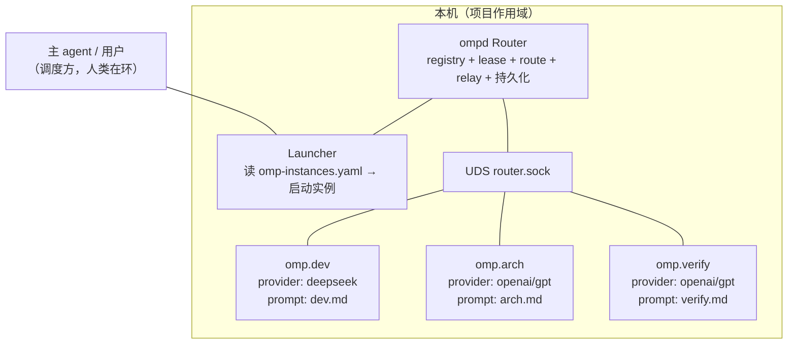
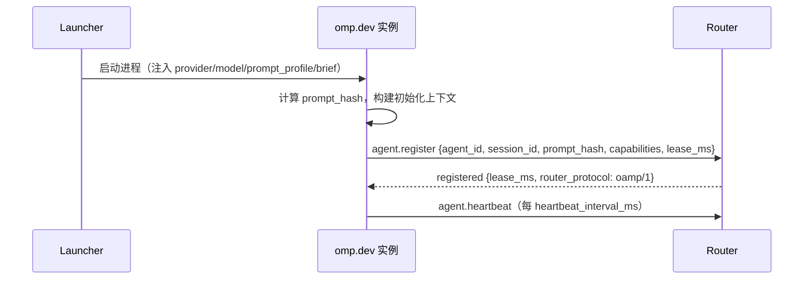
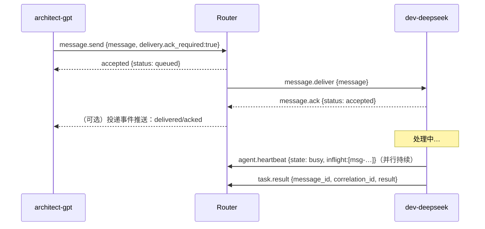
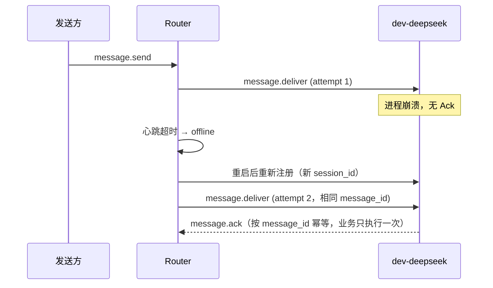

# 03 总体架构与生命周期

**版本**：0.2.0　**日期**：2026-09-09　**状态**：方案建议

## 1. 拓扑



要点（DS-03）：

- **星型**：agent 只连 Router，不互连、不暴露端口。发现、重试、安全校验只实现一份。
- Router 职责边界 = **注册 + 租约 + 路由 + 投递 + Ack/重试 + 持久化**；不持有 provider secret、不做 LLM 会话、不做业务判断、不替代 ACP 派发。
- Launcher 与 Router MVP 可同进程（`ompd` 一个进程内两条职责线），但配置与审计分开；未来 Launcher 可由主 agent 兼任（读配置 → 按 `model-dispatch-protocol` 解析 → 启动）。
- 项目作用域：一个业务项目一个 Router + 一组实例；跨项目不广播（01 §4-6）。

## 2. 组件职责

| 组件 | 职责 | 不做什么 |
|---|---|---|
| **ompd / Router** | 注册表（agent_id→session）、租约判定（suspect/offline）、按目标转发、投递状态机、NDJSON 持久化、限流/白名单 | 不读 provider 凭据；不解析 LLM 输出；不生成任务内容 |
| **Launcher** | 解析 `omp-instances.yaml`；调用 executor 能力检查与 fallback（复用 model-dispatch-protocol）；带 `prompt_profile` 环境启动进程 | 不把 Router 变 provider 代理；不静默换模型 |
| **OMP 实例（agent 节点）** | 注册、心跳、收 `message.deliver`、执行（LLM/工具/skill）、回报 Ack 与 `task.*` 消息 | 不修改自身初始化规则（除 reload）；不做隐式广播目标 |
| **主 agent / 调度方** | 定义实例拓扑（配置文件）、派发启动、按任务语义（如 workflow-pb 各阶段）编排谁给谁发什么 | 不绕过 Router 直连实例 |

## 3. 目录与运行布局

```text
.pb-agents/config/omp-instances.yaml      # 实例拓扑（业务项目可改；05 定义 schema）
.pb-agents/config/agent-routing.yaml      # 既有 model-dispatch-protocol 路由（不变）
.pb-agents/prompts/<instance-id>.md       # 实例初始化提示词（persona/规则）
.pb-agents/project/runtime/omp/router.sock
.pb-agents/project/runtime/omp/registry.ndjson    # 注册/心跳审计（append-only）
.pb-agents/project/runtime/omp/outbox.ndjson      # 未完成投递（可恢复）
.pb-agents/project/runtime/omp/<instance-id>/     # 实例运行记录（session、prompt_hash、收到消息日志）
```

持久化原则（承草案 §7.2）：MVP 用 **append-only NDJSON**（与现有 `.pb-agents/project/` 记录体系一致、可直接审计）；不保存完整 prompt/LLM 输出/secret；重启时从 outbox 恢复 `queued`/`delivered-unacked`。

## 4. 生命周期状态机

### 4.1 实例侧

```text
starting → registered → idle ⇄ busy
                         ├─ draining → stopped(正常)
                         └─ suspect → offline(崩溃/失联)
```

- `starting`：进程拉起，未注册。
- `registered`：注册成功，租约生效。
- `idle`：在线且无 in-flight 消息；`busy`：正在处理（心跳带 `inflight` 列表）。
- `draining`：收到停止/reload 指令，拒收新任务，消化 in-flight 后退出。
- `suspect`：Router 连续两个心跳周期未收到心跳；`offline`：超过 `heartbeat_timeout_ms`。
- 实例恢复后必须**重新注册（新 session_id）**；旧 session 不再收消息（DS-05）。

### 4.2 消息投递状态机（Router 侧，每条投递独立）

```text
queued → delivered → acked（终）
   │         │
   │         ├─ ack 超时 → 重试（相同 message_id，≤ max_attempts）
   │         │        └─ 超上限 → failed（终，记录）
   └─ expired（终，不投递）      rejected（终，目标拒绝并给错误码）
```

语义：**at-least-once**（DS-06）。`acked` 分 `accepted / started / completed / rejected / expired` 五态（04 §6.2）。

### 4.3 心跳与租约

- 注册时请求 `lease_ms`（默认 30000）；Router 授予租约并返回。
- 实例按 `heartbeat_interval_ms`（默认 10000）上报；心跳携带 `lease_id`、`state`、`inflight`。
- Router 续租判定：`last_heartbeat + lease_ms > now` 视为在线。
- 判定表：

| 观测 | 判定 | 动作 |
|---|---|---|
| 连续 2 个心跳周期无心跳 | `suspect` | 不再投递新消息；已 delivered-unacked 等待 |
| 超过 `heartbeat_timeout_ms`（默认 30000） | `offline` | 未 Ack 消息按策略重试或过期；广播成员剔除 |
| 收到旧 session_id 的消息/心跳 | 拒绝 | `STALE_SESSION` 错误 |

## 5. 关键时序

### 5.1 启动与注册



### 5.2 点对点消息 + Ack + 心跳并行



### 5.3 崩溃与重投



## 6. 可观测性

- 每条消息/投递/心跳记录：`message_id`、from/to、类型、状态、attempt、错误码、`trace_id`、时间戳 → registry/outbox NDJSON。
- `correlation_id` 串请求-响应链；`trace_id`（对齐 W3C Trace Context）串跨实例工作流，供未来接 OpenTelemetry。
- 日志默认**不记录**完整 prompt、token、LLM 输出、消息正文全文（可配 debug 级）。

## 7. 安全边界（DS-08；详见 04 §10）

1. UDS 文件权限 `0600`，仅项目运行用户可访问。
2. 注册身份校验：Router 只接受本地启动凭证（Launcher 生成的注册 token，经进程环境传递）或父进程凭证确认——不能只信注册包自报的 `agent_id`。
3. 消息正文、prompt、任务结果一律视为不可信输入；初始化规则只能被 `control.reload_prompt` 变更。
4. Router 施加限制：消息大小、TTL、`max_hops`、广播 fan-out 上限、单 agent 队列长度。
5. 跨机器阶段：TLS + 连接层 agent 身份（对齐 A2A Agent Card 签名方向），凭据仍不进协议。

## 8. 错误码总表（Router 面）

| 码 | 语义 | 发送方处理 |
|---|---|---|
| `AGENT_NOT_FOUND` | 目标 agent_id 不存在 | 不重试；先重新发现/注册 |
| `AGENT_OFFLINE` | 目标离线 | 按 delivery 策略排队或过期 |
| `STALE_SESSION` | 旧 session_id 上报 | 实例需重新注册 |
| `DUPLICATE_MESSAGE` | 同 message_id 已处理 | 返回已有状态，不重复执行 |
| `ROUTE_DENIED` | 路由不在白名单 | 失败并审计 |
| `MESSAGE_EXPIRED` | 超过 expires_at | 不投递 |
| `ACK_TIMEOUT` | 未按时 Ack | 有限重试，超限转 failed |
| `PROTOCOL_MISMATCH` | oamp 版本/能力不兼容 | 不重试，记录协商结果 |
| `PROVIDER_UNAVAILABLE` | 实例侧 provider 不可用 | **Router 不换 provider**，交现有 fallback/主 agent |
| `LIMIT_EXCEEDED` | 大小/fan-out/队列超限 | 失败并审计 |

区分铁律：**投递失败（Router/通信问题）与执行失败（实例已收到后 LLM/工具失败）分开记录**，前者走本表，后者是实例的 `task.result{failed}` 语义。
