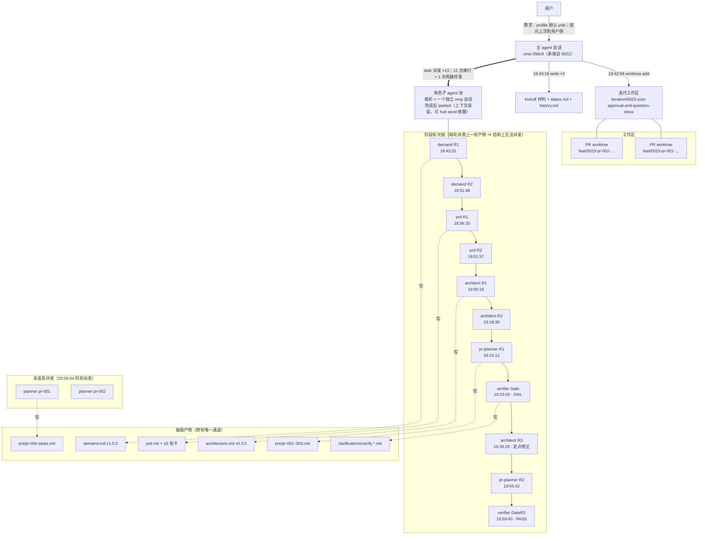
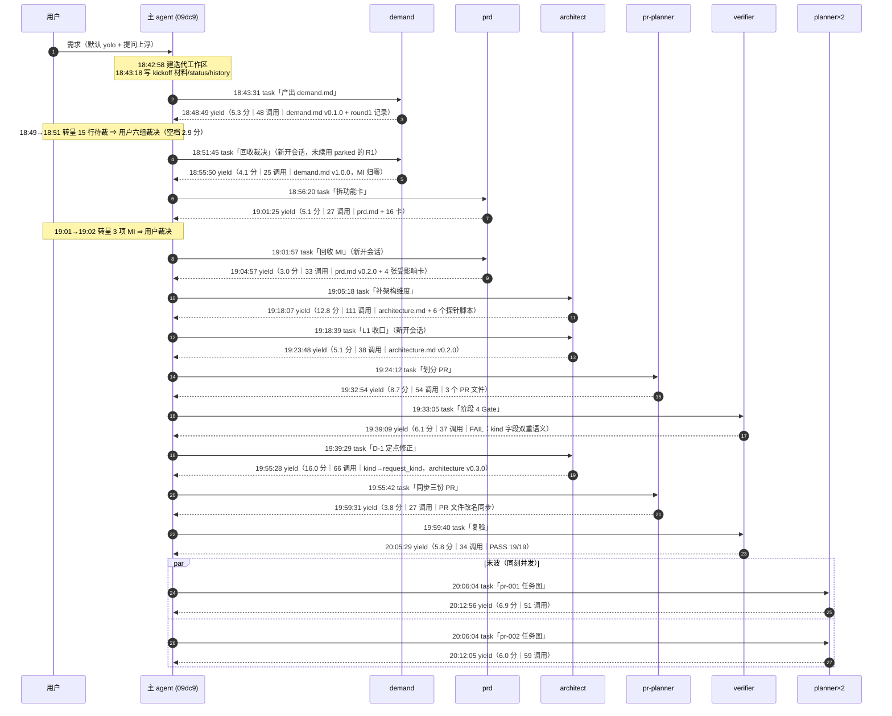

# 0023 迭代时间损耗深挖（逐轮剖面）

**观察对象**: `0023-yolo-approval-and-question-inbox`（workflow-pb v0.10.0，本地 sub agent 派发）
**观察时点**: 2026-09-14 20:14:16（阶段 5 首波 `{pr-001, pr-002}` 刚完成 planner，dev 尚未派发）
**粒度**: 到「每一次模型调用」——数据源为 `~/.omp/agent/sessions/-projects-agents/**` 的 omp 会话流水，其中每条 assistant 消息自带 `duration` / `ttft` / `usage` / `completedAt`，`custom.tool_execution_start` 自带 `startedAt`
**配套**: 上一份跨迭代报告 `docs/iteration-time-analysis.md`（0009–0022）

---

0023 的阶段 1–4（含首波 planner）用了 **90.0 分钟挂钟**（`18:42:58` 建迭代工作区 → `20:12:56` 首波 planner 收尾），其中 **92% 的时间确实有子 agent 在推理**——这次**没有死区问题**（对比 0021 的 67%、0022 的 53%）。时间全部消耗在 **"模型推理时长 × 派发轮次数"** 上：

- 13 个阶段轮次的挂钟合计 **88.7 分钟**，其中 **模型推理 87.3 分钟（98.4%）**、工具执行 **1.4 分钟（1.6%）**；
- 这 13 轮共 **610 次模型调用、855 次工具调用、96.7 万输出 token、$0.788**；
- 每一轮都有 **一半的模型调用、四成的模型时长花在"产出第一个文件之前"**（51% 的轮数 / 42% 的时长，逐轮拆解见 §7）；
- 逐 agent 的唤醒/执行/parked 时序见 §9（时间轴、时序图、拓扑图、明细表）。

> **一处已纠正的错误（2026-09-14 20:4x）**：本节早前版本把 `18:34:18` 的 4 路 scout 当作"0023 的前置侦察"，从而算出窗口 98.6 分钟、算力 121.1 分钟。核对会话首条 user 消息后确认：**那个会话（`2026-09-14T10-33-32`）的首条指令是「请分析已有的项目，给我一些项目架构优化建议，禁止直接动手改」——它是用户另开的一次项目架构评审，与本迭代无关**。0023 自身的前置只有 `18:42:58` 建工作区 + `18:43:18` 写 kickoff 材料（3 个文件）与一个 oamp 探针。90.0 分钟、88.7 分钟等口径以下文为准。

**结论：优化"跑得快"是伪命题（工具时间可忽略），唯一有效杠杆是"减少轮次"与"缩小每轮上下文"。**

---

## 1. 逐轮剖面（13 次派发）

| 轮次 | 派发时刻 | 挂钟(分) | 模型(分) | 模型调用 | 工具调用 | 首个产出前 | 输出tok | 成本$ | 释放尾(分) |
|---|---|---|---|---|---|---|---|---|---|
| Demand0023R1 | 18:43:31 | 5.3 | 5.3 | 48 | 67 | 74% | 60,911 | 0.0559 | 7.0 |
| Demand0023R2 | 18:51:46 | 4.1 | 4.1 | 25 | 43 | 73% | 56,229 | 0.0385 | 7.0 |
| Prd0023R1 | 18:56:20 | 5.1 | 5.1 | 27 | 46 | 54% | 69,492 | 0.0431 | 7.0 |
| Prd0023R2 | 19:01:57 | 3.0 | 3.0 | 33 | 41 | 35% | 39,098 | 0.0352 | 7.0 |
| **Architect0023R1** | 19:05:18 | **12.8** | 11.8 | **111** | **135** | 22% | 124,714 | 0.1279 | 7.0 |
| Architect0023R2 | 19:18:39 | 5.1 | 5.1 | 38 | 53 | 43% | 67,801 | 0.0473 | 7.0 |
| PrPlanner0023R1 | 19:24:12 | 8.7 | 8.7 | 54 | 101 | 66% | 100,169 | 0.0943 | 7.0 |
| Verify0023Gate | 19:33:05 | 6.1 | 6.1 | 37 | 51 | 92% | 70,974 | 0.0493 | 7.0 |
| **Architect0023R3** | 19:39:29 | **16.0** | **15.9** | 66 | 79 | 18% | 87,437 | 0.0683 | 7.0 |
| PrPlanner0023R2 | 19:55:42 | 3.8 | 3.8 | 27 | 34 | 47% | 55,305 | 0.0371 | 7.0 |
| Verify0023GateR2 | 19:59:40 | 5.8 | 5.8 | 34 | 48 | 97% | 70,960 | 0.0478 | 7.0 |
| Plan0023Pr002 | 20:06:04 | 6.0 | 5.9 | 59 | 83 | 70% | 72,459 | 0.0719 | — |
| Plan0023Pr001 | 20:06:04 | 6.9 | 6.8 | 51 | 74 | 79% | 91,429 | 0.0710 | — |
| **合计** | — | **88.7** | **87.3** | **610** | **855** | — | **966,978** | **0.788** | 77.0 |

口径说明：
- **挂钟** = 会话首个事件 → `yield`（不含 `session_exit` 释放尾）。
- **模型** = 各 assistant 消息 `duration` 之和（毫秒精度，等于 `completedAt − timestamp`）。
- **首个产出前** = 会话开始到第一次 `write`/`edit` 工具调用之间的时间占比。
- **释放尾** = `yield` 到 `session_exit(dispose)` 的固定 7.0 分钟。

---

## 2. 账目闭合：这 90 分钟去哪了

窗口 `18:42:58`（`git worktree add` 建迭代工作区）→ `20:12:56`（最后一次 planner 产出）：

| 项 | 数值 | 占比 |
|---|---|---|
| 窗口挂钟 | 90.0 分钟 | 100% |
| 子 agent 覆盖（有子 agent 在跑） | 82.7 分钟 | **92%** |
| 空档（11 段，最大 2.9 分钟 = 等用户裁决） | 7.3 分钟 | 8.1% |
| 主 agent 自身模型时间（与子 agent 并行） | 7.0 分钟 | 7.8%（并行，不占关键路径） |
| **子 agent 挂钟合计** | **88.7 分钟** | — |
| ├ 模型推理 | 87.3 分钟 | **98.4%** |
| └ 工具执行 | **1.4 分钟** | **1.6%** |
| 平均并发（活跃期） | **1.06** | — |
| 最大并发 | **2**（20:06 同刻派发的两路 planner） | — |

**三个直接读数**：

1. **工具执行可以忽略**：855 次工具调用（read 305 / bash 227 / edit 117 / grep 104 / write 43 …）合计只花 1.4 分钟。因为都是本地文件操作，单次 0.1–0.5 秒。
2. **主 agent 不是瓶颈**：它的调度间隔（子 agent `yield` → 下一次 `task` 派发）稳定在 **9 秒 ~ 2.9 分钟**，11 段合计 7.3 分钟；最大的一段是 demand R1 报告后等用户裁决（2.9 分钟）。
3. **串行是结构性的**：13 轮里只有最后一次（两路 planner）真并发，平均并发 1.06 —— 每一轮都要消费上一轮的产物（R2 读 R1 的 `demand.md`、prd 读 `demand.md`、architect 读 16 张卡、pr-planner 读 architecture…），**在阶段内做并发在信息上不可能**。

---

## 3. 五个具体损耗点（均有证据）

### A. 轮次数：11 轮做完 4 个阶段，其中 4 轮是"用户裁决回收轮"

| 阶段 | 轮次 | 拆分原因 |
|---|---|---|
| 1 需求收敛 | demand R1 + R2 | R1 产出 13 项 `[model_inferred]` + 11 条边界 ⇒ 转呈用户 ⇒ R2 回收 |
| 2 功能规格 | prd R1 + R2 | R1 产出 3 项 MI ⇒ 转呈 ⇒ R2 回收 |
| 3 技术架构 | architect R1 + R2 | R1 产出 L1 决策 ⇒ 转呈 ⇒ R2 收口 |
| 4 PR 规划 | pr-planner R1 + **R2** + Gate **R2** | Gate 首轮 **FAIL**（`kind` 字段双重语义）⇒ architect R3 改名 ⇒ pr-planner R2 同步 ⇒ Gate R2 复验 |
| （阶段 4 内） | architect **R3** | 同上（Gate D-1 定点修正） |

- **4 个"用户裁决回收轮"**（demand R2 / prd R2 / architect R2 / 部分 pr-planner R2）是**工作流自造的**：R1 的性质是"提案"，R2 才是"落地"，而 R1 结束时父级已经拿到全部输入，本可以把裁决直接作为 R1 的输入（用户在场时回答只要 1–3 分钟）。
- 单轮成本 ≈ `88.7 / 13 ≈ 6.8 分钟`。**省掉 3 个回收轮 ≈ 省 20 分钟（窗口的 22%）**。

### B. 每轮一半的调用在"重新定位"，而非产出

| 角色类型 | 首个 `write`/`edit` 之前的挂钟占比 | 前置轮数占比 |
|---|---|---|
| demand R1 / R2 | 74% / 73% | 79% / 68% |
| prd R1 / R2 | 54% / 35% | 37% / 36% |
| pr-planner R1 / R2 | 66% / 47% | 56% / 44% |
| planner（首波两路） | 70% / 79% | 49% / 53% |
| architect R1 / R2 / R3 | 22% / 43% / 18% | 38% / 34% / 33% |
| verifier Gate / GateR2 | 92% / 97% | 81% / 91% |

> 上表是**逐轮**比例（简单平均后约 53%，早前版本引用的就是这个数）；按 13 轮总量算是 **313/610 = 51% 的模型调用次数、36.9/87.3 = 42% 的模型时长**——两个数不同是因为前置轮更短（均值 7.1 秒/轮）、产出轮更长（10.2 秒/轮）。**「一半的调用花在产出之前」是更准确的说法**，成因逐条拆解见 §7。

- 写文档型角色（demand/prd/planner）**一半以上的调用在读**：读注入的角色定义全文 → 读 `workflow-pb.md` → 读上游产物 → grep 代码库 → 才动笔。
- verifier 的 81–91% 是它的性质（读完才写报告），但**读的对象完全一样**：同一份角色定义、同一份工作流规范，每个轮次都重读一遍。
- 证据：Demand R1 前 35 次工具调用全是 `read`/`grep`/`bash`，第一次 `write` 发生在派发后 3.9 分钟（该轮共 5.3 分钟）。

### C. 上下文规模：每轮 152k token

- 13 轮合计 **cacheRead 92M token / 610 次模型调用 = 每轮约 152k token 上下文**。
- 简报本身只有 2.2k–4.2k 字符（含角色定义全文注入），但子 agent 读完输入产物 + 代码库后，上下文迅速膨胀。
- 单轮成本直接与上下文规模挂钩：Architect R1（135 次工具调用、124k 输出 token）单轮成本 $0.128，是 demand R2（$0.038）的 3.4 倍。
- 阶段 1–4 合计成本 **$0.788**。

### D. 一次 Gate FAIL 的账：26 分钟模型时间 / 40 分钟挂钟

Gate 首轮判定 FAIL，触发链：`Architect R3`（16.0 分钟）→ `PrPlanner R2`（3.8 分钟）→ `Verify GateR2`（5.8 分钟），加上主 agent 的调度间隔与用户裁决等待。

| 项 | 模型时间 | 挂钟 |
|---|---|---|
| 失败本身（Architect R3） | 15.9 分钟 | 16.0 分钟 |
| 连带的 pr-planner 同步 | 3.8 分钟 | 3.8 分钟 |
| 复验 | 5.8 分钟 | 5.8 分钟 |
| **合计** | **25.5 分钟（窗口的 28%）** | **25.6 分钟** |

诱因：`kind` 字段在信封里承担了双重语义（信封类别 vs 决策类型）。这是一个**在阶段 3 就能自检的命名冲突**——如果 architect 的自检清单里有"字段语义唯一性/逐 key 不相交"这一条，这 25 分钟不会发生。

### E. 记录层仍然失真：`history.md` 的时间戳是推算的

0023 的 `history.md` 记录 33 条事件。把"派发"记录与真实的 `task` 调用时刻对齐：

| history 记录 | 真实派发时刻 | 偏差 |
|---|---|---|
| 18:43:00 派发 demand | 18:43:31 | −31 秒 |
| 18:58:30 派发 prd | 18:56:20 | **+2.2 分** |
| 19:11:00 派发 architect | 19:05:18 | **+5.7 分** |
| 19:26:30 派发 architect (R2) | 19:18:39 | **+7.9 分** |
| 19:44:30 派发 verifier | 19:33:05 | **+11.4 分** |
| 19:51:30 派发 architect (R3) | 19:39:29 | **+12.0 分** |
| 20:16:00 派发 verifier (R2) | 19:59:40 | **+16.3 分** |
| 20:24:00 派发 planner ×2 | 20:06:04 | **+17.9 分** |

- 真实跨度 82.5 分钟被记成 101 分钟——**累计高估 18 分钟（22%）**，且偏差单调递增。
- 方向与 0021 相反（0021 是长空转被吞掉、记录落后 5.2 小时），但**根因同一个**：时间戳由会话内推算填写，而非实测读取。`history.md` 里因此还出现了"收到报告 demand 18:57"早于真实结束时刻的记录。

---

## 4. 反面样本：本迭代只有一处真并发

**首波 planner 2 路并发**（20:06:04 同刻派发 `Plan0023Pr001` / `Plan0023Pr002`）：算力 12.7 分钟、挂钟 6.9 分钟，约 **1.9× 压缩**。

- 两个单元分别写 `prs/pr-001-tasks.md` 与 `prs/pr-002-tasks.md`，**彼此不消费对方产物**——这是它能并发的唯一原因。
- 阶段 1–4 的 11 轮里，每一轮都在消费上一轮的产物（R2 读 R1、prd 读 demand、architect 读 16 张卡、pr-planner 读 architecture、Gate 读 `prs/` + architecture），**在信息上就不可能并发**——这是平均并发 1.06 的全部解释。

> **本迭代之外的真实先例**（同一工作流里做过，可直接复用）：0012 阶段 1 的 3 路并发侦察（`ScoutOampStartup` / `ScoutRolesInventory` / `ScoutOmpRoleInjection` 同刻 11:06 派发）、0018 的 `Planner018Pr005` 3 路并发 scout（`.ScoutImpl` / `.ScoutDocs` / `.ScoutHarness` 同刻 00:31:30）。两者都是"输入收集"型任务，与这里的两路 planner 同理。

---

## 5. 对上一份报告的两处修正

1. **0022 被截断（重要）**：上一份报告在 17:03 取样，漏掉了 0022 的最后一波。补记如下：

| 补记派发 | 时刻 | 挂钟 | 算力 |
|---|---|---|---|
| DevPr003 | 17:04 → 18:08 | 64.4 分 | 64.4 分 |
| VerifyPr003 | 18:02 → 18:16 | 14.1 分 | 14.1 分 |
| VerifyStage6 | 18:10 → 18:29 | 18.6 分 | 18.6 分 |
| ProgressObserver3 | 18:10 → 18:20 | 9.6 分 | 9.6 分 |

⇒ **0022 的 Σengaged 从 6.23 h 修正为 ≈ 8.0 h**；挂钟从 6.24 h 修正为 **10:40 → 18:43 = 8.05 h**（收尾段 17:03→18:43 的 84 分钟里，主 agent 只有 6.7 分钟模型时间，其余是空档——0022 的尾部仍然是死区问题）。
2. **0023 的"启动 21 分钟"要拆开**：18:22–18:33 属于 **0022 的收尾**（全量 361/361 测试 + 合并 main + 台账）；18:33–18:38 是**另一个与本迭代无关的会话**（用户另开、要求"分析项目给架构优化建议"，4 路 scout）；0023 自己的前置只有 `18:42:58` 建工作区 + `18:43:18` 写 kickoff 材料（3 个文件）与一个 oamp 探针。0023 自身窗口因此是 **90.0 分钟**。

---

## 6. 可执行项（针对 0023 暴露的具体损耗）

| # | 动作 | 依据 | 预期收益 |
|---|---|---|---|
| 1 | **取消"用户裁决回收轮"**：R1 结束时不结束派发，把用户裁决作为同一会话的后续消息注入（同一 session 续跑），或把裁决采集提前到派发之前 | §3-A：4 个回收轮，单轮 6.8 分钟 | 省 3 轮 ≈ **20 分钟 / 迭代（窗口的 22%）** |
| 2 | **上游自检补一条"字段语义唯一性"**：阶段 3 的 architect 交付前自查"同一字段是否承载两种语义、逐 key 是否不相交" | §3-D：一次 Gate FAIL = 25.5 分钟模型 | 省 **25 分钟**（若命中） |
| 3 | **重做简报内容**：不再全文注入角色定义（agent 反正会自己读一遍），改为携带「**工作现场包**」——上游产物摘要 + 已探明事实 + 代码锚点（文件:行区间） | §7.2-②：角色文件被 8/13 轮重复读、`workflow-pb.md` 6/13 轮；§7.1：前置读入 2.51 MB | 省 **18 + 8~10 分钟**（见 §7.4） |
| 4 | **把"输入收集型任务并发"写进文档路径协议**：阶段 1–4 的输入收集统一走"N 路 scout 并发 → 汇总成起点材料" | §4：本迭代两路 planner 1.9×；0012 / 0018 各有 3 路 scout 并发先例 | 输入收集的挂钟降至 **1/2 ~ 1/3** |
| 5 | **`history.md` 时间戳改实测**（与上一份报告 §8-1 同一条，此处再次被证实） | §3-E：0023 高估 18 分钟（22%） | 让后续所有度量可信 |
| 6 | **修正并发配置的表述**：阶段 1–4 实际并发上限 = 1（每轮消费上一轮）；`status.md` 的"起始并发 3 / 硬上限 5"只对阶段 5 有意义 | §2：平均并发 1.06 | 消除"并发未生效"的误判 |

---

## 7. 为什么"一半的调用发生在产出之前"——前置阶段拆解

### 7.1 前置阶段到底读进来了什么（13 轮合计 2.51 MB）

| 来源 | 字节 | 占前置读入 |
|---|---|---|
| 工作区探测（`ls` / `du` / `wc` 输出 + 工作区非 `oamp`、非 `docs` 文件） | 637 KB | 25% |
| 代码库 `oamp/` | 462 KB | 18% |
| 上游产物（索引类：`prd.md` 之外的 `docs/iterations/0023/**`） | 349 KB | 14% |
| **角色定义 + `workflow-pb.md`** | **207 KB** | **8%** |
| 澄清记录与探针证据 | 145 KB | 6% |
| 其他（含 `omp://` 内部文档） | 127 KB | 5% |
| `architecture.md` | 117 KB | 5% |
| `prd/` 16 张卡 | 107 KB | 4% |
| `prd.md` | 98 KB | 4% |
| `prs/` | 97 KB | 4% |
| `demand.md` | 76 KB | 3% |
| **`@oh-my-pi/pi-coding-agent` 安装包源码** | **70 KB** | **3%** |
| `eval` 探针 | 15 KB | 1% |
| **合计** | **2.51 MB** | 100% |

对比：**产出之后**（`write`/`edit` 之后的全部读取）只有 **0.55 MB**。也就是说，**82% 的读入发生在动笔之前**。
顺带一提，最大的几次读入是：`grep` 全仓扫描 32 KB / 30 KB / 26 KB、整读 `demand.md` 或 `architecture.md` 23–29 KB、以及**读上一迭代（0022）的 `prd.md` 与 `prs/` 共 51 KB**。

### 7.2 五条成因（按可归因的量级排序）

**① 子 agent 无状态：上一轮的"已读 / 已知"随会话消失。**
每次派发都是全新 omp 会话，磁盘上只留下产物文件。于是每一轮必须**从零重建世界模型**才能动笔——重建成本 ≈ 工作现场的体积（2.5 MB），与"这一轮新增了多少工作量"无关。
直接证据：R2 轮本来只做增量回收（读裁决 + 改几处），前置读入仍有 94–145 KB、前置时长 0.7–2.0 分钟——**它在重建 R1 的世界**。

**② 简报只注入"角色"，不注入"现场"。**
`workflow-pb.md` §派发执行角色时的 brief 构建 要求注入的是**角色定义全文**，其余全是路径（工作区地址、输入路径、完成定义）。子 agent 于是只能自己读上游产物、代码库、外部包。
更直接的一处浪费：**角色文件被 8/13 轮重新 `read` 了一遍**——而它的全文已经在简报里；`workflow-pb.md`（74 KB）被 6/13 轮重读。合计 207 KB 的固定材料，每一轮都重走一遍。

**③ 上游产物体量随阶段线性增长，下游必须通读。**
`demand.md` 52 KB → `prd.md` 45 KB + 16 张卡 → `architecture.md` 93 KB → 4 份侦察纪要。角色的行为约束（"绝不基于假设实现"）要求它在写之前把上游读透，于是**最后一个阶段的输入 = 前三个阶段产物的并集**。

**④ 事实没有落盘载体，只能重复探明。**
omp 安装包源码被访问 **35 次**（`Demand0023R1` 22 次 + `Architect0023R1` 13 次）：`ask` 工具在 RPC 下是否注册、`askDialog` 的帧形状、信封字段——这些是运行时事实，既不在上游产物里，也不在任何"项目上下文"里，只存在于当轮报告的正文中，于是后一轮重新探一遍。

**⑤ 跨轮重复读同一批文件。**
前置阶段共访问 290 条不同路径，其中 **71 条被 ≥2 个轮次访问**：`architecture.md` 9 次、`workflow-pb.md` 10 次、`prd.md` 5 次、`demand.md` 4 次、`prd/` 卡共 50 次、外部包 21 次。这是 ① 的必然结果，但它是可消除的那一部分。

### 7.3 一个被数据推翻的假设

"上下文越大 → 每轮越慢"**不成立**：把 610 次调用的上下文规模（`input + cacheRead`）与单轮时长做相关，**Pearson r = −0.06**（分桶中位数：20–60k 段 2.0 秒、140–180k 段 4.7 秒、180k+ 段 3.9 秒，无单调关系）。

⇒ 前置阶段的成本来自 **轮数多**（51% 的调用次数），而不是"每轮被上下文拖慢"。这决定了优化方向：**要减少的是"轮数 × 读取量"，不是"提速单轮"**。

### 7.4 按本迭代数据估算的可省量

| 动作 | 依据 | 估算收益 |
|---|---|---|
| 简报携带**「工作现场包」**：上游产物摘要 + 已探明事实（K1–K12 这类）+ 代码锚点（文件:行区间），取代"读原始全文" | §7.1：上游产物 + 代码库 + 澄清 = 1.03 MB / 13 轮 ≈ 81 KB/轮，可压到 20–30 KB | 前置时长可望减半 ≈ **省 18 分钟**（本窗口 18%） |
| **不再重读角色定义 / `workflow-pb.md`**（简报已注入） | §7.2-②：207 KB / 13 轮，8 轮 + 6 轮重复 | 省约 **8–10 分钟** 的读入与轮数 |
| **已探明事实落盘**（`clarifications/facts/*.md`，下游简报直接携带） | §7.2-④：omp 包 35 次访问里 13 次是重复探 | 省 architect R1 的 13 次探测 ≈ **3–5 分钟** |
| 上游产物提供**"下游视角摘要"**（demand/prd/architecture 各附 1 页结论 + 锚点） | §7.2-③：下游对上游是"并集读取" | 减少 20–30 KB/轮 |

---

## 8. 能不能让同一角色复用上下文？（同名 agent 续跑）

### 8.1 机制本来就存在，而且工作流自己用过

每次 `task` 派发返回的信封里就写着可寻址的 agent 名：

```
Spawned agent `Demand0023R1` (job `Demand0023R1`). … DM `Demand0023R1` via `hub` send …
Job IDs: process memory ~5min after settlement; afterward use agent ID: `hub send`, `agent://<id>`, `history://<id>`
```

名字由 harness 依据任务内容生成（不需要父级指定，也可通过 `tasks[].name` 指定稳定标识），**且子 agent 完成后是 parked，不是销毁**——`hub send` 可以把它唤醒继续跑。工作流历史上正是这么用的：

| 迭代 | `task` 派发 | `hub send` | 独立收件人 |
|---|---|---|---|
| 0011–0016 | 121 | **92** | 51 |
| 0017 | 22 | 1 | 1 |
| 0018–0020 | 57 | 31 | 13 |
| 0021（本地 sub agent） | 26 | 1 | 1 |
| **0022** | 24 | 5 | 3 |
| **0023** | **13**（含 1 次 4 路并发侦察） | **0** | **0** |

0011 的 92 次 `hub send` 里，相当一部分就是"同一角色的第 2 轮"——例如：

- `DemandStage1` ← "主 agent 已把 P-01~P-09 转交用户，全部得到真实用户确认…请定稿 demand.md 至 v0.2.0"
- `PrdStage2` ← "M-01~M-03 三条全部 user_confirmed…"
- `Architect0011Stage3` 被 send 8 次、`PrPlanner0012Stage4` 被 send 7 次

**上下文确实保留**（一手证据）：`Prd0011Stage2` 在 `13:09` park、`17:53` 被唤醒，唤醒后第一轮 `usage = input 62,527 + cacheRead 30,080`（≈92k 上下文在场），此后每轮 92–93k —— 不是从零开始。

0022 也还在用：`DevPr005` 被中断后由 `hub send` 恢复，`DemandStage1R2` 由 `hub send` 补发简报契约字段。
**0023 一次都没用**：37 次 `task` 全部不传 `name`，也不对已 parked 的上一轮 agent 做 `hub send`，每轮都是全新会话。

### 8.2 但它能省的没有想象中多（0023 实测）

能改成"续跑"的只有**同角色、同阶段、上一轮已 parked** 的那些轮次，逐个量它们的前置成本：

| 可续跑轮次 | 前置模型时长 | 该轮总时长 |
|---|---|---|
| Demand R2 ← Demand R1（parked 18:48:49，R2 却新开了会话） | 1.6 分 | 4.1 分 |
| Prd R2 ← Prd R1（parked 19:01:25，32 秒后新开） | 0.7 分 | 3.0 分 |
| Architect R2 ← Architect R1（parked 19:18:07，32 秒后新开） | 2.0 分 | 5.1 分 |
| Architect R3 ← Architect R2 | 2.7 分 | 16.0 分 |
| PrPlanner R2 ← PrPlanner R1 | 1.2 分 | 3.8 分 |
| （单列）Verify GateR2 ← Gate（独立性有争议，见 8.3） | 4.4 分 | 5.8 分 |
| **合计（不含复验）** | **8.2 分** | 32.0 分 |

按"可避免 60%"保守估计 ⇒ **省 ≈5 分钟（窗口的 5%）**；把复验也算上 ⇒ **≈8 分钟（8%）**。

原因很简单：**前置阶段总成本 36.9 分钟里，24.3 分钟在首轮**（Demand R1 3.1 / Prd R1 1.3 / Architect R1 2.6 / PrPlanner R1 5.3 / Gate 4.8 / 两路 planner 7.3）——首轮没有"上一轮上下文"可复用，续跑帮不上它。

### 8.3 哪些地方**不该**续跑（设计约束，不是技术障碍）

1. **verifier 的首次验收**：`workflow-pb` 阶段 6 明确"不接收执行过程上下文"。若把 Gate 首轮改成续跑上一轮 architect 的会话，它的 PASS 就不再是独立证据。**复验**（改完再验）可以续跑，但报告里必须声明"这是复验、不是独立验证"——否则会削弱 0021 那种"Gate R2 PASS 作为合并前置证据"的效力。这是真实权衡，不是纯技术选择。
2. **跨角色共享上下文**：architect 若继承 demand 的会话，上游未裁决的 `[model_inferred]` 假设、被驳回的提案会顺着上下文污染下游判断。0021 的 hub 模式里"同一对话、各角色仍各自持有独立上下文"（上下文池键 = `chat_id + agent_id`）正是为此设计的隔离；**不要把"同对话"误读成"共享上下文"**。
3. **PR 之间的 dev**：各写各的 worktree，共享上下文会串味（且 worktree 隔离本来就是这套流程的核心约束）。

### 8.4 结论：两个方向互补，不是替代

| 方向 | 覆盖的轮次 | 0023 估算收益 | 风险 |
|---|---|---|---|
| **同名 agent 续跑**（本节的方案） | 只有 R2/R3 类轮次（8.2 分钟） | **5%（含复验 8%）** | 低（但 verifier 需分首次/复验） |
| **简报携带现场包**（§7.4） | **所有轮次**，含首轮（36.9 分钟） | **18%** | 低（改简报内容，不改派发机制） |

⇒ **该做，但它是第二优先级**。首轮的前置成本占三分之二，而那部分只能靠"简报带现场"消掉。

### 8.5 落地形态

1. workflow-pb §派发执行角色时的 brief 构建 增加一条：
   > **同角色同阶段的第 N 轮（N≥2）默认续跑**：不新开 `task`，改用 `hub send` 唤醒上一轮已 parked 的 agent，简报内容只带**增量**（用户裁决、Gate 偏差、要改的锚点）；派发记录里标注「续跑，复用 <agent 名> 的上下文」。
2. `task` 的 `tasks[].name` 显式传**稳定名**（如 `0023-demand`），父级保留该名字用于后续 `hub send`（当前 100% 不传，名字是 harness 自动生成的，虽然也能用，但不可预测）。
3. **例外清单**（写进契约，避免误用）：verifier 首次验收、跨 PR 的 dev、任何以"独立视角"为价值来源的派发。
4. 现场包用 `local://` 文件承载（避免大段文本重复注入简报）。

---

## 9. 0023 执行时序与拓扑（逐 agent 实测）

口径：**唤醒** = `task` 调用时刻（与子 agent 会话首事件逐秒吻合）；**yield** = 最后一个工作事件（此后进入 parked）；**dispose** = `session_exit`（通常为 yield + 7.0 分钟——空闲释放定时器；被父级显式收集时在 yield 当场释放，见 §9.5 第 1 条）。

### 9.1 拓扑结构图



### 9.2 时序图（真实时刻与耗时）



### 9.3 甘特图（挂钟，含 parked 尾巴）

```mermaid
gantt
    title 0023 阶段 1–4 真实时序（2026-09-14）
    dateFormat HH:mm
    axisFormat %H:%M
    section demand
    R1 执行 5.3m            :d1, 18:43, 5m
    R1 parked               :done, d1p, 18:48, 7m
    R2 执行 4.1m            :d2, 18:51, 5m
    R2 parked               :done, d2p, 18:56, 7m
    section prd
    R1 执行 5.1m            :p1, 18:56, 6m
    R1 parked               :done, p1p, 19:01, 7m
    R2 执行 3.0m            :p2, 19:01, 4m
    R2 parked               :done, p2p, 19:05, 7m
    section architect
    R1 执行 12.8m           :a1, 19:05, 13m
    R1 parked               :done, a1p, 19:18, 7m
    R2 执行 5.1m            :a2, 19:18, 6m
    R2 parked               :done, a2p, 19:24, 7m
    R3 执行 16.0m           :a3, 19:39, 16m
    R3 parked               :done, a3p, 19:55, 7m
    section pr-planner / verifier
    R1 执行 8.7m            :r1, 19:24, 9m
    Gate 首轮 FAIL 6.1m     :crit, v1, 19:33, 6m
    R2 同步 3.8m            :r2, 19:55, 4m
    Gate 复验 PASS 5.8m     :v2, 19:59, 6m
    section planner（并发）
    pr-001 任务图 6.9m      :l1, 20:06, 7m
    pr-002 任务图 6.0m      :l2, 20:06, 6m
```



### 9.4 终端可读泳道（每格 1 分钟）

```text
                      18:30                         19:00                         19:30                         20:00
                      |                             |                             |                             |
Demand0023R1          ·············█████░░░░░░░░················································································· 5.3m
Demand0023R2          ·····················████░░░░░░░░·········································································· 4.1m
Prd0023R1             ··························█████░░░░░░░░···································································· 5.1m
Prd0023R2             ·······························███░░░░░░░░································································· 3.0m
Architect0023R1       ···································█████████████░░░░░░░░··················································· 12.8m
Architect0023R2       ················································█████░░░░░░░░·············································· 5.1m
PrPlanner0023R1       ······················································████████░░░░░░░░····································· 8.7m
Verify0023Gate        ·······························································██████░░░░░░░░······························ 6.1m
Architect0023R3       ·····································································████████████████░░░░░░░░·············· 16.0m
PrPlanner0023R2       ·····················································································████░░░░░░░░·········· 3.8m
Verify0023GateR2      ·························································································██████░░░░░░░░···· 5.8m
Plan0023Pr002         ································································································██████░░░░░ 6.0m
Plan0023Pr001         ································································································██████░░░░░ 6.9m
MAIN model calls      ·▪▪····▪·▪▪·▪▪▪▪▪▪▪▪▪▪···▪▪····▪▪··▪············▪····▪▪········▪·····▪··············▪▪···▪·····▪▪·····▪▪▪··
OTHER session         ···▒▒▒▒▒···································································································
```

图例：`█` 子 agent 推理中（墙钟 ≈ 模型时长）｜`░` parked 等待释放（恒约 7 分钟，与后续工作重叠）｜`▪` 主 agent 有模型调用｜`▒` 非本迭代会话（用户另开的架构评审）。
**读图要点**：13 条泳道首尾相接、几乎零重叠——这就是"平均并发 1.06"的直观形态；唯一的并行是最后两条 `Plan0023Pr001/002`。

### 9.5 逐 agent 明细表

| # | agent | 唤醒 | yield | dispose | 挂钟 | 模型 | 调用 | 工具 | 输出 tok | 成本 | 前置 | 干了什么 / 产物 |
|---|---|---|---|---|---|---|---|---|---|---|---|---|
| 1 | demand R1 | 18:43:31 | 18:48:49 | 18:55:49 | 5.3m | 5.3m | 48 | 67 | 60,911 | $0.0559 | 3.9m | 复核起点 13 条事实 + 六维诊断；`demand.md v0.1.0`（254 行）+ `round1 记录`（290 行）；13 项 MI + 11 条边界待裁 |
| 2 | demand R2 | 18:51:46 | 18:55:50 | 19:02:50 | 4.1m | 4.1m | 25 | 43 | 56,229 | $0.0385 | 3.0m | 回收六组用户裁决 ⇒ `demand.md v1.0.0`（297 行），`model_inferred` 归零 |
| 3 | prd R1 | 18:56:20 | 19:01:25 | 19:08:25 | 5.1m | 5.1m | 27 | 46 | 69,492 | $0.0431 | 2.7m | 拆 16 张卡（F01–F16）+ `prd.md` 索引；3 项 MI 待裁 |
| 4 | prd R2 | 19:01:57 | 19:04:57 | 19:11:57 | 3.0m | 3.0m | 33 | 41 | 39,098 | $0.0352 | 1.0m | 回收 3 项 MI ⇒ `prd.md v0.2.0` + F02/F03/F05/F07 四张卡 |
| 5 | architect R1 | 19:05:18 | 19:18:07 | 19:25:07 | 12.8m | 11.8m | 111 | 135 | 124,714 | $0.1279 | 2.8m | 补 T-01~T-08 架构维度 + 6 个探针脚本（`probe-a2/r2/r2b/r3/r3b/r4`）+ `architecture.md` |
| 6 | architect R2 | 19:18:39 | 19:23:48 | 19:30:48 | 5.1m | 5.1m | 38 | 53 | 67,801 | $0.0473 | 2.2m | L1 裁决收口 ⇒ `architecture.md v0.2.0` |
| 7 | pr-planner R1 | 19:24:12 | 19:32:54 | 19:39:54 | 8.7m | 8.7m | 54 | 101 | 100,169 | $0.0943 | 5.8m | 划分 3 个 PR（pr-001/002/003）+ 依赖图 + 规划报告 |
| 8 | verifier Gate | 19:33:05 | 19:39:09 | 19:46:09 | 6.1m | 6.1m | 37 | 51 | 70,974 | $0.0493 | 5.6m | 阶段 4 Gate 首轮 ⇒ **FAIL**（`kind` 双重语义 + 两 PR 独立性）；`verify-stage4-gate-20260914.md` |
| 9 | architect R3 | 19:39:29 | 19:55:28 | 20:02:28 | 16.0m | 15.9m | 66 | 79 | 87,437 | $0.0683 | 2.9m | D-1 定点修正：`kind` ⇒ `request_kind` + 逐 key 不相交证明 ⇒ `architecture.md v0.3.0`（758 行） |
| 10 | pr-planner R2 | 19:55:42 | 19:59:31 | 20:06:31 | 3.8m | 3.8m | 27 | 34 | 55,305 | $0.0371 | 1.8m | 三份 PR 文件同步改名（+ F04 卡） |
| 11 | verifier GateR2 | 19:59:40 | 20:05:29 | 20:12:31 | 5.8m | 5.8m | 34 | 48 | 70,960 | $0.0478 | 5.7m | 复验 ⇒ **PASS 19/19**；`verify-stage4-gate-r2-20260914.md` |
| 12 | planner pr-002 | 20:06:04 | 20:12:05 | 20:19:05 | 6.0m | 5.9m | 59 | 83 | 72,459 | $0.0719 | 4.2m | `prs/pr-002-tasks.md` |
| 13 | planner pr-001 | 20:06:04 | 20:12:56 | 20:19:56 | 6.9m | 6.8m | 51 | 74 | 91,429 | $0.0710 | 5.4m | `prs/pr-001-tasks.md` |
| — | **合计** | — | — | — | **88.7m** | **87.3m** | **610** | **855** | **966,978** | **$0.788** | — | 阶段 1–4 全部产物 + 首波任务图 |

**一张表读出的三件事**：

1. **parked 尾巴是"空闲 7 分钟即释放"的定时器，不是工作**：13 条里 11 条的 dispose 恰好等于 yield + 7.0 分钟（Demand R1 18:48:49→18:55:49、Architect R1 19:18:07→19:25:07、GateR2 20:05:29→20:12:31…），最后两条 planner（被父级显式收集）则在 yield 当场释放。它与关键路径**解耦**——Prd R1 于 19:01:25 yield，Prd R2 在 19:01:57 就被派发，比 R1 的 dispose 早 6.5 分钟。**代价不是时间，而是可观测性**：会话文件寿命因此比实际工作长 2–3 倍（早前把某会话的 8 分钟寿命当成"算力"就是这么来的）。
2. **最贵的是 architect**（R1 12.8m + R2 5.1m + R3 16.0m = 33.9m，占 38%），其中 R3 完全由一次 Gate FAIL 触发。
3. **前置占比由"这一轮要读多少上游"决定，不由产物量决定**：demand R1 74%（要读 kickoff 材料 + 代码库现场）、pr-planner R1 66%（要读 architecture + 16 张卡才敢切 PR）、Gate 92–97%（读完才落报告）；而 architect R1 只有 22%——因为它**边探索边写探针脚本**，产出与读取交错。

---

## 附录：复现方式

```bash
# 0023 的派发清单（每个子 agent 一个 jsonl，文件名 = 派发标识）
ls ~/.omp/agent/sessions/-projects-agents/2026-09-14T02-40-22-926Z_01a09dc9-7d8e-75b1-b753-d2746f247ed1/

# 逐轮模型时长（毫秒）：assistant 消息的 message.duration / ttft / usage
# 释放尾：custom.session_exit 与最后一个事件的时间差（恒为 7.0 分钟）
# 工具执行起点：custom.tool_execution_start 的 data.startedAt

# 真实派发锚点（与子 agent 会话起点逐秒吻合）
grep -o '"name":"task"' ~/.omp/agent/sessions/-projects-agents/2026-09-14T02-40-22-926Z_01a09dc9-7d8e-75b1-b753-d2746f247ed1.jsonl | wc -l
```
