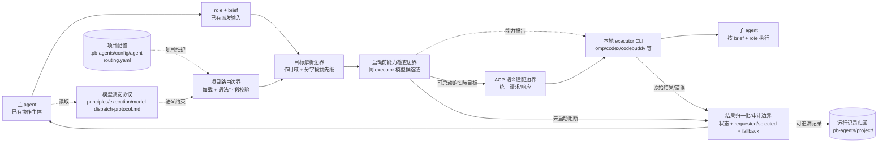
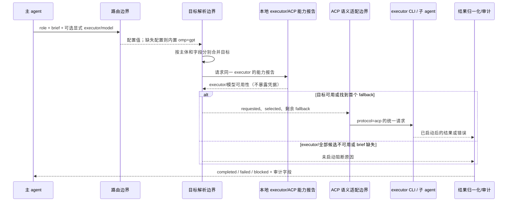
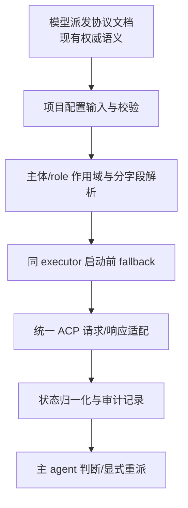

# architecture.md — 0004-model-dispatch

**版本**: 0.1.0  
**迭代**: 0004-model-dispatch  
**对应阶段**: 技术架构（Phase 3）  
**架构基线**: `roles/workflow-pb/workflow-pb.md`、`docs/iterations/0003-workflow-scm/architecture.md`

> 本文是未来实现的职责和语义边界，不把尚不存在的运行时模块描述为现状。配置加载器、ACP adapter、CLI 调用器和运行记录实现均由主 agent 后续根据实际代码确定。

---

## 一、需求概述与架构目标

本迭代将模型派发收敛为两个独立目标维度：`executor`（本地 CLI）与 `model`（CLI 使用的模型）。覆盖 F01–F07：默认目标与 role 作用域、项目路由配置、分字段优先级、同一 executor 内的启动前 fallback、统一 ACP 语义、结果状态/降级审计、agents 与本地工具的凭据责任边界。

架构目标只有三项：

1. 把已生效协议落成可实现的调用顺序和职责边界，不把模型绑定写入 role 文件。
2. 把请求目标、实际目标、候选链、降级原因和结果状态贯通，使主 agent 能判断是否启动、是否完成、是否需要显式重派。
3. 保持当前仓库的现实边界：本仓库仍是 Markdown、角色定义、原则/协议和少量 shell 校验脚本；本阶段不新增服务、队列、缓存、数据库或第三方库。

协议权威来源为 `principles/execution/model-dispatch-protocol.md`。项目路由权威来源为业务项目中的 `.pb-agents/config/agent-routing.yaml`。

---

## 二、现有架构基线

### 2.1 已验证的仓库结构

本仓库当前没有 `src/`、运行时服务、模型加载器、ACP adapter、CLI 调用器或结果查询 API。已有可复用结构是文档和宿主调度约定：

- `roles/<role>/<role>.md`：角色能力定义；角色不绑定模型。
- `roles/workflow-pb/workflow-pb.md`：7 阶段产品研发工作流，阶段 3 的输入是功能卡和现有架构，输出是本架构文档及架构维度补全。
- `roles/workflow-scm/workflow-scm.md`：与产品工作流在 `tasks.md` 处握手的提交管理规范。
- `docs/iterations/{id}/`：需求、规格、架构、任务、PR 和验证记录的迭代产物目录。
- `principles/execution/model-dispatch-protocol.md`：本迭代已经存在的模型派发语义协议，规定配置路径、默认值、fallback 规则、ACP 请求/响应字段及凭据不归属 agents。
- `tools/check-role-structure.sh` 与 `tests/test-check-role-structure.sh`：针对角色目录结构的校验，不提供派发运行时能力。

README 和 `docs/mvp-plan.md` 记录了业务项目未来的三层数据归属：`.pb-agents/` 框架 copy、`.pb-agents/config/` 项目配置例外区、`.pb-agents/project/` 运行记录；跨项目安装阶段尚未完成。因此，`agent-routing.yaml` 是目标业务项目的配置输入，不是当前仓库已有文件。

### 2.2 现状到目标的演进判断

这是协议语义的增量落地，不是替换现有角色/工作流架构：

- 保留主 agent 持有全局视图、按 brief 派发子 agent 的协作边界。
- 保留 role 文件只描述能力；模型绑定只由项目路由配置表达。
- 将派发流程拆成局部职责边界，但不预设这些边界必须是独立进程、服务或库。
- 本阶段不声称已有任何运行时实现；实现宿主、语言、配置解析方式、ACP 传输和 CLI 参数映射待主 agent 根据实际代码确定。

---

## 三、目标架构与组件职责

### 3.1 组件/职责图

以下是未来调用语义的逻辑边界图。虚线表示尚未存在、仅供后续实现承接的边界；实线表示本仓库已存在的文档/协作约定。



逻辑组件只有以下五类，不对应当前仓库中的现有代码文件：

| 逻辑边界 | 职责 | 明确不负责 | 需求来源 | 现状 |
|---|---|---|---|---|
| 项目路由边界 | 从固定项目路径取得配置；区分缺失与非法；校验版本、默认目标、role 字段和凭据禁入 | provider/secret、role 文件修改、运行记录 | F02、F07 / AR-02、AR-03 | 未来实现边界，加载器和校验技术待主 agent 确定 |
| 目标解析边界 | 识别 `main`/`subagent`；按 `executor`、`model` 分别合并显式请求、role 路由、子 agent 默认值；主 agent 忽略 role 自动覆盖 | 模型可用性探测、CLI 参数映射 | F01、F03 / AR-01、AR-04 | 未来实现边界 |
| 启动前能力检查边界 | 固定 executor；依据本地能力报告依序选模型，去重并形成剩余候选；无可用候选时阻断 | 换 executor、启动后重试/重跑、读取凭据 | F04、F07 / AR-05 | 未来实现边界；报告形状待主 agent 确定 |
| ACP 语义适配边界 | 承载统一 ACP 请求/响应语义，将已解析目标交给本地 executor，并把 executor 输出交回 | provider、认证、CLI 内部会话/重试、agents 自建通信服务 | F05、F07 / AR-06、AR-08 | 未来实现边界；传输和参数映射待主 agent 确定 |
| 结果归一化/审计边界 | 将启动前阻断、启动后失败和完成归一为三种状态；透传结果和降级证据给主 agent，并落到项目运行记录归属 | 自动重派、审计 UI、保留策略和存储技术 | F06、F07 / AR-07、AR-08 | 未来实现边界；记录格式和查询方式待主 agent 确定 |

这些边界不应被实现为额外的服务层。若未来代码需要拆文件，可以按职责拆分；是否拆分以及具体模块位置属于实现阶段决策。

### 3.2 配置、凭据和运行记录归属

```text
agents 框架 copy（只读）
  .pb-agents/roles/
  .pb-agents/principles/

业务项目配置（可写；安装/升级不得覆盖）
  .pb-agents/config/agent-routing.yaml

业务项目运行记录（不作为路由输入）
  .pb-agents/project/

宿主/本地 executor 责任
  provider 注册、endpoint、API key、token、密码、登录态、认证和 CLI 内部会话
```

agents 只读取路由字段和 executor/ACP 返回的能力报告；不读取、解析或持久化 provider secret。子 agent 只接收主 agent 提供的 role、brief、working directory 及已解析目标，不修改路由配置、不自行换模型。配置内容不写入 role 文件，运行结果不回写配置文件。

---

## 四、核心数据流与调用时序

### 4.1 主 agent → 路由 → fallback → ACP → 结果



调用时序约束：

1. 配置缺失才使用内置默认 `omp + gpt`；配置存在但语法/字段非法必须在启动前报错，不能伪装成缺失。
2. 子 agent 解析顺序按字段为：派发请求显式值 > `roles.<role>` > `defaults.subagent`。只覆盖出现的字段，另一字段继续继承。
3. 主 agent 的默认值来自 `defaults.main` 或内置默认；role 路由不自动影响主 agent。主 agent 改自身目标必须显式指定对应字段。
4. fallback 只改变模型，不改变 executor。候选链是请求模型后接配置 fallback；未配置 fallback 时以 `defaults.subagent.model` 作为链尾。去重保留首次出现顺序，当前模型不得重复尝试。
5. executor 不可用、所有候选模型不可用或 brief 缺失时，不能调用 ACP 启动子 agent；结果为未启动语义。
6. 选定目标后才组装 ACP 请求；启动后失败直接归一化为 `failed`，派发边界不得静默换模型重跑。

### 4.2 统一 ACP 请求/响应语义

ACP 是调用边界的统一语义，不代表本仓库新增通信服务。具体传输方式、协议版本承载方式、CLI 参数映射由实现确定，但不得改变以下字段含义：

```yaml
# 语义请求（字段承载格式由实现确定）
protocol: acp
protocol_version: 1
role: <子 agent role>
executor: <已解析的 executor>
model: <已解析的 selected model>
fallback: [<尚未使用的模型>]
brief: <brief 路径>
working_directory: <工作目录>
```

```yaml
# 语义响应
status: completed | failed | blocked
role: <role>
requested:
  executor: <请求目标 executor>
  model: <请求目标 model>
selected:
  executor: <实际 executor>
  model: <实际 model>
fallback_applied: true | false
fallback_chain: [<原始有序候选链>]  # 发生降级时必须保留
fallback_reason: <降级原因>          # 未降级时不虚构
result: <完成结果；未启动时不得伪造>
reason: <blocked/failed 的可诊断原因>
```

`requested` 是解析后、fallback 前的请求目标；`selected` 是实际启动目标。`blocked` 表示未形成可交付结果且未完成目标执行，`failed` 表示目标已启动但执行失败，`completed` 表示已执行并形成可交付结果。三者不得互换。

### 4.3 结果记录和查询语义

归一化结果先同步返回主 agent，保证当次调度立即可判断；再按业务项目既有运行记录归属写入 `.pb-agents/project/`，不得写回路由配置或框架 copy。每条记录至少保留：`status`、`role`、`requested`、`selected`、`fallback_applied`、原始 `fallback_chain`、降级原因（若有）、执行结果（若已启动）和阻断/失败原因（若有）。

记录的序列化格式、文件命名/关联方式、查询入口和保留策略在当前仓库均不存在，**实现待主 agent 根据实际代码确定**；下游实现必须保持上述字段及状态语义，不得以查询便利引入数据库、队列或缓存。

---

## 五、关键决策及理由

### D-01：采用“同一宿主内的顺序管线”作为最小实现形状（L2）

**方案 A（推荐）**：主 agent 调用一个顺序管线，依次完成配置边界、目标解析、启动前能力检查、ACP 适配和结果归一化；各段以显式数据传递连接，是否拆文件留给实现。  
**方案 B**：引入独立 dispatch 服务/队列，让路由和 executor 调用异步解耦。  

选择 A：当前仓库没有运行时服务，需求是单次派发语义而不是跨任务调度；同步顺序天然保证“fallback 发生在启动前”，也更容易验证 `blocked` 不产生启动结果。B 会改变整体边界、引入部署和持久化问题，并无 F01–F07 的证据支撑。该决策不引入服务或技术栈。

### D-02：按字段而非按目标字符串合并（L2）

**方案 A（推荐）**：`executor`、`model` 各自按显式请求 > role 路由 > `defaults.subagent` 合并，最终再组合为目标。  
**方案 B**：把目标编码为一个不可分割的 `executor:model` 字符串统一覆盖。  

选择 A：F03 明确允许只覆盖一个维度；按字段合并能保留另一字段的继承语义，也与协议中“executor + model 是两个维度”一致。B 会在只覆盖模型或只覆盖 executor 时丢失需求定义的继承行为。

### D-03：能力报告只作为 opaque 可用性输入（L2）

**方案 A（推荐）**：由本地 executor/ACP 返回“executor 是否可用、候选模型是否可用”的能力报告，agents 只消费结果。  
**方案 B**：agents 读取 provider 配置、探测登录态或直接猜测凭据可用性。  

选择 A：满足 F04/F07 的责任边界，agents 不接触 secret，且 executor 的实际能力由本地工具判断。报告的具体 wire shape 和探测方法不在本阶段锁定，**实现待主 agent 根据实际代码确定**。

### D-04：失败后的重派保持主 agent 显式控制（L2）

**方案 A（推荐）**：启动前 fallback 只选一次目标；启动后错误归一化为 `failed`，主 agent 读取结果后自行决定是否另发请求。  
**方案 B**：派发边界在 `failed` 后自动换模型并重跑。  

选择 A：F04、F06、F07 明确排除静默重跑；A 能保留一次请求的因果和审计证据，避免重复执行副作用。B 会混淆 `failed` 与新执行并越过主 agent 的责任边界。

### D-05：L1 清单

**无 L1 决策。** 本方案没有引入新技术栈、服务、数据库、队列、缓存或通信层，也没有改变现有 role、workflow-pb、workflow-scm、主/子 agent 的整体职责。未来若实现需要改变整体边界（例如新增常驻 dispatch 服务、替换宿主调度机制），必须在实现前单独升级为 L1 交主 agent 确认；本架构不擅自决定。

---

## 六、实现边界与依赖顺序

### 6.1 本阶段明确交给下游的接口边界

| 边界 | 下游可依赖的事实 | 下游不得假定的实现 |
|---|---|---|
| 路由配置输入 | 固定路径 `.pb-agents/config/agent-routing.yaml`；缺失使用内置默认；存在且非法快速失败；配置不含 secret | YAML 解析库、加载器位置、安装脚本细节 |
| 目标解析输出 | `requested.executor/model`，以及主体、role 作用域和逐字段继承结果 | role 文件内模型字段、隐式主 agent 切换 |
| 能力检查输出 | 同一 executor 下每个候选的可用/不可用判断，或 executor 不可用原因 | 凭据读取、探测命令、跨 executor fallback |
| ACP 请求 | `protocol`、`protocol_version`、`role`、已解析 executor/model、剩余 fallback、brief、working directory | 传输通道、CLI 参数、provider 和 CLI 会话 |
| 归一化输出 | 三态 status、role、requested/selected、fallback 审计和 result/reason | 自动重派、审计 UI、数据库/缓存 |
| 运行记录 | 记录归属 `.pb-agents/project/`，不与 config 混用 | 序列化、索引、查询 API、保留周期 |

所有未锁定的技术实现均标明为**实现待主 agent 根据实际代码确定**，不是架构空白；下游任务应围绕语义契约落地并在发现整体边界变化时回报 L1。

### 6.2 建议依赖顺序（供任务拆解）



1. 先固定配置字段、缺失/非法错误语义和项目/框架/记录归属。
2. 再实现主体识别与按字段解析，输出 requested 目标。
3. 接入 executor/ACP 能力报告，完成候选去重和启动前 selected 选择。
4. 以 selected 目标组装统一 ACP 请求，接收响应；不在此层实现 CLI 内部参数和会话。
5. 最后统一三态结果并传递/记录审计字段，验证启动前阻断与启动后失败不重跑。

不得在这些边界之间插入无需求来源的缓存、消息队列、重试器、服务发现或独立数据库。

---

## 七、AR-01～AR-08 技术路径完成情况

| AR | 来源 | 技术路径（已收敛） | 完成情况 |
|---|---|---|---|
| AR-01 | F01 | 由目标解析边界先识别 `main`/`subagent`。两者分别读取对应默认目标；role 路由只参与 `subagent` 解析。目标由独立 `executor` 与 `model` 组合表示；主 agent 仅接受自身请求显式覆盖。 | 已完成；具体运行时承载实现待主 agent 根据实际代码确定 |
| AR-02 | F02 | 项目路由边界只读取 `.pb-agents/config/agent-routing.yaml`；先处理语法，再校验版本、必填默认字段、role 字段类型/允许字段及凭据禁入。缺失配置使用内置默认，非法配置返回带字段/位置上下文的快速失败错误，不回退默认。 | 已完成；解析库和错误通道实现待主 agent 根据实际代码确定 |
| AR-03 | F02 | 配置属于业务项目可写配置，安装/升级只更新 `.pb-agents/roles/`、`.pb-agents/principles/` 等框架 copy，不覆盖/删除 config；运行记录继续写 `.pb-agents/project/`，配置和记录不混用。 | 已完成；安装/升级脚本的保护实现待主 agent 根据实际代码确定 |
| AR-04 | F03 | 目标解析边界对 `executor`、`model` 分别执行“显式请求 > `roles.<role>` > `defaults.subagent`”合并；主 agent 采用 `defaults.main`，忽略 role 自动覆盖；在 fallback/ACP 之前完成并输出 requested。 | 已完成；具体函数/模块承载实现待主 agent 根据实际代码确定 |
| AR-05 | F04 | 解析完成后向同一 executor 请求能力报告；在启动前按 requested model → 有序 fallback → 缺失 fallback 时的 `defaults.subagent.model` 链尾选择首个可用模型，去重且不重复当前模型。executor 不可用或全候选不可用直接生成 blocked/failed 归一化结果，不调用 ACP 启动。 | 已完成；能力报告接入和探测方式实现待主 agent 根据实际代码确定 |
| AR-06 | F05 | ACP 语义边界承载固定 `protocol=acp`、`protocol_version`、role、已解析 executor/model、剩余 fallback、brief、working directory；响应承载 status、requested、selected、fallback 审计和 result。传输及 CLI 参数映射只存在于适配端，不进入 role/路由配置。 | 已完成；adapter、传输和参数映射实现待主 agent 根据实际代码确定 |
| AR-07 | F06 | 结果归一化边界只接受三态：未启动/无可交付结果为 `blocked`，已启动执行错误为 `failed`，形成可交付结果为 `completed`。同步回传主 agent，并将最小审计记录落在 `.pb-agents/project/`；记录字段保留 requested/selected、原始 fallback chain、fallback reason 和 result/reason。 | 已完成；记录格式、持久化和查询实现待主 agent 根据实际代码确定 |
| AR-08 | F07 | ACP 调用由 agents 发起，provider、endpoint、API key、token、密码、登录态和认证由本地 CLI/宿主持有；agents 仅消费 opaque 能力报告。主 agent 在 brief/响应中承载 role、实际 selected 目标及边界问题；子 agent 不改路由、不自行切模型，启动后失败由主 agent 显式决定是否重派。 | 已完成；具体宿主调用方式和报告字段承载实现待主 agent 根据实际代码确定 |

**AR 填写数：8/8。** 上述路径覆盖全部 F01–F07；没有产品维度或测试维度改动。

---

## 八、技术组件清单与范围核对

| 组件/产物 | 类型 | 变更标记 | 需求追溯 | 是否引入技术栈 |
|---|---|---|---|---|
| `principles/execution/model-dispatch-protocol.md` | 统一语义协议文档 | 已有/复用 | F01–F07 | 否 |
| `.pb-agents/config/agent-routing.yaml` | 业务项目配置文件 | 目标新增配置输入 | F01–F04、F07 | 否；格式已由协议规定，解析技术不锁定 |
| 项目路由边界 | 未来逻辑职责 | 新增职责边界 | F02、F07 | 否；不等于独立服务 |
| 目标解析边界 | 未来逻辑职责 | 新增职责边界 | F01、F03 | 否；不等于新框架 |
| 启动前能力检查/fallback 边界 | 未来逻辑职责 | 新增职责边界 | F04、F06、F07 | 否；能力报告由 executor/ACP 提供 |
| ACP 语义适配边界 | 未来逻辑职责 | 新增职责边界 | F05、F07 | 否；不在 agents 内自建通信服务 |
| 结果归一化/审计边界 | 未来逻辑职责 | 新增职责边界 | F06、F07 | 否；记录落点复用 `.pb-agents/project/` |
| `.pb-agents/project/` | 既有规划中的运行记录归属 | 复用既有约定 | F02、F06 | 否；具体存储/查询不锁定 |
| `roles/*` 与 `workflow-pb`/`workflow-scm` | 角色/工作流文档 | 不修改职责 | F01、F03、F07 | 否 |

未引入：缓存、消息队列、数据库、常驻服务、provider SDK、凭据存储、CLI 会话管理、自动重试/重派机制、独立 role 模型字段。

---

## 九、非功能约束、验证矩阵与 Self-Check Gates

### 9.1 非功能约束

- **可预测性**：默认值、作用域、字段优先级和 fallback 顺序均为确定性规则；配置缺失与配置非法不可混淆。
- **可审计性**：每次响应都能区分 requested/selected；fallback 的原始链和原因只在实际降级时出现；未启动结果不带“已启动”执行结果。
- **安全边界**：agents 不接受或解析 provider secret；能力判断来自本地 executor/ACP 报告；配置和运行记录分离。
- **故障语义**：executor/候选不可用在启动前阻断；启动后错误为 `failed`；不静默切 executor、不自动重跑。
- **可测试性**：每个边界以输入/输出语义隔离，配置、解析、fallback、ACP 映射和归一化可以分别验证；不要求部署新服务。

### 9.2 最小验证矩阵

| 验证范围 | 必须覆盖的行为 | 结果证据 |
|---|---|---|
| 配置边界 | 缺失默认 `omp+gpt`；非法语法/字段快速失败；secret 字段拒绝 | 配置错误上下文，无启动调用 |
| 作用域/解析 | main 不受 role 路由影响；subagent role 生效；显式单字段/双字段覆盖及另一字段继承 | requested executor/model |
| fallback | 同 executor、有序候选、去重、链尾默认；executor 不可用/全候选不可用不启动 | selected 或 blocked + 原因 |
| ACP 语义 | 请求包含协议版本、role、实际目标、剩余 fallback、brief、working directory；响应包含三态和双目标 | 结构化请求/响应 |
| 结果/审计 | completed/failed/blocked 区分；降级保留链和原因；启动后 failed 不自动换模型 | 主 agent 响应和 `.pb-agents/project/` 记录 |
| 权责边界 | agents 不读 secret；子 agent 不改配置、不自行换模型；实际目标和边界问题进入报告 | 调用边界/报告记录 |

### 9.3 Self-Check Gates

- **Simplicity Gate：通过。** 仅定义 5 个逻辑职责边界，未引入服务、队列、缓存、数据库或新库；实现可在单一宿主顺序执行。
- **Fidelity Gate：通过。** F01–F07 与 AR-01–AR-08 均有技术路径；每个逻辑组件至少映射一个功能点；未新增需求外能力。
- **Consistency Gate：通过。** 配置、解析、能力检查、ACP、归一化顺序无环；`requested`/`selected` 和三态语义明确；凭据归属不与路由/记录冲突。
- **Buildability Gate：有边界风险但可交付。** 当前仓库没有运行时，因此无法在本阶段证明具体加载器、adapter、CLI 调用和记录实现；这些均已显式交给主 agent 后续按实际代码确定，且不影响本架构的语义契约。

---

## 十、疑问、越界与 L1 触发条件

### 当前疑问（不阻塞本阶段）

1. 配置解析库、错误传递机制、能力报告 wire shape、ACP transport、CLI 参数映射和记录查询方式在仓库中没有现状依据，均标记为“实现待主 agent 根据实际代码确定”。
2. `.pb-agents/project/` 的具体记录文件组织尚未由安装/运行时实现建立；本架构只锁定归属和最小字段，不预设文件格式或查询工具。

### 明确越界（本阶段不做）

- 不在 `roles/*` 写模型绑定，不重写 role 能力。
- 不实现或选择 `omp`、`codex`、`codebuddy` 的 CLI 参数/provider/认证。
- 不建设 agents 自有通信服务，不引入队列、缓存、数据库或后台 worker。
- 不实现启动后重试、自动换模型、自动重派、会话管理或审计界面。
- 不修改 F01–F07 的用户价值、验收标准、边界和测试维度。

### L1 触发条件

本次 L1 清单为“无”。只有未来实现需要新增常驻服务/通信层、改变主 agent/子 agent 协作边界、引入新的跨项目部署架构或替换现有核心调度机制时，才应暂停并提交新的 L1 决策；不能以本架构文档替代该确认。
