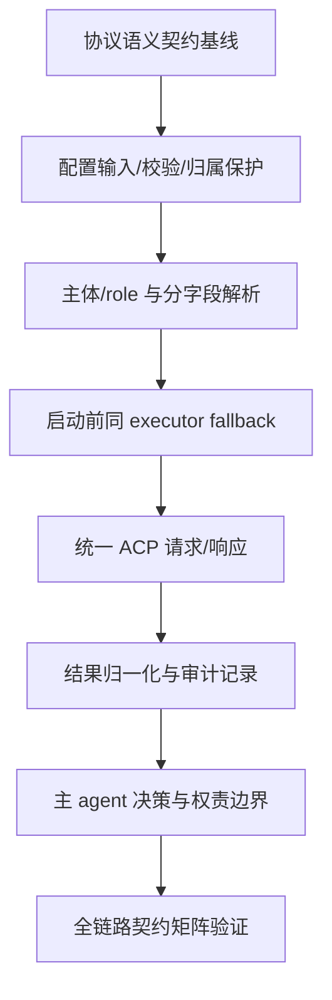

# tasks.md — 0004-model-dispatch

**版本**: 0.1.0  
**对应阶段**: 任务拆解（Phase 4）  
**状态**: 规划完成（等待主 agent 根据实际代码确定实现承载）
**上游产物**: `architecture.md`、`prd.md`、`prd/*.md`  
**协议基线**: `principles/execution/model-dispatch-protocol.md`

---

## 1. 规划概要

### 1.1 目标

将已固化的模型派发协议语义拆解为可独立验收的未来实现任务：从项目配置输入开始，依次完成主体/role 解析、同 executor 的启动前 fallback、ACP 统一语义适配、结果归一化与审计，最后把结果交回主 agent 作显式决策。

### 1.2 已固化产物与未来实现任务

#### 已固化、下游必须遵守的内容

| 产物/约束 | 当前事实 | 下游要求 |
|---|---|---|
| `principles/execution/model-dispatch-protocol.md` | 已存在的权威执行协议 | 不修改其既定语义；实现必须遵守配置路径、默认目标、作用域、优先级、fallback 和 ACP 字段定义 |
| `architecture.md` | 本迭代已收敛的职责边界、顺序和非功能约束 | 不新增服务、队列、缓存、数据库或第三方库；不把逻辑边界解释为独立服务 |
| `prd.md` 与 `prd/*.md` | F01~F07 的产品验收标准和范围边界 | 所有任务验收标准只从这些原文或 `architecture.md` 直接推导 |
| role/主 agent 协作边界 | role 文件只描述能力；主 agent 持有全局视图并提供 role、brief | 不在 role 文件写模型绑定；不把模型选择责任下放给子 agent |
| 配置/记录归属 | 配置路径固定为 `.pb-agents/config/agent-routing.yaml`；运行记录归属 `.pb-agents/project/` | 配置与记录分离；框架 copy、配置、运行记录不得互相覆盖或混用 |

#### 本轮实现与未实现内容

当前仓库没有 `src/`、运行时加载器、目标解析器、能力报告接入、ACP adapter、CLI 调用器或结果查询 API。T01~T08 是交给后续实现阶段的任务，不表示本轮已经存在或实现了这些模块。

实现方式留白必须保留为：**由主 agent 根据实际代码确定**，包括配置解析库、加载器位置、错误传递方式、能力报告 wire shape/探测方式、ACP transport、协议版本承载、CLI 参数映射、宿主调用方式、运行记录序列化/文件组织/查询入口。若实现需要新增常驻服务或改变主/子 agent 协作边界，必须升级为新的 L1 决策，不得在任务执行中自行决定。

### 1.3 范围与优先级

| 类别 | 数量 | 说明 |
|---|---:|---|
| P0 | 7 | F01~F07 核心语义和五类逻辑职责；均须包含异常路径验收 |
| P1 | 1 | 全链路契约回归验证；本迭代仍需完成，不代表可跳过 |
| P2 | 0 | 没有把边界外事项伪装成待办；边界外内容见 §2 |
| **合计** | **8** | 每项预计 1~2 人天；实际工作量由主 agent 按代码现状复估 |

### 1.4 关键路径

`T01 → T02 → T03 → T04 → T05 → T06 → T07 → T08`

- **关键路径含义**：协议契约基线 → 配置输入/校验 → 主体与字段解析 → 启动前能力检查/fallback → ACP 语义请求/响应 → 三态结果与记录 → 主 agent 显式决策/权责隔离 → 全链路验证。
- **并行机会**：本轮按最小风险采用顺序关键路径；T01 完成后，若主 agent 的实现承载允许，T02 的配置归属静态检查和协议契约测试夹具可并行准备，但 T03 必须等待 T02 的配置输出契约。
- **关键约束**：fallback 必须在 ACP 启动前完成；结果归一化必须能区分“未启动阻断”和“启动后失败”；主 agent 才能决定是否重新派发。

---

## 2. 范围边界（所有任务共同适用）

本计划只覆盖 F01~F07 和 `architecture.md` §六规定的语义链路。以下内容明确不建任务、不作为验收标准：

- provider 注册/实现、endpoint、API key、token、密码、登录态、认证、凭据生成/读取/轮换/存储；
- `omp`、`codex`、`codebuddy` 等 CLI 的内部参数映射、会话管理和任务执行逻辑；
- agents 自建通信服务、常驻 dispatch 服务、消息队列、缓存、数据库、worker 或服务发现；
- 启动后的自动重试、自动换模型、自动重派；失败后的再次派发只能由主 agent 显式决定；
- role 能力定义重写、role 文件模型绑定、将模型字段写入角色原则；
- 审计 UI、超出最小记录字段的展示、保留策略等需求外能力；
- 修改 `architecture.md`、`prd.md`、`prd/*.md` 或既有协议文档。

能力可用性只接受本地 executor/ACP 提供的 opaque 能力报告；agents 不读取凭据、不猜测凭据状态。

---

## 3. 任务总览

| 任务 ID | 名称 | 优先级 | 关联 Feature | 关联架构职责 | 前置依赖 | 预计工作量 | 状态 |
|---|---|---|---|---|---|---|---|
| T01 | 派发协议语义契约基线与契约验证 | P0 | F01~F07 | 跨边界协议约束 | 无 | 1~2 天 | TODO |
| T02 | 项目路由配置输入、校验与归属保护 | P0 | F02、F07 | 项目路由边界 | T01 | 1~2 天 | TODO |
| T03 | 主体/role 作用域与分字段目标解析 | P0 | F01、F03、F07 | 目标解析边界 | T02 | 1~2 天 | TODO |
| T04 | 同 executor 的启动前模型 fallback | P0 | F04、F06、F07 | 启动前能力检查/fallback 边界 | T03 | 1~2 天 | TODO |
| T05 | 统一 ACP 请求/响应语义适配 | P0 | F05、F07 | ACP 语义适配边界 | T04 | 1~2 天 | TODO |
| T06 | 三态结果归一化与运行记录审计 | P0 | F06、F07 | 结果归一化/审计边界 | T05 | 1~2 天 | TODO |
| T07 | 主 agent 结果决策与主/子 agent 权责边界 | P0 | F05、F06、F07 | 主 agent 协作边界 | T06 | 1~2 天 | TODO |
| T08 | 全链路派发契约矩阵验证 | P1 | F01~F07 | 顺序管线与跨边界回归 | T07 | 1~2 天 | TODO |

---

## 4. 任务依赖图

**循环检查**：无循环依赖。每条边均从上游语义/数据输出指向下游消费方；没有反向依赖。

---

## 5. 任务详情

### T01：派发协议语义契约基线与契约验证

- **优先级**: P0
- **关联 Feature**: F01、F02、F03、F04、F05、F06、F07
- **关联组件/职责**: 已有协议文档 + 五类未来逻辑边界的共同输入
- **前置依赖**: 无
- **预计工作量**: 1~2 天
- **目标**: 将既有协议和架构中不可变的字段语义、状态语义、调用顺序和禁止事项整理为可供后续边界验证消费的契约；不创造新的协议。
- **实现承载**: 契约断言、夹具或测试承载方式由主 agent 根据实际代码确定；不得因此引入新服务或锁定通信技术。

#### 验收标准

- **AC-T01-1**：契约明确目标由独立的 `executor` 与 `model` 两个维度组成；`requested` 表示 fallback 前目标，`selected` 表示实际启动目标。  
  **追溯**：`architecture.md` §一第 14~19 行、§四.2；F01 AC#3；F05 AC#3、AC#7。
- **AC-T01-2**：契约明确配置缺失与配置非法是两条不同路径：缺失才使用内置 `omp + gpt`，非法配置必须在启动前快速失败并携带可诊断上下文，不能静默回退默认值。  
  **追溯**：`architecture.md` §四.1 调用时序约束 1、§九.1；F02 AC#6、AC#7。
- **AC-T01-3**：契约明确顺序管线为配置 → 解析 → fallback → ACP → 归一化/记录 → 主 agent 决策；fallback 发生在启动前，启动后失败不得由派发边界静默重跑。  
  **追溯**：`architecture.md` §六.2、§四.1 调用时序约束 4~6；F04 AC#7；F06 AC#8。
- **AC-T01-4**：契约断言请求必有 `protocol=acp`、`protocol_version`、`role`、已解析的 `executor/model`、剩余 `fallback`、`brief` 和 `working_directory`；响应必能表达三态、双目标、fallback 审计和结果/原因。  
  **追溯**：`architecture.md` §四.2；F05 AC#1、AC#6；F06 AC#1、AC#5。
- **AC-T01-5**：契约明确 agents 不读取/存储/解析 provider secret，能力判断只来自本地 executor/ACP 报告；契约验证不得要求 API key、token、密码或登录态作为路由输入。  
  **追溯**：`architecture.md` §三.2、§九.1；F02 AC#8；F04 AC#8；F07 AC#2、AC#3。

#### 范围边界

不选择配置解析库、ACP transport、能力报告 wire shape、CLI 参数映射或记录格式；不修改 `model-dispatch-protocol.md`、role 文件和上游需求/架构文档。

---

### T02：项目路由配置输入、校验与归属保护

- **优先级**: P0
- **关联 Feature**: F02、F07（并为 F01、F03、F04 提供配置输入）
- **关联组件/职责**: 项目路由边界
- **前置依赖**: T01
- **预计工作量**: 1~2 天
- **目标**: 读取固定项目配置路径，区分缺失/合法/非法输入，并保护配置、框架 copy 和运行记录的归属边界。
- **实现承载**: 加载器、解析库、错误通道、安装/升级保护机制由主 agent 根据实际代码确定。

#### 验收标准

- **AC-T02-1**：只从业务项目 `.pb-agents/config/agent-routing.yaml` 取得路由输入；文件缺失时主 agent 与子 agent 均可得到内置默认 `executor=omp`、`model=gpt`。  
  **追溯**：`architecture.md` §六.1“路由配置输入”、§四.1 调用时序约束 1；F02 AC#1、AC#6。
- **AC-T02-2**：配置存在时，能校验语法、`version`、四个必填默认字段、role 字段类型及允许字段；配置版本为当前协议定义的 `1`，role 可表达 `executor`、`model`、可选有序 `fallback`。  
  **追溯**：`architecture.md` §六.1；F02 AC#4；`model-dispatch-protocol.md` §三字段定义。
- **AC-T02-3**：语法非法、版本非法、必填字段缺失、字段类型/允许字段非法时，在任务启动前返回包含字段或位置上下文的具体错误；该路径不被当作配置缺失，且不得调用 ACP 启动任务。  
  **追溯**：`architecture.md` §四.1 调用时序约束 1、§九.2 配置边界；F02 AC#7。
- **AC-T02-4**：包含 API key、token、密码或需 agents 解析的 provider secret 的配置输入被拒绝或隔离为非路由输入；agents 不管理、存储或解析该 secret。  
  **追溯**：`architecture.md` §三.2第 115~119 行、§九.1；F02 AC#8；F07 AC#2、AC#3。
- **AC-T02-5**：安装/升级操作不会覆盖或删除已有 `.pb-agents/config/agent-routing.yaml`；`.pb-agents/roles/`、`.pb-agents/principles/` 等框架 copy 仍保持只读归属。  
  **追溯**：`architecture.md` §三.2、§八；F02 AC#2、AC#3。
- **AC-T02-6**：路由配置只作为派发解析输入；运行记录仍归 `.pb-agents/project/`，配置内容不被当作运行记录，且结果不得回写配置。  
  **追溯**：`architecture.md` §三.2第 109~119 行、§四.3；F02 AC#3；F06 架构维度。

#### 范围边界

不实现 provider secret 流程、运行记录模型/查询、CLI 参数映射或任何配置文件之外的模型选择入口；具体安装/升级脚本机制由主 agent 确定。

---

### T03：主体/role 作用域与分字段目标解析

- **优先级**: P0
- **关联 Feature**: F01、F03、F07
- **关联组件/职责**: 目标解析边界
- **前置依赖**: T02
- **预计工作量**: 1~2 天
- **目标**: 在能力检查和 ACP 派发之前，识别 `main`/`subagent`，按 `executor`、`model` 独立解析并输出 `requested` 目标。
- **实现承载**: 解析函数/模块位置由主 agent 根据实际代码确定；不得从 role 文件读取模型绑定。

#### 验收标准

- **AC-T03-1**：主体为 `main` 且无显式覆盖时，使用 `defaults.main`；配置缺失时使用内置 `omp + gpt`。主体为 `subagent` 且无显式覆盖、role 未配置时，使用 `defaults.subagent`；配置缺失时同样为 `omp + gpt`。  
  **追溯**：`architecture.md` §三.1目标解析边界、§四.1约束 2~3；F01 AC#1、AC#2；F01 架构维度。
- **AC-T03-2**：子 agent 每个维度独立按“请求显式字段 > `roles.<role>` 对应字段 > `defaults.subagent` 对应字段”合并；只指定 `executor` 时 model 继续继承，只指定 `model` 时 executor 继续继承，同时指定时两者均覆盖。  
  **追溯**：`architecture.md` §四.1调用时序约束 2、§七 AR-04；F03 AC#1~AC#4。
- **AC-T03-3**：未配置 role 时，显式字段只覆盖对应子 agent 默认字段，未显式字段继续使用默认；配置 role 对子 agent 生效。  
  **追溯**：F03 AC#5；F01 AC#4；`architecture.md` §七 AR-01、AR-04。
- **AC-T03-4**：主体为 `main` 时忽略 `roles.<role>` 的自动覆盖；主 agent 只有显式指定自身请求字段时才改变对应维度，即使同一 role 同时用于主 agent 和子 agent 也不改变该规则。  
  **追溯**：`architecture.md` §三.1目标解析边界、§四.1约束 3；F01 AC#5、AC#6；F03 AC#6。
- **AC-T03-5**：每次子 agent 解析均要求主 agent 提供明确 `role` 与 `brief`，并输出可供 fallback 消费的 `requested.executor/model`；缺失 role/brief 的异常不进入正常 ACP 启动路径。  
  **追溯**：`architecture.md` §四.1时序图与约束 5、§六.1；F03 AC#7；F05 AC#2。

#### 范围边界

不判断模型/ executor 可用性，不执行 fallback，不做 CLI 参数映射，不修改 role 文件或路由配置。

---

### T04：同 executor 的启动前模型 fallback

- **优先级**: P0
- **关联 Feature**: F04、F06、F07
- **关联组件/职责**: 启动前能力检查/fallback 边界
- **前置依赖**: T03
- **预计工作量**: 1~2 天
- **目标**: 消费解析后的目标和本地能力报告，在同一 executor 内按确定顺序选择首个可用模型，并在不可启动时形成阻断输入。
- **实现承载**: 能力报告接入、探测调用和报告 wire shape 由主 agent 根据实际代码确定；agents 只能消费 opaque 报告。

#### 验收标准

- **AC-T04-1**：候选链按“解析后的请求 model → 配置 fallback 顺序 → 未配置 fallback 时的 `defaults.subagent.model` 链尾”生成；只改变 model，不改变已解析的 executor。  
  **追溯**：`architecture.md` §四.1约束 4、§七 AR-05；F04 AC#1、AC#3。
- **AC-T04-2**：候选按配置顺序选择本地能力报告中的第一个可用模型；例如同一 executor 上请求 `minimax-k3`，fallback `[deepseek,gpt]` 且前者不可用时，selected 为同一 executor + `deepseek`。  
  **追溯**：F04 AC#2；`architecture.md` §四.1时序图与 §九.2 fallback 矩阵。
- **AC-T04-3**：候选链去重并保留首次出现顺序；当前请求模型已为 `gpt` 时不得再次尝试 `gpt`。  
  **追溯**：`architecture.md` §四.1约束 4；F04 AC#4；`model-dispatch-protocol.md` §五。
- **AC-T04-4**：executor 不可用时报告该 executor 不可用，不切换到另一个 executor；请求模型和全部 fallback 不可用时，不调用 ACP 启动子 agent，并输出供归一化使用的明确阻断原因。  
  **追溯**：`architecture.md` §四.1约束 5、§六.1“能力检查输出”；F04 AC#5、AC#6。
- **AC-T04-5**：能力判断只使用本地 executor/ACP 能力报告，不读取或猜测任何凭据；fallback 仅发生在任务启动前。  
  **追溯**：`architecture.md` §三.2、§九.1；F04 AC#7、AC#8；F07 AC#2、AC#3。
- **AC-T04-6**：一旦后续 executor 已启动并返回执行失败，fallback 边界不再次选模型、不静默重跑；后续是否重新派发留给主 agent。  
  **追溯**：`architecture.md` §四.1约束 6、§五 D-04；F04 AC#7；F06 AC#8。

#### 范围边界

不构造 executor 切换链，不读取 provider 配置，不实现能力探测细节，不实现启动后重试/换模型/重派，不负责记录持久化。

---

### T05：统一 ACP 请求/响应语义适配

- **优先级**: P0
- **关联 Feature**: F05、F07
- **关联组件/职责**: ACP 语义适配边界
- **前置依赖**: T04
- **预计工作量**: 1~2 天
- **目标**: 将 fallback 已确定的实际目标组装为统一 ACP 语义请求，并把本地 executor 返回映射为统一响应语义。
- **实现承载**: adapter 的文件位置、传输方式、协议版本承载和各 CLI 参数映射由主 agent 根据实际代码确定；不能改变字段含义。

#### 验收标准

- **AC-T05-1**：每次请求都承载固定 `protocol=acp`、`protocol_version`、本次子 agent 的 `role`、已解析的实际 `executor/model`、尚未使用的 fallback、`brief` 路径和 `working_directory`。  
  **追溯**：`architecture.md` §四.2请求契约；F05 AC#1、AC#4。
- **AC-T05-2**：请求中的 `role` 是本次子 agent 使用的 role，`brief` 是任务简报路径；子 agent 不因 ACP 请求继承主 agent 会话。  
  **追溯**：F05 AC#2；`model-dispatch-protocol.md` §六.1。
- **AC-T05-3**：请求中的 executor/model 是解析和 fallback 后的实际 selected 目标；fallback 字段只列尚未使用的备用模型，且不引入新的 executor。  
  **追溯**：`architecture.md` §四.2、§六.1“ACP 请求”；F05 AC#3。
- **AC-T05-4**：响应可表达 `status`、`role`、`requested`、`selected`、`fallback_applied`、实际降级信息以及执行结果/原因；`requested` 为 fallback 前请求目标，`selected` 为实际使用目标。  
  **追溯**：`architecture.md` §四.2响应契约；F05 AC#6、AC#7；F06 AC#5、AC#6。
- **AC-T05-5**：CLI 参数映射只存在于 ACP/CLI 适配端；role 文件、路由配置和主 agent 路由逻辑不承载 CLI 私有参数，agents 不自建通信服务。  
  **追溯**：`architecture.md` §三.1 ACP 职责、§八、§十；F05 边界与架构维度；F07 AC#1。
- **AC-T05-6**：executor/ACP 的调用不要求 agents 提供、读取、解析或保存 provider/认证 secret；能力报告和调用响应中不得把 secret 变成 agents 的路由输入。  
  **追溯**：`architecture.md` §三.2、§七 AR-08；F07 AC#1~AC#3。

#### 范围边界

不实现 provider、认证、CLI 私有会话/重试/任务执行，不选择通信服务或传输技术，不把具体参数映射扩散到 role、配置或主 agent。

---

### T06：三态结果归一化与运行记录审计

- **优先级**: P0
- **关联 Feature**: F06、F07
- **关联组件/职责**: 结果归一化/审计边界
- **前置依赖**: T05
- **预计工作量**: 1~2 天
- **目标**: 将启动前阻断、启动后失败和成功结果归一化为可判断的三态，并同步回传主 agent、写入项目运行记录归属。
- **实现承载**: 记录序列化格式、文件命名/关联、查询入口和具体持久化方式由主 agent 根据实际代码确定；不得引入数据库、缓存或队列。

#### 验收标准

- **AC-T06-1**：响应 `status` 只能为 `completed`、`failed` 或 `blocked`；`completed` 仅表示目标已执行并形成可交付结果，且保留 result。  
  **追溯**：`architecture.md` §四.2、§七 AR-07；F06 AC#1、AC#2。
- **AC-T06-2**：已启动但执行错误归一为 `failed`，不得描述为未启动；未启动且无可交付结果（如 brief 缺失、executor/全部候选不可用）归一为 `blocked`，不得带伪造的已启动执行结果。  
  **追溯**：`architecture.md` §四.2、§九.1/§九.2；F06 AC#3、AC#4、AC#7。
- **AC-T06-3**：每条结果保留 `role`、`requested.executor/model`、`selected.executor/model`；发生 fallback 时保留 `fallback_applied=true`、原始有序 `fallback_chain`、降级原因和实际 selected 目标。  
  **追溯**：`architecture.md` §四.2响应契约、§四.3；F06 AC#5、AC#6。
- **AC-T06-4**：未发生 fallback 时 `fallback_applied=false`，不虚构 `fallback_reason`；blocked/failed 时保留可诊断的 reason，completed 时保留执行 result。  
  **追溯**：`architecture.md` §四.2；F06 AC#2、AC#7；F05 AC#6。
- **AC-T06-5**：归一化结果先同步返回主 agent，再按业务项目运行记录归属写入 `.pb-agents/project/`；不得写回 `.pb-agents/config/agent-routing.yaml` 或框架 copy。记录至少保留 status、role、双目标、fallback chain/reason 及 result/reason。  
  **追溯**：`architecture.md` §四.3、§六.1“运行记录”；F06 架构维度；F02 AC#3。
- **AC-T06-6**：启动后的执行失败保持 `failed`，归一化和记录路径不得触发模型切换或自动重跑。  
  **追溯**：`architecture.md` §五 D-04、§七 AR-07；F06 AC#8；F04 AC#7。

#### 范围边界

不定义审计 UI、查询便利驱动的数据库/缓存、不设计保留期限，不分类 CLI 内部错误，不执行自动重试/重派。

---

### T07：主 agent 结果决策与主/子 agent 权责边界

- **优先级**: P0
- **关联 Feature**: F05、F06、F07
- **关联架构职责**: 主 agent 与子 agent 既有协作边界（承接五类逻辑职责输出）
- **前置依赖**: T06
- **预计工作量**: 1~2 天
- **目标**: 让主 agent 接收并检查完整的解析/降级/结果信息，决定是否接受结果或显式发起新的派发；同时保持凭据和子 agent 责任隔离。
- **实现承载**: 主 agent 接入点和报告承载方式由主 agent 根据实际代码确定；不改变既有协作模型。

#### 验收标准

- **AC-T07-1**：主 agent 为每次子 agent 派发提供明确 `role` 和 `brief`，必要时显式覆盖 executor/model，并能检查返回的 requested/selected、status 和 fallback 审计。  
  **追溯**：`architecture.md` §三.2、§七 AR-08；`model-dispatch-protocol.md` §七；F03 AC#7、F05 AC#1~AC#4。
- **AC-T07-2**：看到 fallback 时，主 agent 能基于实际目标和降级原因显式决定接受继续执行或不接受；派发边界不会替主 agent 静默做额外重跑。  
  **追溯**：`architecture.md` §一第 18~20 行、§五 D-04；F06 AC#6、AC#8；F07 AC#5。
- **AC-T07-3**：子 agent 只按主 agent 提供的 brief 和 role 执行，不自行修改路由配置、不自行切换模型；需要再次派发时有新的主 agent 显式决定。  
  **追溯**：`architecture.md` §三.2第 119 行、§七 AR-08；F07 AC#4、AC#5、AC#6。
- **AC-T07-4**：provider、endpoint、API key、token、密码、登录态和认证仍由本地 CLI/宿主持有；agents 和子 agent 的派发决策路径不读取、解释或持久化这些 secret。  
  **追溯**：`architecture.md` §三.2、§九.1；F07 AC#1~AC#3。
- **AC-T07-5**：主 agent 仍持有全局视图，子 agent 仍只接收 brief/role 相关执行输入；本迭代不改变既有主/子 agent 协作边界。  
  **追溯**：`architecture.md` §二.2、§十；F07 AC#6；F05 边界。

#### 范围边界

不实现新的协作协议、子 agent 会话管理、自动重派策略、provider/认证能力或 role 能力定义。

---

### T08：全链路派发契约矩阵验证

- **优先级**: P1
- **关联 Feature**: F01、F02、F03、F04、F05、F06、F07
- **关联架构职责**: 五类逻辑边界及其顺序管线
- **前置依赖**: T07
- **预计工作量**: 1~2 天
- **目标**: 对实现后的完整顺序管线执行跨边界行为验证，证明配置、解析、fallback、ACP、结果/审计和权责边界没有互相破坏。
- **实现承载**: 验证运行器、替身 executor/能力报告及数据承载方式由主 agent 根据实际代码确定；验证不得依赖部署新服务或真实 provider secret。

#### 验收标准

- **AC-T08-1**：配置边界矩阵覆盖：无配置得到主/子 agent `omp+gpt`；非法语法/字段快速失败且有错误上下文；secret 字段被拒绝或隔离；非法/阻断场景无 ACP 启动调用。  
  **追溯**：`architecture.md` §九.2配置边界；F02 AC#6~AC#8。
- **AC-T08-2**：作用域/解析矩阵覆盖：main 不受 role 路由影响；subagent role 路由生效；显式仅覆盖 executor、仅覆盖 model、同时覆盖两字段时，另一未覆盖字段正确继承；输出 requested 双目标。  
  **追溯**：`architecture.md` §九.2作用域/解析；F01 AC#1~AC#6；F03 AC#1~AC#7。
- **AC-T08-3**：fallback 矩阵覆盖：同 executor、有序候选、去重、缺失 fallback 的默认链尾、executor 不可用、全候选不可用不启动；selected 与 blocked 原因符合协议。  
  **追溯**：`architecture.md` §九.2 fallback；F04 AC#1~AC#8。
- **AC-T08-4**：ACP 矩阵覆盖：请求含协议版本、role、实际目标、剩余 fallback、brief、working directory；响应含三态、requested/selected、fallback 审计与 result/reason；不把 CLI 私有映射泄露到 role/路由层。  
  **追溯**：`architecture.md` §九.2 ACP 语义；F05 AC#1~AC#7。
- **AC-T08-5**：结果/审计矩阵覆盖：completed/failed/blocked 可区分；降级保留原始链和原因；未启动无已启动结果；启动后 failed 不自动换模型；结果同步回主 agent 并记录到 `.pb-agents/project/`。  
  **追溯**：`architecture.md` §九.2结果/审计；F06 AC#1~AC#8。
- **AC-T08-6**：权责矩阵覆盖：agents 不读取 secret；子 agent 不改配置、不自行换模型；实际 selected 目标和边界问题进入报告；主 agent 显式决定是否再次派发。  
  **追溯**：`architecture.md` §九.2权责边界；F07 AC#1~AC#6。
- **AC-T08-7**：验证结果证明调用顺序没有绕过：配置 → 解析 → fallback → ACP → 结果/审计 → 主 agent 决策；不存在 executor 切换、启动后静默重跑、服务/队列/缓存/数据库等范围外路径。  
  **追溯**：`architecture.md` §六.2、§八、§九.1；F04 边界；F06 边界；F07 边界。

#### 范围边界

只验证本迭代协议行为；不验证 provider 正常性、CLI 私有参数/会话、真实认证登录、性能基准、审计 UI 或其他未在上游定义的能力。

---

## 6. 追溯矩阵

### 6.1 Feature → Task

| Feature | 关联任务 | 覆盖内容 | 覆盖状态 |
|---|---|---|---|
| F01 默认派发目标与 role 作用域 | T01、T03、T08 | 默认目标、main/subagent 作用域、role 生效范围、双维度目标 | 完整 |
| F02 项目路由配置与模型绑定 | T01、T02、T08 | 固定路径、配置字段、缺失/非法、安装升级保护、记录分离、secret 禁入 | 完整 |
| F03 路由解析优先级与字段继承 | T01、T03、T08 | 显式 > role > 子 agent 默认、按字段覆盖、main 隔离 | 完整 |
| F04 启动前模型 fallback | T01、T04、T05、T06、T08 | 同 executor、有序候选、去重、链尾、能力报告、启动前阻断、启动后不重跑 | 完整 |
| F05 统一 ACP 派发请求与响应 | T01、T05、T07、T08 | 请求/响应字段、requested/selected、role/brief、working directory、适配边界 | 完整 |
| F06 结果状态与降级审计 | T01、T04、T05、T06、T07、T08 | 三态、双目标、fallback 审计、同步回传、运行记录、失败不重跑 | 完整 |
| F07 凭据与主/子 agent 责任边界 | T01、T02、T03、T04、T05、T06、T07、T08 | secret 隔离、opaque 能力报告、子 agent 边界、主 agent 显式决策 | 完整 |

### 6.2 架构职责/AR → Task

| 架构职责或 AR | 任务映射 | 说明 |
|---|---|---|
| 项目路由边界 | T02 | 固定路径、缺失/非法、字段和 secret 校验、归属保护 |
| 目标解析边界 | T03 | main/subagent、role 作用域、按字段合并、requested 输出 |
| 启动前能力检查/fallback 边界 | T04 | opaque 能力报告、同 executor 候选链、去重、启动前阻断 |
| ACP 语义适配边界 | T05 | 统一请求/响应；CLI 参数映射只在适配端 |
| 结果归一化/审计边界 | T06 | 三态、双目标、降级证据、同步回传和 `.pb-agents/project/` 记录 |
| 主 agent 协作/权责边界 | T07 | 主 agent 检查并显式决策；子 agent 不改配置/不切模型 |
| AR-01 | T03 | main/subagent 与 role 作用域 |
| AR-02 | T02 | 配置加载、语法/字段校验和错误语义 |
| AR-03 | T02、T06 | 安装/升级保护与 config/project 归属分离 |
| AR-04 | T03 | 分字段优先级和调用时机 |
| AR-05 | T04 | 能力报告、启动前解析和 fallback 时序 |
| AR-06 | T05 | ACP adapter 语义、版本和字段映射边界 |
| AR-07 | T06 | 三态归一化、记录传递/落地 |
| AR-08 | T05、T06、T07 | 调用责任、凭据隔离、实际目标和边界问题报告 |

---

## 7. 风险与架构信息不足报告

| 风险/不足 | 影响 | 处理方式 |
|---|---|---|
| 当前仓库没有运行时模块 | 无法在本阶段验证具体加载器、解析器、adapter、CLI 调用器或记录实现 | 任务只锁定输入/输出语义和责任边界；实现由主 agent 根据实际代码确定 |
| 配置解析库、错误通道、安装/升级保护机制未定 | T02 的承载位置和错误类型不能预先锁定 | 只验收固定路径、合法/非法区分、上下文错误和不覆盖归属；不选择库 |
| 能力报告 wire shape/探测方式未定 | T04 不能规定通信格式或探测命令 | 只验收 opaque 可用性判断、候选顺序和阻断；报告具体形状由主 agent 确定 |
| ACP transport、协议版本承载、CLI 参数映射未定 | T05 不能规定具体通信或 CLI 技术 | 只验收统一字段语义和适配责任边界；不自建通信服务 |
| `.pb-agents/project/` 记录格式、命名和查询入口未定 | T06 不能规定文件 schema 或查询 API | 只验收归属和最小字段；不得引入数据库/缓存/队列 |
| 未来若实现改变整体边界 | 可能把本迭代变成新的架构决策 | 若需要常驻服务/通信层、改变主子协作、跨项目部署或替换核心调度，暂停并升级 L1 决策 |

以上是架构信息不足的**报告**，不是本计划的猜测或隐式选型；不阻塞语义级任务拆解，但会在实现前由主 agent 依据真实代码补足承载决策。

---

## 8. model_inferred、依赖与疑问结论

- **`[model_inferred]`**：无。`prd.md` §“model_inferred 列表”明确为“无”，7 张功能卡也未新增该标注；本任务规划未新增产品推断。
- **循环依赖**：无。依赖图为单向 DAG：T01 → T02 → T03 → T04 → T05 → T06 → T07 → T08。
- **当前疑问**：仅保留上游已明确的实现留白：加载器/解析库/错误通道、能力报告形状、ACP transport/版本承载、CLI 参数映射、宿主调用和运行记录格式/查询方式。它们均写明由主 agent 根据实际代码确定，不是本阶段擅自决策。

---

## 9. Phase 4 Gate 检查

- [x] 每个核心 Feature F01~F07 都有至少一个任务映射。
- [x] architecture.md 五类逻辑职责均有独立任务映射（T02~T06）。
- [x] 主 agent 结果决策和主/子 agent 权责边界有独立任务映射（T07）。
- [x] 每项任务预计 1~2 天；未把当前不存在的运行时模块写成已实现。
- [x] 所有 P0 任务包含正常路径和异常路径验收；异常包括非法配置、缺失 brief、executor/候选不可用、启动后失败、secret 越界等。
- [x] 每条验收标准均标注 `architecture.md` 章节或 F01~F07 功能卡条款来源。
- [x] 依赖图无环，且顺序符合配置 → 解析 → fallback → ACP → 结果/审计 → 主 agent 决策。
- [x] 关键技术方案遵循 architecture.md D-01~D-04：采用同一宿主内顺序语义管线、按字段合并、opaque 能力报告、主 agent 控制重派；未在任务层新增技术栈选型。架构中的备选方案与推荐结论已固化，未由本计划重复选择实现技术。
- [x] 已明确排除 provider/凭据、CLI 内部参数、常驻服务、队列、缓存、数据库、自动重试/重派等边界外内容。
- [x] 本轮只生成 `tasks.md`，未修改 architecture.md、PRD、功能卡、协议文档或代码，未运行 formatter、linter、测试和项目级验证。
