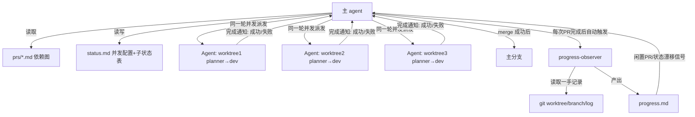

# architecture.md — 0005-pr-concurrent-execution

**版本**: 0.1.0
**迭代**: 0005-pr-concurrent-execution
**创建日期**: 2026-09-05
**阶段**: 技术架构（Phase 3）

---

## 架构目标

本迭代不新增代码模块或组件,而是**补全 `workflow-pb.md` 协议规范的执行细节**——让已存在的"阶段 5（PR 实现）:依赖解锁式并发调度"文字,从"从未被真实执行过的协议"变成主 agent 实际会遵守的调度纪律。

核心技术约束:
- **单会话调度**: 主 agent 在自己的单个会话内维护调度状态,不引入分布式锁/消息队列/外部调度服务
- **奥卡姆剃刀**: 优先复用现有 `status.md` 文件作为状态记录,不新增独立的调度日志文件或数据库
- **协议兼容**: 不改变 pr-planner/progress-observer/verifier 等执行角色的输入输出契约

---

## 核心技术决策

### 决策 D1: 并发调用技术路径（AR-01 补全）

**技术手段**: 主 agent 在同一轮 assistant 响应中,连续发起多个 `Agent()` 工具调用。

**实现原理**:
- 根据 Claude 工具系统的并发语义,同一条 assistant message 里的多个 tool use block 会并发执行,不需要等待前一个返回
- 每个 `Agent()` 调用对应一个独立 PR 的执行流程(创建 worktree → 派发 planner → 派发 dev → 验收 → merge)
- 主 agent 在派发前先批量读取 `prs/*.md`,抽取 `depends_on`,构建依赖图,筛选出"无依赖或依赖均已合并"的 PR 列表,从中取前 N 个(N 为当前槛位数)发起并发调用

**配置存储**: 起始并发数记录在 `docs/iterations/{迭代ID}/status.md` 新增字段 `**并发配置**` 章节:

```markdown
## 并发配置（阶段 5）

- **起始并发数**: 3
- **当前有效上限**: 3（未触发爬升前等于起始值）
- **已派发总数**: 0
```

**L2决策理由**:
- 不引入新技术栈,复用现有 Agent 工具和 status.md 文件
- 不改变任何执行角色的输入输出契约
- 起始并发数是迭代级配置(demand.md §2 要求),放在该迭代的 status.md 而非全局配置文件,符合现有工作流的路径协议

---

### 决策 D2: 爬升算法与硬上限（AR-02 补全）

**爬升算法**: `当前有效上限 = min(起始并发数 + 累计成功解锁次数 × 起始并发数, 硬上限)`

- **触发条件**: 任意一个并发中的 PR 返回"成功合并"或"失败/阻塞"判定
- **增量规则**: 每次触发,`累计成功解锁次数 += 1`,重新计算上限
- **示例**（起始=3, 硬上限=5）:
  - 初始: 有效上限=3, 派发 3 个 PR
  - PR-001 成功合并: 累计解锁次数=1, 有效上限=min(3+1×3, 5)=5, 可补位派发 3 个(之前剩2个在跑,现在达到5个)
  - 达到硬上限后: 无论再有多少 PR 返回,有效上限维持 5

**硬上限数值**: `硬上限 = 2 × 起始并发数 - 1`

- 起始=3 时,硬上限=5
- 起始=2 时,硬上限=3
- demand.md 给出的参考公式即 `2×起始值-1`,采纳该公式,理由: 保守爬升(最多增长不到1倍),足够本迭代验证并发安全性

**记录字段**: 在 `status.md` 的 `## 并发配置（阶段 5）` 中新增两个字段:

```markdown
## 并发配置（阶段 5）

- **起始并发数**: 3
- **硬上限**: 5（公式: 2×起始-1）
- **当前有效上限**: 3（初始等于起始值,随爬升触发递增至硬上限）
- **累计成功解锁次数**: 0（每次有 PR 返回结果时 +1）
- **已派发总数**: 0
```

上限值通过 `当前有效上限` 字段直接可读,不需要独立的调度日志文件。

**L2决策理由**:
- 公式简单,易验证,符合"保守起步"的设计意图
- 所有状态字段均在现有 status.md 承载,不新增独立数据存储
- demand.md §2 明确"留给架构阶段设计",本决策采纳了 demand 给出的参考公式而非重新发明

---

### 决策 D3: 槛位释放调度时机（AR-03 补全）

**实现时机**: 主 agent 收到任一 PR 子 agent 返回的完成通知时(无论成功还是失败/阻塞),在同一轮 turn 内立即执行以下动作:

1. 更新 `status.md` 的 `PR 实现子状态` 表: 对应行标记"已合并"或"失败/阻塞"
2. `累计成功解锁次数 += 1`, 重新计算 `当前有效上限`
3. 重新扫描 `prs/*.md` 依赖图,筛选"已解锁且排队中"的 PR
4. 从筛选结果中取前 N 个(`N = 当前有效上限 - 仍在执行中的PR数量`),在同一轮响应内发起新的并发 `Agent()` 调用

**记录方式**: `status.md` 的 `## PR 实现子状态（阶段 5 展开）` 表新增一列 `槛位状态`:

```markdown
| PR 文件 | depends_on | 状态 | worktree 分支 | 已合并 | 槛位状态 |
|---|---|---|---|---|---|
| pr-001-xxx.md | (无) | ⏸进行中 | feat/pr-001 | ⬜ | 占用 |
| pr-002-xxx.md | pr-001 | ⬜未开始 | | ⬜ | 排队(依赖未满足) |
| pr-003-xxx.md | pr-001 | ✅已完成 | (已清理) | ✅ | 已释放 |
| pr-004-xxx.md | (无) | ❌失败 | feat/pr-004(保留) | ⬜ | 已释放 |
```

- **占用**: 该 PR 的子 agent 正在执行,占用一个并发槛位
- **排队(依赖未满足)**: 依赖未满足,等待依赖 PR 合并
- **排队(等待槛位)**: 依赖已满足但当前槛位已满,等待释放
- **已释放**: 该 PR 已判定完成(成功或失败),不再占用槛位

**L2决策理由**:
- 槛位释放是主 agent 在单会话内的状态更新+立即派发动作,不需要异步通知或消息队列
- "槛位状态"列复用现有表结构新增一列,不新建独立的槛位跟踪文件,符合奥卡姆剃刀

---

### 决策 D4: 失败/阻塞 worktree 现场标识（AR-04 补全）

**标识方式**: 复用决策 D3 新增的"槛位状态"列不足以表达"现场保留"语义,在 `PR 实现子状态` 表的"状态"列使用专门取值区分:

- `❌失败(现场保留)`: worktree 目录和分支原样保留,未清理
- `⏸阻塞(现场保留)`: 同上

对应"worktree 分支"列同时标注 `(保留)`,例如 `feat/pr-004(保留)`,与成功合并后清理的 PR(该列显示"(已清理)")形成对比,便于人工扫一眼区分。

**不新增字段/文件的理由**: "现场保留"是失败/阻塞状态的固有属性(F04 验收标准 4: 两者不互斥、同时成立),不需要独立字段去"标记该不该保留"——只要状态是失败/阻塞,现场保留即是默认行为,不需要额外的调度判断逻辑。

**progress-observer 核实点**: 现有 `progress-observer` 角色(见 progress-observer.md)已经承担"核实 git 一手记录"的职责,新增核实项——每次生成 `progress.md` 时,对状态为"失败/阻塞"的 PR,核实其 worktree 目录和分支是否仍存在于磁盘(`git worktree list` + `git branch` 交叉核对),若已被清理则视为不一致,记入"发现的不一致"部分。这一核实点写入 `workflow-pb.md` 的"可观测性"章节,不修改 progress-observer.md 本身的角色定义(其角色文件已经是"核实一手记录"的通用能力,只是调度契约层追加一条具体核实内容)。

**L2决策理由**:
- 复用现有表结构和现有 progress-observer 能力,不新建"现场保留登记表"
- 状态值本身自解释("失败(现场保留)"),不需要额外的布尔字段

---

## 组件与调度关系（无新增组件）

本次迭代不新增执行角色、不新增独立服务/存储,只是在主 agent 的调度逻辑和 `status.md` 记录结构上补全细节。涉及的现有组件及其调度关系:



**核心数据流**:
1. 主 agent 读 `prs/*.md` 构建依赖图 → 筛选已解锁 PR → 按"当前有效上限"取前 N 个 → 同一轮响应内并发发起 `Agent()` 调用
2. 每个子 agent 在独立 worktree 完成"派发 planner → 派发 dev → 验收 → merge"后返回结果给主 agent
3. 主 agent 收到结果 → 更新 `status.md`(状态列+槛位状态列+并发配置字段) → 重新计算有效上限 → 重新扫描依赖图 → 补位派发
4. 每次 PR 完成 merge,自动触发 progress-observer 核实一手 git 状态,发现不一致或闲置 PR 时反馈给主 agent 决策

---

## 对 workflow-pb.md 的目标改动（供 PR 规划阶段引用,本阶段不直接修改该文件）

架构阶段只设计方案,不修改 `workflow-pb.md` 本身——按 architect 角色边界,协议文件的实际改动属于阶段 5(PR 实现)的产出。以下是本方案要求「阶段 5(PR 实现):依赖解锁式并发调度」章节需要补充的内容,供 pr-planner 拆 PR 、dev 实现时对照:

1. 在"阶段 5"章节补充**并发槛位算法**的具体描述: 起始并发数从 status.md 读取(默认 3)、爬升公式 `min(起始+累计解锁次数×起始, 硬上限)`、硬上限公式 `2×起始-1`
2. 在"启动工作流"章节补充: 主 agent 进入阶段 4→5 时,须在 status.md 初始化 `## 并发配置（阶段 5）` 区块(字段见决策 D1/D2)
3. 在"PR 实现子状态"表格式定义处,新增"槛位状态"列(决策 D3)和"状态"列的失败/阻塞专属取值(决策 D4)
4. 在"可观测性"章节的 progress-observer 触发说明处,补充"核实失败/阻塞 PR 的 worktree/分支是否仍存在"这一具体核实项(决策 D4)
5. 明确写出并发派发的技术手段: "同一轮 assistant 响应中连续发起多个 Agent 工具调用"(决策 D1),替换掉此前"这套协议文字从未被真实调度执行"的模糊表述

---

## L1 决策清单

**无。**

本次迭代的技术决策(并发调用手段、爬升算法、硬上限数值、状态记录字段)均在"现有技术栈内的选型"和"局部数据流/记录结构设计"范围内(L2),不涉及引入新技术栈、不改变任何执行角色的核心职责、不影响系统整体边界——继续复用 Agent 工具、status.md 文件、既有 progress-observer 角色。

**建议主 agent 留意但非 L1 的一点**: 决策 D2 中硬上限的具体数值(`2×起始-1`,起始3→硬上限5)直接决定了资源占用峰值(同时运行的子 agent 数量),虽然不构成技术架构 L1 决策,但如果用户对资源/成本敏感,可以在报告环节向用户确认这个具体数值,而不仅是"存在硬上限"这件事本身。demand.md 已将该数值的选择权明确留给架构阶段,本方案采纳了 demand.md 给出的参考公式,不是新发明的数值。

---

## 验证

- F01~F04 的 `[架构待填]` 项已在 prd/*.md 对应文件中补全为具体技术路径(见下方"prd 补全记录")
- 每个决策(D1~D4)均可追溯到对应功能卡(F01/F02/F03/F04)的验收标准
- 未引入 status.md 之外的新增独立文件/数据存储,符合奥卡姆剃刀
- F05(安全边界不变)未产生新的技术决策点,已在其边界说明中确认:本方案的槛位释放(D3)和现场保留(D4)均不改变"合并才算解锁"和"文件范围无重叠"两条既有校验的适用范围
- 无 L1 决策,无需等待确认即可进入阶段 4(PR 规划)

## prd 补全记录

- F01 `[架构待填]` → 已补全为决策 D1(并发调用技术手段 + 配置存储位置)
- F02 `[架构待填]` → 已补全为决策 D2(爬升公式 + 硬上限数值 + 记录字段)
- F03 `[架构待填]` → 已补全为决策 D3(槛位释放时机 + 记录方式)
- F04 `[架构待填]` → 已补全为决策 D4(现场保留标识方式)
- F05 无需补全(该卡本身注明"确认现状不变,不产生新技术决策点")
