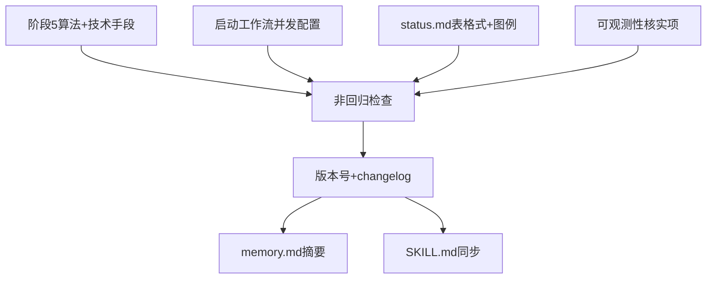

# pr-001-workflow-pb-concurrent-dispatch-protocol-tasks.md

**对应 PR**: `prs/pr-001-workflow-pb-concurrent-dispatch-protocol.md`
**对应阶段**: PR 实现（阶段 5）内部任务拆解，由 `planner` 产出
**上游产物**: `architecture.md` §决策 D1~D4、§「对 workflow-pb.md 的目标改动」；`prd/F01~F05.md`
**协议基线**: `roles/workflow-pb/workflow-pb.md`（当前版本 0.3.0，修改对象）

---

## 1. 规划概要

### 1.1 目标

把 PR-001 的 8 条验收标准（原文档标注"六条"，但实际逐条清点为 8 条 checkbox——以文件原文为准，不采信摘要口径）拆解为可独立验收的任务：逐一补全 `workflow-pb.md` 四处协议文字（阶段 5 算法与技术手段、启动工作流并发配置初始化、`status.md` 表格式新增列、可观测性核实项），做一次跨改动点的非回归检查，最后完成版本号递增 + 三处同步文件（changelog、memory、SKILL.md）。

### 1.2 范围边界

只改动 PR 文件范围列出的四个文件：
- `roles/workflow-pb/workflow-pb.md`
- `roles/workflow-pb/data/workflow-pb-changelog.md`
- `roles/workflow-pb/memory.md`
- `.claude/skills/workflow-pb/SKILL.md`

不改动：`pr-planner`/`progress-observer`/`verifier` 等角色文件本身；不新增独立调度日志文件或数据库（architecture.md 已确认奥卡姆剃刀）；不修改「依赖必须合并进主分支才算解锁」和「PR 间文件范围无重叠」两条现有规则的适用范围；不引入新增语义耦合检测逻辑。

### 1.3 任务总览

| 任务 ID | 名称 | 关联验收标准（PR 原文 checkbox 序号） | 前置依赖 | model_inferred |
|---|---|---|---|---|
| T01 | 阶段 5 章节：并发槛位算法 + 并发派发技术手段文字 | 1、5 | 无 | 否 |
| T02 | 启动工作流章节：`status.md` 并发配置初始化 | 2 | 无 | 否 |
| T03 | `status.md` 格式模板：PR 实现子状态表新增列 + 状态符号图例同步 | 3 | 无 | 否 |
| T04 | 可观测性章节：progress-observer 新增核实项 | 4 | 无 | 否 |
| T05 | 跨改动点非回归检查 | 6 | T01、T02、T03、T04 | 否 |
| T06 | 版本号递增 + changelog 条目 | 7 | T01~T05 | 否 |
| T07 | memory.md 索引摘要追加 | （文件范围要求，无独立 checkbox） | T06 | 是 |
| T08 | SKILL.md 同步更新 | 8 | T06 | 否 |

### 1.4 任务依赖图

**循环检查**：无循环依赖。T01~T04 互相独立（不同章节，无共享符号/字段被对方消费），可任意顺序执行；T05 汇总校验前四者结果；T06 依赖 T05 通过；T07/T08 各自依赖 T06 但互相独立。

---

## 2. 任务详情

### T01：阶段 5 章节 — 并发槛位算法 + 并发派发技术手段文字

- **前置依赖**：无
- **改动位置**：`roles/workflow-pb/workflow-pb.md` `### 阶段 5（PR 实现）：依赖解锁式并发调度`（当前第 194~205 行）
- **目标**：在该章节现有 4 步流程描述之后（不删除现有第 1~4 步和"为什么必须以合并进主分支……"段落），补充两块内容：
  1. 并发槛位算法的具体描述——起始并发数从 `status.md` 读取（默认 3）、爬升公式 `当前有效上限 = min(起始并发数 + 累计成功解锁次数 × 起始并发数, 硬上限)`、硬上限公式 `硬上限 = 2 × 起始并发数 - 1`。
  2. 并发派发的技术手段：明确写出"主 agent 在同一轮 assistant 响应中连续发起多个 `Agent()` 工具调用"，替换掉当前第 79 行"这套协议文字从未被真实调度执行过一次"一类描述问题现状的模糊表述——把该处文字改写为已落实的具体机制描述（不是删掉这句话不管，而是替换成机制描述，因为它目前是 v0.2.0 变更说明的一部分，属于历史记录，应保留历史事实描述，只改动"阶段 5"正文章节内、以及必要时"角色读取指南"周边如果存在类似模糊表述的地方）。

  **注意范围界定**：第 79 行"这套协议文字从未被真实调度执行"出现在"阶段定义"表后的说明段落（"> 阶段 5「PR 实现」内部的任务拆解由 `planner` 角色承担……"），需先用 `grep -n` 在实际执行时重新核对该表述当前所在的具体行号（本任务文件写作时读到的是 v0.3.0 文本，dev 执行时应以自己读到的当前文件行号为准，不假设行号不变）。若该模糊表述实际出现在别处（如"阶段 5"章节正文内），一并替换，不要因为本任务描述的位置预期与实际不完全一致就跳过替换。

- **验收标准**：
  - **AC-T01-1**：`### 阶段 5` 章节内出现完整的爬升公式 `min(起始并发数 + 累计成功解锁次数 × 起始并发数, 硬上限)` 和硬上限公式 `2 × 起始并发数 - 1`，且注明起始并发数默认值为 3、来源是 `status.md`。
    **追溯**：PR 验收标准第 1 条；`architecture.md` §决策 D2；`prd/F02-concurrency-climb-mechanism.md` §架构维度。
  - **AC-T01-2**：`### 阶段 5` 章节内出现"主 agent 在同一轮 assistant 响应中连续发起多个 `Agent()` 工具调用"这一表述（原文或语义等价的完整表述，不能只写"并发调用"不说明具体机制）。
    **追溯**：PR 验收标准第 4 条；`architecture.md` §决策 D1；`prd/F01-concurrent-dispatch-execution.md` §架构维度。
  - **AC-T01-3**：全文搜索确认"这套协议文字从未被真实调度执行"或语义等价的模糊表述（描述"协议从未被执行"这一问题现状的句子）不再出现在 `workflow-pb.md` 的规范性正文章节中；`data/workflow-pb-changelog.md` 里作为历史记录出现的类似措辞不受本条约束（那是变更历史，描述的是过去发生的事实，不是本文件当前正在生效的规范文字）。
    **追溯**：PR 验收标准第 4 条。
  - **AC-T01-4**：现有第 1~4 步流程描述、"为什么必须以合并进主分支作为解锁条件"段落、"`batch` 字段的定位"段落均保留，未被删除或语义弱化。
    **追溯**：PR 验收标准第 5 条（"未删除、未弱化现有……两条规则的适用范围"）；F05 验收标准 1、2。

---

### T02：启动工作流章节 — `status.md` 并发配置初始化

- **前置依赖**：无
- **改动位置**：`roles/workflow-pb/workflow-pb.md` `### 启动工作流`（当前第 180~184 行）
- **目标**：在现有 3 步（确认迭代 ID / 创建 status.md / 从阶段 1 开始）之后，补充一条：主 agent 进入阶段 4→5 时，须在该迭代的 `status.md` 中初始化 `## 并发配置（阶段 5）` 区块，字段包括：
  - `**起始并发数**`（默认 3）
  - `**硬上限**`（公式 `2×起始-1`）
  - `**当前有效上限**`（初始等于起始并发数）
  - `**累计成功解锁次数**`（初始 0）
  - `**已派发总数**`（初始 0）

  字段名和默认值须与 `architecture.md` 决策 D1/D2 给出的字段列表和示例区块完全一致（含起始并发数默认 3、硬上限公式 `2×起始-1`），不要自行调整字段名称或增减字段。

- **验收标准**：
  - **AC-T02-1**：`### 启动工作流` 章节明确写出"进入阶段 4→5 时须初始化 `## 并发配置（阶段 5）` 区块"这一步骤，且该步骤在时序上位于阶段 5 实际并发派发之前（可以作为启动工作流的新增第 4 步，或作为阶段 4→5 之间的独立说明，只要读者能明确该初始化动作发生在阶段 5 第一次并发派发之前）。
    **追溯**：PR 验收标准第 2 条；`architecture.md` §决策 D1、D2。
  - **AC-T02-2**：列出的字段名与 `architecture.md` 决策 D1/D2 的示例区块（起始并发数/硬上限/当前有效上限/累计成功解锁次数/已派发总数）逐字段一致，不多不少。
    **追溯**：PR 验收标准第 2 条；F01 验收标准 4（起始并发数是迭代级配置）；F02 验收标准 3（上限值可查证）。

---

### T03：`status.md` 格式模板 — PR 实现子状态表新增列 + 状态符号图例同步

- **前置依赖**：无
- **改动位置**：`roles/workflow-pb/workflow-pb.md` `### status.md 格式`（当前第 319~356 行，含"## PR 实现子状态（阶段 5 展开）"表格模板和"状态符号"图例行）
- **目标**：
  1. 表格模板新增一列"槛位状态"，取值域固定为四种：`占用` / `排队(依赖未满足)` / `排队(等待槛位)` / `已释放`（不要发明其他取值）。
  2. "状态"列现有取值 `✅ 已完成 / ⏸ 进行中或阻塞 / ⬜ 未开始` 需要拆分出失败/阻塞的专属取值：新增 `❌失败(现场保留)`、`⏸阻塞(现场保留)`，与现有 `⏸` 的语义区分开（现有 `⏸` 表示"进行中或阻塞"未区分二者，需要在图例说明里明确：`⏸` 单独出现时表示"进行中"，阻塞时改用 `⏸阻塞(现场保留)` 这一更具体的取值）。
  3. "worktree 分支"列的取值约定新增说明：成功合并后清理的 PR 标注 `(已清理)`，失败/阻塞现场保留的 PR 标注 `(保留)`，例如 `feat/pr-004(保留)`。

  参考 `architecture.md` §决策 D3、D4 给出的示例表格（第 96~105 行），格式和取值域以该示例为准。

- **验收标准**：
  - **AC-T03-1**：`status.md` 格式模板中的"PR 实现子状态"表包含"槛位状态"列，列出的四个取值（占用/排队(依赖未满足)/排队(等待槛位)/已释放）在模板说明文字中逐一定义。
    **追溯**：PR 验收标准第 3 条；`architecture.md` §决策 D3；`prd/F03-slot-release-on-failure.md` §架构维度。
  - **AC-T03-2**："状态"列的取值说明中包含 `❌失败(现场保留)` 和 `⏸阻塞(现场保留)` 两个专属取值，且与既有 `⬜`/`✅`/`⏸` 三种取值的图例统一列在同一处（不要分散成两套不关联的图例）。
    **追溯**：PR 验收标准第 3 条；`architecture.md` §决策 D4；`prd/F04-failure-worktree-preservation.md` §架构维度。
  - **AC-T03-3**："worktree 分支"列的说明文字中出现 `(保留)` 和 `(已清理)` 两种标注约定的对比说明。
    **追溯**：PR 验收标准第 3 条；F04 验收标准 1、2、3（worktree/分支现场原样保留、未删除、不执行自动清理）。
  - **AC-T03-4**：新增列/取值不影响现有"PR 实现子状态"表已有列（PR 文件、depends_on、状态、worktree 分支、已合并）的既有语义——即只做新增，不做替换或删除已有列。
    **追溯**：PR 验收标准第 5 条（不弱化现有规则）；F05 边界（不改变现有校验适用范围）。

---

### T04：可观测性章节 — progress-observer 新增核实项

- **前置依赖**：无
- **改动位置**：`roles/workflow-pb/workflow-pb.md` `### 可观测性：progress-observer 自动/按需触发`（当前第 207~218 行）
- **目标**：在"触发时机"说明之后（不改动"自动触发"/"按需触发"两条现有触发条件本身），新增一条具体核实项：每次生成 `progress.md` 时，对状态为失败/阻塞的 PR，核实其 worktree 目录和分支是否仍存在于磁盘（技术手段：`git worktree list` + `git branch` 交叉核对），若发现已被清理（不一致），记入 `progress.md` 的"发现的不一致"部分。

  **明确边界**（承接 `architecture.md` D4 说明）：这一核实项写入 `workflow-pb.md` 的调度契约层，不修改 `progress-observer.md` 角色文件本身的定义——`progress-observer` 角色文件已经具备"核实一手记录"的通用能力，本任务只是在调度契约里补充一条具体的核实内容清单项，不是新增角色能力。

- **验收标准**：
  - **AC-T04-1**：`### 可观测性` 章节内新增文字明确写出"对状态为失败/阻塞的 PR，核实 worktree 目录和分支是否仍存在于磁盘"这一核实动作，且指明具体核实手段（`git worktree list` + `git branch` 交叉核对）。
    **追溯**：PR 验收标准第 4 条；`architecture.md` §决策 D4；`prd/F04-failure-worktree-preservation.md` §架构维度"核实机制"。
  - **AC-T04-2**：新增文字明确该核实项的触发时机是"每次生成 `progress.md` 时"，且明确不一致时的去向是"记入发现的不一致部分"。
    **追溯**：PR 验收标准第 4 条。
  - **AC-T04-3**：`roles/progress-observer/progress-observer.md` 文件本身未被本任务修改（该文件不在 PR 文件范围内，任务执行中不应触碰）。
    **追溯**：PR 文件范围列表（未列出 progress-observer.md）；`architecture.md` §决策 D4"不修改 progress-observer.md 角色定义本身"。

---

### T05：跨改动点非回归检查

- **前置依赖**：T01、T02、T03、T04 均完成
- **目标**：T01~T04 分别改动 `workflow-pb.md` 的四个不同章节，但存在跨章节字段引用（如 T03 的"槛位状态"取值语义依赖 T01 的爬升算法描述、T02 的字段初始化是 T01/T03 状态记录的前提），本任务做一次通读级检查，确认四处改动之间没有互相矛盾或遗漏引用。
- **验收标准**：
  - **AC-T05-1**：通读整份 `workflow-pb.md`，确认"起始并发数""硬上限""当前有效上限""累计成功解锁次数""已派发总数"五个字段名，在 T01（阶段 5 算法描述）、T02（启动工作流初始化）、T03（status.md 表格式）三处出现的地方，字段名拼写完全一致（不能一处写"当前有效上限"另一处写"当前生效上限"之类的不一致措辞）。
    **追溯**：PR 验收标准第 6 条（"未引入任何新增的语义耦合检测逻辑"隐含要求文字本身一致，避免因术语不一致产生新的理解歧义）；`architecture.md` 全文术语统一性。
  - **AC-T05-2**：确认"合并进主分支才算解锁"（现有规则）与 T01 新增的爬升算法描述之间不矛盾——即爬升带来的新增槛位，仍然只能分配给"已解锁"（依赖已合并）的排队 PR，新增文字中未出现"槛位空出时不管是否解锁都派发"一类表述。
    **追溯**：PR 验收标准第 5 条；F02 验收标准 4；F05 验收标准 1、4。
  - **AC-T05-3**：确认"PR 间文件范围无重叠"这条规则在四处改动的任何新增文字中都未被重新定义、未被附加新的例外条件。
    **追溯**：PR 验收标准第 5 条；F05 验收标准 2。
  - **AC-T05-4**：确认四处改动均未引入检测"两个不改同一文件但语义上仍相互依赖的 PR"这类新增语义耦合检测逻辑的文字描述。
    **追溯**：PR 验收标准第 5 条；F05 验收标准 3。

---

### T06：版本号递增 + changelog 条目

- **前置依赖**：T01~T05 均完成且 T05 检查无问题
- **改动位置**：`roles/workflow-pb/workflow-pb.md` 文件头（当前第 25 行 `**版本**: 0.3.0`）+ `roles/workflow-pb/data/workflow-pb-changelog.md`（追加新条目，不改动已有条目）
- **目标**：
  1. `workflow-pb.md` 文件头版本号从 `0.3.0` 递增到 `0.4.0`——理由：本次是协议执行细节的实质性补全（新增可执行的算法公式、状态记录字段、核实项），不是措辞微调，按项目现有 semver 习惯（参照 v0.2.0→v0.3.0 的递增幅度，均为 minor 版本）递增 minor 位，不递增 major（未改变阶段划分或角色职责边界）、不只递增 patch（内容不是纯措辞修订）。
  2. 在 `workflow-pb-changelog.md` 追加一条新版本条目（格式参照现有 v0.2.0/v0.3.0 条目：**触发**/**根因**/**决策过程**（如有）/**具体改动**），内容须可追溯到本迭代 `0005-pr-concurrent-execution`，且用一句话点出触发背景（协议文字从未被真实调度执行 → 补全为可执行细节）。

- **验收标准**：
  - **AC-T06-1**：`roles/workflow-pb/workflow-pb.md` 文件头版本号为 `0.4.0`（不是 0.3.1，不是 1.0.0）。
    **追溯**：PR 验收标准第 7 条。
  - **AC-T06-2**：`workflow-pb-changelog.md` 新增一条 `## v0.4.0（{改动当天日期}）` 条目，追加在文件末尾（不修改 v0.3.0/v0.2.0 已有条目内容），条目中出现"`0005-pr-concurrent-execution`"这一迭代 ID 字样，且"具体改动"部分逐条对应 T01~T04 的四处改动点。
    **追溯**：PR 验收标准第 7 条；PR 文件范围第 2 项。
  - **AC-T06-3**：新增 changelog 条目格式（**触发**/**根因**/**具体改动** 等小节标题）与现有 v0.2.0/v0.3.0 条目的小节结构一致，不发明新的条目结构。
    **追溯**：PR 参考资料"版本变更记录格式参考，v0.2.0/v0.3.0 条目"。

---

### T07：memory.md 索引摘要追加

- **前置依赖**：T06 完成（需要引用最终确定的版本号和 changelog 条目路径）
- **改动位置**：`roles/workflow-pb/memory.md`（追加一条索引摘要，不改动已有条目）
- **目标**：按该文件现有格式（如 `- **v0.3.0（日期）**：一句话摘要，根因和决策过程见 data/workflow-pb-changelog.md`），追加一条 `v0.4.0` 摘要行，一句话概括本次改动内容（并发槛位算法+状态记录字段补全），并指向 `data/workflow-pb-changelog.md` 查看详情。

- **验收标准**：
  - **AC-T07-1**：`memory.md` 新增一行 `- **v0.4.0（{日期}）**：{一句话摘要}。根因和决策过程见 \`data/workflow-pb-changelog.md\`。`，格式与现有 v0.2.0/v0.3.0 两行的句式结构一致（加粗版本号+日期开头，末尾指向 changelog）。
    **追溯**：PR 文件范围第 3 项（"沿用项目既有惯例"）。
  - **AC-T07-2**：已有的 memory.md 索引条目（v0.3.0/v0.2.0 摘要行 + 三条 data/ 链接）未被删除或改写。
    **追溯**：PR 验收标准第 5 条（不弱化现有内容）；红线声明"memory.md 是精选索引，可删不重要条目，但不是本任务的职责——本任务只做追加"。
  - **AC-T07-3**（`[model_inferred]`，需主 agent 确认）：追加位置是在现有版本摘要行的最上方（最新版本在前）还是最下方——本任务默认参照现有两行 v0.3.0 在上、v0.2.0 在下的排列顺序，将 v0.4.0 追加在 v0.3.0 之上（时间倒序）。若该排列约定实际上不是有意为之而是巧合，需要主 agent 确认后再决定是否调整。

---

### T08：SKILL.md 同步更新

- **前置依赖**：T06 完成
- **改动位置**：`.claude/skills/workflow-pb/SKILL.md`
- **目标**：同步反映 T01~T04 在 `workflow-pb.md` 中新增的并发槛位算法、`status.md` 新增字段/列、progress-observer 新增核实项这三类实质变更，且不与 `workflow-pb.md` 正式规范产生矛盾或遗漏。具体改动点（对照当前 SKILL.md 结构）：
  1. 文件头 `**版本**` 行（当前 `1.6.0（对应规范 workflow-pb v0.3.0）`）更新为下一个 minor 版本并同步"对应规范"号到 `v0.4.0`。
  2. `### Step 5: 依赖解锁式并发 PR 派发` 章节（当前第 158~167 行）补充并发槛位算法要点（起始并发数、爬升公式、硬上限）的精简版描述，与 `workflow-pb.md` T01 的完整描述语义一致，不需要逐字复制全文（SKILL.md 本身是精简版协议，见其"完整规范见 ..."的定位）。
  3. `## § status.md 更新时机`章节（当前第 319~329 行）补充"进入阶段 5 前须初始化并发配置区块"这一条，与 T02 呼应。
  4. `## Important facts and constraints` 章节新增一条关于失败/阻塞 PR 现场保留 + progress-observer 核实项的要点，与 T04 呼应。
  5. `**变更历史**` 行追加新的 `data/skill-optimization-v1.7.0.md` 文件名引用，并**实际新建该文件**（用户已确认沿用惯例，`[user_confirmed]`）——参照 `data/skill-optimization-v1.6.0.md` 的结构（触发/根因/具体改动），内容对应本次 T01~T04 在 workflow-pb.md 的实质变更同步到 SKILL.md 精简版的过程。

- **验收标准**：
  - **AC-T08-1**：SKILL.md 文件头版本号和"对应规范"号均已更新，且"对应规范"号与 `workflow-pb.md` 的 T06 最终版本号（0.4.0）一致。
    **追溯**：PR 验收标准第 8 条。
  - **AC-T08-2**：`### Step 5` 章节内出现并发槛位算法的要点式描述（至少提到"起始并发数""爬升""硬上限"三个概念，具体公式可精简但不能只字未提）。
    **追溯**：PR 验收标准第 8 条；`architecture.md` §决策 D2。
  - **AC-T08-3**：`## § status.md 更新时机` 或等价章节内出现"阶段 5 前初始化并发配置区块"这一条目。
    **追溯**：PR 验收标准第 8 条；对应 T02。
  - **AC-T08-4**：`## Important facts and constraints` 或等价章节内出现失败/阻塞 PR 现场保留 + progress-observer 核实项的要点。
    **追溯**：PR 验收标准第 8 条；对应 T04。
  - **AC-T08-5**：SKILL.md 新增文字与 `workflow-pb.md`（T01~T04 改动后的正式版本）逐条对照，未出现数值/公式/取值域不一致（如两处硬上限公式写法不同）。
    **追溯**：PR 验收标准第 8 条（"不与 workflow-pb.md 正式规范的文字产生矛盾或遗漏"）。

---

## 3. 验证清单（全部任务完成后，交回 dev/verifier 前自查）

- [ ] T01~T04 四处改动均已落地，且 T05 的四项非回归检查全部通过
- [ ] `workflow-pb.md` 版本号 0.4.0，changelog 新增对应条目
- [ ] `memory.md` 追加一行摘要，未破坏现有条目
- [ ] `SKILL.md` 版本号、Step 5、status.md 更新时机、Important facts 四处同步，且与 workflow-pb.md 无矛盾
- [ ] 全文没有遗留"从未被真实调度执行"一类描述问题现状的模糊表述（历史 changelog 条目除外）
- [ ] 现有"合并进主分支解锁""文件范围无重叠"两条规则的原文表述未被删除或弱化
- [ ] `roles/pr-planner/`、`roles/progress-observer/`、`roles/verifier/` 等角色文件未被本 PR 触碰

---

## 4. `[model_inferred]` 标注汇总（需主 agent 确认）

- **AC-T07-3**：memory.md 新增摘要行的插入位置（时间倒序排在最上方）是否是有意的排列惯例，还是巧合；若主 agent/用户确认这只是巧合排列，不影响任务完成判定，仅供参考。
- **T08 第 5 点**：`data/skill-optimization-v{新版本号}.md` 是否需要作为本 PR 的一部分新建——PR 文件范围只列出 `SKILL.md`本身，未列出 `data/` 下的新文件，但项目历史惯例（v1.1.0~v1.6.0 均有对应 data 文件）显示每次版本变更都会新建。若严格按 PR 文件范围（不新增文件范围外的文件）执行，本任务不新建该文件，只在 SKILL.md 变更历史行追加引用；若这样导致引用了不存在的文件路径，dev 执行时应在 Verify 阶段发现该矛盾并向主 agent 报告，不擅自决定是否新建。

---

**任务粒度说明**：T01~T04 均可独立验收（各自只依赖 `workflow-pb.md` 当前已存在的章节结构，互不消费对方产出）；T05 是四者的汇总一致性检查，粒度上不到 1 天工作量，但因为它是"能否推进到 T06"的判断闸门，单独列为一个任务而非并入 T01~T04 之一，避免"验收标准需要看完四个改动才能判断"的情况被埋进某个具体改动任务里变得不可见。T06~T08 按文件依次收尾，粒度均在半天以内，符合"能独立验收"下限，未进一步拆分的理由是拆分后不会产生额外的独立验收价值（例如"版本号递增"单独拆一个任务毫无意义，与 changelog 追加合并成 T06 更符合"逻辑原子性"）。

