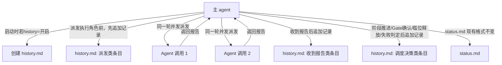

# architecture.md — 0007-workflow-history-log

**版本**: 0.1.0
**迭代**: 0007-workflow-history-log
**创建日期**: 2026-09-07
**阶段**: 技术架构（Phase 3）

---

## 架构目标

本迭代不新增代码模块，也不改变任何执行角色的能力边界——而是**给 workflow-pb 协议新增一个独立于 `status.md` 的记录产物 `history.md`**，把主 agent 的派发、报告接收、调度决策三类事件按发起顺序逐条落盘。

核心技术约束（均来自 demand.md 已确认结论，架构阶段不重新论证）：
- **与 `status.md` 并存、职责不同、格式互不侵入**：不改变 `status.md` 现有格式和维护时机。
- **由主 agent 自己直接维护**：不派发给执行角色代写，不引入新的执行角色。
- **奥卡姆剃刀**：不引入独立的日志系统、不引入序号字段/锁机制，除非能证明"不引入它，某条验收标准无法满足"。
- **协议兼容**：不修改任何角色文件（`roles/<role>/<role>.md`）本身的报告契约字段定义，只在 workflow-pb.md/SKILL.md 追加"如何摘录"的调度层规则。

---

## 核心技术决策

### 决策 D1：history.md 记录协议独立成节，不并入「状态追踪协议」（AR-01 部分补全）

**决策**：在 `workflow-pb.md` 新增一节 `## 历史记录协议（history.md）`，与现有 `## 状态追踪协议（status.md）` 平级并列，不把 history.md 的格式定义塞进 status.md 章节内部。SKILL.md 对应新增 `## § history.md 更新时机` 一节，与现有 `## § status.md 更新时机` 平级并列。

**理由**：demand.md §6「与 status.md 的边界」已明确两者"职责不同、并存、本次不改变 status.md 既有格式"。如果把 history.md 的格式定义写进「状态追踪协议」章节内部，会造成"status.md 协议文字里混入了另一个文件的格式定义"——读者读该章节时无法一眼确认这条规则管的是哪个文件，违反 workflow-pb.md 自身「原则」中"约束和调度契约只存在于本文件一处"背后的"含糊即返工种子"精神。独立成节，章节标题即边界声明，零解释成本。

**L2 决策理由**：这是文档结构组织方式的选型，不引入新技术栈，不改变现有 status.md 内容,可自主决定。

---

### 决策 D2：history.md 落盘位置、创建/关闭时机（AR-01 部分补全）

**落盘位置**：`docs/iterations/{迭代ID}/history.md`，纳入「文档路径协议」现有目录树，与 `status.md` 同级。

**创建时机**：工作流启动时（「调度指南 § 启动工作流」步骤 2 创建 `status.md` 之后），若该迭代 `history` 开关为默认值"开启"（见决策 D3），立即创建空的 `history.md`（仅含一行标题 `# history.md — {迭代ID}`）。不等到第一次派发才创建——demand.md 验收标准要求"能观察到该文件在迭代进行过程中被多次追加写入"，文件本身的存在时点应与工作流启动时点一致，便于事后核对"文件创建时间"与"迭代启动时间"是否吻合。

**关闭时的行为**：若 `status.md` 中 `history` 字段被显式设为"关闭"（无论是启动时就关闭，还是运行中途改为关闭）：
- 启动时即关闭 → 不创建 `history.md`。
- 运行中途改为关闭 → 已存在的 `history.md` 保留不删除，但后续主 agent 不再对其追加写入。这是 F02 验收标准 3 的直接实现，不需要额外的"文件删除"逻辑（F02 边界已声明不包含删除）。

**L2 决策理由**：复用现有文档路径协议的目录结构，不新建独立子目录；创建时机选择"启动时立即创建"而非"首次事件发生时惰性创建"，理由是让"文件存在"本身成为"history 开关处于开启状态"的可观察信号，主 agent 和用户都可以不读 status.md 内容、只看目录里有没有这个文件就快速判断当前开关状态——这是一个非显然的选择（对比过"惰性创建"和"启动时创建"两种方案），采纳更利于可观测性的一种。

---

### 决策 D3：history 开关字段（AR-02 补全）

**字段位置与格式**：在 `status.md` 头部字段区（`**工作流**`/`**迭代**`/`**当前阶段**`/`**状态**` 所在的那组字段），新增一行，紧跟在 `**状态**` 字段之后：

```markdown
**history**: 开启
```

取值只有两种：`开启` / `关闭`。默认值为 `开启`（工作流启动创建 `status.md` 时写入该行，值为 `开启`）。

**理由**：`status.md` 头部已有的四个字段全部采用 `**字段名**: 值` 这一单行格式，`history` 字段是"整个迭代的一个开关状态"，语义上与"当前阶段""状态"同属于"迭代级元信息"，不属于"阶段状态表"或"PR 实现子状态表"这类结构化表格数据，放入头部字段区是对现有格式的直接复用，不新增表格列、不新增章节。

**L2 决策理由**：字段名/位置/取值的具体选型，在现有 `status.md` 格式内扩展，不改变已有字段，可自主决定。

---

### 决策 D4：三类事件的记录条目格式（AR-03 补全）

**统一外层格式**：每条记录是一个三级标题 + 若干字段行：

```markdown
### {YYYY-MM-DD HH:MM:SS} · {事件类型} · {对象}

- {字段1}：{值1}
- {字段2}：{值2}
```

- **时间戳格式**：`YYYY-MM-DD HH:MM:SS`（本地时间，24 小时制，不含时区）。选用到秒级精度而非现有 `verifier`/`clarifications` 惯例的 `YYYY-MM-DD` 日期级精度——理由见「为什么时间戳要到秒级」。
- **事件类型**取值三选一：`派发` / `收到报告` / `调度决策`。
- **对象**：派发/收到报告类填角色名（如 `architect`）；调度决策类填决策类别（`阶段推进核查` / `Gate确认` / `槛位释放` / `PR失败判定`）。

**派发类字段**（对应「Brief 构建规则」里已内联进 brief 的字段，只摘录不复制角色定义全文）：

```markdown
- 阶段：阶段 3（技术架构）
- 任务：在现有架构上演进，补全功能卡的架构维度，产出技术方案
```

阶段 5 额外加一行：
```markdown
- PR：prs/pr-{NNN-描述}.md
```

**收到报告类字段**：逐条摘录该角色「报告契约」已定义的编号/字段项，每项压缩成一句话结论值——不复制角色报告原文的解释性长文，只留判断性结论。映射规则："报告契约"里定义了几条编号字段（如 architect 5 条、pr-planner 4 条），history.md 就摘录几条，字段序号与角色报告契约的编号严格对应，不合并、不跳过；对于非编号列表式的报告契约（如 `verifier` 用固定模板字段"验证者身份/产出物/验证标准来源/..."代替编号），改为摘录模板的字段名+对应结论值,规则同源：都是"取该角色报告契约已定义的字段，摘一句话结论"。

```markdown
### 2026-09-07 14:32:10 · 收到报告 · architect

- 1. architecture.md 路径：docs/iterations/0007-workflow-history-log/architecture.md；核心组件：history.md 记录协议、开关字段、三类事件格式、顺序保真规则
- 2. L1 决策清单：无
- 3. 新引入技术组件：无
- 4. 架构待填补全数：4（AR-01~AR-04）
- 5. 疑问/越界：无
```

**调度决策类字段**（demand.md/F03 已锁定最低两个字段）：

```markdown
- 决策内容：{具体决策是什么}
- 触发依据：{具体触发的条件、依据的文件路径或状态值，不是"因为需要"这类无信息量占位}
```

例：
```markdown
### 2026-09-07 14:33:00 · 调度决策 · 阶段推进核查

- 决策内容：阶段 3（技术架构）推进条件全部满足，进入阶段 4（PR 规划）
- 触发依据：L1 决策清单为空（architecture.md §L1 决策清单）；prd/F01~F04.md 的 `[架构待填]` 项均已补全为具体技术路径（architecture.md §prd 补全记录）；架构方案内部无冲突（architecture.md §验证）
```

**为什么时间戳要到秒级**：demand.md 验收标准要求"阶段 5 同一轮响应内连续发起的多个并发派发，仍按发起顺序各自独立记录"——同一轮响应内连续发起的多条记录很可能落在同一分钟甚至同一秒,若只记到分钟级会让多条记录时间戳完全相同、无法凭时间戳字段本身分辨顺序（顺序保真机制见决策 D5，不依赖时间戳，但时间戳仍应尽量精确以保留"大致何时发生"这一独立于顺序保真之外的信息量）。

**L2 决策理由**：字段结构和映射规则在"复用现有报告契约字段"这一既定原则内做具体化，不改变任何角色文件本身的报告契约定义。

---

### 决策 D5：并发场景下的顺序保真机制（AR-04 补全）

**决策**：不引入序号字段，不引入同步锁/写入互斥机制。顺序保真直接依赖以下技术事实：

**history.md 的写入动作本身永远是主 agent 单线程顺序完成的**——即使主 agent 随后在同一轮 assistant 响应中连续发起多个并发 `Agent()` 工具调用（子 agent 的执行是并发的），"记录这些即将发起的派发"这一步骤是主 agent 在发起 `Agent()` 调用之前，依次调用文件写入工具追加多条记录，这些写入调用本身不并发（不存在两个主 agent 实例同时写同一个 `history.md`）。因此：

- 记录在 `history.md` 文件中出现的物理先后顺序，天然等于主 agent 实际发起这些派发的顺序。
- 读者从上到下阅读文件即可还原发起顺序，不需要额外的排序字段。
- 时间戳字段（决策 D4）不承担排序职责，只作为大致时间参考——同一轮内的多条记录时间戳可能相同，这是允许的，不代表顺序信息丢失。

**并发的是"子 agent 执行"，不是"history.md 写入"**——这是本决策的核心技术判断：并发调度架构（`0005-pr-concurrent-execution` 已落地）里真正并发发生的地方是"同一轮 assistant 响应中的多个 `Agent()` tool use block"，而"写 history.md"和"发起 Agent() 调用"是两个不同的动作序列，前者严格发生在后者之前且逐条顺序执行。

**曾比较过的备选方案**：引入递增序号字段（如 `#0007-015`），在时间戳相同时靠序号强制排序。否决理由：既然写入本身已经是顺序的、文件物理顺序已经天然保真，序号字段不解决任何"序号字段之外解决不了"的问题——按奥卡姆剃刀检验"不引入它，哪个功能需求无法实现"，答案是"没有，物理顺序已经满足 F04 全部验收标准"，因此不引入。

**具体操作约定**：阶段 5 同一轮响应内准备并发发起 N 个 `Agent()` 调用前，主 agent 依次先追加 N 条"派发"记录（记录顺序 = 即将发起 Agent() 调用的顺序），再在同一轮响应内发起这 N 个并发调用。补位派发同理：先记录"调度决策·槛位释放"这一条，再依次记录每个补位派发的"派发"条目——两者是相邻但独立的两条记录，不合并（对应 F04 验收标准 4）。

**L2 决策理由**：这是记录写入时机与顺序的调度约定，不改变并发调度算法本身（起始并发数/爬升公式/硬上限不变），只是给已有调度动作追加一个记录动作,不引入新技术组件。

---

## 组件与数据流（无新增执行角色/服务）



**核心数据流**：
1. 工作流启动 → 读取/初始化 `status.md` 的 `history` 字段（决策 D3）→ 若开启，创建空 `history.md`（决策 D2）
2. 每次派发执行角色前 → 追加一条「派发」记录（决策 D4）→ 发起 `Agent()` 调用
3. 收到执行角色报告 → 追加一条「收到报告」记录，摘录该角色报告契约字段（决策 D4）
4. 主 agent 做出阶段推进/Gate 确认/槛位释放/PR 失败判定四类调度决策之一 → 追加一条「调度决策」记录（决策 D4）
5. 阶段 5 并发场景下，2~4 步的记录写入顺序即发起顺序，不额外处理（决策 D5）
6. `status.md` 全程按现有格式独立维护，两个文件互不干扰

---

## 对 workflow-pb.md / SKILL.md 的目标改动（供 PR 规划阶段引用，本阶段不直接修改这两个文件）

架构阶段只设计方案，不修改协议文件本身——协议文件的实际改动属于阶段 4/5（PR 规划/PR 实现）的产出。以下是本方案要求补充的内容，供 pr-planner 拆 PR、dev 实现时对照：

**`roles/workflow-pb/workflow-pb.md`**：
1. 新增 `## 历史记录协议（history.md）` 一节，与「状态追踪协议（status.md）」平级并列（决策 D1），内容包含：落盘位置与创建时机（决策 D2）、三类事件的记录格式（决策 D4）、顺序保真约定（决策 D5）。
2. 「文档路径协议」目录树中新增一行 `├── history.md              ← 历史记录（由主 agent 维护，见「历史记录协议」）`。
3. 「状态追踪协议」的 `status.md` 格式定义中，头部字段区新增 `**history**: 开启` 一行（决策 D3）。
4. 「调度指南 § 启动工作流」步骤中新增一步：创建 `status.md` 后，若 `history` 为开启，创建空 `history.md`。
5. 「调度指南 § 阶段 1~4 推进」「§ 阶段 5」等涉及派发/收到报告/调度决策的段落旁，补充"同时按「历史记录协议」追加 history.md 记录"的交叉引用（不重复定义格式，只引用）。

**`.claude/skills/workflow-pb/SKILL.md`**：
1. 新增 `## § history.md 更新时机` 一节，与 `## § status.md 更新时机` 平级并列，内容引用 `workflow-pb.md` 的「历史记录协议」章节获取格式定义，本节只定义"何时写"：
   - 启动时：若 `history` 开启，创建空文件
   - 每次派发执行角色前：追加「派发」记录
   - 每次收到执行角色报告后：追加「收到报告」记录
   - 每次阶段推进核查/Gate 确认/槛位释放爬升/PR 失败或阻塞判定后：追加「调度决策」记录
   - `history` 被显式改为"关闭"后：停止追加，不删除已有文件
2. 「Tools and capability boundaries」的"做什么"列表新增一条："若 `history` 开启，逐条维护 `history.md`"。
3. 「Important facts and constraints」新增一条："history.md 与 status.md 并存、格式互不侵入,history.md 记录顺序即写入顺序,不依赖序号字段"。
4. 「Safety」新增一条："`history` 关闭后不得继续追加 history.md，也不删除已存在的 history.md"。

---

## L1 决策清单

**无。**

本次迭代的全部技术决策（记录协议是否独立成节、落盘位置与创建时机、开关字段格式、记录条目字段结构、顺序保真机制）均在"局部数据流设计"与"现有文档协议内的选型"范围内（L2），不引入新技术栈、不新增执行角色、不改变任何现有角色文件的报告契约定义、不改变 `status.md` 现有格式与维护时机、不影响系统整体边界。

---

## 验证

- F01~F04 的 `[架构待填]` 项已在对应 `prd/*.md` 文件中补全为具体技术路径（见下方「prd 补全记录」）
- 每个决策（D1~D5）均可追溯到对应功能卡的验收标准
- 未引入 `status.md`/`history.md` 之外的新增独立文件、数据库或调度服务，符合奥卡姆剃刀
- 未修改任何角色文件（`roles/<role>/<role>.md`）本身的报告契约定义，只在调度层新增"如何摘录"的规则，符合"不侵入执行角色文件"的工作流原则
- 无 L1 决策，无需等待用户确认即可进入阶段 4（PR 规划）

## prd 补全记录

- F01 `[架构待填]` → 已补全为决策 D1（协议独立成节）+ D2（落盘位置与创建/关闭时机）
- F02 `[架构待填]` → 已补全为决策 D3（开关字段格式与位置）
- F03 `[架构待填]` → 已补全为决策 D4（三类记录的具体字段结构与报告契约映射规则）
- F04 `[架构待填]` → 已补全为决策 D5（顺序保真机制：不引入序号字段，依赖单线程顺序写入的物理顺序）
