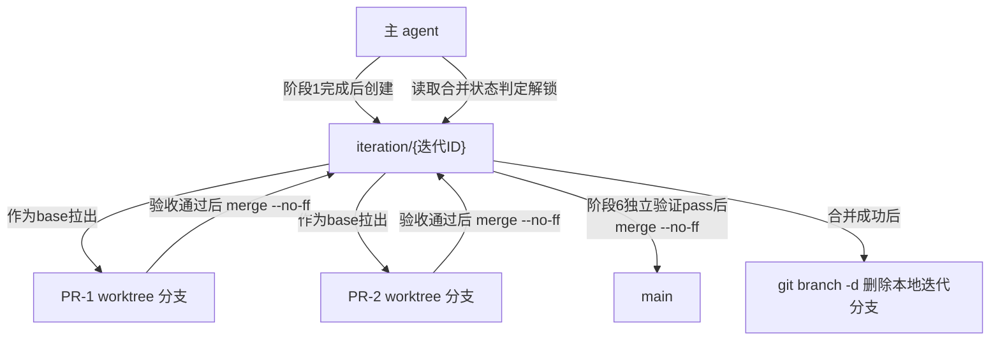

# architecture.md — 0008-iteration-branch-workflow

**版本**: 0.1.0
**迭代**: 0008-iteration-branch-workflow
**创建日期**: 2026-09-08
**阶段**: 技术架构（Phase 3）

---

## 架构目标

本迭代不新增代码模块、不新增执行角色，而是在 `workflow-pb.md` 协议规范中**新增一层"迭代分支"**，把现有 `主分支(main) ← PR worktree 分支` 的单层结构改写为 `main ← 迭代分支 ← PR worktree 分支` 两层结构。核心动机：main 分支应始终代表"已完成、已验证"的稳定状态，避免未完成迭代的中间产出通过 PR 直接落地 main。

核心技术约束：
- **纯协议文字改写**：不引入新技术栈、不新增执行角色、不改变任何执行角色的输入输出契约（PR 七字段格式不变、阶段数量不变）
- **奥卡姆剃刀**：复用现有 `git branch`/`git merge --no-ff` 惯例和 `status.md` 记录结构，不新增独立的分支管理工具或数据库
- **术语替换为主**：绝大部分改动是把正文中"主分支（main）"的指代对象替换为"当前迭代的迭代分支"，只在少数位置（如迭代分支创建、迭代分支合并进 main）新增段落

---

## 核心技术决策

### 决策 D1：迭代分支概念、命名与创建机制（对应 F01 + F02）

**概念定义**：新增"迭代分支"作为 `main` 和 `PR worktree 分支` 之间的中间层，作用是 PR 的公共 base 和合并目标。命名格式 `iteration/{迭代ID}`，复用仓库已有的孤立分支 `iteration/0004-model-dispatch` 的命名先例，`{迭代ID}` 与该迭代 `docs/iterations/{迭代ID}/` 目录名一致。

**创建时机与创建方**：demand 阶段（阶段 1）完成、`demand.md` 通过阶段 1 推进条件之后，**主 agent**（不是执行角色）立即创建迭代分支——不等到阶段 4（PR 规划）。

**创建基点**：当前 `main` 分支的最新提交（HEAD）。理由：迭代按顺序推进，main 在两次迭代之间始终代表"已完成、已验证"的最新稳定状态，不需要引入"指定历史提交点"的复杂概念。

**具体命令**：
```
git branch iteration/{迭代ID} main   # 不 checkout，只建分支指针
git checkout iteration/{迭代ID}       # 主 agent 工作区切到该分支
```
此后整个阶段 2~5 期间，主 agent 根目录当前分支保持在该迭代分支上，直到阶段 6 独立验证通过、执行 D4 的最终合并时才切回 `main`。

**生命周期终点**：合并进 main 后（见 D4），主 agent 执行 `git branch -d iteration/{迭代ID}` 删除本地分支——遵循"合并成功即清理"的既有惯例，`git log --merges` 仍可追溯历史。

**记录**：`status.md` 头部新增 `**迭代分支**` 字段（见 D5）。

**L2 决策理由**：命名格式复用已有先例，不新造术语；创建时机选在阶段 1 完成后是需求合同 §6 已确认的方向性事实（`user_confirmed`），架构阶段只需落地为具体的 git 命令和落盘位置；创建基点选 HEAD 而非"指定提交点"是奥卡姆剃刀——当前工作流是严格顺序的单迭代推进，不存在"需要从历史某个中间点分支"的真实场景。

---

### 决策 D2：PR worktree 的 base 与合并目标改为迭代分支（对应 F03）

**规则 A 措辞改写**：`workflow-pb.md` §「提交管理约束 · 规则 A：worktree 隔离」正文：

- 原文："不得直接在主分支（main/master）上提交" → 改为："不得直接在主分支（main/master）或当前迭代的迭代分支上提交"
- 判断方式原文："所有变更必须通过 PR 合并进主分支" → 改为："所有变更必须通过 PR 合并进当前迭代的迭代分支"
- **新增一句**（结构性推论，两层模型下必须同步补充）："每次提交所在分支不得为 `main`/`master`，也不得为当前迭代的迭代分支本身"——PR worktree 分支从迭代分支拉出后，dev 只能在该 worktree 分支上提交，不能绕过 PR 流程直接提交到迭代分支或 main。

**worktree base 改写**：当前 `workflow-pb.md` 正文（阶段 5 § 步骤 2）只用自然语言描述"为该 PR 创建独立 worktree 分支"，**没有出现过字面 git 命令**。本次改动在该处补充明确的 git 命令（不是改写已有命令，是首次显式化）：
```
git worktree add <path> -b <pr分支名> iteration/{迭代ID}
```
取代此前隐含的"从 main 拉出"的默认理解。

**合并目标改写**：PR 验收通过后的 merge 操作目标由 main 改为迭代分支。由于主 agent 根目录已 checkout 在迭代分支上（见 D1），合并命令保持现有 `git merge --no-ff <pr分支名>` 惯例不变，只是执行时所在分支从 main 变为迭代分支。

**SKILL.md 同步**（完整清单，经全文检索核实为 11 处，非此前误报的 5 处）：`.claude/skills/workflow-pb/SKILL.md` 中含"主分支"字样的 11 处均需同步改为"当前迭代的迭代分支"或等效表述，具体行号见本文档「对 workflow-pb.md 的目标改动清单」§5。

**L2 决策理由**：两层结构是需求合同 §4 已确认的方向性事实，本决策只是把它落地为具体的措辞改写位置；`git worktree add` 命令的显式化是奥卡姆剃刀下的必要动作——协议文字如果只停在"改主分支为迭代分支"这一层级的抽象描述，pr-planner/dev 在阶段 5 执行时无法确定 worktree 到底该从哪个 ref 拉出，必须给出可执行的命令。

---

### 决策 D3：阶段 5 解锁判据改为"合并进迭代分支"（对应 F04）

这是需求合同 §5 已确认的**结构性推论**：两层模型一旦成立，解锁判据必须同步改为"合并进迭代分支"，否则 main 只会在整个迭代分支合并时才更新一次，PR-B 永远等不到解锁，并发调度机制直接失效。

具体改写位置（均在 `workflow-pb.md` §「调度指南 · 阶段 5（PR 实现）：依赖解锁式并发调度」）：

1. 步骤 2 核心解锁判据："所依赖的 PR 均已**合并进主分支**的已解锁 PR" → "所依赖的 PR 均已**合并进当前迭代的迭代分支**的已解锁 PR"；步骤 2 末尾"不因此放宽'合并进主分支才算解锁'这一条件" → "不因此放宽'合并进迭代分支才算解锁'这一条件"
2. 「为什么必须以合并进主分支作为解锁条件」段落标题及正文中出现两次的"主分支" → 全部改为"迭代分支"
3. 「并发槛位算法」最后一段"不改变「合并进主分支才算解锁」这一前提" → "不改变「合并进迭代分支才算解锁」这一前提"；"不得因为槛位空闲而放宽解锁条件去提前派发依赖未合并的 PR" → "不得因为槛位空闲而放宽解锁条件去提前派发依赖未合并进迭代分支的 PR"
4. 「状态追踪协议」status.md 格式定义中"槛位状态列取值"说明："排队(依赖未满足)（依赖的 PR 尚未合并进主分支）" → 改为"……尚未合并进当前迭代的迭代分支"

**progress-observer 核实方式微调**：`progress-observer.md`「PR 依赖核实」小节示例表（该文件 `:100` 行）"`git log main --grep="pr-001"` 找到 commit abc123"，语义上对应改为"`git log iteration/{迭代ID} --grep="pr-001"`"。**不改动 progress-observer 角色文件本身**（已是通用的"核实一手记录"能力），只在 `workflow-pb.md`「可观测性：progress-observer 自动/按需触发」小节补充一句："当前迭代存在迭代分支时，核实合并状态的 git log 命令以迭代分支为基准，而非 main"。

**L2 决策理由**：这是需求阶段已确认的结构性推论，不是架构阶段的新选型；架构阶段的工作只是把改动定位到具体的段落、句子和示例表行，确保 pr-planner 拆 PR 时有精确的文字级对照。

---

### 决策 D4：迭代分支合并进 main 的触发机制（对应 F05）

**触发时机**：阶段 6（独立验证）对"整个迭代所有 PR 合并完成后的最终产物"验证结论为 pass 之后，主 agent 执行合并——不引入新的人工确认关卡，延续现有"PR 验收通过→自动 merge"惯例（需求合同 §7 已确认）。

**执行方**：主 agent（不是执行角色）。

**合并策略**：
```
git checkout main                        # 从当前的迭代分支切回 main
git merge --no-ff iteration/{迭代ID}      # 保留合并记录，不 fast-forward
git branch -d iteration/{迭代ID}          # 合并成功后删除本地迭代分支
```
复用现有 `--no-ff` 惯例，让 `git log --merges` 可追溯"哪次合并代表哪个迭代完成"。

**commit message 格式**：`git log --merges` 核实到的历史真实格式是 `merge: PR-{NNN} {该 PR 一句话描述} ({迭代ID})`（如 `merge: PR-001 workflow-pb history.md 记录协议 (0007-workflow-history-log)`）。迭代分支合并进 main 参照同一命名习惯，采用：
```
merge: iteration {迭代ID} {该迭代一句话目标} into main
```
用关键词 `iteration` + `into main` 与单个 PR 合并的 `PR-{NNN}` 前缀区分,两者在 `git log --merges` 里可直接按前缀识别层级。

**失败处理**：若 `git merge --no-ff` 报告冲突，主 agent 停止推进并向用户上报——这是结构性错误（类比"PR 依赖图有环"），不在调度层绕开。由于迭代分支的所有 PR 均已验收通过，理论上不应出现冲突；出现即说明 main 在该迭代进行中被他人直接提交（违反规则 A），或存在未被 verifier 发现的合并冲突。

**L2 决策理由**：合并触发时机和执行方是需求合同已确认的方向性事实；合并策略和 commit message 格式是在现有 `--no-ff` 惯例基础上的自然延伸，不是新发明的机制；commit message 格式经过 `git log --merges` 一手核实校正（原稿引用的格式与实际不符，已修正，见下方「修正记录」）。

---

### 决策 D5：版本号升级与变更说明（对应 F06）

**版本号升级**：`roles/workflow-pb/workflow-pb.md` 头部 `**版本**: 0.7.0` 改为 `**版本**: 0.8.0`——结构性改动（新增迭代分支层、改变合并目标、改变解锁判据）符合次版本号递增惯例。

**变更说明位置**：在 `roles/workflow-pb/workflow-pb.md` 第 45~53 行「v0.7.0 变更说明」整节内容之后（第 54 行空行之后、第 55 行「## v0.6.0 变更说明」标题之前）插入新节「## v0.8.0 变更说明（相对 v0.7.0）」，格式参考既有 v0.5.0/v0.6.0/v0.7.0 变更说明结构（触发/方案/具体改动）。

**changelog 详细记录**：在 `roles/workflow-pb/data/workflow-pb-changelog.md` 头部（`## v0.7.0（2026-09-07）`条目之前）追加 `## v0.8.0（2026-09-0X）` 条目，包含：触发（用户需求：main 应始终代表已验证稳定状态）、方案（新增迭代分支层 `main ← 迭代分支 ← PR`）、具体改动清单（见本文档「对 workflow-pb.md 的目标改动清单」）、未改变的部分（PR 文件七字段格式、阶段数量、执行角色本身、并发槛位算法公式）。

**SKILL.md 版本号同步**：`.claude/skills/workflow-pb/SKILL.md` 版本号由 v1.10.0 升级至 v1.11.0（SKILL 版本号独立递增，不与规范文件的 0.x.x 版本号绑定；已核实当前仓库 SKILL.md 头部确为 v1.10.0，F06 原稿数值准确，无需修正），在 `data/` 目录新增 `skill-optimization-v1.11.0.md` 记录本次同步改动（主要是"主分支"→"迭代分支"的术语替换，共 11 处，见 D2/D3 的 SKILL.md 改动清单）。

**status.md 字段扩展**：`workflow-pb.md`「状态追踪协议 § status.md 格式」头部字段区新增 `**迭代分支**` 一行（在"当前阶段"之后、"状态"之前），取值为 `iteration/{迭代ID}`。此字段在阶段 1 完成、创建迭代分支后立即写入（见 D1），在 D4 迭代分支合并进 main 后改为 `（已合并）`。

**L2 决策理由**：版本号递增策略和 changelog 记录格式沿用既有惯例（v0.5.0~v0.7.0 均是此模式）；SKILL.md 版本号经核实与 F06 原稿一致，未发现需要修正的事实错误。

---

## 组件与调度关系（无新增组件）

本次迭代不新增执行角色、不新增独立服务/存储，只是在主 agent 的调度逻辑和协议文字上插入一层分支概念。



**核心数据流**：
1. 阶段 1 完成 → 主 agent 从 main HEAD 创建 `iteration/{迭代ID}` 并 checkout（决策 D1）
2. 阶段 4→5：PR worktree 从迭代分支拉出，不再从 main 拉出（决策 D2）
3. 阶段 5 并发调度：解锁判据检查"依赖 PR 是否已合并进迭代分支"，不再检查 main（决策 D3）
4. 每个 PR 验收通过后 `merge --no-ff` 进迭代分支（不进 main）
5. 阶段 6 独立验证对整个迭代产出判定 pass 后，主 agent 将迭代分支 `merge --no-ff` 进 main，随后删除本地迭代分支（决策 D4）

---

## 对 workflow-pb.md 的目标改动清单（供 PR 规划阶段引用，本阶段不直接修改该文件）

以下逐条列出正文（`roles/workflow-pb/workflow-pb.md`，600 行版）需要修改的具体位置，均标注章节名 + 原文片段 + 改后文字，供 pr-planner 拆 PR 时直接对照使用。`.pb-agents/roles/workflow-pb/workflow-pb.md` 是同一源文件的部署副本（当前落后于源文件，不在版本控制中），实际改动只需落在 `roles/workflow-pb/workflow-pb.md`，随后重新执行 `tools/install-pb-agents.sh` 同步。

### §1 头部版本号（对应 D5）

- **位置**：第 25 行
- **原文**：`**版本**: 0.7.0`
- **改后**：`**版本**: 0.8.0`

### §2 新增 v0.8.0 变更说明（对应 D5）

- **位置**：第 54 行（空行）之后、第 55 行「## v0.6.0 变更说明」之前插入新节
- **新增内容**（示意，具体文字由 dev 落实时参照 v0.7.0 节的三段式结构撰写）：
```markdown
## v0.8.0 变更说明（相对 v0.7.0）

**新增迭代分支层**：新增独立于 main 的中间分支层"迭代分支"（`iteration/{迭代ID}`），形成 `main ← 迭代分支 ← PR worktree 分支` 两层结构。demand 阶段完成后立即创建，PR 的 base 和合并目标改为迭代分支，阶段 5 解锁判据同步改为"合并进迭代分支"，迭代分支在阶段 6 独立验证 pass 后由主 agent 自动合并进 main。

**目的**：main 应始终只包含已完成、已验证的迭代产出；此前 PR 直接合并 main 意味着单个迭代未完成时其中间产出已落地 main，一旦迭代中途终止或需求有变，main 已被污染，难以整体回退。

**不改变的部分**：PR 文件七字段格式；阶段数量（仍为 6 个）；任何执行角色文件本身；并发槛位算法公式（起始并发数/爬升公式/硬上限不变，只是判据的检查对象从 main 变为迭代分支）。

**生效范围**：仅从下一个使用本工作流的迭代起生效，不追溯已完成迭代（0005/0007）。
```

### §3 提交管理约束 · 规则 A（对应 D2）

- **位置**：第 119 行
- **原文**：`从阶段 4（PR 规划）完成之后，任何代码变更必须在独立 worktree 分支上进行，不得直接在主分支（main/master）上提交。`
- **改后**：`从阶段 4（PR 规划）完成之后，任何代码变更必须在独立 worktree 分支上进行，不得直接在主分支（main/master）或当前迭代的迭代分支上提交。`

- **位置**：第 121 行
- **原文**：`判断方式：每次提交所在分支不得为 \`main\` 或 \`master\`；所有变更必须通过 PR 合并进主分支。`
- **改后**：`判断方式：每次提交所在分支不得为 \`main\`/\`master\`，也不得为当前迭代的迭代分支本身；所有变更必须通过 PR 合并进当前迭代的迭代分支。`

### §4 阶段定义表新增迭代分支创建/合并说明（对应 D1、D4）

- **位置**：第 208~221 行「调度指南 § 启动工作流」
- **原文**（第 210~221 行步骤列表）：
```
1. 确认迭代 ID（`{编号-迭代名}`）
2. 创建 `docs/iterations/{编号-迭代名}/status.md`，初始化阶段表
3. 创建 `status.md` 之后，若 `history` 字段为开启，创建空 `history.md`（见「历史记录协议」）
4. 从阶段 1（需求收敛）开始
5. 进入阶段 4→5 时……初始化 `## 并发配置（阶段 5）` 区块……
```
- **改后**：在步骤 4「从阶段 1（需求收敛）开始」之后插入新步骤：
```
4.5. 阶段 1（需求收敛）通过推进条件后，立即执行 `git branch iteration/{迭代ID} main` 创建迭代分支，随后 `git checkout iteration/{迭代ID}` 切换工作区；在 status.md 头部写入 `**迭代分支**: iteration/{迭代ID}`。此后阶段 2~5 期间主 agent 根目录保持在该分支上。
```
并在「调度指南」新增一节「迭代分支合并进 main」（可紧跟「终止工作流」小节之后）：
```markdown
### 迭代分支合并进 main

阶段 6（独立验证）对本迭代最终产物判定 pass 之后，主 agent 依次执行：
1. `git checkout main`
2. `git merge --no-ff iteration/{迭代ID}`
3. `git branch -d iteration/{迭代ID}`

commit message 格式：`merge: iteration {迭代ID} {该迭代一句话目标} into main`。

若步骤 2 报告冲突：停止推进，向用户上报（结构性错误，类比"PR 依赖图有环"，不在调度层绕开）。

合并完成后，status.md 的 `**迭代分支**` 字段改为 `iteration/{迭代ID}（已合并）`。
```

### §5 PR worktree 创建命令显式化（对应 D2）

- **位置**：第 266 行
- **原文片段**：`……为该 PR 创建独立 worktree 分支，在子 agent 里依次完成……`
- **改后**：在该句后补一个具体命令：`……为该 PR 创建独立 worktree 分支（\`git worktree add <path> -b <pr分支名> iteration/{迭代ID}\`，base 为当前迭代的迭代分支，不是 main），在子 agent 里依次完成……`

- **位置**：第 266 行同句"合并进主分支"表述
- **原文**：`所依赖的 PR 均已**合并进主分支**的已解锁 PR`
- **改后**：`所依赖的 PR 均已**合并进当前迭代的迭代分支**的已解锁 PR`

- **位置**：第 266 行末尾
- **原文**：`不因此放宽"合并进主分支才算解锁"这一条件去提前派发未解锁的 PR`
- **改后**：`不因此放宽"合并进迭代分支才算解锁"这一条件去提前派发未解锁的 PR`

- **位置**：第 268 行
- **原文**：`……merge 主分支」`
- **改后**：`……merge 进当前迭代的迭代分支」`

### §6 解锁判据核心段落（对应 D3）

- **位置**：第 270 行
- **原文**：`**为什么必须以"合并进主分支"作为解锁条件，不是"dev 自称完成"**：每个 PR 在独立 worktree 分支上工作，如果 PR-B 依赖 PR-A 的产出，PR-B 的 worktree 分支必须是从"已经合入 PR-A 之后的主分支"拉出来的，否则 PR-B 的子 agent 在自己的分支里根本看不到 PR-A 的代码。`
- **改后**：`**为什么必须以"合并进迭代分支"作为解锁条件，不是"dev 自称完成"**：每个 PR 在独立 worktree 分支上工作，如果 PR-B 依赖 PR-A 的产出，PR-B 的 worktree 分支必须是从"已经合入 PR-A 之后的迭代分支"拉出来的，否则 PR-B 的子 agent 在自己的分支里根本看不到 PR-A 的代码。`

- **位置**：第 281 行「并发槛位算法」最后一段
- **原文**：`……仍然只能分配给依赖已合并的排队 PR，不改变「合并进主分支才算解锁」这一前提。……不得因为槛位空闲而放宽解锁条件去提前派发依赖未合并的 PR。`
- **改后**：`……仍然只能分配给依赖已合并进迭代分支的排队 PR，不改变「合并进迭代分支才算解锁」这一前提。……不得因为槛位空闲而放宽解锁条件去提前派发依赖未合并进迭代分支的 PR。`

### §7 可观测性 · progress-observer 核实方式（对应 D3）

- **位置**：第 285~298 行「可观测性：progress-observer 自动/按需触发」小节
- **新增一句**（放在「核实项」段落末尾）：`当前迭代存在迭代分支时，核实合并状态的 git log 命令以迭代分支为基准（如 \`git log iteration/{迭代ID} --grep="pr-001"\`），而非 main。`

### §8 状态追踪协议 · status.md 格式（对应 D3、D5）

- **位置**：第 416~424 行 status.md 格式示例头部字段区
- **原文**：
```
**工作流**: workflow-pb v{版本}
**迭代**: {编号-迭代名}
**当前阶段**: {阶段名}（阶段 {#}）
**状态**: {进行中 / 等待确认 / 已完成 / 已终止}
**history**: 开启
```
- **改后**：在「当前阶段」之后、「状态」之前插入一行：
```
**工作流**: workflow-pb v{版本}
**迭代**: {编号-迭代名}
**当前阶段**: {阶段名}（阶段 {#}）
**迭代分支**: iteration/{迭代ID}
**状态**: {进行中 / 等待确认 / 已完成 / 已终止}
**history**: 开启
```

- **位置**：第 458 行「槛位状态列取值」说明
- **原文**：`排队(依赖未满足)（依赖的 PR 尚未合并进主分支）`
- **改后**：`排队(依赖未满足)（依赖的 PR 尚未合并进当前迭代的迭代分支）`

### §9 .claude/skills/workflow-pb/SKILL.md 同步（对应 D2、D3、D5，共 11 处）

版本号：头部 `**版本**: 1.10.0` 改为 `1.11.0`；description 中的 `v0.7.0` 改为 `v0.8.0`。

"主分支"术语替换清单（11 处，按行号）：

| 行号 | 原文片段 | 改后 |
|---|---|---|
| 14 | 识别"自称完成"和"合并进主分支"的本质差异 | 识别"自称完成"和"合并进当前迭代的迭代分支"的本质差异 |
| 38 | CRITICAL: 阶段 5 只以"合并进主分支"解锁下游依赖 | CRITICAL: 阶段 5 只以"合并进当前迭代的迭代分支"解锁下游依赖 |
| 65 | 阶段 5 所有 PR 合并进主分支 | 阶段 5 所有 PR 合并进当前迭代的迭代分支 |
| 81 | 只有"合并进主分支"才解锁，自称完成不算数 | 只有"合并进当前迭代的迭代分支"才解锁，自称完成不算数 |
| 87 | 所有 PR 合并进主分支，status.md 与文件系统完全一致 | 所有 PR 合并进当前迭代的迭代分支，status.md 与文件系统完全一致 |
| 119 | PR-B worktree 必须从已含 PR-A 代码的主分支拉出 | PR-B worktree 必须从已含 PR-A 代码的迭代分支拉出 |
| 124 | "合并进主分支才算解锁"这一条件不因槛位空闲而降级 | "合并进当前迭代的迭代分支才算解锁"这一条件不因槛位空闲而降级 |
| 174 | 解锁条件是合并进主分支……PR-B 的 worktree 必须从已含 PR-A 代码的主分支拉出 | 解锁条件是合并进当前迭代的迭代分支……PR-B 的 worktree 必须从已含 PR-A 代码的迭代分支拉出 |
| 200 | Safety 中"合并进主分支"原则 | Safety 中"合并进当前迭代的迭代分支"原则 |
| 261 | merge 进主分支后重新扫描依赖图 | merge 进当前迭代的迭代分支后重新扫描依赖图 |
| 376 | 阶段 5 解锁条件是"合并进主分支" | 阶段 5 解锁条件是"合并进当前迭代的迭代分支" |

### §10 roles/workflow-pb/data/workflow-pb-changelog.md（对应 D5）

- **位置**：文件头部，`## v0.7.0（2026-09-07）` 条目之前
- **新增**：`## v0.8.0（2026-09-0X）` 条目，内容结构参照 v0.7.0/v0.5.0 条目（触发/方案/未改变的部分/具体改动），具体文字见本文档「决策 D5」。

### §11 .claude/skills/workflow-pb/data/ 新增文件（对应 D5）

- **新增文件**：`skill-optimization-v1.11.0.md`，记录本次"主分支→迭代分支"术语替换清单（即本文档 §9 表格）及版本号升级原因。

---

## L1 决策清单

**无。**

本次迭代的所有技术决策（迭代分支命名格式、创建/合并时机、worktree base 改写、解锁判据改写）均属于"现有技术栈内的协议文字改写"和"局部数据流/记录字段设计"范围（L2）：
- 不引入新技术栈——继续使用 git branch/worktree/merge 等已有 git 操作
- 不改变任何执行角色的核心职责或输入输出契约——PR 七字段格式、阶段数量、planner/dev/verifier/pr-planner/progress-observer 角色文件本身均未改动
- 不影响系统整体边界——只是在现有单层分支模型上插入一层协议约定的中间分支

这些决策方向本身（是否要加迭代分支层、解锁判据是否要同步改、合并触发方式）均已在需求合同阶段（demand.md §4/§5/§6/§7）由用户逐条确认为 `user_confirmed`，架构阶段只是把已确认的方向落地为具体的文字改写位置，不构成新的、未经用户确认的不可逆技术判断。

**建议主 agent 留意但非 L1 的一点**：D4 中"迭代分支合并进 main 出现冲突时停止上报"这一失败处理策略，理论上不应触发（因为迭代分支的所有 PR 均已验收通过），但如果用户对"合并失败后由谁人工介入解决冲突"有特定预期（例如是否允许主 agent 尝试自动解决简单冲突），可以在报告环节向用户确认这一点的具体处理边界。demand.md 未明确讨论这一失败分支的处理细节，本方案采纳了"类比 PR 依赖图有环"的既有硬停模式，是保守选择，不是新发明的机制。

---

## 修正记录（本次核实过程中对 F01~F06 架构维度内容的修正）

以下是本次核实过程中发现的事实错误，已直接编辑对应 prd/*.md 文件修正：

1. **F04**：原稿引用 `roles/progress-observer/progress-observer.md` 示例位置为"`:24`"，实际核实 `:24` 是 character 字段中的叙述性文字（"要去检查 pr-001 是否真的已经合并进主分支"），不是可对照修改的示例表格行。真正的 git log 示例表在该文件「PR 依赖核实」小节 `:100` 行（`git log main --grep="pr-001"` 找到 commit abc123）。已在 F04 文件中修正引用位置并说明。

2. **F05**：原稿引用的历史 merge commit 格式为 `chore: merge PR-001 feat: ... into main`，经 `git log --merges` 一手核实，实际历史格式是 `merge: PR-{NNN} {一句话描述} ({迭代ID})`（如 `merge: PR-001 workflow-pb history.md 记录协议 (0007-workflow-history-log)`），与原稿引用完全不符。已在 F05 文件中修正 commit message 格式建议，改为与实际历史格式一致的命名习惯（`merge: iteration {迭代ID} {一句话目标} into main`）。

3. **F06**：原稿关于"变更说明位置"描述为"在「v0.7.0 变更说明」之后（第 45 行）插入"，但第 45 行实际是「v0.7.0 变更说明」小节标题本身所在行，不是该节内容结束后的位置。已在 F06 文件中修正为准确的插入位置（第 54 行空行之后、第 55 行「v0.6.0 变更说明」标题之前）。

4. **F03**：原稿 SKILL.md 同步清单只列出 5 处"主分支"表述（CRITICAL 声明、Success criteria、对抗惯性表、Important facts #3、Safety），经全文检索实际命中 11 处，遗漏 6 处（identity 字段、判断锚点·成功标准、Important facts #8、Step 5 解锁条件正文、Important facts 交叉引用、阶段 5 执行流程描述）。已在 F03 文件中补全完整的 11 处清单。

5. **F06**：核实 SKILL.md 当前版本号确为 `1.10.0`（对应规范 v0.7.0），F06 原稿引用准确，未发现需要修正之处。

---

## 验证

- F01~F06 的 `[架构待填]` 项均已在对应 prd/*.md 文件中补全为具体技术路径（D1~D5），且经本次核实无内部冲突：F02/F05 提到的"当前迭代的迭代分支"措辞统一；F03/F04 的 SKILL.md 同步清单已合并去重为一份完整的 11 处清单（见本文档「对 workflow-pb.md 的目标改动清单」§9）
- 每个决策（D1~D5）均可追溯到对应功能卡（F01~F06）的验收标准
- 未引入 git 惯例之外的新增独立工具/数据存储，符合奥卡姆剃刀
- 无 L1 决策，无需等待用户确认即可进入阶段 4（PR 规划）——但架构阶段发现的 5 处事实错误已直接修正，请知悉

## prd 补全记录

- F01 `[架构待填]` → 已补全为决策 D1 一部分（概念定义、命名格式、生命周期）
- F02 `[架构待填]` → 已补全为决策 D1 另一部分（创建时机、创建方、创建基点、git 命令）
- F03 `[架构待填]` → 已补全为决策 D2（规则 A 改写、worktree base/合并目标改写、SKILL.md 同步，本次修正补全清单）
- F04 `[架构待填]` → 已补全为决策 D3（解锁判据改写、并发槛位算法措辞改写、progress-observer 核实方式，本次修正引用位置）
- F05 `[架构待填]` → 已补全为决策 D4（合并触发时机、执行方、合并策略、commit message，本次修正 commit message 格式）
- F06 `[架构待填]` → 已补全为决策 D5（版本号升级、变更说明位置本次修正、changelog 记录、SKILL.md 同步、status.md 字段扩展）
