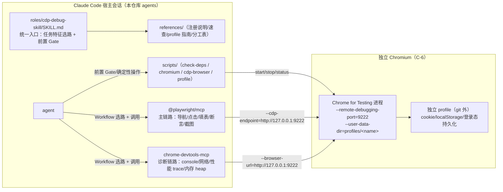

# architecture.md — 0009-cdp-debug-skill

**版本**: 0.1.0
**迭代**: 0009-cdp-debug-skill
**创建日期**: 2026-09-08
**阶段**: 技术架构（Phase 3）
**状态**: 阶段 3 完成（L1-1 已 user_confirmed，2026-09-08：CfT Stable）

---

## 架构目标

在 `roles/cdp-debug-skill/` 交付一个遵循 `docs/skill-design-protocol.md` v3.1.0 的**页面调试统一编排 skill**（Skill 式：SKILL.md + references/ + scripts/），把用户已拍板的三层链路（C-2/C-3/C-6）收敛为"一次触发、按需选路、证据闭环"的仓库内能力定义（C-1/C-4，不随 `install-pb-agents.sh` 分发）。

本次迭代**不新增任何运行期服务、不改动任何既有角色/技能/宿主配置**——交付物全部是 skill 目录内的文档与确定性脚本（阶段 5 产出），架构阶段只设计。现有架构基线里可接的点：宿主 MCP 配置机制（Claude Code `claude mcp add`）、Claude Code 项目级 mcpServers 结构、官方 Chrome for Testing 分发通道、既有 pb-v1 产物格式约定（仅格式参考）。

核心技术约束（来自 demand.md 定稿，架构阶段不重新论证）：
- 三层链路共享**同一浏览器实例/上下文**是方案成立前提（demand §4.2）；实例 = **独立 Chromium**（C-6，非本机 Google Chrome），CDP 端口默认 9222（可换）+ 独立 profile（不入 git）。
- 主链路（自动操作与断言：导航/点击/填表/断言/截图）**优先 @playwright/mcp**（C-2）；诊断链路（console/网络 + 性能/内存深诊）走 **chrome-devtools-mcp**（C-3）。
- 两个 MCP 当前均未配置（agents 项目 `mcpServers` 为空，demand §3.4 + 本阶段复核 E7）；**不交付 .mcp.json**（C-5），注册由用户按 references 文档手动完成；skill 侧给"主链路 MCP 未配置时的可执行路径"（依赖检查 + 注册指引 → 阻塞结论）。
- 登录态/凭据不入库（N4）；仅本仓库内使用、不引用 powerby 跨仓技能（C-4/N6）；不改动宿主全局与异仓（N5）。
- 奥卡姆剃刀：不引入新语言运行时、不引入浏览器驱动封装、不新增既有生态已覆盖的"自动操作/console 取证"第二实现；scripts 只做确定性操作。

---

## 现有架构基线（本阶段取证）

| 事实 | 证据 |
|---|---|
| 两 MCP 未配置：`~/.claude.json` 顶层 `mcpServers` 仅 pencil；`projects["/Users/chenchiyuan/projects/agents"].mcpServers` 为空 | E7（本机只读探测，2026-09-08；与 demand §3.4 一致） |
| Claude Code MCP 注册命令：`claude mcp add [options] <name> <commandOrUrl> [args...]`；`--scope local\|user\|project`（默认 local）；stdio 子命令参数用 `--` 分隔 | E6（本机 `claude mcp add --help`） |
| `install-pb-agents.sh` 只 copy `roles/<role>/<role>.md`；目录缺同名 `<role>.md` 则打印"跳过"并 continue | E8（读取脚本实现）→ `roles/cdp-debug-skill/` 以 SKILL.md 交付即天然不随 .pb-agents 分发（F01 验收实证） |
| 本机 macOS arm64；node v22.15.0（nvm） | E7（`which claude` 路径 + registry engines 比对） |
| 规范 v3.1.0：七层 Section 顺序、三层次文件组织、scripts 绝不做语义判断、约束词分级（CRITICAL ≤3/Skill、MUST/NEVER ≤2/Section）、协议先行 | E9（docs/skill-design-protocol.md 相关节） |
| pb-v1-brower 产物风格（findings.json + round-N 文件 + status PASS/FAIL/BLOCKED 结论 yaml）——仅格式参考 | E10（powerby 异仓只读） |

**复用结论**：本 skill 不新建任何"运行期服务/守护进程"；需要的浏览器进程 = 用户按 skill 文档启动的独立 Chromium（同既有 cdp/headed 调试惯例）；需要的工具面 = 两个 MCP（宿主注册）；需要的确定性操作 = 4 个 scripts。

---

## 总体架构

### 组件图



**核心判断**：三层共享的**单一实例 = 用户启动的独立 Chromium 进程**（CDP 9222 + 独立 profile）；两个 MCP 均以"连接既有 CDP 实例"形态注册并附着到该端点（D1，能力已核实：E3/E4），因此主链路、诊断链路、登录态操作的是**同一个浏览器进程、同一个 user-data-dir**——cookie/登录态/页面在跨层接力时连续。skill 自身不启动浏览器实例（除调用 scripts 外无任何长驻进程），登录态链路不依赖"宿主重启后 MCP 自动重连"以外的任何新机制。

### 核心数据流（一次任务）

1. 任务触发（description 命中，F03）→ 读 SKILL.md → **前置 Gate（F10/D7）**：agent 目检当前会话工具面 + 运行 `scripts/check-deps.sh` 取配置/文件系统事实。
2. 主链路/诊断链路 MCP 缺失 → 产出 **blocked** 结论（F11），`blocked_reason=mcp_unconfigured`，`next_step` 指向 references/mcp-registration.md；Chromium 缺失/未运行 → 指引 `scripts/chromium.sh ensure` + `scripts/cdp-browser.sh start`（确定性操作可自助），仍未就绪则 blocked（`chromium_not_ready`）。不产出通过/失败伪结论。
3. 就绪 → 按任务特征选路（F06）：需登录态 → 先登录态链路（浏览器+profile 就绪 + 登录交互）→ 再执行主链路/诊断链路；主链路断言失败/页面异常 → 转诊断链路（同一实例）深诊取证。
4. 三类产物（结构化证据 + 截图 + 结论）落 `artifact_root`（调用方注入，D6）→ 返回结论与路径，供本仓库内 reviewer/verifier/testing 复验（W3/F11）。

---

## 核心技术决策

### 决策 D1：三层共享实例的连接机制与登录态层承担工具归属（F06/F09，待填 1）

**核实结论（2026-09-08，官方文档）**：
- **@playwright/mcp 支持连接既有 CDP 实例**：`--cdp-endpoint <endpoint>`（env `PLAYWRIGHT_MCP_CDP_ENDPOINT`），README 配置 schema 注释原文 "Chrome DevTools Protocol endpoint to connect to an existing browser instance in case of Chromium family browsers"（E3）。
- **chrome-devtools-mcp 支持连接既有 CDP 实例**：`--browser-url <url>`/`-u` "Connect to a running, debuggable Chrome instance (e.g. `http://127.0.0.1:9222`)"（E4）；advanced-usage 提供手动连接官方指南：先以 `--remote-debugging-port=9222 --user-data-dir=<独立目录>` 启动浏览器，再让 MCP 以 `--browser-url=http://127.0.0.1:9222` 附着（E4）。chrome-devtools-mcp 在"首个需要浏览器的工具调用"时才连接/启动浏览器（官方 note，E4）。
- 由此，demand §4.2 风险登记中"若某 MCP 不支持连接既有实例则登录态层承担工具需重估"的触发条件**不成立**——两个 MCP 均支持，无需启用裸 CDP/`browse $B` 替代路径。

**决策**：
1. **实例层**：登录态链路 = 独立 Chromium（CfT，D2）由 `scripts/cdp-browser.sh start` 启动，`--remote-debugging-port=<port 默认 9222>` + `--user-data-dir=<CDP_DEBUG_HOME>/profiles/<name> 默认 main>`；profile 由 `scripts/profile.sh` 管理。实例生命周期独立于宿主会话（登录态跨会话持久化的载体是 profile 目录，不是 MCP 进程）。
2. **附着层**：两个 MCP 注册时均带指向同一端点的连接参数（Form A，D5）——主链路经 @playwright/mcp 工具操作该实例；诊断链路经 chrome-devtools-mcp 附着同一实例取证。
3. **登录态层承担工具（最终归属，替代 demand 预留的重估）**：登录态链路不设独立"登录工具"——登录交互走主链路 @playwright/mcp 工具面（Form A 下即操作共享实例）；chrome-devtools-mcp 为诊断/复核补充附着。策略层表述为"登录态就绪 = 实例 + profile 就绪"，不写死"必须用某工具执行登录"（demand §4.2 要求策略层不锁死工具归属）。
4. **"上下文连续"的精确语义**（避免过度承诺）：跨层连续 = 同一浏览器进程 + 同一 user-data-dir 的 cookie/localStorage/会话状态。**不承诺**两个 MCP 客户端同时附着同一个 page target（CDP 单 target 多客户端附着存在抢占风险，未实测，U5）；接力取证的操作注记：若诊断工具对某 page target 附着失败，以 `navigate_page` 到同一 URL 复现状态再取证（同 profile 下登录态仍在）。
5. **时序约定**：任何链路执行前先 `scripts/cdp-browser.sh status`，未运行则 start。chrome-devtools-mcp 懒连接（工具首用）已证实；@playwright/mcp 带 `--cdp-endpoint` 时的连接时机（启动即连 vs 懒连）未见官方明文（U1）——SKILL.md 推荐顺序写"先起浏览器、再开/复用宿主会话"为稳妥路径，且不把"会话必须先于浏览器启动"设为硬前提；MCP 工具报连接错误时产出 blocked（`target_error`）+ 恢复指引（起浏览器后重试/重启宿主会话）。

**L2 决策理由**：连接方式是被已核实能力 + C-6/C-2/C-3 约束唯一决定的选型，不引入新技术栈；登录态工具归属为 demand 显式委托阶段 3 的收口结论，可逆（改注册参数即可），故不升 L1。

---

### 决策 D2：独立 Chromium 下载渠道 = 官方 Chrome for Testing（CfT）Stable，跟随 last-known-good（F05，待填 4）【L1，user_confirmed 2026-09-08】

**背景**：C-6 已拍板"下载独立 Chromium（非本机 Google Chrome）"，但**渠道未定**。候选：
- **A. 官方 Chrome for Testing（CfT）**：`googlechromelabs.github.io/chrome-for-testing` 的 `last-known-good-versions-with-downloads.json` → `channels.Stable`；提供 `mac-arm64` 分发包（E5，2026-09-08 Stable=152.0.7977.82，URL 指向 `storage.googleapis.com/chrome-for-testing-public/.../chrome-mac-arm64.zip`，实测可下载 HTTP 200）。
- B. Playwright 托管 Chromium（`npx playwright install chromium`，~/Library/Caches/ms-playwright）：playwright 快照构建；主链路 @playwright/mcp 默认形态（无端点参数自起浏览器）本就需要它。
- C. 其他 chromium.org 每日构建：无稳定分发通道，排除。

**决策依据（关键证据 E4）**：chrome-devtools-mcp 官方免责声明——"officially supports Google Chrome and **Chrome for Testing** only. Other Chromium-based browsers may work, but this is not guaranteed"。诊断链路（C-3 必用 chrome-devtools-mcp）要附着共享实例（D1），实例必须是 chrome-devtools-mcp 官方支持面内的构建 → **CfT 是与 C-3+D1 自洽的唯一渠道**（Playwright 托管 chromium 属"may work but not guaranteed"，引入不确定性）。

**决策内容**：
1. 下载源 = CfT 官方 JSON + `storage.googleapis.com`（HTTPS），平台 `mac-arm64`（本机 arm64，免 Rosetta），channel = **Stable**（= Chrome stable 版本线，chrome-devtools-mcp 承诺支持 latest Extended Stable 兼容面内）。
2. 版本策略 = 跟随 CfT known-good **Stable**；`ensure` 幂等：本地已装版本 = known-good Stable → 输出就绪事实不动作；版本不一致 → 输出 facts（installed vs known-good）由调用方决定 `-f` 强制升级；不自动升级（避免调试中途 profile/证据基线漂移）。
3. 校验 = 源固定官方通道 + HTTPS；下载后记录本地 sha256 至 manifest（`chromium/.manifest.json`：version/url/path/sha256/installed_at）。CfT JSON 当前每项仅含 `platform`/`url`（E5，2026-09-08 核实**无 sha256 字段**）→ 无官方 hash 可比对，信任边界 = 官方 JSON + googleapis HTTPS；文档注明"官方端点若恢复提供 sha256 则优先比对"。
4. 落盘 = `$CDP_DEBUG_HOME/chromium/<version>/`（D3），zip 解包后**以 glob 动态解析** `*.app/Contents/MacOS/*` 定位可执行文件，不写死 CfT mac zip 内部布局（zip 内容未下载抽验，U2）。
5. 更新维护责任 = 由 scripts 确定性完成（`chromium.sh ensure -f`），不要求用户手工下载。

**为什么列为 L1（不可逆技术判断）**：下载渠道决定 ①长期维护通道（CfT 官方 JSON 是持续维护的稳定分发面；切渠道需重下二进制并重验兼容性）②与 chrome-devtools-mcp 的官方兼容面绑定（选 B 会在诊断链路引入"非官方支持"不确定性）③本机新增外部二进制软件的安全信任面（Google 官方分发 vs Playwright CDN）。渠道一旦固化进 scripts/references/登录态 workflow，切换成本高，故按角色文件 L1 判据上报用户确认。**推荐 A（CfT Stable）**；备选 B 仅在用户明确接受 chrome-devtools-mcp 兼容风险时考虑。

---

### 决策 D3：数据根目录布局与 profile/ignore 规则（F05/F09/F13，待填 5）

**决策**：单一根目录 `$CDP_DEBUG_HOME`，默认 `$HOME/.local/share/cdp-debug-skill`（git 外——位于仓库外，天然不落入 agents 仓库 git 跟踪），环境变量可覆盖。子目录：

```
${CDP_DEBUG_HOME:-$HOME/.local/share/cdp-debug-skill}/
├── chromium/                 # CfT 二进制与 manifest（D2）
│   ├── <version>/            # 解包后的构建
│   └── .manifest.json        # 版本/url/sha256/installed_at
├── profiles/
│   └── <name>/               # 每 profile 一个 Chromium user-data-dir（默认名 main）
└── runs/                     # 登录态/含凭据证据的默认落点（git 外，见 D6）
```

**规则**：
- profile 目录默认 git 外 → **不需要**新增仓库 `.gitignore` 条目（且 F01 验收限定本次新增内容只落 `roles/cdp-debug-skill/` 与 `docs/iterations/0009-cdp-debug-skill/` 两处，不改仓库 `.gitignore`）；references 文档写明：若用户经 `CDP_DEBUG_HOME` 覆盖到仓库内路径，须自行在仓库 `.gitignore` 追加（skill 不代改）。
- 每个 profile 同一时刻仅一个浏览器进程可用（Chrome profile 单实例锁；chrome-devtools-mcp 文档亦言 "Only one browser can use it at a time"，E4）——`cdp-browser.sh start` 对已占用 profile 输出确定性 facts，不强行复用。
- `profile.sh wipe` 属破坏性操作（不可逆后果级），按规范 5.4.3 安全兜底要求：需显式 `--confirm` 或交互确认才执行（协议检查项 #15 边界）。

**L2 决策理由**：路径选型在"不入 git（git 外或 ignore）"产品约束内做局部布局设计；默认 git 外 + env 覆盖满足 F13 可观察判定（git status/ignore 核对），不引入额外 ignore 机制。

---

### 决策 D4：scripts 拆分与接口契约（F05/F10，待填 2 的调用契约部分）

**决策**：`scripts/` 下 4 个可独立执行脚本（bash 3.2 兼容 + python3 做 JSON 解析；macOS 自带 `/usr/bin/python3`，本机已验证可用）：

| 脚本 | 子命令/职责 | 产出（stdout） |
|---|---|---|
| `check-deps.sh` | 依赖检查（F10 主调）：解析 `~/.claude.json` 顶层 + `projects["<cwd>"]` + `<cwd>/.mcp.json`；查两 MCP 的 configured/scope/command/args/是否含端点参数；查 Chromium 二进制/版本/是否运行/端口/profile 路径 | **JSON facts**（schema 见下），exit 0=执行成功（无论依赖是否齐）；自身错误 exit≠0 + error 字段 |
| `chromium.sh` | `ensure`/`install`/`verify`/`status`/`path`：CfT 下载、sha256 记录、就绪报告（D2） | JSON / 单行路径 |
| `cdp-browser.sh` | `start`/`stop`/`status`/`restart`：启动参数 `--remote-debugging-port=<port 默认 9222>` + `--user-data-dir=<profile 路径>`；幂等 start；端口/profile 可经参数或 env 覆盖 | 人类可读 + `status` 支持 `--json` |
| `profile.sh` | `list`/`create`/`path`/`wipe`：profile 生命周期；`path <name>` 输出 user-data-dir 绝对路径供 cdp-browser 消费 | 人类可读 / path |

**check-deps.sh JSON schema（scripts 只给事实，不给结论）**：
```json
{
  "checked_at": "…",
  "mcp": {
    "playwright": { "configured": false, "scope": null, "command": null, "args": [],
                    "endpoint_arg": null },
    "chrome_devtools": { "configured": false, "scope": null, "command": null, "args": [],
                         "endpoint_arg": null }
  },
  "chromium": { "installed": false, "version": null, "path": null,
                "running": false, "port": null, "profile_dir": null },
  "errors": []
}
```
- `configured`：三处配置源任一处含该 server 名即 true；`scope` 报告来源（user/project/local）。
- `endpoint_arg`：@playwright/mcp 的 `--cdp-endpoint`/chrome-devtools-mcp 的 `--browser-url` 值（供 agent 判断共享实例形态 Form A 是否成立）。
- **不做语义判断**（不输出"可用/缺失/请注册"等结论）——语义路由与结论在 SKILL.md/agent 层。

**与 F10 的调用契约**：SKILL.md 前置 Gate 调 `scripts/check-deps.sh`（无参数）；脚本永远返回 JSON 事实；agent 解析后按 F10 分支决策（D7）。`cdp-browser.sh status`/`chromium.sh status` 供 F09/前置 Gate 复用同一事实源。

**L2 决策理由**：4 个脚本分别对应 F05 验收字面的 4 类确定性操作（依赖检查/启停/profile 管理/下载就绪），语言选型 = 系统自带 bash+python3，零新增依赖。

---

### 决策 D5：MCP 安装/注册确切命令、版本与推荐形态（F04/F07/F08，待填 3）

**版本（2026-09-08 核实 npm registry）**：
- `@playwright/mcp` **0.0.80**（latest），engines `node>=18`；官方推荐配置 `npx @playwright/mcp@latest`（E1/E3）。
- `chrome-devtools-mcp` **1.8.0**（latest），engines `node ^20.19.0 || ^22.12.0 || >=23`（本机 node v22.15.0 满足）；官方推荐 `npx chrome-devtools-mcp@latest`（E2/E4）。

**注册命令（Claude Code）**：
- @playwright/mcp 最小形态（官方 Claude Code 示例：`claude mcp add playwright npx @playwright/mcp@latest`，E3）：
  ```
  claude mcp add playwright --scope project -- npx -y @playwright/mcp@latest
  ```
- @playwright/mcp **共享实例形态（Form A，推荐）**：
  ```
  claude mcp add playwright --scope project -- npx -y @playwright/mcp@latest --cdp-endpoint=http://127.0.0.1:9222
  ```
- chrome-devtools-mcp 最小形态（官方示例：`claude mcp add chrome-devtools --scope user npx chrome-devtools-mcp@latest`，E4）：
  ```
  claude mcp add chrome-devtools --scope project -- npx -y chrome-devtools-mcp@latest
  ```
- chrome-devtools-mcp **推荐形态（Form A + F08 能力 + F13 隐私/脱敏）**：
  ```
  claude mcp add chrome-devtools --scope project -- npx -y chrome-devtools-mcp@latest \
    --browser-url=http://127.0.0.1:9222 \
    --memory-debugging \
    --redact-network-headers \
    --no-usage-statistics
  ```
  参数依据（均核实 E4）：`--memory-debugging` 默认 false——F08 内存级深诊（heap 取证工具）**必须显式开启**；`--redact-network-headers` 默认 false——开启后返回前脱敏敏感请求头，与 F13 一致；`--no-usage-statistics`——官方使用统计默认开启，隐私可选关闭。性能 trace 工具（`performance_start_trace` 等）默认启用；其默认向 Google CrUX 发 URL 取 field data，可另加 `--no-performance-crux`（文档中注明，不强推）。

**形态说明（写入 references/mcp-registration.md）**：
- **Form A（共享实例，满足三层共享前提 §4.2）**：两个 MCP 都带端点参数指向同一 9222。登录态/跨层接力任务**要求** Form A。
- **Form B（最小，单链路快速用）**：不带端点参数——@playwright/mcp 自起浏览器（首次需 `npx playwright install chromium`，E3 默认持久 profile 位于 `~/Library/Caches/ms-playwright/mcp-{channel}-{workspace-hash}`），chrome-devtools-mcp 自起 Chrome。仅适合"无需登录态、无跨层接力"的纯主链路/纯诊断单发任务；此时三层共享前提不成立，SKILL.md 路由需明示限制。
- **scope 建议 `project`**（C-4 仅本仓库内）：写入 `~/.claude.json` 的 `projects["<项目路径>"].mcpServers`（E7 结构观察），只对 agents 项目加载、不产生仓库内 `.mcp.json` 文件（C-5 的"不交付 .mcp.json"由此天然满足）。`--scope` 默认 `local` 会创建项目根 `.mcp.json`（E6），文档提示用户避免或自行管理该文件。`--scope project` 的精确落点为基于 E6+E7 的推断（U3），references 文档措辞留余量。
- **注册时机**：`claude mcp add` 后需重启宿主会话才加载新工具（agent 会话级可见性，D7 双检依据）；Form A 下浏览器进程建议在会话前或工具首用前启动（D1 时序约定）。
- 版本策略：注册用 `@latest`（chrome-devtools-mcp 官方 note "latest ensures up-to-date"，E4）；references 记录"核实于 2026-09-08：0.0.80 / 1.8.0"供排障对照。

**L2 决策理由**：命令/参数是被 E1~E7 证据固定的文档内容；Form A/B 是用户注册行为的两档推荐形态（可逆，改注册即可切换），不升 L1。

---

### 决策 D6：闭环产物协议（F11，待填 6）

**决策**：产物落点 = **调用方注入的 `artifact_root` 参数**（SKILL.md Workflow 输入；skill 不预设固定落点）。缺省（未注入）时 SKILL.md 流程**拒绝执行并提示**——避免产物散落无主。"路径可查"（§4 裸判定 3）= 任务结束返回 `artifact_root` 绝对路径 + 产物文件清单。默认建议：常规任务 `docs/iterations/<迭代ID>/cdp/`（入库意图）；登录态/含凭据任务先落 `$CDP_DEBUG_HOME/runs/<run-id>/`（git 外，D3），经脱敏复核后才允许复制入库路径（F13/D9）。

**目录与命名（对齐 pb-v1 findings/verify 风格——仅格式参考，E10，不构成引用/依赖）**：
```
{artifact_root}/
├── session.md            # 任务元信息：URL/链路/实例/时间戳/命令（人类可读）
├── evidence.json         # 结构化页面证据（数据优先）
├── screenshot-*.png      # 截图（断言失败 1+ / 终态归档 1；按需多张）
├── perf-trace.json       # 可选：性能 trace（大体积独立文件，evidence 内引用）
└── result.json           # 三态结论（机器可读，下游消费主入口）
```

**evidence.json schema（节选，完整版进 SKILL.md Output format）**：
```json
{
  "schema_version": "1.0",
  "target": { "url": "…", "title": "…", "captured_at": "…" },
  "console": { "errors": [], "warnings": [], "messages": [] },
  "network": { "failed_requests": [], "summary": {} },
  "page": { "snapshot_path": "…", "assertions": [] },
  "performance": { "trace_path": "…", "summary": {} },
  "memory": { "heap_path": "…", "summary": {} }
}
```

**result.json schema（结论三态，pb-v1 status 风格）**：
```json
{
  "schema_version": "1.0",
  "status": "passed | failed | blocked",
  "task": "…", "url": "…",
  "chains_used": ["login", "main", "diagnosis"],
  "artifact_root": "…",
  "evidence_refs": ["evidence.json", "screenshot-1.png", "…"],
  "summary": "…",
  "blocked_reason": null | "mcp_unconfigured" | "chromium_not_ready"
                  | "login_required" | "shared_instance_not_configured" | "target_error",
  "next_step": null | "…",
  "sanitized": false
}
```
- 结论语义与 F11 验收一致：F10 未配置路径 → `blocked`；F07 断言 → `passed`/`failed`；F08 诊断证据支撑结论；`login_required` 用于登录态失效（F09：未登录/失效产 blocked 附原因，不产伪证据）。
- `sanitized`：布尔标记，入库前经脱敏复核置 true（D9）。
- **与 pb-v1-brower 协议不重合**（N1/F11 验收）：本 schema 是"调试闭环证据 + 三态结论"，无 pb-v1 的 round/severity/findings 评审语义；文档明示仅格式参考。

**L2 决策理由**：schema 字段为满足 F11 三类产物 + 三态结论的最小集，对齐 pb-v1 命名风格但裁剪掉评审语义（不引入 round 管理、severity 分级等 pb-v1-brower 专属概念）。

---

### 决策 D7：主链路 MCP 未配置时的可执行路径机制（F10，待填 2）

**机制四要素**：

1. **检测手段（双层）**：
   - 会话级：agent 目检当前会话可用工具集（MCP 工具是否已在列——注册后需重启宿主会话才可见，E6 语义）。
   - 配置级：`scripts/check-deps.sh`（D4）确定性解析三处配置源（`~/.claude.json` 顶层 / `projects["<cwd>"]` / `<cwd>/.mcp.json`）输出 JSON facts。
   - 两者并集 = "已配置"；配置在但工具不在会话 → 指引重启宿主会话（`restart_required` 类指引）。
2. **指引载体**：`references/mcp-registration.md`（D5 全部注册命令、Form A/B、scope、版本、参数表、排障）——SKILL.md 只写指针与分流规则，不重复命令（references 按主题分文件，E9）。
3. **流程介入点**：SKILL.md Workflow **步骤 0 前置 Gate**（任何任务先过）：读会话工具面 → 调 check-deps → 按事实分流：
   - 两 MCP 就绪 + Chromium 就绪 → 正常选路（F06）。
   - 任一 MCP 缺失/未加载 → blocked 结论（F11）附缺失明细（check-deps 摘要）+ next_step=references/mcp-registration.md 对应小节。
   - Chromium 缺失 → 先 `chromium.sh ensure` + `cdp-browser.sh start`（确定性操作，skill 可自助执行）→ 复检；仍未就绪 → blocked（chromium_not_ready）。
   - 需要登录态/跨层接力但两 MCP 未按 Form A 带端点参数注册 → blocked（shared_instance_not_configured）+ 指引改注册 Form A（C-5 手动注册语境下这是文档指引而非自动改配置）。
4. **与 F05/F04 的职责一致性**：脚本只产事实（D4）；F04 文档被 F10 指引指向；SKILL.md 明示"不承诺运行期自动注册 MCP"（N3/C-5）——本路径是"检查 + 指引 + blocked 结论"，注册动作永远由用户按 references 手动完成。

**L2 决策理由**：机制细节在"不自动注册（N3）+ 给可执行路径（W2 联动结论）"约束内设计，无新组件。

---

### 决策 D8：目录内文件布局明细（F01/F02，待填 7）

```
roles/cdp-debug-skill/
├── SKILL.md                              # v3.1.0 七层结构；内容大纲见下节
├── references/
│   ├── mcp-registration.md               # F04/F10：两 MCP 注册（Form A/B、命令、scope、版本、参数表、排障）
│   ├── chain-cheatsheet.md               # F04：三层链路速查（playwright MCP 工具 / cdt 工具 / scripts）
│   ├── chromium-profile-guide.md         # F05/F09/F13：CDP_DEBUG_HOME 布局、profile 管理、端口、脱敏与隐私选项
│   ├── division-of-labor.md              # F12：与 pb-v1-brower / gstack browse / investigate 分工表
│   └── description-eval-samples.md       # F03：should/should-not 触发样例集（离线 eval 载体）
└── scripts/
    ├── check-deps.sh                     # D4/D7
    ├── chromium.sh                       # D2/D4
    ├── cdp-browser.sh                    # D1/D4
    └── profile.sh                        # D3/D4
```
- 职责边界（E9 规范 5.2）：SKILL.md = 策略/选路/边界/资源索引（不进大段命令表）；references = 按需领域知识（命令速查、注册说明、布局指南、分工表）；scripts = 确定性操作（不做语义判断）。
- 无 `assets/`、无 `schemas/` 目录（本次无模板渲染/跨 skill 共享 schema 需求，YAGNI）。
- 无 `.mcp.json`（C-5/N3 验收字面）。

### 决策 D9：证据脱敏机制（F13）

**决策**：不引入独立脱敏脚本，采用三层防线——①chrome-devtools-mcp 注册参数 `--redact-network-headers`（返回前脱敏感请求头，D5/E4）；②登录态/含凭据证据默认落 `$CDP_DEBUG_HOME/runs/`（git 外，D3/D6）——含凭据证据根本不进 git 视野；③SKILL.md Safety 脱敏清单（确定性字段黑名单：cookie/authorization/set-cookie/token 类头字段、URL query token/session 参数、console 凭据），agent 入库前复核并置 `result.json#sanitized=true`；`sanitized=false` 产物不允许进入 git 路径。

**理由（奥卡姆剃刀检验）**："不引入脱敏脚本，哪个功能无法实现？"——F13 验收（证据默认不入库、提交前脱敏）已由①+②覆盖"默认安全"面，③的入库复核是低频语义动作（判断"可否入库"需理解上下文，属 agent 职责，协议检查项 #15 scripts 不做语义判断）。高频重复的确定性脱敏操作不存在，故不脚本化；若未来出现"高频把同一类证据入库"需求再补脚本。

**L2 决策理由**：机制在"凭据不入库（N4/C-6）+ scripts 不做语义判断（E9）"约束内的局部设计，无新组件。

---

### 决策 D10：description 触发样例集交付物（F03）

**决策**：交付 `references/description-eval-samples.md`（should-trigger ≥5、should-not-trigger ≥5，覆盖主链路/诊断/登录态/组合语境 + N1/N2 邻域否定样例），作为 §4 裸判定 2 离线 eval 的可复用载体；样例仅供评审复用，description 命中率判定仍由评审离线执行（不随交付物声明"已通过"）。

**L2 决策理由**：prd F03 允许"评审者自备样例"（无强制交付物）；交付样例集成本低（单文件），使裸判定 2 可离线复跑且口径稳定，属低风险增强；非 L1。

---

## SKILL.md 内容大纲（F02/F03/F06~F13 的落位）

按 v3.1.0 Section 顺序（E9），stage 5 落地时逐项核对规范检查清单；本节锁大纲与关键填充点：

| Section | 关键内容 | 来源卡 |
|---|---|---|
| frontmatter | `name: cdp-debug-skill`；`description`（做什么+何时用+否定边界，见下）；`role.identity/relationship/character`（L4 精度：页面调试统一编排的执行者人格）；`compatibility`（macOS arm64、node ≥20.19（MCP 运行时）、claude code、CfT Chromium） | F02/F03/F01 |
| Purpose | 一次触发、按需选路、证据闭环；仓库内能力定义 | F06/W1 |
| Success criteria | 三类产物齐全路径可查；三态结论；登录态两次调用连续性；不产伪证据 | F02/F11/F09 |
| Strategy | 三层链路选路判据（任务特征→链路）；共享实例前提与限制（D1）；未配置分流（D7）；证据数据优先 | F06/F10 |
| Tools and capability boundaries | 主链路 @playwright/mcp / 诊断 chrome-devtools-mcp / 登录态 scripts；分工边界摘要 + 指向 references/division-of-labor.md；不做什么（N1/N2/N3…） | F07/F08/F09/F12 |
| Important facts and constraints | 两 MCP 需手动注册（C-5）；Form A vs B；profile 不入 git（C-6）；实例单进程锁；CDP 端口安全提示（调试端口可被本机任意进程控制，E4 warning） | F04/F05/F13 |
| Workflow | 步骤 0 前置 Gate（D7）→ 选路（F06 组合规则：登录态前置、失败转诊断接力）→ 取证 → 产物落盘（D6） | F06/F10/F07/F08/F09/F11 |
| Output format | evidence.json / result.json / 截图命名与 schema（D6 完整版）；结论三态语义 | F11/F02（协议先行） |
| Resources | references/ 五文件索引 + scripts/ 索引 | F04/F05 |
| Safety | 三明治收尾：凭据脱敏、profile 不入库、阻塞不伪证（CRITICAL 3 处分配见下） | F13/F02 |
| Examples | 一例完整闭环（登录态续调场景） | F07/F09 |

**CRITICAL ≤3 分配（F02 验收计数）**：3 处配额拟分配为 ①登录态/凭据证据默认不入 git、提交前脱敏（F13，首尾三明治两现算同一规则两处出现——按规范三明治"红线在首尾各现一次"，计数规则按评审口径，stage 5 定稿时按检查清单核对计数）②共享实例前提（Form A）不成立时不得宣称登录态连续 ③MCP 未配置时产出 blocked 而非伪通过。MUST/NEVER ≤2/Section。

**description（F03）构成**：做什么（CDP 页面调试统一编排：自动操作断言、失败深诊、登录态续调，产出结构化证据+截图+结论，供仓库内下游复验）+ 何时用（页面调试/自动操作断言/页面失败排查/登录态续调类任务）+ 否定边界（不适用：纯测试框架编写与 CI、压测/性能基准、视觉回归基线、pb-v1-brower 式评审/验证协议任务、普通网页浏览取数——web-access/browse 语境）。触发样例集交付于 `references/description-eval-samples.md`（should-trigger ≥5、should-not-trigger ≥5，与 §4 裸判定 2 的离线判定口径一致）；样例仅供评审者复用，description 命中率判定仍由评审离线执行。

---

## 分工边界表内容（F12，落 references/division-of-labor.md）

| 既有能力 | 职责（现状） | 与本 skill 边界（不重复条款） |
|---|---|---|
| gstack browse / $B | 宿主无头/有头浏览器 QA：导航/点击/填表/断言/截图 + console/网络（~100ms/命令）；被 pb-v1-brower 连接层复用 | 本 skill 主链路首选 @playwright/mcp（C-2），$B 不承担主链路首选；console/网络取证统一编排走 chrome-devtools-mcp，不重复实现；$B 能力为既有参照 |
| pb-v1-brower（powerby 异仓） | 页面级 review/verify/iterate 评审协议；只观察不改码；findings.json+round-N 报告 | 本 skill 不替代其评审协议（N1）；产物仅为调试闭环证据（三态结论），格式参考不引用（C-4/N6）；本 skill 不进入 powerby 生态 |
| investigate | 宿主四阶段根因调试（investigate→analyze→hypothesize→implement，无根因不修复） | 本 skill 诊断链路负责"页面级证据采集（console/网络/性能/内存）与失败表征"，不替代系统化根因流程；investigate 类系统调试任务不进本 skill 触发面（F03 should-not-trigger） |

表内每条可核对（§4 裸判定 5）；F01~F11 卡内边界与表无矛盾。

---

## 安全与凭据（F13）

- profile 默认 git 外（D3）——规则可观察（git status/ignore 核对）。
- 登录态/含 cookie/token 证据（截图、含响应头/请求体的结构化数据）默认落 `$CDP_DEBUG_HOME/runs/`（git 外，D6）；入库前须经脱敏复核并置 `result.json#sanitized=true`。
- **脱敏机制（不引入独立脚本，L2）**：三层防线——①chrome-devtools-mcp 注册参数 `--redact-network-headers`（返回前脱敏感请求头，D5）②默认产物 git 外（D3/D6，含凭据证据根本不进 git 视野）③SKILL.md Safety 层脱敏清单（确定性字段黑名单：请求/响应头中的 cookie、authorization、set-cookie、token 类字段；URL query 中的 token/session 参数；console 输出中的凭据），agent 入库前按清单复核——语义判断（"这份证据是否安全可入库"）留在 SKILL 层（agent 判断），scripts 不做（规范红线）。`sanitized=false` 的产物不允许进入 git 路径。
- CRITICAL 凭据条款在 SKILL.md 首尾各现一次（F02 三明治）。
- 证书/凭据本身不落 evidence（登录态调试中不采集密码输入值）。

---

## L1 决策清单（2026-09-08 已 user_confirmed：CfT Stable）

| # | 决策 | 推荐 | 备选 | 理由摘要 |
|---|---|---|---|---|
| L1-1 | **D2：独立 Chromium 下载渠道 = 官方 Chrome for Testing（CfT）Stable，跟随 last-known-good；校验 = HTTPS 官方源 + 本地 sha256 manifest（官方端点当前无 sha256 字段）** | CfT Stable | Playwright 托管 chromium（需用户接受 chrome-devtools-mcp"非官方支持"兼容风险） | chrome-devtools-mcp 官方仅支持 Google Chrome 与 CfT（E4）；渠道决定长期维护面/兼容面/信任面，固化后切换成本高 |

其余决策（D1、D3~D8）均为 L2：被用户已拍板约束（C-2/C-3/C-5/C-6/§4.2）与已核实能力（E1~E5）唯一或局部决定的可逆选型，未引入新技术栈、未改变既有核心模块职责。

---

## 验证（自查）

- **7 项 [架构待填] 全部补全**：待填 1→D1（F06/F09）；待填 2→D4+D7（F10）；待填 3→D5（F04/F07/F08）；待填 4→D2（F05）；待填 5→D3（F05/F09/F13）；待填 6→D6（F11）；待填 7→D8（F01/F02）。每项在对应 prd 卡内标注补全（见「prd 补全记录」）。
- **无架构内部冲突**：三层共享实例机制在 F06/F09 同源（D1）；scripts 职责不越界（check-deps 只产事实不产结论；脱敏语义判断留 SKILL 层，D4/D9）；F06 选路、F10 分流、F11 结论三态互指一致（blocked 原因枚举唯一）；Form A/B 形态在 F04（注册文档）、F06（选路前提）、F09（登录态前提）表述一致。
- **外部事实核实**：E1~E8 全部一手核实（registry/官方 README/官方 docs/本机探测/脚本读取）；未核实项 U1~U5 已显式标注。
- **未修改** `roles/`、`.pb-agents/`、`.claude/skills/` 任何文件，未修改 demand.md，未改动仓库 `.gitignore`；新增文件仅 `docs/iterations/0009-cdp-debug-skill/` 下。
- **L1 已列出**（L1-1），未擅自实施。

---

## 外部事实核实清单

| # | 事实 | 核实方式（2026-09-08） | 结论 |
|---|---|---|---|
| E1 | @playwright/mcp latest 版本/engines | npm registry `@playwright/mcp/latest` | 0.0.80；node>=18 |
| E2 | chrome-devtools-mcp latest 版本/engines | npm registry `chrome-devtools-mcp/latest` | 1.8.0；node ^20.19\|\|^22.12\|\|>=23（本机 v22.15.0 OK） |
| E3 | @playwright/mcp 连接既有 CDP、注册示例、profile 选项 | 官方 README（microsoft/playwright-mcp main，抓取 1620 行） | `--cdp-endpoint` 支持；`claude mcp add playwright npx @playwright/mcp@latest`；`--user-data-dir`/persistent profile 路径 |
| E4 | chrome-devtools-mcp 连接既有 CDP、官方支持面、工具面、隐私选项、注册示例 | 官方 README + docs/configuration.md + docs/advanced-usage.md + docs/tool-reference.md + docs/client-configurations.md | `--browser-url`/`-u` 支持手动连接 9222；官方仅支持 Chrome 与 CfT；`--memory-debugging` 默认 false；`--redact-network-headers` 默认 false；usage stats 默认开；工具：list_console_messages/get_console_message、list_network_requests/get_network_request、performance_start_trace/stop/analyze_insight、take_heapsnapshot 族；`claude mcp add chrome-devtools --scope user npx chrome-devtools-mcp@latest`；懒起浏览器；userDataDir 单实例锁 |
| E5 | CfT 下载端点/版本/平台/校验字段 | googlechromelabs last-known-good-versions-with-downloads.json + zip HEAD | Stable=152.0.7977.82；mac-arm64 URL 存在且 HTTP 200；该 JSON 无 sha256 字段 |
| E6 | claude mcp add 语法/scope | 本机 `claude mcp add --help` | `--scope local\|user\|project`（默认 local）；`--` 后为子命令及参数 |
| E7 | ~/.claude.json 结构、agents 项目 MCP 状态 | 本机只读探测 | 顶层 mcpServers=pencil；projects[agents].mcpServers 为空（两 MCP 未配置确认） |
| E8 | install-pb-agents.sh 分发范围 | 读取脚本实现 | 只 copy roles/<role>/<role>.md，缺同名文件跳过 → roles/cdp-debug-skill/ 不随分发 |
| E9 | 规范 v3.1.0 结构/边界/约束词 | 读取 docs/skill-design-protocol.md 相关节 | 见正文引用 |
| E10 | pb-v1-brower 产物风格 | 异仓只读（powerby-skills） | findings.json/session.md/status 三态——仅格式参考 |

**未核实/推断标注**：
- U1 @playwright/mcp 带 `--cdp-endpoint` 的连接时机（启动即连 vs 工具首用懒连）——官方无明文，stage 5 实机验证；SKILL.md 采用稳妥时序约定（先起浏览器）。
- U2 CfT mac zip 内部布局（`.app` 路径）——未下载抽验；scripts 动态 glob 解析可执行文件，不写死。
- U3 `claude mcp add --scope project` 的精确落点（推断为 `~/.claude.json#projects[<path>].mcpServers`）——基于 E6+E7 推断，未实测写入；references 文档措辞留余量。
- U4 chromium.sh 无网/代理环境失败行为（L3 细节，stage 5 实现处理）。
- U5 两 MCP 客户端对同一 page target 并发附着的实际行为——未实测；以"同实例同 profile 复现取证"为操作注记兜底（D1.4）。

---

## prd 补全记录

- F01 `[架构待填]`（目录内文件布局）→ D8
- F02 `[架构待填]`（Section 填充依赖与核对方式）→ SKILL.md 内容大纲 + CRITICAL 分配
- F03 `[架构待填]`（触发样例载体） → D10（references/description-eval-samples.md）
- F04 `[架构待填]`（安装/注册命令与版本、连接支持度）→ D5 + E1~E4
- F05 `[架构待填]`（Chromium 下载机制/版本、profile 路径、scripts 接口与 F10 调用关系）→ D2/D3/D4
- F06 `[架构待填]`（共享实例连接机制）→ D1
- F07 `[架构待填]`（playwright mcp 版本/注册/支持度）→ D5 + E1/E3
- F08 `[架构待填]`（cdt 版本/注册/性能内存工具形态/共享连接）→ D5 + E2/E4
- F09 `[架构待填]`（共享连接机制、承担工具归属、profile 路径、端口配置化）→ D1/D3/D5
- F10 `[架构待填]`（未配置路径机制细节）→ D4/D7
- F11 `[架构待填]`（产物落盘/命名/schema）→ D6
- F12（分工表技术边界表述）→ 分工边界表内容 + D1 核实结果
- F13 `[架构待填]`（profile 路径、脱敏机制）→ D3/D6/D9
