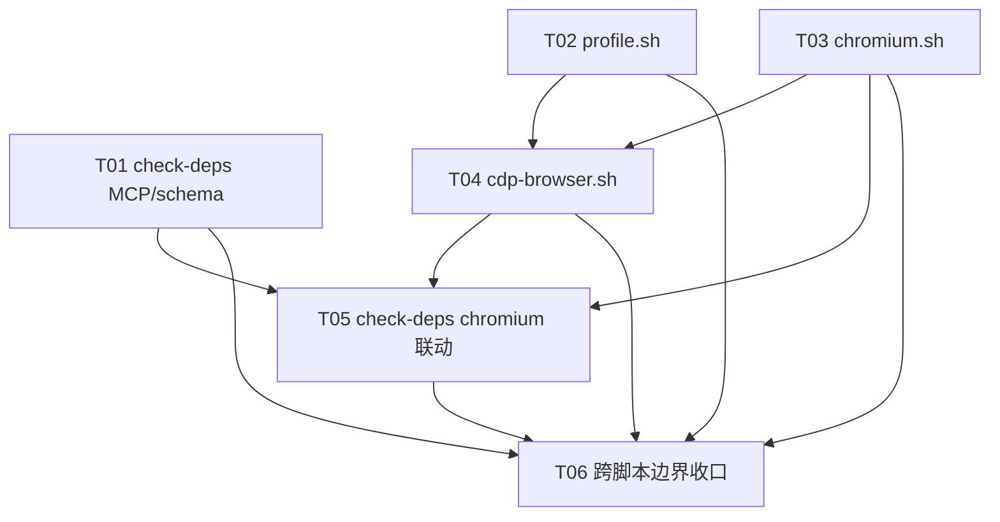

# pr-001-scripts-deterministic-ops-tasks.md

**对应 PR**: `prs/pr-001-scripts-deterministic-ops.md`
**对应阶段**: PR 实现（阶段 5）内部任务拆解，由 `planner` 产出
**上游产物**: `architecture.md` §决策 D1~D4（CfT 下载 / CDP_DEBUG_HOME 布局 / 4 脚本接口契约与 check-deps JSON schema）；`prd/F05-scripts-resources.md`（6 条验收）
**基线事实**: worktree 分支 `pr-001-cdp-debug-skill` 中 `roles/cdp-debug-skill/` 尚不存在（`scripts/` 目录与 4 脚本全部为**新建**；SKILL.md/references 属 pr-002，本 PR 不触碰）

---

## 1. 规划概要

### 1.1 目标

把 PR-001 的 8 条验收标准（下文称 PR-AC1~8，按 PR 文件 checkbox 逐条清点）与 F05 的 6 条验收（F05-1~6）拆解为可独立验收的实现任务：4 个 bash 3.2 兼容脚本（`check-deps.sh` / `chromium.sh` / `cdp-browser.sh` / `profile.sh`），零新增依赖（JSON 解析一律走 macOS 自带 `/usr/bin/python3`），构成"确定性操作层"——只输出事实、不做语义判断、不依赖 SKILL.md/references、不写仓库内任何路径。

### 1.2 范围边界

只新建 PR 文件范围列出的 4 个文件（各任务改动位置均为"新建 + 可执行位"）：

- `roles/cdp-debug-skill/scripts/check-deps.sh`
- `roles/cdp-debug-skill/scripts/chromium.sh`
- `roles/cdp-debug-skill/scripts/cdp-browser.sh`
- `roles/cdp-debug-skill/scripts/profile.sh`

不改动：`roles/cdp-debug-skill/` 下任何既有文件（当前不存在，全程不创建 SKILL.md/references 面——pr-002 范围）；仓库 `.gitignore`（PR-AC7 禁止新增/修改）；仓库内任何其他路径。

**全局约束（对全部 4 脚本生效，逐脚本任务仅以引用方式纳入对应 AC，最终由 T06 统一审计）**：

- **G1 确定性边界**：脚本输出只含事实与操作结果状态；不输出对页面证据/结论/依赖可用性的语义判断（不输出"可用/缺失/请注册/通过/失败"类结论，含中文及等价英文表述）；状态表达只经 JSON 字段 / 退出码 / 裸路径。
- **G2 落点边界**：脚本一切写操作仅限 `$CDP_DEBUG_HOME`（默认 `$HOME/.local/share/cdp-debug-skill`，git 外）；不写仓库内路径、不改 `.gitignore`。
- **G3 可独立调用**：脚本无参/子命令调用不依赖 `roles/cdp-debug-skill/SKILL.md`、`references/*` 存在（脚本内不得引用 sibling 文档路径）。
- **G4 运行环境**：以 `/bin/bash`（macOS 自带 3.2.57）可运行（`bash -n` 无语法错误，不使用关联数组等 bash 4+ 特性）；JSON 生成/解析经 `/usr/bin/python3`；不依赖 jq / npm / brew 等非系统自带工具（网络下载仅用系统自带 curl）。
- **G5 隔离验证**：验收动作中所有会落盘的场景须将 `CDP_DEBUG_HOME` 指向临时目录（`mktemp -d`），避免污染真实 `$HOME/.local/share/cdp-debug-skill`；`~/.claude.json` / `<cwd>/.mcp.json` 解析用临时 HOME / 临时 cwd fixture，不依赖真实用户配置状态。

### 1.3 任务总览

| 任务 ID | 名称 | 关联验收标准 | 前置依赖 | model_inferred |
|---|---|---|---|---|
| T01 | check-deps.sh：JSON schema 骨架 + 三配置源 MCP facts + 退出/错误契约 | PR-AC2、PR-AC3；F05-2、F05-6 | 无 | 是（scope 三源映射、error/errors 命名、多源命中顺序，见 AC 标注） |
| T02 | profile.sh：生命周期 + 默认 main + wipe 安全兜底 | PR-AC6、PR-AC7（profile 落点）；F05-4 | 无 | 否 |
| T03 | chromium.sh：CfT 下载/幂等 ensure/manifest/glob | PR-AC4、PR-AC7（chromium 落点）；F05-5、F05-6 | 无 | 是（ensure 版本不一致时的退出码约定、path 未安装时行为） |
| T04 | cdp-browser.sh：启停/端口与 profile 契约/单实例锁 | PR-AC5、PR-AC7；F05-3、F05-6 | T02、T03 | 是（启动二进制来源机制） |
| T05 | check-deps.sh：chromium facts 联动 + 三脚本事实源一致性 | PR-AC2（chromium 字段正路径）；F05-2 | T01、T03、T04 | 否（探测机制实现细节，见 §5 疑问） |
| T06 | 跨脚本边界收口：可执行/独立调用/不写仓库/语义审计/G4 复核 | PR-AC1、PR-AC7、PR-AC8；F05-1、F05-6 | T01~T05 | 否 |

### 1.4 任务依赖图

**循环检查**：无循环依赖。T01/T02/T03 互相独立（不同文件，无共享符号被对方消费，可任意顺序执行）；T02 与 T03 是 T04 的前置（cdp-browser.sh 的 start 正路径验收需要 profile path 契约 + 已安装的 CfT 二进制）；T05 需要 T01（schema 骨架）+ T03（manifest 已写入）+ T04（可启动实例做 running/port 受控翻转）；T06 汇总校验 T01~T05。

**T01 先行理由**：D4 的 check-deps JSON schema 定义了事实词汇（`configured/scope/command/args/endpoint_arg`、`installed/version/path/running/port/profile_dir`），`chromium.sh status` 与 `cdp-browser.sh status --json` 作为"同一事实源"（D4「与 F10 的调用契约」）应先锚定该词汇，避免后续脚本各自发明不一致字段。

**关键路径**：T02→T04→T05→T06 与 T03→T04→T05→T06（最长依赖链 4 层）；关键路径任务 = T02/T03（上游提供者）→ T04 → T05 → T06。

---

## 2. 任务详情

### T01：check-deps.sh — JSON schema 骨架 + 三配置源 MCP facts + 退出/错误契约

- **前置依赖**：无
- **改动位置**：`roles/cdp-debug-skill/scripts/check-deps.sh`（新建，`chmod +x`）
- **目标**：交付可独立运行的依赖检查脚本的主体：stdout 恒为合法 JSON（结构完全对齐 D4 schema），解析三处配置源产出两个 MCP 的 `configured/scope/command/args/endpoint_arg` 事实，落实"exit 0 = 执行成功（与依赖是否齐备无关）"与"自身执行错误 exit≠0 + error 字段"两个契约。本任务范围内 `chromium` 段输出空态事实（`installed:false`、其余 `null`/`false`，结构键全量存在）——与已安装 manifest / 运行实例联动的正路径由 T05 完成。
- **验收标准**：
  - **AC-T01-1**：无参运行 `check-deps.sh` exit 0，stdout 为合法 JSON；顶层键恰为 `checked_at`/`mcp`/`chromium`/`errors` 四个；`mcp.playwright` 与 `mcp.chrome_devtools` 均含 `configured/scope/command/args/endpoint_arg` 五个键；`chromium` 含 `installed/version/path/running/port/profile_dir` 六个键。在无任何配置/未安装 chromium 的隔离环境（临时 HOME + 临时 cwd）中：两 MCP `configured:false`、`scope:null`、`command:null`、`endpoint_arg:null`、`args:[]`；`chromium.installed:false`、`running:false`、其余 `null`；`errors:[]`。
    **追溯**：PR-AC2；F05-2；`architecture.md` D4 check-deps JSON schema 原文（键名、空值形态逐键一致）。
  - **AC-T01-2**：三处配置源解析——以隔离 fixture 构造 `~/.claude.json` 顶层 `mcpServers`、`~/.claude.json` 的 `projects["<cwd>"].mcpServers`、`<cwd>/.mcp.json` 三源分别单点命中 `playwright` 与 `chrome_devtools` 各一次，每次 `configured:true` 且 `scope` 报告对应来源（user/project/local 三值映射见 AC-T01-3 标注）；`command`/`args` 与配置原文逐值一致（server 配置的 command 与 args 数组原样搬运）；三源同时不存在或均无该 server 名时 `configured:false`。
    **追溯**：PR-AC2（"解析三处配置源…任一含 server 名即 configured=true 并报告 scope"）；F05-2；D4（`scope` 报告来源）。
  - **AC-T01-3**（`[model_inferred]`）：配置含 `--cdp-endpoint`（playwright）或 `--browser-url`（chrome_devtools）参数时 `endpoint_arg` = 该参数值（从 command/args 原文解析，两个 MCP 的端点参数名不同）；不含时 `null`。**推断说明**：endpoint_arg 的取参名由 D4 行文（"@playwright/mcp 的 `--cdp-endpoint`/chrome-devtools-mcp 的 `--browser-url` 值"）与 D1（两参数即 Form A 附着参数）直接给出，非凭空；**scope 三源映射**（顶层→`user`、`projects["<cwd>"]`→`project`、`<cwd>/.mcp.json`→`local`）D4 未逐字钉死，系按 Claude Code scope 词汇推导，需主 agent 确认；**多源同时命中**时的 `scope` 取值优先级 D4 未定义——要求：输出确定（同一输入两次运行结果一致），具体优先级（建议固定探测顺序取首个命中源，或文档化任一固定规则）由主 agent 确认后定。
    **追溯**：PR-AC2；D4 schema 与 endpoint_arg 行；D1。
  - **AC-T01-4**：任一配置源文件存在但内容为非法 JSON 时：脚本不崩溃、stdout 仍为合法 JSON、不中断其余配置源的解析，该源按确定性方式处理（建议：记入 `errors` 数组并继续；`[model_inferred]`——该处理方式 D4 未钉死，需主 agent 确认）。
    **追溯**：PR-AC2（`errors` 字段）；F05-2。
  - **AC-T01-5**（退出/错误契约）：在依赖完全缺失的隔离环境（无配置、无 chromium）运行 exit **0**——exit 0 仅表"执行成功"，与依赖是否齐备无关；代码中存在"自身执行错误"分支（如 python3 不可用/子进程失败导致无法完成检查），该分支 exit≠0 且 stdout 仍为合法 JSON 并含 `error` 字段（描述性字符串）。裸判动作：代码审查确认错误分支实现 + 以受控诱导（临时把脚本内 python3 调用替换为必然失败命令，验证后还原，或等效最小侵入手段）触发一次，观察 exit≠0 + JSON 含 `error`。**命名分歧见 §5 疑问 5.1**（schema 正常输出为 `errors:[]` 数组、自错契约为 `error` 字段——按 PR-AC3 与 D4 行文两者并存，正常路径无 `error` 键）。
    **追溯**：PR-AC3；D4（"exit 0=执行成功（无论依赖是否齐）…自身错误 exit≠0 + error 字段"）。
  - **AC-T01-6**：G4 兼容——`/bin/bash -n check-deps.sh` 无语法错误；以 `/bin/bash` 运行全部上述验收动作通过；JSON 生成/解析不依赖 jq（实现应经 `/usr/bin/python3`）。
    **追溯**：PR-AC1（可执行）；D4（bash 3.2 + python3，零新增依赖）。
  - **AC-T01-7**：G1 确定性边界——本任务范围内脚本输出无"可用/缺失/请注册/通过/失败"类依赖结论词（含等价英文）；`configured:false` 与 `installed:false` 仅作为事实字段存在，不附带任何建议/结论句式。
    **追溯**：PR-AC8；F05-6；D4（"只给事实不给结论"）。

---

### T02：profile.sh — 生命周期 + 默认 main + wipe 安全兜底

- **前置依赖**：无
- **改动位置**：`roles/cdp-debug-skill/scripts/profile.sh`（新建，`chmod +x`）
- **目标**：交付 profile 生命周期管理脚本（D3/D4 契约）：`list`/`create`/`path`/`wipe`，profile 落点 `$CDP_DEBUG_HOME/profiles/<name>`（默认名 `main`，`CDP_DEBUG_HOME` 默认 `$HOME/.local/share/cdp-debug-skill`、env 可覆盖），`path <name>` 输出绝对路径供 cdp-browser.sh 消费（T04 依赖此契约），`wipe` 需显式确认（破坏性安全兜底，协议检查项 #15 边界）。
- **验收标准**：
  - **AC-T02-1**：子命令 `list`/`create`/`path`/`wipe` 齐备；name 参数缺省为 `main`（`create`/`path`/`wipe` 省略 name 时作用于 `main`）；`path <name>`（及缺省）输出一行**绝对路径** `<CDP_DEBUG_HOME>/profiles/<name>`（env 覆盖 `CDP_DEBUG_HOME` 后路径随之变化），无尾随斜杠、无其他 stdout 内容；该输出与 T04 中 `--user-data-dir` 实际使用的路径一致。
    **追溯**：PR-AC6（`path <name>` 输出 user-data-dir 绝对路径供 cdp-browser.sh 消费）；D3（默认 profile 名 main）；D4。
  - **AC-T02-2**：`create <name>` 在 `$CDP_DEBUG_HOME/profiles/<name>` 创建目录（`CDP_DEBUG_HOME` 指向临时目录时可在其下观察到）；对已存在 profile 再次 `create` 不覆盖、不报错、输出确定性事实（目录原样保留）；`list` 列出全部已创建 profile 名（空环境输出空列表事实）。
    **追溯**：F05-4（创建/复用）；D3（布局）。
  - **AC-T02-3**：`wipe <name>` 默认路径（无确认）**不执行任何删除**——目标目录内容原样保留，输出确定性提示（含确认方式用法）；显式 `--confirm`（或等价的交互确认路径，D3 "需显式 `--confirm` 或交互确认才执行"二选一实现即可）后 `wipe` 才删除该 profile 目录。裸判动作：`create demo` → 写入标记文件 → `wipe demo`（无确认）→ 目录与标记文件仍在；`wipe demo --confirm` → 目录消失。`wipe` 的确认途径与目标名在输出中明确可见，且确认缺失时绝不执行。
    **追溯**：PR-AC6（wipe 需显式 `--confirm` 或交互确认才执行）；D3（破坏性安全兜底）；F05-4（清理）。
  - **AC-T02-4**：G2 落点边界——默认（不设 env）时 profile 路径解析为 `$HOME/.local/share/cdp-debug-skill/profiles/<name>`（git 外），脚本运行不产生仓库内任何路径写入、不修改仓库 `.gitignore`（在仓库 cwd 下以临时 `CDP_DEBUG_HOME` 运行全部子命令后仓库 `git status` 无可观察新增）。
    **追溯**：PR-AC7；F05-4；D3。
  - **AC-T02-5**：G1/G4——`/bin/bash -n` 通过、以 `/bin/bash` 运行上述动作无语法错误；输出为人类可读事实/裸路径，不含依赖可用性结论词。
    **追溯**：PR-AC8；D4（bash 3.2）。

---

### T03：chromium.sh — CfT 下载 / 幂等 ensure / manifest / glob 解析

- **前置依赖**：无
- **改动位置**：`roles/cdp-debug-skill/scripts/chromium.sh`（新建，`chmod +x`）
- **目标**：交付独立 Chromium 下载/就绪脚本（D2 契约，非复用本机 Google Chrome——F05-5）：子命令 `ensure`/`install`/`verify`/`status`/`path`；渠道 = CfT 官方 JSON（`googlechromelabs.github.io/chrome-for-testing` `last-known-good-versions-with-downloads.json` → `channels.Stable`）+ `storage.googleapis.com` HTTPS，平台 `mac-arm64`；ensure 幂等（已装 = known-good → 就绪事实不动作；不一致 → 输出 installed vs known-good facts 不自动升级，`-f` 显式强制）；下载后写 `$CDP_DEBUG_HOME/chromium/.manifest.json`（version/url/path/sha256/installed_at，sha256 本地计算）；解包后 glob 动态解析 `*.app/Contents/MacOS/*` 定位可执行文件（不写死 zip 内部布局）；构建落 `$CDP_DEBUG_HOME/chromium/<version>/`。
- **验收标准**：
  - **AC-T03-1**：子命令 `ensure`/`install`/`verify`/`status`/`path` 齐备；`path` 在已安装时输出一行可执行文件绝对路径（无其他 stdout）；`status`/`verify` 输出 JSON 事实（含 installed/version/path 等价事实字段）；`ensure`/`install` 输出 JSON 事实。未知子命令/缺参输出 usage（确定性、不产生副作用）。
    **追溯**：PR-AC4（支持 ensure/install/verify/status/path）；D4（chromium.sh 职责表：JSON/单行路径）。
  - **AC-T03-2**：`ensure` 幂等 + 版本策略——①未安装：联网执行 `ensure` 完成 CfT Stable（mac-arm64）下载、解包至 `$CDP_DEBUG_HOME/chromium/<version>/`、写出 `.manifest.json`（version/url/path/sha256/installed_at 五字段齐全、sha256 与本地重算一致），再次 `ensure` 输出就绪事实且**不重新下载**（观察无新增网络传输/目录 mtime 不变即可判，或用 `status` 对比 version/path 不变）；②已装版本 ≠ known-good Stable（受控构造：编辑 manifest 的 version 为旧值，或本地预置不同版本目录）：`ensure` 输出 installed vs known-good 的版本事实且**不自动升级**（manifest 与 `<version>/` 目录不被改写），加 `-f` 后执行升级替换。
    **追溯**：PR-AC4（ensure 幂等、版本不一致输出 facts 不自动升级、`-f` 显式强制）；F05-5；D2（版本策略、manifest 字段）。
  - **AC-T03-3**：zip 解包后以 glob `*.app/Contents/MacOS/*` 动态解析可执行文件——不以硬编码的 zip 内部路径（如固定的 `.app/Contents/MacOS/Google Chrome for Testing` 全路径字符串拼接）定位；`path`/`status`/`verify` 报告的可执行文件路径是 glob 解析结果且实际存在、可执行。裸判动作：代码审查确认 glob 动态解析 + 安装完成后 `path` 输出的文件存在且可执行、`version` 与 manifest 一致。
    **追溯**：PR-AC4（glob 动态解析、不写死 CfT mac zip 内部布局）；D2（落盘与 glob 解析）。
  - **AC-T03-4**：`verify` 以磁盘事实核验 manifest 声明——二进制存在性、sha256 重算与 manifest 记录比对，输出字段级事实（如 `hash_matches: true/false`、path 存在性），**不输出"验证通过/失败"类结论词**；`status` 输出当前安装事实（installed/version/path）；未安装时 `status`/`verify` 输出 `installed:false` 事实。下载/解包/校验失败等自身执行错误：exit≠0 且 stdout 为含错误描述的 JSON（`[model_inferred]`——chromium.sh 的错误退出约定 D4 未逐字钉死，建议与 check-deps 自错契约同构：exit≠0 = 脚本自身执行失败；版本不一致属正常状态报告不属错误，见 AC-T03-5）。
    **追溯**：PR-AC4（manifest version/url/path/sha256/installed_at）；F05-5（报告就绪状态=事实）；G1。
  - **AC-T03-5**（`[model_inferred]`）：版本不一致（非 `-f`）时 `ensure` 的退出码——建议 exit 0（无错误发生，输出 facts 由调用方决策 `-f`，与"不自动升级"语义自洽）；未安装时 `path` 建议无 stdout 输出且 exit≠0（机器可判、无结论词）。两者 D2/D4 未钉死，需主 agent 确认。
    **追溯**：PR-AC4；D2（版本策略）。
  - **AC-T03-6**：G2/G4/G5——下载产物、manifest 全部落在 `$CDP_DEBUG_HOME` 下（验收用临时 `CDP_DEBUG_HOME`），仓库 `git status` 无可观察新增、`.gitignore` 未改；`/bin/bash -n` 通过；JSON 经 `/usr/bin/python3`；下载仅用系统自带 curl（HTTPS，源 = 官方 JSON + googleapis）；本地 sha256 用系统自带 `shasum -a 256`。
    **追溯**：PR-AC7；F05-4；D2（校验=官方 JSON + HTTPS、sha256 记录）；G4。
  - **AC-T03-7**：网络不可用/官方 JSON 拉取失败/下载失败时快速失败（exit≠0 + 确定性错误 JSON 事实），不产生半成品安装（不写 manifest 或写出可被下次 ensure 识别的失败状态）；`status`/`verify`/`path` 为纯本地只读操作，离线可运行。
    **追溯**：F05-5（就绪状态报告）；G1/G4；D2（信任边界=官方 JSON+HTTPS）。

  **任务备注**：AC-T03-2①的真实联网下载为重型动作（CfT mac-arm64 zip 体积大），验收允许以"本地预置已解包构建 + 构造对应 known-good 版本值"的 fixture 验证幂等/版本比较/glob/manifest 逻辑；真实网络下载全链路冒烟（E5 已实测可达）在有网环境至少执行一次。AC 判定不以网络条件为硬前提。

---

### T04：cdp-browser.sh — 启停 / 端口与 profile 契约 / 单实例锁

- **前置依赖**：T02（profile path 契约：`--user-data-dir` 指向 `profile.sh path` 的输出）、T03（start 正路径需要已安装的 CfT 二进制）
- **改动位置**：`roles/cdp-debug-skill/scripts/cdp-browser.sh`（新建，`chmod +x`）
- **目标**：交付独立 Chromium 启停脚本（D1/D4 契约）：子命令 `start`/`stop`/`status`/`restart`；`start` 以 `--remote-debugging-port=<port 默认 9222>` + `--user-data-dir=<profile 路径>` 启动 CfT 独立 Chromium（非本机 Google Chrome）；端口与 profile 可经参数或 env 覆盖；幂等 start；对已占用 profile 输出确定性 facts 不强启（Chrome profile 单实例锁，D3）；`status` 支持 `--json`；输出默认人类可读、`status --json` 机器可读。
- **验收标准**：
  - **AC-T04-1**：子命令 `start`/`stop`/`status`/`restart` 齐备；`status` 输出人类可读事实且支持 `--json`（JSON 含 running/port/profile_dir 等价事实字段，词汇与 check-deps `chromium` 段对齐——键名可不同但语义一一对应）；未运行实例时 `status` 输出 running:false 事实、exit 0（事实报告非错误）。
    **追溯**：PR-AC5（start/stop/status/restart、status --json）；D4；D1（时序约定：链路执行前先 status）。
  - **AC-T04-2**：`start` 实际启动进程的命令行含 `--remote-debugging-port=<port>` 与 `--user-data-dir=<CDP_DEBUG_HOME>/profiles/<name>`（裸判：`ps` 核对实际进程参数；name 缺省 `main`、port 缺省 9222 与 D1/D3 一致）；启动后 `<profile>` 目录存在且出现 Chromium 运行产物；CDP 端点 `http://127.0.0.1:<port>/json/version` 可探通（返回含 Chromium 信息的 JSON）；启动进程的二进制路径位于 `$CDP_DEBUG_HOME/chromium/` 下（CfT 安装面），**不是** `/Applications/Google Chrome.app` 等本机 Chrome（F05-5 独立 Chromium 语义）。
    **追溯**：PR-AC5（start 参数形态）；F05-3；D1（`--remote-debugging-port=<port 默认 9222>` + `--user-data-dir=<profile>`）；F05-5（非复用本机 Google Chrome）；D2。
  - **AC-T04-3**：端口与 profile 覆盖——以参数或 env（至少其一，CLI usage 中明确文档化）把 port 改为非 9222、把 profile 改为非 `main` 后 `start`，实际进程参数与 `status --json` 中的 port/profile_dir 事实随之改变且互相一致；覆盖后的端点 `http://127.0.0.1:<改后port>/json/version` 可探通。
    **追溯**：PR-AC5（端口可经参数或 env 覆盖；默认 9222）；F05-3（CDP 调试端口可配置、端口冲突可换——C-6）。
  - **AC-T04-4**：幂等 start + 单实例锁——①同一 port + 同一 profile 重复 `start`：不产生第二个进程（`ps` 断言同 profile 仅一个浏览器进程），第二次 start 输出确定性"已在运行"事实（含端口/profile 事实）不强启；②`status --json` 的 running/port/profile_dir 与真实进程一致；③对**已占用 profile**（同一 `--user-data-dir` 已被浏览器进程占用）start 输出确定性 facts 不强行启动（不 kill 既有进程、不并行占用同一 user-data-dir）——D3 单实例锁。
    **追溯**：PR-AC5（对已占用 profile 输出确定性 facts 不强启）；F05-3；D3（Chrome profile 单实例锁）。
  - **AC-T04-5**：`stop` 停止由本脚本启动的实例（start 后再 stop：进程退出、端口不再可探通、`status` 回 running:false）；对未运行实例 `stop` 为确定性空操作（facts、exit 0）；`restart` = stop + start 的组合语义（restart 后实例可探通、profile 目录复用）。
    **追溯**：PR-AC5（stop/restart）；F05-3（启动/关闭）。
  - **AC-T04-6**：G1/G2/G4——`/bin/bash -n` 通过、以 `/bin/bash` 运行通过；输出无依赖可用性结论词（"已就绪/可用/失败"类禁止，运行状态以 facts/退出码表达）；本脚本运行与启停产物全部落在 `$CDP_DEBUG_HOME` 下（验收用临时 `CDP_DEBUG_HOME` + 临时 port 避免冲突），仓库 `git status` 无可观察新增。
    **追溯**：PR-AC7、PR-AC8；F05-6；G4。

---

### T05：check-deps.sh — chromium facts 联动 + 三脚本事实源一致性

- **前置依赖**：T01（schema 骨架已含 chromium 空态字段）、T03（已产生 manifest 与安装构建）、T04（可启动受控实例）
- **改动位置**：`roles/cdp-debug-skill/scripts/check-deps.sh`（续 T01 补全 `chromium` 段正路径）
- **目标**：把 T01 的空态 chromium 段接上真实事实源：已安装时 `installed/version/path` 与 `chromium.sh` 的 manifest/`status` 一致；有受控实例运行时 `running/port/profile_dir` 与 `cdp-browser.sh status --json` 一致。机制（进程扫描 `--remote-debugging-port`/`--user-data-dir` 参数、读 manifest、或调用 sibling 脚本）由 dev 自定，约束 = 确定性与一致性（见 §5 疑问 5.2）。完成后本脚本即 PR-AC2 全量闭合。
- **验收标准**：
  - **AC-T05-1**（受控翻转）：在临时 `CDP_DEBUG_HOME` 下依次执行三态，每态运行 `check-deps.sh` 观察 chromium 段：①空态（无安装）→ `installed:false`、`running:false`、version/path/port/profile_dir 为 null；②`chromium.sh ensure` 后 → `installed:true` 且 `version`/`path` 与 `chromium.sh status`/manifest 一致；③`cdp-browser.sh start`（默认 port）后 → `running:true` 且 `port`/`profile_dir` 与 `cdp-browser.sh status --json` 一致；`stop` 后回 `running:false`。翻转过程 `exit 0` 全程不变（依赖状态变化不改变退出码）。
    **追溯**：PR-AC2（chromium 段 schema 一致、含 installed/version/path/running/port/profile_dir）；F05-2（Chromium 是否就绪的确定性报告）；D4。
  - **AC-T05-2**（一致性）：同一环境同一时刻并发运行 `check-deps.sh` 与 `cdp-browser.sh status --json`（及已安装时的 `chromium.sh status`），chromium 相关事实值（installed/version/path/running/port/profile_dir 语义）逐项一致——同一事实源（D4「cdp-browser.sh status/chromium.sh status 供 F09/前置 Gate 复用同一事实源」）。
    **追溯**：PR-AC2；D4（与 F10 的调用契约）；F05-2。
  - **AC-T05-3**：全部字段在任何受控状态下均保持 schema 合法（合法 JSON、键全量存在、类型正确：布尔/字符串/数组/null），无状态迁移中产生缺键或类型漂移。
    **追溯**：PR-AC2（schema 一致）；D4 schema。
  - **AC-T05-4**：G1——chromium 段只输出事实，不因"未安装/未运行"附带"请先运行 chromium.sh/cdp-browser.sh"类结论或指引句式。
    **追溯**：PR-AC8；F05-6；D4（"只给事实不给结论"）。

---

### T06：跨脚本边界收口 — 可执行/独立调用/不写仓库/语义审计/G4 复核

- **前置依赖**：T01~T05 全部完成
- **改动位置**：无新增文件；对 `roles/cdp-debug-skill/scripts/` 下 4 个脚本做整合级复核（发现问题时回到对应脚本任务修复，不在本任务打补丁）
- **目标**：汇总校验 PR 验收中跨脚本/跨文件的条目（PR-AC1/7/8 与 F05-1/6 无法归入单一脚本任务），作为"能否合入"的判断闸门。
- **验收标准**：
  - **AC-T06-1**：`roles/cdp-debug-skill/scripts/` 目录存在，`check-deps.sh`/`chromium.sh`/`cdp-browser.sh`/`profile.sh` 四文件齐备且均具可执行位（`ls -l` 核对）；每个脚本在其 usage/无参路径下运行不引用、不要求 `roles/cdp-debug-skill/SKILL.md` 或 `references/*` 存在（该两路径当前在分支上不存在——脚本在该真实状态下可运行即证）。
    **追溯**：PR-AC1；F05-1。
  - **AC-T06-2**：G2 全量复核——在仓库 cwd 内、`CDP_DEBUG_HOME` 指向临时目录、完整跑一遍四脚本的可写子命令（check-deps 无参 / chromium.sh ensure+status / cdp-browser.sh start+status+stop / profile.sh create+path+wipe --confirm）后，仓库 `git status` 无可观察新增/修改（含 `.gitignore` 未变）。
    **追溯**：PR-AC7；F05-4；D3。
  - **AC-T06-3**：G1 语义审计——通读 4 脚本全部输出文案与 JSON 字段，确认无对页面证据/结论/依赖可用性的语义判断（中文"可用/缺失/请注册/通过/失败"及等价英文 available/missing/please register/passed/failed 等不以结论句式出现在常规输出中）；状态一律经 JSON 事实字段 / 退出码 / 裸路径表达。抽查方式：逐一运行各子命令观察输出 + 源码检索。
    **追溯**：PR-AC8；F05-6；D4（不做语义判断）；协议检查项 #15。
  - **AC-T06-4**：G4 全量复核——4 脚本均 `bash -n` 无语法错误且以 `/bin/bash` 运行通过；全仓检索确认 JSON 处理未引入 jq 或非系统自带工具依赖（仅 bash + `/usr/bin/python3` + 系统自带 curl/sh 工具族）。
    **追溯**：PR-AC1；D4（bash 3.2 + python3，零新增依赖）。
  - **AC-T06-5**：PR-AC2~6 对应任务（T01~T05）已全部完成且各自验收通过（本闸门确认无跨任务遗漏，不重复执行单任务验收）。
    **追溯**：PR-AC1~8 全覆盖核对（见 §3 覆盖核对表）。

---

## 3. 验证清单与覆盖核对（全部任务完成后，交回 dev/verifier 前自查）

### 覆盖核对表（任务 × 验收条目）

| 验收条目 | 覆盖任务 |
|---|---|
| PR-AC1（scripts/ 目录 + 4 脚本可执行 + 不依赖 SKILL.md/references） | T01~T04（各文件可执行）、T06（AC-T06-1） |
| PR-AC2（check-deps schema 一致 + 三源解析 + chromium 字段） | T01（AC-1/2/3/4）、T05（AC-1/2/3） |
| PR-AC3（check-deps 自错 exit≠0 + error 字段） | T01（AC-5） |
| PR-AC4（chromium.sh 子命令/幂等/版本策略/glob/manifest） | T03（AC-1/2/3/4/5） |
| PR-AC5（cdp-browser 启停/端口与 profile 契约/单实例锁/status --json） | T04（AC-1~5） |
| PR-AC6（profile.sh 子命令/path 契约/默认 main/wipe 确认） | T02（AC-1/2/3） |
| PR-AC7（CDP_DEBUG_HOME git 外、不写仓库、不改 .gitignore） | T02（AC-4）、T03（AC-6）、T04（AC-6）、T06（AC-6-2） |
| PR-AC8（4 脚本无语义判断） | T01（AC-7）、T03（AC-4）、T04（AC-6）、T05（AC-4）、T06（AC-6-3） |
| F05-1（scripts/ 存在、可独立调用） | T06（AC-6-1） |
| F05-2（依赖检查脚本：两 MCP + Chromium 就绪确定性报告） | T01、T05 |
| F05-3（CDP 启停：端口可配默认 9222 + 独立 user-data-dir） | T04（AC-2/3/4/5） |
| F05-4（profile 管理：创建/复用/清理 + 不入 git） | T02（AC-2/3/4）、T06（AC-6-2） |
| F05-5（独立 Chromium 下载/就绪，非本机 Chrome） | T03（AC-2/3/4/5/7）、T04（AC-2 二进制来源） |
| F05-6（scripts 无页面证据/结论语义判断） | T01（AC-7）、T03（AC-4）、T04（AC-6）、T05（AC-4）、T06（AC-6-3） |

### 自查清单

- [ ] 4 个脚本文件均新建于 `roles/cdp-debug-skill/scripts/`，均具可执行位；未创建/修改 SKILL.md、references/*、`.gitignore` 及仓库内任何其他文件
- [ ] T01~T05 的脚本行为验收均已执行通过（含 T05 三态受控翻转）
- [ ] T06 四项复核（可执行与独立调用 / git status 干净 / 语义审计 / bash3.2+python3）全部通过
- [ ] 覆盖核对表逐行确认无遗漏验收条目
- [ ] 5.1/5.2 列出的命名与机制未钉项已由主 agent 确认或按 §4 标注执行

---

## 4. `[model_inferred]` 标注汇总（需主 agent 确认）

- **AC-T01-3**：scope 三源映射（顶层 `~/.claude.json`→`user`、`projects["<cwd>"]`→`project`、`<cwd>/.mcp.json`→`local`）；多源同时命中时 scope 的优先级规则（建议按固定探测顺序取首个命中源或任一文档化固定规则，须确定性）。
- **AC-T01-4**：配置源为非法 JSON 时的处理（建议记入 `errors` 数组并继续解析其余源，exit 仍 0）。
- **AC-T03-5**：`chromium.sh ensure` 版本不一致（非 `-f`）时退出码（建议 0——正常状态报告）；`path` 未安装时行为（建议无输出 + exit≠0）。
- **AC-T03-4**（部分）：chromium.sh 下载/解包失败等自身执行错误的退出约定（建议与 check-deps 同构：exit≠0 + JSON 错误事实）。
- 若主 agent 确认以上建议，dev 按建议执行；确认结果变更时以主 agent 结论为准。

---

## 5. 疑问 / 越界（技术架构方案未钉死处，planner 不自行填补，供主 agent/dev 决策）

- **5.1 error/errors 命名分歧**：D4 schema 正常输出为 `errors: []`（数组），而 D4 行文与 PR-AC3 的"自身执行错误"契约写 `error` 字段。T01 按"正常路径 `errors` 数组（schema）、自错路径 exit≠0 + JSON 含 `error` 字段"两者并存实现，但字段命名并存是否即架构本意需主 agent 确认。
- **5.2 chromium 运行事实的探测机制**：check-deps.sh 的 `chromium.running/port/profile_dir` 与 `cdp-browser.sh status --json` 的探测机制 D4 未钉死（进程扫描启动参数 / 探 CDP 端点 / 维护状态文件均未指定）。T05 只约束"同一环境同一时刻值一致 + 确定性"，机制由 dev 自定；建议两脚本共享同一探测实现以保证一致性，是否作为硬约束需主 agent 确认（影响 pr-002 文档对 status 输出的描述口径）。
- **5.3 CLI 旗标与 env 名**：cdp-browser.sh 的端口/profile 覆盖方式（参数或 env）与各脚本自定 CLI 形态（如 `-f`/`--confirm`/`--json` 之外的旗标命名）架构未钉。本 PR 内以"usage 明确文档化 + 行为确定性 + 输出可被 sibling 消费"为验收下限；具体旗标名供 pr-002（SKILL.md/references 引用处）对齐，属 pr-002 文档侧契约，本 PR 不处理。
- **5.4 chromium.sh 版本比对数据源**：ensure 的 known-good Stable 版本取自 CfT 官方 JSON 需联网；离线时 ensure 的行为（快速失败，AC-T03-7）已按"自身错误"约定处理，但"本地已装版本在离线时是否仍可完成幂等判定"（读 manifest 即可，无需联网）建议 dev 实现为离线可用——此点不改变验收判定（AC-T03-2②的 fixture 验证已覆盖幂等逻辑），仅作实现建议。
