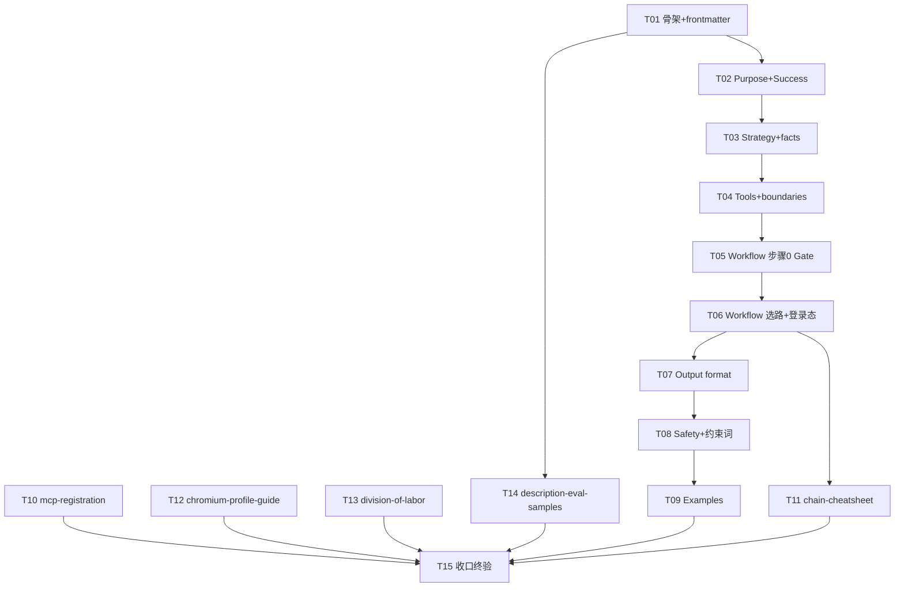

# pr-002-skillmd-and-references-tasks.md

**对应 PR**: `prs/pr-002-skillmd-and-references.md`
**对应阶段**: PR 实现（阶段 5）内部任务拆解，由 `planner` 产出
**上游产物**: `architecture.md`（D1/D3/D5/D6/D7/D8/D9/D10 + 「SKILL.md 内容大纲」表 + 「分工边界表内容」表 + 「安全与凭据」节 + CRITICAL ≤3 配额分配 + 外部事实 E1~E5/U1~U5）；`prd/F01~F04/F06~F13` 各功能卡（F05 仅涉 chromium-profile-guide.md 文档面）；`docs/skill-design-protocol.md` v3.1.0（§4.2 Section 清单、§4.3 frontmatter、§4.4 三明治、§5.2/5.3 层职责与渐进披露、§9.1.1 约束词分级、检查清单 #14/#15/#16）
**基线事实**: worktree 分支 `pr-002-cdp-debug-skill` 基于已含 pr-001 合并的新 main——`roles/cdp-debug-skill/scripts/` 4 脚本（check-deps.sh / chromium.sh / cdp-browser.sh / profile.sh）已存在且可运行（CLI/JSON 契约以脚本 `--help` 与无副作用运行输出为一手事实源）；`roles/cdp-debug-skill/` 下 SKILL.md 与 references/ 尚不存在（本 PR 全部为**新建**）；无 `.mcp.json`；scripts/ 4 文件本 PR 只读引用、不修改

---

## 1. 规划概要

### 1.1 目标

把 PR-002 的 19 条验收标准（下文称 PR-AC1~19，按 PR 文件 checkbox 逐条清点）与 F01~F04/F06~F13 卡（F05 仅文档面）拆解为可独立验收的文档实现任务：新建 `roles/cdp-debug-skill/SKILL.md`（v3.1.0 七层 Section 结构）+ `references/` 5 文件。全部为**文档编写**任务——交付物是策略/协议/领域知识文本，验收方式为**文档裸判**（读文件核对），不运行 MCP/浏览器、不执行下载/启停脚本副作用动作（脚本引用一致性以 `--help`/status 类只读输出为据）。

### 1.2 范围边界

只新建 PR 文件范围列出的 6 个文件：

- `roles/cdp-debug-skill/SKILL.md`
- `roles/cdp-debug-skill/references/mcp-registration.md`
- `roles/cdp-debug-skill/references/chain-cheatsheet.md`
- `roles/cdp-debug-skill/references/chromium-profile-guide.md`
- `roles/cdp-debug-skill/references/division-of-labor.md`
- `roles/cdp-debug-skill/references/description-eval-samples.md`

不改动：`roles/cdp-debug-skill/scripts/` 4 脚本（pr-001 交付，已合并入 main，本 PR 只读引用对齐 CLI）；`roles/cdp-debug-skill/` 下任何既有文件；仓库 `.gitignore`（PR-AC1 边界：F01 验收限定新增内容只落 `roles/cdp-debug-skill/` 与 `docs/iterations/0009-cdp-debug-skill/` 两处，**不改仓库 `.gitignore`**）；仓库内任何其他路径；宿主全局（`~/.claude/skills`）与异仓（powerby-skills 等）。

**全局约束（对全部 6 文件生效，逐任务以引用方式纳入对应 AC，最终由 T15 统一审计）**：

- **G1 文件边界**：只新增上述 6 文件；全程不创建 `roles/cdp-debug-skill/cdp-debug-skill.md`、`.mcp.json`、`schemas/`、`assets/`（D8：无 assets/schemas、无 .mcp.json、SKILL.md 命名即不随 install-pb-agents.sh 分发——F01 验收 2 实证）。
- **G2 CLI/JSON 契约对齐**：文档中一切对 scripts 的引用（子命令、参数旗标、默认值、env 名、JSON 字段、退出码语义）必须与分支上 4 脚本**实际 usage/输出**一致（以 `bash <script> --help` 与无副作用输出为核对基准），**不得照 architecture.md 描述或记忆臆写**（PR-AC15）。脚本实际契约速览（2026-09-08 从脚本 help 取证）：`check-deps.sh` 无参运行、stdout JSON facts（`mcp.playwright/chrome_devtools` 各含 configured/scope/command/args/endpoint_arg；`chromium` 含 installed/version/path/running/port/profile_dir；顶层 checked_at/mcp/chromium/errors），exit 0=执行成功（与依赖是否齐备无关）、用法错误 exit 2；`chromium.sh <ensure|install|verify|status|path> [-f|--force]`（status 输出 JSON：command/installed/version/path/manifest；path 输出单行路径）；`cdp-browser.sh <start|stop|status|restart> [--port <n>|--profile <name>|--json]`（默认 port 9222、profile main；env `CDP_DEBUG_HOME`/`CDP_PORT`/`CDP_PROFILE`；status --json 含 running/pid/port/profile_dir/endpoint）；`profile.sh <list|create|path|wipe> [name] [--confirm]`（默认名 main；wipe 需 --confirm 或交互确认）。env `CDP_DEBUG_HOME` 默认 `$HOME/.local/share/cdp-debug-skill`。
- **G3 规范合规**：SKILL.md 按 v3.1.0 Section 顺序与架构大纲落位；references 按主题分文件、SKILL.md 保持精简（不进大段命令表/完整 schema 之外的领域长文）；约束词分级（CRITICAL ≤3、MUST/NEVER ≤2/Section）；scripts 职责边界叙述准确（scripts=确定性操作不做语义判断，语义分流留 agent 层）。
- **G4 无悬空引用**：文档内互引（references 文件名、SKILL.md 章节、scripts 路径）与跨文档指针必须指向真实存在的内容；`blocked_reason`/`next_step` 的指向（references/mcp-registration.md 等）必须可达。
- **G5 免责表述**：凡架构标注未核实项（U1~U5：@playwright/mcp 连接时机、CfT zip 内部布局、`--scope project` 精确落点、chromium.sh 无网行为、双 MCP 同 page target 并发附着），文档措辞不得断言为已实测事实，须按 U 项语义留余量（如"预计/建议/若未生效以 X 核实"）。

### 1.3 任务总览

| 任务 ID | 名称 | 关联验收标准 | 前置依赖 | model_inferred |
|---|---|---|---|---|
| T01 | SKILL.md 骨架 + frontmatter（name/description 三段/role/compatibility） | PR-AC1、PR-AC3、PR-AC6；F01/F02/F03 | 无 | 否 |
| T02 | Purpose + Success criteria | PR-AC2（文档面）、PR-AC4；F02/F06/F09/F11 | T01 | 否 |
| T03 | Strategy + Important facts and constraints | PR-AC12（判据部分）、PR-AC13（前提）；F04/F05/F06/F09/F10/F13 | T02 | 否 |
| T04 | Tools and capability boundaries | PR-AC2、PR-AC11（摘要+指针）、PR-AC12（工具归属）；F06/F07/F08/F09/F12 | T03 | 否 |
| T05 | Workflow 步骤 0：前置 Gate 与 F10 可执行路径 | PR-AC14、PR-AC15（Gate 契约）；F10、F05 文档面 | T04 | 否 |
| T06 | Workflow 选路编排 + 登录态链路语义 | PR-AC12、PR-AC13；F06/F07/F08/F09 | T05 | 否 |
| T07 | Output format：产物协议契约（schema 内联） | PR-AC16、PR-AC17；F02/F11 | T06 | 否 |
| T08 | Safety + 约束词配额落位 | PR-AC5、PR-AC18；F02/F13 | T07 | 是（CRITICAL 计数口径，见 §4/§5） |
| T09 | Examples：登录态续调完整闭环样例 | 大纲 Examples 行；F07/F09 | T08 | 否 |
| T10 | references/mcp-registration.md | PR-AC8；F04/D5/E1~E4 | 无 | 否 |
| T11 | references/chain-cheatsheet.md | PR-AC9、PR-AC15（CLI 面）；F04/D8 | T06 | 否 |
| T12 | references/chromium-profile-guide.md | PR-AC10；F05/F09/F13 文档面、D3/D5/D9 | 无 | 否 |
| T13 | references/division-of-labor.md | PR-AC11；F12/分工边界表内容 | T04（指针反向核对） | 否 |
| T14 | references/description-eval-samples.md | PR-AC7；F03/D10 | T01 | 否 |
| T15 | Resources 索引 + 跨文件一致性 + PR 验收终验复核 | PR-AC1、PR-AC4、PR-AC5、PR-AC15、PR-AC19 + 全部终验面；F01/F02/F04/F05/F10 | T01~T14 | 否 |

### 1.4 任务依赖图

**循环检查**：无循环依赖。T01~T09 是对同一文件（SKILL.md）的依序填写——同文件连续编辑，天然串行；T10/T12/T13 内容分别由 D5/D3/分工边界表内容独立锁定，**无任何 SKILL.md 前置依赖**（若 dev 采用并行子代理，三者可与 SKILL.md 链并行编写，T15 做一致性收口）；T14 依赖 T01（description 定稿——样例须与 description 边界一致）；T11 依赖 T06（速查条目须与 Workflow F06~F09 表述一致）。

**关键路径**：T01→T02→…→T09→T15（最长链 10 层，SKILL.md 正文链）；关键路径任务 = T01（全链起点，frontmatter 是评审逐字段核对对象）→ T05/T06（Workflow 承载最多验收条目：PR-AC12/13/14/15）→ T08（约束词与 Safety 配额）→ T15（唯一收口闸门）。

---

## 2. 任务详情

### T01：SKILL.md — 文件骨架 + frontmatter（name / description 三段 / role / compatibility）

- **前置依赖**：无
- **改动位置**：`roles/cdp-debug-skill/SKILL.md`（新建）
- **目标**：创建 SKILL.md 文件骨架与 frontmatter。frontmatter 六字段齐全且内容锁定（name/description/role.identity/role.relationship/role.character/compatibility）；正文全部 Section 标题按 PR-AC4 列举顺序一次立好（后续任务逐节填内容，本任务不填正文实质内容，各 Section 下可留占位一行注明"由 T0X 填充"——**占位须在 T09 完成时全部清零**，由 T15 终验）。
- **验收标准**：
  - **AC-T01-1**：`roles/cdp-debug-skill/SKILL.md` 存在可读；frontmatter `name: cdp-debug-skill`（kebab-case）。**追溯**：PR-AC1（name）；F01 验收 1；D8。
  - **AC-T01-2**：frontmatter `description` 三段齐备且与架构大纲 description 构成一致——做什么（CDP 页面调试统一编排：自动操作断言 / 失败深诊 / 登录态续调，产出结构化证据+截图+结论供仓库内下游复验）+ 何时用（页面调试 / 自动操作断言 / 页面失败排查 / 登录态续调类任务）+ 否定边界（不适用：纯测试框架编写与 CI、压测/性能基准、视觉回归基线、pb-v1-brower 式评审/验证协议任务、普通网页浏览取数——web-access/browse 语境）。裸判：逐段核对三段信息均出现、边界清单五项齐全。**追溯**：PR-AC6；F03 验收 1；大纲「description（F03）构成」。
  - **AC-T01-3**：frontmatter `role.identity` 为 L4 精度页面调试统一编排执行者人格（描述"谁是做这件事最好的人 + 专业能力边界"，如"把页面调试从零散命令收编为闭环编排的调试专家"级表述，非泛化套话）；`role.relationship` 定义与用户的协作关系（用户=决策者、skill=证据闭环交付者，登录/取证动作的边界）；`role.character` 定义边界默认行为（如证据驱动不产伪证、阻塞大声报告、凭据敏感）。裸判：三字段非空、语义分别对应 identity/relationship/character 三问。**追溯**：PR-AC3（role L4 精度）；F02 验收 2；规范 v3.1.0 §4.3.1b。
  - **AC-T01-4**：frontmatter `compatibility` 覆盖四项：macOS arm64、node ≥20.19（MCP 运行时，chrome-devtools-mcp engines 下限）、Claude Code、CfT Chromium。**追溯**：PR-AC3；大纲 frontmatter 行；E2。
  - **AC-T01-5**：frontmatter 不含 `style.inherits` / `principles` 指向 powerby 或任何跨仓引用（C-4/N6）；不声明 pb 生态横向能力。**追溯**：PR-AC2；F01 验收 3；F03 验收 3。
  - **AC-T01-6**：正文 Section 标题齐备且**顺序**为：Purpose → Success criteria → Strategy → Tools and capability boundaries → Important facts and constraints → Workflow → Output format → Resources → Examples → Safety；其中 Safety 与 Success criteria 两 Section 标题存在（PR-AC4 点名）。**追溯**：PR-AC4（骨架层面）；F02 验收 3/4；规范 §4.2。*备注：规范 §4.2 在 Resources 与 Examples 之间另有 "Subtask / parallelism guidance"，PR-AC4 列举与架构大纲均省略——本任务按 PR-AC4 字面 11 段骨架落位，是否补 Subtask 节见 §5 疑问 5.1，以主 agent 结论为准。*
  - **AC-T01-7**：全文件无 pb-v1 变体输入/输出协议 Section 名占位（本次 Output format 承载协议契约，F02"如适用"条款不适用，不引入 输入协议/输出协议 双节）。**追溯**：F02 验收 3；大纲 Section 表。
- **任务备注**：description 三段是 T14 样例集的对照基准——本任务完成后 T14 方可动笔；description 措辞定稿后 T02~T09 涉及触发边界处保持一致口径。

---

### T02：SKILL.md — Purpose + Success criteria

- **前置依赖**：T01
- **改动位置**：`roles/cdp-debug-skill/SKILL.md`（填 Purpose、Success criteria 两节）
- **目标**：定位层两句内容落位：Purpose 说明"一次触发、按需选路、证据闭环"的仓库内能力定义；Success criteria 给出可量化成功判据（评审可据此判"通过/不通过"，非自述）。
- **验收标准**：
  - **AC-T02-1**：Purpose 段落含"一次触发、按需选路、证据闭环"语义 + **仓库内能力定义**声明（仅本仓库内使用、不随 install-pb-agents.sh 分发、不声明 pb 生态横向能力——C-4）。裸判：Purpose 中上述两组语义均出现。**追溯**：PR-AC2（文档面）；F01 验收 3；大纲 Purpose 行；F06/W1。
  - **AC-T02-2**：Success criteria 为可量化条目（bullet 或 checklist 形态），至少含：①一次任务三类产物（结构化证据/截图/结论）齐全且 `artifact_root` 路径可查（返回绝对路径+产物清单——D6"路径可查"语义）；②结论三态（passed/failed/blocked）且各有证据依据（blocked 附原因）；③登录态续调跨会话连续性（两次调用同 profile 免重登——F09）；④不产伪证据（未就绪/未登录产出阻塞结论而非伪造通过）。**追溯**：PR-AC4（内容）；F02 验收 3；大纲 Success criteria 行；F02/F11/F09；D6。
  - **AC-T02-3**：Success criteria 含"失败时应如何表现"面（不产伪证据 + 阻塞大声报告附原因），与 Safety/Workflow 的 blocked 语义不矛盾。**追溯**：F09 验收 5；F10 验收 2；规范 §4.3（Success criteria 模板含失败表现）。
- **任务备注**：本节的"仓库内能力定义"声明是 PR-AC2 主落点之一（frontmatter 否定边界 + Purpose 使用范围双保险，呼应三明治）；不在此展开脚本/命令细节（G3 精简原则）。

---

### T03：SKILL.md — Strategy + Important facts and constraints

- **前置依赖**：T02
- **改动位置**：`roles/cdp-debug-skill/SKILL.md`（填 Strategy、Important facts and constraints 两节）
- **目标**：认知层落位——Strategy 给三层链路选路判据与共享实例前提/未配置分流的判断框架（不重复 Workflow 操作细节，指针指向 Workflow）；Important facts 给执行必需的约束事实（手动注册、Form A/B、profile 不入 git、单进程锁、CDP 端口安全）。
- **验收标准**：
  - **AC-T03-1**（Strategy·选路判据）：三类任务特征 ↔ 链路的判据以规则/表形态呈现——①需自动操作与断言 → 主链路 @playwright/mcp；②测试失败/页面异常需排查 → 诊断链路 chrome-devtools-mcp；③需保留登录态续调 → 登录态链路（独立 Chromium + profile）。裸判：三类↔三链路的映射可唯一读出，与 T06 Workflow 判据无矛盾（T15 复核）。**追溯**：PR-AC12；F06 验收 1；大纲 Strategy 行。
  - **AC-T03-2**（Strategy·共享实例前提与限制）：写明三层共享同一浏览器实例/上下文是方案成立前提；"连续"精确语义 = 同一浏览器进程 + 同一 user-data-dir（profile）的 cookie/localStorage/会话状态；**不承诺**两个 MCP 客户端同时附着同一 page target（U5 操作注记：诊断工具对某 page target 附着失败时，以导航到同一 URL 复现状态再取证——同 profile 下登录态仍在）。**追溯**：PR-AC13（前提面）；F09 验收 2；D1.4；大纲 Strategy 行。
  - **AC-T03-3**（Strategy·未配置分流 + 数据优先）：声明"主链路/诊断 MCP 未配置/未加载"由 Workflow 步骤 0 前置 Gate 处理（指针指向 Workflow，不在此重复分支细节）；本 skill **不承诺运行期自动注册 MCP**（N3/C-5）；证据采集数据优先（结构化数据先于截图）。**追溯**：PR-AC14（指针面）；F10 验收 3；F11 验收 1；大纲 Strategy 行；D7。
  - **AC-T03-4**（facts·手动注册）：写明两个 MCP（@playwright/mcp、chrome-devtools-mcp）当前均未配置、需用户**手动注册**（C-5），注册方法指针指向 references/mcp-registration.md（不在此贴命令，G3 精简）。**追溯**：PR-AC8（指针面）；F04 验收 3；大纲 Important facts 行。
  - **AC-T03-5**（facts·Form A/B）：给出 Form A vs Form B 语义区分——Form A = 两个 MCP 注册时均带指向同一 CDP 端点的连接参数（共享实例前提成立，登录态/跨层接力任务要求）；Form B = 不带端点参数、各 MCP 自起浏览器，仅适合无需登录态/无跨层接力的单链路任务（此时三层共享前提不成立）。**追溯**：F04/D5；大纲 Important facts 行（Form A vs B）。
  - **AC-T03-6**（facts·profile 与实例）：独立 profile 默认不入 git（`$CDP_DEBUG_HOME` 默认 git 外，C-6/N4 行为面指针指向 references/chromium-profile-guide.md）；同一 profile 同一时刻仅一个浏览器进程可用（Chrome profile 单实例锁）；CDP 调试端口安全提示（调试端口可被本机任意进程控制——E4 warning，端口仅本机调试用、注意暴露面）。**追溯**：PR-AC13（profile 面）；F09 验收 1/4；D3/E4；大纲 Important facts 行。
- **任务备注**：本节是"共享实例前提不成立则不得宣称登录态连续"（CRITICAL 配额②）与"不产伪通过/阻塞大声报告"（配额③）的判断框架落位点——措辞给 T08/全文 CRITICAL 标注预留明确挂载句，但**不在本任务自行添加 CRITICAL 标注**（配额统管在 T08，避免多处滥用超配额）。

---

### T04：SKILL.md — Tools and capability boundaries

- **前置依赖**：T03
- **改动位置**：`roles/cdp-debug-skill/SKILL.md`（填 Tools and capability boundaries 节）
- **目标**：执行层落位——三链路工具归属表/清单 + 分工边界摘要（指向 references/division-of-labor.md）+ "不做什么"显式边界（N1/N2/N3/N5/C-4/N6）。
- **验收标准**：
  - **AC-T04-1**（工具归属）：主链路 = @playwright/mcp（导航/点击/填表/断言/截图，browser_* 工具面）——明示 **browse/$B 不承担主链路首选**（C-2）；诊断链路 = chrome-devtools-mcp（console/网络 + 性能 trace/内存 heap，`--memory-debugging` 显式开启后内存取证工具才可用）；登录态链路 = scripts（check-deps.sh / chromium.sh / cdp-browser.sh / profile.sh 确定性操作）+ CDP 直连独立 Chromium。裸判：三归属与 C-2/C-3/D4 一致。**追溯**：PR-AC12（工具归属）；F06 验收 3；F07 验收 1；F08 验收 1；大纲 Tools 行。
  - **AC-T04-2**（分工摘要 + 指针）：本节含分工边界**摘要**（一段或几行：与 gstack browse / pb-v1-brower / investigate 的分工一句话）+ 显式指针"详见 `references/division-of-labor.md`"（文件名拼写与 D8 一致）。**追溯**：PR-AC11（摘要+指针面）；F12；大纲 Tools 行；D8。
  - **AC-T04-3**（不做什么清单，逐条可核对）：①不重造浏览器驱动（N1）；②不替代 pb-v1-brower 的 review/verify/iterate 报告协议与"只观察不改码"职责（N1）；③不做测试框架/CI 集成、不写 playwright test 套件、不做视觉回归基线、不做压测/性能基准（N2）；④不改动宿主全局（`~/.claude/skills`）与异仓（含 powerby-skills）（N5）；⑤不引用 powerby 跨仓技能、不声明 pb 生态横向能力、不做跨仓分发（C-4/N6）；⑥不承诺运行期自动注册 MCP（N3）。裸判：上述各条以"不/不做"句或等价否定表述出现。**追溯**：PR-AC2；F12 验收 3；大纲 Tools 行。
  - **AC-T04-4**：工具归属处指向对应 Workflow 章节/步骤（主链路/诊断/登录态的执行步骤在 Workflow 中的落位指针），不在此重复实现链路能力（G3）。**追溯**：F06 验收 3（"指向对应章节"）；大纲 Tools 行。
- **任务备注**：分工表正文在 T13（division-of-labor.md）；本节只放摘要+指针，正文不复制分工表全文（5.3 渐进披露，SKILL.md 精简）。若 T13 先行完成，本节可对照其行文——T15 复核两处一致。

---

### T05：SKILL.md — Workflow 步骤 0：前置 Gate 与 F10 可执行路径

- **前置依赖**：T04
- **改动位置**：`roles/cdp-debug-skill/SKILL.md`（Workflow 节内步骤 0 部分）
- **目标**：交付 F10 可执行路径的文档主体：任何任务先过前置 Gate——双层检测（会话工具面 + check-deps.sh JSON facts）→ 四分支分流 → 就绪才进选路（T06），未就绪产 blocked 结论 + 指引；并保证 Gate 描述与 pr-001 实际脚本契约一致（PR-AC15）。
- **验收标准**：
  - **AC-T05-1**（Gate 动作）：Workflow 步骤 0（名称含"前置 Gate"/等价）明示：①agent 目检当前会话可用工具面（两 MCP 工具是否已在会话工具列表——注册后需重启宿主会话才加载）；②**无参运行** `scripts/check-deps.sh` 并解析其 stdout JSON facts。**追溯**：PR-AC14；F10 验收 1；D7（双层检测）。
  - **AC-T05-2**（分流 ①就绪）：两 MCP 配置且加载 + Chromium 就绪 → 进入正常选路（Workflow 步骤 1，T06 定义）——"就绪路径与未配置路径两条路径均明确定义、不互相遮蔽"（F10 验收 5）。**追溯**：PR-AC14（①）；F10 验收 5。
  - **AC-T05-3**（分流 ②MCP 缺失）：任一 MCP 缺失/未加载 → 任务产出 **blocked** 结论（`blocked_reason=mcp_unconfigured`）附缺失明细（check-deps 摘要：哪个 MCP、configured 状态）+ `next_step` 指向 `references/mcp-registration.md` 对应小节（Form A 注册）——不产出通过/失败伪结论、不产出空证据。**追溯**：PR-AC14（②）；F10 验收 1/2；D7。
  - **AC-T05-4**（分流 ③Chromium 缺失）：Chromium 缺失/未运行 → 指引（skill 可自助执行的确定性操作）`chromium.sh ensure` + `cdp-browser.sh start` → 复检（重跑 Gate/check-deps）→ 仍未就绪 → blocked（`chromium_not_ready`）+ 恢复指引。**追溯**：PR-AC14（③）；F10 验收 1；D7。
  - **AC-T05-5**（分流 ④Form A 前提）：任务需登录态/跨层接力但两 MCP 未按 Form A 带端点参数注册（check-deps `endpoint_arg` 为空/null 即判）→ blocked（`shared_instance_not_configured`）+ 指引改为 Form A 注册（指向 references/mcp-registration.md；手动注册语境下为文档指引，非自动改配置）。**追溯**：PR-AC14（④）；F10 验收 1；D7/D1。
  - **AC-T05-6**（配置在工具不在会话）：check-deps 显示 configured=true 但会话工具面无 MCP 工具 → 指引**重启宿主会话后重试**（`restart_required` 类指引），不与 mcp_unconfigured 混为一种结论。**追溯**：D7（"配置在但工具不在会话 → 指引重启宿主会话"）；PR-AC14 的检测面。
  - **AC-T05-7**（N3 明示）：Gate 描述明示"本 skill **不承诺运行期自动注册 MCP**——路径 = 检查 + 指引 + blocked 结论，注册动作永远由用户按 references 手动完成"（N3/C-5）。**追溯**：PR-AC14（N3 面）；F10 验收 3；D7。
  - **AC-T05-8**（脚本契约一致）：Gate 中出现的脚本调用形态与实际 CLI 一致——`check-deps.sh` 无参调用、stdout 为 JSON facts、exit 0 = 执行成功（与依赖是否齐备无关）；`chromium.sh ensure` 与 `cdp-browser.sh start` 子命令真实存在（对照脚本 --help）；文中不出现脚本不存在的旗标/子命令（G2）。**追溯**：PR-AC15；F10 验收 4；D4（"与 F10 的调用契约"）。
- **任务备注**：blocked 结论的 schema/枚举完整定义在 Output format（T07）；Gate 此处只写结论类型与原因名（`mcp_unconfigured`/`chromium_not_ready`/`shared_instance_not_configured`），原因名拼写须与 T07 枚举一致（T15 复核）。check-deps 的 JSON 键名引用（endpoint_arg 等）须与脚本实际输出一致。

---

### T06：SKILL.md — Workflow 选路编排 + 登录态链路语义

- **前置依赖**：T05
- **改动位置**：`roles/cdp-debug-skill/SKILL.md`（Workflow 节步骤 1 及后续：选路、组合编排、登录态就绪、失败转诊断接力、取证与产物落盘步骤）
- **目标**：交付 F06/F07/F08/F09 的 Workflow 编排主体：选路判据表、组合编排规则（登录态前置、失败转诊断接力共享上下文）、登录态链路完整语义（独立 Chromium + 共享实例前提 + 未登录产 blocked login_required）、时序约定与产物落盘步骤指针。
- **验收标准**：
  - **AC-T06-1**（显式选路判据）：Workflow 内以判据表/清单呈现——三类任务特征（①需自动操作与断言②测试失败/异常需排查③需保留登录态续调）各自唯一对应链路（主链路/诊断链路/登录态链路），评审者可据此唯一确定路由。**追溯**：PR-AC12；F06 验收 1；D1。
  - **AC-T06-2**（组合编排规则）：①需登录态 → 先经登录态链路就绪（实例+profile 就绪、登录交互经主链路 @playwright/mcp 工具面执行——Form A 下即操作共享实例）→ 再执行主链路/诊断；②主链路自动操作失败（断言不通过/页面异常）→ 转诊断链路深诊，接力链路共享同一浏览器上下文；③诊断证据支撑结论后供修复后复验（"失败→深诊→修复→复验"闭环）。**追溯**：PR-AC12；F06 验收 2；F07 验收 4；F08 验收 4；D1。
  - **AC-T06-3**（登录态链路声明）：明示登录态链路使用**独立 Chromium（Chrome for Testing）——非本机 Google Chrome**（C-6），由 `scripts/cdp-browser.sh start` 启动（`--remote-debugging-port=9222` 默认、端口冲突可换 + `--user-data-dir=$CDP_DEBUG_HOME/profiles/<name>` 默认 main，profile 管理指针 references/chromium-profile-guide.md）；独立 profile 默认不入 git。**追溯**：PR-AC13；F09 验收 1/4；C-6；D1/D3。
  - **AC-T06-4**（共享实例前提）：文档明确"三层共享同一实例/上下文（同一 CDP 端点 + 同一 user-data-dir profile）= 登录态链路成立前提"；Form A 不成立（两 MCP 未带端点参数注册）时**不得宣称登录态连续**（CRITICAL 配额②语义在此落位，标注动作归 T08）。**追溯**：PR-AC13；F09 验收 2；D1；demand §4.2。
  - **AC-T06-5**（未登录/失效处理）：未登录/登录态失效时产出 **blocked** 结论附原因 `login_required`（+ 恢复指引：登录态链路就绪后重新登录/重试），**不产通过/失败伪证据**。**追溯**：PR-AC13；F09 验收 5；D6（login_required 语义）。
  - **AC-T06-6**（时序与连接错误）：时序约定——任何链路执行前先 `cdp-browser.sh status`，未运行则 start；推荐"先起浏览器、再开/复用宿主会话"稳妥路径（@playwright/mcp 连接时机未见官方明文——U1，不设为硬前提）；MCP 工具报连接错误 → blocked（`target_error`）+ 恢复指引（起浏览器后重试/重启宿主会话）。**追溯**：D1（时序约定/U1）；F09；PR-AC13（target_error 兜底面）。
  - **AC-T06-7**（登录态就绪语义）：策略表述"登录态就绪 = 实例 + profile 就绪"，**不锁死**"必须用某工具执行登录"（登录交互走主链路工具面为推荐路径）。**追溯**：D1.3；F09 架构维度（demand §4.2 策略层不锁死工具归属）。
  - **AC-T06-8**（工具归属指向 + 产物步骤指针）：各链路执行步骤标注工具归属（主链路 @playwright/mcp、诊断 chrome-devtools-mcp、登录态 scripts/CDP），不重复实现链路能力本身（F06 验收 3）；Workflow 末尾含产物落盘步骤指针（`artifact_root` 注入、产物目录布局见 Output format——T07，不在此重复 schema）。**追溯**：F06 验收 3/4；大纲 Workflow 行；D6。
- **任务备注**：本节的选路判据与 T03 Strategy 判据为"框架 ↔ 操作"关系，措辞须同源一致（T15 复核无矛盾）；Workflow 步骤中引用的 `blocked_reason` 枚举值拼写与 T07 一致。

---

### T07：SKILL.md — Output format：产物协议契约（schema 内联）

- **前置依赖**：T06
- **改动位置**：`roles/cdp-debug-skill/SKILL.md`（填 Output format 节）
- **目标**：交付协议先行落点（F02 验收 6）：三类产物 + session.md 的完整目录布局与 schema **内联于本节**（不进独立 schemas/ 目录，D8 无 schemas/），result.json 三态/枚举/字段完整可执行；并含与 pb-v1-brower 协议不重合的明示声明（PR-AC17）。
- **验收标准**：
  - **AC-T07-1**（目录布局内联）：本节内联 `{artifact_root}/` 完整布局：`session.md`（任务元信息：URL/链路/实例/时间戳/命令）+ `evidence.json`（结构化页面证据，数据优先）+ `screenshot-*.png`（截图命名与数量约定：断言失败 ≥1 / 终态归档 ≥1，按需多张）+ 可选 `perf-trace.json`/heap 大体积文件（独立落盘、evidence 内引用）+ `result.json`（三态结论，下游消费主入口）。**追溯**：PR-AC16；F11 验收 1；D6；F02 验收 6（协议先行）。
  - **AC-T07-2**（artifact_root 注入语义）：`artifact_root` 为**调用方注入**的 Workflow 输入参数；缺省（未注入）时流程**拒绝执行并提示**；任务结束返回 artifact_root 绝对路径 + 产物文件清单（"路径可查"语义）；默认建议：常规任务 `docs/iterations/<迭代ID>/cdp/`（入库意图）；登录态/含凭据任务先落 `$CDP_DEBUG_HOME/runs/<run-id>/`（git 外），经脱敏复核后才允许复制入库路径。**追溯**：PR-AC16；D6；F11 验收 2。
  - **AC-T07-3**（evidence.json schema 完整）：schema 内联且字段齐全：`schema_version`、`target{url,title,captured_at}`、`console{errors,warnings,messages}`、`network{failed_requests,summary}`、`page{snapshot_path,assertions}`、`performance{trace_path,summary}`、`memory{heap_path,summary}`。**追溯**：PR-AC16；D6 evidence schema 原文。
  - **AC-T07-4**（result.json schema 完整）：schema 内联且字段齐全：`schema_version`、`status`（三态 `passed|failed|blocked`）、`task`、`url`、`chains_used[]`、`artifact_root`、`evidence_refs[]`、`summary`、`blocked_reason`（`null` 或枚举五值：`mcp_unconfigured` / `chromium_not_ready` / `login_required` / `shared_instance_not_configured` / `target_error`）、`next_step`、`sanitized`。裸判：键名与枚举逐项与 D6 一致。**追溯**：PR-AC16；D6 result schema 原文。
  - **AC-T07-5**（结论三态语义）：写明结论语义——F10 未配置路径 → `blocked`；F07 断言 → `passed`/`failed`；F08 诊断证据支撑结论；`login_required` 用于登录态失效（未登录/失效产 blocked 附原因不产伪证）。**追溯**：PR-AC16；F11 验收 1；D6。
  - **AC-T07-6**（pb-v1 仅格式参考声明）：明示"产物结构与命名对齐 pb-v1 findings/verify 风格——**仅格式参考，不构成对 powerby 跨仓技能的任何引用/依赖**"（C-4/N6）。**追溯**：PR-AC17；F11 验收 3。
  - **AC-T07-7**（与 pb-v1-brower 协议不重合）：明示本产物协议是"调试闭环证据 + 三态结论"，**无 round/severity/findings 评审语义**，与 pb-v1-brower 的 review/verify/iterate 报告协议不重合（N1；分工见 references/division-of-labor.md）。**追溯**：PR-AC17；F11 验收 4；D6。
  - **AC-T07-8**（sanitized 字段语义）：`sanitized` 为布尔标记，入库前经脱敏复核置 `true`；其规则（脱敏清单、sanitized=false 不入 git 路径）指针指向 Safety 节（T08 落规则，此处只写字段语义与指针，不复制清单）。**追溯**：D6/D9；PR-AC16（字段面）。
- **任务备注**：schema 是 T09 Examples 与下游评审的对照基准——字段/枚举必须与 D6 原文一致，不得增删改写；"可选 perf-trace/heap" 的命名以 D6（`perf-trace.json`）为准。

---

### T08：SKILL.md — Safety + 约束词配额落位

- **前置依赖**：T07
- **改动位置**：`roles/cdp-debug-skill/SKILL.md`（Safety 节 + 全文 CRITICAL/凭据三明治落位：前置声明在前部高注意力区，本任务同时在前部相应句挂 CRITICAL 标注）
- **目标**：Safety 收尾节交付 F13 全部条款（凭据保护红线、profile 不入库、证据脱敏、三层防线、覆盖声明、sanitized=false 规则）+ 全篇 CRITICAL 三条配额落位 + 凭据红线条款三明治首尾两现（首 = 前部高注意力区前置声明，尾 = Safety 节验证清单）。
- **验收标准**：
  - **AC-T08-1**（Safety 条款三则）：Safety 节含——①独立 profile 目录默认不落 git（默认 `$CDP_DEBUG_HOME` git 外；若覆盖到仓库内路径须用户自行 .gitignore，指针 references/chromium-profile-guide.md）；②任何含 cookie/token/凭据的证据（截图/结构化数据）默认不落 git（默认落 `$CDP_DEBUG_HOME/runs/`）；③console/网络证据若需提交入库，须先脱敏。**追溯**：PR-AC18；F13 验收 1；D3/D6。
  - **AC-T08-2**（凭据红线 = CRITICAL + 三明治）：凭据保护条款以 **CRITICAL** 级标注（不可逆后果级）且**在文档首尾各现一次**——首：前部高注意力区（frontmatter/Purpose/Strategy 其一）的前置红线声明；尾：Safety 节的验证清单形式（后置检查）。裸判：两处出现、语义同源、后果说明完整。**追溯**：PR-AC5；F13 验收 2；F02 验收 6；规范 §4.4.1。
  - **AC-T08-3**（三层防线声明）：Safety 节声明三层防线——①chrome-devtools-mcp 注册参数 `--redact-network-headers`（返回前脱敏感请求头，注册见 references/mcp-registration.md）；②登录态/含凭据证据默认落 `$CDP_DEBUG_HOME/runs/`（git 外）——含凭据证据根本不进 git 视野；③Safety 脱敏清单（确定性字段黑名单：cookie/authorization/set-cookie/token 类头字段、URL query token/session 参数、console 输出中的凭据），agent 入库前按清单复核并置 `result.json#sanitized=true`。**追溯**：PR-AC18；F13；D9。
  - **AC-T08-4**（sanitized=false 规则）：`sanitized=false` 的产物**不允许进入 git 路径**；语义判断（"这份证据是否安全可入库"）留在 agent 层（scripts 不做语义判断——规范红线 #15 的文档面声明）。**追溯**：PR-AC18；D9；F13 验收 3。
  - **AC-T08-5**（覆盖声明）：Safety 规则对 F05 profile 管理脚本（profile.sh wipe 破坏性操作需 --confirm/交互确认）、F09 登录态链路（profile/登录态证据不入库）、F11 产物落盘（脱敏复核后入库）均有覆盖条款（无悬空——每条规则能找到对应落点主体）。**追溯**：PR-AC18；F13 验收 4。
  - **AC-T08-6**（CRITICAL 配额三条）：全篇 CRITICAL 标注仅出现在三条规则上——①登录态/凭据证据默认不入 git、提交前脱敏（三明治首尾两现，配额①）；②共享实例前提（Form A）不成立时不得宣称登录态连续（配额②，语义在 T03/T06 落位处标注）；③MCP 未配置/实例未就绪时产出 blocked 而非伪通过（配额③，语义在 T05/T06 落位处标注）。每条按规范格式 `**CRITICAL: {规则}——{违反的后果}**` 含后果说明；**无第 4 条规则被标 CRITICAL**。**追溯**：PR-AC5；F02 验收 5；大纲「CRITICAL ≤3 分配」。*计数口径见 §5 疑问 5.2（三明治使①字面出现两次——按独立规则计数 ≤3，字面出现次数在 T15 报告供评审口径判定）。*
  - **AC-T08-7**（MUST/NEVER 受控）：本任务新增 MUST/NEVER 每 Section ≤2 处且各有后果说明（不配后果的 MUST/NEVER 不得使用——降级为普通文本或 IMPORTANT）；记录当前各 Section MUST/NEVER 分布供 T15 复核。**追溯**：PR-AC5；F02 验收 5；规范 §9.1.1。
  - **AC-T08-8**（Safety 位置）：Safety 为正文**最后一个** Section（PR-AC4 顺序：… Examples → Safety），作为三明治"尾"收口；Success criteria/Safety 两规定 Section 均已实质填充（非空壳）。**追溯**：F02 验收 4；PR-AC4。
- **任务备注**：CRITICAL 三处配额是**全篇共享资源**——T05/T06/T08 若按各自职责使用 CRITICAL 必须事前对齐配额归属（本任务已锁定 ①②③ 三条规则与落位语义，其余任务不得再自行新增 CRITICAL 标注——若 T01~T07 起草时已误标，T08 统一回收，T15 终验计数）。

---

### T09：SKILL.md — Examples：登录态续调完整闭环样例

- **前置依赖**：T08
- **改动位置**：`roles/cdp-debug-skill/SKILL.md`（填 Examples 节）
- **目标**：一例完整闭环（登录态续调场景），贯通 Gate → 登录态就绪 → 主链路操作断言 → （失败转诊断接力）→ 产物落盘三态结论 → 二次调用免重登；与全文各节协议/命令/schema 一致（真实可循，非教科书式空泛样例）。
- **验收标准**：
  - **AC-T09-1**（闭环完整）：示例覆盖完整闭环——任务触发（真实用户 prompt 风格输入）→ 步骤 0 前置 Gate → 登录态链路就绪（cdp-browser.sh start + profile）→ 主链路操作断言（@playwright/mcp）→ 产物落盘（evidence/截图/result 三态结论 + artifact_root 返回）→ 新会话二次调用无需重新登录（同 profile cookie 连续）。**追溯**：大纲 Examples 行；F07/F09；F06（闭环语义）。
  - **AC-T09-2**（协议/命令一致）：示例中引用的脚本子命令、`blocked_reason` 枚举值、产物文件名与 schema 字段（evidence.json/result.json/screenshot-*.png/session.md）、结论语义与 Workflow（T05/T06）、Output format（T07）、脚本实际 CLI 一致——无示例独造的命令/字段。**追溯**：F02（Examples 真实性）；G2/G4；PR-AC15 示例面。
  - **AC-T09-3**（失败路径可选展示）：示例至少一处展示失败/异常 → 诊断链路接力或 blocked 结论（login_required 或 target_error 择一），不把示例写成"永远成功"的理想流。**追溯**：F09 验收 5（失效产 blocked 不产伪证）；F08 验收 4（深诊闭环）。
  - **AC-T09-4**（占位清零）：全文件无遗留占位（T01 骨架占位全部被实质内容替换）。**追溯**：T01 契约；pr-001 同款收口约定。
- **任务备注**：示例中的截图/证据字段为示意值即可（文档示例不需要真实运行产物）；但示意值须符合 schema 形态（如 status 值 ∈ 三态、blocked_reason ∈ 枚举）。

---

### T10：references/mcp-registration.md — 两 MCP 注册说明

- **前置依赖**：无（内容由 D5/E1~E4 独立锁定，可与 SKILL.md 链并行）
- **改动位置**：`roles/cdp-debug-skill/references/mcp-registration.md`（新建）
- **目标**：交付用户"照做即可完成手动注册"的配置说明（F04/C-5 载体）：两 MCP 用途 + 注册全部信息 + Form A/B 完整命令 + scope/版本/参数表 + 排障；明示不交付 .mcp.json、运行期不自动注册。
- **验收标准**：
  - **AC-T10-1**（两 MCP 用途与注册信息）：@playwright/mcp 一节（用途 = 主链路自动操作断言：导航/点击/填表/断言/截图；注册所需全部信息：服务器标识 `playwright`、启动命令 `npx -y @playwright/mcp@latest`、配置项、示例注册片段）+ chrome-devtools-mcp 一节（用途 = 诊断链路 console/网络 + 性能/内存深诊；服务器标识 `chrome-devtools`、启动命令、配置项、示例注册片段）——用户照文档可完成手动注册。**追溯**：PR-AC8；F04 验收 1/2；D5。
  - **AC-T10-2**（Form A 完整命令，推荐）：两命令精确且与 D5 一致——`claude mcp add playwright --scope project -- npx -y @playwright/mcp@latest --cdp-endpoint=http://127.0.0.1:9222`；`claude mcp add chrome-devtools --scope project -- npx -y chrome-devtools-mcp@latest --browser-url=http://127.0.0.1:9222 --memory-debugging --redact-network-headers --no-usage-statistics`。裸判：逐字符对照 D5 原文。**追溯**：PR-AC8；D5（Form A）。
  - **AC-T10-3**（Form A 语义）：写明 Form A = 共享实例形态（两 MCP 带端点参数指向同一 9222）——登录态/跨层接力任务**要求** Form A（三层共享前提，见 SKILL.md Workflow）；端口在 MCP 注册前定好，两 MCP 端点参数与浏览器端口必须一致。**追溯**：D5（形态说明）；D1；F09。
  - **AC-T10-4**（Form B + 限制）：Form B（最小形态）两命令（不带端点参数：`claude mcp add playwright --scope project -- npx -y @playwright/mcp@latest` 与 `claude mcp add chrome-devtools --scope project -- npx -y chrome-devtools-mcp@latest`），并明示适用限制——仅适合无需登录态/无跨层接力的纯主链路/纯诊断单发任务（自起浏览器），此时三层共享前提不成立（与 SKILL.md 路由限制一致）。**追溯**：PR-AC8；D5（Form B）。
  - **AC-T10-5**（scope 与 .mcp.json 说明）：scope 建议 `project`（只对 agents 项目加载、**不产生仓库内 .mcp.json 文件**——C-5 由此满足）；提示 `--scope` 默认 `local` 会创建项目根 `.mcp.json`（用户避免或自行管理）；`--scope project` 精确落点措辞留余量（U3：预计写入 `~/.claude.json` 的 `projects["<项目路径>"].mcpServers`，若注册后未按预期加载，以 `claude mcp list` 核实实际落点）。**追溯**：PR-AC8；D5（scope/形态说明）；U3。
  - **AC-T10-6**（版本与参数表）：写明注册用 `@latest` 策略（chrome-devtools-mcp 官方 note "latest ensures up-to-date"）+ 记录核实版本供排障（核实于 2026-09-08：@playwright/mcp **0.0.80**（node ≥18）/ chrome-devtools-mcp **1.8.0**（node ^20.19 || ^22.12 || ≥23，本机 node v22.15.0 满足））；参数表含 `--cdp-endpoint`、`--browser-url`、`--memory-debugging`（默认 false，**内存取证工具须显式开启**）、`--redact-network-headers`（默认 false，与 F13 脱敏一致）、`--no-usage-statistics`（官方使用统计默认开启，隐私可选关闭）、可选项 `--no-performance-crux`（性能 trace 默认向 CrUX 取 field data，注明不强推）。**追溯**：PR-AC8（参数表三项 + 版本策略）；D5；E1/E2/E4。
  - **AC-T10-7**（排障节）：含——注册后需重启宿主会话才加载新工具（会话级可见性）；连接失败/工具不可用时的检查顺序（浏览器是否已起、端口与注册端点是否一致、会话是否重启）；MCP 连接错误 → blocked（`target_error`）的 SKILL.md 恢复指引语义。**追溯**：PR-AC8（排障）；D5（注册时机）；D7；U1（稳妥时序）。
  - **AC-T10-8**（N3/C-5 明示）：文档明确告知——本 skill **不交付 .mcp.json**、注册动作由用户手动完成、skill 运行期不自动注册（N3/C-5）。**追溯**：PR-AC8；F04 验收 3。
  - **AC-T10-9**（仓库内声明）：references 文档明示仅本仓库内使用、不引用 powerby 跨仓技能（C-4）；与 SKILL.md Workflow 步骤 0（mcp_unconfigured 的 next_step 指向）的指引一致。**追溯**：F04 验收 5/6；PR-AC2。
- **任务备注**：命令中的 `--` 分隔符与 `--scope project` 位置按 D5 原文照抄；本文件是 F10/D7 指引的落点载体——SKILL.md 只写指针（T05），完整命令只在本文（G3：SKILL.md 不进大段命令表）。

---

### T11：references/chain-cheatsheet.md — 三层链路速查

- **前置依赖**：T06（速查条目须与 SKILL.md Workflow F06~F09 表述一致）
- **改动位置**：`roles/cdp-debug-skill/references/chain-cheatsheet.md`（新建）
- **目标**：交付三层链路命令速查（F04 验收 4）：主链路操作断言 / 诊断 console·网络·性能·内存 / 登录态 CDP Chromium 启停；条目与 SKILL.md Workflow 表述一致、scripts 子命令与真实 CLI 一致；定位为速查（不替代 Workflow 决策与注册/布局指南，指针互达）。
- **验收标准**：
  - **AC-T11-1**（三层覆盖）：速查覆盖三层链路——①主链路（@playwright/mcp 操作断言：导航/点击/填表/断言/截图，browser_* 工具面）；②诊断链路（chrome-devtools-mcp console/网络 + 性能/内存：工具族与 F08 架构维度核实清单一致——console = list_console_messages/get_console_message；网络 = list_network_requests/get_network_request；性能 = performance_start_trace → performance_stop_trace → performance_analyze_insight；内存 = take_heapsnapshot 族，注明须注册时带 `--memory-debugging` 才启用）；③登录态（scripts 启停：cdp-browser.sh start/stop/status/restart + profile.sh + chromium.sh 的登录态就绪/实例管理面）。**追溯**：PR-AC9；F04 验收 4；D8；F08 架构维度（工具名以卡内核实清单为限，不臆造未核实工具名）。
  - **AC-T11-2**（与 Workflow 表述一致）：各链路条目命名/工具归属/接力关系与 SKILL.md Workflow（F06~F09，T05/T06 定稿）表述一致——无同一能力两套说法。**追溯**：PR-AC9；F04 验收 4。
  - **AC-T11-3**（scripts CLI 一致）：速查中一切 scripts 子命令/参数/env 名与分支上脚本实际 usage 一致（对照脚本 --help：cdp-browser.sh 四子命令 + --port/--profile/--json + CDP_PORT/CDP_PROFILE；chromium.sh 五子命令 + -f/--force；profile.sh 四子命令 + --confirm；默认 port 9222、默认 profile main、CDP_DEBUG_HOME 默认值）。**追溯**：PR-AC15（CLI 面）；G2；D4。
  - **AC-T11-4**（定位声明 + 指针）：文件头部声明本文为三层链路**速查**——链路选择决策见 SKILL.md Workflow、MCP 注册见 references/mcp-registration.md、profile/CDP_DEBUG_HOME 布局见 references/chromium-profile-guide.md（互指无悬空）。**追溯**：F04 验收 4；规范 §5.2/5.3（references 按主题分文件、按需读取）；E9。
- **任务备注**：@playwright/mcp 具体工具名文档侧边界——架构仅核实到 browser_* 命名空间（E3/F07）；速查条目允许使用官方 README 常见命名（browser_navigate/browser_click/browser_type/browser_snapshot/browser_take_screenshot 等）或命名空间级表述，**不得书写未经核实的具体工具名**（G5；详见 §5 疑问 5.3）。

---

### T12：references/chromium-profile-guide.md — CDP_DEBUG_HOME 布局 / profile / 端口 / 隐私选项

- **前置依赖**：无（内容由 D3/D5/D9 锁定 + scripts CLI 已在分支，可与 SKILL.md 链并行）
- **改动位置**：`roles/cdp-debug-skill/references/chromium-profile-guide.md`（新建）
- **目标**：交付数据根目录布局与 profile/端口/脱敏隐私选项指南（F05/F09/F13 文档面）：用户能据此管理 profile、配置端口、理解凭据默认落点与隐私开关；含"CDP_DEBUG_HOME 覆盖到仓库内路径须自行 .gitignore"明示句。
- **验收标准**：
  - **AC-T12-1**（布局）：写清 `$CDP_DEBUG_HOME` 布局——默认 `$HOME/.local/share/cdp-debug-skill`（**git 外**，位于仓库外天然不落入 agents 仓库 git 跟踪）、env 可覆盖；子目录：`chromium/`（CfT 二进制 + `.manifest.json`）、`profiles/<name>/`（每 profile 一个 Chromium user-data-dir，默认名 main）、`runs/`（登录态/含凭据证据默认落点，git 外）。**追溯**：PR-AC10；D3；D6（runs/）。
  - **AC-T12-2**（profile 管理命令）：profile 管理命令与 profile.sh 实际 usage 一致——`list` / `create [name]` / `path [name]`（输出 user-data-dir 绝对路径）/ `wipe [name]`（**破坏性，需 `--confirm` 或交互确认**）；默认名 `main`；env `CDP_DEBUG_HOME` 覆盖示例。**追溯**：PR-AC10；D3/D4；G2。
  - **AC-T12-3**（端口配置）：端口配置与 cdp-browser.sh 实际 usage 一致——默认 9222、`--port <n>` 参数 / env `CDP_PORT` 可换（端口冲突可换——C-6/F09）、`--profile <name>` / env `CDP_PROFILE`；实例启动 = `--remote-debugging-port=<port>` + `--user-data-dir=<profile 路径>`；**端口在 MCP 注册前定好、两 MCP 端点参数与浏览器端口必须一致**（Form A 一致性，指针 mcp-registration.md）。**追溯**：PR-AC10；D1/D5；F09 架构维度（端口一致性）。
  - **AC-T12-4**（脱敏与隐私选项）：脱敏与隐私选项语义——`--redact-network-headers`（chrome-devtools-mcp 注册参数，返回前脱敏感请求头，F13 三层防线①）、`--no-usage-statistics`（关闭官方使用统计）、`--memory-debugging`（内存取证须显式开启）；注明 `--no-performance-crux` 可关性能 field data（不强推）。**追溯**：PR-AC10；D5/D9；F13。
  - **AC-T12-5**（gitignore 明示句）：文档写明——"若经 `CDP_DEBUG_HOME` 覆盖到仓库内路径，须用户**自行**在仓库 `.gitignore` 追加（skill 不代改）"。**追溯**：PR-AC10；D3；F01 验收（不改仓库 .gitignore）边界。
  - **AC-T12-6**（F09/F13 文档面覆盖）：含 profile 不入 git 规则（默认 git 外满足 F13 可观察判定——git status/ignore 核对口径）+ 同 profile 单实例锁提示（同一 profile 同一时刻仅一个浏览器进程可用）+ 登录态证据默认落 `$CDP_DEBUG_HOME/runs/`（git 外）不入 git 视野。**追溯**：PR-AC10（F05/F09/F13 文档面）；D3；F13 验收 3 判据。
- **任务备注**：本文一切命令示例必须与脚本真实 usage 一致（G2），布局树与 D3 子目录逐项对应；run-id 命名格式 D6 未钉（dev 给出确定性示例即可，不声明为强制 schema）。

---

### T13：references/division-of-labor.md — 与既有能力分工边界表

- **前置依赖**：T04（SKILL.md Tools 摘要+指针反向核对——指针先行写入，文件本身无硬依赖）
- **改动位置**：`roles/cdp-debug-skill/references/division-of-labor.md`（新建）
- **目标**：交付 F12 显式分工表（§4 裸判定 5 载体）：与 pb-v1-brower / gstack browse / investigate 三既有能力逐行分工，无"同一能力两处实现"重复条款；边界声明逐条可核对；SKILL.md Tools 摘要 + 本文件正文为摘要↔详表关系。
- **验收标准**：
  - **AC-T13-1**（三行分工表）：显式分工表含 pb-v1-brower / gstack browse / investigate 三既有能力，**每个既有能力一行**（职责（现状）+ 与本 skill 边界关系），行数与内容与 architecture「分工边界表内容」三行逐项一致。**追溯**：PR-AC11；F12 验收 1；分工边界表内容。
  - **AC-T13-2**（无重复条款）：逐条核对无"同一能力两处实现"——浏览器驱动不重造（N1：主链路首选 @playwright/mcp，$B 不承担首选、连接层无共享关系）；console/网络取证不重复实现（本 skill 诊断统一编排走 chrome-devtools-mcp，gstack browse 的 console/网络能力定位为**既有参照**）；系统化根因流程不重复（investigate 四阶段 investigate→analyze→hypothesize→implement vs 本 skill 诊断链路 = 页面级证据采集与失败表征，不替代）。**追溯**：PR-AC11；F12 验收 2；分工边界表内容。
  - **AC-T13-3**（边界声明逐条可核对）：含——N1（不重造驱动/不替代 pb-v1-brower review/verify/iterate 报告协议与"只观察不改码"职责）；N2（不做测试框架与 CI 集成/不写 playwright test 套件/不做视觉回归基线/不做压测性能基准——宿主 benchmark/qa 职责）；N5（不改动宿主全局 `~/.claude/skills` 与异仓含 powerby-skills）；C-4/N6（不引用 powerby 跨仓技能、不声明 pb 生态横向能力、不做跨仓分发）。**追溯**：PR-AC11；F12 验收 3。
  - **AC-T13-4**（与 F01~F11 一致 + 触发面）：分工表与 F01~F11 卡内边界无矛盾（含 F03 should-not-trigger 面：investigate 类系统调试任务不进本 skill 触发面）；表内每条可核对（§4 裸判定 5）。**追溯**：PR-AC11；F12 验收 4。
  - **AC-T13-5**（定位声明）：文件头部声明分工表对象为边界声明——点名 pb-v1-brower/gstack browse/investigate 是 F12 要求的边界对象罗列，**不构成对 powerby 跨仓技能/宿主技能的引用或依赖**（无 style.inherits/加载/调用语义），与 C-4/N6 兼容。**追溯**：PR-AC2；F04 验收 5；C-4/N6。
- **任务备注**：SKILL.md Tools 节（T04）放分工摘要 + 指针；本文件放完整三行表——两处行文须同源（T15 复核：摘要不声称详表没有的能力边界，详表不遗漏摘要声称的边界）。

---

### T14：references/description-eval-samples.md — description 触发样例集

- **前置依赖**：T01（description 三段定稿——样例须与 description 边界一致）
- **改动位置**：`roles/cdp-debug-skill/references/description-eval-samples.md`（新建）
- **目标**：交付 D10 触发样例集（F03 §4 裸判定 2 离线 eval 可复用载体）：should-trigger ≥5 与 should-not-trigger ≥5 混合样例，覆盖主链路/诊断/登录态/组合语境 + N1/N2 邻域否定样例，与 description 边界一致；样例仅供评审复用，命中率判定不随交付物自宣。
- **验收标准**：
  - **AC-T14-1**（should-trigger ≥5）：should-trigger 样例 ≥5 条，联合覆盖：主链路（页面调试 / 自动操作与断言）、诊断（失败深诊 / 页面异常排查）、登录态（登录态续调）、组合语境（如"登录后跑一遍操作断言"或"操作失败后深诊"复合描述）。**追溯**：PR-AC7；F03 验收 2；D10。
  - **AC-T14-2**（should-not-trigger ≥5）：should-not-trigger 样例 ≥5 条，联合覆盖 N1/N2 邻域与普通浏览：纯测试框架编写与 CI（如"写 playwright 测试文件"）、压测/性能基准、视觉回归基线、pb-v1-brower 式评审/验证协议任务、普通网页浏览取数（web-access/browse 语境）。**追溯**：PR-AC7；D10；大纲 description 否定边界五项。
  - **AC-T14-3**（与 description 一致）：每条样例标注类别与期望触发结果（should/should-not）+ 依据（命中/不命中 description 哪段哪句）；**无 should-trigger 样例落入 description 否定边界、无 should-not-trigger 样例落入 description 正向面**（以 T01 description 定稿为准核对）。**追溯**：PR-AC7；F03 验收 2。
  - **AC-T14-4**（离线 eval 载体 + 自宣边界）：文件自含判定口径说明（供评审离线跑：给 description + 样例 → 判命中/不命中）；明示"样例仅供评审者复用，description 命中率判定由评审离线执行，不随交付物声明已通过"（D10 边界）。**追溯**：PR-AC7；D10；F03 边界（不含触发 eval 运行基建）。
  - **AC-T14-5**（不引用 powerby）：样例与文件措辞不引用 powerby 跨仓技能、不声明横向能力（pb-v1-brower 式任务仅作 should-not-trigger 边界对象点名）。**追溯**：F03 验收 3；PR-AC2。
- **任务备注**：样例条数为下限（≥5 各），不设上限；T01 description 若有修订，本文须同步（T15 复核一致）。

---

### T15：Resources 索引 + 跨文件一致性收口 + PR 验收终验复核

- **前置依赖**：T01~T14 全部完成
- **改动位置**：`roles/cdp-debug-skill/SKILL.md`（填 Resources 节，若尚未填）+ 对 6 文件做整合级一致性复核（发现问题回到对应任务修复，不在本任务打补丁）
- **目标**：汇总校验 PR 验收中跨文件/跨任务的条目（PR-AC1/4/5/15/19 + F01/F02/F05/F10 全量面），作为"能否合入"的判断闸门。
- **验收标准**：
  - **AC-T15-1**（Resources 索引完整）：SKILL.md Resources 节列 references/ 5 文件（mcp-registration.md——何时读：前置 Gate next_step/需注册排障时；chain-cheatsheet.md——执行期链路速查；chromium-profile-guide.md——登录态链路/profile/端口管理时；division-of-labor.md——边界疑问/与既有能力取舍时；description-eval-samples.md——description 评审/eval 复用时）+ scripts/ 4 脚本（check-deps.sh——Workflow 步骤 0；chromium.sh/cdp-browser.sh/profile.sh——对应确定性操作执行时），文件清单与 D8 布局逐一对应。**追溯**：PR-AC19；F04/F05 资源索引面；D8；规范 §4.3 Resources 模板（references/scripts 条目含读取/执行时机）。
  - **AC-T15-2**（索引 ↔ 磁盘一一对应）：Resources 索引的 5 references + 4 scripts 与磁盘实际文件一一对应（全部存在、无索引外文件、无文件外索引）；`roles/cdp-debug-skill/` 下最终形态 = SKILL.md + references/（5）+ scripts/（4，pr-001 提供）三层。**追溯**：PR-AC19；PR-AC1（三层形态）；D8。
  - **AC-T15-3**（无 .mcp.json / 无同名 role 文件）：`roles/cdp-debug-skill/` 下无 `.mcp.json` 文件（C-5/N3）；无 `cdp-debug-skill.md`（SKILL.md 命名 → 对照 install-pb-agents.sh 只装 `<role>/<role>.md` 的实现，本 skill 不随 .pb-agents 分发——F01 验收 2 实证面）；无 `schemas/`/`assets/` 目录。**追溯**：PR-AC1；F01 验收 1/2/4；D8。
  - **AC-T15-4**（Section 顺序与规定 Section 终验）：SKILL.md 正文 Section 顺序 = PR-AC4 列举顺序（Purpose → Success criteria → Strategy → Tools and capability boundaries → Important facts and constraints → Workflow → Output format → Resources → Examples → Safety），Safety 为末节、Success criteria/Safety 均有实质内容；无占位残留。**追溯**：PR-AC4；F02 验收 3/4；T01~T09 契约。
  - **AC-T15-5**（约束词计数终验）：全篇 CRITICAL 标注仅出现于三条规则（配额①②③），字面出现次数统计并报告（供评审按既定口径判定 ≤3——§5 疑问 5.2）；每 Section MUST/NEVER ≤2 处；逐处有后果说明。**追溯**：PR-AC5；F02 验收 5；规范 §9.1.1 检查清单 #16。
  - **AC-T15-6**（scripts 引用无悬空/失实——全文复核）：通读 6 文件全部 scripts 引用点（check-deps.sh/chromium.sh/cdp-browser.sh/profile.sh 的子命令、旗标、env、默认值、JSON 字段、退出码语义）与脚本实际 usage/输出一致（G2 全量复核）；无脚本不存在的子命令/旗标被文档引用。**追溯**：PR-AC15；F10 验收 4；G2。
  - **AC-T15-7**（跨文档互引无悬空——全文复核）：文档内互引可达——SKILL.md 各节指针（Workflow next_step → references/mcp-registration.md 小节、Safety/Important facts → references/chromium-profile-guide.md、Tools → references/division-of-labor.md、Resources → 各文件）指向的文件与节存在；T04 分工摘要 ↔ T13 详表行文同源一致；T06 选路判据 ↔ T03 Strategy 判据一致；T05/T06 blocked_reason 枚举 ↔ T07 schema 拼写一致；T14 样例 ↔ T01 description 边界一致；T11 速查 ↔ T05/T06 Workflow 表述一致；F04 验收 6（注册指引与 F10 流程描述一致）。**追溯**：PR-AC19（引用关系无悬空）；F10 验收 4；G4。
  - **AC-T15-8**（文件边界终验——git 侧）：仓库 `git status` 新增仅 `roles/cdp-debug-skill/SKILL.md` + `roles/cdp-debug-skill/references/` 5 文件（+ 本 tasks 文件与 PR 文件所属 docs 路径按迭代约定）；`.gitignore` 未改动；`scripts/` 4 文件无 diff（pr-001 交付物未被本 PR 触碰）。**追溯**：PR-AC1；F01 验收 5（新增仅落两处）；N5。
  - **AC-T15-9**（仓库内范围声明终验）：SKILL.md 含"使用范围仅限本仓库内（C-4）、不声明 pb 生态横向能力、不引用 powerby 跨仓技能作为依赖"的声明（frontmatter 边界/Purpose/Tools 至少一处成文；division-of-labor 的边界对象点名除外——F12 要求）。**追溯**：PR-AC2；F01 验收 3；F03 验收 3。
  - **AC-T15-10**（PR 验收全覆盖核对）：PR 文件 19 条验收 checkbox 逐条对照 §3 覆盖核对表确认覆盖无遗漏（不重复执行单任务验收）。**追溯**：PR-AC1~19 全量。

---

## 3. 验证清单与覆盖核对（全部任务完成后，交回 dev/verifier 前自查）

### 覆盖核对表（任务 × 验收条目）

| 验收条目 | 覆盖任务 |
|---|---|
| PR-AC1（三层形态 + name + 无 .mcp.json） | T01（AC-1）、T15（AC-2/3） |
| PR-AC2（仅本仓库内使用范围声明、不引用 powerby、不改宿主/异仓） | T01（AC-5）、T02（AC-1）、T04（AC-3）、T10（AC-9）、T13（AC-5）、T14（AC-5）、T15（AC-8/9） |
| PR-AC3（frontmatter 六字段齐全） | T01（AC-1~4） |
| PR-AC4（Section 清单与顺序落位，含 Safety/Success criteria） | T01（AC-6）、T02~T09（逐节内容）、T08（AC-8）、T15（AC-4） |
| PR-AC5（约束词分级 + 三明治） | T08（AC-2/6/7）、T15（AC-5） |
| PR-AC6（description 三段齐备） | T01（AC-2） |
| PR-AC7（description-eval-samples ≥5/≥5 混合样例） | T14（AC-1~4） |
| PR-AC8（mcp-registration 两 MCP 注册全部信息 + 参数表 + N3） | T10（AC-1~8） |
| PR-AC9（chain-cheatsheet 三层速查 + 与 Workflow 一致） | T11（AC-1/2） |
| PR-AC10（chromium-profile-guide 布局/profile/端口/脱敏/gitignore 句） | T12（AC-1~6） |
| PR-AC11（division-of-labor 三行分工表 + 无重复条款 + Tools 摘要指针） | T04（AC-2）、T13（AC-1~3） |
| PR-AC12（显式选路判据 + 组合编排 + 工具归属指向） | T03（AC-1）、T04（AC-1/4）、T06（AC-1/2/8） |
| PR-AC13（登录态链路：独立 Chromium/共享前提/blocked login_required） | T03（AC-2/6）、T06（AC-3/4/5）、T12（AC-6 辅助） |
| PR-AC14（前置 Gate 四分支 + N3 明示） | T05（AC-1~7） |
| PR-AC15（Gate/全文 scripts 引用与真实 CLI 一致） | T05（AC-8）、T09（AC-2）、T11（AC-3）、T15（AC-6） |
| PR-AC16（Output format 三类产物 schema 内联 + artifact_root + 枚举） | T07（AC-1~5/8） |
| PR-AC17（pb-v1 风格仅格式参考 + 与 pb-v1-brower 协议不重合） | T07（AC-6/7） |
| PR-AC18（Safety 凭据条款 + 三层防线 + sanitized=false + 覆盖声明） | T08（AC-1/3/4/5） |
| PR-AC19（Resources 索引 references/5 + scripts/4 无悬空） | T15（AC-1/2/7） |
| F01（验收 1~5） | 1：T01/T15；2：T15（AC-3）；3：T02/T15；4：T15（AC-3）；5：T15（AC-8） |
| F02（验收 2~6） | 2：T01；3：T01/T02~T09；4：T01/T08；5：T08/T15；6：T07 |
| F03（验收 1~3） | 1：T01（AC-2）；2：T14；3：T01/T14 |
| F04（验收 1~6） | 1/2：T10；3：T10（AC-8）；4：T11；5：T10（AC-9）；6：T10/T15（AC-7） |
| F05（文档面） | T05（AC-8 依赖检查契约引用）、T12（AC-2/3/4） |
| F06（验收 1~4） | 1：T03/T06；2：T06（AC-2）；3：T04/T06；4：T05（就绪/未配置两路径） |
| F07（验收 1、4） | 1：T04（AC-1）；4：T06（AC-2） |
| F08（验收 1、3） | 1：T04（AC-1）；3：T11/T04（深诊能力声明面） |
| F09（验收 1、2、5） | 1：T06（AC-3）；2：T03/T06（AC-4）；5：T06（AC-5）/T09（AC-3） |
| F10（验收 1~5） | 1：T05（AC-1~5）；2：T05（AC-3）；3：T05（AC-7）；4：T05/T15；5：T05（AC-2） |
| F11（验收 1、3、4） | 1：T07（AC-1/5）；3：T07（AC-6）；4：T07（AC-7） |
| F12（验收 1~4） | 1：T13（AC-1）；2：T13（AC-2）；3：T13（AC-3）/T04；4：T13（AC-4） |
| F13（验收 1~4） | 1：T08（AC-1）；2：T08（AC-2）；3：T08/T12（AC-6）；4：T08（AC-5） |

### 自查清单

- [ ] 6 个文件全部新建于 `roles/cdp-debug-skill/`（SKILL.md + references/ 5 文件）；未创建 `cdp-debug-skill.md`/`.mcp.json`/`schemas/`/`assets/`；未修改 `scripts/` 4 脚本、`.gitignore`、roles/ 其他目录及仓库内任何其他文件
- [ ] T01~T14 各任务验收标准均已逐条核对通过（文档裸判，未运行 MCP/浏览器、未执行下载/启停副作用动作）
- [ ] T15 十项复核（Resources 对应 / 磁盘一一对应 / 无 .mcp.json 与同名 role 文件 / Section 顺序 / 约束词计数 / scripts 引用一致性 / 跨文档互引 / git 边界 / 范围声明 / PR 全覆盖）全部通过
- [ ] 覆盖核对表逐行确认无遗漏验收条目
- [ ] §5 疑问与 §4 model_inferred 未钉项已由主 agent 确认或按标注执行

---

## 4. `[model_inferred]` 标注汇总（需主 agent 确认）

- **AC-T08-6 / T15-AC-5（CRITICAL 计数口径）**：architecture 对 CRITICAL ≤3 的计数口径未钉死（"计数规则按评审口径，stage 5 定稿时按检查清单核对计数"），而三明治使配额①凭据条款字面出现两次。planner 建议口径 = **按独立规则计数 ≤3**（同一规则三明治首尾两现不另计，与规范 §4.4.1 三明治"同一条关键规则至少出现两次"兼容）；dev 按三条规则落位、字面出现次数在 T15 报告，最终 ≤3 判定由评审按主 agent 确认的口径执行。主 agent 确认前，T15 的 AC-T15-5 不自行断言字面计数满足 ≤3。
- 若主 agent 确认以上建议，dev 按建议执行；确认结果变更时以主 agent 结论为准。

---

## 5. 疑问 / 越界（技术架构方案未钉死处，planner 不自行填补，供主 agent/dev 决策）

- **5.1 "Subtask / parallelism guidance" Section 是否必须**：规范 v3.1.0 §4.2 Section 清单在 Resources 与 Examples 之间含 "Subtask / parallelism guidance"；而 PR-AC4 列举顺序与 architecture「SKILL.md 内容大纲」表均省略该节。本 skill 为单 agent 文档型 skill（无子 skill 编排），planner 建议按 PR-AC4 字面 11 段骨架落位（T01 AC-T01-6），不加 Subtask 节；若评审/主 agent 认为 §4.2 清单必须逐项满足，则在 T01 补该节标题（空内容会违反 G3 精简，届时按需给一行"本 skill 无子任务并行编排"级说明）。需主 agent 定夺。
- **5.2 CRITICAL ≤3 计数口径**：见 §4 model_inferred——三明治 vs 字面计数冲突，architecture 明示按评审口径，planner 给出建议口径待确认。
- **5.3 @playwright/mcp 具体工具名边界**：architecture E3/F07 只核实到 browser_* 工具命名空间，未逐工具取证（如 browser_navigate/browser_click 等官方 README 常见名）。chain-cheatsheet（T11）允许用官方命名空间级表述或官方 README 常见工具名，但**不得书写未经核实的工具名**——文档验收以"能力级对应 + 不臆造"为下限（AC-T11-1/AC-T11-2 未把具体工具名列为硬判据）。如需速查精确到每个 playwright 工具名，属 F04 卡未覆盖的取证补充，建议 dev 以官方 README（E3 已抓取 1620 行）为源核对，不做无源断言。
- **5.4 division-of-labor 点名 vs C-4/N6"不引用 powerby"**：分工表必须点名 pb-v1-brower/gstack browse/investigate（F12 验收 1 字面），与"不引用 powerby 跨仓技能"（C-4/N6）的边界 = 仅作边界对象罗列、无 style.inherits/加载/调用语义。T13 AC-T13-5 已按此措辞约束，不属架构空白；若评审对该点名有异议属 F12 需求本身，非本 PR 实现问题。
- **5.5 交付物体量**：SKILL.md 长度无硬性上限（规范 §5.3 原则 1），但须遵循三明治/精简原则；References 5 文件按主题分文件，SKILL.md 只放指针不放命令大表——若 dev 发现某节内容过长难以遵守（如 Output format schema + Examples 联合超长），可在保持 Section 顺序与协议先行（schema 必须内联于 Output format，D8 无 schemas/ 目录）前提下控制措辞密度，不引入额外文件。
