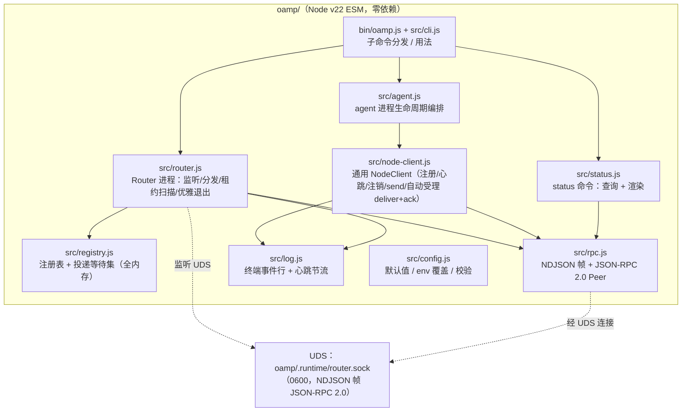
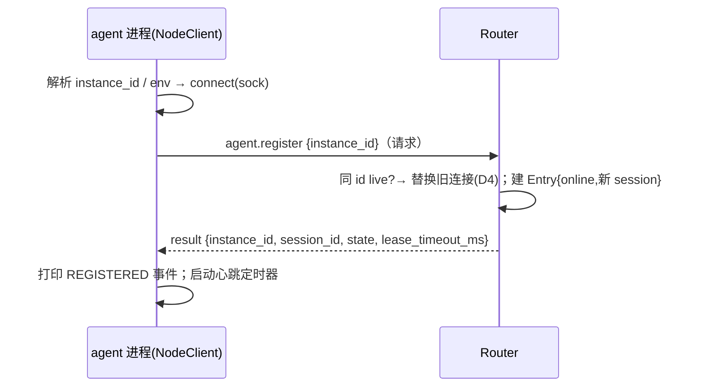
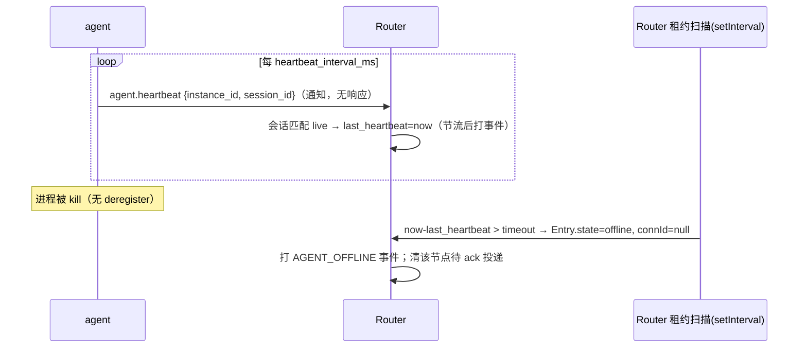
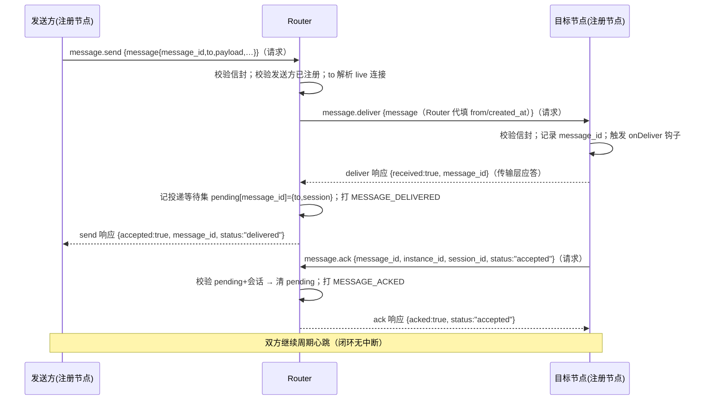
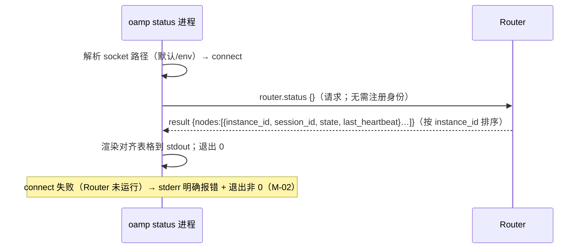

# architecture.md — 0010-oamp-minimal-cli

**版本**: 0.1.0
**迭代**: 0010-oamp-minimal-cli
**创建日期**: 2026-09-09
**阶段**: 技术架构（Phase 3）
**状态**: 阶段 3 产物（待主 agent 核查 + L1/开放项确认；未实施）
**输入**: `prd.md` + `prd/*.md`（F01~F08，AR-01~AR-12）、`demand.md` v0.2.0（W1~W6/N1~N8/E1~E4）、`docs/ds/03/04/06`（跨迭代路线图，术语/语义参考）

---

## 0. 一句话架构

在仓库顶层新建 **`oamp/`**（零依赖 Node.js v22 ESM 工程），交付**一个 CLI 三个前台进程形态**：`oamp router start` = UDS 监听 + 全内存注册表 + 主动租约扫描的 Router 服务；`oamp agent start <instance-id>` = 复用通用 `NodeClient` 的裸协议节点（注册 + 周期心跳 + SIGINT 注销 + 自动受理 deliver/回 ack）；`oamp status` = 无注册只读查询客户端。节点与 Router 之间是 **NDJSON 帧化的 JSON-RPC 2.0 over UDS**，方法面 = `agent.register` / `agent.heartbeat`（通知）/ `agent.deregister` / `message.send` / `message.deliver` / `message.ack` / `router.status`。消息闭环以契约测试（脚本级假节点）为可执行形态，真实 CLI agent 与假节点**共享同一 NodeClient**（通用形态，R2）。

---

## 1. 现有架构基线（本阶段取证）

| 事实 | 证据/来源 |
|---|---|
| `oamp/` 不存在——本仓库首个代码工程（此前为 roles/原则/docs/tools shell 脚本/tests 的文档仓库） | demand §3.3（D-2 已 user_confirmed 顶层新建）；仓库根目录实查 |
| 无任何 Node 工程先例、无既有包管理器/模块约定——本迭代自建最小约定，不引入第三方依赖 | 仓库根目录实查；D-3 零依赖 user_confirmed |
| Node v22.15.0 本机可用；内置 `node:net`（UDS）、`node:crypto.randomUUID`、`node:test`、ESM | demand §3.3（D-3 实测） |
| 协议语义参考（跨迭代路线图，方案建议状态）：docs/ds/03（星型 Router、注册表、租约、错误码表）、docs/ds/04（信封字段表、方法命名空间 `agent.*`/`message.*`、ack/心跳严格分离、UDS 0600）、docs/ds/06（实施第 1 步 = 契约先行：纯内存 Router + 双假节点跑通 register→send→deliver→ack→heartbeat） | docs/ds 03/04/06（**docs/ds 是建议，实现取舍以本迭代 demand/prd 为准**） |
| 心跳参考值 interval 10s / timeout 30s、`message_id` 幂等键、`oamp/1`、UTC ISO-8601 时间戳、点对点仅 `agent_id` 寻址 | docs/ds/04 §2/§4.3/§8 |
| 仓库 shell 脚本先例（tools/check-role-structure.sh + tests/ 壳测试）——仅作卫生检查载体的风格参考，不引入新工具 | 仓库实查 |

**复用结论**：本迭代不"接"任何既有运行时代码（无既有代码可接），而是把 docs/ds 的协议语义裁剪到 demand/prd 锁定范围落地为第一个代码工程。全部模块都是 F01~F08 功能点的直接承担者（§11 奥卡姆检验），无凭空组件。

---

## 2. 范围速查（以 prd.md 为准，勿超范围）

- **含**：CLI 三形态前台长驻；UDS + JSON-RPC 2.0 + node:test；Router 注册表（≥2 节点、同 id 唯一 live、offline 后重注册）；裸协议 agent 节点；lease→offline 单段判定；status 只读查询；终端事件日志 + 心跳节流；最小 send→deliver→ack 闭环（契约测试）；卫生红线。
- **不含**（N1~N8）：重试/ack 超时重投/幂等去重状态机（message_id 字段贯通已锁，行为裁决见 D11）；任何持久化（全内存）；provider/prompt；广播/selector；suspect 两段；token 鉴权；后台 daemonize；跨机。

---

## 3. 总体架构

### 3.1 进程与组件图



进程拓扑：Router = 一个前台进程（服务端）；每个 `oamp agent start` = 一个前台进程（客户端）；`oamp status` = 一个短命客户端进程（查完即退）。Router 与每个节点之间是**一条长连接 UDS**（注册后同连接承载心跳/消息/ack）；无节点间直连、无第二类连接。

### 3.2 模块布局（→ AR-01）

```
oamp/
├── package.json          # name=oamp, type=module, private, bin:{oamp:"./bin/oamp.js"},
│                         # engines.node>=22, scripts.test="node --test test/"，零 dependencies
├── bin/oamp.js           # 可执行入口（ESM shebang），仅转发给 src/cli.js
├── src/
│   ├── cli.js            # argv 解析 + 子命令分发 + 用法/报错文案（M-01）
│   ├── config.js         # 默认值 + env 读取 + 数值校验（socket/心跳/节流参数）
│   ├── rpc.js            # UDS 连接封装 + NDJSON 分帧 + JSON-RPC Peer（请求/通知/响应/错误）
│   ├── registry.js       # 注册表（Map<instance_id, Entry>）+ 投递等待集 + 租约扫描纯逻辑
│   ├── router.js         # Router 进程：net.Server、连接管理、方法分发、事件日志、SIGINT
│   ├── node-client.js    # 通用节点客户端：register/heartbeat/deregister/send/ack + deliver 自动受理钩子
│   ├── agent.js          # oamp agent start：NodeClient 生命周期编排 + SIGINT deregister 时序
│   ├── status.js         # oamp status：连 Router 查 router.status + 表格渲染
│   └── log.js            # 事件行格式化 + 心跳节流（每节点滑窗限 1 条）
├── test/
│   ├── helpers/harness.js      # 子进程拉起/停止 Router 与节点（每测试独立临时 socket + 缩短 env）
│   ├── helpers/fake-node.js    # 脚本级假节点 = NodeClient + onDeliver 断言钩子
│   ├── cli.test.js             # F01
│   ├── router-registry.test.js # F02
│   ├── agent-heartbeat.test.js # F03 + F04
│   ├── status.test.js          # F05
│   ├── event-log.test.js       # F06
│   ├── delivery-contract.test.js # F07
│   └── hygiene.test.js         # F08（.gitignore 规则 + 凭据静态扫描）
├── README.md             # E2 手测步骤 + 参数表 + 卫生红线声明
└── .gitignore            # .runtime/
```

可执行入口形态：`bin/oamp.js` 带 `#!/usr/bin/env node` + `chmod +x`，同时 package.json 声明 `bin`（`npm link` 后可裸用 `oamp`）；README 手测两种运行方式（推荐 `npm link` 后用 `oamp`，或 `node bin/oamp.js`）。node:test 测试一律 `node bin/oamp.js …` 子进程方式拉起，不依赖 PATH。

### 3.3 核心数据流

**① 注册**（agent 启动）



**② 心跳与 offline**（F03/F04）



**③ 消息闭环 send→deliver→ack**（F07，契约测试/未来客户端）



**④ status 查询**（F05）



**⑤ 优雅退出**（SIGINT）
- agent：停心跳定时器 → 发 `agent.deregister`（请求，等响应 ≤1s，best-effort）→ 打 DEREGISTERED → 退出码 0。第二次 SIGINT → 立即退出（130）。
- Router：打 ROUTER_STOPPING → 停租约扫描 → `server.close()`（停接新连接）→ 关闭全部节点连接 → 删除 socket 文件 → 退出码 0。第二次 SIGINT → 立即退出（130）。

---

## 4. 协议契约（JSON-RPC 2.0 over UDS）

> 本节是 docs/ds/04 面向本迭代的**最小可实现子集**。凡与 docs/ds 不一致处均在括号注明差异与理由；docs/ds 为跨迭代建议，以本节为实现契约。

### 4.1 传输与帧（→ AR-12）

- 一条 UDS 长连接 = 一个双向字节流。**帧 = 每行一个 JSON 对象（NDJSON）**，行终止符 `\n`；`JSON.stringify` 不产生裸换行，逐帧完整；接收端按行缓冲解码（处理半包粘包），解析失败回 `-32700 PARSE_ERROR`（无 id 则静默丢弃该帧）。
- 单帧上限 **1 MiB**，超限丢弃并回错误（`data.code=LIMIT_EXCEEDED`）——防内存滥用；本迭代消息体积极小，阈值宽松。
- socket 文件权限 0600（监听后 `chmod`，见 D2）。

### 4.2 通用 JSON-RPC 规则（→ AR-12）

- 请求/响应 `id` **必须为字符串**（客户端自增 `rpc-1`、`rpc-2`…；Router 生成 `dlv-1`…）；`id` 用作请求-响应关联键。
- 无 `id` 的方法调用 = **通知**（无响应）。
- 响应：`{"jsonrpc":"2.0","id":…,"result":…}`；错误：`{"jsonrpc":"2.0","id":…,"error":{"code":<int>,"message":<人类可读>,"data":{…}}}`。
- 标准错误码：`-32700` 解析错误、`-32600` 非法请求、`-32601` 方法不存在、`-32602` 非法参数；**应用错误统一 `code:-32000`，机器码放 `data.code` 字符串**（docs/ds 用字符串错误码 AGENT_NOT_FOUND 等，本实现以 `data.code` 承载，保持 JSON-RPC 标准兼容）。

### 4.3 错误码（机器 token，`data.code`）（→ AR-02/AR-08）

| token | 语义 | 场景 |
|---|---|---|
| `UNREGISTERED` | 连接未注册就调用需身份的方法 | send/ack/deregister 等来自未注册连接 |
| `AGENT_NOT_FOUND` | 目标 instance_id 不在注册表 | send 目标不存在 |
| `AGENT_OFFLINE` | 目标已知但 offline / 连接已断（含租约宽限内） | send 目标离线、投递时写失败 |
| `STALE_SESSION` | 会话不匹配当前 live | 旧 session deregister/ack、register 后旧会话心跳（忽略） |
| `INVALID_MESSAGE` | 信封校验失败 | send/deliver 信封缺字段/类型错 |
| `INVALID_SENDER` | 发送方自报 from 与连接身份不符 | send 携带伪造 from |
| `UNKNOWN_MESSAGE` | ack 引用的 message_id 无对应待 ack 投递 | ack 未知/已 ack 消息 |
| `INVALID_ACK_STATUS` | ack status 非本迭代支持值 | 本轮仅 `accepted` |
| `LIMIT_EXCEEDED` | 帧超限 | 帧层 |
| `ROUTER_ALREADY_RUNNING` | socket 已被活 Router 占用 | router start 启动冲突 |

### 4.4 方法面（→ AR-02/AR-06/AR-08）

| 方法 | 方向 | 类型 | params | result | 错误 |
|---|---|---|---|---|---|
| `agent.register` | 节点→Router | 请求 | `{instance_id}` | `{instance_id, session_id, state:"online", lease_timeout_ms, last_heartbeat}` | `INVALID_PARAMS`（缺/非法 id） |
| `agent.heartbeat` | 节点→Router | **通知** | `{instance_id, session_id}` | —（无响应） | 会话不匹配 live → 静默忽略（旧会话防复活；docs/ds STALE_SESSION 面向请求路径，通知无可回） |
| `agent.deregister` | 节点→Router | 请求（兼容通知） | `{instance_id, session_id}` | `{removed:true}` | `UNREGISTERED`/`AGENT_NOT_FOUND`/`STALE_SESSION` |
| `message.send` | 节点→Router | 请求 | `{message:{信封子集，不含 from/created_at}}` | `{accepted:true, message_id, status:"delivered"}` | `UNREGISTERED`/`INVALID_MESSAGE`/`INVALID_SENDER`/`AGENT_NOT_FOUND`/`AGENT_OFFLINE` |
| `message.deliver` | Router→目标 | 请求 | `{message:{完整信封（含 Router 代填 from/created_at）}}` | `{received:true, message_id}` | `INVALID_MESSAGE` |
| `message.ack` | 目标→Router | 请求 | `{message_id, instance_id, session_id, status:"accepted", received_at}` | `{acked:true, status:"accepted"}` | `UNREGISTERED`/`UNKNOWN_MESSAGE`/`STALE_SESSION`/`INVALID_ACK_STATUS` |
| `router.status` | 任意连接→Router | 请求 | `{}` | `{nodes:[{instance_id, session_id, state, last_heartbeat}]}`（按 instance_id 排序） | — |

要点：
- **`router.status` 不需要注册身份**（`oamp status` 进程不注册；安全面 = UDS 0600 属主访问）。
- **`agent.deregister` 采用请求语义**（docs/ds/04 原列为通知）：节点 SIGINT 时等 Router 响应再退出，注销效果确定可测、Router 侧错误可见；Router 对无 id 的 deregister 通知同样受理（不回响应）——两种形态兼容（差异记录见 D16）。
- **`agent.heartbeat` 保持通知**：周期性高频调用，无响应免堆积；心跳只更新 last_heartbeat，不携带 state/inflight（本轮无 busy 语义，N5 单段判定；docs/ds 扩展字段后移）。
- **`message.send` 是"单次投递的同步代理"，非"受理入队"**：Router 校验目标 live 后同步转发 deliver 并等待目标传输层响应，再回发送方 `status:"delivered"`。docs/ds 的 `queued` 语义依赖 outbox/异步投递/重试（N1/N2 均不做），本迭代队列态无消费者，故省略（差异记录见 D10）。

### 4.5 消息信封子集与校验（→ AR-08）

```json
{
  "protocol": "oamp/1",
  "message_id": "msg-01JXXXX",
  "type": "task.request",
  "from":     {"instance_id": "dev-1", "session_id": "sess-…"},
  "to":       {"instance_id": "dev-2"},
  "payload":  {"content_type": "text/plain", "body": "…"},
  "created_at": "2026-09-09T12:00:00.000Z"
}
```

| 字段 | 必填 | 说明 |
|---|---|---|
| `protocol` | 是 | 恒 `oamp/1`；不符 → `INVALID_MESSAGE` |
| `message_id` | 是 | 幂等键，端到端不变；非空、≤64、可打印 ASCII（无控制字符，防日志注入） |
| `type` | 否 | 预留字符串，Router 不校验枚举（本轮无业务类型；docs/ds type 枚举后移） |
| `from` | Router 代填 | 发送方**不得自报**：send params 中携带且与连接身份不符 → `INVALID_SENDER`；deliver 时由 Router 填 `{instance_id, session_id}`（docs/ds：Router 代填/校验，实例不可自报他人） |
| `to` | 是 | 点对点 `{instance_id}`；仅按 instance_id 寻址（N4 无广播/selector；docs/ds 的 agent_id 字段名本轮统一为 instance_id，与 demand P-05 术语一致） |
| `payload` | 是 | `content_type` ∈ `text/plain`/`text/markdown`/`application/json`（docs/ds MVP 承诺面），`body` 为字符串（application/json 时序列化后存放） |
| `created_at` | Router 代填 | UTC ISO-8601 |

send 校验顺序：连接已注册 → 信封合法（protocol/message_id/to/payload）→ from 无伪造 → 目标存在且 live → 投递。投递时对目标再次做信封校验（目标客户端校验层，防 Router 外伪造来源，未来鉴权扩展点）。

### 4.6 各方法请求-响应与错误映射细则（→ AR-02/AR-08）

- **register**：`instance_id` 校验（非空、≤64、可打印）；已注册连接重复 register = 幂等更新（同会话续期，不重复建条目）；live 冲突处置见 D4。响应含 Router 授予的 `lease_timeout_ms`（Router 侧 env 配置，非节点自报——节点不可提权租约，docs/ds 方向）。
- **heartbeat**：仅当 `entry.session_id === 上报 session` 且 `state=online` 才更新 `last_heartbeat`；offline/未知/旧会话一律忽略（不产生状态变更、不回错——通知无语义通道；事件日志亦不记录被忽略的旧会话心跳）。
- **deregister**：会话匹配 → 删除条目 + 清该节点投递等待集 + 打 AGENT_DEREGISTERED；instance 不存在 → `AGENT_NOT_FOUND`；会话不匹配 → `STALE_SESSION`（docs/ds A-11 方向）。
- **send**：见 §4.4 注；投递期间目标连接断开 → pending 请求被连接关闭拒绝 → 发送方收 `AGENT_OFFLINE`。
- **deliver**：Router→目标请求；目标 NodeClient 自动：校验 → 触发 `onDeliver` 钩子 → 回 `{received:true}` → 随即发 `message.ack(status:"accepted")`（自动受理见 D12）。
- **ack 流向 = Router 记录，不回发送方**：本轮无 `message.status`/事件推送（N1/N2），发送方自 send 响应起即视为完成；ack 的价值 = 契约测试断言闭环 + Router 校验防伪 + 未来重试域的锚点（差异记录见 D10）。
- **router.status**：无参、只读、任何已连接者可用；返回注册表快照的 4 字段投影（不暴露连接句柄等内部字段）。

---

## 5. Router 内部设计

### 5.1 socket 路径、命名与生命周期（→ AR-02/AR-11，D2）

- 默认路径：**`<oamp 包根>/oamp/.runtime/router.sock`**（`oamp/` 下新建 `.runtime/`），由 CLI 自定位推导（相对 `bin/oamp.js` 的包根，**与 cwd 无关**——终端在仓库任意目录执行都命中同一 Router；不同 clone/worktree 各自独立，天然测试隔离）。env `OAMP_SOCKET` 覆盖（并行手工测试/自动化用临时路径）。
- 启动：`mkdirSync(.runtime, {recursive})` → `net.createServer().listen(path)` → listen 回调内 `chmodSync(path, 0o600)`（验收 stat 0600；chmod 失败即退出报错）→ 打 **`ROUTER_READY socket=…`** 就绪行（stdout，自动化等待该行）→ 启动租约扫描定时器。
- 陈旧 socket：bind 遇 `EADDRINUSE` → 先尝试 connect 探测——连得上 = 已有活 Router → 打 `ROUTER_ALREADY_RUNNING` 退出非 0；连不上（ECONNREFUSED/ENOENT）= 陈旧文件 → unlink 后重试 bind 一次。
- 退出清理：SIGINT 时 `server.close()` + 关闭全部节点连接 + **unlink socket 文件**（best-effort，忽略 ENOENT；只由持有者删自己的路径）。
- Router 就绪判定（F02-1）：`ROUTER_READY` 行出现 = 可接受注册。

### 5.2 注册表数据结构与条目 schema（→ AR-02，D3）

全内存、单进程事件循环串行访问（无锁、无并发写）：

```ts
interface RegistryEntry {
  instance_id: string;      // 键
  session_id: string;       // Router 签发，crypto.randomUUID()（D5）
  state: 'online' | 'offline';
  last_heartbeat: number;   // epoch ms（Date.now()）
  connId: number | null;    // 当前 live 连接句柄 id；offline/断连后 null
}
// registry: Map<instance_id, RegistryEntry>
// connIdent: Map<connId, {instance_id, session_id}>   // 连接→身份（方法鉴权、断连清理）
// pendingDeliveries: Map<message_id, {toInstance, toSession}>  // 待 ack 投递（§5.5）
```

节点连接管理：Router 维护 `connIdent` 反查连接身份；连接 `close` 事件 → 若 `entry.connId===该连接` 则 `connId=null`（**条目保持 online 至租约到期**——UDS 断连只说明进程可能死亡，offline 判定仍交给租约超时，符合"kill 后超时才 offline"的 E1 语义），并拒绝该连接上所有 pending 请求（send 发送方收 AGENT_OFFLINE）、清该节点 pendingDeliveries。

### 5.3 同 instance_id 冲突：替换（latest-wins）（→ AR-03，D4）【prd 疑问 3 裁决】

**决策：live 冲突时新注册替换旧会话**（不是拒绝）：

1. `register` 时若存在同 id 且 `state=online` 的**不同 session** 条目 → Router 主动关闭旧连接（旧节点进程随即走 CONNECTION_LOST 退出路径），用新 session 覆盖条目（state=online、last_heartbeat=now、connId=新连接），打 `AGENT_REPLACED instance=… old_session=… new_session=…`，新节点注册成功。
2. offline 条目被同 id 重注册 → 直接覆盖复活为新 online session（E1 末节）。
3. 唯一性不变量（P-07：同一时刻至多一个 live session）由"注册表以 instance_id 为键 + 替换写"结构性保证——任意时刻该键恰一条记录、至多一个非空 connId。

**理由**：①崩溃后快速重启无需等租约到期（默认 30s），开发/手测体验与 E1"重启重注册"语义自洽；②消息寻址按 instance_id 解析唯一 live 连接，替换保证路由目标恒为最新连接，杜绝"旧条目仍 online 但进程已死→send 持续失败直到超时"的窗口；③docs/ds DS-05 方向即"新 session 取代、旧 session 不再收消息"。备选"拒绝（ALREADY_LIVE 报错）"更保守（防误启重复节点踢掉健康节点），但会为崩溃重启引入 30s 等待、且保留可能陈旧的 online 映射，与路由确定性冲突。**可逆性**：替换逻辑集中在一个函数，若主 agent/用户倾向拒绝语义，改判成本单点。归类 L2（行为语义，非技术栈/边界），因 prd 疑问 3 显式留白，已在报告开放项中提请主 agent 转达用户知悉。

### 5.4 deregister / offline 的条目处置（→ AR-03/AR-05，D4/D7）

- **deregister（优雅离开）= 删除条目**（不留 offline 墓碑）：干净离开无需向观测面展示"曾经存在"；同 id 再注册即全新会话。F02-6"不再处于 live 集合"以删除满足。
- **offline（超时判定）= 条目保留、state=offline、connId=null**：E2 手测要求 kill 后 `oamp status` **能看到该节点 offline**——删除则 status 无痕，违背观测语义（F04-3）。offline 条目在**同 id 重注册时被覆盖**，不做额外 GC（本机手工拓扑 instance_id 数量有限，无界增长无现实路径；如未来出现动态海量 id 再加墓碑回收，YAGNI 不预做）。
- 心跳节流期间的误判防护：见 D7 扫描周期 < timeout；正常心跳持续更新 last_heartbeat，永不过期（F04-4）。

### 5.5 投递等待集与 ack 校验（→ AR-08，D10）

- 每次 deliver 发出且目标传输层应答后，Router 记 `pendingDeliveries.set(message_id, {toInstance, toSession})`。
- `message.ack` 到达：查 pending → 无 → `UNKNOWN_MESSAGE`；有但 instance/session 不匹配 → `STALE_SESSION`；匹配 → 校验 `status==="accepted"` → 清 pending，回 `{acked:true}`。
- 清理时机（保证有界）：ack 命中即删；目标 offline 判定/删除时清其全部 pending（不会再 ack）。
- 该集合**仅用于 ack 校验与防伪，不驱动任何重投**（D11：无重试/超时重投定时器）。

### 5.6 租约到期检查：主动定时扫描（→ AR-05，D7）

- **主动 `setInterval` 扫描**（非惰性按查询/事件触发）：每 `sweepPeriod = clamp(timeoutMs/4, 20, 1000)` ms 遍历 online 条目，`now - last_heartbeat > timeoutMs` → `state=offline`、`connId=null`（若连接仍开着则关闭）、打 AGENT_OFFLINE 事件、清其 pending。
- **理由**：F04-2 要求"超时后**自动**判 offline，不需人工干预"——惰性方案在"仅剩一个死节点且无人查询/无其他心跳"时永不触发判定；主动扫描给出判定延迟上界 ≈ timeout + sweepPeriod，测试可精确断言（缩短 timeout 后 ≤ 上界内可见 offline）。扫描开销 O(节点数)，本机 3~10 节点规模无虞（docs/ds 06 U-06）。
- **心跳节流不改变判定正确性**：扫描只看 last_heartbeat 数值，与心跳日志节流（§8.2）完全解耦（F04-4）。

### 5.7 时钟基准（→ F04 待填"心跳时间基准与时钟处理"，D17）

- 单一时钟源 = 进程内 `Date.now()`（epoch ms）；UDS 本机单 Router，无跨机时钟偏差问题（docs/ds U-03：跨机阶段再引入时钟语义）。
- 所有外显时间戳输出为 UTC ISO-8601（docs/ds 约定）。

---

## 6. Agent / 节点客户端设计

### 6.1 NodeClient：通用客户端（→ AR-10，D12）

`src/node-client.js` 是**唯一协议客户端实现**，同时服务三种角色：

| 使用者 | register/heartbeat/deregister | deliver 受理 | send | 断言钩子 |
|---|---|---|---|---|
| `oamp agent start`（真实 CLI agent） | ✅ | ✅ 自动受理（传输应答 + 自动 ack accepted） | 无 CLI 入口（客户端库保留方法） | — |
| 契约测试假节点（fake-node.js） | ✅ | ✅ 同一实现 + `onDeliver` 钩子注入断言/延迟 | ✅（测试驱动发送） | `onDeliver(msg)` / 事件记录 |

**理由**：真实 CLI agent 与假节点共用同一协议实现，杜绝"测试验证的协议 ≠ 产品用的协议"漂移（docs/ds 06 §5 契约先行的本意）；R2"通用节点客户端供未来真实 OMP 实例/主 agent 复用"由同一类承接。NodeClient 暴露方法：`register()` → `{session_id, lease_timeout_ms}`、`startHeartbeat(intervalMs)`、`deregister()`、`send(toInstanceId, payload, opts)`、`ack(...)`；内部事件 `onDeliver`（默认自动受理，见 6.4）、`onClose`。

### 6.2 连接生命周期与心跳机制（→ AR-04/F03，D6/D17）

1. **启动**：connect 默认 socket（env 覆盖）→ 失败（ECONNREFUSED/ENOENT）→ stderr 明确报错（含 socket 路径与"router 未运行？先执行 oamp router start"）→ 退出码 1（与 M-02 同风格）。
2. **注册**：`agent.register` 请求，等响应**上限 2s**（防"连上但不答"的悬挂；超时/失败 → 报错退出 1）。成功 → 打 `REGISTERED` 事件（含授予的 lease_timeout_ms）→ 按节点侧 env 间隔启动 `setInterval` 心跳。
3. **心跳**：周期发 `agent.heartbeat`（通知）。若授予的 `lease_timeout_ms < 2×interval` → 启动时打一条告警事件（建议 timeout ≥ 2×interval，防租约内跳空被误判）。
4. **断线行为（N1/N7 无重试、无守护）**：运行中 socket 报错/关闭 → 打 `CONNECTION_LOST` 事件 → **退出码 1**（快速失败，不静默、不重连、不挂起；Router 死则节点随之退出，由用户/外部进程拉起——与 F03 边界"不做心跳/注册重试机制"一致）。

### 6.3 SIGINT 时序（→ AR-03/F03，D16）

`SIGINT` → 停心跳定时器 → 发 `agent.deregister`（请求语义，等响应 ≤1s）→ 成功打 DEREGISTERED / 失败打事件（Router 已不在则跳过）→ **退出码 0**（用户主动优雅退出恒为 0，F03-3）。第二次 SIGINT → 立即退出（130）。

### 6.4 deliver 受理形态：传输应答 + 自动 ack(accepted)，无业务处理（→ AR-10，D12）【prd 疑问 2 裁决】

**决策：真实 CLI agent 进程受理 deliver——回 JSON-RPC 传输应答 `{received:true}` 并自动发送 `message.ack{status:"accepted"}`**，但不做任何业务处理（不执行、不回 started/completed、不回执业务语义）。

**理由**：①Router 的 send 是同步代理（§4.4），必须等目标传输层应答才能完成——若真实 agent 不响应 deliver，向真实节点 send 将永久悬挂，协议层必须有应答者；②自动 ack(accepted) = 纯传输层收讫证明（docs/ds §6 的 ack 与业务分离方向：accepted ≠ 执行完成），不含业务承诺，与 F03 边界"不含业务受理/回执"不冲突（业务受理 = 理解消息内容并执行）；③使 E1 闭环可用真实节点直接验证（测试仍以假节点为主载体，见 §10）。备选"真实 agent 仅回传输应答、不回 ack"会让 pendingDeliveries 对真实节点永不清理（其 live 期间内存滞留），且闭环一半只能靠假节点证明——不如统一自动 ack 干净。**可逆性**：一个 handler 内改动。归类 L2（客户端能力语义），prd 疑问 2 显式留白，已在报告开放项提请主 agent 转达用户知悉。收到的消息只打 `MSG_RECEIVED message_id=… from=… size=…` 事件（不回显正文，日志卫生），正文不进日志。

---

## 7. CLI 入口与配置面

### 7.1 子命令分发（→ AR-01，D1）

argv 规则（零依赖手写解析，`src/cli.js`）：

| argv | 行为 | 退出码 |
|---|---|---|
| `oamp`（空）/ 未知子命令 / 非法子命令 | stderr 打印可用子命令用法 + 明确报错，不挂起 | 2（M-01） |
| `oamp -h` / `oamp --help` | stdout 打印用法 | 0 |
| `oamp router start` | 启动 Router（前台长驻） | 运行期信号退出 |
| `oamp router <其他>` | stderr 报错 + 用法 | 2 |
| `oamp agent start <instance-id>` | 启动 agent 节点（前台长驻） | 见 §6 |
| `oamp agent start`（缺 instance-id） | stderr 明确报错"missing required argument: instance-id" + 用法，不挂起 | 2（M-01） |
| `oamp agent <其他>` | 同非法子命令 | 2 |
| `oamp status` | 只读查询（短命进程） | 0 / 1（Router 不可达，M-02） |

无 YAML 配置面（P-06）：运行参数全部走 env（见 7.2），CLI 位置参数仅 instance-id（F03-5）。

### 7.2 配置面：env 覆盖 + 默认值（→ AR-04/AR-06，D6/D8）

| env | 作用对象 | 默认 | 说明 |
|---|---|---|---|
| `OAMP_SOCKET` | 全部 | `<oamp>/oamp/.runtime/router.sock` | socket 路径覆盖（测试/并行手测用临时路径） |
| `OAMP_HEARTBEAT_INTERVAL_MS` | agent | 10000 | 心跳周期（docs/ds 参考值）；正整数 |
| `OAMP_HEARTBEAT_TIMEOUT_MS` | Router | 30000 | 租约超时（docs/ds 参考值）；正整数；建议 ≥ 2×interval（README/告警） |
| `OAMP_HB_LOG_WINDOW_MS` | Router | 60000 | 心跳日志节流窗口（§8.2） |

校验：全部正整数；非法值 → 启动即报错退出（快速失败）。**测试时长策略**：自动化把 interval 缩到 30~100ms、timeout 缩到 200~400ms、窗口缩到 ~300ms（harness 统一注入），E1 全链路秒级完成；默认值只用于 README 手测。

### 7.3 status 输出格式（→ AR-06，D8）

`oamp status`：连 Router → `router.status` → stdout 对齐表格（按 instance_id 排序，无第三方依赖的 padEnd 渲染）：

```
instance_id   session_id                             state    last_heartbeat
dev-1         3f2a9c10-7b4e-4d2f-9c8a-1b2c3d4e5f60   online   2026-09-09T12:00:33.123Z
```

- 字段 = P-05 锁定的四字段；`last_heartbeat` UTC ISO-8601；session 全量显示（36 字符 UUID）。
- Router 运行但零节点 → 表头 + 空行，退出 0（合法状态，非错误）。
- Router 不可达（connect 失败）→ stderr：`cannot reach oamp router at <path>（router 未运行？）` + 退出 1（M-02，不静默输出空结果）。
- 只读无副作用：查询路径不触碰任何状态（F05-4）；连续执行结果一致（last_heartbeat 仅随心跳自然推进）。

---

## 8. 终端事件日志（→ AR-07，D9）

### 8.1 事件分类与行格式

事件行 = `[<UTC ISO-8601>] <role> <TOKEN> <key=value …>`（值含空格时引号包裹；id/instance 已被字符集校验排除控制字符，防日志注入）。输出到 **stdout**（错误/用法走 stderr）。事件值不做自由散文，全部 key=value 便于脚本统计（F06-3 观察窗口统计）。

**Router 侧事件**：`ROUTER_READY`、`AGENT_REGISTERED`、`AGENT_REPLACED`、`AGENT_DEREGISTERED`、`AGENT_OFFLINE`、`HEARTBEAT`（节流）、`MESSAGE_DELIVERED`、`MESSAGE_ACKED`、`ROUTER_STOPPING`。
**agent 侧事件**：`AGENT_START`、`REGISTERED`、`MSG_RECEIVED`、`CONNECTION_LOST`、`DEREGISTERED`。
示例：`[2026-09-09T04:12:33.123Z] router AGENT_REGISTERED instance=dev-1 session=3f2a9c10-…`

### 8.2 心跳节流机制与数值

- **只节流 `HEARTBEAT` 事件**（Router 侧唯一高频事件；agent 侧根本不逐跳打心跳日志）；状态变迁/消息事件不节流（F06-4）。
- 机制 = **每节点滑动窗口至多 1 条**：记录该节点上次心跳日志时间 `lastHbLogTs`，`now - lastHbLogTs ≥ W` 才打一条并更新——实现为无定时器的惰性判断（无额外扫表成本）。
- 默认 `W = 60000ms`（env `OAMP_HB_LOG_WINDOW_MS` 覆盖）。默认参数下心跳 10s/次、窗口 60s → 每分钟实际 6 跳至多 1 条日志（抑制 ≥ 5/6，"显著小于实际心跳数"，M-03）。
- 可测判据（M-03 数值化）：观察窗口 T 内单节点 HEARTBEAT 行数 ≤ ⌈T/W⌉+1。

---

## 9. 运行时产物与卫生（→ AR-11，D14）

- 运行时产物**唯一落点 = `oamp/.runtime/`**（socket 文件；Router 退出时删除，残留也入 ignore）。
- `oamp/.gitignore`：`.runtime/`（一行即可；node_modules 不存在——零依赖；测试用 socket 全在系统临时目录，永不落仓库）。
- README 声明两条红线（F08-3）：运行时产物不入 git（`.runtime/` 忽略）；代码/配置零凭据字段。
- **凭据扫描载体 = `test/hygiene.test.js`**（npm test 内静态断言）：①断言 `oamp/.gitignore` 含 `.runtime/`；②对 `bin/`、`src/`、`package.json` 扫描禁止字段名（`token`/`api_key`/`secret`/`password`/`credential`/`authorization`/`private_key` 等，词边界、大小写不敏感），命中即红。**扫描范围排除 `test/`**（防 hygiene 测试自身的模式串自匹配；模式串用字符串拼接规避字面量）。git 侧核查（`git check-ignore` 命中实际产物）由阶段 6 独立验证按 F08-1 执行（需真实 git 状态，不放进 node:test）。

---

## 10. 测试策略（→ AR-10/AR-12，D13）

### 10.1 假节点形态与真实节点关系（→ AR-10，D12）

- **假节点 = `test/helpers/fake-node.js`**：复用 `src/node-client.js`（同一协议实现），叠加脚本能力——`onDeliver(msg)` 断言钩子（可记录/校验/延迟 ack 以证明 deliver 与 ack 分离）、可编程心跳间隔、进程内直接调用（**不是子进程**，测试进程内异步运行，快且确定）。
- **真实 CLI agent = 子进程** `node bin/oamp.js agent start <id>`（带缩短 env），用于 F03（注册/心跳/注销/并发）与 F02（同 id 冲突/offline 重注册的进程级验证）——真实进程级行为与假节点各司其职：**假节点证明协议闭环语义，真实进程证明 CLI/进程生命周期**；两者共享 NodeClient，协议行为必然一致（这是共用一个客户端的结构保证）。
- 契约闭环主载体（P-01）：双假节点跑通 register→send→deliver→ack→heartbeat；另设一条真实 agent 用例证明真实节点同样受理 deliver/回 ack（D12 的验证锚点）。

### 10.2 node:test 用例组织（→ AR-12，D13）

- 运行方式：`oamp/` 下 `npm test` = `node --test test/`（node:test 内建发现 `test/*.test.js`；helpers 非 `*.test.js` 不被当用例）。
- **harness（test/helpers/harness.js）**：`fs.mkdtemp(os.tmpdir())` 生成每用例独立临时 socket + 缩短 env（interval 30~100ms / timeout 200~400ms / 窗口 ~300ms）→ 子进程拉起 Router → 等 `ROUTER_READY` 行 → 返回句柄；teardown 发 SIGINT、限时等退出、超时 kill 兜底。**测试绝不触碰仓库内 `.runtime/`**（并行文件互不冲突；node --test 文件级并行 + 文件内串行）。
- **时序断言统一用轮询工具** `waitFor(pred, deadline)`（如"≤ timeout+sweep 上界内 status 变 offline"），宽裕倍数防 CI 抖动；不写裸 sleep 关键路径。
- 用例文件 ↔ 功能卡映射：

| 文件 | 覆盖 |
|---|---|
| `cli.test.js` | F01：误用/缺参退出码与文案、--help、npm test 载体、零运行时依赖声明核查 |
| `router-registry.test.js` | F02：注册成功字段、2 节点并发、同 id 替换唯一性、offline 后重注册、deregister 删除、socket 0600 stat、Router SIGINT 干净退出 |
| `agent-heartbeat.test.js` | F03（真实 agent 子进程：注册/心跳更新/SIGINT deregister 退出 0/双 agent 并发）+ F04（心跳更新 last_heartbeat、kill→超时→offline、正常心跳不误判） |
| `status.test.js` | F05：四字段输出、不可达失败、只读无副作用、offline 反映 |
| `event-log.test.js` | F06：Router 事件行可见、心跳节流 ≤⌈T/W⌉+1、节流不吞状态事件 |
| `delivery-contract.test.js` | F07：双假节点闭环、message_id 贯通一致、payload 保真、ack 校验（未知 message_id→UNKNOWN_MESSAGE）、目标未注册/离线 send 报错、真实节点自动受理 |
| `hygiene.test.js` | F08：见 §9 |

---

## 11. 关键技术决策总表

| 编号 | 决策（一句话） | AR | 级别 | 理由（追溯/奥卡姆） |
|---|---|---|---|---|
| D1 | `oamp/` ESM 布局 + bin 入口 + 手写 argv 分发（错误用法退出 2/提示明确） | AR-01 | L2/L3 | F01 三个命令形态 + M-01；零依赖下无 argv 库可用，手写最简；文件划分按角色进程边界，供阶段 5 PR 切分 |
| D2 | socket 默认 `<oamp>/.runtime/router.sock`（包根锚定，env 可覆盖），监听后 chmod 0600，EADDRINUSE 探测陈旧清理，退出 unlink | AR-02/AR-11 | L2 | P-07 安全面（0600）+ N8 本机 + E4 卫生；产物唯一落点收敛到 gitignored 目录 |
| D3 | 注册表 = `Map<instance_id, Entry{…4 字段+connId}>` + 连接身份反查 + 全内存单线程 | AR-02 | L2 | F02-2 字段、P-08 全内存；无持久化即无并发写问题，锁与 DB 都不需要 |
| D4 | 同 id live 冲突 = **替换 latest-wins**；deregister = 删条目；offline = 保留墓碑至同 id 重注册覆盖 | AR-03/AR-05 | L2（开放项，提请用户知悉） | 见 §5.3/5.4 理由；路由确定性 + 崩溃重启体验；可逆单点 |
| D5 | session_id = `crypto.randomUUID()` | AR-03 | L3 | 内置、全局唯一、无需自研 |
| D6 | 心跳 interval 10s / timeout 30s（docs/ds 参考值），env 可配（自动化缩短），建议 timeout ≥ 2×interval | AR-04 | L2 | F04 待填"可配性影响测试时长"；默认值对齐路线图，测试用 env 秒级完成 |
| D7 | 租约到期 = 主动定时扫描，period = clamp(timeout/4, 20, 1000)ms；offline = state 字段 + connId=null | AR-05 | L2 | F04-2"自动、免人工"需主动触发；扫描给判定延迟上界供测试断言 |
| D8 | 查询方法 = `router.status`（无参）+ `{nodes:[4 字段]}`；status 定位 = 默认路径 + `OAMP_SOCKET`；输出对齐表格 | AR-06 | L2 | F05/P-05；方法面"Router 查询方法"命名留白由本决策收口 |
| D9 | 事件行 = `[ISO] role TOKEN k=v`；节流 = 每节点滑窗 W=60s 至多 1 条 HEARTBEAT（env 可配） | AR-07 | L2 | F06 + M-03 判据数值化（≤⌈T/W⌉+1）；只节流心跳不吞状态事件 |
| D10 | 信封最小子集（protocol/message_id/from(代填)/to/payload/created_at(代填)）；send = 单次同步代理（无 queued 态）；ack → Router 记录不回发送方；未注册/离线目标 send 即时报错 | AR-08 | L2 | F07 验收 1~4 + N1/N2/N4；queued 态/ack 回推依赖 outbox 与事件推送（均 N 掉），省略即无死代码 |
| D11 | **不纳入**重试/超时重投/幂等去重状态机 | AR-09 | L2 | N1/P-09：字段贯通已锁、行为留白。裁决 = 行为不做：重投的唯一消费者是幂等去重表，而去重表的唯一消费者是重投——无重投则状态机无触发源（死代码）；Router 单次投递 + pending 校验已覆盖本轮可测语义。**与"最小冒烟"的张力说明**：E1 冒烟只承诺 happy path 一次投递成功 + message_id 贯通，去重/重投属故障注入域（docs/ds 06 第 2 步），本轮无故障注入用例，纳入即超出冒烟 |
| D12 | 真实 CLI agent 与假节点共享 NodeClient；真实 agent 自动受理 deliver（传输应答 + ack accepted），无业务处理 | AR-10 | L2（开放项，提请用户知悉） | 见 §6.1/6.4；一份协议实现杜绝漂移；send 同步代理要求目标必应答 |
| D13 | NDJSON 帧 + JSON-RPC 2.0（id 字符串、错误 code/data.code）；测试文件↔卡映射 + harness 临时 socket/缩短 env | AR-12 | L2 | D-3 底座落地；错误码兼容 docs/ds token 语义且不破坏 JSON-RPC 标准 |
| D14 | 产物落点 `.runtime/` + `oamp/.gitignore` 一行；凭据扫描载体 = hygiene.test.js（静态，排除 test/ 自匹配） | AR-11 | L2 | F08；git 侧核查留阶段 6（需真实 git 状态） |
| D15 | README 组织：快速开始（npm link/直接 node）→ 三命令手测步骤（E2）→ 参数表 → 协议速览 → 卫生红线声明 | AR-01 | L3 | F01-8/E2 载体 |
| D16 | 信号与就绪：Router `ROUTER_READY` 行 + SIGINT close/unlink/exit 0；agent SIGINT best-effort deregister(请求语义,≤1s) 后 exit 0；二次 SIGINT 强退 | AR-03/F01/F03 | L2 | F02-8/F03-3 优雅退出确定性；deregister 请求语义与 docs/ds"通知"差异：为可测的注销时序与 Router 侧错误可见性，Router 兼容无 id 通知形态 |
| D17 | 时钟 = 进程内 `Date.now()`；请求超时仅 3 处设上限：agent.register 2s、agent.deregister 1s、status 2s；**deliver 不设超时**（目标恒为自有 NodeClient，必应答） | AR-04/F04 | L2/L3 | 本机无跨机时钟问题；防启动/查询悬挂而不发明重试域定时器 |

### 奥卡姆剃刀检验（组件 ↔ 必需功能）

| 新组件/文件 | 不引入它哪个功能无法实现 |
|---|---|
| `rpc.js` | D-3 底座（UDS + JSON-RPC）本身 |
| `registry.js` | F02 注册表/唯一性/offline 判定的数据载体；无它 Router 无状态可言 |
| `router.js` | F02 Router 服务进程（监听/分发/扫描） |
| `node-client.js` | F03 注册+心跳+注销与 F07 deliver/ack——无它 CLI agent 与假节点要写两套协议实现（漂移源） |
| `agent.js`/`cli.js`/`status.js` | F01/F05 命令形态逐一对应 |
| `log.js` | F06 事件行 + 节流（M-03 判据） |
| `config.js` | AR-04 可配性（F04 测试时长、手测默认值） |
| `harness.js`/`fake-node.js` | F07/P-01 契约测试假节点与隔离执行 |
| 无持久化/无队列/无去重表/无重试定时器/无事件推送 | 每个都对应 N1~N8 明确不做 |

**结论：零凭空组件。** 未引入任何第三方依赖（Node 内置即足）；未引入任何 docs/ds 全量 MVP 组件（广播/持久化/鉴权/suspect/Launcher）。

---

## 12. AR-01~AR-12 补全对照表（一一对应可追溯）

| 编号 | 来源卡 | 待填内容 | 方案位置 | 回填卡 |
|---|---|---|---|---|
| AR-01 | F01 | 布局/入口/分发/信号/README | §3.2 + §7.1 + D16 + D15 | F01 ✅ |
| AR-02 | F02 | socket/注册表 schema/register·deregister RPC 细节 | §5.1 + §5.2 + §4.4/4.6（D2/D3/D16） | F02 ✅ |
| AR-03 | F02 | 同 id 冲突规则/session 生成/deregister 处置/就绪与退出清理 | §5.3 + §5.4 + D5 + D16 | F02 ✅ |
| AR-04 | F03/F04 | interval/timeout 数值与可配 | §7.2 + D6 | F03/F04 ✅ |
| AR-05 | F04 | 到期检查机制/offline 表示 | §5.6 + §5.4 + D7 | F04 ✅ |
| AR-06 | F05 | 查询方法名与 schema/socket 定位/输出格式 | §4.4 + §7.2/7.3 + D8 | F05 ✅ |
| AR-07 | F06 | 事件分类与行格式/节流数值机制/输出实现 | §8.1 + §8.2 + D9 | F06 ✅ |
| AR-08 | F07 | 信封子集与校验/send·deliver·ack 映射与 ack 流向/寻址与未注册离线 send | §4.4 + §4.5 + §4.6 + §5.5 + D10 | F07 ✅ |
| AR-09 | F07 | 是否纳入重试/超时重投/幂等去重状态机 | D11（不纳入 + 张力说明） | F07 ✅ |
| AR-10 | F07/F03 | 假节点形态与用例组织/真实 CLI agent 受理关系 | §6.1 + §6.4 + §10.1 + D12 | F07/F03 ✅ |
| AR-11 | F08 | 产物落点与 gitignore/凭据扫描载体 | §9 + D2/D14 | F08 ✅ |
| AR-12 | 全局 | JSON-RPC over UDS 实现细节/node:test 用例组织 | §4.1~4.3 + §10.2 + D13 | 全局 ✅ |

---

## 13. L1 决策清单与开放项

**L1 决策：无新增。** 技术栈（Node v22 零依赖 UDS+JSON-RPC 2.0+node:test）、代码位置（`oamp/` 顶层）、系统边界（W1~W6/N1~N8、R1/R2、消息方法面、heartbeat 参考值、同 id 唯一性不变量）均已在阶段 1（P-01~P-09）与阶段 2（M-01~M-03）由用户逐条确认；本阶段未引入任何新技术栈、未改变任何既有核心模块职责（仓库此前无运行时代码）、未扩展系统边界。docs/ds 为跨迭代建议，本阶段仅裁剪落地，其全量 MVP 组件（广播/持久化/鉴权/suspect/Launcher/重试域）均未引入。

**开放项（非阻塞，建议主 agent 转达用户知悉/确认；均单点可逆）**：

1. **D4 同 id live 冲突 = 替换（latest-wins）**（prd 疑问 3 的裁决）：崩溃快速重启免等租约、路由目标恒最新；若用户预期"拒绝重复注册"（把唯一性当防误启/防冒充控制），改判为拒绝语义仅需替换一个分支。**倾向保留替换**。
2. **D12 真实 CLI agent 受理 deliver 并自动回 ack(accepted)**（prd 疑问 2 的裁决）：传输层收讫、无业务处理；不这样做则向真实节点 send 会悬挂、闭环只能由假节点证明。**倾向保留**。
3. D10/D16 与 docs/ds 的两处子集差异（send 无 queued 态 = 同步单次代理；agent.deregister 用请求语义兼容通知）——属本迭代内 JSON-RPC 映射细节（AR-02/AR-08/AR-12 范畴），已记录差异理由，不单独提请确认。

---

## 14. 疑问与越界

1. **prd.md 疑问 2/3 的裁决**见 §13 开放项 1/2（同 id 冲突 = 替换；真实 agent 自动受理 deliver/ack）。两处均归类 L2 并给出理由与可逆改判点——因 prd 曾显式留白，不擅自视为终局，提请主 agent 决定是否转用户复核。
2. **与 docs/ds 的术语/语义差异（记录在案，docs/ds 为建议、以本迭代实现为准）**：信封 `from`/`to` 用 `instance_id`（docs/ds 用 `agent_id`，demand P-05 统一为 instance_id）；send 同步单次代理（无 queued/异步投递）；deregister 请求语义；心跳通知不携带 state/inflight（无 busy 语义）；错误码以 `data.code` 字符串承载。均为"裁剪到本轮范围"的结果，未来迭代扩展时按 docs/ds 对齐。
3. **已知限制（不阻塞，文档化）**：send 同步等待目标传输应答期间，若目标进程存活但事件循环卡死（非本迭代客户端可实现的状态），send 会悬挂——本迭代所有节点均为自有 NodeClient（必应答），该场景无现实路径；重试域（D11 裁决不做）是未来迭代解决它的正式机制。offline 墓碑不做 GC（§5.4 理由）。
4. 未发现功能规格存在技术约束无法满足的点；全部 8 卡均有技术路径；未修改 demand.md 与任何 prd 产品维度。
