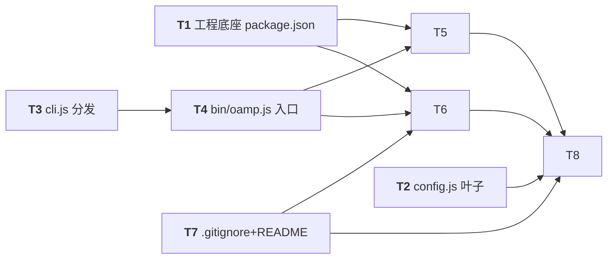

# PR-001 任务图：project-skeleton-cli-hygiene

**来源输入**：`prs/pr-001-project-skeleton-cli-hygiene.md`（PR 定义：文件范围/验收标准/实现约束）、`architecture.md` §3.2（文件树）/§7.1（分发）/§7.2（配置面）/§9（卫生）/D1/D14/D15/D16、`prd/F01-cli-entry-subcommand-dispatch.md`、`prd/F08-hygiene-runtime-artifacts-credentials.md`
**生成角色**：planner（阶段 5）
**日期**：2026-09-09
**修订记录**：2026-09-09 主 agent 裁决：① MI-1~MI-4 全部确认采纳为生效约定；② dev 上报 Q1（`npm test` 载体执行红——`node --test test/` 目录形态在 Node v22.15.0 按 glob 字面执行失败）裁决 scripts.test 采用 glob 形态 `node --test test/*.test.js`（实测 11/11 全绿），T1 AC3 / T5 AC4 与实现文件同步更新。

## 范围声明

- 任务图覆盖 PR-001 文件范围 **8 个文件**：`oamp/package.json`、`oamp/bin/oamp.js`、`oamp/src/cli.js`、`oamp/src/config.js`、`oamp/.gitignore`、`oamp/README.md`、`oamp/test/cli.test.js`、`oamp/test/hygiene.test.js`。
- **不实现** pr-002/003 模块（`src/router.js`/`src/agent.js`/`src/status.js` 等本 PR 不创建；cli.js 对其只做动态 import，缺失路径是本 PR 可独立验收的显式行为）。
- 本 PR 不做消息/心跳功能（pr-002 范畴）。
- `src/config.js` 本 PR 内无进程消费方（architecture §3.1 明示"cli.js 仅做子命令分发、不读配置"，config 的消费方是 router/agent/status 进程入口 = 后续 PR）；本 PR 交付叶子模块本体，验收走直接 import 的运行核查。

## 依赖图

- **关键路径（最长依赖链）**：`T3 → T4 → T5 → T8`（3 条边）；关键任务 = T3（cli.js 分发）、T4（bin 入口）、T5（cli.test.js）、T8（PR 集成验收）。
- **并行支线**：T1 / T2 / T7 与 T3 无前置依赖，可先行并行。
- **无环确认**：所有依赖边均从被依赖任务指向依赖任务；T8 为汇点，无循环依赖。
- 注记：T2（config.js）没有 PR 内下游消费者（消费在 pr-002/003），作为终端叶子任务独立验收，不构成断链或环。

## 任务清单

### T1 — 工程底座：oamp/ 目录 + package.json
**描述**：创建 `oamp/` 零依赖 ESM 工程与 `package.json` 运行底座（F01-2 载体），目录内无任何 YAML 配置面（F01-6/P-06）。
**涉及文件**：`oamp/package.json`（新建）
**优先级**：P1
**前置依赖**：无
**验收标准**（可测试 / 可追溯）：
1. `oamp/package.json` 存在且 JSON 可解析，name=`oamp`、type=`module`、private=true（§3.2 文件树注释 / F01-2）。（命令核查）
2. `bin` 声明 `{"oamp": "./bin/oamp.js"}`（§3.2 / F01-2）。（命令核查）
3. `engines.node = ">=22"`、`scripts.test = "node --test test/*.test.js"`（§3.2 / F01-2 / §10.2；2026-09-09 主 agent 修订——原 `test/` 目录形态在 Node v22.15 失败，见修订记录）。（命令核查）
4. `dependencies` 为空对象或整体缺省（零第三方运行时依赖；F01-2 / §3.2"零 dependencies"）。（命令核查；T5/T6 会以 node:test 复查）
5. `oamp/` 内不存在任何 `.yaml`/`.yml` 文件参与运行（F01-6 / P-06）。（静态 glob 核查）

### T2 — src/config.js：配置面叶子模块
**描述**：实现 `src/config.js`——默认值 + env 读取 + 数值校验，叶子模块不依赖 src 内任何模块（architecture §7.2 配置面；本 PR 交付模块本体，进程消费随 pr-002/003）。
**涉及文件**：`oamp/src/config.js`（新建）
**优先级**：P1
**前置依赖**：无
**验收标准**（可测试 / 可追溯）：
1. 文件存在，ESM 导出；**不 import 任何 `src/` 内模块**（仅 `node:` 内置），静态核查通过（§3.2 "config.js 为叶子模块…所有下游进程模块的叶子依赖"）。（静态 grep 核查）
2. env 全缺省时：`OAMP_SOCKET` 默认 = `<oamp 包根>/.runtime/router.sock`（按模块自身 `import.meta.url` 推导包根、与 cwd 无关，§5.1/§7.2 表）；`OAMP_HEARTBEAT_INTERVAL_MS`=10000、`OAMP_HEARTBEAT_TIMEOUT_MS`=30000、`OAMP_HB_LOG_WINDOW_MS`=60000（§7.2 表）。（node 直接 import 运行核查）
3. env 覆盖生效：`OAMP_SOCKET` 覆盖 socket 路径；三个数值 env 各自覆盖对应默认值（§7.2 表"env 覆盖 + 默认值"）。（node 运行核查）
4. 非法数值（非整数 / ≤0 / 非数字）→ 明确报错，错误信息含对应 env 名与"正整数"要求；快速失败（§7.2 "校验：全部正整数；非法值 → 启动即报错退出"）。（node 运行核查）
5. 配置对象字段与 env 一一对应（`socketPath` / `heartbeatIntervalMs` / `heartbeatTimeoutMs` / `hbLogWindowMs`），并提供按 env 读取校验的入口 `loadConfig(env)` 与默认解析实例。`[model_inferred→已采纳]`：字段命名与导出形态为跨 PR 接口约定，pr-002 消费时须对齐复核。
6. `[model_inferred→已采纳]` 验收载体说明：PR 文件范围内 F01/F08 两张测试卡均不覆盖 config.js 行为（无 config 专属 node:test 用例），故本任务验收以"node -e 直接 import 的运行核查 + 静态叶子检查"完成，不新增 PR 范围外测试文件。

### T3 — src/cli.js：argv 子命令分发与用法/报错
**描述**：零依赖手写 argv 分发——空参/未知/非法子命令与 `agent start` 缺参 → stderr 报错+用法、退出 2、不挂起；`-h/--help` → stdout 用法、退出 0；`router start`/`agent start <instance-id>`/`status` 合法形态对目标模块做**动态 import 延迟加载**（模块缺失时清晰报错、退出非 0、不挂起不静默）。cli.js 不读配置。
**涉及文件**：`oamp/src/cli.js`（新建）
**优先级**：P1
**前置依赖**：无（验收可 `node src/cli.js` 直连运行，不依赖 bin）
**验收标准**（可测试 / 可追溯）：
1. 空 argv → stderr 含明确报错 + 可用子命令用法；退出码 2；即时退出不挂起（§7.1 表首行 / F01-4 / M-01）。（运行核查）
2. 未知子命令（如 `bogus`）→ 同上（stderr 报错+用法、退出 2、不挂起）；非法形态（`router` 缺子动词、`agent` 缺子动词）→ 同上（§7.1 表 `router <其他>` / `agent <其他>` 行；F01-4）。（运行核查）
3. `agent start`（缺 instance-id）→ stderr 明确报错含 **"missing required argument: instance-id"**（§7.1 原文）+ 用法；退出 2；不挂起（F01-5 / M-01，user_confirmed 2026-09-09）。（运行核查）
4. `-h` / `--help` → stdout 打印用法；退出 0（§7.1 表）。（运行核查）
5. 合法形态 `router start` / `agent start <id>` / `status` → 分别动态 `import('./router.js')`/`('./agent.js')`/`('./status.js')`（相对 cli.js 所在 src/ 解析，与 cwd 无关）；本 PR 模块文件必然缺失 → stderr 清晰"模块尚未实现"类报错、退出非 0、不挂起不静默（PR 文件"实现约束"段 + §3.1 CLI→R/A/ST 依赖边）。（运行核查）
6. 静态核查：cli.js **不得**静态 import `./router.js`/`./agent.js`/`./status.js`（PR 文件实现约束：模块文件不存在时 cli.js 仍可加载执行错误路径），亦不 import `./config.js`（§3.1"cli.js 仅做子命令分发、不读配置"）。（静态 grep 核查）
7. `[model_inferred→已采纳]`：模块缺失路径退出码取 1（M-01 仅约束"非零"，具体码值本 PR 定为 1 并在 T8 与 dev 验证中锁定）。
8. 开放注记 O-1/O-2（见文末开放项）：模块加载成功后的入口调用约定、多余位置参数语义——本 PR 均不可达/不裁决，不做架构补充。

### T4 — bin/oamp.js：可执行入口
**描述**：ESM shebang 可执行入口，仅转发给 `src/cli.js`（§3.2 可执行入口形态）。
**涉及文件**：`oamp/bin/oamp.js`（新建）
**优先级**：P1
**前置依赖**：T3
**验收标准**（可测试 / 可追溯）：
1. 文件存在；首行 `#!/usr/bin/env node`；文件可执行（`chmod +x`，git 追踪 100755）（§3.2"ESM shebang + chmod +x"）。（文件核查）
2. 内容仅"shebang + 转发调用 `src/cli.js`"，不含分发逻辑（§3.2"仅转发"）。（文件核查）
3. 冒烟：`node bin/oamp.js --help` → stdout 用法、退出 0；直执 `./bin/oamp.js --help`（经 shebang）→ 同样退出 0（§3.2 可执行入口 / node:test 一律子进程拉起、不依赖 PATH 的前提）。（运行核查）

### T5 — test/cli.test.js：F01 可测子集自动化
**描述**：以 `node:test` + 子进程 `node bin/oamp.js` 方式（不依赖 PATH）固化 F01 可测子集与 package.json 载体声明（§10.2 cli.test 范围）。
**涉及文件**：`oamp/test/cli.test.js`（新建）
**优先级**：P1
**前置依赖**：T1、T4（T4⊃T3）
**验收标准**（可测试 / 可追溯）：
1. 用例覆盖：空参数、未知子命令 → 退出码 2 + stderr 含报错与可用命令用法；`agent start` 缺参 → 退出码 2 + stderr 含 instance-id 报错与用法（F01-4/5；§7.1；M-01）。（node:test）
2. `-h`/`--help` → 退出码 0 + stdout 用法（§7.1 表）。（node:test）
3. 每条用例以 `spawnSync(process.execPath, [bin, …])` 带超时运行，"不挂起"由超时判失败保证（不挂起是 M-01/F01-4/5 的显式验收面）。（node:test）
4. package.json 载体用例：`type=module`、`bin.oamp` 路径、`engines.node>=22`、`scripts.test="node --test test/*.test.js"`、`dependencies` 为空（npm test 载体 + 零运行时依赖声明核查，§10.2 cli.test 范围 / F01-1/2；2026-09-09 主 agent 修订，见修订记录）。（node:test）
5. `[model_inferred→已采纳]`：补 1 条"非法子命令形态"用例（如 `router` 缺子动词 → 2）——brief 枚举未明列但 PR 验收文本含"未知/非法子命令"，属该面直接覆盖。
6. 单独运行 `node --test test/cli.test.js` 全绿（不依赖 hygiene.test 文件存在）。（运行核查）

### T6 — test/hygiene.test.js：F08 静态卫生断言
**描述**：静态断言载体——`.gitignore` 规则 + bin/src/package.json 凭据字段名扫描（排除 test/）+ dependencies 为空（§9 / D14 / F08）。
**涉及文件**：`oamp/test/hygiene.test.js`（新建）
**优先级**：P1
**前置依赖**：T1、T4（⊃T3）、T7（.gitignore 内容先就位，扫描内容含 bin/src）
**验收标准**（可测试 / 可追溯）：
1. 断言 `oamp/.gitignore` 含 `.runtime/` 忽略规则（§9 / F08-1 静态面）。（node:test）
2. 对 `bin/`、`src/` 下全部 `.js` 与 `package.json` 扫描禁止凭据字段名（`token`/`api_key`/`secret`/`password`/`credential`/`authorization`/`private_key`，词边界、大小写不敏感），零命中即通过；扫描范围**排除 `test/`**；模式串用字符串拼接规避字面量自匹配（§9 / D14 / F08-2）。（node:test）
3. 断言 `package.json` `dependencies` 为空（F08 载体声明 + PR 文件范围）。（node:test）
4. 单独运行 `node --test test/hygiene.test.js` 全绿（不依赖 cli.test 文件存在）。（运行核查）

### T7 — .gitignore + README：卫生与交付文档
**描述**：交付 `oamp/.gitignore`（`.runtime/` 一行，§9/D14）与 `oamp/README.md`（D15 组织 + F08-3 两条红线声明 + E2 手测步骤骨架并注记完整能力随后续 PR 落地）。
**涉及文件**：`oamp/.gitignore`、`oamp/README.md`（新建）
**优先级**：P1
**前置依赖**：无
**验收标准**（可测试 / 可追溯）：
1. `oamp/.gitignore` 内容含 `.runtime/` 规则（§9"内容 = .runtime/"；产物唯一落点 `oamp/.runtime/`，D2/D14）。（文件核查）
2. README 存在，章节按 D15 顺序组织：快速开始 → E2 手测步骤（三终端）→ 参数表（env）→ 协议速览 → 卫生红线声明（D15 / F01-8 载体）。（文件核查）
3. 快速开始同时给出 `npm link`（裸用 `oamp`）与 `node bin/oamp.js` 两种方式（§3.2 可执行入口形态）。（文件核查）
4. E2 手测步骤为三终端骨架（Router 终端 / agent 终端 / `oamp status`，含 kill 后等租约超时见 offline），并**注明 Router/agent 完整能力随后续 PR 落地**（F01-8 / PR 文件注记——本 PR 阶段执行合法形态得到"模块尚未实现"是预期行为，不可写成本 PR 可完整复现 E2）。（文件核查）
5. 参数表含 `OAMP_SOCKET` / `OAMP_HEARTBEAT_INTERVAL_MS` / `OAMP_HEARTBEAT_TIMEOUT_MS` / `OAMP_HB_LOG_WINDOW_MS` 四 env 及其默认值（socket 默认路径 + 10000/30000/60000，§7.2 表）。（文件核查）
6. 声明两条卫生红线：运行时产物不入 git（`.runtime/` 忽略）；代码/配置零凭据字段（F08-3 / §9）。（文件核查）

### T8 — PR-001 集成验收
**描述**：PR 级收口——`oamp/` 下两张测试卡同跑全绿 + 逐条对照 PR 文件 4 条验收标准取证（行为抽查 / 文件命令核查 / 文档核查），产出通过记录供独立 verifier 复核与 merge 决策。
**涉及文件**：无新增（复用 T1~T7 产物）
**优先级**：P0
**前置依赖**：T2、T5、T6、T7（经 T5/T6 传递覆盖 T1/T3/T4）
**验收标准**（可测试 / 可追溯，逐条对应 PR 文件"验收标准"4 条）：
1. `oamp/` 下 `node --test test/cli.test.js test/hygiene.test.js` **一次同跑全绿**（无任何本 PR 之外文件；PR 验收第 1 条）。（运行核查）
2. 行为抽查逐条执行并记录：空参/未知/非法子命令 → stderr 用法+报错、退出 2、不挂起；`agent start` 缺参 → stderr 含 instance-id、退出 2、不挂起；`-h`/`--help` → stdout 用法、退出 0（PR 验收第 2 条，§7.1 argv 表 / M-01）；另抽查合法形态模块缺失路径（router/agent/status → stderr"尚未实现"+非零+不挂起，PR 实现约束）。（运行核查）
3. 文件/命令核查：`oamp/` 内无 YAML 配置参与运行（F01-6）；package.json 声明 type=module、bin、engines.node>=22、scripts.test、空 dependencies（F01-2）（PR 验收第 3 条）。（命令/文件核查）
4. 文档核查：`oamp/.gitignore` 含 `.runtime/`；README 按 D15 组织且含 E2 注记与两条红线声明（PR 验收第 4 条 / D15 / F08-3）。（文件核查）
5. 注：验收取证记录在 dev 报告呈现；git 侧 check-ignore（F08-1 后半）按 architecture §9 留阶段 6 独立验证，不放入本任务。

## model_inferred 汇总（主 agent 2026-09-09 确认采纳，已生效）

| # | 任务 | 推断内容 | 追溯基础 |
|---|---|---|---|
| MI-1 | T2 | config.js 无 PR 内 node:test 用例，验收载体 = node -e 直接 import 运行核查 + 静态叶子检查 | §7.2 表（标准内容本身可追溯；载体为推断，因 F01/F08 卡均不覆盖 config 行为） |
| MI-2 | T2 | 配置对象字段命名与导出形态（`socketPath`/`heartbeatIntervalMs`/`heartbeatTimeoutMs`/`hbLogWindowMs` + `loadConfig(env)` 纯函数 + 默认实例）作为跨 PR 接口约定 | §7.2 表 env 名 → camelCase 映射（字段名 architecture 未定稿） |
| MI-3 | T3 | `router`/`agent` 缺子动词视为非法形态退出 2；模块缺失退出码取 1（非零即可） | §7.1 表 `router <其他>`/`agent <其他>` 行；M-01"非零" |
| MI-4 | T5 | cli.test.js 增补"非法子命令形态"用例（如 `router` 缺子动词） | PR 验收文本"未知/非法子命令"（brief 枚举未明列） |

## 开放项（不阻断本 PR，报告主 agent）

- **已裁决（Q1）**：`npm test` 载体脚本值——主 agent 2026-09-09 实测确认 `node --test test/`（目录形态）在 Node v22.15.0 失败、`node --test test/*.test.js`（glob 形态）全绿，裁决 scripts.test 取后者（见修订记录；实现已同步）。
- **O-1（跨 PR 接口）**：cli.js 成功动态 import 目标模块后的**入口调用约定**（参数形态、导出签名）在 architecture §7.1 未定稿。本 PR 采最小可逆约定：调用模块 `default` 导出函数并传入分发后剩余位置参数；该分支在本 PR 内不可达（模块必缺失），pr-002/003 落地 `src/router.js`/`src/agent.js`/`src/status.js` 时须对齐或修正此约定。
- **O-2（未定义语义）**：合法形态后的**多余位置参数**（如 `router start extra` / `status extra`）语义在 §7.1 表未定义。本 PR 不校验、透传给目标模块（不新增裁决）；pr-002/003 各自定义命令自身参数处理。
- **O-3（阶段 6 边界）**：F08-1 的 git 侧 `git check-ignore` 命中实际产物核查留阶段 6 独立验证（architecture §9 明示不进 node:test）。
