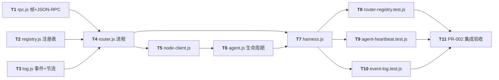

# PR-002 任务图：protocol-runtime-registry-heartbeat

**来源输入**：`prs/pr-002-protocol-runtime-registry-heartbeat.md`（PR 定义：文件范围 10 文件/验收 4 条/实现约束/F07 共栖注记）、`architecture.md` §3.2/§4/§5/§6/§8/§10.2（协议契约、Router、NodeClient、事件日志、测试组织）与 D2~D7/D9/D12/D13/D16/D17、`prd/F02-router-start-registry.md`、`prd/F03-agent-daemon-node-client.md`、`prd/F04-heartbeat-lease-offline.md`、`prd/F06-terminal-event-log.md`
**生成角色**：planner（阶段 5）
**日期**：2026-09-09
**修订记录**：2026-09-09 主 agent 裁决 Q-1 采纳方案 A：pr-001 `oamp/src/cli.js` agent 分支 `argv.slice(3)` → `argv.slice(2)`（跨 PR 修正，O-1 收敛——instance-id 归 agent 模块 `restArgs[0]`，透传约定与 router 分支一致；cli.test.js 8/8 不受影响）。本任务图 T6/验收载体已按此裁决表述。

## 范围声明

- 任务图覆盖 PR-002 文件范围 **10 个文件**：`oamp/src/rpc.js`、`oamp/src/registry.js`、`oamp/src/log.js`、`oamp/src/router.js`、`oamp/src/node-client.js`、`oamp/src/agent.js`、`oamp/test/helpers/harness.js`、`oamp/test/router-registry.test.js`、`oamp/test/agent-heartbeat.test.js`、`oamp/test/event-log.test.js`。
- **不创建** pr-003/004 文件（`src/status.js`、`test/helpers/fake-node.js`、`status.test.js`、`delivery-contract.test.js` 不在本 PR）。`router.status` 方法本体、消息域共栖实现（send/deliver/ack 分发、pendingDeliveries、onDeliver 自动受理、MESSAGE_* 事件）随本 PR 落盘（src 首次创建即完整约束），但其**可执行验收载体 = pr-004 契约测试**，本 PR 测试不覆盖消息域行为。
- **不改动** pr-001 已合并文件，唯一例外 = Q-1 裁决的 cli.js 单行修正（agent 分支 slice 索引），已同步 pr-001 侧测试复核（cli.test.js 不测透传语义，8/8 绿）。
- 进程级测试一律 `node bin/oamp.js …` 子进程方式（§10.2），不依赖 PATH；测试 socket 一律系统临时目录（`fs.mkdtemp(os.tmpdir())`），绝不触碰仓库内 `.runtime/`。
- 零第三方依赖；node:test 载体 = `node --test test/*.test.js`（npm test，pr-001 修订后的 glob 形态）。

## 依赖图

- **关键路径（最长依赖链）**：`T1 → T4 → T5 → T6 → T7 → T9 → T11`（6 条边）；关键任务 = T4（router.js，hub）、T6（agent.js，生命周期时序）、T7（harness，全部测试的地基）、T11（集成验收）。
- **并行支线**：T1/T2/T3 三者无相互依赖可先行并行；T8/T9/T10 共享 T7 后并行。
- **无环确认**：所有依赖边均从被依赖任务指向依赖任务；T11 为汇点。T1~T3 各自独立验收，不构成断链。

## 任务清单

### T1 — src/rpc.js：NDJSON 帧 + JSON-RPC 2.0 传输层
**描述**：UDS 连接上的协议基础（architecture §4.1~4.3 / D13）：NDJSON 按行分帧（处理半包/粘包、1 MiB 帧上限）、JSON-RPC 2.0 请求/通知/响应/错误序列化与关联（id 恒字符串）、§4.3 错误码机器表导出（`data.code` 承载，应用错误统一 JSON-RPC `code:-32000`）、解析失败 `-32700 PARSE_ERROR` 处置。Router 服务端与 NodeClient/status 客户端共用同一实现。
**涉及文件**：`oamp/src/rpc.js`（新建）
**优先级**：P1
**前置依赖**：无（仅 `node:` 内置）
**验收标准**（可测试 / 可追溯）：
1. 导出 §4.3 全部机器错误码常量（`UNREGISTERED`/`AGENT_NOT_FOUND`/`AGENT_OFFLINE`/`STALE_SESSION`/`INVALID_MESSAGE`/`INVALID_SENDER`/`UNKNOWN_MESSAGE`/`INVALID_ACK_STATUS`/`LIMIT_EXCEEDED`/`ROUTER_ALREADY_RUNNING`），且应用错误 JSON 序列化后满足 `error.code=-32000` + `error.data.code=<机器码>`（§4.2/§4.3）。（node 直接 import 运行核查）
2. 客户端发送请求：id 为自增字符串（`rpc-N` 形态）；服务端响应按 id 关联回同一请求方（§4.2 "id 用作请求-响应关联键"）。（node 运行核查 + T8/T9 间接触发）
3. 无 id 调用按通知处理（不产生响应，§4.2）。（node 运行核查）
4. 帧层：跨 socket 半包/粘包（一次 write 分多次到达、多帧一次到达）仍逐帧完整解码；单帧超过 1 MiB → 丢弃并回错误 `data.code=LIMIT_EXCEEDED`（§4.1）。（node 运行核查，socket 对写）
5. 非 JSON 行 → 回 `-32700 PARSE_ERROR`（有 id 时）；无 id 的坏帧静默丢弃（§4.1）。（node 运行核查）
6. 静态：零第三方依赖、仅 `node:` 内置 import；导出形态供 router/node-client/status 三种消费方使用（§3.1 RP 引用边）。（静态 grep 核查）
7. `[model_inferred→待主 agent 确认]`：rpc.js 内部 API 具体形态（类/函数名、构造参数、事件回调面）architecture 未定稿——验收以"行为语义 + 导出常量"为准，实现选最小可逆接口，pr-003 status 消费时若需对齐再收敛。
8. `[model_inferred→待主 agent 确认]`：错误响应回传的 `id` 语义——坏帧无法解析出 id 时按 §4.1 静默丢弃（不回 -32700），仅"可解析到 id"的非法请求回标准错误；`-32600/-32601/-32602` 标准码用于非法请求/未知方法/非法参数（§4.2 列举即实现面，无单独测试载体）。

### T2 — src/registry.js：注册表 + 投递等待集 + 租约纯逻辑
**描述**：全内存注册表（architecture §5.2~5.6 / D3/D4/D7）：`Map<instance_id, RegistryEntry>`、`connIdent` 连接身份反查、`pendingDeliveries` 投递等待集（§5.5 共栖）；同 id live 冲突替换（latest-wins，D4）、deregister 删条目、offline 保留墓碑、同 id 重注册复活；租约到期判定的**纯函数优先**（给定条目 + now → 是否过期），扫描/时钟由 Router 注入。
**涉及文件**：`oamp/src/registry.js`（新建）
**优先级**：P1
**前置依赖**：无（仅 `node:crypto` 等内置）
**验收标准**（可测试 / 可追溯）：
1. register 新 id → 条目含 `instance_id/session_id/state:"online"/last_heartbeat=now/connId`，session_id = `crypto.randomUUID()`（§5.2 schema / D5）。（node 直接 import 运行核查）
2. 同 id 且 state=online 的不同 session 再次 register → **替换**：旧连接标记关闭（返回旧 connId/session 供 Router close）、条目覆盖为新 session、state=online、connId=新 id；结构性保证同 id 至多一个非空 connId（§5.3 / D4 / P-07 唯一性不变量）。（node 运行核查）
3. state=offline 的同 id 条目被 register → 直接覆盖复活为新 online session（§5.4 / E1 末节）。（node 运行核查）
4. deregister（会话匹配）→ 删除条目并清该 id 的 pending（§5.4 "优雅 deregister = 删除条目" / §4.6）；instance 不存在 → 报 `AGENT_NOT_FOUND`；会话不匹配 → `STALE_SESSION`（§4.3/§4.6）。（node 运行核查）
5. 租约纯函数：给定 `last_heartbeat/now/timeoutMs` 判定过期；`connIdent` 按连接 id 可反查 `{instance_id, session_id}`、断连清理置 `connId=null`（条目保持 online 至租约到期，§5.2 节点连接管理节）。（node 运行核查）
6. pendingDeliveries：deliver 记录 `{toInstance, toSession}`、ack 命中即删、按节点清空、查无 → `UNKNOWN_MESSAGE`、会话不匹配 → `STALE_SESSION`（§5.5 共栖逻辑；行为验收载体 = pr-004，本任务只验纯逻辑正确性）。（node 运行核查）
7. 静态：零第三方依赖；暴露注册表快照投影所需数据（4 字段 nodes，供 §4.4 router.status）。（静态核查）

### T3 — src/log.js：事件行格式化 + 心跳节流
**描述**：终端事件日志模块（architecture §8 / D9）：事件行 `[<UTC ISO-8601>] <role> <TOKEN> <key=value …>`（值含空格引号包裹、UTC ISO-8601、stdout）；每节点滑窗节流只作用于 `HEARTBEAT` 事件（惰性判断 `now-lastHbLogTs ≥ W` 才打），状态变迁/消息事件永不节流（§8.2 / F06-4）。
**涉及文件**：`oamp/src/log.js`（新建）
**优先级**：P1
**前置依赖**：无
**验收标准**（可测试 / 可追溯）：
1. 行格式：`format(role, token, fields)` 输出 `[2026-09-09T04:12:33.123Z] router AGENT_REGISTERED instance=dev-1 session=…`——时间戳为 UTC ISO-8601、含 role 与 TOKEN、字段全 key=value、含空格值被引号包裹（§8.1 示例）。（node 直接 import 运行核查）
2. 节流判据：同一节点 `HEARTBEAT` 事件在观察窗口 T 内至多 ⌈T/W⌉+1 条（窗口 W=env 注入）；两次心跳日志间隔 ≥ W；窗口参数可注入（默认 60000，测试缩短 ~300ms，§8.2/D9/M-03 数值化）。（node 运行核查）
3. 只节流 HEARTBEAT：同一节点 `AGENT_REGISTERED`/`AGENT_OFFLINE` 等状态事件在节流窗口内仍逐条输出（F06-4 / §8.2 "状态变迁/消息事件不节流"）。（node 运行核查）
4. 节流状态按节点独立（每节点滑窗，§8.2 "每节点滑动窗口至多 1 条"）：节点 A 高频心跳不抑制节点 B 的首条心跳日志。（node 运行核查）
5. 静态：不落盘不轮转（N2：审计 = 终端事件，不留文件）；角色实例由 Router/agent 各自持有写各自 stdout（§8.2 输出实现）。（静态核查）
6. `[model_inferred→待主 agent 确认]`：节流实现的数据结构形态（如 `Map<instance, lastHbLogTs>`）与日志模块对外 API 命名 architecture 未定稿，行为语义为验收准绳。

### T4 — src/router.js：Router 进程（监听/分发/扫描/优雅退出）
**描述**：Router 服务进程（architecture §5.1/§4.4/§5.6/§8.1 + §6.5/D2/D7/D16）：`net.Server` UDS 监听（mkdir .runtime、listen 回调 chmod 0600、`ROUTER_READY socket=…` 就绪行、EADDRINUSE 探测区分活 Router/陈旧文件 unlink 重试）、方法分发全部 7 方法（agent.register/heartbeat(通知)/deregister、message.send/deliver/ack（共栖）、router.status）、租约主动扫描 `setInterval clamp(timeoutMs/4, 20, 1000)`ms、SIGINT 优雅退出（close→断节点连接→unlink socket→退出 0；二次 SIGINT → 130）。**本 PR 不实现 status.js CLI**——`router.status` 方法本体随本任务落盘（pr-003 消费其返回快照）。
**涉及文件**：`oamp/src/router.js`（新建）
**优先级**：P0（hub，全部进程测试依赖）
**前置依赖**：T1（rpc 帧）、T2（registry）、T3（log）；消费 pr-001 `src/config.js`（loadConfig/默认实例）
**验收标准**（可测试 / 可追溯）：
1. 子进程 `node bin/oamp.js router start`（临时 OAMP_SOCKET + 缩短 env）启动后 stdout 出现 `ROUTER_READY socket=<path>` 行即就绪（§5.1 / D16）；socket 文件存在且权限位 stat = `0600`（§5.1 / F02-7）。（bash 拉起核查）
2. 监听占用冲突：同 socket 二次启动（活 Router 存在）→ stderr 报 `ROUTER_ALREADY_RUNNING` 类错误、退出非 0、不影响原 Router（§4.3 / §5.1 探测逻辑）。（bash 核查）
3. 陈旧 socket：删除 socket 文件对应进程不存在时（或先停 Router 留文件）→ 启动可自动 unlink 重试并成功就绪（§5.1 EADDRINUSE 陈旧分支）。（bash 核查）
4. SIGINT → 打 `ROUTER_STOPPING`、删除 socket 文件、退出码 0、不悬挂；二次 SIGINT → 退出 130（§5 / D16）。（bash 核查）
5. 方法分发（经 T8/T9 进程级测试或以 T1 rpc 客户端探针验证）：register 成功 → `AGENT_REGISTERED` 事件 + 响应含 5 字段；heartbeat 通知无响应但推进 last_heartbeat；deregister 请求 → `AGENT_DEREGISTERED` + `{removed:true}`，无 id 通知形态同样受理；同 id live 替换 → `AGENT_REPLACED instance=… old_session=… new_session=…` 并关闭旧连接；离线超时判定 → `AGENT_OFFLINE`（§4.4/§4.6/§8.1/§5.3）。（node 运行核查 + T8/T9）
6. 租约扫描周期 = `clamp(timeoutMs/4, 20, 1000)`ms（D7）；缩短 timeout（200~400ms）下 kill 节点后在上界 timeout+sweep+余量内判 offline（F04-2 自动判定；T9 断言锚点）。（T9 验证）
7. 心跳日志节流挂接：Router 侧 HEARTBEAT 事件经 log.js 节流输出（§8.2；T10 验证），与租约判定解耦（§5.6 末段，正常心跳不误判 offline，F04-4）。
8. 静态：`message.*` 分发、MESSAGE_DELIVERED/MESSAGE_ACKED 事件、pendingDeliveries 挂接完整落盘（§4.4/§5.5 共栖；行为验收 = pr-004）；`router.status` 返回按 instance_id 排序的 4 字段 nodes 快照（§4.4/§4.6）。
9. `[model_inferred→待主 agent 确认]`：connect 探测"活 Router vs 陈旧文件"的具体实现（net.connect 尝试 + ECONNREFUSED/ENOENT 判定）architecture 描述行为未定稿具体 API；EADDRINUSE 二次启动的退出码取非 0（M-02 风格，具体值本任务取 1）。
10. `[model_inferred→待主 agent 确认]`：Router 就绪前（listen/chmod 未完成时）到达的连接/帧——实现为就绪后才开始分发，未就绪连接挂起不静默丢弃（§5.1 就绪判定语义的防御实现）。

### T5 — src/node-client.js：通用 NodeClient
**描述**：唯一协议客户端实现（architecture §6.1/§6.2/§6.4 / D12）：register（请求，响应超时上限 2s）/startHeartbeat（周期通知）/deregister（请求）/send/ack + deliver 自动受理（默认回传输应答 `{received:true}` + 自动 `message.ack{status:"accepted"}`，D12）+ `onDeliver`/`onClose` 钩子；断线即退不重连（N1/N7）；真实 CLI agent 与 pr-004 假节点共享此实现。连接失败 → stderr 明确报错含 socket 路径与 router 未运行提示。
**涉及文件**：`oamp/src/node-client.js`（新建）
**优先级**：P1
**前置依赖**：T4（验收探针需活 Router 作对端）、T1（rpc 客户端）
**验收标准**（可测试 / 可追溯）：
1. connect 失败（socket 不存在 / Router 未运行）→ 拒绝并报错含 socket 路径 + router 未运行提示，进程可退出非 0（§6.2 步骤 1 / M-02 风格）。（node 运行核查）
2. `register(instanceId)` 请求语义：等响应上限 2s（超时报错退出 1，防悬挂，D17）；成功 → 返回 `{instance_id, session_id, state:"online", lease_timeout_ms, last_heartbeat}`（§4.4/§6.1）。（T4 子进程 + node 探针）
3. `startHeartbeat(intervalMs)` 周期发 `agent.heartbeat` 通知（无响应、不堆积、不解析响应）；Router 侧 last_heartbeat 随之推进（§6.2/§3.3 流程②）。（T9 验证）
4. `deregister()` 请求语义，等响应 ≤1s；成功返回 `{removed:true}`（§6.3/D16/D17）。（T9 验证）
5. 运行中断线（Router 死/连接关闭）→ `onClose` 事件触发；agent 侧据此打 CONNECTION_LOST 退出 1（§6.2 断线行为）。同 id 替换被 Router 关连接时同路径（§5.3 旧节点 CONNECTION_LOST 退出）。（T8/T9 验证）
6. 消息域共栖（行为验收 = pr-004）：`send(toInstanceId, payload, opts)`、`ack(...)`、deliver 自动受理默认钩子（校验信封 → 回 `{received:true}` → 发 ack accepted）与 `onDeliver(msg)` 覆盖钩子；`MSG_RECEIVED` 事件面存在（§6.1/§6.4/D12；真实 agent 与假节点共享同一客户端，结构保证协议一致）。（静态核查 + pr-004 契约验收）
7. 静态：零第三方依赖；不自行实现 Router 侧逻辑（纯客户端）。
8. `[model_inferred→待主 agent 确认]`：NodeClient API 具体形态（构造参数：socket 路径/日志实例/连接超时；方法名与事件注册方式）architecture §6.1 给方法清单未给签名——实现取最小可逆接口；`onDeliver` 默认自动受理在客户端内实现、供 agent/fake-node 复用或覆盖。

### T6 — src/agent.js：`oamp agent start` 生命周期编排
**描述**：真实 CLI agent 进程（architecture §6.2/§6.3 / D6/D16/D17 + F03）：入口 = 模块 default 导出函数，**restArgs[0] = instance-id**（Q-1 裁决：cli.js 已修正为透传 `argv.slice(2)`）；instance-id 空/非法 → 明确报错退出非 0（cli 已拦缺参，模块防御）。流程：connect（失败报错含 socket 路径 + router 未运行提示退出 1）→ register（2s 超时退出 1）→ 打 `REGISTERED` 事件（含授予 lease_timeout_ms）→ 按 env 间隔启周期心跳 → SIGINT：停心跳 → deregister（best-effort ≤1s）→ 打 DEREGISTERED → 退出 0；二次 SIGINT → 退出 130；运行中断线 → CONNECTION_LOST → 退出 1。
**涉及文件**：`oamp/src/agent.js`（新建）
**优先级**：P1
**前置依赖**：T5（NodeClient）；消费 pr-001 `src/config.js`（agent 侧 interval env）
**验收标准**（可测试 / 可追溯）：
1. 入口签名对齐 Q-1：`default(restArgs)` 且 `restArgs[0]` 为 instance-id——子进程 `node bin/oamp.js agent start dev-1`（缩短 env）能按 `dev-1` 注册（T9 以 Router 侧 AGENT_REGISTERED instance=dev-1 锚点验证）。（运行核查）
2. 启动即打 `AGENT_START`；注册成功打 `REGISTERED` 事件（含 instance/session/lease_timeout_ms，§8.1 agent 侧事件/§6.2）。（运行核查）
3. 周期心跳：按 `OAMP_HEARTBEAT_INTERVAL_MS`（缩短 env 30~100ms）持续发通知，Router 侧该节点 last_heartbeat 持续推进（F03-2，T9 经两次 router.status 对比断言）。（T9）
4. SIGINT：先 deregister 再退出，退出码 0、不悬挂（F03-3/D16）；Router 侧出现 AGENT_DEREGISTERED、节点从注册表移除（T8/T9）。（运行核查）
5. 二次 SIGINT → 立即退出码 130（D16）。（运行核查）
6. Router 未运行 / connect 失败：stderr 报错含 socket 路径 + "router 未运行？先执行 oamp router start"类提示，退出 1（§6.2 / M-02 同风格）。（运行核查）
7. register 无响应超时（2s 上限）→ 报错退出 1 不悬挂（D17）。（运行核查——以不可达/挂起 Router 模拟或代码审查；如无可靠模拟则注记验收载体 = 代码走查 + 超时参数存在性核查）
8. 若授予 `lease_timeout_ms < 2×interval` → 启动打告警事件（§6.2 步骤 3；缩短 env 下 timeout≥2×interval 通常不触发，用例仅验证触发条件逻辑存在）。（代码/运行核查）
9. 静态：instance-id ≤64 可打印校验与 Router 侧一致（§4.6 register 校验面；cli 已校验非空，模块侧校验≤64/可打印并报错退出）。
10. `[model_inferred→待主 agent 确认]`：AGENT_START 事件的精确时机与字段（§8.1 列事件名未给字段）——实现为启动即打、含 instance_id；告警事件 TOKEN 名 §8.1 未列（agent 事件清单外），取 `LEASE_WARN` 类名并注记（正常 env 不触发，不影响验收）。
11. `[model_inferred→待主 agent 确认]`：deregister 等响应的 1s 上限与 register 2s 上限均以定时器实现（D17 "请求超时仅 3 处设上限"），超时后按 best-effort 处理：deregister 超时仍退出 0（优雅退出不因 Router 未答而变非 0，§6.3 语义）。

### T7 — test/helpers/harness.js：测试辅助
**描述**：进程级测试地基（architecture §10.2）：`fs.mkdtemp(os.tmpdir())` 每测试独立临时 socket + 缩短 env（interval 30~100ms / timeout 200~400ms / 窗口 ~300ms，§7.2 测试时长策略）→ 子进程 `node bin/oamp.js router start` 拉起 Router → 等 `ROUTER_READY` 行 → 返回句柄；提供 agent 子进程拉起/停止、SIGINT teardown（限时等退出、超时 kill 兜底）、`waitFor(pred, deadline)` 轮询断言工具（不裸 sleep 关键路径）。
**涉及文件**：`oamp/test/helpers/harness.js`（新建）
**优先级**：P0（T8~T10 全部依赖）
**前置依赖**：T4（拉起对象 Router）、T6（拉起对象 agent；T8~T10 需真实 agent 子进程）
**验收标准**（可测试 / 可追溯）：
1. 每次调用创建独立临时目录 socket 路径（os.tmpdir mkdtemp），测试间互不冲突；测试绝不触碰仓库 `.runtime/`（§10.2）。（运行核查）
2. 缩短 env 注入：interval ∈ 30~100ms、timeout ∈ 200~400ms、窗口 ~300ms，供 Router/agent 子进程继承（§7.2）。（运行核查）
3. `startRouter()` 拉起子进程并等 `ROUTER_READY` 行（默认超时内），返回含进程/socket/env/日志缓冲的句柄；就绪后 Router 可接受注册（§5.1/D16）。（运行核查）
4. teardown：SIGINT → 限时等退出（默认 ≤2s）→ 超时 kill 兜底；Router 退出码 0 且 socket 文件被删（D16）。可重复多轮启停（每用例独立 Router）。（运行核查）
5. `waitFor(pred, deadline)` 轮询：deadline 内轮询直至 pred 真或超时报错；供时序断言使用（§10.2 "时序断言统一用轮询工具"）。（运行核查）
6. `startAgent(instanceId)` 支持真实 agent 子进程拉起（node bin/oamp.js agent start <id> + 缩短 env）与停止（SIGINT/强杀两形态），供 T8/T9/T10 复用（§10.2 harness 职责 / F03/F04 进程级验收载体）。（运行核查）
7. 导出 Router stdout/stderr 缓冲读取，供事件行断言（T8~T10 事件锚点）。（运行核查）
8. `[model_inferred→待主 agent 确认]`：缩短 env 具体取值（interval/timeout/窗口在 PR 给定区间内任取即满足验收，harness 统一常量并注释区间来源；本实现取 interval=50ms / timeout=300ms / window=300ms，timeout≥2×interval 且 sweep=75ms 给出 kill→offline 秒级断言窗口）。

### T8 — test/router-registry.test.js：F02 进程级/注册表验收
**描述**：F02 测试卡（PR 验收第 1 条部分 + prd F02）：注册成功字段、2 节点并发各自心跳、同 id live 冲突替换后仅一个 live、offline 重注册复活、deregister 后不再 online、socket 0600 stat、Router SIGINT 干净退出 0。以真实 Router + 真实 agent 子进程（或 rpc 客户端探针）驱动，Router 事件行 / router.status 快照为断言锚点。
**涉及文件**：`oamp/test/router-registry.test.js`（新建）
**优先级**：P1
**前置依赖**：T7（⊃T4/T6）
**验收标准**（node:test，单独运行全绿 + 与 pr-001 测试同跑不冲突）：
1. 注册成功字段：真实 agent `start dev-1` 注册后 Router 侧 `AGENT_REGISTERED instance=dev-1 session=<uuid>` 事件出现；router.status 快照含 dev-1 且 state=online、session_id 为 UUID 形态、last_heartbeat 为注册时点（F02-1/2，§8.1/§4.4）。（node:test）
2. 两不同 instance_id 同时 online、各自心跳互不影响（F02-3 / E3）。（node:test）
3. 同 id live 冲突：`dev-1` 已 online 时再次启动同 id agent → Router 打 `AGENT_REPLACED instance=dev-1 old_session=… new_session=…`（§5.3/D4），router.status 快照中 dev-1 恰一个条目且 session=new（唯一性 P-07）；旧 agent 进程 CONNECTION_LOST 退出 1（§6.2 断线/§5.3）。（node:test）
4. offline 重注册复活：kill dev-1（无 deregister）→ waitFor router.status 显示 offline（timeout+sweep 上界内）→ 再次启动同 id agent → 重新 online 且为新 session（F02-5 / E1 末节 / §5.4）。（node:test）
5. deregister 删除：agent SIGINT 优雅退出 → Router 打 `AGENT_DEREGISTERED`，router.status 快照不再含该 instance_id（F02-6 / §5.4 删除语义）。（node:test）
6. socket 权限：Router 就绪后 `fs.stat` socket 文件 mode & 0o777 === 0o600（F02-7 / §5.1）。（node:test）
7. Router SIGINT 干净退出：SIGINT 后退出码 0、不悬挂、socket 文件被删（F02-8 / D16）。（node:test）
8. `[model_inferred→待主 agent 确认]`：router.status 快照经测试进程内以 T1 rpc 客户端直连查询获取（不依赖 pr-003 status.js CLI——本 PR 无 status.js，§4.4 router.status"任意连接可用" + §10.2 harness 职责给该载体合法性；渲染/CLI 形态留给 pr-003）。
9. `[model_inferred→待主 agent 确认]`：强杀后 offline 判定的断言 deadline = timeout + clamp(timeout/4,20,1000) + 宽裕余量（轮询而非裸 sleep，§10.2），余量取 2×sweep 防 CI 抖动。

### T9 — test/agent-heartbeat.test.js：F03+F04 验收
**描述**：真实 CLI agent 生命周期与租约判定（PR 验收第 2/3 条 + prd F03/F04）：真实 agent 子进程注册成功、last_heartbeat 随周期心跳推进、SIGINT 先 deregister 再退出 0、双 agent 并发互不影响；强杀（无 deregister）后 Router 在 timeout+sweep 上界内自动判 offline 并输出 `AGENT_OFFLINE` 事件行；正常周期心跳不误判。
**涉及文件**：`oamp/test/agent-heartbeat.test.js`（新建）
**优先级**：P1
**前置依赖**：T7（⊃T4/T6）
**验收标准**（node:test）：
1. 真实 agent `node bin/oamp.js agent start <id>`（缩短 env）注册成功：Router 侧 AGENT_REGISTERED + agent 侧 REGISTERED 事件均出现（F03-1 / §8.1）。（node:test）
2. last_heartbeat 随心跳推进：两次 router.status 查询（间隔 > interval）对比 dev-1 last_heartbeat 单调增长（F03-2/F04-1，§4.4 result 含 last_heartbeat）。（node:test）
3. SIGINT 优雅退出：agent 进程收到 SIGINT → 先发 deregister（Router 侧 AGENT_DEREGISTERED 出现）→ 退出码 0、不悬挂（F03-3 / D16 / §6.3）。（node:test）
4. 双 agent 并发：两个不同 instance_id 子进程同时存活、各自心跳推进、互不影响（F03-4 / E3）。（node:test）
5. 强杀→自动 offline：kill -9 agent（无 deregister）→ waitFor（deadline=timeout+sweep+余量）Router 侧出现 `AGENT_OFFLINE instance=<id>` 事件行、router.status 快照 state=offline、connId 清空（F04-2/3，§5.6/D7；事件行锚点 §8.1）。（node:test）
6. 正常心跳不误判：存活 agent 持续心跳 ≥ 2×timeout 时长（缩短 env 秒级）期间 router.status 恒 online、无 AGENT_OFFLINE 事件（F04-4 / §5.6 末段解耦语义）。（node:test）
7. 每用例独立临时 socket + Router/agent 进程，teardown 清理无悬挂进程残留（§10.2）。（node:test）

### T10 — test/event-log.test.js：F06 事件日志验收
**描述**：事件行格式与心跳节流数值判据（PR 验收第 4 条 + prd F06）：Router/agent 事件行符合 `[<UTC ISO-8601>] <role> <TOKEN> <key=value …>`；观察窗口 T 内单节点 HEARTBEAT 行数 ≤ ⌈T/W⌉+1（M-03 数值化）；状态变迁事件不被节流吞。
**涉及文件**：`oamp/test/event-log.test.js`（新建）
**优先级**：P1
**前置依赖**：T7（⊃T4/T6）
**验收标准**（node:test）：
1. Router 事件行格式：`ROUTER_READY socket=…`、`AGENT_REGISTERED instance=… session=…` 行匹配 `^\[\d{4}-\d{2}-\d{2}T…Z\] router [A-Z_]+ .+`（UTC ISO-8601 + role + TOKEN + key=value，§8.1）。（node:test）
2. agent 事件行格式：`AGENT_START`/`REGISTERED`/`DEREGISTERED` 行 role=agent 且同格式（§8.1 agent 侧）。（node:test）
3. 心跳节流上限：单 agent 持续心跳观察窗口 T（缩短 env：W≈300ms，T 取 ≥1s 实际观察段）内，Router stdout 的该节点 HEARTBEAT 行数 ≤ ⌈T/W⌉+1，显著小于实际心跳数（F06-3 / M-03 / §8.2 数值判据）。（node:test）
4. 节流不吞状态事件：同一观察窗口内 kill 节点 → `AGENT_OFFLINE` 事件行仍输出（状态事件不过节流器，F06-4 / §8.2）；注册/替换/注销等状态事件在窗口内逐条可见。（node:test）
5. 时间戳一致性：事件行内时间戳均为 UTC ISO-8601（`Z` 后缀 + 毫秒，§5.7/D17 外显时间戳约定）。（node:test）
6. `[model_inferred→待主 agent 确认]`：观察窗口 T 的度量方式 = harness 缓冲 Router stdout 起止时间差或固定 T=1.5s 实测段（取行时间戳差值计算），断言按公式执行；HEARTBEAT 行含 instance/session 字段以便按节点过滤统计（§8.1 key=value 便于脚本统计）。

### T11 — PR-002 集成验收
**描述**：PR 级收口——`oamp/` 下 `node --test test/router-registry.test.js test/agent-heartbeat.test.js test/event-log.test.js` 三卡一次同跑全绿 + `npm test`（含 pr-001 cli/hygiene 两卡）全绿 + 逐条对照 PR 文件 4 条验收标准取证（行为抽查 / 文件核查），产出通过记录供独立 verifier 复核与 merge 决策。
**涉及文件**：无新增（复用 T1~T10 产物 + Q-1 修正后的 cli.js）
**优先级**：P0
**前置依赖**：T8、T9、T10（传递覆盖 T1~T7 与 cli.js 修正）
**验收标准**（可测试 / 可追溯，逐条对应 PR 文件"验收标准"4 条）：
1. `oamp/` 下 `node --test test/router-registry.test.js test/agent-heartbeat.test.js test/event-log.test.js` **一次同跑全绿**；`npm test`（`node --test test/*.test.js`）全绿——含 pr-001 的 cli.test.js/hygiene.test.js 仍绿（PR 验收第 1 条；pr-003/004 测试文件尚不存在不参与）。（运行核查）
2. 逐条对照 PR 验收第 2 条：真实 agent 子进程注册成功、last_heartbeat 推进、SIGINT 先 deregister 退出 0、双 agent 并发互不影响（F03-1~4）。（运行核查 + T9 记录）
3. 逐条对照 PR 验收第 3 条：强杀后 Router 在 timeout+sweep 上界内自动判 offline 并输出 AGENT_OFFLINE 事件行；正常心跳不误判（F04-2/4）。（运行核查 + T9 记录）
4. 逐条对照 PR 验收第 4 条：事件行格式符合 §8.1；窗口 T 内单节点 HEARTBEAT 行 ≤ ⌈T/W⌉+1；状态事件不被节流吞（F06-1~4）。（运行核查 + T10 记录）
5. 文件范围核查：git diff 仅含 PR-002 10 文件 + Q-1 修正的 cli.js 单行（slice 索引）与 tasks 文档；无 pr-003/004 文件；零第三方依赖变更。（git 核查）
6. Q-1 复核：cli.test.js 8/8 绿（pr-001 测试不受透传修正影响——其用例只测误用/help/缺参/载体声明，不测模块透传语义）。（运行核查）
7. 注：git 侧 check-ignore（F08-1 后半）与 E1 全链路手测留阶段 6 独立验证（architecture §9/§10.2 注记），不放入本任务。

## model_inferred 汇总（需主 agent 确认）

| # | 任务 | 推断内容 | 追溯基础 |
|---|---|---|---|
| MI-1 | T1 | rpc.js 内部 API 形态（类/函数名/回调面）未定稿，行为语义 + §4.3 常量导出为验收准绳 | §4.1~4.3 定义行为未定义接口；pr-001 同例（config.js 导出形态曾列为 MI） |
| MI-2 | T1 | 坏帧无 id 时静默丢弃不回 -32700；-32600/-32601/-32602 标准码实现面含非法请求/未知方法/非法参数 | §4.1"无 id 则静默丢弃该帧"；§4.2 标准码列举 |
| MI-3 | T3 | 节流数据结构（Map<instance,lastHbLogTs>）与 log.js 对外 API 命名 | §8.2 行为定稿、数据结构未定稿 |
| MI-4 | T4 | EADDRINUSE connect 探测实现细节；二次启动退出码取 1（非 0） | §5.1 行为描述 + M-02"非零"风格 |
| MI-5 | T4 | Router 就绪前到达连接/帧的防御处理（挂起至就绪） | §5.1 就绪判定语义 |
| MI-6 | T5 | NodeClient API 签名与 onDeliver 覆盖点（默认自动受理在客户端内） | §6.1 方法清单未给签名；D12 行为定稿 |
| MI-7 | T6 | AGENT_START 字段与时机；告警事件 TOKEN 名（agent 事件清单外，取 LEASE_WARN 类名） | §8.1 agent 侧事件清单未列告警 token；§6.2"打一条告警事件"行为在案 |
| MI-8 | T6 | deregister 超时（1s）仍退出 0（best-effort 不因 Router 未答变非 0） | §6.3"best-effort ≤1s" + 退出码 0 语义 |
| MI-9 | T7 | 缩短 env 具体取值（50/300/300ms，在 PR 区间内） | §7.2 区间 30~100/200~400/~300 |
| MI-10 | T8 | router.status 快照经测试进程内 T1 rpc 客户端直连查询（非 pr-003 CLI） | §4.4 router.status 任意连接可用 + §10.2 harness 职责；本 PR 无 status.js |
| MI-11 | T8 | offline 断言 deadline = timeout+sweep+2×sweep 余量（轮询） | §5.6 判定上界 ≈ timeout+sweep；§10.2 宽裕倍数防抖动 |
| MI-12 | T10 | 观察窗口 T 的度量（行时间戳差值 / 固定实测段）与按节点过滤统计 | §8.2 M-03 判据数值化；§8.1 key=value 便于脚本统计 |

## 开放项（不阻断本 PR，报告主 agent）

- **已裁决（Q-1）**：pr-001 `cli.js` agent 分支 instance-id 透传 off-by-one——主 agent 2026-09-09 裁决方案 A：`argv.slice(3)` → `argv.slice(2)`，instance-id 归 agent 模块 `restArgs[0]`（O-1 收敛；cli.test.js 8/8 绿不受影响；router/status 分支不动）。本任务图 T6/T9 已按此表述。该行属 pr-001 文件跨 PR 最小修正，随本 PR 一并交付并在 T11 复核。
- **O-2（跨 PR 接口）**：agent 模块 default 导出函数收到 `restArgs[0]=instance-id`、`restArgs[1..]` 为多余位置参数（O-2 语义：不校验透传）——本 PR agent 忽略多余参数；若未来裁决多余参数语义，agent 侧单点收敛。
- **O-3（消息域验收归属）**：router.js/node-client.js/log.js 中消息域共栖代码（send/deliver/ack、pendingDeliveries、onDeliver 自动受理、MESSAGE_* 事件）本 PR 随 src 首次创建完整落盘，但**无测试载体**——行为正确性由 pr-004 delivery-contract.test.js 证明；本 PR 测试聚焦注册/心跳/offline/事件日志（PR 文件 F07 注记明示）。
- **O-4（阶段 6 边界）**：F08-1 git check-ignore 实查与 E1 全链路手测留阶段 6 独立验证（architecture §9/§10.2）。
