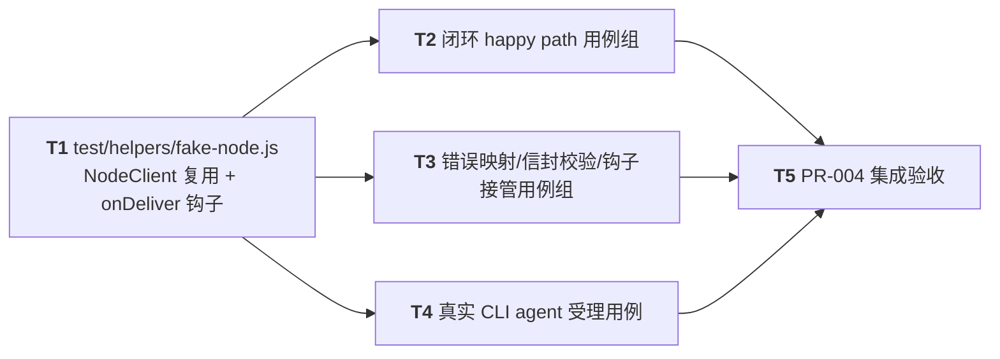

# PR-004 任务图：message-delivery-contract（send/deliver/ack 契约测试载体）

**来源输入**：`prs/pr-004-message-delivery-contract.md`（PR 定义：文件范围 2 文件/验收 5 条/零 src 改动约束/F07 共栖注记）、`architecture.md` §4.4~4.6（方法面/信封子集/错误映射）、§5.5（投递等待集与 ack 校验）、§6.1/§6.4（NodeClient 方法面与 deliver 自动受理，D12）、§8.1（事件 token 清单）、§10.1~10.2（假节点形态与 node:test 组织）、D10~D13、`prd/F07-message-delivery-contract.md`（验收 4 条 + 边界 + 架构维度）、`pr-002-tasks.md` O-3（消息域共栖实现随 pr-002 落盘但**无测试载体**——行为正确性由本 PR 证明）
**生成角色**：planner（阶段 5）
**日期**：2026-09-09
**修订记录**：2026-09-09 主 agent 裁决 Q-1 采纳方案 A（跨 PR src 最小修正，随本 PR merge 进入迭代分支，提交信息注明——与 pr-002 cli.js 修正先例同型）：pr-002 `oamp/src/router.js` message.send 在 `await deliverTo` **之前**先 `recordPendingDelivery`、投递失败分支调用新增的 `registry.clearPendingDelivery(message_id)` 回滚（pr-002 `registry.js` 新增定向清理函数并导出）——修复 pr-004 契约测试暴露的 ack 序竞态：目标自动受理（`{received:true}` 应答与 `message.ack` 同 tick 发出）与 deliver 响应同 chunk 到达 Router 时，ack 会在 `await deliverTo` 的 recordPending microtask 续段**之前**被同步分发处理 → `UNKNOWN_MESSAGE`（§5.5 ack 校验锚点缺失）→ NodeClient 静默吞错、MESSAGE_ACKED 永不输出、pending 滞留。实测证据：立即自动 ack 丢 ack 2-3/20 次（10-15%），setImmediate 延迟 ack 0/20；修复后 delivery-contract.test.js 12/12 绿 ×3、npm test 41/41 绿 ×3。重复 message_id 语义（D11 无去重状态机、Map 覆盖）不变；本任务图 T3 验收 8 语义锚点不变。

## 范围声明

- 任务图覆盖 PR-004 文件范围 **2 个文件**：`oamp/test/helpers/fake-node.js`、`oamp/test/delivery-contract.test.js`——纯测试载体，为 pr-002 已落盘的消息域共栖代码（router.js 的 message.send/deliver/ack 分发、registry.js pendingDeliveries、node-client.js send/ack + deliver 自动受理、log.js MESSAGE_DELIVERED/MESSAGE_ACKED 事件）提供**可执行验收载体**（O-3 收敛）。
- **零 src 改动（唯一例外 = Q-1 裁决）**：`src/*.js` 与 pr-001/pr-002 已合并文件只读；harness.js 只读复用。发现 src 行为缺陷无法用测试表达 → 停下报 Q，不擅改。Q-1 裁决后例外：pr-002 的 `src/router.js`/`src/registry.js` 跨 PR 最小修正（recordPending 前置 + 失败回滚，见修订记录），范围严格限定该两文件相关行，其余 src 仍只读。
- 消息域行为语义以 architecture §4.4/§4.5/§4.6/§5.5/§6.4/D10/D11/D12 为验收准绳：send = 单次同步代理（无 queued）；ack 流向 = Router 记录、**不回发送方**；**无**重试/超时重投/幂等去重状态机（D11——重复 message_id send 属"透传可区分"语义）；deliver 自动受理 = 传输应答 `{received:true}` + 自动 `message.ack{status:"accepted"}`（D12），`onDeliver(msg)` 钩子返回 false 可接管（证明受理与 ack 分离）。
- 契约闭环主载体 = **双假节点**（进程内，非子进程，§10.1/D12）；另设一条**真实 CLI agent 子进程**用例证明真实节点受理路径（§10.1/D12 验证锚点；pr-002 `agent start` 栈 + harness）。
- 测试运行：`oamp/` 下 `node --test`（npm test = `node --test test/*.test.js`；helpers 非 `*.test.js` 不被当用例，§10.2）；Router 一律经 harness 拉起（每用例独立临时 socket + 缩短 env，绝不触碰仓库内 `.runtime/`）。
- 零第三方依赖；**消息正文不进日志断言**（隐私/日志卫生，§6.4"不回显正文"）。
- 既有基线 = 5 卡 29 用例全绿（cli 8 / hygiene 3 / router-registry 8 / agent-heartbeat 6 / event-log 4 = 29，逐文件实测 2026-09-09），`npm test` 不得破坏。

## 依赖图

- **关键路径（最长依赖链）**：`T1 → T2/T3/T4 → T5`（2 条边；三条支线等长）。关键任务 = T1（fake-node.js，hub——全部用例的地基）、T5（集成验收收口）。
- **同文件写约束**：T2/T3/T4 均写入**同一物理文件** `delivery-contract.test.js`——由单一 dev 依 T2→T3→T4 顺序**串行追加**（同文件禁止并行，图中并列为语义独立用例组，各自可用 `--test-name-pattern` 独立验收）。
- **无环确认**：所有依赖边从被依赖任务指向依赖任务，T5 为唯一汇点；T1 无 PR 内前置（仅依赖 pr-002 已合并产物）。

## 任务清单

### T1 — test/helpers/fake-node.js：脚本级假节点（NodeClient 复用 + onDeliver 断言钩子）
**描述**：脚本级假节点（architecture §10.1/F07 卡"假节点形态与真实 agent 关系"/§6.1/D12）= **复用 pr-002 `src/node-client.js` 的通用 `NodeClient`**（与真实 CLI agent 同一协议实现，杜绝"测试验证的协议 ≠ 产品用的协议"漂移），叠加脚本能力：可注入 `onDeliver(msg)` 断言钩子（默认自动受理 = 回 `{received:true}` + 自动 ack accepted；钩子返回 false 时跳过自动 ack——证明 deliver 受理与 ack 分离）、deliver 记录面（完整信封副本供断言）、可编程心跳间隔、进程内直接调用（非子进程）。导出工厂函数便于测试：create → connect → register → send/收 deliver/ack/startHeartbeat → stop（deregister + close）。**不新建协议实现**——模块引用证据：fake-node.js import pr-002 的 node-client.js（node-client.js 属 pr-002，§10.1"复用通用 NodeClient"）。
**涉及文件**：`oamp/test/helpers/fake-node.js`（新建）
**优先级**：P0（hub——T2~T4 全部用例依赖）
**前置依赖**：无（仅依赖 pr-002 已合并的 `src/node-client.js`；验收探针需 harness 拉起的活 Router，harness.js 亦属 pr-002 已合并）
**验收标准**（可测试 / 可追溯）：
1. 静态：fake-node.js 仅 import `node:` 内置 + pr-002 的 `src/node-client.js`（+ 测试上下文所需 harness 工具）；零第三方依赖（§10.1 复用同一 NodeClient / D-3 零依赖）。（静态 grep 核查）
2. harness 拉起 Router（临时 socket + 缩短 env）后，进程内 import fake-node → 建节点 → connect → register(instance-id) → 返回结果含 `instance_id/session_id/state:"online"/lease_timeout_ms/last_heartbeat`（§4.4 agent.register 行 result / §6.1 register() 返回面）。（node 运行核查）
3. 发送方假节点 `send(toInstanceId, message, opts)` → 目标假节点 `onDeliver(msg)` 被调用一次且 msg 为**完整信封**（protocol/message_id/to/from(Router 代填)/created_at/payload，§4.5 信封表 + §4.6"deliver 时由 Router 填 from"）；钩子默认（未接管/返回非 false）→ 目标自动 ack(accepted)，Router stdout 出现 `MESSAGE_DELIVERED` 与 `MESSAGE_ACKED` 事件行（§4.6 deliver 受理链 / §6.4 / §8.1 token 表 / §5.5 pending 记录与命中即删）。（node 运行核查）
4. 钩子可注入接管：onDeliver 返回 false 时目标**不**发自动 ack（随后手动 `ack(message_id)` 仍返回 `{acked:true}`——pending 未被自动 ack 消费，§5.5）——deliver 受理与 ack 分离语义（§10.1"可记录/校验/延迟 ack 以证明 deliver 与 ack 分离"）。（node 运行核查）
5. 记录面：假节点记录收到的 deliver（完整 msg 副本，顺序保真）与显式 send/ack 的响应/错误，供测试断言（§10.1"可记录/校验"）。（node 运行核查）
6. 生命周期：startHeartbeat(intervalMs) 周期心跳（§6.1 方法面）；stop() = best-effort deregister（请求语义 ≤1s，D17）+ close，不悬挂。（node 运行核查）
7. `[model_inferred→待主 agent 确认]`：fake-node.js 对外 API 形态（工厂命名/构造签名/钩子注入方式/是否直接透传 NodeClient 方法）architecture §10.1 只定"复用 NodeClient + onDeliver 钩子 + 进程内运行"，未定稿接口——实现取最小可逆接口，以上行为语义（1~6）为验收准绳；NodeClient 实际导出面（pr-002 落盘：connect/register/startHeartbeat/deregister/send/ack/close + onDeliver/onClose + createClient 工厂）已核对实码，fake-node 在其上封装，不改其行为。

### T2 — delivery-contract.test.js：双假节点闭环 happy path 用例组（F07 验收 1~3 = PR 验收 1~3）
**描述**：契约测试主载体第一条主线（P-01"契约先行"）——双假节点（进程内，harness Router + 缩短 env）注册 → 发送方 message.send → Router deliver 至目标 → 目标自动回 message.ack → **双方继续 heartbeat**，全链路无错误（F07 验收 1/4：方法面最小集 register/heartbeat/send/deliver/ack 实际驱动）；同一 message_id 在 send 提交 → deliver 到达 → ack 回执**全链路贯通一致、可关联**（F07 验收 2 / P-09）；deliver 负载与 send 提交一致（payload 保真、含 Router 代填 from/created_at，目标可还原发送内容与发送方）（F07 验收 3 / §4.5）。
**涉及文件**：`oamp/test/delivery-contract.test.js`（新建，本任务写闭环 happy path 用例组）
**优先级**：P0
**前置依赖**：T1
**验收标准**（可测试 / 可追溯；`node --test --test-name-pattern '闭环|贯通|保真' test/delivery-contract.test.js` 组内运行）：
1. 双假节点 A/B 各自 register 成功（响应含 session_id）；随后双方 startHeartbeat（缩短 interval）——Router 侧两节点均 online（§4.4 register 语义 / §3.3 流程③前段"两节点注册"）。（运行核查）
2. A `send(to=B, message)`（message 含 protocol/message_id/payload，不含 from/created_at）→ send 响应 `{accepted:true, message_id, status:"delivered"}`（§4.4 message.send 行 result：单次投递同步代理，D10）。Router stdout 出现 `MESSAGE_DELIVERED message_id=<id> from=dev-a to=dev-b` 事件行（§8.1 token / §3.3 流程③顺序）。（运行核查）
3. B onDeliver 收到 deliver：信封 `message_id === A 提交值`、`protocol === "oamp/1"`、`to.instance_id === B`、`from.instance_id === A`（Router 代填发送方身份，§4.5 from 行 / §4.6）、`created_at` 匹配 UTC ISO-8601 形态 `^\d{4}-\d{2}-\d{2}T\d{2}:\d{2}:\d{2}\.\d{3}Z$`（§5.7/D17 外显时间戳）、payload 深等于 A 提交（content_type ∈ 允许集 + body 字符串一致——payload 保真不丢不改，§4.5 payload 行 / F07 验收 3）。（运行核查）
4. B 自动回 ack：Router stdout 出现 `MESSAGE_ACKED message_id=<同一 id> instance=dev-b`（§4.4 message.ack 行 result `{acked:true,status:"accepted"}` / §8.1 / §5.5 pending 命中即删）；（可选强证明）随后 B 对同一 message_id 手动再 ack → 错误 `UNKNOWN_MESSAGE`（pending 已被自动 ack 消费删除，§5.5"查无 → UNKNOWN_MESSAGE"）。（运行核查）
5. 闭环完成后 A/B 心跳继续推进：poll router.status 快照，两节点 last_heartbeat 均 > 基线值（心跳未被消息操作打断，§3.3 流程③末节"双方继续周期心跳（闭环无中断）" / F07 验收 1 末句）。（运行核查）
6. 方法面最小集覆盖检查：本组用例实际驱动 `agent.register` / `agent.heartbeat` / `message.send` / `message.deliver` / `message.ack` 五方法（§4.4 方法面；F07 验收 4"闭环所用协议方法面覆盖最小集"；agent.deregister 由 T1 stop() 于 teardown 触发）。（静态核查）
7. `[model_inferred→待主 agent 确认]`：ack 已发生与 message_id 关联的观察通道 = **Router stdout MESSAGE_ACKED 事件行**（ack 由目标客户端内部自动发、响应不回发送方——§4.6"ack 流向 = Router 记录，不回发送方"，NodeClient 自动 ack 结果亦不向测试暴露，实码已核）；"再 ack → UNKNOWN_MESSAGE"作自动 ack 已消费 pending 的确定性正断言。
8. `[model_inferred→待主 agent 确认]`："心跳继续推进"断言 = 经 harness `queryStatus`（进程内 rpc 直连 router.status，§10.2 同例）轮询 last_heartbeat 单调增长（缩短 env interval=50ms，deadline 内多周期命中，判据同 pr-002 agent-heartbeat F03-2 同型）。

### T3 — delivery-contract.test.js：错误映射 / 信封校验 / 钩子接管边界用例组（PR 验收 4 + 边界组）
**描述**：ack 校验与错误映射（目标对未知 message_id 回 ack → `UNKNOWN_MESSAGE`；send 目标不存在 → `AGENT_NOT_FOUND`、目标连接已断/offline → `AGENT_OFFLINE`——同步拒绝、不排队不进重试域，§4.3/§4.4/D10/N1；发送方连接未注册 → `UNREGISTERED`）；信封校验失败（坏 protocol/缺 message_id/坏 to/坏 payload）→ `INVALID_MESSAGE`（§4.5 校验表）；发送方自报 from → `INVALID_SENDER`（§4.5"发送方不得自报"）；onDeliver 钩子返回 false → 不自动 ack（受理与 ack 分离的契约断言）；重复 send 同 message_id 按 D11 无去重状态机语义断言（透传可区分，非幂等去重）。
**涉及文件**：`oamp/test/delivery-contract.test.js`（同文件追加错误/边界用例组）
**优先级**：P1
**前置依赖**：T1（T2 组已就绪提供双节点基线；同文件串行追加于 T2 之后）
**验收标准**（可测试 / 可追溯；`node --test --test-name-pattern 'UNREGISTERED|NOT_FOUND|OFFLINE|UNKNOWN_MESSAGE|INVALID_MESSAGE|INVALID_SENDER|受理与ack|同message_id'` 组内运行）：
1. **发送方未注册**：裸连接（UDS connect + rpc.js RpcPeer，不 register）发 message.send → 错误 `data.code=UNREGISTERED`（§4.3 UNREGISTERED 行"send/ack/deregister 等来自未注册连接" / §4.4 message.send 错误列；实码核对：Router dispatch 先查 `registry.identityOf(connId)`）。（运行核查）
2. **目标不存在**：A（已注册）send 至从未注册/已 deregister 的 instance_id → 错误 `data.code=AGENT_NOT_FOUND`（§4.3 / F07 卡寻址节"目标不在注册表 → AGENT_NOT_FOUND"；deregister = 删条目不留墓碑 → 同码，§5.4）。（运行核查）
3. **目标连接已断/offline**：A 已注册、B 注册后关闭连接（connId 置 null，§5.2 连接管理节：offline 判定前即属"连接已断"）或等待租约超时判 offline 后，A send → 错误 `data.code=AGENT_OFFLINE`（§4.3 AGENT_OFFLINE 行"目标已知但 offline/连接已断（含租约宽限内）" / §4.4；实码核对：`target.state !== online || connId === null` 即拒）。（运行核查）
4. **ack 未知 message_id**：B 对未投递/已消费的 message_id 发 message.ack → 错误 `data.code=UNKNOWN_MESSAGE`（§4.3 / §5.5"查 pending 无 → UNKNOWN_MESSAGE"）。（运行核查）
5. **信封校验失败逐项 → `INVALID_MESSAGE`**：坏 protocol（≠ "oamp/1"）/ 缺 message_id 或空串或 >64 字符或含控制字符 / 坏 to（toInstanceId 非合法 instance_id：空、含空白字符、超长——NodeClient.send 用参数代填 to，实码已核）/ payload 缺失或 content_type ∉ {text/plain, text/markdown, application/json} 或 body 非字符串（§4.5 校验表逐行 / §4.3 INVALID_MESSAGE / §4.6 校验顺序：信封合法检查先于目标查找——坏信封 + 任意目标恒 INVALID_MESSAGE）。（运行核查）
6. **发送方自报 from → `INVALID_SENDER`**：A 的 message 参数携带 from（NodeClient.send 透传 message 仅覆写 to，实码已核）→ 错误 `data.code=INVALID_SENDER`（§4.5 from 行"发送方不得自报：send params 中携带且与连接身份不符 → INVALID_SENDER"——Router 恒代填 from 的防伪断言）。（运行核查）
7. **onDeliver 返回 false → 不自动 ack**：B 钩子返回 false → deliver 到达后 Router **无** MESSAGE_ACKED（短窗核查）且 B 手动 `ack(message_id)` 成功返回 `{acked:true}`（pending 未被消费）——受理与 ack 分离语义（§6.4 自动受理可被钩子接管 / §10.1"延迟 ack 以证明 deliver 与 ack 分离" / §5.5）。（运行核查）
8. **重复 send 同 message_id（透传语义）**：D11 无幂等去重状态机、§5.5 pending 按 message_id 记录——两次 send 同 message_id（等第一次 MESSAGE_ACKED 落定后再发第二次，消除 ack 竞态）→ 两次均 `{accepted:true}`、B 收到两次 deliver（onDeliver 两次同 id）、Router MESSAGE_ACKED 恰两条（两次 pending 各自被消费；§5.5 + D11"行为不做：无重投则状态机无触发源"——透传可区分，非去重/报错）。Q-1 裁决后本验收已绿（12/12 ×3、41/41 ×3）：recordPending 前置使两次 pending 均先于各自 ack 就绪，Map 覆盖语义不变。（运行核查）
9. `[model_inferred→待主 agent 确认]`：错误断言形态 = RpcPeer/NodeClient 请求 reject 的 `RpcError`，机器码读 `err.dataCode`（pr-002 rpc.js 落盘实码：响应错误 → `new RpcError(msg, code, data.code)`，`error.code=-32000` 数值码 + `dataCode` 承载 §4.3 token——§4.2"应用错误统一 code:-32000，机器码放 data.code"，测试比对 `err.dataCode === '<TOKEN>'`）。（运行核查）
10. `[model_inferred→待主 agent 确认]`：裸未注册连接的构造 = 测试进程内直接 `net.connect` + `import { RpcPeer } from '../../src/rpc.js'`（harness `queryStatus` 同型直连先例，§10.2）——不经 NodeClient（其 connect/register 封装非裸连接语义），以可稳定执行为准。

### T4 — delivery-contract.test.js：真实 CLI agent 受理用例（PR 验收 5 / §10.1 真实 agent 用例）
**描述**：真实 CLI agent 子进程（`node bin/oamp.js agent start <id>`，缩短 env + harness 临时 socket，pr-002 agent 栈）注册后被 send 投递：真实 agent 经**同一 NodeClient** 自动受理 deliver——回传输应答 `{received:true}`（Router send 同步代理据此完成）→ 自动发 `message.ack(accepted)` → Router stdout `MESSAGE_ACKED`；真实 agent stdout 打 `MSG_RECEIVED` 事件（§6.4：`message_id=… from=… size=…`，**不回显正文**——正文不进日志断言，隐私）；证明真实节点与假节点协议行为结构一致（§10.1/D12 验证锚点）。
**涉及文件**：`oamp/test/delivery-contract.test.js`（同文件追加真实 agent 用例组）
**优先级**：P1
**前置依赖**：T1（进程内假节点作发送方；T2 已证假节点闭环）——同文件串行追加于 T3 之后
**验收标准**（可测试 / 可追溯；`node --test --test-name-pattern '真实 agent' test/delivery-contract.test.js` 组内运行）：
1. harness 拉起 Router → 子进程 `node bin/oamp.js agent start real-1`（缩短 env，pr-002 agent 栈 + harness.startAgent）注册成功：Router stdout `AGENT_REGISTERED instance=real-1 session=…`（§4.4 register / §8.1；agent 侧 `REGISTERED` 事件）。（运行核查）
2. 进程内假节点 A 向 real-1 message.send → send 响应 `{accepted:true, message_id, status:"delivered"}`——真实节点回传输应答后 Router 同步代理才完成（§4.4"同步等待目标传输层响应" / §6.4 理由①"不响应则 send 永久悬挂"）。（运行核查）
3. 真实 agent stdout 出现 `MSG_RECEIVED message_id=<同一 id> from=<A> size=<n>` 事件行且**不含 payload 正文内容**（§6.4"只打 MSG_RECEIVED message_id=… from=… size=… 事件（不回显正文）"——日志卫生/隐私断言，dev 简报"消息正文不进日志断言"）。（运行核查）
4. Router stdout 出现 `MESSAGE_DELIVERED` 与 `MESSAGE_ACKED message_id=<同一 id>`（真实 agent 自动 ack 到达 Router、pending 命中即删，§5.5/§6.4 自动 ack / §8.1）。（运行核查）
5. 投递后真实 agent 仍存活可再交互（第二次 send 亦成功），SIGINT 干净退出：先 deregister（Router `AGENT_DEREGISTERED`）再退出码 0（§6.3/F03-3；§10.1"真实进程证明 CLI/进程生命周期"——消息操作不打断节点生命周期）。（运行核查）
6. `[model_inferred→待主 agent 确认]`：真实 agent stdout 断言经 harness.startAgent 句柄的 `waitAgentLine`（实码已核：startAgent 返回 { stdout, waitAgentLine, stop… }，collectStream 缓存全部行——与 Router stdout 同机制），无需自建 spawn。（运行核查）

### T5 — PR-004 集成验收
**描述**：PR 级收口——`node --test test/delivery-contract.test.js` 单跑全绿 + `npm test`（含既有 5 卡）全绿 + 逐条对照 PR-004 文件"验收标准"5 条取证 + 文件范围/零 src 改动核查，产出通过记录供独立 verifier 复核与 merge 决策。
**涉及文件**：无新增（复用 T1~T4 产物）
**优先级**：P0
**前置依赖**：T2、T3、T4（传递覆盖 T1）
**验收标准**（可测试 / 可追溯，逐条对应 PR 文件"验收标准"5 条）：
1. `oamp/` 下 `node --test test/delivery-contract.test.js` 一次全绿（缩短 env + harness 临时 socket；双假节点 register→send→deliver→ack→双方继续心跳全链路无错误）——PR 验收第 1 条（F07-1/4）。（运行核查 + T2 记录）
2. 同一 message_id 在 send 提交 → deliver 到达 → ack 回执全链路贯通一致、可关联——PR 验收第 2 条（F07-2/P-09）。（运行核查 + T2 记录）
3. 目标收到的负载与 send 提交一致（payload 保真、含 Router 代填 from/created_at，目标可还原发送内容与发送方）——PR 验收第 3 条（F07-3/§4.5）。（运行核查 + T2 记录）
4. ack 校验与错误映射：未知 message_id ack → `UNKNOWN_MESSAGE`；目标不存在/连接已断-offline send → `AGENT_NOT_FOUND`/`AGENT_OFFLINE` 同步拒绝（含发送方未注册 `UNREGISTERED`、信封校验 `INVALID_MESSAGE`、伪造 from `INVALID_SENDER`）——PR 验收第 4 条（§4.3/§4.6；错误码按 architecture/F07 语义落，PR 文件措辞偏差见开放项 O-1）。（运行核查 + T3 记录）
5. 真实 CLI agent 子进程被 send 投递时受理：回传输应答 + 自动 ack(accepted) + MSG_RECEIVED 事件（正文不进日志）——PR 验收第 5 条（§6.4/D12/§10.1）。（运行核查 + T4 记录）
6. 文件范围核查：git status/diff 新增 `oamp/test/helpers/fake-node.js` + `oamp/test/delivery-contract.test.js`（+ 本 tasks 文档）+ **Q-1 裁决的跨 PR src 修正**（pr-002 `src/router.js` message.send 段 + `src/registry.js` 新增 clearPendingDelivery，范围严格限定——与 pr-002 cli.js 修正先例同型，随本 PR merge 进入迭代分支，提交信息注明）；除此外零 src 改动（其余 src 与 pr-001/pr-002 已合并文件全部无 diff）；零第三方依赖（package.json dependencies 仍空）。（git 核查）
7. `npm test`（`node --test test/*.test.js`）全绿——既有 5 卡 29 用例不被新载体破坏（实测基线 29 项，2026-09-09）。（运行核查）

## model_inferred 汇总（需主 agent 确认）

| # | 任务 | 推断内容 | 追溯基础 |
|---|---|---|---|
| MI-1 | T1 | fake-node.js 对外 API 形态（工厂命名/签名/钩子注入方式）architecture 未定稿；NodeClient 导出面以 pr-002 实码为准在其上封装 | §10.1 定"复用 NodeClient + onDeliver 钩子 + 进程内"未定接口；pr-002 rpc 同例（接口 MI、行为为验收准绳） |
| MI-2 | T2 | ack 已发生的观察通道 = Router stdout MESSAGE_ACKED 事件行；"再 ack → UNKNOWN_MESSAGE"作自动 ack 已消费 pending 的正断言 | §4.6"ack 流向 = Router 记录，不回发送方"；§5.5 pending 命中即删；NodeClient 自动 ack 结果不对外暴露（实码核） |
| MI-3 | T2 | 心跳继续推进断言 = queryStatus 轮询 last_heartbeat 单调增长 | §10.2 harness 直连查询先例 + pr-002 F03-2 同型判据；§3.3 流程③末节 |
| MI-4 | T3 | 错误断言读 `RpcError.dataCode`（§4.3 机器码）；裸未注册连接用 net.connect + RpcPeer 直连 | §4.2"机器码放 data.code"；rpc.js 落盘实码（request reject 携带 dataCode）；harness queryStatus 同型 |
| MI-5 | T3 | 重复 send 同 message_id = 透传可区分（两次均成功、B 两次 deliver、两次 MESSAGE_ACKED）；实测不符 → 报 Q 不擅改 | D11 无去重状态机 + §5.5 pending 按 message_id 记录覆盖；与 dev 简报用例 2 后半一致 |
| MI-6 | T4 | 真实 agent stdout 经 harness.startAgent.waitAgentLine 抓取（无需自建 spawn） | harness.js 落盘实码（startAgent 返回 stdout/waitAgentLine）；§10.2 collectStream 同机制 |

## 开放项（不阻断本 PR，报告主 agent）

- **O-1（错误码措辞偏差）**：PR-004 文件验收第 4 条写"目标未注册/offline 时 send → UNREGISTERED/AGENT_OFFLINE"，与 architecture §4.3/§4.4 + F07 卡语义不符——后者：目标不在注册表 → `AGENT_NOT_FOUND`、offline/连接已断 → `AGENT_OFFLINE`、`UNREGISTERED` 仅指**发送方**连接未注册。本任务图按 architecture/F07 语义落（T3/T5），PR 验收复核与报告时以架构语义为准并注明偏差。
- **O-2（INVALID_SENDER 载体）**：T3 验收 6 已验证可测（NodeClient.send 透传 message 仅覆写 to，from 可携带触发 Router 拒绝——实码核）。超出 dev 简报显式列举，但可追溯 §4.5"发送方不得自报"，纳入边界组。
- **O-3（重复 message_id 语义锚点）**：D11 无去重状态机 → 任务图预期透传可区分（T3 验收 8）；若实测 Router 行为不符 → dev 报 Q，主 agent 裁决（本 PR 零 src 改动约束）。
- **O-4（阶段 6 边界）**：E1 全链路手测（真实 CLI 双节点手动投递冒烟，含 `oamp status` 观测）留阶段 6 独立验证（architecture §10.2/§9 注记），不进 node:test。
- **已裁决（Q-1，跨 PR src 修复归档）**：pr-002 router.js/registry.js ack 序竞态（message_id pending 记录晚于同 chunk 到达的 ack → UNKNOWN_MESSAGE）——pr-004 契约测试暴露（O-3 收敛的价值），主 agent 2026-09-09 裁决方案 A 并批准跨 PR src 最小修正；修正细节、证据与结果见本文件"修订记录"。重复 message_id 幂等语义（D11）不受影响；架构文档与 prd 无需改动（行为语义本就要求 pending 先就绪，修正使实现回到架构语义）。
