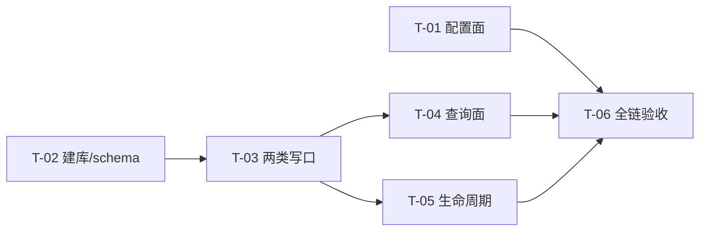

# PR-001 任务图（配置面 + 持久层）

**来源**：`prs/pr-001-config-surface-and-persistence.md`（验收标准 1~10）+ `architecture.md` §4.1~§4.7 / §8 / §12（AR-02/AR-04/AR-05/AR-06/AR-07/AR-14）+ `prd/F02`、`prd/F03`、`prd/F07`
**涉及文件（唯一可创建/修改）**：`oamp/src/config.js`（改造）、`oamp/src/persist.js`（新建）、`oamp/.gitignore`（追加 `data/`）、`oamp/test/config-file.test.js`（新建）、`oamp/test/persist.test.js`（新建）
**完成定义**：`oamp/` 下 `node --test test/config-file.test.js test/persist.test.js` 全绿，且 `npm test`（11 个既有 + 2 个新增）全绿；测试全程不写 `oamp/data/`。
**范围外（本 PR 不做）**：不接线任何消费方（`web.js`/`agent.js` 不 import `persist`）；不改 Router/registry；不改 `bin/`、前端；不引入第三方依赖（`dependencies` 保持 `{}`）；不做 SSE/上下文池（pr-002/pr-003）。

---

## A. 接口契约（先行固定，实现与验收以此为准）

### A.1 `oamp/src/config.js`

```js
export function loadConfig(env = process.env) -> {
  // 既有键（取值与校验行为完全不变）
  socketPath, heartbeatIntervalMs, heartbeatTimeoutMs, hbLogWindowMs, reconnect, reconnectMaxMs,
  // 新增键（本 PR）
  dbPath,        // 绝对路径
  defaultModel,  // string
  contextMax,    // 正整数
}
export default loadConfig(); // 保持既有形态（模块加载期求值）
```

| 项 | 规则（来源） |
|---|---|
| 配置文件路径 | `env.OAMP_CONFIG`（非空）否则 `<PKG_ROOT>/config.json`（`PKG_ROOT` 沿用 `config.js:9` 推导；architecture §8.1） |
| 文件缺失 | 全部走内置默认，**不抛错、不告警退出**（F07-3 / §8.3 / PR 验收 3） |
| 文件非法 | 抛 `Error`，`message` 以 `OAMP 配置错误:` 开头（F07-4 / §8.3 / PR 验收 3）。非法 = JSON 解析失败 / 顶层非对象（含数组、null）/ `data`·`defaults`·`context` 存在但非对象 / `data.db`·`defaults.model` 存在但非**非空字符串** / `context.max` 存在但非**正整数** |
| 未知键 | 忽略，不报错（§8.3） |
| 优先级（逐键独立） | `dbPath`：`OAMP_DB` > `config.data.db` > `'data/sql.db'`；`defaultModel`：`OAMP_OMP_MODEL` > `config.defaults.model` > `'openai/gpt-5.6-luna'`；`contextMax`：`OAMP_CTX_MAX`（正整数校验）> `config.context.max`（正整数校验）> `8`（§8.2 / PR 验收 2 / F07-5） |
| 空字符串语义 | env 值为空串 / 纯空白 → 视为未提供，落到下一级（`[model_inferred]` I-1） |
| 路径基准 | `path.resolve(PKG_ROOT, 选定值)` → 默认 `oamp/data/sql.db`，**绝对路径、与 cwd 无关**（§8.3 / F07-1 / PR 验收 1） |

### A.2 `oamp/src/persist.js`（模块导出仅 `openDb`）

```js
export function openDb(dbPath) -> {
  insertInput({ chatId, text, agentId?, meta?, nowMs? }),   // direction='in' 写死
  insertOutput({ chatId, text, agentId?, model?, durationMs?, error?, meta?, nowMs? }), // direction='out' 写死
  upsertChat({ chatId, title, agentId?, nowMs? }),
  closeChat(chatId, nowMs?) -> boolean,
  startupSweep() -> number,              // working → failed；不补记录、不动 updated_at（AR-01）
  listChats({ q?, agent?, state?, from?, to?, limit?, offset? }) -> { chats, total, limit, offset },
  getChat(chatId) -> { chat, messages } | null,
  close(),
}
```

| 契约点 | 规则（来源） |
|---|---|
| 建库 | `fs.mkdirSync(path.dirname(dbPath), {recursive:true})` → `new DatabaseSync(dbPath)` → `PRAGMA foreign_keys = ON` → 幂等 `CREATE TABLE/INDEX IF NOT EXISTS`（§4.1/§4.2；PR 验收 4） |
| 唯一 SQL 出口 | `direction` 由函数体写死、**不暴露参数**；不存在任何接受 `direction` 的导出（§4.7 / F02-5 / E-5 / PR 验收 5） |
| `message_id` | 写函数返回 `{ chat_id, message_id }`（pr-004 的 `POST /api/messages` 响应可直取；§4.5） |
| 默认 chat 行 | `insertInput` 对不存在的 `chat_id` 做防御性建行（`INSERT … ON CONFLICT DO NOTHING`）：`title = text.trim().slice(0,40) || '新对话'`（AR-02），`state='working'`；已存在则不改标题（`[model_inferred]` I-2：保证 F02-3「输入先落盘」不因缺行而失败） |
| 状态机 | 写输入 → `working`；写输出 → `error` 非空则 `failed`、否则 `completed`；`upsertChat` 新建 → `working`（AR-01/§4.3；`[model_inferred]` I-3：`insertOutput` 由 `error` 派生状态，不暴露 `state` 参数） |
| 哨兵 | 所有 `chats` 状态写入带 `AND state!='closed'`（§4.3/§4.7 / PR 验收 8） |
| `updated_at` | 写输入、写输出、`upsertChat`、`closeChat` 前移；`startupSweep` 不动（AR-01） |
| `startupSweep` | `UPDATE chats SET state='failed' WHERE state='working'`，返回影响行数，**不补记录**（§4.3/AR-05） |
| `closeChat` | 置 `closed` + `closed_at` + `updated_at`；已 closed 时不改写任何字段（幂等）；返回值 = chat 是否存在（`true`/`false`） |
| `meta` | 写入 `JSON.stringify`，读回 `JSON.parse`；未提供 → `NULL` → 读回 `null`（§4.1/§4.3；PR 验收 6） |
| 行对象 | 查询结果一律转普通对象（`node:sqlite` 返回 null-prototype 对象，直接 `deepStrictEqual` 会失败）（`[model_inferred]` I-4） |
| 排序/分页 | `ORDER BY updated_at DESC, chat_id DESC`；`limit` 默认 50、上限 200；`offset` 默认 0；`limit`/`offset` 非法 → 抛错（`[model_inferred]` I-5，对应 §4.5 的 400 面，由 pr-004 映射） |
| 关键词 | `chats.title LIKE ? ESCAPE '\'` OR `EXISTS(messages.text LIKE ? ESCAPE '\')`；输入中 `\` `%` `_` 逐字符前缀 `\` 转义；含已 closed chat（§4.6 / F03-6 / PR 验收 7） |
| 时间过滤 | 基准 `updated_at`，闭区间 `>= from AND <= to`；缺省不限；`from > to` → 抛错（§4.6 / PR 验收 7） |
| agent 相关 | `chats.agent_id = ?` OR `EXISTS(messages.agent_id = ?)`（§4.6 / F03-5 / PR 验收 7）——**故写函数需接受 `agentId` 并落 `messages.agent_id`** |
| `state` 过滤 | 仅接受 `working\|completed\|failed\|closed`，非法 → 抛错（§4.6） |
| 组合 | 全部条件 AND（F03-7） |
| `total` | 匹配总数（不受 `limit/offset` 影响）；`message_count` = 该 chat 全部消息数 |
| `getChat` | 消息 `created_at ASC, id ASC`；未找到 → `null` |
| `close()` | 关闭连接；同路径再 `openDb` 可读回既有内容（E-3 / PR 验收 9） |

---

## B. 任务列表

### T-01 配置面：JSON 配置文件层 + 三新键

**前置依赖**：无
**交付物**：`oamp/src/config.js`（改造）、`oamp/test/config-file.test.js`（新建）
**验收标准**（可测试）：
1. `loadConfig({ OAMP_CONFIG: <不存在路径> })` 返回 `dbPath === path.join(<包根>, 'data', 'sql.db')`（绝对）、`defaultModel === 'openai/gpt-5.6-luna'`、`contextMax === 8`；既有六键取值与改造前逐字相同（PR 验收 1；§8.2/§8.3）
2. 临时配置文件写入 `{"data":{"db":"<tmp>/a.db"},"defaults":{"model":"x/y"},"context":{"max":3}}` → 三键取文件值（§8.2；F07-2）
3. env 三键同时给出 → env 胜（`OAMP_DB`/`OAMP_OMP_MODEL`/`OAMP_CTX_MAX`）（PR 验收 2；F07-5）
4. 逐键独立：只给 `OAMP_DB` + 配置文件给另两键 → `dbPath` 取 env、`defaultModel`/`contextMax` 取文件（§8.2；PR 验收 2）
5. `OAMP_DB` 相对路径 → `dbPath` 绝对且以包根为基准；绝对路径 → 原样（§8.3；F07-1）
6. 非法：JSON 解析失败 / 顶层为数组 / `data.db` 为数字 / `defaults.model` 为空串 / `context.max` 为 `0`、`-1`、`1.5`、`"8"` → 抛错且 `message` 含 `OAMP 配置错误`（PR 验收 3；F07-4；§8.3）
7. 未知键（如 `{"foo":1}`）→ 不抛错，全默认（§8.3）
8. 既有键回归：`OAMP_HEARTBEAT_INTERVAL_MS` 覆盖生效、非法值抛 `OAMP 配置错误`、`OAMP_RECONNECT` 非 `0/1` 抛错（PR 验收 1「既有键不变」）

**测试**：`oamp/test/config-file.test.js`（临时目录 + `OAMP_CONFIG` 指向临时文件；不改 `process.env`，全部以 `loadConfig(env)` 传参调用）

---

### T-02 持久层骨架：建库、schema、忽略规则

**前置依赖**：无（与 T-01 无交集）
**交付物**：`oamp/src/persist.js`（骨架：`openDb`/`close`）、`oamp/.gitignore`（追加 `data/`）
**验收标准**：
1. `openDb(<tmp>/nested/deep/sql.db)` 对不存在的多级目录自动建目录并建库，不抛错（§4.2；PR 验收 4）
2. 重复 `openDb(同一路径)` 不抛错（`CREATE TABLE/INDEX IF NOT EXISTS` 幂等）（PR 验收 4）
3. 库内恰有 `chats`/`messages` 两表与 `idx_messages_chat_time`/`idx_chats_updated` 两索引（表结构逐列对照 §4.1）
4. `PRAGMA foreign_keys` 读回 `1`，且插入不存在的 `chat_id` 消息被外键拒绝（§4.2；PR 验收 4）
5. `close()` 后可对同一路径再次 `openDb`（T-06 的 E-3 断言前置能力）
6. `.gitignore` 含 `data/` 且 `.runtime/` 规则保留 → `oamp/test/hygiene.test.js` 原样全绿（F07 架构维度 2 / §8.4；PR 验收 10）

**测试**：`oamp/test/persist.test.js` 的「建库与 schema」段（库文件一律 `os.tmpdir()` 下）

---

### T-03 两类写口：`insertInput` / `insertOutput`

**前置依赖**：T-02
**交付物**：`oamp/src/persist.js`（写接口）
**验收标准**：
1. 一次 `insertInput` + 一次 `insertOutput` 后 `SELECT COUNT(*) FROM messages` = 2，且 `SELECT DISTINCT direction` = `['in','out']`（E-5 / F02-1 / PR 验收 5）
2. 结构面：`openDb()` 返回对象中能写 `messages` 的函数只有 `insertInput`/`insertOutput`；二者签名不含 `direction`；向 `insertInput` 传 `direction:'out'` 仍落 `'in'`（§4.7 / PR 验收 5）
3. `insertInput` 后 chat `state='working'` 且 `updated_at` 前移；`insertOutput` 无 `error` → `completed`；`insertOutput({error:'model_unavailable'})` → `failed`（§4.3/§4.4；`[model_inferred]` I-3）
4. `meta` 落盘与读回：`insertInput({meta:{task_id:'t-1'}})` → `getChat` 该条 `meta` deep-equal `{task_id:'t-1'}`；`insertOutput({meta:{context_id:'ctx-1-2',pid:123}})` → deep-equal（§4.1/§4.3；PR 验收 6，F05-2/E-1 依赖）
5. 未传 `meta` → 读回 `null`（不抛错）
6. `agentId` 落 `messages.agent_id`（`getChat` 可读回；F03-5 判定依据）
7. 对不存在的 `chat_id` 调 `insertInput` → 自动建 chat 行（`state='working'`、`title` = 输入前 40 字符），消息不丢（`[model_inferred]` I-2 / F02-3）

**测试**：`oamp/test/persist.test.js` 的「写接口与结构面」段

---

### T-04 查询面：`listChats` / `getChat`

**前置依赖**：T-03
**交付物**：`oamp/src/persist.js`（查询接口）
**验收标准**：
1. 默认排序 `updated_at DESC, chat_id DESC`：构造 3 个 chat（两个同一毫秒）→ 断言稳定顺序；分页 `limit/offset` 两页无重叠无遗漏，`total` = 匹配总数（§4.5/§4.6；F03-2；PR 验收 7）
2. `limit` 默认 50、`offset` 默认 0；`limit=201`、`limit=0`、`offset=-1` → 抛错（`[model_inferred]` I-5；§4.5 的 400 面）
3. `from`/`to` 作用于 `updated_at` 且**闭区间**：`from = updated_at` 与 `to = updated_at` 均被包含；`from > to` → 抛错（§4.6；F03-3；PR 验收 7）
4. 关键词命中 `title` 或该 chat 的任一 `messages.text`；含已 closed chat（§4.6；F03-6）
5. 转义：构造文本含 `%`、`_`、`\` 的 chat 与不含的 chat，`q='%'` / `q='_'` / `q='\'` 只命中**字面量**匹配者（§4.6；PR 验收 7）
6. agent 相关：`chats.agent_id` 命中，或 `messages.agent_id` 命中（"参与过"），两种情况都返回（§4.6；F03-5）
7. `state` 过滤：四态各自过滤正确；非法 state → 抛错；四类条件（q/agent/state/时间）组合为 AND（§4.6；F03-4/7）
8. `getChat`：消息按 `created_at ASC, id ASC` 升序，字段含 `id/direction/agent_id/text/model/duration_ms/error/created_at/meta`，`meta` 已 `JSON.parse`；未知 chat → `null`（§4.5；F03-8）
9. 空库 `listChats()` → `{ chats: [], total: 0, limit: 50, offset: 0 }`（F02-7「空库启动」）

**测试**：`oamp/test/persist.test.js` 的「查询面」段

---

### T-05 生命周期写口：`upsertChat` / `closeChat` / `startupSweep`

**前置依赖**：T-03
**交付物**：`oamp/src/persist.js`（生命周期接口）
**验收标准**：
1. `upsertChat({chatId,title,agentId})` 建行 → `state='working'`、`created_at=updated_at`；重复调用改标题/`updated_at` 但 `created_at` 不变（AR-01/AR-02）
2. 对已 `closed` 的 chat `upsertChat` → `state` 仍 `closed`（哨兵；§4.3/§4.7）
3. `closeChat` → `state='closed'`、`closed_at`/`updated_at` 已置；返回 `true`；未知 chat → 返回 `false` 且不改任何行（§4.5；F01-5）
4. 幂等：连续两次 `closeChat` → 第二次后 `closed_at`/`updated_at` 与第一次相同（PR 验收 9「关闭幂等」）
5. 迟到结果不改写：`closeChat` 后 `insertOutput`/`insertInput` → chat `state` 仍 `closed`（哨兵；§4.3/PR 验收 9）
6. `startupSweep()` → 遗留 `working` 全部变 `failed`，返回影响行数；`completed`/`failed`/`closed` 不受影响（§4.3/AR-05；PR 验收 9）

**测试**：`oamp/test/persist.test.js` 的「生命周期与扫尾」段

---

### T-06 全链验收：重开读回 + 全量回归 + 测试卫生

**前置依赖**：T-01、T-04、T-05
**交付物**：两个测试文件的收口用例
**验收标准**：
1. E-3 落盘侧：写入 chat + 输入 + 输出（含 `meta`）→ `close()` → 同路径 `openDb` → `getChat` 的 chat 与消息内容、顺序、`meta` 与关闭前一致（PR 验收 9；F02-6）
2. `node --test test/config-file.test.js test/persist.test.js` 全绿（PR 验收 10）
3. `npm test`（既有 11 文件 + 新增 2 文件）全绿；既有文件**零修改**（PR 验收 10/11；F08-3 口径）
4. 测试卫生：测试内构造的库路径全部位于 `os.tmpdir()` 下，`oamp/data/` 在测试跑完后不存在（PR 验收 10；§17）
5. `package.json` 的 `dependencies` 仍为 `{}`（零新依赖；`hygiene.test.js`）

**测试**：上述两个测试文件 + 仓库既有测试

---

## C. 依赖图



- **无环**（拓扑序：T-01/T-02 → T-03 → T-04/T-05 → T-06）
- **关键路径**：T-02 → T-03 → T-04 → T-06（另 T-03 → T-05 → T-06 等长）
- 可并行：T-01 ∥ T-02；T-04 ∥ T-05

## D. 粒度说明

本 PR 为单一开发单元（两文件实现 + 两文件测试），任务按**可独立执行的断言集**切分：T-01 只依赖 `config.js`；T-02 只依赖 schema；T-03 依赖写口；T-04/T-05 不互相依赖；T-06 才需要全部到位。未进一步拆分（如按单个 SQL 语句拆）——再细就无法各自独立验收。

## E. `[model_inferred]` 清单（需主 agent 确认）

| # | 条目 | 落点 | 推断理由 |
|---|---|---|---|
| I-1 | env 变量为空串/纯空白 → 视为未提供，继续向下一级取值 | T-01-4 | §8.2 未定义空串语义；沿用既有 `env.OAMP_SOCKET || …` 的"空即未设"风格 |
| I-2 | `insertInput` 对不存在的 `chat_id` 防御性建行（标题按 AR-02 规则取输入前 40 字符） | T-03-7 | PR 验收 5 的断言句为"一次 `insertInput` + `insertOutput` 后恰 2 行"，未前提建行步骤；且 F02-3「输入先落盘」不应因缺行失败 |
| I-3 | `insertOutput` 不暴露 `state` 参数，由 `error` 派生 `completed`/`failed` | T-03-3 | §4.3 要求输出写入同时落状态，而简报的签名无 `state`；结构上禁止非法态优于放开参数 |
| I-4 | 查询行一律转普通对象返回 | T-04 全部 | `node:sqlite` 返回 null-prototype 对象，`assert.deepStrictEqual` 无法直接比对（实测确认） |
| I-5 | `limit`/`offset`/`state`/`from>to` 非法时 `persist` 抛错（`message` 含参数名），由 pr-004 映射 HTTP 400 | T-04-2/T-04-3/T-04-7 | §4.5/§4.6 只写了 HTTP 层"→ 400"；校验必须落在 SQL 层（唯一出口），否则错误面无处产生 |
| I-6 | 配置文件内 `data.db`/`defaults.model` 的**空字符串**按"键类型错"处理 | T-01-6 | §8.3 只写"键类型错"；空串不是可用值，按非法快速失败 |

## F. 追溯矩阵（PR 验收 → 任务）

| PR-001 验收标准 | 任务 |
|---|---|
| 1 默认值 + 既有键不变 | T-01-1、T-01-8 |
| 2 逐键优先级 | T-01-2~T-01-5 |
| 3 缺失不失败 / 非法抛错 / 入口行为不变 | T-01-6、T-01-7（入口 try/catch 属既有代码，本 PR 不改） |
| 4 `mkdir -p` + 幂等建表 + `PRAGMA foreign_keys` | T-02-1~T-02-4 |
| 5 写接口仅两个 + `direction` 写死（E-5） | T-03-1、T-03-2 |
| 6 `meta` 落盘与读回 | T-03-4、T-03-5 |
| 7 排序/分页/时间闭区间/关键词转义/agent 相关性 | T-04-1~T-04-8 |
| 8 `state!='closed'` 哨兵 + 关闭幂等 + 扫尾 | T-05-2、T-05-4、T-05-5、T-05-6 |
| 9 重开库读回（E-3） | T-06-1 |
| 10 `.gitignore data/` + 两测试全绿 + 不写 `oamp/data/` | T-02-6、T-06-2~T-06-5 |
