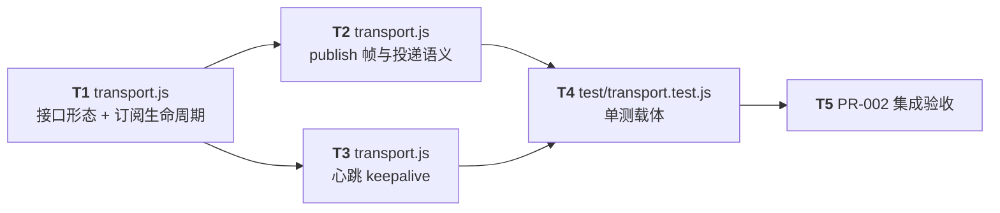

# PR-002 任务图：sse-transport-abstraction

**来源输入**：`prs/pr-002-sse-transport-abstraction.md`（文件范围 2 文件 / 验收 6 条 / batch 1 / depends_on 无）、`architecture.md` §5.1（Transport 接口形态与替换方式）、§5.2（事件模型、`retry`/心跳/顺序/序列化）、§5.4（断线重连与兜底：无订阅者丢弃、`res.on('close')` 移除）、§14（transport 为何必需）、§16.1（pr-002 行：只交付模块与单测、不接线 web）、§17（单元测试层：订阅集合 / publish 无订阅者 / closeAll）、`prd/F04-invocation-realtime-streaming-transport.md`（验收 3/4/6 与「架构维度」传输抽象接口小节）
**生成角色**：planner（阶段 5）
**日期**：2026-09-10
**修订记录**：初版；2026-09-10 主 agent 裁定 Q1（MI-1）——`close(chatId)` 采纳"移除订阅**并结束该 chat 的连接**"（避免 chat 关闭后浏览器挂着空闲 SSE 连接），`closeAll()` 由 `close()` 逐 chat 组合；T1-4 与 MI-1 表述按裁定收敛（实现 + 用例 6 已同步）。MI-2~MI-6 一并采纳。

## 范围声明

- 任务图覆盖 PR-002 文件范围 **2 个文件**：`oamp/src/transport.js`（新建）、`oamp/test/transport.test.js`（新建）。
- **不接线 web**：`GET /api/stream` 路由、`?chat_id` 解析、`onDeliver → publish`、`web/{app.js,index.html}` 的 `EventSource` 订阅全部归 pr-004（§16.1 pr-002 行明文；PR 卡「上下文摘要」同述）。本 PR 不修改 `oamp/src/web.js`、`oamp/test/web.test.js` 及任何其他既有文件。
- **不引入依赖**：零第三方依赖（`package.json` `dependencies` 保持 `{}`，由既有 `test/hygiene.test.js` 静态断言）；仅 `node:` 内置（传输实现本身不需要 import——`http` 服务由消费方提供，测试侧用 `node:http`）。
- **不做**：过程增量缓存/补发（§5.4「断线期间的过程增量不补发」）、全局订阅（§5.2「不做全局订阅」）、`seq` 字段（§5.2「不引入 seq 字段」）、WebSocket 实现（F04 边界 N-3）、节流/合帧（§5.3 注记留实施期）。
- 进程级/全链路判据（E-4「终态前 ≥2 个 `task_update` 且文本递增」、端到端时延 ≤200ms）**不可在本 PR 验收**——需要 pr-004 的 web 接线与前端订阅（§5.3 / §16.2 跨批次不并行）。

## 依赖图

- **关键路径（最长依赖链）**：`T1 → T2 → T4 → T5`（4 条边）；关键任务 = T1（接口与订阅集合是 T2/T3/T4 的共同地基）、T5（PR 级收口）。
- **并行支线**：T2 与 T3 在 T1 之后互不依赖（一个管 `publish` 序列化，一个管定时器），可并行实现；但二者写入同一文件 `src/transport.js`（见「开放项 O-1」），实际执行按 T1 → T2 → T3 顺序落笔。
- **无环确认**：全部依赖边从被依赖任务指向依赖任务；T5 为唯一汇点，无回边、无环。

## 任务清单

### T1 — src/transport.js：Transport 接口形态与订阅生命周期

**描述**：落地 `createSseTransport({ heartbeatMs = 15000 } = {})`，返回 `{ kind:'sse', handle, publish, close, closeAll }`（§5.1 接口 + PR 卡「实现要点」）。本任务负责接口形状与订阅集合本身：`handle(req, res, { chatId })` 写 SSE 响应头与 `retry` 首帧、把 `res` 注册进该 `chatId` 的订阅集合；客户端断开（`res` 的 `'close'`）时自动移除该订阅（§5.4）；`close(chatId)` 移除该 chat 的全部订阅、`closeAll()` 移除全部并结束所有连接（§5.1「进程退出时结束所有连接」）。**不实现** `publish` 的帧序列化（T2）与心跳定时器（T3）。

**涉及文件**：`oamp/src/transport.js`（新建）
**优先级**：P0（T2/T3/T4 的共同前置）
**前置依赖**：无（模块零 import）
**验收标准**（可测试 / 可追溯）：
1. `createSseTransport()` 返回对象含 `kind === 'sse'` 与 `handle`/`publish`/`close`/`closeAll` 四个函数；`createSseTransport({ heartbeatMs: 80 })` 同样返回该形状（可注入参数不改变接口形状）。（§5.1 代码块 + PR 卡验收 1；载体 = T4 用例 1）
2. `handle(req, res, { chatId })` 建立订阅时写出的响应头满足：`content-type: text/event-stream; charset=utf-8`、`cache-control: no-store`、`connection: keep-alive`；并在同一连接上先写一帧重连间隔（`retry: 1000`）。（§5.1「写 header、注册到订阅集合、发 retry/心跳」+ §5.2「响应头写 `retry: 1000`」+ PR 卡验收 2 前半；载体 = T4 用例 2）
3. 客户端断开后订阅被移除：客户端中止连接 → `res` 触发 `'close'` → 订阅集合不再持有该 `res`；此后 `publish(chatId, event)` 不抛错、也不向已关闭连接写入（无 EPIPE/写后错）。（§5.4 表格「连接关闭 → `res.on('close')` → 从订阅集合移除（防泄漏）」+ PR 卡验收 4 前半；载体 = T4 用例 5）
4. `close(chatId)` 移除该 chat 订阅**并结束其连接**（不波及其他 chat），`closeAll()` 等价于对全部 chat 逐个 `close()`（全部订阅归零、所有连接结束）；二者之后对相应 `chatId` 的 `publish` 均无写入、不抛错。（§5.1 `closeAll()` 语义 + PR 卡验收 4 后半 + 2026-09-10 主 agent Q1 裁定；载体 = T4 用例 6/7）
5. 静态：`src/transport.js` 零第三方依赖、不 import `src/` 内其他模块（尤其不 import `web.js`）；文件范围止于 PR-002 的两个文件。（§16.1 pr-002 行边界 + §14「`src/transport.js` 必需」；静态核查）
6. `[已裁定：MI-1 采纳（2026-09-10 主 agent），MI-3 采纳]` 订阅集合的数据结构形态（`Map<chatId, Set<res>>`）与 `close(chatId)` 接口成员——architecture §5.1 只列 `handle/publish/closeAll`，`close(chatId)` 出自 PR 卡「实现要点」，**经裁定为必要成员**（接口形状即 F04-6 替换契约，文档在阶段 6 同步）；`close(chatId)` 的 end 语义见 T1-4。

### T2 — src/transport.js：publish 帧序列化与投递语义

**描述**：实现 `publish(chatId, event)`：`event = { type, data }`，序列化为 `event: <type>\ndata: <JSON>\n\n` 帧写出；同一连接多次 `publish` 按调用顺序 FIFO 送达；同一 `chatId` 的多个订阅者按注册顺序各收一份；**无订阅者时直接丢弃**（不缓存、不排队、不补发，`publish` 不抛错）。

**涉及文件**：`oamp/src/transport.js`（同一文件，承接 T1 的订阅集合）
**优先级**：P0
**前置依赖**：T1（订阅集合与 `handle` 注册）
**验收标准**（可测试 / 可追溯）：
1. 帧格式逐字节为 `event: <type>\ndata: <JSON.stringify(data)>\n\n`——`type` 取 `task_update`/`notice`/`chat_state`/`message` 之一时按同名事件名写出，`data` 为该对象的 JSON 序列化。（§5.2「序列化：`event: <type>\ndata: <json>\n\n`」+ PR 卡验收 2 前半；载体 = T4 用例 3）
2. 同一连接连续 `publish` 多个事件，接收侧按发布顺序收到（FIFO，不失序、不合并）。（§5.2「顺序：单连接 FIFO 写（Node http 的顺序语义）保证 F04-4」+ PR 卡验收 2 后半；载体 = T4 用例 3）
3. 无订阅者的 `chatId` 上 `publish` 不抛错、不缓存：随后才建立的订阅者收不到此前发布的事件（只在后续 `publish` 时才收到新帧）。（§5.4 表格「服务端无订阅者 → `publish` 直接丢弃（不缓存）」+ PR 卡验收 3；载体 = T4 用例 4）
4. 同一 `chatId` 的多个订阅者各收到同一份帧（不是广播给单一订阅者），且按注册顺序写入。（PR 卡「实现要点」明列；追溯基础 = §5.4「从订阅集合移除」的复数集合语义 + F04 边界未禁止同 chat 多订阅；载体 = T4 用例 8；见 MI-2）
5. `[model_inferred→待主 agent 确认]`：`event.data` 缺失/非对象时的行为——§5.2 只定义四类事件的 `data` 负载，未定义非法负载处置；实现取「不做校验，`JSON.stringify(event.data)` 直写」（最小实现，非法负载由调用方 pr-004 保证）。见 MI-4。

### T3 — src/transport.js：心跳 keepalive

**描述**：按可注入的 `heartbeatMs`（生产默认 `15000`）周期性向全部订阅连接写 `: keepalive\n\n` 注释行（SSE 注释帧，不触发客户端事件）。定时器在首次订阅建立时启动、无订阅者时停表、句柄 `unref()` 以不阻滞进程退出。

**涉及文件**：`oamp/src/transport.js`（同一文件）
**优先级**：P1
**前置依赖**：T1（订阅集合）
**验收标准**（可测试 / 可追溯）：
1. 注入短周期（测试用 80~100ms）时，已订阅连接在周期到达后收到注释行，字节形态为 `: keepalive\n\n`（以 `: ` 起始 = SSE 注释，不含 `event:`/`data:` 字段）。（§5.2「保活与重连：…每 15s 写 `: keepalive` 注释行」+ PR 卡验收 5；载体 = T4 用例 9）
2. 未注入时周期为 `15000`ms（生产默认；以 mock 定时器断言 14999ms 不写、15000ms 写）。（§5.2「每 15s」+ PR 卡验收 5「生产默认 15000」；载体 = T4 用例 10）
3. 心跳只写已订阅连接、不写入已移除/已关闭连接；`closeAll()` 后心跳停止（不再有 `: keepalive` 写出）。（§5.4 防泄漏语义 + PR 卡验收 4/5；载体 = T4 用例 6/9）
4. `[model_inferred→待主 agent 确认]`：定时器生命周期细节（首订阅启动 / 无订阅停表 / `unref()`）与"心跳不污染事件帧"的实现方式——§5.2 只给周期与帧文本，未定定时器归属与启停时机；`unref()` 来自 PR 卡「实现要点」（"定时器 unref（不阻滞进程退出）"）。见 MI-3/MI-5。

### T4 — test/transport.test.js：PR-002 单测载体

**描述**：新建单测文件，以 `node:http` 起真实服务（`listen(0, '127.0.0.1')` 取随机端口）、把 `?chat_id` 解析后交给 `transport.handle`（模拟 pr-004 的接线形态但不接线 web.js），用 `node:http` 裸客户端读流断言。逐条覆盖 T1~T3 验收标准；不依赖真实浏览器、不依赖外网、不写真实 `oamp/data/`（§17「单元：直接 import 模块 → transport（订阅集合 / publish 无订阅者 / closeAll）」）。

**涉及文件**：`oamp/test/transport.test.js`（新建）
**优先级**：P0
**前置依赖**：T1、T2、T3（被测行为全部就位）
**验收标准**（可测试 / 可追溯，`node --test test/transport.test.js` 单独全绿）：
1. 接口形状用例：`kind === 'sse'`、四成员为函数（T1-1 / PR 卡验收 1）。
2. 响应头与 `retry` 用例：状态 200 + `content-type: text/event-stream; charset=utf-8` + `cache-control: no-store` + `connection: keep-alive`，且首段数据含 `retry: 1000`（T1-2 / PR 卡验收 2 前半）。
3. 帧格式与 FIFO 用例：同连接两次 `publish` → 收到两帧，文本严格匹配 `event: <type>\ndata: <json>\n\n` 且顺序与发布顺序一致（T2-1/T2-2 / PR 卡验收 2）。
4. 无订阅者丢弃用例：无订阅者时 `publish` 不抛错；随后建立的订阅者收不到该事件（仅收到其后新发布的事件）（T2-3 / PR 卡验收 3）。
5. 断开自动移除用例：客户端中止连接 → 服务端 `res` 变为已销毁 → 再 `publish` 不抛错且无写后错（进程无未捕获错误）（T1-3 / PR 卡验收 4 前半）。
6. `close(chatId)` 用例：关闭后该 chat 归零——再 `publish` 客户端收不到新帧、调用不抛错（T1-4 / PR 卡验收 4）。
7. `closeAll()` 用例：多 chat 订阅后 `closeAll()` → 各连接被结束（客户端流 `end`）、再 `publish` 无写入（T1-4 / PR 卡验收 4 后半）。
8. 多订阅者用例：同 chat 两个连接各收一份同一帧（T2-4 / PR 卡「实现要点」）。
9. 心跳短周期用例：`createSseTransport({ heartbeatMs: 80 })` → 连接收到 `: keepalive\n\n`；`closeAll()` 后不再收到新注释行（T3-1/T3-3 / PR 卡验收 5）。
10. 心跳默认周期用例：mock `setInterval` 断言 14999ms 无 keepalive、15000ms 有（T3-2 / PR 卡验收 5「生产默认 15000」）。
11. 用例之间独立启停服务与连接，无端口/文件残留；测试进程退出无悬挂定时器（`unref` 生效的可观察副证：测试不做显式 `process.exit`）。（§17 / §5.4；运行核查）
12. `[model_inferred→待主 agent 确认]`：PR 卡参考资料的措辞为"`fetch`/裸 socket 读流"二者择一——本任务取 **`node:http` 裸客户端**（可直接读取 `connection` 等响应头、无 undici 头过滤差异）。见 MI-6。

### T5 — PR-002 集成验收

**描述**：PR 级收口——`node --test test/transport.test.js` 与 `npm test` 一次同跑全绿，逐条对照 PR 卡 6 条验收标准取证，并核查文件范围（仅 2 个新文件、零依赖变更、未触碰 `web.js`）。产出通过记录供独立 verifier 复核与 merge 决策。

**涉及文件**：无新增（复用 T1~T4 产物；核查面 `oamp/package.json`、`oamp/src/web.js` 的"未改动"事实）
**优先级**：P0
**前置依赖**：T4（传递覆盖 T1~T3）
**验收标准**（可测试 / 可追溯，逐条对应 PR 卡「验收标准」6 条）：
1. `oamp/` 下 `node --test test/transport.test.js` 全绿；`npm test`（`node --test test/*.test.js`）全绿——含既有 10 个测试文件的 **64 个用例**原样通过（PR 卡验收 6 + §17「回归」行；运行核查）。
2. 逐条对照 PR 卡验收 1~5：接口形状 / `handle` 头与 `retry` / `publish` 帧与 FIFO / 无订阅者丢弃 / `close` 与 `closeAll` / 心跳（对应 T1~T3 验收标准与 T4 用例编号；运行核查 + T4 记录）。
3. 文件范围核查：本次改动仅新增 `oamp/src/transport.js`、`oamp/test/transport.test.js` 与本任务图文档；`git status` 无其他文件改动；`package.json` 无依赖变更（PR 卡「文件范围」+ §16.1 pr-002 行边界；git 核查）。
4. 边界核查：`src/transport.js` 未被 `web.js` 引用（pr-004 接线职责），既有 `test/web.test.js` 未被修改（§16.1「本 PR 是 `web.js`/前端/`web.test.js` 的唯一所有者」的反向边界；静态核查）。
5. 注：E-4 全链路判据（`message(out)` 前 ≥2 个 `task_update` 且文本递增、端到端 ≤200ms）与断线重连兜底（§5.4 / F04-7）**不在本 PR 验收**，归 pr-004/pr-005（§5.3 / §16.2）。

## model_inferred 汇总（需主 agent 确认）

| # | 任务 | 推断内容 | 追溯基础 |
|---|---|---|---|
| MI-1 | T1 | `close(chatId)` 作为接口成员（architecture §5.1 的接口代码块只有 `kind/handle/publish/closeAll`）**→ 已裁定采纳（2026-09-10 主 agent）**：close 为必要成员，且语义 = 移除订阅 + 结束该 chat 连接 | §5.1 接口代码块 vs PR 卡「实现要点」；F04 验收 6 |
| MI-2 | T2 | 同一 `chatId` 多订阅者"按注册顺序各收一份"的投递语义——§5.4 只写"从订阅集合移除"，未定义同 chat 多连接的投递；PR 卡明列该行为 | §5.4 表格 + F04 边界（未禁止多客户端订阅，仅"不做多客户端协同"） |
| MI-3 | T1/T3 | 订阅集合数据结构（`Map<chatId, Set<res>>`）与心跳定时器的启动/停止/`unref()` 时机——§5.2/§5.4 只给可观察行为，未定实现形态 | §5.2 保活段 + §5.4 移除段；PR 卡「实现要点」心跳行 |
| MI-4 | T2 | `publish` 对 `event.data` 缺失/非对象不做校验（`JSON.stringify` 直写）——§5.2 只定义四类合法负载 | §5.2 事件模型表 |
| MI-5 | T1/T3 | `retry: 1000` 的写出形态与时点（`handle` 建立订阅时写一次 `retry: 1000\n\n` 事件流首帧）——§5.2 措辞为"响应头写 `retry: 1000`"，SSE 实际载体是事件流帧而非 HTTP 头 | §5.2 保活与重连段 + PR 卡验收 2「携帯 `retry: 1000`」 |
| MI-6 | T4 | 测试客户端取 `node:http` 裸客户端（非 `fetch`）——PR 卡参考资料写"`fetch`/裸 socket"二者择一；取前者可原样读取 `connection` 响应头 | PR 卡验收 6 参考措辞 |

## 开放项（不阻断本 PR，报告主 agent）

- **O-1（同文件多任务）**：T1~T3 均落在同一文件 `src/transport.js`。任务图按"可独立验收的行为切片"拆分（接口与生命周期 / 帧序列化 / 心跳），但**实现按 T1 → T2 → T3 顺序单线落笔**，不并行编辑同一文件（防交叉覆盖）。三者共享同一 `Map<chatId, Set<res>>`，不存在跨文件接口协商。
- **O-2（接线归 pr-004）**：`GET /api/stream?chat_id=<id>` 的路由与 `chat_id` 解析、`onDeliver` 收 `task.update`/`task.result`/`notice` 后调用 `publish`、前端 `EventSource` 订阅与重连全量拉取，均归 pr-004（§16.1）；本 PR 交付的 `handle(req,res,{chatId})` 契约即 pr-004 的消费面。
- **O-3（不可在本 PR 验收的判据）**：E-4「终态前 ≥2 个 `task_update` 且文本递增」、端到端时延 ≤200ms（§5.3）、F04-7 断线不丢内容的重连兜底（§5.4）需要 pr-004 全链路，本 PR 以"无订阅者丢弃 / 不缓存 / 不补发"的模块级行为为其前置保证。
- **O-4（未来替换点）**：WS 实现同接口（`kind` 改名 + 同 `handle/publish/closeAll` 面）时，MI-1 的 `close(chatId)` 成员若被确认，新实现须一并实现——接口形状的冻结范围以主 agent 对 MI-1 的裁定为准。
