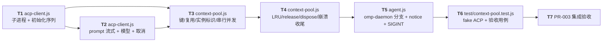

# PR-003 任务图：context-pool + acp-client + daemon 执行器

**来源输入**：`prs/pr-003-context-pool-acp-daemon.md`（文件范围 4 文件 / 验收 10 条 / batch 2 / depends_on pr-001）、`architecture.md` §6（含 §6.1 键与实例标识、§6.2 串行并发、§6.3 上限与淘汰、§6.4 释放与重启、§6.5 崩溃超时取消、§6.6 ACP 客户端细则）、§7.1~§7.4（模型优先级链 / 传递形态 / 错误面 / 审计）、§9.1（执行路径路由表）、§10.1~§10.3（核心数据流）、§12（AR-11/AR-12/AR-16）、§5.2（事件模型与 §5.3 推送链）、§14（为何必需两模块）、§16.1 pr-003 行、§16.2 批次 2、§17（fake ACP 集成层）、§18（R-1/R-2/R-9）、§19 裁决 3~6、`prd/F05-context-per-chat-agent.md`、`prd/F06-model-selection-default.md`、`prd/F08-baseline-compatibility-regression.md`
**生成角色**：planner（阶段 5）
**日期**：2026-09-10
**修订记录**：初版。

## 范围声明

- 任务图覆盖 PR-003 文件范围 **4 个文件**：`oamp/src/acp-client.js`（新建）、`oamp/src/context-pool.js`（新建）、`oamp/src/agent.js`（改造）、`oamp/test/context-pool.test.js`（新建）。
- **不接线 web**：`GET /api/stream`、`POST /api/chats/:id/close` 的 web→agent `notice{context_release}` **发送侧**、`onDeliver` 收 `task.update`/`task.result`/`notice` 后 `publish`、前端提示条全部归 pr-004（§16.1 pr-004 行、§9.3）。本 PR 交付的是**受理侧与被叫契约**（agent 能收 `notice` 并释放；能发 `notice` 供 web 转发），本 PR 不修改 `oamp/src/web.js`、`oamp/web/*`、`oamp/test/web.test.js`。
- **不改 router/registry**：`router.js` 的 `VALID_TYPES` 已含 `notice`（`src/router.js:23`），`task.update`/`task.result` 投递语义与任务表沿用 0010（§9.3「不动（回归边界）」）；本 PR 零改动这两个文件。
- **不引入依赖**：仅 `node:` 内置（`child_process`/`crypto`）；`package.json` 保持 `dependencies: {}`（由既有 `test/hygiene.test.js` 静态断言）。
- **既有测试不修改**：`oamp/test/` 现有 14 个 `*.test.js` 中，本 PR 只新增 `context-pool.test.js`，其余 13 个（含 `web.test.js`，其重写归 pr-004）**原样保持**（F08-3 口径，§19 裁决 2）。
- **不做**：TTL 回收、`session/load` 上下文恢复、ACP 工具权限应答、模型清单接口、跨 chat 上下文共享、过程增量落库（§16.4 明确不在本迭代范围）。
- **不可在本 PR 验收的判据**：E-3（重启后历史可查，需 pr-004 落盘链）、E-4（终态前 ≥2 个 `task_update`，需 pr-004 的 SSE 接线）、E-5（库中仅两类记录，需 pr-004 落盘点）、端到端时延 ≤200ms（§5.3）——归 pr-004/pr-005。

## 依赖图

- **关键路径（最长依赖链）**：`T1 → T2 → T3 → T4 → T5 → T6 → T7`（7 个任务、6 条边）；关键任务 = T3（池是 F05 全部验收的载体）、T5（唯一把模块接进可观测链路的任务）、T6（全部判据的取证载体）。
- **同文件串行**：T1/T2 同落 `src/acp-client.js`，T3/T4 同落 `src/context-pool.js`，故各自按编号顺序单线落笔（不并行编辑同一文件，防交叉覆盖）；两文件之间 T2 → T3 是真实的接口依赖（池消费客户端）。
- **无环确认**：全部依赖边从被依赖任务指向依赖任务；T7 为唯一汇点，无回边、无环。

## 任务清单

### T1 — src/acp-client.js：子进程生命周期与初始化序列

**描述**：新建 `AcpClient`：`spawn(OAMP_OMP_BIN || 'omp', ['acp','--no-skills','--no-rules','--no-tools','--no-session', ...(model ? ['--model', model] : [])])`，按行 JSON-RPC 2.0 收发；初始化序列 `initialize{protocolVersion:1}` → `session/new{cwd,mcpServers:[]}` → **等待静默**（无任何通知 ≥300ms 或硬上限 5s）；暴露 `pid`/`sessionId`；进程异常退出（非 `kill()`/`dispose()` 主动终止）→ 回绝全部在飞请求并触发 `onExit`；`kill()` = SIGTERM → 500ms 未退则 SIGKILL。**不实现** prompt 流式与模型设置（T2）。

**涉及文件**：`oamp/src/acp-client.js`（新建）
**优先级**：P0（T2/T3 的共同前置）
**前置依赖**：无
**验收标准**（可测试 / 可追溯）：
1. 启动参数固定集：`acp` + `--no-skills --no-rules --no-tools --no-session`，`model` 非空时追加 `--model <model>`（§6.6 启动参数小节 + §12 AR-16「另：`--no-session`」；载体 = T6 用例 1/11 的 fake 侧 argv 记录）。
2. 初始化序列为 `initialize{protocolVersion:1,...}` 后 `session/new{cwd: process.cwd(), mcpServers: []}`，两者均为请求-响应并各自有请求超时（缺省 10s；超时 → 初始化失败并 kill）；`sessionId` 暴露自 `session/new` 响应。（§6.6「初始化序列」+ AR-16「初始化等待」；载体 = T6 全部用例的前置成功 + 用例 6 的失败面）。
3. 初始化等待满足「静默 300ms 或上限 5s」：`session/new` 响应后，收到通知即重置静默计时；300ms 无通知即返回，无论如何不超过 5s。（§6.6 + AR-16 + §18 R-4；载体 = T6 用例 1——fake 在 `session/new` 后补发 2 条初始化通知，用例断言仍能正常首轮 prompt）。
4. 进程异常退出：在飞请求以错误码 `context_crashed` 回绝，且 `onExit(err)` 被调用恰好一次；`dispose()`/`kill()` 引起的退出不触发 `onExit` 语义（§6.5 首行「ACP 子进程异常退出」；载体 = T6 用例 9/10）。
5. `kill()` 的 SIGTERM → 500ms → SIGKILL 收尾与 0010 既有 kill 模式一致（§6.5 末行「释放/关闭」；载体 = T6 用例 9 的进程消亡断言）。
6. `[model_inferred→待主 agent 确认 MI-10]`：启动参数含 `--no-session`（§6.6 明文列出，PR 卡「上下文摘要」与简报的实现要点措辞未列该 flag）——取 §6.6 定稿。

### T2 — src/acp-client.js：prompt 流式、模型设置与取消

**描述**：实现 `prompt(text, { model, timeoutMs, onChunk })`：目标模型与当前 session 生效模型（`currentValue`）不同 → `session/set_config_option{sessionId, configId:'model', value}`，**失败即该轮 `model_unavailable` 且不回退**；随后 `session/prompt{sessionId, prompt:[{type:'text', text}]}`，逐条 `session/update` 中 `update.sessionUpdate==='agent_message_chunk'` 且 `content.type==='text'` 的文本回调 `onChunk`；响应到达返回 `{text, model, stop_reason, usage, context_id, pid}`；超时 → `session/cancel` 通知 → 等 ≤2s → 仍未收尾则 kill 并以 `timeout` 失败。

**涉及文件**：`oamp/src/acp-client.js`（同一文件，承接 T1 的行协议与 pending 表）
**优先级**：P0
**前置依赖**：T1
**验收标准**（可测试 / 可追溯）：
1. 增量取 `update.sessionUpdate==='agent_message_chunk'` 且 `content.type==='text'` 的 `text` 逐块回调，其余 update 类型忽略；最终 `text` = 各块拼接。（§6.6「prompt」+ §5.3 推送链首跳；载体 = T6 用例 1 的 `task.update` 序列与 `task.result.text`）。
2. `session/prompt` 的请求-响应给出 `stopReason`，客户端组装 `{text, model, stop_reason, usage?, pid}`，由池层补 `context_id` 后随每轮 `task.result` 上报（形状 = `{text, model, stop_reason, usage?, context_id, pid}`）。（§6.6「结果组装」；载体 = T6 用例 1/2 的 `task.result` 字段断言）。
3. 模型设置：目标模型与 `currentValue` 不同（含首轮 `currentValue` 缺失/不一致，见 MI-7）→ `set_config_option`；返回 JSON-RPC error → 该轮以 `model_unavailable` 失败、**不**改用默认模型、**不**重建进程（后续轮次仍可用）。（§6.6 模型行 + §7.3 + F06-4；载体 = T6 用例 8）。
4. 生效模型回读：成功轮次的 `model` 值取自 ACP 侧 `currentValue`（`session/new` 或 `set_config_option` 响应中的 `configOptions.model.currentValue`），不是请求回显。（§7.4 审计形态；载体 = T6 用例 8 的 `task.result.model` 断言）。
5. 超时路径：`timeoutMs` 到期 → `session/cancel` 通知 → 等 ≤2s → 收不到收尾响应则 kill 进程并以错误码 `timeout` 失败（kill 后该 session 不可复用）。（§6.5 第 2 行；载体 = T6 用例 10）。
6. 静态：`src/acp-client.js` 只 import `node:` 内置与（如需要）`src/` 内的错误码常量模块；不 import `context-pool.js`/`agent.js`/`web.js`（§14 模块边界；静态核查）。

### T3 — src/context-pool.js：键、懒创建、实例标识与串行/并发

**描述**：新建 `ContextPool`：`Map<key = \`${chatId}::${agentId}\`, ContextSession>`；`getOrCreate(chatId, agentId, {model, origin})` 懒创建（首次调用时建 `AcpClient` 并完成初始化）；`ContextSession.prompt(text, {model, timeoutMs, onChunk, origin})` 同键 **FIFO 串行**（单 in-flight + 队列，队列上限 8，超出立即 `context_busy` 失败）；**异键并发**；实例标识 `context_id = 'ctx-<pid>-<generation>'`（generation = 进程内创建序号）与 `pid` 随结果透出；排队轮次的 `timeoutMs` 从**实际开始执行**时计时。

**涉及文件**：`oamp/src/context-pool.js`（新建）
**优先级**：P0（T4/T5 的前置）
**前置依赖**：T1、T2
**验收标准**（可测试 / 可追溯）：
1. 复用：同 `(chatId, agentId)` 的两轮落在同一 `AcpClient`（同 `pid`）与同一 ACP session；两轮结果 `context_id`/`pid` 相等（E-1 后半 / F05-2 判据）；上下文累积（第二轮回答含首轮设定值，E-1 前半 / F05-1）。（§6.1 复用行 + §12 AR-11；载体 = T6 用例 1）。
2. 隔离：新 `chatId` → 新键 → 新 `AcpClient`（新 `pid`），其回答不含旧 chat 的设定值（E-2 / F05-3）；不同 `agentId` 不共享（F05-4）。（§6.1 隔离行；载体 = T6 用例 2/3）。
3. 同键串行：上一轮 `prompt` 未结束时，下一轮不开始（fake 侧可观察轮次不重叠）；队列上限 8——第 9 个排队轮次立即以 `context_busy` 失败（不进入队列、不占用 ACP）。（§6.2 第 1/2 段 + AR-11；载体 = T6 用例 4/5）。
4. 异键并发：两个不同 `chatId` 的轮次同时在飞（fake 侧观察两进程并发窗口重叠）。（§6.2 第 3 段；载体 = T6 用例 6）。
5. 排队计时：排队轮次的超时从真正开始执行时起算（排队等待不消耗 `timeoutMs`）。（§6.2 第 4 段；载体 = T6 用例 5 的排队轮次全部成功）。
6. `context_id` 形如 `ctx-<pid>-<generation>`，与 `pid` 一并出现在每轮结果中（generation 单调递增，重建后变大）。（§6.1 实例标识行；载体 = T6 用例 1/9）。
7. `[model_inferred→待主 agent 确认 MI-5]`：队列上限的计数口径 = **等待中的轮次数**（不含在飞轮次），即同键最多「1 在飞 + 8 排队」——§6.2 只写"队列上限 8"，未定义在飞轮次是否计入。

### T4 — src/context-pool.js：LRU 淘汰、释放与崩溃/超时收尾

**描述**：全局上限 `max`（来自 `config.contextMax`）：新键创建前若 `map.size >= max` → **LRU 淘汰最久未使用**的键（`kill` 子进程 + 移除键 + 发 `notice{kind:'context_reset'}`）；`release(chatId)` → 释放该 chat 全部键（kill + 移除 + `notice{kind:'context_released'}`）；`dispose()` → 全部 kill + 清空（不发提示）；ACP 子进程异常退出 → 在飞轮次以 `context_crashed` 失败 + 移除键 + `notice{kind:'context_reset'}`，下轮同键重建（新 `context_id`/`pid`）；prompt 超时 → 同上按 `context_reset` 提示收尾。

**涉及文件**：`oamp/src/context-pool.js`（同一文件）
**优先级**：P0
**前置依赖**：T3
**验收标准**（可测试 / 可追溯）：
1. LRU：超过 `max` 时淘汰最久未使用键（kill 其子进程）并向该键最近发起者发 `notice{kind:'context_reset'}`；被淘汰 chat 的后续提问重建新键（新 `context_id`/`pid`）。（§6.3 第 1/3 段 + F05-7 + §10.3；载体 = T6 用例 7）。
2. 不主动 TTL：无访问的键在未超上限时不被回收（无定时器语义）。（§6.3 第 2 段「不主动 TTL 回收」；载体 = T6 用例 7 的"未超上限不淘汰"断言）。
3. 崩溃重建：ACP 异常退出 → 在飞轮次 `task.result{state:'failed', error:'context_crashed'}` + `notice{kind:'context_reset'}`；**下一轮同键重建**，`context_id`/`pid` 随之改变。（§6.5 第 1 行 + §10.3；载体 = T6 用例 9）。
4. 释放：`release(chatId)` 释放该 chat 的**全部**键（多 agent/多键语义）并 kill 进程；chat 关闭导致的在飞轮次失败码沿用 `context_crashed`（**不另立**错误码）。（§6.4 第 1/3 行 + AR-12 + §5.2 命名区分；载体 = T6 用例 11）。
5. `dispose()` 全部 kill 并清空池；之后 `getOrCreate` 不因残留状态报错（键可重建）。（§6.4 末行 + PR 卡 SIGINT 条；载体 = T6 用例 12）。
6. 提示寻址：`notice` 发往该键最近一轮的发起者（`from.instance_id`）。（§10.3「agent 发 notice」未定寻址，取"最近发起者"；载体 = T6 用例 7/9 的 fake web 收件断言；见 MI-1）。
7. `[model_inferred→待主 agent 确认 MI-3/MI-4/MI-8]`：崩溃时同键队列中已排队的其余轮次一并以 `context_crashed` 失败（§6.5 只定义"在飞轮次"）；LRU 淘汰命中"有在飞轮次"的键时，该轮以 `context_crashed` 失败且**不重复**发提示（淘汰本身已发 `context_reset`）；主动 kill 与异常退出在飞轮次均用 `context_crashed`（§6.4 明文「错误码沿用 `context_crashed`」）。
8. `[model_inferred→待主 agent 确认 MI-2]`：`release()` 由 agent 侧**回发** `notice{kind:'context_released'}`（SSE 侧 kind）供 web 直接转发——§10.2 流程未明示该提示由 agent 还是 web 产生；若 pr-004 在关闭时自行 publish，则会重复提示（需主 agent 裁定归属）。

### T5 — src/agent.js：omp-daemon 分支 + notice 处理 + SIGINT dispose

**描述**：改造 `agent.js` 三处：① `parseTaskBody` 增 `executor === 'omp-daemon'` 分支（`{executor:'omp-daemon', chat_id, prompt, model?}`；`chat_id` 必填非空、`model` 匹配 `^[A-Za-z0-9._/-]{1,128}$`，不合法 → `{ok:false, reason}` → 既有 ack rejected 路径）；② 新增 `runDaemonTask`（模型解析链 `payload.model > config.defaultModel`，池轮次 → chunk 回流 `task.update` → 终态 `task.result{state, text, model, context_id, pid, ...}`）；③ `createTaskDeliverHandler` 增 `notice` 类型处理（`payload.kind==='context_release'` → `pool.release(chat_id)`，自动 ack accepted）；④ SIGINT 优雅退出流程后 `pool.dispose()`。既有 `executor:'omp'`（一次性）与 shell 分支保持逐字不变。

**涉及文件**：`oamp/src/agent.js`（改造）
**优先级**：P0（唯一把模块接进可观测链路的任务）
**前置依赖**：T2、T3、T4
**验收标准**（可测试 / 可追溯）：
1. 受理面：`{executor:'omp-daemon', chat_id, prompt, model?}` 被受理并执行；缺 `chat_id`（或空/非字符串）→ ack rejected；`model` 不匹配 `^[A-Za-z0-9._/-]{1,128}$` → 拒收；空 prompt → 拒收。（PR 卡验收 8 + §7.2 校验行 + §9.1 末段；载体 = T6 用例 13）。
2. 终态：成功轮 `task.result{state:'completed', text:<完整回答>, model:<生效模型>, context_id, pid, exit_code:0}`；失败轮 `state:'failed'` + `error`（`context_busy`/`context_crashed`/`model_unavailable`/`timeout` 之一）+ 可读 `text`。（§6.6 结果组装 + §7.3 错误面 + PR 卡验收 1/3/4/5/6；载体 = T6 用例 1/4/7/8/9/10）。
3. 流式：每 chunk 一条 `task.update{state:'working', kind:'chunk', text}`（经 Router 投递到发起者，不入库语义沿用 0010）。（§5.3 推送链 + §5.2 事件模型 kind 取值；载体 = T6 用例 1 的 updates 断言；见 MI-6）。
4. 模型链：`payload.model` > `OAMP_OMP_MODEL`（已由 `config.defaultModel` 折叠）> 内置默认；**每轮独立解析**，一轮显式指定不影响同 chat 后续未指定轮次（回到默认）。（§7.1 + F06-2/3；载体 = T6 用例 8）。
5. `notice{kind:'context_release', chat_id}` 被受理 → 释放该 chat 键（ack accepted，不执行任务）；其他/残缺 notice 不误伤（不释放、不报错）。（§6.4 第 1 行 + §5.2 命名区分；载体 = T6 用例 11）。
6. SIGINT：`pool.dispose()` 被调用（全部常驻子进程被 kill），agent 既有退出流程（停心跳 → deregister → 退出 0）不变。（§6.4 末行 + PR 卡验收 9 + §6.2 既有语义；载体 = T6 用例 12）。
7. 不回归：`executor:'omp'`（`omp -p --no-session [--no-tools] [--model X] <prompt>`）与 shell（`command`+`args`）分支代码路径与行为不变；本 PR 不新增/修改这两条路径的任何分支。（§9.1 路由表 + F08-1/2 + §16.1；载体 = T6 用例 14 + 既有 `omp-executor.test.js`/`task.test.js`/`delivery-contract.test.js` 原样全绿）。
8. 静态：`agent.js` 新增代码只消费 `loadConfig()` 既有键 `defaultModel`/`contextMax`（pr-001 已交付），不新增配置键；文件范围止于本 PR 的 4 个文件。（§8.5 + PR 卡 depends_on；静态核查）。

### T6 — test/context-pool.test.js：fake ACP 注入与 PR-003 验收用例

**描述**：新建单测文件：造 fake ACP 脚本（node，CJS，实现 `initialize`/`session/new`/`set_config_option`/`session/prompt` 的按行 JSON-RPC + **per-sessionId 记忆** + 流式 chunk 输出 + 可编排的崩溃/慢响应/挂起/未知模型失败模式 + `-p` 一次式分支），经 `OAMP_OMP_BIN` 注入真实 agent 子进程（复用 `test/helpers/harness.js` 的 `startRouter`/`startAgent`/`waitFor`），以注册的假 web 节点（`createClient`）发 `task.request`/`notice` 并断言 `task.result` 与收到的 `notice`。逐条覆盖 T1~T5 的可观察断言；不依赖真实 omp/外网、不写真实 `oamp/data/`。

**涉及文件**：`oamp/test/context-pool.test.js`（新建）
**优先级**：P0
**前置依赖**：T5
**验收标准**（可测试 / 可追溯，`node --test test/context-pool.test.js` 单独全绿）：
1. **E-1/F05-1/F05-2（T3-1）**：同 chat 两轮（"请记住数字 42，只回复『记住』" → "数字是多少"）→ 第二轮回答含 `42`；两轮 `task.result` 的 `context_id` 与 `pid` 相等。
2. **E-2/F05-3（T3-2）**：新 chat 问"数字是多少" → 回答不含 `42`，且 `context_id`/`pid` 与旧 chat 不同。
3. **F05-4（T3-2）**：同 chat 两个不同 agent（两 agent 进程）→ 各自独立、互不串扰。
4. **F05-3 串行（T3-3/T3-5）**：同键连续轮次不重叠（fake 记录每轮起止时间戳，断言区间不相交）；排队轮次全部成功。
5. **队列上限 8（T3-3 / §6.2）**：同键 1 在飞 + 8 排队被受理，第 10 个立即 `failed(context_busy)`（且该轮不产生 ACP 轮次）。
6. **异键并发（T3-4）**：两个 chatId 同时跑 → fake 侧并发窗口重叠（两轮同时在飞）。
7. **LRU + notice（T4-1/T4-2）**：`OAMP_CTX_MAX=2` 下建第 3 个 chat → 最久未用的 chat 被淘汰（其 fake 子进程消亡）、假 web 收到 `notice{kind:'context_reset'}`、该 chat 下轮重建（新 `context_id`/`pid`）；未超上限时不淘汰。
8. **未知模型（T2-3/T2-4）**：指定 fake 视为未知的模型 → 该轮 `failed(model_unavailable)`、**不回退**（任务不产生正常回答）；成功轮次 `model` 取自 ACP `currentValue`。
9. **崩溃重建（T4-3）**：fake 在第 N 次 prompt 时 exit(1) → 在飞轮 `failed(context_crashed)` + `notice{kind:'context_reset'}`；下轮重建（新 `context_id`/`pid`）。
10. **超时（T2-5）**：fake 挂起不响应 → 该轮 `failed(timeout)`、子进程被 kill、发 `notice{kind:'context_reset'}`。
11. **释放（T4-4/T5-5）**：假 web 发 `notice{kind:'context_release', chat_id}` → ack accepted、该 chat 子进程被 kill、假 web 收 `notice{kind:'context_released'}`；随后同键重建。
12. **SIGINT dispose（T5-6/T4-5）**：跑过一轮后对 agent 发 SIGINT → fake ACP 子进程消亡（`process.kill(pid,0)` 抛 ESRCH），agent 退出码 0。
13. **受理面（T5-1）**：缺 `chat_id`、空 prompt、非法 `model` 三类 → ack rejected（`MESSAGE_ACKED ... status=rejected`）。
14. **一次性路径不回归（T5-7）**：同 fake bin 下 `{executor:'omp'}` 走 `-p` 一次式（fake 记录 argv 含 `-p` 且不含 `acp`）→ completed；shell 分支照常。
15. 用例之间独立启停（每测试独立 router/agent/临时目录），无端口/文件/进程残留；`node --test test/context-pool.test.js` 独立全绿且不依赖外网。（§17「不依赖真实 LLM/外网」「不写真实 `oamp/data/sql.db`」）
16. `[model_inferred→待主 agent 确认 MI-9]`：一次性路径不回归用例复用同一 fake 脚本的 `-p` 分支（PR 卡参考写"`oamp/test/omp-executor.test.js`（fake omp 注入）"范式，未要求另建 fake）。

### T7 — PR-003 集成验收

**描述**：PR 级收口——`node --test test/context-pool.test.js` 与 `npm test` 一次同跑全绿，逐条对照 PR 卡 10 条验收标准取证，并核查文件范围与"既有测试未被修改"事实。产出通过记录供独立 verifier 复核与 merge 决策。

**涉及文件**：无新增（核查面：`oamp/src/agent.js` 的改动 diff、`oamp/package.json` 无依赖变更、`oamp/test/` 其余 13 个文件的"未改动"事实）
**优先级**：P0
**前置依赖**：T6
**验收标准**（可测试 / 可追溯，逐条对应 PR 卡「验收标准」10 条）：
1. `oamp/` 下 `node --test test/context-pool.test.js` 全绿；`npm test`（`node --test test/*.test.js`）全绿——含既有 13 个测试文件原样通过（PR 卡验收 10 + 验收 9 的回归面 + F08-3；运行核查）。
2. 逐条对照 PR 卡验收 1~9（E-1 记忆与实例标识 / E-2 与多 agent 隔离 / 串行与队列上限 8 与异键并发 / LRU 与 `context_reset` / 崩溃 `context_crashed` 与重建 / 未知模型 `model_unavailable` 与 `currentValue` 审计 / 模型优先级链与切换不丢上下文 / 受理面拒收 / 一次性路径不回归 / SIGINT dispose）——每条给出用例编号与断言证据（运行核查 + T6 记录）。
3. 文件范围核查：本次改动仅 `oamp/src/acp-client.js`（新）、`oamp/src/context-pool.js`（新）、`oamp/src/agent.js`（改）、`oamp/test/context-pool.test.js`（新）与本任务图文档；`git status` 无其他改动；`package.json` 无依赖变更（PR 卡「文件范围」；git 核查）。
4. 边界核查：`web.js`/`web/*`/`web.test.js`/`router.js`/`registry.js` 未被修改；`agent.js` 中 `executor:'omp'` 与 shell 分支无 diff（§16.1 边界 + F08；`git diff` 静态核查）。
5. 注：E-3/E-4/E-5 与端到端时延判据**不在本 PR 验收**（需 pr-004 的 web/SSE 接线与 pr-005 的端到端），本 PR 以模块级行为（chunk 回流、终态字段、notice 投递）为其前置保证（§16.2 跨批次不并行）。

## model_inferred 汇总（需主 agent 确认）

| # | 任务 | 推断内容 | 追溯基础 |
|---|---|---|---|
| MI-1 | T4 | `notice` 的寻址 = 该键**最近一轮的发起者**（`lastOrigin`，取自 `task.request` 的 `from.instance_id`）——§10.3 只写"agent 发 `notice`"，未定义目标 | §10.2/§10.3 流程 + §5.2 notice 事件模型 |
| MI-2 | T4/T5 | chat 关闭释放后由 **agent 回发** `notice{kind:'context_released'}`（SSE 侧 kind）供 web 转发——§10.2 流程未明示该提示的产出方；若 pr-004 在关闭时自行 publish 会重复提示 | §6.3 末段「提示触发点只有两个」+ §5.2 命名区分 + PR 卡「实现要点」release 行 |
| MI-3 | T4 | 崩溃时同键队列中已排队的其余轮次一并 `context_crashed` 失败（§6.5 只定义"在飞轮次"） | §6.5 第 1 行 + §6.2 队列语义 |
| MI-4 | T4 | LRU 淘汰命中"有在飞轮次"的键：该轮以 `context_crashed` 失败且不重复发提示（淘汰已发一次 `context_reset`） | §6.3 + §6.5 交叠处未定义 |
| MI-5 | T3 | 队列上限 8 的计数口径 = 等待中轮次数（同键最多 1 在飞 + 8 排队） | §6.2 第 2 段 |
| MI-6 | T5 | 增量 `task.update` 取 `{state:'working', kind:'chunk', text}`（§5.2 事件模型）而非简报措辞 `kind:'stream', line` | §5.2 事件模型表 + §5.3 推送链 |
| MI-7 | T2 | 首轮也做"目标模型 vs `currentValue`"比对：不一致或 `currentValue` 缺失 → 该轮先 `set_config_option`（保证未知模型在首轮即 `model_unavailable`） | §6.6 模型行 + §7.3「可在 prompt 前失败」（V-7） |
| MI-8 | T4 | 主动 kill（LRU/释放/`dispose`）与异常退出，在飞轮次错误码均为 `context_crashed` | §6.4 第 3 行明文 |
| MI-9 | T6 | 一次性路径不回归用例复用同一 fake 脚本的 `-p` 分支（不另建 fake omp） | PR 卡参考资料 + §17 |
| MI-10 | T1 | daemon 启动参数含 `--no-session` | §6.6 启动参数小节 + §12 AR-16 |

## 开放项（不阻断本 PR，报告主 agent）

- **O-1（同文件多任务）**：T1/T2 同落 `src/acp-client.js`，T3/T4 同落 `src/context-pool.js`。任务图按"可独立验收的行为切片"拆分，实现按编号单线落笔，不并行编辑同一文件。
- **O-2（接线归 pr-004）**：`notice{context_release}` 的**发送方**（web 关闭 chat 时）、SSE `/api/stream` 订阅、`onDeliver` → `publish`、前端提示条均归 pr-004；本 PR 交付受理侧（agent 收 `notice` 释放）+ 产出侧（agent 发 `notice` 等 web 转发）。
- **O-3（不可在本 PR 验收的判据）**：E-3/E-4/E-5、端到端 ≤200ms（§5.3）、F04-7 断线兜底（§5.4）、F05-7 的"前端提示条可见"（用户可见面）——需 pr-004/pr-005 全链路。
- **O-4（进程级副作用）**：常驻子进程在 agent 进程被 SIGKILL（非 SIGINT）时不会被回收（`dispose()` 只在优雅退出/SIGINT 路径触发，§6.4）；这是架构已接受的边界（§18 R-1/R-3），本 PR 不额外引入父进程死亡看门狗。
- **O-5（`--no-session` 的实测覆盖）**：本 PR 的自动化用例经 fake ACP 注入，`--no-session` 等真实 flag 由架构 V-12 实测背书（§6.6）；上线前默认模型复测（§7.5 第 4 条）属用户手工项，不在本 PR 自动化范围。
