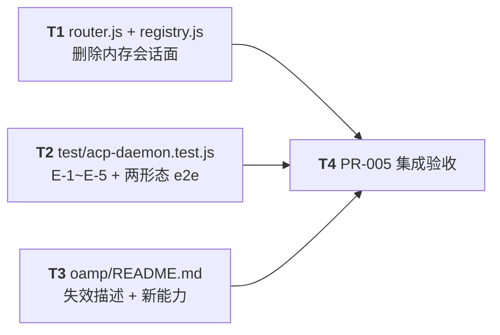

# PR-005 任务图：会话面清理 + 端到端契约验收 + 文档同步

**来源输入**：`prs/pr-005-cleanup-e2e-and-docs.md`（文件范围 4 文件 / 验收 7 条 / batch 4 / depends_on pr-001~004）、`architecture.md` §9.3（删除清单与「不动（回归边界）」）、§12 AR-15、§16.1 pr-005 行、§16.4（排除项）、§17（测试策略：端到端层 = harness 起 Router + agent + `oamp web`，随机端口 + 临时 `OAMP_DB` + fake ACP）、§18 R-13/R-14、§19 裁决 2（F08-3 口径）+ 裁决 3（提示不入库）、`prd/F08`（验收 3 新口径 + a~d 等价项，本 PR 只取验收 1/2/3）、F01/F02/F03/F05
**生成角色**：planner（阶段 5）
**日期**：2026-09-10
**修订记录**：初版

## 范围声明

- 任务图覆盖 PR-005 文件范围 **4 个文件**：`oamp/src/router.js`（删 3 个 case）、`oamp/src/registry.js`（删 2 张会话表 + 5 个函数 + 6 个导出项）、`oamp/test/acp-daemon.test.js`（新建）、`oamp/README.md`（更新）。
- **删除面为一个原子任务**：`router.js` 的 `chat_*` case 是 `registry.js` 会话函数的唯一调用者，registry 会话函数是这些 case 的唯一实现体。**分两半落笔会留下"可编译但调用即 TypeError"的中间态**（router 的 case body 惰性引用 registry 成员，不落笔即不报错，但语义已死），故合并为 T1 一次落笔、一次验收。
- **保留面（不在删除任务内）**：`registry.createTask` 的 `messageId = null` 形参（`registry.js:182`）、`router.js` 的 `messageId: m.message_id` 实参、任务条目 `message_id` 字段（`registry.js:190`）——依据 PR 卡验收 2 / §9.3「不动（回归边界）」明列「Router 任务表与 `oamp task` CLI」/ §16.4「Router 任务表改造」明确排除。删除该字段会改变 `router.task_get` 的输出形状（协议可见面，被 `oamp task status/list` 消费）。**只删 `tasksByMessage` 映射（`registry.js:198` 的写入行随表消失）**。
- **其余既有测试文件零修改**：本 PR 只**新增** `test/acp-daemon.test.js`；`test/` 下现有 15 个 `*.test.js`（含 pr-004 重写后的 `web.test.js`）**一字不改**。PR 卡验收 3 的「其余 10 个既有测试文件」= 0010 基线集合（`agent-heartbeat`/`cli`/`delivery-contract`/`event-log`/`hygiene`/`omp-executor`/`reconnect`/`router-registry`/`status`/`task`）；pr-001~003 新增的 4 个模块测试与 pr-004 的 `web.test.js` 同属"既有"（§19 裁决 2 口径：除 `web.test.js` 等价重写外全部原样）——本 PR 对全部 15 个文件零修改，两种口径同时满足。
- **零新依赖**：`package.json` 不变（`test/hygiene.test.js` 静态断言 `dependencies:{}`）；e2e 的 fake ACP 源码内联在 `test/acp-daemon.test.js` 内（不新增 `test/helpers/` 文件），复用 `test/helpers/harness.js` 的 `startRouter`/`startAgent`/`waitFor`/`stopAll`/`buildEnv` 既有范式。
- **不做**：真实 LLM 端到端（§17 手工层）、单 chunk ≤200ms 时延预算（§5.3 设计预算）、`oamp task` CLI / Router 任务表改造（§16.4）、`web.js`/`web/*` 改动（pr-004 已收口）、文档新增（R-14：只更新既有 `oamp/README.md`，不新增文档）。
- **不可在本 PR 验收的判据**：无（本 PR 是本迭代末位收口，E-1~E-5 全部在此端到端判定）。

## 依赖图

- **关键路径（最长依赖链）**：`T2 → T4`（3 任务、3 条边，深度 2）。T1/T2/T3 文件不相交（`src/` vs `test/` vs `README.md`），互相零依赖——图按单线编号执行以满足 T4 的取证前提（T4 需要三者全部落笔）。
- **关键任务**：**T2**（E-1~E-5 的唯一取证载体，本迭代验收的收敛点）、**T4**（删除面零残留 + "其余测试未被修改"两条静态判据的唯一核查点）。
- **无环确认**：三条边均由被依赖任务指向 T4（唯一汇点），无回边、无环。

## 任务清单

### T1 — src/router.js + src/registry.js：删除 Router 内存会话面（clean cutover）

**描述**：删除 `router.chat_message`/`router.chat_get`/`router.chat_list` 三个 case；删除 `registry.js` 的 `chats`/`tasksByMessage` 两张内存表、`createChat`/`appendChatMessage`/`getChat`/`chatDetail`/`listChats` 五个函数、以及返回对象里的 6 个导出项（`createChat`/`appendChatMessage`/`getChat`/`chatDetail`/`listChats`）与 `tasksByMessage.set` 写入行；同步删除 `registry.js:39-42` 的会话表注释块。**保留** `createTask` 形参 `messageId`、任务条目 `message_id` 字段、router 侧实参（同 PR 文件/提交信息记录其此后失去唯一读者）。

**涉及文件**：`oamp/src/router.js`（删 3 case）、`oamp/src/registry.js`（删表 + 函数 + 导出 + 注释）
**优先级**：P0（本 PR 的删除面主体）
**前置依赖**：无
**验收标准**（可测试 / 可追溯）：
1. `oamp/src/router.js` 中 `chat_message`/`chat_get`/`chat_list` 三个 `case` 整体删除；`.runtime`/`rpc`/任务表/`router.status`/`router.task_get`/`router.task_list` 等其余方法面逐字不变（§9.3「删除」第 1 条；载体 = 静态核查 + `test/router-registry.test.js`/`test/task.test.js` 全绿）。
2. `oamp/src/registry.js` 中 `chats`（:40）/`tasksByMessage`（:42）两张表与 `createTask` 内的 `tasksByMessage.set(messageId, task)` 写入行删除；`createChat`：265~`listChats` 止于 :335 的整块删除；`:356-360` 五个导出项删除（§9.3「删除」第 2 条 + PR 卡文件范围；载体 = 静态核查）。
3. **保留面原样**：`createTask({ taskId, from, to, now, label, messageId = null })` 形参、任务条目 `message_id: messageId` 字段、`router.js` 的 `messageId: m.message_id` 实参三处**逐字不动**（PR 卡验收 2 + §9.3「不动」+ §16.4；载体 = diff 中这三处零改动）。残留事实（该字段失去唯一读者）在 PR 文件与提交信息中如实记录（PR 卡验收 2 末句）。
4. **删除面零残留**（PR 卡验收 1）：`oamp/` 全仓（`src/`、`web/`、`test/`）grep 以下模式 **零命中**：`chat_message`、`chat_get`、`chat_list`、`appendChatMessage`、`chatDetail`、`tasksByMessage`、`registry.createChat`、`registry.getChat`、`registry.listChats`。**范围说明（见 MI-4）**：`getChat`/`listChats` 两个名字在 pr-001 新建的持久层 `src/persist.js` 中**合法存在**（库读口，被 `web.js` 消费），故"零残留"按**归属**核查（`registry.` 前缀 + RPC 方法名），不按裸名。
5. `node --test test/router-registry.test.js test/task.test.js test/delivery-contract.test.js test/server*.test.js` 全绿（删除面无既有消费者；实测基线 = 全量 140/140，删除后应保持）；被删 case 若被任何既有测试引用 → 证据为"引用不存在"（现行 15 个测试文件对 `chat_*`/registry 会话函数的引用数为 0）。
6. `src/router.js` 的 `isValidInstanceId`/`isValidMessageId`/`newSessionId` import 与其余用例（`validateSendMessage`、register、task_get/task_list）保持（删除面不产生孤儿 import；载体 = 静态核查 + 服务启动 `ROUTER_READY`）。

### T2 — oamp/test/acp-daemon.test.js：跨进程端到端契约（E-1~E-5 + F08-1/2）

**描述**：新建 e2e 测试文件：`harness.startRouter()` + `harness.startAgent('dev-1', {OAMP_OMP_BIN: fake})` + `oamp web start --port <随机>`（临时 `OAMP_DB`）；fake ACP 内联本文件（`acp` 常驻 JSON-RPC + `-p` 一次性双形态 + per-session 记忆 + ≥2 chunk 分片 + argv 观测）。覆盖 E-1（同 chat 两轮记忆 42 + 同实例标识）/E-2（新 chat 隔离）/E-3（重启 web 后历史可查）/E-4（终态前 ≥2 个 `task_update` 且文本递增）/E-5（库中该 chat 恰两类记录）与 F08-1/2（`!` shell 与显式 `one_shot` 两形态不回归、不累积/不复用上下文）。**不依赖真实 omp / 真实 LLM / 外网**，不写真实 `oamp/data/sql.db`。

**涉及文件**：`oamp/test/acp-daemon.test.js`（新建）
**优先级**：P0（本迭代 E-1~E-5 的唯一取证载体）
**前置依赖**：无（文件不相交；实现上以 pr-001~004 的产物为运行前提，均已合并入 worktree 基线）
**验收标准**（可测试 / 可追溯，`node --test test/acp-daemon.test.js` 单独全绿）：
1. **E-1**：同一 chat 两轮（轮 1「请记住数字 42」→ 轮 2「数字是多少」）后，轮 2 的 `out.text` 含 `42`，且两轮 `out.meta.context_id` 相等、`out.meta.pid` 相等（F05-2 / §6.1 / AR-11；载体 = 用例 1 + REST 详情读回）。
2. **E-2**：同 agent 的新 chat 首轮问「数字是多少」→ `out.text` **不含** `42`（F05-3；载体 = 用例 2）。**加固**：新 chat 自己累积（其轮 1 记住 7 → 轮 2 答 7），证明隔离不是"永远失忆"（对应 `context-pool.test.js` 既有口径，见 MI-2）。
3. **E-3**：同一 `OAMP_DB` 下重启 `oamp web` 子进程后，`GET /api/chats` 列表与 `GET /api/chats/:id` 详情**逐字段读回一致**（chat 行 + 消息行数与文本），且**直连 SQLite 读回**（`openDb`）与 REST 结果一致——证真源在库、不在进程内存（F02 / AR-04 / §4.2；载体 = 用例 3，见 MI-1）。
4. **E-4**：对既有 chat 先订阅 `GET /api/stream?chat_id=`，再提交该 chat 的第二轮；断言该轮 `message`(out) 之前已收到 **≥2 个** `task_update`（`kind==='chunk'`）且增量文本**递增**、拼接后等于终态落盘文本（§5.2/§5.3 + AR-09 + PR 卡验收 4；载体 = 用例 4）。
5. **E-5**：一次含多段增量的问答后，**直连 SQLite** `SELECT direction FROM messages WHERE chat_id=?` 恰 2 行且 `direction ∈ {in,out}`，过程零行；该断言覆盖"多 chunk 轮次 + 落盘恰两类"（F02-1/2/5 + §4.7 + PR 卡验收 4；载体 = 用例 1/4 收尾）。
6. **F08-1/F08-2 两形态不回归**（PR 卡验收 5 + F08 验收 1/2 + §9.1）：① `!echo …` → 走 shell，`out.text` 含命令输出，且该轮**不产生** ACP `acp` 启动记录；② 显式 `one_shot:true` → 走 `omp -p`，`out.text` 含一次性输出；③ **不累积/不复用**：daemon 轮记住 42 → 插一轮 `one_shot`（记住 7）与一轮 `!` 命令 → 再问 daemon「数字是多少」仍答 `42`（一次性/shell 的上下文不进入、也不复用常驻 chat 上下文）（见 MI-2）。
7. **节点带心跳**：Router/agent/web 以 `OAMP_HEARTBEAT_TIMEOUT_MS=3000`（`LEASE_ENV`）启动，避免 harness 的 300ms 租约把常驻发送方 `web` 判 offline 导致回传只记录不投递（范式 = `test/web.test.js:60`；依据 = 0011 实现期教训，PR 卡 §17 端到端层）。
8. 用例之间独立启停（每测试独立 Router/agent/web 子进程 + 独立临时 socket 目录 + 独立临时 `OAMP_DB`），无端口/文件/进程/数据库残留；不触碰仓库 `oamp/data/`；不依赖外网（§17「测试不得写真实 `oamp/data/sql.db`」）。

### T3 — oamp/README.md：删除失效描述 + 补新能力文档

**描述**：修正 R-14 点名的失效描述（"会话与消息存于 Router 内存（重启即清空）"、"executor `omp`（默认，Web 控制台走这条）"），补齐本迭代交付的能力面文档：SQLite 持久化与历史查询、SSE 实时事件、上下文规范（同 chat 累积 / 新 chat 隔离 / 关闭即释放）、执行路径三形态与默认切换、模型指定与默认 `openai/gpt-5.6-luna`、配置面（`oamp/config.json` 三键 + env 覆盖）。**依既有结构就地修改**（不新增文档，R-14 / §16.4）。

**涉及文件**：`oamp/README.md`（更新）
**优先级**：P1（文档一致性；不阻断功能验收）
**前置依赖**：无（描述的是 pr-004 已落地的行为面）
**验收标准**（可测试 / 可追溯）：
1. README 中不再出现"会话与消息存于 Router 内存"或"重启即清空"的**会话面**表述（PR 卡验收 7 + R-14；载体 = 静态核查）。**范围说明（见 MI-3）**：`oamp task` 一节的"任务与明细存于 Router 内存（Router 重启即清空）"描述的是 **Router 任务表**，该面本迭代按 §9.3「不动」保留、描述**属实**，不改写（改写它会与实现不符）。
2. 新增章节覆盖（PR 卡验收 7 明列 4 项 + 文件范围括注）：① 配置面 `oamp/config.json` 三键（`data.db`/`defaults.model`/`context.max`）与 env 覆盖（`OAMP_DB`/`OAMP_OMP_MODEL`/`OAMP_CTX_MAX`）+ 默认路径相对包根（§8 / AR-14）；② web API 与 SSE（`/api/chats`、`/api/chats/:id`、`POST /api/messages`、`POST /api/chats/:id/close`、`GET /api/stream` 与四类事件）（§4.5/§5.2 / AR-06/AR-08）；③ 上下文键与上限（per-`chat_id`+agent 常驻、同 chat 累积 / 新 chat 隔离、`OAMP_CTX_MAX` 默认 8 与 LRU 淘汰提示）（§6 / AR-11/AR-12）；④ 模型指定与默认（payload `model` > `OAMP_OMP_MODEL` > `config.defaults.model` > `openai/gpt-5.6-luna`）（§7.1 / AR-13）；⑤ 执行路径表更新为三形态（默认 `omp-daemon`；`one_shot:true` → `omp -p`；`!` → shell）（§9.1 / AR-15）；⑥ 关闭语义（释放上下文 + 只读 + 拒绝新输入 409 + 不重开）（§6.4 / AR-03）。
3. 文档与实现一致：README 中出现的 env 名/接口路径/默认值逐项可在 `src/config.js`、`src/web.js` 中找到对应（载体 = 静态核对，无"文档里的接口不存在"）。
4. 不新增文档文件、不改动 README 的历史章节结构（安全边界声明、卫生红线声明保留）（R-14「不在本迭代新增文档」）。

### T4 — PR-005 集成验收

**描述**：PR 级收口——`node --test test/acp-daemon.test.js` 与 `npm test` 一次同跑全绿；逐条对照 PR 卡 7 条验收标准取证；核查文件范围（改动仅 4 文件 + 本任务图文档）与"其余既有测试文件未被修改"（F08-3）。

**涉及文件**：无新增（核查面：`src/router.js`/`src/registry.js` 删除面 diff、`test/acp-daemon.test.js` 新增 diff、`oamp/README.md` diff、`test/` 其余 15 个文件的"未改动"事实、`package.json` 无依赖变更）
**优先级**：P0
**前置依赖**：T1、T2、T3
**验收标准**（可测试 / 可追溯，逐条对应 PR 卡「验收标准」7 条）：
1. `oamp/` 下 `node --test test/acp-daemon.test.js` 全绿；`npm test`（`node --test test/*.test.js`）全量通过（PR 卡验收 6；运行核查）。
2. 删除面零残留 grep 取证（PR 卡验收 1；T1-4 的模式集 + 归属口径）。
3. **其余 15 个既有测试文件未被修改**：`git diff --name-only` 中 `test/` 只出现新增的 `acp-daemon.test.js`（PR 卡验收 3 + F08-3 + §19 裁决 2；git 核查）。
4. 保留面取证：`createTask` 的 `messageId` 形参 / router 实参 / 任务条目 `message_id` 三处 diff 中零改动，且 PR 文件（或提交信息）含"失去唯一读者但保留（协议可见面）"的如实声明（PR 卡验收 2）。
5. 逐条对照 PR 卡验收 1~7 给出用例编号与断言证据（运行核查 + T2/T3 记录）；`package.json` 无变更。
6. 注：真实 LLM 端到端（§17 手工层）与单 chunk ≤200ms 时延预算（§5.3 设计预算）不在自动化验收内（§17 测试策略：所有自动化用例经 fake ACP）。

## model_inferred 汇总（需主 agent 确认）

| # | 任务 | 推断内容 | 追溯基础 |
|---|---|---|---|
| MI-1 | T2 | E-3 的取证形态 = "重启 web 后 REST 读回一致" **外加**"直连 SQLite 读回（`openDb`）与 REST 一致"。PR 卡原文只写"重启 web（或重开库）后历史 chat 与消息可查（读 SQLite）"，两句为"或"关系；本任务取**两者都做**以同时覆盖"进程外读回"与"库为真源"两层，判据强度高于原文要求 | PR 卡验收 4 原文「重启 web（或重开库）后列表与详情读回一致」+ §4.2「历史真源 = SQLite」 |
| MI-2 | T2 | F08-1/F08-2 的**端到端取证脚本**：daemon 轮记住 42 → 插 `one_shot` 轮（记住 7）与 `!` 命令轮 → 再问 daemon「数字是多少」仍答 42；其中"新 chat 自己累积"为 E-2 的加固断言。PR 卡只写"两者行为与 0010 一致且不累积/不复用上下文"，未定义取证脚本 | PR 卡验收 5 + F08 验收 1/2 + §9.1 路由表 + `test/context-pool.test.js` E-1/E-2 既有口径 |
| MI-3 | T3 | README 的"Router 内存"表述**分面处置**：会话面（失效）删除；`oamp task` 一节的 Router 任务表面（属实）保留。PR 卡原文"不再含『会话与消息存于 Router 内存（重启即清空）』之类失效描述"未区分两处同形表述 | PR 卡验收 7 + §9.3「不动」明列「Router 任务表与 `oamp task` CLI」+ `oamp/src/router.js` 任务表实现现状 |
| MI-4 | T1/T4 | "全仓 grep 无残留引用"的**精确 scope**：`getChat`/`listChats` 两个裸名在 pr-001 的 `src/persist.js` 中合法存在（库读口，被 `web.js` 与 `persist.test.js`/`web.test.js` 消费），故零残留按**归属**核查（`registry.` 前缀 + `chat_message`/`chat_get`/`chat_list` RPC 名 + registry 独有函数名 `appendChatMessage`/`chatDetail`/`tasksByMessage`） | PR 卡验收 1 原文「全仓（`src/`、`test/`、`web/`）grep 无残留引用」+ `persist.js` 现行导出面 |

## 开放项（不阻断本 PR，报告主 agent）

- **O-1（e2e 与 web.test.js 的覆盖面重叠）**：T2 的 E-1~E-5 与 pr-004 的 `web.test.js` 在"SSE 序列 / 落盘两类 / 重启扫尾"上有部分重叠。这是**口径要求**（E-* 判据由本 PR 端到端判定，`web.test.js` 不得修改），故 T2 以"fake ACP 带 per-session 记忆 + 直连 SQLite 读回 + 两形态交叉轮次"承载 `web.test.js` **未覆盖**的 E-1/E-2/E-3/E-5 核心面，重叠部分取更强的跨进程断言（E-4 断言拼接长度等于落盘文本）。
- **O-2（用例时长）**：e2e 起 3 个子进程/用例，含重启 web 的用例；预计单文件 20~40s（基线全量 24.5s）。不引入并行度优化（node:test 默认按文件并发，属既有行为）。
- **O-3（`router.js` 的 `newSessionId` 保留理由）**：删除三个 case 后，`newSessionId` 仍被 `router.task.request` 的 `task-${newSessionId()}` 使用（`router.js:278`），故 import 不删（T1-6 的静态核查项）。
