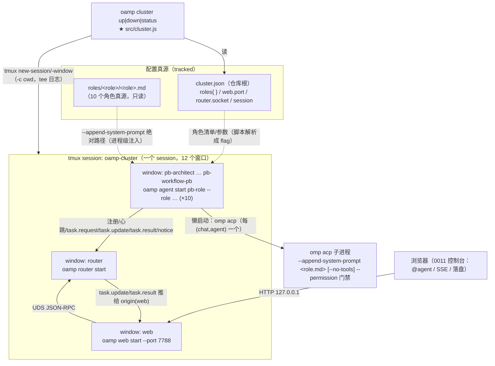
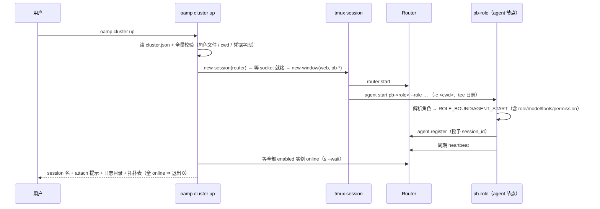
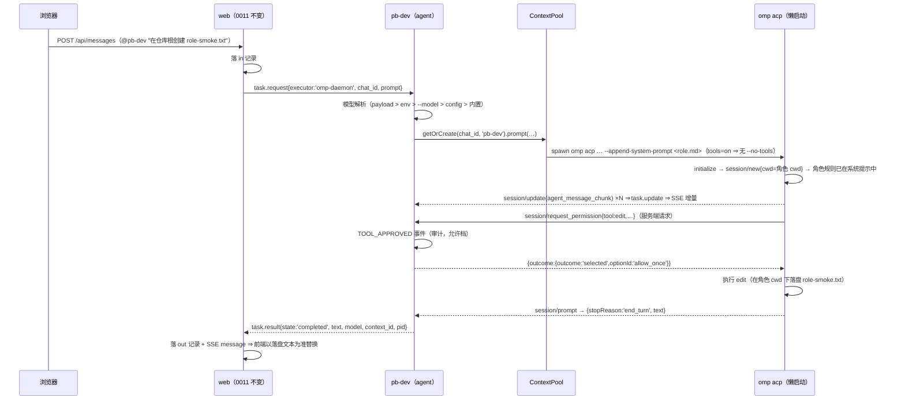

# architecture.md — 0012-roles-agent-cluster（迭代架构）

**版本**：1.1.0（阶段 3 产物，L1 已落定）　**日期**：2026-09-11　**状态**：**L1 全部已确认**（L1-1~L1-6 用户决策 2026-09-11，六项均按推荐方案；逐项记录见 §11.1）—— 可进入阶段 4
**输入**：`demand.md`（v1.0.0 定稿，W1~W8 / N1~N12 / E1~E8 / D-1~D-7 / TC-01~TC-09 / 仓库事实 F-1~F-10 / 实测 V-1~V-8）+ `prd.md` 与 `prd/F01~F07`（7 卡，AR-01~AR-20）
**架构基线**：`docs/iterations/0011-chat-context-protocol/architecture.md`（v0.3.0，已合入 `main` = `2980ed5`）+ 阶段 3 重新取证的代码库 `oamp/`（§1）
**前置**：0011 交付态（SQLite 落盘 / SSE / 上下文池 / `omp-daemon` 默认路径 / 16 个测试文件）；本迭代为其**演进**，不新建批次地基
**约束**：零新第三方依赖（`oamp/package.json` 的 `dependencies` 保持 `{}`）；`roles/**` 只读；不改 workflow-pb 派发路径
**v1.0.0 → v1.1.0 变更**：L1-1~L1-6 经用户确认落定（§11.1 逐项记录，均按推荐方案）；L1-2 的安全语义与 E5 审计口径（每一次**受门禁**的工具调用恰一条记录）转为定案文字（§4.3 / §4.4 / §4.5 / §11.2 / §13 R-3）；§2.4 / §5.1 / §14 疑问 5 的 F02-6 判定口径随 L1-4 确认保持一致（配置保留在仓库根）。

> 本文档回答 prd 的全部 20 条架构待填项（AR-01~AR-20，逐条落定见 §8），并给出 L1 清单（§11）与 PR 边界**输入**（§12；拆解归阶段 4）。

---

## 0. 一句话架构

> 角色实例 = **一个绑定角色的 oamp 节点进程**：角色定义经**进程级 `--append-system-prompt <角色 md 绝对路径>`** 注入（不依赖 cwd、不污染仓库根），模型/工具/permission 由**一份仓库根的 `cluster.json`** 逐角色声明、经 CLI flag 传给节点；`oamp cluster up|down|status` 在**一个 tmux session** 内拉起 Router + Web + N 个角色节点，日志落 `.runtime/cluster/`。0011 的对话落盘 / SSE / 上下文池 / web 派发语义**零改动**。

---

## 1. 现有架构基线（阶段 3 重新取证，2026-09-11）

### 1.1 现有组件与文件（0011 交付态，含与本次迭代的关系）

| 文件 | 现状职责（阶段 3 复核） | 与本次迭代的关系 |
|---|---|---|
| `src/cli.js`（122 行） | 子命令分发（`router start` / `agent start <id>` / `status` / `task *` / `web start [--port]`）+ 零依赖手写 argv 解析 | **扩展**：新增 `cluster` 分发 + USAGE |
| `src/agent.js`（603 行） | 节点生命周期（注册 / 心跳 / **退避重连**（D22 已落地）/ SIGINT 注销）+ 三条执行器（`omp-daemon` / `omp` / `shell`）；`ContextPool({max,bin,cwd:process.cwd(),...})` | **改造**：角色绑定参数面、两条 LLM 路径注入角色文件、permission 策略透传、role 相关事件 |
| `src/acp-client.js`（318 行） | 一个 `omp acp` 子进程的按行 JSON-RPC 封装；`start()` 里 **硬编码** `['acp','--no-skills','--no-rules','--no-tools','--no-session']`（:79） | **改造（核心）**：启动参数参数化 + **服务端请求应答**（permission）+ 审计事件 |
| `src/context-pool.js`（213 行） | 键 `(chat_id, agent_id)` → 常驻 ACP 会话；同键串行（队列上限 8）/ 异键并发 / LRU / release / dispose；`_ensureClient` 用 `pool.cwd` | **改造**：向 `AcpClient` 透传 tools / roleFile / permission；`permission_denied` 归入轮次级错误（不销毁会话） |
| `src/config.js`（127 行） | 叶子模块：`PKG_ROOT` 推导 + env > `config.json` > 内置默认三键（`data.db` / `defaults.model` / `context.max`）；`MODEL_DEFAULT='deepseek/deepseek-v4-flash'` | **不改**（集群参数走独立配置文件与 CLI flag，不并入 config.json） |
| `src/status.js`（119 行） | 只读 `router.status` 查询 + `renderTable()`（**已导出**，`status.js:39`） | **微改造**：抽出并导出 `queryNodes()` 供 `cluster status` 复用（行为不变） |
| `src/log.js`（50 行） | 事件行 `[ts] role EVENT k=v`；`event()` 永不节流、`heartbeat()` 按窗口节流 | **不改**（审计事件用 `event()`） |
| `src/{router,registry,rpc,node-client,task,web,persist,transport}.js`、`web/*`、`bin/oamp.js` | 0010/0011 交付面 | **不改**（N10：不做 Web 前端与协议改造） |
| `test/*.test.js`（16 文件 / 152 用例）+ `test/helpers/harness.js` | fake 二进制注入模式（`OAMP_OMP_BIN`、`FAKE_ACP_ARGS_LOG`）、随机 socket / 临时 `OAMP_DB` | **扩展**：新增 4 个测试文件；`acp-daemon.test.js` 增 permission 分支与参数断言；其余 15 个零修改（§5.6 回归不变式） |
| `package.json` | `dependencies: {}`、`engines.node >= 22`、`test = node --test test/*.test.js` | **不改**（零新依赖） |

### 1.2 可直接复用的既有能力（决定了本方案"少造东西"）

| # | 既有能力（代码位置） | 本次如何复用 |
|---|---|---|
| A | `oamp agent start <instance-id>` 的节点语义：注册 / 心跳 / 退避重连 / SIGINT 注销（`agent.js:459-604`） | 角色实例**直接就是**该节点；`pb-<role>` 是实例名（F01-1/3/6 零新机制） |
| B | `ContextPool` 懒创建 + `cwd = process.cwd()` + `session/new{cwd}`（`context-pool.js:171-183`、`agent.js:488`、`acp-client.js:98`） | **`cwd` 不需要任何新参数**：进程在哪个目录启动，上下文发现根与工具工作目录就是它（F07 全卡） |
| C | 三条执行器与 `parseTaskBody` 路由（`agent.js:56/73/150/263/322`） | 只加"角色默认值"的解析，路由本身不动（F02-5 两条 LLM 路径） |
| D | `AcpClient` 的按行 JSON-RPC 分发（`_handleMessage`，`acp-client.js:262-276`；服务端请求分支插在 `:265` 之后） | permission 应答只需在此处补"服务端请求"分支（**~30 行**） |
| E | `createEventLog().event()` 永不节流（`log.js:36-38`） | 审计记录直接落事件行（F05-2） |
| F | `renderTable()` 已导出（`status.js:39`） | `cluster status` 复用同一张拓扑表 |
| G | `OAMP_OMP_BIN` + `FAKE_ACP_ARGS_LOG` 注入模式（`test/acp-daemon.test.js:26-37`） | 角色注入 / 工具开关 / permission 全部可在 argv 与帧级断言（零真实 LLM） |
| H | `scripts/testenv.mjs` 的"独立脚本 + harness 复用"先例 | 集群脚本的形态与测试方式有现成参照 |
| I | `oamp/.gitignore` 已忽略 `.runtime/` 与 `data/` | 集群日志落 `.runtime/cluster/` → **无需改 gitignore** 即满足 F06-6「日志不入 git」 |

### 1.3 既有缺口（正好是 7 张卡的来源）

1. **agent 是匿名节点**：参数面只有 `instance_id`（`agent.js:460`），没有角色、没有按实例的模型 / 工具 / permission（F-5）。
2. **默认对话路径硬编码禁用工具**：`acp-client.js:79` 的 `--no-tools`（F-7）；放开后未应答 `session/request_permission` 会**永久挂起**（V-6）。
3. **注入面无承载**：ACP `session/new` 无 per-session 注入面（V-3）→ 角色规则只能在进程启动层注入。
4. **无集群结构**：没有任何集群配置 / 脚本（V-8）；`oamp status` 也只反映单进程运行参数面。

### 1.4 阶段 3 技术实测（本机 omp **18.0.11**，2026-09-11，新增 W-1~W-8）

> 与 demand 的 V-1~V-8 并列编号、不复用。取证方式：二进制取证（`~/.bun/install/global/node_modules/@oh-my-pi/pi-coding-agent/dist/cli.js`，本机 omp 即该 dist 的 launcher）+ 既有实测结论。

| # | 结论（本方案直接依赖） | 证据 |
|---|---|---|
| **W-1** | **permission 请求不需要客户端声明能力**：ACP 服务端为每个会话构造 clientBridge 时，`requestPermission` **硬编码为 true**（`{readTextFile: caps.fs?.readTextFile===true, writeTextFile:…, terminal: caps.terminal===true, requestPermission:!0}`） | `dist/cli.js` `Rno(session, id, clientCapabilities)`；`#ee()` 门禁的首个条件即 `t?.capabilities.requestPermission && t.requestPermission` |
| **W-2** | **请求/响应契约**（omp 18.0.11）：<br>请求 `session/request_permission { sessionId, toolCall:{toolCallId,toolName,title,kind?,status:'pending',rawInput,content?,locations?}, options:[…] }`<br>options 固定四项：`allow_once` / `allow_always` / `reject_once` / `reject_always`（name 分别为 Allow once / Always allow / Reject / Always reject）<br>响应 `{ outcome: { outcome:'selected', optionId } }`，或 `{ outcome:{ outcome:'cancelled' } }`；`optionId` 不在四项内 → 工具调用以 `Permission response used unknown option ID: …` 抛错 | `WFt` 常量表 + `SEs` 映射；`Vv.requestPermission` 调用点（`.then(C=>({kind:'permission',outcome:C}))`）与响应解包（`T.outcome==='cancelled'` → 取消；`R.kind==='reject_once'` → 抛 `Tool call rejected by user (tool)`） |
| **W-3** | **受门禁的工具仅四类**：`bash`/`edit`/`delete`/`move`（`bEs`）；只读工具（read/glob/grep/todo/task/web_search）**不经过门禁**；**没有 `write` 工具**——建文件走 `edit`（`WDi` 解析 `op:"create"`） | `bEs={bash:!0,edit:!0,delete:!0,move:!0}`；工具名枚举仅见 glob/edit/todo/task/web_search/move/delete/grep/read |
| **W-4** | **ACP 不发 tool_call 帧**：`session/update` 的 `sessionUpdate` 取值只有 `agent_message_chunk` / `config_option_update` / `session_info_update` / `current_mode_update` / `available_commands_update` 等；ACP 服务端模块内 `tool_call` **0 命中** → **工具调用的唯一可观察信号 = permission 请求** | ACP 模块全量 grep（`#U/#L/#V/#Fe` 为消息通道；`#O/#N` 只跟踪 message_*） |
| **W-5** | **`clientCapabilities:{}` 下不会出现别的服务端→客户端请求**：`fs/read_text_file`、`fs/write_text_file`、`terminal/create` 仅在对应能力为 true 时才被暴露；`elicitation` 未声明 → `interactivePrompts=false` | `Rno()` 能力映射；`newSession` 路径 `{interactivePrompts: this.#a?.elicitation?.form != null}` |
| **W-6** | **`--append-system-prompt <v>` 的取值语义**：`v` 含换行 → 字面文本；否则**先按文件路径读取**（`Bun.file(v).text()`，读不到则告警并回退为字面值）→ 传**角色 md 的绝对路径**即注入全文。`--system-prompt` 是**替换**默认系统提示，`--append-system-prompt` 是**追加**（保留默认提示与 context files） | `fw(v, label)` 实现 + `t2s(r, customSystemPrompt, appendSystemPrompt)`；V-2 的实测结论与之一致 |
| **W-7** | **自动放行面会绕过门禁（不进审计）**：`--auto-approve` / `--yolo`，或用户配置 `tools.approvalMode:'yolo'` / `tools.approval.<tool>:'allow'` 时，ACP 门禁被跳过 → **无 permission 请求、无审计记录（工具仍可用）**。`tools.approvalMode` 的 schema 默认值是 `yolo`，但门禁判定用的是"**显式配置**为 yolo"（`settings.isConfigured(...)`） | `#Y()` = `#t \|\| (isConfigured('tools.approvalMode') && get()==='yolo')`；`--approval-mode` 只接受 always-ask/write/yolo |
| **W-8** | 工具开关面：`--no-tools`（"Disable all built-in tools"）仍是唯一的"一键关工具"；`--tools a,b` 可显式列工具集 | CLI flag 表；V-7 的实测（`--no-tools` 零 tool_call 帧）不变 |

> **W-1/W-4 是本迭代的两条硬事实**：① "工具放开就挂起"的根因是**客户端不回包**（我们必须在 `_handleMessage` 里认领服务端请求）；② 审计面**只能**挂在 permission 请求上（没有 tool_call 帧可用）。二者共同决定了 §5.3 的设计。

---

## 2. 本次演进总体方案

### 2.1 进程与组件图



图例：★ = 新增模块；其余为改造或不变。**LLM 子进程仍然是懒启动**（0011 不变）：10 个角色实例在无对话时只是 10 个节点进程（F01-3）。

### 2.2 模块布局

| 模块 | 状态 | 职责一句话 |
|---|---|---|
| `src/role-binding.js` | **新增**（叶子模块，零依赖） | 角色标识与文件定位的**唯一**映射规则：`instanceIdForRole` / `roleFromInstanceId` / `resolveRoleRoot` / `resolveRoleFile`；`pb-<role>` 公式只此一处 |
| `src/cluster-config.js` | **新增**（叶子模块） | 读 / 校验 `cluster.json`（默认值、cwd 解析、角色文件预检、凭据字段扫描）；**不启动任何进程** |
| `src/cluster.js` | **新增** | `up` / `down` / `status` 三动作：tmux 编排、日志落盘、就绪等待、残留检查、拓扑表渲染 |
| `src/acp-client.js` | 改造 | 启动参数参数化（tools / roleFile）；**服务端请求应答**（permission）；审计事件；`permission_denied` 轮次失败 |
| `src/context-pool.js` | 改造 | 透传 role/tools/permission 到 `AcpClient`；`permission_denied` 不销毁会话 |
| `src/agent.js` | 改造 | `--role/--model/--tools/--permission` 参数面；角色推断与 `ROLE_BOUND` 事件；两条 LLM 路径注入角色文件 |
| `src/status.js` | 微改造 | 抽出并导出 `queryNodes()`（`renderTable` 已导出） |
| `src/cli.js` | 微改造 | `cluster` 子命令分发 + USAGE |
| `cluster.json`（仓库根） | **新增（产物）** | 集群描述：session / web.port / router.socket / roles{}（tracked、零凭据字段） |
| `src/{router,registry,rpc,node-client,config,log,persist,transport,web,task}.js`、`web/*`、`bin/`、`package.json` | **不改** | 零新依赖；Web 前端与协议零改造（N10） |
| `test/cluster-config.test.js`·`role-binding.test.js`·`cluster-actions.test.js`·`tool-permission.test.js` | **新增** | 见 §5.6 / AR-20 |
| `oamp/README.md` | 阶段 5 同步 | 配置面 / 集群一节（沿用 0011 的实现期文档同步惯例；阶段 3 不写） |

### 2.3 与 0011 的关系（不改语义清单）

| 0011 语义 | 本迭代处置 |
|---|---|
| chat/message 落盘（SQLite 两表两类记录 / 失败轮落 out / 启动扫尾） | **零改动** |
| SSE 四类事件（`message`/`task_update`/`chat_state`/`notice`）+ 重连兜底 | **零改动** |
| 上下文池：`(chat_id, agent_id)` 键、同键串行、队列上限、LRU、release/notice | **零改动**（仅多两个构造参数） |
| 模型解析链 `payload > OAMP_OMP_MODEL > config.defaults.model > 内置默认` | **链上插一层**：`payload > env > 角色模型 > config.defaults.model > 内置`（§4.1） |
| `omp-daemon` 默认 / `omp` 一次性 / `shell` 三条执行器路由 | **零改动**（只改各自内部的"默认取值"来源） |
| web `@agent` 派发、`/api/agents`、`!` shell 路径 | **零改动** |
| **回归不变式**：未绑定角色的实例（如 `oamp agent start dev-1`）行为与 0011 **逐字节一致**（含 ACP argv、`omp -p` argv） | 设计目标；15 个既有测试文件零修改即为此不变式的守护 |

### 2.4 F02-6 判定口径（本次新增产物与"污染"的边界）

F02-6（不污染仓库根上下文）的判定必须表述为：**"就地加载角色规则这一动作"前后，仓库根不存在新增或内容变更的规则类文件**。其中

- **规则类文件** = omp 的规则发现面一族：`AGENTS.md` / `.claude/CLAUDE.md` / `SYSTEM.md` / `APPEND_SYSTEM.md`（V-1/V-4 的注入对象）；
- 本迭代在仓库根新增的 **`cluster.json` 不是规则类文件，也不参与注入路径**——注入只经进程 argv 的 `--append-system-prompt <角色 md 绝对路径>`（§3.2），`cluster.json` 仅被 `oamp cluster *` 读取，从不进入 LLM 的系统提示；
- **判定动作**：跑一轮角色对话（含上下文创建与 LLM 调用）前后，比对仓库根规则类文件的集合与内容；同轮比对 `roles/**` 的 git 状态（F02-8）。
- 若用户认为"仓库根新增任何文件"都计入本约束，则需把集群配置改放 `oamp/`（§11 L1-4 的备选方案，连带 §5.1 的路径基准调整）。**该取舍已随 L1-4 确认（2026-09-11）：配置保留在仓库根，判定按本节口径执行。**

---

## 3. 角色绑定（落地 AR-01 / AR-02 / AR-04 / AR-05）

### 3.1 真源、命名映射与角色根解析（AR-01）

| 项 | 规则 |
|---|---|
| 角色真源 | `<roleRoot>/roles/<role>/<role>.md`（`roleRoot` 缺省 = 仓库根 = `path.resolve(PKG_ROOT,'..')`，即本仓库 `agents/`）——F-1/G-2 的真源，**不读** `.pb-agents/` 副本 |
| 角色清单来源 | **`cluster.json` 的 `roles` 键集合**（配置驱动，F06-1）；脚本内不硬编码任何角色名；`_template` / `cdp-debug-skill` 因不在配置中而不建实例（F01-2） |
| instance_id 映射 | `instance_id = 'pb-' + role`（`instanceIdForRole`）；公式**只此一处**（`src/role-binding.js`），配置可用 `instance_id` 字段显式覆盖（本迭代交付的配置不覆盖） |
| 反向映射 | `roleFromInstanceId('pb-dev') === 'dev'`；`^pb-(.+)$` 且角色文件存在才成立——供单起路径推断（§3.4） |
| 角色根覆盖 | env `OAMP_ROLE_ROOT`（由 `cluster up` 按 `cluster.json` 所在目录设为 tmux session 环境；测试用它指向 fixture 目录） |
| 校验时机 | `cluster up` 在**创建 session 之前**逐个校验 enabled 角色的 `cwd` 与角色文件；任一不成立 → stderr 明确报错 + 退出 2，**不留半个集群** |

### 3.2 角色注入机制定案（AR-04）

**定案：进程级 `--append-system-prompt <角色 md 的绝对路径>`。**

| 候选 | 机制 | 结论 |
|---|---|---|
| **A（选定）** | `--append-system-prompt <abs path>` | ✅ 与 cwd 解耦（W3③/F02-7 天然成立）；不写任何文件（W3②/F02-6 天然成立）；daemon 与一次性两条路径同一参数（F02-5）；W-6 证实按路径读文件；V-2 实测生效 |
| B | 固定 cwd + `AGENTS.md`（用户原话候选） | ❌ 三条约束全踩：注入文件必须落在 cwd（污染仓库根或被迫改 cwd）；V-4 遮蔽（同深度 `.claude/CLAUDE.md` 会盖掉 `AGENTS.md`）；V-5 cwd 双语义 → 角色 cwd 一改就换人格 |
| C | `.pb-agents/roles/` 副本 + 文件注入 | ❌ 真源错误（F02-1 要求 `roles/`）+ B 的全部问题 |
| D | `--system-prompt <file>`（替换而非追加） | ❌ 会替换掉 omp 的基础编码助手提示与工具使用指引；而本迭代工具默认放开，工具行为质量直接受该提示影响。V-2 只证明"生效"，未证明"替换后工具链路仍可用" |
| E | ACP per-session 注入（`session/new` 的 `systemPrompt` / `instructions`） | ❌ V-3 实测被静默忽略（协议无该面） |
| F | skills / 扩展机制 | ❌ `--no-skills` 是既有精简参数（V-11），且同样无 per-session 面 |

**为什么 A 不是"白纸架构"**：注入点不在 oamp 新写的代码里，而在**既有的 `omp` 启动参数**上——`AcpClient.start()` 已经在拼 argv（`acp-client.js:79`），本次只是把它从硬编码字符串变成参数表；cwd / 上下文 / 会话全部沿用 0011。

**与 F02-6 的判定边界**：注入只经 argv（不写任何文件）；本次新增的 `cluster.json` 不是规则类文件、不参与注入路径。F02-6 的判定 = "加载角色规则这一动作"前后仓库根无新增/内容变更的**规则类文件**（`AGENTS.md` / `.claude/CLAUDE.md` / `SYSTEM.md` / `APPEND_SYSTEM.md` 一族）——正式表述见 §2.4。

### 3.3 两条 LLM 路径的落点（AR-05）

| 路径 | 落点（精确到调用） | 触发条件 |
|---|---|---|
| 常驻 `omp-daemon`（默认，web 普通提问） | `AcpClient.start()` 的 argv 追加 `--append-system-prompt <roleFile>`；`roleFile` 由 `ContextPool` → `ContextSession._ensureClient()` 透传 | 实例绑定了角色 |
| 一次性 `omp -p`（web 勾选"一次性"） | `runOmpTask()` 的 argv 追加同一参数（`agent.js:158`） | 同上（TC-09：两条都注入） |
| `shell`（`!` 命令） | 不注入（与角色规则无关，卡边界明文） | — |

**判定观察面（自动化 / 人工）**：

1. **argv 级（自动化、零 LLM）**：`ps -axo pid,ppid,command` 中出现 `omp acp … --append-system-prompt <绝对路径>`；测试用既有 `FAKE_ACP_ARGS_LOG`（`test/acp-daemon.test.js:26-37`）断言两条路径的 argv。
2. **规则真实生效（人工、真实 omp）**：E3 的原文比对（`roles/architect/architect.md` 的「成功标准」第一条）+ 换 chat 复测（F02-2/3/4）。
3. **加载事件**：agent 启动时落一行 `ROLE_BOUND role=<r> file=<abs> source=flag|instance_id`（可观测"哪个实例绑了哪份文件"）。

### 3.4 单起参数面（AR-02）

```
oamp agent start <instance-id> [--role <role>] [--model <model>] [--tools on|off] [--permission allow|deny]
```

| 参数 | 语义 | 缺省 |
|---|---|---|
| `--role` | 显式角色绑定（脚本路径总是显式传） | **未传时按 instance_id 推断**：`roleFromInstanceId(id)` 成立且角色文件存在 → 绑定（`source=instance_id`）；否则不绑定（= 0011 匿名节点，行为完全不变） |
| `--model` | 该实例的默认模型（只在 payload / env 都未指定时生效） | 无 → 回落 `config.defaults.model` |
| `--tools` | `on` = 不传 `--no-tools`；`off` = 传 | `off`（与 0011 一致） |
| `--permission` | `allow` / `deny`（§4.3） | `allow` |
| （无 `--cwd`） | 工作目录 = **进程启动目录**（复用 B：`ContextPool(cwd=process.cwd())` 与 `session/new{cwd}` 既有链路） | 由 tmux 窗口 `-c` 决定 |

- 非法取值 / 未知 flag → `oamp agent start: …` + **退出码 2**（与 `cli.js` 的 `usageError` 风格一致）。
- **为什么让单起也自动绑角色**：F01-4（单起可用）与 F02-1（`pb-<role>` 的运行期规则来自 `roles/<role>/<role>.md`）合起来要求"裸起 `oamp agent start pb-dev` 也是个真角色实例"；否则用户必须记住一个额外的 flag 才能得到正确的实例语义，且该实例会与批量入口产生"同名不同人格"的割裂。推断是**确定性规则**（前缀 + 文件存在性），并在启动行留痕（`source=instance_id`），不构成隐式魔法。
- **优先级（角色绑定参数）**：CLI flag > 推断 > 无绑定。

### 3.5 实例与 LLM 子进程的关联观察（AR-03）

**判定手段（无需新代码）**：从任一 `omp` 子进程出发，沿 `ps -axo pid,ppid,command` 的父链上溯（≤3 层，跨过 `sh -c` / `tee` 管道壳），找到命令行含 `agent start <instance-id>` 的祖先 → 该子进程归属该实例。

- **F01-3 判定**：对每个 `pb-<role>`，`ps` 中**不存在**其归属的 `omp acp` / `omp -p` 子进程（无对话时）；发一轮对话后，归属子进程出现（`CONTEXT_READY` / `CONTEXT_EVICTED` / `CONTEXT_RESET` 事件可交叉印证）。
- 事实依据：LLM 子进程由 `ContextSession._ensureClient()` 懒创建（`context-pool.js:171-183`），进程亡即回收；无任何常驻 LLM 生命周期。

---

## 4. 会话能力：模型 / 工具 / permission（落地 AR-06~AR-11）

### 4.1 模型：承载、传参与解析链（AR-06）

| 项 | 规则 |
|---|---|
| 承载 | `cluster.json` 的 `roles.<role>.model`（可选字符串；缺省不写 = 用全局默认） |
| 传参 | `cluster up` 解析后作为 `--model <值>` 传给该角色窗口；**不写 env、不改 `oamp/config.json`** |
| **解析链（定案，回答 prd 疑问 2）** | `payload.model` > `OAMP_OMP_MODEL` > **`--model`（角色级）** > `config.defaults.model` > 内置 `deepseek/deepseek-v4-flash` |
| 理由 | 沿用 0011 §7.1 的"env 高于配置层"不变（env 是运维级显式覆盖）；角色级模型属**配置层内部**的按角色覆盖，落在全局配置默认之上、env 之下——即 prd 疑问 2 的"按角色覆盖属配置层内部、整体低于环境变量" |
| 生效时机 | 每轮独立解析（0011 §7.1 语义不变）：未指定的轮次回到该实例的默认链 |
| 校验 | `--model` 值按既有 `MODEL_RE = ^[A-Za-z0-9._/-]{1,128}$` 校验，非法 → 退出 2；模型不可用仍走 0011 §7.3「明确失败、不静默回退」 |

### 4.2 模型标识的可观察面（AR-07）

| 观察面 | 内容 |
|---|---|
| agent 事件日志（stdout → 落盘日志） | `AGENT_START {instance, role, model, tools, permission, role_file}`（启动即见该实例的解析结果）；`TASK_STARTED {task_id, chat_id, model}`（既有，每轮） |
| 落库 out 记录 `model` | 该轮**实际生效**值（ACP `currentValue` 回读，0011 §7.4 不变）；失败轮同样只报实报值 |
| 判定用法 | 给某角色配 `model=X` 重启 → 该角色 out 记录 `model=X`，未覆盖角色的 out 记录仍为默认值（F03-2/3/5 的直接判据） |

### 4.3 工具开关（落地 AR-08）

| 项 | 规则 |
|---|---|
| 承载 | `cluster.json` 的 `roles.<role>.tools`（布尔，**缺省 true** = 默认全开，F04-1） |
| 传参 | `cluster up` → `--tools on\|off` → agent 侧 `effectiveTools` |
| 生效点（daemon，**本卡的核心改造**） | `AcpClient.start()` 的 argv：`effectiveTools ? 不传 --no-tools : 传 --no-tools`（`acp-client.js:79` 的硬编码改为参数） |
| 生效点（一次性 `omp -p`） | `runOmpTask()` 的 `--no-tools` 由 `payload.tools` 决定；**payload 未给时回落到角色开关**（TC-09：两条 LLM 路径都按角色配置） |
| 解析链 | `payload.tools === true → on；payload.tools === false → off；未给 → 角色开关；无角色绑定 → off`（0011 兼容） |
| 无角色实例 | 缺省 `off`（`--no-tools` 照旧）→ §2.3 回归不变式 |

**定案（L1-2，2026-09-11 用户决策）**：角色 `tools` 缺省 **true**（默认全开）；常驻对话路径按 `tools` 决定是否传 `--no-tools`（这是本卡的核心改造点，`acp-client.js:79` 的硬编码就此消除）；一次性路径 payload 未给时回落到角色开关；无角色绑定的实例保持 `--no-tools`（§2.3 回归不变式）。工具放开后 permission 必须同时落地（§4.4），否则 V-6 的永久挂起即成立。

### 4.4 permission 应答（落地 AR-10）

**协议契约（W-2 实测）**：omp 以 JSON-RPC **请求**（带 `id` + `method`）下发，客户端必须回 `result`：

```jsonc
// 收到
{ "jsonrpc":"2.0", "id":7, "method":"session/request_permission",
  "params":{ "sessionId":"s1",
             "toolCall":{"toolCallId":"tc-1","toolName":"edit","title":"...","status":"pending","rawInput":{…}},
             "options":[{"optionId":"allow_once",…},{"optionId":"reject_once",…},…] } }
// 允许
{ "jsonrpc":"2.0", "id":7, "result":{ "outcome":{ "outcome":"selected", "optionId":"allow_once" } } }
// 拒绝
{ "jsonrpc":"2.0", "id":7, "result":{ "outcome":{ "outcome":"selected", "optionId":"reject_once" } } }
```

| 项 | 定案 |
|---|---|
| 实现面 | `AcpClient._handleMessage()` 增加分支：`id` 存在**且** `method` 为字符串 → 服务端请求 → `_handleServerRequest(msg)`。**必须放在既有 pending 表查找之前**（今天这类帧会因 `pending` 无此 id 被 `return` 丢掉 → 正是 V-6 的挂起根因，`acp-client.js:262-266`） |
| 已知方法 | `session/request_permission` → 按策略回上述结果 |
| 未知方法 | 回 JSON-RPC 错误 `-32601 Method not found`（**响亮失败，绝不静默丢弃**）——即使未来 omp 新增 `fs/*` / `terminal/*` 请求，也只会得到明确错误而非挂起（W-5 说明当前不会发生） |
| 策略来源 | `cluster.json` 的 `roles.<role>.permission`（`allow` 缺省 / `deny`），经 `--permission` → `ContextPool` → `AcpClient` |
| 允许档行为 | 恒回 `allow_once`。**不用 `allow_always`**：omp 会按 cacheKey 缓存（`#V.set(cacheKey,'allow_always')`），此后同类调用**不再发请求** → 审计记录数 < 工具调用数，直接违反 F05-2 的 N=N |
| 拒绝档行为 | ① 回 `reject_once`（工具调用以 `Tool call rejected by user (<tool>)` 抛错，模型可见）；② 立即发 `session/cancel` 终止本轮；③ 置 `permission_denied` 标记 → `prompt()` 在结算时**抛 `AcpError('permission_denied')`** → 该轮 `task.result{state:'failed', error:'permission_denied', text:'工具调用被 permission 策略拒绝（permission=deny）'}` → 落一条失败 out 记录（0011 §4.4 口径）。**三步使终态确定**：不依赖模型是否自行收敛 |
| 拒绝后的会话 | **保留**（不是会话级失败）：`permission_denied` 列入 `_failSession` 的早退名单（与 `model_unavailable` / `context_busy` 同级），上下文与常驻进程不受影响，下一轮可继续 |
| 允许档下的正常轮次 | 无工具需求的轮次不产生任何 permission 请求；有工具需求的轮次按 §4.4 逐一放行 |
| **"不长时间挂起"的时间判据（回答 prd 疑问 3）** | 硬上限 = 既有轮次超时（`payload.timeout_ms` / 默认 `DEFAULT_OMP_TIMEOUT_MS = 300000ms`，`agent.js:23`），**不新增配置键**；可判定判据 = **deny 档轮次必须在 ≤10s 内出现终态**（设计上限：应答 permission → cancel → prompt 结算，均为毫秒级，实测留两个数量级余量）。阶段 6 断言"该轮 `duration_ms ≤ 10000` 且 `error='permission_denied'`" |
| `--auto-approve` / `--yolo` | **不使用**（W-7：会让工具调用绕过门禁 → 审计面失效）。用户若在自己的 omp 设置里显式配置 `tools.approvalMode:'yolo'`，则其工具调用不产生请求、也无审计记录——**记为风险 R-2** |

**定案（L1-2，2026-09-11 用户决策）**：permission 为**两档**——`allow`（默认）= 恒回 `allow_once` + 每次受门禁调用恰一条 `TOOL_APPROVED` 审计；`deny` = 回 `reject_once` → `session/cancel` → 轮次 `permission_denied`（`AcpError`，**会话保留**）。deny 轮的终态判据 = `duration_ms ≤ 10s`；硬上限沿用既有轮次超时（默认 300000ms，不新增配置键）。**不使用** `--auto-approve` / `--yolo`（会让工具调用绕过门禁 → 审计失效，R-2）。

### 4.5 审计事件与字段（AR-11）

**已确认口径（2026-09-11 用户决策）**：审计记录数 = 受门禁的工具调用数（`bash` / `edit` / `delete` / `move`），只读工具不产生请求亦无记录；阶段 6 断言须用变更类指令。完整口径与实现/断言约束见 §11.2。

| 项 | 定案 |
|---|---|
| 事件名 | **`TOOL_APPROVED`**（允许档）/ **`TOOL_DENIED`**（拒绝档）——一次 permission 请求**恰好一行**（N 次受门禁的工具调用 = N 条记录，F05-2 的字面判据） |
| 字段 | `instance`（如 `pb-dev`）、`role`、`chat_id`、`context_id`、`pid`、`tool`（`bash`/`edit`/`delete`/`move`）、`title`（截断 120 字符）、`tool_call_id`、`option`（`allow_once`/`reject_once`） |
| 落点 | agent 的 stdout 事件行（`createEventLog().event()`，永不节流）→ 经 tmux `tee` 同时**落盘** `<PKG_ROOT>/.runtime/cluster/<instance>.log` 并在窗口可见（F06-6 的"每进程至少一份日志"） |
| 为什么不落 SQLite | E-5/F02-5 明令"仅两类记录"（0011 §4.7 的模块边界）；审计是运行期事件，与 0010 以来"事件日志 = 终端事件行"的既有形态一致（F05 边界也要求"不新增日志面之外的检索面"） |
| **覆盖范围的诚实边界** | 受门禁的工具只有 `bash`/`edit`/`delete`/`move`（W-3）；只读工具（read/glob/grep/todo/…）**不产生请求**，因而**没有记录**。E5 的"每一次工具调用都留下放行记录"在实现口径下 = "**每一次受门禁（可变更）的工具调用**恰好一条记录"。阶段 6 的审计断言必须用**变更类**指令（如"创建文件"→ `edit`；"执行 echo"→ `bash`），否则会误判（见 §14 疑问 1） |

### 4.6 工具开关的辅助判定面（AR-09）

除"文件是否产生"（E2/E4 主判据）外：

1. **子进程 argv**：`ps` 中该实例的 `omp acp` 子进程命令行含 / 不含 `--no-tools`（直接对应 `effectiveTools`）。
2. **审计事件有无**：工具开 + 允许档下，变更类指令必然产生 `TOOL_APPROVED`；工具关（`--no-tools`）下**零** permission 请求、零审计行。
3. **关闭档的"不静默失败"（F04-5）**：`--no-tools` 下模型无工具可用 → 以明确的"无法执行/回绝"文字收尾（该轮 `state='completed'`、文本可判定），不会是空答复。（这是 omp 既有行为，非本迭代新增机制。）

---

## 5. 集群入口（落地 AR-12~AR-17）

### 5.1 `cluster.json`（AR-12 / AR-17）

**落点**：**仓库根 `cluster.json`**（本仓库 = `agents/cluster.json`；`--config <path>` / env `OAMP_CLUSTER_CONFIG` 可覆盖，**缺省 = 包根上级目录** = `path.resolve(PKG_ROOT,'..')`）。
**理由**：集群描述的是**本仓库的角色拓扑**，其角色真源 `roles/` 与全体角色的缺省 cwd（仓库根）都在同一层；把它放进 `oamp/` 会让"角色路径 / 缺省 cwd"全部变成 `../` 相对路径。tracked、零凭据字段（F06-7/TC-07）。**L1-4 已确认**（2026-09-11 用户决策，未改判：配置留在仓库根）。

**schema**（交付初版 + 覆盖示例）：

```jsonc
{
  "session": "oamp-cluster",          // tmux session 名（可选；缺省 oamp-cluster）
  "web":     { "port": 7788 },        // 传给 `oamp web start --port`
  "router":  { "socket": null },      // null = 用 oamp 默认（.runtime/oamp.sock）；非空 → OAMP_SOCKET 传给子进程
  "roles": {
    "architect": {},                  // 键即角色名；空对象 = 全默认
    "demand": {}, "dev": {}, "planner": {}, "pr-planner": {},
    "prd": {}, "progress-observer": {}, "retrospective": {},
    "verifier": {}, "workflow-pb": {}
  }
}
```

```jsonc
// roles 内的覆盖示例（F03-2 / F04-3 / F05-3 / F07-2 的判定用例；键一律是角色名，不是 instance_id）
"dev":      { "cwd": "/tmp/role-dev-work", "model": "openai/gpt-5.6-luna" },
"prd":      { "tools": false },
"verifier": { "permission": "deny" },
"demand":   { "enabled": false }        // 删/停一个角色 ⇒ 实例集合随之变化（F06-1 的判定）
```

| 角色段字段 | 类型 | 缺省 | 语义 |
|---|---|---|---|
| `enabled` | bool | `true` | `false` = 该角色不起实例（F06-1 的"启用开关"） |
| `instance_id` | string | `pb-<role>` | 显式覆盖实例名（本迭代不使用） |
| `model` | string | 不写 | 角色级模型（§4.1） |
| `tools` | bool | `true` | 工具开关（§4.3） |
| `permission` | `'allow'\|'deny'` | `'allow'` | permission 档（§4.4） |
| `cwd` | string | `"."`（= 配置文件所在目录 = 仓库根） | 该角色窗口的工作目录（§5.3 / F07） |

**校验（加载即失败，`cluster-config.js`）**：

| 情形 | 行为 |
|---|---|
| 文件不存在 / 非法 JSON / 非对象 / 键类型错 / `permission` 取值非 allow\|deny / `tools` 非布尔 / `port` 非 1~65535 | 抛错 → stderr `oamp cluster: 配置错误: <原因>` + 退出 **2**（快速失败，与 `config.js` §8.3 风格一致） |
| 未知键 | 忽略（不报错；沿用 0011 配置面风格） |
| **凭据类字段**（递归扫描键名，大小写不敏感：`token`/`secret`/`password`/`passwd`/`api_key`/`apikey`/`credential`） | 抛错 + 退出 2 —— 把 F06-7「零凭据字段」从"承诺"变成**结构性校验** |
| enabled 角色的角色文件 `<root>/roles/<role>/<role>.md` 不存在 | 抛错（**在创建 session 之前**） |
| enabled 角色的 `cwd` 不存在 / 非目录 | 抛错（同上，AR-18） |
| 相对路径（`cwd`）基准 | **配置文件所在目录**（= `root`）；绝对路径原样使用；**不做 `~` 展开**（YAGNI，文档明示） |

**与 `oamp/config.json` 的关系**：**互不合并、互不读取**。

| 面 | `oamp/config.json`（0011，可选） | `cluster.json`（本迭代，仓库根） |
|---|---|---|
| 回答的问题 | **单个进程**怎么跑（库路径 / 全局默认模型 / 上下文上限） | **一组进程**怎么编排（角色清单 / 每角色参数 / web 端口 / session 名） |
| 消费方 | router / agent / web / status 各自 `loadConfig()` | 只有 `oamp cluster *`（角色参数再以 flag 形式传给 agent） |
| 生效方式 | env > 该文件 > 内置默认 | 该文件 > 脚本内置默认（无 env 分层的键） |

### 5.2 脚本形态与三动作契约（AR-13）

**定案：新增 `oamp cluster <action>` 子命令**（`src/cluster.js` + `cli.js` 一行分发 + USAGE 一行）。

| 候选 | 结论 |
|---|---|
| **A（选定）`oamp cluster up\|down\|status`** | ✅ 与既有 `oamp router/agent/web/task` 同一入口风格；"一条命令拉起集群"的最短路径；可被 `node --test` 以子进程方式测试（`cli.test.js` 已有先例）；USAGE 可见 |
| B 独立脚本 `oamp/scripts/cluster.mjs` | ❌ 有 `scripts/testenv.mjs` 先例，但用户必须记住路径，且 `oamp -h` 不暴露；多一个"半入口"概念，无实际收益 |

```
oamp cluster up     [--config <path>] [--wait <ms>]
oamp cluster down   [--config <path>]
oamp cluster status [--config <path>]
```

env：`OAMP_CLUSTER_CONFIG`（配置路径）、`OAMP_TMUX_BIN`（tmux 可执行文件，**测试注入点**，缺省 `tmux`）、`OAMP_CLUSTER_WAIT_MS`（就绪等待毫秒，缺省 20000、`0` = 不等，供测试）。

| 动作 | 契约 |
|---|---|
| **up** | ① 读配置 + 全量校验（§5.1）；② `tmux -V` 探活（缺失 → 明确报错 + 退出 2）；③ `tmux has-session` 命中 → **幂等**：不启动任何东西，打印 attach 提示，退出 0（§5.5）；④ `tmux new-session -d -s <session> -n router -c <root> "<router 命令>"`；⑤ 等 Router 就绪（轮询 socket 文件存在 + 可连，上限 `--wait`）；⑥ 逐个 `tmux new-window -n <name> -c <cwd>` 起 web 与各角色（顺序 = 配置顺序）；⑦ 等 `oamp status` 中全部 enabled 实例 `online`（同一 `--wait` 预算）；⑧ 打印：session 名、窗口数、attach 命令、日志目录、拓扑表；全部 online → 退出 0，否则非 0 + 提示看哪个窗口/日志 |
| **down** | ① 无 session → 打印"未在运行"退出 0；② 采集**本次 session 的全部 pane pid**（`tmux list-panes -a -F '#{session_name} #{pane_pid}'`）；③ 对每个窗口 `tmux send-keys -t <session>:<win> C-c`（→ SIGINT：router 打 `ROUTER_STOPPING` 并 unlink socket、agent 打 `DEREGISTERED` 并注销、web 走既有 SIGINT 路径）；④ 等待这些 pane 的**进程子树**消失（`ps -axo pid,ppid`，上限 10s）；⑤ `tmux kill-session -t <session>`；⑥ **残留检查**：③ 采集的 pid 集合仍有存活 → SIGKILL 兜底并**报告残留**（非 0 退出）；干净 → 打印"已收口"+ 退出 0 |
| **status** | 只读，不改任何状态：① session 是否存在 + 窗口清单（`tmux list-windows -F '#{window_name} #{pane_current_path} #{pane_dead}'`）；② Router 拓扑表（复用 `renderTable(queryNodes(config))`）；③ 日志目录与各日志文件大小；④ 逐角色对齐：`instance_id` / 窗口是否存在 / 窗口存活 / online 状态 / cwd / 日志路径。Router 不可达 → 明确报错段 + 其余段照常输出，退出 1（不静默冒充成功，沿用 `status.js` 的失败风格） |

### 5.3 tmux 组织（AR-14）

| 项 | 定案 |
|---|---|
| session 名 | `cluster.json` 的 `session`，缺省 **`oamp-cluster`**（一仓库一集群；不自动加随机后缀——状态判定需要**确定的名字**） |
| 窗口粒度 | **一进程一窗口**（12 个：`router` / `web` / 10 个 `pb-<role>`）；不做 pane 分屏（窗口名即实例名，`tmux attach` 后按窗口名定位，判定与操作最短路径） |
| 窗口命名 | `router` / `web` / **`<instance_id>`**（如 `pb-progress-observer`，最长 20 字符） |
| 窗口顺序 | router → web → 角色（配置声明顺序），便于"肉眼从上到下看" |
| 窗口 cwd | `tmux new-window -c <cwd>`（角色 = 配置值或 root；router/web = root）→ **F07-4 的判定面 = `tmux display-message -p -t <session>:<win> '#{pane_current_path}'`** |
| 退出行为 | `tmux set-option -t <session> remain-on-exit on`：进程崩了窗口留尸可见（可观察优先，E7），`down` 时随 session 一起清掉 |
| attach 提示 | `up` / `status` 打印 `tmux attach -t oamp-cluster`（不自动 attach：脚本要能在无终端 / 自动化场景跑完） |
| 输出双通道 | 每个窗口的命令形如 `<env 前缀> node <BIN> <子命令> … 2>&1 \| tee -a <log>` → **窗口可见 + 同时落盘**（E7 的两半一次满足） |
| session 环境 | `tmux set-environment -t <session> OAMP_ROLE_ROOT <root>`（角色窗口据此定位角色文件，与配置的 root 一致） |

**up 期启动命令（示例，实际由脚本拼装）**：

```bash
tmux new-session -d -s oamp-cluster -n router -c /repo "/usr/bin/node /repo/oamp/bin/oamp.js router start 2>&1 | tee -a /repo/oamp/.runtime/cluster/router.log"
tmux new-window -t oamp-cluster -n web    -c /repo "/usr/bin/node /repo/oamp/bin/oamp.js web start --port 7788 2>&1 | tee -a …/web.log"
tmux new-window -t oamp-cluster -n pb-dev -c /repo "/usr/bin/node /repo/oamp/bin/oamp.js agent start pb-dev --role dev --tools on --permission allow [--model M] 2>&1 | tee -a …/pb-dev.log"
```

### 5.4 日志（AR-15）

| 项 | 定案 |
|---|---|
| 落点 | **`<PKG_ROOT>/.runtime/cluster/`**（本仓库 = `oamp/.runtime/cluster/`）——已被 `oamp/.gitignore` 的 `.runtime/` 覆盖 → **满足 F06-6 的 `git check-ignore` 判定，且不改任何 `.gitignore`** |
| 文件命名 | 一进程一份：`router.log` / `web.log` / `<instance_id>.log`（如 `pb-dev.log`）；启动时在打印里给出目录路径 |
| 截断策略 | `up` 开始时**逐个 truncate**（每次启动只保留本次运行的输出，文件大小上界 = 单次运行输出量）；运行期 `tee -a` 追加；**不做轮转 / 不压缩**（本地单机个人使用，`up` 截断已足够；YAGNI） |
| 启动行 / 停止行 | agent：`AGENT_START …` / `DEREGISTERED …`（既有事件）；router：`ROUTER_READY socket=…` / `ROUTER_STOPPING`（既有）；web 走既有 SIGINT 路径 |
| 与 tmux 的关系 | 日志文件是**事后追溯**通道，窗口是**实时观察**通道，二者互补（TC-04 的用户改判） |

### 5.5 `up` 重复执行与 `down` 序列（AR-16）

| 项 | 定案 | 理由 |
|---|---|---|
| `up` 命中已有 session | **幂等**：不启动、不修改、不 kill；打印 `集群已在运行（session=oamp-cluster，N 窗口）` + 完整 attach 提示 + `如需重建请先 oamp cluster down`，**退出 0** | `up` 是"确保集群在跑"的期望语义；对已在运行的集群做任何破坏性动作（重建）都会杀掉用户正在用的对话上下文，代价不可逆。真实状态由 `status` 如实呈现；清理动作只有 `down` 一个（单一职责） |
| `up` 部分失败（Router 未起 / 有实例未 online） | 非 0 退出 + 逐窗口提示（`status` 可复现现场）；**不自动回滚**（不 kill 已起的窗口）——保留现场供诊断，且回滚本身要 kill 用户可能正在用的窗口 | 可观察优先；`down` 是唯一的收口动作 |
| `down` 优雅序列 | C-c（SIGINT）→ 等子树退出（≤10s）→ `kill-session` → 残留检查 | 必须先 SIGINT 而非直接 kill-session：**SIGINT 才触发 agent 注销（`DEREGISTERED`）与 Router 的 socket unlink**；直接 `kill-session` 只发 SIGHUP → 进程硬退，Router 需等租约超时才判 offline（"收口干净"会退化为"30s 后干净"） |
| 残留检查方式 | 以 ② 采集的 pane pid 为根，`ps -axo pid,ppid,command` 展开子树 → down 后仍存活的 pid 即为残留；有残留 → SIGKILL 兜底 + 报错退出 | 精确到"本次 session 的进程"，**不会误伤**用户另起的 oamp 进程（对比：按命令行匹配 `oamp` 会误伤） |
| 幂等 / 无 session | `down` 无 session → 打印 + 退出 0（幂等） | 收口动作应可重复执行 |

### 5.6 测试组织（AR-20）

| 层 | 手段 | 覆盖（对应卡片） |
|---|---|---|
| 单元（纯函数） | `test/role-binding.test.js`：`instanceIdForRole` / `roleFromInstanceId` / `resolveRoleRoot` / `resolveRoleFile` / 参数归一与优先级 | AR-01/02 |
| 单元（配置） | `test/cluster-config.test.js`：缺省值、未知键忽略、非法 JSON / 类型 / permission 取值 → 失败退出、**凭据字段扫描**、相对 cwd 基准、角色文件缺失、`enabled:false` 跳过、`OAMP_CLUSTER_CONFIG` 覆盖 | AR-12/17/18 |
| 集成（fake tmux + fake omp） | `test/cluster-actions.test.js`（`OAMP_TMUX_BIN` 指向记录 argv 的假 tmux + `OAMP_CLUSTER_WAIT_MS=0`）：session/窗口名与数量、每窗口的 `-c cwd`、命令串含角色 flag 与 `tee` 日志路径、`up` 幂等、`down` 的 C-c → kill-session 序列、`status` 输出分段与退出码 | AR-13/14/15/16 |
| 集成（fake ACP，帧级） | `test/tool-permission.test.js`：假 ACP 服务端主动发 `session/request_permission` → 断言 ① 允许档回 `{outcome:{outcome:'selected',optionId:'allow_once'}}` 且 1 条 `TOOL_APPROVED`；② 拒绝档回 `reject_once` + 收到 `session/cancel` + 该轮 `permission_denied` 且 `duration_ms` 远小于超时 + 会话仍可用（下一轮正常）；③ 未知服务端方法 → 收到 `-32601` 错误响应（不挂起）；④ 同会话两次请求 → 2 条审计行（证 N=N） | AR-10/11 |
| 集成（argv 断言） | 扩展 `test/acp-daemon.test.js` 的 `FAKE_ACP_ARGS_LOG` 断言：角色实例的 `omp acp` argv 含 `--append-system-prompt <role.md 绝对路径>`；`--tools on` 时**不含** `--no-tools`，`off` 时含；一次性 `omp -p` 同样含注入参数 | AR-04/05/08/09 |
| **边界：fake vs 真实 omp** | **自动化一律 fake**（不依赖真实 LLM / 网络 / tmux 真实会话，沿用 0011 §17）；**真实 omp 只用于阶段 6 验收**：E3 的角色规则原文比对与跨 chat 稳定性、E2 的文件真实落盘与工具真实可用、E5 的真实 permission 行为与时延、E7 的真实 tmux 观察与收口、E8 的真实 cwd 落点 | 全部 |
| 回归 | 既有 16 个测试文件：**15 个零修改原样全绿**（§2.3 不变式）；`acp-daemon.test.js` 增断言不删断言 | F-8/N10 |

---

## 6. 核心数据流

### 6.1 集群启动（`oamp cluster up`）



### 6.2 一轮"带工具的问答"（web 默认路径）



### 6.3 拒绝档的一轮（快速失败）

```
prompt → omp 请求 permission{tool:edit}
   → 策略 deny：回 reject_once → 立即 session/cancel → 标记 permission_denied
   → prompt() 结算时抛 permission_denied（会话保留）
   → task.result{state:'failed', error:'permission_denied', text:'工具调用被 permission 策略拒绝'}
   → web 落一条失败 out 记录（0011 §4.4 口径，chat 状态 failed）
```

### 6.4 收口（`oamp cluster down`）

```
has-session? 否 → 打印并退出 0
采集 pane pid 子树 → 逐窗口 send-keys C-c（SIGINT）
   → router: ROUTER_STOPPING + unlink socket；agent: DEREGISTERED（注销）；web: 既有 SIGINT 路径
等子树消失（≤10s）→ tmux kill-session → 残留检查（存活 pid）
   → 无残留：退出 0；有残留：SIGKILL 兜底 + 报错退出（非 0）
```

---

## 7. 关键技术决策与理由（分级）

| # | 决策 | 级别 | 理由（一句话） | 备选与否决原因 |
|---|---|---|---|---|
| D-01 | 角色注入 = 进程级 `--append-system-prompt <abs role.md>` | **L1-1** | 唯一同时满足 W3 三条约束的机制（§3.2） | 文件/cwd 注入：污染仓库根 + 遮蔽 + cwd 耦合；per-session：协议无该面 |
| D-02 | 工具默认放开 + 实现 permission 应答（allow 留痕 / deny 快速失败） | **L1-2** | 本迭代的核心价值（D-1），也是安全语义的变化点 | 不放开 = 角色只能聊天；只放开不应答 = 永久挂起（V-6） |
| D-03 | 集群入口 = `oamp cluster up\|down\|status` 子命令 | **L1-3** | 与既有 CLI 同构、可测、`oamp -h` 可见 | 独立脚本：不可发现、多一个入口概念 |
| D-04 | 配置文件 = 仓库根 `cluster.json`（tracked，零凭据字段，独立于 `oamp/config.json`） | **L1-4** | 集群描述 = 本仓库的角色拓扑，与 `roles/`、缺省 cwd 同层；生命周期不同不合并 | 并入 config.json：把"单进程参数"和"多进程编排"混成一个生命周期；放 `oamp/`：全变 `../` |
| D-05 | 实例不常驻 LLM（节点进程 + 按 (chat,agent) 懒启动） | **L1-5（沿用 0011，无变更）** | 产品已锁（W2/M-3）；架构上也不该改：10 个常驻 LLM 会让空闲内存与上下文成本 ×10 | 常驻 LLM：无功能收益、成本 ×10 |
| D-06 | agent 参数面 +4 flag（`--role/--model/--tools/--permission`），且 `pb-<role>` 可推断绑定 | L1-6（**建议降级为 L2**） | 单起（F01-4）与角色真源（F02-1）的联合要求；既有调用（`dev-1`）行为不变 | 只支持显式 flag：裸起 `pb-dev` 得到"同名不同人格"的实例 |
| D-07 | permission 应答放在 `AcpClient._handleMessage`（服务端请求分支），未知方法回 `-32601` | L2 | 协议层职责归协议封装；响亮失败优于静默丢弃 | 在 pool/agent 层处理：协议细节泄漏到上层 |
| D-08 | 允许档恒回 `allow_once`，拒绝档回 `reject_once` + `session/cancel` | L2 | 保住 N=N 审计；拒绝的终态不依赖模型行为 | `allow_always`：omp 缓存后不再发请求，审计缺记录 |
| D-09 | `permission_denied` 为轮次级错误（会话保留） | L2 | 拒绝不是会话故障；下一轮可继续（与 `model_unavailable` 同级） | 会话级失败：一次拒绝就毁掉上下文，代价过大 |
| D-10 | 审核事件 = 每请求一行 `TOOL_APPROVED`/`TOOL_DENIED`，落 agent 事件日志 | L2 | 可数（N=N）、与既有事件日志形态一致、不违反"仅两类记录" | 落 SQLite：违反 E-5；两行/调用：计数歧义 |
| D-11 | 模型链插层：`payload > env > --model(角色) > config > 内置` | L2 | 沿用 0011 的"env 高于配置层"，角色级属配置层内部（prd 疑问 2） | 角色级高于 env：打破既有运维覆盖语义 |
| D-12 | 工具开关：daemon 由 argv 决定（去掉硬编码 `--no-tools`）；一次性路径 payload > 角色 | L2 | F04-2 明令"默认对话路径必须真实可用"；两条 LLM 路径一致（TC-09） | 只改一次性路径 = 本卡的核心缺陷未修 |
| D-13 | `cwd` 不加 flag：由进程启动目录承载（tmux `-c`） | L2 | 复用 0011 的 `process.cwd()` → `session/new{cwd}` 全链，零新参数 | 新增 `--cwd`：与 ACP spawn / session/new 三处重复传递 |
| D-14 | 一进程一窗口、窗口名 = 实例名、`remain-on-exit on` | L3 | 定位最短路径；崩溃留尸可观察 | pane 分屏：窗口名与实例的映射变复杂 |
| D-15 | 日志 `<PKG_ROOT>/.runtime/cluster/<name>.log`，up 截断、tee 双通道 | L3 | 复用既有 gitignore 规则（F06-6 免改动）；窗口与文件互补 | 新日志目录：要改 gitignore 且散落 |
| D-16 | `up` 幂等；`down` = C-c → 等子树 → kill-session → 残留检查 | L2 | 不做破坏性动作；SIGINT 才能触发既有优雅注销链路（§5.5） | 直接 kill-session：只能等租约超时，不满足"收口干净" |
| D-17 | `OAMP_TMUX_BIN` / `OAMP_CLUSTER_WAIT_MS` 注入点 | L3 | 让 tmux 编排可自动化测试（沿用 `OAMP_OMP_BIN` 惯例） | 不注入：集群动作只能人工验证 |
| D-18 | 节点不读 `cluster.json`（脚本解析成 flag 传入） | L2 | 节点契约最小、可单测；配置形状的变化不外溢到运行进程 | 节点读配置：两个消费方 + 相对路径基准分裂 |
| D-19 | 角色根解析 `OAMP_ROLE_ROOT` > `PKG_ROOT/..`；映射公式只在 `role-binding.js` | L2 | 单起与批量起共用一条确定性规则 | 各写一份映射：真源分裂 |
| D-20 | 不新增任何第三方依赖；不引入常驻守护 / 热重载 / 调度 | L3 | 迭代边界（N3/N7/N11）与 package.json 约束 | — |

---

## 8. AR-01~AR-20 逐条落定

| AR | 落定内容（一句话） | 详见 |
|---|---|---|
| AR-01 | 角色清单承载 = `cluster.json` 的 `roles` 键集合；`instance_id = 'pb-' + role`（`role-binding.js` 单点公式，可被 `instance_id` 字段覆盖） | §3.1 / §5.1 |
| AR-02 | 复用 `agent start <id>`，新增 4 个可选 flag（`--role/--model/--tools/--permission`）；优先级：flag > 推断（`pb-<role>` + 文件存在）> 无绑定 | §3.4 |
| AR-03 | 判定面 = `ps` 父链上溯找到含 `agent start <instance-id>` 的祖先；无对话时无归属 `omp` 子进程（懒创建，`CONTEXT_READY` 事件交叉印证） | §3.5 |
| AR-04 | **机制定案 = 进程级 `--append-system-prompt <角色 md 绝对路径>`**（不依赖 cwd、不写文件、两条路径同一参数）；否决文件/cwd 注入与 per-session 注入 | §3.2 |
| AR-05 | 落点 = `AcpClient.start()` argv（daemon）+ `runOmpTask()` argv（一次性）；判定 = argv 断言（自动化）+ E3 原文比对（真实 omp）+ `ROLE_BOUND` 事件 | §3.3 |
| AR-06 | 承载 = `roles.<role>.model` → `--model`；链 = `payload > env > 角色 > config.defaults > 内置`（回答 prd 疑问 2） | §4.1 |
| AR-07 | 观察面 = `AGENT_START/TASK_STARTED` 事件行 + 落库 out 记录的 `model`（实际生效值，0011 §7.4） | §4.2 |
| AR-08 | 承载 = `roles.<role>.tools` → `--tools on\|off`；改造点 = `acp-client.js:79` 的硬编码 `--no-tools` 参数化（daemon）+ 一次性路径的默认回落 | §4.3 |
| AR-09 | 辅助判定 = 子进程 argv 有无 `--no-tools` + 审计事件有无 + 关闭档的明确回绝文本（F04-5） | §4.6 |
| AR-10 | 实现面 = `_handleMessage` 的服务端请求分支（`session/request_permission`）+ 未知方法回 `-32601`；允许 → `allow_once`；拒绝 → `reject_once` + `session/cancel` + 轮次 `permission_denied`；时间判据 = `duration_ms ≤ 10s`（硬上限沿用 300s 轮次超时，**不加配置键**）（回答 prd 疑问 3） | §4.4 |
| AR-11 | 事件 = `TOOL_APPROVED`/`TOOL_DENIED`，字段 = instance/role/chat_id/context_id/pid/tool/title/tool_call_id/option；落 agent 事件日志（stdout → 落盘） | §4.5 |
| AR-12 | 路径 = 仓库根 `cluster.json`（`--config`/`OAMP_CLUSTER_CONFIG` 覆盖）；JSON、tracked、零凭据字段（结构性校验）；与 `oamp/config.json` **互不合并** | §5.1 |
| AR-13 | 形态 = **`oamp cluster up\|down\|status` 子命令**；三动作契约与 status 输出分段见 §5.2（含就绪等待与退出码） | §5.2 |
| AR-14 | session = 配置 `session`（缺省 `oamp-cluster`）；**一进程一窗口**，窗口名 = `router`/`web`/`<instance_id>`；`-c <cwd>`；`remain-on-exit on`；attach 提示由 up/status 打印 | §5.3 |
| AR-15 | 落点 = `<PKG_ROOT>/.runtime/cluster/<router\|web\|instance_id>.log`（已被 `.runtime/` 忽略）；up 时逐个截断、运行期 `tee -a`；无轮转 | §5.4 |
| AR-16 | `up` 命中已有 session = **幂等**（不改不杀、退出 0）；`down` = C-c(SIGINT) → 等 pane 子树消失（≤10s）→ `kill-session` → **按 pane pid 子树做残留检查**（有残留 SIGKILL 兜底 + 非 0） | §5.5 |
| AR-17 | 角色段 schema = `enabled`(真) / `instance_id` / `model` / `tools`(真) / `permission`(allow) / `cwd`(".")；校验表见 §5.1（含凭据字段扫描与角色文件/cwd 预检） | §5.1 |
| AR-18 | 相对基准 = **配置文件所在目录**（= root = 仓库根）；不存在/非目录 → up 前快速失败退出 2；不做 `~` 展开 | §5.1 |
| AR-19 | 传参路径 = 进程启动目录（tmux `new-window -c`）→ 既有 `process.cwd()` → ACP spawn `cwd` + `session/new{cwd}`（零新参数）；判定面 = `#{pane_current_path}` + `lsof -a -p <pid> -d cwd` + E8 的文件落点 | §3.4 / §5.3 |
| AR-20 | 自动化一律 fake（`OAMP_OMP_BIN` + `FAKE_ACP_ARGS_LOG` + 新 `OAMP_TMUX_BIN`），真实 omp/tmux 只用于阶段 6 验收；测试文件清单见 §5.6 | §5.6 |

---

## 9. 功能卡映射（F01~F07 → 架构落点）

| 卡 | 架构落点 | 关键判定锚点 |
|---|---|---|
| F01（实例身份与生命周期） | §3.1（命名映射）/ §3.4（单起参数面）/ §3.5（LLM 子进程观察） | 10 个 `pb-*` 在线（E1）、`pb-dev` 裸起也可用（F01-4）、无对话无 LLM 子进程（§3.5） |
| F02（角色规则加载与生效） | §3.2（机制）/ §3.3（两条路径） | E3 原文比对 + 换 chat 复测；`ROLE_BOUND` 事件；仓库根零新增规则文件（§13 疑问 3 的判定口径） |
| F03（默认模型与按角色覆盖） | §4.1 / §4.2 | out 记录 `model` 字段；`AGENT_START` 行；未被覆盖角色不受影响 |
| F04（工具开关） | §4.3 / §4.6 | `role-smoke.txt` 真实落盘（E2）；关闭角色不产生文件且明确回绝（E4/M-01）；argv 断言 |
| F05（permission 策略） | §4.4 / §4.5 | `TOOL_APPROVED` 行数 = 请求数（E5 允许档）；deny 轮 `duration_ms ≤ 10s` 且 `error='permission_denied'`（E5 拒绝档） |
| F06（集群入口脚本与配置） | §5.1~§5.5 | 配置增删角色 → 实例随之增减（M-03）；`tmux ls` / `ps` 无残留 / 日志落盘且 `git check-ignore` 命中 |
| F07（按角色 cwd） | §3.4 / §5.1 / §5.3 | `#{pane_current_path}`；E8 的双角色对照文件落点 |

---

## 10. 奥卡姆检验（每个新实体：不引入它，哪个功能无法实现？）

| 新增实体 | 不引入它，什么无法实现 | 结论 |
|---|---|---|
| `src/role-binding.js` | `pb-<role>` ↔ 角色文件的映射会在脚本、agent 推断两处各写一份 → 真源分裂（单起与批量起可能不一致） | **保留**（约 30 行纯函数） |
| `src/cluster-config.js` | 配置校验（凭据字段扫描 / cwd 与角色文件预检 / 缺省值）无处落点；`up` 与 `status` 会各写一份解析 | **保留** |
| `src/cluster.js` | `up/down/status` 三动作（F06-4）没有承载者 | **保留**（迭代的核心交付） |
| `cluster.json` | 角色清单必须可配置且 tracked（F06-1/7；M-03 的可判定形式） | **保留** |
| `--role/--model/--tools/--permission` 四个 flag | 角色绑定与三个能力开关无法按实例下发（F02/F03/F04/F05 全卡） | **保留**（复用既有 `agent start`，不新增子命令） |
| `OAMP_TMUX_BIN` / `OAMP_CLUSTER_WAIT_MS` | tmux 编排无法自动化测试（AR-20 的边界要求） | **保留**（沿用 `OAMP_OMP_BIN` 惯例的注入点） |
| ~~`--cwd` flag~~ | 不需要：进程启动目录已承载（D-13） | **删除**（YAGNI） |
| ~~`permission.timeout_ms` 配置键~~ | 不需要：轮次超时已存在，deny 的判据是"远小于超时"（D-10/AR-10） | **删除**（不增实体） |
| ~~日志目录 + `.gitignore` 改动~~ | 不需要：`.runtime/` 已被忽略（D-15） | **删除** |
| ~~Web 前端 / 协议 / SSE / 落盘改造~~ | 不需要：0011 已交付且语义不变（N10） | **删除** |
| ~~常驻 LLM 进程 / 进程守护 / 热重载 / 调度~~ | 不需要（W2/M-3、N7、N11、N3） | **删除** |

---

## 11. L1 决策清单（**已全部确认**，2026-09-11）

> **状态（2026-09-11）**：L1-1~L1-6 **用户已全部确认，六项均按推荐方案**；下表"推荐方案"列 = 最终取值，逐项确认记录见 §11.1。本清单实现的**前提**（阶段 4 可直接开工）；后续若推翻任一项，属架构级变更——需回到本文件改 §7 / §11 并同步受影响的功能卡维度与阶段 6 判定面。

| # | L1 决策 | 推荐方案 | 影响面 | 若选备选 |
|---|---|---|---|---|
| **L1-1** | 角色注入机制定案（已确认） | 进程级 `--append-system-prompt <角色 md 绝对路径>`（否决文件/cwd 注入与 per-session 注入） | F02 全卡；引入对 omp 非 ACP 标准 flag 的依赖（omp 18.0.11，W-6/V-2 实证） | 文件/cwd 注入 → F02-6/7 无法成立（会污染仓库根或改 cwd）；需重新设计 F02 的判定面 |
| **L1-2** | **工具默认放开的安全语义变化** + permission 实现（已确认） | 角色 `tools` 缺省 true → daemon 路径不再传 `--no-tools`；实现 ACP permission 应答（allow=放行+每请求一条审计；deny=拒绝 + cancel + 轮次 `permission_denied`，会话保留） | F04/F05 全卡；实例从"只能聊天"变成"能在其 cwd 内读写文件与执行命令" | 若要求更保守：`tools` 缺省改 false（则 F04-1/E2/E4 的产品验收需重新协商）；无第三档（N6 已排除细粒度沙箱） |
| **L1-3** | 集群脚本形态（已确认） | 新增 `oamp cluster up\|down\|status` 子命令（`src/cluster.js`） | CLI 用户面新增一词；F06-4 | 独立 `oamp/scripts/cluster.mjs`（不可发现、多一个入口概念） |
| **L1-4** | 集群配置文件形态与位置（已确认） | **仓库根 `cluster.json`**（tracked、零凭据字段、schema 见 §5.1），与 `oamp/config.json` 互不合并 | 仓库根新增一个 tracked 文件；F06-1/7、F03/F04/F05/F07 的参数承载 | 放 `oamp/cluster.json`（则角色路径与缺省 cwd 全为 `../`）；并入 `oamp/config.json`（生命周期混淆） |
| **L1-5** | 实例是否常驻 LLM（已确认） | **不常驻**：节点进程 + 按 `(chat, agent)` 懒启动 LLM 子进程（沿用 0011，本迭代零变更） | F01-3；资源与上下文成本 | 常驻 LLM：空闲内存与上下文 ×10，且违背 W2/M-3 的既定产品口径 → 不建议 |
| **L1-6** | agent 参数面（`--role/--model/--tools/--permission` + `pb-<role>` 推断绑定）（已确认） | 采纳（**自评属 L2**：既有技术栈内的局部结构，不新增技术栈、不改核心模块职责；此处列出供确认无异议） | F01-4/F02/F03/F04/F05 的下发面；既有调用行为不变 | 只支持显式 flag → 裸起 `pb-<role>` 会成为"同名不同人格"的实例（F01-4/F02-1 的口径需要澄清） |

### 11.1 确认结果（2026-09-11 用户决策，逐项）

| # | 确认结果 | 最终取值（= 实现契约） |
|---|---|---|
| L1-1 | 已确认（按推荐） | 进程级 `--append-system-prompt <roles/<role>/<role>.md 绝对路径>`；文件/cwd 注入与 ACP per-session 注入均否决（§3.2） |
| L1-2 | 已确认（按推荐） | 工具默认放开（角色 `tools` 缺省 true；daemon 路径不再传 `--no-tools`）+ permission 两档实现：**allow = 恒回 `allow_once` 且每次受门禁调用恰一条 `TOOL_APPROVED` 审计；deny = 回 `reject_once` + `session/cancel` + 轮次 `permission_denied`（`AcpError`）且会话保留**；判据 = deny 轮 `duration_ms ≤ 10s` 出现终态（§4.3 / §4.4） |
| L1-3 | 已确认（按推荐） | `oamp cluster up\|down\|status` 子命令（`src/cluster.js` + `cli.js` 分发 + USAGE 一行）（§5.2） |
| L1-4 | 已确认（按推荐，未改判） | 仓库根 `cluster.json`（tracked、零凭据字段、schema 见 §5.1）；与 `oamp/config.json` 互不合并；F02-6 判定口径按 §2.4 执行 |
| L1-5 | 已确认（按推荐） | 实例不常驻 LLM（节点进程 + 按 `(chat, agent)` 懒启动 LLM 子进程；沿用 0011）（§3.5） |
| L1-6 | 已确认（按推荐；"属 L2"的自评被接受） | agent 新增 4 个可选 flag（`--role` / `--model` / `--tools` / `--permission`）+ `pb-<role>` 推断绑定；既有调用行为逐字节不变（§3.4） |

### 11.2 E5 审计口径（**已确认的实现口径**，2026-09-11；阶段 4/5/6 直接引用）

> **已确认口径**：E5「每一次工具调用都留下放行记录」= **每一次受门禁（可变更）的工具调用恰好一条审计记录**（`TOOL_APPROVED` / `TOOL_DENIED`，一次 permission 请求一行）。受门禁工具仅 `bash` / `edit` / `delete` / `move`（omp 侧门禁集合；建文件走 `edit`，无 `write` 工具）；只读工具（read / glob / grep / todo / task / web_search）不经过门禁、因而无记录——这是 ACP 客户端可观察面的边界（ACP 不发 tool_call 帧，W-3 / W-4），**不是实现缺陷**。
> **阶段 4/5 实现约束**：允许档恒回 `allow_once`（**不得**用 `allow_always`——omp 会按 cacheKey 缓存，此后同类调用不再发请求，审计记录数会少于调用数）；审计走 `logger.event()`（永不节流）。
> **阶段 6 断言约束**：审计用例必须使用**变更类**指令（如"创建文件"→ `edit`、"执行命令"→ `bash`），断言"审计行数 = 受门禁调用数"；不得用只读指令断言字面 N=N。

> **产品层已锁事项（本方案不推翻）**：tmux 多窗口形态（D-05）、按角色可配 cwd（缺省仓库根）、工具默认全开可按角色关、permission 默认允许 + 审计、默认模型 `deepseek/deepseek-v4-flash`、不改 workflow-pb 派发路径、零新第三方依赖。

---

## 12. PR 边界建议（**输入，不含拆解**；PR 编号 / 批次归阶段 4）

### 12.1 变更面清单

**新增**
- `src/role-binding.js`、`src/cluster-config.js`、`src/cluster.js`
- `cluster.json`（仓库根，tracked）
- `test/role-binding.test.js`、`test/cluster-config.test.js`、`test/cluster-actions.test.js`、`test/tool-permission.test.js`

**改造**
- `src/acp-client.js`（argv 参数化 + 服务端请求应答 + denied 标记 + 审计事件）
- `src/context-pool.js`（透传 role/tools/permission；`permission_denied` 归轮次级）
- `src/agent.js`（4 flag 解析 + 角色推断 + 两条 LLM 路径注入 + 事件字段）
- `src/status.js`（导出 `queryNodes`）、`src/cli.js`（`cluster` 分发 + USAGE）
- `test/acp-daemon.test.js`（新增断言，不删既有断言）
- `oamp/README.md`（配置面 / 集群一节，阶段 5 同步）

**不动（回归边界）**
- `src/{router,registry,rpc,node-client,config,log,persist,transport,task,web}.js`、`web/*`、`bin/`、`package.json`
- 既有 16 个测试文件中的其余 15 个（零修改原样全绿）
- `.gitignore`（两侧都不需要改：日志落 `.runtime/`，配置在仓库根且 tracked）

### 12.2 文件级依赖与并行分组（建议）

| 组 | 内容 | 依赖 | 可并行性 |
|---|---|---|---|
| G1 | `role-binding.js` + `role-binding.test.js` | 无 | ∥ G2 ∥ G3 |
| G2 | `cluster-config.js` + `cluster-config.test.js` + `cluster.json` | 无（自带 schema 校验） | ∥ G1 ∥ G3 |
| G3 | `acp-client.js` 的 permission/argv 改造 + `tool-permission.test.js`（fake ACP 帧级） | 无（协议级，与 G1/G2 不共享文件） | ∥ G1 ∥ G2 |
| G4 | `context-pool.js` + `agent.js`（角色参数面、两条路径注入、事件） | 依赖 G1（映射与角色文件解析）、G3（`AcpClient` 新构造参数契约） | 顺序 |
| G5 | `cli.js` + `status.js`（导出）+ `cluster.js` + `cluster-actions.test.js` | 依赖 G2（配置读取）与 `status.queryNodes`；**与 G4 文件不相交，可并行** | ∥ G4 |
| G6 | 端到端（扩展 `acp-daemon.test.js`，跑通"集群配置 → 角色实例 → 工具调用 → 审计"的 fake 链路） | 依赖 G4 + G5 | 末位 |
| G7（人工，阶段 6） | 真实 omp + 真实 tmux 的 E1~E8 | 全部合入 | 末位 |

- 跨组契约（必须在 G4/G5 开工前锁定，写进阶段 4 的 PR 卡）：
  1. `AcpClient` 构造参数：`{ bin, model, cwd, tools, roleFile, permission, logger, onExit, onPermissionRequest }`（`onPermissionRequest(info) → 'allow'|'deny'`）。
  2. `role-binding.js` 导出：`instanceIdForRole(role)` / `roleFromInstanceId(id)` / `resolveRoleRoot(env)` / `resolveRoleFile(root, role)`。
  3. `cluster-config.js` 导出：`loadClusterConfig({ path, env }) → { session, root, web, router, roles: Map<role, {instanceId, enabled, model, tools, permission, cwd}> }`（校验失败抛错）。
  4. `status.js` 导出：`queryNodes(config) → nodes[]`（默认导出行为不变）。
- 每组的验收锚点见 §9 的卡片映射（组内先落单测，端到端只在 G6 做一次）。

---

## 13. 风险与未决项

| # | 项 | 说明 | 处置 |
|---|---|---|---|
| R-1 | **对 omp flag 的依赖** | `--append-system-prompt` 是 omp 的（非 ACP 标准）flag，语义随 omp 版本可能变化（本机 18.0.11，W-6 已取证取值规则） | 文档记录 omp 版本要求；阶段 6 以 E3 复测；若未来沉默失效（值被当字面文本），表现为"角色规则没生效"→ E3 的可观察失败；不使用 `--system-prompt` 作为兜底（替换式注入另有质量风险） |
| R-2 | **审计完整性依赖用户 omp 设置** | 若用户显式配置 `tools.approvalMode:'yolo'` 或 `tools.approval.<tool>:'allow'`，工具调用**不产生** permission 请求 → 无审计记录（工具仍可用）（W-7） | 记为受控边界：审计面 = "受门禁的调用"；阶段 6 的审计断言必须在**未显式配置 yolo** 的环境执行；不通过 `--approval-mode` 强制（会引入双重门禁与 hasUI 分支的未知行为） |
| R-3 | 只读工具无审计 | read/glob/grep 等不经过门禁（W-3/W-4）→ "每一次工具调用"只能覆盖变更类 | **已确认为实现口径（2026-09-11 用户决策，§11.2）**：每次受门禁调用恰一条记录，阶段 6 断言须用变更类指令；字面 N=N（含只读）需 omp 侧提供 tool_call 帧，记为下一迭代候选 NC-1 |
| R-4 | 世界可写的默认 cwd | 角色缺省 cwd = 仓库根 → 角色可改仓库文件；E2/E8 的验收还会在仓库根留下 `role-smoke.txt` / `cwd-check.txt` | 产品已锁"缺省仓库根"，不改；阶段 6 用例需自清理（不改 `.gitignore`，不在本迭代新增忽略项） |
| R-5 | 单实例资源 | 10 个节点进程 + 对话时的 LLM 子进程（每 (chat,agent) 一个，LRU 上限 `context.max`=8 *per agent*） | 沿用 0011 R-1；本迭代不新增常驻 LLM；上线前量一次 12 进程的内存（记入阶段 6 的观察项） |
| R-6 | 角色文件体量进系统提示 | `workflow-pb` 43KB ≈ 万级 token 的**每次会话启动**成本（每个新 chat = 一个新 ACP 会话） | 属 F02 的产品要求（加载真实角色定义）；不改机制；记为成本认知（不做按会话裁剪，N1 只读消费） |
| R-7 | `up` 就绪等待的时长 | 10 个实例注册 + Router 就绪一般 <2s；`--wait` 缺省 20s 只是上限 | 超时 → 非 0 + 指向 `status`/日志；测试用 `OAMP_CLUSTER_WAIT_MS=0` 关掉等待 |
| R-8 | `up` 幂等的"陈旧 session" | session 存在但窗口已死（进程崩）时 `up` 不重建 → 用户需先 `down` | 由 `status` 如实呈现（`pane_dead`）+ `up` 打印"如需重建请先 down"；不自动重建（D-16 的理由） |
| R-9 | tmux 不可用 | 无 tmux 的机器上 F06 全部不可用 | `up` 第一步 `tmux -V` 探活 → 明确报错退出 2（不静默半启动） |
| R-10 | `permission_denied` 的语义边界 | deny 档下"需要工具的指令"必然失败；纯聊天轮次不受影响 | 文档明示（§4.4）；`shell`（`!`）路径不经 permission（F05 边界明文），本迭代不改 |

---

## 14. 疑问与越界

1. **E5 的"每一次工具调用"在实现口径下只能是"每一次受门禁的工具调用"**（W-3/W-4：ACP 不发 tool_call 帧，只读工具不经过门禁）。阶段 6 的审计断言若要求**字面** N=N（含 read/glob），本迭代无法满足——需要 omp 提供 tool_call 帧或客户端侧不存在的观测面。**处理**：架构按"受门禁调用"落定（§4.5），并在报告里显式声明该口径收窄；不改产品维度（F05-2 的字面措辞保留，判定面按本口径执行）。**该口径已作为实现口径经用户确认（2026-09-11，见 §11.2 与 §13 R-3）**。
2. **prd 疑问 2（按角色模型 vs env 的相对顺序）** 已由 AR-06 裁定：`payload > env > 角色 > config.defaults > 内置`（沿用"env 高于配置层"，角色级属配置层内部）。
3. **prd 疑问 3（E5 的"配置超时"取值）** 已由 AR-10 裁定：不新增配置键，硬上限沿用轮次超时（默认 300s，payload 可给 1~600000ms）；deny 的可判定判据 = **终态在 ≤10s 内出现**。
4. **prd 疑问 4（日志落盘范围）** 按 W6 的较宽口径落地：Router / Web / 每个角色各一份日志（§5.4），未收窄。
5. **F02-6 的判定口径需要一次澄清（口径已定案文本化，见 §2.4 / §3.2）**：本迭代在**仓库根新增 `cluster.json`**（F06-7 要求 tracked 的集群配置）。它不是"规则类文件"（omp 规则发现面是 `AGENTS.md`/`CLAUDE.md`/`SYSTEM.md`/`APPEND_SYSTEM.md` 一族，`cluster.json` 不在其中，且**不参与注入路径**）。F02-6/M-02 的判定表述为"**就地加载角色规则这一动作**前后，仓库根无新增/变更的**规则类文件**"。**处理**：架构不改产品维度；阶段 6 判定时按此口径执行，若用户认为 `cluster.json` 也算"新增文件"，则需把集群配置改放到 `oamp/`（会连带 §5.1 的路径基准调整）——**已随 L1-4 确认（2026-09-11）：配置保留在仓库根，判定按本节口径执行（见 §2.4 / §11.1）**。
6. **未改动任何产品维度**：`prd.md` / `prd/*.md` 仅回填架构维度（AR-01~AR-20）与两处架构性疑问的裁定标注；验收标准、用户价值、边界、model_inferred 列表均未改动；`demand.md`、`roles/**`、`oamp/**` 未改动。
7. **L1 已确认，可进入阶段 4**：L1-1~L1-6 于 2026-09-11 经用户全部确认（六项均按推荐方案，逐项记录见 §11.1），本文件的"定案"即为实现契约；后续若推翻任一项，属架构级变更——需回到本文件改 §7 / §11 并同步受影响的功能卡维度与阶段 6 判定面。
