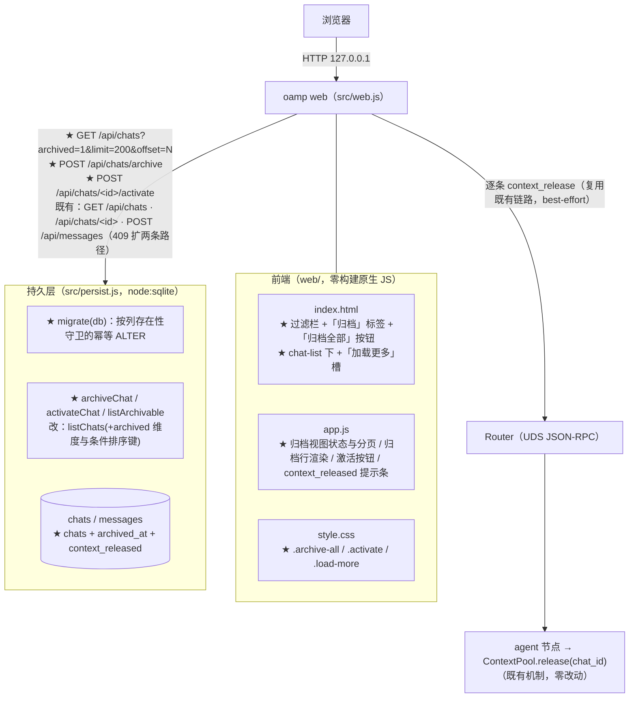
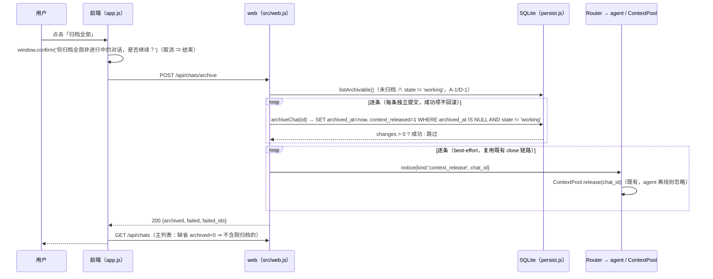
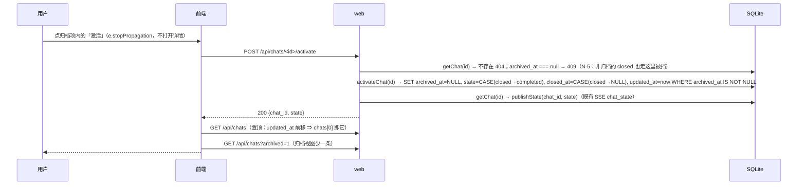
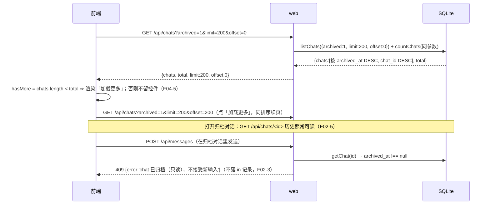

# architecture.md — 0013-chat-archive（迭代架构）

**版本**：1.0.0（阶段 3 产物）　**日期**：2026-09-11　**状态**：**L1 决策：本迭代无**（本次全部取舍落在 L2/L3，见 §13）；§3 / §4 的两处契约（迁移写法、双视图查询）为本次的硬约束，实现阶段不得偏离
**输入**：`prd.md`（v0.1.0，5 卡 F01~F05 / AR-01~AR-17 / M-01~M-05 已确认）+ `demand.md`（v0.2.0，A-1~A-10 / N-1~N-9 / E-1~E-8 / D-1~D-14 / M-1~M-11，仅作追溯基准）
**架构基线**：`docs/iterations/0012-roles-agent-cluster/architecture.md`（v1.2.0，已合入 `main`）+ 阶段 3 重新取证的代码库 `oamp/`（§1）
**前置**：0011 交付态（SQLite 落盘 / SSE / 上下文池 / 关闭即释放上下文）+ 0012 交付态（角色集群，未触碰 persist / web / web 前端）；当前 `oamp/test/*.test.js` 共 **20** 个文件（203/203 绿）
**约束**：零新第三方依赖（`oamp/package.json` 的 `dependencies` 保持 `{}`）；`roles/**` 只读；不改 workflow-pb 派发路径；**不引入任何新模块 / 新进程 / 新传输**

> 本文档回答 prd 的全部 17 条架构待填项（AR-01~AR-17，逐条落定见 §10），给出组件与数据流（§8）、分级决策（§9）与 PR 边界**输入**（§14；拆解归阶段 4）。

---

## 0. 一句话架构

> **在既有 `chats` 表上加两个字段（`archived_at` 归档标记+时间 / `context_released` 上下文已释放位），用一段按列存在性守卫的幂等 `ALTER TABLE` 迁移既有库；列表查询增加一个 `archived` 维度（缺省 0 = 排除已归档，1 = 只看已归档，排序键随视图切换），批量归档 = 后端一次编排 + 逐条 `UPDATE`（逐条成功/失败可见），激活 = 一条 `UPDATE`（清标记 + closed→completed + 清 closed_at + 前移 updated_at = 置顶）；前端过滤栏加一颗「归档」标签与一颗「归档全部」按钮，归档视图复用既有 `limit/offset` 协议按 200 条翻页。** 0011 的落盘口径 / SSE / 上下文池语义零改动。

---

## 1. 现有架构基线（阶段 3 重新取证，2026-09-11）

### 1.1 相关现有组件与文件

| 文件 | 现状职责（阶段 3 复核） | 与本次迭代的关系 |
|---|---|---|
| `oamp/src/persist.js`（220 行） | `openDb()` 建库 + `CREATE TABLE/INDEX IF NOT EXISTS` + `PRAGMA foreign_keys=ON`；`CHAT_STATES=['working','completed','failed','closed']`（:38）；`CHAT_COLUMNS`（:45）；`LIST_WITH`/`LIST_FROM` 单行参数 CTE（:49-56）；`stmts` 预编译表（:116-153）与 8 个导出写/读口（:155-218） | **改造（核心）**：SCHEMA +2 列；**新增幂等迁移块**；`LIST_FROM` + 归档谓词、`ORDER BY` 改条件排序键；新增 3 个口（`archiveChat` / `activateChat` / `listArchivable`） |
| `oamp/src/web.js`（544 行） | 内建 http 服务 + JSON API：`GET /api/agents` / `GET /api/chats`（q/agent/state/from/to/limit/offset）:372 / `GET /api/chats/<id>`:391 / `POST /api/chats/<id>/close`:401 / `GET /api/stream`:422 / `POST /api/messages`:431；`sendControlNotice`（:348）已承载 `notice{kind:'context_release'}` 链路 | **改造**：`/api/chats` 透传 `archived`；新增两个端点（批量归档 / 激活）；`POST /api/messages` 的 409 判定扩为两条只读路径 |
| `oamp/web/index.html`（67 行） | 过滤栏 3 颗静态按钮（:27-30，`.filters`）；`#chat-list`；详情头部 `#detail-title`/`#detail-meta`/`#btn-close`；底部 `#status-line`/`#hint` | **改造**：过滤栏 +「归档」标签 +「归档全部」按钮；`#chat-list` 下 +「加载更多」槽 |
| `oamp/web/app.js`（579 行） | `renderChats()`（:70-101，纯内存过滤 + TODAY/OLDER 分组）；`badge()`（:45-55）；`renderChat()`（:104-121）；`loadChats()`（:345-352，**无参数、只取第一页 50**）；过滤按钮绑定（:563-569）；`handleEvent`（:283-310）；`openChat`（:355） | **改造**：归档视图状态与分页、归档行渲染（归档时间 + 独立「激活」按钮）、批量归档入口与结果反馈、`context_released` 提示条 |
| `oamp/web/style.css` | `.filters{display:flex;gap:6px}`（:74）；`.filter.active`（:84）；`.chat-item`（:94-104）；`.notice-bar`（:275） | **微改造**：`.filters` 对齐 + `.archive-all{margin-left:auto}`；激活按钮与「加载更多」样式 |
| `oamp/test/persist.test.js`（409 行） | **逐字断言** schema 对象集与 chats 列名（:70-73）、详情 chat 键白名单（:303-305）、写口白名单（:106-111）、`upsertChat`/`closeChat` 返回对象 `deepEqual`（:314-345） | **必须同步（AR-17）**：见 §7 的逐条清单 |
| `oamp/test/web.test.js`（1044 行） | API 契约（列表 / 过滤 / close / 409 / SSE）与前端静态契约（:1000-1044） | **必须同步（AR-17）**：既有断言不变；新增端点与静态结构断言 |
| `oamp/README.md` | ① UI 描述（:126-129）② API 表（:153-158）③ 对话状态段「关闭后为 `closed`（终态、不可重开）」（:162）④ 常驻上下文与关闭段「不提供重开」（:175） | **同步（AR-17）**：见 §7 |
| `oamp/src/{router,registry,rpc,node-client,config,log,transport,task,agent,acp-client,context-pool,cluster,cluster-config,role-binding,status,cli}.js`、`oamp/web/index.html` 之外的前端结构、`oamp/package.json` | 0010~0012 交付面 | **不改**（本次不触碰集群 / agent / 上下文池 / 传输层） |

### 1.2 可直接复用的既有能力（决定了本方案"少造东西"）

| # | 既有能力（代码位置） | 本次如何复用 |
|---|---|---|
| A | 单行参数 CTE `p(q,agent,state,from_ts,to_ts)` + `LIST_FROM` + `countChats` 共用（`persist.js:49-56,145-152`） | `p` 加第 6 个参数 `archived`；**SELECT 与 COUNT 共用同一 `LIST_FROM` 与同一参数数组** ⇒ 两视图的 `total` 天然自洽（§3.3） |
| B | `closeChat` 的幂等写法 `UPDATE ... WHERE chat_id = ? AND state != 'closed'`（`persist.js:138`） | `archiveChat` 照同一形状加 `AND archived_at IS NULL AND state != 'working'` 守卫；`activateChat` 用 `AND archived_at IS NOT NULL` 守卫（§4） |
| C | 关闭链路：`getChat` → `closeChat` → `publishState` → 取 `chats.agent_id ∪ DISTINCT messages.agent_id` → `sendControlNotice(agentId,{kind:'context_release',chat_id})`，best-effort（`web.js:403-418`） | 归档的上下文释放**逐字复用**该链路（含 agent 集推导与 `.catch(()=>{})`）（§4.3） |
| D | `POST /api/chats/<id>/close` 的"预检 `getChat` → 404/幂等 → 变更 → 回 `{chat_id,state}`"形态（`web.js:403-418`） | `POST /api/chats/<id>/activate` 完全同形（§5.3） |
| E | `listChats` 的 `limit`（1..200，缺省 50）/`offset` 校验（`persist.js:74-86,191-207`）与 `GET /api/chats` 的透传（`web.js:372-390`） | 归档视图**不新增协议**：`limit=200` + `offset` 递增（demand M-10 已锁）（§5.2） |
| F | SSE `chat_state` 事件 + 前端 `handleEvent` 的状态就地更新（`app.js:300-310`） | 激活（单条、可能改 state）复用；批量归档不发 SSE（§5.1 理由） |
| G | `.notice-bar` 样式与 `renderNotices()` 渲染位（`app.js:155`、`style.css:275`） | F05-6 的「此后不再记得此前内容」说明**同级复用**该样式与渲染位（§6.4） |
| H | `#hint` 行（`index.html` 底部 + `app.js` 多处）承载一次性操作反馈 | 批量归档结果（AR-02）与激活反馈复用同一位置（§6.2） |
| I | `pragma_table_info('chats')` 已被测试用作列名真源（`persist.test.js:70-73`） | 迁移块用**同一函数**做列存在性守卫（§3.2） |

### 1.3 既有缺口（正好是 5 张卡的来源）

1. **无归档承载**：`chats` 表只有 `state`（四值，全程封闭），没有"是否归档 + 归档时间"的独立标记（F02-1 / F-事实 §3）。
2. **无迁移机制**：`openDb` 只有 `CREATE ... IF NOT EXISTS`，全仓无 `ALTER TABLE` / `PRAGMA user_version` / migrations ⇒ **对已存在的库改 SCHEMA 文本不会新增列**，加字段必须显式迁移（F02-AR-05）。
3. **列表无归档维度（且默认会返回全部）**：`LIST_FROM` 无"是否归档"谓词 ⇒ 若不改，归档项会继续出现在 All / 各状态过滤里（违反 F03-2 / M-8）。
4. **无状态变更端点**：只有 `close`，没有"移除归档标记"的落点（F05-AR-13）。
5. **归档列表容量缺陷**：`loadChats()` 不带参数、只取第一页 50 条且无分页 UI（`app.js:345-352`）⇒ 归档数超 50 必然"归档了却看不见"（M-9 / F04）。
6. **前端过滤是静态三颗按钮 + 纯内存过滤**（`index.html:28-30`、`app.js:70-101`）⇒ 归档视图需要服务端维度 + 分页状态。

### 1.4 阶段 3 只读取证（本次方案直接依赖）

| # | 结论 | 证据 |
|---|---|---|
| **S-1** | `chats` 现有列序为 `chat_id,title,agent_id,state,created_at,updated_at,closed_at`；`persist.test.js` 对**列名列表做顺序敏感**的 `deepEqual` | `persist.js:13-21`、`persist.test.js:70-73` |
| **S-2** | SQLite 的 `ALTER TABLE ... ADD COLUMN` 把新列**追加在末尾**；带常量默认值的 `NOT NULL` 列可 ADD（既有行取默认值） | SQLite 既有语义；本机 `node --experimental-sqlite`（Node 内置 `node:sqlite`）已由现库/现测验证可用 |
| **S-3** | `listChats` 的 `SELECT` 与 `countChats` 共用 `LIST_WITH + LIST_FROM`，参数数组在 `listChats()` 内构造一次并**同值喂给两者**（`persist.js:204-206`） | `persist.js:204-206` |
| **S-4** | 库文件真实存在且**含历史数据**：`oamp/data/sql.db`（被 `.gitignore` 覆盖）⇒ 迁移必须在既有库上真实生效，不能只改 SCHEMA 文本 | `oamp/data/sql.db`、`oamp/.gitignore` |
| **S-5** | 既有关闭链路的 agent 集推导 = `chats.agent_id ∪ {m.agent_id for m in messages}`（`web.js:415-417`） | `web.js:415-417` |
| **S-6** | 前端主列表**不由 SSE 驱动**：列表只在 `loadChats()` 调用时刷新（SSE `message`/`chat_state` 只更新详情与就地改行状态） | `app.js:283-310,345-352` |

---

## 2. 本次演进总体方案

### 2.1 组件图



图例：★ = 本次新增或改造；其余不变。**没有新增模块、没有新增进程、没有新增传输、没有新增第三方依赖。**

### 2.2 模块布局

| 模块 | 状态 | 职责一句话 |
|---|---|---|
| `oamp/src/persist.js` | 改造 | SCHEMA 补 2 列 + 幂等迁移块；列表查询加 `archived` 维度与条件排序键；新增 `archiveChat` / `activateChat` / `listArchivable` 三个口 |
| `oamp/src/web.js` | 改造 | `GET /api/chats` 透传 `archived`；新增 `POST /api/chats/archive`（后端一次编排 + 逐条结果）与 `POST /api/chats/<id>/activate`；`POST /api/messages` 409 判定扩为 archived/closed 两条路径 |
| `oamp/web/index.html` | 改造 | 过滤栏第 4 颗静态标签 + 右侧「归档全部」按钮；列表容器下新增「加载更多」槽 |
| `oamp/web/app.js` | 改造 | 归档视图（`state.archive` + 分页 + 空态）、归档行渲染（归档时间 + 原状态 badge + 独立「激活」按钮）、批量归档确认与结果反馈、`context_released` 提示条 |
| `oamp/web/style.css` | 微改造 | `.filters` 对齐与右对齐按钮；`.chat-item .activate`；`.load-more` |
| `oamp/test/persist.test.js` · `oamp/test/web.test.js` | 同步 | 既有逐字断言按 §7 更新；新增迁移 / 双视图 / 归档 / 激活 / 409 用例 |
| `oamp/README.md` | 阶段 5 同步 | UI 描述、API 表、状态段（closed 可重开的收窄例外）、上下文段（归档释放 / 激活不恢复）（§7.3） |
| 其余 `oamp/**`、`roles/**`、`package.json` | **不改** | 零新依赖；集群 / agent / 上下文池 / 传输 / SSE 语义零改动 |

### 2.3 与 0011 的关系（不改语义清单）

| 0011 语义 | 本迭代处置 |
|---|---|
| chat/message 落盘口径（一次提问 = 恰一条 in + 一条 out；过程不入库） | **零改动**（`insertInput`/`insertOutput` 的唯一变化是 `insertOutput` 顺带把 `context_released` 置 0） |
| SSE 四类事件（`message`/`task_update`/`chat_state`/`notice`）与重连兜底 | **零改动**（不新增事件类型） |
| 上下文池键 `(chat_id, agent_id)` / 同键串行 / LRU / release | **零改动**（只多一个触发点——归档，复用同一条 `context_release` 控制消息） |
| `closed` 哨兵（迟到输入/输出不改写已关闭 chat） | **零改动**；`activateChat` 是**唯一**能把 `closed` 变回 `completed` 的语句，且其 `WHERE archived_at IS NOT NULL` 把该例外**结构性地**收窄在"归档 → 激活"路径上（N-5 / D-6） |
| 关闭链路（`POST /close` 幂等 + `context_release` + 409） | **行为零改动**（只把 `/api/messages` 的 409 判定从"一条路径"扩为"两条路径"，closed 分支的文案与状态码不变） |
| `listChats` 的默认排序 `updated_at DESC, chat_id DESC` | **主列表零改动**（`archived=0` 时条件排序键取 `c.updated_at`，与既有逐字一致） |

---

## 3. 数据层：字段设计与迁移（落地 AR-04 / AR-05 / AR-08 的查询侧）

### 3.1 字段设计（AR-04）

**定案：只加两列，不加表、不加第三张索引、不加 `archived` 布尔标志位。**

| 列 | 类型 | 缺省 | 语义 |
|---|---|---|---|
| `archived_at` | `INTEGER`（**可空**） | 无（既有行 = `NULL`） | **归档标记与归档时间同址**：`NULL` = 未归档；非空 = 该对话本次归档的毫秒时间戳。F02-1 的"独立标记"+ F02-2 的"本次归档时间"由同一列承载 |
| `context_released` | `INTEGER NOT NULL DEFAULT 0` | `0` | `1` = 该对话的常驻上下文已释放且此后**未产生新回答**（归档时置 1；激活不改；产生 out 时置 0）。承载 F05-6 的说明"持续显示直到产生新回答"（§6.4） |

```sql
-- src/persist.js 的 SCHEMA（chats 段，最终形态；两列必须声明在 closed_at 之后，理由见 §3.2）
CREATE TABLE IF NOT EXISTS chats (
  chat_id          TEXT PRIMARY KEY,
  title            TEXT NOT NULL,
  agent_id         TEXT,
  state            TEXT NOT NULL,
  created_at       INTEGER NOT NULL,
  updated_at       INTEGER NOT NULL,
  closed_at        INTEGER,
  archived_at      INTEGER,                             -- ★ 归档标记 + 归档时间（NULL = 未归档）
  context_released INTEGER NOT NULL DEFAULT 0           -- ★ 上下文已释放且未产生新回答
);
```

**为什么用"可空时间戳"承载标记，而不是 `archived INTEGER` + `archived_at INTEGER` 两列**：

- 布尔标志与时间戳**不可能各自为真**；两列会引入"标记为真但时间为空"的非法状态与两处写入点（YAGNI + 数据自洽）。
- `archived_at IS NULL` 就是"未归档"的定义，**缺省值即正确语义**——正好满足 N-9（不做历史数据迁移：库中已有对话一律视为未归档）。
- 与既有 `closed_at` 的表达习惯同形（一个可空时间戳承载"发生过某事 + 何时"）。

**未归档项的默认取值**：既有行 `archived_at = NULL`、`context_released = 0`（由 `ADD COLUMN` 的缺省语义保证，见 §3.2）。

**`context_released` 的取舍说明（本次唯一的判断性新增，供主 agent 知悉，见 §13 / §15 R-4）**：F05-6 经用户确认的口径是"激活后打开该对话可见；**该提示持续显示，直到该对话产生新的回答后自动消失**"。这条持续期是**相对对话生命周期**定义的，不是相对页面会话——纯前端内存标记（激活时记一份、刷新即丢）会在"激活 → 刷新 → 尚未提问"的窗口里提前消失。因此该一位标志必须落库。它的三个写入点全部落在已有语句上：归档语句置 1、激活语句不动、输出语句置 0。

### 3.2 迁移写法（AR-05）

**现状**：`openDb()` 只有 `CREATE TABLE/INDEX IF NOT EXISTS`（S-1、F-02）；对已存在的库（含 `oamp/data/sql.db`，S-4）改 SCHEMA 文本**不会**新增列。

**定案：在 `openDb()` 内、`db.exec(SCHEMA)` 之后、预编译 `stmts` 之前，执行一段按列存在性守卫的幂等迁移。**

```js
// src/persist.js —— 幂等迁移（SCHEMA 之后调用；新库为 no-op，旧库补列）
const MIGRATIONS = [
  { column: 'archived_at',      ddl: 'ALTER TABLE chats ADD COLUMN archived_at INTEGER' },
  { column: 'context_released', ddl: 'ALTER TABLE chats ADD COLUMN context_released INTEGER NOT NULL DEFAULT 0' },
];

function migrate(db) {
  // 守卫真源 = pragma_table_info('chats')（与 persist.test.js 的列名断言同一函数，S-1/I）
  const existing = new Set(db.prepare("SELECT name FROM pragma_table_info('chats')").all().map((r) => r.name));
  for (const { column, ddl } of MIGRATIONS) {
    if (!existing.has(column)) db.exec(ddl);
  }
}

export function openDb(dbPath) {
  mkdirSync(path.dirname(dbPath), { recursive: true });
  const db = new DatabaseSync(dbPath);
  db.exec('PRAGMA foreign_keys = ON');
  db.exec(SCHEMA);      // 新库：两列已由 SCHEMA 建成
  migrate(db);          // 旧库：按列补；新库：两次无操作
  const stmts = { /* ... 引用新列的语句在此之后创建 ... */ };
  // ...
}
```

**可执行契约（四条硬约束）**：

| # | 约束 | 理由 / 判定 |
|---|---|---|
| M-1 | **幂等**：守卫是"该列是否已存在"，不是"是否跑过迁移"。`openDb` 每次调用都执行 `migrate`，第二次及以后全部为 no-op（不写 `user_version`、不加迁移表） | `persist.test.js` 既有"建库幂等：重复 openDb 同一路径不抛错"用例会在补列后复跑；新增用例须断言"旧库 → openDb → close → openDb"两次均成功且列形状不变 |
| M-2 | **新建库同构**：`archived_at` 必须声明在 `closed_at` **之后**、`context_released` 再其后——与 `ALTER ... ADD COLUMN` 的**追加语义**（S-2）逐位对齐 | `pragma_table_info('chats')` 的顺序即列序；`persist.test.js:71-74` 是**顺序敏感**的 `deepEqual` ⇒ 迁移库与新建库的列序必须一致，否则同一断言无法同时覆盖两种库 |
| M-3 | **既有行语义正确**：`archived_at` 可空且无默认 ⇒ 既有行 `NULL` = 未归档；`context_released NOT NULL DEFAULT 0` ⇒ 既有行 `0`（SQLite 允许"常量默认值的 NOT NULL 列"参与 ADD COLUMN） | 满足 N-9（不做历史数据迁移、既有 closed 对话保持现状、不被视为已归档、不补写归档时间） |
| M-4 | **不引入版本号机制**（不用 `PRAGMA user_version` / migrations 目录） | 列存在性守卫已自洽且自描述；版本号会引入第二处需要维护的真相（改 SCHEMA 时忘加版本 → 静默跳过）。**否决理由记录在案**：若将来迁移条目超过约 5 条或出现破坏性变更（改列类型 / 拆表），再引入版本号（L3，非本次范围） |
| M-5 | **不需要事务**：每条 `ALTER` 自身原子；进程若在两条之间退出，下一次 `openDb` 由同一守卫补齐第二条（自愈） | 中断只可能留下"补了一条列"的中间态，而中间态**仍是可用且正确的**（缺列会在下次 open 补上） |

**零影响面（回归）**：`migrate` 只对 `chats` 做"缺列则补"，**不触碰任何既有数据、不重建任何索引、不引入任何新表**；`messages` 表与两个既有索引完全不变。

### 3.3 列表查询的双视图语义（AR-08）

**需求**：① 主列表（All 及各状态过滤）默认**排除**已归档（F03-2 / M-8，AB C-3）；② 归档视图**只取**已归档、按 `archived_at DESC`（同时间按 `chat_id DESC`）排序（F03-3）；③ 归档视图的 `total` 与列表一致（F04 翻页依据）。

**定案：仍是"单条预编译语句覆盖全部组合"（不拆第二组 SELECT/COUNT），只给参数 CTE 加第 6 个槽，并把排序键改为条件表达式。**

```js
// 1) CTE 增第 6 个参数（缺省 0 = 未归档视图）
const LIST_WITH = 'WITH p(q, agent, state, from_ts, to_ts, archived) AS (VALUES (?, ?, ?, ?, ?, ?)) ';

// 2) LIST_FROM 增归档谓词（与既有五条一起 AND）
const LIST_FROM = `FROM chats c, p
  WHERE (p.q IS NULL OR c.title LIKE p.q ESCAPE '\\' OR EXISTS(SELECT 1 FROM messages m2 WHERE m2.chat_id = c.chat_id AND m2.text LIKE p.q ESCAPE '\\'))
    AND (p.agent IS NULL OR c.agent_id = p.agent OR EXISTS(SELECT 1 FROM messages m3 WHERE m3.chat_id = c.chat_id AND m3.agent_id = p.agent))
    AND (p.state IS NULL OR c.state = p.state)
    AND (p.from_ts IS NULL OR c.updated_at >= p.from_ts)
    AND (p.to_ts IS NULL OR c.updated_at <= p.to_ts)
    AND ((p.archived = 1 AND c.archived_at IS NOT NULL) OR (p.archived = 0 AND c.archived_at IS NULL))`;   // ★ 双视图互斥

// 3) listChats 的 SELECT：列表项多带 archived_at（归档项要展示归档时间，F03-4）
listChats: db.prepare(
  `${LIST_WITH}SELECT c.chat_id, c.title, c.agent_id, c.state, c.created_at, c.updated_at, c.archived_at,
     (SELECT COUNT(*) FROM messages m WHERE m.chat_id = c.chat_id) AS message_count
   ${LIST_FROM}
   ORDER BY (CASE WHEN p.archived = 1 THEN c.archived_at ELSE c.updated_at END) DESC, c.chat_id DESC   -- ★ 条件排序键
   LIMIT ? OFFSET ?`,
),
countChats: db.prepare(`${LIST_WITH}SELECT COUNT(*) AS total ${LIST_FROM}`),   // 与 SELECT 共用同一 FROM 与同一参数
```

```js
// 4) listChats 参数面：新增 archived，缺省 0（主列表）；非法值 → 抛错（与 limit/state 同风格）
function readArchived(value) {
  if (value === undefined || value === null || value === 0) return 0;
  if (value === 1) return 1;
  throw new Error(`查询参数非法: archived 需为 0|1（当前值 ${JSON.stringify(value)}）`);
}
// params 数组：追加 readArchived(archived)，顺序与 CTE 槽位一致
//   [q, agent, state, from, to, archived] → 同值喂给 stmts.listChats.all(...params, limit, offset) 与 stmts.countChats.get(...params)
```

**契约（四条）**：

| # | 契约 | 说明 |
|---|---|---|
| V-1 | **两视图互斥**：`archived=0`（缺省）⇒ `archived_at IS NULL`；`archived=1` ⇒ `archived_at IS NOT NULL`。没有"两者都返回"的取值 | F03-2 / M-8；也让"归档的 completed 不会同时出现在 Completed 页"在 SQL 层成立 |
| V-2 | **`countChats` 与 SELECT 恒一致**：二者共用同一 `LIST_FROM` 与同一参数数组（S-3），`total` 就是当前视图的总数，直接作为"是否还有更多"的判据（§6.3） | F04 翻页正确性的地基；不需要第二套计数逻辑 |
| V-3 | **排序随视图切换，且逐字满足产品**：`archived=1` ⇒ 排序键取 `c.archived_at`（同值由 `c.chat_id DESC` 兜底，F03-3 的"同归档时间按对话标识倒序"）；`archived=0` ⇒ 排序键取 `c.updated_at`（与既有逐字一致，既有排序断言零改动） | 一个 `CASE` 表达式同时满足两边，避免第二组语句与"两组语句的 total 可能分叉"的风险 |
| V-4 | **不新增索引**（`idx_chats_updated` / `idx_messages_chat_time` 之外不加 `archived_at` 索引） | 条件排序键本身无法走索引（CASE 在排序表达式里），为过滤谓词单独建索引在当前数据量级（个人控制台）无收益；**代价与再评估条件记入 §15 R-2** |
| V-5 | **`state` 校验不变**：`state ∈ CHAT_STATES` 的检查保持（`closed` 仍合法）；`archived` 与 `state` 是**正交**两个维度（`GET /api/chats?state=closed` 缺省仍排除已归档，符合 M-8 的"各状态过滤一律排除已归档"） | 既有 `state=closed` 断言（未归档的 closed 对话）不受影响 |

---

## 4. 写口与只读判定（落地 AR-06 / AR-07 / AR-13 / AR-14 / AR-15）

### 4.1 新增的三个口（持久层）

```js
const stmts = {
  // ... 既有 11 条不变 ...

  // ★ 归档：标记 + 归档时间同址写入，并置"上下文已释放"位。
  //    双守卫：archived_at IS NULL（幂等：已归档跳过，F01-4）+ state != 'working'（范围：进行中不可归档，F01-2 的结构性兜底）
  archiveChat: db.prepare(
    `UPDATE chats SET archived_at = ?, context_released = 1
      WHERE chat_id = ? AND archived_at IS NULL AND state != 'working'`),

  // ★ 激活：移除标记 + 状态还原 + 置顶，三件事一条语句
  //    WHERE archived_at IS NOT NULL 把"可重开"结构性地收窄在归档→激活路径上（N-5 / D-6）
  activateChat: db.prepare(
    `UPDATE chats
        SET archived_at = NULL,
            state      = CASE WHEN state = 'closed' THEN 'completed' ELSE state END,
            closed_at  = CASE WHEN state = 'closed' THEN NULL ELSE closed_at END,
            updated_at = ?
      WHERE chat_id = ? AND archived_at IS NOT NULL`),

  // ★ 批量归档的候选集（读口）：未归档 且 非进行中 = A-1 / D-1 的范围，逐字落在 SQL 上
  listArchivable: db.prepare(
    `SELECT chat_id FROM chats WHERE archived_at IS NULL AND state != 'working' ORDER BY chat_id`),
};
```

```js
// 包装函数（与既有 closeChat 同风格：参数顺序 = 语句占位符顺序）
function archiveChat(chatId, nowMs = Date.now()) {
  return stmts.archiveChat.run(nowMs, chatId).changes > 0;   // true = 本次真的归档了（已归档/进行中 → false）
}
function activateChat(chatId, nowMs = Date.now()) {
  return stmts.activateChat.run(nowMs, chatId).changes > 0;  // true = 本次真的激活了（未归档 → false）
}
function listArchivable() {
  return stmts.listArchivable.all().map((r) => r.chat_id);
}
```

**导出白名单（最终形态）**：

```js
return {
  insertInput, insertOutput, upsertChat, closeChat,          // 既有
  archiveChat, activateChat, listArchivable,                  // ★ 新增
  startupSweep, listChats, getChat, close,                    // 既有
};
```

**既有语句的两处最小改动**：

```js
// ① getChat 的列面：CHAT_COLUMNS 追加两列（详情接口据此回传 archived_at / context_released）
const CHAT_COLUMNS = 'chat_id, title, agent_id, state, created_at, updated_at, closed_at, archived_at, context_released';

// ② insertOutput 走 setOutputState：清"上下文已释放"位（F05-6 提示的消失时机 = 产生新回答）
setOutputState: db.prepare(`UPDATE chats SET state = ?, updated_at = ?, context_released = 0 WHERE chat_id = ? AND state != 'closed'`),
```

### 4.2 激活的语义落点（AR-14 / AR-15）

**一条 `UPDATE` 同时完成三件事**，理由：三者必须原子（不能出现"标记已清但状态未还原"的中间态），且 `UPDATE ... SET` 的所有右值都按**更新前的行值**求值 ⇒ `CASE WHEN state = 'closed'` 判定的是**激活前**的状态，逐字实现 F05-4 / D-5 / A-5 后半。

| 产品要求 | 语句落点 |
|---|---|
| F05-1 移除归档标记 | `SET archived_at = NULL` |
| F05-4 / A-5 后半：closed → completed，其余保持原状态 | `SET state = CASE WHEN state = 'closed' THEN 'completed' ELSE state END` |
| F05-4 清除关闭时间（仅当原本 closed） | `SET closed_at = CASE WHEN state = 'closed' THEN NULL ELSE closed_at END` |
| F05-3 / D-9 置顶主列表 | `SET updated_at = ?`（= 激活时刻）⇒ 主列表既有 `ORDER BY c.updated_at DESC, c.chat_id DESC` 天然把它排到最前，**不新增排序字段、不改排序规则** |
| N-5 / D-6：非归档的 closed 仍不可重开 | `WHERE archived_at IS NOT NULL` —— 未归档的 closed 对话**匹配不到任何行**（`changes = 0`），结构性保证而非靠调用方自觉 |
| 幂等 | 同上守卫：重复激活第二次 `changes = 0`，`updated_at` 不再前移 |

### 4.3 上下文释放的触发方式（AR-07）

**复用既有 `context_release` 链路，不新造机制**（demand §3 的产品级结论）：

| 项 | 定案 |
|---|---|
| 触发点 | `POST /api/chats/archive` 里，对**每一个成功归档的 chat_id** 发释放通知（与 `close` 的触发点同形） |
| 形式 | `sendControlNotice(agentId, { kind: 'context_release', chat_id })`（`web.js:348` 既有函数，逐字复用） |
| 目标 agent 集 | `chats.agent_id ∪ { m.agent_id | m ∈ messages(chat_id), m.agent_id ≠ null }`（S-5：与 `close` 用同一段推导） |
| 失败语义 | **best-effort**：`.catch(() => {})`，与 `close` 完全一致——这是既有口径，不因批量而改变（失败不写日志、不影响 `archived` 计数） |
| 为什么不会"漏释放" | agent 在线 ⇒ 收到通知、`ContextPool.release(chat_id)` 释放该 chat 的**全部**常驻上下文（`agent.js:456-466`）；agent 离线/进程已亡 ⇒ 其上下文随进程消失，无需释放 |
| 不做什么 | **不新造 ACP 消息类型、不改 pool、不在激活侧做任何上下文动作**（N-4：激活不恢复上下文；归档释放过的上下文不会回来，由 §6.4 的提示显式管理用户预期） |

### 4.4 只读判定（AR-06）

**两条独立路径，任一条命中即拒收新输入**（F02-4 / C-2），判定点唯一：`POST /api/messages` 的既有 409 分支。

```js
const existing = db.getChat(chatId);
if (existing && (existing.chat.archived_at !== null || existing.chat.state === 'closed')) {
  sendJson(res, 409, {
    error: existing.chat.archived_at !== null
      ? 'chat 已归档（只读），不接受新输入'
      : 'chat 已关闭，不接受新输入',
  });
  return;
}
```

| 来源 | 判定字段 | 结果 |
|---|---|---|
| 归档只读（本次新增） | `archived_at IS NOT NULL` | 409 +「已归档（只读）」文案 |
| 已关闭只读（0011 既有） | `state === 'closed'` | 409 +「已关闭」文案（**文案与状态码逐字不变**） |
| 两者同时命中（closed 对话被归档） | 归档分支**优先** | 409（F02-4 的"两条路径并存不冲突"） |
| 优先级与互不依赖 | 两条判定**无优先级依赖**：任一条成立即拒收；归档判定**不**依赖 `state`、关闭判定**不**依赖 `archived_at` | 归档一条 completed 对话后它立刻只读（F02-4 的后半） |

**持久层的结构性兜底（不是第二判定路径，是防御）**：`archiveChat` 不匹配 `working`（归档不会打断进行中的轮次）、`activateChat` 只匹配已归档（N-5）。`setWorking`/`setOutputState` 的 `state != 'closed'` 哨兵**保持不变**。

---

## 5. 接口形态（落地 AR-01 / AR-02 / AR-08 API 侧 / AR-11 / AR-13）

### 5.1 批量归档（AR-01 / AR-02）

**定案：后端一次编排的批量端点——`POST /api/chats/archive`。**

| 候选 | 结论 |
|---|---|
| **A（选定）：后端批量端点，内部逐条 `UPDATE`** | ✅ 一次往返；范围由服务端计算（前端不可能算错范围）；逐条成功/失败与 F01-6/7、M-7 的"每条独立生效 + 失败项提示"一一对应；DB 写入逐条提交 ⇒ 天然"不回滚已成功项" |
| B：前端逐条调用一个单条归档接口 | ❌ N 次往返；范围判定搬到前端（M-8/M-9 的同类缺陷会重演：前端只有第一页 50 条，算不全范围）；失败项编排散在前端 |
| C：单条 `UPDATE ... WHERE`（一条语句归档全部） | ❌ 语句级原子 ⇒ **"单条失败"在语义上不存在**，F01-6/7 的失败反馈退化为死代码；也无法给出失败项清单 |
| D：额外再提供一个单条归档端点 | ❌ **产品没有任何单条归档触发点**（F01 只有「归档全部」；F03 的归档视图只有「激活」）⇒ 无调用方的接口（YAGNI） |

```
POST /api/chats/archive          （无请求体；范围完全由服务端按 A-1/D-1 计算）
```

**编排契约（顺序即语义）**：

```js
const ids = db.listArchivable();               // ① 候选集：未归档 且 非进行中（一条 SELECT，不受分页限制）
const archivedIds = []; const failedIds = [];
for (const chatId of ids) {                    // ② 逐条独立提交
  try {
    if (db.archiveChat(chatId)) archivedIds.push(chatId);   // 逐语句 autocommit ⇒ 成功项不回滚
  } catch {
    failedIds.push(chatId);                    // 单条失败只影响该条；失败项 archived_at 仍为 NULL ⇒ 仍在主列表
  }
}
for (const chatId of archivedIds) {            // ③ 逐条释放上下文（best-effort，§4.3）
  try { /* getChat → agent 集 → sendControlNotice(...,{kind:'context_release'}) */ } catch { /* 忽略 */ }
}
sendJson(res, 200, { archived: archivedIds.length, failed: failedIds.length, failed_ids: failedIds });
```

**响应形态（AR-02）**：

```json
{ "archived": 3, "failed": 0, "failed_ids": [] }
```

| 字段 | 含义 | 承载的产品要求 |
|---|---|---|
| `archived` | 本次**真的**被归档的条数（不含已归档跳过项、不含进行中） | F01-6 "至少包含成功归档的条数"；F01-8 "零可归档项时回 `archived: 0`，仍给出反馈" |
| `failed` / `failed_ids` | 失败条数与失败项清单（恒存在；无失败时 = `0` / `[]`） | F01-6 "存在失败项时给出失败条数或失败项清单"；F01-7 "失败项仍留在主列表，可再次「归档全部」重试"（其 `archived_at` 仍为 `NULL`，下次调用自然重新入选） |

| 边界情形 | 行为 |
|---|---|
| 无可归档项（全部已归档 / 只剩进行中） | `200 {archived:0, failed:0, failed_ids:[]}`（F01-8 / M-01：不静默） |
| 已归档的对话 | 被 ① 的 `archived_at IS NULL` 过滤掉 ⇒ 不进候选；`archiveChat` 又有 `archived_at IS NULL` 守卫 ⇒ 其归档时间**不被本次改动**（F01-4 / F02-2 后半） |
| 进行中的对话（`working`） | 被 ① 与 `archiveChat` 双重排除 ⇒ 留在主列表且状态不变（F01-2 / E-5） |
| 批量执行中某条失败 | 已成功的保持已归档（§4 的 autocommit + `changes>0` 逐条判定）；失败项留在主列表可重试（F01-7） |

**不发 SSE 事件**（定案，含理由）：

- 归档**不改变 `state`**（F02-1），`chat_state` 事件的载荷会是"同值"的空事件；
- 主列表**本身不由 SSE 驱动**（S-6：列表只在 `loadChats()` 时刷新）；
- N 条归档就发 N 条事件属噪声。
- 因此：**结果可见性由响应 + 前端显式重载承载**（F01-6 / M-05"无需手动刷新页面"由 `archiveAll()` 在响应后调 `loadChats()` 满足）。
- 唯一例外：归档的是**当前打开的那个对话**时，该 chat 的 `context_release` 会经 agent 回发 SSE `notice(context_released)`（既有链路，§4.3），前端照既有逻辑渲染提示条——这不是新增事件，是既有链路的自然结果。

### 5.2 归档视图查询（AR-08 API 侧 / AR-11）

```
GET /api/chats?archived=1&limit=200&offset=0      归档视图（只取已归档，按归档时间倒序）
GET /api/chats                                   主列表（缺省 archived=0，排除已归档；limit 缺省 50）
```

| 项 | 定案 | 依据 |
|---|---|---|
| 参数名 | `archived`，取值 `0`\|`1`，缺省 `0` | 与既有 `state`/`agent`/`q` 同为透传查询参数，不需要新端点 |
| 首屏 / 续页条数 | **200**（既有 API 上限，`LIMIT_MAX`），首屏与续页同值 | demand M-10 / D-7："较大首屏 limit（API 上限 200）+ 底部加载更多按 offset 翻页；沿用现有分页协议，不新增后端形态" |
| 翻页 | `offset` 递增（`offset += 已持有条数`），**不新增游标 / 不新增 header** | 同上 |
| 排序 | 服务端保证（§3.3 V-3）：`archived_at DESC, chat_id DESC` | F03-3 / F04-4 |
| `total` | 由 `countChats`（同一 `LIST_FROM`）给出 = 该视图总数，前端据此判断"是否还有更多" | §3.3 V-2；F04-5（末尾无死控件） |
| 非法 `archived` | `400 {error:'查询参数非法: archived 需为 0\|1…'}`（由 `readArchived` 抛出，web 的既有 catch 转 400） | 与 limit/state 非法值的既有风格一致 |
| 归档专属搜索 / 时间过滤 | **不新增**（`q`/`agent`/`from`/`to` 与 `archived` 可组合，因为都在同一个 CTE 里；但没有归档专属的新维度） | N-6 |

### 5.3 激活（AR-13）

**定案：新增 `POST /api/chats/<chat_id>/activate`，复用既有"单条状态变更"路径形态（D 能力复用），不引入通用 PATCH/PUT。**

```
POST /api/chats/<chat_id>/activate      （无请求体）
200 → { chat_id, state }               （state = 激活后的状态：closed 来源 → 'completed'；其余原样）
404 → chat 不存在
409 → { error: 'chat 未归档，无法激活' }      （未归档的对话不能走这条路 ⇒ N-5 的 API 面表达）
```

| 处理步骤 | 代码落点（与 `close` 同形） |
|---|---|
| ① 存在性 | `const found = db.getChat(chatId); if (!found) → 404` |
| ② 前置状态 | `if (found.chat.archived_at === null) → 409`（未归档不可激活；**非归档的 closed 在此被挡住**，N-5 / D-6） |
| ③ 变更 | `if (!db.activateChat(chatId)) → 409`（§4.2 的一条语句：清标记 + closed→completed + 清 closed_at + 前移 updated_at；返回 `false` = 该行未被更新（② 之后已非归档，单进程下不可达）⇒ **防御性**回 409、不进入 ④，不产生"未变更却报成功"的应答） |
| ④ 通知 | `const after = db.getChat(chatId); publishState(chatId, after.chat.state)`（单条、可能真的改了 state ⇒ 用既有 `chat_state` 事件；与 close 对称；状态读**库值**而非在 JS 里复刻 SQL 的 `CASE`，避免第二处真相） |
| ⑤ 应答 | `sendJson(res, 200, { chat_id: chatId, state: after.chat.state })` |

- **为什么 409 而不是幂等 200**：与 `/close` 的"幂等"不同，激活的前置条件（必须已归档）是**收窄例外的边界**（N-5）；对未归档的对话静默返回 200 会让"可重开范围"在 API 面失去表达。`close` 的幂等语义**不变**。
- **为什么用 `<id>/activate` 而不是 `<id>/restore` / 通用 PATCH**：与既有 `<id>/close` 逐字同构（一个动作动词 + 一个子资源），前端与测试的心智负担最小；通用 PATCH 会引入"哪些字段可改"的新契约面（YAGNI，`demand` 明确"无通用 PATCH/PUT"）。
- **缓存/幂等重复点击**：第二次调用 `changes = 0`（守卫），且 ② 已在 API 层返回 409 ⇒ 不会重复前移 `updated_at`。

### 5.4 端点总览（改造后）

| 方法 + 路径 | 变更 | 说明 |
|---|---|---|
| `GET /api/agents` | 不变 | — |
| `GET /api/chats` | **+`archived` 参数** | 缺省 0 = 排除已归档（主列表）；`1` = 只看已归档（归档视图） |
| `GET /api/chats/<id>` | 不变（响应多两个键） | `chat` 对象新增 `archived_at` / `context_released`（`CHAT_COLUMNS` 扩展） |
| `POST /api/chats/archive` | **新增** | 批量归档（§5.1）；路由为字面量，与 `<id>/close` 的**后缀匹配**不冲突（后者要求 `/close` 结尾） |
| `POST /api/chats/<id>/close` | 不变 | 行为 / 幂等 / 文案 / 提示逐字不变 |
| `POST /api/chats/<id>/activate` | **新增** | 单条激活（§5.3） |
| `GET /api/stream` | 不变 | 不新增事件类型 |
| `POST /api/messages` | **409 判定扩为两条路径** | §4.4；closed 分支文案不变 |

---

## 6. 前端方案（落地 AR-03 / AR-09 / AR-10 / AR-11 前端侧 / AR-12 / AR-16）

### 6.1 过滤栏结构（AR-03 / AR-09）

```html
<!-- web/index.html：.filters 最终形态（★ = 新增；既有三颗按钮逐字保留） -->
<div class="filters">
  <button class="filter active" data-filter="all">All</button>
  <button class="filter" data-filter="working">Working</button>
  <button class="filter" data-filter="completed">Completed</button>
  <button class="filter" data-filter="archived">归档</button>          <!-- ★ 第 4 颗静态标签（F03-1 / D-3） -->
  <button id="btn-archive-all" class="archive-all">归档全部</button>    <!-- ★ 右侧入口（F01-1 / D-11） -->
</div>
...
<div id="chat-list" class="chat-list"></div>
<div id="load-more-slot" class="load-more-slot"></div>                  <!-- ★ 归档视图的「加载更多」槽（F04-3） -->
```

```css
/* web/style.css 追加 */
.filters { align-items: center; }              /* 既有规则追加一项 */
.archive-all { margin-left: auto; /* 既有按钮视觉 token（border/背景/字号）沿用 .filter / .new-chat 一族 */ }
.chat-item .activate { /* 小型次级按钮：与 .meta 行同高，点击不冒泡 */ }
.load-more-slot { padding: 4px 12px 12px; }
.load-more { width: 100%; /* 次级按钮样式 */ }
```

| AR | 落定 |
|---|---|
| AR-03 | 「归档全部」= `.filters` 容器内的第 5 个元素，靠 `margin-left:auto` 抵到该行**最右侧**（同一区域、无需进入其他页面，F01-1 的判定面）；文案固定「归档全部」；复用既有 `.filter`/`.new-chat` 的视觉 token，**不新增 CSS 变量** |
| AR-09 | 「归档」= 第 4 颗 `.filter` 按钮（`data-filter="archived"`），与既有三颗**完全同构**；选中态沿用既有 `.filter.active` 的 class 切换（`bind()` 的循环只加一个分支，见 §6.2），**不新增选中态表达** |

### 6.2 交互逻辑（AR-12 / AR-02 前端侧）

```js
// app.js —— 新增常量与状态
const ARCHIVE_PAGE_SIZE = 200;                                          // 首屏 = 续页 = API 上限（§5.2 / M-10）
const ARCHIVE_CONFIRM_TEXT = '将归档全部非进行中的对话，是否继续？';      // A-9 逐字（不显示条数，D-8）
state.archive = { chats: [], total: 0, loading: false };                // ★ 归档视图的独立状态

// ① 归档视图加载（首屏 / 续页共用一个函数）
async function loadArchived({ append = false } = {}) {
  if (state.archive.loading) return;
  state.archive.loading = true;
  try {
    const offset = append ? state.archive.chats.length : 0;
    const { chats, total } = await api(`/api/chats?archived=1&limit=${ARCHIVE_PAGE_SIZE}&offset=${offset}`);
    state.archive = { chats: append ? [...state.archive.chats, ...chats] : chats, total, loading: false };
  } catch { state.archive.loading = false; }
  renderChats();
}

// ② 渲染：视图来源与空态文案分支
const viewingArchive = state.filter === 'archived';
const chats = viewingArchive
  ? state.archive.chats                                                   // 服务端已按 archived_at DESC 排好
  : state.chats.filter((c) => state.filter === 'all' || c.state === state.filter);  // 既有内存过滤逐字保留
// 空态：viewingArchive → '还没有归档的对话'（A-10）；其余沿用既有两句文案
// 分组：归档视图**不分组**（TODAY/OLDER 依赖 updated_at，与归档时间轴不符）；主列表分组逻辑不变

// ③ 归档行 = 既有行 + 归档时间 + 原状态 badge + 独立「激活」按钮（F03-4/5、AR-10）
//    <div class="chat-item" data-chat="…">
//      <div class="title">…</div>
//      <div class="meta">{badge(c.state)}<span class="agent">@…</span><span>{fmtTime(c.archived_at)}</span>
//        <button class="activate" data-activate="…">激活</button></div>
//    </div>
//    绑定：行 el.onclick = () => openChat(...)（不变）；按钮 btn.onclick = (e) => { e.stopPropagation(); activate(c.chat_id); }

// ④ 「加载更多」：有更多才渲染（F04-3 / F04-5）
//    hasMore = viewingArchive && state.archive.chats.length < state.archive.total
//    $('load-more-slot').innerHTML = hasMore ? '<button id="btn-load-more" class="load-more">加载更多</button>' : '';
//    绑定：btn-load-more.onclick = () => loadArchived({ append: true });

// ⑤ 批量归档（F01-5/6/7/8、AR-02）
async function archiveAll() {
  if (!window.confirm(ARCHIVE_CONFIRM_TEXT)) return;                      // 取消 ⇒ 不发请求（A-9）
  const hint = $('hint');
  try {
    const r = await api('/api/chats/archive', { method: 'POST' });
    hint.className = r.failed > 0 ? 'hint error' : 'hint';
    hint.textContent = r.failed > 0
      ? `已归档 ${r.archived} 条，${r.failed} 条失败——失败项仍留在主列表，可再次点击「归档全部」重试`
      : `已归档 ${r.archived} 条`;                                        // r.archived === 0 时即 F01-8 的反馈
    await loadChats();
    if (viewingArchive) await loadArchived();
    if (state.chat && state.chat.archived_at !== null) await refreshChat();
  } catch (err) { hint.className = 'hint error'; hint.textContent = `归档失败：${err.message}`; }
}
$('btn-archive-all').onclick = archiveAll;

// ⑥ 激活（F05-1/2/3）
async function activate(chatId) {
  const hint = $('hint');
  try {
    const r = await api(`/api/chats/${encodeURIComponent(chatId)}/activate`, { method: 'POST' });
    hint.className = 'hint'; hint.textContent = `已激活（状态：${r.state}）——已回到 All 列表顶部，可继续对话`;
    await loadChats();                                                     // 主列表多一条（且置顶）
    await loadArchived();                                                  // 归档视图少一条
    if (state.chat && state.chat.chat_id === chatId) await refreshChat();
  } catch (err) { hint.className = 'hint error'; hint.textContent = `激活失败：${err.message}`; }
}

// ⑦ 过滤按钮绑定：唯一改动 = 切到归档时触发一次加载
btn.onclick = () => {
  state.filter = btn.dataset.filter;
  document.querySelectorAll('.filter').forEach((b) => b.classList.toggle('active', b === btn));
  if (state.filter === 'archived') loadArchived(); else renderChats();      // 主列表已在内存，零请求
};
```

| AR | 落定 |
|---|---|
| AR-12 | 归档视图状态独立承载于 `state.archive = { chats, total, loading }`：**已加载范围** = `chats.length`；**是否还有更多** = `chats.length < total`（`total` 来自 `countChats`，§3.3 V-2）；**与筛选条件的联动** = 切到 `archived` 时按缺省视图加载一次、切走时不销毁（`state.chats` 与 `state.archive` 互不污染）、归档/激活动作后按需重载；`loading` 防重复点击 |
| AR-02 前端侧 | 成功/失败条数与失败提示统一落在既有 `#hint` 行（H 能力复用），与"发送失败 / 关闭失败"同一位置；不新增 toast / 弹窗 |
| AR-10 | 按钮点击 `e.stopPropagation()`；行级 `openChat` 绑定不变 ⇒ 点按钮**不**打开详情（F03-5 / M-4），点行内其他区域**仍**打开详情 |

### 6.3 主列表的零改动面（回归边界）

- `loadChats()` **不加参数**（服务端缺省 `archived=0`）⇒ 主列表自动排除已归档，函数体可逐字不变；
- 过滤逻辑 `state.filter === 'all' || c.state === state.filter` **逐字保留**（只在取数来源上分支）；
- TODAY/OLDER 分组、`badge()`、`openChat`、SSE 处理、`@` 补全、一次性开关、working 等待计时**全部不变**。

### 6.4 只读与提示（AR-16、F02-3、F05-6）

**A. 归档对话的只读表现**：不新增详情内的"已归档"标识（F02 边界明文排除"归档标识在对话详情内的展示形态"）。只读由服务端 409 承担，前端走既有 `send()` 的 catch 分支显示「发送失败：chat 已归档（只读），不接受新输入」。**另**：`renderChat()` 的关闭按钮禁用条件由 `chat.state === 'closed'` 扩为 `chat.state === 'closed' || chat.archived_at !== null`——归档对话已是只读面，不应再提供会改写其状态的「关闭对话」动作（一行改动，与 F02-3 的只读结论一致）。

**B. 「上下文不延续」说明（AR-16）**：

```js
// renderChat()：说明条位于消息区**顶部**（对话头部），复用既有 .notice-bar（"同级说明"= 与上下文释放提示同一视觉层级）
// 显示判据（D2 契约）：非归档只读态 ∧ 上下文已释放 ∧ 尚未产生新回答
const freshBar = chat.archived_at === null && chat.context_released === 1
  ? '<div class="notice-bar">激活后上下文已重置，本对话后续回复不再记得此前内容</div>'
  : '';
box.innerHTML = freshBar + body + renderStreamSlot(chat) + renderNotices(chat.chat_id);
```

| 项 | 落定 |
|---|---|
| **触发时点（D2 时序契约，pr-002 按此实现）** | ① **归档动作**（pr-001 的 `stmts.archiveChat`）把 `context_released` 置 1，并同时经既有 `context_release` 链路释放该 chat 的常驻上下文（§4.3）；② `activateChat` **不改该列**（只清 `archived_at`、还原 state、前移 `updated_at`）⇒ **「激活后打开该对话」时该值仍为 1**，`openChat`/`refreshChat` 全量拉详情 ⇒ 打开即可见；③ 该对话**产生新的回答**时，pr-001 的 `setOutputState` 追加 `context_released = 0` ⇒ 该轮 `message(out)` 事件触发 `refreshChat()` 时该条消失。三点合起来 = "激活后可见、直到产生新回答才消失"（M-04 确认口径） |
| **显示判据** | `chat.archived_at === null && chat.context_released === 1`（`archived_at` 由 `GET /api/chats/<id>` 返回，§4.1 的 `CHAT_COLUMNS`）。加 `archived_at === null` 这一半的理由：文案以"激活后"为前提，而**归档但未激活**的对话同样可以打开（F02-5）且其 `context_released` 也为 1——若不加此半，那个只读详情页会显示一句前提不成立的说明。带此半后，该条的语义 = F05-6 的状态本身 |
| 呈现承载 | 服务端状态位（`chats.context_released`）而非前端内存 ⇒ 刷新 / 重开页面后仍可见（满足 M-04 确认的"持续显示，直到产生新回答"） |
| **与既有 SSE `state.notices` 的关系（D6 契约）** | **同级复用但两通道独立、允许并存、不做去重**：同一 `.notice-bar` 样式与同一渲染位；既有 SSE 驱动的 `state.notices`（运行时事件、刷新不重现）**逐字保持原样**。同一操作下的预期：① 归档**当前打开**的对话 ⇒ 只有 SSE notice（`context_released`）出现，持久条不出现（`archived_at !== null`）——恰一条；② **激活后打开** ⇒ 只有持久条出现（激活不触发释放，不会产生新的 `context_released` notice）——恰一条；③ 关闭一个"激活后尚未提问"的对话 ⇒ SSE notice（关闭即释放）与持久条（`archived_at === null` 且 `context_released === 1`）**同时出现两条**——这是唯一并存场景，两条都陈述事实（一条讲刚发生的事件、一条讲当前状态），**判为可接受、不去重**。不去重的理由：去重需在 `state.notices` 里额外保存 `kind` 并把渲染耦合到持久位，收益仅为少一行重复文案，却会丢掉"释放动作当下的即时反馈"与"跨刷新的持久状态"这两类不同信息。**阶段 6 判定口径**：按"至少一条包含『不再记得此前内容』"断言，**不断言条数** |
| 提示文案 | 「激活后上下文已重置，本对话后续回复不再记得此前内容」（D-12 / A-6 的语义；与既有 `context_released` 文案同族，不新增术语）。因为显示判据含 `archived_at === null`，该文案的"激活后"前提**在所有显示场景下都成立**（D2 的根因由此闭合） |
| 上下文**确实**不延续（F05-5 / N-4） | **零代码**：归档已 `release` 该 chat 的全部常驻上下文（§4.3），激活不做任何恢复动作 ⇒ 下一轮新建 ACP 会话，模型看不到归档前内容。提示条只负责管理用户预期 |

---

## 7. 既有契约的同步范围（AR-17）

### 7.1 `oamp/test/persist.test.js`（逐字断言的精确改法）

| 位置 | 现状 | 改法 |
|---|---|---|
| `schema` 用例（:70-73） | `pragma_table_info('chats')` 期望 `['chat_id','title','agent_id','state','created_at','updated_at','closed_at']` | 追加两项（**顺序敏感**）：`…,'closed_at','archived_at','context_released'`（§3.2 M-2） |
| 写口白名单用例（:106-111） | `writers = Object.keys(db).filter(函数 && !['listChats','getChat','close'].includes(key)).sort()` ⇒ `['closeChat','insertInput','insertOutput','startupSweep','upsertChat']` | 排除名单加 `'listArchivable'`（读口）；断言集**按 `.sort()` 的字母序**变为 `['activateChat','archiveChat','closeChat','insertInput','insertOutput','startupSweep','upsertChat']`（`'act' < 'arc'`，照抄顺序写错会直接失败） |
| 详情键白名单（:303-305） | `Object.keys(detail.chat).sort()` ⇒ 7 键 | 追加 `archived_at`、`context_released`（排序后：`agent_id, archived_at, chat_id, closed_at, context_released, created_at, state, title, updated_at`） |
| `upsertChat` `deepEqual`（:318-320） | 6 键对象 | 追加 `archived_at: null, context_released: 0` |
| `closeChat` `deepEqual`（:341-345） | 同 | 追加 `archived_at: null, context_released: 0` |
| 其余用例 | — | **零改动**（`E-3 重开读回` 是自比对；列表/排序/分页/过滤断言不受新键与新谓词影响，因为默认视图 = 未归档 = 既有数据全满足） |

**新增用例（清单，交给阶段 4/5 编入 PR 卡）**：

1. **迁移**：用旧 SCHEMA（7 列）手工建库 + 插一行 → `openDb` → `pragma_table_info('chats')` 与新建库**逐位相同**（M-2）、旧行 `archived_at === null` / `context_released === 0`（M-3）、消息与状态读回不变；`close()` 后再 `openDb` 一次不抛错且列集不变（M-1 幂等）。
2. **归档口**：`archiveChat` 对非 working 且未归档的 chat → `true` 且 `archived_at` = 传入毫秒、`context_released === 1`；对 `working` → `false` 且两列不变（范围兜底）；重复归档 → 第二次 `false` 且 `archived_at` 不被刷新（F01-4 / F02-2 后半）。
3. **激活口**：`activateChat` 对未归档 → `false` 且 `state`/`updated_at`/`closed_at` 全不变（N-5 结构性）；对 `closed` 来源的归档项 → `archived_at === null`、`state === 'completed'`、`closed_at === null`、`updated_at` 前移（F05-3/4）；对 `completed` 来源 → `state` 仍 `completed`、`closed_at` 仍 `null`（F05-4 前半）；重复激活 → 第二次 `false`、`updated_at` 不再前移。
4. **双视图列表 + count 一致性**：造 N 条混合（未归档 completed/working + 已归档若干，其中两条 `archived_at` 相同）→ `listChats()`（缺省）不含任何已归档且 `total` 相等；`listChats({archived:1})` 只含已归档、顺序 = `archived_at DESC, chat_id DESC`（同时间用 chat_id 兜底）、`total` 相等；`listChats({state:'closed'})` 排除已归档的 closed；`listChats({archived:2})` 抛错。
5. **归档视图分页**：归档 60 条（`archived_at` 递增）→ `archived=1&limit=200` 一页拿全；用 `limit: 20` 分三页且**无重叠无遗漏**、`total === 60`（F04-1/3/4）。
6. **`listArchivable()`**：排除 `working` 与已归档，其余（completed/failed/closed）全部入选。

### 7.2 `oamp/test/web.test.js`

| 项 | 改法 |
|---|---|
| 既有断言（列表 / 过滤 / close / 409 / SSE / 前端静态契约 :1000-1044） | **全部保持不变**（列表项新增 `archived_at` 键不影响既有 `deepEqual`/属性断言；`state=closed` 用例的数据未被归档） |
| 新增 API 用例 | ① `POST /api/chats/archive` → `200 {archived, failed, failed_ids}`，其中 `working` 对话未被归档且状态不变、已归档项归档时间不变；② 归档后 `GET /api/chats` 不含它、`GET /api/chats?archived=1` 含它且 `archived_at` 降序；③ 归档对话 `POST /api/messages` → **409** 且不落 in 记录；④ `POST /api/chats/<id>/activate` → `200 {chat_id,state}`，主列表顶部（`chats[0].chat_id`）、归档视图消失、关后 `state` 还原为 `completed`；⑤ 未归档对话 activate → **409**；未知 chat → **404**；⑥ 零可归档项 → `{archived:0,failed:0,failed_ids:[]}`；⑦ 一次归档全部后主列表只剩 `working`（E-1）。 |
| 新增静态契约用例 | `html` 含 `data-filter="archived"` 与 `id="btn-archive-all"`；`app.js` 含 `ARCHIVE_PAGE_SIZE`、`/api/chats?archived=1`、`stopPropagation`、`context_released`；`css` 含 `.archive-all`、`.load-more`（沿用既有正则断言风格）。 |

### 7.3 `oamp/README.md`

| 位置 | 改法 |
|---|---|
| UI 描述（:126-129） | 过滤栏补「归档」标签与右侧「归档全部」按钮；归档视图的「激活」按钮与「加载更多」 |
| API 表（:153-158） | `GET /api/chats` 参数补 `archived`（缺省 0 = 排除已归档）；新增 `POST /api/chats/archive` 与 `POST /api/chats/<chat_id>/activate` 两行（含 409/404 语义） |
| 对话状态段（:162） | 「关闭后为 `closed`（终态、不可重开）」→ 收窄为 **「关闭后为 `closed`；`closed` 不可重开——唯一例外是「归档 → 激活」路径：激活时 `closed` 还原为 `completed` 并清除关闭时间（N-5/D-6）」**；补一句归档不改变 `state`、归档对话只读 |
| 常驻上下文与关闭段（:168-176） | 补：**归档即释放上下文**（复用同一 `context_release` 链路）；**激活不恢复上下文**，界面以「此后不再记得此前内容」的说明显式提示，直到该对话产生新回答 |

---

## 8. 核心数据流

### 8.1 一键归档（含范围、逐条结果、上下文释放）



### 8.2 激活（状态还原 + 置顶）



### 8.3 归档视图分页与只读



---

## 9. 关键技术决策与理由（分级）

| # | 决策 | 级别 | 理由（一句话） | 备选与否决原因 |
|---|---|---|---|---|
| D-01 | 归档标记与归档时间**同址**于一个可空时间戳列 `chats.archived_at`（`NULL` = 未归档） | L2 | 缺省值即正确语义（N-9 零迁移）；不存在"标志与时间不一致"的非法态 | `archived` 布尔 + `archived_at` 两列：冗余且可不同步 |
| D-02 | 迁移 = `openDb` 内按**列存在性**守卫的幂等 `ALTER TABLE`（不引入 `user_version` / migrations 目录 / 迁移表） | **L2**（本次最重的数据层决策；无新模块、无新依赖，职责仍在 persist 内） | 现状无迁移机制而必须迁移既有库（S-1/S-4）；列存在性即是所需的全部状态，再引入版本号＝第二处真相 | ①`PRAGMA user_version`+版本表：为 2 条 ALTER 引入一套机制（YAGNI；改 SCHEMA 忘加版本即静默跳过）；②重建表（12 步 CREATE/COPY/DROP/RENAME）：代价与风险大得多 |
| D-03 | 新库用 SCHEMA 建同构列，且两列**声明在 `closed_at` 之后** | L3 | 与 `ADD COLUMN` 的追加语义对齐 ⇒ 迁移库与新建库的列序一致（否则列名断言无法统一） | 把新列插在中间：迁移库与新建库列序分叉 |
| D-04 | 列表查询**仍是单条语句**：CTE 加第 6 槽 + `LIST_FROM` 加归档谓词 + `ORDER BY (CASE WHEN p.archived=1 THEN c.archived_at ELSE c.updated_at END) DESC, c.chat_id DESC` | L2 | 保住"SELECT 与 COUNT 共用同一 FROM/参数"的既有不变式 ⇒ 两视图 `total` 恒一致（V-2）；一个参数切换两个视图 | ①拆成 `listChats`/`listArchivedChats` 两组语句：`countChats` 也要拆，total 与 SELECT 有分叉风险；②两个查询参数（`archived` + `sort`）：暴露排序给客户端（不需要的能力） |
| D-05 | 不新增索引 | L3 | 条件排序键无法走索引，为过滤谓词单独建索引在当前数据量级无收益（§15 R-2 给出再评估条件） | 加 `idx_chats_archived`：当前无收益，且会让 schema 对象集断言多一项 |
| D-06 | 批量归档 = **后端一次编排 + 逐条 `UPDATE`**（`POST /api/chats/archive`）；无单条归档端点 | L2 | F01-6/7、M-7 要求"每条独立生效 + 失败可见 + 不回滚" ⇒ 必须逐条提交；产品没有单条归档触发点 ⇒ 不提供无调用方的接口 | ①前端逐条调用：N 次往返 + 范围判定搬到前端（M-9 类缺陷重演）；②单条 SQL 全量 UPDATE：语句级原子 ⇒ 失败反馈成死代码 |
| D-07 | 批量归档**不发 SSE 事件**，结果可见性由响应 + 前端重载承载 | L3 | 归档不改 `state`（事件载荷同值）、主列表本就不由 SSE 驱动（S-6）、N 条事件是噪声 | 逐条 `publishState`：无效载荷 + 噪声；新增 `chat_archived` 事件：新事件类型（YAGNI） |
| D-08 | 激活 = `POST /api/chats/<id>/activate`，**一条 UPDATE** 完成清标记 + `closed→completed` + 清 `closed_at` + 前移 `updated_at` | L2 | 三者必须原子；`UPDATE` 右值按更新前求值 ⇒ `CASE WHEN state='closed'` 判定的是激活前状态（F05-4 逐字）；`updated_at` 前移即置顶（不改排序规则） | 拆多条语句：出现"标记已清但状态未还原"的中间态；新增 `pinned_at` 排序字段：为一次置顶引入新排序维度 |
| D-09 | 可重开范围由 `WHERE archived_at IS NOT NULL` **结构性**收窄（未归档的 closed 匹配不到） | L2 | N-5/D-6 的"唯一例外"落在 SQL 而非调用方自觉；未归档 closed 的 409 行为逐字不变 | 在应用层判断：同样的语义，但少了结构性保证（未来新调用方容易绕过） |
| D-10 | 未归档对话调 activate → **409**（不是幂等 200） | L3 | 前置条件是收窄例外的边界，静默 200 会让边界失去表达；`/close` 的幂等语义不受影响 | 幂等 200：与 close 形状更近，但把"不能激活"伪装成成功 |
| D-11 | 双视图由**一个**查询参数 `archived`（`0` 缺省 / `1`）表达，无"两者都要"的取值 | L2 | M-8 要求两视图互斥；缺省值让主列表零改动即达标（`loadChats()` 不用改） | 两个布尔（`include_archived`/`only_archived`）：状态空间含无意义组合 |
| D-12 | 归档视图分页 = 既有 `limit/offset`，`limit=200`（首屏=续页），不新增协议 | L2 | demand M-10/D-7 已锁"沿用现有分页协议、不新增后端形态" | 游标分页 / 新增 `before` 参数：需求未要求（YAGNI） |
| D-13 | 新增 `chats.context_released`（一位）承载 F05-6 提示的持续期 | **L2**（判断性新增，唯一"为 UI 落库"的字段；§13 已列供主 agent 知悉） | M-04 确认的口径是"持续到产生新回答"（相对对话生命周期）⇒ 跨刷新必须持久；写入点全在既有语句上（归档置 1 / 激活不动 / 输出置 0） | 纯前端内存标记（刷新即提前消失，违反确认口径）；新表 / 新 `meta` 机制（新实体，无必要） |
| D-14 | 归档入口 = `.filters` 内第 5 个元素 + `margin-left:auto`；归档标签 = 第 4 颗 `.filter`（同构） | L3 | 复用既有静态结构与选中态表达，零新概念 | 独立工具栏 / 下拉菜单：偏离「过滤栏右侧」（D-11）且多一层交互 |
| D-15 | 「激活」按钮 `e.stopPropagation()`，行级 `openChat` 绑定不变 | L3 | F03-5/M-4 要求"点按钮不打开详情"的最小实现；行点击行为零改动 | 重写行绑定为事件委托：无必要的重构 |
| D-16 | 归档结果与激活反馈统一落既有 `#hint` 行 | L3 | 与"发送失败/关闭失败"同一位置，用户学习成本为零 | toast / 模态：新交互面（需求未要求） |
| D-17 | `GET /api/chats` 的 `archived` 非法值 → 400（沿用既有权校验风格） | L3 | 与 `limit`/`state` 非法值的既有行为一致（快速失败优于静默兜底） | 静默按缺省处理：错误被吞 |
| D-18 | 零新第三方依赖、零新模块、零新进程、零新事件类型 | L3 | 迭代边界与 `package.json` 约束 | — |

**与 product 维度的关系**：以上全部是产品维度之下的实现取舍；**未改动任何验收标准 / 用户价值 / 边界**（§16 越界声明）。

---

## 10. AR-01~AR-17 逐条落定

| AR | 落定内容（一句话） | 详见 |
|---|---|---|
| AR-01 | 归档 = **后端一次编排的批量端点** `POST /api/chats/archive`（无请求体；范围由服务端按 A-1/D-1 计算）；内部逐条 `UPDATE`（每条独立提交，成功项不回滚）；**不提供单条归档端点**（产品无触发点） | §5.1 |
| AR-02 | 响应 `{archived, failed, failed_ids}`（三键恒存在）；界面承载 = 既有 `#hint` 行：「已归档 N 条」/「已归档 N 条，M 条失败——失败项仍留在主列表，可重试」 | §5.1 / §6.2 |
| AR-03 | `web/index.html` 的 `.filters` 容器内新增 `<button id="btn-archive-all" class="archive-all">归档全部</button>`，`margin-left:auto` 抵到同一行最右；复用既有按钮视觉 token | §6.1 |
| AR-04 | `chats.archived_at INTEGER`（**可空**，`NULL` = 未归档，非空 = 本次归档毫秒时间戳；标记与时间同址）+ `chats.context_released INTEGER NOT NULL DEFAULT 0`（归档置 1、输出置 0、激活不改）；写入点 = `archiveChat` / `setOutputState` | §3.1 / §4.1 |
| AR-05 | `openDb` 内、`exec(SCHEMA)` 之后、预编译之前执行 `migrate(db)`：以 `pragma_table_info('chats')` 的列存在性为守卫，缺列则 `ALTER TABLE chats ADD COLUMN …`（幂等、无事务需求、新库 no-op）；**新库由 SCHEMA 建成同构列序**（两列声明在 `closed_at` 之后）；不引入 `user_version` | §3.2（M-1~M-5） |
| AR-06 | 判定点唯一（`POST /api/messages` 的 409 分支）：`archived_at IS NOT NULL` 与 `state === 'closed'` 两条**独立**路径，任一条命中即拒收，归档分支优先出文案；持久层另有结构性守卫（`archiveChat` 不碰 working、`activateChat` 只认已归档） | §4.4 |
| AR-07 | 复用既有 `sendControlNotice(agentId, {kind:'context_release', chat_id})`：对每个成功归档的 chat 逐条发送，目标 agent 集 = `chats.agent_id ∪ DISTINCT messages.agent_id`（与 `close` 同一段推导），best-effort `.catch(()=>{})`；不新造消息类型、不在激活侧做上下文动作 | §4.3 |
| AR-08 | 列表查询新增第 6 个 CTE 参数 `archived`（缺省 `0`）：`LIST_FROM` 加 `((p.archived=1 AND c.archived_at IS NOT NULL) OR (p.archived=0 AND c.archived_at IS NULL))`；`ORDER BY (CASE WHEN p.archived=1 THEN c.archived_at ELSE c.updated_at END) DESC, c.chat_id DESC`；`countChats` 共用同一 FROM 与参数 ⇒ 两视图 total 恒一致；`GET /api/chats?archived=1` 透传 | §3.3 / §5.2 |
| AR-09 | 过滤栏第 4 颗**静态** `.filter` 按钮（`data-filter="archived"`，与既有三颗同构）；选中态沿用既有 `.filter.active` 的 class 切换；切到归档时触发一次 `loadArchived()` | §6.1 / §6.2 |
| AR-10 | 归档行内 `<button class="activate">` 绑定 `e.stopPropagation()` 后调 `activate(chatId)`；行级 `openChat` 绑定不变 ⇒ 点按钮不打开详情、点行内其他区域仍打开详情 | §6.2 |
| AR-11 | 首屏与续页同为 `limit=200`（既有 API 上限，`ARCHIVE_PAGE_SIZE`），`offset += 已持有条数`；**沿用既有分页协议，不新增后端形态 / 不新增参数** | §5.2 / §6.2 |
| AR-12 | 归档视图状态独立承载 `state.archive = { chats, total, loading }`：已加载范围 = `chats.length`、还有更多 = `chats.length < total`（total 来自 `countChats`）、切视图不销毁、归档/激活后按需重载、`loading` 防重复点击；无更多则不渲染「加载更多」（F04-5） | §6.2 |
| AR-13 | 新增 `POST /api/chats/<chat_id>/activate`（无请求体；200 `{chat_id,state}` / 404 / 409）；复用既有"预检 → 变更 → `publishState` → 应答"的单条状态变更形态，不引入通用 PATCH/PUT | §5.3 |
| AR-14 | 一条 `UPDATE chats SET archived_at=NULL, state=CASE WHEN state='closed' THEN 'completed' ELSE state END, closed_at=CASE WHEN state='closed' THEN NULL ELSE closed_at END, updated_at=? WHERE chat_id=? AND archived_at IS NOT NULL`：右值按更新前行值求值 ⇒ 判定的是激活前状态；`WHERE archived_at IS NOT NULL` 把"closed 可重开"收窄在归档→激活路径上（未归档 closed 逐字不变） | §4.2 |
| AR-15 | 置顶 = 同一语句内的 `updated_at = ?`（激活时刻）⇒ 命中主列表既有 `ORDER BY updated_at DESC, chat_id DESC`；**不新增排序字段、不改排序规则**、无第二次写入 | §4.2 |
| AR-16 | 说明条 = 消息区顶部（对话头部）复用既有 `.notice-bar`；**显示判据 = `archived_at === null && context_released === 1`**；时序：`archiveChat` 置 1（同一动作经既有 `context_release` 释放上下文）→ `activateChat` 不动该列 ⇒ 激活后打开即可见 → `setOutputState` 置 0 ⇒ 产生新回答后由 `refreshChat()` 使其消失；与既有 SSE `state.notices` 两通道独立、唯一并存场景（关闭"激活后未提问"的对话）下两条并存且不去重（§6.4 D6 契约） | §6.4 |
| AR-17 | 同步清单：`persist.test.js`（列名 +2 / 写口白名单 +2 并排除 `listArchivable` / 详情键 +2 / 两处 `deepEqual` +2 键 / 新增迁移与双视图用例）、`web.test.js`（既有断言不变 + 新端点与静态契约用例）、`README.md`（UI / API 表 / `closed` 收窄例外 / 归档释放与激活不恢复） | §7 |

---

## 11. 功能卡映射（F01~F05 → 架构落点）

| 卡 | 架构落点 | 关键判定锚点 |
|---|---|---|
| F01（一键归档：入口 / 范围 / 确认 / 结果） | §5.1（批量端点与响应）、§6.1（入口承载）、§6.2（确认与反馈）、§4.1/§4.3（逐条标记 + 释放） | 点击并确认后：`GET /api/chats` 不再含任何非 `working` 对话（E-1）；`working` 对话状态不变（E-5）；`archived:0` 也有反馈（F01-8）；失败项仍在主列表（`failed_ids` 的 `archived_at` 仍为 `NULL`） |
| F02（归档语义：标记 / 时间 / 只读 / 历史） | §3.1（两列）、§3.2（迁移）、§4.1（archiveChat 语句）、§4.3（上下文释放）、§4.4（只读） | 归档后 `state` 逐字不变（F02-1）；`archived_at` = 本次（重复归档刷新只在"激活后再归档"时发生，F02-2）；归档对话 `POST /api/messages` → 409 且不落 in（F02-3/E-3）；重启后 `archived_at` 不变（E-6，落库即持久） |
| F03（归档视图：标签 / 互斥 / 排序 / 项构成 / 空态） | §3.3（双视图查询与排序）、§6.1（标签）、§6.2（渲染与空态）、§6.4 | `archived=1` 只返回已归档、顺序 `archived_at DESC, chat_id DESC`（F03-2/3）；主列表缺省排除（F03-2/M-8）；行含归档时间 + 原状态 badge + 激活按钮（F03-4/5）；空态「还没有归档的对话」（F03-6） |
| F04（归档容量：全部可达 / 首屏 / 续页 / 排序不乱 / 无死控件） | §5.2（`limit=200`+`offset`）、§6.2（`loadArchived` 与 `hasMore`）、§3.3 V-2（total 一致性） | 归档 60 条后仍可访问到第 60 条（E-7）；续页与首屏同一排序、无重复无遗漏；`chats.length === total` 时不留「加载更多」（F04-5） |
| F05（激活：恢复可续 / 置顶 / 状态还原 / 提示 / 收窄） | §4.2（一条 UPDATE 的语义落点）、§5.3（端点）、§6.2（前端编排）、§6.4（提示条） | 激活后归档视图少一条、主列表多一条且首位（`chats[0]`）、可发消息并收到回复（E-4）；closed 来源 → `completed` 且 `closed_at === null`（F05-4）；激活后（`archived_at === null && context_released === 1`）头部可见说明、产生 out 后消失（F05-6/M-04）；未归档 closed 仍 409（F05-8） |

---

## 12. 奥卡姆检验（每个新实体：不引入它，哪个功能无法实现？）

| 新增实体 | 不引入它，什么无法实现 | 结论 |
|---|---|---|
| `chats.archived_at`（可空时间戳） | 归档标记 + 归档时间无处承载（F02-1/2）；双视图与归档时间倒序全部失去依据（F03-2/3） | **保留**（一列承载两件事） |
| `chats.context_released`（一位） | F05-6/M-04 的"提示持续到产生新回答"无法跨刷新成立（纯前端标记会提前消失） | **保留**（判断性新增，§13 列明，备选方案可退回但代价见 §15 R-4） |
| `MIGRATIONS` + `migrate()`（约 8 行） | 既有库（S-4）不会获得新列 ⇒ 全部功能在真实库上失效（F02-AR-05） | **保留**（不新增文件、不新增依赖） |
| `archiveChat` / `activateChat` / `listArchivable` 三个口 | 标记写入 / 状态还原 / 候选集无处落点（F01/F02/F05） | **保留**（语句 + 包装函数，复用既有写口形状） |
| `POST /api/chats/archive` | F01 的批量范围与逐条结果无承载 | **保留**（产品有明确触发点） |
| `POST /api/chats/<id>/activate` | F05 的"移出归档 + 还原状态 + 置顶"无承载 | **保留**（与既有 `<id>/close` 同构） |
| `#btn-archive-all` / `.filter[data-filter=archived]` / `#load-more-slot` 三个静态元素 | F01-1 的入口、F03-1 的标签、F04-3 的续页入口无承载 | **保留**（纯静态结构，零新组件） |
| ~~单条归档端点~~ | 产品没有任何单条归档触发点 | **删除**（D-06） |
| ~~`archived` 布尔列~~ | 与 `archived_at` 冗余且可不同步 | **删除**（D-01） |
| ~~`PRAGMA user_version` 迁移版本号~~ | 列存在性守卫已足够；版本号是第二处真相 | **删除**（D-02 / M-4） |
| ~~`idx_chats_archived` 索引~~ | 条件排序键无法走索引，当前量级无收益 | **删除**（V-4 / D-05） |
| ~~新增 SSE 事件类型（`chat_archived`）~~ | 归档不改 `state`、主列表不由 SSE 驱动（S-6） | **删除**（D-07） |
| ~~新表 / 新模块 / 新进程 / 新传输 / 新依赖~~ | 无任何功能需要 | **删除** |
| ~~归档专属搜索 / 时间过滤维度、批量激活、上下文还原、通用重开、删除~~ | 已由 N-1~N-9 排除 | **删除** |

---

## 13. L1 决策清单

**本迭代无 L1 决策。** 逐项核对：

| L1 触发条件 | 本次是否存在 | 说明 |
|---|---|---|
| 引入新技术栈 | ❌ 否 | 仍是 `node:sqlite` + 原生 JS 前端；零新第三方依赖 |
| 改变现有核心模块职责 | ❌ 否 | `persist.js` 仍是"建库/建表/写口/查询/关闭/扫尾"，只是把自己表的 schema 演进纳入自身；`web.js` 仍是"http + JSON API + SSE"；无模块新增/删除/拆分/合并 |
| 影响系统整体边界 | ❌ 否 | 不新增进程 / 端口 / 传输 / 协议；不触碰 0012 的集群、agent、上下文池、Router；不改 workflow-pb 派发路径 |

**需主 agent 知悉的两个 L2 取舍（不阻断实现，但属"值得拍一下"的判断）**：

| # | 取舍 | 取值 | 若主 agent 不认可 |
|---|---|---|---|
| K-1 | 数据层引入"按列存在性守卫的幂等迁移"（D-02） | 采纳（demand §3 明确要求显式迁移） | 无实际替代：不迁移则功能在既有库上不生效；若要更重的机制（`user_version`+迁移表），增加的是维护面而非能力。**阶段 3 独立验证已复核该条 L1 边界不成立（判 L2 可接受）**：见 `clarifications/verify-20260911-151328-stage234.md`（D8） |
| K-2 | 新增 `chats.context_released`（D-13） | 采纳（为满足 M-04 确认的"持续到产生新回答"） | 退回**会话级前端标记**：代价 = 激活后刷新页面、尚未提问时提示消失，与 M-04 的持续期口径不符（§15 R-4） |

---

## 14. PR 边界输入（**输入，不含拆解**；PR 编号 / 批次归阶段 4）

### 14.1 变更面清单

**新增**
- `oamp/test/archive-persist.test.js`（或并入 `persist.test.js` 的新用例段）：迁移 / 归档口 / 激活口 / 双视图 / 分页
- `oamp/test/archive-web.test.js`（或并入 `web.test.js`）：批量归档 / 激活 / 409 / 归档视图查询 / 静态契约

**改造**
- `oamp/src/persist.js`（SCHEMA +2 列、`migrate()`、`LIST_WITH`/`LIST_FROM`/`ORDER BY`、`CHAT_COLUMNS`、`setOutputState`、+3 口与导出）
- `oamp/src/web.js`（`/api/chats` 的 `archived` 透传、+2 端点、`/api/messages` 409 双路径）
- `oamp/web/index.html`（+1 标签 +1 按钮 +1 槽）、`oamp/web/app.js`（归档视图 / 分页 / 行渲染 / 激活 / 批量归档 / 提示条）、`oamp/web/style.css`（3 处样式）
- `oamp/test/persist.test.js`、`oamp/test/web.test.js`（既有断言按 §7 同步）
- `oamp/README.md`（阶段 5 同步）

**不动（回归边界）**
- `oamp/src/{router,registry,rpc,node-client,config,log,transport,task,agent,acp-client,context-pool,cluster,cluster-config,role-binding,status,cli}.js`、`oamp/bin/`、`oamp/package.json`、`oamp/.gitignore`
- `messages` 表与 `idx_messages_chat_time` / `idx_chats_updated` 两个既有索引
- 既有 **20** 个测试文件（`oamp/test/*.test.js` 实际数量）中与本次无关的部分（除 §7 点名的两处同步点外零修改）：pr-001 范围内其余 **19** 个、pr-002 范围内其余 **17** 个

### 14.2 文件级依赖与并行分组（建议）

| 组 | 内容 | 依赖 | 可并行性 |
|---|---|---|---|
| G1 | `persist.js`（SCHEMA + 迁移 + 三处查询/语句 + 三新口）+ `persist.test.js` 同步与新用例 | 无 | ∥ G3（前端） |
| G2 | `web.js`（两新端点 + `archived` 透传 + 409 双路径）+ `web.test.js` 新增用例 | 依赖 G1 的口径（函数名 / 参数名 / 响应字段），**共享文件无重叠** | 必须等 G1 的口径锁定（同一份 §3/§4/§5 契约） |
| G3 | `index.html` + `app.js` + `style.css` + `web.test.js` 静态契约用例 | 依赖 §5 的接口形态（可先按契约写，接口落地后联调） | ∥ G1 |
| G4 | `README.md` 同步 | 依赖 G1+G2+G3 的最终形态 | 末位 |

**跨组契约（必须在 G2/G3 开工前锁定）**：
1. `persist` 导出白名单：`{insertInput, insertOutput, upsertChat, closeChat, archiveChat, activateChat, listArchivable, startupSweep, listChats, getChat, close}`。
2. `listChats({q,agent,state,from,to,archived=0,limit,offset})`：`archived ∈ {0,1}`（缺省 0），非法 → 抛错（web 转 400）；返回体沿用 `{chats,total,limit,offset}`，`chats[i]` 新增 `archived_at`（**不新增 `context_released`**）。
3. `getChat(id)` 的 `chat` 新增 `archived_at`、`context_released`（`CHAT_COLUMNS` 扩展）；`messages` 结构不变。
4. HTTP：`POST /api/chats/archive`（无体）→ `200 {archived,failed,failed_ids}`；`POST /api/chats/<id>/activate` → `200 {chat_id,state}` / `404` / `409`；`GET /api/chats?archived=1&limit=200&offset=N`；`POST /api/messages` 的归档 409 文案 = `chat 已归档（只读），不接受新输入`。
5. 前端常量：`ARCHIVE_PAGE_SIZE = 200`；提示条由 `chat.context_released === 1` 驱动；归档项时间用 `archived_at` 渲染。

- 每组验收锚点见 §11 的卡片映射；G1 先落单测（迁移与双视图是本次的两个硬契约），端到端只在 G2+G3 合入后做一次。

---

## 15. 风险与未决项

| # | 项 | 说明 | 处置 |
|---|---|---|---|
| R-1 | **迁移在既有库上真实生效** | `oamp/data/sql.db` 已存在且含历史数据（S-4）；迁移写错会让**既有库**打不开或列序与新建库不一致（列名断言是顺序敏感的，S-1） | 契约 M-1~M-3 已把"幂等 / 同构 / 既有行缺省"写成可断言项；新增用例 1（§7.1）用**旧 SCHEMA 手工建库**复现既有库；实现后必须在该临时库跑一次"旧库 → openDb → 读回" |
| R-2 | 归档视图排序无法走索引 | `ORDER BY (CASE …)` 是表达式排序键，SQLite 不会用 `idx_chats_updated`；`archived_at IS NOT NULL` 的过滤也是全表扫描 | 当前量级（个人控制台，chats 为百~千条）无实际代价；**再评估条件**：`chats` 行数达万级或归档视图首屏出现可感延迟 ⇒ 拆出 `listArchivedChats` 第二组语句 + `idx_chats_archived(archived_at DESC)`（届时列名断言同步） |
| R-3 | 批量归档是 N 次写 | 逐条 `UPDATE` = N 次语句（N = 候选数）。这是 F01-6/7"每条独立生效 + 失败可见"的**必然代价**，不是实现瑕疵 | 量级小（N 为用户自己造出的对话数）；若未来 N 达万级，需重新权衡"per-item 失败语义"与"单语句吞吐"（属产品口径变更，非本次范围） |
| R-4 | `context_released` 为 UI 持久化的取舍 | 见 §13 K-2 / D-13；备选（会话级前端标记）会违反 M-04 的持续期口径 | 已列为 L2 供主 agent 知悉；若否决则只需删除该列与 3 处写入，改前端内存标记（提示跨刷新不重现） |
| R-5 | 归档视图不参与实时刷新 | 归档/激活由本人触发并显式重载；**其它标签页/窗口**的归档视图不会自动更新（主列表本就如此，S-6；F03 边界亦明文排除"归档视图的自动刷新/轮询"） | 不处理（与既有主列表行为一致）；切换标签页或触发动作即刷新 |
| R-6 | 归档瞬间的竞态面 | 候选集 `SELECT` 与逐条 `UPDATE` 之间，若某轮对话刚好落 out（`working → completed`）⇒ 它不在本次候选内，留在主列表（**符合** A-1 的"当时非进行中"语义），下次「归档全部」再收；单进程 + `DatabaseSync` 同步语句 ⇒ 句内无并发窗口 | 无需处理；语义正确（"当时"= SELECT 时刻） |
| R-7 | 归档对话的「关闭对话」按钮 | 本次已在 `renderChat()` 把禁用条件扩为 `closed ‖ archived`（§6.4 A），消除"对只读对话做状态写入"的怪异交互 | 已实现于设计内；若主 agent 认为超出范围，去掉该条件即可（归档对话仍受 409 保护） |
| R-8 | 批量归档的承载量 | 一次「归档全部」在 UI 上是**不可中断**的单次请求（confirm 之后没有进度与取消；demand 未要求） | 不处理（F01 边界明文排除"批量执行的中断/取消/暂停与进度条"） |
| R-9 | `failed_ids` 的实际触发条件 | 逐条 `UPDATE` 在单进程 SQLite 下可失败的现实场景很少（磁盘/IO 错误），因此失败分支在正常环境中是"防御性存在" | **保留**该分支与响应字段（F01-6/7、M-7 的产品要求；成本仅一次 `try/catch` 与两个计数）；测试用"working 不可归档 / 已归档跳过"覆盖边界，不为制造失败而注入故障 |

---

## 16. 疑问与越界

1. **未发现 prd ↔ 技术约束的根本冲突**：AR-01~AR-17 全部可在现有技术栈内落定，无一处需要推翻产品维度。逐卡回填见 `prd/F01`~`prd/F05`（**只填架构维度**）。
2. **本次改动边界（准确表述）**：`docs/iterations/0013-chat-archive/architecture.md`（本文件，新增）与 `prd.md` / `prd/F01~F05` 的**架构维度段**由本角色写入；**未改动任何产品维度**（验收标准 / 用户价值 / 边界 / model_inferred 列表）；**未改动** `demand.md`、`oamp/**`（代码零改动）；`roles/**` 除本角色自己的决策记录 `roles/architect/data/0013-chat-archive-arch-decision-notes.md`（本次新增，角色自闭环沉淀）外未改动任何角色定义。
3. **需要主 agent 知悉的 3 处架构级取值**（均已在产品维度内，不构成需求变更）：
   - **`context_released` 列的存在**（D-13 / §13 K-2）：本次唯一"为 UI 落库"的字段，理由是 M-04 的持续期口径；
   - **迁移机制形态**（D-02 / §13 K-1）：按列存在性守卫的轻量迁移，不引入 `user_version`；
   - **归档视图不新增索引**（V-4 / D-05）：代价与再评估条件已写入 §15 R-2。
4. **M-02（归档时间展示格式）在架构侧的落实**：归档行时间用既有 `fmtTime()` 渲染 `archived_at`（与主列表时间同一函数、同一格式），满足 "格式沿用既有列表的时间展示方式"；**未引入任何新时间格式**。
5. **M-03（末尾无死控件）在架构侧的落实**：`chats.length < total` 才渲染「加载更多」；`total` 取自与列表同源的 `countChats`（V-2），因此"是否留控件"与"是否真的还有"永远同真同假。
6. **E-7（60+ 条可达）在架构侧的落实**：首屏 `limit=200` 已覆盖 60 条；分页用例（§7.1 用例 5）另用 `limit=20` 强制走三轮续页，保证续页路径本身被断言到（而不是被"200 足够大"掩盖）。
7. **未越界声明**：本次不含任何新模块 / 新进程 / 新传输 / 新事件类型 / 新第三方依赖；未做 PR 拆解（§14 仅为**输入**）；未写实现代码。
