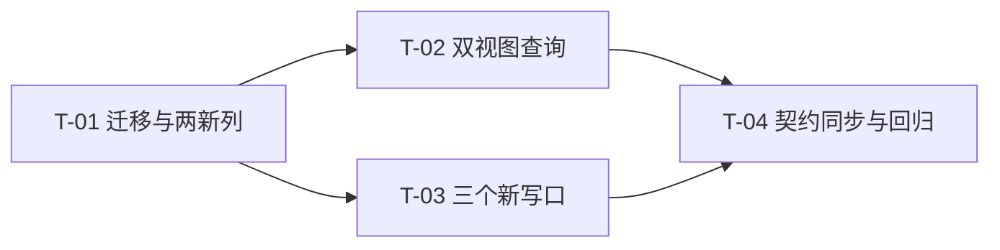

# PR-001 任务图（数据层：归档列 + 幂等迁移 + 双视图 + 三个新写口）

**来源**：`prs/pr-001-persist-archive-schema-and-writes.md`（验收标准 1~8）+ `architecture.md` §3.1 / §3.2（M-1~M-5）/ §3.3（V-1~V-5）/ §4.1 / §4.2 / §7.1 / §10（AR-04/AR-05/AR-08/AR-14/AR-15/AR-17）+ `prd/F01`（验收 2/4）、`prd/F02`（验收 1/2/6）、`prd/F03`（验收 2/3）、`prd/F04`（验收 1/3/4）、`prd/F05`（验收 3/4/8）
**涉及文件（唯一可创建/修改）**：`oamp/src/persist.js`（改造）、`oamp/test/persist.test.js`（改造）
**完成定义**：`cd oamp && node --test test/persist.test.js` 全绿；`npm test`（串行）全绿（既有 203 + 本 PR 新增）；测试全程不写 `oamp/data/`。
**范围外（本 PR 不做）**：不接线 `web.js` / 前端 / README；不改 `messages` 表、不改两个既有索引、不新增索引；不引入 `PRAGMA user_version` / 迁移表 / 第三方依赖；不做 HTTP 端点、上下文释放编排（归 pr-002）。

---

## A. 接口契约（先行固定，实现与验收以此为准）

### A.1 `oamp/src/persist.js` —— schema 与迁移（T-01）

| 项 | 规则（来源） |
|---|---|
| SCHEMA `chats` 两新列 | 声明在 `closed_at` **之后**：`archived_at INTEGER`（可空、无默认）、`context_released INTEGER NOT NULL DEFAULT 0`（§3.1 / AR-04；M-2 顺序敏感） |
| 迁移触发点 | `openDb` 内 `db.exec(SCHEMA)` 之后、预编译 `stmts` 之前调用 `migrate(db)`（§3.2 / AR-05） |
| 守卫真源 | `SELECT name FROM pragma_table_info('chats')` 的结果集；缺列才 `ALTER TABLE chats ADD COLUMN …`（M-1 / M-4） |
| 迁移条目 | `archived_at` → `ALTER TABLE chats ADD COLUMN archived_at INTEGER`；`context_released` → `ALTER TABLE chats ADD COLUMN context_released INTEGER NOT NULL DEFAULT 0`（顺序同上） |
| 不引入 | 不写 `PRAGMA user_version`、不加迁移表、不包事务（M-4 / M-5） |
| 既有行语义 | `archived_at = NULL`、`context_released = 0`（M-3 / N-9） |

### A.2 `oamp/src/persist.js` —— 双视图查询（T-02）

| 项 | 规则（来源） |
|---|---|
| `LIST_WITH` | `WITH p(q, agent, state, from_ts, to_ts, archived) AS (VALUES (?, ?, ?, ?, ?, ?)) `（§3.3 第 1 步） |
| `LIST_FROM` | 既有五条谓词之后追加 `AND ((p.archived = 1 AND c.archived_at IS NOT NULL) OR (p.archived = 0 AND c.archived_at IS NULL))`（V-1） |
| `listChats` SELECT | 列表项列面追加 `c.archived_at`（F03-4 展示归档时间）；`ORDER BY (CASE WHEN p.archived = 1 THEN c.archived_at ELSE c.updated_at END) DESC, c.chat_id DESC`（V-3） |
| `countChats` | 与 SELECT 共用同一 `LIST_WITH` / `LIST_FROM` / 参数数组 ⇒ `total` 恒一致（V-2） |
| `readArchived` | `undefined`/`null`/`0` → `0`；`1` → `1`；其余 → 抛错（`message` 含 `archived`，与 limit/state 同风格） |
| `listChats` 参数面 | 签名追加 `archived`（默认 0）；`params` = `[q, agent, state, from, to, archived]`，同值喂给两条语句（V-2 / 既有不变式） |
| `state` 校验 | 不变，`archived` 与 `state` 正交（V-5） |
| 索引 | 不新增（V-4） |

### A.3 `oamp/src/persist.js` —— 三个新写口与两处最小改动（T-03）

```js
export function openDb(dbPath) -> {
  // 既有 8 口不变：insertInput, insertOutput, upsertChat, closeChat, startupSweep, listChats, getChat, close
  archiveChat(chatId, nowMs?) -> boolean,   // true = 本次真的归档了
  activateChat(chatId, nowMs?) -> boolean,  // true = 本次真的激活了
  listArchivable() -> string[],             // 未归档且非 working 的 chat_id，按 chat_id 升序
}
```

| 契约点 | 规则（来源） |
|---|---|
| `archiveChat` 语句 | `UPDATE chats SET archived_at = ?, context_released = 1 WHERE chat_id = ? AND archived_at IS NULL AND state != 'working'`（双守卫；§4.1） |
| `archiveChat` 包装 | `stmts.archiveChat.run(nowMs, chatId).changes > 0`（已归档 / working → `false` 且两列不变） |
| `activateChat` 语句 | `UPDATE chats SET archived_at = NULL, state = CASE WHEN state = 'closed' THEN 'completed' ELSE state END, closed_at = CASE WHEN state = 'closed' THEN NULL ELSE closed_at END, updated_at = ? WHERE chat_id = ? AND archived_at IS NOT NULL`（一条语句三件事 + 置顶；AR-14 / AR-15） |
| `activateChat` 包装 | `stmts.activateChat.run(nowMs, chatId).changes > 0`（未归档 → `false` 且全列不变；重复激活第二次 `false` 且 `updated_at` 不再前移） |
| `listArchivable` 语句 | `SELECT chat_id FROM chats WHERE archived_at IS NULL AND state != 'working' ORDER BY chat_id`（F01-2） |
| `listArchivable` 包装 | `stmts.listArchivable.all().map((r) => r.chat_id)` |
| `CHAT_COLUMNS` | 追加两列 → 详情接口回传 `archived_at` / `context_released`（§4.1 ①） |
| `setOutputState` | 追加 `context_released = 0`（产生新回答即清位；§4.1 ② / AR-16 驱动源） |
| 导出白名单 | `{ insertInput, insertOutput, upsertChat, closeChat, archiveChat, activateChat, listArchivable, startupSweep, listChats, getChat, close }`（§4.1） |

### A.4 `oamp/test/persist.test.js` —— 既有契约同步与新增用例（T-04）

| 位置 | 现状 | 改法（§7.1 / AR-17） |
|---|---|---|
| schema 用例 `:71-73` | chats 期望 7 列 | 追加 `'archived_at', 'context_released'`（顺序敏感） |
| 写口白名单 `:108-111` | 排除名单 `['listChats','getChat','close']` | 加 `'listArchivable'`；断言集 = `['archiveChat','activateChat','closeChat','insertInput','insertOutput','startupSweep','upsertChat']` |
| 详情键白名单 `:303-305` | 7 键 | 追加 `archived_at`、`context_released`（排序后 9 键） |
| `upsertChat` deepEqual `:318-320` | 7 键对象 | 追加 `archived_at: null, context_released: 0` |
| `closeChat` deepEqual `:341-343` | 同 | 追加同上 |
| 其余用例 | — | **零改动**（默认视图 = 未归档 = 既有数据全满足） |

**新增用例（§7.1 清单 1~6）**：迁移幂等与新旧库同构；归档口双守卫；激活口一条语句三件事；双视图列表 + count 一致性；归档视图分页；`listArchivable` 范围。

---

## B. 任务列表

### T-01 幂等迁移与两新列（SCHEMA + `migrate`）

**前置依赖**：无
**交付物**：`oamp/src/persist.js`（SCHEMA `chats` 段 + `MIGRATIONS` / `migrate()` + `openDb` 调用点）
**验收标准**（可测试，来源 PR 验收 1 / M-1~M-3 / AR-05）：
1. 以现行 7 列 SCHEMA 文本手工建旧库并插一行数据 → `openDb` → `SELECT name FROM pragma_table_info('chats')` = `['chat_id','title','agent_id','state','created_at','updated_at','closed_at','archived_at','context_released']`，与新建库**逐位相同**（M-2）
2. 旧行 `<archived_at> IS NULL` 且 `<context_released> = 0`；旧行的既有字段与消息读回不变（M-3 / N-9）
3. `close()` 后对同一路径再次 `openDb` 不抛错，且列集与第一次相同（M-1 幂等；既有「建库幂等」用例 `:48-57` 补列后仍绿）
4. 新库（无旧库）`openDb` 后列序与 `ADD COLUMN` 追加语义对齐；不产生 `user_version` / 迁移表（零新对象：`sqlite_master` 仍恰 4 个既有对象）
**测试**：`oamp/test/persist.test.js` 新增「迁移」段（临时目录；手工旧库用 `new DatabaseSync(dbPath)` + 7 列 DDL 文本，不依赖 persist 常量）

### T-02 双视图查询（`LIST_WITH` 第 6 槽 + 谓词 + 条件排序 + `archived` 参数）

**前置依赖**：T-01（SELECT 列表项引用 `c.archived_at`）
**交付物**：`oamp/src/persist.js`（`LIST_WITH` / `LIST_FROM` / `listChats` SELECT 与 `ORDER BY` / `readArchived` / `listChats` 参数面）
**验收标准**（来源 PR 验收 4/5、F03-2/3、F04-1/3/4、V-1~V-3）：
1. 混合数据下缺省 `listChats()` 不含任何已归档，`total` 与返回集一致（V-1 / V-2 / F03-2）
2. `listChats({archived:1})` 只含已归档，顺序 = `archived_at DESC, chat_id DESC`（两条同 `archived_at` 时由 `chat_id` 兜底）（V-3 / F03-3）
3. `listChats({state:'closed'})` 排除已归档的 closed（`state` 与 `archived` 正交；V-5）
4. `listChats({archived:2})` / `{archived:'1'}` / `{archived:-1}` → 抛错（`message` 含 `archived`）
5. 归档 60 条（`archived_at` 递增）→ `limit:20` 分三页：并集无重复无遗漏、大小 = `total` = 60（F04-1/3/4）
6. 主列表既有排序断言零改动（`archived=0` 排序键仍取 `updated_at`）
**测试**：`oamp/test/persist.test.js` 新增「双视图列表 + count 一致性」与「归档视图分页」段

### T-03 三个新写口与两处最小改动

**前置依赖**：T-01
**交付物**：`oamp/src/persist.js`（`archiveChat` / `activateChat` / `listArchivable` 语句与包装；`CHAT_COLUMNS`；`setOutputState`；导出白名单）
**验收标准**（来源 PR 验收 2/3/6、F01-2/4、F02-2、F05-3/4/8、AR-14/AR-15）：
1. `archiveChat` 对未归档且非 working → `true`、`archived_at` = 传入毫秒、`context_released = 1`（F02-2）
2. `archiveChat` 对 working → `false` 且两列均不变（F01-2 范围兜底）
3. 已归档再归档 → `false` 且 `archived_at` 不被刷新（F01-4）
4. `activateChat` 对未归档 → `false` 且 `state`/`updated_at`/`closed_at` 全不变（F05-8 / N-5 结构性）
5. `activateChat` 对 `closed` 来源的归档项 → `archived_at IS NULL`、`state='completed'`、`closed_at IS NULL`、`updated_at` 前移（F05-3/4）
6. `activateChat` 对 `completed` 来源 → `state` 仍 `completed`、`closed_at` 仍 `NULL`；重复激活 → 第二次 `false` 且 `updated_at` 不再前移
7. `listArchivable()` 只返回未归档且 `state != 'working'` 的 chat_id：completed / failed / closed 入选，working 与已归档排除（F01-2）
8. `insertOutput` 后 `context_released = 0`（新回答清位；AR-16 驱动源）；`getChat().chat` 含两新键（AR-17）
**测试**：`oamp/test/persist.test.js` 新增「归档口」「激活口」「listArchivable」段

### T-04 既有契约同步 + 新增用例收口 + 全量回归

**前置依赖**：T-01、T-02、T-03
**交付物**：`oamp/test/persist.test.js`（§7.1 五处既有断言逐字同步 + 全部新增用例）；测试执行记录
**验收标准**（来源 PR 验收 7/8、AR-17）：
1. `:71-73` chats 列名断言 9 列；`:108-111` 写口白名单 7 口且 `listArchivable` 入读口排除名单；`:303-305` 详情键 9 键；`:318-320`/`:341-343` 两处 `deepEqual` 补 `archived_at: null, context_released: 0`（AR-17）
2. `cd oamp && node --test test/persist.test.js` 全绿（既有 + 新增）
3. `npm test`（**串行**，集群共享 `.runtime/cluster` 不可并发）全绿：既有 203 + 新增
4. `oamp/src/web.js`、`oamp/web/**`、`oamp/README.md`、其余既有测试文件**零改动**（PR 验收 8）
5. 迁移幂等实测：对**已有旧库**（从主仓库 `oamp/data/sql.db` 复制一份到 /tmp 作 fixture）跑 `openDb` → 列补齐且旧数据完好；再跑一次 → 无变化，记录前后 `pragma_table_info` 与行数证据
**测试**：上述两文件 + 全仓 `npm test`

---

## C. 依赖图



- **无环**（拓扑序：T-01 → T-02 ∥ T-03 → T-04）
- **关键路径**：T-01 → T-02 → T-04（另 T-01 → T-03 → T-04 等长）
- **可并行**：T-02 ∥ T-03（两者都只依赖 T-01，且改动在 `persist.js` 的不同语句块）

## D. 粒度说明

本 PR 是单文件实现（`persist.js`）+ 单文件测试（`persist.test.js`），任务按**可独立执行的断言集**切分：T-01 只依赖 schema 与 `migrate`（可单独用裸 `DatabaseSync` 断言旧库补列）；T-02 只依赖查询语句（可用 `archiveChat` 尚不存在时的手工 SQL 造归档态）；T-03 只依赖写口与导出面；T-04 才需要全部到位。未按单条 SQL 再拆（如把 `archiveChat` 与 `activateChat` 拆开）——两者共用同一次「导出白名单 + 白名单断言」变更，拆开会产生同一断言的重复触碰而无独立验收价值（粒度判断：能独立验收即停）。

## E. `[model_inferred]` 清单（需主 agent 确认）

| # | 条目 | 落点 | 推断理由 |
|---|---|---|---|
| I-1 | `readArchived` 对 `null` 按 0 处理（与 `undefined` 同义） | T-02-4 | §3.3 的 `readArchived` 伪码逐字如此；`null` 是「未提供」的既有表达习惯（`readOptionalString` / `readTimestamp` 同形） |
| I-2 | `listArchivable` 排序为 `chat_id` 升序 | T-03-7 | §4.1 语句逐字含 `ORDER BY chat_id`；产品（F01）只要求范围，顺序取语句原文 |
| I-3 | 新增测试用例的库/断言用 `rawAll` 直读或 `getChat` 读回两种口径并用 | T-01-2、T-03 | 与 §7.1 清单 1「消息与状态读回不变」及既有 `rawAll` 用法一致；不新增测试工具 |

## F. 追溯矩阵（PR-001 验收 → 任务）

| PR-001 验收标准 | 任务 |
|---|---|
| 1 迁移幂等与新旧库同构（M-1/M-2/M-3） | T-01-1~T-01-4 |
| 2 `archiveChat` 双守卫（F01-2/4、F02-2） | T-03-1~T-03-3 |
| 3 `activateChat` 一条语句三件事（F05-3/4/8） | T-03-4~T-03-6 |
| 4 双视图互斥与 `total` 一致性（F03-2/3、V-1~V-3） | T-02-1~T-02-4、T-02-6 |
| 5 归档视图分页（F04-1/3/4） | T-02-5 |
| 6 `listArchivable()` 范围（F01-2） | T-03-7 |
| 7 既有契约同步（AR-17） | T-04-1、T-04-2 |
| 8 `node --test test/persist.test.js` 全绿 + 其余文件零改动 | T-04-2、T-04-3、T-04-4、T-04-5 |
