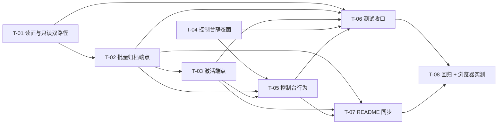

# PR-002 任务图（Web API 与控制台：批量归档、归档视图、激活与文档同步）

**来源**：`prs/pr-002-web-archive-api-and-console.md`（验收标准 1~10）+ `architecture.md` §4.3（复用的释放链路）/ §4.4（只读双路径）/ §5.1（批量归档编排与响应）/ §5.2（归档视图查询）/ §5.3（激活处理链）/ §5.4（端点总览）/ §6.1~§6.4（过滤栏 / 交互 / 零改动面 / 只读与提示）/ §7.2（web.test.js 改法）/ §7.3（README 同步清单）/ §8.1~§8.3（三条时序）/ §10（AR-01 / AR-02 / AR-03 / AR-06 / AR-07 / AR-09~AR-13 / AR-16 / AR-17）+ `prd/F01`（验收 1~8）、`prd/F02`（验收 3/4/5/7）、`prd/F03`（验收 1~7）、`prd/F04`（验收 1~5）、`prd/F05`（验收 1~8）
**涉及文件（唯一可创建/修改）**：`oamp/src/web.js`（改造）、`oamp/web/index.html`（改造）、`oamp/web/app.js`（改造）、`oamp/web/style.css`（改造）、`oamp/test/web.test.js`（改造）、`oamp/README.md`（同步）
**完成定义**：`cd oamp && node --test test/web.test.js` 全绿；全仓**串行** `node --test --test-concurrency=1 test/*.test.js` 全绿（既有 210 + 本 PR 新增）；既有断言（含 `:1000-1044` 前端静态契约）**零删改**；浏览器实测三步留证。
**范围外（本 PR 不做）**：不改 `persist.js` / `persist.test.js`（pr-001 已交付）；不做单条归档端点（产品无触发点，§5.1 候选 D）；不做通用 PATCH/PUT（AR-13）；不做归档专属搜索/过滤维度（N-6）；不发任何新 SSE 事件类型（§5.1）；不做批量激活（N-3）。

---

## A. 接口契约（先行固定，实现与验收以此为准）

### A.1 `oamp/src/web.js` — `GET /api/chats` 的 `archived` 透传（T-01）

| 项 | 规则（来源） |
|---|---|
| 参数读取 | 与 `limit` / `offset` 同一形态：`archived: num('archived')`（缺省 → `undefined` → persist 的 `readArchived` 归一为 0）（§5.2） |
| 缺省语义 | 不传 `archived` ⇒ 主列表排除已归档（前端 `loadChats()` 无参即得主列表；§6.3 零改动面） |
| `archived=1&limit=200&offset=N` | 只返回已归档项，顺序 `archived_at DESC, chat_id DESC`，响应含该视图 `total`（由 pr-001 的 `listChats` 保证；§5.2 / §3.3 V-2/V-3） |
| 非法值 | `archived=2` / `archived=abc` → persist 抛错 → 既有 `catch` 转 `400 {error:…archived…}`（与 limit/state 既有风格一致；§5.2 末行） |

### A.2 `oamp/src/web.js` — `POST /api/chats/archive`（T-02）

```js
POST /api/chats/archive        （无请求体；范围 100% 由服务端计算）
200 → { archived, failed, failed_ids }   // 三键恒存在
```

| 步骤 | 规则（来源） |
|---|---|
| ① 候选集 | `db.listArchivable()`（一条 SELECT；未归档 ∧ 非 working；不受分页限制）（§5.1） |
| ② 逐条提交 | `for` 循环内 `try { if (db.archiveChat(chatId)) archivedIds.push(chatId) } catch { failedIds.push(chatId) }` —— 逐语句 autocommit ⇒ 成功项不回滚；失败项 `archived_at` 仍 `NULL` ⇒ 仍在主列表可重试（F01-6/7） |
| ③ 释放上下文 | 对每个 `archivedIds` 逐条：`db.getChat` → agent 集 = `chats.agent_id ∪ {m.agent_id}`（非空）→ 逐个 `sendControlNotice(agentId, {kind:'context_release', chat_id})`，`.catch(()=>{})`，整段 `try/catch` 忽略（与 `/close` 同口径；AR-07 / §4.3） |
| ④ 应答 | `sendJson(res, 200, { archived: archivedIds.length, failed: failedIds.length, failed_ids: failedIds })`（AR-02） |
| 边界 | 零可归档项 → `{archived:0,failed:0,failed_ids:[]}`（F01-8 / M-01，不静默）；已归档项不进候选 ⇒ 归档时间不被改动（F01-4 / F02-2 后半）；`working` 双重排除 ⇒ 状态不变（F01-2 / E-5） |
| **不发 SSE** | 归档不改 `state`、主列表不由 SSE 驱动、N 条事件是噪声；结果可见性由响应 + 前端重载承载（§5.1） |
| 路由位置 | 字面量路径，与 `POST /api/chats/<id>/close`（后缀匹配）不冲突（§5.4） |

### A.3 `oamp/src/web.js` — `POST /api/chats/<id>/activate`（T-03）

| 步骤 | 规则（来源） |
|---|---|
| ① 存在性 | `db.getChat(chatId)` → 不存在 → `404 {error:'chat 不存在: <id>'}`（与 `/close` 同文案形态） |
| ② 前置状态 | `found.chat.archived_at === null` → `409 {error:'chat 未归档，无法激活'}`（N-5 的 API 面表达；非归档的 closed 在此被挡住） |
| ③ 变更 | `if (!db.activateChat(chatId))` → `409`（防御性；语义已由 ② 与 §4.2 的守卫保证） |
| ④ 通知 | `const after = db.getChat(chatId); publishState(chatId, after.chat.state)`（状态读**库值**，不在 JS 复刻 SQL 的 `CASE`） |
| ⑤ 应答 | `200 { chat_id, state }`（`state` = 激活后状态：closed 来源 → `completed`） |
| 幂等/重复点击 | 第二次调用被 ② 挡住（409），`updated_at` 不会重复前移（§5.3） |
| 路由位置 | 与既有 `<id>/close` 后缀匹配并列；`/api/chats/archive` 先判字面量（本 PR 内两条 `.endsWith` 互不命中对方） |

### A.4 `oamp/src/web.js` — `POST /api/messages` 的 409 双路径（T-01）

```js
const existing = db.getChat(chatId);
if (existing && (existing.chat.archived_at !== null || existing.chat.state === 'closed')) {
  sendJson(res, 409, {
    error: existing.chat.archived_at !== null
      ? 'chat 已归档（只读），不接受新输入'
      : 'chat 已关闭，不接受新输入',
  });
  return;
}
```

| 来源 | 判定字段 | 结果 |
|---|---|---|
| 归档只读（新增） | `archived_at !== null` | 409 +「已归档（只读）」文案（F02-3/4） |
| 已关闭只读（既有） | `state === 'closed'` | 409 + 既有文案**逐字不变**（AR-17 / 既有用例 :922-963 零删改） |
| 同时命中 | 归档分支优先 | 409（F02-4：两路径并存不冲突、互不依赖） |
| 落盘 | 两条路径均**不**落 `in` 记录 | F02-3 判定面 |

### A.5 `oamp/web/index.html` + `style.css`（T-04）

| 项 | 规则（来源） |
|---|---|
| 第 4 颗静态标签 | `<button class="filter" data-filter="archived">归档</button>`，与既有三颗同构（AR-09 / F03-1） |
| 「归档全部」 | `<button id="btn-archive-all" class="archive-all">归档全部</button>`，`.filters` 内第 5 个元素；CSS `margin-left:auto` 抵到最右（AR-03 / F01-1） |
| 「加载更多」槽 | `#chat-list` 之后 `<div id="load-more-slot" class="load-more-slot"></div>`（AR-11 / F04-3） |
| CSS | `.filters` 追加 `align-items:center`；新增 `.archive-all`（复用既有 border/背景/字号 token，零新增变量）、`.chat-item .activate`、`.load-more-slot` / `.load-more`（§6.1） |

### A.6 `oamp/web/app.js`（T-05）

| 项 | 规则（来源） |
|---|---|
| 常量 | `const ARCHIVE_PAGE_SIZE = 200;`；`const ARCHIVE_CONFIRM_TEXT = '将归档全部非进行中的对话，是否继续？';`（A-9 逐字、不显示条数 D-8） |
| 独立状态 | `state.archive = { chats: [], total: 0, loading: false }`（与 `state.chats` 互不污染；AR-12） |
| `loadArchived({append})` | 首屏 `offset=0`；续页 `offset = state.archive.chats.length`；URL = `/api/chats?archived=1&limit=${ARCHIVE_PAGE_SIZE}&offset=${offset}`；`total` 入状态；`loading` 防重复点击（AR-11 / AR-12） |
| `renderChats()` 分支 | 视图来源二选一：归档视图 = `state.archive.chats`（不分组）；主列表 = 既有内存过滤**逐字保留**（§6.3）；空态文案：归档 → 「还没有归档的对话」，其余沿用既有两句（F03-6 / A-10） |
| 归档行 | 既有行 + `badge(c.state)` + `@agent` + `fmtTime(c.archived_at)` + `<button class="activate" data-activate="<id>">激活</button>`（F03-4/7） |
| 按钮隔离 | `btn.onclick = (e) => { e.stopPropagation(); activate(c.chat_id); }`；行级 `openChat` 绑定不变（AR-10 / F03-5 / M-4） |
| 「加载更多」 | `hasMore = state.filter === 'archived' && state.archive.chats.length < state.archive.total`；仅 `hasMore` 时渲染按钮，末尾清空槽 ⇒ 无死控件（F04-3/5 / M-03） |
| `archiveAll()` | `window.confirm(ARCHIVE_CONFIRM_TEXT)` 取消即返回；`POST /api/chats/archive` → `#hint` 按 `failed` 分支渲染成功/失败文案（失败项可重试提示）→ `await loadChats()` → 归档视图则 `await loadArchived()` → 当前打开的对话已归档则 `refreshChat()`（F01-5/6/7/8 / AR-02） |
| `activate(chatId)` | `POST /api/chats/<id>/activate` → `#hint` 文案「已激活（状态：X）……」→ `loadChats()` + `loadArchived()` + 同 id 则 `refreshChat()`（F05-1/2/3） |
| 过滤按钮 | 既有循环只加一个分支：`state.filter === 'archived' ? loadArchived() : renderChats()`（AR-09 / AR-12） |
| `renderChat()` 两处 | ① `#btn-close` 禁用条件扩为 `chat.state === 'closed' \|\| chat.archived_at !== null`（§6.4 A）；② 头部说明条 `chat.archived_at === null && chat.context_released === 1` → `'<div class="notice-bar">激活后上下文已重置，本对话后续回复不再记得此前内容</div>'`，置于 `body` 之前（D2 / AR-16 / F05-6） |
| 零改动面 | `loadChats()` 函数体逐字不变（无参）；TODAY/OLDER 分组、`badge()`、SSE 处理、`@` 补全、一次性开关、working 计时全部不变（§6.3） |

### A.7 `oamp/test/web.test.js` + `oamp/README.md`（T-06 / T-07）

| 项 | 规则（来源） |
|---|---|
| 既有断言 | **零删改**（列表/过滤/close/409/SSE/`:1000-1044` 前端静态契约；AR-17 / §7.2） |
| 新增 API 用例 | ① 批量归档三键 + `working` 不动 + 已归档时间不变；② 归档后主列表不含 / 归档视图含且 `archived_at` 降序；③ 归档对话 `POST /api/messages` → 409 且不落 `in`；④ 激活 → 200 + 置顶 + 归档视图消失 + closed 还原；⑤ 未归档激活 409 / 未知 404；⑥ 零可归档项；⑦ 归档全部后主列表只剩 `working` |
| 新增释放用例 | 假节点（`startFakeNode`，带心跳）观察 `notice{kind:'context_release', chat_id}`（F02-7 / AR-07 判定面） |
| 新增静态契约用例 | `html` 含 `data-filter="archived"` / `id="btn-archive-all"` / 「归档全部」/ `id="load-more-slot"`；`app.js` 含 `ARCHIVE_PAGE_SIZE = 200` / `/api/chats?archived=1` / `window.confirm('将归档全部非进行中的对话，是否继续？')` / `stopPropagation` / `chats.length < state.archive.total` / `chat.archived_at === null && chat.context_released === 1`；`css` 含 `.archive-all` / `.load-more`（§7.2） |
| README 四处 | UI 段（`:126-129`）补「归档」标签 / 「归档全部」/「激活」/「加载更多」；API 表（`:153-158`）给 `GET /api/chats` 补 `archived` 并新增两条端点行（含 409/404 语义）；状态段（`:162`）把「`closed` 终态不可重开」收窄为「唯一例外是归档 → 激活」并补归档不改 `state` + 归档只读；上下文段（`:174-175`）补「归档即释放」「激活不恢复上下文」（§7.3 / AR-17） |

---

## B. 任务列表

### T-01 读面透传与只读双路径（`GET /api/chats` 的 `archived`；`POST /api/messages` 409）

**前置依赖**：无
**交付物**：`oamp/src/web.js`（`/api/chats` 参数面 1 行 + `/api/messages` 409 分支 + 文件头 API 注释同步）
**验收标准**（来源 PR 验收 1/3、§4.4 / §5.2 / §5.4）：
1. `GET /api/chats`（不传 `archived`）不含任何已归档对话，`chats[0]` 等既有断言不受影响（F03-2）
2. `GET /api/chats?archived=1&limit=200&offset=0` 只含已归档、`total` = 该视图总数；`offset` 递增后续页与首屏同排序、无重复无遗漏（F03-3 / F04-1/2/4）
3. `GET /api/chats?archived=2` → `400`，`error` 含 `archived`（§5.2）
4. 归档对话 `POST /api/messages` → `409 {error:'chat 已归档（只读），不接受新输入'}`，且库中不新增该轮 `in` 记录（F02-3/4）
5. `state='closed'` 且未归档的对话 `POST /api/messages` → `409 {error:'chat 已关闭，不接受新输入'}`（状态码与文案逐字不变；既有 `:922-963` 用例零删改仍绿）
6. 同时命中（closed 且已归档）→ 走归档文案（归档分支优先）
**测试**：`oamp/test/web.test.js` 新增用例（归档视图查询/400/双路径），另由 T-06 收口

### T-02 批量归档端点（`POST /api/chats/archive`）

**前置依赖**：T-01（归档是 409 归档分支可达的前提；两者共用 `#hint`/响应面）
**交付物**：`oamp/src/web.js`（新路由块 + 文件头 API 注释）
**验收标准**（来源 PR 验收 2/4、AR-01/AR-02/AR-07 / §5.1）：
1. `POST /api/chats/archive` → `200`，响应**三键恒存在** `{archived, failed, failed_ids}`（无失败时 `failed:0`、`failed_ids:[]`）
2. 范围：`completed` / `failed` / `closed` 未归档项全部入选；`working` 项**未被归档**且 `state` 不变（F01-2 / E-5）
3. 幂等：对已归档项再次执行 → 不进候选，其 `archived_at` 不被本次改动（F01-4 / F02-2 后半）
4. 零可归档项 → `{archived:0,failed:0,failed_ids:[]}` 且 `200`（F01-8 / M-01）
5. 释放上下文：每个成功归档的 chat 向其 `chats.agent_id ∪ DISTINCT messages.agent_id` 各发一条 `notice{kind:'context_release', chat_id}`；以假节点 `received` 面观察到该信封为判定（F02-7 / AR-07）
6. 不发 SSE：归档调用期间订阅该 chat 的 SSE 客户端**不**收到新增 `notice`（web 不自行 publish；§5.1）
7. 一次归档全部后主列表只剩 `working`（E-1 首段）
**测试**：`oamp/test/web.test.js` 新增「批量归档」段 + 假节点释放观察用例

### T-03 激活端点（`POST /api/chats/<id>/activate`）

**前置依赖**：T-02（激活的输入前提 = 已有归档项；共用同一批测试数据构造）
**交付物**：`oamp/src/web.js`（新路由块 + 文件头 API 注释）
**验收标准**（来源 PR 验收 5、AR-13/AR-14/AR-15 / §5.3）：
1. 对已归档项 → `200 {chat_id, state}`；`closed` 来源 → `state:'completed'` 且详情 `closed_at === null`（F05-4）
2. 置顶：随后 `GET /api/chats` 的 `chats[0].chat_id` 即被激活项（F05-3 / D-9）
3. 视图互斥：`GET /api/chats?archived=1` 不再含它；`GET /api/chats` 含它（F05-1）
4. 对未归档对话（含从未归档的 `closed`）→ `409 {error:'chat 未归档，无法激活'}`（N-5 / F05-8）
5. 未知 chat → `404`；`state` 取库值（`publishState` 与应答同源）
6. `context_released` 不被激活改动（仍为 1）⇒ 打开该对话即满足 F05-6 提示判据的一半
**测试**：`oamp/test/web.test.js` 新增「激活」段

### T-04 控制台静态面（`index.html` + `style.css`）

**前置依赖**：无（静态结构先落，行为在 T-05）
**交付物**：`oamp/web/index.html`（4 处：第 4 颗标签、`btn-archive-all`、`load-more-slot`）、`oamp/web/style.css`（`.filters` 对齐 + `.archive-all` + `.activate` + `.load-more-slot`/`.load-more`）
**验收标准**（来源 PR 验收 6、AR-03/AR-09 / §6.1）：
1. `index.html` 的 `.filters` 含 4 颗 `.filter`（第 4 颗 `data-filter="archived"`，文案「归档」）与 `id="btn-archive-all"`（文案「归档全部」，位于标签右侧）
2. `#chat-list` 之后存在 `id="load-more-slot"`
3. `style.css` 含 `.archive-all{margin-left:auto}`（抵右）、`.chat-item .activate`、`.load-more`；`.filters` 追加 `align-items:center`
4. 既有 `.filter` / `.filter.active` / `.notice-bar` / `.model-input` 规则**逐字保留**（AR-17 / 既有静态契约用例 :1000-1044 零删改）
**测试**：静态契约断言由 T-06 的用例覆盖

### T-05 控制台行为（`app.js`：归档视图状态与分页、归档行与激活、归档全部、提示条）

**前置依赖**：T-02、T-03（前端调用的两个端点须存在）、T-04（DOM 锚点）
**交付物**：`oamp/web/app.js`（常量 + `state.archive` + `loadArchived` + `renderChats` 分支 + `renderArchiveItem` + `renderLoadMore` + `archiveAll` + `activate` + `renderChat` 两处 + `bind` 两个绑定）
**验收标准**（来源 PR 验收 6/7、AR-10~AR-12/AR-16 / §6.2 / §6.4）：
1. 点「归档全部」→ 原生 `confirm`（文案逐字）；取消 → **不发请求**；确认 → 请求后 `#hint` 显示条数（`failed>0` 时含失败项重试提示）且主列表立即刷新（F01-5/6 / M-05）
2. 切「归档」标签 → 归档视图加载（首屏 `limit=200`）；`chats.length < total` 时底部渲染「加载更多」，点击后 `offset += 已持有条数` 追加；到末尾控件消失（F04-1/3/5 / M-03）
3. 归档视图空态文案「还没有归档的对话」；归档行含归档时间与原状态 badge（F03-4/6/7）
4. 点归档行「激活」按钮 → 走激活、**不**打开详情（`stopPropagation`）；点行内其他区域仍打开详情（F03-5 / M-4）
5. 激活后提示条：`chat.archived_at === null && chat.context_released === 1` 时对话头部渲染「激活后上下文已重置，本对话后续回复不再记得此前内容」；新回答落库后（`context_released` 复位 0）该条消失（F05-6 / AR-16 / M-04）
6. `renderChat()` 的关闭按钮在归档对话上禁用（`chat.archived_at !== null`）（§6.4 A）
7. 主列表零改动面：`loadChats()` 无参、内存过滤逐字保留、分组/`badge`/SSE/`@` 补全/working 计时不变（§6.3）
**测试**：行为面由 T-08 的浏览器实测验收；静态契约由 T-06 用例覆盖

### T-06 测试收口（`web.test.js` 新增用例；既有断言零删改）

**前置依赖**：T-01、T-02、T-03、T-04、T-05
**交付物**：`oamp/test/web.test.js`（新增 API 用例段 + 假节点释放观察 + 静态契约段）
**验收标准**（来源 PR 验收 1~10、§7.2 / AR-17）：
1. 新增用例覆盖：批量归档三键与范围与幂等（T-02-1~4、T-02-7）/ 零可归档项 / 释放 notice 观察（T-02-5）/ 归档视图查询与 400（T-01-1~3）/ 409 双路径与不落 `in`（T-01-4~6）/ 激活全链（T-03-1~6）/ 静态契约（T-04-1~3、T-05-1~5 的静态可判据）
2. `cd oamp && node --test test/web.test.js` 全绿
3. 既有断言（含 `:1000-1044` 两条前端静态契约）**零删改**
**测试**：`node --test test/web.test.js`

### T-07 文档同步（`README.md` 四处）

**前置依赖**：T-02、T-03、T-05（文档描述的是已交付行为）
**交付物**：`oamp/README.md`
**验收标准**（来源 PR 验收 9、§7.3 / AR-17）：
1. UI 段补「归档」标签、「归档全部」按钮、「激活」与「加载更多」
2. API 表：`GET /api/chats` 一行补 `archived`（缺省 0 = 排除已归档）；新增 `POST /api/chats/archive`、`POST /api/chats/<chat_id>/activate` 两行（含 409 / 404 语义）
3. 状态段：「`closed`（终态、不可重开）」收窄为「唯一例外是归档 → 激活路径」，并补「归档不改变 `state`、归档对话只读」
4. 上下文段：补「归档即释放上下文」「激活不恢复上下文」，并说明界面提示「此后不再记得此前内容」持续到产生新回答
**测试**：人工逐条对照（文档；无自动化断言）

### T-08 收口回归 + 浏览器实测

**前置依赖**：T-01~T-07
**交付物**：测试执行记录 + 浏览器实测证据（截图/文字）
**验收标准**（来源 PR 验收 10、context 的验证段）：
1. `node --test test/web.test.js` 全绿；全仓**串行** `node --test --test-concurrency=1 test/*.test.js` 全绿（既有 210 + 新增）
2. `oamp/src/persist.js`、`oamp/test/persist.test.js`、`oamp/test/acp-daemon.test.js`、其余 17 个既有测试文件**零改动**（PR 验收 10）
3. 浏览器实测（隔离环境：临时 `OAMP_SOCKET` / `OAMP_DB` + 随机端口；mock agent 允许）：① 造 3~5 条对话 → 点「归档全部」→ 确认弹窗 → 主列表清空（除进行中）→ 切「归档」标签看到全部归档项（归档时间倒序）；② 点某项「激活」→ 该回到主列表顶部且可继续对话；③ 激活后打开该对话 → 头部出现「不再记得此前内容」提示条 → 发一轮收到回复后提示条消失
4. 清理临时环境（无残留进程 / socket / 临时库）
5. 改动提交到 worktree 分支（`git commit`，报告 hash）；不 merge、不动主工作区
**测试**：上述两条测试命令 + 浏览器实测

---

## C. 依赖图



- **无环**（拓扑序：T-01 → T-02 → T-03 → T-04 → T-05 → T-06 → T-07 → T-08；`T-04 → T-05` 与 `T-01~T-03 → T-05` 并行汇入）
- **关键路径**：T-01 → T-02 → T-03 → T-05 → T-06 → T-08（T-04 可与 T-01~T-03 并行；T-07 短支）
- **可并行**：T-04（纯静态面，只碰 `index.html`/`style.css`）∥ T-01~T-03（`web.js`）；T-06 的两段（API 用例 / 静态契约用例）在 `web.test.js` 内不同段落

## D. 粒度说明

本 PR 是"前后端互相消费"的单批次交付，按**可独立验收的实现单元**切分：T-01（读面 + 只读判定）的验收标准可只用既有测试数据跑通（归档态由 T-02/T-03 落地后才有，故其归档相关断言与 T-02 的用例合并执行，但判据本身独立）；T-02/T-03 各自是"一个端点 = 一个可验证的端到端行为"，拆开是因为两者的失败语义互不相同（批量逐条 vs 单条 409/404），合并会让失败定位失去边界。前端拆为**静态面**（T-04）与**行为面**（T-05）：静态面可仅靠文本契约验收（既有 `:1000-1044` 同款判据），行为面需要 T-02/T-03 的端点存在——若合并，静态断言就要等后端全部落地才能跑，验证反馈被无谓推迟。T-06 不再按用例逐条拆分（同文件的同类断言，拆开只增加触碰次数而无独立验收价值）；T-08 不拆（测试、实测、提交是同一收敛闭环）。

## E. `[model_inferred]` 清单（需主 agent 确认）

| # | 条目 | 落点 | 推断理由 |
|---|---|---|---|
| I-1 | `POST /api/chats/archive` 的 ③ 释放循环整段包 `try/catch`（除每个 `sendControlNotice` 的 `.catch()` 外，再护住 `db.getChat` / agent 集推导） | T-02-5 | §5.1 伪码为 `try { /* getChat → agent 集 → sendControlNotice */ } catch { /* 忽略 */ }`，逐字如此；`/close` 处无该外层 try 是因为其数据已在手（`found`），批量路径需每条重新取 |
| I-2 | 激活的 ③ 失败复用 ② 的 409 文案（`'chat 未归档，无法激活'`） | T-03-1 边界 | §5.3 只写「防御性回 409」，未给独立文案；② 与 ③ 的语义同源（同一条守卫的两个时点），复用文案不新增契约面 |
| I-3 | 「加载更多」文案固定为「加载更多」、无条数后缀 | T-05-2、T-06-1 | F04-3 的验收措辞即「提供『加载更多』入口」；M-03 只约束"末尾不留控件"，未要求条数展示 |
| I-4 | 归档行的 `data-activate` 属性保留（即使绑定走行内 `querySelector('.activate')`） | T-04-1、T-05-4 | §6.2 ③ 的 HTML 草案含 `data-activate="…"`；测试以 `.activate` + `stopPropagation` 为判据（PR 验收 6），属性本身无行为 |
| I-5 | 前端在响应后 `loadArchived()` 采用"归档视图外也刷新"的无条件调用（§6.2 ⑤ 的 `if (viewingArchive)` 分支仅用于 `archiveAll`，`activate` 无条件） | T-05 交付物 | §6.2 逐字如此：`archiveAll` 用 `if (viewingArchive) await loadArchived()`，`activate` 直接 `await loadArchived()`；两处差异按原文实现 |

## F. 追溯矩阵（PR-002 验收 → 任务）

| PR-002 验收标准 | 任务 |
|---|---|
| 1 `GET /api/chats` 的 `archived` 透传 / 双视图 / 400（F03-2/3、F04-1/2、D-17） | T-01-1~T-01-3、T-06-1 |
| 2 `POST /api/chats/archive` 三键 / 范围 / 幂等 / 零项（F01-2/4/8） | T-02-1~T-02-4、T-02-7 |
| 3 只读双路径（F02-3/4） | T-01-4~T-01-6 |
| 4 归档释放上下文（F02-7） | T-02-5、T-02-6 |
| 5 `activate` 语义 / 409 / 404（F05-1/3/4/8） | T-03-1~T-03-6 |
| 6 前端静态与行为契约（F01-1/5、F03-1/4/5/6、F04-3/5、F05-6） | T-04-1~T-04-4、T-05-1~T-05-7、T-06-1 |
| 7 F05-6 行为验收（AR-16 / M-04） | T-05-5、T-03-6、T-08-3 |
| 8 既有前端契约与全部既有用例零删改（AR-17） | T-06-3、T-08-1、T-08-2 |
| 9 README 四处同步（AR-17） | T-07-1~T-07-4 |
| 10 `web.test.js` 全绿 + 其余文件零改动 | T-06-2、T-08-1、T-08-2、T-08-5 |

## G. 疑问 / 越界

- 无循环依赖；无架构空白（全部判据可从 `architecture.md` §4~§7 + PR 卡 10 条验收逐条追溯）。
- I-1~I-5 为 `[model_inferred]`（伪码级细节，语义与原文一致），交主 agent 确认；不阻塞实现。
