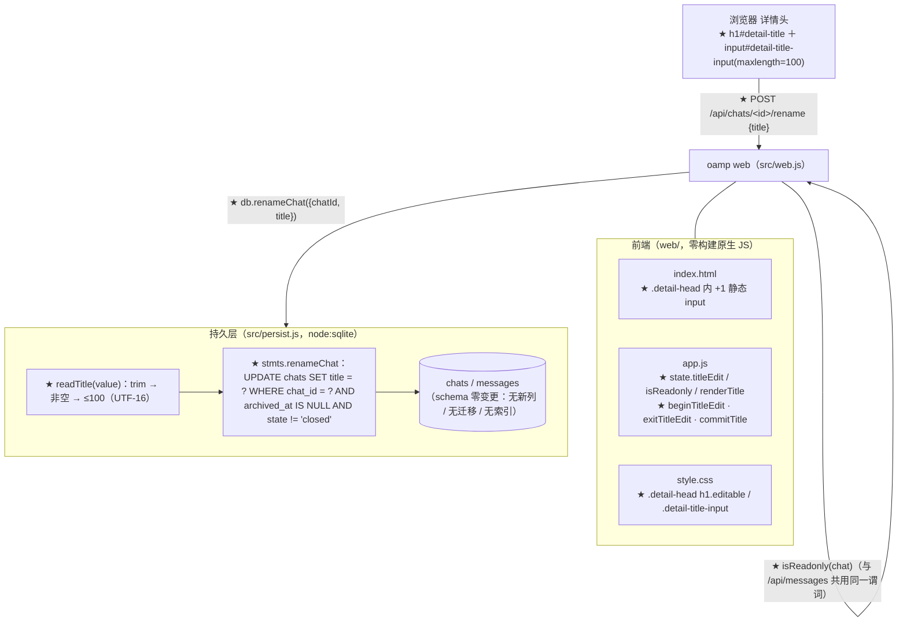
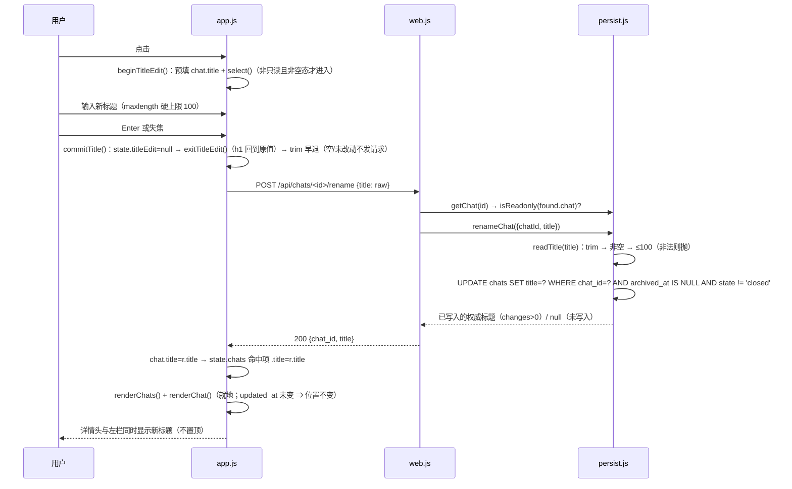
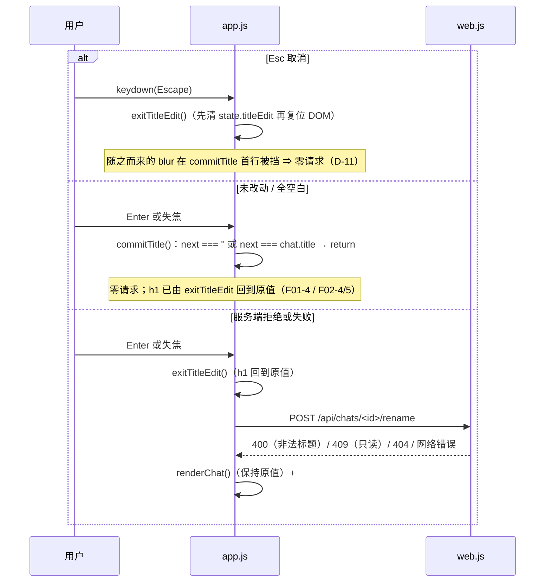
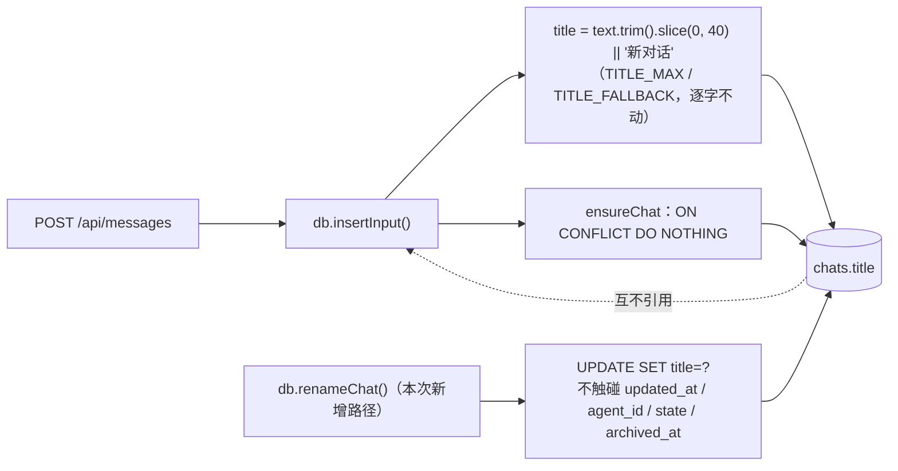

# architecture.md — 0014-chat-rename（迭代架构）

**版本**：1.0.0（阶段 3 产物）　**日期**：2026-09-11　**状态**：**L1 决策：本迭代无**（本次全部取舍落在 L2/L3，见 §13）；§3 / §4 / §5 三处为**硬契约**（改名写语句、只读判定单一真源、改名端点形态），实现阶段不得偏离
**输入**：`prd.md`（v0.1.0，5 卡 F01~F05 / AR-01~AR-13）+ `demand.md`（v0.2.0，A-1~A-5 / N-1~N-7 / E-1~E-10 / D-1~D-16 / C-1~C-6，仅作追溯基准）
**架构基线**：`docs/iterations/0013-chat-archive/architecture.md`（v1.0.0，已合入 `main`）+ 阶段 3 重新取证的 `oamp/**`（§1）
**前置**：0011 交付态（SQLite 落盘 / SSE / 上下文池）+ 0013 交付态（归档双视图 / 批量归档 / 激活 / `context_released` 提示条）；当前 `oamp/test/*.test.js` 共 **20** 个文件（阶段 3 取证：215/215 绿）
**约束**：零新第三方依赖（`oamp/package.json` 的 `dependencies` 保持 `{}`）；**零数据层变更**（`title` 列已存在 ⇒ 无新列、无迁移、无索引、无 CHECK）；`roles/**` 只读；**不引入任何新模块 / 新进程 / 新传输 / 新事件类型**

> 本文档回答 prd 的全部 13 条架构待填项（AR-01~AR-13，逐条落定见 §10），给出组件与数据流（§2 / §7）、分级决策（§9）与 PR 边界**输入**（§14；拆解归阶段 4）。

---

## 0. 一句话架构

> **在 `persist.js` 加一条只写 `title` 一列的 `UPDATE`（`SET title = ?`，`WHERE chat_id = ? AND archived_at IS NULL AND state != 'closed'`，用 `changes` 判断是否真的写入）——不复用会刷新 `updated_at`、覆盖 `agent_id`、漏检归档的 `upsertChat`；在 `web.js` 把 0013 既有的只读表达式 `archived_at !== null || state === 'closed'` 提取为唯一具名谓词 `isReadonly()`（`/api/messages` 的 409 与新增的 `POST /api/chats/<id>/rename` 共用，SQL 侧同值守卫作结构性兜底），新端点复用既有 `readBody` / `sendJson` / 404+409 形态；前端把详情头 `#detail-title` 与一个静态 `<input id="detail-title-input" maxlength="100">` 做成孪生节点，点击标题进入编辑（预填 + `select()` 全选），Enter / 失焦经同一个 `commitTitle()` 提交、Esc 先清 `state.titleEdit` 再复位 DOM（失焦因此在首行被挡掉），成功后**就地回填**响应标题（详情头 + 左栏 `state.chats` 对应项，零额外请求、零列表重排），失败落既有 `#hint`。** 0011 的落盘口径 / SSE / 上下文池语义与 0013 的归档语义**零改动**，`insertInput` 的自动标题生成路径**逐字不动**。

---

## 1. 现有架构基线（阶段 3 重新取证，2026-09-11）

### 1.1 相关现有组件与文件

| 文件 | 现状职责（阶段 3 复核） | 与本次迭代的关系 |
|---|---|---|
| `oamp/src/persist.js`（284 行） | `openDb()` 建库 + SCHEMA + 列存在性守卫的幂等 `migrate`（:136-144）；`TITLE_MAX = 40` / `TITLE_FALLBACK = '新对话'`（:56-57）；`CHAT_STATES`（:40）；`CHAT_COLUMNS`（含 `archived_at`/`context_released`）；`LIST_WITH`/`LIST_FROM` 参数 CTE（:63-71）；**写口校验函数族** `readLimit`/`readOffset`/`readArchived`/`readTimestamp`/`readOptionalString`（:90-134）；`stmts` 预编译表（:145-199）与导出的 11 个口（:279-283） | **改造（核心）**：新增常量 `TITLE_MAX_MANUAL = 100`、校验函数 `readTitle()`、语句 `renameChat` 与包装函数 `renameChat({chatId,title})`；导出表 +1 项。**SCHEMA / 迁移 / 查询 / 既有写口全部不动** |
| `oamp/src/web.js`（600 行） | 内建 http + JSON API：`sendJson`（:59）、`readBody`（:66，畸形 400 / 超限 413）、`GET /api/chats`（:376-392）、`GET /api/chats/<id>`（:394）、`POST /api/chats/<id>/close`（:404）、`POST /api/chats/archive`（:425）、`POST /api/chats/<id>/activate`（:454）、`GET /api/stream`（:474）、`POST /api/messages`（:483，含 :515-522 的只读 409）、静态文件（:564）与 404 兜底（:572）、外层 catch → 502（:574） | **改造**：把 :516 的内联只读表达式提取为模块级 `isReadonly(chat)`（`/api/messages` 与 `/rename` 共用）；新增 `POST /api/chats/<id>/rename` 路由（插在 `/activate` 块之后、静态分支之前）。**其余路由与 SSE 零改动** |
| `oamp/web/index.html`（70 行） | `.detail-head` 内 `<h1 id="detail-title">`（:39-42）；过滤栏；`#chat-list`；`#load-more-slot`；底部 `#hint` | **改造**：`.detail-head` 内、`h1` 之后新增一个静态 `<input id="detail-title-input" class="detail-title-input hidden" type="text" maxlength="100" autocomplete="off" />` |
| `oamp/web/app.js`（691 行） | `state`（:15-26）；`renderChats()`（:94-148，含归档视图分支与 `escapeHtml(c.title)`）；`renderChat()`（:152-170，`:156` 空态文案 / `:163` 标题 / `:165` 关闭按钮禁用条件）；`handleEvent`（:340）；`loadChats`（:402）；`openChat`（:427）；`bind()`（:628-670） | **改造**：`state` +`titleEdit`；`renderChat()` 的标题落点改为 `renderTitle(chat)`、关闭按钮改用 `isReadonly(chat)`；新增 `isReadonly` / `renderTitle` / `beginTitleEdit` / `exitTitleEdit` / `commitTitle`；`bind()` 绑 3 个事件 |
| `oamp/web/style.css`（321 行） | `.detail-head{display:flex;align-items:baseline;gap:12px}`（:155-162）、`.detail-head h1{margin:0;font-size:14px;font-weight:600}`（:163）、`.mention.hidden{display:none}`（:255） | **微改造**：`.detail-head h1.editable`、`.detail-title-input`、`.detail-title-input.hidden` 三条规则 |
| `oamp/test/persist.test.js`（617 行） | 逐字断言 schema 对象集与 `chats` 9 列（:60-78）、写口白名单（:171-179）、`deepEqual` 详情对象（:383-386 等）、生成规则（:233-244） | **同步（AR-13）**：写口白名单 **+1 项**；新增改名语句用例（§8.1）。**列名断言与生成规则断言不动** |
| `oamp/test/web.test.js`（1240 行） | API 契约（列表 / 过滤 / 详情 404 / close / 归档 / 激活 / 409 / SSE）+ 前端静态契约（:1000-1043）、"后续输入不改标题"（:415-431）与 0013 段静态契约的 `:1235`（只读表达式字面顺序断言） | **同步（AR-13）**：新增改名用例与静态契约追加断言（§8.2）。**既有断言全部不动** |
| `oamp/README.md` | 左栏 / 右栏 UI 描述（:126-128）、API 表（:153-161）、对话状态段（:165-168） | **同步（AR-13）**：见 §8.3 |
| `oamp/src/{router,registry,rpc,node-client,config,log,transport,task,agent,acp-client,context-pool,cluster,cluster-config,role-binding,status,cli}.js`、`oamp/bin/`、`oamp/package.json`、`.gitignore` | 0010~0013 交付面 | **不改**（本次不触碰集群 / agent / 上下文池 / 传输 / 归档编排） |

### 1.2 可直接复用的既有能力（决定了本方案"少造东西"）

| # | 既有能力（代码位置） | 本次如何复用 |
|---|---|---|
| A | `readBody(req)` 的 `status` 语义（畸形 JSON → `err.status = 400`、超限 → `413`）与 `/api/messages` 的照办式应答（含 413 时 `connection: close`）（`web.js:66-99`、`:486-492`） | `/rename` 的请求体读取**逐字复用**同一个函数与同一段错误应答，零新解析逻辑 |
| B | `readLimit`/`readArchived` 的"非法值抛 `Error`，调用方转 400"校验风格（`persist.js:90-134`；`web.js:377-391` 的 try/catch → 400） | `readTitle()` 加入同一函数族，风格一致；`/rename` 用同样的 try/catch → 400 |
| C | 只读判定表达式 `archived_at !== null \|\| state === 'closed'`（**判定唯一落点** `web.js:516`，在 :515-522 的 409 分支内；前端**完整表达式仅** `app.js:165`，另有 `app.js:164`（「· 已关闭（只读）」文案，仅判 `closed`）与 `:510`（`closeCurrentChat` 的 `closed` 幂等守卫）两处**单条件方言**） | 提取为具名谓词 `isReadonly(chat)`（前后端各一份、**同值**；前端字面顺序为 `closed` 在前，受 `web.test.js:1235` 既有静态契约断言约束），`/api/messages` 与 `/rename` 共用；SQL 侧同值守卫作结构性兜底（§4）；`:164` / `:510` 属展示与守卫、不参与"可否改名"判定 ⇒ 不纳入本次统一范围（§1.3-5） |
| D | "单条状态变更"端点形态：预检 `getChat` → 404 / 域内拒绝 → 变更 → 回最小响应（`/close` `web.js:404-424`、`/activate` `web.js:454-473`） | `/rename` 完全同形：404 → 409（只读）→ 400（非法标题）→ 200 `{chat_id,title}` |
| E | `sendJson(res, status, body)`（`web.js:59-63`，`cache-control: no-store`） | 全部响应沿用，零新工具 |
| F | 前端 `#hint` 行 + `hint error` 类是既有的"一次性操作反馈 / 失败提示"承载（`openChat`/`send`/`closeCurrentChat`/`activate`/`archiveAll` 五处） | 改名失败提示**同级复用**（`改名失败：${err.message}`），零新提示面 |
| G | 前端"取现有对象就地改写 + 重渲染"的同步手法（`handleEvent` 的 `chat_state` 分支就地改 `state.chats` 项后 `renderChats()`，`app.js:357-366`） | 改名成功后**就地回填** `state.chat.title` + `state.chats` 命中项，一次 `renderChats()` + `renderChat()`，零请求（§6.4） |
| H | 静态 DOM 节点 + `$()` 取值 + `bind()` 统一挂事件的既有风格（详情头三节点、`mention` 组件均为静态节点） | 编辑框作为 `.detail-head` 的**静态兄弟节点**（非动态创建），与 `#mention` 同款（`class="hidden"` 切换） |
| I | `String.prototype.trim` 的 Unicode 空白口径（含 U+3000 全角空格 / NBSP）与 `slice(0,40)` 的 UTF-16 计数（`persist.js:203`） | `readTitle` 用**同一个** `trim()`；长度用 `String.length`（UTF-16 code unit）⇒ 与自动 40 截断"同一把尺子"（D-5 / M-9），零新计数代码 |

### 1.3 既有缺口（正好是 5 张卡的来源）

1. **没有任何写 `title` 的接口**：`GET /api/chats` 与 `GET /api/chats/<id>` 都只返回 title（`web.js:376-402`），详情头是纯文本 `<h1>`（`index.html:40`），无编辑入口（F01）。
2. **没有可用的改名写语句**：生产路径只有 `insertInput` → `ensureChat`（`ON CONFLICT DO NOTHING`，仅首次建行）；`upsertChat`（:150-156，包装 :225-227）当前**无生产调用者**，且其 `ON CONFLICT DO UPDATE ... WHERE chats.state != 'closed'` 会让 closed 改名**静默失败**、覆盖 `agent_id`、刷新 `updated_at`、且**完全不检查 `archived_at`** ⇒ 复用会让 F03 只读边界与 F04 不置顶双双失效（demand C-1 / C-2）。
3. **服务端无标题校验落点**：`chats.title TEXT NOT NULL` 无长度约束（`persist.js:15`），写入侧只有自动路径的 40 截断；无"trim / 非空 / ≤100"的服务端执行点（F02 验收 6 / D-14）。
4. **前端无编辑态承载**：`state` 里没有任何"正在编辑标题"的状态位（F01-1/3 的编辑态与 Esc 优先需要它）。
5. **只读概念在四处文本落点上表达**：服务端 `web.js:516`（**判定唯一落点**，内联未具名）；前端 `app.js:165`（**唯一的完整表达式**）、`:164`（详情头「· 已关闭（只读）」文案，仅判 `closed`；0013 §6.4 A 有意不覆盖归档）、`:510`（`closeCurrentChat` 的 `closed` 幂等守卫）。新增第二处**判定**会直接变成"分叉"的温床（F03 验收 3 / demand C-3）；本次统一的**判定面** = `web.js:516` + `app.js:165`，另两处按范围记录（§4.1 ③）。

### 1.4 阶段 3 只读取证（本次方案直接依赖）

| # | 结论 | 证据 |
|---|---|---|
| **S-1** | 自动标题的唯一生成点是 `insertInput` 内的 `const title = text.trim().slice(0, TITLE_MAX) \|\| TITLE_FALLBACK`，配合 `ensureChat` 的 `ON CONFLICT DO NOTHING` ⇒ **仅首次建行定标题**，`@agent` 前缀计入（取原文） | `persist.js:145-149`、`:202-207` |
| **S-2** | 全仓**无第三处写 `title` 的语句**（生产路径只有 `insertInput`→`ensureChat`；`upsertChat` 无生产调用者）⇒ 新增一条只写 title 的语句即覆盖"手写路径"的**全部**写入面 | 阶段 3 grep（`oamp/**` 内 `title` 的 SET/INSERT 位置） |
| **S-3** | `/rename` 路由的唯一候选插入位置在 `POST /activate` 块（:454-473）之后、静态分支（:564）之前；既有三段 `POST /api/chats/*` 判定分别是 `endsWith('/close')`、`p === '/api/chats/archive'`、`endsWith('/activate')`，与 `endsWith('/rename')` **互不吞并**；`GET /api/chats/` 分支有 `req.method === 'GET'` 方法守卫 ⇒ 不干扰 | `web.js:394,404,425,454,564,572` |
| **S-4** | 前端详情头是**静态**三节点（`h1` / `.detail-meta` / `#btn-close`），`.detail-head` 为 `display:flex; align-items:baseline`；`h1` 无 `cursor` / 无 `tabindex` / 无任何事件绑定 | `index.html:39-43`、`style.css:155-163` |
| **S-5** | `loadChats()` **无参数、只取第一页 50 条**；主列表渲染是 `state.chats` 的纯内存过滤；`renderChats()` 在归档视图下改从 `state.archive.chats` 取数 | `app.js:94-100,402-411` |
| **S-6** | `openChat()` 会整体替换 `state.chat` / `state.messages` 并 `renderChats()+renderChat()`；`.chat-item` 的行点击绑定 `openChat(el.dataset.chat)`（归档行同样绑定） | `app.js:427-437,143-147` |
| **S-7** | **实测（阶段 3 用 `node:sqlite` 直接验证）**：`UPDATE ... SET title=?` 的 `changes` = 命中行数（**新值与旧值相同时也计 1**），行不存在 / 已归档 / 已关闭 ⇒ `changes = 0`；`SET` 只列 `title` 时 `updated_at` / `agent_id` / `state` / `archived_at` / `closed_at` / `context_released` **逐列不变** | 见 §3.1 的实测输出；探针脚本已删除（临时文件，不入仓） |
| **S-8** | `'😀'.length === 2`（UTF-16 code unit）；`String.trim()` 同时清除半角与全角空格（U+3000）、NBSP（U+00A0）⇒ 与自动路径的 trim 口径天然同值 | 同一探针实测 |

---

## 2. 本次演进总体方案

### 2.1 组件图



图例：★ = 本次新增或改造；其余不变。**没有新增模块、没有新增进程、没有新增传输、没有新增事件类型、没有新增第三方依赖、没有 schema 变更。**

### 2.2 模块布局

| 模块 | 状态 | 职责一句话 |
|---|---|---|
| `oamp/src/persist.js` | 改造（**+19 行左右**） | +`TITLE_MAX_MANUAL`、+`readTitle()`、+`stmts.renameChat`、+`renameChat({chatId,title})` 并导出 |
| `oamp/src/web.js` | 改造（**+28 行左右**） | 提取 `isReadonly(chat)`（`/api/messages` 改为调用它）；+`POST /api/chats/<id>/rename` 路由 |
| `oamp/web/index.html` | 改造（+1 行） | `.detail-head` 内 +1 静态 `<input id="detail-title-input" maxlength="100">` |
| `oamp/web/app.js` | 改造（**+55 行左右**） | +`state.titleEdit`；+`isReadonly` / `renderTitle` / `beginTitleEdit` / `exitTitleEdit` / `commitTitle`；`renderChat()` 三处替换；`bind()` +3 事件 |
| `oamp/web/style.css` | 微改造（+12 行左右） | `.detail-head h1.editable` / `.detail-title-input` / `.detail-title-input.hidden` |
| `oamp/test/persist.test.js` | 同步 | 写口白名单 +1 项；+改名语句用例（§8.1） |
| `oamp/test/web.test.js` | 同步 | +改名 API 用例；+静态契约追加断言（§8.2） |
| `oamp/README.md` | 阶段 5 同步 | 左栏 / 右栏描述 + API 表 +1 行（§8.3） |
| 其余 `oamp/**`、`roles/**`、`package.json` | **不改** | 零新依赖；schema / 迁移 / 查询 / 归档 / SSE / 上下文池 / 自动标题生成**全部零改动** |

### 2.3 与 0011 / 0013 的关系（不改语义清单）

| 既有语义 | 本迭代处置 |
|---|---|
| 自动标题生成（40 截断 / 「新对话」兜底 / 仅首次建行 / `@agent` 前缀计入） | **零改动**（`insertInput` / `ensureChat` / `TITLE_MAX` / `TITLE_FALLBACK` 一行不动；F05 是回归约束，见 §8.4） |
| chat/message 落盘口径（一问答恰两行；过程不入库） | **零改动**（不新增任何 message 写入） |
| SSE 四类事件与重连兜底 | **零改动**（**不新增 title 事件**：D-8 / M-08 明确不做跨标签同步；改名不改 `state` ⇒ `chat_state` 载荷同值，广播只是噪声） |
| 上下文池 `(chat_id, agent_id)` / 串行 / LRU / release | **零改动**（改名不触碰上下文，不发任何控制消息。） |
| 归档 / 激活 / 双视图 / 只读面 | **行为零改动**（只把 web.js 的内联只读表达式提取为具名函数，**求值结果与 0013 逐字相同**；归档的 409 文案与状态码不变） |
| `closed` 哨兵（迟到输入/输出不改写已关闭 chat） | **零改动**；`renameChat` 的 `state != 'closed'` 守卫与哨兵同向（已关闭不可改名 = F03 验收 2） |
| 主列表排序 `updated_at DESC, chat_id DESC` 与 `loadChats()` 形态 | **零改动**（改名不写 `updated_at` ⇒ 位置天然不变；前端不重新拉取 ⇒ 不做第二次排序） |
| 归档视图 `state.archive` 与分页 | **零改动**（可改名对话必为非归档项 ⇒ 归档视图不需同步，D-16） |

---

## 3. 持久层：改名写语句（落地 AR-02 语句侧 / AR-11 / AR-12 数据侧）

### 3.1 语句定案（**硬契约 ①**）

**定案：一条独立单列 `UPDATE`，只写 `title`；不复用 `upsertChat`；`changes` 是"是否真的写入"的唯一判据。**

```js
// src/persist.js —— 新增常量（与自动侧 TITLE_MAX=40 并存，互不引用、互不覆盖；F05 验收 5 / M-4）
const TITLE_MAX_MANUAL = 100; // 手动标题上限：UTF-16 code unit（= String.length），与自动截断同一把尺子（D-5）

// src/persist.js —— stmts 内新增（紧跟既有 upsertChat 之后）
    // ★ 改名（F01 写入侧 / AR-02 / demand C-1 · C-2 · D-13）：
    //    SET 子句只有 title 一列 ⇒ updated_at（不置顶，F04-5）、agent_id / state / archived_at（属性不变，F03-6）、
    //    closed_at / created_at / context_released 全部**不被触碰**；
    //    WHERE 的双守卫（① archived_at IS NULL ② state != 'closed'）与只读面同值（§4，结构性兜底）；
    //    未命中（不存在 / 已归档 / 已关闭）⇒ changes = 0，由包装函数转为"未写入"，绝不静默报成功。
    renameChat: db.prepare(
      `UPDATE chats SET title = ? WHERE chat_id = ? AND archived_at IS NULL AND state != 'closed'`,
    ),
```

```js
// src/persist.js —— 包装函数（与 closeChat / archiveChat 同风格；参数顺序 = 语句占位符顺序）
  /** 改名：返回**已写入的权威标题**（trim 后）；未写入（不存在 / 已归档 / 已关闭）→ null。
   *  非法标题由 readTitle 抛错（不进 SQL）。返回值即 changes 校验的对外表达。 */
  function renameChat({ chatId, title } = {}) {
    const normalized = readTitle(title);
    return stmts.renameChat.run(normalized, chatId).changes > 0 ? normalized : null;
  }
```

导出表由 `return { insertInput, insertOutput, upsertChat, closeChat, archiveChat, activateChat, listArchivable, startupSweep, listChats, getChat, close }`（`persist.js:279-283`）**追加 `renameChat`**（放在 `closeChat` 之后），其余 11 项不动。

**逐列声明（可断言）**：

| 列 | 是否被本条语句写入 | 产品后果 |
|---|---|---|
| `title` | **是（唯一）** | F01 改名的全部效果 |
| `updated_at` | **否** | F04 验收 4 / 5：列表位置与"最近更新时间"显示值不变（不置顶）；`loadChats()` 的排序键失效——这正是需求要的 |
| `agent_id` | **否** | F03 验收 6 / F04 验收 6：所属 agent 不变 |
| `state` | **否** | F03 验收 6：状态（进行中 / 已完成 / 失败 / 已关闭）不变 |
| `archived_at` | **否** | F03 验收 6：归档标记不变（`WHERE` 只读它，不写它） |
| `closed_at` / `created_at` / `context_released` | **否** | 无副作用；`context_released` 的提示条不受改名影响 |

**`changes` 语义（S-7 实测，非推断）**：

| 场景 | `changes` | `renameChat` 返回 | 依据 |
|---|---|---|---|
| 行存在、未归档、非 closed，新值 ≠ 旧值 | `1` | 新标题 | 命中即计入 |
| 行存在、未归档、非 closed，新值 == 旧值 | `1` | 新标题（同值） | SQLite 按**命中行数**计数，同值仍计 1 ⇒ 同名写入是幂等成功，不是失败（无任何可观察状态变化） |
| 行不存在 | `0` | `null` | 未命中 |
| 行已归档（`archived_at IS NOT NULL`） | `0` | `null` | 守卫① |
| 行已关闭（`state = 'closed'`，未归档） | `0` | `null` | 守卫② |

> 三行"未写入"在 web 侧被分别映射为 404（不存在）与 409（只读），**不存在"改了但没成功却报 200"的静默失败路径**（demand C-2 要防的正是这一条）。

### 3.2 为什么不复用既有写路径（C-2 的语句层证明，逐条对照）

| 既有写路径 | 若复用会发生什么 | 违反的条目 |
|---|---|---|
| `upsertChat`（`persist.js:150-156`） | ① `ON CONFLICT DO UPDATE ... WHERE chats.state != 'closed'` ⇒ closed 改名**静默失败**（`changes=0`，且 `upsertChat` 包装函数根本不读返回值，`:225-227`）；② `SET agent_id = excluded.agent_id` ⇒ **覆盖所属 agent**；③ `SET updated_at = excluded.updated_at` ⇒ **刷新最近更新时间、对话被顶到列表最前**；④ **完全不检查 `archived_at`** ⇒ 归档对话也能被改（F03 验收 1 失效） | C-1 / C-2；F03 验收 1、2、6；F04 验收 4、5 |
| `ensureChat`（`persist.js:145-149`） | `ON CONFLICT DO NOTHING` ⇒ 对已存在的对话**什么都不做**，改名永不生效 | F01 全部验收 |
| `insertInput`（`persist.js:202-207`） | 会顺带落一条 `in` 消息、把状态置回 `working`、并刷新 `updated_at` | 落盘口径（一问答恰两行）被破坏；F04 验收 4、6 |

**结论**：改名必须是一条**新的、单列的、带只读守卫的** `UPDATE`。这是需求层 D-13 已确认的约束在语句层的唯一落点。

### 3.3 校验在写口内生效（落地 AR-06 服务端侧）

**定案：新增 `readTitle(value)` 加入 `persist.js` 既有的写口校验函数族（与 `readLimit` / `readOffset` / `readArchived` / `readTimestamp` / `readOptionalString` 同级同风格），由 `renameChat` **内建调用**。**

```js
// src/persist.js —— 放在 readOptionalString 之后、openDb 之前（与既有校验函数族相邻）
/** 手动标题校验与归一（F02 验收 1/2/4/6；D-9 / D-14）：trim（首尾去空白，内部保留）→ 非空 → ≤100。
 *  长度用 String.length = UTF-16 code unit，与自动侧 `text.trim().slice(0, TITLE_MAX)` 同一把尺子（D-5）。
 *  非法入参抛错（与 readLimit / readArchived 同风格）⇒ 调用方转 400；**绝不静默兜底、绝不回退「新对话」**（N-4）。 */
function readTitle(value) {
  if (typeof value !== 'string') {
    throw new Error(`标题非法: 需为字符串（当前值 ${JSON.stringify(value)}）`);
  }
  const title = value.trim();
  if (title === '') {
    throw new Error('标题非法: 不能为空或全为空白');
  }
  if (title.length > TITLE_MAX_MANUAL) {
    throw new Error(`标题非法: 长度需 <= ${TITLE_MAX_MANUAL}（当前 ${title.length}）`);
  }
  return title;
}
```

**为什么校验放在写口（而不是只在 web 路由里）**：F02 验收 6 要求"同一组规则在**保存的完整链路上**生效，**不依赖单一入口**"。把 `readTitle` 放在 `renameChat` 内部 ⇒ **任何**未来的 `renameChat` 调用方自动继承这三条规则，无须自觉；这正是 `persist.js` 对 `limit` / `archived` / `state` 已有的做法（"写口自校验，越界即抛"）。web 路由只把它翻译成 HTTP 语义（§5.2）。

**与自动路径的隔离**：`readTitle` 只被 `renameChat` 引用；`insertInput` 仍用 `text.trim().slice(0, TITLE_MAX) || TITLE_FALLBACK`。两个常量（40 / 100）两个调用点**互不引用** ⇒ 手动上限不可能渗进自动路径（F05 验收 5 的结构性保证）。

**未采用的替代（否决记录）**：在 SCHEMA 给 `title` 加 `CHECK(length(title) BETWEEN 1 AND 100)` —— SQLite **无法**用 `ALTER TABLE` 加约束（须整表重建），且会让 `pragma_table_info` 之外的 schema 断言与既有库迁移成本上升，而"唯一写入点已内建校验"已等价覆盖。

---

## 4. 只读判定的单一真源（落地 AR-08；**硬契约 ②**）

### 4.1 三处落点与主从关系

| # | 落点 | 角色 | 形态 |
|---|---|---|---|
| **①** | `web.js` 模块级 `isReadonly(chat)` | **判定真源（服务端）**——`/api/messages` 的 409 与 `/rename` 的 409 **共用同一个函数** | 就是 0013 既有表达式 `chat.archived_at !== null \|\| chat.state === 'closed'`，**逐字**提取为具名函数，求值结果不变 |
| **②** | `stmts.renameChat` 的 `WHERE ... AND archived_at IS NULL AND state != 'closed'` | **结构性兜底**：判定与写入之间有竞态窗口时（单进程 + 同步语句下实际不可达），写入侧自己也不放行；未命中 ⇒ `changes = 0` ⇒ 上层报错而非静默成功 | SQL 侧同值表达（SQL 不能调用 JS，故必须字面重写；这是"同一规则的第二处文字"，不是第二套口径） |
| **③** | `app.js` 模块级 `isReadonly(chat)` | **客户端门**：① 详情头标题能否进入编辑（F03 验收 1/2/3）；② 既有「关闭对话」按钮禁用条件（`app.js:165`，**前端唯一的完整只读面表达式**）。**同一函数同时服务这两处** ⇒ 前端没有第二套**判定**。**字面顺序说明**：前端字面取 `closed` 在前（受 `web.test.js:1235` 既有静态契约断言约束，见下方代码块），与服务端 ① 的 `archived` 在前**字面不同、语义同值**。**范围外记录**：`app.js:164`（只读文案，仅判 `closed`）与 `:510`（`closeCurrentChat` 的 `closed` 守卫）是同一概念的单条件落点，不参与"可否改名"判定，故不纳入统一（§1.3-5） | 与 ① **同值**（字面顺序不同：前端 `closed` 在前，受既有静态契约约束；见上方「字面顺序说明」） |

```js
// src/web.js —— 模块级（放在 sendJson 之前，与其它 http 小工具同区）
/** 只读面单一真源（0013 §4.4 既有口径，本迭代提取为具名谓词）：已归档 或 已关闭。
 *  `/api/messages` 的 409 与 `/api/chats/<id>/rename` 的 409 共用本函数（demand C-3 / D-7：「不分叉」）；
 *  persist 层的 renameChat 语句带同值 SQL 守卫作为结构性兜底（不是第二套口径）。
 *  改这个谓词 ⇒ 必须同时改 renameChat 的 WHERE 与 app.js 的同名函数（三处同值）。 */
function isReadonly(chat) {
  return chat.archived_at !== null || chat.state === 'closed';
}
```

```js
// src/web.js —— /api/messages 既有 409 分支（:515-522）改为调用共用谓词（**行为逐字不变**）
        // §4.4：只读面（已归档 或 已关闭）——判定与 /rename 共用 isReadonly（C-3 不分叉）；归档分支优先出文案
        const existing = db.getChat(chatId);
        if (existing && isReadonly(existing.chat)) {
          sendJson(res, 409, {
            error:
              existing.chat.archived_at !== null ? 'chat 已归档（只读），不接受新输入' : 'chat 已关闭，不接受新输入',
          });
          return;
        }
```

```js
// web/app.js —— 模块级（放在 badge() 附近，与其它纯函数同区）
/** 只读面单一真源（前端侧，与 src/web.js 的 isReadonly 同值）：已归档 或 已关闭。
 *  标题编辑门（F03 验收 3）与「关闭对话」按钮禁用条件共用本函数。
 *  **字面顺序固定为 closed 在前**：`web.test.js:1235` 的既有静态契约断言（0013 段）按
 *  `/chat\.state === 'closed' \|\| chat\.archived_at !== null/` 做逐字正则匹配，而 §8.2 要求既有断言不得修改
 *  ⇒ 前端字面顺序受既有契约约束；`||` 交换不影响求值结果 ⇒ 与 §4.1 ① 的服务端谓词**同值**。 */
function isReadonly(chat) {
  return chat.state === 'closed' || chat.archived_at !== null;
}
```

### 4.2 "不分叉"的可断言表述

1. **判定唯一**：服务端只有 `isReadonly` 一处做"能否改"的判断；`/api/messages` 与 `/rename` 的 409 都出自它。前端只有一处，同时给标题编辑门与关闭按钮用。
2. **可判定等价（F03 验收 3）**：任取一条对话，"可否改标题"与"可否继续发送消息"都是 `isReadonly(chat) === false` ⇒ 结论必然一致。
3. **文案与判据分离**：两条路径的 409 **文案**按操作语义不同（`不可改名` / `不接受新输入`），但**判据**同值——文案差异不是口径分叉（`/close`、`/activate` 的既有文案同样各自表述）。
4. **回归保护**：`/api/messages` 对 closed 的文案与状态码**逐字不变**（`'chat 已关闭，不接受新输入'` + 409），既有断言（`web.test.js` 的 closed 409 用例）零改动通过。

---

## 5. 接口形态（落地 AR-02 API 侧 / AR-06 HTTP 侧）

### 5.1 端点定案

**定案：新增 `POST /api/chats/<chat_id>/rename`——沿用既有"单条状态变更"端点的 `POST + 动词后缀` 形态（`/close`、`/activate`），不引入 `PATCH` / `PUT`。**

| 备选 | 否决原因 |
|---|---|
| `PATCH /api/chats/<chat_id>`（RESTful 语义更正） | 全仓 0 处 `PATCH`/`PUT`，引入新方法＝引入新分发面与新的客户端约定，而收益只是"语义更正"；且 `GET /api/chats/<id>` 的 `p.startsWith` 分支需要额外的语义切分 |
| `POST /api/chats/<chat_id>/title`（资源名词） | 与既有两颗动词后缀端点不一致（同一个文件里两套命名法＝第二处约定） |
| 复用 `POST /api/chats/archive` 的"批量"形状 | 改名是逐条人工动作，产品无批量入口（N-2） |

> demand §3 已给出 `POST /api/chats/<id>/rename` 作为示例形态，本阶段采纳。

### 5.2 请求 / 响应 / 错误码全表（可执行契约）

```
POST /api/chats/<chat_id>/rename
请求头：content-type: application/json
请求体：{ "title": "<string>" }          ← 只读 title 一个字段；多余字段忽略
```

| 结果 | 状态码 | 响应体 | 触发条件 | 实现落点 |
|---|---|---|---|---|
| 成功 | `200` | `{ "chat_id": "<id>", "title": "<trim 后的新标题>" }` | 行存在 ∧ 非只读 ∧ 标题合法 | `sendJson(res, 200, { chat_id: chatId, title })`，`title` = `renameChat` 的返回值（**库值 / 权威值**，前端不再自行 trim） |
| 未知对话 | `404` | `{ "error": "chat 不存在: <id>" }` | `db.getChat(chatId) === null` | 与 `/close`（:406-410）、`/activate`（:456-460）**逐字同形** |
| 已归档 | `409` | `{ "error": "chat 已归档（只读），不可改名" }` | `isReadonly(found.chat)` ∧ `archived_at !== null` | 预检分支（`isReadonly` = 判定真源） |
| 已关闭（未归档） | `409` | `{ "error": "chat 已关闭（只读），不可改名" }` | `isReadonly(found.chat)` ∧ `archived_at === null` | 同上（D-7：closed 不可改） |
| 标题非法 | `400` | `{ "error": "标题非法: 需为字符串（当前值 …）" }` / `"标题非法: 不能为空或全为空白"` / `"标题非法: 长度需 <= 100（当前 N）"` | `readTitle` 抛错（非字符串 / 空或全空白 / >100） | `try { title = db.renameChat(...) } catch (err) { 400 }` |
| 请求体畸形 JSON | `400` | `{ "error": "请求体非法 JSON: …" }` | `readBody` 抛 `err.status = 400` | 复用 `/api/messages` 的照办式应答（:486-492） |
| 请求体超限 | `413` | `{ "error": "请求体过大（上限 65536 字节）" }` + `connection: close` | `readBody` 抛 `err.status = 413` | 同上，逐字同形 |
| 只读竞态（防御性） | `409` | `{ "error": "chat 只读（已归档或已关闭），不可改名" }` | 预检通过后 `renameChat` 返回 `null`（单进程 + 同步语句下**不可达**） | 显式分支：**不得**静默 200（"changes 校验"的对外表达） |

**处理顺序（固定）**：`读体`（400/413）→ `getChat` 预检（404）→ `isReadonly` 预检（409）→ `renameChat`（400 异常 / 409 未写入）→ `200 {chat_id, title}`。

```js
// src/web.js —— 新增路由（插在 POST /api/chats/<id>/activate 块之后、GET /api/stream 分支之前）
      if (req.method === 'POST' && p.startsWith('/api/chats/') && p.endsWith('/rename')) {
        const chatId = decodeURIComponent(p.slice('/api/chats/'.length, -'/rename'.length));
        let body;
        try {
          body = await readBody(req);
        } catch (err) {
          const status = err.status || 400;
          sendJson(res, status, { error: err.message }, status === 413 ? { connection: 'close' } : null);
          return;
        }
        const found = db.getChat(chatId);
        if (!found) {
          sendJson(res, 404, { error: `chat 不存在: ${chatId}` });
          return;
        }
        if (isReadonly(found.chat)) {
          sendJson(res, 409, {
            error: found.chat.archived_at !== null ? 'chat 已归档（只读），不可改名' : 'chat 已关闭（只读），不可改名',
          });
          return;
        }
        let title;
        try {
          title = db.renameChat({ chatId, title: (body ?? {}).title });
        } catch (err) {
          sendJson(res, 400, { error: err && err.message ? err.message : String(err) }); // 非法标题（唯一入参错误类）
          return;
        }
        if (title === null) {
          // 防御性：预检通过后行被置为只读（单进程 + 同步语句下不可达）——不得静默返回成功
          sendJson(res, 409, { error: 'chat 只读（已归档或已关闭），不可改名' });
          return;
        }
        sendJson(res, 200, { chat_id: chatId, title });
        return;
      }
```

**两处实现细节的取舍（L3，记录以免被"顺手改掉"）**：

- `(body ?? {}).title`：请求体为 JSON `null` / 数字 / 字符串时 `body.title` 会抛 `TypeError` 并被**外层 catch 转 502**（把客户端错误报成服务端错误）。`?? {}` 让所有非对象体统一落到 `readTitle` 的"需为字符串"→ **400**。`/api/messages` 沿用既有 `body.text` 写法不变（不在本次范围）。
- **不重新读库回填**：`renameChat` 的返回值就是"已写入的权威标题"（trim 后）⇒ 无需像 `/activate` 那样再 `getChat` 一次。

### 5.3 路由插入位置与冲突面（S-3）

| 既有分支 | 判定 | 与 `/rename` 的关系 |
|---|---|---|
| `GET /api/chats/<id>`（:394） | `req.method === 'GET'` ∧ `startsWith('/api/chats/')` | **方法守卫** ⇒ 不吞并（且 `p.slice` 到结尾，不构成冲突） |
| `POST ... endsWith('/close')`（:404） | 后缀 `/close` | 后缀不同，互不命中 |
| `POST p === '/api/chats/archive'`（:425） | 精确等值 | 互不命中（`/api/chats/archive/rename` 才会进 rename，且其 id 为 `"archive"`——本仓不存在该 id，且 `getChat` 会给出 404） |
| `POST ... endsWith('/activate')`（:454） | 后缀 `/activate` | 后缀不同，互不命中 |
| 静态分支（:564）与 `404` 兜底（:572） | 前面全部未命中才到达 | **新增块必须插在兜底之前**，否则退化为 404 |

> 路由按"名词前缀 + 动词后缀"互斥；新增块与既有三块同区相邻，可读性最好（对比：把它挪到 `/api/messages` 之后会与详情 API 区隔开）。

### 5.4 端点总览（改造后）

| 方法 + 路径 | 变更 | 说明 |
|---|---|---|
| `GET /api/agents` | 不动 | |
| `GET /api/chats` | 不动 | 列表（`q`/`agent`/`state`/`from`/`to`/`archived`/`limit`/`offset`） |
| `GET /api/chats/<id>` | 不动 | 详情；**不新增字段**（`title` / `state` / `archived_at` 已足够客户端做只读判定） |
| `POST /api/chats/<id>/close` | 不动 | |
| `POST /api/chats/archive` | 不动 | |
| `POST /api/chats/<id>/activate` | 不动 | |
| **`POST /api/chats/<id>/rename`** | **★ 新增** | 见 §5.2 |
| `POST /api/messages` | **仅内部提取**（内联只读表达式 → `isReadonly()`） | **对外行为逐字不变** |
| `GET /api/stream` | 不动 | |

### 5.5 为什么不发 SSE（D-8 / M-08 的架构侧说明）

- 改名**不改变 `state`**，而唯一的 `chat_state` 事件载荷是 `{chat_id, state}` ⇒ 广播它等于发一个**内容不变**的事件。
- 主列表本就不由 SSE 驱动（只在 `loadChats()` 时刷新，0013 S-6），新增 `message` 类事件会污染"落盘才有 message"的语义。
- 跨标签页同步被 D-8 明确排除 ⇒ 没有 `title` 事件的消费方。**新增事件类型 = 零调用方的 API**（YAGNI）。同页面的即时性由 §6.4 的就地回填保证。

---

## 6. 前端方案（落地 AR-01 / AR-03 / AR-04 / AR-05 / AR-07 / AR-09 / AR-10）

### 6.1 详情头静态结构（AR-01）

```html
<!-- web/index.html：.detail-head 最终形态（★ = 本次新增；h1 / meta / 按钮逐字保留） -->
        <header class="detail-head">
          <h1 id="detail-title">选择或新建一个对话</h1>
          <input id="detail-title-input" class="detail-title-input hidden" type="text" maxlength="100" autocomplete="off" />
          <div id="detail-meta" class="detail-meta"></div>
          <button id="btn-close" class="chat-close" disabled>关闭对话</button>
        </header>
```

**为什么是"h1 与 input 孪生 + `hidden` 切换"，而不是动态创建 input 或 `contenteditable`**：

| 备选 | 否决原因 |
|---|---|
| `contenteditable` 直接用 h1 | 无 `maxlength` 语义（硬上限 100 需手写 input 事件拦截）；富文本粘贴会引入 `<b>`/`<br>` 等标记 ⇒ 需额外清洗（F02 边界明确不做字符集过滤，但也不该引入清洗需求） |
| 点击时 `document.createElement('input')` 动态插入 | 每次进出都要新建/销毁节点并重绑事件；静态节点 + `hidden` 与本仓 `#mention` 的既有做法完全同款（S-4 / 能力 H） |
| 用 `prompt()` / 模态框 | 偏离 D-1"行内编辑"（用户在详情头就地改） |

### 6.2 编辑态承载与渲染（AR-01 / AR-05 前端侧）

```js
// web/app.js —— state 新增一个字段（放在 stream / notices 之间，语义相邻）
  titleEdit: null, // ★ 标题行内编辑态：null = 未编辑；{ chatId } = 正在编辑该对话的标题
```

```js
// web/app.js —— 详情头标题区的唯一渲染落点（放在 renderChat 之前）
/** 标题区唯一渲染落点（AR-01 / AR-05 / AR-09）：统一处理 空态 / 只读 / 可编辑 / 编辑中 四态。
 *  - 编辑中（同一 chat）：early-return ⇒ 任何 SSE 触发的 renderChat() 都不会覆盖用户正在输入的内容，也不会关闭编辑态；
 *  - 其它形态：清掉残余编辑态，h1 显示库值，input 隐藏；
 *  - .editable 只在"可编辑"时挂上（AR-09：只读与空态没有可编辑的视觉/交互暗示）。 */
function renderTitle(chat) {
  const titleEl = $('detail-title');
  const input = $('detail-title-input');
  if (chat && state.titleEdit !== null && state.titleEdit.chatId === chat.chat_id) return;
  state.titleEdit = null;                       // 空态 / 只读 / 已切换对话：不留残余编辑态
  if (!chat) {
    titleEl.textContent = '选择或新建一个对话';   // 空态文案（F03 验收 5 / D-15：不是任何对话的标题）
    titleEl.classList.remove('editable');
  } else {
    titleEl.textContent = chat.title;
    titleEl.classList.toggle('editable', !isReadonly(chat));
  }
  titleEl.classList.remove('hidden');
  input.classList.add('hidden');
}
```

`renderChat()` 的三处替换（其余行**逐字不动**）：

| 行 | 现状 | 改为 |
|---|---|---|
| :156 | `$('detail-title').textContent = '选择或新建一个对话';` | `renderTitle(null);` |
| :163 | `$('detail-title').textContent = chat.title;` | `renderTitle(chat);` |
| :165 | `$('btn-close').disabled = chat.state === 'closed' \|\| chat.archived_at !== null;` | `$('btn-close').disabled = isReadonly(chat);`（**同值**，且与标题编辑门共用谓词） |

> :165 的替换是 AR-08"不分叉"的必要动作：改名前该行是前端**唯一**的只读表达式，改名后标题门也要用它 ⇒ 提取为具名函数后两处共用（行为不变）。空态分支的 `$('btn-close').disabled = true`（:158）保持不动。

### 6.3 事件绑定与 Esc 优先（AR-03）

**机制定案：`state.titleEdit` 是唯一门控；Esc 的"优先于失焦"由"先清 state、再复位 DOM"的**顺序**实现，不引入 `cancelled` 标志位。**

```js
// web/app.js —— 新增三个函数（放在 renderTitle 之后、renderChat 之前）
/** 进入标题编辑（F01 验收 1 / D-1）：空态与只读面点击无响应（F03 验收 1/2/5 / D-15），重复点击不重置。 */
function beginTitleEdit() {
  const chat = state.chat;
  if (!chat || isReadonly(chat) || state.titleEdit !== null) return;
  state.titleEdit = { chatId: chat.chat_id };
  const input = $('detail-title-input');
  input.value = chat.title;      // 预填当前标题全文
  $('detail-title').classList.add('hidden');
  input.classList.remove('hidden');
  input.focus();
  input.select();                // 全部预选：直接输入即整体替换（focus 之后再 select，顺序不可颠倒）
}

/** 退出编辑态（幂等）：清 state → 复位 DOM（h1 文本回到库值）。取消与失败恢复共用本函数。 */
function exitTitleEdit() {
  state.titleEdit = null;
  const chat = state.chat;
  if (chat) {
    renderTitle(chat);           // state 已清 ⇒ renderTitle 不 early-return，h1 回到 chat.title
  } else {
    $('detail-title-input').classList.add('hidden');
    $('detail-title').classList.remove('hidden');
  }
}

/** 提交一次改名（F01 验收 2/4/5；F02 验收 1/4/5；AR-04 / AR-05 / AR-10 / AR-11）。
 *  触发路径只有 Enter 与失焦两条，二者共用本函数；首行的 state 检查是唯一门：
 *  Esc 先清 state 再复位 DOM ⇒ 随后必然发生的失焦与 Enter 都在首行被挡（D-11「Esc 优先于失焦」）。 */
async function commitTitle() {
  const edit = state.titleEdit;
  if (edit === null) return;                                  // 已取消 / 非编辑态（含 Esc 后的失焦）：不提交
  const chat = state.chat;
  const raw = $('detail-title-input').value;
  exitTitleEdit();                                            // 先退出编辑态 ⇒ Enter 之后的失焦不会二次提交
  if (!chat || chat.chat_id !== edit.chatId) return;           // 已切换对话：不提交
  const next = raw.trim();
  if (next === '' || next === chat.title) return;              // 拒空 / 未改动：不提交，界面已回到原值（F01 验收 4、F02 验收 4/5）
  try {
    const r = await api(`/api/chats/${encodeURIComponent(chat.chat_id)}/rename`, { method: 'POST', body: { title: raw } });
    chat.title = r.title;                                      // AR-05：以服务端权威值就地回填（权威 = trim 后文本）
    const item = state.chats.find((c) => c.chat_id === chat.chat_id);
    if (item) item.title = r.title;                            // AR-10：左栏同步范围 = 主列表内存数据中的对应项（D-16）
    renderChats();                                             // 就地重绘左栏（位置不变：updated_at 未被写入）
    renderChat();                                              // 详情头显示新值（F04 验收 1、2）
    $('hint').className = 'hint';
    $('hint').textContent = '';
  } catch (err) {
    renderChat();                                              // F01 验收 5 / D-12：失败恢复原值（exitTitleEdit 已把 h1 还原）
    $('hint').className = 'hint error';
    $('hint').textContent = `改名失败：${err.message}`;         // AR-04：复用既有提示位
  }
}
```

```js
// web/app.js —— bind() 内新增三处绑定（放在 $('btn-close').onclick 之后）
  // 标题行内编辑（F01 / AR-01 / AR-03）：点击 h1 进入编辑；Enter / 失焦提交；Esc 取消（优先于失焦）
  $('detail-title').onclick = beginTitleEdit;
  const titleInput = $('detail-title-input');
  titleInput.onblur = () => commitTitle();
  titleInput.addEventListener('keydown', (e) => {
    if (e.key === 'Enter') {
      e.preventDefault();                                      // 单行输入框无换行语义，Enter 只作提交
      commitTitle();
    } else if (e.key === 'Escape') {
      e.preventDefault();
      exitTitleEdit();                                         // 先清 state 再复位 DOM ⇒ 随后的 blur 在 commitTitle 首行被挡
    }
  });
```

**三条触发路径的逐步推演（可断言）**：

| 路径 | 事件序列 | 结果 |
|---|---|---|
| Enter 保存 | `keydown(Enter)` → `commitTitle()` 清 state、复位 DOM（input 隐藏 ⇒ **失焦**） → `blur` → `commitTitle()` 首行 return | **恰一次** POST（F01 验收 2 前半） |
| 失焦保存（点左栏另一条对话） | `mousedown`（列表项）→ input **失焦** → `commitTitle()` 同步发出 POST → `click` → `openChat(新 id)` | 先提交当前编辑、再完成跳转（F01 验收 2 后半 / M-03 前半） |
| Esc 取消 | `keydown(Escape)` → `exitTitleEdit()`（**先清 `state.titleEdit`**）→ input 隐藏 ⇒ 失焦 → `commitTitle()` 首行 `edit === null` return | **零 POST**，标题保持原值（F01 验收 3 / M-03 后半）；随后再点别处也不会补一次保存 |
| 未改动 Enter / 失焦 | `commitTitle()` → `next === chat.title` → return | 零 POST，无任何保存反馈（F01 验收 4） |

> **`preventDefault` 的必要性**：Enter 在 `<input>` 内无默认提交行为，但 `preventDefault` 可阻断极少数浏览器/扩展的行为；Esc 的 `preventDefault` 防止 UA 级"取消输入"与我们的取消路径重复执行（重复执行是幂等的，但语义应只有一个）。

### 6.4 提交后的同步方式（AR-05 / AR-10：**就地更新，不重新拉取**）

| 观察面 | 承载 | 动作 |
|---|---|---|
| 详情头标题（F04 验收 1） | `state.chat.title` | `chat.title = r.title` → `renderChat()` |
| 左栏主列表项（F04 验收 2） | `state.chats` 中命中的那一项（**当前可见列表所持有的那份内存数据**） | `item.title = r.title` → `renderChats()` |
| 左栏"位置"与时间显示（F04 验收 4、5） | 不动作 | 服务端未写 `updated_at` ⇒ `dayGroup()` / `fmtTime()` / 排序键全部不变，位置天然不动 |
| 归档视图（F04 验收 3 / D-16） | `state.archive.chats` | **不动作**（可改名对话必为非归档项，归档列表中不存在该条） |
| 其他标签页（M-08 / D-8） | 无 | **不动作**（不做跨标签同步；刷新后以库值重建） |

**为什么就地更新而不是重新拉取（`loadChats()` / `refreshChat()`）**：

- 重新拉取会多一次往返，且 `renderChats()` 重排整份列表 ⇒ 视觉闪烁；改名**没有**任何需要服务端重新计算的数据（排序键未变、`message_count` 未变、归档视图无关）。
- 就地更新维护的正是"列表只在 `loadChats()` 时刷新"的既有数据流（S-5），不引入"改名后偷偷全量刷新"的第二条刷新路径。
- 若当前列表**不含**该对话（例如它落在第一页 50 条之外）⇒ `find()` 返回 `undefined`，跳过即可：左栏没有可见项需要同步（F04 验收 3 的"当前可见列表中的对应项"）。

**失败与取消的"恢复原值"落点**：`exitTitleEdit()` 先让 h1 回到 `chat.title`（= 编辑前原值，因为成功路径才会改写它）⇒ 取消、拒空、未改动、请求失败**四条路径共用同一个恢复动作**，无需各写一份回滚。

### 6.5 只读与空态的呈现（AR-09）

| 形态 | 交互 | 视觉 |
|---|---|---|
| 可编辑（非归档 ∧ 非 closed ∧ 有对话） | `h1.onclick = beginTitleEdit` 生效 | `h1.editable`：`cursor: text` + 悬浮时浅边框（可编辑的暗示） |
| 只读（已归档 或 已关闭） | 点击 **无任何响应**（`beginTitleEdit` 首行 return；**不**绑定第二个处理函数、不弹提示）——标题保持纯文本，与 F03 验收 1/2 的"不进入编辑态"逐字对应 | 无 `.editable` ⇒ `cursor: default`、无悬浮态；与 0013 既有的只读表达一致（`detail-meta` 里的「· 已关闭（只读）」与禁用的关闭按钮已在同一屏） |
| 空态（未选对话） | `renderTitle(null)` 不挂 `.editable`；`state.chat === null` ⇒ `beginTitleEdit` 首行 return（F03 验收 5 / D-15） | 与只读同款（无暗示、点击无响应） |

> **不新增"不可编辑"的文字提示**：F03 的边界明确只要求"点击不进编辑"；0013 已在同屏给出只读线索（禁用的关闭按钮 + 状态徽标 + 「已关闭（只读）」），再加文案是重复（奥卡姆）。

### 6.6 样式（AR-01 / AR-09 视觉侧）

```css
/* ── 右栏 ── 之后新增（0014：详情头标题行内编辑） */
/* 可编辑态的可点击暗示（AR-09）；几何与 .detail-title-input 对齐 ⇒ 进出编辑时标题不跳动 */
.detail-head h1.editable { cursor: text; padding: 2px 6px; border: 1px solid transparent; border-radius: 4px; }
.detail-head h1.editable:hover { border-color: var(--line); }
/* 编辑框（AR-01 / AR-07）：字号字重与 .detail-head h1 一致，避免形态切换时的视觉跳变 */
.detail-title-input {
  font-family: inherit;
  font-size: 14px;
  font-weight: 600;
  padding: 2px 6px;
  border: 1px solid var(--green);
  border-radius: 4px;
  background: var(--bg);
  color: var(--text);
  min-width: 260px;
}
.detail-title-input.hidden { display: none; }   /* 本仓 .hidden 只对 .mention 生效（:255），此处需独立规则 */
```

**AR-07 的实现方式**：超长输入的即时约束**完全交给 `maxlength="100"`**（声明式、零 JS、零中间超长态、已输入内容不丢失 ⇒ F02 验收 3 逐字对应）。HTML 的 `maxlength` 按 **UTF-16 code unit** 计数，与 `readTitle` 的 `String.length` 同一口径（D-5 / M-9）——两侧用的是同一把尺子，不需要 JS 计数，也不需要额外错误 UI（D-6 明确"不设额外错误 UI"）。

---

## 7. 核心数据流

### 7.1 改名成功（就地同步，零额外请求）



### 7.2 取消 / 拒绝 / 失败（共用"恢复原值"）



### 7.3 自动生成路径的零改动（F05 回归边界）



**结构性结论**：手动路径（`renameChat`）与自动路径（`insertInput` → `ensureChat`）**没有共享代码、没有共享常量、没有共享语句**；`ensureChat` 的 `DO NOTHING` 意味着"改名后用户再发消息不会把标题改回首条输入"（F05 验收 4 / E-10）在 SQL 层就成立（demand C-4）。

---

## 8. 既有契约的同步范围（AR-13）

### 8.1 `oamp/test/persist.test.js`

| 位置 | 现状 | 改法 |
|---|---|---|
| :171-179 写口白名单 | `assert.deepEqual(writers, ['activateChat','archiveChat','closeChat','insertInput','insertOutput','startupSweep','upsertChat'])` | 期望数组**加入 `'renameChat'`**（该测试把 `Object.keys(db)` 减去只读口 `['listChats','getChat','close','listArchivable']` 得到写口集 ⇒ 新增写口必须显式入列）。**这是本迭代对既有断言唯一的"修改"，属加法** |
| :60-78 schema 断言 / :80-82 `CHATS_COLUMNS_9` | 9 列列名、两表两索引 | **不动**（本次零 schema 变更；这是"零数据层变更"的直接断言） |
| :233-244 生成规则（40 截断 + 「新对话」兜底） | — | **不动**（§8.4 回归锁） |
| 其余既有用例 | — | **不动** |
| **新增用例段**（放在写入侧用例之后） | — | ① `renameChat` 只写 title：改名前记录整行 → 改名后 `updated_at`/`agent_id`/`state`/`archived_at`/`closed_at`/`created_at`/`context_released` 逐项 `assert.equal` 不变，`title` = trim 后新值；② 返回值为权威标题（`'  季度复盘  '` → `'季度复盘'`）；③ 已归档 → `null` 且 title 不变；④ 已关闭 → `null` 且 title 不变；⑤ 未知 `chat_id` → `null`；⑥ 同值改名 → 返回该值且无列变化（S-7 的幂等语义）；⑦ 非法入参抛错：非字符串 / `''` / `'   '` / `'　'`（全角空白）/ 101 字符（`'x'.repeat(101)`）/ `'😀'.repeat(51)`（102 单位）；⑧ 边界通过：100 字符、`'😀'.repeat(50)`（100 单位）、内部空白保留；⑨ 与自动路径的隔离：`insertInput` 后 `renameChat`，再 `insertInput` ⇒ 标题保持手动值 |

### 8.2 `oamp/test/web.test.js`

| 位置 | 改法 |
|---|---|
| :415-431 "标题取首条输入 40 字符且后续输入不改标题" | **不动**（§8.4 回归锁） |
| :1000-1043 前端静态契约 | **追加**（不修改既有断言）：`assert.match(html, /id="detail-title-input"/)` + `assert.match(html, /maxlength="100"/)`（AR-07 的声明式落点）；`assert.match(appJs, /isReadonly/)` + `assert.match(appJs, /titleEdit/)` + `assert.match(css, /\.detail-title-input/)` |
| 既有 409 用例（closed / archived） | **不动**（§4.2 的回归保护；`/api/messages` 对外行为逐字不变） |
| **新增用例段**（放在归档 / 激活用例之后） | ① 改名成功：`POST /api/chats/<id>/rename` → 200 `{chat_id,title}`，`GET /api/chats/<id>` 与 `GET /api/chats` 中该条 title 均为新值，且 `updated_at` 与改名前**逐字相等**、`GET /api/chats` 的 **`chat_id` 顺序不变**（F04 验收 4/5 的服务端断言）；② 校验 400：非字符串（`{title: 123}` / 空体 `{}` / `{title: null}`）、`''`、`'   '`、101 字符 ⇒ 且**读回 title 不变**（F02 验收 6）；③ trim 落库：送 `'  季度复盘  '` → 响应与库值均为 `'季度复盘'`；④ 404（未知 chat）；⑤ 409 双路径：归档后改名 409（文案含「已归档」）、closed 后改名 409（文案含「已关闭」），且**库值不变**；⑥ 只读一致（F03 验收 3）：对同一对话断言"改名 409"与"发消息 409"同真；⑦ 改名后再发消息标题保持手动值（F05 验收 4 / E-10）；⑧ 空体畸形 JSON → 400、超限 → 413（沿用既有 `/api/messages` 的断言形状） |

### 8.3 `oamp/README.md`

| 位置 | 改法 |
|---|---|
| :126 左栏描述 | 增补"标题即时同步"一句（改名后左栏对应项立即显示新标题，且**不改变列表位置**） |
| :127 右栏描述 | 增补"**点击详情头标题即可改名**（Enter / 失焦保存、Esc 取消；已归档与已关闭对话不可改）" |
| :157-161 API 表 | 新增一行：`POST /api/chats/<chat_id>/rename`——`{title}`：只改标题一列（不动 `updated_at`/`agent_id`/`state`/`archived_at`）；trim 后存储、上限 100、拒空（400）；只读对话（已归档 / 已关闭）→ 409、未知 → 404 |
| :165-168 对话状态段 | 增补一句：手动改名不改变对话状态与归档标记，也不刷新最近更新时间（列表位置不变） |

### 8.4 必须保持通过、不得修改的断言（**回归锁**，源自 demand §3）

| 断言 | 位置 | 保护的需求 |
|---|---|---|
| 自动标题 = 首条输入去空白后截断 40 字符；全空白 → 「新对话」 | `persist.test.js:233-244` | F05 验收 1、2（N-3：生成规则不变） |
| "后续输入不改标题" | `web.test.js:415-431` | F05 验收 2 |
| `chats` 9 列列名与 schema 对象集 | `persist.test.js:60-78` | 零数据层变更（`title` 列已存在；本次不加列） |
| closed 的 409 文案与状态码 | `web.test.js`（归档 / 关闭用例） | §4.2 只读提取的对外零变化 |
| 前端只读表达式的**字面顺序**（`chat.state === 'closed' \|\| chat.archived_at !== null`） | `web.test.js:1235`（0013 段静态契约） | §4.1 ③：前端 `isReadonly` 的字面顺序受此正则约束（**只约束前端字面**；服务端 `web.js:516` 仍按 `archived` 在前逐字提取） |

> F05 验收 3（`@agent` 前缀计入）与验收 4（改名后保持手动值）：前者由既有断言覆盖（`persist.test.js:233-244` 的生成路径逐字未动）；后者是新用例（§8.2 ⑦）——**它验证的是本次新增能力与既有路径的隔离**，不是对既有断言的修改。

---

## 9. 关键技术决策与理由（分级）

| # | 决策 | 级别 | 理由（一句话） | 备选与否决原因 |
|---|---|---|---|---|
| D-01 | 改名 = 一条**独立单列** `UPDATE chats SET title = ? WHERE chat_id = ? AND archived_at IS NULL AND state != 'closed'` | **L2**（本次最重的取舍，demand C-1/C-2 已在需求层锁定"不得复用 upsertChat"） | 需求明确要求只写 title 一列且不刷 `updated_at`；复用 `upsertChat` 会同时违反 F03 与 F04（§3.2 逐条） | ①复用 `upsertChat`：静默失败 + 覆盖 agent + 置顶 + 漏检归档（四条同时违反）；②先 `getChat` 再在 JS 里拼 SET 子句：把校验搬到应用层，写口不再自保证 |
| D-02 | 写口返回 **`string \| null`**（已写入的权威标题 / 未写入） | L2 | 一次语句同时给出"是否写入"与"写了什么"，客户端无需再读库、web 无需自行 trim（避免第二处归一逻辑） | ①返回 `boolean`：web 需再 `getChat` 一次或自行 trim（多一次查询或第二处归一）；②返回 `{ok,title}`：与 `closeChat`/`archiveChat` 的 `boolean` 家族不一致，且多一层解包 |
| D-03 | 校验函数 `readTitle()` **放在 persist 写口内**（不是只在 web 路由里） | L2 | F02 验收 6 要求"不依赖单一入口"；写口自校验是本模块对 `limit`/`archived`/`state` 的既有做法 | 只在 web 路由校验：未来第二个调用方即绕过规则（需求明示不可接受） |
| D-04 | 只读判定提取为**具名谓词** `isReadonly(chat)`，前后端各一份同形实现，`/api/messages` 与 `/rename` 共用 | **L2**（AR-08 的执行方式；demand C-3 已锁"统一为同一表达式"） | 内联表达式在新增第二处消费点时必然分叉；具名化让"改一处即改全部"成为可 review 的事实 | ①复制表达式到新路由：两个字符串、两处维护；②在详情响应里传 `editable` 字段：改动响应契约（`persist.test.js` 的 chat 键断言）且引入服务端驱动的 UI 状态（YAGNI） |
| D-05 | 端点为 `POST /api/chats/<id>/rename`（动词后缀），不引入 `PATCH`/`PUT` | L2 | 与既有 `/close`、`/activate` 同一形态；全仓零 `PATCH` | `PATCH /api/chats/<id>`：引入新方法 + 与 GET 详情分支的语义切分（§5.1） |
| D-06 | 成功后**就地更新**（`state.chat.title` + `state.chats` 命中项），**不重新拉取** | L2 | 排序键未变、无服务端计算结果需要刷新；就地更新与"列表只在 `loadChats()` 刷新"的既有数据流一致（S-5） | ①`loadChats()`：多一次往返 + 整列表重排闪烁；②`refreshChat()`：多一次请求且不改排序（收益为零） |
| D-07 | 编辑态 = `state.titleEdit`（单一门控）；Esc 的优先级由"**先清 state、再复位 DOM**"的顺序实现 | L2 | 失焦是 DOM 事件、Esc 是键盘事件，二者顺序由浏览器决定；把门放在 state 上 ⇒ 无论谁先到都恰一次提交/零次提交 | ①`cancelled` 标志位：多一个状态，且需手工复位；②`removeEventListener` 动态解绑：进出编辑都要重绑，节点状态更难推理 |
| D-08 | 前端硬上限用 `maxlength="100"`（声明式），**不写 JS 计数** | L2 | HTML 的 `maxlength` 就是 UTF-16 code unit 计数（与 D-5 同口径），且浏览器负责"粘贴截断、已输入内容不丢"（F02 验收 3 / D-6） | JS `keydown`/`input` 拦截：需处理 IME 组合态与粘贴，代码更多、边界更脆 |
| D-09 | 编辑框是 `.detail-head` 内的**静态孪生节点**（`h1` ↔ `input` class 切换），不动态创建、不用 `contenteditable` | L3 | 与本仓 `#mention`（静态节点 + `.hidden`）同款；零节点生命周期管理 | 动态创建 / `contenteditable`：见 §6.1 |
| D-10 | 只读与空态的"点击无响应" = `beginTitleEdit` 首行 `return`，**不新增禁用提示文案** | L3 | F03 只要求"不进编辑态"；0013 已在同屏提供只读线索（禁用关闭按钮 + 徽标 + 「已关闭（只读）」） | 加一行"该对话不可改名"文案：重复信息（奥卡姆） |
| D-11 | 失败提示沿用既有 `#hint`（`hint error`） | L3 | 与 `openChat`/`send`/`closeCurrentChat`/`activate` 同一位置（能力 F） | toast / 模态：新交互面（需求未要求） |
| D-12 | `h1.editable` 与 `.detail-title-input` 采用**同一几何**（`padding:2px 6px` + `1px` 边框） | L3 | 进出编辑时标题不跳动（形态切换的视觉连续性） | 不加 padding：进入编辑时行高/宽度跳变 |
| D-13 | 改名**不发 SSE**、不新增事件类型 | L3 | D-8 / M-08 明确不做跨标签同步；改名不改 `state` ⇒ 事件载荷无信息（§5.5） | 新增 `chat_title` 事件：零消费方 |
| D-14 | 零新依赖 / 零新模块 / 零新进程 / 零新传输 / 零 schema 变更 | L3 | 迭代约束（`package.json` 保持 `dependencies: {}`） | — |

**与 product 维度的关系**：以上全部是产品维度之下的实现取舍；**未改动任何验收标准 / 用户价值 / 边界 / model_inferred 状态**（§16 越界声明）。

---

## 10. AR-01~AR-13 逐条落定

| AR | 落定内容（一句话） | 详见 |
|---|---|---|
| AR-01 | `.detail-head` 内 `h1#detail-title` 之后新增**静态** `<input id="detail-title-input" class="detail-title-input hidden" type="text" maxlength="100" autocomplete="off">`；进入编辑 = 隐藏 h1 + 显示 input + `value = chat.title` + `focus()` 后 `select()`（预填并全选）；四态（空/只读/可编辑/编辑中）由 `renderTitle(chat)` 单一落点决定 | §6.1 / §6.2 |
| AR-02 | 写口 `renameChat({chatId, title})`（persist）+ 端点 `POST /api/chats/<chat_id>/rename`（web）；请求 `{title}`、成功 200 `{chat_id, title}`、未知 404、只读 409、非法 400、畸形体 400 / 超限 413；**语句只写 title 一列**，`changes>0` 才返回成功（`string \| null`），不复用 `upsertChat` | §3.1 / §3.2 / §5.1 / §5.2 |
| AR-03 | `$('detail-title').onclick = beginTitleEdit`；`input.onblur = commitTitle`；`input keydown`：Enter → `commitTitle()`、Escape → `exitTitleEdit()`；**Esc 优先于失焦 = 先清 `state.titleEdit` 再复位 DOM**，随后必然发生的 `blur` 在 `commitTitle()` 首行被挡 | §6.3（含三条路径的逐步推演） |
| AR-04 | 失败提示落既有 `#hint`：`hint.className='hint error'` + `改名失败：${err.message}`；成功时清空 `#hint` | §6.3 |
| AR-05 | **就地更新**：成功响应回填 `state.chat.title` 与 `state.chats` 命中项，`renderChats()` + `renderChat()`；**不调用 `loadChats()` / `refreshChat()`**；失败/取消/拒空/未改动四条路径共用 `exitTitleEdit()` 的"h1 回到 `chat.title`" | §6.4 |
| AR-06 | 服务端 = `readTitle()` 内建在写口 `renameChat` 内（trim → 非空 → ≤100，非法抛错 ⇒ web 转 400）；前端 = `maxlength="100"` 硬上限；计数口径 = `String.length`（UTF-16 code unit），与自动侧 `slice(0,40)` 同一把尺子 | §3.3 / §6.6 |
| AR-07 | 编辑框硬上限 100 由 `maxlength="100"` 声明式承载（零 JS 计数、零超长中间态、已输入内容不丢失）；不设额外错误 UI（D-6 明文） | §6.6 |
| AR-08 | **共用**：`isReadonly(chat)` 具名谓词——服务端（`web.js`，`/api/messages` 与 `/rename` 两处 409 共用）与前端（`app.js`，标题编辑门与关闭按钮共用）各一份同形实现；`stmts.renameChat` 的 SQL 双守卫是同值结构性兜底；改一处必须同时改三处（文件内注释标注） | §4.1 / §4.2 |
| AR-09 | 可编辑 ⇒ `h1` 挂 `.editable`（`cursor:text` + 悬浮浅边框）；只读与空态 ⇒ 不挂类、`beginTitleEdit` 首行 return（点击无响应、标题保持纯文本、无新增文案提示） | §6.5 / §6.6 |
| AR-10 | 左栏同步范围 = **`state.chats`（主列表内存数据）中命中该 `chat_id` 的那一项**；一次性 `renderChats()` 全量重绘左栏（百条量级零成本，不做增量 DOM）；`state.archive.chats` 不同步（D-16：可改名项必为非归档项） | §6.4 |
| AR-11 | "不置顶"由**语句层**保证：`SET` 只有 `title` ⇒ `updated_at` 不被写入 ⇒ `ORDER BY updated_at DESC, chat_id DESC` 的排序结果逐字不变（服务端 `GET /api/chats` 顺序断言，§8.2 ①）；前端不重新拉取 ⇒ 也不做第二次排序；**既有排序规则与 `loadChats()` 一行不改** | §3.1（逐列声明）/ §7.1 |
| AR-12 | 自动生成路径**零改动**：`insertInput` / `ensureChat` / `TITLE_MAX=40` / `TITLE_FALLBACK` 全部未修改；手动路径（`renameChat`）与自动路径无共享代码 / 常量 / 语句 ⇒ 改名后发消息不改标题在 SQL 层成立（`ON CONFLICT DO NOTHING`）；生成规则断言与"后续输入不改标题"契约**必须保持通过且不得修改**（§8.4 回归锁） | §3.3 / §7.3 / §8.4 |
| AR-13 | 同步清单：`persist.test.js`（写口白名单 +1 项 + 新增改名用例 9 条）、`web.test.js`（静态契约**追加**断言 + 新增改名用例 8 类）、`README.md`（左栏 / 右栏描述 + API 表 +1 行 + 状态段一句）；**列名 / schema 断言、生成规则断言、closed 409 断言一律不动** | §8 |

---

## 11. 功能卡映射（F01~F05 → 架构落点）

| 卡 | 架构落点 | 关键判定锚点 |
|---|---|---|
| F01（行内编辑与提交） | §6.1（编辑框承载与预填/全选）、§6.2（四态渲染 + 编辑中不被 SSE 覆盖）、§6.3（三路径与 Esc 优先）、§5.2（写入端点）、§3.1（写语句）、§6.3 的 catch（失败恢复） | 点击后 `input` 出现且 `value` 与点击前 h1 逐字一致、处于 `select()` 态（验收 1）；Enter / 失焦**分别**断言后标题为新值（验收 2）；Esc 后标题为原值且随后点击他处仍为原值（验收 3）；未改动 Enter/失焦零 POST（验收 4）；失败后 h1 = 原值 + `#hint` 可见错误（验收 5）；重启后读库标题 = 新值（验收 6，落库即持久） |
| F02（校验） | §3.3（`readTitle` 在写口内）、§6.6（`maxlength`）、§6.3 的 `next === ''` 早退（拒空 + 退出编辑） | trim 落库 + 内部空白保留（验收 1，`persist.test.js` 新增用例）；恰好 100 单位可保存、101 单位不可（验收 2，`'😀'.repeat(50)/51` 覆盖 surrogate pair）；输入停在 100 单位、删除后可继续（验收 3，浏览器实观）；空 / 全空白被拒后标题 = 编辑前原值且非「新对话」（验收 4）；拒空后编辑框关闭（验收 5）；绕过编辑框直接 `POST /rename` 送非法标题 ⇒ 400 且库值不变（验收 6） |
| F03（只读边界） | §4.1（`isReadonly` 单一真源：服务端 + 前端 + SQL 兜底）、§6.5（呈现） | 归档项点击 h1 无编辑框出现、未归档项有（验收 1）；closed 项同样无（验收 2）；同一条对话"改名 409"⇔"发消息 409"（验收 3）；`working`/`completed`/`failed` 各一条均可改名（验收 4）；空态点击无反应（验收 5）；改名前后 `state`/`agent_id`/`archived_at`/`messages` 逐项一致（验收 6，逐列声明 + `persist.test.js` 用例①） |
| F04（同步与排序不变） | §6.4（就地更新矩阵）、§3.1（`updated_at` 不被写入）、§5.2（响应 `title` 即权威值） | 不刷新读详情头 = 新值（验收 1）；不刷新读左栏该项 = 新值（验收 2）；Left 在 All 视图更新、归档视图无关（验收 3）；改名前记录完整顺序与该项时间，改名后逐项一致（验收 4，服务端顺序断言 + 前端就地重绘）；`updated_at` 逐字不变（验收 5）；状态 / agent / 归档标记 / 消息不变（验收 6） |
| F05（生成规则不变） | §3.3（常量与调用点隔离）、§7.3（两条路径无共享）、§8.4（回归锁） | 40 截断与「新对话」兜底（验收 1，既有断言零改动通过）；后续输入不改标题（验收 2）；`@agent` 前缀计入（验收 3）；手动改名后再发消息标题保持手动值（验收 4，新增用例）；自动 ≤40 与手动 40~100 并存（验收 5，两侧常量与语句互不引用） |

---

## 12. 奥卡姆检验（每个新实体：不引入它，哪个功能无法实现？）

| 新增实体 | 不引入它，什么无法实现 | 结论 |
|---|---|---|
| `stmts.renameChat`（一条单列 UPDATE） | 改名没有任何写入落点（现有 `upsertChat` 四条同时违反需求，§3.2） | **保留**（需求层的唯一方案，D-13 已确认） |
| `readTitle()` + `TITLE_MAX_MANUAL` | F02 验收 6 的"服务端同校验、不依赖单一入口"无落点；trime / 拒空 / ≤100 三规则无执行点 | **保留**（加入既有校验函数族，零新文件） |
| `renameChat()` 包装函数 | 语句无处调用；`changes` 校验与"权威标题"返回无承载 | **保留**（与 `closeChat` / `archiveChat` 同形） |
| `POST /api/chats/<id>/rename` | F01 的保存动作无 HTTP 承载 | **保留**（与 `<id>/close`、`<id>/activate` 同构） |
| `isReadonly()` ×2（web / app） | F03 验收 3 的"不分叉"无法被结构性保证（会退化为三处内联同值表达式） | **保留**（各 3 行纯函数；同时消掉既有的两处内联） |
| `#detail-title-input`（静态节点） | 编辑态没有输入控件（F01 验收 1）；`maxlength` 硬上限（AR-07）没有落点 | **保留**（+1 行 HTML + 3 条 CSS） |
| `state.titleEdit` | "Esc 优先于失焦""编辑中不被重渲染覆盖"没有判据（F01 验收 3） | **保留**（一个字段） |
| `renderTitle()` | 标题区有 4 种形态 × 多处 renderChat 调用点 ⇒ 形态判定会散落在 `renderChat` / `exitTitleEdit` / 空态分支里 | **保留**（合并既有两处 `$('detail-title')` 赋值，净增 ≈0） |
| 三个新函数（begin / exit / commit） | 进入、退出、提交三个动作各有独立触发面（点击 / Esc+失败恢复 / Enter+失焦） | **保留**（每个一句话可描述） |
| 新常量 `TITLE_MAX_MANUAL = 100` | 手写上限与自动 40 混用一个常量会直接违反 F05 验收 5（必须并存且互不影响） | **保留**（一个常量） |
| ~~PATCH/PUT 端点~~ | 既有 POST + 动词后缀已足够 | **删除**（D-05） |
| ~~`chats.title` 的 CHECK 约束 / 新列 / 新索引 / 迁移~~ | SQLite 加约束须整表重建；写入点唯一且已内建校验；零 schema 变更正是本次的边界 | **删除**（§3.3 否决记录 / §8.1 的 schema 断言不动） |
| ~~`contenteditable` / 动态创建 input~~ | 静态孪生节点已覆盖，且零节点生命周期 | **删除**（D-09） |
| ~~SSE `chat_title` 事件~~ | 改名不改 state，且 D-8 明确不做跨标签同步 | **删除**（D-13 / §5.5） |
| ~~详情响应新增 `editable` 字段~~ | 客户端已持有 `state` + `archived_at`，可自行判定；新增字段会改响应契约与 chat 键断言 | **删除**（D-04 备选②） |
| ~~JS 字符计数 / 超长错误 UI~~ | `maxlength` 已声明式覆盖；D-6 明文"不设额外错误 UI" | **删除**（D-08） |
| ~~新的编辑历史 / 撤销 / 批量改名 / 左栏改名入口 / 标题搜索增强~~ | N-1 / N-2 / N-6 / C-5 已排除 | **删除** |

---

## 13. L1 决策清单

**本迭代无 L1 决策。** 逐项核对：

| L1 触发条件 | 本次是否存在 | 说明 |
|---|---|---|
| 引入新技术栈 | ❌ 否 | 仍是 `node:sqlite` + 内建 http + 原生 JS 前端；`package.json` 的 `dependencies` 保持 `{}` |
| 改变现有核心模块职责 | ❌ 否 | `persist.js` 仍是"建库 / 写口 / 查询 / 关闭 / 归档"（+1 个写口）；`web.js` 仍是"http + JSON API + SSE"（+1 个端点、1 处内联表达式具名化）；前端仍是"静态 DOM + 事件绑定 + 内存态"（+1 个编辑态）。**无模块新增 / 删除 / 拆分 / 合并** |
| 影响系统整体边界 | ❌ 否 | 不新增进程 / 端口 / 传输 / 协议 / 事件类型；不触碰 0012 的集群、agent、上下文池、Router；不改 workflow-pb 派发路径；**不改数据层（零列 / 零迁移 / 零索引）** |

**需主 agent 知悉的两处 L2 取舍（不阻断实现，但属"值得拍一下"的判断）**：

| # | 取舍 | 取值 | 若主 agent 不认可 |
|---|---|---|---|
| K-1 | 只读判定提取为具名谓词并**同时**改 `/api/messages` 的 409 调用（D-04） | 采纳（demand C-3 要求"不分叉"；具名化是唯一能防分叉的形态） | 退回"新路由内联同一表达式"：行为等价，但两处字符串需人工保持同值（AR-08 的"共用"降级为"同值复制"）。注意：`:516` 的行为与文案**无论哪种取法都不变** |
| K-2 | 端点命名 `POST /api/chats/<id>/rename`（动词后缀）而非 `PATCH /api/chats/<id>`（D-05） | 采纳（与 `/close`、`/activate` 同形，全仓零 `PATCH`） | 改 `PATCH`：需在多处引入方法分发（并让"详情 GET 分支 + 详情 PATCH 分支"的语义切分更细），属可逆的小改动 |

> 两处都落在 L2（局部模块结构 / 现有技术栈内的形态选择），依角色分级标准**不需要**主 agent 前置确认；列出以便一次拍定，避免阶段 4/5 返工。

---

## 14. PR 边界输入（**输入，不含拆解**；PR 编号 / 批次归阶段 4）

### 14.1 变更面清单

**改造（5 个文件 + 3 个文档）**
- `oamp/src/persist.js`：`+TITLE_MAX_MANUAL`、`+readTitle()`、`+stmts.renameChat`、`+renameChat()`、导出 +1 项
- `oamp/src/web.js`：`+isReadonly()`（模块级）、`/api/messages` 409 分支改为调用它、`+POST /api/chats/<id>/rename` 路由
- `oamp/web/index.html`：`.detail-head` 内 +1 静态 `<input>`
- `oamp/web/app.js`：`state` +`titleEdit`、`+isReadonly` / `+renderTitle` / `+beginTitleEdit` / `+exitTitleEdit` / `+commitTitle`、`renderChat()` 3 行替换、`bind()` +3 绑定、文件头注释 +1 行（0014 说明）
- `oamp/web/style.css`：+3 条规则
- `oamp/test/persist.test.js`（白名单 +1 项 + 新增用例段）、`oamp/test/web.test.js`（新增用例段 + 静态契约追加）、`oamp/README.md`（阶段 5）

**不动（回归边界）**
- `oamp/src/{router,registry,rpc,node-client,config,log,transport,task,agent,acp-client,context-pool,cluster,cluster-config,role-binding,status,cli}.js`、`oamp/bin/`、`oamp/package.json`、`oamp/.gitignore`
- `persist.js` 的 `SCHEMA` / `MIGRATIONS` / `migrate()` / `LIST_WITH` / `LIST_FROM` / `listChats` / `getChat` / `insertInput` / `insertOutput` / `ensureChat` / `upsertChat` / `closeChat` / `archiveChat` / `activateChat` / `listArchivable` / `startupSweep`（**全部逐字不动**）
- `web.js` 的其余全部路由与 SSE 载体；前端 `renderChats()` / `handleEvent` / `loadChats` / `loadArchived` / `openChat` / `send` / `closeCurrentChat` / `archiveAll` / `activate` / `freshBar` / `renderNotices`（**全部逐字不动**）
- §8.4 的四类回归锁断言

### 14.2 文件级依赖与并行分组（建议）

| 组 | 内容 | 依赖 | 可并行性 |
|---|---|---|---|
| G1 | `persist.js`（常量 / `readTitle` / 语句 / 包装 / 导出）+ `persist.test.js`（白名单 +1 + 新增用例） | 无 | ∥ G3（前端按 §5/§6 契约先行开发） |
| G2 | `web.js`（`isReadonly` + `/rename` 路由）+ `web.test.js` **API 用例段** | 依赖 G1 的**写口口径**（函数名 / 入参 / 返回值 `string\|null`） | 必须等 G1 口径锁定 |
| G3 | `index.html` + `app.js` + `style.css` + `web.test.js` **静态契约用例段** | 依赖 §5.2 的接口契约（可按契约先写，G2 落地后联调） | ∥ G1 |
| G4 | `README.md` 同步 | 依赖 G1+G2+G3 的最终形态 | 末位 |

**跨组契约（必须在 G2 / G3 开工前锁定）**：
1. `persist` 导出表：`{insertInput, insertOutput, upsertChat, closeChat, renameChat, archiveChat, activateChat, listArchivable, startupSweep, listChats, getChat, close}`（新增项位置固定在 `closeChat` 之后）。
2. `db.renameChat({chatId, title})`：返回**已写入的权威标题（trim 后 `string`）**；未写入（不存在 / 已归档 / 已关闭）→ `null`；非法标题**抛 `Error`**（消息以 `标题非法: ` 开头）。
3. HTTP：`POST /api/chats/<chat_id>/rename`，请求 `{title}`，成功 `200 {chat_id, title}`；`404` / `409`（两条只读文案）/ `400`（`标题非法: …`）/ `413`；**响应 `title` 为权威值，客户端不得自行 trim 后展示**。
4. 前端 `state.titleEdit: null | { chatId }`；`isReadonly(chat)` / `renderTitle(chat)` / `beginTitleEdit()` / `exitTitleEdit()` / `commitTitle()` 五个符号名与语义（§6.2 / §6.3）。
5. 静态契约锚点（供 G3 的测试断言与 G2 的无关）：`#detail-title-input`、`maxlength="100"`、`state.titleEdit`、`isReadonly`。

> ⚠️ **共享文件冲突提示（给阶段 4 的硬约束）**：**`oamp/test/web.test.js` 被 G2 与 G3 同时修改**（G2 改末尾 API 用例段、G3 改 `:1000-1043` 静态契约段）。两者必须**串行**或由同一 owner 合并；`oamp/src/{persist,web}.js` 与 `web/**` 三组互不重叠，可并行。

---

## 15. 风险与未决项

| # | 项 | 说明 | 处置 |
|---|---|---|---|
| R-1 | `maxlength` 与"100 单位"在多 code unit 字符上的边界 | HTML `maxlength` 按 UTF-16 code unit 计数（与 `String.length` 同口径），但**组合字符 / IME 组合态**下不同 UA 的允许值可能相差 1 个单位 | 服务端 `readTitle` 是**权威**：无论前端放进什么，>100 单位一律 400 且不落库（F02 验收 6 成立）。验收 3 的"停在 100 单位"需在阶段 5/6 用真实浏览器实测（纯 ASCII 与 emoji 两种情况） |
| R-2 | 编辑态与 SSE 重渲染的交互 | 编辑中若有 `message` / `chat_state` / `notice` 到达 ⇒ `renderChat()` → `renderTitle()` 在编辑态 early-return，**不覆盖输入、不关闭编辑态** | 已由 `renderTitle` 的结构保证（§6.2）；测试：编辑中触发一次 `chat_state`（如另一轮开始）后输入内容仍在 |
| R-3 | 保存期间详情头短暂显示原值 | 提交路径是"先退出编辑（h1 = 原值）→ POST → 成功回填新值"⇒ 本地回环（≈1ms）内有一帧显示原值 | 采纳（非乐观更新）：只有一处写入显示标题的落点、失败恢复零额外代码。若主 agent 要求"瞬时感"，改为乐观更新需增加"保存前值"的暂存与回滚（4 行 + 一个分支）——**属可选优化，不改需求** |
| R-4 | 归档视图 / 其他标签页不同步 | 归档列表不含可改名项（D-16）；跨标签页由 D-8 明确不做 | 不处理（刷新后以库值重建；与既有主列表行为一致） |
| R-5 | `title` 无数据库层约束 | `chats.title TEXT NOT NULL` 仍是唯一 schema 约束；写入侧校验是唯一防线 | 本迭代的写入点唯一（`renameChat` 内建校验），`insertInput` 走 40 截断 ⇒ 全路径受控。**若未来出现新的 title 写入方，必须复用 `readTitle`**（已写入 §3.3 与 `renameChat` 的注释） |
| R-6 | 改名与"发消息"的并发 | 同一对话正在 `working` 时改名：两者写不同的列且都是单语句同步执行（`DatabaseSync`），无交叉写；`state` 不变 ⇒ 不会打断轮次 | 不处理；改名在 `working` 状态下**允许**（F03 验收 4 明文：进行中可改名） |
| R-7 | `.hidden` 类的作用域 | 本仓 `.hidden` 实际只对 `.mention` 生效（`style.css:255`） | 新增 `.detail-title-input.hidden { display:none }` 独立规则（**不**把 `.mention.hidden` 泛化为全局 `.hidden`：那会波及未预期的节点，属范围外重构） |
| R-8 | `upsertChat` 仍是"合法的静默失败写口" | 它无生产调用者，但仍是导出项且行为不变（`changes=0` 不检查） | **不在本次修复**（0011 遗留，非本迭代范围；仅在此记录）。改名**绝不**接入它 |
| R-9 | prd 的 `model_inferred` 状态与 demand | `demand.md` v0.2.0 §2.2 已把 M-01~M-08 全部转为 `user_confirmed`（D-5~D-16）；**卡内验收标准的标记亦已随之更新为 `[user_confirmed M-0x]`（阶段 3 复核实测：8/8，零 `[model_inferred]` 残留）**，`prd.md` 索引列与「已确认项」段同口径 | **无需处置（已闭环）**。本行在阶段 3 曾记录"卡内标记未回填"，该判断基于当时的文件快照、**现已过期并非事实，此处更正**（阶段 3 提交 5a67574 一并落盘了 prd 角色的确认标记更新，见 §16.2）。阶段 3 的落定值以 demand v0.2.0 为准（M-01→D-9、M-02→D-10、M-03→D-11、M-04→D-12、M-05→D-15、M-06→D-16、M-07→D-6、M-08→D-8） |

**未决项**：无（无待用户决策项；K-1 / K-2 为供知悉的 L2 取舍）。

---

## 16. 疑问与越界

1. **未发现 prd ↔ 技术约束的根本冲突**：AR-01~AR-13 全部可在现有技术栈内落定，无一处需要推翻产品维度。逐卡回填见 `prd/F01`~`prd/F05`（**只填架构维度**）。
2. **本次改动边界（准确表述）**：`docs/iterations/0014-chat-rename/architecture.md`（本文件，新增）与 `prd.md` / `prd/F01~F05` 的**架构维度段**由本角色写入；**未改动任何产品维度的判定内容**（用户价值 / 验收标准 / 边界 / 追溯表逐条未动）。**同批提交 `5a67574` 中含 prd 环节的 M-01~M-08 标记更新（`[model_inferred]` → `[user_confirmed]`）——那是 prd 角色的确认落盘动作被同一批 `git add` 收进该提交，非本角色改动**（本角色在该提交中改的是架构维度段、索引列与「架构维度落定」段等架构相关文字）；**未改动** `demand.md`、`oamp/**`（代码零改动）、`roles/**`（除本角色自己的决策记录）。
3. **阶段 3 的实测取证（S-7 / S-8）**：用 `node:sqlite` 直接验证了"`changes` = 命中行数（同值也计 1）""未命中（不存在 / 已归档 / 已关闭）⇒ 0""`SET` 只列 `title` 时其余列逐字不变""`'😀'.length === 2`""`trim()` 清 U+3000 / NBSP"五条**本方案直接依赖的语义**——均为实跑结果，非推断。临时探针脚本已删除，不入仓。
4. **两处 L2 取舍（K-1 / K-2）供主 agent 一次拍定**：见 §13（不阻断实现：K-1 的行为在两种取法下逐字相同；K-2 可逆）。
5. **C-5（改名后搜索结果随之变化）在架构侧的自然落实**：`listChats` 的 `q` 匹配 `c.title`（`persist.js:66`），改名后按新标题可检索到该对话，**无需任何代码**——不新增索引、不新增字段、不写为验收（prd 已明确不计入交付物）。
6. **R-3（非乐观更新）是本次唯一"感知层"取舍**：期望主 agent 知悉其代价（本地回环下的一帧原值显示）与收益（单一显示真源 + 失败恢复零代码）。
7. **未越界声明**：本次不含任何新模块 / 新进程 / 新传输 / 新事件类型 / 新第三方依赖 / schema 变更；未做 PR 拆解（§14 仅为**输入**）；未写实现代码（§3 / §4 / §5 / §6 的代码块均为**契约描述**，实现阶段照此落地）。
