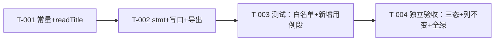

# pr-001-persist-rename-write-port — 任务图

> 输入：`docs/iterations/0014-chat-rename/prs/pr-001-persist-rename-write-port.md`（PR 卡）、
> `architecture.md` §3.1（语句定案）/ §3.2（不复用既有写路径）/ §3.3（readTitle）/ §8.1（测试同步）/ §8.4（回归锁）。
> 范围：仅 `oamp/src/persist.js` + `oamp/test/persist.test.js`；schema / 迁移 / 既有查询与写口 / 自动标题路径零改动。

## 依赖图

- **最长依赖链 / 关键路径**：T-001 → T-002 → T-003 → T-004（4 跳，全为串行硬依赖）。
- **无环**：链式，无循环依赖。
- **可并行性说明**：T-001 与 T-002 在同一个文件内且 T-002 直接引用 `readTitle`，不拆并行；T-003 的用例形状由 architecture §3.1 的硬契约预先锁定，可与 T-002 并行起草，但**执行/验收必须等 T-002 落地**（白名单断言要读到新增导出键）。

## 任务清单

### T-001 — `persist.js`：手动标题常量与写口校验函数
- **优先级**：P0
- **前置依赖**：无
- **描述**：新增 `TITLE_MAX_MANUAL = 100` 常量；在既有校验函数族（`readOptionalString` 之后、`openDb` 之前）新增 `readTitle(value)`：非字符串 / trim 后为空 / 长度 > 100 → 抛错，合法返回 trim 后值。
- **验收标准**（可测试）：
  1. `readTitle` 对非字符串、`''`、全空白（含全角 `'　'`）抛错，且 `error.message` 以 `标题非法: ` 开头 —— 可追溯到 architecture §3.3（readTitle 定案）/ PR 卡验收 4 / F02 验收 1-2。
  2. `readTitle` 对 `'x'.repeat(100)`、`'😀'.repeat(50)`（100 UTF-16 单位）通过，对 `'x'.repeat(101)`、`'😀'.repeat(51)`（102 单位）抛错 —— architecture §3.1 常量注释（`String.length` 同一把尺子）。
  3. 内部空白保留、首尾空白被 trim —— architecture §3.3（`trim()`）。
  4. `TITLE_MAX = 40` / `TITLE_FALLBACK = '新对话'` 及其调用点逐字未变 —— PR 卡验收 6 / architecture §8.4 回归锁（F05 隔离）。
- **粒度判断**：单文件、常量+纯函数，1 天内；独立验收 = 可直接 import 单测。

### T-002 — `persist.js`：单列改名语句、写口包装与导出表
- **优先级**：P0
- **前置依赖**：T-001
- **描述**：在 `stmts` 内、既有 `upsertChat` 之后新增 `renameChat: db.prepare('UPDATE chats SET title = ? WHERE chat_id = ? AND archived_at IS NULL AND state != \'closed\'')`；在 `closeChat` 之后新增包装函数 `renameChat({ chatId, title })`（`readTitle` → `changes > 0 ? normalized : null`）；导出表追加 `renameChat`（其余 11 项不动）。
- **验收标准**：
  1. 语句 `SET` 子句**只有 `title` 一列**，`WHERE` 双守卫为 `archived_at IS NULL` 且 `state != 'closed'` —— architecture §3.1 硬契约 ①（逐列声明表）。
  2. 命中改名后：`title` = trim 后新值（返回值即权威标题，如 `'  季度复盘  '` → `'季度复盘'`）；`updated_at` / `agent_id` / `state` / `archived_at` / `closed_at` / `created_at` / `context_released` 逐列不变 —— architecture §3.1 逐列声明表 / PR 卡验收 2。
  3. `changes` 语义：新值 ≠ 旧值 → 返回新标题；新值 == 旧值 → 仍计 1、返回该标题（幂等成功）；不存在 / 已归档 / 已关闭 → `changes = 0` → 返回 `null` —— architecture §3.1「changes 语义表」（S-7 实测）。
  4. 不存在"改了但没成功却报成功"的静默路径：包装函数必须读 `changes`，无无条件返回 —— architecture §3.1 / PR 卡验收 3。
  5. 不改用 `upsertChat` / `ensureChat` / `insertInput` 任一路径 —— architecture §3.2 逐条对照（C-1 / C-2 / F03/F04）。
  6. 导出表由 11 项变 12 项，新增键名恰为 `renameChat` —— architecture §3.1 导出表 / §8.1。
- **粒度判断**：单文件三处相邻改动，1 天内；独立验收 = 直接驱动 `openDb()` 句柄。

### T-003 — `persist.test.js`：白名单加法 + 新增改名用例段
- **优先级**：P0
- **前置依赖**：T-002
- **描述**：`assert.deepEqual(writers, ...)` 期望数组加入 `'renameChat'`（唯一加法式修改）；在**写入侧用例之后**（`context_released` 用例之后、`双视图` 用例之前）新增用例段，覆盖 architecture §8.1 列出的 ①~⑨。
- **验收标准**：
  1. 白名单断言由 7 项变为含 `'renameChat'` 的 8 项；该断言之外既有用例**零修改**（逐字节可查） —— architecture §8.1 / PR 卡验收 1。
  2. 新增用例覆盖：命中改名+权威标题；9 列逐项不变（尤其 `updated_at`）；同值幂等；未知/已归档/已关闭 → `null` 且库值不变；trim 落库；非法入参抛错（非字符串 / `''` / `'   '` / `'　'` / 101 字符 / 102 单位 emoji）；边界 100 字符、50×emoji 通过、内部空白保留；隔离性（`insertInput` → `renameChat` → `insertInput` ⇒ 标题保持手动值） —— architecture §8.1「新增用例段」①~⑨ / PR 卡验收 2-5。
  3. 回归锁零修改且通过：`chats` 9 列列名与 schema 对象集断言、自动生成规则断言（40 截断 + 「新对话」兜底） —— architecture §8.4 / PR 卡验收 6。
- **粒度判断**：单测试文件，1 天内；独立验收 = `node --test test/persist.test.js`。

### T-004 — 独立验收：changes 三态实测 + 列不变实测 + 全量回归
- **优先级**：P0
- **前置依赖**：T-003
- **描述**：除新增用例自身的断言外，以独立脚本对 `openDb()` 句柄做一次"证据式"实测：三态返回 `null`、改名前后整行逐列比对。
- **验收标准**：
  1. `changes` 三态实测证据：未知 `chat_id` / 已归档行 / `state = 'closed'` 行各返回 `null`，且三行的库值逐列不变 —— architecture §3.1 changes 语义表。
  2. 列不变实测证据：除 `title` 外 8 个可比对列（`updated_at` / `agent_id` / `state` / `archived_at` / `closed_at` / `created_at` / `context_released` / `chat_id`）before/after 严格相等 —— architecture §3.1 逐列声明表。
  3. `cd oamp && node --test test/persist.test.js` 全绿；`node --test --test-concurrency=1 test/*.test.js` 串行全绿（基线 215 + 新增）。
  4. 提交到 worktree 分支，主仓库 `oamp/` 零改动 —— 上下文约束。
- **粒度判断**：验收动作，0.5 天内；不可再拆（同一证据面）。

## 依赖环报告

无。本任务图为单一链式依赖，不存在循环依赖，无需上报主 agent。

## `[model_inferred]` 验收标准

无。四条任务的验收标准均可逐条追溯到 `architecture.md` §3.1 / §3.2 / §3.3 / §8.1 / §8.4 或 PR 卡验收 1~6 的原文（引用已内联）。

## 疑问 / 越界

- 无信息缺口：PR 卡 + architecture §3.1/§3.2/§3.3/§8.1 已把语句、校验、changes 语义、测试同步清单全部定案，任务图未新增任何架构决策。
- 说明：T-001 / T-002 位于同一文件且存在符号引用（`renameChat` → `readTitle`），按 planner 粒度判断标准不拆为可并行单元；这不是循环依赖，是同一实现单元的接口内序。
