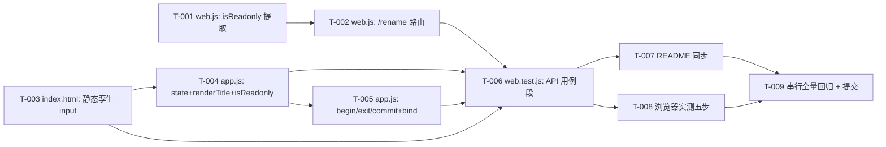

# pr-002-rename-api-ui-contract — 任务图

> 输入：`docs/iterations/0014-chat-rename/prs/pr-002-rename-api-ui-contract.md`（PR 卡）、
> `architecture.md` §4（只读判定单一真源，硬契约 ②）/ §5（接口形态，含 §5.2 全表与 §5.3 插入位置）/
> §6.2~§6.6（前端编辑态、事件与 Esc 优先、渲染落点、样式）/ §7.1~§7.2（成功与失败数据流）/
> §8.2（`web.test.js` 同步）/ §8.3（`README.md` 同步）/ §8.4（回归锁）。
> 前置：pr-001 已合并（`persist.js` 提供 `renameChat({chatId,title})` / `TITLE_MAX_MANUAL` / `readTitle`）。
> 范围：仅 `oamp/src/web.js`、`oamp/web/index.html`、`oamp/web/app.js`、`oamp/web/style.css`、
> `oamp/test/web.test.js`、`oamp/README.md`；`persist.js` / schema / SSE / 既有路由语义零改动。

## 依赖图

- **最长依赖链 / 关键路径**：T-001 → T-002 → T-006 → T-008 → T-009（5 跳）。前端侧 T-003 → T-004 → T-005 与 T-002 并行，但 T-006 必须三方齐备（它同时读 `index.html` / `app.js` 静态契约与 `web.js` 行为）。
- **无环**：图中有两条并行支线（服务端 / 前端），均单向汇入 T-006，无循环依赖。
- **可并行性说明**：T-001 与 T-003 可完全并行（不同文件）；T-002 依赖 T-001（同文件、`/rename` 的 409 分支调用 `isReadonly`）；T-004/T-005 是同一文件内的接口内序（不拆并行）；T-006 的用例形状由 §5.2 / §8.2 预先锁定，可与实现并行起草，但**执行**必须等三个源文件落地。

## 任务清单

### T-001 — `web.js`：只读面提取为具名谓词 `isReadonly`（**硬契约 ②**）
- **优先级**：P0
- **前置依赖**：无
- **描述**：在 `sendJson` 之前（与既有 http 小工具同区）新增模块级 `isReadonly(chat)`，函数体 = 既有内联表达式 `chat.archived_at !== null || chat.state === 'closed'` **逐字**；把 `/api/messages` 的 409 判定改为调用该函数，归档优先出文案的**文案与状态码逐字不变**。
- **验收标准**（可测试）：
  1. `isReadonly` 对 `{archived_at:null,state:'working'}` → `false`；对 `{archived_at:123456,state:'completed'}` → `true`；对 `{archived_at:null,state:'closed'}` → `true` —— architecture §4.1 ①（判定真源 = 既有表达式逐字提取）。
  2. `POST /api/messages` 打到已关闭 chat → 409 且 `error === 'chat 已关闭，不接受新输入'`；打到已归档 chat → 409 且 `error === 'chat 已归档（只读），不接受新输入'` —— architecture §4.2-4（对外行为逐字不变）/ §8.4 回归锁 / PR 卡验收 3。
  3. 既有 `web.test.js` 的 closed / archived 409 断言零修改通过 —— architecture §8.2「既有 409 用例（closed / archived）：不动」。
  4. `web.js` 中"能否改"的判定只出现 `isReadonly` 一处（`/api/messages` 与 `/rename` 共用），无第二套内联表达式 —— §4.2-1（判定唯一）。
- **粒度判断**：单文件两处相邻改动，0.5 天内；独立验收 = `node --test test/web.test.js` 既有用例全绿 + 静态 grep。

### T-002 — `web.js`：新增 `POST /api/chats/<chat_id>/rename` 路由
- **优先级**：P0
- **前置依赖**：T-001
- **描述**：在 `POST /activate` 块之后、`GET /api/stream` 之前插入 `/rename` 块，严格按 §5.2 处理顺序：`readBody`（畸形 400 / 超限 413，超限带 `connection: close`）→ `getChat` 预检 404 → `isReadonly` 预检 409（归档 / 关闭两条文案）→ `db.renameChat`（抛错 400）→ `null` 防御性 409 → 200 `{chat_id, title}`。
- **验收标准**：
  1. 200：响应体恰 `{chat_id, title}`，`title` = trim 后权威值（送 `'  季度复盘  '` ⇒ `'季度复盘'`），且 `GET /api/chats/<id>` 的 `chat.title` 相同 —— §5.2「成功」行 / PR 卡验收 1、3。
  2. 400：`{title:123}` / 空体 `{}` / `{title:null}` / `''` / `'   '` / 101 字符各返回 400 且**读回标题不变** —— §5.2「标题非法」行 / F02 验收 6。
  3. 404：未知 chat → `{error:'chat 不存在: <id>'}`，与 `/close`、`/activate` 逐字同形 —— §5.2「未知对话」行 / §5.3。
  4. 409 双路径：归档后改名 → `'chat 已归档（只读），不可改名'`；closed 后改名 → `'chat 已关闭（只读），不可改名'`，且两者库值均不变 —— §5.2 两个 409 行 / D-7 / F03 验收 1、2。
  5. 畸形 JSON → 400；超限（>64KiB）→ 413 且 `connection: close` —— §5.2 末两行（复用 `readBody` 与 `/api/messages` 照办式应答，逐字同形）。
  6. 不置顶（服务端断言）：改名成功后该条 `updated_at` 与改名前**逐字相等**，`GET /api/chats` 的 `chat_id` 顺序逐项不变 —— §7.1 / F04 验收 4、5 / PR 卡验收 2。
  7. `(body ?? {}).title` 的写法保留：JSON `null` / 数字 / 字符串体统一落 400，不产生 502 —— §5.2「两处实现细节的取舍」。
  8. 路由块位置在 `/activate` 之后、静态分支之前，既有 `endsWith('/close')` / `p === '/api/chats/archive'` / `endsWith('/activate')` / `GET` 方法守卫与之互不吞并 —— §5.3 表（S-3）。
- **粒度判断**：单文件一个新块，1 天内；独立验收 = HTTP 直打（无需前端）。

### T-003 — `index.html`：详情头静态孪生编辑框
- **优先级**：P0
- **前置依赖**：无
- **描述**：在 `.detail-head` 内、`h1#detail-title` 之后插入 `<input id="detail-title-input" class="detail-title-input hidden" type="text" maxlength="100" autocomplete="off" />`；`h1` / `#detail-meta` / `#btn-close` **逐字保留**。
- **验收标准**：
  1. 页面含 `id="detail-title-input"` 与 `maxlength="100"`（`maxlength` 是 AR-07 超长即时约束的唯一落点） —— §6.1 / §6.6 / PR 卡验收 4。
  2. 节点初始带 `hidden` 类（静态节点 + 类切换，与既有 `#mention` 同款），且为 `.detail-head` 的**直接兄弟**（非动态创建） —— §6.1「为什么是孪生 + hidden」/ 能力 H。
  3. 既有 `id="btn-close"` / `id="detail-meta"` / `id="detail-title"` 文本与结构未变 —— PR 卡验收 3（静态契约既有断言零修改）。
- **粒度判断**：单文件一行插入，0.5 天内；独立验收 = 读取 `index.html` 断言。

### T-004 — `app.js`：`state.titleEdit` + 前端 `isReadonly` + `renderTitle` 唯一渲染落点
- **优先级**：P0
- **前置依赖**：T-003
- **描述**：`state` 新增 `titleEdit: null`（放 `stream` 与 `notices` 之间）；在 `badge()` 附近新增模块级 `isReadonly(chat)`（与服务端同值）；新增 `renderTitle(chat)` 四态渲染（编辑中 early-return / 空态文案 / 只读无 `.editable` / 可编辑挂 `.editable`）；`renderChat()` 三处替换：`:156` → `renderTitle(null)`、`:163` → `renderTitle(chat)`、`:165` → `isReadonly(chat)`。
- **验收标准**：
  1. `renderTitle` 是标题区**唯一渲染落点**：空态文案 `'选择或新建一个对话'`，有值显示 `chat.title`，`input` 恒隐藏、`h1` 恒显示 —— §6.2 代码块。
  2. 编辑中（`state.titleEdit.chatId === chat.chat_id`）**early-return**：SSE 触发的 `renderChat()` 不覆盖输入、不关编辑态 —— §6.2 首条注释 / AR-05。
  3. `.editable` 只在非只读时挂上；只读（归档 / closed）与空态无任何可编辑暗示（`cursor: default`） —— §6.5 / F03 验收 1、2、5。
  4. `$('btn-close').disabled = isReadonly(chat)` 与改名前 `chat.state === 'closed' || chat.archived_at !== null` **同值**；空态分支的 `disabled = true`（:158）不动 —— §6.2 替换表 + 脚注 / AR-08 不分叉。
  5. 既有静态契约断言 `assert.match(appJs, /chat\.state === 'closed' \|\| chat\.archived_at !== null/)` 仍命中（前端 `isReadonly` 函数体保持该操作数次序，与 §4.1 ③ 的 `||` 求值同值） —— §8.2「**追加**（不修改既有断言）」。
  6. `renderChat()` 其余行逐字未动；`state` 其余字段未动 —— PR 卡文件范围。
- **粒度判断**：单文件四组相邻改动，1 天内；独立验收 = 静态断言 + 浏览器实测（T-008）。
- **`[model_inferred]`**：验收 5 —— §4.1 ③ 给的前端函数体是 `archived_at` 在前，而既有静态断言要求 `chat.state === 'closed' || chat.archived_at !== null` 这个字面次序；两条要求不可同时逐字满足，故取"操作数次序与既有断言一致"（`||` 无副作用、求值同值，"同形同值"的语义约束不破），以满足 §8.2「不修改既有断言」这一更强的显式约束。**需主 agent 确认。**

### T-005 — `app.js`：`beginTitleEdit` / `exitTitleEdit` / `commitTitle` + `bind()` 三处绑定
- **优先级**：P0
- **前置依赖**：T-004
- **描述**：新增三函数（放 `renderTitle` 之后、`renderChat` 之前）：`beginTitleEdit`（预填 + `focus()` 后 `select()`，空态 / 只读 / 已在编辑均首行 return）、`exitTitleEdit`（幂等：清 state → 复位 DOM）、`commitTitle`（Enter 与失焦共用；首行 state 门 → `exitTitleEdit` → trim 早退 → POST → 就地回填 + 双渲染 → 失败落 `#hint`）；`bind()` 内新增 `h1.onclick` / `input.onblur` / `input keydown`（Enter 提交、Esc 取消）三处绑定。
- **验收标准**：
  1. 点击可编辑对话标题 → `input.value === chat.title` 且 `document.activeElement` 为该 input、选区覆盖全文（`focus()` 早于 `select()`） —— §6.3 `beginTitleEdit` / F01 验收 1。
  2. Enter 保存：`keydown(Enter)` → `commitTitle()` → **恰一次** POST（随后的 blur 在首行被挡） —— §6.3「三条触发路径」表第 1 行 / F01 验收 2。
  3. 失焦保存：点他处 → 提交当前编辑，再完成跳转 —— §6.3 表第 2 行。
  4. Esc 取消：`exitTitleEdit()` 先清 `state.titleEdit` 再复位 DOM ⇒ 随后的 blur 零 POST，标题保持原值，且随后再点别处**不补保存** —— §6.3 表第 3 行 / D-11 / F01 验收 3。
  5. 空 / 全空白 / 未改动 ⇒ 零 POST 且 `h1` 回到原值（`exitTitleEdit` 已复位） —— §6.3 表第 4 行 / F01 验收 4 / F02 验收 4、5。
  6. 成功就地同步：`chat.title = r.title` + `state.chats` 命中项 `.title = r.title` + `renderChats()` + `renderChat()`，**零额外请求**、`#hint` 清空；左栏位置与时间显示不变（`updated_at` 未写） —— §6.4 表 / §7.1 / F04 验收 1、2、4、5 / PR 卡验收 5。
  7. 失败：`renderChat()` 保持原值 + `#hint` 显示 `改名失败：<原因>`（复用既有提示位） —— §6.4「失败与取消」/ §7.2 / D-12。
  8. `state.titleEdit` 是唯一门控，不引入 `cancelled` 标志位；`preventDefault` 只在 Enter / Escape 两条分支 —— §6.3 机制定案。
- **粒度判断**：单文件三函数 + 三绑定，1-2 天内；独立验收 = 浏览器实测（T-008）。

### T-006 — `web.test.js`：新增改名 API 用例段 + 静态契约追加断言
- **优先级**：P0
- **前置依赖**：T-002、T-004、T-005、T-003
- **描述**：在归档 / 激活用例之后新增改名用例段（§8.2 ①~⑧）；在前端静态契约测试中**追加**（不改既有行）`id="detail-title-input"` / `maxlength="100"` / `isReadonly` / `titleEdit` / `.detail-title-input` 五条断言。
- **验收标准**：
  1. 200 用例：响应 `title` = trim 后权威值、`GET /api/chats/<id>` 与库值一致、`updated_at` 逐字相等、列表 `chat_id` 顺序逐项不变 —— §8.2 ① / PR 卡验收 1、2。
  2. 400 用例覆盖非字符串（`{title:123}` / `{}` / `{title:null}`）、`''`、`'   '`、101 字符，且每次读回标题不变 —— §8.2 ② / F02 验收 6。
  3. 404 用例；409 双路径（归档 / closed）文案断言 + 库值不变 —— §8.2 ④⑤ / F03。
  4. 只读不分叉：同一对话"改名 409"与"发消息 409"同真 —— §8.2 ⑥ / F03 验收 3 / PR 卡验收 3。
  5. 改名后再发消息标题保持手动值 —— §8.2 ⑦ / F05 验收 4。
  6. 畸形 JSON → 400、超限 → 413 —— §8.2 ⑧（沿用既有 `/api/messages` 断言形状）。
  7. 静态契约五条追加断言全部命中 —— §8.2 / PR 卡验收 4。
  8. **既有断言零删改**：`:415-431`「标题取首条输入 40 字符」与静态契约段既有全部断言逐字未动 —— §8.4 回归锁 / PR 卡验收 6。
- **粒度判断**：单测试文件（约 7 个用例 + 1 处追加），1-2 天内；独立验收 = `node --test test/web.test.js`。

### T-007 — `README.md`：左右栏描述 + API 表 + 对话状态段同步
- **优先级**：P1
- **前置依赖**：T-006
- **描述**：左栏描述增补"标题即时同步且不改变列表位置"；右栏描述增补"点击详情头标题即可改名（Enter / 失焦保存、Esc 取消；已归档 / 已关闭不可改）"；API 表新增 `/rename` 行（只改 title 一列、trim 后存储、上限 100、拒空 400、只读 409、未知 404）；对话状态段增补"手动改名不改变状态与归档标记、不刷新最近更新时间"。
- **验收标准**：
  1. 四处位置按 §8.3 表逐项落地，且 API 表新行格式与既有行一致 —— §8.3 / PR 卡验收。
  2. 未新增长篇说明、未改动无关段落；零新依赖 —— 迭代约束（§9 D-14）。
- **粒度判断**：单文件四句，0.5 天内；独立验收 = 读取断言。

### T-008 — 浏览器实测（真实页面，非仅单测）
- **优先级**：P0
- **前置依赖**：T-006
- **描述**：隔离环境（临时 `OAMP_SOCKET` / `OAMP_DB` + 随机端口）拉起 Router + `oamp web start`，用真实浏览器执行五步并留证据。
- **验收标准**：
  1. 可编辑对话点击标题 → 出现预填且全选的编辑框 —— §6.3 / PR 卡验收 5。
  2. Enter 与失焦**各**触发一次保存（两次独立观察） —— §6.3 表 / PR 卡验收 5。
  3. Esc 后标题保持原值，且随后点击他处不补保存 —— §6.3 表第 3 行 / PR 卡验收 5。
  4. 空 / 全空白保存被拒 → 退出编辑并恢复原值；已归档 / 已关闭 / 空态点击无编辑框 —— §6.3 / §6.5 / F03 验收 5。
  5. 改名后详情头与左栏对应项立即显示新值，且该项列表位置与时间显示不变 —— §6.4 / F04 验收 1、2、4、5。
  6. 失败路径（可选：断开服务或拦截请求）→ 标题恢复原值 + `#hint` 提示 —— §7.2。
  7. 实测后清理临时环境（socket / DB / 进程） —— 上下文约束。
- **粒度判断**：验收动作，1 天内；不可再拆（同一证据面）。

### T-009 — 串行全量回归 + 提交
- **优先级**：P0
- **前置依赖**：T-007、T-008
- **描述**：`node --test test/web.test.js` → 全仓**串行** `node --test --test-concurrency=1 test/*.test.js`（期望 221 + 新增，20 个文件全绿）；`git commit` 到 worktree 分支。
- **验收标准**：
  1. `test/web.test.js` 全绿；串行全量全绿，计数符合预期 —— 上下文「验证」段。
  2. 提交信息说明"为什么"；主仓库 `oamp/` 与主工作区零改动（`git status` 于主仓库为空） —— 上下文硬约束。
- **粒度判断**：验收动作，0.5 天内；不可再拆（同一证据面）。

## 依赖环报告

无。服务端支线（T-001 → T-002）与前端支线（T-003 → T-004 → T-005）各自成链、互不反向依赖，汇聚于 T-006，不存在循环依赖，无需上报主 agent。

## `[model_inferred]` 验收标准

1. **T-004 验收 5**：§4.1 ③ 给出的前端 `isReadonly` 函数体为 `chat.archived_at !== null || chat.state === 'closed'`，而 `web.test.js` 既有静态契约断言要求字面 `chat.state === 'closed' || chat.archived_at !== null`；§8.2 又明确"**不修改**既有断言"。三者不可同时逐字满足 ⇒ 采用同值但操作数次序与既有断言一致的前端函数体。**需主 agent 确认**（不影响任何行为，仅字符序）。

除该条外，其余验收标准均逐条追溯到 `architecture.md` §4 / §5.2 / §5.3 / §6.1~§6.6 / §7.1~§7.2 / §8.2 / §8.3 / §8.4 或 PR 卡验收 1~6 的原文（引用已内联）。

## 疑问 / 越界

- **上游一致性提示（不构成阻塞）**：§4.1 ③ 与 §8.2 在"前端函数体字面次序 vs 既有静态断言零修改"上存在字面层冲突，已按"零修改既有断言"优先处理并标注 `[model_inferred]`（见上），未自行修改上游文档。
- 无其他信息缺口：端点形态、处理顺序、插入位置、前端四态渲染与三条触发路径、同步矩阵、README 四处改法均已由 architecture 定案，任务图未新增任何架构决策。
