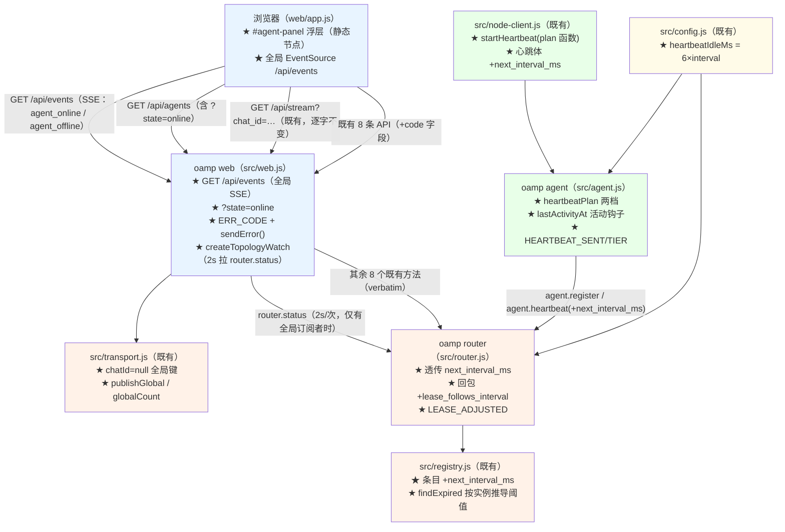
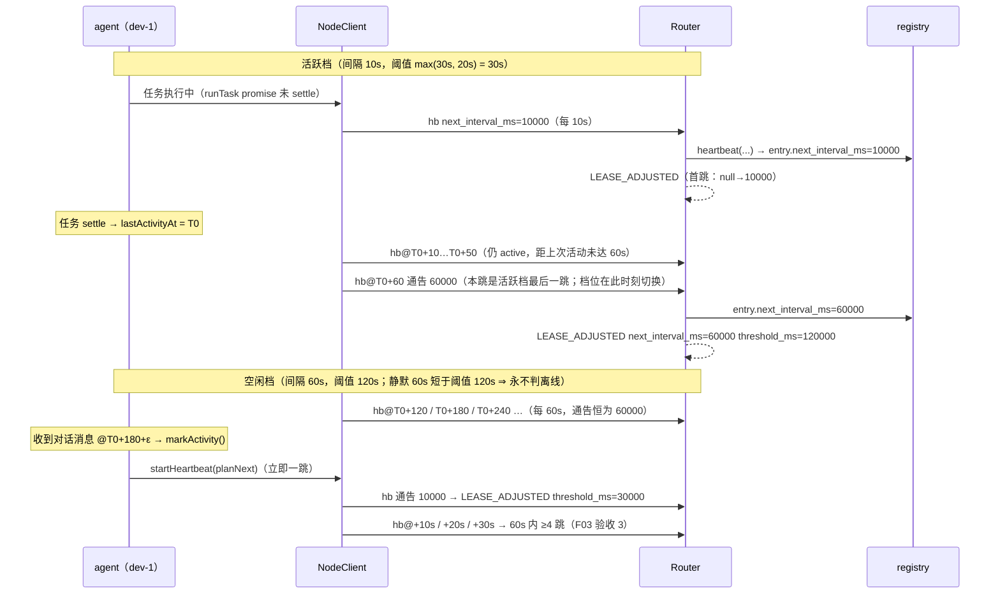
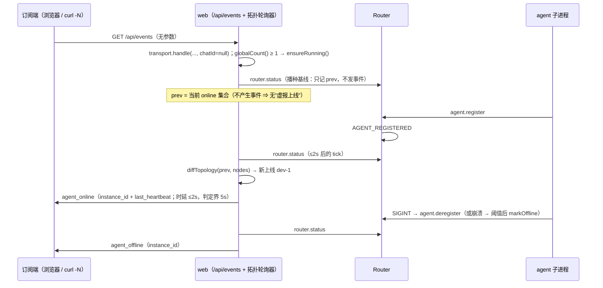
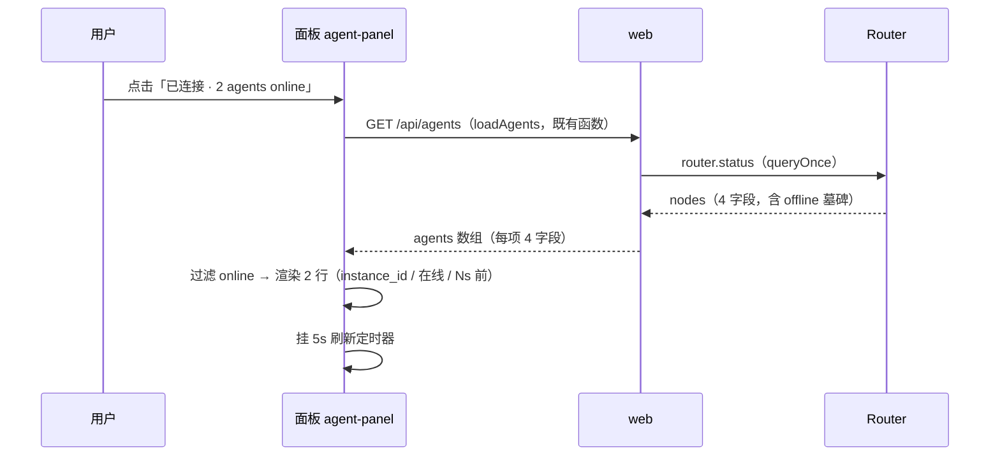
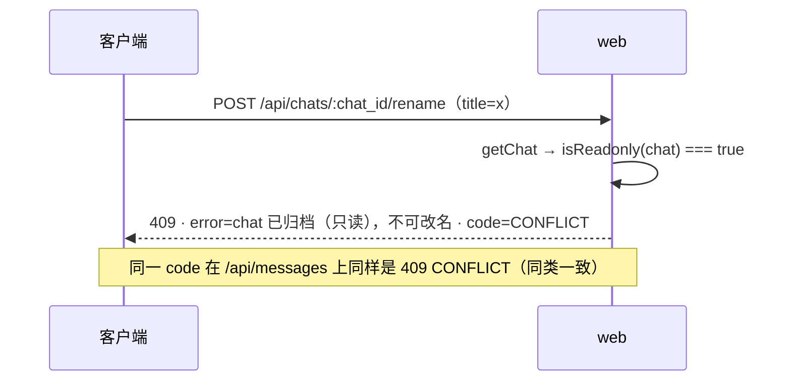

# architecture.md — 0015-hub-orchestration-open-api（迭代架构）

**版本**：1.0.0（阶段 3 产物）　**日期**：2026-09-12　**状态**：**L1 决策已确认（2026-09-11 用户决策；2026-09-12 主 agent 转达落盘）——本阶段可进入阶段 4**；§3 / §4 / §5 三处为**硬契约**（心跳两档与租约联动、全局事件流形态、统一错误契约），§3.6 的心跳计数窗口规程同为**实现契约**，实现阶段不得偏离
**输入**：`prd.md`（v0.1.0，8 卡 F01~F08 / AR-01~AR-08）+ `demand.md`（v1.0.0，W1~W7 / N1~N14 / E1~E9 / M-1~M-8 / C-2 / C-4 / C-5 / C-7，仅作追溯基准）
**架构基线**：`docs/iterations/0014-chat-rename/architecture.md`（v1.0.0，已合入 `main`）+ 阶段 3 重新取证的 `oamp/**`（§1）
**前置**：0011 交付态（SQLite 落盘 / SSE / 常驻上下文池 / 对账补拉）+ 0013（归档双视图）+ 0014（标题行内编辑）；当前 `oamp/test/*.test.js` 共 **20** 个文件、**226** 用例（0014 交付态）
**约束**：零新第三方依赖（`oamp/package.json` 的 `dependencies` 保持 `{}`）；**零新模块 / 零新进程 / 零新传输**；零新增用户可调心跳旋钮（N9）；零数据层变更；`roles/**` 只读；不改注册 / 校验 / 顶替语义（F08）

> 本文档回答 prd 的全部 8 条架构待填项（AR-01~AR-08，逐条落定见 §11），给出组件与数据流（§2 / §8）、分级决策（§10）、**AR-03 的方案对比与推演**（§3）、PR 边界**输入**（§15；拆解归阶段 4）。

---

## 0. 一句话架构

> **心跳两档不改协议骨架，只给既有 `agent.heartbeat` 通知加一个可选字段 `next_interval_ms`（"距下一跳的间隔"），Router 的判活阈值从固定值改为按实例推导的 `max(基准阈值, 2 × 该实例最近一次通告值)`** —— 不变式"判活阈值 ≥ 2 × 心跳间隔"从"靠配置对齐"变成"由一行公式结构性保证"，空闲 60s 跳不会被判离线，且全程不重注册、不换 session（C-2 三条约束同时成立的唯一代价最小路径）；**前端只做两件新事**——顶栏 `#conn-status` 点击展开一个静态浮层 `#agent-panel`（数据全量复用既有 `GET /api/agents`，零响应形态变更），以及页面打开一条**全局 SSE**（新路径 `GET /api/events`，复用既有 `createSseTransport` 与 `null` 订阅键），全局事件由 **web 进程周期拉 `router.status` 差分成 `agent_online` / `agent_offline`** 推送（Router 零改动、无协议新方法）；**统一错误契约在不改既有 `error` 字段语义的前提下加一个机器码字段**（`{ error, code }` + 5 条状态码一一映射），既有调用方与既有前端零改动；**接口文档 `oamp/API.md`** 覆盖 10 条 HTTP 路径 + 6 类事件 + 可粘贴示例。

---

## 1. 现有架构基线（阶段 3 重新取证，2026-09-12）

### 1.1 相关现有组件与文件

| 文件 | 现状职责（阶段 3 复核） | 与本次迭代的关系 |
|---|---|---|
| `oamp/src/config.js`（127 行） | 内置默认 + `config.json` + env 覆盖；`NUMERIC_DEFAULTS`（:19-24）= `OAMP_HEARTBEAT_INTERVAL_MS:10000` / `OAMP_HEARTBEAT_TIMEOUT_MS:30000` / `OAMP_HB_LOG_WINDOW_MS:60000` / `OAMP_RECONNECT_MAX_MS:10000`；`loadConfig` 返回 `heartbeatIntervalMs` / `heartbeatTimeoutMs` / `hbLogWindowMs` / `reconnect`(:121) / `reconnectMaxMs` / `dbPath` / `defaultModel` / `contextMax`。**三键只由 env 决定**（`config.json` 无对应键） | **改造（小）**：新增一个派生常量 `HEARTBEAT_IDLE_FACTOR = 6` 与派生字段 `heartbeatIdleMs = heartbeatIntervalMs × 6`（默认 60000ms）。**不加 env 键、不加 config.json 键**（N9） |
| `oamp/src/registry.js`（276 行） | 全内存注册表 + 纯判定逻辑：条目 `{instance_id, session_id, state, last_heartbeat, connId}`（:58/:64）；`heartbeat({instanceId,sessionId,now})`（:74，仅 session 匹配且 online 才刷 `last_heartbeat`，返回 boolean）；`findExpired(now, timeoutMs)`（:111，`now - last_heartbeat > timeoutMs`）；`markOffline`（:126）；`snapshot()`（:134，**只投影 4 字段**：instance_id / session_id / state / last_heartbeat，按 instance_id 排序） | **改造（核心）**：条目 +`next_interval_ms: number\|null`；`heartbeat` 增加可选 `nextIntervalMs` 入参（校验后落条目，非法/缺省 → `null`）；`findExpired` 的阈值改为**按实例推导**（§3.4）。**`snapshot()`/`markOffline`/`register`/`deregister`/任务表逐字不动** |
| `oamp/src/router.js`（526 行） | UDS 监听 + 9 方法分发；`agent.register` 回 `{instance_id, session_id, state, lease_timeout_ms: config.heartbeatTimeoutMs, last_heartbeat}`（:152）；`agent.heartbeat` 分支（:159-171，通知语义、无响应、只刷心跳 + 节流日志）；租约扫描 `setInterval(clampSweepPeriod(timeout)=750ms)` → `registry.findExpired(now, config.heartbeatTimeoutMs)` → `markOffline` → **destroy 连接** + `AGENT_OFFLINE`（:475-494） | **改造（小）**：`agent.heartbeat` 透传 `next_interval_ms`；`agent.register` 回包 **+`lease_follows_interval: true`**（新增字段）；通告值变化时打一条 `LEASE_ADJUSTED`（可观测面，AR-03-e）。**扫描周期、markOffline、断连逻辑、其余 7 个方法逐字不动** |
| `oamp/src/node-client.js`（228 行） | 唯一协议客户端：`register` / `startHeartbeat(intervalMs)`（:153-166，`tick()` 立即一跳 + `setInterval` + `unref`，通知体只有 `{instance_id, session_id}`）/ `_stopHeartbeat` / `deregister` / `send` / `ack`；`_handleClose` 停心跳并回调 `onClose` | **改造（中）**：`startHeartbeat(intervalMs)` 支持**函数入参**（每跳前取一次"下一跳间隔"）；心跳体 +`next_interval_ms`；`setInterval` → 自调度 `setTimeout` 链（保持"注册后立即一跳"、`unref`、stop 语义）。**固定数字入参的行为逐字不变**（假节点 / web 发送方 / 既有测试全部照旧） |
| `oamp/src/agent.js`（698 行） | agent 生命周期：解析参数 → 循环（connect/register → `REGISTERED` + `LEASE_ALARM` 检查（:664-669）→ `client.startHeartbeat(config.heartbeatIntervalMs)`（:670）→ 等 `onClose`）；任务面 `createTaskDeliverHandler`（:434-450，`task.request` → `runTask(...)` **fire-and-forget** + 立即自动 ack；`notice` → 释放上下文）；`runTask`（:334-338）分派 omp / omp-daemon / shell | **改造（核心）**：新增**纯函数** `heartbeatPlan({idleForMs, activeMs, idleMs})`（具名导出，可单测）；活动时间戳 `lastActivityAt` 由 deliver 与任务结束两个钩子刷新；`HEARTBEAT_SENT` / `HEARTBEAT_TIER` / `HEARTBEAT_IDLE_DISABLED` 三条事件（可观测面）。**任务执行体、角色绑定、上下文池、重连退避逐字不动** |
| `oamp/src/transport.js`（79 行） | `createSseTransport({heartbeatMs=15000})`：`subscribers: Map<key, Set<res>>`（:12）、`handle(req,res,{chatId})`（:32，SSE 头 + `retry: 1000` 首帧 + `close` 自清理）、`publish(chatId, event)`（:57，无订阅者即丢弃、不缓存不补发）、`close` / `closeAll`、15s `: keepalive` 心跳 | **改造（极小）**：`chatId` 槽位接受 `null`（全局订阅键，字符串 `chat_id` 不可能与之相等）；+`publishGlobal(event)`（= `publish(null, …)`）、+`globalCount()`。**键结构、心跳、清理、丢弃语义零改动** |
| `oamp/src/web.js`（647 行） | 内建 http + JSON API + SSE：`sendJson`(:68) / `readBody`(:75，畸形 400 / 超限 413) / `queryOnce`(:112，**每次新建 UDS 连接**发一次 RPC 后关闭)；路由 `/api/agents`(:378，**verbatim 透传 `router.status`**)、`/api/chats*`(5 条)、`/api/stream`(:521-528，**无 chat_id → 400**)、`/api/messages`(:532)、静态(:564)、404 兜底、外层 catch → 502(:621)；`transport = createSseTransport()`(:197)；`sender` 常驻节点（`heartbeatMs = max(500, min(interval, timeout/3))`）；`tasks` 对账补拉（`OAMP_WEB_RECONCILE_*`，:209-215，`readPositiveMs` 兜底解析） | **改造（中）**：+`GET /api/events`（全局 SSE）；`GET /api/agents` 支持 `?state=online`；+`ERR_CODE` / `sendError()` 并把全部错误出口改为统一契约（§5）；+拓扑轮询器（`createTopologyWatch` + 具名导出的纯函数 `diffTopology`）；+env `OAMP_WEB_TOPOLOGY_POLL_MS`。**既有 9 条路径的方法与成功路径语义、SSE 四类事件、对账逻辑逐字不动** |
| `oamp/web/index.html`（71 行） | 顶栏 `.topright` 内唯一节点 `<span id="conn-status" class="conn conn-wait">连接中…</span>`（:18）；`.topnav` 的 `Agents`(:14) / `Tasks`(:15) 是**死链 span**；`#mention` 浮层（:57） | **改造**：`.topright` 内、`#conn-status` **之后**新增静态兄弟节点 `<div id="agent-panel" class="agent-panel hidden"></div>`。**`#conn-status` 保持"只装文本"**（`setConn` 写 `textContent`，不能被面板污染）。死链 `Agents`/`Tasks` 维持现状（N/E9 范围外） |
| `oamp/web/app.js`（784 行） | `state`(:15-27)；`setConn(ok, detail)`(:46-50，写 `#conn-status` 文本 + 在线计数 `state.agents.filter(a=>a.state==='online').length`)；`loadAgents()`(:472-479，**仅 init + `window.focus`**)；会话 SSE `subscribe/unsubscribe`(:384-419，按 chat)；`handleEvent`(:420)；`showMention`(:653-672，**列 `state.agents` 全量（含离线，渲染为 `offline` 类）**)；`bind()`(:708)；`syncWaitTimer`/`stopWaitTimer`（**"仅在某状态下存在的定时器"既有先例**）；`init()`(:780-784) | **改造（中）**：`state` +`agentPanel`；+`renderAgentPanel` / `toggleAgentPanel` / `closeAgentPanel` / `fmtAgo` / `connectAgentEvents`；`#conn-status` 绑点击 + 文档级"点外关闭 / Esc 关闭"；面板展开期间挂 5s 刷新定时器；`badge()` 映射 +`online`。**`loadAgents` 取数口径不变（仍取全量）**——@ 补全的离线可见性不得被本迭代改变 |
| `oamp/web/style.css` | `.topright` / `.conn` / `.badge-*` / `.mention` + `.hidden`（`.hidden` 目前**只**对 `.mention` 生效） | **改造**：`.topright{position:relative}`、`.agent-panel`(+`.hidden`)、`.agent-row` / `.agent-id` / `.agent-hb`、`.badge-online`、`#conn-status.conn-ok{cursor:pointer}` |
| `oamp/src/{persist,rpc,status,log,task,cluster,cluster-config,role-binding,cli,context-pool,acp-client}.js`、`oamp/bin/`、`oamp/package.json` | 0010~0014 交付面 | **不改**（`rpc.js` 的 `ERR` 机器码是 **UDS 协议**错误码，与本次 HTTP 错误契约**不同层**，两处不合并——§5.4） |
| `oamp/README.md` | Web 控制台段（:119-143）、HTTP 表（:151-161）、SSE 事件段（:163-168）、环境变量表（:80-82） | **同步**（§9.3）：HTTP 表 +`/api/events`、`?state=online`、统一错误契约一句；Web 控制台段 +顶栏可点开列表；事件清单 +2 类 |
| `oamp/API.md` | **不存在** | **新建**（F07，§6.4 锁定章节结构与内容下限） |
| `oamp/test/*.test.js`（20 文件 / 226 用例） | 见 §9 | **同步**：`web.test.js`（**0 条既有用例改写** + 4 段新增；被列为"疑似需改写"的 `/api/stream` 缺参 400 由本方案保留）、`agent-heartbeat.test.js`（新增档位段 + 纯函数段）、`transport.test.js`（新增全局键段）。**其余 17 个文件零改动**（§9.1） |

### 1.2 可直接复用的既有能力（决定了本方案"少造东西"）

| # | 既有能力（代码位置） | 本次如何复用 |
|---|---|---|
| A | `createSseTransport` 的键式订阅抽象（`transport.js:12/32/57`，且 `handle` 的 `close` 自清理与 15s keepalive 覆盖全部订阅集合） | 全局事件流**零新传输**：`chatId=null` 即全局键，keepalive / 断连清理 / `retry: 1000` 全部自动继承 |
| B | `queryOnce(socketPath, method, params)`（`web.js:112`，无状态一次性 RPC） | 拓扑轮询器直接调用（`router.status` 已是 `GET /api/agents` 的数据源），零新 RPC 客户端 |
| C | `router.status` 的 4 字段快照（`registry.js:134`，按 instance_id 排序、含 offline 墓碑） | 面板与 `?state=online` 的**唯一数据源**；`last_heartbeat` 已是 epoch ms，前端只需相对化 |
| D | `sendJson(res, status, body, headers)`（`web.js:68`）与 `readBody` 的 `err.status` 语义（畸形 400 / 超限 413，`web.js:75`） | 新端点与统一错误出口全部沿用，零新解析/写响应逻辑 |
| E | `readPositiveMs(name, fallback)`（`web.js:44-47`）与 `OAMP_WEB_RECONCILE_*` 的"env 只为测试压缩时间轴"先例 | 轮询间隔用同一函数解析（`OAMP_WEB_TOPOLOGY_POLL_MS`），零新配置代码 |
| F | `syncWaitTimer` / `stopWaitTimer`（`app.js`）的"**仅在某状态下存在的定时器**"手法（working 期间 1s 计时） | 面板展开期间的 5s 刷新定时器同款（关闭即清，不留常驻定时器） |
| G | `state.mention` 的"静态节点 + `.hidden` 切换"浮层手法（`index.html:57` / `app.js:653`）与 `.hidden` 的既有用法 | 面板 = 静态节点 + `.hidden` 切换（**不**动态创建、**不**复用 `.mention` 的选择器语义） |
| H | `logger.event(name, fields)` / `logger.heartbeat(fields)`（`log.js`，`key=value` 行格式）与既有事件名族（`AGENT_REGISTERED` / `AGENT_OFFLINE` / `LEASE_ALARM` / `TASK_STARTED`…） | 新增 4 条事件（`LEASE_ADJUSTED` / `HEARTBEAT_SENT` / `HEARTBEAT_TIER` / `HEARTBEAT_IDLE_DISABLED`）全部走同一格式化器，零新日志设施 |
| I | harness 的 `SHORT_ENV`（`interval=50 / timeout=300 / window=300`，`test/helpers/harness.js:19-23`） | 心跳两档的**端到端可测性来源**：空闲档 = 6 × 活跃档 ⇒ 测试环境空闲档 = 300ms（§3.6） |
| J | `agent.js` 既有的 `LEASE_ALARM` 告警位（:664-669，`lease < 2 × interval` ⇒ 一条带 `note` 的事件） | 不变式告警的形态与语义**原样保留**，只在其旁边增加"旧 Router 禁用空闲档"的同款告警 |

### 1.3 既有缺口（正好是 8 张卡的来源）

1. **顶栏只是一个计数文本**（`index.html:18` + `app.js:46-50`）：没有任何逐项列表，`Agents` nav 项是死链（`index.html:14`）——缺"能看"（F01）。
2. **计数只在初载与窗口聚焦刷新**（`app.js:776` 是唯一刷新钩子）：无 SSE 驱动、无周期刷新——缺"实时"（F02）。
3. **心跳间隔是固定常量**（`node-client.js:153` 的 `setInterval(tick, intervalMs)`，入参来自 `agent.js:670` 的 `config.heartbeatIntervalMs`）：协议与实现都没有"降频"这个维度（F03）。
4. **判活阈值是全局固定值**（`router.js:477` 的 `findExpired(now, config.heartbeatTimeoutMs)`），且 `agent.heartbeat` 的通知体不带任何档位/间隔信息；**协议无 renew**（`agent.deregister` 之外没有续期方法）——C-2 的物理来源（F03 验收 5/6/7）。
5. **心跳记录在默认配置下不可计数**：Router 侧 `HEARTBEAT` 事件被 `OAMP_HB_LOG_WINDOW_MS`（默认 60000）**每节点滑窗节流至多 1 条/分钟**（`log.js` 的 `heartbeat()`），agent 侧**完全不记录心跳**——E4 的"心跳记录时间戳可直接计数"在默认配置下**没有落点**（F03 验收 1~3 的观测缺口）。
6. **事件流强制绑定对话**：`/api/stream` 无 `chat_id` 直接 400（`web.js:523-526`），agent 上下线**无法被任何订阅者感知**（F05）。
7. **错误响应体不统一**：全部为 `{error: "<人话>"}`，**无机器码**、无逐接口错误清单；外层 catch 把一切异常兜成 502（`web.js:621`）——客户端无法只写一次错误处理（F06）。
8. **README 内联表格不足以接入**：HTTP 表仅 9 行说明、无请求/响应示例、无 SSE 订阅示例（F07）。

### 1.4 阶段 3 只读取证（本方案直接依赖的实测事实）

| # | 结论 | 证据 |
|---|---|---|
| **S-1** | `lease_timeout_ms` 由 Router 在 register 回包里给出（= `config.heartbeatTimeoutMs`），agent 只在**注册时**校验一次 `lease < 2 × interval` 并打 `LEASE_ALARM`；运行期不再校验 | `router.js:152`、`agent.js:662-669` |
| **S-2** | 租约扫描周期 = `clamp(timeout/4, 20, 1000)` = **750ms**（默认），与心跳间隔无关；判定为 `now - last_heartbeat > timeoutMs`（**严格大于**） | `router.js:16-19, 477`、`registry.js:111-118` |
| **S-3** | `registry.snapshot()` **显式投影 4 字段**（不 spread 条目），因此条目新增字段**不会**泄漏到 `router.status` / `GET /api/agents` 的响应形态 | `registry.js:134-146` |
| **S-4** | `GET /api/agents` = `router.status` 的**逐字透传**（`{agents: r.nodes}`），既有前端只做 `state==='online'` 过滤与计数，`showMention` 会渲染离线项的 `offline` 类 | `web.js:378-381`、`app.js:46-50, 653-672` |
| **S-5** | `createTaskDeliverHandler` 对 `task.request` 是 **fire-and-forget**（`runTask(...)` 不 await，立即返回 `undefined` → node-client 自动回 `ack accepted`），因此"任务在飞"**不能**由 deliver 钩子的生命周期表示，只能由 `runTask` 返回的 promise 表示 | `agent.js:434-450`、`node-client.js:104-131` |
| **S-6** | 既有测试用 `SHORT_ENV` 压缩时间轴（interval=50ms / timeout=300ms），且 `agent-heartbeat.test.js` 逐字断言 `lease_timeout_ms=300`；`web.test.js` 用 `LEASE_ENV(timeout=3000)` 保证 web 常驻发送方（心跳下限 500ms）不被判离线 | `test/helpers/harness.js:19-23`、`test/agent-heartbeat.test.js:28`、`test/web.test.js:121` |
| **S-7** | `web.test.js` 中存在一条**曾被列为需改写**的既有用例：`/api/stream` 缺 `chat_id` → 400（`test/web.test.js:911-917`）；本方案**保留该 400**（全局订阅走新路径）⇒ 该用例**无需改写**。其余既有断言全部基于 `body.error` **字符串**或行为结果，新增 `code` 字段不会命中 | 阶段 3 grep（`oamp/test/web.test.js` 全部 `error` 断言点） |
| **S-8** | 前端 `api()` 以 `data.error` 作 `Error(message)`（`app.js:34-43`）：只要 `error` 仍是**人类可读字符串**，既有前端与既有调用方**零改动**可用 | `app.js:34-43` |
| **S-9** | `.hidden` 在本仓**只对 `.mention` 生效**（`.mention.hidden{display:none}`），不存在全局 `.hidden` 规则 | `web/style.css` 阶段 3 取证 |

---

## 2. 本次演进总体方案

### 2.1 组件图



**★ = 本次新增/改动；未标 ★ 的边 = 逐字不变的既有链路。**

### 2.2 模块布局（零新文件）

| 层 | 文件 | 本次改动性质 |
|---|---|---|
| 配置 | `src/config.js` | +1 派生常量、+1 派生字段 |
| 协议服务端 | `src/router.js` + `src/registry.js` | +1 通知字段透传、+1 回包字段、+1 日志事件；+1 条目字段、+1 入参、**阈值公式改造** |
| 协议客户端 | `src/node-client.js` + `src/agent.js` | 心跳调度改为自调度链 + 通告字段；+档位策略（纯函数）+3 条事件 |
| 传输 | `src/transport.js` | +`null` 键语义、+2 个方法 |
| HTTP/SSE | `src/web.js` | +1 路由、+1 查询参数、+错误契约、+拓扑轮询器 |
| 前端 | `web/index.html` + `web/app.js` + `web/style.css` | +1 静态节点、+5 函数、+1 全局 SSE、+定时器 |
| 文档 | `oamp/API.md`（新建） + `oamp/README.md` | 新文档 + 三处同步 |

### 2.3 与 0011 / 0013 / 0014 的关系（不改语义清单）

| 既有能力 | 本次是否触碰 | 说明 |
|---|---|---|
| 对话落盘（`in`/`out` 恰两条、流式增量不入库） | ❌ 零改动 | `persist.js` 逐字不动，`API.md` 只描述既有行为 |
| 按对话 SSE 四类事件（`message`/`task_update`/`chat_state`/`notice`） | ❌ 零改动 | 事件名、载荷、`chat_id` 强制规则、`retry: 1000`、15s keepalive 全部不变（F05 验收 3） |
| 对账补拉（`OAMP_WEB_RECONCILE_*`） | ❌ 零改动 | 新增的拓扑轮询器是**独立**定时器，不复用对账登记表 |
| 归档 / 激活 / 改名 / 关闭的端点与语义 | ❌ 零改动 | 仅错误响应体**增加** `code` 字段（`error` 字符串逐字不变，S-8） |
| 注册 / 校验 / 顶替（latest-wins）/ 注销语义 | ❌ 零改动 | `register` / `deregister` / `isValidInstanceId` / `agent.replaced` 逐字不动（F08 验收 1~4） |
| `oamp status` 的查询语义与输出列 | ❌ 零改动 | `snapshot()` 仍 4 字段（S-3），F01 验收 2 的对照基准保持可比 |
| 集群命令 / 角色绑定 / 上下文池 / ACP 执行器 | ❌ 零改动 | 本次不触碰 agent 的任务执行面 |

---

## 3. 心跳两档与租约联动（落地 AR-03；**硬契约 ①**，C-2 的唯一解法）

### 3.1 约束推导（把需求翻译成可判定的三条）

| C-2 约束 | 现有物理事实 | 直接推论 |
|---|---|---|
| ① 降频不得被判 offline | 阈值 30s（固定）× 空闲跳 60s → **第 1 跳之前就被 `markOffline` + destroy 连接**（S-1/S-2） | 阈值必须**随档位变化**，且必须在**长间隔发生之前**就已经放大（不能"事后补救"） |
| ② 不得换 session / 不中断对话绑定 | register 每次都 `newSessionId()`（`router.js:139`），重注册 = 新 session + 旧连接被顶替 destroy | **禁止**用"重注册改间隔"路径（B-1 方案①，demand 已判死） |
| ③ 租约 ≥ 2 × 间隔（`LEASE_ALARM` 不得触发） | 阈值与间隔是两个独立常量（`OAMP_HEARTBEAT_TIMEOUT_MS` / `OAMP_HEARTBEAT_INTERVAL_MS`），靠人工配置对齐 | 必须让不等式**由代码结构保证**，而不是由配置纪律保证 |

**结论**：任何方案都必须让 Router 在"下一次长间隔到达之前"知道"该实例接下来会安静多久"，且不得改变连接与会话身份。

### 3.2 三个候选机制（对比）

| # | 机制 | 不判 offline 怎么做到 | 会话身份 | 改动面 | 判定 |
|---|---|---|---|---|---|
| **A** | **心跳携带"下一跳间隔"通告，Router 按实例推导阈值** | 每跳通告下一跳间隔 ⇒ 阈值 = `max(基准, 2 × 通告值)`，**在长间隔之前就已放大** | 完全不碰 register / session；零重注册 | `registry`（条目 + 入参 + 阈值公式）+ `router`（透传 + 回包字段 + 1 事件）+ `node-client`（通告 + 自调度）+ `agent`（档位策略 + 钩子） | **选定** |
| B | 心跳携带**档位枚举**（`tier: active\|idle`），Router 查表取阈值 | 等价可行（Router 用 config 的 `heartbeatIdleMs` 推导 `2×`） | 同上 | 与 A 相当（Router 侧要"知道"两档语义） | **否决**：通告的"档位"与实际的定时器间隔是**两个可以互相漂移的事实**（说 idle 却按 10s 跳无害，说 active 却睡 60s 直接判死）；A 的通告值**就是**定时器参数本身（同一个变量），不可能漂移 |
| C | Router 把**全局**阈值直接抬到能覆盖空闲档（`max(30s, 2×60s) = 120s`），协议零改动 | 静态成立 | 不受影响 | 最小（改一个默认值） | **否决**：把**所有**节点的判活精度降到最低档——`kill -9` 的节点从 30s 才发现拖到 120s（退出不优雅的真实故障），且 `OAMP_HEARTBEAT_TIMEOUT_MS` 的语义被静默改写（用户设 30s 得到 120s）。**但它保留了"若主 agent 否决协议增补"的回退价值**（§14 L1-01 的回退项） |
| D | 空闲时由 agent 发一个**租约续期** RPC（新增 `agent.renew`） | 需要新方法 + Router 侧续期语义 + 触发时机仍要 agent 知道档位 | 可保持 | 最大（协议新增方法 + 失败/重试语义） | **否决**：新增方法 = 新协议面 + 新增失败模式（续期丢了怎么办），而 A 只需要一个**可选字段**；A 的每跳通告天然等价于"续期"且零额外往返 |

### 3.3 选定方案（A）的完整定义

**协议面（唯一两处增补，均为"可选/附加"，不改变既有字段语义）**

```jsonc
// ① agent.heartbeat（既有通知，无响应）— 新增第 3 个可选参数
{ "instance_id": "dev-1", "session_id": "<uuid>", "next_interval_ms": 60000 }
//   next_interval_ms = 本跳通告：距下一跳的间隔（毫秒）。
//   缺省（旧 agent / 固定间隔客户端）⇒ Router 保持基准阈值——与迭代前逐字一致。

// ② agent.register 回包 — 新增第 6 个附加字段（既有 5 字段与取值逐字不变）
{ "instance_id": "dev-1", "session_id": "<uuid>", "state": "online",
  "lease_timeout_ms": 30000, "last_heartbeat": 1730000000000,
  "lease_follows_interval": true }
//   lease_follows_interval = Router 会把该实例的判活阈值抬到 max(lease_timeout_ms, 2 × 最近通告值)。
//   缺省（旧 Router）⇒ agent 禁用空闲档（§3.7）。
```

**阈值推导（一行公式，唯一落点）**

```
// entry.next_interval_ms 由 register() 建条目时初始化为 null
// （实现侧判空用 `== null` 同时覆盖 undefined，避免手写条目缺字段时误判为"已通告"）
effectiveTimeout(entry) = entry.next_interval_ms == null
  ? baseTimeoutMs                                        // 未通告 ⇒ 迭代前行为逐字一致
  : max(baseTimeoutMs, 2 × entry.next_interval_ms)       // 已通告 ⇒ 不变式由构造保证
```

- `baseTimeoutMs = config.heartbeatTimeoutMs`（默认 30000）；`next_interval_ms` 缺省为 `null`。
- **默认配置下的数值**：活跃档通告 10000 ⇒ `max(30000, 20000) = 30000`（**与迭代前完全一致**）；空闲档通告 60000 ⇒ `max(30000, 120000) = 120000`（= 2 × 间隔，满足 W5③）。
- **不变式**：对任何通告值 `i > 0`，`effectiveTimeout ≥ 2i` 恒成立 —— `LEASE_ALARM` 的告警条件（`lease < 2 × interval`）**不可能**在通告路径上成立。这就是"判活阈值与心跳间隔联动"的结构性表达。
- **通告值校验**（`registry.js`，与 `isValidInstanceId` 同一函数族）：`Number.isInteger(v) && v >= 1 && v <= MAX_ANNOUNCED_INTERVAL_MS(600000)`；非法或缺失 ⇒ **视为未通告（`null`）**，且**不影响 `last_heartbeat` 的更新**（心跳仍然算数，只是不放大阈值 ⇒ fail-closed 方向）。

### 3.4 落点清单（谁改哪一行）

| 落点 | 文件 | 具体改动 |
|---|---|---|
| 档位取值 | `config.js` | `const HEARTBEAT_IDLE_FACTOR = 6;` → `loadConfig` 返回 `heartbeatIdleMs: heartbeatIntervalMs * HEARTBEAT_IDLE_FACTOR`。默认 `10000 × 6 = 60000`（W5/TC-04/M-4 的"1 分钟"），测试 `SHORT_ENV(50) → 300ms`（S-6 的可测性来源）。**不新增 env 键、不新增 config.json 键**（N9） |
| 档位策略（纯函数） | `agent.js`（具名导出） | `heartbeatPlan({ idleForMs, activeMs, idleMs })` → `idleMs === null ? {tier:'active', intervalMs: activeMs} : idleForMs >= idleMs ? {tier:'idle', intervalMs: idleMs} : {tier:'active', intervalMs: activeMs}`。**唯一判定点**，可直接单测（含 `idleForMs === idleMs` 的边界） |
| 空闲判定输入 | `agent.js` | `lastActivityAt` 由**两个钩子**刷新：① `createTaskDeliverHandler` 的**首行**（任何投递 = 交互，含 `task.request` / `notice`；心跳不入此钩子，符合 MI-01"心跳本身不计为交互"）；② `runTask(...)` 返回的 promise 的 settle 时刻（**"含处理中"**：任务执行期间持续保持活跃，S-5 证明必须挂 promise 而不是 deliver 钩子） |
| 档位切换落点 | `agent.js` | `client.startHeartbeat(planNext)`，`planNext()` 在**每一跳之前**被调用一次：先算 `heartbeatPlan`，档位变化时打 `HEARTBEAT_TIER`，每跳打 `HEARTBEAT_SENT`，返回该间隔（下一跳的 `setTimeout` 与通告值**同源**）。**切换不额外发一跳**：档位在"恰好该跳"生效，跳数不因切换而增加（§3.5 推演） |
| 收到任务立即恢复 | `agent.js` | `markActivity()` 内：刷新 `lastActivityAt`；**若当前是空闲档** ⇒ `client.startHeartbeat(planNext)`（`startHeartbeat` 首动作即"立即一跳"，通告 `next_interval_ms = activeMs`，随后按活跃档 10s 跳）。F03 验收 3 的"不等下一个心跳周期"由这条分支承担 |
| 通告下发 | `node-client.js` | `startHeartbeat(intervalMs)` 的 `intervalMs` 允许为**函数**：`const nextOf = typeof intervalMs === 'function' ? intervalMs : () => intervalMs;`；每跳 `notify('agent.heartbeat', { instance_id, session_id, next_interval_ms: next })` 并以 `setTimeout(beat, next)` 自调度；保持"注册后立即一跳 + `unref` + `stopHeartbeat()` 幂等"。**固定数字入参的调用点（假节点、web 发送方）行为逐字不变**（通告一个与自身间隔同值的数，默认环境下阈值不变） |
| 阈值判定 | `registry.js` | `heartbeat({instanceId, sessionId, nextIntervalMs, now})`（校验后写入条目）；`findExpired(now, baseTimeoutMs)` 内部按上公式逐条计算。**`markOffline` / `snapshot` / 扫描周期（750ms）零改动** |
| 透传与可观测 | `router.js` | `agent.heartbeat` 分支传 `nextIntervalMs: params.next_interval_ms`；调用前后各读一次 `registry.getEntry(id)?.next_interval_ms`，**变化时**打 `LEASE_ADJUSTED {instance, next_interval_ms, threshold_ms}`（变化即打、无节流：一次空闲循环仅 2 条） |

### 3.5 时序推演（默认配置，从"最后一次活动"到"回到活跃档"）



**判定点逐条对应**：
- **跳数不因切换增加**：`T0+60` 那一跳是活跃档既定节奏上的最后一跳（不是"为切换额外发的一跳"），其后每 60s 一跳。
- **不被判离线**：`R` 的阈值在 `T0+60` 已变为 120s，而下一跳在 60s 后到达（静默 60s 短于阈值 120s，2 倍余量）⇒ `findExpired` 永不命中该实例，连接不被 destroy ⇒ 不触发 `CONNECTION_LOST`（既不退出也不重连）。
- **身份不变**：整条路径无 `agent.register`、无 `agent.replaced`、无新 `session_id`；`HEARTBEAT_TIER` 事件同时打出 `session=<uuid>`，切换前后同值，可直接作为"未换会话"的证据。
- **判决不变式**：`effectiveTimeout = 2 × next_interval_ms ≥ 2 × 实际间隔` ⇒ `LEASE_ALARM` 的触发条件在通告路径上恒为假。

### 3.6 观测面（落地 AR-03-e；E4 的"心跳记录时间戳可直接计数"）

| 观测点 | 位置 | 形态 | 服务的判定 |
|---|---|---|---|
| `HEARTBEAT_SENT` | agent（**不节流**） | `[ts] agent HEARTBEAT_SENT instance=dev-1 tier=active interval_ms=10000` | 验收 1 / 2 / 3 的**直接计数源**（默认配置下 Router 侧 `HEARTBEAT` 被 60s 滑窗压到 1 条/分钟，**不足以计数**——这是缺口 5 的最小修复） |
| `HEARTBEAT_TIER` | agent（**仅档位变化时**） | `... HEARTBEAT_TIER instance=dev-1 session=<uuid> tier=idle interval_ms=60000` | 验收 2 的"进入空闲档"时刻锚点、验收 6 的"session 未变"证据、验收 8 的"只有两档"证据 |
| `LEASE_ADJUSTED` | Router（**仅通告值变化时**） | `... router LEASE_ADJUSTED instance=dev-1 next_interval_ms=60000 threshold_ms=120000` | 验收 7 的**服务端侧直接证据**（阈值随间隔联动），取代"读代码才能确认" |
| `AGENT_OFFLINE` / `AGENT_REGISTERED` | Router（既有） | 不变 | 验收 5 的反向证据：空闲期间 `AGENT_OFFLINE` 零命中 |
| `LEASE_ALARM` | agent（既有，语义不变） | 注册时一次性校验 | 验收 7 的告警位：空闲期间零命中（且见 §3.7 的旧 Router 分支） |

**计数规程（实现契约；阶段 5 / 阶段 6 逐字执行，E4 按此断言）**，分两个面：
- **功能面（压缩环境，阶段 5 自动化用例；`SHORT_ENV` ⇒ 活跃 50ms / 空闲 300ms / 阈值 300→600ms）**：断言 `HEARTBEAT_TIER … tier=idle` 出现、其后 `HEARTBEAT_SENT` 的 `interval_ms` 由 `50` 变 `300`、此后 ≥3 × 空闲档时间的观察窗内**无 `AGENT_OFFLINE`**；发一条消息后 `interval_ms` **立即**回到 `50`，其后窗口内 `interval_ms=50` 的行 ≥4。
- **判定面（默认配置，阶段 6 手测 E4；活跃 10s / 空闲 60s）**：验收 1/3 数 `SHORT_ENV` 之外的默认档记录——`interval_ms=10000` 的行在 60s 窗口内 ≥4；验收 2 的窗口左端 = `HEARTBEAT_TIER … tier=idle` 那条记录**之后**（该跳是活跃档的最后一跳，其 `tier` 记为 `active`），窗口内 `tier=idle` 的行 ≤3（间隔 60s ⇒ 3 分钟恰 3 条）。**实现契约（不可选）**：进入空闲档的那一跳（即打出 `HEARTBEAT_TIER … tier=idle` 的那条记录所在跳）**记为 `tier=active`**，E4 的计数窗口左端**取该跳之后**；阶段 6 按本规程断言 F03 验收 2。**边界算术与已裁决结论见 §16 R-1**。

### 3.7 版本偏斜（新 agent × 旧 Router）的处置

`lease_follows_interval` 是"Router 会不会跟着通告抬阈值"的唯一可判定信号：

```js
const idleAllowed = registered.lease_follows_interval === true;
if (!idleAllowed) {
  logger.event('HEARTBEAT_IDLE_DISABLED', {
    instance: instanceId,
    note: 'router 未通告 lease_follows_interval（判活阈值固定）：空闲档已禁用，保持活跃档',
  });
}
// 传给 heartbeatPlan 的 idleMs = idleAllowed ? config.heartbeatIdleMs : null
```

- **不引入它的后果**：用户在长驻 Router（正常用法：Router 一跑几天）未重启的情况下拉新代码起 agent ⇒ 空闲 60s 撞旧固定阈值 30s ⇒ 每 ~30s 被判 offline + 断连 + 重连重注册（**换 session、中断对话绑定**）⇒ 直接违反 C-2 ②③。
- **代价**：一个布尔字段 + 一条分支 + 一条告警行（§13 奥卡姆表）。
- 该字段缺省时**行为等于迭代前**（活跃档固定间隔），因此"旧 Router + 新 agent"是**降级而非损坏**。

### 3.8 为什么不做第三档 / 不做可配（N9）

`heartbeatIdleMs` 由 `heartbeatIntervalMs × 6` 派生，**不存在**用户可配的空闲档旋钮：env 里只有既有的 `OAMP_HEARTBEAT_INTERVAL_MS`（其文档含义"心跳周期"不变，只是空闲档随之等比）；档位策略是**常量两分支**，不存在逐级退避的代码路径（验收 8 由"`heartbeatPlan` 的返回值只有两个可能值"结构性保证）。

---

## 4. 全局事件流（落地 AR-05；**硬契约 ②**，C-4 的解法）

### 4.1 订阅面形态（路径与命名）

| 项 | 定案 | 理由 |
|---|---|---|
| 路径 | **新增 `GET /api/events`**（**不**复用 `/api/stream`） | `/api/stream` 的 `chat_id` 强制规则**逐字保留**（缺参仍 400，既有用例 `web.test.js:911` 无需改写、既有客户端行为零变化）。C-4 已把"新增不依赖 chat_id 的订阅形态"定为解法；**"缺参即换资源"（复用路径方案）会让一个漏参静默变成另一种订阅**，并且必须改写既有 400 用例 |
| 传输 | **复用同一个 `createSseTransport` 实例**，全局订阅的键 = `null` | `subscribers: Map<key, Set<res>>` 的键位天然接受 `null`；字符串 `chat_id` 不可能与 `null` 相等 ⇒ **零冲突**。15s keepalive、`retry: 1000`、断连自清理**自动继承**（能力 A） |
| 事件名 | `agent_online` / `agent_offline`（与既有 4 类同为 snake_case） | 与既有事件族命名一致；**不做** "拓扑快照"类事件（见 §4.4 的否决） |
| 载荷 | `agent_online` → `{ instance_id, last_heartbeat }`；`agent_offline` → `{ instance_id }` | MI-06："足以识别是哪个实例、是上线还是下线"。`last_heartbeat` 让订阅端（含前端）无需回查即可插入列表项；offline 无需附带任何状态 |
| 不做 | ❌ 消息内容的全局广播（N8）：全局键上**只**发布这两类事件，`message`/`task_update`/`chat_state`/`notice` 永远只发往 chat 键 ⇒ 结构性隔离 | 验收 4 由"键隔离"保证，而不是靠过滤 |

### 4.2 判定源与推送时机（不重不漏的保证）



- **判定源** = `router.status` 的 `state === 'online'` 集合（唯一真源：既有注册表），**不是**日志行、不是新的推送通道。
- **为什么用轮询而不是让 Router 推送**：让 Router 主动广播需要新增通知方法 + 订阅登记 + 背压语义（新协议面 + Router 新职责 = **L1 级代价**），而 web 与 Router 同机同 UDS，`queryOnce(router.status)`（能力 B）**已经是 `/api/agents` 的数据源**——差值法天然"不重不漏"（每次 tick 与权威快照对齐，而不是依赖事件流自身的可靠性）。**否决理由见 §13**。
- **只在有全局订阅者时运行**：`globalCount() === 0` ⇒ tick 自停并丢弃 `prev`；首个订阅者到达 ⇒ 播种一次基线（**不发事件**，避免"虚报上线"），随后每 2s diff。无订阅者时**零开销**（不新增常驻轮询）。
- **轮询间隔** = `OAMP_WEB_TOPOLOGY_POLL_MS`（默认 **2000**，经既有 `readPositiveMs` 解析，能力 E）⇒ 事件到达 ≤ 2s + 传输延迟，满足 MI-06 的 5s 判定界（2.5× 余量）。
- **纯函数边界**：`export function diffTopology(prev, nodes)` → `{ online: [...], offline: [...], next: Map }`，具名导出以便**直接单测**（不重不漏的真正落点）。

### 4.3 与既有按对话订阅的关系

| 维度 | 按对话（既有） | 全局（新增） |
|---|---|---|
| 路径 | `GET /api/stream?chat_id=<id>` | `GET /api/events` |
| 键 | `chat_id`（字符串） | `null` |
| 事件 | `message` / `task_update` / `chat_state` / `notice` | `agent_online` / `agent_offline` |
| 生命周期 | 随 `openChat` / `unsubscribe` 切换，一个页面同时最多 1 条 | 页面打开即建立，全程 1 条（`init()` 内） |
| 互不影响 | 两者是同一 `transport` 的两个键位；`publish(chatId,…)` 不会写到全局键，`publishGlobal` 不会写到 chat 键 | 结构性隔离，零过滤代码 |

### 4.4 连接保持 / 断线重连约定（与 F02 验收 5 对齐）

- 服务端：`handle` 写 `retry: 1000`（既有），浏览器 1s 后自动重连；15s keepalive 防中间层空闲断开（既有）。
- 客户端：`onopen` ⇒ `loadAgents()`（全量重新对齐，"以当前真实状态重新对齐、不补发断线期间的每一条变化" = MI-05）。
- **重连期间的事件不补发**：`publish` 的既有语义就是"无订阅者即丢弃、不缓存不排队"（`transport.js:57`）——与既有 SSE 契约同形，不新增缓冲。
- 外部订阅端（API.md）：文档明确"建立订阅后先取一次 `GET /api/agents` 作为基线；重连后同样重取"。这**同时消除了播种竞态**（订阅建立与基线之间发生的上下线不会被漏报）。
- **否决**：❌ 周期快照事件（每 tick 推一份 online 列表）——外部订阅者会收到与"上下线事件"无关的周期流量，且多一个事件类型；列表新鲜度是**界面**问题（§7.3 用面板展开期的 5s 刷新解决），不污染对外契约。❌ 事件补发 / 重放——MI-05 明确不要求。

---

## 5. 统一错误契约（落地 AR-06；**硬契约 ③**）

### 5.1 响应体字段构成

```jsonc
{ "error": "chat 不存在: chat-x", "code": "NOT_FOUND" }
```

- **`error`：人类可读说明，字符串**，且**既有全部文案逐字不变**（例如 `'chat 已归档（只读），不接受新输入'`）——这是"既有前端 / 既有调用方零改动"的关键（S-8：`app.js` 的 `api()` 直接把它塞进 `Error(message)`）。
- **`code`：机器码，取自封闭枚举**（新增字段，纯附加）。
- 成功响应**不加** `code`（成功路径形态零变化）。
- **`code` 与 HTTP 状态码一一对应**（每个码只有一个状态码）⇒ "状态码语义类别一致"由构造保证，"同类错误结构一致"由"所有出口都过 `sendError()`"保证。

### 5.2 状态码映射与错误类别全表

| `code` | HTTP | 语义类别 | 触发点（逐接口） | 既有文案 |
|---|---|---|---|---|
| `INVALID_PARAM` | 400 | 请求参数非法 / 缺失 / 请求体格式错误 | `GET /api/chats` 非法过滤值；`POST /api/chats/<id>/rename` 非法标题、畸形 JSON 体；`POST /api/messages` 缺 agent / 空文本 / 非法 model、畸形 JSON 体；`GET /api/stream` 空 `chat_id`；`GET /api/agents` 非法 `state` 值 | 逐字保留 |
| `NOT_FOUND` | 404 | 未知对象 / 未知路径或方法不匹配 | `GET /api/chats/<id>`、`POST …/close`、`…/activate`、`…/rename` 的未知 chat；路由兜底（含方法不匹配） | 逐字保留（兜底文案含 `not found: <method> <path>`） |
| `CONFLICT` | 409 | 对象当前状态不允许该操作 | 只读面被写（`/api/messages`、`/rename` 的已归档 / 已关闭）；`/activate` 的非归档 | 逐字保留（三类文案各自保留） |
| `PAYLOAD_TOO_LARGE` | 413 | 请求体超限 | `readBody` 超限（`/rename`、`/api/messages`），响应仍带 `connection: close` | 逐字保留 |
| `UPSTREAM_UNAVAILABLE` | 502 | 上游（Router / 内部故障）不可达 | 外层 catch 兜底（`router 不可达或请求失败: …`） | 逐字保留 |

- **同类错误的"跨接口一致"如何被判定**：任取两个接口触发同一 `code`（如 `/rename` 与 `/api/messages` 的只读 409），响应**键集合相同**（恰好 `error` + `code`）、`code` 相同、状态码相同、`error` 形态相同（"说明 + 对象标识"）。
- **只读面"不分叉"的延续**（0014 硬契约 ②）：`isReadonly(chat)` 仍是唯一判定真源，本次只给它换一个**输出码**（`CONFLICT`），不新增判定点。
- **不做**：❌ 引入 `errors[]` 数组（单错误场景，无批量语义）；❌ 引入 HTTP 层错误码到 UDS `ERR` 机器码的映射（两层协议、两种消费者，见 §5.4）；❌ 为 `CONFLICT` 再细分两个码（只读 vs 状态前置条件）——"同类一致"以**状态语义类别**为准，细分类别由 `error` 文案承担，避免码表膨胀。

### 5.3 回填范围与顺序（AR-06-b）

**实现形态**：`web.js` 内新增两个模块级符号，**全部错误出口改道**（唯一落点）：

```js
const ERR_CODE = Object.freeze({
  INVALID_PARAM: 'INVALID_PARAM', NOT_FOUND: 'NOT_FOUND', CONFLICT: 'CONFLICT',
  PAYLOAD_TOO_LARGE: 'PAYLOAD_TOO_LARGE', UPSTREAM_UNAVAILABLE: 'UPSTREAM_UNAVAILABLE',
});
function sendError(res, status, code, message, headers = null) {
  sendJson(res, status, { error: message, code }, headers);   // ← 唯一构造点
}
```

| 顺序 | 步骤 | 说明 |
|---|---|---|
| 1 | 引入 `ERR_CODE` + `sendError()` | 纯新增，零行为变化 |
| 2 | **逐路由**把 `sendJson(res, <4xx/5xx>, {error: …})` 换成 `sendError(res, <4xx/5xx>, <code>, <同一 message>)` | 文案逐字搬运；共 12 处出口 |
| 3 | `readBody` 的失败分支按 `err.status` 映射（400→`INVALID_PARAM` / 413→`PAYLOAD_TOO_LARGE`），`413` 的 `connection: close` 头保留 | — |
| 4 | 外层 catch → `sendError(res, 502, ERR_CODE.UPSTREAM_UNAVAILABLE, …)` | 文案不变 |
| 5 | **既有测试回填**：全仓仅 1 条既有用例需要改写（`web.test.js:911` 的 `/api/stream` 缺参 400——但本方案**保留了该 400**，故该用例**不需要改写**）；其余错误断言全部基于 `body.error` 字符串 ⇒ **零改写** | 本迭代的"既有测试回填"因此收敛为**新增用例**，不是改写 |
| 6 | 兼容策略：**不需要**过渡期双形态（`error` 字符串从未改变） | 无破坏性窗口 |

### 5.4 与 UDS 协议错误码的边界（不做合并）

| 层 | 形态 | 消费者 | 本次 |
|---|---|---|---|
| 客户端 ↔ Router（UDS JSON-RPC） | `error.code = -32000` + `error.data.code = 'AGENT_OFFLINE'…`（`rpc.js` 的 `ERR`） | agent / web / status / 测试 | ❌ 零改动（`ERR` 是协议层机器码，与 HTTP 呈现层不同关注点） |
| 浏览器 ↔ web（HTTP/SSE） | `{error, code}` | 浏览器 / 外部客户端 | ✅ 本次统一 |

`POST /api/messages` 的派发失败（UDS 层 `AGENT_OFFLINE`）**仍是 200 + `warning`**（业务结果而非 HTTP 错误；`API.md` 如实列出）——不把它抬成 4xx/5xx，否则会改变既有语义（F06 验收 4）。

### 5.5 一致性维护（AR-06-c，与 F07 衔接）

- **接口清单 / 错误清单 / 事件清单的唯一真源 = 代码**；`API.md` 是它的**逐条映射**，不做第二套定义。
- 维护锚点：`API.md` 的「错误」章节必须与 `ERR_CODE` 的 5 个键**一一对应**；每个接口小节必须列出该接口可能出现的全部 `code`（F06 验收 2 的"可枚举"）。
- 阶段 5 的验收动作：`API.md` 的接口/事件/错误清单逐条与 `web.js` 的路由表 + `ERR_CODE` + `publish/publishGlobal` 的调用点对照（§9.4 的检查项）。

---

## 6. 接口面与列表数据（落地 AR-04 / AR-01-c）

### 6.1 最终接口清单（既有 9 条 + 本次新增 1 条）

| # | 方法 + 路径 | 状态 | 说明 |
|---|---|---|---|
| 1 | `GET /api/agents` | 改造（+可选查询参数） | `?state=online` ⇒ 只返回在线实例（与网页列表**同一口径**）；**无参数时逐字透传** `router.status`（含 offline 墓碑） |
| 2 | `GET /api/chats` | 不变 | 列表 + 过滤 + 分页 |
| 3 | `GET /api/chats/<chat_id>` | 不变 | 详情（含消息） |
| 4 | `POST /api/chats/<chat_id>/close` | 不变 | 关闭对话（幂等） |
| 5 | `POST /api/chats/archive` | 不变 | 批量归档 |
| 6 | `POST /api/chats/<chat_id>/activate` | 不变 | 激活归档对话 |
| 7 | `POST /api/chats/<chat_id>/rename` | 不变 | 重命名 |
| 8 | `POST /api/messages` | 不变 | 发送消息（`model` / `one_shot` 选项俱在） |
| 9 | `GET /api/stream?chat_id=<id>` | 不变 | 按对话订阅实时事件（`chat_id` 仍强制，空值仍 400） |
| 10 | `GET /api/events` | **新增** | 全局事件订阅（agent 上线 / 下线） |
| — | 静态：`/`、`/app.js`、`/style.css` | 不变 | 非 API 面（不在错误契约范围；路径穿越仍 403 文本） |

**网页功能 ↔ 接口对照表（F04 验收 1 的定稿；按 M-2 原文逐项）**

| 网页功能 | 对应接口 | 判据 |
|---|---|---|
| 对话列表（含搜索与过滤条件） | `GET /api/chats?q&agent&state&from&to&archived&limit&offset` | UI 的 All/Working/Completed/归档 四个过滤 → `state=` / `archived=1`；搜索 → `q=` |
| 对话详情（含消息） | `GET /api/chats/<chat_id>` | 消息按时间升序 |
| 关闭对话 | `POST /api/chats/<chat_id>/close` | 幂等 |
| 批量归档 | `POST /api/chats/archive` | 服务端算范围 |
| 激活归档对话 | `POST /api/chats/<chat_id>/activate` | 非归档 → 409 |
| 重命名对话 | `POST /api/chats/<chat_id>/rename` | 只写 title 一列 |
| 发送消息（含模型选择与一次性执行） | `POST /api/messages`（`model`、`one_shot`） | 与 UI 的两个控件一一对应 |
| 在线 agent 列表（只读） | `GET /api/agents?state=online` | 与面板逐项一致 |
| 按对话订阅实时事件 | `GET /api/stream?chat_id=<id>` | 4 类事件 |
| 顶栏计数 / 列表自动更新（界面行为） | `GET /api/events` + `GET /api/agents` | 全局事件驱动 + 展开期刷新 |
| **缺口检查** | **无缺口**：网页上的每一项读/写能力都有对应接口；**反向**：接口清单中**不存在**任何启动 agent / 关闭 agent 的路径（E9 接口面 ⇒ 零命中，因为本次未新增任何路由动词） | ✅ |

### 6.2 `/api/agents` 的响应形态（AR-04-b：**不调整形态，只加一个可选过滤**）

- **无参时**：`{agents: [{instance_id, session_id, state, last_heartbeat}]}` —— **逐字不变**（S-3/S-4：`snapshot()` 只投影 4 字段，条目新增字段不泄漏）。
- **`?state=online`**：服务端过滤 `state === 'online'` 后返回**同一形状**的数组。语义：与面板列表同一口径（面板 = 前端对同一数组做同一谓词过滤）。
- **不做响应形态调整的理由**：① `last_heartbeat` 已是 epoch ms，前端相对化即可，无需新字段；② 加字段会改动既有的透传契约，而本次需要的信息**全都已经在响应里**；③ 面板与 `@` 补全共用 `state.agents`，**`loadAgents` 的取数口径必须保持全量**，否则会顺带改掉 @ 补全的"离线项灰显"行为（S-4，属范围外改动）。
- **`state` 参数的校验**：仅接受 `online`；其它值 → 400 `INVALID_PARAM`（与 `GET /api/chats` 的非法过滤值同一处理手法）。

### 6.3 暴露边界（AR-04-d）

- 监听地址 `server.listen(port, '127.0.0.1', …)`（`web.js`）**逐字不变**；不新增任何面向跨机的绑定/转发/反向代理说明。
- 不新增鉴权、不读取任何凭据类字段（`hygiene.test.js` 的静态扫描继续零命中）。
- `API.md` 的边界章节显式写明：仅本机、无鉴权、不做跨机、**无 agent 启停接口**、不做 tasks 接口。

### 6.4 文档 `oamp/API.md`（F07；位置与内容下限已由 TC-07 / M-8 锁定）

| 章节 | 内容下限 |
|---|---|
| 1. 概览 | 启动方式（`oamp web start`）、默认地址 `http://127.0.0.1:7788`、`OAMP_WEB_PORT`、`content-type: application/json`、时间戳口径（`last_heartbeat` = epoch ms；消息 `created_at` = epoch ms）、**安全边界**（仅本机 / 无鉴权 / 无跨机） |
| 2. 统一约定 | 成功响应即资源对象本身；**统一错误契约**（`{error, code}` + 5 行状态码映射表 + "同类错误跨接口一致"一句）；chat_id 形态（`chat-<uuid>` 或调用方自带）；消息 `direction` 取值 |
| 3. 接口清单（10 条） | 每条：方法 + 路径、参数表（含类型/必填/默认）、成功响应示例（真实 JSON）、**错误清单**（枚举该接口会出现的全部 `code` + 触发条件 + 文案形态） |
| 4. 事件流 | `GET /api/stream?chat_id=<id>`：4 类事件（名 / 载荷字段 / 触发时机 / 不入库说明）；`GET /api/events`：2 类事件（名 / 载荷 / 判定源 / ≤2s 时延 / 重连后先取 `/api/agents` 基线）；`retry: 1000` 与 keepalive 说明 |
| 5. 端到端示例（**可粘贴**） | ① `curl -s http://127.0.0.1:7788/api/agents?state=online`；② 列对话 + 搜索；③ 读消息；④ 发消息（含 `model` / `one_shot` 两个变体）；⑤ `curl -N http://127.0.0.1:7788/api/stream?chat_id=<id>`；⑥ `curl -N http://127.0.0.1:7788/api/events` + 另一终端 `oamp agent start demo-1` ⇒ 订阅端出现 `agent_online`；⑦ 一个最小 Node（`fetch` + `ReadableStream`）订阅示例。**全部示例原样复制可执行，不做参数替换以外的修改**（唯一的占位符是 `<chat_id>` 与示例 instance 名） |
| 6. 不做 | agent 启停、鉴权、跨机、tasks、SDK；以及"`GET /api/agents` 无参时会包含 offline 墓碑"的口径说明 |

**README 同步**：Web 控制台段补"顶栏计数可点击展开在线 agent 列表"；HTTP 表追加 `/api/events` 一行、给 `/api/agents` 标注 `?state=online`、并在表后加一句统一错误契约与 `API.md` 的链接（F07 验收 1）。

---

## 7. 前端方案（落地 AR-01 / AR-02）

### 7.1 面板形态与交互（AR-01-a）

| 项 | 定案 | 理由 |
|---|---|---|
| 形态 | **顶栏浮层**（下拉面板），锚定 `.topright`（`.topright{position:relative}` + `.agent-panel{position:absolute;right:0;top:100%}`） | 与"点击顶栏计数"这一动作同源；不占用左栏，不改页面主布局（奥卡姆：侧栏/独立页签需要新的布局与路由，收益为零） |
| 节点 | **静态兄弟节点** `<div id="agent-panel" class="agent-panel hidden"></div>`，位于 `#conn-status` **之后**（`index.html` 的 `.topright` 内） | `setConn()` 会写 `#conn-status.textContent`（`app.js:46-50`）——面板若是它的子节点会被清空；兄弟节点彻底隔离（与 0014 "静态孪生节点"同款手法） |
| 展开 | `$('conn-status').onclick = toggleAgentPanel`（**仅在已连接时可展开**；`setConn(false)` 会把面板收起并隐藏） | 避免"Router 不可达却展示旧列表"的失真 |
| 收起 | ① 再次点击 `#conn-status`；② 点击面板/触发点之外的任意位置（`document` 级 click + `closest('#agent-panel, #conn-status')` 守卫）；③ `Escape` | 三种收法是桌面浮层的默认预期；Esc 与既有标题编辑的 Esc 互不干扰（各自监听、均不 `stopPropagation`） |
| 面板内容 | `state.agents.filter(a => a.state === 'online')`（**保持服务端 `instance_id` 排序，零客户端排序**）；空集 ⇒ `暂无在线 agent` | 只列在线（M-1）；排序键唯一（`snapshot()` 已排好） |
| 行内容 | `<div class="agent-row"><span class="agent-id">{escapeHtml(instance_id)}</span>{badge('online')}<span class="agent-hb">{fmtAgo(last_heartbeat)}</span></div>` | 三项字段齐（F01 验收 2）；实例标识沿用 `escapeHtml`（既有注入防护） |
| 零写操作 | 行内**无按钮**、无点击行为、无 hover 动作语义 | F01 验收 4 / E9 界面面：启停入口零命中 |

### 7.2 字段呈现（AR-01-b / AR-01-d）

| 字段 | 呈现 | 说明 |
|---|---|---|
| 实例标识 | `instance_id` 原文 | 与 `oamp status` 第一列逐字可比（F01 验收 2 的对照基准） |
| 在线状态 | 徽标 `在线`（`badge('online')` ⇒ `badge-online`） | 该字段在"只列在线"的前提下恒为在线；**按需求保留**（`prd.md` 疑问 2 已由用户裁决保留），不自行删除 |
| 最后心跳时间 | `fmtAgo(last_heartbeat)`：`<60s → "Ns 前"`、`<60min → "Nm 前"`、否则 `"Nh 前"` | MI-03：相对表示，**随列表更新而重算**，不要求每秒跳动 |
| 空态 | 面板内一行灰字 `暂无在线 agent`；顶栏仍显示可点击的 `已连接 · 0 agents online` | MI-08 / F01 验收 5；**不**额外做 loading 态（数据来自本地 UDS 的即时查询，毫秒级返回；引入 loading 形同虚设） |

### 7.3 自动更新驱动（AR-02-a/b/c：**事件驱动为主 + 展开期定时刷新为辅**）

| 驱动 | 触发 | 作用对象 | 判据 |
|---|---|---|---|
| **全局 SSE 事件**（主） | `agent_online` / `agent_offline` 到达（≤2s + 传输延迟） | `state.agents`（增量 upsert / remove）→ `setConn(true)` 重算计数 → 面板展开时重渲染 | F02 验收 1/2/3：**面板关闭时计数也变**（不再依赖任何人工动作）；F02 验收 4：只动命中的那一项 |
| **展开期 5s 刷新**（辅） | 面板展开期间 `setInterval(loadAgents, AGENT_PANEL_REFRESH_MS=5000)`；收起即清 | 全量刷新 `state.agents` → 面板 `last_heartbeat` 相对时间随之重算 | F01 验收 2 的"最后心跳时间与 `oamp status` 可比"（若无它，在线项的 `last_heartbeat` 会无界陈旧）；**同时兜住事件漏失**（自愈） |
| 断线重连对齐（AR-02-c） | 全局 `EventSource` 的 `onopen` ⇒ `loadAgents()` | 全量重新对齐 | F02 验收 5（MI-05：不补发、只对齐） |
| 既有钩子 | `window.focus` ⇒ `loadAgents()`（既有，:776） | 全量 | 保留不动 |

**为什么是"两者结合"而不是纯事件或纯轮询**：
- 纯事件 ⇒ `last_heartbeat` 无刷新源（只有上下线才产生事件），F01 验收 2 的逐项对照会因陈旧而失败；
- 纯轮询（页面级常驻定时器）⇒ 与既有"实时通道已不再轮询"的设计取向相悖，且面板关闭时仍需为计数轮询；
- 结合后：**事件承担"变化即时可见"（含面板关闭时的计数），展开期定时器只承担"相对时间的可见新鲜度"**，且只在用户正看着列表时存在（能力 F 的同款"状态内定时器"）。

**更新落点（AR-02-b）**：不做虚拟 DOM/DIFF——`state.agents` 变更后直接 `setConn(true)`（顶栏文本 + 计数）与 `renderAgentPanel()`（面板 `innerHTML` 整体重绘；在线实例规模在个位到十位，重绘成本可忽略）。既有 `setConn` 的文案与口径**逐字保留**（`已连接 · N agents online`）。

### 7.4 前端符号清单（供阶段 4/5 锁定跨文件契约）

| 符号 | 形态 | 备注 |
|---|---|---|
| `state.agentPanel` | `{ open: false }` | 与 `state.mention`（对象形态）一致 |
| `renderAgentPanel()` | 无参 | 只读 `state.agents` + `state.agentPanel.open`；未展开时不做事 |
| `toggleAgentPanel()` / `closeAgentPanel()` | 无参 | 开/关 + 定时器生命周期 |
| `fmtAgo(ms)` | `(number) => string` | 与既有 `fmtTime`（绝对时间）并列 |
| `connectAgentEvents()` | 无参 | `new EventSource('/api/events')` + 2 个 `addEventListener` + `onopen` 对齐；由 `init()` 调用 |
| `AGENT_PANEL_REFRESH_MS` | `5000` | 与既有 `WAIT_TICK_MS` / `RETRY_HINT` 同级的模块常量 |
| `badge()` 的映射 | +`online: 'badge-online'` | 复用既有徽标渲染器，不新写行渲染函数 |
| `agentPanelTimer` | `intervalId \| null` | 与 `waitTimer` 同款（展开才有、收起即清） |

---

## 8. 核心数据流

### 8.1 顶栏列表的首次展开（零新请求路径）



### 8.2 上下线自动反映（事件驱动 + 自愈）

（见 §4.2 时序图；前端侧：`agent_online` → `state.agents` upsert → `setConn(true)` → 面板重绘；`agent_offline` → remove → 同上。）

### 8.3 心跳两档（含恢复）

（见 §3.5 时序图。）

### 8.4 统一错误（一次只读拒绝）



---

## 9. 既有契约的同步范围与测试组织（AR-07）

### 9.1 测试文件级改动清单

| 文件 | 改动 | 依据 |
|---|---|---|
| `oamp/test/web.test.js` | **新增 4 段**：① 全局事件流（`/api/events` + 起停 agent 断言 `agent_online` / `agent_offline`，用 `OAMP_WEB_TOPOLOGY_POLL_MS=50` 压缩）；② `GET /api/agents?state=online`（与无参形态逐一对照、非法值 400）；③ 统一错误契约（逐接口触发同类错误，断言 `code` + 状态码 + `error` 仍为字符串）；④ 前端静态契约追加（`#agent-panel` / `/api/events` / `renderAgentPanel` / `AGENT_PANEL_REFRESH_MS`）。**既有断言零改写**（`/api/stream` 缺参 400 被完整保留，S-7） | F01/F02/F04/F05/F06 |
| `oamp/test/agent-heartbeat.test.js` | **新增**：① 纯函数段（`heartbeatPlan` 的三条边界：`idleForMs < idleMs` / `=== idleMs` / `idleMs === null`）；② 端到端档位段（SHORT_ENV ⇒ 空闲档 300ms）：`HEARTBEAT_TIER` 出现 `tier=idle`、`HEARTBEAT_SENT` 的 `interval_ms` 由 50 变 300、其后 ≥3×阈值 时间内**无 `AGENT_OFFLINE`**、发一条消息后 `interval_ms` 立即回到 50 且 60s 窗口内 ≥4 跳（压缩后可短窗计数） | F03 验收 1~8 |
| `oamp/test/transport.test.js` | **新增**：全局键段（`publishGlobal` 只到 `chatId=null` 订阅者；chat 订阅者收不到全局事件；`globalCount()` 随订阅/断开变化；`closeAll` 覆盖全局键） | F05 验收 1/4 |
| `oamp/test/router-registry.test.js` | **不改**（`snapshot()` 4 字段不变）；如需断言阈值联动，落在 `agent-heartbeat.test.js` 的 `LEASE_ADJUSTED` 行 | S-3 |
| 其余 17 个测试文件 | **零改动** | §2.3 |

### 9.2 回归锁（**必须保持通过且不得修改**）

- `persist.test.js` 全部（数据层零改动）；
- `web.test.js` 中 0014 的改名段（`:1290-1360`）、0013 的归档 / 激活 / 只读 409 段（含 `chat 已归档（只读），不接受新输入` 等**逐字文案断言**，`:1066/1108/1113/1116/1191/1310/1315/1321/1335/1336`）；
- `web.test.js:911-917` 的 `/api/stream` 缺参 400 与"无订阅者时发送不受影响"（本方案**保留该 400**）；
- `router-registry.test.js` / `agent-heartbeat.test.js` 的既有注册 / 顶替 / 强杀判离线 / 心跳不误判段（S-1/S-2 的语义面）；
- `hygiene.test.js`（零依赖 / 无凭据字段名 / `.gitignore`）。

### 9.3 `README.md` 同步范围

| 位置 | 改动 |
|---|---|
| Web 控制台段（:119-143） | +一句"顶栏「已连接 · N agents online」可点击展开在线 agent 列表（实例标识 / 在线状态 / 最后心跳时间），随上下线自动更新" |
| HTTP 表（:151-161） | `GET /api/agents` 行补 `?state=online`；新增 `GET /api/events` 行（全局事件流）；表后补一句统一错误契约说明 + **指向 `API.md` 的链接** |
| SSE 段（:163-168） | 事件清单 4 → 6 类（+`agent_online` / `agent_offline`，注明仅全局订阅可见） |
| 环境变量表（:75-101） | `OAMP_HEARTBEAT_INTERVAL_MS` 行补"空闲档 = 6× 该值"一句；`OAMP_HEARTBEAT_TIMEOUT_MS` 行补"为**基准**阈值：已通告间隔的实例按其 `2×` 抬升"。`OAMP_WEB_TOPOLOGY_POLL_MS` 与 `OAMP_WEB_RECONCILE_*` 同处（运维/测试用，不入配置文件） |

### 9.4 新增一致性检查项（阶段 5 收尾，供阶段 6 复核）

1. `API.md` 的接口清单 = `web.js` 的实际路由集合（10 条 API 路径，逐条对照，不重不漏）；
2. `API.md` 的错误章节 = `ERR_CODE` 的 5 个键（逐键对照）；
3. `API.md` 的事件章节 = `transport.publish` + `publishGlobal` 的全部调用点（6 类事件）；
4. **E9 反向检索**：`oamp/**` 内不存在 agent 启停的路由 / 按钮 / 文档条目；
5. `README` 的三处同步与 `API.md` 不冲突（同一路径同一形态）。

---

## 10. 关键技术决策与理由（分级）

| # | 决策 | 级别 | 理由（一句话） | 备选与否决原因 |
|---|---|---|---|---|
| D-01 | 降频机制 = **心跳携带"下一跳间隔"通告 + Router 按实例推导阈值** | **L1-01**（协议可选字段增补，见 §14） | C-2 三约束同时成立的最小改动面；不变式由一行公式结构性保证 | 见 §3.2 的 B/C/D 三方案否决记录 |
| D-02 | 通告值是**间隔毫秒数**（`next_interval_ms`）而不是**档位枚举** | L2（随 D-01 一并确认） | 通告值 = 定时器参数本身（同一变量），不可能与真实节奏漂移 | 档位枚举：两个可漂移的事实（§3.2 B） |
| D-03 | 阈值公式 `max(base, 2 × announced)`；未通告 ⇒ 基准（＝迭代前行为） | L2 | 默认配置下活跃档数值**逐字未变**；不变式对任意通告值成立 | ①`3 × announced`（更保守）：空闲档阈值 180s，崩溃节点判离线从 30s 拖到 180s，且与 W5③ 的"2×"口径不符；②固定阈值表按档位查：把两档语义硬编码进 Router（冗余且需两处同步） |
| D-04 | 两档取值 = `heartbeatIntervalMs` 与 `6 × heartbeatIntervalMs`（默认 10s / 60s） | L2 | 默认值恰为 W5/TC-04/M-4 的"10s / 1 分钟"；测试环境自动压缩到 50ms / 300ms（端到端可测）；**零新增配置旋钮**（N9） | ①固定 60000 常量：端到端测试必须等 60s（不可测）；②新增 2 个 env 键：违反 N9 的"不作为用户可调旋钮" |
| D-05 | 档位判定在 agent 侧、以**每跳前求值**的方式切换（不额外发跳、不额外定时器） | L2 | 跳数不因切换增加（E4 的 ≤3 计数不被切换污染）；免去第二个定时器与其生命周期 | ①`setTimeout(idleAfterMs)` 定时切换：切换瞬间多发一跳（计数 +1）；②服务端判定档位：agent 才是"有无任务"的唯一知情者 |
| D-06 | "活动"信号 = 任意 `message.deliver` + `runTask` promise 的 settle | L2 | MI-01 的口径（"收到并需要执行的对话消息，含处理中"）；心跳不经过该钩子（口径明示排除） | 只看 deliver 钩子：`runTask` 是 fire-and-forget（S-5），长任务期间会误判空闲 |
| D-07 | 旧 Router 兼容 = 注册回包的 `lease_follows_interval` 能力位；缺省则**禁用空闲档** | L2 | C-2 ②③ 在"拉新代码不重启 Router"这一真实场景下不被违反 | 不设能力位：空闲档在旧 Router 下每 ~30s 被判离线 → 重注册换 session（违反 C-2） |
| D-08 | 全局事件流 = **新路径 `GET /api/events`** + 复用既有 transport（`null` 键） | L2（C-4 已锁"新增不依赖 chat_id 的形态"） | `/api/stream` 的强制规则与既有 400 用例逐字保留；缺参不会静默换语义 | 复用 `/api/stream` 的 `chat_id` 可选化：漏参静默变全局订阅（footgun）且须改写既有用例 |
| D-09 | 全局事件源 = **web 侧周期拉 `router.status` 差值**，仅在存在全局订阅者时运行 | L2 | 复用既有查询（能力 B）；差值法与权威快照对齐，天然不重不漏；Router 零改动 | Router 主动广播：新增通知方法 + 订阅登记 + 背压语义（新协议面 + Router 新职责 = L1 级代价），收益仅 2s 时延 |
| D-10 | 事件名 `agent_online` / `agent_offline`；载荷 `{instance_id, last_heartbeat}` / `{instance_id}` | L3 | 与既有 4 类事件命名同族；载荷满足 MI-06 的最小充分 | 快照事件（周期推全量）：多一个事件类型 + 与上下线语义重复（§4.4） |
| D-11 | 错误契约 = `{error, code}`（`error` 字符串**逐字不变**，新增封闭码表 + 状态码一一映射） | L2 | 既有前端 / 调用方零改动（S-8）；"同类一致"由唯一构造点 `sendError()` 保证 | ① `{error:{code,message}}`：破坏 `api()` 与既有调用方；② `{code,message}`（去掉 `error`）：同上；③ 只加文档不加码：客户端无法机器判别 |
| D-12 | `code` 只有 5 个（含把"只读"与"状态前置条件"合并为 `CONFLICT`） | L3 | 状态语义类别一致即可判定；细分交给 `error` 文案 | 拆 6~7 个码：码表膨胀，且与"同类一致"的判定面（类别）无关 |
| D-13 | `GET /api/agents` **不加字段**，只加 `?state=online` 过滤 | L2 | 响应形态零变更 ⇒ F04 验收 4（既有调用方零改动）最强形态；面板与 @ 补全继续共用全量取数（S-4） | 改响应只回在线：会顺带改掉 @ 补全的离线灰显（范围外）；加 `connId`/`role`：需求未要求 |
| D-14 | 面板 = 顶栏浮层 + 静态兄弟节点 `#agent-panel` | L2 | 与"点计数"同源；`#conn-status` 只装文本（`setConn` 写 `textContent`）；零布局改动 | 侧栏 / 页签：新增布局与新交互面；作为 `#conn-status` 子节点：会被 `textContent` 清空 |
| D-15 | 更新驱动 = 全局事件（主）+ 面板展开期 5s 刷新（辅） | L2 | 计数在面板关闭时也实时；`last_heartbeat` 在有观察者时保持新鲜（F01 验收 2） | 纯事件（心跳陈旧）/ 页面级常驻轮询（与"不再轮询"取向相悖） |
| D-16 | 面板展开期定时器随关闭即清（复用 `syncWaitTimer` 手法） | L3 | 不留常驻定时器；无观察者时零请求 | 常驻定时器：无谓流量 |
| D-17 | `oamp/API.md` 只覆盖 HTTP/SSE（不含 UDS RPC 协议） | L3 | F07 的功能清单全部是 HTTP 面（M-2）；UDS 协议是内部实现面，客户端不直连 | 一并记录 UDS 方法：超出交付物边界，且与"接入闭环"无关 |
| D-18 | 零新模块 / 零新进程 / 零新传输 / 零新依赖 / 零数据层变更 | L3 | 迭代约束 | — |

**与 product 维度的关系**：以上全部是产品维度之下的实现取舍；**未改动任何用户价值 / 验收标准 / 边界 / `model_inferred` 状态**（§17 越界声明）。

---

## 11. AR-01~AR-08 逐条落定

| AR | 落定内容（一句话） | 详见 |
|---|---|---|
| **AR-01** | **a 形态**：顶栏浮层（`.topright` 内、`#conn-status` 之后的静态兄弟节点 `#agent-panel`，点击计数开合，点外/Esc/再点关闭；`setConn(false)` 自动收起）。**b 字段**：实例标识（原文）/ 在线状态（恒为"在线"徽标，按裁决保留）/ 最后心跳（`fmtAgo` 相对时间，随每次渲染重算）；**不做 loading 态**，空态为一灰字行。**c 数据**：复用既有 `GET /api/agents`（**响应形态零变更**），面板在前端做 `state === 'online'` 过滤；`last_heartbeat` 已是 epoch ms。**d 状态**：空态 `暂无在线 agent` + 顶栏 `已连接 · 0 agents online` | §6.2 / §7.1 / §7.2 |
| **AR-02** | **a 驱动**：全局 SSE 事件（主，≤2s+传输）+ 面板展开期 5s 刷新（辅，只刷新 `last_heartbeat` 与兜底）+ 既有 `window.focus`。**b 落点**：`state.agents` 增量变更 → `setConn(true)`（顶栏文本与计数）+ `renderAgentPanel()`（整体重绘，不做 DOM diff）。**c 断线对齐**：全局 `EventSource.onopen ⇒ loadAgents()` 全量对齐（MI-05：不补发） | §7.3 / §4.4 |
| **AR-03** | **a 落点**：档位判定在 **agent 侧**（`heartbeatPlan` 纯函数），活动信号 = 任意投递 + `runTask` settle（MI-01 口径）；切换在**每跳前**求值（不额外发跳）。**b 同 C-2 解法**：心跳通告 `next_interval_ms`，Router 阈值 `= max(基准, 2 × 通告)`（未通告 ⇒ 基准）；不变式由构造保证。**c 身份**：全程零重注册、零新 session（`HEARTBEAT_TIER` 事件带 session 佐证）。**d 取值/配置**：`heartbeatIdleMs = 6 × heartbeatIntervalMs`（默认 60s），**不新增任何用户可调旋钮**（N9）；`OAMP_HEARTBEAT_*` 语义向后兼容（默认配置下活跃档阈值不变）。**e 观测**：`HEARTBEAT_SENT`（每跳，不节流）/ `HEARTBEAT_TIER`（仅切换）/ `LEASE_ADJUSTED`（仅通告变化）/ 既有 `LEASE_ALARM` + `AGENT_OFFLINE` | §3 全节（**硬契约 ①**） |
| **AR-04** | **a 清单**：既有 9 条不动 + 新增 `GET /api/events`（共 10 条 API）；网页功能 ↔ 接口对照表定稿（11 行，零缺口、零启停入口）。**b 列表接口**：`/api/agents` 响应形态**不调整**，只加可选 `?state=online`（非法值 400）。**c 回归范围**：既有前端（`loadAgents` 取数口径不变）、既有测试（仅 1 条视为无需改写）、外部使用者（`error` 字符串不变）。**d 暴露边界**：`listen(port,'127.0.0.1')` 逐字不变，零鉴权、零跨机面 | §6 全节 |
| **AR-05** | **a 形态**：新路径 `GET /api/events`；事件 `agent_online` / `agent_offline`；载荷 `{instance_id,last_heartbeat}` / `{instance_id}`；传输复用 `createSseTransport`（`null` 键）。**b 判定源**：`router.status` 的 online 集合，web 侧 2s 差值（仅存在全局订阅者时运行），首个订阅者到达时播种基线不报事件；差值函数为具名导出的纯函数。**c 关系**：与按对话订阅同 transport 不同键位，结构性隔离（全局键永不承载消息事件）。**d 连接约定**：`retry: 1000` + 15s keepalive 既有；`onopen` 重取 `/api/agents` 对齐；不缓存不补发 | §4 全节（**硬契约 ②**） |
| **AR-06** | **a 契约**：`{error, code}`（`error` 为人类可读字符串且既有文案逐字不变）；5 个码与状态码一一映射（`INVALID_PARAM`=400 / `NOT_FOUND`=404 / `CONFLICT`=409 / `PAYLOAD_TOO_LARGE`=413 / `UPSTREAM_UNAVAILABLE`=502）。**b 回填**：`sendError()` 唯一构造点，12 处出口按 6 步顺序回填；既有测试**零改写**（1 条疑似需改写的用例已被保留的 400 行为覆盖，S-7）；无过渡期。**c 一致性**：`API.md` 的接口/错误/事件清单以代码为唯一真源，逐条对照（§9.4 检查项） | §5 全节（**硬契约 ③**） |
| **AR-07** | **a 测试组织**：`web.test.js`（+4 段）、`agent-heartbeat.test.js`（+纯函数段与端到端档位段）、`transport.test.js`（+全局键段）；其余 17 文件零改动；回归锁见 §9.2。**b 既有契约同步**：`README` 三处（Web 控制台段 / HTTP 表 / SSE 事件段）+ env 表两行说明；`API.md` 新建。**c 新增一致性检查**：`API.md` ↔ 路由表 / `ERR_CODE` / `publish` 调用点逐条对照 + E9 反向检索 | §9 全节 |
| **AR-08** | **a 回归范围**：既有连接相关用例（注册 / 校验 / 顶替 / 注销 / 拓扑查询 / 强杀判离线 / 心跳不误判）**全体保持通过且不得修改**；新增断言只加在 `agent-heartbeat.test.js` 的档位段与 `router-registry` 语义不变面。**b 边界确认**：`F08` 的"机制不变"= 注册 / 心跳 / 注销的**触发条件与语义**不变、`isValidInstanceId` / latest-wins 顶替 / `snapshot()` 4 字段不变；"取值按 W5③ 联动"= **仅** `findExpired` 的阈值推导（`router.js:477`）与 agent 的跳间隔（`agent.js:670`），二者都不属于注册语义。**c 兼容验证**：既有 agent 零改动接入 = 心跳无通告字段（`undefined`）⇒ 阈值回退基准（与迭代前逐字一致）；集群命令拉起与人工终端起动的两条路径都在 `agent-heartbeat.test.js` 的进程级用例覆盖（既有 harness 就是"真实 CLI 子进程"） | §3.3 / §9.2 / §13 |

---

## 12. 功能卡映射（F01~F08 → 架构落点）

| 卡 | 架构落点 | 关键判定锚点 |
|---|---|---|
| F01（顶栏只读列表） | §7.1（浮层与静态节点）、§7.2（字段与空态）、§6.2（数据来源）、§7.4（符号） | 点击 `#conn-status` 后出现 `#agent-panel` 且条目数 = 计数（验收 1/3）；每行三项字段可见、抽项与 `oamp status` 对照（验收 2）；面板内零按钮（验收 4）；无在线实例时"暂无在线 agent"+`已连接 · 0 agents online`（验收 5） |
| F02（自动更新） | §4.2（事件源与 ≤2s 时延）、§7.3（驱动与落点）、§4.4（断线对齐） | 起停 agent 后不操作页面 ⇒ 计数与列表在 5s 内变化（验收 1/2）；面板保持展开亦可见（验收 3，且面板关闭时计数也变）；其余条目实例标识不变（验收 4）；断连恢复后对齐（验收 5） |
| F03（心跳两档） | §3 全节（**硬契约 ①**）、§3.6（观测面与计数规程） | `HEARTBEAT_SENT` 计数（验收 1/2/3）；空闲期零 `AGENT_OFFLINE` + 不变式告警零命中（验收 5/7）；`HEARTBEAT_TIER` 的 session 前后同值（验收 6）；`heartbeatPlan` 仅两值（验收 8）；活跃/空闲同操作耗时对比（验收 4：长间隔由通告提前覆盖，任务投递路径与档位无关） |
| F04（接口面） | §6.1（清单与对照表）、§6.2（`?state=online`）、§6.3（边界） | 对照表逐行实调（验收 1）；`?state=online` 与面板逐项一致（验收 2）；接口清单零启停路径（验收 3）；既有 9 条路径行为不变（验收 4）；本机无凭据可调（验收 5） |
| F05（全局事件流） | §4 全节（**硬契约 ②**） | 无参数订阅成功且持续收事件（验收 1）；起停 agent ⇒ 5s 内收到对应事件且载荷可辨识（验收 2）；按对话订阅 4 类事件不变（验收 3）；全局事件不含消息文本（验收 4，键隔离结构性保证） |
| F06（统一错误契约） | §5 全节（**硬契约 ③**） | 同类错误跨接口 `code`+状态码+键集合一致（验收 1）；逐接口错误清单可枚举（验收 2，`API.md` 小节）；`error` 可读且非空（验收 3）；既有失败输入仍失败且文案不变（验收 4） |
| F07（API.md） | §6.4（章节结构与内容下限）、§5.5（一致性维护） | 文件存在 + README 链接（验收 1）；10 条接口各有请求/响应（验收 2）；统一约定与逐接口错误小节（验收 3）；事件清单含上下线（验收 4）；示例原样可执行（验收 5）；接入闭环（验收 6：列对话→读消息→发消息→订阅→收到上下线事件） |
| F08（连接语义回归） | §3.7（偏斜处置）、§9.2（回归锁）、§11 AR-08 | 既有用例全绿且未改写（验收 1~6）；心跳无通告时阈值 = 基准（= 迭代前）；`snapshot()` 4 字段不变 ⇒ `oamp status` 仍可作 F01 的对照基准（验收 5） |

---

## 13. 奥卡姆检验（每个新实体：不引入它，哪个功能无法实现？）

| 新增实体 | 不引入它，什么无法实现 | 结论 |
|---|---|---|
| 心跳通告字段 `next_interval_ms` | 空闲 60s 与固定阈值 30s 的冲突**无解**：要么被判 offline（违反 C-2 ①），要么重注册换 session（违反 C-2 ②），要么把全体节点的判活精度拖到 120s（方案 C 的代价） | **保留**（C-2 的唯一最小解） |
| 注册回包的 `lease_follows_interval` | 无法区分"会跟着通告抬阈值的 Router"与"固定阈值的旧 Router" ⇒ 用户在长驻 Router 上拉新代码会被判离线并换会话（违反 C-2 ②③）；若为此把空闲档改成需要用户手动重启发 Router，则违背"零改动接入"的取向 | **保留**（一个布尔 + 一条分支） |
| Router 的 `LEASE_ADJUSTED` 事件 | 验收 7（阈值随间隔联动）退化为"只能读代码确认"，无运行时可观测证据 | **保留**（仅变化时打印，一次空闲循环 2 条） |
| agent 的 `HEARTBEAT_SENT`（每跳、不节流） | E4 的"心跳记录时间戳可直接计数"**在默认配置下没有落点**（Router 侧 `HEARTBEAT` 被 60s 滑窗压到 1 条/分钟，agent 侧完全不记录）⇒ F03 验收 1/3 不可判定 | **保留**（缺口 5 的最小修复；Router 侧 D9 节流语义零改动） |
| `heartbeatPlan` 纯函数（agent.js 具名导出） | 档位边界（`idleForMs === idleMs`）与"只有两档"没有可直接单测的锚点；逻辑内联在闭包里则只能靠 300ms 级端到端用例间接覆盖 | **保留**（3 行纯函数 + 一个单测段） |
| `registry` 条目的 `next_interval_ms` 字段 | 阈值无法按实例推导（只能全局限定） | **保留**（`snapshot()` 显式投影 ⇒ 不外泄） |
| `transport` 的 `null` 键 + `publishGlobal` + `globalCount` | 全局订阅没有承载（要么新传输，要么把全局事件混进某个 chat 键——后者必然误伤）；`globalCount` 是"无订阅者零开销"的唯一判据 | **保留**（同一 Map 的一个键位 + 2 个方法） |
| `GET /api/events` | F05 的"不依赖对话的订阅"没有承载 | **保留**（一条路由 + 一次 `handle` 调用；**不新增传输**） |
| web 侧拓扑轮询器（`diffTopology` + 定时器） | 全局事件没有数据源（Router 无推送通道） | **保留**（复用既有 `queryOnce`；仅订阅者存在时运行） |
| `OAMP_WEB_TOPOLOGY_POLL_MS` | 端到端事件用例要等 2s/次（既有 `OAMP_WEB_RECONCILE_*` 先例） | **保留**（既有 `readPositiveMs` 一行） |
| `ERR_CODE` + `sendError()` | "同类错误跨接口一致"退化为 12 处手工同值字符串；`code` 无唯一构造点 | **保留**（一个冻结表 + 一个 3 行函数，同时**消掉 12 处内联错误体构造**） |
| `?state=online` 过滤 | F04 验收 2 的"与网页列表同一口径"在"无参响应含 offline 墓碑"下会被逐项对照判为不齐 | **保留**（3 行过滤；默认行为零变更） |
| `#agent-panel` 静态节点 + 5 个前端函数 | 列表没有承载；展开期新鲜度没有承载 | **保留**（+1 行 HTML、5 条 CSS、5 个一句话函数） |
| 面板展开期 5s 定时器 | `last_heartbeat` 陈旧 ⇒ F01 验收 2 的对照会失败 | **保留**（复用"状态内定时器"手法） |
| `oamp/API.md` | W7/F07 的交付物本身 | **保留**（文档） |
| ~~Router → web 的推送通道 / `router.subscribe`~~ | `router.status` 轮询已足够（同机 UDS，2s 粒度满足 5s 判界） | **删除**（D-09） |
| ~~周期快照事件~~ | 上下线事件已覆盖判定；快照只服务界面新鲜度，而那是 UI 局部问题 | **删除**（D-10 / §7.3） |
| ~~新增 `agent.renew` 续期方法~~ | 每跳通告已等价于续期且零额外往返、零新增失败模式 | **删除**（§3.2 D） |
| ~~档位枚举字段 `tier`~~ | 通告值已含全部信息且不可漂移 | **删除**（D-02） |
| ~~`/api/stream` 的 `chat_id` 可选化~~ | 新路径既满足需求又不改既有语义 | **删除**（D-08） |
| ~~全局阈值直接抬到 120s（方案 C）~~ | 会牺牲全体节点的判活精度、改写既有 env 语义 | **删除**（L1-01 已确认采纳方案 A；C 仅作历史备选保留） |
| ~~第三档 / 退避 / 心跳参数界面~~ | N9 明确不做 | **删除** |
| ~~tasks 接口 / 鉴权 / 跨机 / SDK / agent 启停入口~~ | N4/N5/N6/N11/N1/N2 明确不做 | **删除** |
| ~~新测试文件 / 新模块 / 新进程 / 新传输 / 新依赖~~ | 上述实体全部落在既有文件内 | **删除** |
| ~~消息内容全局广播~~ | N8 明确不做；键隔离已结构性保证 | **删除** |

---

## 14. L1 决策清单（**已确认（2026-09-11 用户决策；2026-09-12 主 agent 转达落盘）**）

### L1-01 协议可选字段增补 —— **已确认采纳；以下取值即实现契约**

| 项 | 内容 |
|---|---|
| **最终取值（实现契约）** | ① `agent.heartbeat`（既有通知）**新增可选参数 `next_interval_ms`**：正整数毫秒，语义 = "本跳通告：距下一跳的间隔"，与 `setTimeout` 的调度值同源；范围 `1..MAX_ANNOUNCED_INTERVAL_MS(600000)`，缺省或非法 ⇒ 视为未通告（Router 阈值回退基准）。② `agent.register` 回包**新增附加字段 `lease_follows_interval: true`**：`true` = Router 会把该实例判活阈值抬到 `max(lease_timeout_ms, 2 × 最近通告值)`；字段缺省 = 旧 Router ⇒ agent 禁用空闲档（`HEARTBEAT_IDLE_DISABLED`），保持活跃档。既有字段与方法零变更 |
| **改了什么** | ① `agent.heartbeat`（既有**通知**）新增**可选**参数 `next_interval_ms`；② `agent.register` 回包新增**附加**字段 `lease_follows_interval: true` |
| **属于 L1 的理由** | 二者都在 UDS 协议面上，属"协议形态变更"，按角色分级标准须单独列出由主 agent 拍板 |
| **为什么仍然是"可接受的最小变更"** | 方法名 / 信封 / 必填字段 / 既有字段取值**全部不变**；两个新增项都是**可选**：旧 agent 不发 `next_interval_ms` ⇒ Router 阈值 = 基准（= 迭代前逐字一致，F08 验收 6）；旧 Router 不回 `lease_follows_interval` ⇒ 新 agent 保持活跃档（降级而非损坏，§3.7）；无新方法、无新消息类型、无新错误码 |
| **【未采用·历史记录】若否决** | 回退【机制 C】：Router 把判活阈值直接改为 `max(OAMP_HEARTBEAT_TIMEOUT_MS, 2 × 空闲间隔)` = 默认 120s，协议零改动。代价：所有节点（含活跃档）的离线发现从 30s 拖到 120s（`kill -9` 场景可见）、`OAMP_HEARTBEAT_TIMEOUT_MS` 的既有语义被改写、C-2 ① 由"精准联动"降级为"全局钝化"。**该回退不影响其余 AR-01/02/04/05/06/07 的任何结论**（它们与协议无关） |
| **【未采用·历史记录】若只接受一半** | 只接受 `next_interval_ms`、不接受 `lease_follows_interval` ⇒ 机制成立（新 Router + 新 agent 正常），但 §3.7 的偏斜场景无保护（可接受，属运维时序风险，记入 R-2） |

### 其余决策的级别

- **L2**（自主决定并说明理由）：D-02 ~ D-15 中标注 L2 的各项（§10）；
- **L3**（实现细节）：D-16 ~ D-18 与所有命名 / 常量取值。
- **本迭代无"引入新技术栈 / 改变现有核心模块职责 / 影响系统整体边界"的决策**：`router.js` 仍是"监听 + 分发 + 租约扫描"（阈值推导下沉到 `registry` 纯逻辑）、`web.js` 仍是"http + JSON API + SSE"（+1 路由 +1 轮询器）、前端仍是"静态 DOM + 事件绑定 + 内存态"（+1 浮层 +1 订阅）；无新进程 / 新端口 / 新传输 / 新依赖 / 数据层变更。

---

## 15. PR 边界输入（**输入，不含拆解**；PR 编号 / 批次归阶段 4）

### 15.1 变更面清单

**协议与心跳（F03 / F08）**
- `oamp/src/config.js`：`+HEARTBEAT_IDLE_FACTOR`、`+heartbeatIdleMs`（派生字段）
- `oamp/src/registry.js`：条目 `+next_interval_ms`、`+isValidAnnouncedInterval` / `+MAX_ANNOUNCED_INTERVAL_MS`、`heartbeat()` 入参、`findExpired()` 阈值公式
- `oamp/src/router.js`：`agent.heartbeat` 透传、`agent.register` 回包 `+lease_follows_interval`、`+LEASE_ADJUSTED` 日志
- `oamp/src/node-client.js`：`startHeartbeat` 支持函数入参 + 通告字段 + 自调度链
- `oamp/src/agent.js`：`+heartbeatPlan`（具名导出）、活动钩子（deliver 首行 + `runTask` settle）、`+HEARTBEAT_SENT` / `+HEARTBEAT_TIER` / `+HEARTBEAT_IDLE_DISABLED`、`startHeartbeat` 调用点替换
- `oamp/test/agent-heartbeat.test.js`：新增纯函数段与端到端档位段

**全局事件流与接口面（F04 / F05）**
- `oamp/src/transport.js`：`null` 键语义、`+publishGlobal`、`+globalCount`
- `oamp/src/web.js`：`+GET /api/events`、拓扑轮询器（`+createTopologyWatch`、具名导出 `+diffTopology`）、`+OAMP_WEB_TOPOLOGY_POLL_MS`、`GET /api/agents` 的 `?state=online`
- `oamp/test/transport.test.js`、`oamp/test/web.test.js`（事件流段 + agents 段）

**统一错误契约（F06）**
- `oamp/src/web.js`：`+ERR_CODE`、`+sendError()`、12 处出口改道
- `oamp/test/web.test.js`（错误契约段）

**前端（F01 / F02）**
- `oamp/web/index.html`：`+<div id="agent-panel" class="agent-panel hidden">`
- `oamp/web/app.js`：`state.agentPanel`、`+renderAgentPanel` / `+toggleAgentPanel` / `+closeAgentPanel` / `+fmtAgo` / `+connectAgentEvents`、`+AGENT_PANEL_REFRESH_MS` / `+agentPanelTimer`、`badge()` 映射 `+online`、`bind()` +3 处绑定、`init()` +1 调用
- `oamp/web/style.css`：+5 条规则
- `oamp/test/web.test.js`（前端静态契约段）

**文档（F07）**
- `oamp/API.md`（新建）、`oamp/README.md`（三处同步）

### 15.2 跨组契约（必须在对应组开工前锁定）

1. **协议字段名与语义**：`next_interval_ms`（整数毫秒，1..600000，缺省/非法 ⇒ 未通告）；`lease_follows_interval`（布尔，缺省即不支持）。
2. **阈值公式**（唯一落点 `registry.findExpired`）：`announced === null ? base : max(base, 2 × announced)`。
3. **档位取值来源**（唯一真源 `config.heartbeatIdleMs = 6 × heartbeatIntervalMs`）；`heartbeatPlan({idleForMs, activeMs, idleMs})` 的符号名与返回形状 `{tier, intervalMs}`；`idleMs === null` ⇒ 恒活跃。
4. **HTTP 形态**：`GET /api/events`（无参数，SSE）；`GET /api/agents?state=online`（非法值 400）；错误体 `{error: string, code: string}` 与 `ERR_CODE` 的 5 个键（§5.2 表）。
5. **事件名与载荷**：`agent_online` `{instance_id, last_heartbeat}` / `agent_offline` `{instance_id}`。
6. **前端符号**：`state.agentPanel` / `renderAgentPanel` / `toggleAgentPanel` / `closeAgentPanel` / `fmtAgo` / `connectAgentEvents` / `AGENT_PANEL_REFRESH_MS`（§7.4）；静态锚点 `#agent-panel` / `/api/events`。

### 15.3 文件级并行性与冲突提示（**给阶段 4 的硬约束**）

| 组 | 文件 | 依赖 |
|---|---|---|
| G1 心跳与租约 | `config.js`、`registry.js`、`router.js`、`node-client.js`、`agent.js`、`agent-heartbeat.test.js` | 无（协议契约即 §15.2-1/2/3） |
| G2 传输与接口面 | `transport.js`、`web.js`（事件流 + `?state=online` + 错误契约）、`transport.test.js`、`web.test.js`（API 段） | 无（只依赖既有路由/传输） |
| G3 前端面板 | `index.html`、`app.js`、`style.css`、`web.test.js`（静态契约段） | 依赖 §15.2-4/5/6（可按契约先行，G2 落地后联调） |
| G4 文档 | `API.md`、`README.md` | 依赖 G1+G2+G3 的最终形态（末位） |

> ⚠️ **共享文件冲突（硬约束）**：**`oamp/test/web.test.js` 被 G2 与 G3 同时新增内容**（G2 加 API 用例段、G3 加静态契约段）⇒ 二者必须**串行**或由同一 owner 合并；**`oamp/src/web.js` 只属于 G2**（事件流 / 过滤 / 错误契约三件事同文件，不拆分给不同 PR）。其余文件互不重叠，G1 ∥ G2 ∥ G3 可并行。

---

## 16. 风险与未决项

| # | 项 | 说明 | 处置 |
|---|---|---|---|
| **R-1** | E4 的"空闲 3 分钟 ≤3 跳"存在**边界算术** | 间隔恰为 60s 时，一个闭区间 3 分钟窗口在"窗口两端都落在心跳点上"时可含 4 条（`floor(180/60)+1 = 4`）。本方案把"进入空闲档的那一跳"记为 `tier=active`（它是活跃档的最后一跳，其通告指向后续 60s 节奏），并按 §3.6 的计数规程以"该跳之后"为窗口左端 ⇒ 3 分钟恰 3 条 | **已裁决（2026-09-11 用户决策；2026-09-12 主 agent 转达）：保持 60s**（`HEARTBEAT_IDLE_FACTOR = 6`，不采用 65s 备选——用户明确"1 分钟"）；§3.6 的计数窗口规程定为**实现契约**，阶段 6 按此断言 E4。**65s 备选不再作为可选项**（仅保留于本行作为历史记录） |
| **R-2** | 新 agent × 旧 Router（未重启） | 由 `lease_follows_interval` 缺省 ⇒ 禁用空闲档 + 一条 `HEARTBEAT_IDLE_DISABLED` 告警；**降级为迭代前行为**，不换会话、不判离线。若主 agent 只接受一半的 L1-01（§14），该场景无保护 → 记入已知限制 | 已处置（§3.7）；`API.md` 不做版本说明（非对外面） |
| **R-3** | 拓扑轮询的播种竞态 | 订阅建立 → 基线播种之间（毫秒级）发生的上下线可能不报事件 | 前端 `onopen` 与外部订阅端（文档要求）都会重取 `/api/agents` 全量对齐 ⇒ 竞态被自愈；不引入缓存/补发（MI-05 明确不要求） |
| **R-4** | 轮询在 Router 短暂不可达时 | `queryOnce` 抛错 ⇒ 该 tick 不更新 `prev`（不产生虚假上下线）；恢复后按真实差值补发 | 已由"查询失败即跳过 diff"保证；不新增重试/退避（2s 粒度自恢复） |
| **R-5** | 事件与 5s 刷新并发的重复渲染 | 同一实例可能同时被"事件 upsert"与"5s `loadAgents` 全量替换"触及 | `state.agents` 的替换是幂等的（同一数据源），渲染整体重绘无中间态；不引入去重逻辑 |
| **R-6** | 面板打开时 Router 掉线 | `loadAgents` 失败 ⇒ `setConn(false, …)` ⇒ 面板收起并隐藏（避免展示失真列表） | 已处置（§7.1）；恢复后由全局 `EventSource.onopen` ⇒ `loadAgents()` 重新对齐 |
| **R-7** | `HEARTBEAT_SENT` 不节流的日志量 | 活跃档 10s/跳 ⇒ 6 行/分钟/实例（对比：Router 侧 `HEARTBEAT` 仍为 1 行/分钟/实例） | 采纳：E4 要求"心跳记录可直接计数"，而默认配置下的 Router 侧节流使计数不可能（缺口 5）。**Router 侧 D9 节流语义零改动**；单实例量级为 6 行/分钟，且这是本迭代**必需**的观测面 |
| **R-8** | 阈值放宽被恶意/畸形通告滥用 | 通告上界 `MAX_ANNOUNCED_INTERVAL_MS = 600000`（与 `agent.js` 的 `MAX_TIMEOUT_MS` 同量级）⇒ 最坏 20 分钟僵尸窗口；非法值 ⇒ 视为未通告（fail-closed） | 本迭代零鉴权、仅同机（N6/C-5 边界），通告方即同机 agent；上界与回退规则写明即可 |
| **R-9** | 面板的新鲜度依赖 5s 定时器 | 若用户长时间盯着面板，相对时间刷新粒度为 5s（心跳本身 10s/60s） | 采纳：MI-03 明确"不要求每秒跳动"；5s 粒度足以与 `oamp status` 对照 |
| **R-10** | `GET /api/agents?state=online` 与前端过滤是两处同谓词 | 服务端 `state === 'online'`（新）与前端 `a.state === 'online'`（既有，`setConn`/`showMention`） | 不提取具名函数（`=== 'online'` 是单 token 谓词，提取属过度抽象）；在 `API.md` 与代码注释中写明"在线口径 = `state === 'online'`（registry 的 state 枚举只有 online/offline）" |

**未决项**：**无**。—— L1-01 已于 2026-09-11 由用户确认、2026-09-12 经主 agent 转达落盘（§14，取值即实现契约）；R-1 已裁决保持 60s 并把计数窗口规程定为实现契约（§16 R-1 / §3.6）。

---

## 17. 疑问与越界

1. **prd 疑问 1（W2 vs W5③ 的口径）已在架构侧闭环**：按用户裁决"机制不变、取值联动"落地——注册 / 校验 / 顶替 / 拓扑查询**语义与 4 字段响应**逐字不变（AR-08-b）；**仅**判活阈值的推导从"固定值"变为"按实例的通告值联动"（§3.3）。**未修改 `demand.md`，未修改任何功能卡的产品维度。**
2. **prd 疑问 2（"在线状态"字段恒为在线）已按用户裁决保留**：面板照常呈现该字段（F01 验收 2 逐字一致），不做删除。
3. **prd 疑问 3（MI-01 的"交互"口径）在实现侧的落点**：任意 `message.deliver`（含 `task.request` 与 `notice`）+ `runTask` 的 settle（"含处理中"）；心跳**不**经过该钩子（§3.4）。
4. **F07 在阶段 2 无架构待填项，本次只做一致性确认**：`API.md` 的章节结构与内容下限由本架构 §6.4 锁定；文档↔代码的一致性检查项见 §9.4。**未新增 AR 编号。**
5. **超出 8 张卡的技术面已显式标注来源**：`HEARTBEAT_SENT`（不做它 ⇒ F03 验收 1/3 不可判定，是 F03 的观测缺口修复，不是新功能）、`LEASE_ADJUSTED` / `HEARTBEAT_IDLE_DISABLED`（F03 验收 7 的可观测与偏斜保护，服务 C-2 的硬约束）、`?state=online`（F04 验收 2 的"同一口径"落点，三行过滤）。**三者都不是 `demand.md` 之外的功能能力**。
6. **零越界声明**：本次不含新模块 / 新进程 / 新传输 / 新事件载体 / 新第三方依赖 / 数据层变更 / 新用户可调旋钮；未做 PR 拆解（§15 仅为**输入**）；未写实现代码（§3~§7 的代码块均为**契约描述**）；未修改 `oamp/**`（只读取证）、`roles/**`、`demand.md`；本阶段唯一写入为 `architecture.md`（新建）与 `prd.md` / `prd/F01~F08` 的**架构维度段**（§5 一致性确认属架构维度）。
