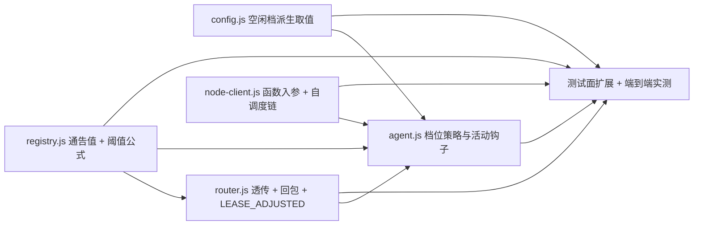

# pr-001-heartbeat-two-tier 任务图（阶段 4 planner 产物）

**输入**：`prs/pr-001-heartbeat-two-tier.md`（PR 卡）+ `architecture.md` §3（硬契约①，含 §3.3 阈值公式 / §3.4 落点清单 / §3.6 观测面与计数规程 / §3.7 偏斜处置）+ §9.1（测试面）+ §14 L1-01（协议字段取值）+ §15.1/§15.2（变更面与跨组契约）+ `prd/F03-heartbeat-two-tier.md`（验收 1~8）+ `prd/F08-connection-semantics-unchanged.md`（验收 1~6）
**依赖关系**：本 PR 无前置依赖（PR 卡 `depends_on`：无；architecture §15.3 G1 组依赖：无）
**范围**：`oamp/src/{config,registry,router,node-client,agent}.js` + `oamp/test/agent-heartbeat.test.js`（既有用例零改写）

---

## 0. 依赖图

- **无环**（线性 + 一处分叉，无回边）。
- 关键路径：T2 → T5 → T6（`registry` 的阈值公式是 `agent` 侧通告语义的前置；T6 是唯一验收收敛点）。
- 可并行：{T1 ∥ T2 ∥ T4}（三者互不依赖，文件互不重叠）；T3 依赖 T2；T5 依赖 T1/T2/T3/T4。

---

## 1. 任务清单

### T1 · 配置派生：空闲档取值（`oamp/src/config.js`）

- **描述**：新增模块常量 `HEARTBEAT_IDLE_FACTOR = 6`，`loadConfig` 返回派生字段 `heartbeatIdleMs = heartbeatIntervalMs × 6`（默认 60000）。
- **验收标准**：
  1. `loadConfig({})` 的 `heartbeatIdleMs === 60000`（`heartbeatIntervalMs` 默认 10000）— 追溯 architecture §3.4 行 1 / F03 AR-03-d。
  2. `loadConfig({ OAMP_HEARTBEAT_INTERVAL_MS: '50' })` 的 `heartbeatIdleMs === 300` — 追溯 §3.4（SHORT_ENV 可测性来源）、§9.1 测试面。
  3. `OAMP_HEARTBEAT_INTERVAL_MS` 非法值仍抛既有 `OAMP 配置错误`（既有校验路径零改写）— 追溯 §3.4「env 语义不变」。
  4. 不新增任何 env 键 / `config.json` 键 — 追溯 §3.4（N9）、§14 L1-01。
- **前置**：无　**优先级**：P0

### T2 · 注册表：通告值字段 + 阈值公式唯一落点（`oamp/src/registry.js`）

- **描述**：条目新增 `next_interval_ms: null`；`heartbeat()` 增加可选入参 `nextIntervalMs`（校验后落条目，非法/缺省 ⇒ `null`）；`findExpired(now, baseTimeoutMs)` 按实例推导阈值；新增导出 `MAX_ANNOUNCED_INTERVAL_MS = 600000` 与 `isValidAnnouncedInterval`。
- **验收标准**：
  1. `findExpired`：`next_interval_ms == null` ⇒ 阈值 = `baseTimeoutMs`（与迭代前逐字一致）；否则 `max(baseTimeoutMs, 2 × next_interval_ms)` — 追溯 architecture §3.3 公式 / §15.2-2（唯一落点 `registry.findExpired`）。
  2. 通告边界（`1..600000`）：`0` / 负 / 非整数 / `600001` / 非数字 ⇒ 视为未通告（`null`），且 `last_heartbeat` 仍被更新（fail-closed）— 追溯 §3.3 通告值校验 / §14 L1-01①。
  3. `snapshot()` 仍只投影 4 字段（`instance_id` / `session_id` / `state` / `last_heartbeat`），`next_interval_ms` 不外泄 — 追溯 §1.1 S-3 / §9.1「`router-registry.test.js` 不改」。
  4. `register` 建条目时 `next_interval_ms === null` — 追溯 §3.3「由 register() 建条目时初始化为 null」。
- **前置**：无　**优先级**：P0

### T3 · Router：透传 + 注册回包字段 + LEASE_ADJUSTED（`oamp/src/router.js`）

- **描述**：`agent.register` 回包新增 `lease_follows_interval: true`；`agent.heartbeat` 透传 `nextIntervalMs`，并在通告值变化时打 `LEASE_ADJUSTED {instance, next_interval_ms, threshold_ms}`。
- **验收标准**：
  1. `agent.register` 回包含既有 5 字段（取值不变）+ `lease_follows_interval === true` — 追溯 §3.3 协议面② / §14 L1-01② / F08 验收 1。
  2. 通告值变化时出现 `LEASE_ADJUSTED instance=… next_interval_ms=… threshold_ms=max(config.heartbeatTimeoutMs, 2 × 通告值)`；无变化不打 — 追溯 §3.4「透传与可观测」/ §3.6 观测面 / F03 验收 7。
  3. 租约扫描周期 / `markOffline` / 断连逻辑零改动（`findExpired` 调用点形参不变）— 追溯 §3.4「`markOffline`/扫描周期零改动」。
- **前置**：T2　**优先级**：P0

### T4 · 协议客户端：函数入参 + 通告字段 + 自调度链（`oamp/src/node-client.js`）

- **描述**：`startHeartbeat(intervalMs)` 接受数字或函数（每跳前求值一次）；心跳通知体新增 `next_interval_ms`（与 `setTimeout` 调度值同源）；`setInterval` 改自调度 `setTimeout` 链；保持"注册后立即一跳 / `unref` / stop 幂等"。
- **验收标准**：
  1. 函数入参：每跳调用一次并以其返回值调度下一跳（通告值 === 实际调度值，不可漂移）— 追溯 §3.2（否决方案 B 的理由）/ §3.4「通告下发」/ 硬契约 F03 AR-03-b。
  2. 心跳体含 `next_interval_ms`，固定数字入参 ⇒ 通告该数字（默认配置下阈值不变）— 追溯 §3.4「固定数字入参的调用点行为逐字不变」。
  3. `stopHeartbeat()` 幂等、`_handleClose()` 仍停心跳；`unref` 保留 — 追溯 §3.4「保持注册后立即一跳 + unref + stop 幂等」。
  4. `web.js:331` 常驻发送方的数字入参路径行为不变（`web.test.js` 回归全绿）— 追溯 §9.2 回归锁。
- **前置**：无　**优先级**：P0

### T5 · Agent：档位策略 + 活动钩子 + 切换/恢复落点（`oamp/src/agent.js`）

- **描述**：新增具名导出纯函数 `heartbeatPlan({idleForMs, activeMs, idleMs})`；活动时间戳由两个钩子刷新（deliver 首行、`runTask` promise settle）；档位每跳前求值一次（`client.startHeartbeat(planNext)`）；档位变化打 `HEARTBEAT_TIER`、每跳打 `HEARTBEAT_SENT`；空闲档下收到交互 ⇒ `markActivity()` 立即重启心跳（立即一跳、通告活跃档）；旧 Router（`lease_follows_interval !== true`）⇒ 打 `HEARTBEAT_IDLE_DISABLED` 并传 `idleMs = null`。
- **验收标准**：
  1. `heartbeatPlan`：`idleForMs < idleMs` ⇒ `{tier:'active', intervalMs: activeMs}`；`idleForMs === idleMs` ⇒ `{tier:'idle', intervalMs: idleMs}`；`idleMs === null` ⇒ 恒 `{tier:'active', ...}`；返回值只有这两个形状 — 追溯 §3.4「档位策略」/ F03 验收 8。
  2. 每跳前求值一次、不额外发跳：`HEARTBEAT_SENT` 的 `interval_ms` 即下一跳的调度值 — 追溯 §3.4「档位切换落点」/ §3.5「跳数不因切换增加」。
  3. 进入空闲档的那一跳在 `HEARTBEAT_SENT` 里记为 `tier=active`（该跳是活跃档最后一跳），`HEARTBEAT_TIER … tier=idle` 先行打出 — 追溯 §3.6 计数规程（**实现契约**）+ §16 R-1。
  4. 空闲档下交付一条消息 ⇒ `HEARTBEAT_SENT` 的 `interval_ms` 立即回到活跃值（不等下一个空闲周期），且 `HEARTBEAT_TIER` 打出 `tier=active` — 追溯 §3.4「收到任务立即恢复」/ F03 验收 3。
  5. 任务处理中（`runTask` promise 未 settle）恒按活跃档求值（"含处理中"）— 追溯 §3.4「空闲判定输入」/ F03 验收 2 口径（MI-01）。
  6. 心跳本身不计为交互（`HEARTBEAT_SENT` 不经过 deliver 钩子，不刷新活动时间戳）— 追溯 MI-01 / §17 疑问 3。
  7. `HEARTBEAT_TIER` 携带 `session`，与 `AGENT_REGISTERED` 的 `session` 同值（身份不变的直接证据）；空闲期间零 `agent.register` — 追溯 §3.5「身份不变」/ F03 验收 6。
  8. 旧 Router ⇒ `HEARTBEAT_IDLE_DISABLED` + 全程 `interval_ms=活跃值`（零 `tier=idle`）— 追溯 §3.7 / F03 兼容边界。
  9. 注册时一次性 `LEASE_ALARM` 校验语义零改写 — 追溯 §1.2 J / §9.2 回归锁。
- **前置**：T1、T2、T3、T4　**优先级**：P0

### T6 · 测试面扩展与端到端实测（`oamp/test/agent-heartbeat.test.js` + 隔离环境实测）

- **描述**：新增 ① 纯函数段（`heartbeatPlan` 三边界）；② 阈值公式单元段（直接驱动 `createRegistry` 的 `heartbeat`/`findExpired`）；③ 端到端档位段（SHORT_ENV：50ms / 300ms），覆盖降频、不判离线、阈值联动、身份不变、任务立即恢复、处理中保持活跃；④ 旧 Router 降级段（进程内 legacy Router，回包缺 `lease_follows_interval`）。既有 6 条用例零改写。
- **验收标准**：
  1. `cd oamp && node --test test/agent-heartbeat.test.js` 全绿（既有 6 条 + 新增段）— 追溯 §9.1 表行 2 / 本 PR 卡验收 2/7。
  2. 空闲窗口 = 3 × 空闲档时间内零 `AGENT_OFFLINE`、`router.status` 该实例恒 `online` — 追溯 §3.6 功能面计数规程 / F03 验收 5。
  3. 空闲窗口内 `tier=idle` 的 `HEARTBEAT_SENT` ≤3、`interval_ms=300` — 追溯 §3.6 计数规程 / F03 验收 2。
  4. `LEASE_ADJUSTED … threshold_ms = max(300, 2 × 300) = 600` 出现，空闲期间 `LEASE_ALARM` 零命中 — 追溯 §3.6 / F03 验收 7。
  5. 发一条任务后窗口内 `interval_ms=50` 的行 ≥4，且不等下一个空闲周期 — 追溯 F03 验收 1/3。
  6. 默认配置（活跃 10s / 空闲 60s）隔离环境实测：活跃档频率与迭代前一致；空闲后 3 分钟 ≤3 跳；期间 state 恒 online 且无重注册；发任务后立即恢复活跃档 — 追溯 §3.6 判定面 / F03 验收 1/2/3/5/6 / E4。
  7. 回归锁：`node --test --test-concurrency=1 test/*.test.js` 全绿（期望 226 + 新增），`router-registry.test.js` / `delivery-contract.test.js` / `reconnect.test.js` 与 `agent-heartbeat.test.js` 既有用例逐字未改 — 追溯 §9.1 / §9.2 / F08 验收 3/4/5。
- **前置**：T1、T2、T3、T4、T5　**优先级**：P0

---

## 2. 粒度与独立性核查

| 任务 | 1-2 天 | 可独立验收 | 验收标准可测试 |
|---|---|---|---|
| T1 | ✔（配置 8 行） | ✔（`loadConfig` 直接调用） | ✔（数值断言） |
| T2 | ✔ | ✔（直接驱动 `createRegistry`，不依赖 Router/agent） | ✔（`findExpired` 返回值断言） |
| T3 | ✔ | ✔（端到端 `LEASE_ADJUSTED` 行断言） | ✔（日志行） |
| T4 | ✔ | ✔（子进程/端到端心跳体与节奏断言） | ✔（通告值 === 调度值） |
| T5 | ✔ | ✔（纯函数 + 端到端事件行） | ✔（`HEARTBEAT_TIER`/`HEARTBEAT_SENT` 行） |
| T6 | ✔ | ✔（测试命令 + 隔离实测） | ✔（计数断言 + 命令退出码） |

**合并/拆分判断**：T1 与 T2 本可合并为"契约字段落地"，但拆开的价值在于 T1 是纯派生取值（不依赖任何其他任务即可验收），T2 是判活公式（可用注册表单元直接验收）——两者验收手段不同，保拆。T3 必须晚于 T2（其可观测断言依赖条目字段存在），不合并。

---

## 3. `[model_inferred]` 验收标准（需主 agent 确认）

1. **T5-AC5（"含处理中"于每个心跳求值点生效）**：PR 卡与 architecture §3.4 只写"任务处理中持续保持活跃"（口径来自 MI-01 / F03 验收 2 的"无任务"字样），未写明"长于空闲档的任务不得在中途跌回空闲档"这一可判定形式。本条为直接推导（若任务在飞仍跌回空闲档，则"有任务"与"无任务"同档，F03 验收 2 的口径失效）。
2. **T5-AC3（进入空闲档那一跳的 `tier` 标签语义）**：§3.6 已明确"记为 `tier=active`"，但其**同一跳的 `interval_ms` 取新档值（300）**属推导（该字段语义 = 距下一跳的间隔，§3.3/§14 L1-01①），architecture 未逐字写明。

---

## 4. 循环依赖

无。（依赖图为 `{T1,T2,T4} → T3 → T5 → T6` 的有向无环图。）

---

## 5. 疑问 / 越界

1. **PR 卡验收 6 与 architecture §3.4 存在字面冲突**：PR 卡写"心跳无 `next_interval_ms`（既有 agent / 假节点 / web 常驻发送方的固定数字入参）⇒ …且不产生 `LEASE_ADJUSTED`"，而 §3.4 明确 node-client 的心跳体**恒携带** `next_interval_ms`（固定数字入参"通告一个与自身间隔同值的数"）。二者不能同时成立。已按"以契约为准"取 **architecture §3.4**（附 §3.5 时序图明确写有"LEASE_ADJUSTED（首跳：null→10000）"）实现，并在 dev 报告中记录该冲突与实测证据；**未修改任何上游产物**。
2. 任务图不含 PR 卡"文件范围"之外的任何文件；`oamp/README.md` 的环境变量表同步（§9.3）属 G4/文档组，按 §15.3 归末位 PR，本 PR 不落。
