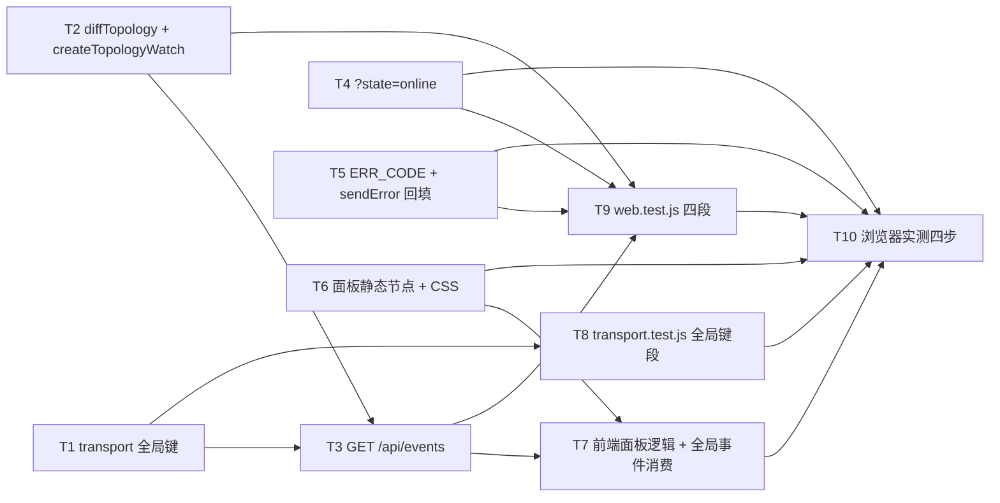

# pr-002-open-api-and-agent-panel — 任务图（pr-002 内部任务列表）

**来源**：`prs/pr-002-open-api-and-agent-panel.md`（PR 卡）+ `architecture.md`（v1.0.0）
**范围**：G2（传输与接口面）+ G3（前端面板）合并为同一 owner（架构 §15.3 的硬约束；PR 卡 depends_on 论证第 2 条）
**任务总数**：10（其中 7 个实现任务、2 个测试任务、1 个验收任务）

> 每条验收标准均标注来源（架构节号 / 功能卡验收项）。未标注 `[model_inferred]` 的条目为架构或功能卡原文的逐条投影。

---

## 依赖图

**关键路径**：T1 → T2 → T3 → T7 → T10
**无环**：全部依赖方向由"符号先于消费者"构成，无回边（T7 消费 T3 的 `/api/events`，T3 不依赖 T7）。

---

## T1 · transport 的全局订阅键

- **描述**：给既有 `createSseTransport` 增加 `chatId=null` 全局键语义、`publishGlobal(event)`、`globalCount()`；键结构 / 心跳 / 清理 / 丢弃语义零改动。
- **验收标准**
  1. `publishGlobal(event)` 只向 `chatId=null` 的订阅者写出 `event:`/`data:` 帧；同一实例的 chat 订阅者（`chat-1`）收不到该帧（架构 §4.1「传输」行 / §4.3 键隔离；F05 验收 4）。
  2. `globalCount()` 随全局订阅建立 / 断开变化（建立后 ≥1，断开后回 0）；`chat_id` 订阅不计入（架构 §4.2「只在有全局订阅者时运行」；F05 验收 1）。
  3. `closeAll()` 覆盖全局键：调用后全局连接被结束、`publishGlobal` 不再写入（架构 §4.1 / F05 验收 1、3、4）。
  4. 既有 `handle/publish/close/closeAll` 与 `retry: 1000` / keepalive / 断连自清理行为逐字不变（`test/transport.test.js` 既有 11 条用例零改写）。
- **前置依赖**：无
- **优先级**：P0

## T2 · 拓扑差值纯函数与轮询器

- **描述**：在 `web.js` 具名导出纯函数 `diffTopology(prev, nodes)`，并实现 `createTopologyWatch({ transport, queryNodes, pollMs })`（`ensureRunning` / tick / 自停 / 播种）。
- **验收标准**
  1. `diffTopology(prev, nodes)` 返回 `{online, offline, next}`：`online` 为 `next` 中新增的 `{instance_id, last_heartbeat}`；`offline` 为 `prev` 中消失的 `{instance_id}`；非 `online` 状态的节点（含 offline 墓碑）不进入 `next`（架构 §4.2「纯函数边界」/ §15.2-5）。
  2. 首个订阅者到达时播种基线且**不发事件**（起一个已在线的实例不产生 `agent_online`）（架构 §4.2「首个订阅者到达 ⇒ 播种一次基线（不发事件）」；F05 验收 2「不多发」）。
  3. `transport.globalCount() === 0` 时 tick 自停并丢弃基线；无订阅者时零轮询（架构 §4.2 / §4.4）。
  4. 查询失败（Router 暂不可达）时该 tick 不更新基线、不产生虚假上下线（架构 §16 R-4）。
  5. 轮询间隔由 `OAMP_WEB_TOPOLOGY_POLL_MS` 经既有 `readPositiveMs` 解析，默认 2000（架构 §4.2 / §13）。
- **前置依赖**：无
- **优先级**：P0

## T3 · `GET /api/events` 全局事件订阅

- **描述**：`web.js` 新增路由 `GET /api/events`：无参数、`transport.handle(..., {chatId: null})`、随后 `watch.ensureRunning()`。
- **验收标准**
  1. 无参数 `GET /api/events` 返回 200 + `text/event-stream` 且连接保持（不因缺少 `chat_id` 被拒绝）（F05 验收 1）。
  2. 起一个 agent ⇒ 订阅端收到 `agent_online`，载荷含 `instance_id` 与 `last_heartbeat`；停掉 ⇒ 收到 `agent_offline`，载荷含 `instance_id`（架构 §4.1「载荷」/ §15.2-5；F05 验收 2）。
  3. 既有 `GET /api/stream` 的 `chat_id` 强制规则与 400 文案逐字保留，未被本任务触碰（架构 §4.1「路径」行；F05 验收 3）。
  4. 全局键不承载 `message`/`task_update`/`chat_state`/`notice`（键隔离，结构性保证）（F05 验收 4）。
- **前置依赖**：T1、T2
- **优先级**：P0

## T4 · `GET /api/agents?state=online`

- **描述**：`/api/agents` 增加可选 `state` 查询参数；无参路径逐字透传 `router.status`。
- **验收标准**
  1. `GET /api/agents?state=online` 与无参响应**同形状**（`{agents:[{instance_id,session_id,state,last_heartbeat}]}`），且逐项 `state === 'online'`（架构 §6.2 / §15.2-4；F04 验收 1、2）。
  2. 无参响应仍逐字透传 `router.status`（含 offline 墓碑与 4 字段）（架构 §6.2 / S-3；F04 验收 4）。
  3. 非法 `state` 值 ⇒ 400 `INVALID_PARAM`，`error` 为可读字符串（架构 §6.2「state 参数的校验」；F04 验收 1）。
  4. 不新增 / 不改动响应字段，`loadAgents()` 的取数口径不变（架构 §6.2「不做响应形态调整的理由」③；F04 验收 4 / N13）。
- **前置依赖**：无
- **优先级**：P0

## T5 · 统一错误契约（`ERR_CODE` + `sendError()` + 出口回填）

- **描述**：`web.js` 新增冻结表 `ERR_CODE`（5 码）与 `sendError(res, status, code, message, headers = null)`，把全部 4xx/5xx 出口改道（含 `readBody` 失败分支、外层 catch）。
- **验收标准**
  1. 任取两个接口触发同类错误，响应体键集合恰为 `{error, code}`，`code` 与状态码一一对应（架构 §5.1 / §5.2；F06 验收 1）。
  2. 5 码映射：`INVALID_PARAM`=400 / `NOT_FOUND`=404 / `CONFLICT`=409 / `PAYLOAD_TOO_LARGE`=413（响应仍带 `connection: close`）/ `UPSTREAM_UNAVAILABLE`=502（架构 §5.2 / §15.2-4；F06 验收 1、2）。
  3. 既有 `error` 文案逐字不变（含 `chat 已归档（只读），不接受新输入`、`chat 已归档（只读），不可改名`、`需要 chat_id（不做全局订阅）`、`not found: <method> <path>`）（架构 §5.3 步 2「同一 message 逐字搬运」；F06 验收 4）。
  4. 成功响应不含 `code`（架构 §5.1「成功响应不加 code」；F06 验收 4）。
  5. 路由集合中不存在任何 agent 启停路径（E9 反向检索零命中）（F04 验收 3）。
- **前置依赖**：无
- **优先级**：P0

## T6 · 顶栏面板静态节点与样式

- **描述**：`index.html` 在 `.topright` 内、`#conn-status` 之后新增 `

`；`style.css` 增加面板与行的 5 组规则。
- **验收标准**
  1. 静态兄弟节点位于 `#conn-status` 之后，且不是它的子节点（`setConn` 写 `textContent` 不得清空面板）（架构 §7.1「节点」行 / D-14；F01 验收 1）。
  2. `.agent-panel.hidden{display:none}` 生效（本仓 `.hidden` 只对 `.mention` 生效 ⇒ 面板须有独立规则）（架构 §1.3 S-9）。
  3. `.topright` 为定位锚点（`position:relative`），面板为绝对定位浮层（架构 §7.1「形态」行）。
  4. `#conn-status.conn-ok{cursor:pointer}`（可点击的可视信号）；`.agent-row` / `.agent-id` / `.agent-hb` / `.badge-online` 齐备（架构 §15.1 前端 CSS 清单）。
- **前置依赖**：无
- **优先级**：P0

## T7 · 前端面板逻辑与全局事件消费

- **描述**：`app.js` 增加 `state.agentPanel`、`renderAgentPanel` / `toggleAgentPanel` / `closeAgentPanel` / `fmtAgo` / `connectAgentEvents`、`AGENT_PANEL_REFRESH_MS` / `agentPanelTimer`、`badge()` 映射 `online`、`bind()` 三处绑定、`init()` 一次调用。
- **验收标准**
  1. 点击 `#conn-status` 展开 `#agent-panel`：条目数 = 顶栏计数 = 在线实例数；再次点击 / 点击面板与触发点之外 / Esc 均可收起（架构 §7.1「展开」「收起」行；F01 验收 1、3）。
  2. 每行三项字段：`instance_id` 原文（`escapeHtml`）/ 在线徽标（`badge('online')` ⇒ `badge-online`）/ `fmtAgo(last_heartbeat)` 相对时间（`<60s → Ns 前`、`<60min → Nm 前`、否则 `Nh 前`）（架构 §7.2；F01 验收 2）。
  3. 空集渲染 `暂无在线 agent`，顶栏仍为可点击的 `已连接 · 0 agents online`；面板内零按钮 / 零启停入口（架构 §7.2「空态」；F01 验收 4、5）。
  4. `agent_online` 到达 ⇒ `state.agents` upsert + `setConn(true)` + 展开时重绘；`agent_offline` ⇒ remove + 同上；面板关闭时计数也变（架构 §7.3「更新落点」；F02 验收 1、2、3、4）。
  5. 面板展开期 `setInterval(loadAgents, AGENT_PANEL_REFRESH_MS)`（5000），收起即 `clearInterval`（不留常驻定时器）（架构 §7.3 / D-16；F01 验收 2 的新鲜度）。
  6. 全局 `EventSource('/api/events')` 的 `onopen ⇒ loadAgents()` 全量对齐（架构 §7.3 / §4.4；F02 验收 5）。
  7. `setConn(false)`（Router 不可达）⇒ 面板收起并隐藏（架构 §16 R-6）。
  8. 不引入 `POLL_MS` 标识符与 `setTimeout(tick` 形态；既有 `#conn-status` 文案口径与 `showMention` 离线灰显行为不变（`loadAgents()` 仍取全量）（PR 卡「既有前端契约不破」；F04 验收 4 / N13）。
- **前置依赖**：T3、T6
- **优先级**：P0

## T8 · `transport.test.js` 全局键段（新增，既有断言零改写）

- **描述**：新增全局键用例段：`publishGlobal` 只到全局订阅者、chat 订阅者收不到；`globalCount()` 随订阅 / 断开变化；`closeAll` 覆盖全局键。
- **验收标准**：T1 的四条验收标准逐条被真实 HTTP/SSE 用例覆盖，且既有 11 条断言零改写（架构 §9.1「transport.test.js」行；F05 验收 1、4）。
- **前置依赖**：T1
- **优先级**：P1

## T9 · `web.test.js` 四段（新增，既有断言零改写）

- **描述**：新增① `/api/events` 段（`OAMP_WEB_TOPOLOGY_POLL_MS=50` 压缩；播种不发事件 / 起 agent 收 `agent_online` / 停 agent 收 `agent_offline`）、② `?state=online` 段、③ 统一错误契约段、④ 前端静态契约段。
- **验收标准**
  1. 段 ①~④ 全部通过，且既有断言零改写（`git diff` 可查；含 `:911-917` 的 `/api/stream` 缺参 400、`:1000-1012` 与 `:1226` 的前端静态契约段、`:1300` / `:1325` 的只读 409 文案断言）（架构 §9.1 / §9.2；PR 卡验收 1）。
  2. 段 ③ 至少覆盖两个接口的同类错误（键集合 / `code` / 状态码一致）、5 码各一次、成功响应无 `code`。
  3. 段 ④ 断言 `#agent-panel` / `/api/events` / `renderAgentPanel` / `AGENT_PANEL_REFRESH_MS` 静态锚点。
- **前置依赖**：T2、T3、T4、T5
- **优先级**：P1

## T10 · 浏览器实测四步（隔离环境，验收动作）

- **描述**：用临时 `OAMP_SOCKET` / `OAMP_DB` + 随机端口起隔离集群（不动主仓库运行中的集群），浏览器驱动验证面板四步。
- **验收标准**
  1. 顶栏计数可点击 ⇒ 面板展开；点外 / Esc ⇒ 收起（T7 验收 1）。
  2. 面板列出 online 实例与相对心跳时间（T7 验收 2）。
  3. 另一个进程注册 / 注销一个 agent ⇒ 面板与计数在数秒内自动更新（无手动操作）（T7 验收 4、6；F02 验收 1、2、3）。
  4. 停掉 web 上游（Router）断连 ⇒ 面板自动收起（T7 验收 7）。
- **前置依赖**：T4、T5、T6、T7、T8、T9
- **优先级**：P0

---

## `[model_inferred]` 验收标准清单

**无。** 上表全部条目均可追溯到 `architecture.md` 的节号 / 行内原句或 `prd/F01~F06` 的验收项编号（含 `§15.1` 的变更面清单与 `§15.2` 的跨组契约）。

## 上报的循环依赖

**无。** 依赖图见上；跨 PR 依赖侧由 PR 卡 `depends_on`（无）保证，本文件只描述 PR 内任务顺序，不引入新的跨 PR 依赖。

## 疑问 / 越界

1. **架构 §15.1 的 CSS 清单未列出空态行的样式**（F01 验收 5 要求"一行灰字"）。T6 的处置：复用既有 `.muted`（`style.css:187`，`color: var(--muted)`）作为空态行样式，**不新增** `.agent-empty` 规则——零新增 CSS 实体且逐字满足"灰字"要求。若主 agent 认为需独立类名，属本任务的可逆细节。
2. **架构 §15.1 称"12 处出口"**，实际 `web.js` 的 4xx/5xx 出口点（含 2 处 `readBody` 分支与 1 处外层 catch）多于 12 处；T5 按"**全部**错误出口过 `sendError()`"执行（§5.3 步 2 的表述），不以计数为准。
3. 本 PR 不含 `API.md` / `README.md` 同步（G4，pr-003）与心跳两档（G1，pr-001）——文件范围严格取 PR 卡「文件范围」7 个文件。
