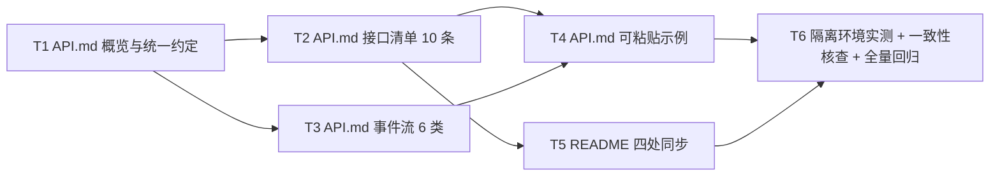

# pr-003-api-doc — 任务图（pr-003 内部任务列表）

**来源**：`prs/pr-003-api-doc.md`（PR 卡）+ `architecture.md`（v1.0.0，§5 / §6.1~§6.4 / §9.3 / §9.4 / §15.3）+ `prd/F07-api-doc.md`
**范围**：单一变更面 G4（文档）：新建 `oamp/API.md` + 同步 `oamp/README.md`。无代码变更、无测试变更。
**任务总数**：6（其中 5 个实现任务、1 个验收任务；本 PR 不新增测试文件——PR 卡「文件范围」仅两个 `.md`，验证方式为实测 + 一致性核查 + 全量回归）

> 每条验收标准均标注来源（架构节号 / 功能卡验收项 / PR 卡验收标准）。未标注 `[model_inferred]` 的条目为上游原文的逐条投影。
> **唯一真源声明**：接口 / 错误 / 事件三清单的真源是**代码**（`oamp/src/web.js` 路由与 `ERR_CODE`、`oamp/src/transport.js` 的 `publish`/`publishGlobal` 调用点）；本任务图与 `API.md` 都只是它的逐条映射（架构 §5.5「不做第二套定义」）。

---

## 依赖图

**关键路径**：T1 → T2 → T4 → T6
**无环**：依赖方向由「约定先于接口、接口先于示例、示例先于实测」构成，无回边（T5 只依赖 T2 的路径与形态，不依赖 T4 的示例文本；T3 不依赖 T2）。

---

## T1 · `API.md` 第 1~2 章：概览与统一约定（含错误契约）

- **描述**：新建 `oamp/API.md`，写第 1 章（概览与安全边界）与第 2 章（统一约定）。
- **验收标准**
  1. 第 1 章含：启动方式 `oamp web start [--port 7788]`、默认地址 `http://127.0.0.1:7788`、`OAMP_WEB_PORT`（命令行 `--port` 优先）、`content-type: application/json; charset=utf-8`、时间戳口径（`last_heartbeat` 与消息 `created_at` 均为 **epoch 毫秒**）、SSE 读法（`curl -N`）、安全边界（监听 `127.0.0.1` / 零鉴权 / 仅同机、无跨机）（架构 §6.4「1. 概览」；F07 验收 1；PR 卡验收 2）。
  2. 第 2 章含：成功响应即资源对象本身（成功体**不含** `code`）；统一错误契约 `{error, code}`（`error` = 人类可读字符串、`code` = 封闭枚举）；**5 行状态码映射表**（`INVALID_PARAM`=400 / `NOT_FOUND`=404 / `CONFLICT`=409 / `PAYLOAD_TOO_LARGE`=413 / `UPSTREAM_UNAVAILABLE`=502）；「同类错误跨接口一致」一句；`chat_id` 形态（`chat-<uuid>` 或调用方自带）；消息 `direction` 取值（`in` / `out`）（架构 §5.1/§5.2/§6.4「2. 统一约定」；F07 验收 3；PR 卡验收 3）。
  3. 映射表与 `oamp/src/web.js` 的 `ERR_CODE`（5 个键）**一一对应**，逐键可查（架构 §5.5 维护锚点；PR 卡验收 3）。
- **前置依赖**：无
- **优先级**：P0

## T2 · `API.md` 第 3 章：接口清单（10 条，每条含参数 / 成功响应 / 完整错误清单）

- **描述**：逐条写 10 条 API：`GET /api/agents`（含 `?state=online`）、`GET /api/chats`、`GET /api/chats/<chat_id>`、`POST /api/chats/<chat_id>/close`、`POST /api/chats/archive`、`POST /api/chats/<chat_id>/activate`、`POST /api/chats/<chat_id>/rename`、`POST /api/messages`、`GET /api/stream?chat_id=<id>`、`GET /api/events`。
- **验收标准**
  1. 10 条路径与 `oamp/src/web.js` 的路由集合**不重不漏**逐条对照（架构 §6.1 清单 / §9.4 检查项 1；F07 验收 2；PR 卡验收 2）。
  2. 每条含**方法 + 路径**、参数表（类型 / 必填 / 默认）、**真实 JSON 成功响应示例**、该接口**会出现的全部 `code`** 的错误清单（触发条件 + 状态码）。参数语义逐条对齐代码：`/api/chats` 的 `q`（标题或消息文本，LIKE 子串）/ `agent` / `state`（`working|completed|failed|closed`）/ `from` / `to`（epoch ms 整数）/ `archived`（`0` 缺省 = 排除已归档、`1` = 只看已归档）/ `limit`（默认 50、上限 200）/ `offset`；`/api/messages` 的 `chat_id?`（缺省 `chat-<uuid>` 自动生成）/ `agent_id` / `text` / `model?` / `one_shot?`；`/api/agents` 的 `state`（仅接受 `online`，其它值 400）（架构 §6.1/§6.2；PR 卡验收 2）。
  3. `/api/messages` 的错误清单**如实列出**「派发失败 → **200 + `warning`**（`task_id` 为 `null`）」——不把它抬成 4xx/5xx（架构 §5.4；PR 卡验收 2）。
  4. `GET /api/stream` 仍强制 `chat_id`（缺 / 空 → 400 `INVALID_PARAM`，文案逐字），`GET /api/events` **无参数、不依赖对话**（架构 §4.1「路径」行；F05 验收 3）。
- **前置依赖**：T1
- **优先级**：P0

## T3 · `API.md` 第 4 章：事件流（6 类：chat 4 + 全局 2）

- **描述**：写 `GET /api/stream?chat_id=<id>` 的 4 类事件（`message` / `task_update` / `chat_state` / `notice`）与 `GET /api/events` 的 2 类事件（`agent_online` / `agent_offline`）。
- **验收标准**
  1. 每类事件含**事件名 / `data` 载荷字段结构 / 触发时机**；4 类 chat 事件注明「流式增量不入库」（架构 §6.4「4. 事件流」；F07 验收 4；PR 卡验收 4）。
  2. 2 类全局事件含**载荷**（`agent_online` → `{instance_id, last_heartbeat}`；`agent_offline` → `{instance_id}`）、**判定源**（`router.status` 的 `state === 'online'` 集合）、**≤2s 时延**（`OAMP_WEB_TOPOLOGY_POLL_MS` 默认 2000）与「订阅后先取一次 `GET /api/agents` 作基线；重连后同样重取」（架构 §4.1「载荷」/ §4.2 / §4.4；F07 验收 4；PR 卡验收 4）。
  3. 说明 `retry: 1000`（首帧，浏览器 1s 自动重连）与 15s keepalive（`: keepalive` 注释帧）；说明键隔离（全局键 `null` 只承载 2 类上下线事件，chat 订阅者收不到；反之亦然）（架构 §4.1/§4.3/§4.4）。
  4. 6 类事件与 `oamp/src/transport.js` 的 `publish` / `publishGlobal` 调用点逐条对照（`message`/`chat_state`/`notice`/`task_update` 4 处 `publish` + 2 处 `publishGlobal`）（架构 §9.4 检查项 3；PR 卡验收 4）。
- **前置依赖**：T1
- **优先级**：P0

## T4 · `API.md` 第 5~6 章：可粘贴示例 + 不做项

- **描述**：写第 5 章端到端示例（curl 一行 + 期望输出片段；含极简 Node `fetch` + `ReadableStream` 订阅示例）与第 6 章「不做」。
- **验收标准**
  1. 覆盖 PR 卡 6 组示例：① `curl -s …/api/agents?state=online`；② 列对话 + 搜索；③ 读消息；④ 发消息（`model` / `one_shot` 两个变体）；⑤ `curl -N …/api/stream?chat_id=<id>`；⑥ `curl -N …/api/events` + 另一终端 `oamp agent start demo-1` ⇒ 订阅端出现 `agent_online`（停掉 ⇒ `agent_offline`）；并补归档 / 激活 / 改名与错误样例（架构 §6.4「5. 端到端示例」；PR 卡验收 5；本次派单要求 1）。
  2. 每条示例**原样复制可执行**（唯一占位符：`<chat_id>` 与示例实例名），含 `curl` 单行命令 + 期望输出片段（PR 卡验收 5；F07 验收 5）。
  3. 第 6 章显式列出不做项：agent 启停接口 / 按钮、鉴权、跨机接入、tasks 接口、客户端 SDK；并说明 `GET /api/agents` 无参会含 `offline` 墓碑（架构 §6.3/§6.4「6. 不做」；F07「边界」；PR 卡验收 6）。
- **前置依赖**：T2、T3
- **优先级**：P0

## T5 · `README.md` 四处同步

- **描述**：改 `oamp/README.md`：Web 控制台段一句、HTTP 接口表（`?state=online` 标注 + `/api/events` 行 + 表后统一错误契约说明与 `API.md` 链接）、SSE 事件段 4 → 6 类、环境变量表两行说明。
- **验收标准**
  1. Web 控制台段（现 `:119-143`）补「顶栏『已连接 · N agents online』可点击展开在线 agent 列表（实例标识 / 在线状态 / 最后心跳时间），随上下线自动更新」一句（架构 §9.3 第 1 行；F01 验收 1；PR 卡验收 6）。
  2. HTTP 表 `GET /api/agents` 行标注 `?state=online`；新增 `GET /api/events` 行；表后补一句统一错误契约（`{error, code}`）与**指向 `API.md` 的链接**（架构 §9.3 第 2 行；F07 验收 1、3；PR 卡验收 1、6）。
  3. SSE 段（现 `:164-165`）事件清单 4 → 6 类（+`agent_online` / `agent_offline`，注明仅全局订阅可见）（架构 §9.3 第 3 行；PR 卡验收 6）。
  4. 环境变量表：`OAMP_HEARTBEAT_INTERVAL_MS` 行补「空闲档 = 6 × 该值（默认 60s；派生值，非独立 env 键）」；`OAMP_HEARTBEAT_TIMEOUT_MS` 行补「为**基准**阈值：已通告 `next_interval_ms` 的实例按其 `2×` 抬升（`max(基准, 2×通告值)`）」（架构 §3.4 / §9.3 第 4 行；PR 卡验收 6）。
  5. README 与 `API.md` 不冲突（同路径同形态）；`oamp/**` 内不含 agent 启停的路由 / 按钮 / 文档条目（E9 反向检索零命中）（架构 §9.4 检查项 4、5；PR 卡验收 6）。
- **前置依赖**：T2
- **优先级**：P0

## T6 · 隔离环境实测 + 一致性核查 + 全量回归（验收动作）

- **描述**：临时 `OAMP_SOCKET` / `OAMP_DB` + 随机端口起隔离集群（**不动主仓库运行中的集群**——实测时 7788 已被占用），逐条执行 `API.md` 的 curl 示例并对照期望输出；随后跑全量测试。
- **验收标准**
  1. `API.md` 的每条示例在隔离环境实际执行，输出与文档描述一致（端口是唯一替换项——文档写默认 7788，实测用随机端口规避与主集群冲突）；SSE 示例用 `curl -N` 实测收到事件帧（本轮适用；PR 卡验收 5；F07 验收 5、6）。
  2. 一致性核查：接口数 10 / 事件类 6 / 错误码 5，与 `web.js` 路由表 + `ERR_CODE` + `publish`/`publishGlobal` 调用点逐条对齐（架构 §9.4 检查项 1~3）。
  3. `node --test --test-concurrency=1 test/*.test.js` 全绿（文档变更不影响测试；预期 235 用例）（PR 卡「验证」；架构 §9.2）。
  4. 变更已 `git commit` 到 worktree 分支（分支 `feat/0015-pr-003-api-doc`）。
- **前置依赖**：T4、T5
- **优先级**：P0

---

## `[model_inferred]` 验收标准清单

**无。** 上表全部条目均可追溯到 `architecture.md` 的节号 / 行内原句、`prd/F07-api-doc.md` 的验收 1~6 或 PR 卡验收标准原文。

## 上报的循环依赖

**无。** 依赖图见上（T1 → {T2, T3} → T4 → T6；T2 → T5 → T6），无回边。

## 疑问 / 越界

1. **架构 §6.4「5. 端到端示例」列了 7 项（含极简 Node 示例），PR 卡验收 5 列了 6 组**。T4 按**并集**执行：6 组 curl 示例 + 归档 / 激活 / 改名 + 错误样例 + 一个极简 Node 订阅示例——超集不遗漏任一上游要求，且不引入新契约。
2. **`/api/events` 在 Router 不可达时的行为**未在上游文档中定义：实测为「订阅仍 200（SSE 建立不查上游），但不会收到任何事件；`GET /api/agents` 则 502 `UPSTREAM_UNAVAILABLE`」。T4 在示例章按实测如实备注一句（不构成契约新增，只是既有实现的可见后果）。
3. 本 PR 不含代码变更与测试变更（PR 卡「文件范围」= 两个 `.md`）；T6 的「全量回归」是**确认既有 235 用例不受文档变更影响**，不是新增用例。
