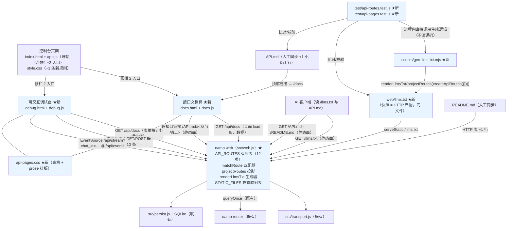
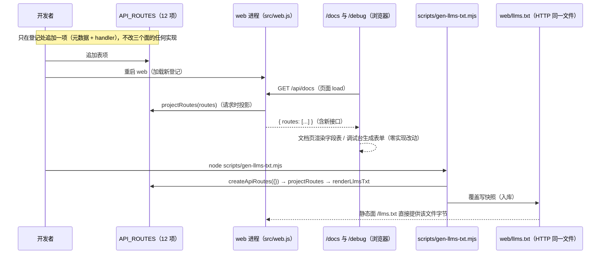
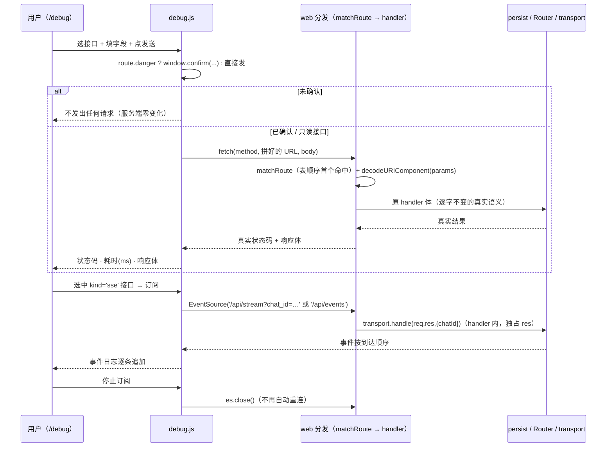

# architecture.md — 0016-api-reflection-docs（迭代架构）

**版本**：1.0.0（阶段 3 产物）　**日期**：2026-09-12　**状态**：**L1 决策两条已确认（2026-09-12 用户决策，主 agent 转达落盘；§10 L1-01 / L1-02 已按确认值写成实现契约）——本阶段可进入阶段 4**；两点已知局限经用户接受（§13 R-3 / R-6）；§3 / §4 / §4.5 / §5 / §7 为**硬契约**（路由表与匹配算法、行为保真七条、口径更正、派生三产物、漂移锁三对象），实现阶段不得偏离
**输入**：`prd.md`（v0.1.0，8 卡 F01~F08 / AR-01~AR-09）+ `prd/F01~F08*.md`（产品维度已锁；架构维度本次全部回填）
**架构基线**：`docs/iterations/0015-hub-orchestration-open-api/architecture.md`（v1.0.0，已合入 `main`）+ 阶段 3 重新取证的 `oamp/**`（§1）
**前置交付态（阶段 3 实测）**：`oamp/src/web.js` **770** 行；`oamp/web/{index.html 73, app.js 887, style.css 361}`；`oamp/API.md` **855** 行、`oamp/README.md` **306** 行；`oamp/test/` **20** 个测试文件、**239** 条顶层用例，其中 `oamp/test/web.test.js` **39** 条
**约束**：零新第三方依赖（`oamp/package.json` 的 `dependencies` 保持 `{}`）；**零新进程 / 零新传输 / 零新配置键 / 零新 env 变量**；零数据层变更（不碰 `persist.js`、不碰 SQLite schema）；零新前端框架；`roles/**`、`demand.md` 只读

> 本文档回答 prd 的全部 9 条架构待填项（AR-01~AR-09，逐条落定见 §11），给出组件与数据流（§2 / §8）、分级决策（§10）、**C-5 七条约束的可执行契约**（§4）、**三条漂移锁的检查对象与算法**（§7）、PR 边界**输入**（§12；拆解归阶段 4）、风险与未决项（§13）、奥卡姆检验（§14）。

---

## 0. 一句话架构

> **把 `src/web.js` 里那 277 行扁平 `if` 链原样搬进一个「有序路由表」（一项 = 元数据 + handler，handler 体逐字不动），分发收敛为「遍历表 → 首个命中 → 调 handler」的 12 行循环；匹配用「字面段 + `(.*)` 贪婪参数段 + `^…$` 整串锚定」精确复刻今日 `p.slice(...)` 的语义，因此路径优先级 = 表项声明顺序 = 今日 `if` 链顺序，`GET /api/chats/archive` 这类现存怪癖由构造保持；表本身经 `GET /api/docs` 投影成**唯一机器可读派生面**，文档页 `/docs`、调试台 `/debug`、AI 索引 `oamp/web/llms.txt` 三个产物全部从它长出来（前两者页面加载时取，后者由同一生成函数产出快照文件、经静态面提供）；三条漂移锁一律以「调用生成逻辑得到的真实结果 / 遍历表项得到的真实字段 / 两个路径集合求差」为检查对象，不读源码正则。**

---

## 1. 现有架构基线（阶段 3 重新取证，2026-09-12）

### 1.1 相关现有组件与文件

| 文件 | 现状职责（阶段 3 复核，附行号） | 与本次迭代的关系 |
|---|---|---|
| `oamp/src/web.js`（770 行） | 内建 http + JSON API + SSE。常量：`WEB_ROOT`(:33) / `DEFAULT_PORT=7788`(:35) / `STATIC_TYPES`(:57-63，**仅 html/js/css/svg/png**)；工具：`isReadonly`(:69) / `sendJson`(:68) / `ERR_CODE`(:81-87) / `sendError`(:91) / `readBody`(:96，畸形 400 / 超限 413) / `queryOnce`(:133，一次性 UDS RPC)；具名导出：`diffTopology`(:161) / `createTopologyWatch`(:181)；静态：`serveStatic(res, file)`(:239-253，白名单外无入口，`WEB_ROOT` 前缀守卫 + 扩展名 MIME 映射)；`startWeb`(:255) 内构造 `db`/`transport`/`topologyWatch`/`tasks`/`publishMessage`/`publishState`/`finishTask`/`reconcileTask`/`scheduleReconcile`/`handleDeliver`/`ensureSender`/`sendTask`/`sendControlNotice`；**分发**：`http.createServer`(:469) 内 `url`/`p`/`qs`/`num`(:470-476) + 单 `try`(:477) 覆盖 12 条分支（:478/:494/:514/:524/:545/:574/:594/:635/:644/:650/:733/:737）+ 404 兜底(:741) + 单 `catch`→502(:742) | **改造（核心）**：抽出有序路由表（12 项，10 条 API + 新增 `GET /api/docs`；**不含静态面**）、表驱动分发、静态文件映射表 + `.txt`/`.md` MIME、4 个新具名导出（`createApiRoutes` / `matchRoute` / `projectRoutes` / `renderLlmsTxt`）。**既有 handler 体逐字不动**（§3.6 给出零改写路径） |
| `oamp/src/transport.js`（79 行） | `createSseTransport`：键式订阅 + `handle` + `publish` + `keepalive` + 自清理 | **零改动**（调试台的订阅面板复用 `/api/stream` 与 `/api/events` 两条既有 SSE 路径，从浏览器侧直连） |
| `oamp/src/{router,registry,node-client,agent,config,persist,rpc,status,log,task,cluster,...}.js`、`oamp/bin/` | 0010~0015 交付面 | **零改动**（本次不碰协议、心跳、任务、持久层、集群） |
| `oamp/web/index.html`（73 行） | 顶栏 `.topnav` 三个死链 span（`Workspace` 活动 / `Agents` / `Tasks`，:13-16）；`.topright` 内 `#conn-status` + `#agent-panel` | **改造（极小）**：`.topnav` 内**追加** 2 个真实入口（文档 `/docs`、调试 `/debug`），既有 3 项逐字不动（F03 验收 2 / F04 验收 1） |
| `oamp/web/app.js`（887 行） | 既有控制台全部交互；`web.test.js` 对其有**静态契约断言**（如禁 `POLL_MS`、禁 `setTimeout(tick`、`new EventSource('/api/events')` 等） | **零改动**（N12：新页面脚本必须独立文件，并入会与既有断言面冲突） |
| `oamp/web/style.css`（361 行） | `:root` 视觉 token（:2-15，含 `--line`/`--muted`/`--green`/`--red`/`--code-bg`/`--radius`）+ 既有类；**零表格规则、零 prose 排版规则**（F-19） | **改造（极小）**：仅**追加**一条 `a.nav-item{text-decoration:none;cursor:pointer}`（新入口是锚点）；**不改任何既有规则**。新页面资产另立文件（§6.8） |
| `oamp/API.md`（855 行，手写） | 对外契约文档：§1 概览 / §2 统一错误契约 / §3 接口清单（**10 条，逐节含方法·路径·参数·错误码·示例**）/ §4 事件流 / §5 可粘贴示例 / §6 不做 | **人工同步**（§9）：+1 行路径登记 + 1 个新小节 + 顶部指向 `/docs` 的链接；**既有 10 小节文案逐字不动**（N7 / F08 验收 1） |
| `oamp/README.md`（306 行） | HTTP 表（10 行）、Web 控制台段、环境变量表、卫生红线 | **人工同步**（§9）：HTTP 表 +1 行、控制台段 +2 条入口、+1 小段「接口文档与索引」 |
| `oamp/package.json`（19 行） | `scripts.test = node --test test/*.test.js`；`dependencies: {}` | **零改动**（不新增依赖、不新增 npm script；生成器用 `node scripts/gen-llms-txt.mjs` 直接调用） |
| `oamp/scripts/testenv.mjs` | 既有脚本目录先例 | **新增同目录文件** `gen-llms-txt.mjs`（§5.3） |
| `oamp/test/*.test.js`（20 文件 / 239 用例） | 见 §1.4 S-9 | **零改动**（`web.test.js` 一个字都不改，见 §4.4）；新增断言全部落在**新测试文件** |

### 1.2 可直接复用的既有能力（决定了本方案"少造东西"）

| # | 既有能力（代码位置） | 本次如何复用 |
|---|---|---|
| A | `sendJson(res, status, body, headers)`(:68) / `sendError`(:91) / `ERR_CODE`(:81) | `GET /api/docs`、新页面的静态响应与既有错误出口全部沿用，零新写响应逻辑；`ERR_CODE` 的**码集合**就是漂移锁①的枚举白名单 |
| B | `readBody(req)`(:96) 的 `err.status` 语义（畸形 400 / 超限 413） | 留在 handler 体内、逐字不动（§4 约束③）；分发层零改动 |
| C | `serveStatic(res, file)`(:239) 的白名单 + 前缀守卫 + `STATIC_TYPES` 扩展名映射 | 静态面扩成**显式映射表**（§3.7），新页面与 `llms.txt` 零新机制接入；`.txt` 补 `text/plain; charset=utf-8`（F05 验收 2 / C-6） |
| D | 既有 **39** 条 `web.test.js` 用例 | **回归锁的第一层证据**：文本零改写 + 全绿即为"既有可观察行为未变"（E3） |
| E | 既有 `test/helpers/harness.js`（`startRouter` / `startAgent` / `waitFor` / `buildEnv`） | 新测试文件里复用它起 Router/agent；`web.test.js` 内的 `startWeb` 局部辅助**不可导出**，新文件自带同款 25 行（理由见 §4.4 注） |
| F | `web.js` 既有的**具名导出先例**（`diffTopology` / `createTopologyWatch`，`web.test.js:17` 已直接 import） | 新导出 `createApiRoutes` / `matchRoute` / `projectRoutes` / `renderLlmsTxt` 沿用同一先例：**纯逻辑可进程内单测，不必起服务** |
| G | `logger.event` 族的 `key=value` 行格式（`log.js`）与 `WEB_READY` 就绪行 | 不变；本次不新增日志事件（无新运行态） |
| H | `scripts/testenv.mjs` 确立的"包内脚本"落点 | `scripts/gen-llms-txt.mjs` 同址 |

### 1.3 既有缺口（正好是 8 张卡的来源）

1. **HTTP 面没有声明式登记**：12 条分支是扁平 `if` 链（:478-740），方法/路径/说明/参数信息散落在分支条件、handler 体与 `persist.listChats` 校验层（F-1/F-2/F-3）——文档、调试、索引三处只能各自手写清单（F-16）。
2. **零文档页、零调试台**：`web/` 只有控制台三件套；**零表格 / 零 prose 样式规则**（F-17/F-19）。
3. **零 AI 索引文件**（F-17）；`STATIC_TYPES` 无 `.txt` 映射（F-6）。
4. **文档漂移无人发现**：没有任何测试读 `src/web.js` 或 `API.md`（F-14）——登记漏了元数据、快照没更新、`API.md` 漏了路径，全部静默。
5. **顶栏 3 个死链 span**（`index.html:13-16`）：无任何真实入口（M-6 / D-10）。

### 1.4 阶段 3 只读取证（本方案直接依赖的实测事实）

| # | 结论 | 证据 |
|---|---|---|
| **S-1** | handler 体**闭包引用 `startWeb()` 内局部名**（`db`/`transport`/`config`/`queryOnce`/`publishMessage`/`publishState`/`tasks`/`sendTask`/`sendControlNotice`/`topologyWatch`）与模块级名（`readBody`/`sendJson`/`sendError`/`ERR_CODE`/`randomUUID`/`isReadonly`/`MODEL_RE`/`LABEL_MAX`） | `web.js:477-740` 逐分支 |
| **S-2** | 12 条分支的**实际顺序**即优先级；`GET /api/chats/:id` 用 `startsWith('/api/chats/')` + `p.slice(13)`（**贪婪取剩余全串，含 `/`；可为空串**），三条 `POST …/close\|/activate\|/rename` 用 `startsWith` + `endsWith` + 双侧 `slice`；`POST /api/chats/archive` 是**精确串** | `web.js:514-595` |
| **S-3** | 4 处 `decodeURIComponent`（详情 1 处、close/activate/rename 各 1 处）在 handler 内、**在 try 之内** ⇒ 畸形百分号编码 → `URIError` → 502 | `web.js:515/525/575/595`、`:742` |
| **S-4** | SSE 两条路径在 handler 内调 `transport.handle(req,res,…)` 后直接 `return`；分发层**不检查返回值、不写响应** | `web.js:644-649` |
| **S-5** | `readBody` 只在 `/api/chats/:id/rename`(:596) 与 `/api/messages`(:652) 的 handler 体内调用；分发表层**从不读体** | `web.js:596-605`、`:652-661` |
| **S-6** | 分发表层包在一个 `try`(:477) 里，`catch`(:742) 统一 `sendError(502, UPSTREAM_UNAVAILABLE, 'router 不可达或请求失败: …')`；404 兜底文案 = `` `not found: ${req.method} ${p}` ``(:741) | `web.js:477/741/742` |
| **S-7** | `qs` 是 `URLSearchParams`、`num(key)` = `raw === null \|\| raw === '' ? undefined : Number(raw)`，**每请求新建**；空值语义三处实现各异但结果一致（见 §4.2 Q-6 的实测修正） | `web.js:470-476`、`persist.js:105-113/122-129/280-287` |
| **S-8** | `STATIC_TYPES` 无 `.txt` ⇒ 今日 `.txt` 会落 `application/octet-stream` 兜底；静态面**不在统一错误契约内**（403/404 均 `text/plain`） | `web.js:57-63/239-253` |
| **S-9** | `oamp/test/web.test.js` **39** 条顶层用例、`oamp/test/` 共 20 文件 / **239** 条（`sed -n 's/^test(.*/T/p' \| wc -l`）；`web.test.js:1025-1034/1248-1270/1601-1635` 为**前端静态契约**（读 `app.js`/`index.html`/`style.css` 做 `assert.match`） | 阶段 3 实测 |
| **S-10** | `oamp/API.md` 中反引号包裹的 `METHOD /api/...` 签名共 **13** 处，归一化（截断 `?`、`<…>`→`:`）后**恰好等于**既有 10 条路由的形态集合，无多余无缺失 | 阶段 3 实测（§7.2 的抽取规则据此定） |
| **S-11** | `web.test.js` 内的 `startWeb` 辅助函数**未导出**（文件内局部） | `web.test.js:118-143` |

---

## 2. 本次演进总体方案

### 2.1 组件图



**★ = 本次新增/改动；未标 ★ 的节点与边 = 逐字不变的既有链路。**

### 2.2 模块与资产布局

| 层 | 文件 | 本次改动性质 |
|---|---|---|
| HTTP 分发 | `src/web.js` | 新增 4 个具名导出 + 有序路由表（12 项）+ 分发循环 + 静态映射表 + `.txt`/`.md` MIME；handler 体零改写 |
| 静态资产 | `web/docs.html`、`web/docs.js`、`web/debug.html`、`web/debug.js`、`web/api-pages.css`、`web/llms.txt`（**全部新建**） | 新页面与索引快照 |
| 控制台 | `web/index.html`（+2 入口）、`web/style.css`（+1 条新规则） | 极小改动 |
| 生成器 | `scripts/gen-llms-txt.mjs`（**新建**） | 一行调用的 CLI 包装 |
| 测试 | `test/api-routes.test.js`、`test/api-pages.test.js`（**新建**） | 三条漂移锁 + C-5 探针 + 表/匹配器单测 + 页面静态契约 |
| 文档 | `API.md`（+1 小节 / +1 表格行 / +顶部链接）、`README.md`（+1 行 / +2 条 / +1 小段） | 人工同步（§9） |

**零新文件之外为零新模块、零新进程、零新传输、零新配置键、零新 env 变量。**

### 2.3 与既有能力的关系（不改语义清单）

| 既有能力 | 本次是否触碰 | 说明 |
|---|---|---|
| 既有 10 条 API 的方法 / 路径 / 状态码 / 响应体 / 错误文案 / 处理顺序 | ❌ 零改动 | handler 体逐字搬入表项；路径匹配语义由匹配器等价复刻（§3.3） |
| 统一错误契约（`{error, code}` 五码一一映射） | ❌ 零改动 | 全部错误出口仍在 handler 体内调 `sendError`；分发层只新增一条 404 兜底（文案逐字同） |
| 按对话 SSE 四类事件 / 全局 SSE 两类事件 / 15s keepalive / `retry: 1000` | ❌ 零改动 | 调试台只是**从浏览器订阅**这两条既有路径 |
| 对账补拉 / 常驻发送方 / 任务表 / 上下文池 / 集群 / 角色绑定 | ❌ 零改动 | 不进入路由表元数据，不被任何派生产物引用 |
| `persist.js`（SQLite 与全部 SQL） | ❌ 零改动 | 调试台的"真实生效"由既有写接口承担，不新增 SQL |
| `app.js` / 既有 `style.css` 规则 / 既有 `web.test.js` | ❌ 零改动 | N12 + F02 验收 1（§4.4） |

---

## 3. 路由表与匹配算法（落地 AR-01；**硬契约 ①**）

### 3.1 表项 schema（落地 AR-01-b，F03/F04/F07 的全部元数据承载）

**一项 = 元数据字段 + 一个 handler**，写在同一处（F01 验收 1"一处登记"的物理含义）。字段定义：

| 字段 | 类型 | 必填 | 语义 | 被谁消费 |
|---|---|---|---|---|
| `method` | `'GET' \| 'POST'`（本轮实际取值） | ✅ | HTTP 方法；**同时是写标记的真源**（`danger = method !== 'GET'`，§6.6） | 匹配器 / 文档页 / 调试台 / llms.txt |
| `path` | `string`（`/` 开头，`:` 前缀段 = 路径参数） | ✅ | 路径模式；**路径参数段写作 `:name`** | 匹配器（编译正则）/ 文档页 / 调试台 / llms.txt / 漂移锁③ |
| `summary` | `string` | ✅ | 一句话说明 | 文档页 / 调试台 / llms.txt |
| `params` | `Param[]` | ✅（可为 `[]`） | **路径 / 查询 / 请求体三种位置统一承载**（`in` 区分）；"**是否有请求体**" = `params.some(p => p.in === 'body')`，**不另设布尔位**（同一事实不落两处） | 文档页（字段表）/ 调试台（表单生成） |
| `response` | `string` | ✅ | 响应形态（MI-01 口径：**成功响应的类别 + 关键字段名清单**，**不含示例报文**；SSE 路由写事件名清单） | 文档页 |
| `errors` | `string[]`（元素 ∈ `ERR_CODE` 值集合） | ✅（可为 `[]`） | 该接口**自身显式产生**的错误码（取自 `API.md` 各节）；全局兜底 502 不逐接口重复（页面统一说明） | 文档页 |
| `kind` | `'json' \| 'sse'` | ✅ | 响应载体；决定调试台渲染"发送"还是"订阅面板" | 文档页 / 调试台 |
| `docLink` | `string` | ✅ | 指向 `API.md` 的**相对 URL（含章节锚点）**，如实写 `API.md#31-get-apiagents`；仅有路径登记时写该路径所在位置的锚点（MI-04） | 文档页（F08 验收 4） |
| `handler` | `async (ctx) => void` | ✅ | 处理逻辑；`ctx = { req, res, query, num, params }`，**不是元数据**（不入投影、不被锁检查） | 分发循环 |

**`Param` 子结构**：

| 字段 | 类型 | 说明 |
|---|---|---|
| `name` | `string` | 参数名（路径参数必须与 `path` 中 `:name` 一致） |
| `in` | `'path' \| 'query' \| 'body'` | 位置（枚举封闭） |
| `type` | `'string' \| 'number' \| 'boolean' \| 'json'` | 类型 → 调试台控件映射（§6.3） |
| `required` | `boolean` | 是否必填 |
| `desc` | `string` | **人工撰写的语义说明**（M-1 / C-1；页面必须标注其为人工撰写） |
| `enum` | `string[]`（可选） | 取值封闭时给出（如 `/api/agents` 的 `state` → `['online']`）；调试台渲染为下拉 |

**导出常量（供锁与实现共用同一份字段清单，避免测试里抄第二份）**：`ROUTE_META_FIELDS = ['method','path','summary','params','response','errors','kind','docLink']`、`PARAM_FIELDS = ['name','in','type','required','desc']`、`PARAM_IN`、`PARAM_TYPES`、`ROUTE_KINDS`。`ERR_CODE` 的**值集合**即 `errors` 的白名单。

**12 条表项的元数据底稿来源**：`oamp/API.md` §3.1~§3.10（现成的字段级说明、错误码清单、响应形态），人工转写 + 补齐 `docLink`/`kind`。**不机械提取**（参数语义散落在 handler 与 `persist` 校验层，抽取即第二真源）。

### 3.2 登记的物理形态与放置（落地 AR-01-a、AR-01-e）

**候选对比**（`demand.md` §4.6-B1 的三条）：

| # | 形态 | handler 体改写量 | 可测试性 | 判定 |
|---|---|---|---|---|
| A | 模块级常量表 + 依赖注入到每个 handler | 全部 handler 的自由变量名要改成 `ctx.db.xxx`（10 处 handler、约 250 行 diff） | 好 | **否决**：为可测试性付出"diff 翻倍且与既有代码漂移"的代价，违反外科手术式精准 |
| B | 只在 `startWeb()` 体内构造表，不导出 | 零 | **差**：锁①③只能靠起服务或读源码 | **否决**：F06 的检查对象要"以真实生成结果为准"，起服务才能拿到元数据是自找的脆弱性 |
| **C** | **具名导出的纯构造器 `createApiRoutes(deps)`，`startWeb()` 体内用本作用域局部名调用它** | **零**（见 §3.6） | **好**：进程内可调用，无需起服务 | **选定** |

**形态 C 的精确契约**：

```js
// 模块级（web.js，serveStatic 之后）
export function createApiRoutes({ db, transport, config, topologyWatch, tasks,
                                  publishMessage, publishState, sendTask, sendControlNotice }) {
  const routes = [
    { method: 'GET', path: '/api/agents', …,
      handler: async ({ req, res, query: qs, num }) => { /* 原 handler 体逐字 */ } },
    …
  ];
  return routes;
}
// startWeb() 体内（表构造点，必须在 db/transport/topologyWatch/tasks/publish*/send* 定义之后、createServer 之前）
const routes = createApiRoutes({ db, transport, config, topologyWatch, tasks, publishMessage, publishState, sendTask, sendControlNotice });
```

- **注入集恰为 9 个 `startWeb()` 局部名**（S-1 实测）：`db`、`transport`、`config`、`topologyWatch`、`tasks`、`publishMessage`、`publishState`、`sendTask`、`sendControlNotice`。其余名字（`readBody`/`sendJson`/`sendError`/`ERR_CODE`/`queryOnce`/`isReadonly`/`MODEL_RE`/`LABEL_MAX`/`randomUUID`）是模块级，构造器直接用。
- **`createApiRoutes` 必须是纯构造**：构造期不调用任何 dep、不读磁盘、不起定时器、不发请求。⇒ 锁①③可传 `{}` 调用（handler 不会被调用），构造期不抛错。**这条是契约**（可单测：`createApiRoutes({})` 返回 12 项、不抛错）。
- **未选"独立 `src/api-routes.js` 模块"**：搬运 handler 需要同时搬运 `readBody`/`sendJson`/`sendError`/`ERR_CODE`/`isReadonly`/`queryOnce` 等既有模块级工具（或反向 import），diff 与理解成本都为负数收益；本仓既有风格是大模块（`router.js` 21KB、`web.js` 37KB、`agent.js` 34KB）。**同文件、加导出**是最小演进。
- **未选"表放模块级常量"**：handler 需要 `startWeb()` 的局部实例（`db`/`transport`/`tasks`…），常量表无法承载 ⇒ 必然退化成"元数据表 + handler 映射表"两处登记，直接违反 F01 验收 1。

### 3.3 匹配算法（落地 AR-01-c；**优先级与今日同序的构造性保证**）

**编译规则（表构造期一次完成，每项编译一条正则 + 参数名数组）**：

| 规则 | 内容 | 为什么必须这样 |
|---|---|---|
| C1 | 按 `/` 切段；**字面段**转义后原样保留；**`:` 前缀段编译为 `(.*)`** | `(.*)` = 贪婪、**可空**、**可含 `/`**，精确复刻今日 `p.slice(前缀长度[, -后缀长度])` 的"取剩余全串"语义（S-2） |
| C2 | 整串锚定 `^…$` | 复刻今日 `p === '…'`（精确串）与 `endsWith` 的"到串尾"语义；也让贪婪参数在 `/(.*)/`/`suffix$` 形态下自动回溯到正确切点 |
| C3 | **不做**大小写归一、**不做**尾斜杠归一、**不做**路径归一 | 今日 `p` 是 `URL.pathname` 原文比较（`/api/agents/` 是 404 而不是命中 `/api/agents`） |
| C4 | 匹配层的**唯一后处理** = 对每个捕获组 `decodeURIComponent` | 等价于今日 4 处 handler 内解码（S-3），包括"畸形编码 → `URIError`"这一路径 |
| C5 | 匹配顺序 = **表项声明顺序**，首个命中立即返回；**没有"最长匹配"/"具体优先"/打分排序** | 让"表顺序"就是"优先级"，与今日 `if` 链一一对应；排序器会引入第二套语义 |

**匹配器（纯函数，具名导出）**：

```js
export function matchRoute(routes, method, pathname) {
  for (const route of routes) {
    if (route.method !== method) continue;          // 方法不匹配 = 不进入候选（无 405 分支）
    const m = route.matcher.exec(pathname);
    if (!m) continue;
    const params = {};
    for (const [i, name] of route.paramNames.entries()) params[name] = decodeURIComponent(m[i + 1]);
    return { route, params };                       // 首个命中即返回
  }
  return null;
}
```

**"与今日同序"的逐条对照表（表顺序 = 今日 `if` 链顺序）**：

| 表序 | 表项 | 今日分支（行号） | 今日条件形态 | 表驱动下的等价形态 |
|---|---|---|---|---|
| 1 | `GET /api/agents` | :478 | `method==='GET' && p==='/api/agents'` | 精确正则 |
| 2 | `GET /api/chats` | :494 | `p==='/api/chats'` | 精确正则 |
| 3 | `GET /api/chats/:chat_id` | :514 | `p.startsWith('/api/chats/')` + `slice(13)` 贪婪尾 | `/api/chats/(.*)`，**可空、可含 `/`** |
| 4 | `POST /api/chats/:chat_id/close` | :524 | `startsWith` + `endsWith('/close')` + 双侧 `slice` | `/api/chats/(.*)/close`（`$` 锚定 ⇒ 贪婪自动回溯） |
| 5 | `POST /api/chats/archive` | :545 | `p === '/api/chats/archive'` | 精确正则 |
| 6 | `POST /api/chats/:chat_id/activate` | :574 | 同 4 形态 | `/api/chats/(.*)/activate` |
| 7 | `POST /api/chats/:chat_id/rename` | :594 | 同 4 形态 | `/api/chats/(.*)/rename` |
| 8 | `GET /api/stream` | :635 | `p==='/api/stream'` | 精确正则 |
| 9 | `GET /api/events` | :644 | `p==='/api/events'` | 精确正则 |
| 10 | `POST /api/messages` | :650 | `p==='/api/messages'` | 精确正则 |
| 11 | `GET /api/docs` ★新增 | —（今日不存在） | — | 精确正则；**追加在末位**（无任何表项会吞它） |
| — | （静态面，**不入表**，仅列此对照顺序） | :733/:737 | 两个静态 `if` | 见 §3.7 |

**表顺序规则（写进表头注释、被 §3.5 的可达性断言强制）**：

- **R1**：匹配顺序 = 声明顺序 = 今日 `if` 链顺序（对照表逐条对应）；新增表项默认**追加在末位**。
- **R2**：若某新增路径会被**更靠前**的表项吞掉（含参数表项的贪婪尾），必须显式插到该表项**之前**——这正是今日契约的继承：`GET /api/chats/:chat_id` 会吞掉任何 `/api/chats/<单段>`（今日 `startsWith` 分支同样如此），因此**任何 `GET /api/chats/<字面量>` 形态的新接口都必须登记在它之前**。
- **R3**：方法不匹配不是一种"命中"（无 405、无 405 兜底文案），直接落 404 兜底（§4 约束①）。

**`GET /api/chats/archive` 怪癖的保持方式（F02 验收 4 的显式点名项）**：

- 登记中**不存在** `GET /api/chats/archive` 这一项（今日也不存在：`archive` 只有 `POST`）。
- `GET /api/chats/archive` 由表项 3（`GET /api/chats/:chat_id`）命中，`params.chat_id = 'archive'`，handler 体逐字取 `db.getChat('archive')` → `null` → `404 {error:'chat 不存在: archive', code:'NOT_FOUND'}`。
- 与今日**逐字同形**（今日 :514-522 走的就是这条路径）。**禁止**为了让 `/api/chats/archive` 更"直观"而新增 `GET` 表项——那会同时违反 F01 验收 4 与 F02 验收 4。

### 3.4 分发循环（**硬契约**：单 try/catch、不包装返回值）

**分发循环（`http.createServer` 回调内，替换今日 :469-743 的分发部分）**：

```js
const server = http.createServer(async (req, res) => {
  const url = new URL(req.url, 'http://127.0.0.1');
  const p = url.pathname;
  const qs = url.searchParams;
  const num = (key) => { /* 逐字不变 */ };
  try {
    const hit = matchRoute(routes, req.method, p);
    if (hit) {
      await hit.route.handler({ req, res, query: qs, num, params: hit.params });
      return;                                  // ← 不检查返回值、不自动 sendJson、不写任何响应
    }
    const file = STATIC_FILES[p];
    if (req.method === 'GET' && file) { serveStatic(res, file); return; }
    sendError(res, 404, ERR_CODE.NOT_FOUND, `not found: ${req.method} ${p}`);   // 逐字不变
  } catch (err) {
    sendError(res, 502, ERR_CODE.UPSTREAM_UNAVAILABLE, `router 不可达或请求失败: ${err && err.message ? err.message : err}`); // 逐字不变
  }
});
```

**五条分发契约**：

1. **单 try/catch**：整个"匹配 + 调用"区间只包一层 `try`（覆盖匹配期的 `decodeURIComponent` 抛错 → 502），与今日同一覆盖面（约束⑤）。**不得**在匹配层新增任何 `catch` 兜底，**不得**缩小 502 覆盖面。
2. **不包装返回值**：handler 是 `async` 无返回契约；分发层 `await` 之后**只 `return`**——不读返回值、不做二次序列化、不补 `sendJson`。SSE 的 `res` 独占由这条结构性保证（约束④）。
3. **404 兜底文案逐字不变**：`` `not found: ${req.method} ${p}` ``。
4. **`url`/`p`/`qs`/`num` 仍是每请求闭包**（S-7）：`num` 函数体、`qs.get` 的调用点全部逐字不动 ⇒ 空值语义按构造保持（约束⑥；实测修正见 §4.2 Q-6）。
5. **静态面在 API 表之后、404 之前**：保持今日顺序（API 优先、静态其次、末位 404）。

### 3.5 登记可达性（F01 验收 4 的构造性保证）

- **断言对象**：`createApiRoutes({})` 的**真实表项**（不是源码文本）。
- **断言方式（纯函数，进程内）**：对每项构造一个具体探针路径（`path` 中 `:name` → 哨兵值），断言 `matchRoute(routes, method, probe).route === 该项`；**吞掉即红**，失败信息点名"表项 X 被表项 Y 吞掉"。
- 这条断言同时是 §3.3 R2 的执行机制：未来新增 `/api/chats/<字面量>` 类表项若忘插到表项 3 之前，`npm test` 直接红并点名。

### 3.6 handler 体"零改写"的精确路径（AR-01-e 的答案）

每个 handler 的**签名行**改为"参数解构 + 恰好它原本闭包引用的名字"，**函数体一行不改**：

| 今日（闭包引用） | 表驱动（请求上下文解构） | 体内 |
|---|---|---|
| `async () => { … }`（用 `req`,`res`,`db`,`config`,…） | `async ({ req, res, params }) => { … }` | **逐字不变** |
| （用 `qs`/`num`） | `async ({ req, res, query: qs, num, params }) => { … }` | **逐字不变** |
| `const chatId = decodeURIComponent(p.slice('/api/chats/'.length));` | `const chatId = params.chat_id;` | **仅这一行**（`:515/:525/:575/:595` 共 5 处） |

- 解构 `query: qs` 让体内所有 `qs.get(...)` 原样可用；解构 `num` 同上；`params` 是匹配结果。
- 因此 diff = 12 个**新增**"表项包装行 + 签名行" + 5 行 `chatId` 取值行 + 分发循环替换（27 行 → 约 16 行）；**handler 逻辑零改写**，`git diff --stat` 可直观核验"只有结构性行在动"。

### 3.7 静态面（**不在接口登记内**；F05/AR-03/AR-09 的承载）

**静态面与接口面是两个登记对象**，理由：文档页 / 调试台 / llms.txt 的"接口集合"必须等于**接口登记集合**（F03 验收 5 / F04 验收 2 / F05 验收 5），若把静态文件塞进同一张表，三处会把 `/app.js`、`/style.css` 当接口列出来。

**`STATIC_FILES`（显式映射表，URL 路径 → 包根相对文件路径）**：

| URL | 文件 | 说明 |
|---|---|---|
| `/`、`/index.html` | `web/index.html` | 既有（今日 :733-735 的两条分支合并为映射项） |
| `/app.js` | `web/app.js` | 既有（今日 :737-739） |
| `/style.css` | `web/style.css` | 既有 |
| `/docs` ★ | `web/docs.html` | 文档页独立地址（F03 验收 1） |
| `/docs.js` ★ | `web/docs.js` | 文档页脚本（N12：独立文件） |
| `/debug` ★ | `web/debug.html` | 调试台独立地址（F04 验收 1） |
| `/debug.js` ★ | `web/debug.js` | 调试台脚本（独立文件） |
| `/api-pages.css` ★ | `web/api-pages.css` | 两个新页面共享样式（§6.8） |
| `/llms.txt` ★ | `web/llms.txt` | AI 索引（**快照 = HTTP 产物，同一文件**，§5.3） |
| `/API.md` ★ | `API.md` | 契约文档（使 F03 验收 8 / F08 验收 4 的链接**真的可点开**） |
| `/README.md` ★ | `README.md` | 项目说明（使 F05 验收 4 的链接可点开） |

**配套改动（最小）**：

- `serveStatic(res, file)` 的 `file` 参数语义 = **包根相对路径**：`WEB_ROOT` 改为 `PKG_ROOT`（`path.resolve(WEB_ROOT, '..')`）作前缀守卫的基准，映射值写成 `'web/index.html'` 等。前守卫（`startsWith`）保留，403 分支与 404 纯文本分支**逐字不变**。
- `STATIC_TYPES` **追加**两项：`'.txt': 'text/plain; charset=utf-8'`（F05 验收 2 / C-6 / E10）、`'.md': 'text/plain; charset=utf-8'`（保证"可点开即可读，不触发下载"）。既有 5 项不动。
- **静态面不在统一错误契约内**（S-8）：`403 forbidden` / `404 not found`（`text/plain`）**逐字保留**——F02 验收 2 的比对范围是 10 条 API，静态面按现状保持。
- **不做**目录索引、不做 SPA fallback、不做扩展名通配（仍是**白名单**）。

---

## 4. 行为保真契约（落地 AR-02；**硬契约 ②**，C-5 七条的逐条落点）

### 4.1 C-5 七条 → 结构性保证 → 判定探针

| # | 约束（C-5 / F02） | 结构性保证（本方案如何做到） | 判定探针（新测试文件内，硬编码期望值） |
|---|---|---|---|
| ① | **不引入 405**：已知路径用错动词 → 走既有"找不到"兜底 | 匹配器只有"命中/不命中"，**不存在**"路径命中但方法不符"这一状态；无 405 分支、无 `Allow` 头 | `PUT /api/agents` → 404 且 body `{error:'not found: PUT /api/agents', code:'NOT_FOUND'}`；`POST /api/chats/archive` 之外的 `DELETE /api/chats/archive` → 404 `not found: DELETE /api/chats/archive` |
| ② | **路径匹配优先级与处理顺序不变** | 表顺序 = 今日 `if` 链顺序（§3.3 对照表）；`(.*)` + `^…$` 复刻 `slice`/`endsWith` 语义 | §4.2 的 Q-1~Q-5 逐条（`archive` 怪癖、空尾、贪婪 `/`、后缀路由的贪婪参数） |
| ③ | **`readBody` 留在 handler 体内**（改名的"读体(400/413) → 404 → 409 → 400"顺序） | 分发层**从不读体**（S-5）；`readBody` 调用点与后续预检顺序逐字不动 | `POST /api/chats/<未知 id>/rename` 发畸形 JSON → **400**（不是 404）；发 70KB 体 → **413 + `connection: close`**；`POST /api/messages` 畸形 JSON → 400 |
| ④ | **SSE 路由独占 `res`**，分发层不得包装/检查返回值 | 分发循环 `await handler(...); return;`——不读返回值、不写响应（§3.4 契约 2） | `GET /api/events` → 200 + `text/event-stream`，首帧 `retry: 1000`，事件按序到达；`GET /api/stream?chat_id=<真实 id>` 同上（既有用例已覆盖，本轮追加一条"事件不被包装"的探针：收到的 `data` 可直接 `JSON.parse` 且含 `type` 字段） |
| ⑤ | **单 try/catch 覆盖面不缩小** | 匹配 + 调用同处一个 `try`（§3.4 契约 1）；handler 体内的局部 try（读体/写库）逐字不动 | ① `GET /api/chats/%E0%A4%A` → **502** `router 不可达或请求失败: URI malformed`（证明**匹配期**抛错也落 502）；② Router 停掉 → `GET /api/agents` → 502（既有用例已覆盖） |
| ⑥ | **既有参数空值语义原样保留** | `num` 函数体、`qs` 调用点、`persist` 层校验全部零改动（S-7；实测见 §4.2 Q-6） | Q-6 四条探针 |
| ⑦ | **零新依赖** | 全部新增代码只用 `node:` 内置模块与既有模块；`package.json` 零改动 | 既有 `hygiene.test.js` 的 `dependencies === {}` 用例（零改动、照常绿） |

### 4.2 今日怪癖清单（必须逐字保持；探针期望值）

> 这些是本轮改动**新引入的回归风险面**（今日无人断言）。每条都在改造**之前**实测固化，改造后必须保持。

| # | 请求 | 期望响应（与今日逐字一致） | 保持机制 |
|---|---|---|---|
| **Q-1** | `GET /api/chats/archive` | `404 {error:'chat 不存在: archive', code:'NOT_FOUND'}` | 表项 3 的 `(.*)` 吞掉 `archive`；登记中不存在 `GET /api/chats/archive`（§3.3） |
| **Q-2** | `GET /api/chats/` | `404 {error:'chat 不存在: ', code:'NOT_FOUND'}`（**空值尾部**） | `(.*)` 可空（C1）；今日 `slice(13)` 同样得 `''` |
| **Q-3** | `GET /api/chats/a/b` | `404 {error:'chat 不存在: a/b', code:'NOT_FOUND'}`（**参数含 `/`**） | `(.*)` 贪婪、可含 `/` |
| **Q-4** | `POST /api/chats/a/b/close` | `404 {error:'chat 不存在: a/b', code:'NOT_FOUND'}` | 表项 4 的 `(.*)` 回溯到 `/close$` 前的最后一段 |
| **Q-5** | `POST /api/chats/archive/rename` | `404 {error:'chat 不存在: archive', code:'NOT_FOUND'}` | 表项 7 命中（`endsWith('/rename')` 的等价形态） |
| **Q-5b** | `GET /api/agents/` | `404 {error:'not found: GET /api/agents/', code:'NOT_FOUND'}` | `^…$` 锚定，不做尾斜杠归一（C3） |
| **Q-6** | 空值参数（**阶段 3 实测修正**，见下注） | `GET /api/agents?state=` → **200**（显式视为无参）；`GET /api/chats?state=` → **200**（`readOptionalString` 把 `''` 归一为 `null` = 不过滤）；`GET /api/chats?archived=` → **200**（`num` 把 `''` → `undefined` → 默认 `0`）；`GET /api/chats?limit=` → **200**（默认 50） | `num`/`qs` 逐字不动；`persist.readArchived`/`readOptionalString` 零改动 |
| **Q-7** | `GET /api/chats?limit=0` / `?archived=2` / `?state=bogus` | `400 {error:'查询参数非法: …', code:'INVALID_PARAM'}` | handler 内 `sendError` 与 `persist` 校验逐字不动（既有用例已覆盖 `limit=0`） |
| **Q-8** | `GET /api/stream`（缺参） | `400 {error:'需要 chat_id（不做全局订阅）', code:'INVALID_PARAM'}` | handler 体内逐字不动（既有用例 `web.test.js:936` 覆盖） |

> **注（更正阶段 0/2 上游侦察与验证报告的口径；完整纠错段见 §4.5，已报备主 agent 用于迭代记录留档）**："`?archived=` 空 → 400"与实现不符：阶段 3 按代码取证，`web.js:470-476` 的 `num()` 把空串映射为 `undefined`，`persist.js:105-113` 的 `readArchived(undefined)` 返回 `0`（默认）⇒ 空值取回 **200**；`/api/chats?state=` 空亦为 200（`persist.js:122-129` 归一为 `null` ⇒ 该过滤条件不参与 WHERE）；真正产生 400 的是 `limit`/`offset` 非整数或越界（如 `limit=0`）、`archived ∉ {0,1}`、`state ∉ CHAT_STATES`（`persist.js:280-287`）。**本方案不依赖该结论做任何设计**——契约是"`num`/`qs` 与全部调用点逐字不动"，空值语义由构造保持；探针的期望值以**改造前实测**为准（阶段 5 第一步固化，不照抄上游报告）。

### 4.3 回归验证的范围与执行方式（落地 AR-02-a）

**两层证据，缺一不可**：

| 层 | 范围 | 执行方式 | 服务的验收 |
|---|---|---|---|
| **L1 既有回归面** | `oamp/test/web.test.js`（39 条，**文本零改写**）+ 其余 19 个测试文件 | `npm test` 全绿；另对 `web.test.js` 做 `git diff` **应为空** | F02 验收 1、2（E3 的"diff 为空 + 全绿"） |
| **L2 新增特征化面** | §4.1 探针 + §4.2 怪癖清单（硬编码期望值） | 新文件 `test/api-routes.test.js`；**先在未改造的代码上跑一遍，期望值即实测值**（特征化测试先绿），再改造，改造后必须仍全绿 | F02 验收 3~7（C-5①②③④⑤⑥ 的逐条可执行化） |
| **L3 匹配器单测面** | 表结构 / 顺序 / 贪婪 / 空尾 / 锚定 / 方法不匹配 / 参数解码 / 可达性 | 同文件内直接 import `createApiRoutes({})` + `matchRoute`（**不起进程**） | F01 验收 4、5；§3.3 R1~R3 |

**行为等价抽查的取样**：不引入"改造前后快照对比"这类外部产物——**L2 的期望值本身就是取样结果**（改造前实测一次、固化进用例），改造后逐字比对即等价证明。抽查覆盖：每条既有路由的 1 条成功路径（由 L1 的 39 条承担）+ 每条路由的 1 条边界（由 L2 承担）。

### 4.4 新增断言的落点（落地 AR-02-b）

- **`oamp/test/web.test.js` 一个字都不改（不追加、不改写）** —— **实现契约（2026-09-12 用户口径确认，主 agent 转达）**。理由：F02 验收 1「既有 HTTP 面测试文件一个字都不改」与 E3「对该文件做 diff 应为空」是**产品维度**的判定；阶段 2 该 AR 待填项写的"仅追加"提示属**架构维度**（且已被本节取代），与产品判定冲突时以产品判定为准（按 §13 R-4 报备）。**落地形态**：新增断言全部落 `test/api-routes.test.js`（三层锁 + L2 探针 + L3 匹配器单测）与 `test/api-pages.test.js`（页面静态契约 + 新页面 HTTP 可达性）；因 `web.test.js` 内的 `startWeb` 辅助是文件局部且不可导出，两个新文件各自自带同款约 25 行启动辅助，**不抽公共 helper、不触碰既有测试文件的任何字节**。
- 因此**全部新增断言落在两个新文件**（新文件不触碰既有文件的任何字节）：
  - `test/api-routes.test.js`：L2 + L3 + **F06 三条漂移锁**。
  - `test/api-pages.test.js`：两个新页面与顶栏入口的**静态契约**（HTML/CSS/JS 的 `assert.match`，沿用既有 `web.test.js:1601-1635` 的体例）+ `GET /docs`、`GET /debug`、`GET /llms.txt` 的 HTTP 可达性与响应类型。
- **`startWeb` 辅助的重复**：`web.test.js` 内的 `startWeb` 是文件局部、不可导出（S-11），且该文件禁止改动 ⇒ 新文件**自带同款约 25 行**（`spawn` + 等 `WEB_READY` + 随机端口 + 临时 `OAMP_DB` + `LEASE_ENV`）。这是"零改写既有测试文件"这一硬约束的**唯一代价**，可接受；**禁止**为此改 `web.test.js` 或抽公共 helper。

---

### 4.5 口径更正（更正阶段 0/2 上游侦察与验证报告；**硬契约**：实现与验证一律以本节的实测口径为准）

> 本节**更正的是上游报告的口径，不是产品需求**：`demand.md` 的 W1（后半）只要求"既有参数空值语义的既有不一致原样保留"，未给出具体取值；阶段 0/2 的侦察/验证报告把其中一处写成了"`?archived=` 空 → 400"。阶段 3 按代码逐行取证，该描述与实现不符，特此记录并锁定正确口径（阶段 3 已同步报备主 agent，用于迭代记录留档）。

**更正内容**：

| # | 上游报告口径 | 阶段 3 实测口径 | 代码证据 |
|---|---|---|---|
| 1 | `?archived=`（空值）→ **400** | **200**（等价于"不传"）：`num('archived')` 把空串映射为 `undefined` → 参数默认值 `0` → 正常返回 | `web.js:470-476`（`num` 的空串分支）+ `persist.js:105-113`（`readArchived(undefined) === 0`）+ `persist.js:280`（`archived = 0` 默认参数） |
| 2 | `?state=`（空值）在对话列表视为参数错误 | **200**（等价于"不传"）：`readOptionalString('')` 归一为 `null` ⇒ 该过滤条件不参与 WHERE | `persist.js:122-129`、`persist.js:280-287` |
| 3 | （未区分）"空值参数一处 400" | **今日不存在任何"空值 → 400"路径**；`/api/agents?state=` 是**显式**判空（当无参处理），对话列表的空值则由 `readOptionalString` / `num` 两条不同实现归一，**两处实现不同、结果同为"无参/默认值"**——这才是 W1 要求"原样保留"的那个"既有不一致" | `web.js:482-491`（显式判空）+ `persist.js:122-129`、`persist.js:91-103` |

**真正产生 400 的输入（更正后的正确清单）**：`limit` / `offset` 非整数或越界（如 `?limit=0`、`?limit=201`、`?limit=abc`）、`archived ∉ {0,1}`（如 `?archived=2`）、`state ∉ CHAT_STATES`（如 `?state=bogus`）、时间戳非整数（`from`/`to`）、`from > to`。证据：`persist.js:91-103`、`persist.js:105-113`、`persist.js:284-287`（抛错 → handler 内 `sendError(400, INVALID_PARAM, …)`，`web.js:507-510`）。

**对本架构的影响**：**无**。契约不依赖任何具体空值取值，而是"`num` 函数体、`qs` 调用点、`persist` 层校验**逐字不动**"⇒ 全部空值语义按构造保持；§4.2 的 Q-6 探针期望值以**改造前实测**为准（阶段 5 第一步先跑一遍固化，而非照抄上游报告）。

---

## 5. 派生产物（**硬契约 ③**）

### 5.1 `GET /api/docs` 的响应形状（落地 AR-03-b）

```jsonc
// 200 application/json; charset=utf-8（cache-control: no-store，沿用 sendJson）
{
  "routes": [                                     // 顺序 = 表顺序 = 匹配优先级（可直接当"生效顺序"读）
    {
      "method": "GET",
      "path": "/api/chats/:chat_id",
      "kind": "json",
      "summary": "对话详情（含消息，按 created_at ASC, id ASC）",
      "params": [
        { "name": "chat_id", "in": "path", "type": "string", "required": true,
          "desc": "对话标识；不存在 → 404 NOT_FOUND" }
      ],
      "response": "对象 { chat: {…}, messages: [ {…} ] }（成功响应即资源对象本身）",
      "errors": ["NOT_FOUND"],
      "danger": false,                             // 派生：method !== 'GET'（不入表、不可人工写）
      "docLink": "API.md#33-get-apichatschat_id"    // 相对 URL，含章节锚点
    }
  ]
}
```

**契约**：

1. **一次请求 = 一次投影**（`projectRoutes(routes)`）：**不缓存、不预快照**。⇒ 服务加载新登记后，任何刷新都看到新内容（F01 验收 2 / F03 验收 6 / F04 验收 2 / MI-06）。
2. **投影只含元数据**：`handler` 不入投影；`danger` 由 `method !== 'GET'` 派生（§6.6），不是表字段。
3. **本接口自身也在表内**（第 11 项，`GET /api/docs`），因此它会出现在文档页 / 调试台 / llms.txt 的接口清单里——三处"集合一致"（F03 验收 5 / F04 验收 2 / F05 验收 5）由"同一个投影"结构性保证。见 §10 L1-01（**已确认**：接口面 11 条）。
4. 本接口 `params: []`、`errors: []`（不显式产生任何错误码；全局 502 兜底由页面统一说明覆盖）。

### 5.2 生成时机（落地 AR-01-d / AR-03-c / AR-04-b）

| 产物 | 取数时机 | 数据来源 | 为什么 |
|---|---|---|---|
| `/docs` 页面内容 | **页面加载时**（`fetch('/api/docs')`） | 运行中服务的当前登记 | MI-06 的判定界是"不改三处实现 + 刷新即出现"；请求时投影让"登记即出现"成为结构事实，且三个面共用一份数据 |
| `/debug` 页面内容（接口清单 + 表单） | **同上** | 同上 | 同上 |
| `/llms.txt`（HTTP 与快照） | **生成器运行时刻**（人工触发），生成结果即文件 | 同一 `createApiRoutes` 表 → `projectRoutes` → `renderLlmsTxt` | MI-06 对该产物明确允许"重新生成快照"；快照必须是**入库文件**（F05 验收 1），因此不能在请求时生成 |

**拒绝"启动时快照 / 内存缓存"**：多一份状态、多一处失效点，且对"刷新即出现"没有任何增益（登记变更必然伴随进程重启，两者等价）；**拒绝"页面内联数据"**（如服务端渲染注入）：那会把"三处实现零改动"变成"三处实现都要跟着改模板"。

### 5.3 `llms.txt` 的生成函数与快照同步（落地 AR-05-a / AR-05-c / AR-05-d）

**生成函数（具名导出，纯函数）**：

```js
export function renderLlmsTxt(routes) { /* projected routes → string（LF 换行、UTF-8、无 BOM） */ }
```

- **纯函数**：只依赖入参（投影后的路由数组），不读磁盘、不看时间、不看 env、不看端口。⇒ 生成结果**逐字节确定**，锁②才有意义。
- **内容骨架（逐字确定，供锁②比对）**：

```text
# oamp —— 本机多智能体运行时（HTTP 接口索引）

> <项目一句话说明>

## 接入

- 启动：`oamp router start`（终端 1）+ `oamp web start`（终端 2）
- 服务地址：http://127.0.0.1:7788（默认端口；`--port` / `OAMP_WEB_PORT` 可改；仅本机监听，无鉴权）
- 全量字段元数据（机器可读）：GET /api/docs

## 接口（<N> 条）

- <METHOD> <path> — <summary>          ← 逐表项一行，顺序 = 表顺序
  …

## 深入

- 字段级文档页：http://127.0.0.1:7788/docs
- 完整文档（叙述 / 使用场景 / 可粘贴示例）：http://127.0.0.1:7788/API.md（仓库内：API.md）
- 项目说明：http://127.0.0.1:7788/README.md（仓库内：README.md）
```

- **仅 HTTP 接口面**（F05 验收 4）：不含内部协议、命令行用法、仓库结构（`API.md` / `README.md` 只以链接形式出现，不复制内容，F05 验收 7）。
- **确定性来源**：端口写**默认值 7788** 并紧跟一行"可改"说明（若把端口做成参数，快照就与运行环境耦合，锁②无法逐字节锁定）。
- **链接形态（AR-05-d）**：每行同时给"HTTP 绝对 URL（默认端口）+ 仓库内相对文件名"两种写法——AI 客户端无论从 HTTP 还是从仓库读，都能定位。

**单产物结构（关键简化）**：`oamp/web/llms.txt` **既是** HTTP 产物（经静态面 `/llms.txt` 提供）**又是**仓库快照文件——**一个文件两个出口**。⇒

- F05 验收 3「HTTP 内容与快照逐字节相等」**由构造保证**（同一份字节，不存在副本）。
- F05 验收 7「不产生第三份需要同步的副本」**由构造保证**（根本没有第二份文件）。
- 真正有漂移风险的量只剩一个：**文件 vs 表** → 由锁②（§7.2）硬锁。

**同步机制（AR-05-c）**：

| 环节 | 契约 |
|---|---|
| 生成 | `node oamp/scripts/gen-llms-txt.mjs`（脚本 = `renderLlmsTxt(projectRoutes(createApiRoutes({})))` → 覆盖写 `oamp/web/llms.txt`，导出同一函数，**不重复实现**） |
| 提交 | 快照随 PR 提交入库（`.gitignore` 不放行、不生成到 `data/` 或 `.runtime/`） |
| 漏做检测 | `npm test` 的锁②红，失败信息含**首处差异的行号/列号 + 字节偏移 + 修复命令**（§7.2） |
| 触发时机 | 改动登记（新增/修改/删除表项）后；`API.md`/`README.md` 只以链接出现，其文案变化**不影响**快照 |

### 5.4 派生产物一览

| 产物 | 生成者 | 消费者 | 时机 | 对应验收 |
|---|---|---|---|---|
| `GET /api/docs`（JSON） | `projectRoutes`（+ 表） | `/docs` 页面、`/debug` 页面、锁①③ | 请求时 | F01 验收 2/3/4/5、F03 验收 5/6、F04 验收 2/3 |
| `/docs`（HTML+JS 渲染） | `docs.js` + 投影 | 人 | 页面加载 | F03 全部、F08 验收 4/5 |
| `/debug`（HTML+JS 渲染） | `debug.js` + 投影 | 人 | 页面加载 | F04 全部、F07 全部 |
| `oamp/web/llms.txt`（文件 = HTTP） | `renderLlmsTxt`（经 `gen-llms-txt.mjs`） | AI 客户端、锁② | 人工生成 + 入库 | F05 全部、F06 验收 2 |

**★ HTTP 面断言落点（本表四行产物的可测承载）**：`GET /api/docs` 的响应形状 → `test/api-routes.test.js`（PR-1）；`GET /llms.txt` 的响应类型与"与仓库文件逐字节相等" → 同文件（起一个 web 实例）；`GET /docs`、`GET /debug` 的可达性与两个页面的静态契约 → `test/api-pages.test.js`（PR-2）。

---

## 6. 文档页与调试台（落地 AR-03 / AR-04 / AR-07 / AR-08）

### 6.1 承载方式与页面文件划分（AR-03-a / AR-04-a）

| 选择 | 定案 | 理由 |
|---|---|---|
| 承载 | **静态文件 + 客户端渲染**（`web/docs.html` + `web/docs.js`；`web/debug.html` + `web/debug.js`） | 复用既有"静态单页 + 静态面白名单"模式；**零模板引擎、零服务端渲染、零 HTML 注入**（对比：服务端渲染要引入模板占位与 JSON 注入转义，是新机制——该备选已随 L1-01 被采纳而否决，见 §10） |
| 两页是否共享资产 | **共享一个 CSS**（`api-pages.css`），**共享同一份数据源**（`GET /api/docs`），**不共享 JS**（各自独立脚本） | 两个页面的渲染逻辑差异大（表格 vs 表单+订阅），合并脚本只会制造条件分支；CSS 是同一套页面形态（标题/卡片/表格/徽标），合并才不重复 |
| 与既有控制台资产的关系 | **不并入**（N12）：不改 `app.js`、不在 `style.css` 里写新页面规则 | 既有静态契约断言面（S-9）锁在 `app.js`/`style.css` 上，并入即制造跨迭代耦合 |

### 6.2 取数与渲染（AR-03-b / AR-03-d）

- **取数**：`fetch('/api/docs')` → `{ routes }`（相对路径，跨端口可用）。
- **文档页逐接口区块**：`方法 + 路径`（代码体）→ `summary` → **参数表**（名称/位置/类型/是否必填/说明；`in ∈ {path, query}`）→ **请求体字段表**（`in === 'body'`，同列）→ **响应形态**（`response`，纯文本说明）→ **错误码**（`errors`，逐个列出；空 → "（无）"）→ **`API.md` 链接**（`docLink`）。
- **"响应形态"的呈现（MI-01 落地）**：原样渲染 `response` 字段的**形态说明文本**（类别 + 关键字段名清单）；**不生成任何示例报文**（F03 验收 4 / F08 验收 5）。
- **错误码的来源（AR-03-d）**：表项 `errors`（人工撰写，取自 `API.md` §3.x 各接口的错误码清单）；页面**只渲染码名**，不引入"码 → 状态码"的第二份映射（那会与 `sendError` 调用点形成两个真源）。
- **不做**：不引入富交互（搜索 / 全文索引 / 侧边目录折叠，N10）、不做文档页内导航（§13 R-6）、不复制 `API.md` 的任何叙述段落（F08 验收 5）。

**`api-pages.css` 只允许包含**（样式新增范围，F-19 / N12）：

- 页面容器与标题：`.api-page`、`.api-page h1/h2`、`.api-intro`（含"参数语义为人工撰写"的标注样式）；
- 卡片与徽标：`.route-card`、`.method-badge`（GET/POST 两色）、`.route-path`、`.danger-badge`；
- **表格**：`.api-table` 及其 `th/td`（边框 `var(--line)`、内边距、`code` 等宽字体 `var(--code-bg)`）——F-19 指出的零表格规则在此补齐；
- **正文排版（prose）**：`.prose`（段落间距、`ul/li` 缩进、`code`/`pre` 底色）——F-19 指出的零 prose 规则在此补齐；
- 调试台：`.debug-form`、`.debug-field`、`.sse-log`、`.sse-entry`、`.result-box`、`.confirm-bar`（若采用内联确认形态）。

**明确不做**：不写响应式断点体系、不做主题变量（直接引用 `style.css` 的既有 `:root` token）、不做动效。

### 6.3 表单生成与类型映射（AR-04-b）

| `in` | `type` | 控件 | 发送时的位置与编码 |
|---|---|---|---|
| `path` | `string`/`number` | 单行输入 | 替换进 URL 模板的 `:name` 段，`encodeURIComponent(value)` |
| `query` | `string` | 单行输入 | `URLSearchParams`（自动编码） |
| `query` | `number` | `type=number` | 同上 |
| `query` | `boolean` | 复选框 | 勾选 → 发 `1`（与既有 `archived=1` 的数值旗标口径一致）；未勾选 → 不发该参数（**当前登记无此形态**，为未来字段预留的映射） |
| `query` | 任意 + `enum` | 下拉（enum 项 + "（不传）"） | 选中项原值；"（不传）" → 不发该参数 |
| `body` | `string` | 单行输入 | 组装 JSON 对象，`JSON.stringify` 整体发送 |
| `body` | `number` | `type=number` | 同上（数值化） |
| `body` | `boolean` | 复选框 | 同上（布尔） |
| `body` | `json` | `textarea` | `JSON.parse`（解析失败 → **以原始字符串发送**，让服务端返回真实 400，不前置拦截） |

- **空值策略**：未填且非必填 → 不发该字段；未填但必填 → **照发**（让服务拿到真实 400/404，F04 验收 4「真实响应」优先于前端拦截）。
- **错误码取数**已在 §6.2 说明（AR-03-d 的第二半）。

### 6.4 耗时的测量与展示（AR-04-c，MI-02 落地）

```js
const t0 = performance.now();
const res = await fetch(url, init);
const text = await res.text();                 // ← 读完响应体
const elapsedMs = Math.round(performance.now() - t0);
```

- 口径 = **从请求发出到完整响应到达（含读体、含传输与处理），不含渲染**（MI-02 逐字落地）。
- 展示：`状态码 · <elapsedMs> ms`，响应体按可解析 JSON 美化、否则原文展示。
- **不使用 `Date.now()`**（可能被系统时钟调整影响）；**不测 SSE 首帧耗时**（订阅面板不显示耗时，避免把"连接建立"冒充"响应到达"）。

### 6.5 订阅面板（AR-04-d，含 MI-03 的停止）

- `kind === 'sse'` 的表项：渲染"订阅 / 停止"控制 + 事件日志区（按到达顺序 append）。
- 建立：`new EventSource(url)`。`/api/stream` 需要 `chat_id` ⇒ 由 `params` 中的 `path`/`query` 字段渲染输入框并拼进 URL（缺参 → 服务端 400 真实呈现，不在前端拦截）；`/api/events` 无参直连。
- 渲染：`es.addEventListener(type, …)` 兜底 + `es.onmessage`，每条显示**事件名 + `data` 原文（可解析则美化）**，追加不覆盖。
- **停止（MI-03）**：`es.close()`（`EventSource` 关闭后不再自动重连）；停止后保留已收到的事件（不清屏），按钮回到"订阅"。
- 与发送区的关系：**同页两个独立区域**（列表选中同一接口时，`kind==='sse'` 隐藏"发送"区、显示订阅区；`json` 反之）——不做并存双发。
- 不做：不做历史留存（刷新即清，F04 验收 7）、不做自动重连退避、不做事件过滤。

### 6.6 写操作防护（AR-04-e / AR-07-a~d，F07 全部）

| 项 | 定案 | 理由 |
|---|---|---|
| **写标记的承载（AR-07-c）** | **不新增字段**：`danger = method !== 'GET'`，由表项的 `method` 派生（投影时计算） | 表项方法已登记"是否写"；再加一个必须与 method 一致的布尔字段 = 同一事实两处（卡边界明确禁止"逐接口手写写标记"）。派生使 **F07 验收 6 / MI-07「新增写接口自动带防护」成为结构事实**：新增一个 `POST` 表项，`danger` 自动为真 |
| **危险标识（AR-07-b）** | `.danger-badge`（红底浅色，复用 `--red`）+ 固定文案（如「会改变状态」）；渲染在**接口列表项**与**选中接口的表单顶部**两处 | F07 验收 4 要求"表单与接口列表两处都有" |
| **确认形态与文案（AR-07-a）** | `window.confirm('该请求会真实生效：\n<METHOD> <path>\n\n确定发送？')` —— **原生对话框，一次确认**；`danger === false` 直接发送 | Occam：零 UI 代码、零状态机、一次显式确认（D-7 已否决"所有请求都确认"与"输入确认词"）。**备选**：页面内 `.confirm-bar` 内联二次确认（需多一份状态与样式，仅在主 agent 要求"非阻塞确认"时切换；改动局限在 `debug.js` + `api-pages.css`） |
| **统一挂载点（AR-04-e / AR-07-d）** | 发送函数内**唯一一处**判断：`if (route.danger && !window.confirm(...)) return;`——**不按接口逐个手写** | F07 验收 6 的"不改实现即生效"；与 §6.5 的订阅区无关（SSE 全是 GET） |
| **页面级风险提示（F07 验收 1）** | `debug.html` 顶部静态一段（非渲染、非 JS 生成）："该页面直接作用于本机正在运行的应用，请求真实生效" | 静态即永远可见，不依赖取数成功 |
| **边界** | 不新增鉴权 / 不做只读模式总开关 / 不做凭据（F07 验收 5、N1、N6） | 沿用"仅 127.0.0.1、无鉴权"的既有边界 |

### 6.7 与 `API.md` 的双向互链（AR-03-f / AR-08-a / AR-08-b / AR-08-c）

| 项 | 定案 |
|---|---|
| **契约文档顶部链接（AR-08-a）** | `oamp/API.md` 在 H1 与引言段之后加**一行引用块**：`> 在线接口文档页：<http://127.0.0.1:7788/docs>（字段级结构视图；本文件保留叙述、使用场景与可粘贴示例）`。位置 = 读者第一屏，且不改既有引言段（F08 验收 3） |
| **文档页逐接口链接（AR-08-b）** | 表项 `docLink` 存**相对 URL + 章节锚点**（如 `API.md#37-post-apichatschat_idrename`）；文档页渲染 `<a href="{docLink}">API.md</a>`。锚点规则：GitHub 风格 slug（小写、去 `.`/`/`/`` ` ``、空格→`-`、`<chat_id>`→`chat_id`）；**MI-04 的"仅有路径登记"情形**：`docLink` 写该路径所在位置的锚点（若只有一行路径、无独立小节，则写该行所属小节的锚点） |
| **新增路由在 `API.md` 的登记格式（AR-08-c）** | **可被锁③识别的唯一形态**：反引号包裹的 `METHOD /api/<path>`（`<param>` 占位可任意拼写）。实例：列表项写成「短横线 + 反引号内的 `POST /api/x/y`」，或写成 §3 清单表的一行（首列序号、次列反引号内的 `METHOD /api/x/y`）。**约定**：文档中的"反例 / 边界说明"不得写成该形态（否则被锁③判为未登记路径）；建议反例写成不带反引号的散文，或写成"不提供 `POST /api/x`"这类带前缀词的说明 |

> **诚实标注（§13 R-3）**：`API.md` 经静态面以 `text/plain; charset=utf-8` 提供 ⇒ 浏览器不会把 `##` 标题渲染成锚点，**点击链接会打开正确的文档，但不会自动滚动到章节**。锚点仍被写入 href（记录 MI-04 要求的粒度），且链接文本可显示章节号辅助定位。若主 agent 要求"必须滚动到章节"，唯一零依赖的替代是把 `.md` 当 HTML 渲染——**成本远超收益**（等于自己写 markdown 渲染器，违反 N2/N7 的取向），故本方案不采用。

### 6.8 样式落点：表格与 prose（AR-03-e / AR-04-f / F-19）

- **新增文件**：`oamp/web/api-pages.css`（§6.2 的清单），由 `docs.html` / `debug.html` 用 `<link>` 引入；两页**同时引入既有 `/style.css`** 以复用 `:root` token（`--line`/`--muted`/`--green`/`--red`/`--code-bg`/`--radius`）与基础排版——**这是复用，不是合并**（不改既有文件的任何字节）。
- **既有 `style.css` 的唯一改动**：追加一条新规则 `a.nav-item { text-decoration: none; cursor: pointer; }`（顶栏新入口是锚点，`.nav-item` 原是 `cursor: default` 的 span 样式）。**不改任何既有规则、不动既有断言面**（S-9 的断言是 `assert.match`，追加规则不会命中）。
- **不做**：不引入 CSS 框架、不引入 `@media` 断点体系、不做暗色主题（`demand.md` 未要求，N10 精神）。

---

## 7. 漂移锁三条（落地 AR-06；**硬契约 ④**）

### 7.1 检查对象（AR-06-b 的答案）

**三条锁一律以"真实产物 / 真实结构"为检查对象，零源码文本匹配**：

| 锁 | 检查对象（真实对象） | 取法 |
|---|---|---|
| ① 元数据必填 | **登记构造器的真实返回值**：`createApiRoutes({})` 得到的 12 个表项 | 进程内 `import { createApiRoutes } from '../src/web.js'` 直接调用（纯构造、传空 dep 不抛错）——**不是**读 `web.js` 文本 |
| ② 索引快照逐字节 | **生成函数的真实输出** vs **文件的真实字节** | `renderLlmsTxt(projectRoutes(createApiRoutes({})))` vs `fs.readFileSync('oamp/web/llms.txt')`（Buffer 比对） |
| ③ 契约文档路径级 | **登记路径集合** vs **`API.md` 文本中抽取的签名集合** | 登记侧：遍历表项取 `method + shape(path)`；文档侧：从 `API.md` 抽取反引号签名并按 §7.2 规则归一 |

**为什么不用"读源码正则"**：读源码断言只能锁"文本恰好长这样"，锁不住"表项真的缺少某个元数据字段"（字段即使缺失，正则仍可匹配到相邻文本）；而且任何一次重排/注释改动都会误红。锁①②③的检查对象都是**运行结果**，锁的是"产出是否完整/一致"。

### 7.2 三条锁的算法与失败信息（AR-06-c）

**锁① 元数据必填锁**

- 遍历每个表项：`ROUTE_META_FIELDS` 逐字段检查**存在且非空**（`summary`/`path`/`docLink` 非空字符串；`params` 为数组（可空）；`errors` 为数组且元素 ∈ `ERR_CODE` 值集合；`kind ∈ ROUTE_KINDS`；`method` 非空）。
- 遍历 `params[]`：`PARAM_FIELDS` 逐字段存在且非空；`in ∈ PARAM_IN`；`type ∈ PARAM_TYPES`；`required` 为布尔。
- 失败信息（逐条一行，**点名"哪条登记的哪个字段"**）：
  ```text
  元数据缺项: [POST /api/chats/:chat_id/rename] params[1].desc
  元数据非法: [GET /api/agents] errors[0]="BOGUS" 不在 ERR_CODE 值集合内
  ```
- 断言形态：`assert.deepEqual(findings, [])`（与 `hygiene.test.js` 的既有体例一致：先收集 findings 再一次性断言，失败时自带全部点名）。

**锁② 索引快照逐字节锁**

- `expected = renderLlmsTxt(projectRoutes(createApiRoutes({})))`；`actual = fs.readFileSync(<oamp/web/llms.txt>, 'utf8')`。
- 逐字节比较（按 `Buffer` 比长度与内容）；不等时计算**首处差异**：按 `\n` 切分后逐行比对得到 `line`（1-based），在该行内逐字符比对得到 `col`（1-based），并给出**字节偏移**。
- 失败信息：
  ```text
  llms.txt 与生成结果不一致：首处差异 line 14 col 21（byte 412）
    期望: - GET /api/docs — 接口元数据（文档页 / 调试台 / 索引文件的数据源）
    实际: （缺失）
  修复：node oamp/scripts/gen-llms-txt.mjs
  ```
- 长度不等时同时报"期望 N 行 / 实际 M 行"。

**锁③ 契约文档路径级双向覆盖锁**

- **归一化规则**（登记侧与文档侧共用）：
  - `shape(path)`：去掉 `?`/`#` 之后的部分；`/<[^>]*>/g` → `/:`；`/:<name>/g` → `/:`。⇒ `:chat_id` 与 `<chat_id>` 与 `<id>` 全部归一为 `:`。
- **登记侧集合** `R = { '<METHOD> <shape(path)>' }`（本轮 = 11 条接口；静态面 URL 不入集合）。
- **文档侧集合** `D`：在 `API.md` 文本中匹配 `` `(GET|POST) (/api/[^`]*)` `` → 对捕获的路径做 `shape()` → `'{METHOD} {shape}'`。
- **双向差集**：`R \ D`（文档缺登记）与 `D \ R`（文档多出未登记路径）；两个差集都必须为空。
- 失败信息：
  ```text
  API.md 缺登记: POST /api/x/y
  API.md 多出未登记路径: GET /api/z
  ```
- **实测验证（S-10）**：该规则作用于当前 `API.md` 得到的 `D` **恰好等于**既有 10 条路由的 `R`（13 处签名含 3 种拼写变体：`<chat_id>`、`<id>`、带查询串），⇒ **现状下零假阳性、零假阴性**；本轮只需把新增的 `GET /api/docs` 按 §6.7 的格式加进 `API.md`。
- **只锁路径集合**：不比对任何文案、章节标题、参数表、示例（F06 边界 / C-2 / D-6）。

### 7.3 三条锁的独立性与组织形态（AR-06-a）

- **文件**：`test/api-routes.test.js`（新文件，`npm test` 的 glob 自动纳入）。
- **形态**：三条锁各写成一个**独立顶层 `test(...)`**（与 `hygiene.test.js` 的三条并列体例一致）⇒ 一条失败不掩盖另两条的结论（F06 验收 4）；三条的 `findings` 收集器彼此独立，无共享可变状态。
- **零 I/O 之外的副作用**：只读文件、不写文件、不起进程、不占端口 ⇒ 可与其他测试文件并行（`node --test` 的默认并发）而不互相干扰。
- **运行时长**：三条锁都是毫秒级（比对 12 项 + 一份几 KB 文件），不引入新的慢测试面。

---

## 8. 数据流

### 8.1 "登记即出现"（E1 / F01 验收 2 / MI-06）



### 8.2 调试台一次真实调用 + 订阅（F04 / F07）



---

## 9. `API.md` 与 `README.md` 的同步点（AR-08-c / AR-09）

### 9.1 `oamp/API.md`（人工，3 处改动 + 1 处明确不改；既有 10 小节文案逐字不动）

| # | 位置 | 改动 | 服务的验收 |
|---|---|---|---|
| 1 | H1 + 引言段之后 | 追加一行引用块：在线接口文档页 `http://127.0.0.1:7788/docs`（含"本文件保留叙述/场景/示例"的分工说明） | F08 验收 3 |
| 2 | §3 标题与清单表 | `接口清单（10 条）` → `接口清单（11 条）`；表格追加 `GET /api/docs` 一行 | F06 验收 3（锁③的 `R ⊆ D`） |
| 3 | §3 末尾 | 新增 `### 3.11 \`GET /api/docs\`` 小节：用途 / 参数（无）/ 响应形态（`{routes:[…]}` 各字段语义）/ 错误码（无，全局 502 除外）；**不复制字段表**（字段表在 `/docs`） | F06 验收 3、F08 验收 6 |
| 4 | §2.2 或 §1.3 | **明确不改**（统一错误契约已有全局说明；本次不新增错误码） | — |

### 9.2 `oamp/README.md`（人工，3 处；既有段落只追加不改写）

| # | 位置 | 改动 |
|---|---|---|
| 1 | 「Web 控制台（demo）」段 | 浏览器打开后清单 +2 条：顶栏「文档」→ `/docs`（字段级接口文档，不含示例）；顶栏「调试」→ `/debug`（真实发送、写操作需确认） |
| 2 | 「对话持久化…」段的 HTTP 表 | +1 行：`\| GET /api/docs \| 接口元数据（文档页 / 调试台 / AI 索引文件的数据源） \|` |
| 3 | 新增一小段「接口文档与索引（0016）」 | 三个地址（`/docs`、`/debug`、`/llms.txt`）+ 索引快照现址（`oamp/web/llms.txt`）+ 重新生成命令（`node scripts/gen-llms-txt.mjs`）+ 三条漂移锁由 `npm test` 强制 |

### 9.3 零同步面（明确不必改的）

`oamp/package.json`（零新依赖 / 零新 script）、环境变量表（零新 env）、`web/app.js`、`web/style.css` 既有规则、`oamp/test/web.test.js`（零字节改动）、`.gitignore`（快照入库，不受 `data/`/`.runtime/` 规则影响）。

---

## 10. 决策分级

### L1（**两条均已确认：2026-09-12 用户决策，主 agent 转达落盘；以下取值即实现契约，不得偏离**）

**L1-01：新增登记接口 `GET /api/docs`（接口面 10 → 11）——已采纳**

- **为什么需要**：三个派生面（文档页 / 调试台 / 索引）都需要"当前登记的真实数据"；页面的"刷新即出现"（F01 验收 2 / F03 验收 6 / MI-06 判定界）要求数据来自**运行中的服务**，而不是入库快照。
- **实现契约（已确认的取值）**：
  1. `GET /api/docs` 作为**第 11 个表项**登记进 `API_ROUTES`（追加在末位；无任何表项会吞它），`kind: 'json'`、`params: []`、`errors: []`；handler 返回 `{ routes: [...] }`（§5.1 的形状）。
  2. 它是**只读 GET**，因此 `danger === false`（不触发调试台确认）。
  3. **接口面口径 = 11 条**：文档页（F03 验收 5）、调试台（F04 验收 2）、`llms.txt`（F05 验收 5）的接口集合与登记集合一致 ⇒ 三处都会列出它；`API.md` §3 标题改为"11 条"并新增 `### 3.11` 小节（§9.1）；漂移锁③的登记侧集合按 11 条取值。
  4. `llms.txt` 的"接口（N 条）"与 API 清单行随之为 11（由 `renderLlmsTxt` 生成，不手写）。
  5. **不再保留任何"接口面 10 条"的表述**（`API.md` §3 标题、`README.md` 的 HTTP 表行数说明如涉及，同 PR 同步；§9）。
- **已否决备选（记录备查）**：两个页面改服务端渲染（`web.js` 读 `web/*.html` 模板并注入投影 JSON）——引入模板注入机制（含 `</script>` 转义）、页面断言退化为"渲染后 HTML 字符串匹配"，且与"以真实生成结果为准"的取向不一致。

**L1-02：静态面新增两个仓库文档 URL（`/API.md`、`/README.md`）——已采纳**

- **为什么需要**：F03 验收 8 的判定是"逐接口检索，链接**存在且可点开**"、F05 验收 4 要求索引里含指向 `API.md`/`README.md` 的链接、E7 要求"仅凭索引文件完成一次接入（不读源码）"——不提供这两个 URL，链接全部落 404，验收面直接红。
- **实现契约（已确认的取值）**：
  1. `STATIC_FILES` 新增两项：`/API.md → API.md`、`/README.md → README.md`（**包根相对路径**，`serveStatic` 的前缀守卫基准相应改为包根；白名单外仍无入口）。
  2. 两项的响应类型 = `text/plain; charset=utf-8`（`STATIC_TYPES` 追加 `.md` 映射，与 `.txt` 同值）；静态面**仍不在统一错误契约内**（403/404 保持纯文本）。
  3. **不复制副本**：直接暴露仓库既有文件，无第二份需要同步的文档（N11/N7 取向）。
  4. 静态面 URL **不进**接口登记集合、不进漂移锁③的路径集合（锁③只锁 `/api/*` 签名）。
- **已否决备选（记录备查）**：把两份文档复制进 `oamp/web/`（第二份副本 + 双份漂移面）；链接指向仓库路径而非 HTTP（浏览器点不开）。

### L2（本架构自主决定，已在文中说明理由）

| # | 决策 | 落点 |
|---|---|---|
| L2-01 | 登记形态 = **具名导出的纯构造器 `createApiRoutes(deps)`**，在 `startWeb()` 体内以局部名调用（零 handler 改写） | §3.2 |
| L2-02 | 匹配 = **声明顺序 + `(.*)` 贪婪参数段 + `^…$` 锚定**，不引入优先级打分/最长匹配 | §3.3 |
| L2-03 | 静态面 = **显式映射表 `STATIC_FILES`**（URL → 包根相对文件），仍是白名单；`.txt`/`.md` 补 MIME | §3.7 |
| L2-04 | 派生产物数据源 = **`GET /api/docs` 请求时投影**（不缓存、不预快照） | §5.1/§5.2 |
| L2-05 | `llms.txt` = **单产物结构**（HTTP 与仓库快照是同一文件），不设副本同步步骤 | §5.3 |
| L2-06 | 三条锁 = **进程内直接调用登记构造器与生成函数**（不读源码、不起服务） | §7.1 |
| L2-07 | 写标记 = **`danger = method !== 'GET'` 派生**，不新增表字段 | §6.6 |
| L2-08 | 确认形态 = **`window.confirm` 一次确认**；危险标识两处渲染 | §6.6 |
| L2-09 | 两个新页面 + 一个共享 CSS，**不并入既有控制台资产**；`style.css` 仅追加 1 条新规则 | §6.1/§6.8 |
| L2-10 | **`web.test.js` 零字节改动**（**实现契约**，2026-09-12 用户口径确认，见 §4.4），全部新增断言落在两个新测试文件（与阶段 2 F02 卡该 AR 待填项的"仅追加"提示冲突，按产品判定取"零改动"，见 §13 R-4） | §4.4 |
| L2-11 | 耗时口径 = `performance.now()` 双端（含读体、不含渲染） | §6.4 |
| L2-12 | `kind` 字段区分 `json`/`sse`（调试台据此渲染发送区或订阅区） | §3.1 |

### L3（实现细节，无需专门说明）

导出名（`createApiRoutes`/`matchRoute`/`projectRoutes`/`renderLlmsTxt`）、常量名（`ROUTE_META_FIELDS`/`STATIC_FILES`/`ROUTE_KINDS`）、文件名（`web/docs.html`/`web/docs.js`/`web/debug.html`/`web/debug.js`/`web/api-pages.css`/`web/llms.txt`/`scripts/gen-llms-txt.mjs`/`test/api-routes.test.js`/`test/api-pages.test.js`）、CSS 类名、DOM id、探针哨兵值、`docLink` 锚点字符串、锁定信息的措辞。

---

## 11. AR-01~AR-09 逐条落定对照

| AR | 落定结论 | 详见 |
|---|---|---|
| **AR-01-a** 物理形态与放置 | 具名导出的**纯构造器 `createApiRoutes(deps)`** 内的一张有序数组字面量（12 项），`startWeb()` 体内以 9 个局部名调用；每项 = 元数据 + handler（一处登记）；`handler` 体零改写（签名行 + 5 行 `chatId` 取值行） | §3.2、§3.6 |
| **AR-01-b** 表项字段 schema | 8 个元数据字段（`method`/`path`/`summary`/`params`/`response`/`errors`/`kind`/`docLink`）+ 1 个 `handler`；`Param` 5 字段（`name`/`in`/`type`/`required`/`desc`，可选 `enum`）；"是否有请求体"由 `params.in === 'body'` 派生 | §3.1 |
| **AR-01-c** 分发实现 | 匹配器 `matchRoute`（顺序遍历 + 首个命中 + 参数解码）+ 分发循环（单 try/catch、不包装返回值、静态面其次、404 兜底文案不变）；优先级 = 声明顺序；怪癖靠 `(.*)`/`^…$` 复刻 | §3.3、§3.4 |
| **AR-01-d** 生成时机 | **请求时投影**（`/api/docs`）；页面加载时取一次；快照类产物（`llms.txt`）在生成器运行时刻产出 | §5.2 |
| **AR-01-e** 与既有实现结合 | 9 个局部名经构造器入参注入；handler 体内自由变量名**一个都不改**（`query: qs`、`num`、`params` 解构） | §3.6 |
| **AR-02-a** 回归验证范围与执行方式 | 三层：既有 39 条零改写全绿（L1）+ 新增特征化探针（L2）+ 匹配器单测（L3）；等价证据 = "改造前实测固化 + 改造后逐字比对" | §4.3 |
| **AR-02-b** 新增断言落点 | **`web.test.js` 零字节改动**（不追加）；全部新增断言在两个新文件；新文件自带 25 行 `startWeb` 辅助 | §4.4 |
| **AR-02-c** 行为保持的实现路径 | C-5 七条逐条 → 结构性保证 → 判定探针（表）；另附 8 条今日怪癖清单（Q-1~Q-8） | §4.1、§4.2 |
| **AR-03-a** 承载与文件划分 | 静态 `web/docs.html` + `web/docs.js`；与调试台**共享 `api-pages.css` 与 `/api/docs` 数据源**，不共享 JS | §6.1 |
| **AR-03-b** 取数与数据格式 | 页面 load 时 `fetch('/api/docs')`；数据格式见 §5.1 | §6.2、§5.1 |
| **AR-03-c** 生成时机 | 请求时（不缓存、不预快照） | §5.2 |
| **AR-03-d** 响应形态与错误码来源 | `response` 字段原样渲染（MI-01 口径，不含示例）；`errors` 字段（人工取自 `API.md`） | §6.2 |
| **AR-03-e** 样式落点 | 新文件 `web/api-pages.css`（表格 `.api-table` + prose `.prose` + 页面容器/卡片/徽标清单）；两页同时 `<link>` 既有 `style.css` 复用 token | §6.8 |
| **AR-03-f** 链接锚点形态 | `docLink` = 相对 URL + GitHub 风格章节锚点（同 AR-08-b） | §6.7 |
| **AR-04-a** 承载与文件划分 | 静态 `web/debug.html` + `web/debug.js`；与文档页共享 CSS 与数据源 | §6.1 |
| **AR-04-b** 取数与表单渲染 | `fetch('/api/docs')` → 按 `params[].in`/`type`/`enum` 生成控件；路径参数 `encodeURIComponent`、查询参数 `URLSearchParams`、请求体 `JSON.stringify` | §6.3 |
| **AR-04-c** 耗时测量与展示 | `performance.now()` 双端，读完响应体后取值，`Math.round` 为毫秒；展示"状态码 · N ms" | §6.4 |
| **AR-04-d** 订阅面板 | `kind==='sse'` → `EventSource`；事件按到达顺序追加；`es.close()` 停止（MI-03）；与发送区互斥显示 | §6.5 |
| **AR-04-e** 防护挂载点 | 发送函数内唯一一处 `if (route.danger && !window.confirm(...)) return;`（与 AR-07-d 同一落点） | §6.6 |
| **AR-04-f** 样式落点 | 同 AR-03-e（共享 `api-pages.css`） | §6.8 |
| **AR-05-a** 生成方式与落点 | 具名纯函数 `renderLlmsTxt(routes)`（`src/web.js` 导出）+ CLI 包装 `scripts/gen-llms-txt.mjs`；HTTP 侧由静态面直接提供同一文件 | §5.3 |
| **AR-05-b** HTTP 侧承载 | 静态映射表项 `/llms.txt → web/llms.txt`；`STATIC_TYPES` 追加 `.txt → text/plain; charset=utf-8` | §3.7、§5.3 |
| **AR-05-c** 快照新鲜度与提交 | 人工运行生成器覆盖写并随 PR 入库；漏做由锁②在 `npm test` 红（含差异定位与修复命令） | §5.3、§7.2 |
| **AR-05-d** 链接形态 | 每行给"HTTP 绝对 URL（默认端口 7788）+ 仓库内相对文件名" | §5.3 |
| **AR-06-a** 测试组织形态 | 新文件 `test/api-routes.test.js`；三条锁各一个独立顶层 `test`；只读、无副作用、毫秒级 | §7.3 |
| **AR-06-b** 检查对象取法 | 锁① = 构造器真实返回值；锁② = 生成函数真实输出 vs 文件字节；锁③ = 两个路径集合求差；**零源码正则** | §7.1 |
| **AR-06-c** 失败信息格式 | 逐条点名（`[METHOD path] field`）、差异定位（line/col/byte）、修复命令 | §7.2 |
| **AR-07-a** 确认形态与文案 | `window.confirm('该请求会真实生效：\nMETHOD path\n\n确定发送？')`；备选内联 `.confirm-bar` | §6.6 |
| **AR-07-b** 危险标识呈现 | `.danger-badge`（`--red` token）+ 固定文案；列表项与表单顶部两处 | §6.6 |
| **AR-07-c** 写标记承载 | **不新增字段**：`danger = method !== 'GET'`（投影时派生） | §6.6 |
| **AR-07-d** 统一挂载点 | 发送函数内唯一判断点，不逐接口手写 | §6.6 |
| **AR-08-a** 顶部链接位置形态 | H1 + 引言段之后追加一行引用块（含 `/docs` URL 与分工说明） | §6.7 |
| **AR-08-b** 逐接口锚点形态 | `docLink` 存相对 URL + 章节锚点；仅有路径登记时指向该路径所在位置（MI-04） | §6.7 |
| **AR-08-c** `API.md` 登记格式 | 反引号包裹的 `METHOD /api/<path>`（`<param>` 拼写任意）；反例不得用该形态（锁③的可识别约定） | §6.7 |
| **AR-09** 受影响既有资产同步范围 | `src/web.js`（改造核心）、`web/index.html`（+2 入口）、`web/style.css`（+1 条新规则）、`API.md`（3 处人工同步 + 1 处明确不改）、`README.md`（3 处人工同步）；**两个新页面自身的导航形态 = 不新增**（`demand.md` 未要求，不据此新增功能；已列为 §13 R-6 供主 agent 复核） | §2.2、§6.7、§9、§13 |

---

## 12. PR 边界输入（拆解归阶段 4，这里只给输入）

**边界原则**：按"可独立合并 + 文件范围不重叠"切；依赖只认代码级依赖（共享符号/文件）。

| PR | 文件范围 | 涉及功能点 | depends_on | 为什么这样切 |
|---|---|---|---|---|
| **PR-1：表驱动分发 + 静态面 + 派生面 + 三条锁** | `oamp/src/web.js`、`oamp/scripts/gen-llms-txt.mjs`、`oamp/web/llms.txt`、`oamp/API.md`、`oamp/test/api-routes.test.js` | F01、F02、F05、F06、F08（验收 1、2、3） | （无） | 这五件事**共享同一个文件**（`web.js` 是唯一代码落点），拆开必冲突；`API.md` 的路径行与锁③必须同 PR（否则本 PR 的测试红）；`llms.txt` 与锁②必须同 PR |
| **PR-2：文档页 + 调试台 + 控制台入口 + 既有资产同步** | `oamp/web/docs.html`、`oamp/web/docs.js`、`oamp/web/debug.html`、`oamp/web/debug.js`、`oamp/web/api-pages.css`、`oamp/web/index.html`、`oamp/web/style.css`、`oamp/README.md`、`oamp/test/api-pages.test.js` | F03、F04、F07、F08（验收 4、5、6） | `PR-1`（理由：页面消费 `GET /api/docs` 的响应形状与元数据字段，且 `/docs`、`/debug`、`/api-pages.css` 三个 URL 由 PR-1 加进 `STATIC_FILES`；README 的 HTTP 表行也引用 PR-1 新增的接口） | 页面资产与源码文件**零重叠**，可独立 review / 独立回滚；因依赖真实符号与静态映射，必须排在 PR-1 之后 |

**并发性提示**：两个 PR 的文件范围零重叠，但存在**真实代码依赖**（PR-2 的页面调用 PR-1 的接口、依赖 PR-1 的静态映射），因此**不可并发**——阶段 5 应串行派发（PR-2 的 worktree 必须从"已合入 PR-1 的迭代分支"拉出）。若阶段 4 认为需要更高并发度，可把 PR-1 中"三条锁 + 生成器 + 快照"再拆一个 PR（`PR-1b`），但它依赖 `createApiRoutes`/`projectRoutes`/`renderLlmsTxt` 三个导出，仍**必须排在 PR-1a 之后**，不产生真实并发。**不做**这种拆法（只增串行层级，不增并发）。

**PR 间共享契约（写进 PR 文件的"上下文摘要"，避免两个 PR 各写一份）**：`GET /api/docs` 的响应形状（§5.1）、表项字段名（§3.1）、`STATIC_FILES` 的 URL 集合（§3.7）、`docLink` 的锚点串（§6.7）、`danger` 派生规则（§6.6）。

---

## 13. 风险与未决项

| # | 类别 | 内容 | 处置 |
|---|---|---|---|
| **R-1** | **已确认（L1-01，2026-09-12 用户决策）** | `GET /api/docs` 使接口面 10 → 11（会出现在三个派生面与 `API.md`、进锁③路径集合） | §10 L1-01（含 5 条实现契约）；服务端渲染备选已否决 |
| **R-2** | **已确认（L1-02，2026-09-12 用户决策）** | 静态面新增 `/API.md`、`/README.md` 两个 URL | §10 L1-02（含 4 条实现契约）；复制副本备选已否决 |
| **R-3** | 已知局限（**用户已接受，2026-09-12**） | `API.md` 以 `text/plain` 提供 ⇒ 文档页链接能打开文档但**不会滚动到章节**（锚点仍写入 href，MI-04 的粒度被完整记录） | §6.7 注；**接受现状**，不引入 markdown 渲染器（自写渲染器成本远超收益，且违反 N2/N7 取向） |
| **R-4** | 卡内措辞冲突（**已解决并确认为实现契约，2026-09-12**） | 阶段 2 的 F02 卡 AR-02-b 待填项写"既有测试文件**仅追加**"，但其验收 1 与 E3 要求"一个字都不改 / diff 为空" | **契约：`web.test.js` 零字节改动（不追加、不改写），全部新增断言落 `test/api-routes.test.js` 与 `test/api-pages.test.js`**（§4.4 / L2-10）；architecture 不修改卡片产品维度，仅在其 AR 段落中落定（该待填项已被 F02 的「架构落定」段取代） |
| **R-5** | **口径更正（已记录为显式纠错段，2026-09-12）** | 阶段 0/2 侦察与验证报告口径"`?archived=` 空 → 400"与代码实测不符（实测为 200；空值一律等价于无参/默认值） | **见 §4.5「口径更正」**（含代码级证据与正确的 400 来源）；本方案不依赖该结论，契约是"`num`/`qs` 与调用点逐字不动"，探针期望值以改造前实测为准 |
| **R-6** | 产品边界（**用户已接受"不新增"，2026-09-12**） | 两个新页面**不加页面内导航 / 返回控制台的入口**（`demand.md` 未要求，AR-09 明确"不得据此新增功能"） | 本方案不新增（§11 AR-09）；若后续要加，属产品侧追加，不由架构自作主张 |
| **R-7** | 模型推导（**已确认，无残留**） | 本方案按 MI-01（响应形态口径）、MI-02（耗时口径）、MI-03（可停止订阅）、MI-04（链接粒度）、MI-05（接入方式含服务地址与启动方式）、MI-06（判定界 = 不改三处实现，服务重载 + 刷新 / 重新生成即出现，**不要求运行期热更新**）、MI-07（防护随登记自动生效）落地 | **7 项推导已由用户全部确认（7/7，2026-09-12；卡内标记 `[user_confirmed MI-0x]`）** ⇒ 本架构按确认值落地，无待决假设。为使阶段 6 可复核，各条的落点仍逐条标注：MI-01→§5.1/§6.2；MI-02→§6.4；MI-03→§6.5；MI-04→§6.7；MI-05→§5.3；MI-06→§5.2；MI-07→§6.6 |
| **R-8** | 表顺序陷阱 | `GET /api/chats/:chat_id` 的贪婪尾会吞掉任何 `GET /api/chats/<单段>` 形态的新接口（今日契约亦如此） | §3.3 R2 + §3.5 的**可达性断言**（吞掉即 `npm test` 红并点名） |
| **R-9** | 锁③的约定依赖 | 文档中的反例若写成反引号签名形态，会被判为"未登记路径" | §6.7 的约定说明 + 失败信息提示；现状实测零假阳性（S-10） |
| **R-10** | 浏览器侧验收留白 | 两个新页面的**视觉与交互**（表格可读性、确认对话框、订阅面板）只能由浏览器人工验证 | 架构只给资产与行为契约；阶段 5 用 `browser` 类工具实测（F03 验收 1/3/7/8、F04 验收 1/3/4/5、F07 验收 1/3/4） |

**无架构内部冲突（自查结果）**：

- F03 验收 4（不含示例）↔ F08 验收 5（不复制叙述与示例）：同一约束，落点分别为 `response` 字段口径（§6.2）与 `docLink` 只给链接（§6.7），互不矛盾。
- F03 验收 5 / F04 验收 2 / F05 验收 5（三处集合与登记一致）↔ F01 验收 2（登记即出现）：三者共用同一个 `projectRoutes` 投影（§5.1），**结构性一致**而非"各自维护"。
- F04 验收 6（不出现登记之外接口）↔ N9（不引入 agent 启停）：调试台只渲染投影，登记中没有启停路由 ⇒ 结构性满足（§6.5）。
- F05 验收 3（两份逐字节相等）↔ F05 验收 7（不产生第三份副本）↔ F06 验收 2（快照锁）：单产物结构同时满足三条（§5.3）。
- F07（防护）↔ F04（渲染层）↔ F01（登记）：`danger` 由 `method` 派生、挂载点唯一（§6.6），三卡不冲突。
- F02（零行为变化）↔ F01（表驱动）：由"表顺序 = 今日 `if` 链顺序 + `(.*)`/`^…$` 复刻 + handler 体零改写"三条同时成立保证（§3、§4）。
- F06 三条锁的对象**互不相同**（登记构造值 / 生成输出 vs 文件字节 / 两个路径集合），满足验收 4 的"互不掩盖"（§7.3）。

---

## 14. 奥卡姆检验（每个新实体都要能回答"不引入它，哪个功能无法实现"）

| 新实体 | 不引入它的后果 | 判定 |
|---|---|---|
| `API_ROUTES` 有序表 + `createApiRoutes` | F01 全部验收无法成立（登记不是一处、分发不由登记驱动） | 必需（W1） |
| `matchRoute`（具名导出） | 表驱动可行，但 F06 的三条锁与 §3.5 的可达性断言只能起服务或读源码 ⇒ 检查对象退化 | 必需（F06 AR-06-b） |
| `projectRoutes`（具名导出） | 三个派生面各写一遍取数 ⇒ 三份形状、三处漂移（F01 验收 5 直接红） | 必需（W1 验收 5） |
| `GET /api/docs` | 页面只能读入库快照 ⇒ "刷新即出现"（F03 验收 6）不成立 | **必需（L1-01 已确认，2026-09-12 用户决策）** |
| `STATIC_FILES` 映射表 | 每个新资产要加一条 `if`；且 `/docs`、`/debug` 无法成为"独立地址 + 可点开链接" | 必需（F03/F04 验收 1、F08 验收 4） |
| `/docs` + `docs.js`、`/debug` + `debug.js` | F03、F04、F07 全部交付物不存在 | 必需 |
| `api-pages.css` | 既有样式面零表格/零 prose（F-19），字段表与正文无排版规则；写进 `style.css` 会碰既有断言面（N12） | 必需 |
| `web/llms.txt` + `renderLlmsTxt` + `gen-llms-txt.mjs` | F05 全部验收无法成立 | 必需（W4） |
| `test/api-routes.test.js`（三条锁 + 探针） | F06 三条锁无落点；C-5 七条无独立可测承载（F02 是本次新引入的回归风险） | 必需（W5 + F02） |
| `test/api-pages.test.js` | 两个新页面与控制台入口无回归面（后续改动会静默破坏） | 必需（首轮即需要静态契约面） |

**明确拒绝引入（YAGNI / 零依赖）**：OpenAPI/Swagger 工具链与规范文件（N5）、markdown 渲染器（N2/N7）、HTML 模板引擎、前端框架/构建工具、元数据缓存层或启动快照、`llms.txt` 的第二份副本、为静态面做的扩展名通配/目录索引、显式 `danger` 布尔字段（与 `method` 重复）、路由优先级打分器/最长匹配（第二套语义）、405 分支（N4）、`API.md` 的自动重写（N7）、调试台的请求历史/收藏/环境变量集/只读总开关（N6）、新 env 旋钮与新配置键。

---

## 15. 越界声明

1. **未修改任何产品维度**：`prd.md` / `prd/F01~F08*.md` 的验收标准、边界、用户价值、需求追溯、MI 列表、疑问与越界章节**一字未改**；本次只回填各卡的 `[架构待填]` 段（AR 落定）并按需更新 `prd.md` 的状态行、功能点索引的"架构维度"列与"架构待填列表"（改为落定索引）。
2. **未修改 `demand.md`**、未修改 `oamp/**`（阶段 3 只读取证）、未修改 `roles/**`。
3. **未做 PR 拆解**：§12 仅为阶段 4 的输入（文件范围、涉及功能点、`depends_on`、并发性判断），未产出 `prs/*.md`。
4. **未写实现代码**：§3~§8 的代码块均为**契约描述**（形状、伪码、映射表、落点清单），非可交付实现。
5. **未新增任何依赖 / 配置键 / env 变量 / 进程 / 传输**；未做数据层变更。
6. 本阶段**唯一写入**：`docs/iterations/0016-api-reflection-docs/architecture.md`（新建）+ `prd.md` 与 `prd/F01~F08*.md` 的架构维度段。
