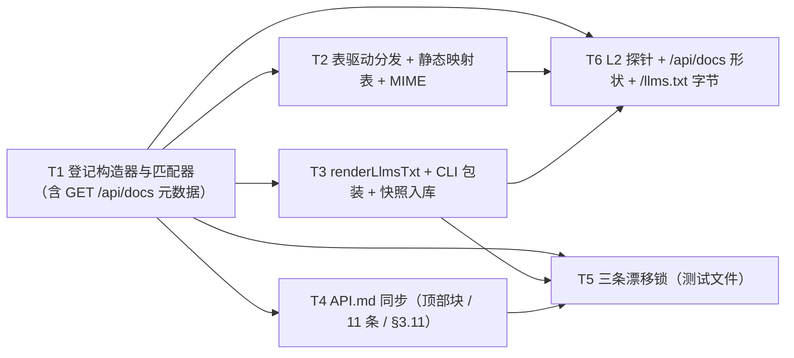

# pr-001-route-registry-and-derivations — 任务图（阶段 4 planner 产物）

**输入**：`prs/pr-001-route-registry-and-derivations.md`（10 条验收）+ `architecture.md` §3 / §4 / §4.5 / §5 / §7 / §10（L1-01 / L1-02）/ §13
**输出**：6 个任务的有向无环图（无环已核）＋ 每条的验收标准与前置依赖
**口径**：每条验收标准均可追溯到 PR 卡验收项或 architecture 章节（标注在括号内）；无 `[model_inferred]` 项
**粒度**：全部落在「1-2 天 + 可独立验收 + 验收判据可回答通过/不通过」范围内

---

## 依赖图

**无环**（拓扑序：T1 → T2 → T3/T4 → T5/T6）。**最长依赖链**：T1 → T2 → T6 与 T1 → T3 → T5（各 3 跳）。
**关键路径任务**：T1、T2、T3、T6。**无循环依赖，无需上报。**

---

## T1 · 登记构造器与匹配器（含 `GET /api/docs` 元数据）

**前置依赖**：无
**优先级**：P0

**交付物**：`oamp/src/web.js` 中的具名导出 `createApiRoutes(deps)` / `matchRoute(routes, method, pathname)` / `projectRoutes(routes)` / `renderLlmsTxt(routes)`（后者仅函数骨架，内容归 T3）＋ 常量 `ROUTE_META_FIELDS` / `PARAM_FIELDS` / `PARAM_IN` / `PARAM_TYPES` / `ROUTE_KINDS` / `STATIC_FILES`。

**验收标准**

1. `createApiRoutes({})` 返回 **11** 个表项且不抛错（纯构造：不调用依赖、不读磁盘、不起定时器）——表项顺序 = 今日 `if` 链顺序 + 末位 `GET /api/docs`（PR 验收 1；arch §3.2 / §3.3 对照表）。
2. 每个表项含 8 个元数据字段（`method` / `path` / `summary` / `params` / `response` / `errors` / `kind` / `docLink`）+ `handler`；`params[]` 元素含 `name` / `in` / `type` / `required` / `desc`；`errors[]` 元素 ∈ `ERR_CODE` 值集合（PR 验收 1；arch §3.1）。
3. 11 项 handler 体与改造前**逐字相同**（仅签名行改写 + 4 处 `decodeURIComponent(p.slice(…))` → `params.chat_id`）（PR 验收 2；arch §3.6）。
4. `matchRoute`：方法不匹配 → 不进入候选（无 405 状态）；首个命中即返回；参数经 `decodeURIComponent` 解码（畸形编码抛 `URIError` 供外层 502）（PR 验收 2；arch §3.3 C1~C5、§3.4 契约 3）。
5. 可达性：每个表项的探针路径（`:name` → 哨兵值）经 `matchRoute` 命中的是它自己；被更靠前的表项吞掉即失败并点名（PR 验收 3；arch §3.5）。
6. `projectRoutes` 只输出元数据 + 派生 `danger = method !== 'GET'`（`handler` 不入投影）；每次调用重新投影、不缓存（PR 验收 5；arch §5.1）。
7. `STATIC_FILES` 含 12 个 URL → 包根相对文件（`/`、`/index.html`、`/app.js`、`/style.css`、`/docs`、`/docs.js`、`/debug`、`/debug.js`、`/api-pages.css`、`/llms.txt`、`/API.md`、`/README.md`）；`STATIC_TYPES` 追加 `.txt` / `.md` → `text/plain; charset=utf-8`（PR 验收 6；arch §3.7 / §10 L1-02）。

**验证方法**：进程内 `import { createApiRoutes, matchRoute } from '../src/web.js'` 直接断言（不起服务）；`node --test test/api-routes.test.js`。

---

## T2 · 表驱动分发 + 静态映射表 + MIME

**前置依赖**：T1
**优先级**：P0

**交付物**：`oamp/src/web.js` 的 `http.createServer` 回调内分发段替换（27 行 → 约 16 行）；`serveStatic` 的基准路径改为包根；`startWeb()` 体内在依赖构造完成后、`createServer` 之前追加 `const routes = createApiRoutes({…9 个局部名})`。

**验收标准**

1. 分发循环：**单 `try/catch`** 覆盖「匹配 + 调用」；`await handler(...)` 后**只 `return`**（不检查返回值、不自动 `sendJson`）；静态面其次；404 兜底文案 `` `not found: ${req.method} ${p}` `` 与 502 文案逐字不变（PR 验收 2/8；arch §3.4 五条契约）。
2. 请求的匹配结果与登记一致：登记顺序 = 优先级（含 `POST /api/chats/archive` 精确串先于 `:id` 家族；（PR 验收 2/4；arch §3.3 R1~R3）。
3. 怪癖逐字保持：`GET /api/chats/archive` → 404 `chat 不存在: archive`；`GET /api/chats/` → `chat 不存在: `；`GET /api/chats/a/b` → `chat 不存在: a/b`；`POST /api/chats/a/b/close` → `chat 不存在: a/b`；`GET /api/agents/` → `not found: GET /api/agents/`（PR 验收 2；arch §4.2 Q-1~Q-5b）。
4. `readBody` 留在 handler 体内：改名路由「读体(400/413) → 404 → 409 → 400」顺序不变（`POST /api/chats/<未知 id>/rename` 畸形 JSON → 400；> 64 KiB → 413 + `connection: close`）（PR 验收 2；arch §4.1 ③）。
5. 不引入 405：`PUT /api/agents` → 404 `not found: PUT /api/agents`（PR 验收 8；arch §4.1 ①）。
6. 错误兜底覆盖面不缩小：`GET /api/chats/%E0%A4%A` → 502 `router 不可达或请求失败: URI malformed`（匹配期抛错亦落 502）（PR 验收 8；arch §4.1 ⑤）。
7. `qs` / `num()` 每请求闭包语义逐字不变；空值参数（`/api/agents?state=`、`/api/chats?state=`、`/api/chats?archived=`、`/api/chats?limit=`）全部 200（PR 验收 2；arch §4.2 Q-6、§4.5）。
8. `oamp/test/web.test.js` **零字节改动**且其全部顶层用例通过（`git diff -- oamp/test/web.test.js` 为空）；`oamp/package.json` 未改动（PR 验收 4/9）。

**验证方法**：`node --test oamp/test/web.test.js`（T6 的 L2 探针在 T1/T2 完成后独立跑）；`git diff --stat -- oamp/test/web.test.js`。

---

## T3 · `renderLlmsTxt` + CLI 包装 + 快照入库

**前置依赖**：T1
**优先级**：P0

**交付物**：`oamp/src/web.js` 的 `renderLlmsTxt(routes)` 实现；`oamp/scripts/gen-llms-txt.mjs`（新建，一行 CLI 包装）；`oamp/llms.txt`（包根）（新建，快照入库）。

**验收标准**

1. `renderLlmsTxt(projectRoutes(createApiRoutes({})))` 为**纯函数**输出：不读磁盘、不看时间、不看 env、不看端口 ⇒ 同输入逐字节相同（PR 验收 6；arch §5.3）。
2. 内容骨架含：项目一句话说明、接入方式（启动命令 + 服务地址默认端口 7788 + 端口可改说明）、`GET /api/docs` 元数据入口、**11 条**接口清单（逐表项一行 `<METHOD> <path> — 
`，顺序 = 表顺序）、深入链接（`/docs`、`/API.md`、`/README.md`，各给 HTTP 绝对 URL + 仓库内相对文件名）（PR 验收 6；arch §5.3；F05 验收 4/5/7）。
3. 内容**仅** HTTP 接口面：不含内部协议、命令行用法摘要、仓库结构说明（启动方式一行除外）；不复制 `API.md` / `README.md` 内容（arch §5.3；F05 验收 4/7）。
4. `node oamp/scripts/gen-llms-txt.mjs` 覆盖写 `oamp/llms.txt`（包根），重跑后工作区无差异（快照新鲜）；脚本不重复实现生成逻辑（PR 验收 6；arch §5.3）。
5. 快照随 PR 入库（未被 `.gitignore` 排除）（arch §5.3 / §9.3）。

**验证方法**：`node oamp/scripts/gen-llms-txt.mjs && git status --short -- oamp/llms.txt`（应为空/已入库）；`node --test test/api-routes.test.js`（锁②）。

---

## T4 · `API.md` 同步（顶部链接块 / §3 标题 11 条 / §3.11 小节）

**前置依赖**：T1（需知道新增登记的路径形态）
**优先级**：P0

**交付物**：`oamp/API.md` 三处改动。

**验收标准**

1. H1 + 引言段之后新增**一行引用块**：在线接口文档页 `http://127.0.0.1:7788/docs`（含分工说明）；既有引言段逐字未改（PR 验收 10；arch §6.7 / §9.1）。
2. §3 标题「接口清单（10 条）」→「接口清单（11 条）」；清单表追加 `` `GET /api/docs` `` 一行（PR 验收 10；arch §9.1）。
3. §3 末尾新增 `### 3.11 \`GET /api/docs\`` 小节（用途 / 参数无 / 响应形态 / 错误码无）；**不复制字段表**（字段表在 `/docs`）（PR 验收 10；arch §9.1）。
4. 既有 10 小节的文案**逐字未改**（PR 验收 10；arch §9.1）。
5. 锁③双向差集为空：登记侧 11 条签名集合与文档侧抽取集合互不缺失、不多出（PR 验收 7；arch §7.2）。

**验证方法**：`node --test test/api-routes.test.js`（锁③）；`git diff -- oamp/API.md` 人工核对「只有 3 处改动」。

---

## T5 · 三条漂移锁（独立三用例）

**前置依赖**：T1、T3、T4
**优先级**：P0

**交付物**：`oamp/test/api-routes.test.js` 中三条锁各一个独立顶层 `test(...)`（与 `hygiene.test.js` 并列体例）。

**验收标准**

1. **锁①**：遍历 `createApiRoutes({})` 的**真实表项**逐字段校验（存在且非空 / 枚举合法 / `errors` ∈ `ERR_CODE` 值集合）；先收集 findings 再 `assert.deepEqual(findings, [])`；失败信息逐条点名 `[METHOD path] field`（PR 验收 3；arch §7.2 锁①；F06 验收 1）。
2. **锁②**：`renderLlmsTxt(projectRoutes(createApiRoutes({})))` 与 `fs.readFileSync(<oamp/llms.txt>)` 按 Buffer 逐字节比对；不等时报首处差异（行 / 列 / 字节偏移）+ 期望/实际行 + 修复命令（PR 验收 3/6；arch §7.2 锁②；F06 验收 2）。
3. **锁③**：登记侧 `{ '<METHOD> <shape(path)>' }`（11 条）与 `API.md` 抽取侧集合**双向差集为空**；`shape()` 归一 `/<…>/` 与 `/:name` → `/:`；只锁路径集合，不比对文案（PR 验收 3/7；arch §7.2 锁③；F06 验收 3）。
4. 三条锁**互不掩盖**：分别破坏三处，三次运行的失败信息各自点名对应缺项（PR 验收 3；arch §7.3；F06 验收 4）。
5. 检查对象为**真实生成结果 / 遍历登记 / 路径集合求差**——不读源码正则（PR 验收 3；arch §7.1）。
6. 三条锁只读文件、不起进程、不占端口、毫秒级（arch §7.3）。

**验证方法**：`node --test oamp/test/api-routes.test.js`；另做三次「转红」实测（篡改元数据 / 快照 / `API.md` 各一次）。

---

## T6 · L2 探针 + `GET /api/docs` 形状 + `/llms.txt` 字节

**前置依赖**：T1、T2、T3
**优先级**：P0

**交付物**：`oamp/test/api-routes.test.js` 中的 HTTP 探针用例 + 自带约 25 行 `startWeb` 启动辅助（不抽公共 helper、不改既有文件）。

**验收标准**

1. 起真实 web 实例（真实 Router）：`GET /api/docs` → 200 `application/json; charset=utf-8`，`routes` 为 **11 条**（含自身），每项含 `danger`（`method !== 'GET'` 派生）与 `docLink`（PR 验收 5；arch §5.1）。
2. `GET /llms.txt` → 200 `text/plain; charset=utf-8`，响应内容与 `oamp/llms.txt`（包根） **逐字节相等**（PR 验收 6；arch §5.3；F05 验收 2/3）。
3. C-5 七条逐条探针：① 无 405；② 路径优先级（Q-1~Q-5b）；③ `readBody` 顺序（400/413）；④ SSE 路由独占 `res`（`/api/events`、`/api/stream` 首帧 `retry: 1000`，收到的事件 `data` 行是原样 payload（事件名在 `event:` 行）——分发层未包装、未二次序列化）；⑤ 单 try/catch（502 覆盖面）；⑥ 空值参数语义（Q-6）；⑦ 零新依赖（`package.json` 未改动，`hygiene.test.js` 通过）（PR 验收 8；arch §4.1）。
4. Q-7 / Q-8 探针：`limit=0` / `archived=2` / `state=bogus` → 400 `INVALID_PARAM`；`GET /api/stream` 缺参 → 400 `需要 chat_id（不做全局订阅）`（arch §4.2）。
5. 期望值以**改造前实测**固化（特征化测试）：改造前跑一遍为绿，改造后逐字比对仍绿（arch §4.3 L2）。
6. `oamp/test/web.test.js` 零字节改动且全绿（与 T2 验收 8 同判据，此处复跑确认）（PR 验收 4）。

**验证方法**：`node --test oamp/test/api-routes.test.js`；`git diff -U0 -- oamp/test/web.test.js`（应为空）。

---

## 追溯与自查

| PR 验收项 | 承载任务 |
|---|---|
| 1 具名导出 + 11 项纯构造 | T1 |
| 2 顺序与怪癖 + handler 零改写 | T1（结构）+ T2（行为） |
| 3 测试文件全绿（三锁 + C-5 + L3） | T5 + T6 |
| 4 `web.test.js` 零字节 + 19 文件未改 | T2（验收 8）+ T6（验收 6） |
| 5 `GET /api/docs` 形状（11 条 + danger + docLink） | T1（投影）+ T6（HTTP） |
| 6 `GET /llms.txt` + 快照新鲜 + 断言归属本 PR | T3 + T6 |
| 7 锁③双向差集为空 | T4 + T5 |
| 8 502 覆盖面 + 无 405 | T2 + T6 |
| 9 `package.json` 未改 + hygiene 通过 | T1（零依赖）+ T6 |
| 10 `API.md` 三处改动 + 既有 10 小节逐字未改 | T4 |

- **`[model_inferred]` 验收标准**：无（全部可追溯到 PR 卡或 architecture 原文）。
- **上游计数不一致（已按自洽口径落定，报主 agent 备案）**：PR 验收 1 与 arch §3.2 / §3.5 / §7.1 写「12 项 / 12 个表项」，但 arch §3.3 对照表（1~11，第 11 项为新增 `GET /api/docs`）、§7.2 锁③（「本轮 = 11 条接口」）、§5.1 契约 3（「本接口自身也在表内（第 11 项）」）、PR 验收 5（`routes` 为 11 条）与 §10 L1-01（「接口面 10 → 11」）一致取 **11**（10 条既有 + 1 条新增；今日 12 条分支 = 10 条 API + 2 条静态，静态面按 §3.7 明确不入表）。**表项数 = 11**，任务与实现按此落定。
- **匹配语义口径（按主 agent 2026-09-12 纠正落定）**：`POST /api/chats/:chat_id/(close|activate|rename)` 的今日语义是 `startsWith('/api/chats/') && endsWith('/<后缀>')` + 双侧 `slice`，**后缀可与前缀尾斜杠重叠**；不得编译成 `^/api/chats/(.*)/close$`（会漏掉 `POST /api/chats/close` 这类输入）。等价实现 = 两种匹配形态（`exact` / `prefixSuffix`，**不引入正则**），并在 T6 的 L2 探针里补 `POST /api/chats/{close,activate,rename}` 与 `POST /api/chats/rename`（畸形体 → 400）作为该等价性的回归锁。
- **SSE 事件体口径更正**：arch §4.1 ④ 称事件 `data` 可解析且含 `type` 字段，与 `src/transport.js` 的实现不符 —— 事件名在 SSE 的 `event:` 行，`data:` 行是**原样 payload**（如 `{chat_id, message}` / `{chat_id, state}`）。T6 的探针按实现真相断言（`data` 可解析且带 `chat_id` 等 payload 字段）。
- **`llms.txt` 快照落点（按主 agent 2026-09-12 纠正落定）**：**包根 `oamp/llms.txt`**（不是 `oamp/web/llms.txt`）；`STATIC_FILES` 的 `/llms.txt` 映射、生成器写入目标、锁② 比较对象、PR 卡与注释全部同步为该落点。
- **循环依赖**：无。
- **架构信息不足导致的阻塞**：无。（`ERR_CODE` 需对锁①可见 —— architecture §3.1「导出常量（供锁与实现共用同一份字段清单，避免测试里抄第二份）……`ERR_CODE` 的值集合即 `errors` 的白名单」已给出口径：随字段常量一并导出。）
