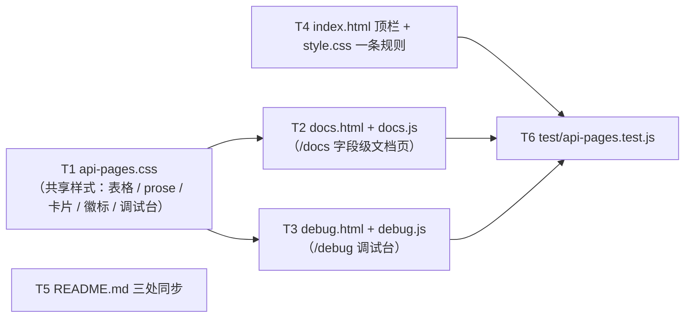

# pr-002-docs-and-debug-pages — 任务图（阶段 4 planner 产物）

**输入**：`prs/pr-002-docs-and-debug-pages.md`（10 条验收）+ `architecture.md` §4.4（断言归属：pr-002 不断言 `llms.txt`）/ §5.2（取数时机）/ §6.1~§6.8（页面承载、表单映射、耗时、订阅、写防护、互链、样式落点）/ §9.2（README 同步点）/ §13 R-3
**输出**：6 个任务的有向无环图（无环已核）＋ 每条的验收标准与前置依赖
**口径**：每条验收标准均可追溯到 PR 卡验收项 / PRD 卡（F03 / F04 / F07 / F08）或 architecture 章节（标注在括号内）；无 `[model_inferred]` 项
**粒度**：全部落在「1-2 天 + 可独立验收 + 验收判据可回答通过/不通过」范围内

---

## 依赖图

**无环**（拓扑序：T1 → T2/T3 → T6；T4、T5 无前置）。**最长依赖链**：T1 → T2 → T6（3 跳）。
**关键路径任务**：T1、T2、T6。**无循环依赖，无需上报。**

**互不阻塞说明**：T2 / T3 / T4 / T5 之间零依赖（T2 / T3 各自独立脚本与 HTML，T4 只碰控制台顶栏与 `style.css`，T5 只碰 `README.md`），可并行；T6 需要 T2 / T3 / T4 的文件存在作为断言的读取对象。

---

## T1 · `oamp/web/api-pages.css`（共享样式）

**前置依赖**：无
**优先级**：P0

**交付物**：`oamp/web/api-pages.css`（新建）。

**验收标准**

1. 只含 architecture §6.8 授权范围的规则：页面容器与标题（`.api-page`、`.api-page h1/h2`、`.api-intro`）、卡片与徽标（`.route-card`、`.method-badge`、`.route-path`、`.danger-badge`）、**表格**（`.api-table` 及其 `th/td`）、**prose 排版**（`.prose`）、调试台（`.debug-form`、`.debug-field`、`.sse-log`、`.sse-entry`、`.result-box`）（PR 验收 3；arch §6.8 / F-19）。
2. 不重复定义既有 `:root` token，只引用 `var(--line)` / `var(--muted)` / `var(--green)` / `var(--red)` / `var(--code-bg)` / `var(--radius)`（PR 验收 2；arch §6.8）。
3. 零 `@media` 断点、零主题变量、零动效（arch §6.8「明确不做」）。
4. 既有 `oamp/web/style.css` 零改动（本任务的唯一 CSS 新增落点在新文件）（PR 验收 2；arch §6.8 / N12）。

**验证方法**：`node --test oamp/test/api-pages.test.js`（T6 的静态契约用例逐个类名断言）；`git diff --stat -- oamp/web/style.css`（T4 之前应为空）。

---

## T2 · `/docs` 字段级文档页（`docs.html` + `docs.js`）

**前置依赖**：T1
**优先级**：P0

**交付物**：`oamp/web/docs.html`、`oamp/web/docs.js`（均新建）。

**验收标准**

1. 页面加载时 `fetch('/api/docs')` 取数渲染，**不含任何硬编码接口清单**（除数据源 URL `/api/docs` 外，脚本与 HTML 中不出现登记中其它接口路径的字面量，如 `/api/agents`、`/api/chats`、`/api/messages`、`/api/stream`、`/api/events`）（PR 验收 3；arch §5.2 / §6.2；F03 验收 6 / F04 验收 6）。
2. 逐接口展示：方法 + 路径（代码体）→ `summary` → **参数表**（名称 / 位置 / 类型 / 是否必填 / 说明；`in ∈ {path, query}`）→ **请求体字段表**（`in === 'body'`，同列）→ **响应形态**（`response` 原文）→ **错误码**（`errors` 逐个；空 → 「（无）」）→ **`API.md` 链接**（`<a href="{docLink}">`）（PR 验收 3；arch §6.2；F03 验收 3/8）。
3. 全页零响应示例报文：不出现 `curl` / 示例 JSON 报文 / 从 `API.md` 抄来的叙述段落（PR 验收 3；arch §6.2；F03 验收 4 / F08 验收 5）。
4. 页面含标注「**参数语义说明为人工撰写，结构与分发来自路由表**」（逐字）（PR 验收 3；arch §6.2；F03 验收 7）。
5. 接口集合 = `GET /api/docs` 的 11 条（双向求差为空）（PR 验收 3；arch §5.1 契约 3；F03 验收 5）。
6. 独立地址 `/docs` 可达（静态映射由 pr-001 的 `STATIC_FILES` 提供），且该页同时 `<link>` 既有 `/style.css` 与 T1 的 `/api-pages.css`（PR 验收 1；arch §6.8）。
7. 既有资产零改动：不碰 `app.js`、不为本页改 `style.css`（N12；arch §6.1）。

**验证方法**：浏览器实测（渲染 11 条 + 与 `/api/docs` 逐项比对 + 逐接口链接可点开）；`node --test oamp/test/api-pages.test.js`（`/docs`、`/docs.js` 的 HTTP 可达性与 MIME）。

---

## T3 · `/debug` 可交互调试台（`debug.html` + `debug.js`）

**前置依赖**：T1
**优先级**：P0

**交付物**：`oamp/web/debug.html`、`oamp/web/debug.js`（均新建）。

**验收标准**

1. `debug.html` 顶部有**静态**风险提示（非 JS 生成）：「该页面直接作用于本机正在运行的应用，请求真实生效」（PR 验收 5；arch §6.6；F07 验收 1）。
2. 表单按元数据生成，四类接口（无参 / 查询 / 路径 / 多类型请求体）控件与其 `params` 一一对应；`in` 决定位置、`type` 决定控件（string→input、number→`type=number`、boolean→checkbox、json→textarea）、`enum` → 下拉 + 「（不传）」；未填且非必填 → 不发，未填但必填 → 照发（PR 验收 4；arch §6.3；F04 验收 3）。
3. 发送：路径参数 `encodeURIComponent` 代入 URL 模板、查询参数交 `URLSearchParams`、请求体 `JSON.stringify`；耗时 = `performance.now()` 两次差值（发出前 / 读完 `res.text()` 后）`Math.round`，与状态码、响应体同区展示「状态码 · N ms」（PR 验收 4；arch §6.3 / §6.4；F04 验收 4）。
4. 写防护：**发送函数内唯一一处** `if (route.danger && !window.confirm('该请求会真实生效：\n<METHOD> <path>\n\n确定发送？')) return;`；`.danger-badge` 渲染在**接口列表项**与**表单顶部**两处；只读接口无标识（PR 验收 5；arch §6.6；F07 验收 3/4/6）。
5. 订阅面板：`kind === 'sse'` 的表项渲染「订阅 / 停止」+ `.sse-log`；`new EventSource(url)`（`/api/stream` 的 `chat_id` 由参数输入框拼入 URL；`/api/events` 无参直连）；事件按到达顺序追加（事件名 + `data` 原文，可解析则美化）；**停止 = `es.close()`**，停止后不再追加；与发送区互斥显示；无任何历史留存（无 localStorage）（PR 验收 6；arch §6.5；F04 验收 5/7）。
6. 页面零 agent 启停入口、零只读模式总开关、零凭据输入（PR 验收 5；F04 验收 6 / F07 验收 5 / N9）。
7. 独立地址 `/debug` 可达，同时 `<link>` `/style.css` 与 `/api-pages.css`（PR 验收 1；arch §6.8）。

**验证方法**：浏览器实测（真实发送 + 耗时 + POST 确认前零请求 + SSE 订阅/停止）；`node --test oamp/test/api-pages.test.js`（`/debug`、`/debug.js` 的 HTTP 可达性与 MIME + 零启停静态契约）。

---

## T4 · 控制台顶栏 2 入口 + `style.css` 一条规则

**前置依赖**：无
**优先级**：P0

**交付物**：`oamp/web/index.html`（顶栏追加 2 个锚点）、`oamp/web/style.css`（仅追加 1 条规则）。

**验收标准**

1. `.topnav` 内新增 2 个真实锚点：`<a class="nav-item" href="/docs">文档</a>`、`<a class="nav-item" href="/debug">调试</a>`（PR 验收 2；arch §1.1 / §6.8；F03 验收 1/2、F04 验收 1）。
2. 既有 3 个占位 `span`（`Workspace` / `Agents` / `Tasks`）**逐字未变**（PR 验收 2；F03 验收 2）。
3. `style.css` **只追加**一条 `a.nav-item { text-decoration: none; cursor: pointer; }`，既有规则零改动（`git diff -- oamp/web/style.css` 中除追加行外无 `-` 行）（PR 验收 2；arch §6.8）。
4. `oamp/test/web.test.js` **零字节改动**且其全部顶层用例通过（顶栏改动不破坏既有前端静态契约）（PR 验收 10；arch §4.4）。

**验证方法**：`git diff -- oamp/test/web.test.js`（空）；`node --test oamp/test/web.test.js`；浏览器实测（顶栏两入口可点击进入）。

---

## T5 · `oamp/README.md` 三处同步

**前置依赖**：无
**优先级**：P0

**交付物**：`oamp/README.md` 三处改动。

**验收标准**

1. 「Web 控制台（demo）」段浏览器清单 +2 条：顶栏「文档」→ `/docs`（字段级接口文档，不含示例）；顶栏「调试」→ `/debug`（真实发送、写操作需确认）（PR 验收 8；arch §9.2）。
2. 「对话持久化…」段的 HTTP 表 +1 行：`| GET /api/docs | 接口元数据（文档页 / 调试台 / AI 索引文件的数据源） |`；同段紧随其后的一句「见 [API.md](API.md)（10 条 API + 6 类事件）」的计数由 pr-001 的登记结果决定，本期随 +1 行改为 **11 条 API**（不改句子其余部分）——这是 +1 行的直接后果（否则同段自相矛盾），已在交付报告「越界声明」中列明，供主 agent 复核（PR 验收 8；arch §9.2）。
3. 新增一小段「接口文档与索引（0016）」：三个地址（`/docs`、`/debug`、`/llms.txt`）+ 索引快照现址（`oamp/llms.txt`，包根）+ 重新生成命令（`node scripts/gen-llms-txt.mjs`）+ 三条漂移锁由 `npm test` 强制（PR 验收 8；arch §9.2）。
4. 既有段落只追加、不改写（arch §9.2）。

**验证方法**：`git diff -- oamp/README.md` 人工核对「只有 3 处新增」；浏览器/HTTP 侧由 T6 的 MIME 与 pr-001 的 `/README.md` 静态面覆盖。

---

## T6 · `oamp/test/api-pages.test.js`（页面静态契约 + 新页面 HTTP 可达性）

**前置依赖**：T2、T3、T4
**优先级**：P0

**交付物**：`oamp/test/api-pages.test.js`（新建，自带约 25 行 `startWeb` 启动辅助）。

**验收标准**

1. HTTP 可达性与响应类型：`GET /docs`、`GET /debug` → 200 `text/html; charset=utf-8`；`GET /docs.js`、`GET /debug.js` → 200 `text/javascript; charset=utf-8`；`GET /api-pages.css` → 200 `text/css; charset=utf-8`（PR 验收 1；arch §3.7 / §4.4）。
2. 顶栏静态契约：`index.html` 含两锚点（`href="/docs"` / `href="/debug"`）且既有 3 个 `span.nav-item` 逐字仍在（PR 验收 2；arch §4.4）。
3. `style.css` 静态契约：含 `a.nav-item { text-decoration: none; cursor: pointer; }`（PR 验收 2）。
4. 新页面脚本独立：`docs.js` / `debug.js` **不得**出现 `POLL_MS` 标识符与 `setTimeout(tick` 形态（沿用既有 `web.test.js` 的禁用形态约定；证明新页面未并入 `app.js` 的断言面）（arch §4.4 / N12）。
5. 零 agent 启停入口（反向硬断言，同 `web.test.js` 体例）：新两页与两脚本中检索启动 / 停止 agent 的入口与路径，零命中（PR 验收 5；F04 验收 6 / N9）。
6. **不断言 `/llms.txt`**：全部 llms.txt 断言归 pr-001 的 `test/api-routes.test.js`（PR 验收 7；arch §4.4 断言归属裁决）。
7. `oamp/test/web.test.js` 零字节改动（PR 验收 10；arch §4.4）。
8. 检查对象为真实 HTTP 响应与既有静态契约体例（`assert.match`），不读源码正则做行为断言（arch §4.4）。

**验证方法**：`node --test oamp/test/api-pages.test.js`（自跑）；`node --test oamp/test/*.test.js`（串行全仓，确认既有 246 条 + 新增全绿）。

---

## 追溯与自查

| PR 验收项 | 承载任务 |
|---|---|
| 1 可达（地址 + 顶栏两条路径）+ MIME | T4（顶栏）+ T6（HTTP/MIME）+ 浏览器实测 |
| 2 顶栏 2 锚点 + 3 占位未变 + `style.css` 仅 +1 条 | T4 + T6 |
| 3 文档页字段级七要素 + 人工撰写标注 + 集合一致 + 零示例 | T2 + 浏览器实测 |
| 4 调试台集合一致 + 四类控件 + 真实响应与耗时 | T3 + 浏览器实测 |
| 5 风险提示 + POST 首次不发出 + 两处危险标识 | T3 + 浏览器实测 |
| 6 SSE 可建立 / 可查看 / 可停止 + 无历史留存 | T3 + 浏览器实测 |
| 7 `api-pages.test.js` 全绿（llms.txt 归 pr-001） | T6 |
| 8 `README.md` 三处同步 | T5 |
| 9 `API.md` 顶部链接 → `/docs` + 逐接口链接可点开 | pr-001（顶部链接）+ T2（逐接口链接）+ 浏览器实测 |
| 10 `web.test.js` 零字节 + 全绿 | T4 + T6 |

- **`[model_inferred]` 验收标准**：无（全部可追溯到 PR 卡、PRD 卡或 architecture 原文）。
- **断言归属（按 architecture §4.4 裁决落定，未漂移）**：`/llms.txt` 的全部断言只归 pr-001 的 `test/api-routes.test.js`；本 PR 的 `test/api-pages.test.js` 只负责两页资产、顶栏入口与 `/api-pages.css`。
- **T1 的样式规则边界**：`api-pages.css` 采用 §6.8 授权类名；`.confirm-bar` 因 AR-07-a 选定原生 `window.confirm`（非内联确认形态）而不落规则——不实现未被采用的备选形态。
- **循环依赖**：无。
- **架构信息不足导致的阻塞**：无。
