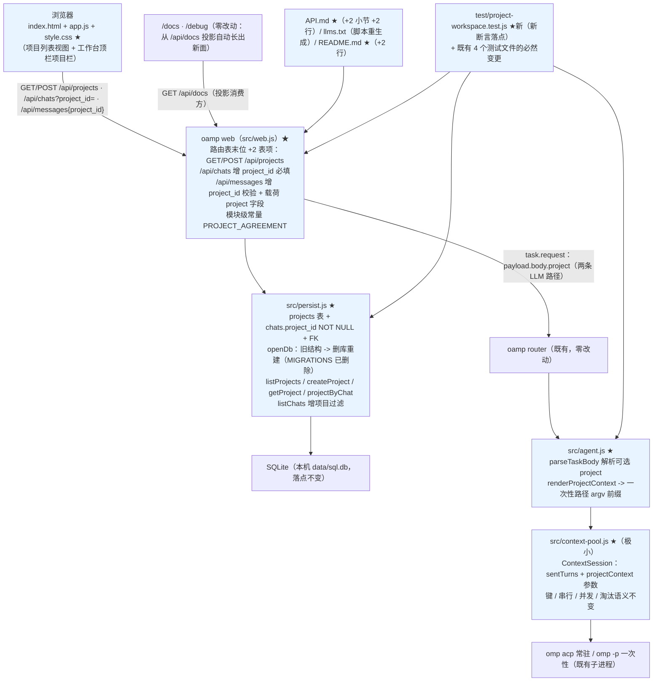
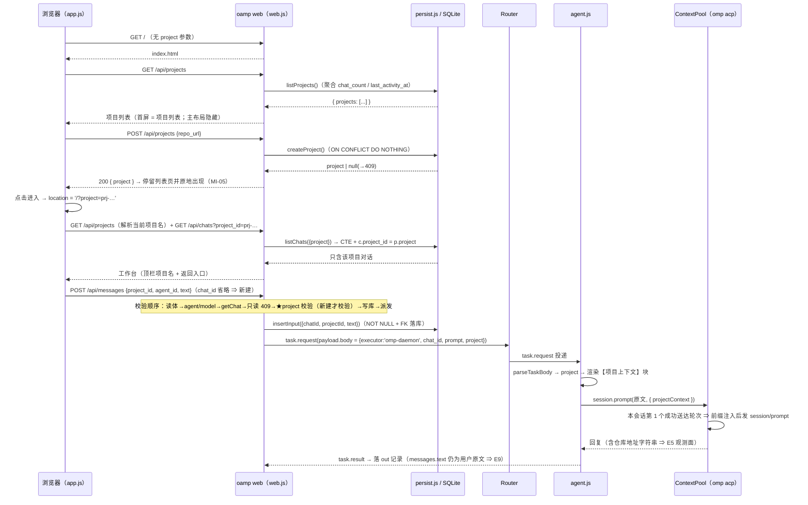
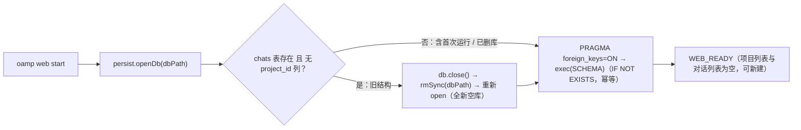

# architecture.md — 0017-project-workspace（迭代架构）

**版本**：0.1.0（阶段 3 产物）
**日期**：2026-09-12
**状态**：**待主 agent 确认 §10 的 4 条口径点**（L1 决策 0 条）。§3~§8 为**硬契约**（数据模型、HTTP 面、派发与注入、前端划分、登记形态、变更面清单），实现阶段不得偏离。
**输入**：`prd.md`（v0.1.0，10 卡 F01~F10）+ `prd/F01~F10*.md`（产品维度已锁；架构维度本次全部回填）+ `demand.md`（v1.1.0，只读）。
**架构基线**：`docs/iterations/0016-api-reflection-docs/architecture.md`（声明式路由表 + 三条漂移锁 + `/api/docs` 投影 + `llms.txt` 快照）、`0015-hub-orchestration-open-api/architecture.md`（统一错误契约、`/api/events`）、`0012-roles-agent-cluster/architecture.md`（权限两档、进程级 cwd）、`0011-chat-context-protocol/architecture.md`（两表 + SSE + `(chat×agent)` 常驻上下文池）+ 阶段 3 重新取证的 `oamp/**`（§1）。
**本次约束**：零第三方依赖、零新进程、零新传输、零新配置键、零新 env 变量、零新增静态资产、协议方法面仍 7 个、本迭代文档留 `agents` 仓库。

---

## 0. 一句话架构

> **在既有单页控制台里加一层"项目"视图（`/?project=<project_id>` 是唯一载体），在既有 SQLite 库里加一张 `projects` 表与 `chats.project_id NOT NULL` 一列（旧结构库在 `openDb()` 里被判出后整库重建），在既有声明式路由表末位追加 `GET/POST /api/projects` 两条表项——项目上下文以 `payload.body.project = {name, repo_url, agreement}` 结构化字段随派发下行，由 **agent 侧**渲染成一块前缀：**一次性路径** `omp -p` 的 prompt 参数、**常驻路径**该 `(chat×agent)` 会话**首个成功送达轮次**的 `session/prompt` 文本；`messages.text` 一行都不碰。**

**一句话反证**：本次没有引入任何新的技术栈、进程、传输、配置文件、env 变量、依赖、静态资产或协议方法；所有改动都落在既有的 6 个文件（`persist.js` / `web.js` / `agent.js` / `context-pool.js` / `index.html` / `app.js`+`style.css`）与既有的 3 类产物（路由登记、`API.md`、`llms.txt`）上。

---

## 1. 架构基线（阶段 3 实测）

### 1.1 相关现有组件（本次唯一触碰面）

| 文件 | 现状职责（阶段 3 复核） | 本次改动性质 |
|---|---|---|
| `oamp/src/persist.js`（314 行） | `node:sqlite` 的 `DatabaseSync`；`SCHEMA`(:12-36) 两表三索引；`MIGRATIONS`(:42-45) + `migrate()`(:47-53) 按列存在性守卫的幂等补列；`openDb()`(:153) 建目录→开库→`PRAGMA foreign_keys=ON`→`exec(SCHEMA)`→`migrate()`；单行参数 CTE（`LIST_WITH`/`LIST_FROM`）覆盖 `listChats` 全组合；`CHAT_COLUMNS`(:60) / `MESSAGE_COLUMNS`(:61) 是两个读口的**字段面真源** | **扩展 + 一处删除**：新增 `projects` 表 + `chats.project_id` + 项目索引；`listChats` 增项目过滤；新增 4 个项目读/写口；**删除** `MIGRATIONS`/`migrate()`（T-03） |
| `oamp/src/web.js`（1044 行） | 内建 http + JSON API + SSE；`createApiRoutes({...})`(:313) 纯构造器 = **11 条表项**（8 元数据字段 + handler），表顺序 = 匹配优先级；`matchRoute`(:718) 顺序匹配（无 405）；`STATIC_FILES`(:261) 静态面显式白名单（12 个键）；分发循环(:995-1013) 单 `try/catch`；`/api/messages` handler 内既有顺序 = **读体(400/413) → text/agent_id(400) → model(400) → chat_id → 只读预检(409) → 写库 → 派发** | **扩展**：路由表末位 +2 表项；`/api/chats` 增 `project_id` 必填；`/api/messages` 增 `project_id` 校验与载荷 `project` 字段；新增 1 个约定文本常量 |
| `oamp/src/agent.js`（769 行） | `parseTaskBody`(:46) 三条执行器路由（`omp` / `omp-daemon` / 缺省 shell）；`runOmpTask`(:157) 组 argv，末位 `args.push(task.prompt)`(:173)；`runDaemonTask`(:275) 经 `ctx.pool.getOrCreate(chatId, instanceId)` 取会话后 `session.prompt(task.prompt, …)`(:294)；`ContextPool` 构造(:586) | **扩展**：解析可选 `project` 字段 → 渲染注入块；一次性路径 argv 前缀；常驻路径把块随轮次下传 |
| `oamp/src/context-pool.js`（244 行） | 键 = `(chat_id, agent_id)`；同键 FIFO 串行 + 队列上限 8；异键并发；LRU 淘汰；`ContextSession.prompt()` 入队、`_pump()` 单飞执行、`_ensureClient()` 懒建 ACP | **极小扩展**：`ContextSession` 增 1 个计数器 + `prompt()` 多收 1 个可选参数 ⇒ **键、队列、并发、淘汰语义零变化**（N9） |
| `oamp/web/{index.html 75 行, app.js 887 行, style.css 364 行}` | 单页控制台：顶栏（brand + 4 个 nav 项 + `#conn-status` + `#agent-panel`）+ 三栏（左栏对话列表 / 右栏详情 / composer）；`init()`(:881) = `loadAgents → loadChats → renderChat → connectAgentEvents` | **扩展**：新增项目列表视图、顶栏项目栏与返回入口；3 处调用点带 `project_id`；既有交互逻辑零改写 |
| `oamp/test/*.test.js`（22 文件 / **251** 顶层用例） | 含 `web.test.js` 的**前端静态契约**与 `api-routes.test.js` 的**三条漂移锁** + 硬编码 `EXPECTED_SIGNATURES`（11 条） | **必然变更面逐条登记于 §8**；新增断言集中落**新文件** |
| `oamp/API.md`（879 行）/ `oamp/llms.txt` / `oamp/scripts/gen-llms-txt.mjs` | 契约文档（手写，§3 清单 11 条 + 表 11 行 + §3.1~§3.11）/ 索引快照（生成器一行调用 `renderLlmsTxt(projectRoutes(createApiRoutes({})))`） | `API.md` +2 小节 +2 表行 + 标题改 13；`llms.txt` 用**既有脚本**重生成 |

### 1.2 可直接复用的既有能力（决定了本方案"少造东西"）

| # | 既有能力（位置） | 本次如何复用 |
|---|---|---|
| A | 声明式路由表 + 漂移锁三件套 | 两条新面只是**追加两行表项**：文档页 / 调试台 / `llms.txt` 三面**自动出现**（F10 验收 1 的物理含义）；锁① 自动覆盖新表项元数据 |
| B | `ERR_CODE` 封闭枚举 + `sendError` 唯一构造点 | 新增错误的两个码（`INVALID_PARAM` / `CONFLICT`）**都已在枚举内**，零改契约 |
| C | `openDb()` 是**全仓唯一开库点**（`web.js:803`；`grep openDb(` 只命中 web.js 与测试） | F08 的"旧结构检测 + 删库重建"有唯一且必然经过的挂载点 |
| D | `PRAGMA foreign_keys = ON` + `NOT NULL` | F02 验收 3（不存在无项目对话）与 E4 由**数据库结构**保证，不靠应用层自律 |
| E | `INSERT … ON CONFLICT DO NOTHING` + `.changes > 0` 判成败的既有体例（`ensureChat` / `archiveChat` / `activateChat` / `renameChat`） | 项目重复 → `409` 的判定沿用同一体例（不解析 SQLite 错误文案） |
| F | `logger.event` / `WEB_READY` 就绪行 | 无新日志体系；本次仅可选追加 1 行 stdout 告知（§10.3 D-02） |
| G | 前端 `fmtAgo()`（非有限值 → `'—'`）、`.hidden` 的"静态节点 + 逐组件规则"手法（`style.css:64/203/204/295`）、`.chat-item` 行样式、`api()` 取数封装 | 项目列表行的"最近活动时间 = 无 → `—`"、视图切换、行渲染、错误提示全部复用，零新工具 |
| H | `A∪C` 的 fake ACP 测试桩：`FAKE_ACP_ARGS_LOG` 记录 argv、`session/prompt` 文本被**回显**（`收到：<prompt>`） | E5（"仓库地址字符串出现即真"）在两条路径上都有天然观测面：argv 文件 / 出口回复文本 |
| I | `scripts/gen-llms-txt.mjs` | `llms.txt` 重生成 = 跑一条既有命令，零新脚本 |

### 1.3 既有缺口（正好是 8 张需求卡的来源）

1. **数据层零"项目"概念**：`chats` 9 列无任何归属维度、无项目表（F-19 / F-1）。
2. **对话可凭空创建**：`POST /api/messages` 在缺 `chat_id` 时用 `chat-<uuid>` 隐式建对话，且 `insertInput→ensureChat` 对**任何**未知 `chat_id` 都防御性建行（F-4）。
3. **列表跨项目混列**：`GET /api/chats` 的过滤面（`q/agent/state/from/to/archived`）无项目维度（F-5）。
4. **派发载荷无项目字段**：`{executor, chat_id, prompt, model?, timeout_ms?}` / `{executor, prompt, model?, tools?, timeout_ms?}`（F-9）。
5. **前端无项目层**：`/` 直接是对话列表 + 详情，无项目列表页、无项目选择器（F-6）。
6. **旧库升级即崩**：`chats.project_id NOT NULL` 与"幂等补列"不可兼得（F-22）；旧库不处理则启动即崩。

---

### 1.4 本次演进的组件图（★ = 本次新增/改动；未标 ★ 的节点与边 = 逐字不变的既有链路）



**读图要点**：本次**没有新增节点**——`B / W / P / A / CP / L / DOC` 全部是既有节点（其中 7 个加 ★ 表示有改动），SQLite / Router / omp 子进程 / `/docs` `/debug` 四者**零改动**；新增的只有"W 与 P 之间、W 与 R 之间的字段"和"R 与 A 之间载荷里的一个结构化字段"。

## 2. 数据模型与 DDL（落地 T-01 / T-02 / T-03；**硬契约 ①**）

### 2.1 新 schema（全量替换 `persist.js` 的 `SCHEMA`）

```sql
CREATE TABLE IF NOT EXISTS projects (
  project_id  TEXT PRIMARY KEY,             -- prj-<uuid>（形态与既有 chat-<uuid> / task-<uuid> / msg-<uuid> 同族）
  name        TEXT NOT NULL,                -- 展示名；缺省 = 仓库地址尾段去尾部 .git
  repo_url    TEXT NOT NULL UNIQUE,         -- 唯一键 = 原样（trim 后）地址字符串；不归一化、不校验可达性
  created_at  INTEGER NOT NULL              -- epoch ms
);

CREATE TABLE IF NOT EXISTS chats (
  chat_id     TEXT PRIMARY KEY,
  project_id  TEXT NOT NULL REFERENCES projects(project_id),   -- ★ 新增：必填 + 外键（E4 的结构性保证）
  title       TEXT NOT NULL,
  agent_id    TEXT,
  state       TEXT NOT NULL,
  created_at  INTEGER NOT NULL,
  updated_at  INTEGER NOT NULL,
  closed_at   INTEGER,
  archived_at INTEGER,
  context_released INTEGER NOT NULL DEFAULT 0
);
CREATE TABLE IF NOT EXISTS messages ( … 逐字不变 … );
CREATE INDEX IF NOT EXISTS idx_messages_chat_time ON messages(chat_id, created_at);
CREATE INDEX IF NOT EXISTS idx_chats_updated ON chats(updated_at DESC);
CREATE INDEX IF NOT EXISTS idx_chats_project_updated ON chats(project_id, updated_at DESC);  -- ★ 新增：项目范围列表
```

**列序契约**：既有 9 列的相对顺序**逐位不变**，`project_id` 插在第 2 列（紧跟 `chat_id`）。阶段 5 的列集断言按此陆序写死（C-7③ 的改写对象）。

**T-01 的答案（关联方式与索引）**：
- 关联方式 = **`chats.project_id` 外键指向 `projects.project_id`**（不用"项目名/地址当外键"：名称可缺省派生、地址不归一化，两者都不适合作为引用键；M-1 的"唯一标识"因此是独立的 `project_id`）。
- 索引 = `idx_chats_project_updated(project_id, updated_at DESC)`：项目范围列表的默认排序正是 `updated_at DESC`（既有 `listChats` 排序表达式），该索引使"按项目取列表 + 分页"走单索引扫描。**不新增其它索引**（项目唯一性由 `UNIQUE(repo_url)` 的主索引承担；`projects` 表数据量极小，不建排序索引）。

**T-02 的答案（DDL 与触发点与动作粒度）**：
- DDL 见上；关键是 `NOT NULL` 与 `REFERENCES` **同址声明**（`PRAGMA foreign_keys=ON` 已由 `openDb` 打开 ⇒ 引用真实生效）。
- **触发点 = `persist.openDb()`**（全仓唯一开库点；`oamp web start` 必经）。不在 `startWeb` 里另做检测——那会制造第二个真源，且测试文件直连 `openDb()` 时行为会分叉。
- **动作粒度 = 删除库文件本体后重开**（`db.close()` → `rmSync(dbPath, { force: true })` → `new DatabaseSync(dbPath)`），**不是** `DROP TABLE` 重建：见 §2.2。

### 2.2 旧结构检测与重建（**硬契约 ②**）

```js
export function openDb(dbPath) {
  mkdirSync(path.dirname(dbPath), { recursive: true });
  let db = new DatabaseSync(dbPath);
  if (isLegacyChats(db)) {          // chats 表存在 且 无 project_id 列
    db.close();
    rmSync(dbPath, { force: true }); // 只删库文件本体
    db = new DatabaseSync(dbPath);   // 全新空库
  }
  db.exec('PRAGMA foreign_keys = ON');
  db.exec(SCHEMA);
  …
}

/** 旧结构判据（唯一真源）：pragma_table_info('chats') 有行 且 无 project_id 列。
 *  chats 不存在（首次运行 / 删库后）→ 0 行 → 非旧结构 → 正常建新库（F08 验收 5 后半）。 */
function isLegacyChats(db) {
  const cols = db.prepare("SELECT name FROM pragma_table_info('chats')").all().map((r) => r.name);
  return cols.length > 0 && !cols.includes('project_id');
}
```

- **判据用列存在性、不用 `user_version`**：与既有 `migrate()` 同一函数（`pragma_table_info`），零新迁移机制（0016/0017 均不引入迁移表）。
- **只删主库文件**：检测发生在"本次已成功 open"之后，SQLite 在 open 时已完成热日志回滚 ⇒ 不存在需要一并清理的 `-journal`；多删一类文件属于为不可能发生的场景写代码（YAGNI）。
- **不加"是否真旧结构"的二次确认、不做备份**：C-5 / N7 / F08 验收 6 明示"不留兼容路径、不可恢复"。
- **删除 `MIGRATIONS` + `migrate()`（T-03）**：新 schema 下两条旧守卫**均不可达**——① 任何缺 `archived_at`/`context_released` 的库必然同时缺 `project_id`（0013 之前/之后的版本都会走到"删库重建"）；② 有 `project_id` 却缺其它列的库**不存在任何产生路径**。保留即死代码，且会诱导未来把"补列"语义恢复回来（C-5 明确禁止）。删除后 `openDb` 的三步（建目录 / 判定+重建 / 建 schema）即为全部逻辑。

### 2.3 持久层接口（扩展后的对外形状）

| 接口 | 语义 | 备注 |
|---|---|---|
| `createProject({ repoUrl, name, nowMs })` | `INSERT … ON CONFLICT(repo_url) DO NOTHING`；`changes === 0` ⇒ 返回 `null`（重复）；否则回读并返回 `{project_id, name, repo_url, created_at}` 库值 | `project_id` 由 persist 内部生成 `prj-<uuid>`；"回读库值"沿用 `activateChat` 的既有体例 |
| `listProjects()` | 单条聚合 SQL（见 §5.2）→ `[{project_id, name, repo_url, created_at, chat_count, last_activity_at}]` | 派生字段零新增存储（F04 验收 5） |
| `getProject(projectId)` | 单行；不存在 → `null` | 新建对话的归属校验用 |
| `projectByChat(chatId)` | `SELECT p.* FROM chats c JOIN projects p ON p.project_id = c.project_id WHERE c.chat_id = ?`；不存在 → `null` | 既有对话的归属读口（**一条语句**，不引入 `chats` 读口的字段变更） |
| `insertInput({ chatId, projectId, text, … })` | **`projectId` 必填**（非空字符串）；`ensureChat` 的 VALUES 增列 | `ON CONFLICT(chat_id) DO NOTHING` 使**既有对话的归属不可被改写**（免费获得"归属不可变"） |
| `listChats({ project, q, agent, state, from, to, archived, limit, offset })` | 新增**必填** `project`；校验非法/缺失 → 抛错（既有 harness 转 400） | 过滤条件进入既有单行参数 CTE，`countChats` 与列表**同源**自动带上 |
| **不改**：`CHAT_COLUMNS` / `MESSAGE_COLUMNS` | 两个读口的字段面**逐字不变** ⇒ 既有 HTTP 响应形状零变化（C-7 / N13） | 因此 `getChat()` 返回的 `chat` **不含** `project_id`；需要归属时用 `projectByChat` |

**为什么 `project_id` 不进 `CHAT_COLUMNS`**：F03/F05 的前端与全部验收判定都不需要它在响应里（E4 的判定走 sqlite 直读）；而把它加进去会**改变既有 `/api/chats`、`/api/chats/<id>` 的响应字段面**——那是一处不被任何卡片要求的既有行为变更（C-7 未列，F09 验收 2/3 会把它判成越界）。宁可多一条 `projectByChat` 语句。

---

## 3. HTTP 面（落地 T-06 / T-07 / T-09 / T-10 / T-11；**硬契约 ③**）

### 3.1 两条新面（T-07 / T-09）

**`GET /api/projects`** — 项目列表（含派生列）。参数：无。成功 `200`：

```json
{ "projects": [ { "project_id": "prj-…", "name": "demo", "repo_url": "https://github.com/acme/demo.git",
                  "created_at": 1789184738463, "chat_count": 2, "last_activity_at": 1789184761395 } ] }
```

- `chat_count` = 该项目下**全部**对话数（含已归档 / 已关闭；MI-04 用户裁决"对话数含全部"）。
- `last_activity_at` = `MAX(chats.updated_at)`（MI-03 用户裁决"最近活动取对话更新"）；无对话 → **`null`**（前端渲染占位 `—`，不报错）。
- **无分页参数**（F04 边界：不新增分页 / 搜索 / 排序能力）；响应不带 `total/limit/offset`。
- 排序：**`created_at DESC, project_id DESC`**（新建项目落在列表首行 ⇒ MI-05"原地出现"最直观；不依赖派生聚合值，避免"活动一跳项目就换位"）。
- 错误：该接口**自身不产生** 4xx/5xx（`errors: []`），仅全局兜底 502。

**`POST /api/projects`** — 创建项目。请求体：

| 字段 | 类型 | 必填 | 说明 |
|---|---|---|---|
| `repo_url` | string | 是 | 仓库地址；`trim` 后非空即合法（**不校验形态 / 域名 / 可达性**，N1 / MI-01）；唯一键 = trim 后的原样字符串（**不归一化**：`.git` / 尾斜杠 / 大小写 / SSH↔HTTPS 均不判等价，N6） |
| `name` | string | 否 | 展示名；缺省 / 空 / 非字符串 ⇒ 派生 = 地址去掉尾部斜杠后取尾段、再去掉尾部 `.git`；派生结果为空 ⇒ 兜底用地址原文（保证 NOT NULL 列非空） |

- 成功 `200`：`{ "project": { "project_id": "prj-…", "name": "demo", "repo_url": "…", "created_at": … } }`。
- 错误：`400 INVALID_PARAM`（`repo_url` 缺失 / 空 / 非字符串）文案 `需要 repo_url（非空字符串）`；`409 CONFLICT`（同一地址重复）文案 `项目已存在: <repo_url>`。
- **不新增第三张项目面**（不做 `GET /api/projects/:id`）：前端需要在工作台解析当前项目名，用 `GET /api/projects` 的**一次性全量列表**在客户端定位即可（列表不分页），避免"多一条路由 ⇒ 多一条登记与漂移锁面"。

### 3.2 `GET /api/chats` 的项目范围（T-06）

- **参数形态 = 在既有接口上新增必填查询参数 `project_id`**（不新开路由）：F03 验收 4 要求"既有过滤与分页能力**在项目范围内**照常生效"，新路由会复制一整条过滤/分页面（第二真源）。
- 校验落点 = **persist 层**（新增 `readRequiredString(value, 'project_id')`，抛错文案 `查询参数非法: project_id 不能为空（对话列表以项目为范围）`）⇒ handler 里**零新增错误分支**（既有 `try → sendError(400, INVALID_PARAM)` 原样接住）。
- `400` 触发条件（MI-08 用户裁决"一律 400"）：**未提供**（`qs.get()` → `null`）与**提供空值**（`''`）**都判非法**——`''` 不能沿用既有 `readOptionalString` 的"空值即无参"语义（那正是本次要消灭的口径）。
- **不校验项目是否存在**：`project_id` 指向未知项目 ⇒ 返回空列表（`200`）。理由：F03 未要求，且在既有查询面里加一次存在性查询会引入第二个判定层；未知 id 不会泄漏任何数据。
- SQL：`LIST_WITH` 的 CTE 增第 7 列 `project`，`LIST_FROM` 增 `AND c.project_id = p.project`；`listChats` 与 `countChats` **共用 `LIST_FROM`** ⇒ 列表与 `total` 自动同源（不会出现"列表过滤了、总数没过滤"）。
- **响应形状零变化**（仍是 `{chats:[…], total, limit, offset}`，行内字段逐字不变）。

### 3.3 `POST /api/messages` 的项目归属（T-10；**硬契约 ④**）

- **参数形态 = 在既有"新建式"请求上新增 `project_id` 字段**（不新开"创建对话"接口）：F02 验收 2 的判定目标**就是今天这条既有路径**（"发一条不带对话标识的消息即凭空造出一个对话"），新开接口不会让既有路径变安全。
- 判定规则（一句话）：**本次请求会创建对话（`db.getChat(chatId) === null`）⇒ `project_id` 必填且必须指向存在项目，否则 `400`；目标对话已存在 ⇒ 沿用既有逻辑，`project_id` 不参与判定、不校验一致性。**
  - 缺失 / 空 / 非字符串 → `400 INVALID_PARAM`，文案 `新对话需要 project_id（对话必须归属一个项目）`；**不产生任何对话**（校验在写库之前）。
  - 指向不存在的项目 → `400 INVALID_PARAM`，文案 `项目不存在: <project_id>`（MI-02 用户裁决"一律 400"，**不采用 404**）。
  - 既有对话：归属**不可变**（由 `ensureChat` 的 `DO NOTHING` 结构性保证）；请求里的 `project_id` 不参与判定 ⇒ 不引入"归属一致性校验"这一未被要求的新分支（F02 边界；避免在既有路径上加语义）。
- **插入位置（C-7 顺序契约）**：新校验插在**既有全部校验之后、`db.insertInput` 之前**（即 `chat_id` 解析 → `getChat` → 只读 409 之后）。⇒ 既有错误路径（畸形体 400 / 超限 413 / 缺 agent 400 / 非法 model 400 / 只读 409）的触发条件与顺序**逐字不变**；新 400 只在"既有路径不可能报错的场景"（那是全新对话）出现。
- 派发载荷（F06 验收 1/2/3）：
  - `project` 字段**只加在两条 LLM 分支**上：`{executor:'omp', prompt, label, model?, project}` 与 `{executor:'omp-daemon', chat_id, prompt, label, model?, project}`。
  - **shell 分支（`!` 开头）载荷逐字不变**：`{command:'/bin/sh', args:['-c', …], label}`（F06 验收 3 / N13）。
  - 字段形态：`project: { name, repo_url, agreement }`（三要素 = F06 验收 1 的"项目名 + 仓库地址 + 工作约定"；**不带** `project_id`、不带任何本地路径）。

---

## 4. 项目上下文的注入（落地 T-04 / T-08 / T-12；**硬契约 ⑤**）

### 4.1 T-08 载荷字段形态

```json
{
  "executor": "omp-daemon",
  "chat_id": "chat-…",
  "prompt": "用户消息原文",
  "label": "…",
  "project": {
    "name": "demo",
    "repo_url": "https://github.com/acme/demo.git",
    "agreement": "本项目的工作约定（相对约定，不涉及任何本机路径）：① 若本地尚无该仓库，请先 clone 到自选落点；② 在该仓库根目录下工作；③ 迭代产物（docs 文档、PR、commit、分支）均写入该仓库。"
  }
}
```

- 键名用 snake_case，与既有载荷字段（`chat_id` / `timeout_ms`）同族；`agreement` 是**一段文本**、不是结构化子对象（单次使用、无需解析，加一层结构是 YAGNI）。
- **载荷向后兼容**：`project` 是**可选字段**；缺失 / 非对象 / 字段不合法 ⇒ 视为"未携带"，**不拒收任务**（体例沿用既有 `label`：`typeof body.label === 'string' ? … : null`）。⇒ 直接向 agent 投 payload 的既有测试（`context-pool.test.js` 等）零改动，且"未携带即不注入"这条向后兼容性有测试证据。
- **协议方法面零变化**（E7 / N8 / F06 验收 5）：`project` 走 `task.request` 的 `payload.body` **内容层**，不新增/删除任何 RPC 方法。

### 4.2 T-04 注入时机与模块归属

| 判定项 | 结论 | 理由 |
|---|---|---|
| 常驻路径（`omp-daemon`）注入频率 | **该 `(chat_id, agent_id)` 会话的"首个成功送达轮次"注入一次** | 与常驻上下文的**累积语义**一致（后续轮次已在前文看到该块）；避免每轮重复注入的 token 成本与指令重复；会话被释放/崩溃/淘汰后**天然重新注入**（新会话 = 需要重新交代项目）——这三条正好覆盖 F07 验收 4/5 |
| 一次性路径（`omp`）注入频率 | **每次派发都注入** | 一次性路径无累积状态（`--no-session`），"每次"是该路径上唯一正确的语义 |
| 未携带 `project` | **不注入**（前缀不存在，prompt = 原文） | 向后兼容 + 让"注入"这件事在测试里可正反双向断言 |
| 注入模块归属 | **agent 侧，两处**：① 渲染与一次性路径施加 = `agent.js`；② 常驻路径的"首轮一次性"施加 = `context-pool.js` 的 `ContextSession` | web 只产出**结构化数据**，不产出注入文本、不碰 `messages.text`（F07 验收 4 / E9） |

**常驻路径的实现契约（`context-pool.js`，2 行状态 + 1 个参数）**：

```js
// ContextSession
this.sentTurns = 0;                        // 构造函数：本会话已「成功送达」的轮次数
prompt(text, { model, timeoutMs, onChunk, origin, projectContext = null } = {}) { …在 turn 里带上 projectContext… }

// _pump()：客户端就绪后
const text = this.sentTurns === 0 && turn.projectContext ? `${turn.projectContext}\n\n${turn.text}` : turn.text;
const result = await client.prompt(text, { model: turn.model, timeoutMs: turn.timeoutMs, onChunk: turn.onChunk });
this.sentTurns += 1;                       // 只有「成功送达」才消费首轮名额
```

**边界口径（写进实现注释，阶段 5 据此写断言）**：
- `context_busy`（入队即拒）/ `model_unavailable`（`session/prompt` 之前失败）/ 会话崩溃 ⇒ **不消费**首轮名额 ⇒ 下一个真正送达的轮次带上项目上下文（E5 在这些路径上仍然成立）。
- `permission_denied`（拒绝档下 prompt 已送达、结算时才抛）⇒ 会**多注入一次**（无害：块内容幂等，仅为重复文本）。**不为这个罕见分支增加状态机**。
- `session.prompt` 的**键 / FIFO 串行 / 队列上限 / LRU / 并发语义逐字不变**（N9 / F06 验收 6）：本次只加了"会话内已送达轮次"这一**只增不减的计数**，不参与任何调度判定。

**渲染模板（`agent.js`，唯一渲染点）**：

```
【项目上下文】
- 项目名：<name>
- 仓库地址：<repo_url>
- 工作约定：<agreement>
```

施加方式：
- 一次性路径：`args.push(projectContext ? `${projectContext}\n\n${task.prompt}` : task.prompt)`（`runOmpTask` 的 argv 组装处）。
- 常驻路径：`session.prompt(task.prompt, { …, projectContext })`（`runDaemonTask`）。
- `sendUpdate('working', {event:'started', prompt: task.prompt.slice(0,500)})`、`logger.event('TASK_STARTED', {label})`、`task.label` **均保持原文**（不把项目块带进 SSE 增量或 label）⇒ F09 验收 1 的既有观测面零变化。

### 4.3 T-12 相对工作约定文本（措辞即契约）

```
本项目的工作约定（相对约定，不涉及任何本机路径）：① 若本地尚无该仓库，请先 clone 到自选落点；② 在该仓库根目录下工作；③ 迭代产物（docs 文档、PR、commit、分支）均写入该仓库。
```

对照 F07 验收 2/3/7 与 N3 / C-4：
- **三件事齐备**：clone（落点自选）/ 在仓库根目录工作 / 产物写入该仓库（W4 + W5）。
- **零绝对路径**：文本内不出现 `/` 开头的目录串、不出现盘符、不出现主机名（"自选落点"由 agent 决定）。
- **零超能力承诺**：用"请先 clone""请在该仓库根目录工作"这类**指引语气**，不出现"系统会自动 clone / 已对齐目录 / 已进入项目根目录"一类表述（N14 / C-4 显式否决项）。
- 文本存放：`web.js` 的模块级常量 `PROJECT_AGREEMENT`（派发装配点，与 `LABEL_MAX` / `MODEL_RE` 同处）。**唯一真源**，不复制进 `agent.js`。

---

## 5. 前端（落地 T-05 / T-11 / T-13；**硬契约 ⑥**）

### 5.1 T-05 页面与文件组织：**单页内新增"项目层"视图，零新增静态资产**

| 候选 | 做法 | 判定 |
|---|---|---|
| A 两页（`/` → 新 `projects.html`，`/workspace` → 既有 `index.html`） | 新增 1 个 HTML + 1 个 JS + `STATIC_FILES` 两个键；顶栏需在两页各留一份 | **否决**：① 无收益地新增静态资产与静态面条目；② 顶栏与 `brand-sub` 变成两份副本（0016 的漂移锁正是为了消灭"两处清单"）；③ `GET /` 的既有断言（`web.test.js:291-294` 要求含 `Web Console`、`api-pages.test.js:187-189` 要求含 `/docs` `/debug` 两个 href）会从"天然成立"变成"靠复制维持" |
| **B 单页内两个视图（选定）** | `index.html` 增一个 `<section id="projects-view">`；`app.js` 增项目层状态与渲染；`style.css` **只追加**规则 | **选定**：`/` 仍是 `web/index.html`（映射不变）⇒ 既有静态契约断言与静态白名单**零改动**；frozenset 式的"文件清单"不变；新增代码集中在既有三件套内 |

**DOM 契约（新增元素，全部为静态节点）**：

| 元素 | 位置 | 语义 |
|---|---|---|
| `<section id="projects-view" class="projects-view">` | `<main class="layout">` 之前 | 首屏项目列表视图（未选项目时唯一可见的主体） |
| `#project-repo`（input，必填）/ `#project-name`（input，可空）/ `#btn-create-project`（button） | `#projects-view` 内 | 新建项目（最小输入 = 仓库地址） |
| `#project-list`（容器）/ `#project-hint`（提示条） | `#projects-view` 内 | 项目行渲染 + 创建失败提示（409/400 文案落在**列表视图自己的**提示条，规避 MI-05"不跳进工作台"） |
| `<div id="project-bar" class="project-bar hidden">` | `.topbar` 内（`.topnav` 之后） | 工作台顶栏项目栏：内含 `<a id="btn-back-projects" href="/">← 项目列表</a>` + `<span id="current-project-name">` |
| `main.layout` 的 `hidden` 类 | 既有元素 | 未选项目 ⇒ 整块（含 composer）隐藏 ⇒ F04 验收 2"看不到对话、不能发消息"；需追加 `.layout.hidden` 规则（见下） |

- 视图切换沿用既有"静态节点 + `.hidden`"手法，**不新增切换机制**（无路由库、无 history API、无 pushState）。**注意一个既有坑**：本仓 **不存在全局 `.hidden` 规则**——`.hidden` 逐个组件单独定义（`style.css:64` 的 `.agent-panel.hidden`、`:203` 的 `.detail-title-input.hidden`、`:204` 的 `.detail-head h1.hidden`、`:295` 的 `.mention.hidden`，注释里明写"本仓 .hidden 只对 .mention 生效"）。因此 `#projects-view` / `main.layout` / `#project-bar` **各自需要一条追加规则** `.<class>.hidden { display: none; }`；漏掉会表现为"视图切换静默失效"（0014 已被这条坑过一次）。
- CSS **只追加**（`.projects-view` / `.project-item` / `.project-bar` 等少量规则），既有规则逐字不动（0016 体例）。**必含三条隐藏规则**：`.layout.hidden` / `.projects-view.hidden` / `.project-bar.hidden`（本仓无全局 `.hidden`，见上）。

### 5.2 T-13 "当前项目"的载体：**URL 查询参数 `?project=<project_id>`**

- 载体：`location.search` 的 `project` 参数；在 `init()` 里读一次写入 `state.projectId`。
- 解析当前项目：`GET /api/projects` → 在返回列表里按 `project_id` 定位 → `state.project`（**工作台顶栏项目名**来源，MI-06 只要求显示项目名）。
- 三种启动形态（E1 的判定面）：

| 地址 | 行为 |
|---|---|
| `/`（无参数） | 项目列表视图：`loadProjects()` + 渲染；`main.layout` 隐藏；**不调** `/api/chats` |
| `/?project=<已知 id>` | 工作台：顶栏项目栏可见（项目名 + 返回入口）；`loadAgents` → `connectAgentEvents` → `loadChats(project)` → `renderChat()` |
| `/?project=<未知 id>` | 视同"未选到项目" → 回落到项目列表视图（不报错、不渲染空工作台） |

- 进入项目 = `location.href = '/?project=' + encodeURIComponent(id)`（整页导航）；返回项目列表 = `location.href = '/'`（F05 验收 3 的返回入口就是这条链接）。
  - **为什么用整页导航而不是页内切换**：项目切换需要"丢掉上一个项目的全部内存态"（`state.chats` / `state.chat` / SSE 订阅 / 归档页 / 流式残留）。整页导航用浏览器的一次加载天然做到"零跨项目残留"（F03 验收 3 / F05 验收 4 的判定因此不需要额外清理逻辑），且刷新安全。页内切换要复刻这套清理，是纯粹的额外风险面。
- boot 顺序（同时满足 F04 验收 1/2 与既有行为）：
  ```js
  await loadAgents();                 // 既有：顶栏 agent 面板数据（与项目无关，保持原样）
  connectAgentEvents();               // 既有：全局 SSE（顶栏连接状态与上下线，保持原样）
  if (await resolveCurrentProject())  → 工作台模式（渲染项目栏 + 主布局 + loadChats + renderChat）
  else                                → 项目列表模式（loadProjects + 渲染，主布局保持隐藏）
  ```
- **零新增轮询**：项目数据只在 boot 与"创建成功后重取"两处拉取（MI-05 的"原地出现" = 创建成功后 `loadProjects()` 重渲染一次）。既有 `doesNotMatch(appJs, /POLL_MS/)` 的前端静态契约继续成立。

### 5.3 app.js 的改动点（穷举，其余逻辑零改写）

| # | 位置 | 改动 |
|---|---|---|
| 1 | `state` | 增 `projectId: null, project: null, projects: []` |
| 2 | 新增 | `loadProjects()` / `renderProjects()` / `createProject()` / `resolveCurrentProject()` / `showProjectList()` / `showWorkspace(project)` |
| 3 | `loadChats()` | `api('/api/chats?project_id=' + encodeURIComponent(state.projectId))` |
| 4 | `loadArchived()` | 同上（归档视图若不带项目参数会 400 ⇒ 既有归档能力必须在工作台内保持可用，F03 验收 4 / F05 验收 6） |
| 5 | `send()` | body 增 `project_id: state.projectId`（**MI-07**：工作台内新建自动归属，全程无项目选择步骤） |
| 6 | `init()` | 改为 §5.2 的 boot 顺序 |
| 7 | `bind()` | `#btn-create-project` 绑定；其余绑定逐字不变 |
| **零改写** | SSE 订阅（`subscribe`/`handleEvent`/`appendChunk`）、归档 / 关闭 / 激活 / 改名、标题行内编辑、`@` 补全、等待计时、`isReadonly`、`renderChats` 内存过滤 | 一行不改（F09 验收 1/5） |

---

## 6. 登记与工程锁（落地 T-14；**硬契约 ⑦**）

### 6.1 表项登记（追加末位，元数据必填）

| 表序 | 方法 / 路径 | `summary` | `params` | `response` | `errors` | `kind` | `docLink` |
|---|---|---|---|---|---|---|---|
| 12 | `GET /api/projects` | 项目列表（含对话数与最近活动时间） | `[]` | `对象 { projects: [{ project_id, name, repo_url, created_at, chat_count, last_activity_at }] }` | `[]` | `json` | `API.md#312-get-apiprojects` |
| 13 | `POST /api/projects` | 创建项目（最小输入 = 仓库地址；重复地址 → 409） | `[{name:'repo_url',in:'body',type:'string',required:true,…},{name:'name',in:'body',type:'string',required:false,…}]` | `对象 { project: { project_id, name, repo_url, created_at } }` | `['INVALID_PARAM','CONFLICT']` | `json` | `API.md#313-post-apiprojects` |

- **追加在末位**（`GET /api/docs` 之后）：`/api/projects` 与任何既有表项都不存在"前缀吞并"关系（`GET /api/chats/:chat_id` 只吞 `/api/chats/…`），不触发可达性断言的插位规则。
- 既有 11 条表项的**表序与内文逐字不动**。

### 6.2 派生产物

| 产物 | 改动 | 方式 |
|---|---|---|
| `/docs`、`/debug` 页面 | **零改动** | 两页从 `GET /api/docs` 现算投影（调试台零硬编码路径、写防护由 `danger` 派生）⇒ F10 验收 1 的"不需要手改这三处的任何实现"由既有机制天然满足 |
| `oamp/llms.txt` | 重生成 | `node oamp/scripts/gen-llms-txt.mjs`（既有脚本）；标题自动变 `## 接口（13 条）`，清单自动 +2 行 |
| `oamp/API.md` | `## 3. 接口清单（11 条）` → `（13 条）`；表增 `| 12 |` `| 13 |` 两行；新增 `### 3.12 \`GET /api/projects\``、`### 3.13 \`POST /api/projects\`` 两小节（参数表 / 成功响应 / 错误表，体例照 §3.1~§3.11） | 手写（漂移锁③ 只要求**路径行**，见 F10 边界） |
| `oamp/README.md` | HTTP 表 +2 行；`/api/docs` 行与"（11 条 API + 6 类事件）"的计数改为 13 | 手写；**非卡内要求**（§10.3 D-03） |

### 6.3 三条漂移锁在本次的通过方式

| 锁 | 检查对象 | 本次通过方式 |
|---|---|---|
| ① 元数据必填 | `createApiRoutes({})` 的**真实表项** | 两条新表项按 §6.1 填满 8 字段；`errors` 取值 ∈ `ERR_CODE` 值集合 |
| ② `llms.txt` 快照逐字节 | `renderLlmsTxt(projectRoutes(createApiRoutes({})))` vs 包根文件 | 跑既有生成器重新落盘（**不手改快照**） |
| ③ `API.md` 路径级双向覆盖 | 登记集合 vs `API.md` 反引号签名集合 | `API.md` 增两处 `` `GET /api/projects` `` / `` `POST /api/projects` `` 签名（§3.12/§3.13 标题 + 表行即满足） |
| 零依赖锁 | `package.json` 的 `dependencies === {}` | 零依赖不变（`hygiene.test.js` 原样通过） |

### 6.4 新增错误的文案与码（封闭契约）

| 触发 | 码 | HTTP | `error` 文案 |
|---|---|---|---|
| `GET /api/chats` 缺 / 空 `project_id` | `INVALID_PARAM` | 400 | `查询参数非法: project_id 不能为空（对话列表以项目为范围）` |
| `POST /api/messages` 新建对话缺 / 空 `project_id` | `INVALID_PARAM` | 400 | `新对话需要 project_id（对话必须归属一个项目）` |
| `POST /api/messages` 新建对话指向未知项目 | `INVALID_PARAM` | 400 | `项目不存在: <project_id>` |
| `POST /api/projects` 缺 / 空 `repo_url` | `INVALID_PARAM` | 400 | `需要 repo_url（非空字符串）` |
| `POST /api/projects` 重复 `repo_url` | `CONFLICT` | 409 | `项目已存在: <repo_url>` |

- **无 405 的 404 兜底不受影响**：新路径用错动词仍落 `not found: <方法> <路径>`（`errors` 元数据**不写** 404，与既有 11 条同口径）。
- 既有文案零改写（F09 验收 1）。

---

## 7. 核心数据流（端到端）

### 7.1 进入项目并新建对话（W2/W3/W4 → 一次问答）



### 7.2 旧结构库启动即重建（W6）



### 7.3 项目列表取数（T-11 的构造）

```sql
SELECT p.project_id, p.name, p.repo_url, p.created_at,
       COUNT(c.chat_id)      AS chat_count,        -- 含已归档 / 已关闭（MI-04）
       MAX(c.updated_at)     AS last_activity_at   -- 无对话 → NULL（MI-03）
  FROM projects p LEFT JOIN chats c ON c.project_id = p.project_id
 GROUP BY p.project_id
 ORDER BY p.created_at DESC, p.project_id DESC
```

一条语句完成"四字段 + 两个派生列 + 排序"；**零新增存储、零 N+1、零前端派生**（前端只负责 `last_activity_at === null → '—'` 的展示）。

### 7.4 对话列表的项目范围（T-06 的构造）

既有单行参数 CTE 增一列（其余逐字不变）：

```sql
WITH p(q, agent, state, from_ts, to_ts, archived, project) AS (VALUES (?, ?, ?, ?, ?, ?, ?))
FROM chats c, p
WHERE …既有 6 个条件逐字不变…
  AND c.project_id = p.project          -- ★ 新增（列表与 COUNT 共用同一 FROM ⇒ total 与集合同源）
```

---

## 8. 回归验证组织形态与既有变更面（落地 T-15；**硬契约 ⑧**）

### 8.1 新增断言的落点：**新测试文件**

- 新文件（阶段 4 定名，建议 `oamp/test/project-workspace.test.js`）承载全部**新能力**的断言：F01（创建/列出/400/409/不归一化）、F02（归属必填 / 400 三种形态 / 数据层 NOT NULL）、F03（范围过滤 / 缺参 400 / 既有过滤在范围内生效）、F04 / F05（前端静态契约：项目视图元素、boot 分派、三处带参调用）、F06 / F07（载荷 `project` 字段、两条 LLM 路径携带、shell 不携带、argv / `session/prompt` 观测、`messages.text` = 原文）、F08（旧库重建：sqlite 直读 `pragma_table_info` + 行数）、F10（三面出现 + 三锁）。
- 落点理由（沿用 0016 §4.4 体例）：既有文件的改动被压缩到"项目维度必然变更点"的最小集，便于 §8.3 的**逐条 diff 核对**；新增断言集中在独立文件，且可直接复用既有 fake ACP 观测面（`FAKE_ACP_ARGS_LOG` / 回显文本）。

### 8.2 既有测试的改动面（穷举；每一类都对应 C-7 或 F06/F10 的必然变更）

| # | 文件 | 改动 | 归属 |
|---|---|---|---|
| ① | `test/persist.test.js` | (a) `schema` 列集断言 → 新 10 列 + `projects` 表；(b) **"旧库（7 列）openDb 后补两列 / 二次 openDb 列集不变 / 迁移不引入新表"整条断言语义反转**为"旧库被重建（列集 = 新 schema、旧行消失）、二次 openDb 不重建、删库后重建为空库"；(c) 全部**建行调用点**（`upsertChat` / `insertInput`）补 `projectId` + 用例内建 1 个 projects 行（`openTempDb()` 返回项目 fixture） | (a)(c) = **C-7③**（chats 列集 + `project_id NOT NULL` 的直接后果）；(b) = **C-7④** |
| ② | `test/web.test.js`（`/api/chats` 字符串 70 处、`/api/messages` 28 处——量级口径见下表后的「改动量口径」） | (a) `/api/chats` 调用点补 `project_id=<fixture>`；(b) `POST /api/messages` 的新建路径补 `project_id`；(c) 3 处既有空值语义断言（`/api/chats?state=` 等）改为带项目参数后的同义断言；(d) **派发载荷观测断言**：`web.test.js:557`（一次性 argv 末位）、`:443 / :546 / :549 / :632 / :638 / :943`（"桩回显 = 收到：<prompt>"的字符串/长度断言）——断言形态从 `收到：<原文>` 改为 `收到：【项目上下文】…<原文>` | (a)(b) = **C-7①②**；(c) = C-7② 的附带；(d) = **派发载荷变更**（F06 的来源行已把"必然变更点：派发载荷"记在 C-7 名下，但 C-7 原文四处未列 ⇒ §10.3 D-01 待确认） |
| ③ | `test/api-routes.test.js`（`/api/chats` 38 处、`/api/messages` 3 处） | (a) `EXPECTED_SIGNATURES`(:36-48) +2；`drift-lock①` deepEqual 自动通过；(b) `/api/docs` 投影断言(:455-468) 的条数与 `danger` 计数 5 → 6；(c) `llms.txt` 断言(:478) `接口（11 条）` → `（13 条）`；(d) `API.md` 同步断言(:490-495) 的 `11 条` → `13 条` + 新增 `### 3.12` / `### 3.13` 与 `| 12 |` `| 13 |` 行 | **F10（登记义务）的直接后果**；同 (a)(b) 的调用点补参属 C-7①② |
| ④ | `test/acp-daemon.test.js`（5 处 `/api/chats`、2 处 `/api/messages`） | 调用点补 `project_id`；`:411` 的一次性回显断言改为"前缀 + 原文" | C-7①② + 派发载荷 |
| ⑤ | `test/api-pages.test.js` | **零改动** | 顶栏断言读文件（`web/index.html` 未删项即通过）；`GET /` 仍是 `index.html`（§5.1 的选择正是为此） |
| ⑥ | **其余 17 个文件零改动**：`context-pool` / `agent-heartbeat` / `delivery-contract` / `tool-permission` / `omp-executor` / `transport` / `event-log` / `reconnect` / `router-registry` / `task` / `status` / `cluster-actions` / `cluster-config` / `config-file` / `role-binding` / `cli` / `hygiene` | **零改动** | 直投 payload（不带 `project`）⇒ 不注入，行为逐字不变（§4.1）；**4 变更 + 18 零改动 = 22 个测试文件** |

**改动量口径**（阶段 4 的排期与阶段 5 的核对按此口径，而不是按字符串出现次数）：

- `/api/chats`：字符串共出现 120 处，其中**详情调用 `GET /api/chats/<chat_id>` 约 42 处**（**零改动**——详情面不接受项目参数）；**列表调用（含 `?` 过滤形式）约 40 处**需补 `project_id`；其余为注释、断言文案与常量。
- `/api/messages`：字符串共出现 33 处，其中**真正需补 `project_id` 的只有"会创建新对话"（不带 `chat_id`，或带一个全新的 `chat_id`）的调用点**（实测约 10 处）。以下两类**零改动**：① 显式带**既有** `chat_id` 的调用点（§3.3 的 L2-8 口径）；② 在项目校验**之前**就会 400/413 的调用点（畸形 JSON、超限体、缺 `agent_id`、空正文、非法 `model`、只读 409）——新校验插在既有校验**之后**，这些用例的断言逐字不变。
- 该口径本身就是 §8.3 的核对依据：**"零改动"是一个需要被确认的断言，不是省略**；阶段 5 必须逐条确认哪些调用点确实不需要补参。

### 8.3 "零改写"的可核对口径（阶段 5 的验收方式）

对既有文件做版本对比时，**任何一处 diff 都必须能归入 §8.2 的 ①~④ 之一**，具体只允许这四类形态：
1. `/api/chats` 调用点新增 `project_id`（含 `?` 分隔符调整）；
2. `POST /api/messages` 新建路径新增 `project_id`；
3. persist 的 schema / 旧库断言 / 建行调用点参数；
4. 派发载荷观测断言（argv 末位、回显文本）与登记面计数（11→13）。

**不允许**出现的 diff：断言语义放宽、既有断言删除、超时/等待策略调整、格式化整文件、"顺手改进"任何文案（F09 验收 1 的"逐条保持"）。

### 8.4 E5 / E9 的观测面（决定断言怎么写）

| 验收 | 观测面（既有机制，零新增） |
|---|---|
| **E5**（上下文确实传达到 agent） | ① 一次性路径：`FAKE_ACP_ARGS_LOG` 里的 argv 末位含 `repo_url`；② 常驻路径：fake ACP 把 `session/prompt` 文本回显成回复（`收到：<prompt>`）⇒ `GET /api/chats/<id>` 的 `out.text` 含 `repo_url`；③ web→agent 的 `task.request` payload 本体含 `project.repo_url`（harness 可捕） |
| **E9**（用户原文不被污染） | `messages.text` 与输入逐字比对（web 只把 `project` 放进 payload；注入发生在 agent 进程内、只影响模型可见文本） |
| **E6**（旧库重建） | `node:sqlite` 直连库文件：`pragma_table_info('chats')` / `chats` 与 `messages` 行数 / 两库重启对比 |
| **E8**（三面 + 三锁） | 跑既有 `npm test`（三条漂移锁 + 零依赖锁）+ 目录清单断言 |

---

## 9. 与既有能力的关系（不改语义清单）

| 既有能力 | 是否触碰 | 说明 |
|---|---|---|
| 既有 11 条 API 的方法 / 路径 / 状态码 / 响应体 / 错误文案 | 仅 `/api/chats` 与 `/api/messages` 按 §3.2 / §3.3 增参 | 其余 9 条逐字不动；新增错误的码取自既有封闭枚举 |
| 统一错误契约（`{error, code}` 五码一一映射）与无 405 的 404 兜底 | ❌ 零改动 | 新文案仍在既有枚举内；错误构造点仍是 `sendError` |
| SSE 四类事件语义 / 事件顺序 / keepalive / `retry: 1000` | ❌ 零改动 | 派发链路的 SSE 观测面（`task_update.started` 的 prompt 摘要等）保持原文 |
| 归档 / 关闭 / 激活 / 改名的处理顺序与状态机 | ❌ 零改动 | 只多了一个"项目范围"查询参数；写口未碰 |
| `persist` 的状态机（closed 哨兵 / `changes>0` 判成败 / 消息只在两个写口落盘） | ❌ 零改动 | 仅新增项目表相关语句 + `ensureChat` 增一列 |
| 上下文池的键、FIFO 串行、队列上限、LRU、并发 | ❌ 零改动 | 仅加"已送达轮次"计数（§4.2） |
| 协议方法面（`agent↔router` 7 个方法） | ❌ 零改动 | `project` 只在 `task.request` 的 `payload.body` 内容层（E7） |
| 角色加载路径 / `.pb-agents` | ❌ 零改动 | 不参与（N10） |
| 对话库落点（`OAMP_DB`，默认包根 `data/sql.db`） | ❌ 零改动 | 不随项目搬家（C-3） |
| 前端既有交互（SSE / 归档 / 改名 / `@` 补全 / 等待计时 / 标题编辑） | ❌ 零改动 | 只新增项目层与 3 处调用点带参 |

---

## 10. 分级决策

### 10.1 L1 决策（引入新技术栈 / 改变核心模块职责 / 影响系统整体边界）

**0 条。** 逐项论证：
- **无新技术栈**：`node:sqlite`（既有）、原生 HTTP/SSE（既有）、原生 JS 单页（既有）、零第三方依赖（锁仍在）。
- **无核心模块职责变更**：`persist.js` 的"补列"责任被 W6/P-5（**用户已裁决**）替换为"缺列即整库重建"，属需求驱动；`web.js` 仍是"HTTP + 派发装配"；`agent.js` / `context-pool.js` 仍是"执行与上下文持有"，注入是内容层扩展。
- **无系统边界变化**：协议面 7 方法不变、HTTP 面只 +2 条、监听地址/鉴权不变、库落点不变、前端仍是单页零构建。
- 数据破坏性（旧库不可恢复）**不是架构自主引入**，而是 W6 + P-5 的明示后果（E6 可裸判定）。

### 10.2 L2 决策（本次自主决定并说明理由）

| # | 决策 | 理由 | 被否决的替代 |
|---|---|---|---|
| L2-1 | 项目标识 = `project_id TEXT`（`prj-<uuid>`），`repo_url` 另设 `UNIQUE` | M-1 的"唯一标识"与"仓库地址"是**两个字段**；地址不归一化 ⇒ 不适合做引用键；uuid 与既有 `chat-`/`task-`/`msg-` 前缀体例一致 | 用 `repo_url` 当主键（前端 URL 载体与路径参数会变长且难读；改名/多形态地址场景无退路） |
| L2-2 | `project_id` 插在 `chats` 第 2 列，不放进 `CHAT_COLUMNS` | 列位置贴合语义；而响应字段面零变化是 C-7/N13 的直接要求，读取归属另给 `projectByChat` 一条语句 | 加进 `CHAT_COLUMNS`（会改变既有响应形状，属未被要求的既有行为变更） |
| L2-3 | 旧库判定与重建放在 `persist.openDb()`，并删除 `MIGRATIONS`/`migrate()` | `openDb` 是全仓唯一开库点；删库粒度 = 只删主库文件（open 已完成热日志回滚）；两条旧守卫在新 schema 下**均不可达**，保留即死代码并诱导恢复"补列" | 在 `startWeb` 里检测（第二真源）；`DROP TABLE` 重建（残留索引/事务语义复杂）；保留 `migrate()`（死代码 + 违反 C-5） |
| L2-4 | 注入 = agent 侧渲染 + 一次性路径 argv 前缀 + 常驻路径"首个成功送达轮次"注入一次 | 与常驻上下文累积语义一致、避免每轮重复；会话重建后自动重新交代（§4.2 的三条边界口径） | 每轮注入（token 成本 + 指令重复）；仅在 web 侧拼进 prompt（违反 F07 验收 4 / E9） |
| L2-5 | 前端单页内两视图 + URL 查询参数载体 | 零新增静态资产与静态面条目、`/` 映射不变 ⇒ 既有静态契约断言与白名单零改动；整页导航天然保证"项目间零残留" | 新增 `projects.html` + `/workspace` 路由（多一份顶栏副本 + 静态面新增条目）；页内切换 + 内存态载体（需复刻跨项目清理逻辑，刷新即丢） |
| L2-6 | 项目派生列由**服务端一条聚合 SQL** 计算；排序 `created_at DESC`；无分页 | 零 N+1、零前端派生、零新增存储（F04 验收 5）；创建倒序让 MI-05 的"原地出现"最直观 | 前端逐项目拉对话数（N+1）；按 `last_activity_at` 排序（活动一跳项目就换位，空项目沉底） |
| L2-7 | `project` 载荷字段可选、非法即视为未携带（不拒收） | 与既有 `label` 体例一致；保证"未携带即不注入"的向后兼容有测试证据 | 非法即拒收（会把"上下文缺失"升级成"任务不执行"，与 F06 的载体性质不符） |
| L2-8 | 不改 `POST /api/messages` 既有对话路径的归属判定（`project_id` 不参与） | F02 只要求"新建"侧强制；既有路径加分支属未被要求的语义扩张（F09"不做顺手改进"） | 归属不一致 → 400（新增分支，无卡片要求） |

### 10.3 待主 agent 转呈确认的口径点（**非 L1**；转呈清单见 `clarifications/architect-round-1.md`）

| # | 口径点 | 推荐 | 备选 | 影响面 |
|---|---|---|---|---|
| **D-01** | C-7「必然变更**四处**」是否封闭？本迭代实际还存在三类**必然**变更（§8.2 ②③④）：既有测试的**派发载荷观测断言**、**登记面计数断言（11→13）**、既有测试调用点的**机械补参** | 视为"项目维度必然变更面"的一部分（F06 的来源行已写明"C-7 必然变更点：派发载荷"；F09 验收 3 的四处是**既有行为**清单，不等于测试面的封闭清单）。按 §8.2/§8.3 逐条登记并核对 | ① 把 F03 的"缺参 400"回退为"缺省返回全量"（prd「疑问与越界」1 的回退口）——可少改若干调用点，但**违反 MI-08 用户裁决**，不建议；② 承认 C-7 四处是封闭清单 ⇒ 本迭代无法在"既有测试零改写"下落地（不能接受） | 阶段 4 的任务边界、阶段 5 的 diff 核对口径、F09 验收 2/3 的判定 |
| **D-02** | 旧库被重建时是否打印一行 stdout 告知（如 `DB_REBUILT path=…`） | **打印一行**（成本 1 行；消除"73KB 历史被静默销毁"；给 E6 留一条不依赖 sqlite 的旁证） | 不打印（严格最小面；F08 只要求"无报错"，判定走 sqlite） | F08 的观测面；`web.test.js` 的就绪行等待不受影响（仍等 `WEB_READY`） |
| **D-03** | `API.md` §5 示例与 `README.md` HTTP 表是否同步（F10 边界明示"只要求路径行"） | **同步**：`API.md` §5 的 4 处 `curl` 补 `project_id`、§2.3 增项目对象字段、§5.10 闭环补一步；`README.md` 表 +2 行 + 计数改 13 | 只做锁要求的最小集（路径行）——但 §5 示例会**直接 400**，属"文档里查不到/写错"的同类问题 | 文档面；不涉及任何锁 |
| **D-04** | 一次性路径的注入必然改变 `omp -p` 的**末位 argv**（`【项目上下文】…\n\n<原文>`）⇒ 既有 `web.test.js:557` 这类 argv 断言随之改写 | 接受（F06 验收 2 要求一次性路径也携带；argv 是 payload 装配的直接投影，没有别的注入点） | 无可行备选（改走 `--append-system-prompt` 需临时文件机制，属新机制且更重） | §8.2② 的 (d) 类改写 |

---

## 11. 风险与未决项

| # | 风险 / 未决 | 现状与处置 |
|---|---|---|
| R-1 | **本机 73,728 字节真实历史库在首次启动时被自动销毁且不可恢复** | W6 + P-5 的用户明示裁决（F08 边界已写死"不可恢复"）；架构不做备份、不做兼容（C-5）。若需告知，见 D-02 |
| R-2 | 既有测试面的机械补参规模较大（3 个文件、约 120 处调用点） | 机械、可逐条核对（§8.3 四类形态）；`persist.test.js` 需要 1 个项目 fixture 以降低改动量 |
| R-3 | `permission_denied` 轮会多注入一次项目上下文 | 无害（文本幂等）；**不为它加状态机**（§4.2 已写明） |
| R-4 | 既有对话的 `project_id` 与请求携带值不一致时不报错（L2-8） | F02 无此要求；归属不可变由 `ensureChat` 的 `DO NOTHING` 结构性保证；如需收紧，是后续迭代的参数 |
| R-5 | `GET /api/chats?project_id=<未知>` 返回空列表而非错误 | 判定为合理（不泄漏数据、F03 无要求）；如需"项目不存在 → 400"，是后续迭代的参数 |
| R-6 | 前端直接以 `repo_url` 做展示（无截断/校验） | F04 验收 5 要求显示仓库地址原文；不做 URL 美化（未被要求） |
| R-7 | `chats.project_id` 上的外键会阻止"删除项目" | 本迭代**不做**项目删除（N5）；将来做时需要先定级联策略（本次不预留任何钩子） |

---

## 12. 奥卡姆检验（每个改动组件的"不引入它，哪个功能点无法实现"）

| 改动 | 不引入它，无法实现的卡片 | 最小性说明 |
|---|---|---|
| `projects` 表 | F01（项目实体）、F04（项目列表）、F02/F03（归属与范围） | 四字段 + 唯一键 + 外键列，无多余列（无路径、无描述、无成员、无迭代） |
| `chats.project_id NOT NULL + REFERENCES` | F02 验收 3、F08 验收 4、E4 | 数据库结构保证，替代应用层校验（少写一套判定） |
| `idx_chats_project_updated` | F03（项目范围列表的性能前提） | 单索引，列序与既有排序表达式一致 |
| 旧库检测 + 删库重建 | F08（W6/P-5 的唯一实现路径） | `openDb` 内 3 行判定 + 3 行重建；**删除** `migrate()` 净减少代码 |
| `GET/POST /api/projects` | F01（列出 / 创建） | 两条面 = demand §3 的锁定面；**不新增** `GET /api/projects/:id` |
| `/api/chats` 的 `project_id` 参数 | F03（范围列表） | 复用既有过滤面，零新路由 |
| `/api/messages` 的 `project_id` 字段 | F02（W2 的 API 层强制） | 复用既有消息面（F02 验收 2 的判定对象就是它） |
| 载荷 `project` 字段 | F06 验收 1/2 | 三要素结构化，无 `project_id`、无路径 |
| `PROJECT_AGREEMENT` 常量 + `renderProjectContext` | F07 验收 1/3/6 | 一段文本 + 一个纯函数（唯一真源） |
| `ContextSession.sentTurns` | F07 验收 4/5（常驻路径的一次性注入） | 1 个计数器 + 1 个可选参数；键/队列/并发零变化 |
| `#projects-view` / `#project-bar` / `project_id` 参数载体 | F04 / F05（入口与工作台） | 复用既有单页与 `.hidden`/`fmtAgo`/`api()`；零新静态资产 |
| `listProjects` 聚合 SQL | F04 验收 5（对话数 + 最近活动，零新增存储） | 一条语句，两个派生列 |
| `createProject` 的 `ON CONFLICT DO NOTHING` | F01 验收 5（409） | 复用既有 `changes>0` 体例，不解析错误文案 |
| **不引入** | 新依赖 / 新进程 / 新传输 / 新配置键 / 新 env / 新静态资产 / 新 RPC 方法 / 新日志事件 / 迁移表 / 备份机制 / 项目分页搜索排序 / 项目删除改名 / 归属一致性校验 | — |

---

## 13. `prd` 补全记录（T-01~T-15 → 落定位置）

| 编号 | 待填项 | 落定位置（本文档） | 卡片 |
|---|---|---|---|
| T-01 | 项目表与既有对话表的关联方式与索引 | §2.1 / §2.3 | F01 / F02 / F03 |
| T-02 | `project_id` 的 DDL、旧结构检测触发点、删库重建的动作粒度 | §2.1 / §2.2 | F02 / F08 |
| T-03 | 既有"缺列补列"幂等机制在新 schema 下的存废 | §2.2（删除 `MIGRATIONS`/`migrate()`，两条守卫均不可达） | F08 |
| T-04 | 项目上下文的注入时机与 agent 侧注入点的模块归属 | §4.2（常驻"首个成功送达轮次"一次 / 一次性每次；渲染在 `agent.js`、施加在 `agent.js` + `ContextSession`） | F06 / F07 |
| T-05 | 项目列表页与工作台的页面 / 路由划分与文件组织 | §5.1（单页两视图，零新增静态资产） | F04 / F05 |
| T-06 | 项目范围在既有列表接口上的参数形态与 `400` 触发条件 | §3.2（新增必填 `project_id`；未提供与空值均 400） | F03 |
| T-07 | 项目类两条 HTTP 面的方法 / 路径与项目标识形态 | §3.1 / §6.1（`GET`/`POST /api/projects`；标识 = `prj-<uuid>`） | F01 / F10 |
| T-08 | 派发载荷中项目字段的形态 | §4.1（`project: { name, repo_url, agreement }`，可选字段） | F06 / F07 |
| T-09 | 项目创建 / 列表请求与响应的字段形态 | §3.1 | F01 |
| T-10 | "新建式"请求的归属参数形态、`400` 触发条件与文案、与既有处理顺序的关系 | §3.3（新增 `project_id` 字段；校验插在既有校验之后、写库之前） | F02 |
| T-11 | 对话数与最近活动时间的计算方式与项目列表排序 | §3.1 / §7.3（服务端单条聚合；`created_at DESC`） | F04 |
| T-12 | 相对工作约定文本的措辞 | §4.3（逐字给出） | F07 |
| T-13 | "当前项目"在前端的载体与首屏 / 工作台地址形态 | §5.2（URL 查询参数 `?project=`；`/` 为列表页） | F04 / F05 |
| T-14 | 新增路由的登记元数据形态、`API.md` 位置写法、索引重生成方式 | §6.1 / §6.2 / §6.3 | F10 |
| T-15 | 回归验证的组织形态、新增断言落点、C-7④ 断言语义反转的改写形态 | §8.1 / §8.2（新文件承载新断言；旧库断言 ① 反转为"重建 + 旧行消失 + 二次不重建"） | F09 |

**补全结果**：T-01~T-15 **15/15 全部落定**，逐卡见 `prd/F01~F10*.md` 的「架构落地」段（产品维度未改一字）。

---

## 14. 内部一致性自查

| 检查项 | 结论 |
|---|---|
| 每张卡的功能点都有技术路径 | ✅ F01~F08 逐条落在 §2~§6；F09（回归锁）= §8 的变更面闭合 + §9 不改清单；F10（登记锁）= §6 |
| 无凭空组件（YAGNI） | ✅ §12 逐条给出"不引入它，哪个功能点做不成"；**新增实体 = 0**（无新模块/文件/进程/依赖/配置/env/静态资产） |
| 与 C-4 / N14（能力边界）一致 | ✅ §4.3 的约定文本是"指引"；§9 / §3.3 均不写"自动 clone / 自动对齐目录"；架构全文无超能力承诺 |
| 与 N3（不存/不推断本地路径）一致 | ✅ 载荷三要素无路径；约定文本无绝对路径；前端不展示路径 |
| 与 E9（原文不被污染）一致 | ✅ 唯一写入 `messages.text` 的仍是 `text` 原文；注入只发生在 agent 进程内的模型可见文本 |
| 与 E7 / N8（协议面零变化）一致 | ✅ `project` 只在 `payload.body` 内容层；§9 已声明 |
| 与 N9（上下文池语义不变）一致 | ✅ §4.2 的边界口径明确"键/队列/并发/淘汰零变化" |
| 与 C-3（对话库不搬）一致 | ✅ 库里落点不变，仅 schema 演进 |
| 与 C-5 / F-22 一致 | ✅ §2.2：`NOT NULL` + 缺列即重建，零补列路径 |
| 与 C-6 / F10（登记与锁）一致 | ✅ §6.1~§6.3；新面按既有机制自动进入三面 |
| 与 C-7 的"四处必然变更"关系 | ⚠️ 见 §10.3 **D-01**：本迭代另有三类**必然**变更（派发载荷观测断言、登记面计数、调用点机械补参），已逐条登记在 §8.2 并请主 agent 确认口径 |
| MI-01~MI-08 的落地 | ✅ MI-01 §3.1（只校验非空 + trim 口径）；MI-02 §3.3（一律 400）；MI-03/04 §3.1/§7.3；MI-05 §5.2；MI-06 §5.2（显示项目名）；MI-07 §5.3-5；MI-08 §3.2（空值与缺失同判） |
| 卡间冲突 | 未发现其它冲突；`demand.md` / `prd.md` 提到的"`oamp/test/agent.test.js`"在实际仓库中不存在（实际为 `agent-heartbeat` / `acp-daemon` / `omp-executor` 三个文件），按实际文件处理（见转呈清单「已知出入」） |
| 阶段 3 完成定义 | T-01~T-15 全填 ✅；无架构内部冲突 ✅；L1 决策 0 条（无需用户裁决 L1）✅；**待主 agent 确认 §10.3 的 4 条口径点**（不影响阶段 4 的绝大部分拆解：§2~§7 已可直接施工） |
