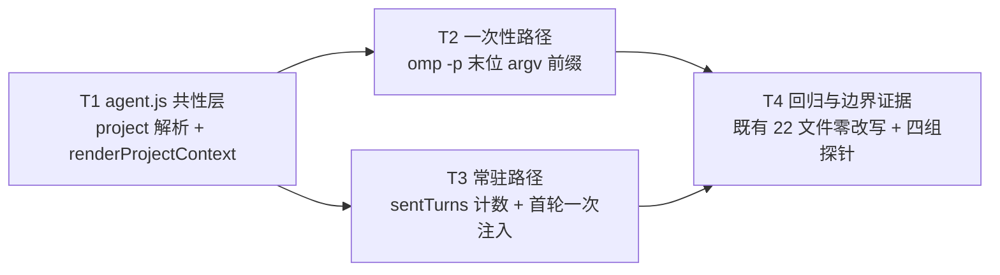

# pr-001-project-context-injection — 任务图（阶段 5 planner 产物）

**输入**：`prs/pr-001-project-context-injection.md`（7 条验收）+ `architecture.md` §4.1（T-08 字段形态）/ §4.2（T-04 注入时机与模块归属）/ §4.3（T-12 措辞即契约）/ §8.2⑥ / §8.4（E5 / E9 观测面）/ §9（不改语义清单）/ §10.3（L2-7 / D-04）/ §11（R-3）/ §12（最小性）+ `prd/F06-dispatch-payload-project-context.md` / `prd/F07-context-content-and-injection.md`
**输出**：4 个任务的有向无环图（无环已核）＋ 每条的验收标准、前置依赖、优先级、验证方法
**文件范围（本 PR 只允许改这两个文件）**：`oamp/src/agent.js`、`oamp/src/context-pool.js`。`oamp/test/**` 与其余一切文件**零改动**——本 PR **不含投递端**（`web.js` 仍不产出 `payload.body.project`，投递端 = pr-002），故既有 22 个测试文件的载荷不含 `project`、注入不被触发、断言逐字成立。
**口径**：每条验收标准均可追溯到 PR 卡验收项 / architecture 章节 / prd 卡（逐条标注在括号内）；`[model_inferred]` 共 1 条，见文末「追溯与自查」。
**粒度**：4 个任务全部落在「1-2 天 + 可独立验收 + 验收判据可回答通过/不通过」范围内（本 PR 是两文件、约 30 行的内容层扩展，不再往细拆——更细的切分会产出"无施加点即不可观测"的任务）。

---

## 依赖图



**无环**（拓扑序：T1 → T2 / T3 → T4）。**最长依赖链**：T1 → T2 → T4 与 T1 → T3 → T4（各 3 跳）。
**关键路径任务**：T1、T4（T2 与 T3 分属两个文件、可并行）。**无循环依赖，无需上报。**

---

## T1 · agent.js 共性层：`payload.body.project` 解析 + `renderProjectContext` 唯一渲染点

**一句话描述**：在 `parseTaskBody` 的两条 LLM 分支上解析可选 `project`（非法即视为未携带、不拒收任务），并提供模块级唯一渲染点 `renderProjectContext`，除渲染外不产生任何注入效果。
**前置依赖**：无
**优先级**：P0

**交付物**：`oamp/src/agent.js` 的 `parseTaskBody`（`executor === 'omp'` 与 `'omp-daemon'` 两分支，约 :60 / :100）＋ 模块级函数 `renderProjectContext(project)`。

**验收标准**

1. **解析三要素**：`body.executor === 'omp'` 与 `'omp-daemon'` 两分支均把合法 `project` 落到 `task.project = { name, repo_url, agreement }`，三要素逐字取自载荷（不拼接、不重写、不补默认值）——（PR 验收 1；arch §4.1 T-08；F06 验收 1、F06「架构落地」段「两条 LLM 路径的装配点」）。
2. **三形态不改变既有裁决**：`project` 缺失 / `null` / 非对象（字符串、数组、数字、布尔）/ 三要素缺任一 / 要素非字符串 / 要素为空字符串 ⇒ 一律视为"未携带"（`task.project = null`），**任务照常执行、不拒收**（体例同既有 `label`：`typeof body.label === 'string' ? label : null`）——（PR 验收 2；arch §4.1「可选字段：缺失 / 非对象 / 字段不合法 ⇒ 一律视为『未携带』，不拒收任务」、§10.2 L2-7）。**"合法"的判据 = 三要素均为非空字符串 —— `[model_inferred]`**（arch 未定义"字段不合法"的判据，见文末）。
3. **shell 分支零变化**：无 `executor`（或非两条 LLM 值）时解析产物与今日**逐字相同**——`{ executor:'shell', command, args, timeoutMs, label }`，**不含 `project` 键**——（PR 验收 6；arch §3.3「shell 分支（`!` 开头）载荷逐字不变」、§9 不改清单；F06 验收 3；N13）。
4. **既有拒绝判据与顺序零变化**：`payload.content_type !== 'application/json'`、非法 JSON、非对象 body 的拒收；`omp` 分支的「非空 prompt → timeout_ms 区间」；`omp-daemon` 分支的「非空 chat_id → 非空 prompt → model 形态 → timeout_ms 区间」——判据内容、顺序、`reason` 文案逐字不变——（PR 验收 6；arch §9「既有 11 条 API…其余零改动」；F09 验收 1）。
5. **渲染点输出逐字**：模块级函数 `renderProjectContext(project)` 的输出为固定 4 行，行序固定、以 `\n` 连接：

   ```
   【项目上下文】
   - 项目名：<name>
   - 仓库地址：<repo_url>
   - 工作约定：<agreement>
   ```

   ——（PR 验收 1；arch §4.2「渲染模板（`agent.js`，唯一渲染点）」；F07 验收 1）。
6. **唯一真源不被复制**：`agent.js` 内不出现约定文本字面量（`本项目的工作约定（相对约定，不涉及任何本机路径）…`）、不出现 `PROJECT_AGREEMENT` 标识符、不 `import` / 不 `require` `web.js`（`agreement` 只来自载荷）——（PR 验收 1；arch §4.3「文本存放：`web.js` 的模块级常量 `PROJECT_AGREEMENT`…**唯一真源**，不复制进 `agent.js`」；F07 验收 4）。
7. **纯函数**：无 IO、无时间 / 随机 / env / 模块级可变状态读取；同输入同输出（arch 措辞「模块级纯函数」）——（PR 验收 1；arch §4.2）。
8. **内容边界由结构保证**：渲染结果只含载荷传入的三要素字符串，不追加任何本机路径、盘符、主机名，也不追加"自动 clone / 已对齐目录 / 已进入项目根目录"一类表述——（F07 验收 2/7；arch §4.3；N3 / N14 / C-4）。

**验证方法**：`cd oamp && npm test`（既有 22 个测试文件零改写、全绿 ⇒ 第 2/3/4 条的"不改变既有裁决"有回归证据）；临时目录探针直投 `task.request`（`executor:'omp'`，分别带 `project: undefined / null / "x" / [] / {name:1} / {name:'a'} / {name:'a',repo_url:'b'} / 合法三要素`）⇒ 任务终态均为 `completed`（除非 prompt/超时等既有判据独立触发），无一条因 `project` 被拒收；`grep` 核对 `oamp/src/agent.js` 无 `PROJECT_AGREEMENT`、无 `web.js` 导入、无 `【项目上下文】` 之外的约定文本字面量。**注入效果**（前缀是否真的进入模型可见文本）由 T2 / T3 的观测面复核，本任务不单独断言。

---

## T2 · 一次性路径：`omp -p` 末位 argv 前缀

**一句话描述**：`runOmpTask` 组装 argv 时，载荷携带项目上下文则把渲染块以 `\n\n` 前缀置于末位 prompt 参数，未携带则末位逐字等于原文。
**前置依赖**：T1
**优先级**：P0

**交付物**：`oamp/src/agent.js` 的 `runOmpTask` argv 组装处（今日 `args.push(task.prompt)`，`:173`）——唯一改动点。

**验收标准**

1. **携带即注入**：载荷携带合法 `project` ⇒ `omp -p` 的**末位 argv** = `renderProjectContext(project)` + `"\n\n"` + `task.prompt` 原文，即 `args.push(projectContext ? \`${projectContext}\n\n${task.prompt}\` : task.prompt)`——（PR 验收 3；arch §4.2「施加方式」、§10.3 D-04；F06 验收 2）。
2. **未携带即原文**：缺失 / 非法 `project` ⇒ 末位 argv **逐字等于** `task.prompt`（无前缀、无前导空行、无多余 `\n`）——（PR 验收 2/3；arch §4.1「未携带即不注入」、§4.2「未携带 `project` ⇒ 不注入（prompt = 原文）」）。
3. **每次派发都注入**：同一 `(chat_id, agent_id)` 连续两次一次性派发且均携带 `project` ⇒ 两次的末位 argv 都带前缀（该路径 `--no-session`，无累积状态）——（PR 验收 3；arch §4.2「一次性路径注入频率 = 每次派发都注入」；F07「架构落地」段）。
4. **argv 其余元素与顺序逐字不变**：`-p`、`--no-session`、`--no-tools`（tools off 时）、`--model <m>`（解析到模型时）、`--append-system-prompt <roleFile>`（有角色文件时）、`--approval-mode yolo|always-ask`（tools on 时）的位置与取值不变；二进制来源仍是 `OMP_BIN()`、`spawn` 的 stdio / 超时 / 输出回流逐行逻辑零改写——（PR 验收 6；arch §9 不改清单；F09 验收 1）。
5. **既有观测面保持原文**：`logger.event('TASK_STARTED', { label })` 的 `label` 与 `sendUpdate('working', { event:'started', executor:'omp', prompt: task.prompt.slice(0,500) })` 的 prompt 摘要**均不含**项目块——（PR 验收 6；arch §4.2 末条「`sendUpdate(…)`、`logger.event('TASK_STARTED', …)`、`task.label` 均保持原文」；F09 验收 1）。

**验证方法**：直投 `task.request`（`executor:'omp'` + 合法 `project`）到 agent 实例，`OAMP_OMP_BIN` 指向 fake omp 并设 `FAKE_ACP_ARGS_LOG` ⇒ 读 argv 记录核对末位逐字；再直投不带 `project` 的同类载荷 ⇒ 末位逐字等于原文（探针脚本落临时目录，不落仓库）。既有 `npm test` 全绿（本 PR 无投递端 ⇒ 既有载荷不含 `project` ⇒ 末位仍是原文，`oamp/test/web.test.js:557` 一类既有断言在本 PR 不发生语义变化）。

---

## T3 · 常驻路径：`sentTurns` 计数 + 会话首个成功送达轮次一次注入

**一句话描述**：`ContextSession` 增"已成功送达轮次数"与可选 `projectContext` 参数，`_pump()` 在该会话首个成功送达轮次前置于实发文本一次；`runDaemonTask` 把渲染块随轮次下传，首参仍是用户原文。
**前置依赖**：T1
**优先级**：P0

**交付物**：`oamp/src/context-pool.js` 的 `ContextSession`（构造函数 :112 / `prompt()` :144 / `_pump()` :165）；`oamp/src/agent.js` 的 `runDaemonTask`（:294 处 `session.prompt(...)` 装配）。

**验收标准**

1. **计数器**：`ContextSession` 构造函数增 `this.sentTurns = 0`（本会话已"成功送达"的轮次数），语义为**只增不减**、不参与任何调度判定——（PR 验收 4；arch §4.2「常驻路径的实现契约」；F07「架构落地」段）。
2. **可选参数**：`prompt(text, { model, timeoutMs, onChunk, origin, projectContext = null } = {})` 多收 1 个可选参数，并随队列项入队——（PR 验收 4；arch §4.2 实现契约）。
3. **`_pump()` 判定**：在 `client.prompt` 之前 `const text = this.sentTurns === 0 && turn.projectContext ? \`${turn.projectContext}\n\n${turn.text}\` : turn.text;`，实发该 `text`；`this.sentTurns += 1` **只在 `client.prompt` 成功返回之后**执行——（PR 验收 4/5；arch §4.2 实现契约）。
4. **不消费名额的路径**（下一个真正送达的轮次补上项目上下文）：`context_busy`（队列满 8，入队即拒）/ `model_unavailable`（`session/prompt` 之前失败）/ 会话崩溃（`context_crashed`，含排队轮次一并被拒）——（PR 验收 5；arch §4.2 边界口径；F07「架构落地」段；E5 在这些路径上仍成立）。
5. **`permission_denied` 不新增状态机**：该轮 prompt 已送达、结算时才抛 ⇒ `sentTurns` 不增、块可能重复出现一次；`_failSession()` 的轮次级错误判定集合（`model_unavailable` / `context_busy` / `permission_denied` 不收尾）逐字不变，不得为这个罕见分支加分支——（PR 验收 5；arch §4.2 边界口径、§11 R-3）。
6. **首轮一次 / 重建重注**：同一 `(chat_id, agent_id)` 连续两轮携带 `project` ⇒ 第 1 轮实发文本 = 块 + `\n\n` + 原文、第 2 轮实发文本 = 原文；会话被释放 / 崩溃 / LRU 淘汰后重建 ⇒ 新 `ContextSession` 重新注入一次（`sentTurns` 归零是新建构造的自然结果，无额外代码）——（PR 验收 4；arch §4.2「注入频率」、§4.2 边界口径；F07 验收 4/5 的架构落地）。
7. **未携带轮次的计数**：`projectContext` 默认 `null` 时实发文本 = 原文；`sentTurns` 仍随成功送达自增（计"轮次"而非"注入次数"）⇒ 首轮未携带、后续携带时按代码片段**不再注入**——（PR 验收 4；arch §4.2 代码片段直译，非扩展）。
8. **装配点 `runDaemonTask`**：`session.prompt(task.prompt, { model, timeoutMs: task.timeoutMs, origin, onChunk, projectContext })`——首参为**用户原文**（前缀由 `ContextSession` 施加，`agent.js` 只渲染不施加在原文上）、`projectContext` = 合法 `project` 的渲染块或 `null`——（PR 验收 4；arch §4.2「施加方式」；F07 验收 4；E9）。
9. **上下文池语义零变化**：键 `(chat_id, agent_id)` / 同键 FIFO 串行（单 in-flight）/ 队列上限 `QUEUE_LIMIT = 8` / 异键并发 / LRU 淘汰 / `dispose()` 与 `_failSession()` 的调度判定**逐字不变**（本次只增"一个只增不减的计数 + 一个可选参数"）——（PR 验收 6/7；arch §4.2「键 / 队列 / 并发 / 淘汰语义零变化」、§9；N9；F06 验收 6）。
10. **既有上报面零变化**：`runDaemonTask` 的 `task.result` 成功体（`state/text/model/context_id/pid/stop_reason/duration_ms/exit_code`）与失败体（`error/text/model/context_id/pid/duration_ms`）、`logger.event('TASK_STARTED')`、`sendUpdate('working', { event:'started', executor:'omp-daemon', chat_id, model })` 逐字不变——（PR 验收 6；arch §4.2 末条、§9；F09 验收 1）。

**验证方法**：直投 `task.request`（`executor:'omp-daemon'` + 合法 `project`）到 agent 实例，fake ACP 把 `session/prompt` 文本回显为 `收到：<prompt>` ⇒ 第 1 轮回显含 `【项目上下文】` 与 `repo_url`、第 2 轮回显 = 原文；`FAKE_ACP_UNKNOWN_MODEL` 制造 `model_unavailable` 后下一轮仍带前缀；同键并投 9 轮触发 `context_busy`（第 9 轮被拒）后下一成功轮仍带前缀；`context-pool.js` 的 `release()` 或 `OAMP_CONTEXT_MAX=1` 制造淘汰后重建 ⇒ 重新注入。既有 `npm test` 全绿。

---

## T4 · 回归与边界证据（既有 22 文件零改写 + 四组探针）

**一句话描述**：以"既有测试全绿 + 直投 payload 的四组探针"给出本 PR 全部验收标准的可核对证据，且不在仓库内新增 / 修改任何文件。
**前置依赖**：T2、T3
**优先级**：P0

**交付物**：验证证据（探针脚本落临时目录，**不落仓库**；本任务不产生仓库内文件变更）。

**验收标准**

1. **既有面零改写**：`cd oamp && npm test` 全绿；`git diff --stat` / `git status --short` 只含 `oamp/src/agent.js` 与 `oamp/src/context-pool.js`——`oamp/test/**`（22 个测试文件）、`oamp/web/**`、`oamp/src/web.js`、`oamp/src/persist.js`、`oamp/API.md`、`oamp/llms.txt`、`oamp/README.md` 与 `docs/**` 零改动——（PR 验收 6；arch §8.2⑥；PR 文件「文件范围」）。
2. **未携带 `project` ⇒ 既有行为逐字不变（双向证据）**：既有测试全绿（既有载荷均不含 `project`）+ 探针直投无 `project` 的 `omp` / `omp-daemon` payload ⇒ argv 末位与 `session/prompt` 文本逐字等于原文——（PR 验收 2/6；arch §4.1「载荷向后兼容」、§4.2「未携带 `project` ⇒ 不注入」）。
3. **E5 观测面（传达可核对）**：一次性路径 = `FAKE_ACP_ARGS_LOG` 记录的 argv 末位含 `repo_url` 字符串；常驻路径 = fake ACP 回显的 `session/prompt` 文本（`收到：<prompt>`）含 `repo_url`；两条路径**只判"仓库地址字符串出现"**，不判 agent 是否真的 clone——（PR 验收 3/4；arch §8.4 E5①②③；F07 验收 5；C-4）。
4. **边界与重建证据**：`context_busy` / `model_unavailable` / 会话崩溃三条路径后，下一个成功送达轮次带前缀；第 2 轮不带；会话释放 / 淘汰后重建 ⇒ 重新注入——（PR 验收 4/5；arch §4.2 边界口径）。
5. **简报外零改动 / 协议面 / 上下文池语义**：`task.label`、`logger.event('TASK_STARTED')`、`task_update.started` 的 prompt 摘要均保持原文；`agent↔router` 方法面仍为既有 7 个（本 PR 两文件不含方法面改动，`transport.test.js` / `delivery-contract.test.js` 全绿）；上下文池的键 / FIFO / 上限 8 / LRU / 并发语义不变（`context-pool.test.js` 零改写且全绿）——（PR 验收 6/7；arch §9；F06 验收 5/6；N8 / N9；E7）。
6. **零依赖**：`oamp/package.json` 未改动（`dependencies === {}`，`hygiene.test.js` 通过）——（共享事实；arch §6.3 零依赖锁）。

**验证方法**：`cd oamp && npm test`；`git diff --stat` / `git status --short`；临时目录四组探针脚本（① 一次性 argv 末位 ② 常驻回显含首轮 / 次轮 / 重建 ③ 边界三路径 ④ 无 `project` 对照）。**本任务不新增仓库内测试文件**——测试面归属见文末「疑问/越界」第 4 条。

---

## 追溯与自查

| PR 卡验收项 | 承载任务 |
|---|---|
| 1 唯一渲染点 + `payload.body.project` 解析（只渲染不复制） | T1（1、5、6）+ T2/T3（观测复核） |
| 2 三种形态不改变既有裁决（合法注入 / 缺失 / 非对象 / 字段非法 ⇒ 未携带且任务照常） | T1（2、3、4）+ T4（证据 2） |
| 3 一次性路径末位 argv（携带 = 前缀 + 原文；未携带 = 原文） | T2（1、2、3）+ T4（证据 3） |
| 4 常驻路径首个成功送达轮次注入一次；重建后重新注入 | T3（1、2、3、6）+ T4（证据 4） |
| 5 `context_busy` / `model_unavailable` / 崩溃不消费名额 | T3（3、4、5）+ T4（证据 4） |
| 6 未携带时既有行为逐字不变；既有 22 个测试文件零改写且 `npm test` 全绿 | T4（1、2、5） |
| 7 协议方法面仍 7 个；上下文池键 / 串行 / 上限 / LRU / 并发语义不变 | T3（9）+ T4（5） |

- **`[model_inferred]` 验收标准（共 1 条，待主 agent 确认）**：T1 第 2 条的"合法"判据取 **`project` 为对象且 `name` / `repo_url` / `agreement` 三要素均为非空字符串**。arch §4.1 只写「缺失 / 非对象 / 字段不合法 ⇒ 一律视为『未携带』」，未定义"字段不合法"的判据；此判据的推导依据是 arch §4.2 的渲染模板逐行取三要素（缺失或空值会渲染出空取值行）与 F06「三要素齐备」的表述。**不自我宣布生效。**
- **循环依赖**：无（依赖图见上，无环）。
- **架构信息不足导致的阻塞**：无——§4.1 / §4.2 / §4.3 已给出字段形态、渲染模板、施加方式、注入频率与边界口径，可直接施工。
- **粒度自查**：T1（共性层：解析 + 渲染，两处 `parseTaskBody` 分支 + 1 个模块级函数）/ T2（1 行 argv 组装的语义扩展）/ T3（2 行状态 + 1 个可选参数 + 装配点）/ T4（证据）——均满足「1-2 天 + 验收判据可回答通过/不通过」；未再细分（更细会产出不可独立观测的任务：单独落 `sentTurns` 计数无施加点即无观测面）。
- **不做架构补充**：任务图未引入 arch 之外的任何技术决策；两文件范围内零新增文件、零新增导出面变化（是否具名导出 `renderProjectContext` 不作验收判据，不影响任何 arch 约束）。

---

## 疑问/越界（上报主 agent）

1. **`[model_inferred]` 判据**：T1 第 2 条的"合法 = 三要素均非空字符串"，见上，请主 agent 确认；若改为"三要素均为字符串（允许空串）"，T1 的探针矩阵与 T3 的注入判据需同步调整（`agreement: ''` 会成为"合法但渲染出空行"的输入）。
2. **直译口径（非扩展，备案用）**：`sentTurns` 计**所有**成功送达轮次 ⇒ 同一会话若首轮未携带 `projectContext`，后续携带的轮次也不注入（arch §4.2 代码片段的直接含义）。投递端 pr-002 落地后，两条 LLM 分支在同一次请求中共用同一 `project` 对象，实际不会出现"首轮无、次轮有"的时间差；该口径只在直投 payload 的探针里可见，不构成架构冲突。
3. **与 pr-002 的接口面**：本 PR **只读** `payload.body.project`，**不产生**该字段（投递端 = pr-002；`web.js` 的 `PROJECT_AGREEMENT` 常量与两条 LLM 分支装配在 pr-002）。因此凡"经 web 端到端看到注入"的判定必须在 pr-002 合入后成立；本 PR 的一切注入证据一律走**直投 payload**（arch §8.4 E5③ 的 harness 观测面）。PR 卡已就此写明"投递端在 pr-002，故合入后既有 22 个测试文件零改写且全绿"。
4. **新能力测试的归属（超出本 PR 文件范围的请求）**：本 PR 卡的文件范围只有 `oamp/src/agent.js` 与 `oamp/src/context-pool.js`，`oamp/test/**` 不在其内；F06 / F07 的新断言按 arch §8.1 落在 `oamp/test/project-workspace.test.js`（pr-004 的文件范围），既有测试文件的载荷观测断言改写落在 pr-002（§8.2 ②④）。因此本 PR 的验收证据 = **既有全绿 + 临时探针（不落仓库）**。若主 agent 要求"本 PR 的新能力必须带仓库内测试证据"，需要调整测试文件归属或本 PR 文件范围——**这超出本任务图的授权，请主 agent 裁决**；planner 不自行扩范围。
