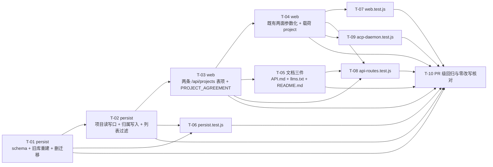

# pr-002-project-data-and-http — 任务图（阶段 5 planner 产物）

**输入**：`prs/pr-002-project-data-and-http.md`（9 条验收）+ `architecture.md` §2（数据模型与 DDL / 旧结构检测重建 / 删除 `MIGRATIONS`）/ §3（两条新面 + `/api/chats` 必填 `project_id` + `/api/messages` 归属校验）/ §4.1 §4.3（载荷 `project` 三要素与约定文本）/ §6（登记元数据 + 派生产物 + 三条漂移锁 + 错误文案与码）/ §7.3 §7.4（聚合 SQL 与对话列表构造）/ §8.1~§8.3（新断言落 pr-004；既有变更面与「零改写」可核对口径）/ §9（不改语义清单）/ §10.3（L2-2 / L2-8 / D-01~D-04）/ §11（R-2 / R-5）+ `prd/F01` `F02` `F03` `F06` `F08` `F09` `F10`
**输出**：10 个任务的有向无环图（无环已核）＋ 每条的验收标准、前置依赖、优先级、验证方法
**文件范围（本 PR 只允许改这 9 个文件）**：`oamp/src/persist.js`、`oamp/src/web.js`、`oamp/API.md`、`oamp/llms.txt`、`oamp/README.md`、`oamp/test/persist.test.js`、`oamp/test/web.test.js`、`oamp/test/api-routes.test.js`、`oamp/test/acp-daemon.test.js`。**其余 18 个测试文件**（含 `test/api-pages.test.js` / `test/context-pool.test.js` / `test/hygiene.test.js`）与 `oamp/web/**`、`oamp/src/agent.js`、`oamp/src/context-pool.js`、`oamp/package.json` **零改动**（`docs/**` 的迭代产物——含本任务图——不属于 PR 的代码交付面，PR 的 `git diff` 不含 `docs/`）。
**非目标（本 PR 不做）**：`oamp/test/project-workspace.test.js` 的新能力断言（arch §8.1，归 **pr-004**）；F04 / F05 的前端节点与调用点（归 pr-003，**已合入基线**）；`agent.js` / `context-pool.js` 的注入实现（归 pr-001，**已合入基线**）；项目删除 / 改名 / 分页 / 搜索 / 排序 / 归属一致性校验 / 迁移表 / 备份（arch §9 §12 的「不引入」清单）。
**口径**：每条验收标准均可追溯到 PR 卡验收项 / architecture 章节 / prd 卡（逐条标注在括号内）；`[model_inferred]` 共 6 条，见文末「追溯与自查」。**反证事实（本次实测核对，见文末「与 PR 卡/arch 的出入」）**：§8.2 标题的「3 个文件」实为 **4 个**；§8.2②(d) 的观测断言清单需按代码实际收缩为 5 处（`web.test.js:443/546/549/557/943`）+ `acp-daemon.test.js:411`；§8.2①(c) 需补 `listChats` 的 **7 处无参调用**（PR 卡写 5 处）。

---

## 1. 任务一览

| ID | 一句话描述 | 前置依赖 | 优先级 | 落点文件（行锚点） |
|---|---|---|---|---|
| T-01 | persist 数据模型落地：`projects` 表 + `chats.project_id` 列序契约 + 旧结构检测删库重建 + 删除 `MIGRATIONS`/`migrate()` | 无 | P0 | `oamp/src/persist.js`（`SCHEMA`:12、`MIGRATIONS`:42、`migrate()`:47、`openDb()`:153） |
| T-02 | persist 项目读写口 + 归属写入必填 + 列表项目过滤（含 `readRequiredString`） | T-01 | P0 | `oamp/src/persist.js`（`CHAT_COLUMNS`:60、`LIST_WITH/LIST_FROM`:63、`insertInput`:225、`listChats`:280、返回对象面） |
| T-03 | web 登记两条 `/api/projects` 表项（末位 12/13）+ `PROJECT_AGREEMENT` 唯一真源常量 | T-02 | P0 | `oamp/src/web.js`（常量区:38、`routes` 末位:699~713） |
| T-04 | web 既有两面项目维度参数化：`/api/chats` 传 `project_id`、`/api/messages` 新建归属校验与派发载荷 `project` | T-02、T-03 | P0 | `oamp/src/web.js`（`/api/chats` handler:344、`/api/messages` handler:600、`payloadBody`:667） |
| T-05 | 文档三件同 PR：`API.md`（锁③ + D-03）/ `llms.txt`（既有脚本重生成，锁②）/ `README.md`（D-03） | T-03 | P0 | `oamp/API.md`、`oamp/llms.txt`、`oamp/README.md` |
| T-06 | `persist.test.js` 机械变更（schema / 旧库断言语义反转 / 建行与列表调用点补参） | T-01、T-02 | P0 | `oamp/test/persist.test.js` |
| T-07 | `web.test.js` 机械变更（列表与新建路径补参 / 派发载荷观测断言改写） | T-04 | P0 | `oamp/test/web.test.js` |
| T-08 | `api-routes.test.js` 机械变更（登记面计数 11→13 / 投影 danger 5→6 / 调用点补参） | T-03、T-04、T-05 | P0 | `oamp/test/api-routes.test.js` |
| T-09 | `acp-daemon.test.js` 机械变更（调用点补参 / 一次性回显断言改写） | T-04 | P0 | `oamp/test/acp-daemon.test.js` |
| T-10 | PR 级回归与「零改写」核对（`npm test` 全绿 + 逐 hunk 归类 §8.3 四类形态） | T-01~T-09 | P1 | 无仓库内文件变更（证据任务） |

---

## 2. 依赖图

**无环**（拓扑序：T-01 → T-02 → T-03 → {T-04, T-05} → {T-06, T-07, T-08, T-09} → T-10）。**无循环依赖，无需上报。**
**最长依赖链（5 跳 / 6 节点）**：`T-01 → T-02 → T-03 → T-04 → {T-07 | T-08 | T-09} → T-10`；旁路 `T-01 → T-02 → T-03 → T-05 → T-08 → T-10`（同长度）。
**关键路径任务**：**T-01、T-02、T-03、T-04、T-10** 与 {T-07 | T-08 | T-09} 中的任一（T-03 无法与 T-04 并行——T-04 依赖 T-03 的 `PROJECT_AGREEMENT` 与登记面；T-05 / T-06 不在这条链上，可与 T-04 并行）。
**串行约束说明**：T-01 / T-02 同改 `persist.js`，T-03 / T-04 同改 `web.js` —— 同文件两任务**必须按依赖顺序执行、不得并发编辑**；T-07 / T-08 / T-09 分属三个不同测试文件，T-05 只碰文档，**可并行**。

---

## 3. 任务详情

### T-01 · persist 数据模型落地（新 schema + 旧结构重建 + 删除迁移机制）

- **一句话描述**：把 `persist.js` 的 `SCHEMA` 换成 `projects` 表 + `chats.project_id NOT NULL REFERENCES`（第 2 列）+ 项目索引，把 `openDb()` 的「缺列补列」换成「旧结构判出即删库重建」，并删除 `MIGRATIONS` / `migrate()`。
- **前置依赖**：无
- **优先级**：P0
- **交付物**：`oamp/src/persist.js` 的 `SCHEMA`（:12）、新增模块级 `isLegacyChats(db)`、重写 `openDb()`（:153）；删除 `MIGRATIONS`（:42）与 `migrate()`（:47）。

**验收标准**

1. `SCHEMA` 含 `projects` 表，列与约束逐字照 arch §2.1：`project_id TEXT PRIMARY KEY` / `name TEXT NOT NULL` / `repo_url TEXT NOT NULL UNIQUE` / `created_at INTEGER NOT NULL`；建表语句仍为 `CREATE TABLE IF NOT EXISTS`〔arch §2.1；F01 架构落地 T-01；F08 架构落地 T-02〕。
2. `chats` 的列集与列序 = `['chat_id','project_id','title','agent_id','state','created_at','updated_at','closed_at','archived_at','context_released']`（**10 列**；`project_id` 插在 `chat_id` 之后、`NOT NULL REFERENCES projects(project_id)`；既有 9 列相对顺序**逐位不变**）〔arch §2.1「列序契约」；F02 架构落地 T-02；F08 验收 4〕。
3. 新增索引 `idx_chats_project_updated(project_id, updated_at DESC)`；既有 `idx_messages_chat_time` / `idx_chats_updated` 与 `messages` 表定义**逐字不变**〔arch §2.1；F03 架构落地 T-01〕。
4. `CHAT_COLUMNS`（:60）与 `MESSAGE_COLUMNS`（:61）两个常量**逐字不变**（`project_id` **不进** `CHAT_COLUMNS`）〔arch §2.3「**不改**：`CHAT_COLUMNS` / `MESSAGE_COLUMNS`」、§10.2 L2-2；F02 架构落地 T-01〕。
5. 旧结构判据（唯一真源）：新增 `isLegacyChats(db)` = `pragma_table_info('chats')` **有行 且 列名不含 `project_id`**；`chats` 表不存在（首次运行 / 删库后）⇒ 0 行 ⇒ **非旧结构**〔arch §2.2「旧结构判据」；F08 架构落地 T-02、F08 验收 1/5〕。
6. 重建动作粒度：判为旧结构 ⇒ `db.close()` → `rmSync(dbPath, { force: true })` → `new DatabaseSync(dbPath)`；**只删主库文件本体**（不删 `-journal`、不做 `DROP TABLE`、不清空行、不做备份）；检测发生在本次已成功 open 之后〔arch §2.2 动作粒度；F08 架构落地 T-02、F08 验收 2/3/6〕。
7. 重建后的库面：`PRAGMA foreign_keys = ON` 与 `exec(SCHEMA)` 在**重建后的连接**上执行；新库列集 = 标准 2（10 列）、`projects` 表存在、`getChat('chat-old') === null`、`chats` / `messages` 两表行数 0〔arch §7.2；F08 验收 2/3〕。
8. 非旧结构不重建：已是新结构的库再次 `openDb` 不重建、既有数据保留；删库文件后重开 = 新建空库且可用（`CREATE … IF NOT EXISTS` 幂等）〔arch §2.2；F08 验收 5〕。
9. `MIGRATIONS` / `migrate()` **已删除**且无替代补列路径：`grep -nE 'MIGRATIONS|migrate\(' oamp/src/persist.js` 零命中；不存在按列存在性 `ALTER TABLE chats` 的代码〔arch §2.2「删除 `MIGRATIONS` + `migrate()`（T-03）」；F08 架构落地 T-03、F08 验收 6〕。
10. **D-02（主 agent 已裁定采纳）**：判为旧结构并执行重建时，向 stdout 打印**一行**告知（含库路径）；不改变 `WEB_READY` 就绪行、不新增日志体系、不改变既有 stdout 面〔arch §10.3 D-02〕。**[model_inferred]** 精确形态取 `DB_REBUILT path=<dbPath>`（arch 只给「如 `DB_REBUILT path=…`」的示例）——见 M1。
11. `openDb()` 的既有不变量逐字不变：目录 `mkdirSync(dirname, { recursive: true })`、返回句柄的既有方法面（`insertInput` / `insertOutput` / `upsertChat` / `closeChat` / `renameChat` / `archiveChat` / `activateChat` / `listArchivable` / `startupSweep` / `listChats` / `getChat` / `close`）与方法体语义（except 标准 2/3 的结构面）逐字不变〔arch §1.1、§2.2；F09 验收 1〕。

**验证方法**：临时目录（**不得写 `oamp/data/`**）四形态探针，用 `node:sqlite` 直读核对：① 7 列旧库 → `openDb` 后列集 10 列 + `projects` 存在 + 旧行消失 + 两表行数 0 + stdout 含重建行；② 9 列旧库（缺 `project_id` 但有 `archived_at` / `context_released`）同 ①；③ 新结构库 → 连开两次数据保留、行数不变；④ 删库文件后重开 → 空库可用。`grep -nE 'MIGRATIONS|migrate\(' src/persist.js` 零命中。

---

### T-02 · persist 项目读写口 + 归属写入必填 + 列表项目过滤

- **一句话描述**：给持久层补上项目四个读写口（`createProject` / `listProjects` / `getProject` / `projectByChat`），把 `project_id` 落成两个写口的必填参数，并给 `listChats` / `countChats` 加共用的项目过滤。
- **前置依赖**：T-01
- **优先级**：P0
- **交付物**：`oamp/src/persist.js` 的 `LIST_WITH` / `LIST_FROM`（:63-71）、`ensureChat` / `upsertChat` 语句（openDb 内 `stmts`）、`insertInput`（:225）、`upsertChat` 包装、`listChats`（:280）、新增 4 个函数与 1 个校验函数、返回对象导出面。

**验收标准**

1. `createProject({ repoUrl, name, nowMs })`：`repo_url` 须为 trim 后非空字符串（否则抛错，文案 `需要 repo_url（非空字符串）`）；`project_id` = `prj-<uuid>`（与既有 `chat-<uuid>` 同族）；`repo_url` **trim 后原样入库**（不归一化 `.git` / 尾斜杠 / 大小写 / SSH↔HTTPS）；`name` 缺省 / 空 / 非字符串 ⇒ 派生 = 地址去尾部斜杠取尾段、再去尾部 `.git`，派生为空 ⇒ 兜底用地址原文；`created_at` = epoch ms（含可注入的 `nowMs`）〔arch §2.3、§3.1；F01 架构落地 T-09、F01 验收 1/4/6/7；N6/N1〕。
2. `createProject` 的重复判定沿用既有体例：`INSERT … ON CONFLICT(repo_url) DO NOTHING` + `changes === 0` ⇒ 返回 `null`（**不解析 SQLite 错误文案**）；成功 ⇒ 回读库值并返回 `{ project_id, name, repo_url, created_at }`〔arch §2.3、§3.1、§1.2 E；F01 架构落地 T-09、F01 验收 5〕。
3. `listProjects()`：单条聚合 SQL **逐字**照 arch §7.3（`LEFT JOIN chats` + `COUNT(c.chat_id) AS chat_count` + `MAX(c.updated_at) AS last_activity_at` + `GROUP BY p.project_id` + `ORDER BY p.created_at DESC, p.project_id DESC`）；返回 `[{project_id, name, repo_url, created_at, chat_count, last_activity_at}]`；`chat_count` 含已归档 / 已关闭；无对话项目 `last_activity_at === null`（不是 0、不是缺键）〔arch §3.1、§7.3；F01 架构落地 T-09、F01 验收 2/3；MI-03 / MI-04；F04 验收 5〕。
4. `getProject(projectId)`：命中返回 `{project_id, name, repo_url, created_at}` 单行；未命中 ⇒ `null`〔arch §2.3；F02 架构落地 T-10〕。
5. `projectByChat(chatId)`：`SELECT p.* FROM chats c JOIN projects p ON p.project_id = c.project_id WHERE c.chat_id = ?` 单条语句；未命中 ⇒ `null`；**不改变 `chats` 任何读口的字段面**〔arch §2.3「既有对话的归属读口（**一条语句**）」；F02 架构落地 T-01〕。
6. `insertInput({ chatId, projectId, … })`：`projectId` **必填**（非空字符串；缺失 / 空 / 非字符串 ⇒ 抛错）；`ensureChat` 的 INSERT 列与 VALUES 同址增 `project_id`；`ON CONFLICT(chat_id) DO NOTHING` **保留** ⇒ 既有对话的归属**不可被改写**（免费获得"归属不可变"）〔arch §2.3、§10.2 L2-8；F02 架构落地 T-02；F02 验收 3〕。
7. `upsertChat({ chatId, title, projectId, … })`：同样增 `project_id` 列与参数；`DO UPDATE SET` 的既有集合与 `WHERE chats.state != 'closed'` 守卫**逐字不变**——**不得**把 `project_id` 放进 `DO UPDATE SET`〔arch §2.3；§8.2①(c)；F02 验收 3〕。
8. 读口字段面零变化：`getChat()` 返回的 `chat` **不含** `project_id`（因标准 4 的 `CHAT_COLUMNS` 未变）⇒ `/api/chats` 与 `/api/chats/<id>` 的响应形状与行内字段**逐字不变**〔arch §2.3、§10.2 L2-2；F09 验收 2/3〕。
9. `listChats({ project, q, agent, state, from, to, archived, limit, offset })`：`project` **必填**；缺失（`undefined` / `null`）/ 空串 / 非字符串 ⇒ 抛错，文案**逐字** `查询参数非法: project_id 不能为空（对话列表以项目为范围）`；新增 `readRequiredString(value, 'project_id')` 的抛错体例与既有 `readOptionalString` / `readLimit` **同族**（校验落点在 persist，handler 零新增分支）〔arch §3.2「校验落点」；F03 架构落地 T-06、F03 验收 2；MI-08〕。
10. 过滤构造：`LIST_WITH` 的 CTE 增**第 7 列** `project`（既有 6 列列序与参数位置逐位不变）、`LIST_FROM` 增 `AND c.project_id = p.project`（追加在既有 6 个条件之后）；`listChats` 与 `countChats` **共用 `LIST_FROM`** ⇒ `total` 与 `chats` 同源，绝不出现"列表过滤了、总数没过滤"〔arch §3.2、§7.4；F03 架构落地 T-01、F03 验收 1/4〕。
11. 未知 `project_id` ⇒ 返回空列表（`200`），**不做存在性判定、不抛错**〔arch §3.2「不做存在性判定」、§11 R-5；F03 架构落地〕。
12. 既有查询面逐字不变：`q`（LIKE 转义）/ `agent` / `state` 枚举 / `from`·`to` 与 `from > to` 400 / `archived` 缺省 0 / `limit` 1..200 默认 50 / `offset` 非负、排序表达式 `(CASE WHEN p.archived = 1 THEN c.archived_at ELSE c.updated_at END) DESC, c.chat_id DESC`、返回形状 `{chats, total, limit, offset}` 与行内字段（含 `message_count`）**全部逐字不变**〔arch §3.2、§9；F03 验收 4；F09 验收 1/2〕。
13. 返回对象导出面扩项且既有键名不变：新增 `createProject` / `listProjects` / `getProject` / `projectByChat` 四个键〔arch §2.3；F01 架构落地 T-09〕。

**验证方法**：临时目录探针 + `node:sqlite` 直读：① 建两个项目（`…/demo` 与 `…/demo.git`）⇒ 两条并存且派生名均为 `demo`，`getProject` 往返；② 同地址二次创建 ⇒ `null`；③ 各建 1~2 条对话（含一条已关闭 / 一条已归档）⇒ `listProjects` 的 `chat_count` 含全部、`last_activity_at` = `MAX(updated_at)`、空项目为 `null`、排序 `created_at DESC`；④ `listChats({project})` 只回本项目、`total` 与集合同源、未知 project 空列表、`listChats({})` / `listChats({project:''})` 抛指定文案；⑤ `insertInput` 缺 `projectId` 抛错；`projectByChat` 往返；`getChat()` 的 key 集合不含 `project_id`。

---

### T-03 · web 登记两条 `/api/projects` 表项 + `PROJECT_AGREEMENT` 常量

- **一句话描述**：在既有声明式路由表**末位**追加 `GET` / `POST /api/projects` 两条表项（8 个元数据字段齐备、表序 12/13），并落下派发装配点使用的 `PROJECT_AGREEMENT` 唯一真源常量。
- **前置依赖**：T-02
- **优先级**：P0
- **交付物**：`oamp/src/web.js` 的 `routes` 数组末位两项（`GET /api/docs` 表项之后）、模块级常量 `PROJECT_AGREEMENT`（与 `MODEL_RE`(:38) / `LABEL_MAX`(:39) 同处）。

**验收标准**

1. 两条表项**追加在既有路由表末位**（`GET /api/docs` 之后）：表序 12 = `GET /api/projects`、13 = `POST /api/projects`；`createApiRoutes({}).map(r => \`${r.method} ${r.path}\`)` 的末两位即该二项，前 11 项**顺序逐字不变**〔arch §6.1；F10 架构落地 T-07/T-14〕。
2. 既有 11 条表项的**表序与内文逐字不动**——**不得**给 `/api/chats` 或 `/api/messages` 补 `project_id` 参数元数据项（arch 明写「既有 11 条表项的**表序与内文逐字不动**」；§8.2③(b) 也只改投影条数与 `danger` 计数）〔arch §6.1、§8.2③(b)〕。
3. 8 个元数据字段齐备且取值逐字照 arch §6.1 表格：
   - `GET`：`summary` = `项目列表（含对话数与最近活动时间）`、`params: []`、`response` = `对象 { projects: [{ project_id, name, repo_url, created_at, chat_count, last_activity_at }] }`、`errors: []`、`kind: 'json'`、`docLink: 'API.md#312-get-apiprojects'`；
   - `POST`：`params` = `[{name:'repo_url',in:'body',type:'string',required:true,…}, {name:'name',in:'body',type:'string',required:false,…}]`（每项含 `PARAM_FIELDS` 五个字段且 `required` 为布尔）、`response` = `对象 { project: { project_id, name, repo_url, created_at } }`、`errors: ['INVALID_PARAM','CONFLICT']`、`kind: 'json'`、`docLink: 'API.md#313-post-apiprojects'`
   〔arch §6.1；F10 架构落地 T-07/T-14〕。
4. 漂移锁① 口径自洽：两条表项的 `errors` 取值 ∈ `ERR_CODE` 值集合（`INVALID_PARAM` / `CONFLICT` **都已在封闭枚举内**）、`params[].in ∈ PARAM_IN`、`params[].type ∈ PARAM_TYPES`、`kind ∈ ROUTE_KINDS`、`docLink` 以 `API.md#` 开头、`handler` 是函数〔arch §6.3 锁①、§6.4；F10 验收 3、F10 边界「零改契约」〕。
5. `GET /api/projects` handler：**无参数**（不读 `qs`）、无分页参数、`sendJson(res, 200, { projects: db.listProjects() })`；该接口**自身不产生** 4xx/5xx（`errors: []`，仅全局兜底 502）〔arch §3.1；F01 验收 2；F10 验收 5〕。
6. `POST /api/projects` handler：
   - `await readBody(req)`（畸形 JSON → 400 / 超限 → 413 沿用既有 `readBody` 语义与 `PAYLOAD_TOO_LARGE` 处理）；
   - `repo_url` 缺失 / 空 / 非字符串 ⇒ `sendError(res, 400, ERR_CODE.INVALID_PARAM, '需要 repo_url（非空字符串）')`，**不产生项目**；
   - `createProject(...)` 返回 `null`（重复地址）⇒ `sendError(res, 409, ERR_CODE.CONFLICT, \`项目已存在: ${repo_url}\`)`；
   - 成功 ⇒ `sendJson(res, 200, { project })`；
   - 两种错误的**码与文案逐字**照 arch §6.4，且错误构造点仍是既有 `sendError`（不新增错误分支体系）
   〔arch §3.1、§6.4；F01 验收 4/5/7；F10 验收 5〕。
7. `name` 入参只透传不求值：非字符串 / 空串 / 缺省 ⇒ 交 `createProject` 走派生（**不得**在 web 侧另写一份派生逻辑）〔arch §3.1 请求体表；F01 架构落地 T-09〕**（透传归一 = `typeof body.name === 'string' ? body.name : undefined`，体例同既有 `label`；**[model_inferred]** M3）**。
8. `PROJECT_AGREEMENT` 模块级常量：文本**逐字**等于 arch §4.3 的三句式（含「本项目的工作约定（相对约定，不涉及任何本机路径）：① …；② …；③ …。」三段），**零绝对路径 / 零盘符 / 零主机名**、**零"自动 clone / 已对齐目录 / 已进入项目根目录"表述**；**唯一真源**（不复制进 `agent.js`）〔arch §4.3「文本存放」；F07 验收 1/2/3/7；N3 / N14 / C-4〕。
9. 构造期纯净性不变：`createApiRoutes({})` 仍不读磁盘、不调用依赖、不起定时器（handler 不在构造期执行）；`GET /api/docs` 仍是**请求时投影** `projectRoutes(routes)`、不缓存不预快照〔arch §6.3 锁①、§6.2；F10 验收 1〕。
10. `STATIC_FILES`（:261）与 `/docs` `/debug` 页面**零改动**；**不新增**第三张项目面（不做 `GET /api/projects/:id`，参数解析与文档定位一律走 `GET /api/projects` 的一次性全量列表）〔arch §3.1 末条、§6.2；F10 验收 1；F01 边界〕。

**验证方法**：`node -e "import('./src/web.js').then(m => console.log(m.createApiRoutes({}).map(r => r.method+' '+r.path)))"` 核对 13 条签名与末两位；`node --test test/api-routes.test.js` 的漂移锁① 通过；临时 `OAMP_DB` 起 web + `fetch` 三形态（成功 200 / 缺地址 400 / 重复 409）核对状态码、键集合与文案逐字；`createApiRoutes({})` 的构造期纯净性由漂移锁① 调用即可自证。

---

### T-04 · web 既有两条面的项目维度参数化 + 派发载荷 `project`

- **一句话描述**：让 `GET /api/chats` 把必填 `project_id` 透传给持久层，让 `POST /api/messages` 在"会创建对话"的路径上校验项目归属（插在既有校验之后、写库之前），并给两条 LLM 派发分支装上 `project: {name, repo_url, agreement}`。
- **前置依赖**：T-02、T-03（T-03 提供 `PROJECT_AGREEMENT`）
- **优先级**：P0
- **交付物**：`oamp/src/web.js` 的 `/api/chats` handler（:344）、`/api/messages` handler（:600）、`payloadBody` 装配处（:667）。

**验收标准**

1. `GET /api/chats` handler：调 `db.listChats({...})` 时增 `project: qs.get('project_id') ?? undefined`；handler 内**零新增错误分支**（既有 `try → sendError(400, ERR_CODE.INVALID_PARAM, err.message)` 原样接住 persist 抛出的必填错误）；响应构造与 `sendJson` 逐字不变〔arch §3.2；F03 架构落地 T-06、F03 验收 2〕。
2. `/api/chats` 表项**元数据逐字不变**（见 T-03 第 2 条）⇒ `/api/docs` 投影里该条 `params` 仍为既有 8 项〔arch §6.1〕。
3. `POST /api/messages` 归属判定规则：**本次请求会创建对话**（`db.getChat(chatId) === null`）⇒ `project_id` 必填且必须指向存在项目；**目标对话已存在** ⇒ 沿用既有逻辑，`project_id` 不参与判定〔arch §3.3 判定规则、§10.2 L2-8；F02 架构落地 T-10；F02 边界〕。
4. 新校验的**插入位置**：既有全部校验**之后**、`db.insertInput` **之前**——即 `读体(400/413) → agent_id(400) → 空正文(400) → model(400) → chat_id 解析 → 只读预检(409) → ★新校验(400) → 写库 → 派发`；既有错误路径的触发条件与顺序**逐字不变**〔arch §3.3「插入位置（C-7 顺序契约）」；F02 架构落地 T-10；F02 验收 2〕。
5. 缺 / 空 / 非字符串 `project_id` ⇒ `sendError(res, 400, ERR_CODE.INVALID_PARAM, '新对话需要 project_id（对话必须归属一个项目）')`，且**不产生任何对话**（校验在写库之前 ⇒ `chats` / `messages` 行数不变）〔arch §3.3、§6.4；F02 验收 2；MI-08〕。
6. 指向不存在的项目 ⇒ `sendError(res, 400, ERR_CODE.INVALID_PARAM, \`项目不存在: ${project_id}\`)`——**采用 400，不采用 404**〔arch §3.3、§6.4；F02 验收 4；MI-02〕。
7. 既有对话路径**零追加语义**：请求带既有 `chat_id` 且不带 `project_id` 仍 `200`；带一个与归属不同的 `project_id` 也不报错（不引入"归属一致性校验"）〔arch §3.3、§10.2 L2-8、§11 R-4；F02 边界〕。
8. 派发载荷：**两条 LLM 分支**均含 `project: { name, repo_url, agreement }`（三要素值来自库内项目行；`agreement` = `PROJECT_AGREEMENT` 常量原文）：
   - 一次性分支 = `{ executor: 'omp', prompt, label, model?, project }`；
   - 常驻分支 = `{ executor: 'omp-daemon', chat_id, prompt, label, model?, project }`；
   - 既有键名、键序体例与 `model` 的条件展开（`...(model === null ? {} : { model })`）**逐字不变**〔arch §3.3 派发载荷、§4.1；F06 架构落地 T-08、F06 验收 1/2〕。
9. `project` 的三要素**不含** `project_id`、**不含**任何本地路径 / 盘符 / 主机名〔arch §4.1；F06 验收 1；N3〕。
10. **shell 分支（`text` 以 `!` 开头）载荷逐字不变**：仍是 `{ command: '/bin/sh', args: ['-c', …], label }`，**无 `project` 键**〔arch §3.3「shell 分支载荷逐字不变」；F06 验收 3；N13〕。
11. `messages.text` 仍为**用户原文**：`db.insertInput({..., text})` 的 `text` 与 `publishMessage` 的 `text` 一字不改（`project` 只进载荷）⇒ E9〔arch §8.4 E9、§3.3；F06 验收 4〕。
12. 既有观测面零变化：`label`（`messageText.slice(0, LABEL_MAX)`）、`sendUpdate('working', {event:'started', prompt: …})` 的 prompt 摘要、`logger.event('TASK_STARTED')` **均保持用户原文**，不带项目块〔arch §4.2 末条；F09 验收 1〕。
13. `POST /api/messages` 表项**元数据逐字不变**（不补 `project_id` 参数项）〔arch §6.1〕。
14. 既有非项目相关代码零改写：`readBody` 调用、`agent_id` 的 `@` 前缀兜底、`messageText` 去前缀、`taskId` / `messageId` 生成、`tasks.set` 登记、`sendTask` / `scheduleReconcile` / 失败分支的 `insertOutput` 与 `publishState`、`sendJson` 响应体 `{chat_id, task_id, message_id, warning}` **逐字不变**〔arch §1.1、§9；F09 验收 1〕。

**验证方法**：临时 `OAMP_DB` + 真实 Router/agent harness（或 `fetch` 直打 web）：① 空库发一条不带 `project_id` 的新消息 ⇒ 400 + 指定文案 + `chats`/`messages` 行数不变；② 带未知 `project_id` ⇒ 400 `项目不存在: <id>`；③ 先建项目再发 ⇒ 200 且对话落在该项目；④ 已存在对话不带 `project_id` ⇒ 200；⑤ `GET /api/chats` 不带参数 ⇒ 400 + 指定文案；⑥ `!echo` 消息 ⇒ 载荷无 `project`；⑦ 两条 LLM 分支的载荷含三要素（用既有 fake ACP `FAKE_ACP_ARGS_LOG` / 桩回显间接核对，直投载荷本体的断言归 pr-004）；⑧ 既有 400/413/409 顺序用例（畸形体、超限体、缺 agent、空正文、非法 model、只读 409）逐条复现原状态码与文案。

---

### T-05 · 文档三件同 PR：`API.md`（锁③ + D-03）/ `llms.txt`（锁②）/ `README.md`（D-03）

- **一句话描述**：把两条新面写进 `API.md`（标题 13 条 + 两条表行 + §3.12/§3.13 两小节 + D-03 的示例同步）、用**既有脚本**重生成 `llms.txt` 快照、并按 D-03 补 `README.md` 的 HTTP 表与计数。
- **前置依赖**：T-03（锁②③的验收对象是登记面；`llms.txt` 必须由登记面生成）
- **优先级**：P0
- **交付物**：`oamp/API.md`、`oamp/llms.txt`（脚本产出，**不手改**）、`oamp/README.md`。

**验收标准**

1. `API.md` 的 `## 3. 接口清单（11 条）` → `## 3. 接口清单（13 条）`；清单表增 `| 12 | \`GET /api/projects\` | … |` 与 `| 13 | \`POST /api/projects\` | … |` 两行；既有 `| 1 |` ~ `| 11 |` 行逐字不变〔arch §6.2；F10 架构落地 T-14；F10 验收 2〕。
2. `API.md` 增 `### 3.12 \`GET /api/projects\`` 与 `### 3.13 \`POST /api/projects\`` 两小节，体例照 §3.1~§3.11（参数表 / 成功响应 / 错误表），含**反引号包裹的路径签名**；两处签名即漂移锁③ 的正向覆盖来源〔arch §6.2、§6.3 锁③；F10 验收 2/3〕。
3. `API.md` 内**不得**出现指向未登记路径的反引号签名（例如 \`GET /api/projects/<id>\`、\`DELETE /api/projects\` 一类）——漂移锁③ 是**双向**的（文档集合 ⊆ 登记集合），多写签名会把锁弄红〔arch §6.3 锁③（`docSignatures` 反向断言）；F10 边界「只要求路径行」〕。
4. D-03（主 agent 已裁定采纳）的示例同步：`§2.3 对象字段` 增项目对象（`project` / `projects[]` 的字段面）；`§5` 的示例全部同步到新契约——新增「项目创建 / 列表」的 `curl` 步骤，并在其后所有 `/api/chats` 列表示例与所有"会新建对话"的 `/api/messages` 示例上补 `project_id`（含 §5.2 的三处列表、§5.4 的两个变体与 shell 演示、§5.5 的触发、§5.8 的错误演示）；`§5.10` 最小接入闭环补「创建 / 选定项目」一步〔arch §10.3 D-03 的推荐内容与理由；F10 边界（非卡内要求）〕。
5. **判定**：在一个空的临时库上按 §5 顺序逐条粘贴示例，除文档明确标注为「错误演示」的那些之外**无一处返回 400**（等价静态判据：§5 内每一处 `/api/chats` 列表 curl 与每一处会新建对话的 `/api/messages` curl 都带 `project_id`，或引用的是前文已创建的对话）〔arch §10.3 D-03「§5 示例会**直接 400**，属『文档里查不到 / 写错』的同类问题」〕。
6. `API.md` 的 `§3.2 GET /api/chats` 参数表增 `project_id`（query / string / **必填** / 语义 = 对话列表以项目为范围、缺参与空值均 400）一行；`§3.8 POST /api/messages` 字段表增 `project_id`（body / string / 新建对话时必填）一行〔arch §3.2 / §3.3 的硬契约 + D-03 的同一理由（"文档里查不到"）；**[model_inferred]** M5（D-03 未逐字列出字段表）〕。
7. `llms.txt` 用**既有脚本**重生成、**不手改快照**：`cd oamp && node scripts/gen-llms-txt.mjs`；生成后文件含 `## 接口（13 条）`、清单恰 13 行（含两条新面的 `- <METHOD> <PATH> — 
`），且与 `renderLlmsTxt(projectRoutes(createApiRoutes({})))` **逐字节相等**〔arch §6.2、§6.3 锁②、§1.2 I；F10 架构落地 T-14；F10 验收 1/3〕。
8. `README.md`：HTTP 表增 `GET /api/projects` / `POST /api/projects` 两行（体例与既有行一致，含参数与错误要点）；`GET /api/docs` 行末尾的「11 条」→「13 条」；正文「完整接口清单…（11 条 API + 6 类事件）」→「（13 条 API + 6 类事件）」；既有行的其余文案逐字不变〔arch §6.2；§10.3 D-03；F10 验收 1〕。
9. 三面自动出现、`/docs` 与 `/debug` **零改动**：不改 `web/docs.html` / `web/docs.js` / `web/debug.html` / `web/debug.js`、不改 `STATIC_FILES`、零新增静态资产〔arch §6.2、§9；F10 验收 1/5〕。
10. 既有 11 条的文档语义（方法 / 路径 / 状态码 / 响应体 / 错误文案）逐字保留，不"顺手改进"任何既有文案〔arch §9、§8.3「不允许」列；F09 验收 1；F10 验收 5〕。
11. **不引入** OpenAPI / Swagger 一类第二套规范、不新增规范文件〔arch §12「不引入」；F10 边界〕。

**验证方法**：`cd oamp && node scripts/gen-llms-txt.mjs` 后 `git diff --stat oamp/llms.txt`（只应增 2 行清单 + 1 行标题计数）；`node --test test/api-routes.test.js` 的漂移锁②③ 绿（本任务与 T-08 共同满足）；`grep -n '\`GET /api/projects\`\|\`POST /api/projects\`' API.md` 核对表行 + 小节标题两处来源；按 §5 顺序在临时库粘贴示例（可由 T-10 一并执行）。

---

### T-06 · `persist.test.js` 机械变更

- **一句话描述**：把 `persist.test.js` 的 schema 列集断言、旧库断言（语义反转）与全部建行 / 列表调用点改到新契约上——**只做机械变更，不新增新能力断言**。
- **前置依赖**：T-01、T-02
- **优先级**：P0
- **交付物**：`oamp/test/persist.test.js`。

**验收标准**

1. schema 列集断言（:56）改写为新列集：`chats` = 10 列且 `project_id` 在第 2 位；`messages` 列集逐字不变；并**新增** `pragma_table_info('projects')` = `['project_id','name','repo_url','created_at']` 的核对（同一条断言内扩项，判据强度不降）〔arch §8.2①(a)、§2.1；F09 验收 3③；F01/F02 验收〕。
2. 旧库断言（:73）**语义反转**为三段（原「旧库补两列 / 列序与新建库逐位相同 / 二次运行不变」整条改写）：旧库（7 列）`openDb` ⇒ ① `pragma_table_info('chats')` = 新 10 列且 `projects` 表存在；② 旧行**不存在**（`getChat('chat-old') === null`、`chats` / `messages` 行数为 0）；③ 再次 `openDb` **不触发重建**、新库数据保留；另加「删除库文件后重启 = 新建空库且可用」〔arch §8.2①(b)、§8.3 形态③、F09 架构落地 C-7④；F08 验收 2/3/5；F09 验收 3④〕。
3. 旧库断言的**判据强度不得降低**：仍逐位核对列集、仍核对行数、仍核对二次打开的行为；不得把"旧库被重建"写成"旧库不再报错"一类弱断言，不得删除既有断言句〔arch §8.3「不允许：断言语义放宽、既有断言删除」；F09 验收 2〕。
4. `openTempDb()`（:22）返回 **1 个项目 fixture**（内部先 `createProject` 建一个项目，并把 `projectId` 一并返回）以满足 `chats.project_id` 的 `NOT NULL` + 外键；所有需要建对话的用例经它取用同一 `projectId`〔arch §8.2①(c)、§11 R-2；F02 验收 3〕。
5. **全部建行调用点补 `projectId`**：`insertInput` **45 处**、`upsertChat` **29 处**（实测计数；按调用点逐处核对，不留一处缺参）〔arch §8.2①(c)；§8.3 形态③〕。
6. **全部 `listChats` 调用点补 `project`**：`listChats(` **43 处**，其中 **7 处为无参 `listChats()`**（:48、:52、:231、:351、:423、:640、:684——实测复核；PR 卡写 5 处，见文末出入 3）——项目必填后无参调用同样抛错，**必须逐处补齐**〔arch §8.2①(c)、§8.3 形态③；F03 架构落地 T-06〕。
7. 该文件 diff **只含** §8.3 的第 ③ 类形态（persist 的 schema / 旧库断言 / 建行与列表调用点参数）；**不允许**出现：断言语义放宽、既有断言删除、超时 / 等待策略调整、整文件格式化、"顺手改进"任何文案；不允许触碰与该文件无关的断言〔arch §8.3；F09 验收 2；PR 验收「既有 4 个测试文件的 diff 只含 §8.3 的四类形态」〕。
8. **不新增任何新能力断言**（项目 400 / 409 / 不归一化 / 派生列 / 归属校验等归 `oamp/test/project-workspace.test.js` = pr-004）；`/api/chats` 与 `/api/messages` 在该文件 0 命中，保持 0 命中〔arch §8.1；PR 文件范围〕。
9. `node --test test/persist.test.js` 全绿〔arch §8.4 E8〕。

**验证方法**：`cd oamp && node --test test/persist.test.js`；`git diff --stat test/persist.test.js` 与逐 hunk 归类（T-10 复核）；`grep -oF 'insertInput(' test/persist.test.js | wc -l`（45）、`upsertChat(`（29）、`listChats(`（43）、`listChats()`（0，改动后应为 0）。

---

### T-07 · `web.test.js` 机械变更

- **一句话描述**：给 `web.test.js` 的列表调用与新建消息调用补上 `project_id`，并把 5 处"桩回显 / 末位 argv"观测断言改写成「项目块前缀 + 原文」形态——**只做机械变更，不新增断言**。
- **前置依赖**：T-04
- **优先级**：P0
- **交付物**：`oamp/test/web.test.js`。

**验收标准**

1. 列表调用点补 `project_id`（该文件 `/api/chats` 字符串 70 处）：**详情**调用（`GET /api/chats/<id>`，含 `detailOf` / `sendAndWait` 内部）**零改动**；**列表**调用（`'/api/chats'` 与 `'/api/chats?…'` 形式）**全部**补 `project_id=<fixture>`——含 :313、:370、:445、:519、:1105、:1163、:1229、:1278、:1294、:1595 等无参列表，以及 :343/:347/:351/:354/:356/:359/:362/:365/:367/:372/:375/:378/:382/:386 的带过滤列表〔arch §8.2②(a)、改动量口径；F03 验收 1/4〕。
2. 该文件需要**至少 1 个项目 fixture**：建议在 `setup()`（:244）内 `POST /api/projects` 建一处并把 `projectId` 作为返回值透传给用例（体例同既有 `dbPath` 透传）**（fixture 放置 = **[model_inferred]** M6）**；全部测试对话由此落进同一个项目 ⇒ 既有 `total` / 排序 / 分页期望值**数值不变**〔arch §11 R-2；F03 验收 1/4〕。
3. `POST /api/messages` 新建路径补 `project_id`（该文件 28 处字符串）：**会创建新对话**的调用点（`sendAndWait` 的常规路径、各用例的首轮发送）全部补 `project_id`；**保持逐字不变**的两类：① 显式带**既有** `chat_id` 的调用点（如 :341 的第二轮、:813/:858/:898 的带 chat_id 探针）；② 在项目校验**之前**就会 400/413 的调用点（畸形体 / 超限体 / 缺 `agent_id` / 空正文 / 非法 `model`）——逐条确认并记录〔arch §8.2②(b)、改动量口径、§3.3 顺序契约；F02 验收 1〕。
4. 空值语义与错误面探针保持原义：:386 的 400 组（`limit=0` / `limit=abc` / `limit=201` / `offset=-1` / `state=bogus` / `from=10&to=5`）与 :1541 的错误契约探针（`/api/chats?limit=0` ⇒ 400 `INVALID_PARAM`）补上合法 `project_id`，使断言仍旧**指向该参数自身的非法性**（不被"缺 `project_id`"掩盖）；断言与期望码**不放宽、不改写**〔arch §8.2②(c)、§8.3 形态①；F09 验收 1；见文末出入 4〕。
5. **派发载荷观测断言（前缀 + 原文形态）**——**必然改写 5 处**：
   - 常驻首轮回显：`:443`（`收到：web-contract-check`）、`:546`（`收到：默认路径问题`）、`:943`（`收到：无订阅者`）；
   - 一次性回显：`:549`（`one-shot answer: 一次性问题`）；
   - 一次性末位 argv：`:557`（`a[a.length - 1] === '一次性问题'` ⇒ 末位 = 渲染块 + `\n\n` + 原文）
   〔arch §8.2②(d)（按代码实际收缩，见出入 2）、§10.3 D-04；F06 验收 2/4〕。
6. 断言强度**不得降低**：改写后的断言必须**同时**断言「项目块前缀在场（`【项目上下文】`）」**且**「用户原文在场」——例如 `assert.match(text, /收到：【项目上下文】[\s\S]*web-contract-check/)`、末位 `assert.ok(a[a.length - 1].startsWith('【项目上下文】') && a[a.length - 1].endsWith('\n\n一次性问题'))`；**不允许**放宽为"只断言 `repo_url` 出现"、不允许只断言前缀存在、不允许删除该断言〔arch §8.3「不允许：断言语义放宽」、§10.3 D-04〕。
7. **明确不改写的观测断言**：`:632` / `:638`（`收到：流式检查第二轮`）位于同一 `(chat_id, agent_id)` 会话的**第二轮**，按「常驻路径首个成功送达轮次注入一次」语义**不注入** ⇒ **零改动**；该判定的证据 = 代码实际 + arch §4.2 注入频率〔arch §4.2；见出入 2〕。同理 `:825` / `:865` / `:903`（来自 fake stdout 的固定文本）与 :569/:577/:583（`model` / `meta`）零改动。
8. diff **只含** §8.3 的 ①（列表补参）/ ②（新建路径补参）/ ④（载荷观测断言）三类形态；**不允许**新增或删除断言、不允许调整 `rounds` / 超时 / `waitFor` 策略、不允许整文件格式化、"顺手改进"文案〔arch §8.3；F09 验收 2〕。
9. **不新增任何新能力断言**（缺参 400、空值 400、载荷 `project` 三要素、`messages.text` = 原文等归 pr-004）；前端静态契约断言（:1030-1031 的 `POLL_MS` / `setTimeout(tick`、:1258 的 app.js 归档 URL 正则等）**零改动且仍绿**〔arch §8.1、§8.2⑤；PR 文件范围〕。
10. `node --test test/web.test.js` 全绿〔arch §8.4 E8〕。

**验证方法**：`cd oamp && node --test test/web.test.js`；`grep -nF 'api/chats' test/web.test.js` 逐条分类"列表 / 详情"并核对补参；逐 hunk 归类（T-10 复核）。

---

### T-08 · `api-routes.test.js` 机械变更

- **一句话描述**：把登记面签名、`/api/docs` 投影与 `llms.txt` / `API.md` 同步断言推到 13 条 / `danger` 6 条，并给该文件的列表与新建消息调用点补 `project_id`——**只做机械变更，不新增断言**。
- **前置依赖**：T-03、T-04、T-05（锁②③ 的断言对象是登记面 + 两份文档）
- **优先级**：P0
- **交付物**：`oamp/test/api-routes.test.js`。

**验收标准**

1. `EXPECTED_SIGNATURES`（:36-48）末位追加 `'GET /api/projects'` 与 `'POST /api/projects'`（**追加末位**，既有 11 条顺序逐字不变）⇒ 13 条；漂移锁① 的 `deepEqual(routes.map(...), EXPECTED_SIGNATURES)` 自动通过〔arch §8.2③(a)、§6.1；F10 验收 3〕。
2. `/api/docs` 投影断言（:455-468）：条数 = `EXPECTED_SIGNATURES`（13）；`danger` 计数断言 `5 → 6`（`POST /api/projects` 是第 6 条写接口）；`docLink` 前缀断言对两条新表项成立〔arch §8.2③(b)、§6.1；F10 验收 3〕。
3. `llms.txt` 断言（:478）：`/^## 接口（11 条）$/m` → `（13 条）`；`for (const sig of EXPECTED_SIGNATURES) llms.text.includes(\`- ${sig} — \`)` 自动覆盖两条新面；逐字节相等断言（与快照）保持不变〔arch §8.2③(c)、§6.3 锁②；F10 验收 3〕。
4. `API.md` 同步断言（:490-495）：`## 3. 接口清单（11 条）` → `（13 条）`；新增 `### 3.12 \`GET /api/projects\`` / `### 3.13 \`POST /api/projects\`` 与 `| 12 | \`GET /api/projects\` |` / `| 13 | \`POST /api/projects\` |` 断言；既有 §3.11 与 `| 11 |` 断言逐字保留〔arch §8.2③(d)、§6.2；F10 验收 2/3〕。
5. 列表调用点补 `project_id`（该文件 `/api/chats` 字符串 38 处）：**`EXPECTED_SIGNATURES` / `matchRoute` 探针 / 404 兜底探针 / 详情调用**（:38-43、:315-342、:364-368、:376、:382、:391-393、:398、:419-421）**零改动**；**真正的 HTTP 列表调用**补 `project_id`：
   - Q-6 空值语义组（:402 的 `'/api/chats?state='` / `?archived=` / `?limit=`）**必须**补合法 `project_id` 才能保持"空值 = 无参 ⇒ 200"的原断言〔arch §8.2②(c)；见出入 4〕；
   - Q-7 400 组（:408 的 `?limit=0` / `?archived=2` / `?state=bogus`）补 `project_id` 以保持"断言的是该参数自身非法性"，**断言与期望码不放宽**〔arch §8.2②(a)〕；
   - 至少 1 个项目 fixture：建议在 `setupWeb(t)`（:80）内 `POST /api/projects` 建一处并返回 `projectId`**（放置 = **[model_inferred]** M6）**〔arch §11 R-2〕。
6. `POST /api/messages` 调用点（该文件 3 处）：:426 畸形体（`rawJson('{bad')`）**零改动**（读体先失败）；:439 的 SSE 探针 `{ chat_id: 'chat-api-routes-probe', … }` **是新建对话** ⇒ **必须补 `project_id`**（指向 fixture 项目），否则 400 会破坏「离线 agent 派发失败仍是 200 + warning」与 SSE `message(in)` / `chat_state(working)` 帧断言〔arch §8.2③、改动量口径、§3.3 顺序契约〕。
7. diff **只含** §8.3 的 ①/②/④ 三类形态（补参 + 登记面计数 11→13）；**不允许**新增或删除断言、不允许调整超时 / 等待策略、不允许整文件格式化〔arch §8.3；F09 验收 2〕。
8. **不新增任何新能力断言**（三面自动出现的完整断言、F01/F02/F03 的行为断言归 pr-004）〔arch §8.1〕。
9. `node --test test/api-routes.test.js` 全绿（三条漂移锁 + L2 探针全通过）〔arch §8.4 E8；F10 验收 3〕。

**验证方法**：`cd oamp && node --test test/api-routes.test.js`；`git diff --stat test/api-routes.test.js` + 逐 hunk 归类（T-10 复核）。

---

### T-09 · `acp-daemon.test.js` 机械变更

- **一句话描述**：给 `acp-daemon.test.js` 的列表与新建消息调用点补 `project_id`，并把 :411 的一次性回显断言改写成「前缀 + 原文」形态——**只做机械变更，不新增断言**。
- **前置依赖**：T-04
- **优先级**：P0
- **交付物**：`oamp/test/acp-daemon.test.js`。

**验收标准**

1. 列表调用点补 `project_id`（该文件 `/api/chats` 字符串 5 处）：:328（`beforeList`）与 :337（`afterList`，重启后的 web）**补** `project_id=<fixture>`；:255（`detailOf` helper）、:329 与 :338（详情）**零改动**；重启场景下 fixture 项目须在重启前已存在（库文件 `dbPath` 持久）〔arch §8.2④、改动量口径；F03 验收 1〕。
2. `POST /api/messages` 调用点：`sendAndWait` helper（:259）与各用例的新建路径补 `project_id`（fixture 项目，建议在 `setup()`（:248 前后）内建一处并透传——放置 = **[model_inferred]** M6）；:368 显式带**既有** `chat_id`（`:368` 的 `{ chat_id: chatId, … }`）**逐字不变**〔arch §8.2④、§3.3 L2-8；F02 边界〕。
3. **`:411` 一次性回显断言必然改写**：`/one-shot answer: 请记住数字 7/` → 「项目块前缀 + 原文」形态（该行位于同一 `(chat_id, agent_id)` 会话的**一次性路径**轮次，而一次性路径**每次派发都注入**，故必然改写）〔arch §8.2④、§4.2「一次性路径注入频率 = 每次派发都注入」、§10.3 D-04；F06 验收 2〕。
4. 改写后的断言强度**不得降低**：必须同时断言 `【项目上下文】` 前缀在场**且** `请记住数字 7` 原文在场（不得只断言 `repo_url` 出现或只断言前缀）〔arch §8.3「不允许：断言语义放宽」、§10.3 D-04〕。
5. **明确零改动的观测断言**：:282 / :307 / :407（`/记住/` 宽松匹配，前缀不破坏）、:419 / :422（`meta.context_id` 比对）、:685（`/已创建/`）**零改动**——逐条确认"改写后是否仍成立"，只有确不成立的才改〔arch §8.3；F09 验收 2〕。
6. diff **只含** §8.3 的 ①/②/④ 三类形态；**不允许**新增或删除断言、不允许调整 `rounds` / 超时 / 等待策略、不允许整文件格式化〔arch §8.3；F09 验收 2〕。
7. **不新增任何新能力断言**（注入时机 / 会话内首轮语义 / 载荷三要素的新断言归 pr-004）〔arch §8.1〕。
8. `node --test test/acp-daemon.test.js` 全绿〔arch §8.4 E8〕。

**验证方法**：`cd oamp && node --test test/acp-daemon.test.js`；逐 hunk 归类（T-10 复核）。

---

### T-10 · PR 级回归与「零改写」核对

- **一句话描述**：跑一次 PR 级验证，证明「既有测试全绿 + 4 个测试文件的 diff 只含 §8.3 四类形态 + 其余 18 个文件零改写 + 三条漂移锁与零依赖锁全绿」，并留下可核对的证据。
- **前置依赖**：T-01~T-09
- **优先级**：P1（PR 的验收证据任务；执行时机 = 全 PR 改动落地后一次）
- **交付物**：验证证据（命令 + 输出摘要 + 逐 hunk 归类表），供阶段 6 归档；**不在仓库内新增代码或测试文件**。

**验收标准**

1. `cd oamp && npm test` **全绿**（既有测试面：含四条漂移锁与全部行为用例）〔arch §8.4 E8；F09 验收 2；F10 验收 3/4；PR 验收「其余 18 个测试文件零改写且全绿」〕。
2. `git diff --name-only`（相对 PR 基线）**恰为 9 个文件**：`oamp/src/persist.js`、`oamp/src/web.js`、`oamp/API.md`、`oamp/llms.txt`、`oamp/README.md`、`oamp/test/persist.test.js`、`oamp/test/web.test.js`、`oamp/test/api-routes.test.js`、`oamp/test/acp-daemon.test.js`；其余 **18 个测试文件**（含 `test/api-pages.test.js`、`test/context-pool.test.js`、`test/hygiene.test.js`）与 `oamp/web/**`、`oamp/src/agent.js`、`oamp/src/context-pool.js`、`oamp/package.json` **零改动**；`docs/**` 不属 PR 的代码交付面〔arch §8.2⑥「4 变更 + 18 零改动 = 22 个测试文件」；PR 文件范围〕。
3. 4 个既有测试文件的**每一处 diff 都能归入 §8.3 的四类形态之一**（① 列表调用点补 `project_id`；② `POST /api/messages` 新建路径补 `project_id`；③ persist 的 schema / 旧库断言 / 建行与列表调用点参数；④ 派发载荷观测断言与登记面计数 11→13），并产出**逐 hunk 归类表**；**零**「语义放宽 / 断言删除 / 超时与等待策略调整 / 整文件格式化 / 顺手改进文案」〔arch §8.3；F09 验收 2/3；PR 验收「既有 4 个测试文件的 diff 只含 §8.3 的四类形态」〕。
4. 三条漂移锁 + 零依赖锁全绿：锁①（元数据必填，13 条表项）/ 锁②（`llms.txt` 逐字节）/ 锁③（`API.md` 路径级双向覆盖，13 条）；`package.json` 的 `dependencies === {}`（`hygiene.test.js` 绿）〔arch §6.3；F10 验收 3/4〕。
5. F09 既有行为零变化抽查：`GET /docs`、`GET /debug`、`GET /`（`index.html`）与 `STATIC_FILES` 12 个键逐字不变；`api-pages.test.js` 零改写且绿；**无 405**（已知路径用错动词仍 `not found: <方法> <路径>` + 404）；协议方法面仍 **7** 个；SSE 四类事件语义与既有终点编号不变〔arch §9、§6.4；F09 验收 1/4/5〕。
6. 新能力断言**不在本 PR**：`oamp/test/project-workspace.test.js` 不在 `git status` / `git diff` 中（归 pr-004）〔arch §8.1；PR 文件范围〕。
7. 证据留痕：命令 + 关键输出（测试计数、`git diff --stat`、逐 hunk 归类表、锁的通过情况）写入阶段 6 可消费的验收记录，**不改任何仓库内代码 / 测试 / 文档**〔PR 卡「验收标准」的核对要求〕。

**验证方法**：`cd oamp && npm test`；`git diff --stat` / `git diff --name-only` / `git status --short`；`git diff -- test/persist.test.js test/web.test.js test/api-routes.test.js test/acp-daemon.test.js` 逐 hunk 归类；`node scripts/gen-llms-txt.mjs` 后 `git diff --exit-code oamp/llms.txt`（幂等 ⇒ 快照已同步）。

---

## 4. 追溯矩阵（PR 卡验收项 → 承载任务）

| PR 卡验收项 | 承载任务 |
|---|---|
| 1 `persist.js` 的 schema 落地 §2.1（三表 + 列序 + 索引 + `CHAT_COLUMNS` 不变） | T-01（1~4）+ T-06（1） |
| 2 `GET /api/projects`（响应形状 / 排序 / 派生列 / 无分页） | T-02（3）+ T-03（5、9） |
| 3 `POST /api/projects`（400 / 409 / 派生名 / 不归一化 / 不校验形态） | T-02（1、2）+ T-03（6、7、8） |
| 4 `GET /api/chats`（必填 `project_id` / 缺参与空值 400 / 只回本项目 / `countChats` 同源 / 响应形状不变） | T-02（9~12）+ T-04（1、2） |
| 5 `POST /api/messages`（新建归属三形态 400 / 插在既有校验之后 / 已存在对话不参与判定） | T-02（6、7）+ T-04（3~7、11~14） |
| 6 派发载荷（两条 LLM 分支 `project` / shell 不变 / `PROJECT_AGREEMENT` / 原文不被污染） | T-03（8）+ T-04（8~12）+ T-07（5、6）+ T-09（3、4） |
| 7 `openDb()`（旧库重建 / 新库不重建 / 删库后可用 / `MIGRATIONS`·`migrate()` 删除） | T-01（5~9、10、11）+ T-06（2、3） |
| 8 F10 三面与三锁（13 条签名 / 投影 13 与 `danger` 6 / `llms.txt` 逐字节 / `API.md` 双向覆盖 / 零依赖 / `/docs`·`/debug` 零改动） | T-03（1~4 的元数据面）+ T-05（1~3、7~9、11）+ T-08（1~4）+ T-10（4） |
| 9 既有 4 个测试文件的 diff 只含 §8.3 四类形态 | T-06（7）+ T-07（8）+ T-08（7）+ T-09（6）+ T-10（3） |
| 10 其余 18 个测试文件零改写且全绿 | T-10（1、2、5） |
| （承载 F09 的）与项目无关的既有行为零变化 | T-04（12、14）+ T-07（4、9）+ T-10（3、5） |

**覆盖完整性**：9 条 PR 验收项 + F09 的回归锁要求全部有承载任务；T-01~T-09 的每一处改动落点都在 9 个文件范围之内。

---

## 5. `[model_inferred]` 验收标准清单（待主 agent 确认，不自我宣布生效）

| # | 任务 | 推导内容 | 推导依据 |
|---|---|---|---|
| M1 | T-01 第 10 条 | D-02 的 stdout 行为取「单行 `DB_REBUILT path=<dbPath>` 写入、落点在 `openDb()` 的重建分支内」 | arch §10.3 D-02 只写「**打印一行**」并给示例「如 `DB_REBUILT path=…`」；`persist.js` 现无 logger 依赖，「一行 stdout + 含库路径」是满足该口径的最小形态 |
| M2 | T-02 第 1 条 | `repo_url` 的 trim 校验与 `name` 派生**落在 `persist.createProject`**（web 侧只透传原值） | arch §2.3 给 `createProject({repoUrl, name, nowMs})` 签名与「回读库值」体例、§3.1 给派生规则，但未指定模块；参数校验的既有落点在 persist（§3.2「校验落点」） |
| M3 | T-03 第 7 条 | web 侧把非字符串 `name` 归一为 `undefined` 后交 persist（`typeof body.name === 'string' ? body.name : undefined`） | 体例同既有 `label`（§4.1 引用的 `typeof body.label === 'string' ? … : null`）；arch 未逐字规定 web 的入参归一动作 |
| M4 | T-04 第 8 条 | **既有对话**分支的 `project` 三要素取自 `projectByChat(chatId)`；解析不到项目行时**不带 `project` 键**（保持可选字段语义，不拒收） | arch §2.3 明写 `projectByChat` 是「既有对话的归属读口」；§4.1 明写 `project` 是可选字段、"缺失即视为未携带"。arch 未逐字写「既有对话分支的取值来源」 |
| M5 | T-05 第 6 条 | `API.md` §3.2 参数表与 §3.8 字段表各补一行 `project_id` | D-03 逐字只列「§5 的 4 处 curl / §2.3 / §5.10」，但 D-03 的理由是"示例会直接 400，属『文档里查不到 / 写错』的同类问题"，字段表漏 `project_id` 是同一缺陷（arch §3.2 / §3.3 为硬契约） |
| M6 | T-07 第 2 条 / T-08 第 5 条 / T-09 第 2 条 | 三份 HTTP 测试文件的**项目 fixture 落在各自 `setup()` / `setupWeb()` 内**并经返回值透传 | arch §11 R-2 只说「`persist.test.js` 需要 1 个项目 fixture 以降低改动量」；HTTP 面测试的项目必须由 `POST /api/projects` 真实创建（E4 要求真实项目行），arch 未规定放置位置 |

---

## 6. 与 PR 卡 / architecture 的出入（阶段 5 实测口径修正）

以下 5 条为**本任务图对 PR 卡与 arch §8.2 的修正**，均已用代码实测复核（基线 = `/Users/chenchiyuan/projects/agents/.pb-agents/worktrees/pr-002`，含 pr-001 / pr-003 合并）。任务图的验收标准按**修正后口径**编写。

1. **§8.2 标题的「3 个文件」实为 4 个（零改动结论不受影响）**：实测 `oamp/test/api-pages.test.js` 对 `/api/chats`、`/api/messages` 均 **0 处调用**（`grep -nF 'api/chats' test/api-pages.test.js | wc -l` = 0），其断言面是"读文件 + 顶栏 href"，故「零改动」成立；§8.2⑥ 自身已写「4 变更 + 18 零改动 = 22」，与本节一致。
2. **§8.2②(d) 的观测断言清单按代码实际收缩**：`:632` / `:638`（`收到：流式检查第二轮`）位于**同一 `(chat_id, agent_id)` 会话的第二轮**，按「常驻路径首个成功送达轮次注入一次」（arch §4.2）**不应改写**；**必然改写 5 处** = `web.test.js:443` / `:546` / `:943`（常驻首轮回显）、`:549`（一次性回显）、`:557`（一次性末位 argv），外加 `acp-daemon.test.js:411`。**全文件复核证据**：`grep -n "收到：\|one-shot answer" test/web.test.js test/acp-daemon.test.js` 共 10 处命中——其中 **3 处是 fake ACP 的自报文本**（`web.test.js:38` 的 `console.log('one-shot answer: ' + …)`、`:92` 的 `const answer = '收到：' + text;`、`acp-daemon.test.js:41` 的同款 `console.log`），**7 处是断言** = `web.test.js` 的 443/546/549/632/638/943 + `acp-daemon.test.js:411`，与上述清单**互不遗漏**；另 `:825` / `:865` / `:903` 的 `text` 等值断言来自 fake stdout（非 prompt 回显），`:282/:307/:407/:685` 为宽松匹配 —— 均零改动。
3. **§8.2①(c) 的机械改动量需补全**：`persist.test.js` 除 schema / 旧库断言外，实测另有 **43 处 `listChats(`**（其中 **7 处无参 `listChats()`**：:48、:52、:231、:351、:423、:640、:684 —— PR 卡写「5 处」）、**45 处 `insertInput(`**、**29 处 `upsertChat(`**；项目必填后无参 `listChats()` 同样抛错，且 `openTempDb()` 必须返回 1 个项目 fixture 才能满足外键。
4. **§8.2②(c) 的「3 处既有空值语义断言」实测不在 `web.test.js`**：该文件内 `/api/chats` **没有任何空值语义断言**（唯一空值语义断言是 `/api/agents?state=`，`test/web.test.js:1528-1529`，与本 PR 无关）；**3 处空值语义断言落在 `test/api-routes.test.js:402-404` 的 Q-6 组**（`/api/chats?state=` / `?archived=` / `?limit=`）。任务图据此把该条的落点改记到 T-08 第 5 条，并在 T-07 第 4 条给出 web.test.js 的等价判定口径（**所有列表调用一律补参**，使断言原义不被"缺 `project_id`"掩盖/满足）。
5. **字符串计数的口径差**：CR 卡的「`/api/chats` 120 处 / `/api/messages` 33 处」是跨文件**行计数**口径；实测按行 = `web.test.js` 70/28、`api-routes.test.js` 38/3、`acp-daemon.test.js` 5/2（合计 113/33，`/api/messages` 吻合，`/api/chats` 差 7 处，疑为卡内把 `web/app.js` 或其它文件的命中计入）。**任务图的判定一律不按字符串总数**，而按「列表调用 vs 详情调用」「会创建新对话 vs 带既有 `chat_id` vs 在项目校验前就 400/413」分类（arch §8.2 改动量口径）。

---

## 7. 疑问 / 越界（上报主 agent）

1. **`[model_inferred]` 六条**（M1~M6，见 §5）请主 agent 确认。其中 **M4**（既有对话分支的 `project` 取值来源）影响 T-04 的载荷装配与 F06 验收 2 的判定路径；**M1**（D-02 的 stdout 精确形态）影响 T-01 的观测断言与 pr-004 的 E6 旁证。
2. **D-01 口径已在任务图内按「视为必然变更面的一部分」处理**：本任务图把「派发载荷观测断言 / 登记面计数 / 调用点机械补参」三类显式登记为 T-06~T-09 的 diff 形态（§8.3 四类），与 arch §8.2 / §8.3 一致；若主 agent 最终裁定 C-7「四处」为**封闭清单**，则本 PR 无法在"既有测试零改写"下落地（arch §10.3 D-01 的备选②已被 arch 自评为不可接受）——**该裁决会改变 T-06~T-09 的成立性，请主 agent 明示**。
3. **本任务图不越界**：未补充 architecture 未覆盖的技术决策（M1~M6 均标注为推导并请确认）；未修改任何上游产物（`prs/pr-002-*.md`、`architecture.md`、`prd/*` 均只读）；未写生产代码；未在 worktree 分支上产生任何变更（本文件写在主工作树的 `docs/` 路径下）。
4. **与 pr-004 的边界**：本 PR 的测试面**只做机械变更**，一切新能力断言（含 F01/F02/F03/F08/F10 的行为断言与三面自动出现的完整断言）按 arch §8.1 归 `oamp/test/project-workspace.test.js`（pr-004）；因此 T-10 的 `npm test` 在 pr-004 落地前**不应**期望覆盖新能力（T-10 的判据是"既有面全绿 + 零改写"，不是"新能力有测试"）。
5. **T-01 与 T-02 同文件串行**：两者都改 `oamp/src/persist.js`，任务图已声明依赖（T-02 ← T-01）；若交给同一实现者顺序执行即可，**不得并发编辑同一文件**。同理 T-03 与 T-04（同改 `oamp/src/web.js`）。
