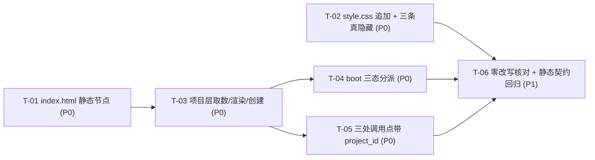

# pr-003-project-layer-ui 任务图

**迭代**：0017-project-workspace
**PR**：`docs/iterations/0017-project-workspace/prs/pr-003-project-layer-ui.md`
**阶段**：阶段 5（PR 实现）· batch 2
**任务总数**：6
**文件范围**（任务不得越界）：`oamp/web/index.html` / `oamp/web/app.js` / `oamp/web/style.css`（**不含** `oamp/src/**`、**不含**任何 `oamp/test/**`、不含文档文件）
**验收标准来源**：`architecture.md` §5（前端硬契约）+ `prd/F04-project-list-page.md` + `prd/F05-project-workspace.md` + `prs/pr-003-project-layer-ui.md`（验收标准 6 条）
**口径约束**：`architecture.md` §8.2⑤（`api-pages.test.js` 零改动）、§8.3（diff 只允许四类形态）、§5.3（app.js 改动点穷举 + 零改写清单）

---

## 1. 任务概览

| ID | 一句话描述 | 前置依赖 | 优先级 | 落点文件 |
|---|---|---|---|---|
| T-01 | `index.html` 落静态节点：`#projects-view`（含 5 个子节点）+ `.topnav` 之后的 `#project-bar` | 无 | P0 | `oamp/web/index.html` |
| T-02 | `style.css` 纯追加项目层规则，必含 `.layout.hidden` / `.projects-view.hidden` / `.project-bar.hidden` 三条真隐藏 | 无 | P0 | `oamp/web/style.css` |
| T-03 | `app.js` 项目层取数 / 渲染 / 创建：`state` 三字段 + `loadProjects` / `renderProjects` / `createProject` + 创建入口绑定 | T-01 | P0 | `oamp/web/app.js` |
| T-04 | `app.js` 当前项目解析与 boot 三态分派：`resolveCurrentProject` / `showProjectList` / `showWorkspace` / `init()` 改写 | T-03 | P0 | `oamp/web/app.js` |
| T-05 | `app.js` 三处调用点带项目参数：`loadChats()` / `loadArchived()` / `send()` | T-03 | P0 | `oamp/web/app.js` |
| T-06 | 零改写核对 + 既有前端静态契约回归（零新增静态资产、四类 diff 形态、文案无环境承诺） | T-01 ~ T-05 | P1 | 三份 web 文件（只读核对） |

**关键路径**：T-01 → T-03 → T-04（或 T-05）→ T-06，共 4 层。
T-02 与 T-01 并行；T-04 与 T-05 在 T-03 完成后并行（两者互不触碰同一函数）。

**依赖环检查**：无环（拓扑序 T-01 / T-02 → T-03 → T-04 / T-05 → T-06）。

---

## 2. 任务详情

### T-01：`index.html` 新增项目层静态节点（项目列表视图 + 顶栏项目栏）

- **一句话描述**：在既有单页里静态落下面向"项目层"的 8 个节点——`main.layout` 之前的 `#projects-view` 子树（5 个）与 `.topnav` 之后的 `#project-bar` 子树（3 个），既有节点一个不删。
- **前置依赖**：无
- **优先级**：P0
- **验收标准**：
  1. `<main class="layout">` 之前存在 `<section id="projects-view" class="projects-view">`，其内 5 个静态节点齐备：`#project-repo`（input）、`#project-name`（input）、`#btn-create-project`（button）、`#project-list`（容器）、`#project-hint`（提示条）〔`architecture.md` §5.1 DOM 契约表；`prs/pr-003` 验收 1〕
  2. `.topbar` 内、`.topnav` **之后**存在 `
`，其内含 `<a id="btn-back-projects" href="/">← 项目列表</a>` 与 ``〔`architecture.md` §5.1；`prd/F05` 架构落地段〕
  3. `main.layout` 的既有 DOM 树（`aside.sidebar` / `section.detail` / `.detail-head` / `#messages` / `footer.composer` 及其全部既有 id）**逐字未变**，本任务不删除、不改写任何既有节点〔`prs/pr-003` 验收 1「`main.layout` 为既有元素」；`architecture.md` §5.1〕
  4. 8 个新增节点全部**静态**（直接出现在 `index.html` 源码中；不在 `app.js` 里用 `createElement` / `insertAdjacentHTML` / `innerHTML` 生成）〔`prs/pr-003` 验收 1「静态节点（不动态创建）」；`architecture.md` §5.1「不新增切换机制」〕
  5. 既有静态契约锚点逐字在场：`Web Console`、`Workspace` / `Agents` / `Tasks`、`<a class="nav-item" href="/docs">`、`<a class="nav-item" href="/debug">`、`#conn-status` 出现在 `#agent-panel` 之前〔`architecture.md` §8.2⑤；`test/api-pages.test.js:59-63`、`test/web.test.js:1606`〕
  6. `main.layout` 的**最终**可见性满足：`/` 下隐藏、`/?project=<已知 id>` 下可见（由 T-04 在 boot 时施加）；本任务不规定是否在 HTML 源码内预置 `hidden` 类〔[model_inferred]；`architecture.md` §5.1「`main.layout` 的 hidden 类 ▸ 未选项目 ⇒ 整块（含 composer）隐藏」〕
- **备注**：`#project-bar` 初始带 `hidden`（未选项目时不可见）——由验收 2 的 class 字面量覆盖。

### T-02：`style.css` 追加项目层规则与三条真隐藏规则

- **一句话描述**：**纯追加**项目列表视图 / 项目行 / 顶栏项目栏的少量样式，并补齐本仓缺失的三条 `.hidden` 真隐藏规则（本仓 `.hidden` 逐组件定义、无全局规则）。
- **前置依赖**：无
- **优先级**：P0
- **验收标准**：
  1. 三条真隐藏规则在场且均含 `display: none`：`.layout.hidden`、`.projects-view.hidden`、`.project-bar.hidden`〔`prs/pr-003` 验收 5；`architecture.md` §5.1「必含三条隐藏规则」〕
  2. `style.css` 为纯追加：既有规则行逐字未变——尤其既有四条 `.hidden` 规则 `.agent-panel.hidden`(:64) / `.detail-title-input.hidden`(:203) / `.detail-head h1.hidden`(:204) / `.mention.hidden`(:295)；无整文件格式化、无既有选择器改写〔`prs/pr-003` 验收 5「既有规则逐字不动」；`architecture.md` §5.1「CSS 只追加（0016 体例）」〕
  3. 追加 `.projects-view` / `.project-item`（项目行）/ `.project-bar` 及项目新建输入区所需规则，使 T-01 的节点具备可读布局（行内四项信息的排列可辨）〔`architecture.md` §5.1「`.projects-view` / `.project-item` / `.project-bar` 等少量规则」〕
  4. 新增规则复用既有 `:root` 变量（`--line` / `--muted` / `--green` / `--radius` 等），**不新增** CSS 变量、不引入新字体族〔[model_inferred]〕
  5. `.layout` 的既有规则逐字在场（视图隐藏靠 `.layout.hidden`，不靠改动 `.layout` 本体）〔`prs/pr-003` 验收 5；`architecture.md` §5.1〕

### T-03：`app.js` 项目层取数、渲染与创建（含创建入口绑定）

- **一句话描述**：给前端补上"项目"这一层数据与渲染——`state` 三字段、`loadProjects()` / `renderProjects()` / `createProject()`，并让 `#btn-create-project` 跑通"创建后停留列表页原地出现"。
- **前置依赖**：T-01（渲染目标与输入端节点必须已在 HTML 中）
- **优先级**：P0
- **验收标准**：
  1. `state` 新增 `projectId: null`、`project: null`、`projects: []` 三字段；既有字段逐字保留〔`architecture.md` §5.3 #1〕
  2. `loadProjects()` 在场：`GET /api/projects`，响应写入 `state.projects`〔`architecture.md` §5.3 #2；§3.1 响应形状 `{projects:[…]}`〕
  3. `renderProjects()` 在场：向 `#project-list` 渲染项目行，每行四项信息齐备 = **项目名 + 仓库地址 + 对话数（`chat_count`）+ 最近活动时间**〔`prd/F04` 验收 5；`architecture.md` §5.1〕
  4. `last_activity_at === null` 时用既有 `fmtAgo()` 渲染占位 `—` 且不报错（复用 `fmtAgo` 既有语义"非有限值 → `'—'`"，`app.js:74-76`，不另写占位分支）〔`prd/F04` 架构落地段「`null` 用既有 `fmtAgo()` 渲染为占位 `—`（不报错）」〕
  5. 项目行提供进入项目的入口，点击行为 = 整页导航 `location.href = '/?project=' + encodeURIComponent(project_id)`（不使用页内状态切换 / 不引入路由库）〔`architecture.md` §5.2「进入项目 = `location.href = '/?project=' + encodeURIComponent(id)`（整页导航）」〕
  6. `createProject()` 在场：`POST /api/projects`，body 至少含 `repo_url`（取 `#project-repo` 的 trim 后值；`#project-name` 为空时不强制携带）；前端**不做**地址形态 / 域名 / 可达性校验，不新增校验分支〔`architecture.md` §3.1「`trim` 后非空即合法（不校验形态 / 域名 / 可达性）」；`prd/F04` 边界 N1〕
  7. 创建成功 ⇒ **停留项目列表视图**（不设置跳转、不改变 `location`）且重新调用 `loadProjects()` 原地重渲染（即发出第二次 `GET /api/projects`；**无**轮询 / 无定时器）〔`prd/F04` 验收 6 + `[user_confirmed MI-05]`；`architecture.md` §5.2「零新增轮询」〕
  8. 创建失败（400 / 409）⇒ 服务端返回的 `error` 文案写入 **`#project-hint`**（列表视图自己的提示条），不写入工作台 composer 的 `#hint`〔`architecture.md` §5.1「创建失败提示（409 / 400 文案落在列表视图自己的提示条，规避 MI-05『不跳进工作台』）」〕
  9. `bind()` 新增 `#btn-create-project` 的点击绑定触发 `createProject()`；`bind()` 其余既有绑定逐字不变〔`architecture.md` §5.3 #7〕
  10. `loadProjects()` 的失败路径沿用既有 `loadChats()` 的 `try / catch` 体例（不产生未捕获的 promise rejection，不新增全局错误提示面）〔[model_inferred]〕
- **备注**：`prs/pr-003` 验收 4 列举的五项函数中，`showProjectList()` / `showWorkspace()` 按职责归 T-04（视图切换与 boot 分派同处），本条覆盖其余三项 + 创建入口绑定。

### T-04：`app.js` 当前项目解析与 boot 三态分派

- **一句话描述**：把 `init()` 改成"顶栏先就绪 → 再按 `?project=` 分派工作台 / 项目列表"，并补上承担分派的 `resolveCurrentProject()` / `showProjectList()` / `showWorkspace()`。
- **前置依赖**：T-03（分派两侧分别消费 `loadProjects` / `renderProjects`）
- **优先级**：P0
- **验收标准**：
  1. `resolveCurrentProject()` 在场：从 `location.search` 读 `project` 参数写入 `state.projectId`；再经 `GET /api/projects` 在返回列表内按 `project_id` 定位并写入 `state.project`（顶栏项目名的唯一来源）；定位不到时返回 falsy〔`architecture.md` §5.2 T-13；`prd/F05` 架构落地「顶栏项目名的来源」〕
  2. `showProjectList()` / `showWorkspace(project)` 在场：分别切换 `#projects-view` 与 `main.layout` 的 `hidden` 类；工作台模式下 `#project-bar` 移除 `hidden` 且 `#current-project-name` 文本 = 当前项目名（是否附带仓库地址**不构成**验收项，MI-06）〔`architecture.md` §5.1 / §5.2；`prd/F05` 验收 2 + `[user_confirmed MI-06]`〕
  3. `init()` 顺序为 `await loadAgents()` → `connectAgentEvents()` → `await resolveCurrentProject()`，并按返回值分派两态（既有 `bind()` 调用保留）〔`architecture.md` §5.2 boot 顺序代码块；`prs/pr-003` 验收 2〕
  4. `/`（无 `project` 参数）⇒ 项目列表视图：`#projects-view` 可见、`main.layout` 挂 `hidden`、调用 `loadProjects()`，且**不调用** `loadChats()`（不请求 `/api/chats`）〔`architecture.md` §5.2 表格行 1；`prd/F04` 验收 1 / 2〕
  5. `/?project=<已知 id>` ⇒ 工作台：`#project-bar` 可见、`main.layout` 可见、调用 `loadChats()`（带参形态见 T-05）且调用 `renderChat()`〔`architecture.md` §5.2 表格行 2〕
  6. `/?project=<未知 id>` ⇒ 回落项目列表视图（与验收 4 同形：不报错、不渲染空工作台；不产生针对未知项目的错误提示条）〔`architecture.md` §5.2 表格行 3〕
  7. 返回入口是静态链接：`#btn-back-projects` 的 `href="/"` 直接生效（不在 JS 里把它改写成按钮行为）；返回列表 = 浏览器整页导航 ⇒ 上一个项目的对话列表 / 详情 / SSE 订阅 / 归档页状态天然清空〔`architecture.md` §5.2「返回项目列表 = `location.href = '/'`（F05 验收 3 的返回入口就是这条链接）」〕
  8. `connectAgentEvents()` 仍只建立 1 条全局事件流：`init()` 内恰好调用一次，且 `new EventSource('/api/events')` 仍只出现在 `connectAgentEvents()` 内〔`architecture.md` §5.2 boot 顺序；`app.js:886` 既有注释「全局事件流…全程 1 条」〕
  9. boot 全程零轮询：`app.js` 内不出现 `POLL_MS`、不出现 `setTimeout(tick`〔`prs/pr-003` 验收 6；`test/web.test.js:1030-1031`〕

### T-05：`app.js` 三处调用点带项目参数

- **一句话描述**：把"当前项目"贯到既有三个取数 / 发送调用点上——列表、归档页、新建消息一律带 `state.projectId`，用户全程无需再选项目。
- **前置依赖**：T-03（`state.projectId` 字段声明；本条全部验收标准均为三处调用点的文本级契约，可独立验收）
- **优先级**：P0
- **验收标准**：
  1. `loadChats()` 的请求 URL = `/api/chats?project_id=` + `encodeURIComponent(state.projectId)`〔`architecture.md` §5.3 #3；`prs/pr-003` 验收 3〕
  2. `loadArchived()` 的请求 URL 在既有 `archived=1&limit=${ARCHIVE_PAGE_SIZE}&offset=${offset}` 基础上含 `project_id=` + `encodeURIComponent(state.projectId)`；既有三个参数逐字保留（归档能力在工作台内保持可用）〔`architecture.md` §5.3 #4；§3.2「归档视图若不带项目参数会 400」〕
  3. `send()` 的请求体含 `project_id: state.projectId`；既有 `chat_id` / `agent_id` / `text` 与可选 `model` / `one_shot` 字段逐字保留〔`architecture.md` §5.3 #5；`prs/pr-003` 验收 3〕
  4. 三处的 `project_id` 一律取 `state.projectId`，无第二个项目状态来源、无项目选择步骤〔`prd/F05` 验收 5 + `[user_confirmed MI-07]`「新建自动归属，全程无项目选择步骤」〕
  5. `#btn-new` 的既有语义（清空详情面板）与 `send()` 的其余逻辑逐字未变〔`prd/F05` 架构落地「`#btn-new` 的既有语义（清空详情面板）不变」；`architecture.md` §5.3 零改写行〕
- **备注**：`loadArchived()` 若仍不带项目参数，工作台内点「归档」页签会得到 `400 INVALID_PARAM`（`architecture.md` §3.2），这是本条存在的直接原因——不是可选优化。运行时的"新建自动归属"语义另需 T-04 在 boot 时写入 `state.projectId`；本条的全部验收标准不依赖它，可独立验收。

### T-06：零改写核对与既有前端静态契约回归

- **一句话描述**：对三份 web 文件做逐条 diff 核对——确认新增面就是 T-01~T-05 那些、既有交互一行未动、零新增静态资产、文案不越能力边界，并跑既有前端静态契约断言。
- **前置依赖**：T-01、T-02、T-03、T-04、T-05
- **优先级**：P1
- **验收标准**：
  1. 零新增静态资产：`oamp/src/web.js` 未被本 PR 触碰，`STATIC_FILES` 的 12 个键与 `'/' → 'web/index.html'` 映射逐字不变〔`prs/pr-003` 验收 6；`architecture.md` §5.1 T-05 选定理由〕
  2. 既有前端契约断言仍绿：`doesNotMatch(appJs, /POLL_MS/)`、`doesNotMatch(appJs, /setTimeout\(tick/)`（`test/web.test.js:1030-1031`）、`index.html` 含 `Web Console`（`test/web.test.js:295`）、含 `/docs` 与 `/debug` 两个 href 和三个既有占位 nav 项（`test/api-pages.test.js:59-63`、`:188-189`）、`#conn-status` 在 `#agent-panel` 之前（`test/web.test.js:1606`）〔`prs/pr-003` 验收 6；`architecture.md` §8.2⑤〕
  3. 本 PR **不改动任何测试文件**：`test/api-pages.test.js` 零改动（其余测试文件的变更属 pr-002 / pr-004 范围）〔`architecture.md` §8.2⑤；`prs/pr-003` 文件范围〕
  4. 零改写清单逐项核对通过——三份 web 文件的 diff 只含 `architecture.md` §5.3 第 1~7 项：SSE 订阅（`subscribe` / `handleEvent` / `appendChunk`）、归档 / 关闭 / 激活 / 改名、标题行内编辑、`@` 补全、working 等待计时、`isReadonly`、`renderChats` 内存过滤 **一行不改**；不允许出现断言语义放宽、断言删除、格式化整文件、顺手改文案〔`architecture.md` §5.3 零改写行、§8.3 四类形态；`prs/pr-003` 验收 6〕
  5. 三份 web 源码内不出现"已 clone / 已在项目根目录 / 自动 clone / 已对齐目录"一类环境承诺文案（页面文案不得越 `C-4` / `N14` 边界）〔`prd/F05` 边界 N14 / C-4；`architecture.md` §4.3 显式否决项〕
  6. 在 `oamp/` 下运行既有前端静态契约用例（`node --test test/web.test.js test/api-pages.test.js`，或 `npm test`）——与 `web/index.html` / `web/app.js` / `web/style.css` 直接相关的断言全部通过〔`architecture.md` §8.4 E8〕
- **备注**：若 `npm test` 出现失败，须能逐条归因到兄弟 PR 产物缺失（pr-002 的 `GET` / `POST /api/projects` 与 `project_id` 校验、pr-001 的注入前缀），不得落在验收 2 列出的断言上。浏览器端到端冒烟（`/` 见项目列表、`/?project=<id>` 见工作台与顶栏项目名）需要 pr-002 的路由在场，**不列为本任务独立验收判据**；该可见性由 batch 2 同波次交付后的 `pr-004` F04 / F05 静态契约断言与阶段 5 复核承接。

---

## 3. `[model_inferred]` 验收标准清单（待主 agent 确认，不自我宣布生效）

| # | 任务 | 推导内容 | 推导依据 |
|---|---|---|---|
| 1 | T-01 验收 6 | `main.layout` 在 HTML 源码内是否**预置** `hidden` 类不作规定；判据只在 boot 完成后的最终可见性（`/` 隐藏、`/?project=<已知 id>` 可见） | `architecture.md` §5.1 只写「未选项目 ⇒ 整块隐藏」+ §5.2 boot 顺序在 JS 里分派，未规定初始 class；两种落地均满足验收，故声明为实现自由度 |
| 2 | T-02 验收 4 | 新增 CSS 规则复用既有 `:root` 变量、不新增变量 / 字体族 | `architecture.md` §5.1 只说「CSS 只追加（少量规则），既有规则逐字不动」，未逐条约束变量用法；按 `style.css` 既有体例（全部规则走 `var(--…)`）推导 |
| 3 | T-03 验收 10 | `loadProjects()` 失败时沿用既有 `loadChats()` 的 `try / catch` 静默体例，不新增错误提示面 | `architecture.md` §5.3 未列举失败路径的渲染归属；按 `app.js:574-582` 既有取数体例与 §5.3「其余逻辑零改写」推导 |

---

## 4. 依赖环与越界自查

- **环**：无（见 §1 拓扑序）。
- **粒度过细检查**：每个任务都能只靠自身 diff 跑完其验收标准；T-05 仅 3 处调用点，但它是 `prs/pr-003` 验收 3 的独立判定单元且与 T-03 / T-04 的落点函数不相交，故不并入（并入会让 T-03 的验收标准跨两类语义）。
- **越界检查**：本任务图不含 `oamp/src/**`、`oamp/test/**`、文档三件（`API.md` / `llms.txt` / `README.md`）——三者均属 pr-002（`architecture.md` §8.2）；F04 / F05 的新增前端断言属 pr-004 的 `oamp/test/project-workspace.test.js`（`architecture.md` §8.1），不在本 PR 文件范围内。
- **架构补充**：无。本任务图未新增 `architecture.md` 未覆盖的技术决策；`[model_inferred]` 三条均为"实现自由度声明 / 体例复用"，不改变任何硬契约（§2~§8）。
- **跨 PR 口径**：本 PR 的 `depends_on` 为空（`prs/pr-003`）；任务 T-06 的端到端可见性判据依赖 pr-002 产物，已按备注移出独立验收标准。
