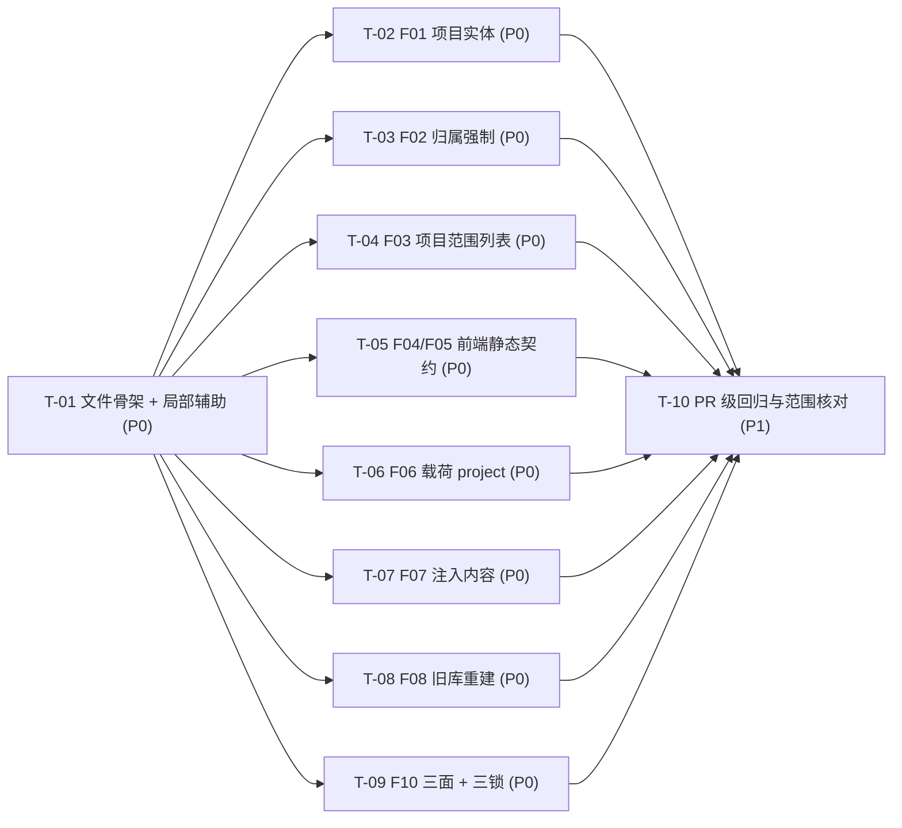

# pr-004-project-workspace-acceptance 任务图（阶段 5 planner 产物）

**迭代**：0017-project-workspace
**PR**：`docs/iterations/0017-project-workspace/prs/pr-004-project-workspace-acceptance.md`（`batch: 3`）
**阶段**：阶段 5（PR 实现）
**任务总数**：10（P0 × 9、P1 × 1）
**文件范围（本 PR 只允许新增这 1 个文件）**：`oamp/test/project-workspace.test.js`（**新建**）。**不修改**任何既有测试文件（`oamp/test/` 下既有 **22** 个 `*.test.js` 与 `test/helpers/*`）、**不修改** `oamp/src/**`、`oamp/web/**`、`oamp/API.md`、`oamp/llms.txt`、`oamp/README.md`、`oamp/package.json`，**不修改** `docs/**` 上游产物（architecture / prd / PR 文件）。
**非目标**：F09（既有行为零变化 / 回归锁）——其判定载体是 **pr-002 的四个既有测试文件的 diff 形态**（arch §8.3 四类形态核对），**不在本文件**（arch §8.1 未把 F09 列入新文件的断言面）；三条漂移锁与零依赖锁的**机制**改造（0016 已交付，本文件只做独立重验）；项目删除 / 改名 / 分页 / 搜索 / 排序 / 归属一致性校验 / 迁移表 / 备份（arch §9 §12「不引入」清单）。
**输入**：`architecture.md` §2（DDL 与旧库重建）/ §3（HTTP 面与错误文案）/ §4（载荷 `project` 与注入时机、约定文本）/ §5（前端静态契约）/ §6.1~§6.4（登记元数据、派生产物、三条漂移锁、新错误文案与码）/ §7.3 §7.4（聚合 SQL 与列表构造）/ §8.1 §8.4（新断言落点、E5 / E9 / E6 / E8 观测面）/ §10.3 D-02 + `prd/F01`~`F08`、`F10` 共 9 张卡 + `prs/pr-004` 的 8 条验收标准。
**可复用的既有机制（零新增）**：`oamp/test/helpers/harness.js`（`startRouter` / `startAgent` / `buildEnv` / `waitFor` / `stopAll`）、`oamp/test/helpers/fake-node.js`（`startFakeNode` 的 `onDeliver` 钩子 + `received` 信封记录面）、`OAMP_SOCKET` / `OAMP_DB` / `OAMP_OMP_BIN` / `FAKE_ACP_ARGS_LOG` 注入、fake ACP 回显（`收到：<prompt>`）、`node:sqlite` 直读、`fetch`。
**口径约束**：① 每条验收标准均可追溯到 architecture 章节或 prd 卡（逐条标注在括号内）；② **前端断言是文本级静态契约**（读 `oamp/web/**` 源码），不做运行期 DOM 断言；③ 测试在 `oamp/` 下运行（单文件 `node --test --test-concurrency=1 test/project-workspace.test.js`，全量 `npm test` = `node --test test/*.test.js`）；④ `[model_inferred]` 共 **8** 条，见 §4。
**同文件串行约束**：T-02~T-09 全部追加进**同一个新文件**——依赖图上它们只依赖 T-01，但**落地时必须按 T-01 → T-02 → … → T-09 的顺序串行追加**（或由同一实现者顺序完成），**不得并发编辑同一文件**。

---

## 1. 任务一览

| ID | 一句话描述 | 前置依赖 | 优先级 | 落点（文件 + 断言块） |
|---|---|---|---|---|
| T-01 | 新建测试文件骨架：文件局部 `startWeb`（暴露 `stdout()`）/ 项目 fixture / fake ACP 桩 / `startFakeNode` 载荷捕获 / 临时 `OAMP_DB` 辅助 | 无 | P0 | `oamp/test/project-workspace.test.js`（文件头 + 辅助区，无 F 级断言） |
| T-02 | F01 项目实体：创建 / 列出往返、派生名、不归一化、可疑地址、`400` / `409` 且条数不变、排序、派生列 sqlite 对拍、库面无路径字段 | T-01 | P0 | 同上（F01 断言块） |
| T-03 | F02 新建对话归属强制：缺 / 空 / 非字符串 / 未知项目 → `400` + 对话总数不变；带归属成功并落库；既有对话路径零追加语义；`NOT NULL` + 外键结构面 | T-01 | P0 | 同上（F02 断言块） |
| T-04 | F03 项目范围列表：缺参 / 空值 `400` + 文案、范围过滤与 `total` 同源、未知项目空列表、既有 8 类过滤 / 分页在范围内语义不变、响应形状零变化 | T-01 | P0 | 同上（F03 断言块） |
| T-05 | F04 / F05 前端静态契约：`index.html` 9 个静态节点、`app.js` boot 分派与三处带 `project_id` 调用点、`style.css` 三条真隐藏规则 | T-01（只读 `web/**`） | P0 | 同上（F04/F05 静态断言块） |
| T-06 | F06 载荷 `project`：两条 LLM 分支三要素齐备、shell 分支零 `project`、内容层落位（信封无新增顶层键）、协议方法面仍 7 个 | T-01 | P0 | 同上（F06 断言块） |
| T-07 | F07 注入内容：一次性路径末位 argv 逐字 = 块 + `\n\n` + 原文、常驻首轮一次 / 次轮不注入、约定三件事齐备且零路径 / 零超能力表述、`messages.text` = 原文（E9） | T-01 | P0 | 同上（F07 断言块） |
| T-08 | F08 旧结构库重建：造旧库 → 启动重建（列集 / `projects` 表 / 行数 0）、`DB_REBUILT` 告知行、二次启动不重建且数据保留、删库重启空库可用、`NOT NULL` + 外键 | T-01 | P0 | 同上（F08 断言块） |
| T-09 | F10 登记与三锁重验：`/api/docs` 投影 13 条（写接口 6 条）、`/docs` / `/debug` 零硬编码路径、`llms.txt` 逐字节、`API.md` 路径级双向覆盖、`dependencies === {}` | T-01 | P0 | 同上（F10 断言块） |
| T-10 | PR 级回归与文件范围核对：单文件全绿 + `npm test` 全绿 + `git diff` 只含新文件 + 零外网 / 零真实 omp | T-01~T-09 | P1 | 无仓库内文件变更（证据任务） |

---

## 2. 依赖图

**无环**（拓扑序：`T-01 → {T-02 … T-09} → T-10`）。**无循环依赖，无需上报。**
**最长依赖链（3 跳 / 3 节点）**：`T-01 → {T-02 | T-03 | T-04 | T-05 | T-06 | T-07 | T-08 | T-09} → T-10`。
**关键路径任务**：**T-01**（全部断言的共同前置——辅助缺失则八组断言都跑不起来）与 **T-10**（PR 验收的唯一收敛点）；八组断言任务在依赖图上是**同层**（彼此不互相依赖），但受**同文件串行约束**（见 §0 口径约束），实际执行是「T-01 → 八组顺序追加 → T-10」。
**并行说明**：只有 T-01 内部无依赖可先落地；T-02~T-09 之间**不存在语义依赖**（各自断言不同的 F 卡与观测面），因此任一组的返工不会波及另一组——但**不得并发编辑该文件**，也**不可拆分给多个实现者**。

---

## 3. 任务详情

### T-01 · 新文件骨架与文件局部测试辅助（fake ACP 桩 + 载荷捕获 + 临时库）

- **一句话描述**：新建 `oamp/test/project-workspace.test.js` 并自带本文件专用的启动 / 取数 / fake ACP 桩 / `startFakeNode` 载荷捕获 / 临时 `OAMP_DB` 辅助，使后续八组断言能在「不起真实 omp、不碰共享 helper」的前提下独立落地。
- **前置依赖**：无
- **优先级**：P0
- **交付物**：`oamp/test/project-workspace.test.js`（新建；本任务只落文件头注释、常量、辅助函数与 `t.after` 清理，**不含任何 F 级断言**）。

**验收标准**

1. 文件存在且可被 `node --test` 加载：`cd oamp && node --test --test-concurrency=1 test/project-workspace.test.js` 退出码 0〔arch §8.1「新文件承载全部新能力断言」；prs/pr-004 验收 1〕。
2. **只新建该文件**：`oamp/test/helpers/harness.js`、`oamp/test/helpers/fake-node.js` 与既有 22 个 `oamp/test/*.test.js` **零字节改动**——复用其既有导出，**不抽公共 helper、不改既有文件**（体例：`test/api-routes.test.js:5` 的「自带同款 startWeb 启动辅助（不抽公共 helper、不改既有文件）」）〔prs/pr-004「文件范围」；arch §8.1〕。
3. 局部 `startWeb(socketPath, port, envExtra)` 与既有同款：`spawn(process.execPath, [BIN, 'web', 'start', '--port', String(port)], { cwd: ROOT, env: buildEnv(socketPath, { ...LEASE_ENV, ...envExtra }) })` → 等 stdout 出现 `WEB_READY`（5s 上限，提前退出即抛错）→ `stop()` 走 `SIGINT` + 3s 内退出、超时 `SIGKILL`；句柄**暴露 `stdout()` 与 `stderr()`**〔体例 `web.test.js:124-148`、`api-routes.test.js:47-72`；**[model_inferred] M1**（`stdout()` 是 arch §10.3 D-02 的 `DB_REBUILT` 告知行所需的观测面）〕。
4. `LEASE_ENV = { OAMP_HEARTBEAT_TIMEOUT_MS: '3000' }`（web 作为常驻发送方按既有下限心跳 ≥500ms，harness 的 300ms 租约会让它被判 offline）；`pickPort()` 取随机高位端口〔体例 `web.test.js:117-121`〕。
5. **`OAMP_DB` 一律指向临时目录**：`fs.mkdtempSync(path.join(os.tmpdir(), 'oamp-project-ws-'))` 下的 `sql.db`，并由 `t.after` 递归清理；**全文件不写 `oamp/data/sql.db`**〔prs/pr-004 验收 8；`web.test.js:261-266` 体例〕。
6. 项目 fixture 辅助在场：`projectFixture(web, repoUrl, name?)` 经 `POST /api/projects` 建项目，断言 `status === 200` 并返回 `project_id`〔arch §3.1；F01 验收 1〕。
7. fake ACP 桩（**本文件局部**，经 `OAMP_OMP_BIN` 注入）实现两形态：`-p` 一次性（stdout 输出 `one-shot answer: <末位参数>`）与 `acp` 常驻（JSON-RPC `initialize` / `session/new` / `set_config_option` / `session/prompt` 流式 + per-session 文本记忆，回答 `收到：<prompt>`）；**两形态都先把 `argv` 以 JSON 一行追加到 `FAKE_ACP_ARGS_LOG`**〔arch §1.2 H、§8.4 E5①②；体例 `web.test.js:25-108`、`acp-daemon.test.js:27-40`〕。
8. 载荷捕获辅助在场：`captureTask(web, payload, { agentId })` 经 `startFakeNode({ socketPath: router.socketPath, instanceId: agentId, heartbeatMs: 500, onDeliver })` 注册一个**假目标 agent**，投一条 `/api/messages` 后返回捕获到的 `task.request` 信封（取自 `node.received`）〔arch §8.4 E5③「web→agent 的 `task.request` payload 本体含 `project.repo_url`（harness 可捕）」；体例 `web.test.js:1174-1185`〕。
9. 取数与等待辅助在场：`jget` / `jpost` / `detailOf(web, chatId)` / `sendAndWait(web, payload, { rounds, timeoutMs })` / SSE reader（手工解析 `data:` 帧，零依赖）〔体例 `web.test.js:150-287`；arch §8.4 E5①② / E9〕。
10. 全文件零外网、零真实 omp、零真实 LLM：`OAMP_OMP_BIN` 恒指本文件桩，无任何外部域名请求〔prs/pr-004 验收 8；arch 本次约束「零第三方依赖」〕。

**验证方法**：`cd oamp && node --test --test-concurrency=1 test/project-workspace.test.js`（退出码 0）；`git diff --name-only` 只出现该新文件（T-10 复核）；`grep -n "OAMP_DB" test/project-workspace.test.js` 逐处确认为临时目录。

---

### T-02 · F01 项目实体：创建 / 列出 / 派生 / 不归一化 / `400` / `409` / 排序 / 派生列

- **一句话描述**：用 HTTP 往返 + `node:sqlite` 直读，把「只填地址即可创建、可被列出、四要素可核对且不含本地路径、必填、去重、不归一化、不校验可达性、派生列正确」这八件事变成可判定断言。
- **前置依赖**：T-01
- **优先级**：P0
- **交付物**：`oamp/test/project-workspace.test.js` 的 F01 断言块。

**验收标准**

1. `POST /api/projects { repo_url: 'https://github.com/acme/demo.git' }`（**name 省略**）→ `200`，响应键集合恰 `{project}`，`project.project_id` 匹配 `/^prj-[0-9a-f-]{36}$/`，`project.name === 'demo'`（派生 = 地址去尾部斜杠后取尾段、再去尾部 `.git`），`project.repo_url` 与入参逐字相等，`Number.isInteger(project.created_at)` 且 > 0〔arch §3.1 请求体表 / §2.3；F01 验收 1、架构落地 T-09〕。
2. 派生边界：`name` 分别为**省略** / `''` / `'   '` / 非字符串（如 `123`）→ 四种形态的 `name` **都等于 `'demo'`**；派生结果为空时（fixture 用 `repo_url: '.git'`）`name` **等于地址原文 `'.git'`**（NOT NULL 列非空）〔arch §3.1「缺省 / 空 / 非字符串 ⇒ 派生；派生结果为空 ⇒ 兜底用地址原文」；**[model_inferred] M2**（`'.git'` 作为「派生为空」的 fixture 选择）〕。
3. **不归一化**：`https://github.com/acme/demo` 与 `https://github.com/acme/demo.git` 两次创建**均 200**，`GET /api/projects` 出现 **2 条**，两条 `repo_url` 分别为两个原样字符串；库内 `SELECT repo_url FROM projects` 的值与入参 trim 后逐字相等（不做 `.git` / 尾斜杠 / 大小写 / SSH↔HTTPS 归一化）〔F01 验收 6；N6；arch §2.3「`repo_url` trim 后**原样**入库」〕。
4. **不校验形态 / 域名 / 可达性**：用非 github 域名与非 URL 形态的非空字符串（如 `'not-a-url'`、`'git@example.internal:x.git'`）创建 → **均 200**；创建过程无网络依赖（本文件桩环境下亦成功即证）〔F01 验收 4 后半、验收 7；N1；arch §3.1〕。
5. **必填**：`repo_url` 为**缺失** / `''` / `'   '` / **非字符串**（如 `123`）→ 四形态均 `400`，`body.code === 'INVALID_PARAM'`、`body.error === '需要 repo_url（非空字符串）'`，且 `GET /api/projects` 的条数与 `SELECT COUNT(*) FROM projects` 直读计数**均不变**（不产生项目）〔F01 验收 4；arch §6.4 文案逐字；MI-01〕。
6. **去重**：同一地址连续两次创建 → 第二次 `409`、`body.code === 'CONFLICT'`、`body.error === '项目已存在: <repo_url>'`（`<repo_url>` = trim 后原样地址），项目条数不变〔F01 验收 5；arch §3.1 / §6.4〕。
7. **列出往返**：创建 3 个项目 → `GET /api/projects` 响应键集合恰 `{projects}`，`projects.length === 3`（未创建的不出现）；**无分页参数**——带 `?limit=1` 仍返回 3 条且响应不含 `total` / `limit` / `offset`〔F01 验收 2；F04 边界「不新增分页 / 搜索 / 排序能力」；arch §3.1〕。
8. **排序**：`projects` 满足 `created_at DESC, project_id DESC`——对每一相邻对断言 `a.created_at > b.created_at || (a.created_at === b.created_at && a.project_id > b.project_id)`〔arch §3.1「排序」/ §7.3；L2-6〕。
9. **派生列（sqlite 直读对拍）**：
   - 新项目无对话时，该项目行 `chat_count === 0` 且 `last_activity_at === null`（**不是 `0`、不是缺键**）〔MI-03；arch §3.1 / §7.3〕；
   - 在该项目下建 **2 条对话**（1 条正常完成、1 条 `close` 后再 `archive` ⇒ 已关闭 / 已归档）→ 该项目行 `chat_count === 2`（**含全部**）；`last_activity_at` 与 `node:sqlite` 直读 `SELECT MAX(updated_at) FROM chats WHERE project_id = ?` 的值**逐位相等**〔MI-04；arch §7.3 聚合 SQL；F04 验收 5〕；
   - 另一个无对话项目仍为 `chat_count === 0` / `last_activity_at === null`（不串项目、无 N+1 派生错觉）〔arch §7.3〕。
10. **四要素可核对、本地路径不在其中**：`POST /api/projects` 响应 `Object.keys(project).sort() === ['created_at','name','project_id','repo_url']`；`GET /api/projects` 行键 `=== ['chat_count','created_at','last_activity_at','name','project_id','repo_url']`；`node:sqlite` 直读 `pragma_table_info('projects')` 的列集 `=== ['project_id','name','repo_url','created_at']`（**无路径类字段**，也不被推断或存储）〔F01 验收 3；N3；E4；arch §2.1〕。
11. 断言不写仓库内库文件：本块的 `OAMP_DB` 与直读句柄一律指向 T-01 的临时目录〔prs/pr-004 验收 8〕。

**验证方法**：`cd oamp && node --test --test-concurrency=1 test/project-workspace.test.js`（本块用例全绿）；对派生列与列集用 `node:sqlite` 直读同一 `OAMP_DB` 文件对拍（不经 web 读口）。

---

### T-03 · F02 新建对话必须归属项目（API 层强制 + 数据层结构面）

- **一句话描述**：把「凭空造对话」这条既有路径堵死——缺 / 空 / 非字符串 / 指向未知项目一律 `400` 且不产生任何对话；带合法归属则落库成功；既有对话路径不新增语义；归属不可空由表结构保证。
- **前置依赖**：T-01
- **优先级**：P0
- **交付物**：`oamp/test/project-workspace.test.js` 的 F02 断言块。

**验收标准**

1. 空项目库上 `POST /api/messages { agent_id, text }`（**不带 `chat_id`、不带 `project_id`**）→ `400`、`body.code === 'INVALID_PARAM'`、`body.error === '新对话需要 project_id（对话必须归属一个项目）'`（文案逐字），且 `SELECT COUNT(*) FROM chats` 与 `SELECT COUNT(*) FROM messages` 直读计数**均不变**（校验在写库之前 ⇒ 不产生任何对话）〔F02 验收 2；arch §3.3「插入位置（C-7 顺序契约）」/ §6.4；MI-08〕。
2. `project_id` 为 **`''`** 与 **非字符串（如 `123`）** → 与验收 1 同 `400`、同文案，计数不变〔arch §3.3「缺失 / 空 / 非字符串 → 400」〕。
3. `project_id: 'prj-does-not-exist'`（指向不存在的项目）→ `400`、`body.code === 'INVALID_PARAM'`、`body.error === '项目不存在: prj-does-not-exist'`（逐字含 id），计数不变；**不是 `404`**〔F02 验收 4；MI-02「一律 400」；arch §6.4〕。
4. **带项目归属即可新建**：先建项目 A → `POST /api/messages { project_id: <A>, agent_id, text }` → `200`，响应含 `chat_id` / `task_id` / `message_id`；`node:sqlite` 直读该行 `project_id === <A>`〔F02 验收 1、验收 3；arch §2.3 `insertInput` 的 `projectId` 必填〕。
5. **范围可见性**：该 `chat_id` 出现在 `GET /api/chats?project_id=<A>` 的 `chats` 中，且**不出现**在项目 B（另建）的列表里〔F02 验收 1；F03 验收 1；E3〕。
6. **既有对话路径零追加语义**：① 带**既有** `chat_id` 且**不带** `project_id` → `200`；② 带既有 `chat_id` 且带一个**与归属不同**的 `project_id` → 仍 `200`，且 `node:sqlite` 直读该 chat 的 `project_id` **未被改写**（归属不可变由 `ensureChat` 的 `ON CONFLICT(chat_id) DO NOTHING` 结构性保证；不引入「归属一致性校验」分支）〔arch §3.3 / §10.2 L2-8 / §11 R-4；F02 边界〕。
7. **顺序契约**：既有错误路径的触发条件与顺序**不变**——**不带 `project_id`** 时：畸形 JSON → `400`（读体优先）、缺 `agent_id` 且无 `@` 前缀 → `400`、正文 trim 后为空 → `400`、`model` 不匹配 `MODEL_RE` → `400`、目标对话已归档 / 已关闭 → `409`（只读预检优先于新校验）。每一形态断言其**既有错误文案 / 码**，证明新校验未能抢先〔arch §3.3「插入位置（C-7 顺序契约）」；arch §6.4 表〕。
8. **数据层结构面（E4）**：`node:sqlite` 直读 `pragma_table_info('chats')`：第 2 列名为 `project_id` 且 `notnull === 1`；`pragma_foreign_key_list('chats')` 含一条指向 `projects` 表 `project_id` 列的引用（`PRAGMA foreign_keys = ON` 已由 `openDb` 打开 ⇒ 引用真实生效）〔F02 验收 3；E4；arch §2.1 / §1.2 D〕。
9. **结构性拒收**：对 `chats` 直接 `INSERT`（缺 `project_id`）→ 抛错（`NOT NULL`）；`INSERT` 一个不存在的 `project_id` → 抛错（外键生效）。两条都断言 `assert.throws`〔F02 验收 3；E4；arch §2.1〕。
10. 本块所有断言只经 `OAMP_DB` 临时库；「对话总数不变」的判据同时用 **HTTP 列表 `total`** 与 **sqlite 直读 `COUNT(*)`** 两种口径核对（防只改一处的假通过）〔prs/pr-004 验收 2；E4〕。

**验证方法**：`cd oamp && node --test --test-concurrency=1 test/project-workspace.test.js`（本块全绿）；`node:sqlite` 直读临时库核对列约束、外键与行数。

---

### T-04 · F03 对话列表以项目为范围（含既有过滤在范围内语义不变）

- **一句话描述**：把「不提供项目范围的列表查询一律 `400`」「带范围只返回该项目对话且 `total` 同源」「既有 8 类过滤 / 分页在范围内语义照旧」变成可判定断言。
- **前置依赖**：T-01
- **优先级**：P0
- **交付物**：`oamp/test/project-workspace.test.js` 的 F03 断言块。

**验收标准**

1. `GET /api/chats`（**不带 `project_id`**）→ `400`、`body.code === 'INVALID_PARAM'`、`body.error === '查询参数非法: project_id 不能为空（对话列表以项目为范围）'`（逐字），**不返回跨项目全量列表**〔F03 验收 2；arch §3.2 / §6.4；MI-08〕。
2. `GET /api/chats?project_id=`（**空值**）→ 与验收 1 同 `400` 同文案（**不沿用「空值 = 无参」语义**）〔F03 验收 2；arch §3.2「未提供与提供空值都判非法」；MI-08〕。
3. **范围过滤**：项目 A 下 2 条对话、项目 B 下 1 条 → `GET /api/chats?project_id=<A>` 的 `chats` 的 `chat_id` 集合与 `node:sqlite` 直读 `SELECT chat_id FROM chats WHERE project_id = 'A'` 的集合**相等**（互不包含对方的行）；反向同理〔F03 验收 1、验收 5；E4；arch §7.4〕。
4. **`total` 与集合同源**：A 内列表 `total === chats.length`；`limit=1&offset=0` 与 `offset=1` 两次分页的 `total` **恒等于 A 内总数**（不是跨项目总数）；两页 `chat_id` 不重复〔F03 验收 4；arch §3.2「`listChats` 与 `countChats` 共用 `LIST_FROM` ⇒ 列表与 `total` 自动同源」/ §7.4〕。
5. **未知项目不报错**：`GET /api/chats?project_id=prj-nope` → `200`、`chats === []`、`total === 0`、`limit` / `offset` 仍在（不做存在性判定）〔arch §3.2「不做存在性判定」、§11 R-5〕。
6. **既有过滤在项目范围内语义不变**（每条断言都带合法 `project_id`，并断言结果全部属于该项目）：
   - `q`：标题命中 1 条、仅消息正文命中 1 条、`q=%`（转义生效）命中 0 条〔F03 验收 4；N13〕；
   - `agent`：命中该 agent 相关对话数；不存在的 agent 名 → 0；
   - `state`：`closed` / `working` / `completed` 计数与库内一致；
   - `from` / `to`：闭区间；且 `from > to` → `400`；
   - `archived`：`archived=1` 只含已归档（`archived=0` 缺省只含未归档）；`archived=2` → `400`；
   - `limit` / `offset`：分页不重复；`limit=0` / `limit=201` / `limit=abc` / `offset=-1` → **各 `400`**。
   〔F03 验收 4；N13；arch §9「过滤参数语义、排序、分页、错误契约逐条保持」〕
7. **400 归因不串**：验收 6 的每一条非法参数断言都带合法 `project_id` ⇒ 断言指向的是**该参数自身**的非法性，不被「缺 `project_id`」掩盖（体例 `web.test.js:388-391`）〔arch §3.2；pr-002 §8.2②(c) 同口径〕。
8. **响应形状零变化**：成功响应 `Object.keys(body).sort() === ['chats','limit','offset','total']`；`chats` 行内**不含** `project_id`（`CHAT_COLUMNS` 逐字未变）〔arch §2.3「不改：`CHAT_COLUMNS` / `MESSAGE_COLUMNS`」、§10.2 L2-2；F09 验收 2/3〕。

**验证方法**：`cd oamp && node --test --test-concurrency=1 test/project-workspace.test.js`（本块全绿）；跨项目互斥用 sqlite 直读集合对拍。

---

### T-05 · F04 / F05 前端静态契约（`index.html` 节点 / `app.js` 分派与调用点 / `style.css` 隐藏规则）

- **一句话描述**：以**读源码的文本级契约**固定「首屏项目列表视图 + 工作台顶栏项目栏」这层前端面：9 个静态节点、boot 三态分派、三处带 `project_id` 的调用点、三条真隐藏规则。
- **前置依赖**：T-01（仅需 `ROOT` 常量与 `fs` 读文件；**不依赖**任何 HTTP 面）
- **优先级**：P0
- **交付物**：`oamp/test/project-workspace.test.js` 的 F04 / F05 前端静态契约断言块。

**验收标准**

1. `oamp/web/index.html` 含 **9 个静态节点**（直接出现在源码中，`id=` 字面量在场）：`#projects-view`、`#project-repo`、`#project-name`、`#btn-create-project`、`#project-list`、`#project-hint`、`#project-bar`、`#btn-back-projects`、`#current-project-name`〔arch §5.1 DOM 契约表；prd/F04 架构落地 T-05；prs/pr-004 验收 3〕。
2. 结构契约：`#projects-view` 出现在 `<main class="layout` **之前**；`#project-bar` 出现在 `.topnav` **之后**（同一 `.topbar` 内）；`#btn-back-projects` 的 `href="/"`（返回项目列表 = 浏览器整页导航）〔arch §5.1 / §5.2；F05 验收 3；prd/F05 架构落地〕。
3. `oamp/web/app.js` **boot 分派在场**：`init` 路径顺序为 `loadAgents()` → `connectAgentEvents()` → `await resolveCurrentProject()`，返回值 falsy ⇒ `showProjectList()`（项目列表视图）、truthy ⇒ `showWorkspace(project)`；并且**列表态不请求 `/api/chats`**（`showProjectList` 分支内不出现 `api('/api/chats`）〔arch §5.2 boot 顺序代码块与三态表；F04 验收 1、验收 2；F05 验收 1〕。
4. `app.js` 六个函数在场：`loadProjects` / `renderProjects` / `createProject` / `resolveCurrentProject` / `showProjectList` / `showWorkspace`〔arch §5.3 #2〕。
5. **三处带 `project_id` 的调用点（文本级契约）**：
   - `loadChats()` 的 URL 含 `/api/chats?project_id=` 与 `encodeURIComponent(state.projectId)`（`arch §5.3 #3`）；
   - `loadArchived()` 的 URL **同时**含 `archived=1&limit=${ARCHIVE_PAGE_SIZE}&offset=${offset}` 与 `project_id=` + `encodeURIComponent(state.projectId)`（既有三参数逐字保留，否则工作台内归档页会 `400`）；
   - `send()` 的请求体含 `project_id: state.projectId`。
   〔arch §5.3 #3/#4/#5；F03 验收 4「归档能力在项目范围内保持可用」；F05 验收 5；MI-07〕
6. `style.css` 含**三条真隐藏规则**且每条都含 `display: none`：`.layout.hidden`、`.projects-view.hidden`、`.project-bar.hidden`（本仓 `.hidden` **逐组件定义、无全局规则**，漏一条即「视图切换静默失效」）〔arch §5.1「必含三条隐藏规则」；prd/F04 架构落地 T-05；prs/pr-004 验收 3〕。
7. **首屏信息量四项在场**：`renderProjects()` 的渲染行含项目名、仓库地址、`chat_count`、最近活动时间四项；`last_activity_at` 为 `null` 时用既有 `fmtAgo()`（非有限值 → `'—'`）渲染占位而不报错〔F04 验收 5；MI-03 / MI-04；arch §5.1「前端只负责 `last_activity_at === null → '—'`」〕。
8. **创建后原地出现（MI-05）**：`createProject()` 成功后调用 `loadProjects()` 重新渲染，且**不设置 `location`**（不跳进工作台）；失败（`400` / `409`）时把服务端 `error` 文案写入 `#project-hint`（列表视图自己的提示条）〔F04 验收 6；MI-05；arch §5.1 / §5.2〕。
9. **创建入口绑定在场**：`#btn-create-project` 的点击绑定（`onclick = createProject` 或 `addEventListener('click', createProject)`）〔arch §5.3 #7〕。
10. **零新增轮询**：`app.js` 不出现 `POLL_MS`、不出现 `setTimeout(tick`（既有前端静态契约在 pr-004 视角仍成立）〔arch §5.2「零新增轮询」；F04 架构落地「既有前端静态契约『禁 POLL_MS』继续成立」〕。
11. 本块**只读源码、不做运行期 DOM 断言**（不起浏览器、不执行 `app.js`）；断言形态与既有前端静态契约体例同款（`fs.readFileSync` + `assert.match` / `assert.doesNotMatch`）〔prs/pr-004「前端静态契约」；体例 `web.test.js:1030-1036`、`:1254-1273`〕。

**验证方法**：`cd oamp && node --test --test-concurrency=1 test/project-workspace.test.js`（本块全绿）；人工抽查三条隐藏规则与三处调用点在源码中的行号，确认断言指向的是真实语句而非注释。

---

### T-06 · F06 派发载荷 `project`（两条 LLM 路径携带 / shell 不携带 / 内容层落位）

- **一句话描述**：用 `startFakeNode` 捕获 `task.request` 信封，断言两条 LLM 分支的载荷带齐 `{name, repo_url, agreement}` 三要素、shell 分支载荷键集合逐字不变、`project` 只出现在 `payload.body` 内容层。
- **前置依赖**：T-01
- **优先级**：P0
- **交付物**：`oamp/test/project-workspace.test.js` 的 F06 断言块。

**验收标准**

1. **常驻分支（`omp-daemon`）**：经 mock 目标 agent 捕获的 `task.request`，`JSON.parse(envelope.payload.body)` 的 `executor === 'omp-daemon'`、`chat_id` 在场；`body.project` 键集合恰 `['agreement','name','repo_url']`，且 `name` / `repo_url` 与库内该项目行逐字相等、`agreement === PROJECT_AGREEMENT`（从 `oamp/src/web.js` 导入该常量做**逐字**比对，而非子串匹配）〔arch §3.3 派发载荷 / §4.1 / §4.3；F06 验收 1、验收 2〕。
2. **一次性分支（`omp`）**：`one_shot: true` 派发 → 同样三要素齐备且 `executor === 'omp'`（`chat_id` 可缺）〔F06 验收 2；arch §3.3；prd/F06 架构落地 T-08〕。
3. **`project` 三要素不含本地信息**：`body.project` **不含** `project_id`（键集合严格相等即已覆盖），且三值中无绝对路径 / 盘符 / 本地目录串〔arch §3.3「**不带** `project_id`、不带任何本地路径」；F06 验收 1；N3〕。
4. **`project` 是可选字段、不得拒收**：本块的捕获用例断言「带 `project` 的载荷被正常受理（`task.request` 确实送达 mock 目标 agent）」，未携带 `project` 时「不注入、不拒收」的向后兼容性证据 = 既有直投 payload 的 18 个测试文件**零改动且全绿**（归 T-10 核对，不在本块重复断言）〔arch §4.1「载荷向后兼容」/ §8.2⑥「零改动」；L2-7〕。
5. **shell 分支载荷逐字不变**：`text` 以 `!` 开头（如 `'!echo hi'`）→ 捕获载荷 `'project' in body === false`、`Object.keys(body).sort() === ['args','command','label']`、`body.command === '/bin/sh'`、`body.args[0] === '-c'`〔arch §3.3「shell 分支载荷逐字不变」；F06 验收 3；N13〕。
6. **原文不进载荷以外的字段**：两条 LLM 分支的 `body.prompt` 与用户原文**逐字相等**（前缀只由 agent 侧施加，web 不产出注入文本）〔arch §4.2「web 只产出结构化数据」；F06 验收 4；E9〕。
7. **内容层落位（E7 / N8）**：捕获信封顶层键集合（排序后）**恰等于** `['created_at','from','message_id','payload','protocol','task_id','to','type']`（`protocol` / `message_id` / `task_id` / `type` / `payload` 由 web 装配；`from` / `to` / `created_at` 由 Router 代填），**不含** `project`；`envelope.payload` 的键集合恰 `['body','content_type']`，`content_type === 'application/json'`——项目信息只进 `payload.body` 的**内容层**〔arch §4.1「协议方法面零变化（E7 / N8）」；F06 验收 5〕。
8. **协议方法面仍 7 个**：`oamp/README.md` 的 `## 协议速览` 方法面行仍逐字列出 `agent.register` / `agent.heartbeat` / `agent.deregister` / `message.send` / `message.deliver` / `message.ack` / `router.status`，**无新增、无删除**（该 7 元组与 demand F-15 的实测口径逐字相同）〔F06 验收 5；N8；E7；**[model_inferred] M3**（以 `README.md` §协议速览作为「7 个方法」的可核对真源——`demand.md` F-15 的实测来源正是该处）〕。
9. 本块不依赖真实 ACP：mock 目标 agent 只记录信封（`startFakeNode` 的 `received`），不启动任何 omp 子进程〔arch §8.4 E5③；prs/pr-004 验收 8〕。

**验证方法**：`cd oamp && node --test --test-concurrency=1 test/project-workspace.test.js`（本块全绿）；对三条分支分别打印捕获载荷键集合，确认 shell 分支零 `project`。

---

### T-07 · F07 项目上下文的内容与 agent 侧注入（含 E9 原文不被污染）

- **一句话描述**：在真实 agent + fake ACP 上核对「注入文本是什么、什么时候注入、注入后用户原文在库里是否逐字未变」——一次性路径逐字前缀、常驻仅首个成功送达轮次、约定零路径零超能力、`messages.text` 与输入逐字相等。
- **前置依赖**：T-01
- **优先级**：P0
- **交付物**：`oamp/test/project-workspace.test.js` 的 F07 断言块。

**验收标准**

1. **一次性路径每次注入、形态逐字**：`one_shot: true` 派发一条文本 `<T>` → `FAKE_ACP_ARGS_LOG` 中 `-p` 形态（`argv.includes('-p')` 且不含 `'acp'`）那次的**末位 argv 逐字等于** `renderExpected(project)` + `'\n\n'` + `<T>`，其中 `renderExpected(project)` = `` `【项目上下文】\n- 项目名：${project.name}\n- 仓库地址：${project.repo_url}\n- 工作约定：${PROJECT_AGREEMENT}` ``（用导入常量拼接期望值，**逐字 `===`**，不用正则子串）〔arch §4.2 渲染模板 / §4.3；F07 验收 1、验收 4；F06 验收 2；E5①〕。
2. **常驻路径首轮注入一次**：同一 `(chat_id, agent_id)` 连发两轮（第 1 轮带 `project_id`）→ 第 1 轮的 `message(out).text`（fake ACP 回显 `收到：<prompt>`）满足 `startsWith('收到：【项目上下文】')` 且含 `repo_url`；第 2 轮的 `message(out).text` 等于 `收到：<第 2 轮原文>` 且 **`doesNotMatch(/【项目上下文】/)`**（首轮一次语义，后续轮次已在前文看到该块）〔arch §4.2 注入频率与边界口径；F07 验收 4；E5②〕。
3. **未携带 `project` 即不注入**：证据形态 = 既有直投 payload 的测试文件零改动且全绿（T-10 核对）；本块不重复断言未携带形态的不可达路径〔arch §4.1 / §4.2「未携带 ⇒ 不注入」；§8.2⑥〕。
4. **E9 原文不被污染**：对验收 2 的两条消息，`GET /api/chats/<chat_id>` 的 `messages` 中两条 `direction === 'in'` 的 `text` **分别与两轮输入原文逐字相等**（`===`，不 trim、不含前缀）；并用 `node:sqlite` 直读 `SELECT text FROM messages WHERE chat_id = ? AND direction = 'in' ORDER BY id` 再核对一次（HTTP 与库双重口径）〔arch §8.4 E9、§4.2「web 不碰 `messages.text`」；F06 验收 4；F07 验收 4〕。
5. **注入内容零绝对路径 / 零盘符 / 零主机名（限定面）**：对 `agreement` 文本与渲染块内的**工作约定行**断言 `doesNotMatch` 绝对路径 / 盘符 / 主机名形态（如 `/^\//m` 起始的目录串、`[A-Za-z]:\\`、`//` 主机名面）——**该断言不施加于 `repo_url` 行**（仓库地址合法地含 `://` 与域名主机名）〔F07 验收 2；N3；arch §4.3「零绝对路径：不出现 `/` 开头的目录串、不出现盘符、不出现主机名」；**[model_inferred] M4**（把断言面收敛到 `agreement` 与工作约定行，避免误伤 `repo_url`）〕。
6. **约定覆盖三件事**：`agreement`（= `PROJECT_AGREEMENT` 原文）同时含 ① clone 语义（含 `clone` 与「本地尚无该仓库」）、② 仓库根目录工作（含 `根目录`）、③ 产物写入该仓库（含 `docs` / `PR` / `commit` / `分支` 与「写入该仓库」）〔F07 验收 3；W5；arch §4.3「三件事齐备」〕。
7. **零超能力承诺**：`agreement` 与渲染块 `doesNotMatch(/已 ?clone|已对齐目录|已进入项目根目录|系统会自动/)` 一类表述；`oamp/web/index.html` 与 `oamp/web/app.js` 源码同样零命中（页面文案不得越 `N14` / `C-4` 边界）〔F07 验收 7；N14 / C-4；arch §4.3「零超能力承诺」/ §5.3 零改写行；**[model_inferred] M5**（具体正则词表由 arch §4.3 的否决项枚举推导）〕。
8. **只判「出现即真」**：本块只断言仓库地址字符串在 agent 侧可见文本 / argv 中出现，**不判** agent 是否真的 clone、不建目录、不探测仓库〔F07 验收 5；C-4；arch §4.2 末条〕。
9. 注入不改变既有观测面：本块不新增对 `task.label` / SSE `task_update` 摘要的断言（那是既有观测面零变化，归 pr-002 既有文件的 diff 形态）〔arch §4.2 末条；§8.1 F09 不在本文件〕。

**验证方法**：`cd oamp && node --test --test-concurrency=1 test/project-workspace.test.js`（本块全绿）；对 `FAKE_ACP_ARGS_LOG` 的末位 argv 与 `out.text` 分别打印实际值，逐字比对期望模板。

---

### T-08 · F08 旧结构对话库启动即重建（E6：可裸判定的删除性后果）

- **一句话描述**：造一份不含 `project_id` 的旧结构库，核对「启动即整库重建、旧行清零、不留兜底、二次启动不重建、删库重启为空库可用」五种形态。
- **前置依赖**：T-01
- **优先级**：P0
- **交付物**：`oamp/test/project-workspace.test.js` 的 F08 断言块。

**验收标准**

1. **造旧库**：用 `node:sqlite` 在临时 `OAMP_DB` 路径直建旧结构——`chats` 表 **7 列**（`chat_id` / `title` / `agent_id` / `state` / `created_at` / `updated_at` / `closed_at`，**无 `project_id`**）+ `messages` 表 + 至少 1 条旧对话行与 1 条旧消息行（`CREATE TABLE` 不带 `IF NOT EXISTS` 也允许，因为这是测试自造文件）〔arch §2.2 旧结构判据；F08 验收 1；E6〕。
2. **启动即重建、无报错**：以该 `dbPath` 起 `startWeb` → `WEB_READY` 出现、进程未提前退出、`stderr()` 不含 `Error` / 未捕获异常字样（该接口视角下 `400` 不产生）〔F08 验收 2；E6；arch §7.2〕。
3. **重建后库面（`node:sqlite` 直读）**：`pragma_table_info('chats')` 的列集 = 新 10 列（`project_id` 在第 2 位）、`projects` 表存在、`SELECT COUNT(*) FROM chats` 与 `SELECT COUNT(*) FROM messages` **均为 0**、旧 chat 行不存在（`getChat('chat-old')` 语义的直读等价：`SELECT 1 FROM chats WHERE chat_id='chat-old'` 无行），且**不存在**任何兜底项目行（`SELECT COUNT(*) FROM projects` = 0）〔F08 验收 2、验收 3；E6；arch §2.2〕。
4. **重建告知行（D-02 已裁定采纳）**：该次启动的 `stdout()` 含单行 `DB_REBUILT path=<dbPath>`，且 `path=` 后的值与 `OAMP_DB` 指向的库路径**逐字相等**〔arch §10.3 D-02；**[model_inferred] M1**（该行落在 stdout，故 T-01 的 `startWeb` 句柄须暴露 `stdout()`）〕。
5. **新结构不重建、数据保留**：重建后经 HTTP 建 1 个项目 + 1 条对话 → `web.stop()` → 用**同一 `dbPath`** 再起一次 `startWeb` → `GET /api/projects` 与 `GET /api/chats?project_id=<id>` 与重启前一致（项目与对话仍在）、`pragma_table_info('chats')` 列集不变、且该次 `stdout()` **不含 `DB_REBUILT`**〔F08 验收 5 前半；arch §2.2「`CREATE TABLE IF NOT EXISTS` 幂等」〕。
6. **删库文件后重启 = 新建空库可用**：`fs.rmSync(dbPath, { force: true })` 后再起 `startWeb` → `WEB_READY`、`projects` 与 `chats` 为空、`POST /api/projects` 返回 `200`、随后 `POST /api/messages` 带该 `project_id` 返回 `200`（新建空库可用）〔F08 验收 5 后半；arch §2.2「`chats` 不存在 ⇒ 非旧结构 ⇒ 正常建新库」〕。
7. **归属列结构面**：`pragma_table_info('chats')` 的 `project_id` 行 `notnull === 1`；`pragma_foreign_key_list('chats')` 含指向 `projects.project_id` 的引用（E4）〔F08 验收 4；E4；arch §2.1〕。
8. **无兼容路径 / 无迁移残留**：`SELECT name FROM sqlite_master WHERE type='table'` 的集合 `⊆ ['chats','messages','projects','sqlite_sequence']`（无迁移表 / 无备份表）；`oamp/src/persist.js` 源码 `doesNotMatch(/MIGRATIONS|migrate\(/)` 且不再出现按列存在性 `ALTER TABLE chats` 的补列路径〔F08 验收 6；C-5；arch §2.2「删除 `MIGRATIONS` + `migrate()`」；**[model_inferred] M6**（`sqlite_sequence` 是 `AUTOINCREMENT` 的 SQLite 内建表，须在允许集合内）〕。
9. 三形态启动（旧库 / 再次 / 删库后）各使用**独立临时目录或同一临时目录内的一致性时序**，全程不触碰 `oamp/data/sql.db`〔prs/pr-004 验收 8〕。

**验证方法**：`cd oamp && node --test --test-concurrency=1 test/project-workspace.test.js`（本块全绿）；对每一形态打印 `pragma_table_info('chats')`、两表行数与 `stdout()` 尾部，人工确认重建告知行只在第一形态出现。

---

### T-09 · F10 登记义务与三条漂移锁 + 零依赖锁（新文件视角独立重验）

- **一句话描述**：在新文件里独立重验「两条新面自动长到文档页 / 调试台 / AI 索引」「三条漂移锁全绿」「依赖清单仍为空」，证明 F10 的保证项没有被 pr-002 的既有断言独占。
- **前置依赖**：T-01
- **优先级**：P0
- **交付物**：`oamp/test/project-workspace.test.js` 的 F10 断言块。

**验收标准**

1. **登记面（进程内，不起服务）**：`createApiRoutes({})` 的 `map(r => r.method + ' ' + r.path)` 共 **13 条**且末两位恰为 `GET /api/projects` / `POST /api/projects`；既有 11 条的顺序逐字不变〔arch §6.1「追加在末位」；F10 验收 3、验收 5〕。
2. **`/api/docs` 投影（HTTP）**：`GET /api/docs` → `200`、`{ routes: [...] }` 共 **13** 条；`danger === (method !== 'GET')` 对每条成立，写接口（`danger`）恰 **6** 条；每条 `docLink` 以 `API.md#` 开头；投影**不含** `handler` 键〔arch §6.1 / §6.3 锁①；F10 验收 1、验收 3〕。
3. **两条新面的元数据逐字**：`GET /api/projects` 的 `summary` / `params === []` / `errors === []` / `kind === 'json'` / `docLink === 'API.md#312-get-apiprojects'`；`POST /api/projects` 的 `summary` / `params` 含 `repo_url`（`in:'body'`、`type:'string'`、`required:true`）与 `name`（`required:false`）/ `errors` deep-equal `['INVALID_PARAM','CONFLICT']` / `kind === 'json'` / `docLink === 'API.md#313-post-apiprojects'`〔arch §6.1 表格；F10 验收 3、验收 5〕。
4. **`/docs` 与 `/debug` 面自动出现且零改动**：`GET /docs` 与 `GET /debug` 均 `200` 且 `content-type` 为 HTML；两份页面脚本（`oamp/web/docs.js`、`oamp/web/debug.js`）**都只经 `fetch('/api/docs')` 取投影**，且源码中 `/api/` 开头的字符串字面量**去重后恰为 `'/api/docs'` 一项**（不出现任何其它接口路径硬编码）——即新增两条面无需改动这两份文件〔arch §6.2「两页零改动」、§6.3 锁①；F10 验收 1；**[model_inferred] M7**（「零硬编码路径」的可核对形态取两文件自身注释声明的判据：`docs.js:2`「页面不含登记之外的任何接口路径」、`debug.js:2`「零硬编码路径」）〕。
5. **`llms.txt` 快照逐字节**：`Buffer.compare(Buffer.from(fs.readFileSync('oamp/llms.txt'), 'utf8'), Buffer.from(renderLlmsTxt(projectRoutes(createApiRoutes({}))), 'utf8')) === 0`；且文件含 `^## 接口（13 条）$` 与两条新面的 `- <METHOD> <PATH> — ` 清单行〔arch §6.2 / §6.3 锁②；F10 验收 1、验收 3〕。
6. **`API.md` 路径级双向覆盖**：`oamp/API.md` 含 `` `GET /api/projects` `` 与 `` `POST /api/projects` `` 的反引号签名（`### 3.12` / `### 3.13` 标题与 `| 12 |` / `| 13 |` 表行即来源）；反向断言 = 文档内反引号 `METHOD /path` 签名集合 ⊆ 登记集合（不得出现未登记路径，如 `` `GET /api/projects/:id` ``）〔arch §6.3 锁③ / §6.2；F10 验收 2、验收 3〕。
7. **零依赖锁**：`oamp/package.json` 的 `dependencies` 经 `deepEqual(… ?? {}, {})` 断言为空（与 `hygiene.test.js` 同源，本文件独立重验）〔F10 验收 4；N12；F-16；arch §6.3 零依赖锁〕。
8. 本块与 `test/api-routes.test.js` 的锁断言**同源但独立**：新文件不修改既有锁断言，也不复制其期望值常量——13 条签名与 `danger` 计数在本文件内独立声明（同一真源：`createApiRoutes({})` 的真实表项）〔arch §8.1「新增断言集中落新文件」；F10 验收 5〕。

**验证方法**：`cd oamp && node --test --test-concurrency=1 test/project-workspace.test.js`（本块全绿）；`cd oamp && node scripts/gen-llms-txt.mjs` 后确认 `llms.txt` 无 diff（快照未被手改）。

---

### T-10 · PR 级回归与文件范围核对（证据任务）

- **一句话描述**：把「新文件全绿、全量 `npm test` 全绿、本 PR 的 diff 只含一个新文件、零外网零真实 omp」四件事收敛成 PR 验收证据。
- **前置依赖**：T-01、T-02、T-03、T-04、T-05、T-06、T-07、T-08、T-09
- **优先级**：P1
- **交付物**：无仓库内文件变更（证据任务；结论写入阶段 5 的交付回报）。

**验收标准**

1. 单文件全绿：`cd oamp && node --test --test-concurrency=1 test/project-workspace.test.js` 退出码 0、无 skip / todo〔prs/pr-004 验收 1〕。
2. 全量全绿：`cd oamp && npm test`（= `node --test test/*.test.js`）全绿——既有的 22 个测试文件（含 `hygiene.test.js` 的零依赖锁、`api-routes.test.js` 的三条漂移锁）与新文件**同时**通过〔arch §8.4 E8；F10 验收 3〕。
3. **文件范围核对**：`git diff --name-only <base>...HEAD`（代码交付面）**只出现** `oamp/test/project-workspace.test.js`；`oamp/src/**`、`oamp/web/**`、`oamp/API.md`、`oamp/llms.txt`、`oamp/README.md`、`oamp/package.json` 与既有 22 个测试文件**零改动**〔prs/pr-004「文件范围」；arch §8.1〕。
4. **F09 不被本文件承担**：既有 22 个测试文件的 diff 形态核对（§8.3 四类形态）是 pr-002 的判定载体；本 PR 对 `oamp/test/` 的唯一 diff 就是新增文件，**不出现**断言语义放宽 / 既有断言删除 / 超时策略调整 / 整文件格式化〔arch §8.3「不允许」列；arch §8.1〕。
5. 零外网 / 零真实 omp / 零真实 LLM：新文件内 `OAMP_OMP_BIN` 恒指文件局部 fake ACP 桩、`OAMP_DB` 恒指 `os.tmpdir()` 下临时目录、无外部域名请求、无真实模型调用；`oamp/data/sql.db` 未被读写〔prs/pr-004 验收 8；arch §1.1 测试约束〕。
6. 断言强度自查：本文件不存在只断言「接口不报错」的弱断言——每条 F 级验收标准都有**正反双向**判据（如 `400` 之外同时断言**条数 / 行数不变**；注入之外同时断言**原文逐字相等**）〔arch §8.3「断言语义放宽」的反面；F09 验收 2 的同源要求〕。

**验证方法**：依次执行 `cd oamp && node --test --test-concurrency=1 test/project-workspace.test.js`、`cd oamp && npm test`、`git diff --name-only`、`git status --porcelain`；把四者输出留痕到阶段 5 交付回报。

---

## 4. `[model_inferred]` 验收标准清单（待主 agent 确认，不自我宣布生效）

| # | 任务 | 推导内容 | 推导依据 |
|---|---|---|---|
| M1 | T-01 验收 3、T-08 验收 4 | 局部 `startWeb` 句柄需**新增暴露 `stdout()`**（既有 `web.test.js:124` 的句柄只有 `stderr()`/`getExit()`，`api-routes.test.js:63` 只有 `stderr()`），因为 `DB_REBUILT path=…` 走 stdout | arch §10.3 D-02 只写「向 stdout 打印一行告知」，未规定测试如何观测；按既有 `stderr()` 句柄体例推导 |
| M2 | T-02 验收 2 | 「派生结果为空」的 fixture 取 `repo_url: '.git'`（去尾斜杠取尾段 `.git` → 去尾 `.git` → 空 → 兜底 `'.git'`） | arch §3.1 只给规则（「派生为空 ⇒ 兜底用地址原文」），未给 fixture；`'.git'` 与 `'/'` 均满足规则，选前者以避开空路径歧义 |
| M3 | T-06 验收 8 | 以 `oamp/README.md` 的 `## 协议速览` 方法面行作为「7 个方法」的可核对真源，断言其仍逐字列 7 项 | demand §3 F-15 的「实测来源」即 `oamp/README.md` §协议速览；arch §9「协议方法面零改动（E7）」未规定断言载体 |
| M4 | T-07 验收 5 | 「零绝对路径 / 零盘符 / 零主机名」的断言面**限定为 `agreement` 与渲染块的工作约定行**，不施加于 `repo_url` 行 | arch §4.3 的对照项针对约定文本；而 `repo_url`（如 `https://github.com/acme/demo.git`）合法含 `://` 与主机名，整块断言会误伤 |
| M5 | T-07 验收 7 | 「零超能力承诺」的具体正则词表（`已 clone` / `已对齐目录` / `已进入项目根目录` / `系统会自动`）与页面源码同样零命中的落点 | arch §4.3 逐条枚举了否决表述与「显式否决项」，但未给正则；断言词表由该枚举推导 |
| M6 | T-08 验收 8 | `sqlite_master` 允许集合须含 `sqlite_sequence`（`messages.id INTEGER PRIMARY KEY AUTOINCREMENT` 的内建伴随表） | arch §2.1 的 DDL 含 `AUTOINCREMENT`，但未提内建表；「无迁移表」的判据必须把内建表纳入允许集，否则断言必红 |
| M7 | T-09 验收 4 | 「`/docs` / `/debug` 零硬编码路径」的可核对形态 = 两文件源码含 `fetch('/api/docs')`，且源码中 `/api/` 开头的字符串字面量去重后**恰为 `'/api/docs'` 一项**（实测：`docs.js` 2 处均为 `/api/docs`——一处注释、一处 `fetch`；`debug.js` 1 处 `fetch`） | arch §6.2 只写「两页零改动」（机制描述）；具体断言形态取自两文件自身注释声明的判据（`docs.js:2`「页面不含登记之外的任何接口路径」、`debug.js:2`「零硬编码路径、零快捷操作入口」） |
| M8 | T-01 验收 7、T-07 验收 1 | fake ACP 桩须实现 `set_config_option` 与 per-session 记忆（否则 `web.test.js` 同款的 model 审计链与「第 2 轮不注入」用例无观测面）；渲染期望值用**导入的 `PROJECT_AGREEMENT`** 拼接后逐字 `===` | arch §4.2 / §4.3 规定了渲染模板与常量唯一真源，但未规定测试桩的最小方法集；按既有桩（`web.test.js:25-108`）方法集推导 |

---

## 5. 依赖环与越界自查

- **依赖环**：无。拓扑序 `T-01 → {T-02, T-03, T-04, T-05, T-06, T-07, T-08, T-09} → T-10`，最深 3 跳；八组断言任务之间**无依赖边**，因此任一组的返工不产生回流（§2 已声明同文件串行约束，非依赖关系）。
- **粒度检查**：八组断言任务各自对应 1~2 张 F 卡的验收标准集合，且各自有独立的观测面与判定方式（HTTP + sqlite 直读 / 仅源码读 / mock 目标 agent 载荷 / 真实 agent + fake ACP / 旧库三形态启动 / 进程内登记构造器 + 快照对拍）；单组工作量均在 1~2 天粒度内，可独立验收。T-01 是八组的公共前置，单独成任务（否则每组都要复制一份启动辅助，与「不抽公共 helper」的约束冲突）。
- **可追溯性检查**：每条验收标准都带 〔architecture §x / prd/Fxx 验收 n〕 标注；8 条推导型标准已全部列入 §4，无未声明的自造要求。
- **越界检查**：本任务图**不含**任何生产代码、测试代码之外的文件变更；不含 `oamp/src/**`（pr-002）、`oamp/web/**`（pr-003）、文档三件（pr-002）、既有测试文件的机械补参（pr-002）与 F09 的回归判定（pr-002 diff 形态）。
- **架构补充**：无。本任务图未新增 `architecture.md` 未覆盖的技术决策；8 条 `[model_inferred]` 全部是「观测面 / fixture / 断言形态」层面的推导，不改变 §2~§8 的任何硬契约，且已按 planner 报告契约提交主 agent 确认。
