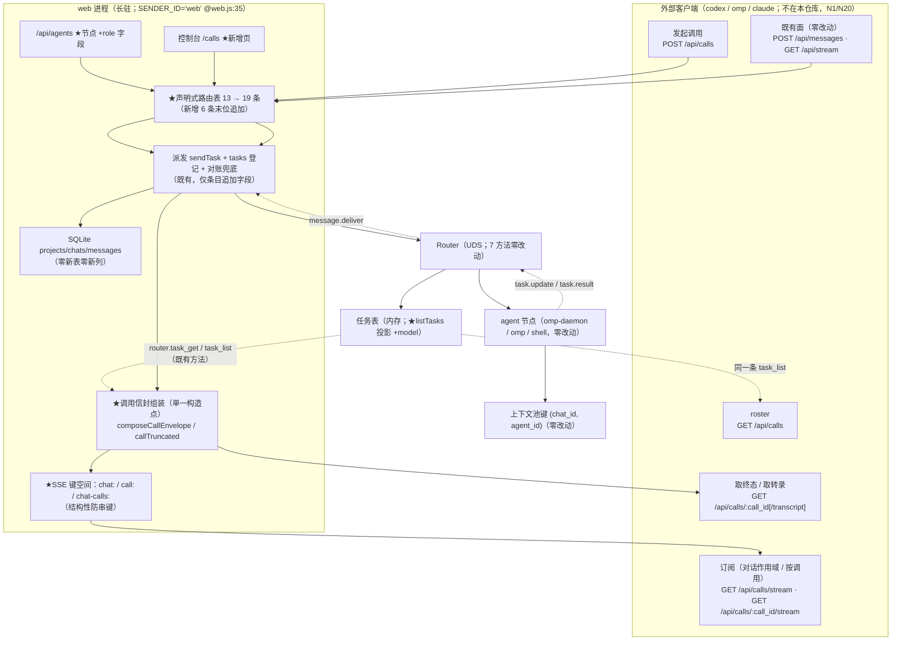

# architecture.md — 0018-chat-agent-subagent-protocol（迭代架构）

**版本**: 0.1.0（阶段 3 产物）
**日期**: 2026-09-12
**状态**: **阶段 3 完成**——T-01~T-17 全部落定（§9.4 逐条索引）；**L1 决策 0 条**（逐条论证见 §9.1）；§10 列出 **8 条需主 agent 知悉/确认的口径点（非 L1）**；§8 为全部出现点/改动面清单，§11 为**必然变更点清单**（F14 验收 2/3 的核对对象）。
**输入**: `prd.md` v0.2.0（16 卡 F01~F16）+ `prd/F01~F16*.md`（架构维度本次全部回填）+ `demand.md` v1.2.0（背景合同，只读）+ `clarifications/recon-20260912.md`（只读实测证据，含 file:line 锚点）
**架构基线（阶段 3 逐行实测）**: `oamp/**` 全部源码与测试、`oamp/API.md`(987 行)、`oamp/llms.txt`(31 行)、`oamp/README.md`(318 行)、`cluster.json`；体例参照 `docs/iterations/0017-project-workspace/architecture.md`、`0019-worktree-isolation-protocol/architecture.md`。
**本次约束（硬）**: 零新依赖 / 零新进程 / 零新传输层 / 零新配置键 / 零新环境变量 / **agent↔router 协议方法面仍 7 个**（`router.js` 全文件零改动）/ 零新表零新列 / 既有 13 条路由的路径与行为不变 / 既有统一错误契约（`{error, code}` 5 码封闭）不新增码 / 仅本机监听零鉴权。

---

## 0. 一句话架构

> **调用仍走既有那一条派发链（12 跳一字不动），一次调用仍是既有的 `task_id`（对外叫 `call_id`）；本次只是在它旁边加一条「按调用读出」的 HTTP/SSE 线**——把 Router 既有的**内存任务表**（唯一真源）按调用读成结构化的终态信封 / roster / 转录，并在 `POST /api/calls` 这一条新入口上补齐入参（角色名寻址、共享说明、期望结构、批量、阻塞/后台、模型）。`chat` 仍是发起容器（归属、消息历史、上下文池键 `(chat_id, agent_id)` 全部沿用 ⇒ W8 身份规则零改动落地），控制台新增 `/calls` 页。

**一句话的验证**：删掉本次新增的 6 条路由与 `/calls` 页，`oamp` 的既有行为逐字回到改动前（§11 的必变点清单之外 diff 为空）；而「发起 → 拿结构化终态 → 看进度」这条最小闭环全部由**既有**的派发链、任务表、对账兜底与 SSE 抽象承载。

---

## 1. 架构基线（阶段 3 逐行实测）

### 1.1 本次唯一触碰面

| 文件（阶段 3 行数） | 现状职责（复核） | 本次改动性质 |
|---|---|---|
| `oamp/src/web.js`（1122） | HTTP 面：**13 条声明式路由**（`createApiRoutes` @318，表 @319-793）+ 静态白名单（@266-279）+ 派发（`sendTask` @1039）+ 终态落盘（`finishTask` @915）+ 对账兜底（`reconcileTask`/`scheduleReconcile` @944-986）+ 回传消费（`handleDeliver` @989-1023）+ 分发（@1073-1097） | **新增 6 条路由表项**（末位追加）+ **新增调用面纯函数**（§8.1）+ 3 处钩子注入（终态、回传、注册条目）+ 静态白名单 +2 项 |
| `oamp/src/registry.js`（295） | Router 注册表 / 投递等待集 / **任务表**（`createTask` @196、`recordTaskUpdate` @219、`finishTask` @238、`listTasks` @255） | **`listTasks` 投影 +1 字段**（`model`）；其余零改动 |
| `oamp/src/router.js`（539） | 7 方法分发（`agent.*` / `message.*` / `router.status|task_get|task_list` @108-402）+ 租约扫描 | **零改动**（方法集数量与名称不变 ⇒ N15 / F14 验收 4） |
| `oamp/src/agent.js`（796） | 任务执行器三分支（`runOmpTask` / `runDaemonTask` @300 / `runShellTask`，`runTask` @361）+ 受理钩子（@461） | **零改动**（调用面恒用 `omp-daemon`，payload 形态逐字沿用） |
| `oamp/src/transport.js`（93） | 推送抽象（chat 键 @14 / 全局键 `null`；`handle` @35、`publish` @60、`publishGlobal` @68、`close` @79、`closeAll` @88） | **键构造加命名空间前缀 + 2 对 `handle*/publish*` 方法**（对外既有方法语义不变） |
| `oamp/src/role-binding.js`（45） | 角色 ↔ 实例唯一映射（`instanceIdForRole` / `roleFromInstanceId` @36-44，反向解析含角色文件存在性判定） | **零改动**（web 侧直接 import 复用 ⇒ C-4「role 推导在 web 侧完成」） |
| `oamp/src/persist.js`（412） | SQLite 三表（`projects`/`chats`/`messages`）+ 两类写口（`insertInput` @284 / `insertOutput` @293）+ `projectByChat` @342 | **零改动**（零新表、零新列、零迁移） |
| `oamp/src/context-pool.js`（251） | 键 `(chat_id, agent_id)` 的常驻上下文池（同键串行 / 异键并发 / LRU） | **零改动**（W8 身份规则的既有载体 ⇒ N16） |
| `oamp/src/{node-client,rpc,acp-client,config,log,cli,task,cluster,cluster-config,status}.js` | 连接 / 协议 / 执行器 / 配置 / CLI | **零改动** |
| `oamp/API.md`（987） | 契约文档：§1 概览 §2 约定 §3 接口清单(13) §4 事件流 §5 示例 §6 不做 | **§3 表头 13→19 + 新增 §3.14~§3.19 + §3.1 字段表 +`role` + 新增 §4.4 事件表 + 新增 §5.12~§5.16 示例 + §6 追加调用面不做项 + 新增 §7 对照表与差异清单** |
| `oamp/llms.txt`（31） | 索引快照（漂移锁②逐字节） | **重生成**（13 → 19 条；`node oamp/scripts/gen-llms-txt.mjs`） |
| `oamp/web/index.html` | 控制台单页（顶栏 3 个占位项 + 2 个真实入口） | **顶栏 +1 真实入口「调用」**（既有 3 个占位项逐字未变） |
| `oamp/web/calls.html` + `oamp/web/calls.js` | — | **新增**（控制台调用页） |
| `oamp/web/{app.js,style.css,api-pages.css}` | 既有工作台 / 样式 | **零改动**（`api-pages.css` 的表格/卡片规则直接复用） |
| `oamp/README.md`（318） | 项目说明（§「Web 控制台（demo）」@120 起列顶栏入口） | 该节 +1 行调用页入口说明 |
| `oamp/test/**` | 既有断言面 | 见 §11（**必然变更点清单**，共 10 条断言改写 + 1 处快照重生成） |

> **不触碰面（显式声明）**: `cluster.json`（`roles` 10 个角色不因本迭代增减）、`oamp/package.json`（`dependencies` 仍为空）、`oamp/config.json` 面、`oamp/bin/**`、仓库根 `roles/**`、`principles/**`、`docs/` 其它迭代目录。

### 1.2 可直接复用的既有能力（决定了本方案为什么"少造东西"）

| # | 既有能力（位置） | 本次如何复用 |
|---|---|---|
| 1 | 唯一派发链：`message.send`（`router.js:201-346`）← `sendTask`（`web.js:1039`）← 受理钩子（`agent.js:461`） | **调用一次 = 走同一条链**；零新传输、零新协议方法 |
| 2 | Router **任务表**（`registry.js:196-271`）：`{task_id, from, to, state, label, created_at, updated_at, updates[], updatesTruncated, result}`，内存、重启即丢 | 终态信封 / 转录 / roster 的唯一真源；零新建存储（差异 ⑩ 的既有语义照旧） |
| 3 | 任务表既有读方法 `router.task_get`（`router.js:384`）/ `task_list`（@395），未注册连接可用（`web.js:157` `queryOnce`） | 调用面读取通道；零新协议方法 |
| 4 | 既有 `tasks` 登记 + 5 s 对账兜底（`web.js:904-986`，`router.task_get` 轮询补齐丢失的 `task.result`） | **终态投递的丢包兜底**（F07 验收 4）：投递路径与对账路径都会推终态帧 |
| 5 | 既有 SSE 传输抽象（`transport.js`）+ `retry: 1000` + 15 s keepalive | 调用级订阅；零新推送机制 |
| 6 | `roleFromInstanceId`（`role-binding.js:36-44`，`pb-<role>` 反解 + 角色文件存在性） | 角色可发现性（F03 验收 3/4）与寻址解析；**零协议改动**（C-4） |
| 7 | 统一错误契约 `ERR_CODE`（`web.js:90-102`，5 码封闭）+ `sendError` 唯一构造点 | 调用面错误一律走既有出口；**零新错误码**（MI-01 / MI-04） |
| 8 | 声明式路由表 + 三条漂移锁 + `/api/docs` 投影 + `/docs` `/debug` 两页（`web.js:282-857`，`test/api-routes.test.js`） | 新路由自动进文档页 / 调试台 / 索引；登记义务由锁保证（F16） |
| 9 | 上下文池键 `(chat_id, agent_id)`（`context-pool.js:1-8`）+ 常驻 `omp acp` 会话 | **W8 身份规则零改动落地**（同 chat 同名共享、跨 chat 隔离） |
| 10 | `db.projectByChat` / `insertInput`（meta `{task_id}`）/ `insertOutput`（`persist.js:228/284/293`） | 归属继承（F11 验收 3）与消息历史载体（F11 验收 1 的核对路径） |
| 11 | `/docs` `/debug` 的静态页体例 + `api-pages.css` 的表格/卡片规则（`web/docs.html`、`web/api-pages.css`） | 控制台调用页零新 CSS 文件 |
| 12 | 控制台既有 5 s 轮询体例（`web/app.js:73` 顶栏 agent 面板） | 调用页 roster 刷新（不引入轮询新机制） |

### 1.3 既有缺口（正好是 16 张卡的来源）

1. **HTTP 面显式排除任务面**（`API.md:980`，= 0015 N5）⇒ 客户端拿不到「一次调用」：F05 / F06 / F07 / F08 / F10。
2. **role 对 HTTP 不可见**（`web.js:321-346` 只暴露 4 字段）⇒ 无法按角色名寻址：F03。
3. **实时流只有 chat 作用域与全局上下线**（`web.js:569-603`；`transport.js:14` 只有 chat 键与 `null` 全局键）⇒ 无按调用订阅：F07 / F08。
4. **发起响应无结构化终态**（`web.js:719` 四元组 `{chat_id, task_id, message_id, warning}`，`API.md:437-488`）⇒ F06。
5. **发起永远 fire-and-forget**（`web.js:706`）⇒ 无「阻塞取终态」：F04（I6）。
6. **入参只有 `text` 一个字符串**（`web.js:611`；无共享说明 / 期望结构 / 批量）⇒ F04（I2 / I3）。
7. **无 roster、无转录读取**⇒ F09 / F10。
8. **全仓无文档把 hub 调用与 subagent 语义挂钩**（recon `F-15`/`F-16`）⇒ F01 / F02。

### 1.4 本次演进的组件图（★ = 本次新增/改动；未标 ★ = 逐字不变的既有链路）



### 1.5 调用面拓扑与命名（T-01 / T-03 的落定形态）

```
外部客户端
   │  POST /api/calls {chat_id, agent(角色名), task|tasks[], context?, output_schema?, schema_mode?, mode?, model?}
   ▼
web（SENDER_ID='web'）  ── 受理校验（归属/角色可解析/入参形态；零副作用）──┐
   │  1. 落 in 行（db.insertInput，meta={task_id}，与既有同序）          │
   │  2. tasks.set(call_id, entry) （登记早于 await，与既有同序）        │
   │  3. sendTask(agent) → Router message.send → createTask → deliver   │
   ▼                                                                    │
Router（任务表 = 唯一真源：state/submitted→working→completed|failed、updates[]、updatesTruncated、result）
   │  读取（既有方法，零改动）：router.task_get / router.task_list
   ▼
web  ◀── 终态到达（投递 task.result @handleDeliver，或对账兜底 @reconcileTask）
   │  composeCallEnvelope(task) → {call_id, agent, state, duration_ms, model, truncated, text, structured_output, error, exit_code}
   ├── 阻塞中的 POST 响应（挂起至终态；MI-05 无上限）
   ├── SSE call_result 帧（按调用键 + 对话作用域键）
   └── 执行侧既有行为零改动：finishTask 仍写一行 out + 推 message/chat_state（对话历史载体）
```

**命名（唯一定义处 = §2.1 路由表）**: 对外资源名 = **调用（call）**，标识字段名 = `call_id`，**取值 = 既有 `task_id`（`task-<uuid>`）**（M-5：不新造第二套资源体系；F05 验收 5/6）。

---

## 2. 调用面接口（T-01 / T-10 / T-13 / T-14）

### 2.1 六条新路由（登记顺序 = 匹配优先级；末位追加在既有 13 条之后）

| # | 方法 + 路径 | 用途 | 元数据要点 | 对应卡 |
|---|---|---|---|---|
| 14 | `POST /api/calls` | 发起一次**或一批**调用（阻塞取终态 / 后台执行） | `kind:'json'`；`errors:[INVALID_PARAM, NOT_FOUND, PAYLOAD_TOO_LARGE, UPSTREAM_UNAVAILABLE]`；`docLink:'API.md#314-post-apicalls'` | F03 / F04 / F05 / F11 |
| 15 | `GET /api/calls` | 调用 roster（**展示面**：每次调用一行，无过滤、无分页、无编排） | `kind:'json'`；`params:[]`；`docLink:'API.md#315-get-apicalls'` | F09 |
| 16 | `GET /api/calls/stream` | **对话作用域**的调用事件流（SSE；`?chat_id=` 必填）——「先订阅、再发起」的载体 | `kind:'sse'`；`params:[{name:'chat_id',in:'query',type:'string',required:true}]`；**`response` 字段逐名列出三类事件**；`docLink:'API.md#316-get-apicallsstream'` | F07 / F08 |
| 17 | `GET /api/calls/:call_id/stream` | **按调用**订阅事件流（SSE） | `kind:'sse'`；`params:[{name:'call_id',in:'path',...}]`；`errors:[NOT_FOUND]` | F07 / F08 |
| 18 | `GET /api/calls/:call_id/transcript` | 按调用 id 取转录（进程内，不持久） | `kind:'json'`；`errors:[NOT_FOUND]`；`docLink:'API.md#318-get-apicallscall_idtranscript'` | F10 |
| 19 | `GET /api/calls/:call_id` | 按调用 id 取终态（进行中给状态） | `kind:'json'`；`errors:[NOT_FOUND]`；`docLink:'API.md#319-get-apicallscall_id'` | F05 / F06 |

**顺序约束（不可调换，可达性由登记顺序保证）**：`GET /api/calls/stream`（字面量）与两条 `:call_id/…` 形态**必须**排在 `GET /api/calls/:call_id` 之前——`compileRouteMatcher`（`web.js:288-315`）对 `/api/calls/:call_id` 的 `prefixSuffix` 形态会把 `/api/calls/stream` 命中成 `call_id='stream'`。**另**：文档中出现的每个 `\`METHOD /api/…\`` 反引号签名**必须**在登记表内（漂移锁③路径级双向覆盖，`test/api-routes.test.js:297-309`）。

**为什么是独立入口而不是扩展既有 `POST /api/messages`**（T-01）：
- I6「阻塞取终态」与 R1「结构化结果」和既有入口已文档化的「**永不阻塞、永不直接返回结果、派发失败仍 200+`warning`**」契约（`API.md:437-488`、`web.js:719-721`）**结构性冲突**——扩展它必须改写既有已文档化响应契约，直接撞 N18 / F14 验收 1。
- 独立入口的代价 = 6 条路由过三条漂移锁（有 0017 追加两条的先例，`test/project-workspace.test.js:1231`「新面追加末位」），远小于改写既有契约的代价。
- 被否决替代：① 扩 `POST /api/messages`（改写既有契约）；② 只加事件流不加发起面（F04 的 I2/I3/I6/I7 无落点）；③ 新开一个前缀（如 `/api/subagents`）但复用同一入口语义（术语与 demand 的「调用」不一致，且与 `tasks` 词面冲突）。

### 2.2 `POST /api/calls` 入参契约（T-13；单一形态 + 批量形态二选一）

| 字段 | 位置 | 类型 | 必填 | 形态与语义 |
|---|---|---|---|---|
| `chat_id` | body | string | ✅ | **调用归属**；必须指向**已存在**的对话（不存在 → 400；未提供 / `null` / `''` / 非字符串 → 400）。见 §10-4 |
| `agent` | body | string | ✅ | **角色名**（如 `dev`）；不是实例名（区别既有 `agent_id`）。解析 = `pb-<role>` 且角色可反解（§5） |
| `context` | body | string | — | **本次调用共享说明**（trim 后非空才生效）；作为独立区块前置装配，**不污染任务文本**（F04 验收 1、F11 验收 4） |
| `output_schema` | body | json | — | **期望的返回结构**（受限子集，§2.5）；形态非法 → 400 |
| `schema_mode` | body | string | — | `permissive`（默认）\| `strict`（枚举外 → 400） |
| `mode` | body | string | — | `background`（默认）\| `block`（阻塞至终态；枚举外 → 400） |
| `model` | body | string | — | 同既有 `MODEL_RE`（`web.js:38`，`^[A-Za-z0-9._/-]{1,128}$`）；非法 → 400 |
| `task` | body | string | ✅（单项形态） | 任务文本（trim 后不得为空）；**`!` 前缀在本面不被解释为 shell**（§10-5） |
| `tasks` | body | json | ✅（批量形态） | 数组，每项 `{task, output_schema?, schema_mode?, mode?, model?}`；与 `task` **互斥**（同时出现 → 400）；空数组 → 400。**每项 = 一个独立调用**（MI-02） |

**响应（200）**: 一律 `{ calls: [信封, …] }`，顺序 = 请求顺序（单项即 1 元素）。后台项 `state='submitted'`；阻塞项 = 终态信封（§3.1）。
**请求体上限** 64 KiB（既有 `readBody`，`web.js:108`）；超限 413 + `connection: close`（既有形态）。
**未声明字段**：忽略（与既有 `/api/messages` 同口径，不另行报错）。

**共享说明与期望结构的装配（web 侧唯一装配点）**：调用面**不**新增 agent 侧 payload 字段（零 `agent.js` 改动），prompt 由 web 侧纯函数 `composeCallPrompt` 装配，固定形态：

```
【调用共享说明】
<context 原文>            ← 仅当提供时存在（独立区块，前置）

<task 原文>               ← 逐字保留（无前缀污染；label 亦取本段前 60 字符）

【返回格式要求】           ← 仅当提供 output_schema 时存在（后置）
请仅输出一个 JSON 对象，满足以下结构（不要输出 JSON 以外的内容）：
<output_schema 的规范 JSON 字符串>
```

以 `\n\n` 连接；与 0017 的项目上下文区块共存时的顺序 = 【项目上下文】（agent 侧首轮渲染）→ 【调用共享说明】→ 原文 → 【返回格式要求】。
被否决替代：把 `context` / `output_schema` 作为新载荷字段下发（需改 `agent.js` 的 `parseTaskBody` + 首轮语义，且「本次调用」语义与常驻会话的「首轮一次性」施加不匹配）。

### 2.3 受理判定顺序与错误映射（T-14 / MI-01 / MI-04）

**判定顺序（任一步失败即返回，零副作用）**：

1. 请求体可读（畸形 JSON → 400；> 64 KiB → 413 + `connection: close`）——既有 `readBody` 行为。
2. 归属：`chat_id` 未提供 / `null` / `''` / 非字符串 → **400 INVALID_PARAM**；`db.getChat` 不存在 → **400 INVALID_PARAM**（`chat 不存在: <id>`）。**判定先于任何写入** ⇒ F11 验收 2 的「不产生任何调用」（roster 无新增行）由构造保证。
3. 目标：`agent` 缺失 / 空 → 400；角色不可解析（`roleFromInstanceId(instanceIdForRole(agent)) !== agent`，即 `roles/<role>/<role>.md` 不存在）→ **404 NOT_FOUND**。
4. 入参形态：`task`/`tasks` 互斥与必填、`mode`/`schema_mode` 枚举、`output_schema` 子集、`model` 正则、`context` 类型 → **400 INVALID_PARAM**。
5. 逐项派发（`sendTask` @1039，内部重试一次）：
   - **首项**派发失败且 `err.dataCode ∈ {AGENT_OFFLINE, AGENT_NOT_FOUND}` ⇒ **404 NOT_FOUND**（统一文案 `agent 不可用: <role>（无对应在线实例）`；此时零调用被创建——Router 在 `createTask` 之前就拒绝了，`router.js:315-341`）。其余 dispatch 错误 ⇒ **502 UPSTREAM_UNAVAILABLE**。
   - **首项成功、后续项失败**（同目标，仅可能是竞态窗口）⇒ **502**；**已派出的项保留**（可从 `GET /api/calls` 查回其 id）；响应体仍是既有错误契约 `{error, code}`（不含部分结果）。
6. 派发失败时**对话侧行为与既有逐字一致**：写一条 `out` 行 `error:'dispatch_failed'` + `chat_state`（既有 @709-726）——调用面只是**额外**把失败表达成 4xx/5xx，不再吞成「200 + warning」（MI-01：不得返回「已受理」式的 200）。

**统一性（MI-01）**：角色「不存在 / 离线 / 无法按角色名寻址」三种情形**不作区分**，统一为同一状态码（404）+ 同一文案，**不新增错误码族**（沿用 `ERR_CODE` 既有 5 码）。
**MI-04**：未提供与提供空值**同判**（400），**不设**服务端兜底默认 chat。

### 2.4 阻塞取终态的传输形态（T-10）

**响应挂起至终态（长连接）**，不轮询、不要求「先订阅后取」：

- 受理与登记完成后，`mode:'block'` 的项在 handler 内 `await entry.done`（条目上的 Promise，释放点 = 终态到达的唯一分发点，§4.3）。
- 终态到达（**投递路径或对账路径任一**）→ 组装信封（一次既有 `router.task_get`）→ resolve → 写 200 响应。
- **不设人为上限**（MI-05）：无超时、无降级、不出现「超时失败」。实现前提：Node 的 `server.requestTimeout` / `headersTimeout` 只约束**请求接收**，不约束响应时长；既有 SSE 长连接已是同款先例 ⇒ **不新增任何 server 超时配置**。
- **客户端断连不终止调用**（MI-05）：派发先于等待完成，执行在 agent 进程内独立推进；断连后 resolve 时的写入是 no-op，调用仍在后台完成，终态可经订阅或按 id 查询取得。
- 批量 + 混合 `mode`：逐项按各自 `mode` 处理，响应里后台项 = 受理行、阻塞项 = 终态信封（同一信封形状）。
- 被否决替代：① 轮询（要求客户端实现轮询，违反 F07 验收 2 的「无需轮询」精神）；② 「订阅后取」（把阻塞语义推给客户端）；③ 引入新的事件总线/回调端点（新增传输机制）。

### 2.5 期望返回结构：受限子集与校验落点（T-09；`F04` 验收 2 / `F06` 验收 3）

**校验落点 = hub（web）侧**——所有校验都在 `web.js` 的纯函数里完成，**不依赖** `[UNVERIFIED]` 的 omp 结构化输出能力（recon §D.1），不引入 JSON Schema 依赖（N19 零依赖锁）：

- **受限子集（受理时校验，超出 → 400）**：
  ```
  output_schema = { type?: 'object', properties?: { <名>: { type: <7 种之一> } }, required?: [<名>…] }
  type ∈ { object, array, string, number, integer, boolean, null }
  ```
  只认这三个键；出现 `$ref` / `oneOf` / `anyOf` / `allOf` / `items` / `format` / `pattern` / 嵌套 `properties` 等 → **400**（明确拒绝，不静默忽略）；`required` 的每个名字必须出现在 `properties` 中。
- **终态时校验**：`extractStructuredOutput(text)` = ① 整体 `JSON.parse(text.trim())`；② 失败则剥离一层 ``` 围栏后重试；③ 仍失败 = `null`。通过后 `validateAgainstSchema(value, schema)`（`type` / `required` / `properties.<名>.type` 三层判定；未声明键**不判错**）。
- **结果映射**：校验通过 ⇒ `structured_output = 对象`（`text` 仍保留原文）；未通过 ⇒ `structured_output = null` 且 `text` 保留原文；`schema_mode='strict'` 且未通过 ⇒ `state='failed'`，`error='structured_output_invalid'`（**不新增终态词**，R7 词表仍是 `completed|failed` + `exit_code`）。
- 不带 `output_schema` ⇒ `structured_output = null`，只交付 `text`（F04 验收 2 的「退回文本且不报错」）。
- **等价性口径（不新增差异条目）**：参照契约的 `outputSchema` 是完整 JSON Schema；本面只接受受限子集并拒收其余形态——这是**形态收敛**（同 I1「按 role 名寻址、不照搬 `.omp/agents` 发现链」的裁决体例），「可携带期望结构 + 校验模式」这一等价性判定不变，故 I3 仍记「必须等价」，**不**派生新的差异编号（差异清单编号 ①~⑲ 为 `demand.md` 已定条目，本迭代**不增不改**）。

---

## 3. 调用信封、roster 与转录（T-02 / T-03 / T-06 / T-08）

### 3.1 调用信封（唯一形状，受理/进行中/终态三态共用）

```json
{
  "call_id": "task-…",            // = 既有 task_id（M-5）
  "agent": "dev",                 // 角色名；不可解析时为 null（F03 验收 4 的空值形态）
  "state": "completed",           // 封闭词表：submitted | working | completed | failed
  "duration_ms": 12345,           // 终态可得；非终态 null
  "model": "deepseek/deepseek-v4-flash",  // 终态 = 执行侧实报的生效模型；非终态 null（不填推测值）
  "truncated": false,             // 单一口径见 §3.3
  "text": "…",                    // 终态产出的原文（失败且无文本时 null）
  "structured_output": null,      // 带 output_schema 且校验通过时的对象；否则 null
  "error": null,                  // failed 时的机器可读原因；否则 null
  "exit_code": null               // 可得时给出（shell / 一次性路径）；daemon 路径为 null
}
```

- **单一构造点** `composeCallEnvelope(task)`（web 侧纯函数，输入 = 既有任务表条目）：三处消费——阻塞响应（§2.4）/ `GET /api/calls/:call_id` / SSE `call_result` 帧。⇒ F05 验收 6、F09 验收 3、F08 验收 4 的「同一标识 / 状态一致 / 增量与转录一致」由构造保证，不靠约定。
- **不包含** `chat_id`：任务表无该字段，web 侧登记在终态即被释放（`web.js:1013-1017` 的落地即删登记），若从 web 登记补写会产生「web 重启后形态不一致的两类信封」。归属核对路径 = `GET /api/chats/:id` 的 `messages[].meta.task_id`（`persist.js:284`，既有字段）与 `POST` 响应中回显的 `chat_id`。
- **不含** usage / tokens / 成本 / `aborted`（F06 验收 4 / 差异 ⑧ / N12）：字段表与响应键集合都不得出现（断言见 §12）。

### 3.2 终态字段来源对照（R1 的可得 / 不可得）

| 信封字段 | 来源（既有，零新采集） | 可得性 |
|---|---|---|
| `call_id` | 任务表 `task_id`（`registry.js:199`） | ✅ |
| `agent` | `roleFromInstanceId(task.to)`（`role-binding.js:36`） | ✅（无角色 → `null`） |
| `state` | 任务表 `state`（`submitted/working/completed/failed`，`registry.js:202`、`238-252`） | ✅ |
| `duration_ms` | `task.result.duration_ms`（`agent.js:315/337` 皆产出） | ✅ |
| `model` | `task.result.model`（daemon 成功体 @317 = ACP 实报值；失败体 @336 同样只报实报值） | ✅（读不到 → `null`，不用请求参数冒充） |
| `truncated` | §3.3 | ✅ |
| `text` | `task.result.text`（daemon）/ 既有 `out` 行兜底语义不变 | ✅ |
| `structured_output` | web 侧提取 + 校验（§2.5） | ✅（仅带 `output_schema` 时可能非 null） |
| `error` | `task.result.error` | ✅ |
| `exit_code` | `task.result.exit_code`（shell / 一次性路径） | ✅（daemon 路径无此字段 → `null`） |
| usage / tokens / 成本 / `aborted` | — | ❌ **不提供**（差异 ⑧：不造假、不估算、不占位）。注：`acp-client.js` 的 `usage` 是既有 ACP 结果字段，`agent.js` 的终态体**从未采集**它（`F-13`），本迭代也不采集 |

### 3.3 截断标记（MI-06：单一真源、OR 口径）

```
truncated = task.updatesTruncated === true                       // 过程记录 1000 条封顶（registry.js:47,223）
         || task.updates.some(u => u.detail?.event === 'truncated') // 增量行 200 行封顶的控制条目（agent.js:26,242）
```

- 二者都取自**同一个**任务表条目 ⇒ 终态信封的 `truncated` 与转录的 `truncated` 由**同一个纯函数** `callTruncated(task)` 产出（T-08 与 T-02 同口径）。
- 调用面（恒 `omp-daemon`）实际可达的上限 = 过程记录 1000 条；200 行封顶属一次性 / shell 路径的既有上限——但 `GET /api/calls/:call_id` 对**任何** hub 发起的任务都成立（含既有 `/api/messages` 派发的问答），故两条来源都必须保留。
- **不新增**任何上限、不改变既有上限（既有上限与其控制条目逐字不变）。

### 3.4 roster（T-06）

- **数据来源 = 既有 `router.task_list`（一次查询，无过滤参数）**，范围 = **本 hub 派发的调用**（`from === 'web'`，`web.js:35` 的 `SENDER_ID`）；不做 HTTP 侧过滤 / 分页 / 排序参数（N17 / MI-03）。
- **行字段（6 列，逐字对应 F09 验收 1 + MI-07）**：

| 列 | 取值 | 口径（MI-07） |
|---|---|---|
| `call_id` | `task_id` | — |
| `agent` | `roleFromInstanceId(to)` | 无角色 → `null` |
| `state` | 任务表 `state` | 与按 id 查询同真源（F09 验收 3） |
| `started_at` | `created_at`（epoch ms） | **开始 = 调用被受理的时间** |
| `ended_at` | 终态时 = `updated_at`；进行中 = `null` | **结束 = 进入终态的时间**；进行中为空；不早于开始（`finishTask` 把 `updated_at` 置为终态时刻，`registry.js:250`） |
| `model` | `task.result.model ?? null` | 终态 = 执行侧实报的生效模型；**进行中 = `null`**（实际模型由执行侧在终态上报，不显示推测值） |

- 响应形态 `{ calls: [ {call_id, agent, state, started_at, ended_at, model}, … ] }`（按 `created_at` 倒序，沿用既有排序）。
- **为什么用 `from === 'web'` 作范围**：既有 `/api/messages` 派发的每次问答同样是一次调用（同一 `task_id` 体系，M-5），且都归属某个 chat；而 CLI（`oamp task send`，`from='main'`）派发的任务**无 chat 归属**（F11 明禁「无归属裸调用」）⇒ 以 `from === 'web'` 收口既是最窄读法，也避免把 CLI 任务塞进 hub 的调用面（§10-6）。
- **`listTasks` 投影 +1 字段（`model`）**：见 §10-2（L2 决策 + 被否决替代）。
- 生命周期 = Router 内存（重启即丢，差异 ⑩ 既有语义）；**不做**过滤 / 编排 / 任务管理语义（N17；0015 N5 的解除范围严格限于「按调用 id 读自己发起的调用」）。

### 3.5 转录（T-08）

`GET /api/calls/:call_id/transcript` → `200`：

```json
{
  "call_id": "task-…",
  "agent": "dev",
  "state": "completed",
  "truncated": false,
  "entries": [
    { "at": 1757000000000, "state": "working", "detail": { "state": "working", "event": "started", "executor": "omp-daemon", "chat_id": "chat-…", "model": "…" } },
    { "at": 1757000001000, "state": "working", "detail": { "state": "working", "kind": "chunk", "text": "…" } },
    { "at": 1757000002999, "state": "completed", "detail": { "event": "result", "state": "completed", "text": "…", "model": "…", "duration_ms": 2999, "exit_code": 0 } }
  ]
}
```

- `entries` = 既有任务表 `updates[]`（`registry.js:225` 的 `{at, from, state, detail}` 条目）**原样透出** + **末尾追加一条终态条目**（`detail.event = 'result'`，内容 = 终态体）⇒ MI-08「从发起到终态，**含终态那次事件**」、R3「含中间步骤」。
- **读取不要求调用方做任何准备**（F10 验收 2）：转录是既有任务表的既有内容，不新增「登记转录」开关。
- **截断**：`truncated` 与 §3.3 同口径；超上限时**明确为 `true`**（不报错、不静默少给，MI-08）。条目数上限 1000（既有）、增量行 200（既有）逐字不变。
- **不持久**（N11 / 差异 ⑩）：不落库、不跨重启保留；Router 或 web 重启后 `call_id` 不存在 ⇒ **404 NOT_FOUND**（`call 不存在: <id>`）——「不存在」是明确的、非 5xx、非伪造内容（F10 验收 3）。既有声明「`task_update` 不入库」（`API.md:627`）**不被推翻**。
- 进行中的调用同样可读（返回已有条目）——不额外定义「未完成转录」的报错。

---

## 4. 事件流（T-05）

### 4.1 两条订阅作用域 + 三类事件

| 路由 | 作用域 | 解决哪条验收 |
|---|---|---|
| `GET /api/calls/stream?chat_id=<id>` | 该对话的调用事件（**含尚未发起的调用** ⇒ 可「先订阅、再发起」） | F07 验收 1、F08 验收 1~4 |
| `GET /api/calls/:call_id/stream` | 单次调用的事件（两次并发只订阅其一 ⇒ 不混入） | F07 验收 3 |

**事件表（三类，封闭）**：

| 事件名 | `data`（平铺；`call_result` = `chat_id` + 信封逐字段平铺，**不嵌套** `call` 键） | 触发时机 |
|---|---|---|
| `call_state` | `{chat_id, call_id, agent, state}` | ① 派发成功（受理）⇒ `submitted`；② 首个 `task.update` 带 `state:'working'` 首次到达 ⇒ `working`（每调用只发一次） |
| `call_update` | `{chat_id, call_id, agent, kind, text}` 或 `{..., kind, line}` | 执行过程增量（与既有 `task_update` **同源同形态**：`kind ∈ {chunk, stdout, stderr}`；控制条目 `started`/`truncated` **不下发**，与既有口径一致） |
| `call_result` | `{chat_id, call_id, agent, state, duration_ms, model, truncated, text, structured_output, error, exit_code}` | 终态到达（投递路径或对账路径）；**该帧即终态状态迁移**，不另发同义的 `call_state` |

- **序列闭合于终态**（F08 验收 3）：`submitted → working → call_update* → call_result`，无悬空；帧顺序由单线程发布序列保证。
- **不重放、不排队**（与既有 `/api/stream` 同口径，`transport.js:60-65`、`API.md:646-655`）：订阅建立前的事件不补发；差异 ⑩ 已登记「重启后无历史事件可补投」。
- **不做**工具级详情（当前工具 / 参数 / 意图 / 重试）与 token / 成本（N12 / 差异 ⑬⑭）：帧内不出现这些字段（检索断言见 §12）。
- **归属**：调用面的调用同时是对话的一次问答（in/out 落库 + 既有 `message`/`chat_state`/`task_update` 照常推送到该 chat 的既有流）——这是「复用既有落库与推送」的自然结果，也让 F11 验收 1 的关联核对有两条路径。

### 4.2 transport 键空间扩展（结构性防串键）

既有键 = `chatId` 字符串或 `null`（全局），`subscribers` 是单个 Map（`transport.js:13-14`）。若直接以 `'call:'+id` 复用同一空间，**理论上**存在「调用方自带的 chat_id 恰为 `call:<某调用 id>`」的串键窗口（`API.md:110` 允许自带任意非空 chat_id）。因此把键构造收进三个具名函数，使三个命名空间**结构性不相交**：

```js
const chatKey        = (chatId) => `chat:${chatId}`;        // 既有 chat 事件
const callKey        = (callId) => `call:${callId}`;        // 单次调用事件
const chatCallsKey   = (chatId) => `chat-calls:${chatId}`;  // 对话作用域调用事件
// 全局键仍为 null；三个前缀互不为前缀关系 ⇒ 任意两个键永不相等
```

- 对外既有 API 语义不变：`handle(req,res,{chatId})` / `publish(chatId,event)` / `close(chatId)` / `closeAll()` / `globalCount()` 的名称与行为逐字保持（`test/transport.test.js` 零改动通过）。
- 新增 2 对方法：`handleCallStream(req,res,{callId})` / `publishCall(callId,event)`、`handleChatCallStream(req,res,{chatId})` / `publishChatCall(chatId,event)`；`publishCall` 同时写 `call:<id>` 与 `chat-calls:<chatId>`（调用方事件一处发布、两个作用域各取所需）。
- keepalive / `retry: 1000` / 订阅建立与断开清理逐字沿用（同一 `handle*` 内核）。

### 4.3 终态投递的两条路径（复用既有对账兜底）

```
agent ──task.result──▶ Router（先记任务表 @router.js:262-272）──message.deliver──▶ web.handleDeliver @989
                                                                                      │
web.scheduleReconcile（5s 轮询 router.task_get，@944-986；投递丢失时的既有兜底）────────┘
                                                                                      ▼
                                                              publishCallResult(task, entry)   ← 单一发布点
                                                              ├─ SSE call_result（两个键）
                                                              ├─ 解阻塞等待（entry.done）
                                                              └─ 既有 finishTask 的 out 落库与推送（顺序零改动）
```

- **投递不被既有回流路径吞掉**（F07 验收 4）：投递路径与对账路径**都**走同一个 `publishCallResult` ⇒ 连续多次调用无静默丢失；不依赖「恰好没丢」。
- **既有顺序零改动**：`finishTask` 仍是「写 out → 推 `message(out)` → 推 `chat_state`」（`web.js:915-942`）；调用面帧是**追加**的发布，不插队、不改既有帧顺序（E9 / F14 验收 1）。
- **零成本挂钩**：只有**调用面登记**的条目参与调用面发布（条目上带 `entry.call` 标记）；既有 `/api/messages` 派发的任务零额外 UDS 查询（保 E9）。

---

## 5. 角色可发现性与寻址（T-04）

- **暴露字段**：`GET /api/agents` 的每个节点**追加** `role: string | null`（其余 4 字段名、值、顺序逐字不变；`web.js:321-346`）。
- **推导**：`role = roleFromInstanceId(instance_id)`（`role-binding.js:36-44`）——`pb-<role>` 形态**且** `roles/<role>/<role>.md` 存在 ⇒ 角色名；否则 `null`（控制台自身 `web`、任意实例名 `dev-1` 均为 `null`）。**零协议改动**（C-4）、**零新推导规则**（不复制公式）。
- **无 role 的语义**（`派生` §6.3-2，回退口保留）：`role === null` ⇒ 该实例**不被当作可寻址角色**；调用面用 `agent:"web"` 调它会走 §2.3 第 3 步 → 404。若主 agent 收紧为「无 role 实例完全不可被调用面寻址」，实现无需改动（当前行为已等价），只需文档口径改严。
- **可发起命中同一 agent**：`agent:<role>` ⇒ `instanceIdForRole(role)` = `pb-<role>`（`role-binding.js:30`）⇒ Router 按在线 `instance_id` 投递（`router.js:315-327`，零改动）。
- **协议面零变化**：agent↔router 方法数仍 7（`router.js:108-402`），角色推导全在 web 侧（F03 验收 5 / F14 验收 4）。

---

## 6. 控制台调用面（T-07）

- **页面划分**：新增独立静态页 **`/calls`**（`web/calls.html` + `web/calls.js`，体例同 `/docs`、`/debug`：独立 HTML + 独立 JS + 复用 `style.css` 与 `api-pages.css` 的表格/卡片规则 ⇒ **零新 CSS 文件**、零构建、零依赖）。被否决替代：并入既有单页工作台（要改 `app.js` 的视图与状态机，撞 F13 验收 5「既有面不变」）。
- **入口**：`web/index.html` 顶栏**新增第 3 个真实入口** `<a class="nav-item" href="/calls">调用</a>`；既有 3 个占位项（`Workspace` / `Agents` / `Tasks`）**逐字未变**（`test/api-pages.test.js:57-63` 的四条断言零改写，§11-12）。
- **页内三块**：
  1. **roster 表**（6 列 = §3.4 的行字段）：进入时取一次 `GET /api/calls`，随后 **5 s 轮询**（沿用 `app.js:73` 体例；不引入新推送机制）。
  2. **选中行的进度区**：点击某行 ⇒ 订阅 `GET /api/calls/:call_id/stream`，渲染 `call_state`（状态）/ `call_update`（增量尾部）/ `call_result`（终态）。切换选中项 ⇒ 关闭旧订阅、开新订阅（体例同 `app.js:489` `subscribe`）。
  3. **空态与错误提示**：沿用既有 `#hint` 式提示条体例（纯文本、无新组件）。
- **不呈现**（F13 验收 4 / N12）：token、成本、工具级详情、取消/steer 按钮（差异 ⑬⑭⑯⑮）。
- **既有面零改动**（F13 验收 5）：`app.js` / `style.css` 零改动；工作台/对话/归档/顶栏 agent 面板行为逐条保持。
- 页面**可以**直接引用 `/api/calls*` 路径（与 `app.js` 同体例）；0016 的「零硬编码路径」约束只作用于 `/docs`、`/debug` 两个反射页（`test/api-pages.test.js:88/118` 的作用域），**不**外延到控制台业务页。

---

## 7. 契约对照表与差异清单的落点（T-15 / T-16 / T-11）

### 7.1 `API.md` 章节落点（只追加、不重排既有章节号）

| 落点 | 内容 | 对应卡 |
|---|---|---|
| `## 3. 接口清单（13 条）` → **（19 条）** | 表头计数 + 追加 6 行清单 | F16 验收 2/3 |
| `### 3.1 GET /api/agents` | 字段表 + `role`（含 `null` 语义） | F03 验收 3/4 |
| **`### 3.14 ~ §3.19`**（新增 6 节） | 每条：用途 / 请求要带什么 / 返回什么 / 失败是什么样；**不出现未登记的反引号路径签名**（锁③） | F02 验收 1、F16 验收 3 |
| `## 4. 事件流` → **新增 `### 4.4 调用面订阅（两类作用域，三类事件）`** | `call_state` / `call_update` / `call_result` 的 `data` 字段、触发时机、键隔离、无重放 | F07 / F08、F16 验收 1 |
| `## 5. 可粘贴示例` → **新增 `### 5.12 ~ §5.16`** | ① 发起（后台，单项 + 批量）② 发起（阻塞取终态）③ 取终态（`GET /api/calls/<call_id>`）④ 取转录 ⑤ 订阅（`curl -N`：按调用 + 按对话）；形态与既有 §5 逐字同款（`curl -s/-N`、`http://127.0.0.1:7788`、`<call_id>` 占位） | F02 验收 2/3 |
| `## 6. 不做（范围边界）` | 追加调用面不做项（取消/steer、isolated、effort、工具级进度、token 与成本、远端渲染、客户端 SDK）——**这是「不做什么」声明，允许出现**（F15 验收 1 明文） | F15 |
| **`## 7. sub agent 契约对照与差异清单`（新增整章，置于文末）** | 7.1 参照契约与判定口径 / 7.2 三面对照表（25 条）/ 7.3 差异清单（①~⑲）/ 7.4 覆盖关系核对 / 7.5 `one_shot` 的例外地位 | F01 全卡 |

### 7.2 `§7` 的呈现形态（F01 验收 1~5 的可核对载体）

- **7.1 参照契约与判定口径**：明写「参照物 = harness `task` 工具契约（`omp://tools/task.md`）」+ 等价判定 = 语义等价 + 差异清单 + 术语对照（`agent` ↔ 角色名 / `task` ↔ task / `context` ↔ 共享说明 / `output_schema` / `call_id` ↔ 既有 `task_id`）。
- **7.2 三面对照表（25 行 = 11 + 7 + 7）**：三张表，每行五列 —— `编号(I/R/D)` | 参照契约的不变量 | hub 的实现方式 | 结论（**必须等价** / **必须等价（形态简化）** / **部分等价** / **本次不做**） | 差异编号（非「必须等价」行**必须**有一个编号）。
- **7.3 差异清单（①~⑲，逐条）**：四列 —— `编号` | 差异内容 | 依据（`demand.md` 条款 / P 裁决 / 侦察事实） | 本迭代落点或「不提供」的核对方式。**①~⑲ 的编号与归类逐字沿用 `demand.md` §3.3 与差异总表的既有编号，不重排、不新增。**
- **7.4 覆盖关系核对表**：把所有「非必须等价」的对照行 ↔ 差异编号一一列出（F01 验收 3 的可机械核对形态：两列的集合必须互相覆盖，无孤儿行、无孤儿条目）。
- **7.5 `one_shot` 的例外地位**（T-11 / 差异 ⑲ / Q-1 裁决 ①）：明写「**默认路径** = 同 chat 同名共享上下文（`W8`）；`one_shot:true` 是**调用方主动放弃上下文延续的显式例外**，入口仍是既有 `POST /api/messages`（调用面不提供该开关）」——措辞同时含「显式例外」与「默认路径」（F01 验收 5 的判定）。

### 7.3 差异 ①~⑲ → 实现载体对照（F15 验收 2 的核对对象）

| # | 差异 | 本迭代载体（能力存在 / 不存在） |
|---|---|---|
| ① | 被调用者生命周期 | 不存在启停/复活能力（F03 验收 2 的 4xx 路径不启停任何进程）；文档 §7.3 + 对照表 I8/R6 行 |
| ② | `effort` | 入参无该字段（§2.2 字段表为封闭清单） |
| ③ | `isolated` | 入参无；无 worktree / branch / patch 产物字段；agent 侧零 payload 字段 |
| ④ | 调用命名 | `call_id` = `task-<uuid>`，无 `Parent.Child` / 血缘字段（F05 验收 6） |
| ⑤ | 共享 `local://` 根 | 不存在（调用方与 agent 不共享文件系统；无路径透传字段） |
| ⑥ | plan mode | 不存在（无只读强制通道） |
| ⑦ | ACP 派发契约字段 | 不存在（入参零 `protocol`/`role`/`executor`/`fallback`/`brief`/`working_directory`） |
| ⑧ | 终态字段缺口 | 能力**部分提供**：信封无 usage / tokens / 成本 / `aborted`（响应键集合断言 + §7.3 措辞含「无数据源 / 不提供」） |
| ⑨ | 产物形态 | 能力**提供**：`GET /api/calls/:call_id` 的 `text` / `structured_output`；**不提供** `agent://` scheme |
| ⑩ | 转录不持久 | 能力**提供**：`GET /api/calls/:call_id/transcript`（Router 内存）；重启 → 404；`messages` 表零转录列 |
| ⑪ | 生命周期控制 | 不存在 park / revive / abort 路由或字段 |
| ⑫ | 终态词表 | 调用面统一终态词（`completed|failed` + `exit_code`/`error`）；既有 HTTP 错误契约 `{error, code}` 逐字不变（零新码） |
| ⑬ | 工具级进度 | 不存在工具 / 参数 / 意图 / 重试字段（事件帧与文档零出现） |
| ⑭ | roster 字段裁剪 | roster 6 列，无成本 / token（§3.4） |
| ⑮ | steer | 不存在 steer / followUp 路由或字段（「同 chat 再发一条」是既有路径，非新面） |
| ⑯ | 取消 | 无 cancel 路由 / 参数（`acp-client.js` 的超时 `cancel` 是既有执行器内部行为，无调用面入口） |
| ⑰ | 远端同会话渲染 | 不存在会话镜像；只提供 HTTP/SSE |
| ⑱ | 客户端适配 | 仓库零 SDK / 插件 / 适配器代码（文档只给 curl 示例） |
| ⑲ | `one_shot` 例外地位 | 能力**保留**：既有 `POST /api/messages {one_shot:true}` 逐字不变；调用面不提供该开关；文档 §7.3 第 ⑲ 条 + §7.5 |

---

## 8. 全部出现点 / 改写面清单（逐文件 + 行号 + 处置 + 卡片）

> 处置三档：**新增**（本次新写）/ **修改**（改既有行为或字段面）/ **零改动**（复核后不动）。行号为阶段 3 实测（工作区 `oamp/`）。

### 8.1 `oamp/src/web.js`（1122 行）

| 位置 | 原文要点（复核） | 处置 | 卡 |
|---|---|---|---|
| `:1-20` | 头部注释：13 条路由清单 | **修改**（补 6 条调用面路由注释行） | F02 / F16 |
| `:32-46` | `PKG_ROOT` / `SENDER_ID='web'` / `MODEL_RE` / `LABEL_MAX` / `PROJECT_AGREEMENT` | **新增**常量：`CALL_MODES`、`SCHEMA_MODES`、受限子集键白名单、装配块模板、SSE 键前缀（§4.2） | F04 |
| `:90-102` | `ERR_CODE`（5 码封闭）+ `sendError` 唯一构造点 | **零改动**（新路由只用既有码） | F03 / F11 / F14 |
| `:108-135` | `readBody`（64 KiB 上限、413 关连接） | **零改动**（调用面沿用） | F04 |
| `:157-186` | `queryOnce`（未注册连接一次 RPC） | **零改动**（调用面读取 `task_get`/`task_list` 的既有通道） | F05 / F09 / F10 |
| `:266-279` | `STATIC_FILES` 白名单（12 项） | **修改**（+`/calls`、`/calls.js`） | F13 |
| `:282-315` | `ROUTE_META_FIELDS` / `PARAM_*` / `ROUTE_KINDS` / `compileRouteMatcher` | **零改动** | F16 |
| `:319-793` | 既有 13 条路由表项 | **零改动**（表项逐字不动；新表项末位追加） | F14 |
| `:321-346` | `GET /api/agents` handler（透传 `router.status` 的 4 字段） | **修改**（节点 +`role`，§5） | F03 |
| `:606-722` | `POST /api/messages` handler（全部校验顺序、payload 装配、登记、失败兜底） | **零改动**（调用面新增 handler 复用其内部函数，不改本 handler） | F14 |
| `:789` 之后（表尾，构造器返回于 `:791-792`） | — | **新增 6 条表项**（§2.1，顺序敏感） | F03~F11 |
| `:904-912` | `tasks` Map + 对账常量 | **零改动**（条目**追加字段**，见下） | F05 / F07 |
| `:915-942` | `finishTask`：写 out + 推 `message`/`chat_state` | **修改**（末尾追加调用面终态分发 `publishCallResult`；既有三行顺序零改动） | F06 / F07 |
| `:944-986` | `reconcileTask` / `scheduleReconcile` | **修改**（终态经对账路径到达时同样 `publishCallResult`） | F07 |
| `:989-1023` | `handleDeliver`（`task.update`→SSE / `task.result`→落盘 / `notice`→转发） | **修改**（① 调用面条目额外推 `call_state`/`call_update`；② 记录 `entry.truncated`；既有分支逐字保留） | F08 |
| `:1039-1056` | `sendTask`（预生成 task_id + 一次重试） | **零改动**（复用；失败错误 `dataCode` 供 §2.3 映射） | F03 |
| `:1071-1097` | 路由构造与 server 分发（顺序匹配 + 404 兜底） | **零改动** | F16 |
| — | 调用面条目字段扩展：`entry.call = {role, done, resolver, chatId}`（既有字段不变，既有消费者忽略新字段） | **修改**（仅登记构造处） | F05 / F07 |
| — | **新增纯函数**：`composeCallEnvelope` / `callTruncated` / `validateOutputSchema` / `extractStructuredOutput` / `validateAgainstSchema` / `composeCallPrompt` / `roleOfInstance`（薄封装） | **新增** | F04 / F06 / F10 |

> **调用面派发装配（复用既有装配链）**：`payloadBody = { executor:'omp-daemon', chat_id, prompt: composeCallPrompt(...), label: task 原文前 60 字符, model?, project? }`——形态与既有 `web.js:696-701` 的默认分支**同字段**，只多出「prompt 已被 web 侧装配」这一点（§2.2）。`project` 仍取 `db.projectByChat(chatId)`（既有读口，F11 验收 3）。

### 8.2 其余源码文件

| 文件 | 位置 | 处置 | 卡 |
|---|---|---|---|
| `src/registry.js` | `:255-271` `listTasks` 投影 | **修改**（+`model: task.result?.model ?? null`） | F09 |
| `src/registry.js` | `:196-252` `createTask` / `recordTaskUpdate` / `finishTask` | **零改动**（`updates[]` = 转录真源；`finishTask` 已注入 `at`） | F05 / F06 / F10 |
| `src/router.js` | 全文 | **零改动**（方法集 7 个不变 ⇒ N15 / F14 验收 4） | F14 |
| `src/agent.js` | 全文（含 `parseTaskBody` @67、`runDaemonTask` @300、受理钩子 @461） | **零改动**（零新 payload 字段、零执行器改动） | F12 / F14 |
| `src/transport.js` | `:14`、`:35-58`、`:60-65`、`:79-90` | **修改**（键构造具名化 + 前缀；新增 2 对 `handle*/publish*`；既有对外方法语义不变） | F07 / F08 |
| `src/persist.js` | 全文（三表 / 两类写口 / `projectByChat` @342） | **零改动**（零新表零新列零迁移） | F10 / F11 / F14 |
| `src/role-binding.js` | `:30`、`:36-44` | **零改动**（被 web 侧 import 复用） | F03 |
| `src/context-pool.js` | `:1-8`（键与并发语义） | **零改动**（W8 的既有载体） | F12 / F14 |
| `src/{node-client,rpc,acp-client,config,log,cli,task,cluster,cluster-config,status}.js` | 全文 | **零改动** | F14 |

### 8.3 文档与前端

| 文件 | 处置 | 卡 |
|---|---|---|
| `oamp/API.md` | §3 表头 13→19 + §3.1 +`role` + 新增 §3.14~§3.19 + 新增 §4.4 + 新增 §5.12~§5.16 + §6 追加不做项 + **新增 §7**（§7.1~§7.5） | F01 / F02 / F16 |
| `oamp/llms.txt` | **重生成**（`node oamp/scripts/gen-llms-txt.mjs`）：接口 13 → 19 条 + 摘要行 | F16 验收 2 |
| `oamp/README.md` | §「Web 控制台（demo）」顶栏入口列表 +1 行「调用」→ `/calls` | F13 |
| `oamp/web/index.html` | 顶栏 +1 `<a class="nav-item" href="/calls">调用</a>`（既有 3 个占位项逐字未变） | F13 验收 1/5 |
| `oamp/web/calls.html` + `web/calls.js` | **新增**（§6） | F13 |
| `oamp/web/{app.js,style.css,api-pages.css}` | **零改动** | F13 验收 5 / F14 |

### 8.4 测试面

见 §11（必然变更点清单）与 §12（测试组织）。

---

## 9. 关键决策与理由

### 9.1 L1 决策清单（**0 条**；逐条论证）

L1 判定口径 = 引入新技术栈 / 改变现有核心模块职责 / 影响系统整体边界。本迭代逐条比对：

| L1 触发条件 | 本迭代事实 | 判定 |
|---|---|---|
| 引入新技术栈 | 零新依赖（`package.json.dependencies` 仍 `{}`，`test/hygiene.test.js:61-64`）、零新进程、零新传输（仍 UDS + HTTP/SSE）、零新配置键、零新环境变量、零新构建步骤；新页面是原生 HTML/JS | **不触发** |
| 改变现有核心模块职责 | `web.js` 的职责仍是「HTTP 面 + 静态面 + 派发 + 对账」；`registry.js` 的职责仍是「注册表 + 任务表」，只多一个只读投影字段；`transport.js` 的职责仍是「推送抽象」，只多一个键空间与 2 对方法；`router.js` / `agent.js` / `persist.js` / `context-pool.js` 全文零改动 | **不触发** |
| 影响系统整体边界 | 仍 127.0.0.1 监听、零鉴权、进程数不变（无新进程）、无新对外暴露面、协议方法面仍 7 个、SQLite schema 不变 | **不触发** |
| 新增一层协议面（调用层）是否算 L1 | **该决策已由用户裁决并落 `demand.md`**：C-8「本迭代**不合并两者**，而是在 hub HTTP 面**新增一层调用协议**」+ P-4「显式解除 0015 N5，限按调用 id 读自己发起的调用」；本架构只落地其**路由形态、字段命名、事件 schema、读取载体**（均为 L2） | **不触发（裁决在前，非本阶段新引入）** |

⇒ **L1 = 0 条**，无待用户裁决项；不阻塞阶段 4。需主 agent 知悉的**非 L1 口径点**见 §10。

### 9.2 L2 决策表（本次自主决定并说明理由）

| # | 决策 | 理由 | 被否决的替代 |
|---|---|---|---|
| L2-1 | 调用入口 = **独立路由 `POST /api/calls`**（不改既有 `/api/messages`） | I6 阻塞 + R1 结构化与既有「永不阻塞 / 永不返回结果 / 失败仍 200」契约冲突；独立入口零改写既有契约（N18 / F14 验收 1） | 扩 `/api/messages`（改写既有已文档化契约）；`/api/subagents` 前缀（术语与既有 `tasks` 词面冲突） |
| L2-2 | 资源名 = 「调用 / `call_id`」，**取值 = 既有 `task_id`** | M-5 / C-2：不新造第二套资源体系；`task_id` 已在发起响应与任务表中（F-2 / F-6） | 新建 `call-<uuid>` 映射表（第二真源） |
| L2-3 | 读取面 3 条（roster / 终态 / 转录）+ 订阅 2 条（对话作用域 / 按调用） | 逐条对应 W5（roster）/ W4（终态）/ W3（转录）/ W5-D6（订阅）；F07 验收 1 的「先订阅、再发起」需要对话作用域的调用流（按调用 id 订阅在发起前不可能） | 把调用帧塞进既有 `/api/stream`（改动既有 SSE 事件面，撞 F14 验收 1）；只做单次调用流（F07 验收 1 无落点） |
| L2-4 | 终态信封 = 单构造点 `composeCallEnvelope(task)`，三面共用（阻塞响应 / GET / SSE 终态帧） | F05 验收 6 / F08 验收 4 / F09 验收 3 的「同标识 / 同状态 / 增量与转录一致」由构造保证 | 从交付体（`task.result.body`）与任务表各拼一份（两个形状会漂移） |
| L2-5 | 信封**不含** `chat_id` | 任务表无该字段，web 侧登记在终态即释放 ⇒ 补写会造成「web 重启后两类信封」。归属核对改走 `GET /api/chats/:id` 的 `messages[].meta.task_id`（既有字段） | 从 web 登记补 `chat_id`（形态不一致）；给 `chats` 加列（N11 禁持久化） |
| L2-6 | 终态词 = `completed \| failed` + `exit_code`/`error`（**不造 `blocked`**） | 既有执行器无 `blocked` 生产者（recon C.6）；F06 验收 2 的「或给出非零退出标记」已满足；差异 ⑫ 登记词表并存 | 新增 `blocked` 词（无真源 ⇒ 造假，撞 F06 验收 4） |
| L2-7 | 截断标记 = `updatesTruncated \|\| updates[].detail.event==='truncated'`（单函数、OR 口径） | MI-06「任一既有上限触顶即为真」；两个数据源都在同一任务表条目上 | 只取 1000 条上限（会漏 shell/一次性路径的 200 行截断） |
| L2-8 | 转录 = 既有 `updates[]` 原样 + 末尾终态条目；截断与 L2-7 同口径 | MI-08「从发起到终态，含终态那次事件」；零新存储（B-3 / 差异 ⑩） | 新建转录存储（N11 禁）；只回 `updates`（漏终态事件） |
| L2-9 | roster 数据源 = `router.task_list`（一次查询）+ 范围 `from==='web'`；`listTasks` 投影 +`model` | 单查询、单真源（F09 验收 3 的状态一致由构造保证）；避免 web 侧第二索引 | N+1 `task_get`（O(k) UDS 往返）；web 侧自建调用索引（状态可能与任务表不一致）；只回请求模型（终态显示不出实际模型） |
| L2-10 | 调用面恒用 `omp-daemon` 执行器（默认路径，不提供 `!` 与 `one_shot`） | W8 身份规则的唯一载体（`(chat_id, agent_id)` 池键）；`one_shot` 例外仍只在既有入口（Q-1 裁决 ①/差异 ⑲）；调用面不重复 chat 面的语法糖 | 允许 `one_shot`（与差异 ⑲ 的「例外地位」重复登记）；解析 `!`（把 chat 面的语法带进调用面） |
| L2-11 | 期望结构 = **受限子集 + hub 侧校验 + 指令随 prompt 下行** | T-09 由架构定；不依赖 `[UNVERIFIED]` 的 omp 结构化输出（recon §D.1）；零依赖锁下不引 JSON Schema 库 | 透传给 omp（依赖未验证能力）；只做「JSON 可解析」（`schema_mode` 失去判定意义）；拒收一切 schema（F04 验收 2 无落点） |
| L2-12 | 共享说明 / 格式要求 = **web 侧 prompt 装配**（独立区块），零新 payload 字段 | 零 `agent.js` 改动（M-3）；「本次调用」语义与常驻会话首轮施加不匹配；`label` 仍取原文 | 新增 payload 字段 + agent 侧渲染（改 `parseTaskBody` 与首轮语义） |
| L2-13 | 阻塞 = **响应挂起、不设上限**；断连不终止 | F04 验收 4 / MI-05 的字面要求；Node 的 `requestTimeout` 不约束响应时长（既有 SSE 长连接先例） | 设超时（引入二态返回与「超时失败」，与 R7 词表冲突）；轮询（把等待推给客户端） |
| L2-14 | 角色可发现性 = `GET /api/agents` **+`role`（`null` 允许）** | M-6 / C-4 的已确认形态（`pb-<role>` 推导）；F03 验收 4 的「角色字段为空值」需要实例列表承载 | 新开 `GET /api/roles`（无 role 实例的「空值」无落点） |
| L2-15 | 调用面要求**归属 chat 已存在**（未知 → 400） | 调用面不承担对话创建；不复制 0017 的「新建对话必带 `project_id`」规则（第二真源，C-5/N21） | 允许像 `/api/messages` 那样隐式建对话（复制建对话语义 + 归属校验分叉） |
| L2-16 | transport 键空间加前缀（`chat:` / `call:` / `chat-calls:`）+ 2 对方法 | 让「调用键」与「chat 键」**结构性**不相交（`API.md:110` 允许任意 chat_id），不靠约定 | 直接复用 `'call:'+id` 字符串（存在与自带 chat_id 串键的窗口） |
| L2-17 | 控制台 = 新静态页 `/calls` + 顶栏**新增**入口（不改既有 `Tasks` 占位项） | 独立页零既有面改动（F13 验收 5）；既有占位项断言零改写（§11-12） | 并入 `app.js` 单页（改既有视图与状态机）；改造 `Tasks` 占位项（破既有断言） |

### 9.3 不引入新机制的声明（逐条"不引入它，哪张卡做不成"）

| 拟新增物 | 数量 | 不引入它，哪张卡做不成 | 结论 |
|---|---|---|---|
| 新存储（表 / 列 / 文件） | **0** | — | 转录 = Router 内存任务表（差异 ⑩ 明禁持久化）；roster 同源；终态同源 |
| 新协议方法（agent↔router） | **0** | — | 角色推导在 web 侧（C-4）；读取用既有 `task_get`/`task_list`；派发用既有 `message.send` |
| 新传输层 / 新推送机制 | **0** | — | 既有 SSE transport + 既有对账兜底已能给出「投递 + 兜底」两条终态路径 |
| 新第三方依赖 / 配置键 / 环境变量 | **0** | — | 校验与装配都是纯 JS；零依赖锁（`test/hygiene.test.js`）继续绿 |
| 新错误码 | **0** | — | MI-01 / MI-04 要求「沿既有参数/目标不存在类」「不新增错误码族」 |
| 新进程 / 新监听面 | **0** | — | 全部落在既有 web 进程的既有监听上（N19 不外露） |
| **新路由** | **6** | `POST /api/calls`（F03/F04/F05/F11 的发起面无落点）；`GET /api/calls`（F09）；`GET /api/calls/stream`（F07 验收 1）；`GET /api/calls/:id/stream`（F07 验收 3 / F08）；`GET /api/calls/:id/transcript`（F10）；`GET /api/calls/:id`（F05/F06） | **每条都能回答"不引入它哪张卡做不成"**；登记义务由既有三条漂移锁兜底（F16） |
| **新事件类型** | **3** | `call_state`（F08 验收 1 状态迁移）/ `call_update`（F08 验收 2 增量）/ `call_result`（F07 验收 1 终态带调用 id） | 只此三类，封闭；不引入工具级字段（差异 ⑬） |
| **新读取字段** | **2** | `GET /api/agents` 的 `role`（F03 验收 3/4，M-6 已确认形态）；`listTasks` 的 `model`（F09 验收 1 的「模型」列要显示终态实际模型） | 见 §10-1 / §10-2（必变点） |
| 新前端页面 | **1** | `/calls`（F13 验收 1 的「与既有对话面并列的调用面，可被进入」） | 复用既有静态页体例与 CSS，零新构建 |
| 新纯函数 | 7（§8.1） | 装配 / 信封 / 截断 / 结构校验 / 角色薄封装 | 均为内存纯逻辑，不构成组件；可单测（§12） |

### 9.4 T-01~T-17 落点索引

| 编号 | 落点 |
|---|---|
| T-01 | §2.1（六条路由与顺序约束）+ L2-1 |
| T-02 | §3.1 信封 + §3.2 字段来源 |
| T-03 | §1.5 / §3.1（`call_id` = 既有 `task_id`） |
| T-04 | §5（`role` 字段 + 404 语义） |
| T-05 | §4.1 事件表 + §4.2 键空间 |
| T-06 | §3.4（`task_list` + `from==='web'` + 6 列口径） |
| T-07 | §6（`/calls` 页 + 三块划分） |
| T-08 | §3.5（转录入口 + 截断语义） |
| T-09 | §2.5（受限子集 + hub 侧校验 + 指令下行） |
| T-10 | §2.4（响应挂起；投递/对账双路径释放） |
| T-11 | §7.5（差异 ⑲ 落点与措辞） |
| T-12 | §11 + §12（必然变更点清单 + 测试组织） |
| T-13 | §2.2 入参表 + §3.1 信封字段 |
| T-14 | §2.3（`chat_id` 必填 + 400；零新错误码） |
| T-15 | §7.1 / §7.2（`API.md` §7 的章节与呈现形态） |
| T-16 | §7.1（§5.12~§5.16 的形态与落点）+ §12 示例断言 |
| T-17 | §7.1（登记 8 字段 + 事件进 `response` 字段）+ `node oamp/scripts/gen-llms-txt.mjs` |

---

## 10. 需主 agent 知悉/确认的口径点（**非 L1**，不影响阶段 4 绝大部分拆解）

| # | 口径点 | 现状/推荐 | 备选（可切） | 影响面 |
|---|---|---|---|---|
| 1 | `GET /api/agents` 追加 `role` 字段会改写 1 条既有断言（`test/web.test.js:1517-1518` 的「恰 4 字段」） | **按 M-6/C-4 落地**（这是 demand 已确认的形态，故列为**必变点**而非待决项） | 新开 `GET /api/roles`（可保住该断言，但 F03 验收 4 的「角色字段为空值」失去落点） | F03 验收 3/4；§11-10 |
| 2 | `registry.listTasks` 投影 **+`model`**（内部 UDS 方法结果的加字段；方法集数量与名称不变） | **加字段**（roster 单查询、单真源） | N+1 `task_get`（零协议载荷改动，O(k) 往返） | F09；§11（不触发断言改写：`test/task.test.js:228-231` 为属性断言） |
| 3 | `transport.js` 键空间加前缀 + 2 对方法 | **加前缀**（结构性防串键） | 直接复用 `'call:'+id`（存在串键窗口，可接受但需写进文档） | F07 / F08；既有 `test/transport.test.js` 零改动 |
| 4 | 调用面**要求归属 chat 已存在**（未知 → 400 INVALID_PARAM） | **要求已存在**（调用面不建对话） | 允许隐式建对话（需复制 0017 的 `project_id` 规则） | F11 验收 1/2；§2.3 |
| 5 | 调用面**不提供** `one_shot` 开关、不解析 `!` 前缀 | **不提供**（例外只在既有入口 + 差异 ⑲） | 提供等价开关（与差异 ⑲ 重复登记，Q-1 未选 ②） | F15 验收 1；§7.5 |
| 6 | roster 的范围 = 本 hub 派发的**每一次**任务（`from==='web'`），**含**既有 `POST /api/messages` 的每次问答 | **含**（同一 `task_id` 体系的自然结果；M-5 判据） | 只列调用面发起的（需 Router 侧新字段或 web 侧第二索引 ⇒ 掉进 L2-9 的被否决替代） | F09 / F11；§3.4 |
| 7 | F06 验收 5 的「超上限」在调用面（恒 `omp-daemon`）的实际可达上限 = 过程记录 **1000 条**（200 行封顶属一次性/shell 路径） | **OR 口径**（MI-06 已定；两来源都取自同一任务表条目） | 只认 200 行（调用面不可达 ⇒ F06 验收 5 无法判定） | F06 验收 5；§3.3 |
| 8 | 阻塞模式「不设人为上限」的实现前提 | Node 的 `requestTimeout`/`headersTimeout` 只约束**请求接收**，不约束响应时长；既有 SSE 长连接同款先例 ⇒ **不新增 server 超时配置** | 若实现期发现长响应受限，需显式调整 server 选项（届时属新增配置，需回头登记） | F04 验收 4 / MI-05；§2.4 |

---

## 11. 必然变更点清单（F14 验收 2/3 的核对对象；真源 = 本节）

> 口径：**除本清单列出的点外，既有测试文本零改写、既有行为零变更。** 每条给出理由与对应卡；阶段 4 的 PR 描述必须逐条引用本节。

| # | 位置（既有测试/产物） | 现状 → 变更后 | 理由（卡） |
|---|---|---|---|
| 1 | `test/api-routes.test.js:36-49`（`EXPECTED_SIGNATURES`） | 13 条 → **19 条**（顺序 = §2.1 登记顺序，末位 6 条） | 锁①的签名表是硬编码真源；新路由必须登记（F16 验收 1） |
| 2 | `test/api-routes.test.js:473` | `danger` 计数 `=== 6` → **`=== 7`**（新增 `POST /api/calls`） | 写接口数量随新面增长（F16 验收 1） |
| 3 | `test/api-routes.test.js:483` | `/^## 接口（13 条）$/m` → **19 条** | `llms.txt` 重生成的必然结果（F16 验收 2） |
| 4 | `test/api-routes.test.js:495-502` | `API.md` 同步用例：表头 `13 条` → `19 条`；**新增** §3.14~§3.19 的小节标题与清单行断言 | 契约文档路径级双向覆盖（F16 验收 3 / 锁③） |
| 5 | `test/project-workspace.test.js:1206-1221`（`EXPECTED_ROUTE_SIGNATURES`） | 13 条 → **19 条** | 同上（该文件独立声明的签名表） |
| 6 | `test/project-workspace.test.js:1230` | `assert.equal(routes.length, 13)` → **19** | 同上 |
| 7 | `test/project-workspace.test.js:1231` | `routes.slice(-2) === ['GET /api/projects','POST /api/projects']`（「新面追加末位」）→ **末位 6 条 = 调用面**（断言改写，语义保持「新面追加末位」） | 本迭代在末位再追加 6 条（F16） |
| 8 | `test/project-workspace.test.js:1265` | `/^## 接口（13 条）$/m` → **19 条** | 锁②快照一致性（F16 验收 2） |
| 9 | `test/project-workspace.test.js:1301` | `danger` 计数 `=== 6` → **`=== 7`** | 同上 |
| 10 | `test/web.test.js:1517-1518` | `/api/agents` 元素键集合 `['instance_id','last_heartbeat','session_id','state']` → **追加 `role`** | F03 验收 3/4（M-6/C-4：`role` 可发现性，允许空值形态） |
| 11 | `oamp/llms.txt`（非测试，是锁②的期望值） | 重生成：`node oamp/scripts/gen-llms-txt.mjs` | F16 验收 2 / 锁② |
| 12 | **明确不受影响（已逐条核对 ⇒ 零改写）** | `test/task.test.js:228-231`（对 `router.task_list` 仅属性断言 ⇒ L2-9 的加字段安全）；`test/transport.test.js`（只用 transport 对外 API）；`test/api-pages.test.js:57-63`（既有 3 个占位项逐字断言 —— 故「调用」入口以**新增**第 6 个 nav 项落地）；`test/hygiene.test.js:61-64`（零依赖锁）；`test/context-pool.test.js` / `test/acp-daemon.test.js` / `test/delivery-contract.test.js`（上下文与执行侧零改动） | — |

**「变更面闭合」的核对做法**（F14 验收 3）：对 `oamp/test/**` 做版本对比，**除上表 1~10 的行之外 diff 为空**；`npm test` 全绿（`node --test test/*.test.js`）。

---

## 12. 测试组织（T-12）

### 12.1 载体与文件

- **新增测试文件**：`oamp/test/call-protocol.test.js`（建议单文件，面级 `test()` 分组，体例同 `test/api-routes.test.js`）。若阶段 4 拆多 PR，可拆为 `call-input.test.js` / `call-read.test.js` / `call-console.test.js`（统一 `call-*.test.js` 命名）。
- **载体**：harness 起真实 Router + `oamp web start` 子进程（随机端口 + 临时 `OAMP_DB`）+ **fake ACP**（复用 `test/project-workspace.test.js:31` 起的 `FAKE_ACP` 双形态观测面）；**零真实 omp、零外网、零 tmux**。
- **不新增**测试基建：SSE 客户端辅助、`jreq/jpost`、`startWeb` 等按既有文件体例在文件内局部复制（不抽公共 helper、不改既有文件——沿 0016 的既有约定）。

### 12.2 断言落点（按卡片验收逐条对位）

| 组 | 断言要点 | 卡（验收） |
|---|---|---|
| A 受理与寻址 | 角色名发起命中该角色窗口/日志；不在线角色 → 404；不存在角色 → 404（同一文案）；`GET /api/agents` 的 `role` 与 `null` 形态 | F03-1~4 |
| B 入参 | `context` 可见且 `task` 原文无污染；`output_schema`+`schema_mode`（含超出子集 → 400）；批量两项 → 两个不同 `call_id`；阻塞 vs 后台；模型优先级；被排除维度零出现 | F04-1~6（MI-02/MI-05） |
| C 身份与查询 | 受理响应含 `call_id`+`agent`；按 id 取终态；进行中状态；无编排入口（无过滤/全量列表参数）；同一标识；无血缘命名 | F05-1~6 |
| D 终态字段 | 字段逐项；词表区分（成功/失败）；结构化输出；不造假（响应键集合断言，零 usage/token/成本）；截断标记（fake ACP 造 >1000 条更新 ⇒ `truncated:true`） | F06-1~5（MI-06） |
| E 投递 | 订阅收到带 `call_id` 的 `call_result`；只订阅不查询；两次并发只收其一；连续多次无丢失（含「投递被丢弃、经对账路径补投」的场景） | F07-1~4 |
| F 进度 | `submitted→working→call_update*→call_result` 顺序；≥2 次增量；序列闭合；增量与转录一致；无工具级字段 | F08-1~5 |
| G roster | 两行六列齐备（批量两项两行）；`started_at`/`ended_at` 口径（进行中 `ended_at=null`）；状态与按 id 一致；无成本/token；无过滤编排入口 | F09-1~5（MI-03/MI-07） |
| H 转录 | 按 id 取（含终态条目）；进程内可读；重启 → 404；超上限 `truncated:true`；零落库（`messages` 表无转录内容） | F10-1~5（MI-08） |
| I 归属 | 带归属成功且经 `GET /api/chats/:id` 的 `messages[].meta.task_id` 关联可核对；未提供与空值 → 400 且 roster 无新增行；项目继承（fake ACP argv 或派发载荷观测）；`project` 与 `context` 并存不合并 | F11-1~4（MI-04） |
| J 身份规则 | 同 chat 同名两轮共享、跨 chat 隔离（复用 fake ACP 的 `收到：<prompt>` 回显观测） | F12 / E8 |
| K 控制台 | 静态契约（`/calls` 页存在、顶栏新入口、既有 3 个占位项逐字未变、页面零 token/成本列）+ HTTP 可达性（`/calls`、`/calls.js` 的 200 与 content-type） | F13-1~5；**浏览器可视核对（面内 roster 行、进行中增量）为人工/浏览器核对项，不设自动化断言** |
| L 既有回归 | 既有用例全绿 + §11 清单外 diff 为空 | F14-1~6 |
| M 零半成品 | 路由表零 `cancel/terminate/steer/isolated/effort/local:///agent://` 类路径与参数；调用面新增文件 + `API.md` 的词表检索（命中集合 ⊆ 允许集合 = 差异清单节 + §6 不做声明） | F15-1~3 |
| N 登记与锁 | 漂移锁①②③ + 零依赖锁全绿；新表项元数据必填（8 字段 + params 5 字段） | F16-1~5 |

### 12.3 特殊落点说明

- **示例可用性（F02 验收 2/3）**：① 路径级一致性由锁③覆盖（示例中的反引号签名必须登记）；② **新增断言**：从 `API.md` §5 调用面示例的 `curl -d '{…}'` 抽顶层字段名，断言 ⊆ `GET /api/docs` 中 `POST /api/calls` 的 `params[].name` 集合（F02 验收 3）；③ 「粘上去能跑」= 端到端核对（文档已写明示例顺序依赖 §5.5 建过的对话）。
- **零半成品的词表白名单（F15 验收 1 的落地口径）**：自动化检索只针对**本迭代新增的代码面**（调用面路由/信封/控制台调用页）与 `API.md` 的调用面章节；既有文件里的无关命中**不**参与判定、也不构成违规——已核对：`acp-client.js:2,228-231` 的 `cancel`（既有 ACP 超时取消，无调用面入口）与 `usage`（既有 ACP 结果字段，`agent.js` 从不采集进终态体）；`cancel/usage` 之外 `tokens`/`cost`/`isolated`/`effort`/`steer` 在 `oamp/src` + `oamp/web` **零命中**。
- **身份规则核对的落点（F12）**：新增组 J 的断言 + 既有 `test/context-pool.test.js` **零改动**（键与并发语义不变的独立证据）。

---

## 13. 内部一致性自查

| 检查项 | 结论 |
|---|---|
| T-01~T-17 全部落定 | ✅ 17/17（索引见 §9.4）；16 张卡的 `[架构待填]` 段全部回填（F12 为「无待填」，只补 T-12 指针） |
| 每个组件可追溯到功能点 | ✅ §8 每行带卡号；§9.3 逐条回答「不引入它哪张卡做不成」；无凭空引入的组件（零新依赖/进程/传输/表/列/协议方法/错误码） |
| L1 决策 | ✅ **0 条**（§9.1 逐条论证）；无待用户裁决项 ⇒ 不阻塞阶段 4 |
| 遵循奥卡姆 | ✅ 12 项既有能力被复用（§1.2）；6 条新路由 / 3 类新事件 / 2 个新字段 / 1 个新页面为最小必要集 |
| W8 身份规则零改动落地 | ✅ 调用面恒走 `omp-daemon`，池键 `(chat_id, agent_id)` 与并发语义逐字不变（N16） |
| 差异清单编号不被动 | ✅ ①~⑲ 逐字沿用 `demand.md`；I3 记为「必须等价（形态简化）」⇒ 不新增编号（§2.5） |
| F14 零破坏可核对 | ✅ §11 给出 10 条必然变更点 + 1 处快照重生成 + 5 处「已核对不受影响」；清单外 diff 为空为判定口径 |
| F15 零半成品可核对 | ✅ §7.3 逐条给出载体；§12.3 给出词表检索的作用域与既有命中白名单 |
| F16 登记义务 | ✅ §2.1 的 8 字段元数据 + `errors ⊆ ERR_CODE` + `kind ∈ {json,sse}` + 事件名进 `response` 字段 + 锁②重生成命令 |
| 错误契约 | ✅ 只用既有 5 码；新增 404/400/413/502 路径全部经既有 `sendError`（零新码） |
| 安全边界 | ✅ 仍 127.0.0.1 / 零鉴权 / 零新暴露面（N19）；新增内容不外露 |
| 与既有文档结论的关系 | ✅ 不改写 `API.md:980`「tasks 接口不经 HTTP 暴露」之外的两处「两者不合并」结论；本迭代=新增一层调用协议（C-8）；`API.md` §6 的「❌ tasks 接口」一行**需要**同步改写（C-2 已显式解除该边界，限「按调用 id 读自己发起的调用」）——这是**唯一**需要改动的既有文档结论行，属 F01/F16 的变更面，已登记在 §8.3 |
| 阶段 3 完成定义 | ✅ 所有功能卡有技术路径（§12.2 逐条对位）；无架构内部冲突；L1 = 0 条；§10 的 8 条口径点为**非 L1 的知悉项**（其中 #1/#2 已在 §11 登记为必变点） |
| 未越界声明 | 本阶段**唯一写入** = 本文件 + 16 张卡的 `[架构待填]` 段；**未改** `demand.md` / `prd.md` 的结论 / `status.md` / `history.md` / `progress.md` / `clarifications/**` 既有文件；**未触碰** `oamp/**`（全程只读）、`roles/**`、`.claude/**`、仓库其它 docs；**未执行** git 写命令；**未运行**测试或构建（只读检索与通读） |
