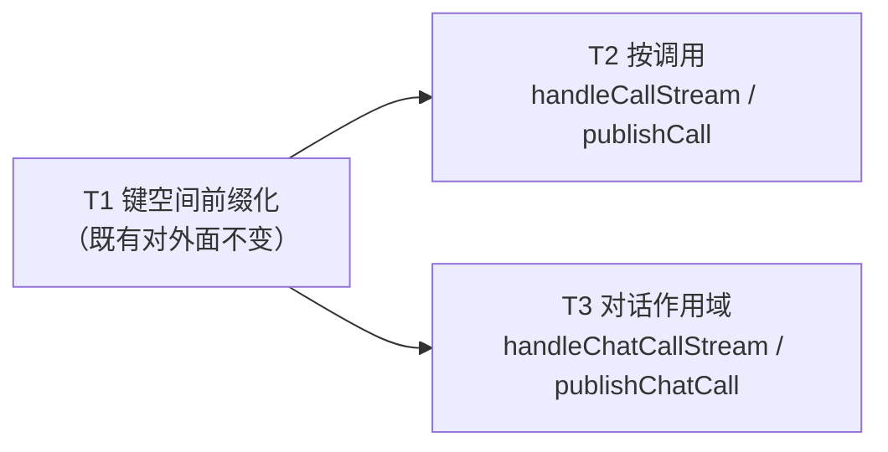

# pr-001-tasks — transport 调用键命名空间（本 PR 内部任务列表）

> 迭代：0018-chat-agent-subagent-protocol · 阶段 5（PR 实现）· 供 dev 消费
> 主依据：`prs/pr-001-transport-call-key-namespace.md`（验收标准 6 条）
> 真源：`architecture.md` §4.2（transport 键空间扩展）+ §9.2 L2-16 + §8.2「`src/transport.js`」行 + §11-12

## 实现范围（供 dev 快速对齐）

| 项 | 内容 |
|---|---|
| 唯一改动文件 | `oamp/src/transport.js`（阶段 3 实测 93 行） |
| 零改动面 | `oamp/test/transport.test.js`（429 行，**零改写**，仅作回归证据）；`oamp/src/web.js`（调用面接线由 pr-003 / pr-004 承担）；`oamp/package.json`；其余任何文件 |
| 核对载体 | `node --test oamp/test/transport.test.js`（既有面回归）+ 不提交的临时脚本 / REPL（做结构性核对：键前缀产物、双键发布、先订阅再发起）；**本 PR 不新增测试文件**（新增面端到端断言落 pr-005） |
| 上游依赖 | `depends_on` 为空；被 pr-002 依赖（本 PR 是其前置） |

## 全局约束（三个任务共同遵守，任一任务违反即该任务不通过）

1. **零新 import / 零新依赖**：`transport.js` 保持零 import；`oamp/package.json` 的 `dependencies` 仍为 `{}`。
2. **既有对外面逐字不变**：`createSseTransport` 返回对象既有成员 `kind` / `handle` / `publish` / `publishGlobal` / `globalCount` / `close` / `closeAll` 的名称、签名、语义、帧格式（`event:` + `data:` JSON 行 + 空行）、首帧 `retry: 1000`、默认 15 s keepalive、订阅建立与断开清理，全部不变；**新增仅限末尾 4 个键**。
3. **既有测试零改写**：`node --test oamp/test/transport.test.js` 全绿，且 `git diff -- oamp/test/transport.test.js` 为空。
4. **不改本 PR 文件范围外的文件**（`oamp/**` 其它文件、`api-routes` 等测试面、文档面一律不动）。

---

## 任务列表

### T1: 把键构造收进三个具名函数并加互不相交的命名空间前缀，既有对外面逐字不变

- **验收标准**:
  - `oamp/src/transport.js` 内存在三个具名键构造函数 `chatKey` / `callKey` / `chatCallsKey`，产物前缀分别为 `chat:` / `call:` / `chat-calls:`。判据：源码可见三处定义且返回模板串以对应前缀起头。
  - 三个前缀**互不为前缀**：`'chat:'`、`'call:'`、`'chat-calls:'` 任意两两之间，前者均不是后者的前缀，反之亦然 ⇒ 对任意非空 id，`chatKey(a)` / `callKey(b)` / `chatCallsKey(c)` 三者两两字符串不相等。判据：可直接做字符串核对（不依赖运行代码）。
  - 全局键仍为 `null`（不进任何前缀空间）：`handle(req,res,{chatId:null})` 与 `publishGlobal(event)` 走 `null` 键，`null` 与任意字符串键不相等。判据：既有用例「全局键：publishGlobal 只到 /api/events 订阅者，chat 订阅者收不到（键隔离）」不变；`handle(…,{chatId:null})` 的订阅者收 `publishGlobal` 而收不到 `publish(<任意字符串>, …)`。
  - `handle` / `publish` / `close` 内部改用 `chatKey(chatId)` 后，对外行为逐条不变：同一 `chat_id` 的订阅者仍收到 `publish(chatId, event)` 的帧；`close(chatId)` 仍只结束该 `chat_id` 的订阅、其它 chat 不受影响；`close(chatId)` 之后的 `publish(chatId, …)` 无写入。
  - 返回对象仍含 `kind: 'sse'` 与 `handle` / `publish` / `publishGlobal` / `globalCount` / `close` / `closeAll`；`globalCount()` 仍只计全局（`null`）键的订阅数，chat 订阅不计入。
  - 既有 SSE 首帧与心跳不变：订阅建立首帧恰为 `retry: 1000`；未注入 `heartbeatMs` 时默认周期 15000 ms；`closeAll()` 后心跳停止。
  - 回归：`node --test oamp/test/transport.test.js` 全绿，且 `git diff -- oamp/test/transport.test.js` 为空（全局约束 3）；不新增任何 `import`（全局约束 1）。
- **前置依赖**: 无
- **优先级**: P0
- **追溯**: architecture.md §4.2（「把键构造收进三个具名函数，使三个命名空间结构性不相交」+ 三个键函数代码块 + 「全局键仍为 null」+ 「对外既有 API 语义不变」）；§9.2 L2-16（键空间加前缀，被否决替代 = 直接复用 `'call:'+id`）；§8.2「`src/transport.js`」行；§11-12（`test/transport.test.js` 明确零改写）；pr-001 验收 2 / 4 / 5 / 6

### T2: 新增按调用订阅 `handleCallStream` / `publishCall`，一次发布同时写入调用键与对话的调用键

- **验收标准**:
  - `handleCallStream(req, res, { callId })` 建立订阅并复用既有 `handle*` 内核：SSE 响应头 `content-type: text/event-stream; charset=utf-8` / `cache-control: no-store` / `connection: keep-alive`，首帧恰为 `retry: 1000`；客户端断开后该订阅被移除（再 `publishCall` 不向已关闭连接写入）；keepalive 照既有周期写 `: keepalive` 注释行。判据：临时脚本起真实 `node:http` 服务、以 `handleCallStream` 为 handler、裸 SSE 客户端读流核对。
  - `publishCall(callId, event)` 一次调用**同时**写入 `call:<callId>` 与 `chat-calls:<chatId>` 两个键：两个键上的订阅者各收到一份内容相同的帧 `event: <type>\ndata: <JSON.stringify(event.data)>\n\n`；任一键无订阅者时不抛错、不缓存、不补发（与既有 `publish` 同口径）。
  - 按调用键隔离：订阅 `call:C1` 的客户端收不到 `publishCall('C2', …)` 的帧；`call:` 键订阅者收不到既有 `publish(chatId, …)`（chat 键）与 `publishGlobal(event)`（`null` 键）的帧。
  - 结构性防串键（§4.2 明写的窗口）：以 `chatId = 'call:<某调用 id>'` 走既有 `handle` 建立订阅，再 `publishCall('<该调用 id>', event)` ⇒ 该 chat 订阅者**收不到**该帧（`chatKey('call:X')` 与 `callKey('X')` 不相等）。
  - 存在性：`grep -n 'handleCallStream\|publishCall' oamp/src/transport.js` 可见两处定义 + 末尾返回对象中的两个键。
  - 回归：`node --test oamp/test/transport.test.js` 仍全绿、`git diff -- oamp/test/transport.test.js` 为空；不新增任何 `import`。
  - `[model_inferred]` `publishCall` 的 `chatId` 取自 `event` 携带的 `chat_id`：§4.2 固定签名为两参 `publishCall(callId, event)` 且未给出 chatId 的入参位置，而 §4.1 三类事件的 `data` 均含 `chat_id` ⇒ 带内唯一可得来源。判据：`publishCall('C1', { type:'call_result', data:{ chat_id:'CH', call_id:'C1', … } })` ⇒ `chat-calls:CH` 上的订阅者收到该帧。
- **前置依赖**: T1
- **优先级**: P0
- **追溯**: architecture.md §4.2（「新增 2 对方法：`handleCallStream` / `publishCall`」+「`publishCall` 同时写 `call:<id>` 与 `chat-calls:<chatId>`（调用方事件一处发布、两个作用域各取所需）」+ 串键窗口论证 + 「keepalive / `retry: 1000` / 订阅建立与断开清理逐字沿用（同一 `handle*` 内核）」）；§4.1 事件表（`call_state` / `call_update` / `call_result` 的 `data` 均含 `chat_id`、`call_id`）；§8.2；prd/F07 验收 1、3（终态事件带调用 id / 可按调用订阅）；pr-001 验收 1 / 3 / 5 / 6

### T3: 新增对话作用域调用订阅 `handleChatCallStream` / `publishChatCall`

- **验收标准**:
  - `handleChatCallStream(req, res, { chatId })` 在 `chat-calls:<chatId>` 键上建立订阅，复用既有 `handle*` 内核（SSE 头、首帧 `retry: 1000`、客户端断开后移除、keepalive 周期同上）。判据：临时脚本同 T2 的裸 SSE 客户端载体核对。
  - `publishChatCall(chatId, event)` **只写** `chat-calls:<chatId>`：该键上的订阅者收到一帧；既有 chat 键 `chat:<chatId>`（经 `publish`）与全局键 `null`（经 `publishGlobal`）上的订阅者**收不到**该帧（`call:` 键的收口由 T2 覆盖）。
  - 「先订阅、再发起」的载体成立（F07 验收 1 的传输层证据）：先以 `chatId=CH` 建立 `handleChatCallStream` 订阅，随后 `publishChatCall(CH, event)` ⇒ 该订阅者收到该帧。判据：订阅建立是收帧的充分条件，无需任何查询动作。
  - 不补发（与既有 `/api/stream` 同口径）：订阅建立**之前**发布的帧，后建订阅者收不到（不缓存、不排队）。
  - 作用域互不串扰：`chat-calls:` 键订阅者收不到 `publish(chatId, …)`（既有 chat 事件）与 `publishGlobal(event)`（全局事件）的帧；反向亦成立（`chat:` 与 `null` 键订阅者收不到 `publishChatCall` 的帧）。
  - 断开与整体关闭：`closeAll()` 结束全部订阅（含 `call:` 与 `chat-calls:` 键上的订阅），调用后 `publish` / `publishGlobal` / `publishCall` / `publishChatCall` 均无写入。`[model_inferred]`
  - 存在性：`grep -n 'handleChatCallStream\|publishChatCall' oamp/src/transport.js` 可见两处定义 + 末尾返回对象中的两个键。
  - 回归：`node --test oamp/test/transport.test.js` 仍全绿、`git diff -- oamp/test/transport.test.js` 为空；不新增任何 `import`。
- **前置依赖**: T1
- **优先级**: P0
- **追溯**: architecture.md §4.2（「新增 2 对方法：`handleCallStream` / `publishCall`、`handleChatCallStream` / `publishChatCall`」；`chat-calls:<chatId>` 键定义；「订阅建立与断开清理逐字沿用（同一 `handle*` 内核）」）；§4.1（`GET /api/calls/stream?chat_id=<id>` = 对话作用域，「含尚未发起的调用 ⇒ 可『先订阅、再发起』」，F07 验收 1 的载体）；§9.2 L2-3；prd/F07 验收 1；prd/F08 验收 1；pr-001 验收 1 / 5 / 6

> **落地顺序建议**：T2 与 T3 在实现上互不依赖（各自新增独立的键位与方法），但**共用末尾 `return { … }` 的那一行键列表**——建议按 T2 → T3 顺序落地（同一 dev 顺序提交），避免同一行被两处编辑。

---

## 依赖图（无环）

- **拓扑序**：`T1 → T2`、`T1 → T3`（T2 与 T3 之间无依赖，可任意先后）。
- **最长依赖链 / 关键路径**：长度 2 —— `T1 → T2`（或 `T1 → T3`），无汇聚节点。
- **环**：无（T2 / T3 均只指向 T1，T1 无入边）。
- 无「因顺序偏好而虚构的依赖」：T2 / T3 的**实现**均只依赖 T1 产出的 `callKey` / `chatCallsKey` 与 `handle*` 内核；二者之间的验收互相独立。

## 与 pr-001 验收标准的逐条对位表

| pr-001 验收标准 | 落点任务 | 判据（该任务内的对应条目） | 追溯 |
|---|---|---|---|
| 1. 新增 `handleCallStream` / `publishCall` / `handleChatCallStream` / `publishChatCall` 四个方法，可见 4 处定义与末尾返回对象的键 | T2（前 2 个）+ T3（后 2 个） | T2「存在性」条 + T3「存在性」条（`grep -n` 各见 2 处定义 + 返回对象键） | architecture.md §4.2 |
| 2. 三个命名空间的键两两不相等；前缀互不为前缀；全局键仍为 `null` | T1 | T1 第 2 条（前缀两两不互为前缀 ⇒ 键恒不相等）+ 第 3 条（全局键仍 `null`，与任意字符串键不相等） | architecture.md §4.2 |
| 3. `publishCall` 一次发布同时写入该调用的键与该调用所属对话的调用键 | T2 | T2 第 2 条（`call:<callId>` 与 `chat-calls:<chatId>` 各收一份同内容帧）+ 第 4 条（串键窗口不成立） | architecture.md §4.2 |
| 4. 既有对外面逐字不变（`kind` + 6 个方法；`retry: 1000`；15 s keepalive；订阅建立与断开清理同内核） | T1 | T1 第 4 条（`handle`/`publish`/`close` 对外行为不变）+ 第 5 条（返回对象既有成员）+ 第 6 条（首帧 / 心跳 / 关闭） | architecture.md §4.2「对外既有 API 语义不变」；§11-12 |
| 5. `node --test oamp/test/transport.test.js` 全绿，且该文件 `git diff` 为空 | T1（主）+ T2 / T3（回归保持） | T1 第 7 条；T2「回归」条；T3「回归」条（后两者为「T1 全绿状态在新增面落地后仍保持」） | architecture.md §11-12（该文件明确零改写）；pr-001 验收 5 |
| 6. `oamp/package.json` 的 `dependencies` 仍为空对象（零新依赖） | T2 + T3（新增代码处）+ 全局约束 1 覆盖 T1 | 各任务「不新增任何 `import`」条；全局约束 1（`dependencies` 仍 `{}`） | architecture.md §9.1 / §9.3（零新依赖锁）；pr-001 验收 6 |

## 说明：需主 agent 确认的推导项（`[model_inferred]`）

| 任务 | 推导项 | 推导依据 | 若被否决的影响面 |
|---|---|---|---|
| T2 | `publishCall(callId, event)` 的 `chatId` 取自 `event.data.chat_id` | §4.2 固定两参签名且未给出 chatId 位置；§4.1 三类事件 `data` 均含 `chat_id` ⇒ 带内唯一可得来源 | 仅 T2 的第 2 / `[model_inferred]` 条验收写法需改（T1 / T3 不受影响） |
| T3 | `closeAll()` 覆盖 `call:` / `chat-calls:` 键上的订阅 | §4.2「`closeAll()` 名称与行为逐字保持」+ 既有语义「移除全部订阅并结束所有连接」；新键空间的订阅属于「全部」 | 仅 T3「断开与整体关闭」条的措辞 |

无新增架构决策，无循环依赖。
