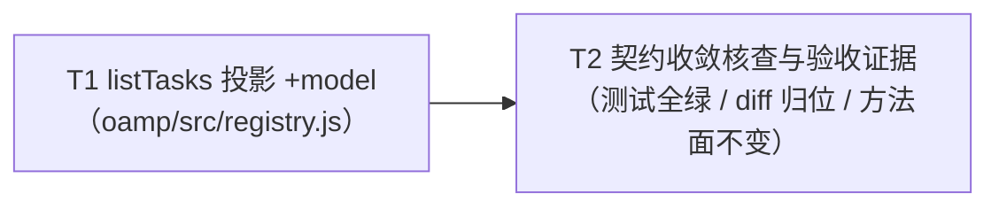

# pr-002 内部任务列表（registry `listTasks` 投影 +`model`）

> 迭代：0018-chat-agent-subagent-protocol · 阶段 5（PR 实现）· 由 `planner` 角色产出（PR 内任务，非全局任务图）
> 主依据：`prs/pr-002-registry-task-list-model.md`；背景真源：`architecture.md` §3.4 / §8.2 / §9.2 L2-9 / §10-2、`prd/F09-call-roster.md` 架构段 T-06 与验收 1
> 唯一文件范围：`oamp/src/registry.js`（修改）。**本 PR 不新增测试文件**（F09 的 roster 组 G 落 `oamp/test/call-protocol.test.js`，属 pr-005 范围，见 `prd/F09-call-roster.md` T-12）
> 任务总数：**2**

---

## 任务

### T1: `listTasks` 投影追加只读字段 `model`

- **验收标准**:
  1. `oamp/src/registry.js` 的 `listTasks`（当前 `@255-271`）中 `out.push({…})` 投影对象新增 `model` 键，取值表达式 = `task.result?.model ?? null`。判据：读该投影对象；该函数体内 `model` 的全部出现均为这一处投影，不存在以 `task.label`、请求参数或实例默认模型常量作回退的写法（`grep -n 'function listTasks' oamp/src/registry.js` 后读 `out.push` 字段清单）。
  2. 进行中任务（`task.result === null`，即 `state ∈ {submitted, working}`）该行 `model === null` 且键存在（`'model' in row === true`）。判据：读表达式即可判定（`result` 为 `null` 时可选链短路 → `?? null`）；如需运行证据，可用一次性 `node --input-type=module -e` 裸调 `createRegistry()` 自证（不落测试文件、不改 `oamp/test/**`）。
  3. 终态任务该行 `model` = `task.result.model`（执行侧实报生效值：daemon 成功体 `agent.js:333`、失败体 `agent.js:350`）；终态体无 `model` 时该行 = `null`（非 `undefined`）。判据：对 `finishTask(…, {state:'completed'})` 与 `finishTask(…, {state:'completed', model:'alpha/model-a'})` 两种输入，投影分别得 `null` / `'alpha/model-a'`。
  4. `createTask` / `recordTaskUpdate` / `finishTask` / `getTask` 的字段与语义零改动（含 `updates[]`、`updatesTruncated`、`result` 的形状与写入时机）。判据：本 PR 内这四段的 `git diff` 零 hunk。
  5. `listTasks` 的签名 `({ state } = {})`、既有 9 个投影键（`task_id` / `from` / `to` / `state` / `label` / `created_at` / `updated_at` / `updates` / `updatesTruncated`）与倒序排序行零改动；`createRegistry()` 的导出方法清单既不新增也不重命名。判据：`git diff` 不含 `out.sort(…)` 行与 `return { … }` 导出清单中的任何行。
- **前置依赖**: 无
- **优先级**: P0
- **追溯**: `architecture.md` §3.4「`model`」行（`task.result.model ?? null`；进行中 `null`）、§8.2 `src/registry.js:255-271` 修改行（`+model: task.result?.model ?? null`）、§9.2 L2-9、§10-2（加字段，方法集数量与名称不变）；`prd/F09-call-roster.md` 验收 1（行内「模型」列）+ 架构段 T-06。验收 3 另溯 §3.2「`model`」行（读不到 → `null`，不用请求参数冒充）与 `agent.js:333/350` 实报点。

### T2: 契约收敛核查与 PR 验收证据采集（零回归 / diff 归位 / 方法面不变）

- **验收标准**:
  1. `node --test oamp/test/task.test.js` 全绿（退出码 0，无失败用例）。判据：命令汇总行；该文件不被读写（见验收 4）。
  2. `git -C <本 PR worktree> diff --name-only`（对迭代分支 base）输出恰为 `oamp/src/registry.js` 一行。判据：不含 `oamp/src/router.js`、`oamp/src/task.js`、`oamp/test/**`、`docs/**` 中任一路径。
  3. `oamp/src/registry.js` 的 diff 恰有 1 个 hunk，且其变更行全部位于 `listTasks` 函数体内（`out.push({…})` 投影块）；`createTask` / `recordTaskUpdate` / `finishTask` / `getTask` 段零 hunk。判据：`git diff -U0 oamp/src/registry.js` 的 hunk 头行号区间 ⊆ `listTasks` 函数体行号区间。
  4. `git diff oamp/test/task.test.js` 为空，既有 `task.test.js:228-231` 的 `router.task_list` 属性断言逐字未改。判据：该文件 diff 无输出，且 `git diff --name-only` 不含该路径。
  5. `git diff oamp/src/router.js` 为空，且协议方法面仍 7 个 —— `oamp/README.md` §协议速览「方法面」行的 7 项（`agent.register` / `agent.heartbeat` / `agent.deregister` / `message.send` / `message.deliver` / `message.ack` / `router.status`）逐字未变。判据：`git diff --name-only` 不含该路径；`oamp/test/project-workspace.test.js:965-980` 的既有断言零改写（可单跑该用例复核）。
- **前置依赖**: T1
- **优先级**: P0
- **追溯**: `prs/pr-002-registry-task-list-model.md` 验收 3 / 4 / 5 与「文件范围」；`architecture.md` §8.2（`src/registry.js:196-252` 零改动行、`src/router.js` 零改动行、`src/{…,task,…}.js` 全文零改动行）、§11 第 12 行（「明确不受影响（已逐条核对 ⇒ 零改写）」含 `test/task.test.js:228-231`）、§10-2；`prd/F14-existing-behavior-unchanged.md` 验收 4（协议面数量与名称无增无删）。

---

## 依赖图（无环）

- 节点 2 个、边 1 条（T1 → T2）：**无环**（无自环、无回边；T2 的唯一前置为 T1，T1 无前置）。
- 最长（也是唯一）依赖链 = **T1 → T2**；关键路径任务 = **T1、T2**（两个都在关键路径上，无并行分支）。
- 任务间无环形等待：T1 的实现不消费 T2 的产物（T2 只读 T1 的 diff 与既有测试结果）。

---

## 与 pr-002 验收标准 5 条的逐条对位表

| # | pr-002 验收标准（逐字摘要） | 承接任务 | 判据落点 |
|---|---|---|---|
| 1 | `listTasks` 投影行包含 `model` 键，取值 = `task.result?.model ?? null`（读 `out.push({…})` 字段清单） | T1 | T1 验收 1（键 + 表达式 + 无回退写法） |
| 2 | 进行中任务（`result === null`）该键为 `null`，不填请求参数或推测值 | T1 | T1 验收 2（进行中）、验收 3（终态读不到时亦 `null`，不冒充） |
| 3 | 本 PR diff 只落在 `listTasks` 投影一处；`createTask` / `recordTaskUpdate` / `finishTask` / `getTask` 字段与语义零改动 | T1（实现约束）+ T2（收敛核查） | T1 验收 4；T2 验收 3（单 hunk 且行号归位于 `listTasks`） |
| 4 | `node --test oamp/test/task.test.js` 全绿，且该文件 `git diff` 为空 | T2 | T2 验收 1 + 验收 4 |
| 5 | 协议方法面仍 7 个（`oamp/src/router.js` 零改动，`git diff --name-only` 不含该路径） | T2 | T2 验收 5（diff 为空 + README §协议速览 7 项逐字未变） |

> 范围提示（不新增任务）：F09 验收 3 的「状态与按 id 查询一致」由本 PR 的「单真源、web 侧不自建索引」构造性保证（`architecture.md` §3.4 / L2-9），其端到端断言落 pr-005 组 G；F09 验收 4/5 的全部落点亦在 pr-003（roster 路由）与 pr-005（组 G）。本 PR 不越界承接。

---

## 上报事项（planner 报告契约项）

1. **循环依赖**：无（依赖图为单边链 T1 → T2）。
2. **`[model_inferred]` 验收标准**：**无**——T1/T2 全部验收标准均可逐条回指上述 `architecture.md` / `prd/*.md` / PR 文件原文或原文的直接改写。
3. **粒度决策（非显然，供主 agent 知悉）**：本 PR 为单字段投影 + 证据采集，两个任务各自工作量均 < 1 天，未继续细分；拆点理由是 T2 的判据对象（diff 收敛 / 既有测试零改写 / 方法面不变）不是 T1 的实现内容，需要独立一次核查动作与证据，具备独立验收价值——合并为一个任务会让「实现正确」与「无 PR 外改动」两类判据混在一处，降低可判性。未再细拆（例如把「跑测试」与「对 diff」拆开）因为二者共用同一次工作上下文，拆分无独立验收价值。
4. **未新增任何架构决策**；未改动任何上游产物（`architecture.md` / `prd/**` / PR 文件 / `oamp/**` 均只读）。
5. **上游口径提示（不影响本 PR 实现与验收，无需架构补充）**：`architecture.md` §1.1 对 `router.js` 的括注写作「7 方法分发（`agent.*` / `message.*` / `router.status|task_get|task_list`）」，其括注枚举含 `router.task_get` / `router.task_list`；而方法面的规范宿主（`oamp/README.md` §协议速览「方法面」行，由 `oamp/test/project-workspace.test.js:965-980` 逐字断言）为 7 项且**不含**这两个 demo 查询方法（`router.js` 内实际 `case` 分支为 8 个 = README 7 项去掉非分发入口的 `message.deliver`，再加 `router.task_get` / `router.task_list`）。本任务图因此以 **README 方法面 7 项 + `router.js` diff 为空** 作为 T2 验收 5 的判据宿主，不据该括注改写判据、也不新增任务。
