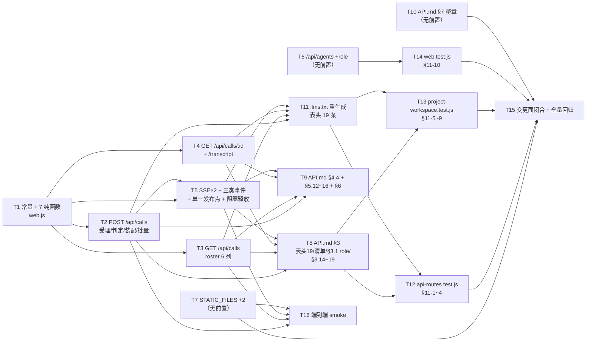

# pr-003 内部任务列表（调用面 HTTP/SSE 6 条路由 + 契约文档 + 既有测试必变点）

> 迭代：0018-chat-agent-subagent-protocol · 阶段 5（PR 实现）· 由 `planner` 角色产出（**PR 内任务**，非全局任务图）
> 主依据：`prs/pr-003-call-http-surface-and-contract-docs.md`（15 张卡 F01~F12、F14~F16；6 个文件；**含既有测试断言改写**）
> 真源：`architecture.md` §2（T-01/T-10/T-13/T-14）、§3（T-02/T-03/T-06/T-08）、§4（T-05）、§5（T-04）、§7（T-15/T-16/T-11）、§8（出现点清单）、§11（必然变更点清单）、§12（测试组织）；`prd/F01~F12,F14,F15,F16*.md`（各卡「架构（阶段 3 已填）」段）
> 工作区：`/Users/chenchiyuan/projects/agents/.pb-agents/worktrees/0018-chat-agent-subagent-protocol/.pb-agents/worktrees/0018-pr-003-call-http-surface-and-contract-docs`（分支 `feat/0018-pr-003-call-http-surface-and-contract-docs`，base = 迭代分支 tip `bfe214f` / 本 PR 拉出点 `95051b0`）
> **任务总数：16**（T1~T16）

---

## 文件范围与显式排除

| 项 | 内容 |
|---|---|
| 允许改动（6 个文件，PR 文件「文件范围」逐字） | `oamp/src/web.js`（修改）、`oamp/API.md`（修改）、`oamp/llms.txt`（修改，重生成）、`oamp/test/api-routes.test.js`（修改）、`oamp/test/project-workspace.test.js`（修改）、`oamp/test/web.test.js`（修改） |
| **显式排除**（不属本 PR，越界即验收不通过） | ① `oamp/test/call-protocol.test.js`（§12.1 的新增测试文件 = pr-005 `pr-005-call-protocol-acceptance-tests.md`）；② `oamp/web/calls.html` + `oamp/web/calls.js`（pr-004 `pr-004-console-call-page.md`）；③ `oamp/web/index.html`、`oamp/README.md`（pr-004）；④ `oamp/src/transport.js`（pr-001 已合入，本 PR 只**调用**其 `handleCallStream`/`publishCall`/`handleChatCallStream`/`publishChatCall`）；⑤ `oamp/src/registry.js`（pr-002 已合入，本 PR 只**消费** `listTasks` 的 `model` 投影）；⑥ `oamp/src/{router,agent,persist,context-pool,role-binding}.js`、`oamp/package.json`、`cluster.json`、仓库根 `roles/**` |
| 已合入的上游产物（本 PR 可直接依赖） | `oamp/src/transport.js` 的四方法 + 三键空间（`chat:` / `call:` / `chat-calls:`）；`oamp/src/registry.js` 的 `listTasks` 投影 `model: task.result?.model ?? null` |

## 全局约束（任一任务违反即该任务不通过）

1. **文件闭包**：本 PR 的 `git diff --name-only <base>` 恰为上表 6 个路径，无第七个路径；写入一律用本 PR worktree 的绝对路径，`git` 一律 `git -C <worktree>`。
2. **零新增面**：零新第三方依赖（`oamp/package.json` 的 `dependencies` 仍 `{}`）、零新 agent↔router 协议方法（仍 7 个）、零新存储（表 / 列 / 文件）、零新错误码（`ERR_CODE` 仍 5 码封闭）、零新进程 / 监听面 / 配置键 / 环境变量、零新构建步骤。
3. **§11 之外既有测试文本零改写**：`oamp/test/**` 的改写仅限 `architecture.md` §11 第 1~10 条点名的行区间，其余既有断言、测试标题与注释逐字不变（`F14` 验收 2 / 3）。
4. **表项顺序约束**：6 条调用面表项**末位追加**在既有 13 条之后，顺序 = §2.1 的 14~19；字面量 `GET /api/calls/stream` 与两条 `:call_id/…` 形态**必须**排在 `GET /api/calls/:call_id` 之前（`compileRouteMatcher` 的 `prefixSuffix` 会把 `/api/calls/stream` 命中成 `call_id='stream'`）。
5. **登记元数据契约**：每条新表项 8 字段（`method`/`path`/`summary`/`params`/`response`/`errors`/`kind`/`docLink`）齐备；`params` 每项 5 字段（`name`/`in`/`type`/`required`/`desc`，`enum` 可选）；`errors[]` 取值 ⊆ `Object.values(ERR_CODE)`；`kind ∈ {json, sse}`；两条 SSE 表项的 `response` 字段**逐名**列出 `call_state` / `call_update` / `call_result`。
6. **错误出口唯一**：调用面全部 4xx/5xx 经既有 `sendError` 构造，不新造响应形状、不出现错误码字面量（`code: 'XXX'` 只允许出现在 `ERR_CODE` 定义块内）。
7. **判定先于写入**：受理的全部校验（归属 / 目标 / 入参形态）在任何写库、登记、派发之前完成 ⇒ 失败请求零副作用（`tasks` 无条目、`messages` 无 `in` 行、roster 无新增行）。
8. **既有链路零改写**：既有 13 条表项、既有 handler、既有 SSE 事件面（`message`/`task_update`/`chat_state`/`notice`/`agent_online`/`agent_offline`）的帧、顺序、文案逐字不变；`finishTask` 的「写 `out` → 推 `message` → 推 `chat_state`」三行顺序零改动（新帧只可**追加**发布）。

---

## 任务列表

### T1: `oamp/src/web.js` 落地调用面常量与 7 个纯函数（信封 / 截断 / 结构校验 / prompt 装配 / 角色薄封装）

- **验收标准**:
  1. `composeCallEnvelope(task)` 在场且为纯函数（只读入参条目，不读磁盘 / 不发 UDS / 不读时钟以外状态）；返回对象的键集合与键序恰为 `['call_id','agent','state','duration_ms','model','truncated','text','structured_output','error','exit_code']`（11 键）。判据：读函数体；对构造条目做 `Object.keys(...)` 断言（§3.1 信封 + §3.2 字段来源）。
  2. 取值口径：`call_id = task.task_id`；`agent = roleOfInstance(task.to)`（不可解析 → `null`）；`state = task.state` ∈ `{submitted, working, completed, failed}`；`duration_ms = task.result?.duration_ms ?? null`（非终态 `null`）；`model = task.result?.model ?? null`（**不**用请求参数 / 实例默认冒充）；`text = task.result?.text ?? null`（失败且无文本 `null`）；`structured_output` 仅带 `output_schema` 且校验通过时非 `null`；`error = task.result?.error ?? null`；`exit_code = task.result?.exit_code ?? null`。判据：对 `submitted`/`working`/`completed`/`failed` 四种构造条目逐字段断言（§3.2 表）。
  3. 键集合内零 `usage` / `tokens` / `cost` / `aborted`，且二者在 web.js 全文件零出现：`grep -nE 'usage|tokens|cost|aborted' oamp/src/web.js` **零命中**。判据：该检索零输出（PR 验收 4 的检索式；F06 验收 4 / 差异 ⑧ / N12）。
  4. `callTruncated(task) = task.updatesTruncated === true || task.updates.some((u) => u.detail?.event === 'truncated')`（OR 口径、单一真源）。判据：四种组合（皆假 / 仅前者真 / 仅后者真 / 皆真）逐条断言；且全文件仅此一处实现该口径（`grep -n 'updatesTruncated' oamp/src/web.js` 的调用点均指向本函数）。
  5. `validateOutputSchema(schema)` 只接受 `{type?, properties?: {<名>: {type}}, required?: [...]}`：`type` 缺省 `object` 且 ∈ 7 种（`object`/`array`/`string`/`number`/`integer`/`boolean`/`null`）；`properties` 每项只允许 `type` 一个键且值 ∈ 7 种；`required` 每名必须出现在 `properties` 中；出现 `$ref`/`oneOf`/`anyOf`/`allOf`/`items`/`format`/`pattern`/嵌套 `properties` 任一 ⇒ 判非法（返回 falsy → 调用方 400，**不静默忽略**）。判据：上述每类非法形态 + 合法形态各一条断言（§2.5 / T-09）。
  6. `extractStructuredOutput(text)` = ①`JSON.parse(text.trim())` 成功即返回；②失败则剥离一层 ``` 围栏（含 ```json 标注）后重试；③仍失败返回 `null`。判据：裸 JSON / 围栏 JSON / 非 JSON 文本三条输入（§2.5）。
  7. `validateAgainstSchema(value, schema)` 做三层判定（`type` / `required` / `properties.<名>.type`），未声明键**不判错**。判据：类型不符 / 缺 `required` / 属性类型不符 / 多出未声明键四种输入（§2.5）。
  8. `composeCallPrompt({ context, task, outputSchema })` 装配固定形态：仅 `context` → `【调用共享说明】\n<context 原文>` + `\n\n` + `task` 原文；仅 `output_schema` → `task` 原文 + `\n\n` + `【返回格式要求】\n请仅输出一个 JSON 对象，满足以下结构（不要输出 JSON 以外的内容）：\n<output_schema 的规范 JSON 字符串>`；两者皆无 → `task` 原文**逐字**（零添加）；两者皆有 → 区块顺序「共享说明 → 原文 → 格式要求」，以 `\n\n` 连接；`context` trim 后为空 ⇒ 不生成该区块。判据：五种输入的精确字符串断言，且 `task` 原文在各形态中逐字子串出现（无前缀污染）（§2.2 / F04 验收 1 / F11 验收 4）。
  9. `roleOfInstance(instanceId)` 是 `roleFromInstanceId` 的薄封装，**不含**第二套推导公式（不自行拼 `pb-` 前缀、不自行判角色文件存在性）。判据：读函数体（单行转发）。对照面：`oamp/src/role-binding.js` 的 `git diff` 为空（§5 / C-4）。
  10. 常量齐备且取值与架构字面一致：`CALL_MODES`（`background`/`block`，默认 `background`）、`SCHEMA_MODES`（`permissive`/`strict`，默认 `permissive`）、受限子集键白名单 + 7 种 `type` 白名单、三类事件名（`call_state`/`call_update`/`call_result`）、`LABEL_MAX` 复用既有 60。判据：读常量区，取值逐项与 §2.2 / §2.5 / §4.1 对照。
  11. 新增纯函数集合 = §8.1 点名的 7 个（`composeCallEnvelope`/`callTruncated`/`validateOutputSchema`/`extractStructuredOutput`/`validateAgainstSchema`/`composeCallPrompt`/`roleOfInstance`）；纯逻辑不引入新 import（`role-binding.js` 的 import 由 T6 引入或由本任务一并引入，二者合计**仅此一条**新 import 行）。判据：`git diff -U0 oamp/src/web.js` 的 import 区 hunk ⊆ 1 行。
  12. 不要求导出（§12.2 的组 B/D/H 观测点均为 HTTP 面）；本任务不改动既有 13 条表项与既有 handler。判据：`git diff -U0 oamp/src/web.js` 中既有表项区零 hunk。
- **前置依赖**: 无
- **优先级**: P0
- **追溯**: `architecture.md` §2.2（装配块模板）、§2.5（受限子集 / 提取 / 三层校验 / `strict` 失败词）、§3.1（信封 11 键与单一构造点）、§3.2（字段来源对照）、§3.3（MI-06 OR 口径）、§5（角色薄封装）、§8.1「**新增纯函数**」行与 `:32-46` 常量行；`prd/F04` 验收 1/2、`prd/F06` 验收 1/3/4/5、`prd/F10` 验收 4

### T2: `POST /api/calls` 表项与受理面（判定顺序 / 错误映射 / 装配 / 派发 / 登记 / 批量 / 后台形态）

- **验收标准**:
  1. 表项在场且为 6 条调用面表项之首：`createApiRoutes({})` 的第 14 项签名 = `POST /api/calls`；8 字段齐备，`kind === 'json'`，`errors` 恰为 `['INVALID_PARAM','NOT_FOUND','PAYLOAD_TOO_LARGE','UPSTREAM_UNAVAILABLE']`（⊆ `ERR_CODE` 五码），`docLink === 'API.md#314-post-apicalls'`，`summary` 为「发起一次或一批调用」类一句话。判据：`grep -n "path: '/api/calls" oamp/src/web.js` 首条 = `POST /api/calls`；进程内读表项逐字段断言（§2.1 行 14 / F16 验收 1）。
  2. `params` 覆盖 §2.2 的九项且每项 5 字段：`chat_id`（body/string/required）、`agent`（body/string/required）、`task`（body/string）、`tasks`（body/json）、`context`（body/string）、`output_schema`（body/json）、`schema_mode`（body/string + `enum: ['permissive','strict']`）、`mode`（body/string + `enum: ['background','block']`）、`model`（body/string）。判据：读 `params` 数组，逐项 `{name, in, type, required, desc}` 五字段在场，`task`/`tasks` 的 `required: true`（互斥由受理逻辑保证）`[model_inferred]`。
  3. 判定顺序与 §2.3 的 1~4 步逐条一致，且**任一步失败即返回、零副作用**：
     - ① 请求体：畸形 JSON → 400 `INVALID_PARAM`；> 64 KiB → 413 `PAYLOAD_TOO_LARGE` + `connection: close`（沿用既有 `readBody`，不另写解析）。
     - ② 归属：`chat_id` 未提供 / `null` / `''` / 非字符串 → 400 `INVALID_PARAM`；`db.getChat(chat_id)` 不存在 → 400 `INVALID_PARAM`（文案含 `chat 不存在: <id>`）。
     - ③ 目标：`agent` 缺失 / 空 → 400 `INVALID_PARAM`；`roleFromInstanceId(instanceIdForRole(agent)) !== agent` → 404 `NOT_FOUND`。
     - ④ 形态：`task`/`tasks` 互斥与必填、`mode`/`schema_mode` 枚举、`output_schema` 子集（T1 验收 5）、`model` 匹配既有 `MODEL_RE`、`context` 类型 → 400 `INVALID_PARAM`。
     判据：对每条非法输入发一次请求断言 `{status, code}`；**且**每次失败后 `GET /api/calls` 行数与调用前相等、对应 chat 的消息数不变（构造性证据：判定先于 `db.insertInput` 与 `tasks.set`）。
  4. 调用面**不新增只读（409）分支**：对已归档 / 已关闭 chat 的调用请求不返回 409（§2.3 的判定顺序是封闭列表，无该步）`[model_inferred]`。判据：对归档 chat 发请求，断言 `status !== 409`。
  5. 派发装配与 §8.1 装配段同字段：`payloadBody = { executor:'omp-daemon', chat_id, prompt: composeCallPrompt(...), label: <task 原文前 LABEL_MAX(60) 字符>, ...(model ? {model} : {}), ...(project ? {project} : {}) }`；`project` = `db.projectByChat(chatId)` 的三要素 `{name, repo_url, agreement: PROJECT_AGREEMENT}`（与既有 `/api/messages` 同源、不复制文本）；`!` 前缀**不**被解释为 shell；**不**提供 `one_shot`；不新增 payload 字段。判据：读装配点；与既有 `web.js:696-701` 默认分支逐字段对照。
  6. 登记先于 `await`：`tasks.set(callId, entry)` 在 `sendTask(...)` 之前；条目在既有字段（`chatId`/`agentId`/`lines`/`landed`/`attempts`/`slow`/`registeredAt`/`timer`）之上追加调用面字段 `entry.call`（含角色、`chatId`、等待句柄与其释放器）；既有字段名与语义零改动，既有消费者忽略新字段。判据：读 handler 与登记构造处；既有字段引用零 hunk。
  7. 派发失败映射：**首项**失败且 `err.dataCode ∈ {AGENT_OFFLINE, AGENT_NOT_FOUND}` → 404 `NOT_FOUND`（统一文案 `agent 不可用: <role>（无对应在线实例）`，三种「不可用」情形不区分、零新错误码），且此时**零调用被创建**；其余 dispatch 错误 → 502 `UPSTREAM_UNAVAILABLE`；**首项成功、后续项失败** ⇒ 502 且已派出的项保留（响应体仍是既有 `{error, code}`，不含部分结果）。判据：离线 agent / 不存在角色 / 混合失败三情形断言 `{status, code}`；首项失败后 roster 无新增行。
  8. 派发失败时对话侧行为与既有逐字一致：先落 `in` 行（`meta: { task_id }`）再派发；失败时补一行 `out`（`error: 'dispatch_failed'`）+ 推 `chat_state`（状态读库值）；既有 `/api/messages` handler 与 `isReadonly` 分支零改写。判据：读失败分支与既有 `web.js:709-726` 同形；`oamp/test/api-routes.test.js` 的 L2 探针（离线 agent 派发失败仍 200 + `warning`）本任务不改且保持绿。
  9. 批量为逐项独立调用：`tasks[]` N 项 ⇒ N 个互不相同的 `call_id`（每项 = 一个独立调用，MI-02）；空数组 → 400 `INVALID_PARAM`；每项字段面 = `{task, output_schema?, schema_mode?, mode?, model?}`；**顶层 `context` 对批量各项共享生效**（整次提交的共享说明）`[model_inferred]`。判据：一次提交两项 → 响应 `calls.length === 2` 且两个 `call_id` 不相等、`GET /api/calls` 两行。
  10. 响应形态恒为 `{ calls: [信封…] }`，顺序 = 请求顺序（单项即 1 元素）；后台项（`mode` 缺省 = `background`）`state === 'submitted'`，与终态项**同一信封形状**。判据：单项与批量两条请求的响应键集合与 `state` 断言（§2.2 / §3.1）。
  11. 未声明字段忽略（与既有 `/api/messages` 同口径，不另行报错）；`project`（环境归属）与 `context`（本次调用共享说明）在装配处是两个独立区块、不合并、互不覆盖。判据：带未知字段请求与不带时结果一致；读装配点两区块独立（§2.3 / F11 验收 4）。
  12. 阻塞项的终态释放与返回属 T5（本任务只保证等待句柄已建立）；本任务验收以**校验 / 错误路径 / 后台形态 / 批量**为判据，不重复断言阻塞终态（跨任务注记，§2.4）。
- **前置依赖**: T1
- **优先级**: P0
- **追溯**: `architecture.md` §2.1 行 14、§2.2（入参契约表 + 装配块 + 请求体上限）、§2.3（判定顺序 1~4 + 错误映射 + 统一性 MI-01）、§8.1（`:606-722` 零改动行、`:1039` `sendTask` 零改动行、装配段、`entry.call` 修改行）；`prd/F03` 验收 1/2、`prd/F04` 验收 1~6、`prd/F11` 验收 1~4、`prd/F14` 验收 1；PR 验收 1/3/5

### T3: `GET /api/calls` 表项与 roster 六列投影（单真源 / 范围收口 / 无编排）

- **验收标准**:
  1. 表项：第 15 位签名 = `GET /api/calls`；`params: []`、`errors: []`、`kind: 'json'`、`docLink === 'API.md#315-get-apicalls'`（`errors` 取空数组沿用既有 `GET /api/projects` 体例：502 由分发层兜底、不逐路由登记）。判据：进程内读表项逐字段断言 + 签名序列断言。
  2. 数据来源 = **单次** `queryOnce(config.socketPath, 'router.task_list', {})`（不带 `state` 过滤参数）；web 侧不自建索引、不做 N+1 `task_get`、不新增存储。判据：读 handler（恰一次 `task_list` 调用、无常量级循环内的 `task_get`）；`oamp/src/registry.js` 的 `git diff` 为空。
  3. 范围收口 = `from === 'web'`：只列本 hub 派发的调用；`from === 'main'`（CLI `oamp task send`）的任务不出现在响应中。判据：读过滤谓词（`[model_inferred]` 过滤落点在 web 侧）；端到端观测落 pr-005 组 G。
  4. 行字段恰 6 列，键序 `['call_id','agent','state','started_at','ended_at','model']`：`call_id = task_id`；`agent = roleOfInstance(to)`（不可解析 → `null`）；`state` 直接取任务表值（不做映射、不缓存）；`started_at = created_at`（受理时刻）；`ended_at` = 终态时 `updated_at`、非终态 `null`，且终态 `ended_at >= started_at`；`model = task.result?.model ?? null`（进行中 `null`，不显示推测值）。判据：逐行 `Object.keys` 断言 + 进行中 `ended_at === null` + 终态 `ended_at >= started_at`（MI-07 / §3.4）。
  5. 响应形态 `{ calls: [...] }`，按 `created_at` 倒序（沿用 `listTasks` 既有排序，web 侧不重排、不排序参数化）。判据：读 handler 无 `sort`；两行响应顺序断言。
  6. 无过滤 / 无分页 / 无排序参数、无编排语义：`params: []`，handler 不解构 `query`/`num`。判据：`params` 为空数组 + handler 内零 `query` 出现（F09 验收 5 / N17 / MI-03）。
  7. 行内零成本 / token / 工具级字段：响应键集合不含 `usage`/`tokens`/`cost` 类键；`grep -nE 'usage|tokens|cost' oamp/src/web.js` 仍零命中。判据：键集合断言 + 检索零命中（F09 验收 4 / 差异 ⑭）。
  8. 状态同真源：roster 的 `state` 与该调用 `GET /api/calls/:call_id` 的 `state` 由同一任务表条目产出（本任务不引入第二处状态计算）。判据：读两处取值表达式均直取 `task.state`（端到端一致性断言落 pr-005 组 G）。
- **前置依赖**: T1
- **优先级**: P0
- **追溯**: `architecture.md` §2.1 行 15、§3.4（数据来源 + 范围 + 6 列口径 + 无过滤无编排）、§9.2 L2-9、§10-6、§8.1（`:904-912` 零改动、新增 6 条表项）；`prd/F09` 验收 1~5（MI-02/MI-03/MI-07）、`prd/F14` 验收 1

### T4: `GET /api/calls/:call_id` 与 `GET /api/calls/:call_id/transcript` 表项与 handler（终态 / 进行中 / 转录）

- **验收标准**:
  1. 两条表项在场且为调用面表项的两位末位：第 18 位 = `GET /api/calls/:call_id/transcript`（`errors: ['NOT_FOUND']`、`kind: 'json'`、`docLink === 'API.md#318-get-apicallscall_idtranscript'`）；第 19 位（**全表末位**）= `GET /api/calls/:call_id`（`errors: ['NOT_FOUND']`、`kind: 'json'`、`docLink === 'API.md#319-get-apicallscall_id'`）；两条 `params` 各 1 项 `call_id`（`in:'path'`、`type:'string'`、`required:true`、5 字段）。判据：签名序列断言（末两位恰为这两条、`GET /api/calls/:call_id` 在最后）；`grep -n "path: '/api/calls" oamp/src/web.js` 顺序 = §2.1。
  2. 终态 / 进行中查询：`GET /api/calls/<call_id>` 经既有 `router.task_get`（`queryOnce`）取条目 → `composeCallEnvelope(task)`（**不**复用 T3 的 roster 投影）；终态返回 `state ∈ {completed, failed}` 与背书字段；进行中返回同形状且 `state ∈ {submitted, working}`、`duration_ms`/`model`/`text`/`exit_code` 为 `null`；不存在的 id → 404 `NOT_FOUND`（明确「不存在」，非 5xx、非伪造内容）。判据：三态各一次请求（进行中可在后台项发起后立即查）（§3.1 / F05 验收 2/3 / F10 验收 3）。
  3. 转录响应形态 = `{ call_id, agent, state, truncated, entries[] }`；`entries` = 任务表 `updates[]` **原样**透出（保留 `{at, from, state, detail}` 键、不裁剪 `detail`）+ 终态时**末尾追加一条** `detail.event === 'result'` 的终态条目（内容 = 终态体）；`truncated` = `callTruncated(task)`（与信封**同一纯函数**，MI-06/MI-08）。判据：终态调用 → 末条 `detail.event === 'result'` 且 `entries.length === task.updates.length + 1`；`truncated` 与信封字段同值（§3.5）。
  4. 非终态转录可读：返回已有 `entries`、**不**追加终态条目、不报错、不定义「未完成转录」错误 `[model_inferred]`。判据：进行中查转录 → 200 且 `entries` 全部 `detail.event !== 'result'`（§3.5「进行中的调用同样可读（返回已有条目）」）。
  5. 读取不要求调用方准备、零落库：不存在「登记转录」开关；`oamp/src/persist.js` 的 `git diff` 为空、`grep -n 'transcript' oamp/src/persist.js` 零命中、无新表 / 新列 / 迁移。判据：读 handler + persist diff 空（F10 验收 2/5 / 差异 ⑩ / N11）。
  6. 重启即丢且表现明确：Router 或 web 重启后旧 `call_id` → 404 `NOT_FOUND`。判据：由 T16 的 smoke 承接（起停一次后按 id 查询）。
  7. 不新造第二套标识、无血缘命名：`call_id` 取值 = 既有 `task_id`（形态 `task-<uuid>`）；响应中不存在 `Parent.Child` / 血缘字段 / 第二套 id 字段。判据：断言 `call_id.startsWith('task-')`；`grep -nE 'parent|child|lineage' oamp/src/web.js` 零命中（F05 验收 5/6 / 差异 ④）。
  8. 既有 13 条表项与其 handler 零改动；`GET /api/calls/:call_id` 的可达性不由其它表项吞掉（顺序见约束 4）。判据：既有表项区 diff 零 hunk；`GET /api/calls/stream` 命中第 16 项而非本项。
- **前置依赖**: T1
- **优先级**: P0
- **追溯**: `architecture.md` §2.1 行 18/19、§3.1（单一构造点三消费之一）、§3.2、§3.5（转录入参 / 条目形态 / 截断 / 404 / 不持久）、§9.2 L2-8、§8.1（`:157-186` `queryOnce` 零改动）；`prd/F05` 验收 1~6、`prd/F06` 验收 1~3、`prd/F10` 验收 1~5、`prd/F14` 验收 1

### T5: 两条 SSE 表项 + 三类事件发布 + 终态单一发布点 + 阻塞释放（调用事件面主体）

- **验收标准**:
  1. 两条表项在场且位于 §2.1 的第 16 / 17 位：`GET /api/calls/stream`（**字面量**；`kind:'sse'`；`params` = 1 项 `chat_id`（`in:'query'`、`type:'string'`、`required:true`、5 字段）；`errors: ['INVALID_PARAM']`；`response` 字符串**逐名**含 `call_state`/`call_update`/`call_result`；`docLink === 'API.md#316-get-apicallsstream'`）与 `GET /api/calls/:call_id/stream`（`kind:'sse'`；`params` = 1 项 `call_id`（path）；`errors: ['NOT_FOUND']`；`response` 同样逐名含三类事件；`docLink === 'API.md#317-get-apicallscall_idstream'` `[model_inferred]`，§2.1 未给出该行 `docLink`，按既有锚点体例推出）。判据：进程内读两条表项逐字段断言 + 签名序列断言。
  2. **顺序与可达性**：`grep -n "path: '/api/calls" oamp/src/web.js` 输出 6 行且顺序 = `POST /api/calls` → `GET /api/calls` → `GET /api/calls/stream` → `GET /api/calls/:call_id/stream` → `GET /api/calls/:call_id/transcript` → `GET /api/calls/:call_id`（字面量 `stream` 与两条 `:call_id/…` 全部排在 `GET /api/calls/:call_id` 之前）。判据：该检索的顺序断言；端到端 `GET /api/calls/stream?chat_id=X` 命中 SSE 项（不落 `call_id='stream'`）。
  3. 订阅接线：两 handler 分别调 `transport.handleChatCallStream(req, res, { chatId })` 与 `transport.handleCallStream(req, res, { callId })`（既有 transport 键空间 `chat-calls:` / `call:`），不新增传输机制、不改既有 `/api/stream`、`/api/events` handler 与其表项。判据：读 handler；既有两条 SSE 表项区 diff 零 hunk；`oamp/src/transport.js` diff 为空。
  4. 入参：`GET /api/calls/stream` 缺 `chat_id` / 传空 → 400 `INVALID_PARAM`（`required: true` 的落地，体例同既有 `/api/stream`）`[model_inferred]`；`GET /api/calls/:call_id/stream` 对不存在 id → 404 `NOT_FOUND` 且**不建立订阅**（`required` + `errors:[NOT_FOUND]` 的落地）`[model_inferred]`。判据：两条请求断言 `{status, code}`；404 路径下响应头非 `text/event-stream`。
  5. 三类事件（封闭、帧内零工具级 / token / 成本字段）：
     - `call_state`：`data = {chat_id, call_id, agent, state}`；派发成功（受理）→ `submitted`；首个带 `state:'working'` 的增量到达 → `working`（每调用**只发一次**）。
     - `call_update`：`data = {chat_id, call_id, agent, kind, text|line}`，`kind ∈ {chunk, stdout, stderr}`（与既有 `task_update` **同源同形态**）；控制条目 `started`/`truncated` **不下发**。
     - `call_result`：`data` = `chat_id` + 信封逐字段**平铺**（**不嵌套** `call` 键）；该帧**即**终态状态迁移，不另发同义 `call_state`。
     判据：读 `handleDeliver` 分支；`grep -nE 'usage|tokens|cost|aborted' oamp/src/web.js` 零命中；事件名常量仅有这三类。
  6. **终态单一发布点** `publishCallResult(task, entry)`：`grep -n 'publishCallResult' oamp/src/web.js` 命中 = **定义 1 处 + 调用 2 处**（`finishTask` 末尾 + `reconcileTask` 的终态分支）；该函数内完成 ① 解阻塞（释放等待句柄 → 阻塞中的 `POST /api/calls` 写 200 终态信封）② 按 `call:<callId>` 与 `chat-calls:<chatId>` 两键发布 `call_result`。判据：该检索的命中行位置与函数体。
  7. **既有顺序零改动**：`finishTask` 仍是「`db.insertOutput` → `publishMessage(out)` → `publishState`」三行同序，调用面帧是**追加**发布（不插队、不改既有帧顺序）；既有 `/api/messages` 的运行时不产生调用面帧。判据：`git diff -U0 oamp/src/web.js` 的 `finishTask` 段 hunk 不含三行顺序变更（仅末尾追加）；发布条件谓词含 `entry.call` 标记。
  8. 投递 / 对账**双路径**均经该发布点 ⇒ 连续多次调用无静默丢失；对账路径（`reconcileTask` 的 5 s 兜底）终态到达时同样解阻塞并发布（F07 验收 4 由构造保证）。判据：读两处调用点；端到端（投递路径）由 T16 承接。
  9. 阻塞模式不设人为上限、客户端断连不终止：handler 内 `await` 等待句柄，无超时 / 无降级 / 无「超时失败」分支；断连后的写入是 no-op、调用仍在后台完成；不新增任何 server 超时配置（`server.requestTimeout`/`headersTimeout` 零改动）。判据：读 handler 与 server 构造区 diff 零 hunk（MI-05 / §2.4 / §10-8）。
  10. 转录的 `truncated` 与 `call_result` 的 `truncated` 同源（同一 `callTruncated`），本任务不引入第二个截断判定。判据：`grep -n 'callTruncated' oamp/src/web.js` 的调用点仅 T1 定义处 + 信封 + 转录两处消费。
- **前置依赖**: T1, T2
- **优先级**: P0
- **追溯**: `architecture.md` §2.4（阻塞传输形态 / 释放点 / MI-05）、§4.1（三类事件表 + 序列闭合 + 无重放）、§4.2（键空间：只调用既有 transport 新方法）、§4.3（双路径 + 单一发布点 + 既有顺序零改动 + `entry.call` 零成本挂钩）、§3.3、§8.1（`:915-942` `finishTask` 修改行、`:944-986` `reconcileTask` 修改行、`:989-1023` `handleDeliver` 修改行）；`prd/F04` 验收 4、`prd/F07` 验收 1~4、`prd/F08` 验收 1~5、`prd/F14` 验收 1、`prd/F16` 验收 1

### T6: `GET /api/agents` 节点追加 `role: string | null`（角色可发现性）

- **验收标准**:
  1. 每个 agent 节点追加 `role`，取值 = `roleOfInstance(node.instance_id)`：`pb-<role>` 形态**且** `roles/<role>/<role>.md` 存在 ⇒ 角色名；否则 `null`（控制台自身实例 `web`、任意非公式实例名均为 `null`）。判据：读 handler 的节点映射；端到端对 `pb-dev` 与 `web` 两类实例断言（`null` 形态亦断言）。
  2. 既有 4 字段（`instance_id`/`session_id`/`state`/`last_heartbeat`）的名称、取值、顺序逐字不变，`role` 追加在其后 `[model_inferred]`（键序 = `instance_id` → `session_id` → `state` → `last_heartbeat` → `role`）。判据：`Object.keys(a)` 断言。
  3. `?state=online` 分支与无参**同形状**（带 `role`），在线过滤谓词与响应形状不变。判据：两条请求的键集合一致 + `state` 逐项 online。
  4. handler 其余逻辑零改动：`state` 枚举校验（非法 → 400）、Router 不可达 → 502 兜底、既有文案逐字不变。判据：`git diff -U0 oamp/src/web.js` 的该 handler 段 hunk 仅含节点映射行。
  5. 登记元数据同步：`GET /api/agents` 表项的 `response` 字符串列出 `role`（登记面与实现一致，避免 `/docs` 与 `/debug` 投影说谎）`[model_inferred]`；`params`/`errors`/`kind`/`docLink` 零改动。判据：读该表项 `response`，含 `role`。
  6. 零协议改动：`oamp/src/role-binding.js`、`oamp/src/router.js` 的 `git diff` 均为空；推导公式仍唯一（web 侧只 import 复用，不复制 `pb-` 拼接与角色文件存在性判定）。判据：两文件 diff + `grep -n "pb-" oamp/src/web.js` 零命中（F03 验收 5 / C-4 / N15）。
- **前置依赖**: 无（与 T1 的 `roleOfInstance` 可视作同一 import 行：两任务合计**仅此一条**新 import；若 T1 未落地，本任务可先就位，T1 复用）
- **优先级**: P0
- **追溯**: `architecture.md` §5（暴露字段 / 推导 / `null` 语义 / 零协议改动 / 可发起命中同一 agent）、§2.1 行 1、§8.1（`:321-346` 修改行）、§9.2 L2-14、§10-1；`prd/F03` 验收 3/4/5（M-6 / C-4）、`prd/F14` 验收 4、§11-10

### T7: `STATIC_FILES` 白名单追加 `/calls` 与 `/calls.js` 两项

- **验收标准**:
  1. `oamp/src/web.js` 的 `STATIC_FILES` 对象新增 `'/calls': 'web/calls.html'` 与 `'/calls.js': 'web/calls.js'` 两项；既有 12 项的名称、取值与顺序逐字不变，不重排。判据：`grep -n 'STATIC_FILES' oamp/src/web.js` 后读对象字面量；`git diff -U0 oamp/src/web.js` 的该段仅新增 2 行。
  2. 两项**不**进接口面：`createApiRoutes({})` 的签名序列不含 `/calls` 与 `/calls.js`（静态面与接口面是两个独立登记面）。判据：进程内签名序列断言（不含）。
  3. 本 PR **不**新增 `oamp/web/calls.html` / `oamp/web/calls.js`（pr-004 的文件，越出本 PR 文件范围）；因此在本 PR 内 `GET /calls`、`GET /calls.js` 由既有 `serveStatic` 的 `fs.readFile` 失败分支返回 404 `text/plain`，**不**产生 5xx、不落 502 兜底。判据：T16 smoke 中两条请求的 `status === 404`（或 pr-004 合入后为 200）。
  4. `serveStatic` 函数体与既有 12 项零 hunk；不新增通配 / 目录索引 / content-type 分支。判据：`git diff -U0` 的 `serveStatic` 段零 hunk（§8.1 `:266-279` 修改行）。
- **前置依赖**: 无
- **优先级**: P0
- **追溯**: `architecture.md` §8.1（`:266-279` 修改行「+`/calls`、`/calls.js`」）、§8.3（`web/calls.html` + `calls.js` 新增属 F13 / pr-004）、§6（控制台调用面：静态页 + 复用既有 CSS）；PR 验收 7 + PR 文件「文件范围」（6 文件）

### T8: `oamp/API.md` §3 同步（表头 19 条 / 清单 14~19 行 / §3.1 `role` / 新增 §3.14~§3.19）

- **验收标准**:
  1. §3 章节标题改为 `## 3. 接口清单（19 条）`（既有「13 条」字样零残留于该行）。判据：`grep -n '^## 3\. 接口清单' oamp/API.md`。
  2. 清单表追加第 14~19 行，顺序与方法+路径写法与登记表逐条一致（`| 14 | \`POST /api/calls\` | … |` 体例）：14 `POST /api/calls`、15 `GET /api/calls`、16 `GET /api/calls/stream?chat_id=<id>`、17 `GET /api/calls/<call_id>/stream`、18 `GET /api/calls/<call_id>/transcript`、19 `GET /api/calls/<call_id>`。判据：六行清单行断言 + 与 `createApiRoutes({})` 签名序列逐条对照。
  3. 新增 6 个小节，节号与标题：`### 3.14 \`POST /api/calls\`` / `### 3.15 \`GET /api/calls\`` / `### 3.16 \`GET /api/calls/stream?chat_id=<id>\`` / `### 3.17 \`GET /api/calls/<call_id>/stream\`` / `### 3.18 \`GET /api/calls/<call_id>/transcript\`` / `### 3.19 \`GET /api/calls/<call_id>\``；每节按既有体例给出「用途 / 参数 / 成功响应 / 错误」四段（含 §3.1~§3.13 同款的**错误表**：`code` / HTTP / 触发条件 / `error` 形态）。判据：六条 `^### 3\.1[4-9] ` 断言；每节含参数表与错误表。
  4. §3.1 追加 `role` 字段说明：语义 = 由既有命名关系推导（`pb-<role>` 且角色文件存在）；`null` = 非该形态或角色不存在 ⇒ **不被当作可寻址角色**；成功响应 JSON 示例同步补 `role`；不出现第二套推导公式、不新增发现优先级链。判据：§3.1 节文本含 `role` 与 `null` 语义句；示例 JSON 含 `"role"` 键（F03 验收 3/4）。
  5. 路径级双向覆盖：文档中每个反引号 `METHOD /api/…` 签名都在登记表内（锁③）；本任务列举的六条签名与六条清单行必须已登记。判据：T12 落地后 `node --test oamp/test/api-routes.test.js` 的锁③用例与 API.md 同步用例绿。
  6. 既有 §3.1~§3.13 节号、清单第 1~13 行、章节顺序零改动（只追加、不重排）；不存在未登记的调用面路径（例如不得写 `…/cancel`、`…/steer`）。判据：`git diff` 中既有行零 hunk；`grep -nE 'cancel|terminate|steer|isolated|effort|local://|agent://' oamp/API.md` 的新增命中 ⊆ §6 不作项 / §7.3 差异清单节。
- **前置依赖**: T2, T3, T4, T5
- **优先级**: P0
- **追溯**: `architecture.md` §7.1（§3 表头 → 19 条 + §3.14~§3.19 落点 + §3.1 `role`）、§8.3、§2.1（六条签名与 `docLink` 锚点）、§2.2/§2.3/§2.4/§2.5/§3.1/§3.4/§3.5/§4.1（各节内容真源）；`prd/F02` 验收 1、`prd/F03` 验收 3/4、`prd/F16` 验收 2/3、`prd/F15` 验收 1；PR 验收 6

### T9: `oamp/API.md` §4.4 调用面事件表 + §5.12~§5.16 五组可粘贴示例 + §6 调用面不做项

- **验收标准**:
  1. 新增 `### 4.4 调用面订阅（两类作用域，三类事件）`：以既有 §4.1 表态给出 `call_state` / `call_update` / `call_result` 三行（`data` 字段 / 触发时机），并写明两类作用域（按调用 / 按对话）、键隔离（call / chat-calls 与既有 chat 键不相交）、不重放不补发、`call_result` 帧即终态迁移。判据：小节在场 + 三事件名逐名在表内 + 每行 `data` 字段名与实现逐名一致。
  2. 新增 `### 5.12`~`### 5.16` 五组示例，形态与既有 §5 逐字同款（`curl -s` / `curl -N`、`http://127.0.0.1:7788`、`<call_id>` 占位、`-H 'content-type: application/json'`）：5.12 发起（后台：单项 + 批量 `tasks[]`）、5.13 发起（阻塞 `mode:"block"`）、5.14 取终态（`GET /api/calls/<call_id>`）、5.15 取转录（`GET /api/calls/<call_id>/transcript`）、5.16 订阅（`curl -N`：按调用 + 按对话）。判据：五条 `^### 5\.1[2-6] ` 断言；每节含可复制 `curl` 代码块；顺序依赖（先有既有对话）在文档中写明（体例同既有 §5.4 的点法）。
  3. 示例与实现一致：示例 `curl -d '{…}'` 的顶层字段名 ⊆ `POST /api/calls` 表项的 `params[].name` 集合；示例中出现的返回字段名 ⊆ §3.1 信封键集合。判据：读文档逐字段比对（PR 号级的自动断言属 pr-005 §12.3，不在本 PR）。
  4. `## 6. 不做（范围边界）` 追加调用面不做项，沿用既有 `- ❌ **xxx**：…` 体例：取消 / 终止 / steer、隔离工作区与产物回传、工作量档位、共享文件系统根、只读 plan mode、ACP 派发契约字段、工具级进度、token 与成本、远端同会话渲染、客户端 SDK / 适配器。判据：§6 新增条目覆盖差异 ②③⑤⑥⑦⑬⑭⑯⑰⑱ 的「不做」侧。
  5. **改写既有「❌ tasks 接口」一条**（`architecture.md` §13 认定的**唯一**需改动的既有文档结论行）：改为「按调用 id 读自己发起的调用」这一**受限解除**的表述（C-2：0015 N5 仅在此范围内解除，其余部分不解除），不得写成「tasks 面全部暴露 / 任意查询」。判据：该行文本含「按调用 id」且不含「全部 / 任意查询」类表述。
  6. 既有 §4.1~§4.3、§5.1~§5.11、§6 其余条目、节号与顺序零改动（只追加 + 仅改上述一行）。判据：`git diff -U0 oamp/API.md` 的 hunk 行范围 ⊆ 新增区 + 该一行。
- **前置依赖**: T2, T3, T4, T5
- **优先级**: P1
- **追溯**: `architecture.md` §7.1（§4.4 / §5.12~§5.16 / §6 落点）、§8.3、§13（唯一需改的既有文档结论行）、§2.4/§4.1/§4.2（示例内容真源）；`prd/F02` 验收 1~4、`prd/F07`/`prd/F08`（文档侧）、`prd/F15` 验收 1；PR 验收 6

### T10: `oamp/API.md` 文末新增 `## 7. sub agent 契约对照与差异清单`（§7.1~§7.5）

- **验收标准**:
  1. 位置 = 文末，节号 = `## 7.`，不重排既有 §1~§6；五个子节 `### 7.1` ~ `### 7.5` 齐备。判据：`grep -n '^## 7\.' oamp/API.md` 与 `grep -n '^### 7\.[1-5]' oamp/API.md`。
  2. §7.1 明写三项：参照物 = harness `task` 工具契约（`omp://tools/task.md`）；等价判定 = 语义等价 + 差异清单；术语对照（`agent` ↔ 角色名 / `task` ↔ task / `context` ↔ 共享说明 / `output_schema` / `call_id` ↔ 既有 `task_id`）。判据：该节含上述三项文本。
  3. §7.2 **三面对照表 25 行** = 调用面 I1~I11（11 行）+ 响应面 R1~R7（7 行）+ 展示面 D1~D7（7 行），每行五列（编号 / 参照契约的不变量 / hub 的实现方式 / 结论 / 差异编号）；结论取值 ∈ {必须等价 · 必须等价（形态简化）· 部分等价 · 本次不做}；**非「必须等价」行必须有差异编号**。判据：按三张表行计数（11/7/7）；逐行结论列取值断言 + 非必须等价行的差异编号列非空（F01 验收 1）。
  4. §7.3 差异清单 `①~⑲` **19 行**，四列（编号 / 差异内容 / 依据 / 本迭代落点或「不提供」的核对方式）；编号内容与归类逐字沿用 `demand.md`：①被调用者生命周期 ②`effort` ③`isolated` ④调用命名 ⑤共享 `local://` 根 ⑥plan mode ⑦ACP 派发契约字段 ⑧终态字段缺口 ⑨产物形态 ⑩转录不持久 ⑪生命周期控制 ⑫终态词表 ⑬工具级进度 ⑭roster 字段裁剪 ⑮steer ⑯取消 ⑰远端同会话渲染 ⑱客户端适配 ⑲`one_shot` 例外地位；**不重排、不新增编号**。判据：19 个编号逐个在场且顺序一致（F01 验收 2）。
  5. 第 ⑧ 与第 ⑭ 条措辞含「无数据源 / 不提供 / 不造假、不估算」；文档其它位置不出现 usage / token / 成本的**字段承诺**（允许出现在差异清单与 §6 不作声明内）。判据：两条款措辞断言；`grep -nE 'usage|token|成本' oamp/API.md` 的命中集合 ⊆ §6 不作项 + §7.3（F01 验收 4）。
  6. §7.4 覆盖关系核对表：所有「非必须等价」的对照行 ↔ 差异编号一一列出，两列集合**互相覆盖**（无孤儿行、无孤儿条目，可机械核对）。判据：逐行核对集合等价（F01 验收 3）。
  7. §7.5 `one_shot` 例外地位：明写「**默认路径** = 同 chat 同名共享上下文（W8）；`one_shot:true` 是调用方主动放弃上下文延续的**显式例外**，入口仍是既有 `POST /api/messages`，调用面不提供该开关」，措辞**同时**含「显式例外」与「默认路径」。判据：两条措辞在场（F01 验收 5 / 差异 ⑲ / T-11）。
  8. 差异 ⑨/⑩/⑲ 的「能力提供」侧与实现一致（`GET /api/calls/:call_id` 的 `text`/`structured_output`；`GET /api/calls/:call_id/transcript` + 重启 404；既有 `POST /api/messages {one_shot:true}` 逐字不变）。判据：逐条与 T4/T5/既有路由对照。
  9. 本章不承诺排期、不把条目写成「未来待办」（无 `TODO` / `排期` 字样）；不引入第三套词汇（不出现 ACP 派发契约字段名）；不做 harness 契约与 ACP 契约的合并。判据：读文本 + `grep -nE 'TODO|排期|protocol|working_directory|fallback' oamp/API.md` 的新增命中零。
  10. §1~§6 既有内容在本任务内零改写（T9 的第 5 条那一行为 T9 的改写，不重复）。判据：`git diff -U0 oamp/API.md` 的本任务 hunk ⊆ 文末追加区。
- **前置依赖**: 无（内容真源 = `architecture.md` §7.1~§7.5 与 `demand.md` 差异编号；实现侧逐条对照的完成时点见 §7.3 的「本迭代落点」列）
- **优先级**: P1
- **追溯**: `architecture.md` §7.1（T-15/T-16/T-11 落点）、§7.2（25 行三表 + 五列 + 结论取值）、§7.3（①~⑲ 逐条 + 四列）、§7.4（覆盖核对）、§9.4 T-11/T-15/T-16；`prd/F01` 验收 1~5、`prd/F02` 验收 2/3、`prd/F15` 验收 1/2；PR 验收 6

### T11: `oamp/llms.txt` 重生成（表头 19 条 / 末位 6 条调用面）

- **验收标准**:
  1. `node oamp/scripts/gen-llms-txt.mjs` 的输出与仓库内 `oamp/llms.txt` **逐字节相等**（快照不手工编辑，漂移锁②口径）。判据：跑生成器后无残余 diff；或 `Buffer.compare(Buffer.from(renderLlmsTxt(projectRoutes(createApiRoutes({})))), fs.readFileSync(OAMP/llms.txt)) === 0`。
  2. 表头恰为 `## 接口（19 条）`；清单行 19 条，末位 6 条 = 调用面 6 条签名（顺序 = 登记顺序），每行形态 `- <METHOD> <PATH> — <summary>`；每条与登记表 `summary` 逐字一致。判据：清单行计数 19 + 末 6 行签名断言 + `includes('- ' + sig + ' — ')` 逐条。
  3. 只跑生成器，不改生成逻辑：`oamp/src/web.js` 的 `renderLlmsTxt` 与 `oamp/scripts/gen-llms-txt.mjs` 零 hunk；`## 接入` / `## 深入` 两段逐字不变。判据：`git diff -U0 oamp/llms.txt` 仅含表头计数行与新增 6 清单行；两文件 diff 为空。
  4. 空行 / 尾换行字节形态与生成器输出一致（`lines.join('\n')`，无尾换行追加）。判据：逐字节相等（验收 1）已覆盖。
- **前置依赖**: T2, T3, T4, T5（六条表项悉数登记，条数方为 19）
- **优先级**: P0
- **追溯**: `architecture.md` §8.3（「重生成：`node oamp/scripts/gen-llms-txt.mjs`」）、§4.3（单产物结构：HTTP 响应 = 仓库快照）、§11 第 11 行、§12.2 组 N；`prd/F16` 验收 2；PR 验收 11

### T12: `oamp/test/api-routes.test.js` 四处必然变更（§11-1~4）

- **验收标准**:
  1. `EXPECTED_SIGNATURES` 由 13 条改为 **19 条**，末位 6 条 = §2.1 登记顺序的调用面签名（`POST /api/calls` / `GET /api/calls` / `GET /api/calls/stream` / `GET /api/calls/:call_id/stream` / `GET /api/calls/:call_id/transcript` / `GET /api/calls/:call_id`）。判据：`grep -n 'EXPECTED_SIGNATURES' oamp/test/api-routes.test.js` 后读数组；元素计数 19（§11-1）。
  2. 写接口计数断言 `danger` 由 `=== 6` 改为 `=== 7`（新增唯一写接口 `POST /api/calls`）。判据：`grep -n 'danger).length, 6' oamp/test/api-routes.test.js` **零命中**、`danger).length, 7` 命中 1 处（§11-2）。
  3. `llms.txt` 表头断言由 `/^## 接口（13 条）$/m` 改为 `19 条`。判据：`grep -n '接口（13 条）' oamp/test/api-routes.test.js` 零命中（§11-3）。
  4. `API.md` 同步用例：表头断言改 `19 条`；**新增** §3.14~§3.19 的小节标题断言与清单行断言（体例同既有 `3.11`/`3.12`/`3.13` 的组合：`^### 3\.x \`METHOD /api/…\`$` + `^\| x \| \`METHOD /api/…\` \|`，六个节号各 1 条小节断言 + 1 条清单行断言）。判据：读该用例逐条核对（§11-4）。
  5. diff 仅落在 §11 第 1~4 条点名的行区间（`:36-49`、`:473`、`:483`、`:495-502`）；其余既有断言与测试标题零改写 —— 特别地 `:460` 的测试标题（含「13 条投影」字样）**不在** §11 清单内，本任务不改写（见上报事项 5.b）。判据：`git diff -U0 oamp/test/api-routes.test.js` 的 hunk 行号 ∈ 上述区间。
  6. `node --test oamp/test/api-routes.test.js` 全绿（漂移锁①/②/③ + L2 探针 + 派生面 HTTP + API.md 同步）。判据：命令退出码 0、汇总无 fail。
- **前置依赖**: T8, T11
- **优先级**: P0
- **追溯**: `architecture.md` §11 第 1~4 行、§11 第 12 行（该文件其余部分零改写）、§12.2 组 L/N、§9.4 T-17；`prd/F16` 验收 1/2/3、`prd/F14` 验收 2/3；PR 验收 8

### T13: `oamp/test/project-workspace.test.js` 五处必然变更（§11-5~9）

- **验收标准**:
  1. `EXPECTED_ROUTE_SIGNATURES` 由 13 条改为 **19 条**（末位 6 条调用面，顺序同 §2.1）。判据：数组计数 19 + 末 6 项断言（§11-5）。
  2. `assert.equal(routes.length, 13)` → `19`。判据：`grep -n 'routes.length, 13' oamp/test/project-workspace.test.js` 零命中、`routes.length, 19` 命中 1 处（§11-6）。
  3. `routes.slice(-2)` 末位断言由 `['GET /api/projects','POST /api/projects']` 改为**末位 6 条 = 调用面**（`slice(-6)`，语义保持「新面追加末位」）。判据：读该断言；`slice(-6)` 顺序 = 登记顺序（§11-7）。
  4. `llms.txt` 快照表头断言 13 → 19 条。判据：`grep -n '接口（13 条）' oamp/test/project-workspace.test.js` 零命中（§11-8）。
  5. 写接口计数 `danger` `=== 6` → `=== 7`。判据：`grep -n 'danger).length, 6' oamp/test/project-workspace.test.js` 零命中（§11-9）。
  6. diff 仅落在 §11 第 5~9 条点名的行区间（`:1206-1221`、`:1230`、`:1231`、`:1265`、`:1301`）；其余既有断言零改写 —— 特别地 `:1289` 的测试标题（含「投影 13 条（写接口 6 条）」字样）与 `:1205` 的注释**不在** §11 清单内，本任务不改写（见上报事项 5.b）。判据：`git diff -U0 oamp/test/project-workspace.test.js` 的 hunk 行号 ∈ 上述区间。
  7. `node --test oamp/test/project-workspace.test.js` 全绿（含该文件的独立重验：漂移锁①②③ + 零依赖锁 + `/docs`/`/debug` 派生面）。判据：命令退出码 0、汇总无 fail。
- **前置依赖**: T8, T11
- **优先级**: P0
- **追溯**: `architecture.md` §11 第 5~9 行、§11 第 12 行、§12.2 组 L/N、§10-2（`test/task.test.js` 不参与）；`prd/F16` 验收 1/2、`prd/F14` 验收 2/3；PR 验收 9

### T14: `oamp/test/web.test.js` 一处必然变更（§11-10：`/api/agents` 键集合追加 `role`）

- **验收标准**:
  1. `:1517-1518` 的 `/api/agents` 元素键集合断言由 `['instance_id','last_heartbeat','session_id','state']` 改为追加 `role`（`sort()` 后 5 键，键集合断言而非顺序断言）。判据：读该断言；`grep -n "last_heartbeat', 'session_id'" oamp/test/web.test.js` 命中行为含 `'role'` 的五键形态（§11-10）。
  2. 该用例（`GET /api/agents?state=online` 用例，`:1499-1533`）内其余断言零改写：与无参响应同形状、`?state=online` 逐项 online、无参逐字透传、非法值 400 的 `{code, error}` 键集合、空值语义。判据：`git diff -U0 oamp/test/web.test.js` 的 hunk 行号 ⊆ `1517-1518`。
  3. 该文件其余用例（含 `diffTopology`、全局事件流、既有对话/消息面）零改写。判据：hunk 行号收敛（验收 2 已覆盖）。
  4. `node --test oamp/test/web.test.js` 全绿。判据：命令退出码 0、汇总无 fail。
- **前置依赖**: T6
- **优先级**: P0
- **追溯**: `architecture.md` §11 第 10 行、§11 第 12 行、§8.1（`:321-346`）、§10-1；`prd/F03` 验收 3/4（M-6 / C-4）、`prd/F14` 验收 2/3；PR 验收 10

### T15: 变更面闭合与既有面回归核对（六文件闭包 / 零改动路径 / 表项契约 / 全量测试）

- **验收标准**:
  1. **全量测试**：在 `oamp/` 下 `node --test test/*.test.js`（= `npm test`）全绿，无 fail、无 cancelled。判据：命令退出码 0 与汇总行（PR 验收 12）。
  2. **测试面 diff 白名单**：`git -C <worktree> diff --name-only <base> -- oamp/test` 恰为 `oamp/test/api-routes.test.js`、`oamp/test/project-workspace.test.js`、`oamp/test/web.test.js` 三个路径；其余既有测试文件 diff 为空（逐文件核，尤以 `task.test.js` / `transport.test.js` / `api-pages.test.js` / `hygiene.test.js` / `context-pool.test.js` 为准）。判据：该命令输出逐项比对（PR 验收 12 / §11-12）。
  3. **零改动路径**（PR 验收 13）：`git diff --name-only <base>` 不含 `oamp/src/router.js`、`oamp/src/agent.js`、`oamp/src/persist.js`、`oamp/src/context-pool.js`、`oamp/src/role-binding.js`；且 `oamp/src/transport.js`、`oamp/src/registry.js`（已合入的上游产物）亦不含。判据：diff 列表 ∩ 上述七文件 = ∅。
  4. **协议方法面仍 7 个**：`oamp/README.md` §协议速览「方法面」7 项逐字不变（`oamp/src/router.js` 零改动为其构造性证据）。判据：既有 `test/project-workspace.test.js:965-980` 断言零改写（hunk 收敛于 T13 白名单）+ 验收 3 的 diff（F14 验收 4）。
  5. **六条表项完整性与顺序**：`grep -n "path: '/api/calls" oamp/src/web.js` 输出 **6 行**且顺序 = §2.1 的 14~19；`createApiRoutes({})` 的签名序列 = `EXPECTED_SIGNATURES`（19 条）。判据：检索输出顺序 + 进程内 `deepEqual`（PR 验收 1）。
  6. **登记元数据契约**：6 条新表项 8 字段齐备且非空；`params[]` 每项 5 字段（含 `in ∈ ROUTE_META_FIELDS` 之外的既有 `PARAM_IN`/`PARAM_TYPES` 白名单）；`errors[]` 每值 ∈ `Object.values(ERR_CODE)`；`kind ∈ ROUTE_KINDS`；两条 SSE 表项的 `response` 字符串**逐名**含 `call_state` / `call_update` / `call_result`；`docLink` 以 `API.md#` 起头且指向 §3.14~§3.19 锚点。判据：进程内遍历断言（PR 验收 2；漂移锁①已覆盖大部分，此条为逐项复述）。
  7. **错误契约零扩张**：`ERR_CODE` 定义块零 hunk（仍 5 码）；`grep -nE "code: '[A-Z_]+'" oamp/src/web.js` 零命中（错误码字面量只在 `ERR_CODE` 定义处以 `KEY: 'KEY'` 形态出现，该正则不匹配定义形态）。判据：`git diff -U0` 的 `ERR_CODE` 段零 hunk + 该检索（PR 验收 3）。
  8. **零新依赖 / import 面收敛**：`oamp/package.json` 的 `dependencies` 仍 `{}`（既有 `hygiene.test.js` 断言绿）；`oamp/src/web.js` 的 import 区新增**仅 1 行**（`./role-binding.js` 的 `instanceIdForRole` / `roleFromInstanceId`，架构 §5 明写由 web 侧 import 复用）。判据：`git diff -U0 oamp/src/web.js` 的 import 区 hunk 行数 ≤ 1（含被修改行）。
  9. **文件闭包**：`git diff --name-only <base>` 恰为 6 个路径（`oamp/src/web.js`、`oamp/API.md`、`oamp/llms.txt`、三个测试文件），无第七个；排除项 `oamp/web/calls.html`、`oamp/web/calls.js`、`oamp/test/call-protocol.test.js`、`oamp/web/index.html`、`oamp/README.md` 均不在列表内。判据：diff --name-only 逐项比对（全局约束 1 / PR 文件范围）。
  10. **§11 全表闭合**：§11 第 1~11 行逐行有落点（见下文对位表），且 `oamp/test/**` 的 diff 无 §11 清单外行（T12/T13/T14 的 hunk 收敛判据合并核一次）。判据：`git diff -U0 oamp/test/*.test.js` 的 hunk 行号 ⊆ §11 点名区间并集（F14 验收 3）。
- **前置依赖**: T7, T12, T13, T14
- **优先级**: P0
- **追溯**: `architecture.md` §11（必然变更点清单 + 「变更面闭合」的核对做法）、§11 第 12 行、§12.2 组 L、§9.1/§9.3（零新增面）、§13（F14 零破坏可核对）；`prd/F14` 验收 1~6、`prd/F15` 验收 1、`prd/F16` 验收 1/4/5；PR 验收 12/13/15

### T16: 端到端 smoke（错误路径 / roster 零新增 / 阻塞返回 / 既有 `/api/messages` 形态核对）

- **验收标准**:
  1. 真起服务（smoke 载体，非新增测试文件）：临时 `OAMP_DB` + 随机端口 + 既有心跳压缩 env；`oamp router start` + `oamp web start` 起子进程，读到既有 `WEB_READY url=…` 就绪行。判据：命令与就绪行；**不**新增测试文件、不改既有测试（§12.3「端到端核对」）。
  2. 缺 `chat_id`：`POST /api/calls`（body 只有 `agent` 与 `task`）→ 400 且 `body.code === 'INVALID_PARAM'`；随后 `GET /api/calls` 的行数与调用前**相等**。判据：两条请求 + 行数差为 0（PR 验收 14 / F11 验收 2）。
  3. 不存在角色：`POST /api/calls`（带已存在 `chat_id`，`agent: 'no-such-role-018'`）→ 404 且 `body.code === 'NOT_FOUND'`；随后 `GET /api/calls` 无新增行；且**无** agent 进程被拉起（`GET /api/agents` 的实例集合不变）。判据：三条请求 + 集合比对（F03 验收 2 / N2）。
  4. 正常后台路径：带已存在 chat + 在线角色发起 `mode` 缺省调用 → 200 `{calls:[{call_id, agent, state:'submitted', duration_ms:null, model:null, truncated:false, text:null, structured_output:null, error:null, exit_code:null}]}`；`call_id` 以 `task-` 起头；该行出现在 `GET /api/calls`（6 列齐备、`ended_at: null`）。判据：响应键集合与取值断言 + roster 行断言（§3.1/§3.4）。
  5. 阻塞路径：`mode:'block'` 一次调用 → 响应体含**终态**信封（`state ∈ {completed, failed}`）；无超时降级、无「超时失败」文案；响应等待时长不受既有 `server.requestTimeout` 影响。判据：一次阻塞请求的响应 `state` 与状态码 200（§2.4 / MI-05 / F04 验收 4）。
  6. 既有 `/api/messages` 形态逐字不变：离线 agent 派发仍 `200` + 非空 `warning`；对话侧补一条 `out`（`error === 'dispatch_failed'`）；`GET /api/chats/<id>` 末条消息为该 `out`。判据：一次失败派发 + 一次 chat 详情读取（PR 验收 15 / F14 验收 1）。
  7. `GET /calls` 与 `GET /calls.js`：在本 PR 内指向 pr-004 尚未新增的文件 ⇒ 返回 `404`（既有 `serveStatic` 的 ENOENT 分支），**无 5xx**、不落 502 兜底；`GET /api/docs` 的 19 条投影中不含 `/calls`（静态面与接口面独立）。判据：三条请求的 status（§8.1 / T7 验收 3）。
  8. 重启即丢：重启 web 子进程后，用先前拿到的 `call_id` 查 `GET /api/calls/<call_id>` → 404 `NOT_FOUND`（非 5xx、非伪造内容）。判据：重启一次 + 按 id 查询（F10 验收 3 / 差异 ⑩）。
  9. 不引入新进程 / 新端口 / 新配置键：smoke 仅用既有 env（`OAMP_DB`、`OAMP_WEB_PORT` 或 `--port`、既有心跳 / 对账压缩项）。判据：命令行的 env 清单逐项 ∈ 既有配置键集合。
- **前置依赖**: T2, T3, T5, T7
- **优先级**: P0
- **追溯**: `architecture.md` §12.3（端到端核对项）、§2.3（错误映射）、§2.4（阻塞传输形态）、§3.1（信封形状）、§3.4（roster 行）、§3.5（重启 404）、§8.1（静态面）、§10-8；`prd/F03` 验收 2、`prd/F04` 验收 4、`prd/F11` 验收 2、`prd/F10` 验收 3、`prd/F14` 验收 1；PR 验收 14/15

> **落地顺序建议**：T1 → T6 → T7（三者互不冲突，T1/T6 共用 1 行 import，建议同一提交）→ T2 → T3 → T4 → T5（同一文件 `oamp/src/web.js`，串行落地，避免同段并发编辑）→ T11 → T8 → T9 → T10 → T12 → T13 → T14 → T15 → T16。

---

## 依赖图（无环）



- **拓扑序**（满足全部 **31** 条边的一例）：`T1 → T6 → T7 → T10 → T2 → T3 → T4 → T5 → T8 → T9 → T11 → T12 → T13 → T14 → T16 → T15`。边数核对：`T1`(4) + `T2`(5) + `T3`(4) + `T4`(3) + `T5`(4) + `T6`(1) + `T7`(2) + `T8`(2) + `T10`(1) + `T11`(2) + `T12`/`T13`/`T14`(3) = **31**。
- **并行自由度**：`T1` / `T6` / `T7` / `T10` 互不依赖（可并行起手）；`T3` 与 `T4` 之间无依赖（均只依赖 `T1`）；`T12` / `T13` / `T14` 之间无依赖；`T15` 与 `T16` 互不依赖。
- **无环证明**：每条边均从小编号指向大编号（`T1→T2/T3/T4/T5`、`T2→T5/T8/T9/T11/T16`、`T3→T8/T9/T11/T16`、`T4→T8/T9/T11`、`T5→T8/T9/T11/T16`、`T6→T14`、`T7→T15/T16`、`T8→T12/T13`、`T10→T15`、`T11→T12/T13`、`T12/T13/T14→T15`）⇒ 全序 `T1<T2<…<T16` 即为拓扑序，**不存在**回边、自环或跨序环。
- **最长依赖链 = 6 节点 / 5 边**（并列四条，均为最长）：`T1 → T2 → T5 → T8 → T12 → T15`、`T1 → T2 → T5 → T8 → T13 → T15`、`T1 → T2 → T5 → T11 → T12 → T15`、`T1 → T2 → T5 → T11 → T13 → T15`（次长 = 5 节点：`T1 → T3 → T8 → T12 → T15`、`T1 → T4 → T11 → T13 → T15` 等）。
- **关键路径节点**：`T1 → T2 → T5 → (T8 | T11) → (T12 | T13) → T15`（6 节点，全部必须按序落地）；带松弛的任务 = `T3/T4/T6/T7/T9/T10/T14/T16`。
- **汇聚点**：`T8`（入度 4）、`T9`（入度 4）、`T11`（入度 4）、`T15`（入度 5）；**无**汇聚点构成环（均为单向汇聚）。

---

## 与 pr-003 验收标准（15 条）的逐条对位表

| # | pr-003 验收标准（逐字摘要） | 承接任务 | 判据落点 |
|---|---|---|---|
| 1 | `createApiRoutes({})` 表尾 6 条新表项，签名依次为 `POST /api/calls` … `GET /api/calls/:call_id`；字面量 `stream` 与两条 `:call_id/…` 排在 `GET /api/calls/:call_id` 之前（检索式 `grep -n "path: '/api/calls" oamp/src/web.js`） | T2（第 1 条）、T3（第 1 条）、T4（第 1 条）、T5（第 1/2 条）、T15（第 5 条，全表复核） | T5 验收 2（检索顺序）+ T15 验收 5（6 行顺序 + 19 条签名 `deepEqual`） |
| 2 | 6 条表项元数据 8 字段齐备；`params` 项含 5 字段；`errors[] ⊆ ERR_CODE` 五码；`kind ∈ {json, sse}`；两条 SSE 的 `response` 逐名列出 `call_state`/`call_update`/`call_result` | T2（第 1/2 条）、T3（第 1 条）、T4（第 1 条）、T5（第 1 条）、T15（第 6 条） | T15 验收 6（遍历断言：8 字段 + 5 字段 + `errors ⊆ Object.values(ERR_CODE)` + `kind ∈ ROUTE_KINDS` + SSE `response` 三类事件逐名） |
| 3 | `POST /api/calls` 的 handler 具备 §2.2 入参面，且只经既有 `sendError` 用既有 5 码（检索式 `grep -n 'ERR_CODE' oamp/src/web.js`，无新增码） | T2（第 2/3/4 条）、T15（第 7 条） | T2 验收 2/3 + T15 验收 7（`ERR_CODE` 定义块零 hunk + `code: 'XXX'` 零命中） |
| 4 | 终态信封由单一构造点产出：阻塞响应 / `GET /api/calls/:call_id` / SSE `call_result` 三处共用同一形状（11 键），键集合不含 usage/tokens/成本/`aborted`（检索式 `grep -nE 'usage\|tokens\|cost\|aborted' oamp/src/web.js` 零命中） | T1（第 1/2/3 条）、T5（第 5/6 条）、T4（第 2 条） | T1 验收 1/2/3（键集合、键序、检索零命中）+ T5 验收 6（三处消费同一函数） |
| 5 | 终态发布单一发布点同时覆盖投递与对账路径；既有 `finishTask` 的「写 out → 推 `message` → 推 `chat_state`」顺序零改动（检索式 `grep -n 'publishCallResult' oamp/src/web.js` 命中两处调用） | T5（第 6/7/8 条） | T5 验收 6（定义 1 + 调用 2）+ 验收 7（三行顺序零 hunk） |
| 6 | `API.md` 反引号签名集合 = 登记表集合（19 条，双向覆盖）；§3 标题 `## 3. 接口清单（19 条）`；§3.14~§3.19 六节 + §3.1 `role`（含 `null` 语义）；§4.4 事件表、§5.12~§5.16 五组示例、§6 调用面不做项、文末 §7（7.1 / 7.2 25 行 / 7.3 ①~⑲ / 7.4 / 7.5） | T8（全条）、T9（全条）、T10（全条）、T12（第 3/4 条，锁③） | T8 验收 1~5 + T9 验收 1~6 + T10 验收 1~10 + T12 验收 4 |
| 7 | `STATIC_FILES` 新增 `/calls` → `web/calls.html` 与 `/calls.js` → `web/calls.js`（检索式 `grep -n 'STATIC_FILES' oamp/src/web.js`）；`GET /api/agents` 每节点追加 `role: string \| null`，既有 4 字段名/值/顺序逐字不变 | T7（第 1/3 条）、T6（第 1/2/3 条） | T7 验收 1 + T6 验收 1/2/3 |
| 8 | `test/api-routes.test.js` 四处必然变更（§11-1~4）：`EXPECTED_SIGNATURES` 13→19（检索式）、`danger).length, 6` → `7`、llms 表头 13→19、`API.md` 同步用例（表头 19 + §3.14~§3.19 小节与清单行断言） | T12（第 1~4 条） | T12 验收 1~4（含两条检索式命中/零命中） |
| 9 | `test/project-workspace.test.js` 五处必然变更（§11-5~9）：签名表 13→19、`routes.length` 13→19、`slice(-2)` 末位断言改为末位 6 条调用面、llms 表头 19、写接口计数 7 | T13（第 1~5 条） | T13 验收 1~5 |
| 10 | `test/web.test.js` 一处必然变更（§11-10）：`/api/agents` 元素键集合追加 `role` | T14（第 1 条） | T14 验收 1 |
| 11 | `llms.txt` 已重生成（§11-11）：`node oamp/scripts/gen-llms-txt.mjs` 的输出与仓库文件逐字节相等，表头 `## 接口（19 条）` | T11（第 1/2 条） | T11 验收 1/2 |
| 12 | `npm test`（`node --test test/*.test.js`，在 `oamp/` 下）全绿；`oamp/test/**` 的 diff 仅落在上列三个文件，其余既有测试文件 diff 为空 | T15（第 1/2 条）、T12/T13/T14（各自文件全绿） | T15 验收 1（全量）+ 验收 2（diff 白名单） |
| 13 | 零改动路径：`oamp/src/router.js` / `agent.js` / `persist.js` / `context-pool.js` / `role-binding.js`（`git diff --name-only` 不含），协议方法面仍 7 个 | T15（第 3/4 条） | T15 验收 3（diff ∩ 七文件 = ∅）+ 验收 4（7 项逐字） |
| 14 | 端到端 smoke（真起 `oamp web start`）：`POST /api/calls` 缺 `chat_id` → 400 + `INVALID_PARAM`；`agent` 指向不存在角色 → 404 + `NOT_FOUND`；两情形 `GET /api/calls` 均无新增行 | T16（第 1/2/3 条） | T16 验收 1/2/3（行数差为 0） |
| 15 | 既有 `/api/messages` 的响应形态与失败兜底逐字不变：派发失败仍 `200` + `warning`，对话侧仍补一条 `out`（`error: 'dispatch_failed'`） | T16（第 6 条）、T2（第 8 条，零改写约束）、T15（第 3 条，diff） | T16 验收 6 + T2 验收 8 + T15 验收 3 |

> 对位闭合：15 条全部有承接任务，无遗漏；每条的判据都在承接任务内可机械核对（含 pr-003 原文给出的三条检索式，分别落 T15 验收 5/7 与 T12 验收 2）。**未新增** pr-003 验收标准之外的承诺。

---

## 与 `architecture.md` §11 必然变更点清单（11 行）的逐条对位表

| §11 # | 位置（既有测试 / 产物） | 现状 → 变更后 | 承接任务 | 判据 |
|---|---|---|---|---|
| 1 | `test/api-routes.test.js:36-49`（`EXPECTED_SIGNATURES`） | 13 条 → **19 条** | **T12** | T12 验收 1（数组计数 19 + 末 6 项顺序） |
| 2 | `test/api-routes.test.js:473` | `danger` 计数 `=== 6` → **`=== 7`** | **T12** | T12 验收 2（`grep 'danger).length, 6'` 零命中） |
| 3 | `test/api-routes.test.js:483` | `/^## 接口（13 条）$/m` → **19 条** | **T12** | T12 验收 3（`接口（13 条）` 零命中） |
| 4 | `test/api-routes.test.js:495-502` | `API.md` 同步用例：表头 13→19；**新增** §3.14~§3.19 小节与清单行断言 | **T12** | T12 验收 4（六节各 1 条小节断言 + 1 条清单行断言） |
| 5 | `test/project-workspace.test.js:1206-1221`（`EXPECTED_ROUTE_SIGNATURES`） | 13 条 → **19 条** | **T13** | T13 验收 1 |
| 6 | `test/project-workspace.test.js:1230` | `routes.length, 13` → **19** | **T13** | T13 验收 2 |
| 7 | `test/project-workspace.test.js:1231` | `routes.slice(-2)` 末位两条 → **末位 6 条调用面**（语义保持「新面追加末位」） | **T13** | T13 验收 3（`slice(-6)` 顺序） |
| 8 | `test/project-workspace.test.js:1265` | `/^## 接口（13 条）$/m` → **19 条** | **T13** | T13 验收 4 |
| 9 | `test/project-workspace.test.js:1301` | `danger` 计数 `=== 6` → **`=== 7`** | **T13** | T13 验收 5 |
| 10 | `test/web.test.js:1517-1518` | `/api/agents` 键集合追加 `role` | **T14** | T14 验收 1（五键形态） |
| 11 | `oamp/llms.txt`（锁②期望值） | 重生成：`node oamp/scripts/gen-llms-txt.mjs` | **T11** | T11 验收 1（逐字节相等）+ 验收 2（表头 19 条） |

> §11 第 12 行（**明确不受影响**：`task.test.js:228-231`、`transport.test.js`、`api-pages.test.js:57-63`、`hygiene.test.js:61-64`、`context-pool.test.js` / `acp-daemon.test.js` / `delivery-contract.test.js`）不产生任务，但**有核验承接**：T15 验收 2（`oamp/test/**` diff 白名单）与验收 3（零改动路径）；`api-pages.test.js:57-63` 的「既有 3 个占位项逐字断言」另由「`web/index.html` 不在本 PR 文件范围」（T15 验收 9）构造性保证。

---

## 上报事项（planner 报告契约项）

1. **产出路径与任务总数**：`docs/iterations/0018-chat-agent-subagent-protocol/prs/pr-003-tasks.md`；任务总数 = **16**（T1~T16）。§11 的 11 行均有任务承接（见上表）；pr-003 的 15 条验收标准全部对位（见上表）。
2. **依赖图摘要**：DAG 无环（31 条边，全部由小编号指向大编号）。**最长依赖链 = 6 节点 / 5 边**（并列四条：`T1→T2→T5→T8→T12→T15`、`T1→T2→T5→T8→T13→T15`、`T1→T2→T5→T11→T12→T15`、`T1→T2→T5→T11→T13→T15`）；**关键路径节点** = `T1, T2, T5, T8|T11, T12|T13, T15`；松弛任务 = `T3, T4, T6, T7, T9, T10, T14, T16`。
3. **`[model_inferred]` 列表（10 项，逐条给依据；均**不**填补架构空白，只取最保守读法，等待主 agent 确认）**：

| 任务 | 推导项 | 推导依据 | 被否决时的影响面 |
|---|---|---|---|
| T2（验收 2） | `task` 与 `tasks` 的登记 `required` 均取 `true`（互斥由受理逻辑保证） | §2.2 两行均标「✅（单项形态）/✅（批量形态）」；F16 只要求 `required` 字段在场、未定值 | 仅 T2 验收 2 的措辞 |
| T2（验收 4） | 调用面**不**新增只读（已归档 / 已关闭 → 409）判定 | §2.3 的判定顺序是封闭的 1~4 步（无该步）+ MI-01「不新增」；既有只读语义由 `/api/messages` 承担 | 仅 T2 验收 4；若主 agent 要求补齐，属新增行为（需回头登记 §11） |
| T2（验收 9） | 顶层 `context` 对批量 `tasks[]` 各项共享生效 | §2.2 把 `context` 置于顶层、批量项字段面 `{task, output_schema?, schema_mode?, mode?, model?}` 不含 `context` ⇒ 顶层 `context` 是整次提交的共享说明 | 仅 T2 验收 9 与 T9 验收 2（示例 5.12 的批量示例措辞） |
| T3（验收 3） | `from === 'web'` 的范围过滤落点在 web 侧（`listTasks` 不新增过滤参数） | §3.4「一次查询、无过滤参数」+ 「`from === 'web'` 作范围」；L2-9 已否决「web 侧自建索引」但未否决 web 侧只读过滤 | 仅 T3 验收 3 的判据宿主 |
| T4（验收 4） | 非终态调用的转录 = 仅透出既有 `updates[]`、**不**追加终态条目 | §3.5「进行中的调用同样可读（返回已有条目）——不额外定义『未完成转录』的报错」 | 仅 T4 验收 4 |
| T5（验收 1） | `GET /api/calls/:call_id/stream` 的 `docLink = 'API.md#317-get-apicallscall_idstream'` | §2.1 该行未给 `docLink`；其余 5 行锚点体例 = `API.md#3<x>-<method>-<path-slug>`（§7.1「docLink 指向新章节锚点」+ 8 字段必填） | 仅 T5 验收 1 的一条字符串 |
| T5（验收 4） | `GET /api/calls/stream` 缺 `chat_id` / 空 → 400 `INVALID_PARAM` | §2.1 该行 `params` 标 `required:true` + 既有 `/api/stream` 同款体例（API.md §3.9「缺参或传空 → 400 INVALID_PARAM」） | 仅 T5 验收 4 的前半 |
| T5（验收 4） | `GET /api/calls/:call_id/stream` 不存在 id → 404 且**不建立订阅** | §2.1 该行 `errors:[NOT_FOUND]`；「不建立订阅」= 404 语义的自然前提 | 仅 T5 验收 4 的后半 |
| T6（验收 2） | `role` 追加在既有 4 键**之后**（键序末位） | §5「其余 4 字段名、值、顺序逐字不变」+「追加 `role`」 | 仅 T6 验收 2 的键序断言 |
| T6（验收 5） | `GET /api/agents` 表项的 `response` 元数据同步列出 `role` | §2.1 行 1 的元数据要点未逐字给出；F16 验收 1「元数据完整」+ F02 验收 3「示例与实现一致」⇒ 投影不得与实现不符 | 仅 T6 验收 5；不改则 `/docs` 投影少一字段 |

4. **上报的循环依赖**：**无**。依赖图为 DAG（全部边 `i → j` 且 `i < j`，`T1<T2<…<T16` 即为拓扑序）；不存在自环、回边、跨序环。任务间无环形等待（每个任务的实现只消费其前置的产物）。
5. **疑问 / 越界**（均不新增架构决策、不修改上游产物）：
   - **a. 架构留白（需主 agent 明确，未自行填补）**：§2.2 未定义「顶层 `output_schema` / `schema_mode` / `mode` / `model` 与 `tasks[]` **同时出现**」时的语义（批量形态下顶层同名可选字段是否作为各项默认值）。本任务图在 T2 验收 2/9 中只按「每项取自 `tasks[i]` 自身字段 + 未给时取默认值（`background` / `permissive` / 既有默认模型）」与「顶层 `context` 共享」落判，并已标 `[model_inferred]`；若主 agent 另有口径，**仅 T2 验收 2/9 与 T9 验收 2 的措辞需改**（其余 15 个任务不受影响）。
   - **b. §11 清单与「既有测试文本零改写」的边界（两种读法都可自洽）**：`oamp/test/api-routes.test.js:460` 与 `oamp/test/project-workspace.test.js:1289` 两处**测试标题**含过时字样（「13 条投影」/「投影 13 条（写接口 6 条）」），但**不在** §11 第 1~10 条点名的行区间内；另有两处注释（`api-routes.test.js:35`「末位新增 GET /api/docs」、`project-workspace.test.js:1205`「既有 11 条 + 末位两条项目面」）同理。本任务图按 §11 **逐字执行**（不改，T12/T13 验收 5/6 已写明），提请主 agent 裁定：扩展 §11 清单（允许改标题/注释）或维持零改写（接受标题与断言口径不一致）。两种选择都不影响任何测试的绿/红。
   - **c. `STATIC_FILES` 指向的文件属 pr-004（跨 PR 时序）**：本 PR 落地后、pr-004 落地前，`GET /calls` 与 `GET /calls.js` 走既有 `serveStatic` 的 ENOENT 分支 → **404（非 5xx）**。T7 验收 3 与 T16 验收 7 按此中间态落判。**不**在本 PR 新增页面文件（否则越出 6 文件闭包）。
   - **d. F13 不在 pr-003 的「涉及功能点」列表内，但 PR 验收 7 要求 `STATIC_FILES` +2**：本任务图按 PR 文件**原文**执行 —— 把 `+2` 记为 T7（P0），页面本体（`web/calls.html` / `calls.js` + 顶栏入口 + README 行）留给 pr-004；不因功能点列表缺 F13 而删减该验收项。
   - **e. `oamp/README.md` 的两处「13 条」（`:169`、`:173`）不在 §11、不在本 PR 文件范围**（§8.3 把 README 的改动限定为 pr-004 的「顶栏入口 +1 行」）：本 PR 不改，无测试锁因而不会变红；提请主 agent 知悉，避免迭代末的文档计数漂移。
   - **f. §12.1 建议新增的 `oamp/test/call-protocol.test.js`（F01 条数/覆盖断言、F02 示例字段一致性、F09 组 G 等）不在本 PR 文件范围**（属 pr-005）：因此 T9 验收 3、T10 验收 3/4/6 的**自动化**断言落在 pr-005；本 PR 内这些条目以「文档逐条人工比对 + T12/T13 的锁③」为判据。此为架构已定的 PR 切分，非缺口。
   - **g. 未越界声明**：本阶段**唯一写入** = `docs/iterations/0018-chat-agent-subagent-protocol/prs/pr-003-tasks.md`；**未修改** `oamp/**`、pr-003 PR 文件、`architecture.md`、`prd/**`、`demand.md`、`status.md`、`history.md`、`progress.md`、`clarifications/**` 与其它 docs；**未运行**测试 / 构建 / smoke；**未执行** git 写命令（仅 `status` 只读核对）；全程只读检索与通读。
