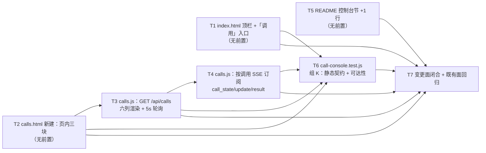

# pr-004 内部任务列表（控制台调用页 `/calls` + 顶栏入口 + README 一行 + 静态契约测试）

> 迭代：0018-chat-agent-subagent-protocol · 阶段 5（PR 实现）· 由 `planner` 角色产出（**PR 内任务**，非全局任务图）
> 主依据：`prs/pr-004-console-call-page.md`（2 张卡 F13 / F14；**5 个文件**：3 新建 + 2 修改；**不含既有测试断言改写**）
> 真源：`architecture.md` §6（控制台调用面 T-07）、§8.3（文档与前端改动面）、§9.2 L2-17、§11（必然变更点清单）、§12.1 / §12.2 组 K（测试组织）；`prd/F13-console-call-view.md`（验收 1~5 + 架构段）、`prd/F14-existing-behavior-unchanged.md`（验收 1/2/5 + 架构段）
> 工作区：`/Users/chenchiyuan/projects/agents/.pb-agents/worktrees/0018-chat-agent-subagent-protocol/.pb-agents/worktrees/0018-pr-004-console-call-page`（分支 `feat/0018-pr-004-console-call-page`，**base = 迭代分支 tip `7e351fa`**，已含 pr-001/002/003 全部产物）
> **任务总数：7**（T1~T7）

---

## 文件范围与显式排除

| 项 | 内容 |
|---|---|
| 允许改动（5 个文件，PR 文件「文件范围」逐字） | `oamp/web/calls.html`（**新建**）、`oamp/web/calls.js`（**新建**）、`oamp/web/index.html`（修改：顶栏 +1 入口）、`oamp/README.md`（修改：控制台节 +1 行）、`oamp/test/call-console.test.js`（**新建**） |
| **显式排除**（不属本 PR，越界即验收不通过） | ① `oamp/web/app.js` / `oamp/web/style.css` / `oamp/web/api-pages.css`（**零改动**，PR 验收 6）；② `oamp/test/api-pages.test.js`（**零改写**且 `git diff` 为空，PR 验收 2）；③ `oamp/src/web.js`（pr-003 已合入，本 PR 只**消费**其 `STATIC_FILES` 两项与 6 条调用面路由）；④ `oamp/src/transport.js` / `oamp/src/registry.js`（pr-001/002 已合入，只消费）；⑤ `oamp/API.md` / `oamp/llms.txt`（pr-003 已合入，本 PR 不改 —— 本 PR **不新增路由/事件**，故三条漂移锁不因本 PR 变化）；⑥ `oamp/test/call-protocol.test.js`（pr-005）；⑦ `oamp/package.json`、`oamp/config.json`、`oamp/bin/**`、`cluster.json`、仓库根 `roles/**`、`docs/` 其它迭代目录 |
| 已合入的上游产物（本 PR 可直接依赖） | `oamp/src/web.js` 的 `STATIC_FILES` 两项（`'/calls' → 'web/calls.html'`、`'/calls.js' → 'web/calls.js'`；`serveStatic` 走 `STATIC_TYPES['.html'] = 'text/html; charset=utf-8'` / `[.js] = 'text/javascript; charset=utf-8'`）；6 条调用面路由（其中本页用到 `GET /api/calls`、`GET /api/calls/:call_id/stream`）；SSE 三类事件名 `call_state` / `call_update` / `call_result`（`CALL_EVENTS`）与键空间 `call:<call_id>` |

## 全局约束（任一任务违反即该任务不通过）

1. **文件闭包**：本 PR 的 `git diff --name-only <base=7e351fa>` 恰为上表 5 个路径（3 新增 + 2 修改），无第六个路径；写入一律用本 PR worktree 的绝对路径，`git` 一律 `git -C <worktree>`。
2. **既有前端面零改动**：`oamp/web/app.js`、`oamp/web/style.css`、`oamp/web/api-pages.css` 三文件 diff 为空；页面**只复用**既有样式与既有体例，**零新 CSS 文件、零构建、零依赖**（F13 验收 5 / PR 验收 6）。
3. **既有测试零改写**：`oamp/test/**` 的**唯一**变化 = 新增 `oamp/test/call-console.test.js`；其余既有测试文件（尤以 `api-pages.test.js` 为准）文本零改写、`git diff` 为空（F14 验收 2 / PR 验收 2）。
4. **不呈现面（词表检索零命中）**：页面与脚本**不得**出现 token / 成本 / 工具级详情 / 取消 / steer 的字段或控件 —— `grep -nEi 'token|cost|steer|cancel|isolated|effort|usage' oamp/web/calls.html oamp/web/calls.js` **零命中**（F13 验收 4 / N12 / 差异 ⑬⑭⑯⑮ / PR 验收 5）。
5. **单推送机制**：roster 刷新 = 既有 **5 s 轮询**体例；进度 = **既有 SSE**（按调用订阅）。本 PR **不引入**新推送机制、不新增轮询器、不新增事件名（§6 / §4.1 / §1.2 第 12 行）。
6. **零新面**：零新第三方依赖（`oamp/package.json` 零改动）、零新进程 / 端口 / 监听面 / 配置键 / 环境变量 / 构建步骤；页面不引任何 CDN 资产（只引 `/style.css`、`/api-pages.css`、`/calls.js` 三个本地资产）。
7. **测试文件自足**：`oamp/test/call-console.test.js` 文件内自带 harness 辅助（按既有 `test/api-pages.test.js` 体例**就地复制**），**不抽公共 helper、不改既有测试文件**、不新增测试基建（§12.1 / §12.3）。
8. **读取面只消费、不改写**：`GET /api/calls` 的响应契约（`{calls:[{call_id, agent, state, started_at, ended_at, model}]}`，按 `created_at` 倒序）与 `GET /api/calls/:call_id/stream` 的 SSE 契约（三类事件）由 pr-003 已合入实现定义，本 PR 只按此消费（§3.4 / §4.1）。

---

## 任务列表

### T1: `oamp/web/index.html` 顶栏新增「调用」入口（实锚点 +1 行）

- **验收标准**:
  1. `<nav class="topnav">` 内新增**恰一条**实锚点：`<a class="nav-item" href="/calls">调用</a>`（与既有两条实入口 `<a class="nav-item" href="/docs">文档</a>`、`<a class="nav-item" href="/debug">调试</a>` 同款形态；文案 = 「调用」，路径 = `/calls`）。判据：`grep -n 'href="/calls"' oamp/web/index.html` 命中 **1 行**且该行含该字面量（§6「入口」/ §8.3 / PR 验收 2）。
  2. 既有 3 个占位项 `Workspace`、`Agents`、`Tasks` 与既有 `/docs`、`/debug` 两条实入口**逐字未变**（占位项保持 ``、**不**改造 `Tasks`）。判据：`git diff -U0 oamp/web/index.html` 的 hunk = **纯新增 1 行**（零删改行、零上下文外改动）（§9.2 L2-17 / §11 第 12 行 / PR 验收 2）。
  3. 新入口追加在既有两条实入口之后 `[model_inferred]`（既有两条的相对顺序与文本零改动；架构只定「顶栏新增第 3 个真实入口」，未定站位）。判据：diff 为新增行 + 既有两条正则仍在场。
  4. 页面其余部分零改动：`<link rel="stylesheet" href="/style.css" />`、``、工作台/项目/对话区标记逐字不变。判据：`git diff -U0 oamp/web/index.html` 恰 1 个 hunk、1 行 `+`（验收 2 已覆盖）。
  5. `oamp/web/style.css` 零改动（新入口是 `<a class="nav-item">`，既有 `a.nav-item { text-decoration: none; cursor: pointer; }` 规则已覆盖，无需补规则）。判据：`git diff --name-only <base>` 不含 `oamp/web/style.css`（§6「既有面零改动」/ PR 验收 6）。
- **前置依赖**: 无
- **优先级**: P0
- **追溯**: `architecture.md` §6「入口」（`web/index.html` 顶栏新增第 3 个真实入口；既有 3 个占位项逐字未变）、§8.3（`oamp/web/index.html` 处置行）、§9.2 L2-17、§11 第 12 行（`test/api-pages.test.js:57-63` 零改写）；`prd/F13` 验收 1/5、`prd/F14` 验收 1；PR 验收 2/6

### T2: `oamp/web/calls.html` 新建控制台调用页骨架（独立静态页 + 复用既有 CSS + 页内三块）

- **验收标准**:
  1. 文件存在且非空；`<link rel="stylesheet" href="/style.css" />` **与** `<link rel="stylesheet" href="/api-pages.css" />` 两行在场（复用既有 `:root` token 与 0016 的表格/卡片规则 ⇒ **零新 CSS 文件**）；`` **独立脚本**（不并入 `app.js`）。判据：读文件头 + `grep -n 'link rel="stylesheet"' oamp/web/calls.html`（§6「页面划分」/ §8.3 / §12.1「独立 JS + 独立 HTML」体例）。
  2. 页内**三块**静态容器齐备（体例同 `/docs`、`/debug`，用既有 `@media` 零断点的 `api-page` 容器）：
     ① **roster 表**：表头恰 **6 列** `调用 id` / `agent` / `状态` / `开始时间` / `结束时间` / `模型`（逐字对应 §3.4 的 `call_id` / `agent` / `state` / `started_at` / `ended_at` / `model`）`[model_inferred]`（列名中文文案取 PR 验收 3 的「调用 id / agent / 状态 / 起止时间 / 模型」措辞，「起止时间」拆为两列）；
     ② **选中行的进度区**容器；
     ③ **空态 / 提示条**容器（纯文本，无新组件）。
     判据：读 DOM 结构（三块容器在场、表头 6 列逐字）（§6 三块 / §3.4 / F13 验收 2）。
  3. 页面**不呈现**无数据源项：`grep -nEi 'token|cost|steer|cancel|isolated|effort|usage' oamp/web/calls.html` **零命中**。判据：该检索零输出（§6「不呈现」/ F13 验收 4 / PR 验收 5）。
  4. 零外部资产：页面资产引用恰为 `/style.css`、`/api-pages.css`、`/calls.js` 三项，无 `` 在场；
     - 顶栏新入口逐字：`/<a class="nav-item" href="\/calls">调用<\/a>/`；
     - 既有 3 个占位项逐字未变：`/Workspace<\/span>/`、`/Agents<\/span>/`、`/Tasks<\/span>/`（三条正则与 `api-pages.test.js:57-63` 同款，但**本文件自带**、不改既有文件）；
     - 页面零无数据源列：`assert.doesNotMatch(html + js, /token|cost|steer|cancel|isolated|effort|usage/i)`（PR 验收 5 检索式的内联化）`[model_inferred]`（组 K 只写「页面零 token/成本列」，本任务把该意落为对 `calls.html` + `calls.js` 的全量不敏感检索，与 PR 验收 5 的检索式同口径）。
     判据：读用例断言清单（§12.2 组 K / F13 验收 1/4/5）。
  3. **HTTP 可达性断言**（真起 Router + `oamp web start` 子进程 + 随机端口 + 临时 `OAMP_DB`，租约按既有体例放长，`t.after` 收尾停子进程与清临时目录）：`GET /calls` → `200` + `content-type === 'text/html; charset=utf-8'`；`GET /calls.js` → `200` + `content-type === 'text/javascript; charset=utf-8'`；两响应体非空。判据：用例内 `fetch` 断言（§12.2 组 K「HTTP 可达性（`/calls`、`/calls.js` 的 200 与 content-type）」/ PR 验收 1）。
  4. 零外网 / 零真实 omp / 零 tmux：用例只用本地 harness 与本地 `fetch`；不依赖真实 agent、不落仓库 `oamp/data/`（临时库在系统临时目录）。判据：读用例体（§12.1「零真实 omp、零外网、零 tmux」「测试用 socket 与临时库全部位于系统临时目录」）+ `oamp/package.json` 零改动。
  5. **不断言**浏览器可视行为：面内 roster 行与进行中增量属**人工 / 浏览器核对项**，文件内无 CDP / headless / DOM 渲染依赖、无 `puppeteer`/`playwright` 类 import。判据：读文件（§12.2 组 K「浏览器可视核对（面内 roster 行、进行中增量）为人工/浏览器核对项，不设自动化断言」）。
  6. `node --test oamp/test/call-console.test.js` **全绿**（退出码 0、汇总无 fail）。判据：命令输出（PR 验收 8）。
  7. 本任务**只新增**该文件：`git diff --name-only <base>` 仍恰 5 路径；`git diff --name-only -- oamp/test` 恰为 `oamp/test/call-console.test.js`（其余既有测试文件 diff 为空）。判据：两条命令输出（PR 验收 2/8 / F14 验收 2）。
- **前置依赖**: T1, T2, T3, T4（断言对象 = `index.html` 的新入口 + `calls.html` + `calls.js` 的静态形态 + 两文件的实际可达性）
- **优先级**: P0
- **追溯**: `architecture.md` §12.1（新增测试文件命名 `call-console.test.js`；载体 = 真 Router + `oamp web start` 子进程 + 随机端口 + 临时 `OAMP_DB`；不抽公共 helper）、§12.2 组 K（静态契约：`/calls` 页存在、顶栏新入口、既有 3 个占位项逐字未变、页面零 token/成本列 + HTTP 可达性：`/calls`、`/calls.js` 的 200 与 content-type；浏览器可视核对不设自动化断言）、§6、§8.3；`prd/F13` 验收 1/4/5、`prd/F14` 验收 2；PR 验收 1/2/5/8

### T7: 变更面闭合与既有面回归核对（五文件闭包 / 零改动路径 / 既有测试面 / 8 条验收逐条）

- **验收标准**:
  1. **文件闭包**：`git -C <worktree> diff --name-only 7e351fa` 恰为 5 个路径 —— `oamp/web/calls.html`、`oamp/web/calls.js`、`oamp/test/call-console.test.js`（新增）与 `oamp/web/index.html`、`oamp/README.md`（修改），无第六个；`git status --porcelain -uall` 无本 PR 之外的未跟踪文件。判据：两条命令输出逐项比对（全局约束 1 / PR 文件范围）。
  2. **零改动路径**（PR 验收 6）：`git diff --name-only 7e351fa` ∩ `{oamp/web/app.js, oamp/web/style.css, oamp/web/api-pages.css, oamp/src/web.js, oamp/test/api-pages.test.js}` = ∅；且 `git diff --name-only 7e351fa -- oamp/test/api-pages.test.js` **零输出**（⇒ PR 验收 2 的「该文件内容 `git diff` 为空」）。判据：两条命令输出（§11 第 12 行 / F14 验收 2 / PR 验收 2/6）。
  3. **既有测试面回归**：
     - `node --test oamp/test/api-pages.test.js` 全绿（顶栏静态契约：`/docs`、`/debug` 两条实入口 + 既有 3 个占位项逐字 + `a.nav-item` 规则；`/docs` `/debug` `/docs.js` `/debug.js` `/api-pages.css` 可达性）；
     - `node --test --test-name-pattern '协议方法面仍 7 个' oamp/test/project-workspace.test.js` 全绿（README §协议速览 逐字）。
     判据：两条命令退出码 0、汇总无 fail（PR 验收 2/7 / F14 验收 1/2/4）。
  4. **本 PR 新测试**：`node --test oamp/test/call-console.test.js` 退出码 0（T6 验收 6 的复核，不重复其断言内容）。判据：命令输出（PR 验收 8）。
  5. **检索式复核**（PR 原文给出的三条 + README 一条）：
     - `grep -nEi 'token|cost|steer|cancel|isolated|effort|usage' oamp/web/calls.html oamp/web/calls.js` **零命中**（PR 验收 5）；
     - `grep -n 'href="/calls"' oamp/web/index.html` = **1 行**（PR 验收 2）；
     - `grep -c '/calls' oamp/README.md` = **1**（PR 验收 7）；
     - `grep -n 'path: .*calls' oamp/src/web.js` 的行集合与 pr-003 落地时**完全相同**（本 PR 零触路由表；pr-003 为 6 条）。
     判据：四条检索输出（PR 验收 5/2/7）。
  6. **零新增面**：`git diff --name-only 7e351fa` 不含 `oamp/package.json`、`oamp/config.json`、`oamp/bin/**`、`oamp/API.md`、`oamp/llms.txt`；页面零 CDN（T2 验收 4）。判据：diff 列表比对（§9.1「零新依赖 / 零新配置键」/ §9.3）。
  7. **8 条 PR 验收标准逐条落位**（见文末对位表）：8 条全部有承接任务与可机械核对判据（命令或检索式），无落到「人工感觉」的验收项；**人工 / 浏览器核对项**（面内 roster 行、进行中增量）在本文中明确标注为**非自动化**（§12.2 组 K 口径），不计入 8 条的自动化落位。判据：对位表逐行 + 本任务验收 3/4/5 的命令输出。
- **前置依赖**: T1, T2, T3, T4, T5, T6
- **优先级**: P1
- **追溯**: `architecture.md` §11 第 12 行（既有测试文本零改写）、§12.2 组 K/L、§6「既有面零改动」、§8.3、§9.1/§9.3（零新增面）、§13（F13/F14 可核对）；`prd/F13` 验收 5、`prd/F14` 验收 1/2/3；PR 验收 1~8

> **落地顺序建议**：`T1` / `T2` / `T5` 互不依赖（建议同批起手，分别只碰 `index.html` / `calls.html` / `README.md`）→ `T3` → `T4`（`T3`/`T4` 同一文件 `oamp/web/calls.js`，**串行**落地，避免同段并发编辑）→ `T6` → `T7`。

---

## 依赖图（无环）

- **拓扑序**（满足全部 **12** 条边的一例）：`T1 → T2 → T5 → T3 → T4 → T6 → T7`。
  边数与来源核对：`T2→T3`(1) + `T3→T4`(1) + `{T1,T2,T3,T4}→T6`(4) + `{T1,T2,T3,T4,T5,T6}→T7`(6) = **12** 条。
- **并行自由度**：`T1` / `T2` / `T5` **互不依赖**（可并行起手，分别只写 `index.html` / `calls.html` / `README.md`，零文件重叠）；`T3` 与 `T4` 串行（同一文件 `oamp/web/calls.js`）；`T6` 与 `T7` 均依赖前序产物，无相互依赖（但 `T7` 含 `T6` 的复核）。
- **无环证明**：全部 12 条边均从**小编号指向大编号**（`T2→T3`、`T3→T4`、`T1/T2/T3/T4→T6`、`T1/T2/T3/T4/T5/T6→T7`）⇒ 全序 `T1<T2<…<T7` 即为一例拓扑序，**不存在**回边、自环或跨序环。
- **最长依赖链 = 5 节点 / 4 边**（唯一最长）：`T2 → T3 → T4 → T6 → T7`。
  次长 = 4 节点（`T2 → T3 → T4 → T7`、`T1 → T6 → T7` 等）。
- **关键路径节点**：`T2 → T3 → T4 → T6 → T7`（5 节点，全部必须按序落地）；带松弛的任务 = `T1`、`T5`（二者可随时起手，但 `T1` 被 `T6`/`T7` 纳入闭包核对、`T5` 被 `T7` 纳入）。
- **汇聚点**：`T6`（入度 4）、`T7`（入度 6）；**无**汇聚点构成环（均为单向汇聚）。

---

## 与 pr-004 验收标准（8 条）的逐条对位表

| # | pr-004 验收标准（逐字摘要） | 承接任务 | 判据落点 |
|---|---|---|---|
| 1 | `GET /calls` → 200 + `text/html; charset=utf-8`；`GET /calls.js` → 200 + `text/javascript; charset=utf-8`（两项由 pr-003 的 `STATIC_FILES` 白名单提供） | **T2**（`calls.html` 本体存在）、**T3**（`calls.js` 本体存在 + 验收 6）、**T6**（验收 3：运行时断言） | T6 验收 3（真起服务的 status + content-type）+ T2 验收 1 / T3 验收 6（文件本体） |
| 2 | `index.html` 顶栏出现 `<a class="nav-item" href="/calls">调用</a>`；既有 3 个占位项与 `/docs`、`/debug` 逐字未变（`node --test oamp/test/api-pages.test.js` 全绿且该文件 `git diff` 为空） | **T1**（验收 1/2/4）、**T6**（验收 2 静态断言）、**T7**（验收 2/3：diff 空 + 既有用例全绿） | T1 验收 1（`grep 'href="/calls"'` = 1 行）+ T7 验收 2（`git diff -- oamp/test/api-pages.test.js` 零输出）+ T7 验收 3（该测试文件全绿） |
| 3 | 页面按行呈现 roster 六列（调用 id / agent / 状态 / 起止时间 / 模型），取数 = `GET /api/calls`，随后 5 s 轮询刷新（不引入新推送机制） | **T2**（验收 2：表头 6 列）、**T3**（验收 1/2/3） | T3 验收 1（`fetch('/api/calls')` + `setInterval(…, 5000)`）+ 验收 2（6 列字段逐项）+ 验收 3（无客户端排序/过滤/分页） |
| 4 | 点击某行 ⇒ 订阅 `GET /api/calls/:call_id/stream` 并渲染 `call_state` / `call_update` / `call_result`；切换选中项时关闭旧订阅、开新订阅 | **T4**（验收 1/2/3） | T4 验收 1（EventSource 实参形态逐字）+ 验收 2（三个 `addEventListener` 事件名）+ 验收 3（`close()` 先于新订阅） |
| 5 | 页面与脚本不出现 token / 成本 / 工具级详情 / 取消 / steer 的字段或控件（`grep -nEi 'token\|cost\|steer\|cancel\|isolated\|effort\|usage' oamp/web/calls.html oamp/web/calls.js` 零命中） | **T2**（验收 3）、**T3**（验收 5）、**T4**（验收 5）、**T6**（验收 2 内联检索断言）、**T7**（验收 5 复核） | T7 验收 5 第 1 条（检索零输出）+ T6 验收 2（`doesNotMatch` 同口径） |
| 6 | `oamp/web/app.js` / `oamp/web/style.css` / `oamp/web/api-pages.css` 零改动（`git diff --name-only` 不含这三个路径） | **T1**（验收 5）、**T2**（验收 5）、**T3**（验收 7）、**T7**（验收 2 汇总） | T7 验收 2（diff ∩ 三路径 = ∅） |
| 7 | `oamp/README.md` 的「Web 控制台（demo）」节出现「调用」入口一行；`## 协议速览` 小节逐字未变（既有「方法面仍 7 个」用例全绿） | **T5**（验收 1/2/3）、**T7**（验收 3/5） | T5 验收 1（`grep '/calls'` = 1 行且落在该节）+ 验收 2（hunk 仅 1 行 `+`）+ T7 验收 3（方法面用例全绿） |
| 8 | 新增 `oamp/test/call-console.test.js` 自带 harness（不抽公共 helper、不改既有测试文件），`node --test oamp/test/call-console.test.js` 全绿 | **T6**（验收 1/6/7）、**T7**（验收 4） | T6 验收 1（文件内辅助 + import 收敛）+ 验收 6（命令退出码 0）+ T6 验收 7（`oamp/test` diff 恰 1 路径） |

> 对位闭合：**8 条全部有承接任务，无遗漏**；每条的判据都在承接任务内可机械核对（4 条原文检索式分别落 T7 验收 5 的 4 条、1 条命令落 T7 验收 3/4）。**未新增** pr-004 验收标准之外的承诺。
>
> **非自动化项（不占 8 条中的任何一条）**：F13 验收 2 的「面内 roster 两行信息齐备」与 F13 验收 3 的「进行中增量随调用推进更新」为**人工 / 浏览器核对项**（`architecture.md` §12.2 组 K 明写「不设自动化断言」）；本任务图**不为其虚构自动化判据**，仅由 T3/T4 的实现形态（6 列字段 + 三类事件监听）作为其可核对前提。

---

## 上报事项（planner 报告契约项）

1. **产出路径与任务总数**：`docs/iterations/0018-chat-agent-subagent-protocol/prs/pr-004-tasks.md`；任务总数 = **7**（T1~T7）。PR 的 8 条验收标准全部对位（见上表）；5 个文件全部有任务落点（`index.html`→T1、`calls.html`→T2、`calls.js`→T3+T4、`README.md`→T5、`call-console.test.js`→T6、闭合核对→T7）。
2. **依赖图摘要**：DAG 无环（**12** 条边，全部由小编号指向大编号，`T1<T2<…<T7` 即为拓扑序）。**最长依赖链 = 5 节点 / 4 边**（唯一：`T2 → T3 → T4 → T6 → T7`）；**关键路径** = `T2 → T3 → T4 → T6 → T7`；松弛任务 = `T1`、`T5`（可并行起手）；汇聚点 = `T6`（入度 4）、`T7`（入度 6）。
3. **`[model_inferred]` 列表（5 项，逐条给依据；均**不**填补架构空白，只取最保守读法，等待主 agent 确认）**：

| 任务 | 推导项 | 推导依据 | 被否决时的影响面 |
|---|---|---|---|
| T1（验收 3） | 新入口**追加在既有 `/docs`、`/debug` 两条实入口之后** | §6 只定「顶栏新增第 3 个真实入口」，未定站位；既有两条的相对顺序与文本零改动是 §11 第 12 行的硬约束 | 仅 T1 验收 3 的一句站位约束（T6 验收 2 的正则与 T7 的 diff 判据均不依赖站位） |
| T2（验收 2） | 表头 6 列的中文列名取「调用 id / agent / 状态 / 开始时间 / 结束时间 / 模型」（把 PR 验收 3 的「起止时间」拆为两列） | §3.4 的 6 个行字段为 `call_id` / `agent` / `state` / `started_at` / `ended_at` / `model`；PR 验收 3 的中文措辞未逐字给出六列名 | 仅 T2 验收 2 的列名文案（T3 验收 2 的字段来自响应键，不受影响） |
| T3（验收 2） | `agent` / `ended_at` / `model` 为 `null` 时的展示占位符取既有 `—` 字形 | §3.4 明写进行中 `ended_at = null`、`model` 进行中 `null`、无角色 `agent = null`，但未定 UI 呈现；`app.js` 的 `fmtAgo` 对非法值返回 `—` 为既有体例 | 仅 T3 验收 2 的占位符字形 |
| T4（验收 2） | `call_update` 文本取 `text`（字符串时）否则 `${line}\n`；`call_result` 展示 `state`/`text`/`error` | §4.1 只给三类事件名与数据字段（`call_update` = `{chat_id, call_id, agent, kind, text, line}`），未定渲染取值；既有 `app.js` 的 `task_update` 渲染分支（`typeof data.text === 'string' ? data.text : ${line}\n`）为体例先例 | 仅 T4 验收 2 的取值表达式 |
| T5（验收 2） | README 改动 = 新增**一条独立 bullet 行**（而非并入既有「**顶栏入口**」条目） | §8.3 写「§『Web 控制台（demo）』顶栏入口列表 **+1 行**」；「列表 +1 行」有两种自洽读法（加 bullet / 加句），本条取「加 bullet」 | 仅 T5 验收 2 的 diff 形态判据（验收 1 的「含「调用」与 `/calls` 的一行」两读法均满足） |

4. **上报的循环依赖**：**无**。依赖图为 DAG（全部边 `i → j` 且 `i < j`）；不存在自环、回边、跨序环。任务间无环形等待（T3/T4 同文件串行是**编辑冲突规避**，非产物依赖倒置；T6/T7 的依赖方向单向向前）。
5. **疑问 / 越界**（均不新增架构决策、不修改上游产物）：
   - **a. 架构留白：已终态调用被点击时的进度区内容（未自行填补）**。`GET /api/calls/:call_id/stream` 在**任务表条目仍在**时订阅成功，但既有 SSE 抽象**不补发**（`transport.js` 的 `publishTo` 无订阅者即丢弃、不缓存不回放，§5.4 口径）；即：点击一行**已完成**的调用，订阅建立但**不会**收到 `call_result`（`call_result` 只在终态到达的那一刻发布）。架构 §6 第 2 块只写「点击某行 ⇒ 订阅 + 渲染三类事件」，**未**规定「点击时是否需要补取一次 `GET /api/calls/:call_id` 以回填终态」。本任务图按**原文**落判（T4 只要求订阅 + 渲染到达的事件；roster 行本身已展示 `state`），**不**自行增加补取行为；若主 agent 认为需补取以覆盖「刷新页面后点已终态行」的场景，**仅 T4 验收 2 需加一条**（其余 6 个任务不受影响）。另：**不在**本文档把它写成「缺口」——它不违反任何一条 PR 验收标准（PR 验收 4 的字面要求已由 T4 覆盖）。
   - **b. 架构留白：roster「六列」与 PR 验收 3「五个名称」的口径**。PR 验收 3 列了 5 个名称（调用 id / agent / 状态 / 起止时间 / 模型），其中「起止时间」= 2 列（`started_at` + `ended_at`）⇒ 恰 6 列，与 §3.4 / F09 验收 1 的 6 行字段一致。本任务图按此拆分落判（T2 验收 2 / T3 验收 2），并已标 `[model_inferred]`。提请主 agent 知悉该读法（无需裁决，除非希望列名另行指定）。
   - **c. `oamp/README.md` 既有的两处「13 条」计数不在本 PR 文件范围（提请知悉，避免迭代末漂移）**：README 的 HTTP 接口计数（pr-003 报告事项 5.e 已登记同一处）在 pr-003 落地后已过时（真实 19 条），但 §8.3 把 README 的改动限定为 **pr-004 的「顶栏入口 +1 行」**，且 pr-003 与 pr-004 的 PR 文件均未把该计数行列入文件范围。本任务图**不**越界改它（T5 验收 4 已写明「不改任何计数行」）；提请主 agent 决定是否需要一个独立收尾动作（两个 PR 均不承接）。
   - **d. 「页内三块」的容器 id / class 命名未由架构给定（未自行发明语义）**：§6 只定三块的功能划分与「沿用既有 `#hint` 式纯文本体例」。T2 验收 2 只要求**三块容器齐备 + 表头 6 列逐字**，不指定容器 id/class；T4 验收 6 亦不要求改 `calls.html` 结构。若主 agent 希望固定命名（便于 T6 静态断言或人工核对），需回架构补一句；当前 T6 的断言面**不依赖**任何容器 id（只断言入口、占位项、资产引入、零无数据源列）。
   - **e. 本 PR 不改 `API.md` / `llms.txt`（架构已定的 PR 切分，非缺口）**：本 PR 零新增路由 / 事件 / 元数据，故三条漂移锁与 llms 快照不因本 PR 变化（T7 验收 5 第 4 条以「`oamp/src/web.js` 的 calls 路径行集合与 pr-003 落地时相同」为复核）。`/calls` 属**静态面**，不进 `GET /api/docs` 投影（pr-003 的 T7/T16 已按此落判），因此**不**产生「页面未登记」的缺口。
   - **f. 未越界声明**：本阶段**唯一写入** = `docs/iterations/0018-chat-agent-subagent-protocol/prs/pr-004-tasks.md`；**未修改** `oamp/**`（全程只读：`web/index.html`、`web/app.js`、`web/docs.html`、`web/api-pages.css`、`test/api-pages.test.js`、`src/web.js`、`src/transport.js`、`README.md` 等）、pr-004 PR 文件、`architecture.md`、`prd/**`、`demand.md`、`status.md`、`history.md`、`progress.md`、`clarifications/**` 与其它 docs；**未运行**测试 / 构建 / smoke（三处 `git status --porcelain -uall` 核对见交付说明）；**未执行** git 写命令（仅 `rev-parse` / `merge-base` / `status` / `diff` / `show` 只读核对）。
