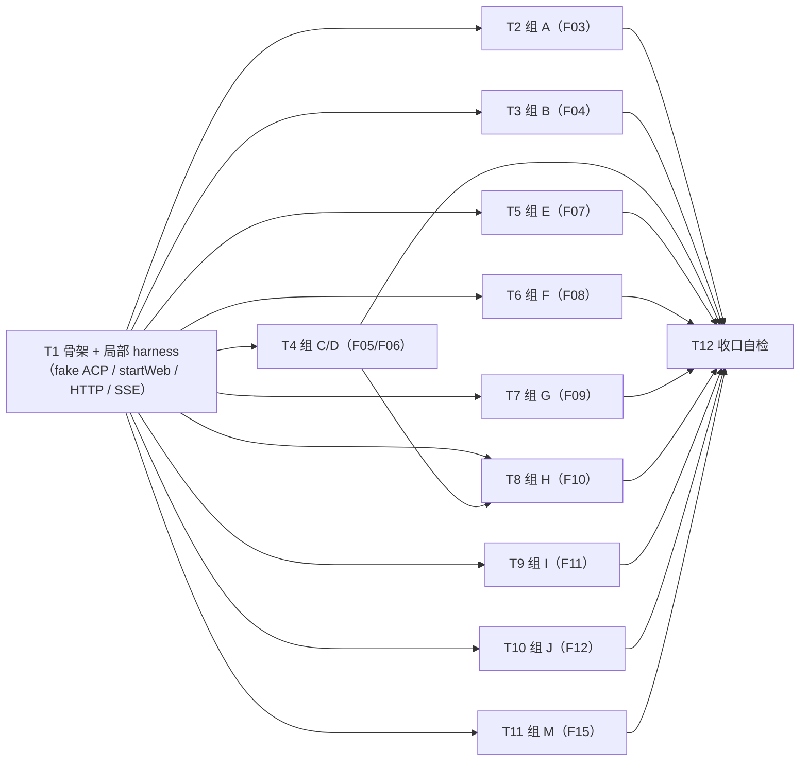

# pr-005 内部任务列表（调用面端到端验收测试：新增 `oamp/test/call-protocol.test.js`）

> 迭代：0018-chat-agent-subagent-protocol · 阶段 5（PR 实现）· 由 `planner` 角色产出（**PR 内任务**，非全局任务图）
> 主依据：`prs/pr-005-call-protocol-acceptance-tests.md`（11 张卡 F03~F12、F15；**单一新文件**；**不含既有测试断言改写**）
> 真源：`architecture.md` §12.1（载体与文件 / 不新增测试基建）、§12.2（组 A~N 断言落点，本 PR 承接 A~J + M）、§12.3（白名单口径）＋ §2.1/§2.3/§2.5/§3.1~§3.5/§4.1~§4.3/§5/§7.3；`prd/F03~F12,F15*.md`（各卡「验收标准」与「架构（阶段 3 已填）」段）
> 工作区：`/Users/chenchiyuan/projects/agents/.pb-agents/worktrees/0018-chat-agent-subagent-protocol/.pb-agents/worktrees/0018-pr-005-call-protocol-acceptance-tests`（分支 `feat/0018-pr-005-call-protocol-acceptance-tests`，base = 迭代分支 tip `7e351fa`）
> **任务总数：12**（T1~T12）；**全部写入以工作区根为基准的绝对路径**，git 一律 `git -C <工作区>`

---

## 关键事实基线（阶段 5 实测，实现者据此写断言，勿重新推导）

| 面 | 实测事实（`oamp/` 下） |
|---|---|
| 6 条调用面路由 | 路线表**末位连续 6 条**：`POST /api/calls`（L939 起）→ `GET /api/calls`（L1116）→ `GET /api/calls/stream`（L1146，字面量）→ `GET /api/calls/:call_id/stream`（L1168）→ `GET /api/calls/:call_id/transcript`（L1191）→ `GET /api/calls/:call_id`（L1220，全表末位）；`grep -n "path: '/api/calls" oamp/src/web.js` 命中行 = 942 / 1119 / 1149 / 1171 / 1194 / 1223 |
| 信封 | `composeCallEnvelope(task, call)`（`web.js:364`）：**实到 10 键**，键序 `call_id, agent, state, duration_ms, model, truncated, text, structured_output, error, exit_code`（★ L363 注释写「11 键」是注释口径错误；`architecture.md` §3.1 列举的也是这 10 个字段 ⇒ 断言以 10 为准） |
| 状态读法 | `callState(task, call) = call?.terminal?.state ?? task.state`（`web.js:388`）；三面（信封 / roster / 转录）同读法 |
| 截断 | `callTruncated(task) = task.updatesTruncated === true \|\| task.updates.some(u => u.detail?.event === 'truncated')`（`web.js:274`）；调用面恒走 daemon 路径 ⇒ 只能触达 registry 的 **1000 条 update 封顶**（`registry.js:47,222`），`agent.js` 的 200 行封顶（`MAX_STREAM_LINES`）只作用于 stdout/stderr 一次性路径 |
| 终态发布 | `publishCallResult(task, entry)`（`web.js:1380`，单一发布点）→ ① `call.terminal` 写入（单一写点）② `transport.publishCall(callId, {type:'call_result', data:{chat_id, ...envelope}})` ③ 解阻塞。调用点 2 处：投递路径（`web.js:1421`，`finishTask` 末）与对账路径（`web.js:1455`，`reconcileTask`） |
| 事件名 | 字面量真源仅 `web.js:59`：`CALL_EVENTS = {state:'call_state', update:'call_update', result:'call_result'}`；`call_state/submitted` 在 `web.js:1105`、`call_state/working` 在 `web.js:1503`（每调用一次）、`call_update` 在 `web.js:1506`（`{chat_id, call_id, agent, kind, text, line}`，控制条目 `started/truncated` 被 kind 过滤挡掉） |
| transport 键 | `chat:` / `call:` / `chat-calls:`（`transport.js:15-17`）；`publishCall` 同时写 `call:<id>` 与 `chat-calls:<chat_id>`（`transport.js:103`） |
| 归属落库 | `POST /api/calls` 成功路径先 `db.insertInput({meta:{task_id: callId}})` 再派发（`web.js:1070`），派发失败补 `out`（`error:'dispatch_failed'`）（`web.js:1091-1097`） |
| 项目上下文 | 派发载荷 `body.project = {name, repo_url, agreement}`（`web.js:1053-1054`，与既有 `/api/messages` 同源）；**agent 侧只在会话首轮渲染**（`context-pool.js:178`：`this.sentTurns === 0 && turn.projectContext`）⇒ 若 fixture 对话已跑过一轮，调用面的 prompt **不含** `【项目上下文】`，项目继承只能经 `task.request` 载荷观测 |
| 错误映射 | 无/空 `chat_id` → **400 INVALID_PARAM**；chat 不存在 → **400 INVALID_PARAM**；角色不可解析 / 离线 → **404 NOT_FOUND**（统一文案 `agent 不可用: <role>（无对应在线实例）`）；后续项派发失败 → **502 UPSTREAM_UNAVAILABLE**（`web.js:970-1101`） |
| 静态面 | `STATIC_FILES` 已登记 `/calls`、`/calls.js`（`web.js:424-425`），但 `web/calls.html`/`calls.js` **在本 PR worktree 内不存在**（属 pr-004）⇒ 本文件**不得**对控制台页面做任何断言 |
| 文档面 | `oamp/API.md`（1534 行）：§3.14~§3.19 = 628/711/743/773/801/840；§4.4 = 937；§5.12~§5.16 = 1279/1307/1323/1335/1347；§6 = 1387（条目 1389~1405，其后 1389~1412 为本节范围）；§7 = 1415~1534（§7.1=1417、§7.2=1431、§7.3=1475、§7.4=1501、§7.5=1530）。★ 仓库主工作区同名文件是 0018 之前的旧版 ⇒ 测试内必须用 `new URL('../API.md', import.meta.url)` 之类**相对本文件**的绝对解析 |
| 词表底数 | `grep -nE 'cancel\|terminate\|steer\|isolated\|effort\|usage\|tokens\|cost\|aborted\|local://\|agent://\|one_shot' oamp/API.md` = 16 行命中：**345 / 380**（既有 `best-effort`，§3.4/§3.5，在调用面章节之外）、**459 / 461 / 1063**（既有 `one_shot`，§3.8/§5.5，章节之外）、**1397 / 1399 / 1403**（§6）、**1446 / 1455**（§7.2）、**1482 / 1485 / 1488 / 1499**（§7.3）、**1530 / 1533**（§7.5）；`cancel`/`terminate`/`isolated`/`cost`/`agent://` **零命中**；`oamp/llms.txt` **全词表零命中** |
| 测试基建 | 既有公共 harness **已存在**：`oamp/test/helpers/harness.js`（`startRouter/startAgent/waitFor/stopAll/buildEnv/SHORT_ENV/makeTempSocketDir/queryStatus`）与 `oamp/test/helpers/fake-node.js`（`startFakeNode`）；`project-workspace.test.js:5` 的「不抽公共 helper」注释的真实含义 = **不新增 helper 文件、不改既有 test 文件**（该文件自身 `:17-18` 就 import 了这两个 helper） |
| 既有测试体例 | `test/project-workspace.test.js:35-108`（内联 `FAKE_ACP_SOURCE` → `mkdtempSync` 落盘 `fake-acp.cjs` → env `OAMP_OMP_BIN` 注入）、`:129-156`（`startWeb`）、`:158-176`（`jget/jpost/jraw`）、`:181-218`（`openSse(base, chatId)`）、`:220-241`（`setup`）、`LEASE_ENV = {OAMP_HEARTBEAT_TIMEOUT_MS:'3000'}`（`:125-127`，**起 web 必用**，否则 Router 对 `task.update/result` 只记不投）；`test/web.test.js:721-789`（**投递丢失 → 对账补投**的既有构造法：假节点把终态发给未注册 ghost）；`test/api-routes.test.js:107-122`（需要 `ct/conn/text` 时用 `jreq` 体例） |

---

## 文件范围与显式排除

| 项 | 内容 |
|---|---|
| 允许写入（**唯一**） | `oamp/test/call-protocol.test.js`（新建；PR 文件「文件范围」逐字） |
| **显式排除**（越界即验收不通过） | ① 全部**既有**文件：`oamp/test/*.test.js`（22 个）、`oamp/test/helpers/**`、`oamp/src/**`、`oamp/API.md`、`oamp/llms.txt`、`oamp/web/**`、`oamp/package.json`、`oamp/bin/**`、仓库根 `roles/**`、`cluster.json`；② `oamp/web/calls.html`、`oamp/web/calls.js`、`oamp/README.md`（pr-004）；③ 本 PR 的 PR 文件、`architecture.md`、`prd/**`、`status.md`、`history.md`、其它 `prs/*-tasks.md` |
| 已合入、可直接依赖的上游产物 | pr-003：6 条调用面路由 + `API.md` 调用面章节 + `llms.txt` 19 条；pr-001：`transport` 四方法 + 三键空间；pr-002：`registry.listTasks` 的 `model` 投影（`task.result?.model ?? null`，排序 `created_at` 倒序在 `registry.js:272`） |
| 承接边界（不在本 PR） | 组 K（控制台静态页 / HTTP 可达性）= pr-004 的 `call-console.test.js`；组 L（既有回归）= pr-003 §11 与全量 `npm test`；组 N（登记与锁）= pr-003 的 `api-routes.test.js` 既有用例 |

## 全局约束（任一任务违反即该任务不通过）

1. **单文件闭包**：本 PR 结束时 `git -C <工作区> status --porcelain -uall` **只**含 `oamp/test/call-protocol.test.js` 一个路径；`git -C <工作区> diff --name-only` 为空。
2. **零新基建**：**不得新建** helper 文件（`oamp/test/helpers/*` 不新增、不修改）；`startWeb` / `FAKE_ACP_SOURCE` / `jget`/`jpost`/`jreq` / `openSse` / `setup` 等按既有体例**在文件内局部复制**；既有 `helpers/harness.js` 与 `helpers/fake-node.js` 属**既有文件**，可直接 `import`（零改动）`[model_inferred]`。
3. **零真实依赖**：零真实 `omp` / 零真实 LLM / 零外网 / 零 tmux；`OAMP_DB` 一律指向 `fs.mkdtempSync(os.tmpdir(), …)` 下的 `sql.db`；绝不触碰仓库 `oamp/data/sql.db` 与 `.runtime/`。
4. **端口隔离**：`pickPort()` 的随机段**必须避开**既有两段（41000+rand(2000) 与 45000+rand(2000)）——`node --test` 对文件级并行执行。
5. **租约**：凡起 `oamp web start` 的用例必须带 `LEASE_ENV = { OAMP_HEARTBEAT_TIMEOUT_MS: '3000' }`。
6. **不裸 sleep**：一切等待经 `waitFor`（默认 5s，必要时显式给 `timeoutMs`）；SSE 一律 `t.after(() => sse.close())`。
7. **每用例自清**：`t.after` 收尾顺序 = router → agent → 临时 db 目录 → web；fake ACP 临时目录在模块级 `process.on('exit')` 清理。
8. **对话 fixture 的合法取得方式**：0017 起「对话必归属项目」，`POST /api/messages` 不带 `project_id` 会被拒 ⇒ fixture = 先 `POST /api/projects` 建项目，再经 `POST /api/messages`（带 `project_id` + 在线 agent）建对话并取 `chat_id`。
9. **不新增承诺**：只断言 PR-005 的 12 条验收标准（= §12.2 组 A~J + M）所覆盖的行为，不额外发明断言。

---

## 任务列表

### T1: `oamp/test/call-protocol.test.js` 骨架 + 局部 harness（fake ACP / startWeb / HTTP / SSE / setup）+ 冒烟用例

- **验收标准**:
  1. 文件存在且为唯一新增路径；`node --test oamp/test/call-protocol.test.js`（cwd = `oamp/`）可运行，其中冒烟用例通过。
  2. **局部定义齐备**（逐名，体例与既有文件同款）：`FAKE_ACP_SOURCE`（内联 CommonJS 模板字符串）、`FAKE_DIR`/`FAKE_BIN`（`mkdtempSync` + `writeFileSync(..., {mode:0o755})`）、`pickPort()`、`LEASE_ENV`、`startWeb(socketPath, port, envExtra)`（等 `WEB_READY`，提前退出抛错，返回 `{base, socketPath, stdout(), stderr(), stop()}`）、`jget`/`jpost`/`jreq`（需断言 content-type / SSE 时用 `jreq` 体例，返回 `{status, ct, conn, text, body}`）、`openSse(base, path)`（**路径参数化**，覆盖 `/api/stream?chat_id=`、`/api/calls/stream?chat_id=`、`/api/calls/<id>/stream`）、`setup(t, opts)`、`detailOf`。判据：读文件逐名核对。
  3. **既有 harness 走 import**：`import { startRouter, startAgent, waitFor, stopAll, buildEnv } from './helpers/harness.js'`、`import { startFakeNode } from './helpers/fake-node.js'`；`helpers/**` 与全体既有文件零修改。`[model_inferred]`
  4. fake ACP 桩的**可控面**（本文件的桩必须比 0017 版更强；T4/T5/T6/T8/T10 只消费、不再改桩）：
     - 四方法：`initialize` / `session/new`（递增 `sess-N` + `configOptions`）/ `session/set_config_option`（记忆并回显 `currentValue`）/ `session/prompt`；
     - 正常路径：`session/update` 分片下发 `agent_message_chunk`，文本 = `收到：<prompt 原文>`，片间 0~5ms；终态 `{stopReason:'end_turn'}`；
     - `FAKE_ACP_ARGS_LOG`（argv JSONL 落盘，既有观测面）、`FAKE_ACP_FAIL=1`（`session/prompt` 回 JSON-RPC error ⇒ 终态 `failed`）、`FAKE_ACP_CHUNKS=N`（每轮推 N 片，供 ≥2 增量与超 1000 更新截断）、`FAKE_ACP_SLEEP_MS=N`（结算前延迟，造稳定的「进行中」窗口，供 T4 验收 2 / T7 验收 2）、`FAKE_ACP_SESSION_ECHO=1`（应答文本内回显 `sessionId`）、`FAKE_ACP_MEMORY=1`（同会话记忆：`记住 <token>` 后问 `<token> 是什么` 能答出）。
     - 判据：逐旋钮读桩代码；冒烟用例至少实际命中「正常路径 + 回显」。
  5. `setup(t)` 返回 `{router, web, dbPath, dbDir, projectId, chatId}`（chat fixture 按全局约束 8 取得），全部句柄 `t.after` 注册。
  6. `pickPort()` 与既有两段不重叠；`OAMP_DB` 在临时目录。
  7. 冒烟用例（1 条 `test()`，标题以 `0018` 起头）：起 harness → `GET /api/docs` 200 且 `routes` 中调用面 6 条签名齐备 → `GET /api/calls` 200 且 `body.calls` 为数组 → 对 fixture 对话发一次 `POST /api/calls`（`agent:'dev'`）→ 200 且 `calls[0].call_id` 形如 `task-`。
  8. 文件头注释块声明：载体（真实 Router + `oamp web start` 子进程 + fake ACP）、归属（本文件是 0018 调用面断言的唯一落点）、零真实 omp / 零外网 / 零 tmux、`OAMP_DB` 指临时目录。
  9. 零新依赖：`oamp/package.json` 零改动。
- **前置依赖**: 无
- **优先级**: P0
- **追溯**: `architecture.md` §12.1（载体、文件、**不新增测试基建**、零真实 omp/外网/tmux）、§12.2 组 A~J/M 的载体要求、§12.3（既有命中白名单）；`prd/F03~F12,F15` 各卡「架构」段的 T-12 行；既有体例 `test/project-workspace.test.js:31-241`、`test/web.test.js:25-267`、`test/api-routes.test.js:107-185`、`test/helpers/harness.js`、`test/helpers/fake-node.js`；PR-005 验收 1

### T2: 组 A —— 按角色名寻址与角色可发现性（F03）

- **验收标准**（1 条 `test()`，标题含 `F03`）:
  1. **按角色名发起命中该角色**：`POST /api/calls {chat_id:<fixture>, agent:'dev', task:<唯一标记>}` → 200；受理响应 `calls[0].agent === 'dev'`；该调用终态 `text` 含桩回显 `收到：…<唯一标记>` ⇒ 任务确实落在注册为 `pb-dev` 的 agent 上。判据：`GET /api/calls/:call_id` 的 `text`（§3.1 / F03 验收 1）。
  2. **三种「不可用」不区分**：① 先正常调用成功，再 `agent.stop()` 停掉该 agent 后同角色调用 → 404；② `agent:'no-such-role-0018'` → 404；③ 两者 `body.code === 'NOT_FOUND'` 且 `body.error` 同模板 `/^agent 不可用: .+（无对应在线实例）$/`（**零新错误码**，码取自既有 5 码闭集）。判据：两条请求的 `{status, code, error}`（§2.3 步 3/步 5 + MI-01 / F03 验收 2）。
  3. **失败路径不拉起任何 agent**：两次失败调用前后 `GET /api/agents` 的 `instance_id` 集合逐元素相等（含 offline 墓碑），零新注册。判据：集合 `deepEqual`（F03 验收 2 的「不启动该 agent」）。
  4. **`role` 与 `null` 空值形态可读**：`GET /api/agents` 中注册为 `pb-dev` 的节点 `role === 'dev'`；非该命名公式的实例（如 `dev-1` 或控制台自身 `web`）`role === null`；`?state=online` 与无参响应**同形状**（只是过滤）。判据：逐节点字段断言（§5 / F03 验收 3/4）。
  5. 用例不改既有文件；`test/web.test.js:1517-1518` 的 `role` 键改写属 pr-003（已合入），本文件只读该字段。
- **前置依赖**: T1
- **优先级**: P0
- **追溯**: `architecture.md` §2.1 行 14、§2.3（判定顺序 3 / 步 5 / 统一性 MI-01）、§5（`role` 字段 + `null` 语义）、§12.2 组 A；`prd/F03` 验收 1~5；PR-005 验收 2

### T3: 组 B —— 调用入参契约（F04）

- **验收标准**（1 条 `test()`，标题含 `F04`）:
  1. **`context` 可见且 `task` 原文无前缀污染**：带 `context:'共享说明：<原文>'` 发起 → 终态 `text` 含 `收到：【调用共享说明】\n<context 原文>\n\n<task 原文>`（区块 + `\n\n` 连接，§2.2 装配模板）；不带 `context` 再发一次 → 终态 `text` = `收到：<task 原文>`（逐字，零添加）。判据：两条调用 `text` 的精确断言（F04 验收 1 / F11 验收 4 的文本面）。
  2. **`output_schema` 超出受限子集 → 400**：≥5 类非法形态各一条（`{type:'object',$ref:'#'}` / `{type:'object',items:{}}` / 嵌套 `properties` / `{format:'date'}` / `{oneOf:[]}`）→ 400 `INVALID_PARAM`；一条合法受限子集（`{type:'object',properties:{summary:{type:'string'}},required:['summary']}`）→ 200。判据：逐条 `{status, code}`（§2.5 / F04 验收 2 的受理侧）。
  3. **批量两项 = 两个独立调用**：`{tasks:[{task:'A…'},{task:'B…'}]}` → 200；`calls.length === 2`；两个 `call_id` 互不相同且各自 `GET /api/calls/:call_id` 可查；`GET /api/calls` 出现两行。判据：响应体 + roster（§2.2 / MI-02 / F04 验收 3）。
  4. **执行模式**：`mode:'block'` → 响应返回时该项 `state ∈ {completed, failed}`（终态，非 `submitted`）且 `text !== null`；`mode` 缺省（`background`）→ 立即受理 `state === 'submitted'`。判据：两条请求的 `calls[0].state`（§2.4 / MI-05 / F04 验收 4）。
  5. **显式 `model` 优先级**：显式 `model:'openai/gpt-5.6-luna'` → 终态信封 `model === 'openai/gpt-5.6-luna'`；不指定 → 终态 `model === 'fake/model'`（桩的默认生效值，不报错、不新增默认来源）。判据：两次终态 `model`（§3.2 / F04 验收 5）。
  6. **被排除维度零出现**：`GET /api/docs` 中 `POST /api/calls` 的 `params[].name` 与投影文本（`summary`/`response`/`desc`）对 `isolated` / `effort` / `local://` / `agent://` 与 ACP 派发契约字段名 `protocol` / `role` / `executor` / `fallback` / `brief` / `working_directory` **零命中**；该调用的 prompt（末态 `text`）内同样零命中。判据：字符串检索（§7.3 ②③⑤⑥⑦ / F04 验收 6）。★ 检索面 = **运行期路由投影**与调用文本，**不**对 `oamp/src/web.js` 全文检索（源码内 `role`/`executor` 是正常标识符，不在判定面内）。
  7. 用例内提示「不带 `output_schema` ⇒ 结构化输出为 `null` 但 `text` 保留且不报错」由第 1 条的第二次调用交叉覆盖，不另设断言。
- **前置依赖**: T1
- **优先级**: P0
- **追溯**: `architecture.md` §2.1 行 14、§2.2（入参契约表 + 装配块 + 未声明字段忽略）、§2.5（受限子集受理侧）、§3.2（`model` 实报口径）、§12.2 组 B；`prd/F04` 验收 1~6（MI-02 / MI-05）、`prd/F11` 验收 4；PR-005 验收 3

### T4: 组 C/D —— 调用身份、按 id 查询与结构化终态字段（F05 / F06）

- **验收标准**（1 条 `test()`，标题含 `F05`/`F06`）:
  1. **受理含 `call_id` + `agent`**：`POST /api/calls` 响应 `calls[0].call_id` 匹配 `/^task-[0-9a-f-]{36}$/`、`calls[0].agent === 'dev'`；该 id 可用于 `GET /api/calls/:call_id` 命中**同一次**调用。判据：字段形态 + 往返（F05 验收 1）。
  2. **进行中查询有明确状态**：用桩的 `FAKE_ACP_SLEEP_MS=<足够长>`（结算前延迟）制造稳定的「进行中」窗口，在该窗口内查询 → 200 且 `state ∈ {submitted, working}`、`duration_ms === null`、`model === null`、`text === null`、`exit_code === null`（不报错、不空结果）。判据：进行中响应逐字段（§3.1 / F05 验收 3）。
  3. **终态字段逐项齐备**：`mode:'block'` 返回的终态信封与随后 `GET /api/calls/:call_id` **键集合与键序完全一致** = 10 键 `['call_id','agent','state','duration_ms','model','truncated','text','structured_output','error','exit_code']`；其中 `duration_ms` 为正整数、`model === 'fake/model'`、`text` 非空、`state === 'completed'`、`error === null`。判据：`Object.keys` 顺序断言 + 逐字段（§3.1/§3.2 / F06 验收 1）。
  4. **结构化输出按期望结构返回**：带合法受限 `output_schema` 发起 → 终态 `structured_output` 为对象且满足 schema（`properties` 的每个声明键存在且类型相符）；不带 → `structured_output === null` 且 `text` 可用。判据：两次调用对照（§2.5 / F06 验收 3）。
  5. **词表可区分成功 / 失败**：制造一次失败（桩 `FAKE_ACP_FAIL=1`）→ `state === 'failed'` 且 `error` 为非空字符串；与成功调用对照 ⇒ `state ∈ {completed, failed}` 两值可区分、`error` 仅在失败时非空（零新终态词）。判据：两条终态（§3.1 / R7 / F06 验收 2）。
  6. **响应键集合零 usage / token / 成本**：对 ① `POST /api/calls` 的 `calls[0]` 与 ② `GET /api/calls/:call_id` 两处做键集合断言 ⇒ 零 `usage`/`tokens`/`cost`/`aborted` 键（③ SSE 帧的同一断言落 T6 验收 4）。判据：键集合（§3.2 末行 / 差异 ⑧ / F06 验收 4）。
  7. **截断标记可信**：桩造超上限更新（`FAKE_ACP_CHUNKS=1001` ⇒ registry 1000 条封顶置 `updatesTruncated`）→ 终态 `truncated === true`；常规调用 → `truncated === false`。**且**把该超上限调用封装为文件内局部 helper（如 `overCapCall(web, chatId) → callId`），供 T8 复用（会话内契约）。判据：两次 `truncated` + helper 在场（§3.3 / MI-06 / F06 验收 5）。
  8. **同一标识、无血缘命名、无第二套 id 体系**：`call_id` 在三处（受理响应 / `GET /api/calls` 行 / 按 id 查询）逐字同值；信封键集合与响应体内零 `parent` / `child` / `lineage` 字段；`call_id` 不匹配 `Parent.Child` 形态（不含 `.` 分隔的血缘后缀）。判据：三处对照 + 键集合（§3.1 / F05 验收 5/6 / 差异 ④）。
  9. **调用面不存在「全量任务列表 / 按状态过滤」的第二入口**：`GET /api/docs` 的调用面 6 条路由中，无任何 `path` 或 `params[].name` 形如 `state` / `filter` / `limit` / `offset` / `sort` 的过滤编排面。判据：路由投影检索（F05 验收 4；roster 面的同一诉求由 T7 验收 5 承接）。
- **前置依赖**: T1
- **优先级**: P0
- **追溯**: `architecture.md` §2.1 行 14/15/19、§3.1（10 键与键序、单一构造点三处消费）、§3.2（字段来源对照）、§3.3（截断 OR 口径与 1000 上限可达性）、§12.2 组 C/D；`prd/F05` 验收 1~6、`prd/F06` 验收 1~5；PR-005 验收 4

### T5: 组 E —— 终态异步投递（F07）

- **验收标准**（1 条 `test()`，标题含 `F07`）:
  1. **先订阅再发起即收到带 `call_id` 的 `call_result`**：先 `openSse(base, '/api/calls/stream?chat_id=<fixture>')`（**等 `openSse` 返回即可**——headers 到达即视为订阅已注册，体例同既有文件；`retry: 1000` 首帧无 `event:` 行、不进 `events`，勿以它当判据），再 `POST /api/calls` → 流中出现 `event: call_result` 且 `data.call_id` 等于受理返回的 `call_id`。判据：SSE 帧（§4.1 / F07 验收 1）。
  2. **无需轮询**：该用例内对该调用**不发起任何查询**（不用 `GET /api/calls/:call_id` / `/transcript` / `GET /api/calls` 轮询它），终态仍由 `waitFor` 从流中取得。判据：用例代码路径 + 帧到达（F07 验收 2）。
  3. **两次并发只订阅其一时不混入**：同一 chat 并发发起 A、B 两次调用 → 只订阅 `GET /api/calls/:call_id/stream`（A）→ 流内 `call_result` 恰含 A 的 `call_id`、**零**出现 B 的 `call_id`；A 流内也不出现 B 的 `call_update`。判据：帧集合过滤（§4.1 作用域 / F07 验收 3）。
  4. **连续多次无静默丢失（含投递被丢弃、经对账路径补投）**：webEnv 加 `OAMP_WEB_RECONCILE_INTERVAL_MS: '200'`；用既有 `startFakeNode({socketPath, instanceId:'pb-dev', heartbeatMs: 400})` 充当该角色实例——`onDeliver` 收到 `task.request` 后把 `task.result`（终态）发给**未注册的 ghost**（Router「recorded」语义：只记任务表、不投递 web，构造法同 `test/web.test.js:721-789`）⇒ web 未收投递，由对账定时器 `reconcileTask` 补投 → 订阅面仍在超时内收到 `call_result`。连续 ≥3 次调用（含该丢投递场景）每次终态均可达。判据：帧到达 + 用例内不依赖「恰好没丢」（§4.3 / F07 验收 4）。
  5. **帧形态**：`call_result` 的 `data` 键集合 = `chat_id` + 信封 10 键（**平铺**，无嵌套 `call` 键）；`data.chat_id === <fixture chat>`。判据：键集合断言（§4.1 / §4.3）。
- **前置依赖**: T1
- **优先级**: P0
- **追溯**: `architecture.md` §2.1 行 16/17、§4.1（两类作用域）、§4.2（三键空间）、§4.3（投递 + 对账共用单一发布点）、§12.2 组 E；`prd/F07` 验收 1~4；PR-005 验收 5

### T6: 组 F —— 调用级进度可见（F08）

- **验收标准**（1 条 `test()`，标题含 `F08`）:
  1. **序列闭合于终态且顺序正确**：先订阅 → 发起（桩 `FAKE_ACP_CHUNKS=3`）→ 按 `call_id` 过滤后的帧序列恰为 `call_state(submitted)` → `call_state(working)` → `call_update × N`（N ≥ 2）→ `call_result`；`call_state(working)` **恰一次**；末帧为该调用的终态，无悬空。判据：帧序列（§4.1 事件表 / F08 验收 1/3）。
  2. **增量输出可见（≥2 次）**：`call_update` 帧数 ≥ 2，且每帧 `kind ∈ {chunk, stdout, stderr}`、`text`/`line` 至少其一在场。判据：帧计数与字段（F08 验收 2）。
  3. **增量与转录一致**：流中每条 `call_update` 的文本按序出现在随后 `GET /api/calls/:call_id/transcript` 的 `entries[].detail` 文本序列中（不出现「流里有、转录里没有」）。判据：两条文本序列的子序列关系（§3.5 同源 / F08 验收 4）。
  4. **帧内无工具级字段与 token / 成本**：三类帧的 `data` 键集合 ⊆ 允许集合（`call_state` = `{chat_id, call_id, agent, state}`；`call_update` ⊆ `{chat_id, call_id, agent, kind, text, line}`；`call_result` = `chat_id` + 信封 10 键）；零 `usage`/`tokens`/`cost`/`aborted`，零工具级键（`tool`/`tool_name`/`args`/`intent`/`retry`）；控制条目（`detail.event ∈ {started, truncated}`）**不**下发为 `call_update`。判据：键集合 + 帧类型检索（§4.1 / 差异 ⑬⑭ / F08 验收 5）。
  5. **不重放**：订阅建立之前发生的调用事件不补发——订阅后仅收到订阅之后产生的事件（同一 chat 先发一次调用再订阅 → 新流内零该调用的 `call_result`）。判据：§4.1「不重放、不排队」/ `transport.js:60-65` 既有口径。
- **前置依赖**: T1
- **优先级**: P0
- **追溯**: `architecture.md` §2.1 行 16/17、§4.1（事件表 / 序列闭合 / 不重放 / 不做工具级）、§12.2 组 F；`prd/F08` 验收 1~5；PR-005 验收 6

### T7: 组 G —— 调用 roster（F09）

- **验收标准**（1 条 `test()`，标题含 `F09`）:
  1. **每次调用一行、六列齐备**：批量提交两项 → `GET /api/calls` 出现两行且 `call_id` 各为其一；每行键集合**恰** `{call_id, agent, state, started_at, ended_at, model}`（键序同 §3.4）；`agent === 'dev'`、`started_at` 为 epoch ms、`model` 在终态 = `'fake/model'`（进行中 = `null`）。判据：逐行 `Object.keys` + 字段（§3.4 / MI-02 / F09 验收 1）。
  2. **起止时间口径**：用桩的 `FAKE_ACP_SLEEP_MS` 制造进行中窗口，在窗口内列一次 → 该行 `ended_at === null`；等终态后再列 → `ended_at >= started_at`；`started_at` 与受理时刻同量级（受理时刻 = `created_at`）。判据：两次 roster 对照（§3.4 / MI-07 / F09 验收 2）。
  3. **状态与事实一致**：同一时刻 roster 该行 `state` === `GET /api/calls/:call_id` 的 `state`（两个读取面同真源）。判据：同刻两处取值（§3.4 / F09 验收 3）。
  4. **无成本 / token / 工具级字段**：行键集合零 `usage`/`tokens`/`cost`/`aborted` 与工具级键。判据：键集合（差异 ⑭ / N12 / F09 验收 4）。
  5. **无过滤 / 分页 / 排序 / 编排入口**：`GET /api/docs` 中 `GET /api/calls` 的 `params` 为空数组；`GET /api/calls?state=completed&limit=1&sort=state` 与不带查询参数的**行集合逐行相同**（未实现过滤 / 分页 / 排序）；行内不存在编排动作字段（如 `actions` / `cancel_url` / `steer_url`）。判据：参数元数据 + 两次请求对照（§3.4 / N17 / MI-03 / F09 验收 5；同时闭合 F05 验收 4 的 roster 面）。
- **前置依赖**: T1
- **优先级**: P0
- **追溯**: `architecture.md` §2.1 行 15、§3.4（单次 `task_list` / `from === 'web'` 范围 / 6 列口径 / 无过滤无编排 / 排序在 `registry`）、§12.2 组 G；`prd/F09` 验收 1~5（MI-02/MI-03/MI-07）；PR-005 验收 7

### T8: 组 H —— 调用转录（F10）

- **验收标准**（1 条 `test()`，标题含 `F10`）:
  1. **含终态条目**：终态调用 → `GET /api/calls/:call_id/transcript` 200；键集合恰 `{call_id, agent, state, truncated, entries}`；`entries` 每项保留 `{at, from, state, detail}`；**末条** `detail.event === 'result'` 且其 `state` 为该调用终态；`entries.length` = 非 result 条目数 + 1（终态恰追加一条）。判据：结构断言（§3.5 / MI-08 / F10 验收 1）。
  2. **进程内直接可读、无需事先登记**：对一次**未带 `output_schema`** 的调用（非登记型）直接取转录 → 200 且 `entries` 非空；不存在「登记转录」开关（请求体/查询参数零该开关）。判据：直接读取成功（§3.5 / F10 验收 2）。
  3. **重启后同 id → 404 且非 5xx、非伪造内容**：停止 Router 与 web，用**新的临时 socket** 起新 Router + 新 web（同/异 `OAMP_DB` 均可，转录不在库内）→ 用旧 `call_id` 取转录 → 404 `NOT_FOUND`，响应体为既有 `{error, code}` 契约（无 `entries` 字段、零伪造内容），状态码 < 500。判据：重启前后两条请求（§3.5 / 差异 ⑩ / F10 验收 3）。
  4. **超上限 `truncated: true`**：复用 T4 的 `overCapCall(web, chatId)` 句柄 → 转录 `truncated === true`；常规调用 → `false`，且与该调用信封的 `truncated` **同值**（同一 `callTruncated`）。判据：两处同值（§3.3 / §3.5 / MI-06 / F10 验收 4）。
  5. **`messages` 表零转录内容**：用 `node:sqlite` 的 `DatabaseSync` 直读临时 `OAMP_DB` —— ① `sqlite_master` 的表集合中零 `transcript` / `call_*` 类新表（零新表零新列）；② 该次调用在 `messages` 中恰 2 行（1 `in` + 1 `out`），逐行 `text` 不含转录条目形态（含 `"event":"` / `"kind":"` / `"at":` 的 JSON 片段零命中）。判据：库直读断言（差异 ⑩ / N11 / F10 验收 5）。
- **前置依赖**: T1、T4（复用超上限调用 helper）
- **优先级**: P0
- **追溯**: `architecture.md` §2.1 行 18、§3.3（同一纯函数）、§3.5（入口 / 条目形态 / 截断 / 404 / 不持久 / 进行中可读）、§12.2 组 H；`prd/F10` 验收 1~5（MI-08）；PR-005 验收 8

### T9: 组 I —— 调用归属 chat 与项目（F11）

- **验收标准**（1 条 `test()`，标题含 `F11`）:
  1. **带归属成功且关联可核对**：用既有 `startFakeNode({instanceId:'pb-dev'})` 充当该角色实例（收到 `task.request` 后回送终态 `task.result` 给 origin，构造法同 `test/project-workspace.test.js:268-281`）⇒ `POST /api/calls` 带 `chat_id` → 200；`GET /api/chats/:chat_id` 的 `messages` 中存在 `direction === 'in'` 且 `meta.task_id === <该 call_id>` 的行；终态后同 chat 另有 `direction === 'out'` 行（既有落库语义不变）。判据：消息面关联字段（§4.1 归属段 / F11 验收 1）。
  2. **未提供与空值一律 400 且零调用**：`{}`（无 `chat_id`）、`{chat_id: null}`、`{chat_id: ''}`、`{chat_id: 123}` 四种 → 400 `INVALID_PARAM`（同判，不兜底默认 chat）；每次失败前后 `GET /api/calls` 的**行数相等**（差 0），且目标 chat 的 `messages.length` 不变。判据：四条请求 + roster/messages 差值（§2.3 步 2 / MI-04 / F11 验收 2）。
  3. **项目上下文继承**：`POST /api/projects` 建项目 → 该项目下的对话发起调用 → 派发载荷含项目上下文：经既有 `startFakeNode({instanceId:'pb-dev'})` 捕获 `task.request`，断言 `payload.body.project` **三要素齐备**（`name` / `repo_url` / `agreement`）且 `name` / `repo_url` 与该项目的建项返回值一致。判据：载荷字段（§2.2 / `web.js:1053-1054` / F11 验收 3）。★ **不要用 prompt 回显做本条的判据**：agent 侧只在会话首轮渲染项目上下文（`context-pool.js:178`），而 fixture 对话在建 chat 时已跑过一轮 ⇒ 调用面的 prompt 内**可能**不含 `【项目上下文】`。
  4. **`project` 与 `context` 并存不合并**：同一次调用的载荷 / prompt 上做对照 —— ① 同时给 `context` 时：`payload.body.project` 三要素**仍在**（未因 `context` 被覆盖），且 `payload.body.prompt` 含 `【调用共享说明】\n<context 原文>\n\n<task 原文>` 区块（`context` 是 prompt 内的独立区块，未混入 `project` 字段）；② 不给 `context` 时：`payload.body.prompt` 内 `【调用共享说明】` **零出现**（不伪造），而 `payload.body.project` 仍齐备（未被替代）。判据：两次派发载荷对照（§2.2 装配块 / M-11 / F11 验收 4）。
  5. **无归属裸调用路径不存在**：由第 2 条的四种形态穷举闭合（不存在「省略 `chat_id` 也成功」的分支）。判据：四条 400（W6 / MI-04）。
- **构造注记**: 本用例的角色实例**统一由假节点 `pb-dev` 承担**（不另起真实 agent 子进程）——实例名唯一，避免与 T1 起的真实 agent 同名重复注册；这同时给验收 1/3/4 提供 `task.request` 载荷观测面。
- **前置依赖**: T1
- **优先级**: P0
- **追溯**: `architecture.md` §2.2（装配块与顺序）、§2.3 步 2（判定先于写入、零副作用）、§4.1（归属两条路径）、§12.2 组 I；`prd/F11` 验收 1~4（MI-04）；PR-005 验收 9

### T10: 组 J —— agent 身份规则 `(chat, agent 名)`（F12）

- **验收标准**（1 条 `test()`，标题含 `F12`）:
  1. **同 chat 同角色两轮共享上下文**：chat A 第 1 轮 `task:'记住 <唯一 token>'` → 第 2 轮 `task:'<token> 是什么'` → 第 2 轮终态 `text` 反映出第 1 轮交代的信息（桩 `FAKE_ACP_MEMORY=1` 的同会话记忆语义；观测面 = `收到：<prompt>` 回显文本）。判据：两轮终态文本（§2.2 恒 `omp-daemon` 默认路径 / W8 / F12 验收 1）。
  2. **跨 chat 隔离**：chat B 向**同名角色**问同一问题 → 答复**不含** chat A 交代的信息；A / B 交替多轮各自记忆互不渗漏。判据：chat B 终态文本（F12 验收 2/5）。
  3. **共享 / 隔离的第二观测面（辅助判据）**：桩 `FAKE_ACP_SESSION_ECHO=1` 回显 `sessionId` → chat A 两轮 `sessionId` 相同、chat B 的不同（同一常驻实例被多 chat 分别调用 ⇒ 各作用域身份不混淆）。`[model_inferred]`（判据强化，非新增承诺）。判据：两处回显文本。
  4. **默认路径无 `one_shot` 开关**：`GET /api/docs` 中 `POST /api/calls` 的 `params[].name` 零 `one_shot`（调用面恒走 `omp-daemon`）；`one_shot:true` 的例外入口仍是既有 `POST /api/messages`（差异 ⑲），本 PR 不改、不断言其内部行为。判据：路由投影检索 + PR 边界（§2.2 / §7.3 ⑲）。
  5. **上下文池零改动**：本用例只读不写；`oamp/src/context-pool.js` 与 `oamp/test/context-pool.test.js` 的 diff 为空（机械核验在 T12）。判据：T12 验收 3。
- **前置依赖**: T1
- **优先级**: P0
- **追溯**: `architecture.md` §2.2（`payload.body` 恒 `omp-daemon`、零 payload 新字段）、§12.2 组 J、`prd/F12`「架构」段（本卡改动点为零 / N16 逐字保留）；`prd/F12` 验收 1~3、5；PR-005 验收 10

### T11: 组 M —— 不做项零半成品检索（F15）

- **验收标准**（1 条 `test()`，标题含 `F15`）:
  1. **路由表零禁用词**：`GET /api/docs` 的 `routes[]` 逐条断言 `path` 与 `params[].name` 对 `cancel|terminate|steer|isolated|effort|local://|agent://` **零命中**（含调用面 6 条与既有 13 条）。判据：运行期路由投影检索（§12.2 组 M ① / F15 验收 1）。
  2. **`API.md` 调用面章节命中集合 ⊆ 允许集合**：读 `oamp/API.md`（`new URL('../API.md', import.meta.url)`，**绝不**用 cwd 相对路径）逐行跑同一词表；作用域 = 调用面章节（§3.14~§3.19 = 628~898、§4.4 = 937~962、§5.12~§5.16 = 1279~1386、§6 = 1387~1412、§7 = 1415~1534）；断言凡落在作用域内的命中行，其行号必须位于**允许区间**（§6 = 1387~1412 ∪ §7 = 1415~1534）；作用域**外**的既有命中（345 / 380 的 `best-effort`；459 / 461 / 1063 的 `one_shot`）不参与判定。实测底数与允许归属：1397 / 1399 / 1403（§6）、1446 / 1455（§7.2）、1482 / 1485 / 1488 / 1499（§7.3）、1530 / 1533（§7.5）——全部落在允许区间。判据：行号集合 ⊆ 允许区间集合。`[model_inferred]`（宽口径，见上报事项 3.2）。
  3. **`llms.txt` 零命中**：对 `oamp/llms.txt` 跑同一词表 → 零命中（生成物面的一致性佐证）。判据：检索零输出（§11-11 产物）。
  4. **调用面正文亦无禁用面**：`GET /api/docs` 中调用面路由的 `summary` / `response` / `desc` 对 `cancel|terminate|steer|isolated|effort|local://|agent://|one_shot` 零命中。判据：投影文本检索。
  5. **判定面收口（不误报既有文件）**：本用例**不**对 `oamp/src/**` 全文做词表检索（既有 `acp-client.js` 的 `cancel` / `usage` 在 §12.3 白名单内）；代码面的等价证据 = 运行期路由投影（第 1/4 条）+ 信封与事件帧的键集合断言（T4 验收 6 / T6 验收 4）。判据：用例代码路径（§12.3 白名单口径）。
- **前置依赖**: T1
- **优先级**: P0
- **追溯**: `architecture.md` §7.3（差异 ①~⑲ 载体列）、§12.2 组 M、§12.3（零半成品白名单与作用域口径）、§11-11；`prd/F15` 验收 1/2（判定 = 自动化检索 + 差异清单人工核对；本 PR 承接自动化侧）；PR-005 验收 11

### T12: 收口自检 —— 文件闭包 / 全绿 / 对位 / 零依赖 / 零外部依赖

- **验收标准**:
  1. `node --test oamp/test/call-protocol.test.js`（cwd = `oamp/`）**全绿**；零 `.skip` / `.todo` 用例；单文件独立可跑（不依赖其它用例的执行顺序或残留状态）。
  2. `npm test`（`node --test test/*.test.js`，cwd = `oamp/`）全绿——本文件与既有 22 个测试文件并行执行不冲突（端口段隔离 + 临时 socket / DB 隔离）。
  3. **文件闭包**：`git -C <工作区> status --porcelain -uall` 恰含一个路径 `oamp/test/call-protocol.test.js`（`??` 或 `A`）；`git -C <工作区> diff --name-only` 为空 ⇒ 既有 `test/*.test.js`、`test/helpers/**`、`src/**`、`API.md`、`llms.txt`、`web/**`、`package.json`、`bin/**` 全零改动（含 `test/context-pool.test.js` 零改动）。判据：两条 git 只读命令的实际输出。
  4. 零新增依赖：`oamp/package.json` 的 `dependencies` 仍 `{}`，且文件零新 import 面（仅 `node:` 内置 + 既有 `./helpers/*.js`）。
  5. **12 条 PR 验收标准逐条对位**：按本文件末「与 pr-005 验收标准（12 条）的逐条对位表」核对，每条均可在测试文件中指到具体 `test()` 标题与断言块，无孤儿、无未承接项。
  6. 零外部依赖：用例除 `127.0.0.1:<随机端口>` 外零外网请求；零真实 `omp`（一律 `OAMP_OMP_BIN` 指向本文件桩）；零 tmux。判据：文件检索 + 运行观测。
  7. 清理完备：每个用例的 router / agent / web / 临时 DB 目录 / fake ACP 临时目录全部经 `t.after` 或 `process.on('exit')` 回收；跑完后临时目录无 `oamp-call-*` 残留。
- **前置依赖**: T2、T3、T4、T5、T6、T7、T8、T9、T10、T11
- **优先级**: P0
- **追溯**: PR-005 验收 1（全绿 + 局部 harness）/ 12（不修改任何既有文件）；`architecture.md` §12.1（载体与文件）、§11 第 12 行（既有测试零改写）、§12.3；`prd/F14` 验收 1（既有面零变更，本 PR 侧以文件闭包承接）

---

## 依赖图（无环）

- **边数核对**：`T1`(10) + `T4→T8`(1) + `T12` 入度 10 = **21** 条边。
- **拓扑序**（满足全部 21 条边的一例）：`T1 → T2 → T3 → T4 → T8 → T5 → T6 → T7 → T9 → T10 → T11 → T12`。
- **并行自由度**：`T2~T11` 互不依赖（`T8` 例外，仅额外依赖 `T4`）；`T1` 落地后可同时开工 10 个组级任务。`T12` 是唯一汇聚点（入度 10）。
- **最长依赖链 = 4 节点 / 3 边**：`T1 → T4 → T8 → T12`（唯一）。次长 = 3 节点 / 2 边（`T1 → T{2,3,5,6,7,9,10,11} → T12`，共 8 条）。
- **关键路径节点**：`T1, T4, T8, T12`；**带松弛的任务** = `T2, T3, T5, T6, T7, T9, T10, T11`。
- **无环证明**：每条边均从小编号指向大编号（`T1→T2..T11`、`T4→T8`、`T2..T11→T12`）⇒ 全序 `T1<T2<…<T12` 即为拓扑序；**不存在**自环、回边或跨序环。唯一「非星形」边 `T4→T8` 是**同向**的（`4 < 8`），用于复用 T4 的超上限调用 helper（T8 验收 4），不构成环。

---

## 与 architecture §12.2 组 A~N 的对位表（本 PR 承接 A~J + M）

| 组 | 断言要点（§12.2 逐字摘要） | 承接任务 | 判据落点 |
|---|---|---|---|
| A 受理与寻址 | 角色名发起命中 / 不在线 404 / 不存在角色 404（同一文案）/ `role` 与 `null` 形态 | **T2** | T2 验收 1/2/3/4 |
| B 入参 | `context` 可见且原文无污染 / `output_schema` 超子集 400 / 批量两项两 id / 阻塞 vs 后台 / 模型优先级 / 被排除维度零出现 | **T3** | T3 验收 1~6 |
| C 身份与查询 | 受理含 `call_id`+`agent` / 按 id 取终态 / 进行中状态 / 无编排入口 / 同一标识 / 无血缘命名 | **T4**（无编排入口的 roster 面另由 **T7** 验收 5 承接） | T4 验收 1/2/8/9 + T7 验收 5 |
| D 终态字段 | 字段逐项 / 词表区分成败 / 结构化输出 / 零 usage·token·成本 / 截断 `truncated:true` | **T4** | T4 验收 3/4/5/6/7 |
| E 投递 | 带 `call_id` 的 `call_result` / 只订阅不查询 / 两次并发只收其一 / 连续多次无丢失（含对账补投） | **T5** | T5 验收 1~5 |
| F 进度 | `submitted→working→call_update*→call_result` / ≥2 增量 / 序列闭合 / 增量与转录一致 / 无工具级字段 | **T6** | T6 验收 1~5 |
| G roster | 两行六列 / `started_at`·`ended_at` 口径 / 状态与按 id 一致 / 无成本 token / 无过滤编排入口 | **T7** | T7 验收 1~5 |
| H 转录 | 按 id 取（含终态条目）/ 进程内可读 / 重启 → 404 / 超上限 `truncated:true` / 零落库 | **T8** | T8 验收 1~5 |
| I 归属 | 带归属成功 + `messages[].meta.task_id` 关联 / 未提供与空值 400 且 roster 无新增行 / 项目继承 / `project` 与 `context` 并存不合并 | **T9** | T9 验收 1~5 |
| J 身份规则 | 同 chat 同角色两轮共享 / 跨 chat 隔离（`收到：<prompt>` 回显观测） | **T10** | T10 验收 1~3 |
| K 控制台 | 静态契约 + HTTP 可达性（含浏览器可视核对） | **不在本 PR** | pr-004 的 `oamp/test/call-console.test.js`（PR-005 文件「depends_on」明示控制台断言由 pr-004 承载；本 PR worktree 内 `web/calls.html`/`calls.js` 不存在，断言必红） |
| L 既有回归 | 既有用例全绿 + §11 清单外 diff 为空 | **部分在 T12**（文件闭包 + 本文件全绿 + `npm test` 全绿）；§11 的既有断言改写属 pr-003 | T12 验收 1/2/3 |
| M 零半成品 | 路由表零禁用词 + `API.md` 调用面章节命中 ⊆ 允许集合 | **T11** | T11 验收 1~5 |
| N 登记与锁 | 漂移锁①②③ + 零依赖锁 + 元数据必填 | **不在本 PR** | pr-003 的 `api-routes.test.js` / `project-workspace.test.js` / `hygiene.test.js` 既有用例 |

> 对位闭合：§12.2 的 A~J、M 共 **11 组**全部有任务承接；K / L / N 的归属与理由逐条写明（L 的机械部分由 T12 承接）。

---

## 与 pr-005 验收标准（12 条）的逐条对位表

| # | pr-005 验收标准（逐字摘要） | 承接任务 | 判据落点 |
|---|---|---|---|
| 1 | 文件存在，`node --test oamp/test/call-protocol.test.js`（在 `oamp/` 下）全绿；测试在文件内局部复制既有体例的 harness / SSE 客户端辅助（不抽公共 helper、不改既有测试文件） | **T1**（骨架 + 局部 harness + 冒烟）、**T12**（全绿 + 闭包） | T1 验收 1~9 + T12 验收 1/3 |
| 2 | 组 A（F03）：角色名发起命中 / 不在线与不存在角色均 404 且文案同一 / `role` 与 `null` 可读 / 失败路径不拉起 agent | **T2** | T2 验收 1~4 |
| 3 | 组 B（F04）：`context` 可见且 `task` 无前缀污染 / `output_schema` 超子集 400 / 两项两 `call_id` / `block` 即终态 与 `background` 立即受理 / 显式 `model` 优先 / 被排除维度零出现 | **T3** | T3 验收 1~6 |
| 4 | 组 C/D（F05/F06）：受理含 `call_id`+`agent` / 按 id 取进行中与终态 / 终态字段齐备且词表可区分成败 / 响应键集合零 usage·token·成本 / 截断用例 `truncated:true` | **T4**（无过滤编排入口分句另由 **T7** 验收 5 承接） | T4 验收 1~9 + T7 验收 5 |
| 5 | 组 E（F07）：先订阅再发起收到带 `call_id` 的 `call_result` / 只订阅不查询仍可达 / 两次并发只订阅其一不混入 / 连续多次无静默丢失（含投递被丢弃、经对账补投） | **T5** | T5 验收 1~5 |
| 6 | 组 F（F08）：`submitted→working→call_update*→call_result` 顺序闭合 / ≥2 次增量 / 增量与转录一致 / 帧内无工具级字段与 token·成本 | **T6** | T6 验收 1~5 |
| 7 | 组 G（F09）：两行六列（批量两项两行）/ `started_at` 与 `ended_at` 口径 / 状态与按 id 一致 / 无过滤分页编排入口 | **T7** | T7 验收 1~5 |
| 8 | 组 H（F10）：按 id 取转录含末尾终态条目 / 进程内直接可读 / 重启后同 id → 404 且非 5xx、非伪造 / 超上限 `truncated:true` / `messages` 表零转录内容 | **T8** | T8 验收 1~5 |
| 9 | 组 I（F11）：带归属成功且经 `GET /api/chats/:id` 的 `messages[].meta.task_id` 可核对 / 未提供与空值均 400 且 roster 无新增行 / 项目上下文继承 / `project` 与 `context` 并存不合并 | **T9** | T9 验收 1~5 |
| 10 | 组 J（F12）：同 chat 同角色两轮共享上下文 / 跨 chat 隔离（复用 fake ACP 回显观测）/ `oamp/test/context-pool.test.js` 零改动且全绿 | **T10**（断言）、**T12**（零改动核验） | T10 验收 1~3 + T12 验收 2/3 |
| 11 | 组 M（F15）：调用面新增代码面与 `API.md` 调用面章节的词表检索，命中集合 ⊆ 允许集合；路由表零 `cancel`/`terminate`/`steer`/`isolated`/`effort`/`local://`/`agent://` 类路径与参数 | **T11** | T11 验收 1~5 |
| 12 | 本 PR 不修改任何既有文件（`git status --porcelain -uall` 只含本 PR 新增的测试文件） | **T12** | T12 验收 3/4 |

> 对位闭合：12 条全部有承接任务，无遗漏、无孤儿任务；每条判据均可在承接任务的验收标准内机械核对。**未新增** pr-005 验收标准之外的承诺（T11 验收 3 的 `llms.txt` 零命中为生成物佐证，属 §11-11 产物面，不引入新断言面）。

---

## 上报事项（planner 报告契约项）

1. **产出路径与任务总数**：`docs/iterations/0018-chat-agent-subagent-protocol/prs/pr-005-tasks.md`；任务总数 = **12**（T1~T12）。§12.2 组 A~J、M 全部对位（见上表）；pr-005 的 12 条验收标准全部对位（见上表）。
2. **依赖图摘要**：DAG 无环，**21 条边**（`T1→T2..T11` 10 条 + `T4→T8` 1 条 + `T2..T11→T12` 10 条）。**最长依赖链 = 4 节点 / 3 边**：`T1 → T4 → T8 → T12`（唯一）；**关键路径节点** = `T1, T4, T8, T12`；**松弛任务** = `T2, T3, T5, T6, T7, T9, T10, T11`；唯一汇聚点 = `T12`（入度 10）。
3. **`[model_inferred]` 列表（4 项，逐条给依据；均不填补架构空白，只取最保守读法，待主 agent 确认）**：

| # | 任务 | 推导项 | 推导依据 | 被否决时的影响面 |
|---|---|---|---|---|
| 3.1 | T1（验收 3） | 允许 `import` 既有 `oamp/test/helpers/harness.js` 与 `helpers/fake-node.js`（不视为「抽公共 helper」），只把 `startWeb`/`FAKE_ACP_*`/HTTP/SSE/setup 局部复制 | §12.1 原文「不抽公共 helper、不改既有文件——沿 0016 的既有约定」；既有 `project-workspace.test.js:17-18` 正是「import 既有 helper + 局部复制其余」的先例 | 仅 T1 验收 3 的措辞；若主 agent 要求**纯局部复制**（连 `startRouter/startAgent/waitFor/stopAll/buildEnv/startFakeNode` 也在文件内重写），则 T1 需增加约 120 行复制，且与既有 22 个文件产生第二套协议实现（与 §12.1 的「不新增测试基建」张力更大） |
| 3.2 | T11（验收 2） | 组 M 的**允许集合取宽口径** = 「§6 不做声明 + §7 全章（§7.1~§7.5）」，而非字面的「§6 + §7.3」 | `architecture.md:658` 与 `prd/F15` 写「§7.3 + §6」，但实测 `API.md` 的合法命中还落在 §7.2（1446 / 1455）与 §7.5（1530 / 1533）；pr-003 的验收报告 G2（`clarifications/verify-pr-003-20260913-000547.md:96`）已按「§6 + §7 全章」判定 pass ⇒ 窄口径必然把 §7.2/§7.5 的合法文本误报为违规 | 仅 T11 验收 2 的允许区间；若坚持窄口径，须把 §7.2 第 I8/R1 行与 §7.5 全节加入**显式豁免清单**（效果等价，只是判定形态从「区间 ⊆」改为「⊆ 区间 ∪ 豁免行」） |
| 3.3 | T10（验收 3） | 用桩的 `sessionId` 回显作为「共享 / 隔离」的**辅助判据** | §12.2 组 J 只点名 `收到：<prompt>` 回显；但 §4.2 的上下文池键 = `(chat_id, agent_id)`，同键复用 ⇒ 同 `sessionId`、异键 ⇒ 新 `sessionId`，是同一结论的第二个可机械观测面 | 仅 T10 验收 3；删去后 T10 验收 1/2 仍完整闭合 F12 验收 1/2/5 |
| 3.4 | T5（验收 4）、T9（验收 3/4） | 两处用既有 `startFakeNode`（假节点）作为观测面：T5 用「终态发给未注册 ghost」构造投递丢失；T9 用 `received[].payload.body` 读派发载荷（`project` 三要素与 prompt 区块） | §12.1 把载体写成「真实 Router + web + fake ACP」，未提假节点；但 ① 「投递丢失 → 对账补投」在本仓库的唯一既有构造法就是 `test/web.test.js:721-789`（假节点把终态发给未注册 ghost），fake ACP 路径下投递必然成功；② 项目上下文的渲染只发生在会话首轮（`context-pool.js:178`），fixture 对话已消耗首轮 ⇒ 载荷观测是唯一确定性入口。`startFakeNode` 是**既有** helper（`test/helpers/fake-node.js`，复用 `src/node-client.js`），不新增基建 | 仅 T5 验收 4 与 T9 验收 3/4 的构造方式；若主 agent 要求纯 fake ACP：T5 该分句退化为「连续 ≥3 次调用无丢失（不断言对账路径）」（F07 验收 4 的直接证据丢失），T9 验收 3 退化为「prompt 含项目上下文」（须改用全新会话，且与 `context-pool` 首轮语义耦合） |

4. **上报的循环依赖**：**无**。全序 `T1<T2<…<T12` 即拓扑序；唯一非星形边 `T4→T8` 同向（`4 < 8`）；不存在自环、回边或跨序环。
5. **疑问 / 越界（均不新增架构决策、不修改上游产物）**：
   - **a. 注释与实体的口径差（不影响断言）**：`oamp/src/web.js:363` 的注释写「共用同一 **11** 键」，但函数体与 `architecture.md` §3.1 的字段表均为 **10** 项（补 `chat_id` 才是 SSE 帧的 11 键）。T4 验收 3 与 T6 验收 4 按 **10 键**断言（以架构与实测实体为准），并在本文件「关键事实基线」留痕；提请主 agent 知悉（若回头修正注释，属 pr-003 的既有文件，不在本 PR 触碰面内）。
   - **b. 超上限截断的**唯一**可达路径**：调用面恒走 `omp-daemon` ⇒ `agent.js` 的 `MAX_STREAM_LINES = 200`（stdout/stderr 一次性路径）**不可达**，只能触达 registry 的 **1000 条 update 封顶**（`updatesTruncated`）。故 T4 验收 7 / T8 验收 4 的桩须推 ≥1001 片（每片一次 `session/update` + 一次 `task.update`），用例时长明显高于常规用例——`node --test` 默认不限时，但建议实现者为该用例单独加 `timeout` 余量并保持桩的片间 0ms 延迟。此点在 §3.3 有原文依据（「调用面（恒 `omp-daemon`）实际可达的上限 = 过程记录 1000 条」），非新增决策。
   - **c. 组 M 的代码面作用域**：§12.3 把「控制台调用页」也列入检索面，但该文件（`oamp/web/calls.js`）属 pr-004，**在本 PR worktree 内不存在**（`GET /calls` 现落 404）⇒ T11 的代码面判定收口为**运行期路由投影**（`GET /api/docs`）+ 信封 / 事件帧键集合；控制台页面的词表检查留给 pr-004 的 `call-console.test.js`。依据 = pr-005 文件「depends_on」段「控制台页面的断言不在本文件，已由 pr-004 的 `call-console.test.js` 承载」。
   - **d. `API.md` 双副本陷阱（实现者必须知晓）**：仓库主工作区的 `oamp/API.md` 是 0018 之前的旧版（「接口清单（13 条）」，无 §3.14+/§7）；本 PR worktree 的副本才是 1534 行的新版。测试内**必须**用相对测试文件解析的绝对路径（`new URL('../API.md', import.meta.url)`），否则 T11 验收 2 的命中底数与行号区间全部错位。
   - **e. 端口与并行**：`node --test test/*.test.js` 对文件级并行；既有两段（41000+rand(2000)、45000+rand(2000)）已被占用，本文件的 `pickPort()` 必须另选未占用的段（建议 46000~47999）。此为工程约束，不涉架构。
   - **f. 未越界声明**：本阶段**唯一写入** = `docs/iterations/0018-chat-agent-subagent-protocol/prs/pr-005-tasks.md`；**未修改** `oamp/**`、pr-005 PR 文件、`architecture.md`、`prd/**`、`status.md`、`history.md`、`progress.md`、`clarifications/**`、其它 `prs/*-tasks.md` 与其它 docs；**未运行**测试 / 构建 / smoke；**未执行** git 写命令（仅 `git status` 只读核对）；全程只读检索与通读。

---

### 交付前核对（本文件的写入面）

- `git -C /Users/chenchiyuan/projects/agents/.pb-agents/worktrees/0018-chat-agent-subagent-protocol/.pb-agents/worktrees/0018-pr-005-call-protocol-acceptance-tests status --porcelain -uall`
- `git -C /Users/chenchiyuan/projects/agents status --porcelain -uall`
- `git -C /Users/chenchiyuan/projects/agents/.pb-agents/worktrees/0018-chat-agent-subagent-protocol status --porcelain -uall`
