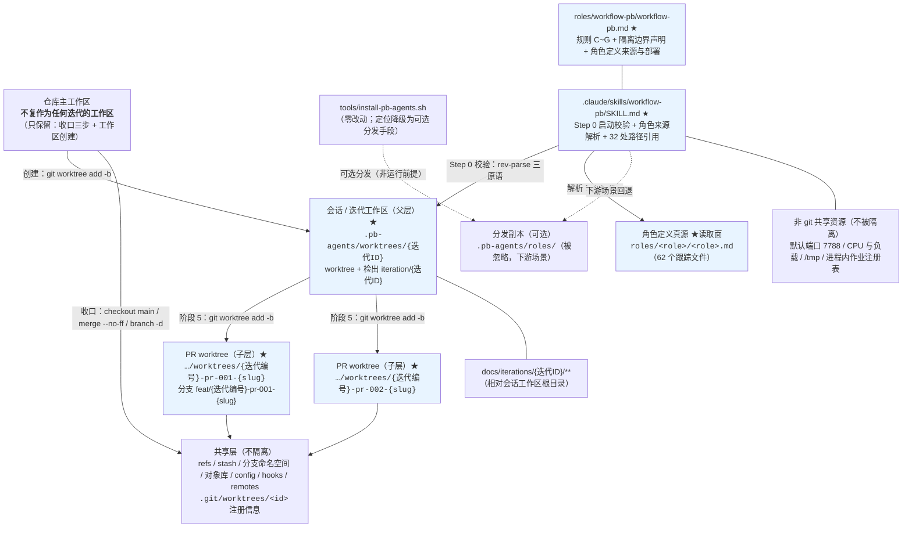
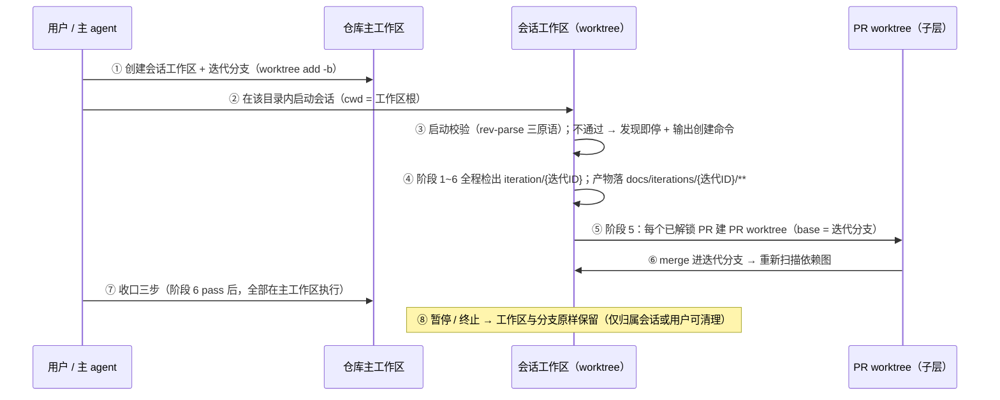

# architecture.md — 0019-worktree-isolation-protocol（迭代架构）

**版本**：1.2.2（阶段 3 产物；v0.1.0 = 初版，v1.1.0 = L1 裁决落盘收口，v1.2.0 = 台账修正（pr-planner 上报的矛盾），v1.2.1 = Gate 第一轮 4 项偏差闭合，v1.2.2 = **Gate 第二轮复验偏差 D1~D6 闭合**）
**日期**：2026-09-12
**状态**：**阶段 3 完成（v1.2.2：Gate 第二轮复验偏差 D1~D6 已闭合；变更面清单定版 W1~W20）**——L1-1 / L1-3 / L1-5 已由用户确认（逐条裁决原文见 §6）；L1-2 / L1-4 由主 agent 裁定**维持 L2**；Q-1 已裁决为 **A**（见 §7），Q-2~Q-5 为已决 L2（供知悉）。§1~§5 与 §8 为**硬契约**（工作区拓扑、命令表、判据、变更面、条款落点与措辞），阶段 4 拆 PR 与阶段 5 实现不得偏离。
**版本历史**：v0.1.0（初版：全部 L1 待确认、Q-1 待裁决）→ **v1.1.0**（2026-09-12：§6 三条 L1 转「已确认」并附裁决原文；§7 Q-1 转「已裁决 A」，落点 = §3.2 命令 1 执行时点 / §5.1-W11 / §8.1 规则 C 建立时点；§10 R-1 解除；§12 完成定义转 ✅）→ **v1.2.0**（2026-09-12：触发来源 = 阶段 4 `pr-planner` 上报的内部矛盾（`:114` 判「要改」却无承载条目、又被零改动清单覆盖）；裁定者 = 主 agent（L2）；落点 = 新增 §5.1-W19 / 零改动清单收窄 / §2.3-#4 补承载引用 / §12 增一致性行）→ **v1.2.1**（2026-09-12：**触发来源 = Gate 独立验证的 2 项 partial / 4 条偏差**（`clarifications/verify-gate-stage4-20260912-191730.md`）；裁定者 = 主 agent；落点 = ① 术语限定计数收敛为单一口径 **7 处**（规范 6 + SKILL 1；按行计 = 按出现位置计）并写入 §2.3 / §4-L2-7；② §5.2-S10 行号枚举按实测重写（`:4` / `:30` / `:58`），§5.1-W15 修正为 `:348-`；③ 新增 **§6.1 阶段 4 主 agent 裁定登记（ADR-1~ADR-4）** 并把 §7 的编号空间与 ADR 分离；④ §5.4 / §8.7 标注 0018 一侧按 ADR-3 由既有提交 `89182b7` 承载）→ **v1.2.2**（2026-09-12：**触发来源 = Gate 第二轮复验的 2 项 partial / 偏差 D1~D6**（`clarifications/verify-gate-stage4-r2-20260912-192704.md`）；裁定者 = 主 agent；落点 = ① 为 `:258` 补承载条目 **W20**，并给出**变更面清单定版编号区间 W1~W20 与全清单**（消除 PR-001 的「W1~W17 + `:114` 条目」两套区间）；② §5.3 末行收窄为「0017 / 0019 两处 + 0018 按 ADR-3 由既有提交承载」；③ `prd/F15` 卡的架构落地段同步为"两处写入 + 0018 外部证据"；④ W12 的范围表述显式排除 7 处术语限定，并更正「逐字不变」的归属为 **F14 验收 1**（原引 F08 验收 2 属误引，见 D4）；⑤ §5.5 归类判据升至 W1~W20 并给出「7 处枚举 → 承载条目」逐处映射）。
**输入**：`prd.md`（v0.2.0，15 卡 F01~F15，产品维度已锁）+ `prd/F01~F15*.md`（架构维度本次全部回填）+ `clarifications/retro-0017-phase1.md`（证据）
**架构基线（本迭代的"现有代码库"= 流程规范文本本体，阶段 3 逐行实测）**：
- `roles/workflow-pb/workflow-pb.md` v0.8.0（625 行，规范本体）
- `.claude/skills/workflow-pb/SKILL.md` v1.11.0（384 行，宿主调度 skill）
- `tools/install-pb-agents.sh`（61 行）、仓库根 `.gitignore`（4 行）、`.pb-agents/` 部署现状
- `roles/<role>/<role>.md`（10 个角色文件）+ `principles/**`（随分发部署的只读面）
- 阶段 3 新取证的既有惯例：`tools/check-model-dispatch-protocol.sh:28`、`oamp/src/role-binding.js:4`、`docs/iterations/0011,0012,0017/**` 的实测 worktree 路径、`.claude/skills/workflow-pb/data/skill-optimization-v1.2.0/v1.6.0.md`
**本次约束**：零新工具、零 hook、零守护进程、零新依赖、零 `.gitignore` 变更、零安装脚本改动、零执行角色文件改动、零 `oamp/**` 改动；手段全部落在 **git 原生命令 + 文本规范**内（W11 / N4 / F13）。

---

## 0. 一句话架构

> **把"会话"与"工作区"在文本层绑定起来，实现手段全部复用既有 `git worktree`：会话工作区 = `<仓库主工作区>/.pb-agents/worktrees/{迭代ID}`（`git worktree add -b iteration/{迭代ID} main` 一次创建），PR worktree 落到它的**子目录**（`<会话工作区>/.pb-agents/worktrees/{迭代编号}-pr-{NNN}-{slug}`，base 仍为迭代分支），"收口三步"整段搬到仓库主工作区执行；角色定义的读取来源由被忽略的 `.pb-agents/roles/` 副本改为**被 git 追踪的 `roles/**`**（下游场景才回退到分发副本）。规范与本 skill 只增加 5 条同体例的「规则 X + 判断方式」、1 段边界声明与 1 段来源契约；**不新增任何工具、目录、忽略项或数据结构**。**

**一句话反证**：本次没有引入任何新技术栈——git 原生命令（`worktree` / `rev-parse` / `ls-files` / `branch` / `merge`）与文本条款；没有新增目录（`.pb-agents/worktrees/` 既已在盘且在 `.gitignore:4` 内）；没有改安装脚本、`.gitignore`、任何执行角色文件与 `oamp/**`；判据全部由 `git rev-parse --git-dir` / `--git-common-dir` / `--show-toplevel` / `ls-files` 四类既存原语承担。

---

## 1. 架构基线（阶段 3 逐行实测）

### 1.1 现有架构的承载面（本次唯一触碰面）

| 文件 / 约定 | 现状职责（阶段 3 复核） | 本次改动性质 |
|---|---|---|
| `roles/workflow-pb/workflow-pb.md`（625 行 / v0.8.0） | 规范本体：阶段定义（6 阶段）、提交管理约束（规则 A / 规则 B / 约束生效范围）、PR 文件七字段、调度指南（启动工作流 1~5 + 4.5、brief 构建、阶段 1~4 推进、阶段 5 依赖解锁式并发、progress-observer、阶段回退、用户决策、终止、迭代分支合并进 main）、文档路径协议、验证目标、状态追踪协议、历史记录协议、角色读取指南、原则 | **扩展 + 局部改写**：新增 规则 C~G（5 条）+ `### 隔离边界声明` + `### 角色定义来源与部署`；改写 规则 A/B 术语、启动工作流 4.5、阶段 5 步骤 2 的 `<path>`/`<分支名>`、合并三步的落地位置、brief 构建路径、文档路径协议主体；新增 v0.9.0 变更说明 |
| `.claude/skills/workflow-pb/SKILL.md`（384 行 / v1.11.0） | 宿主调度 skill：8 条 CRITICAL、Step 0 安装检测、Step 1~4 线性推进、Gate 4→5、Step 5 并发、Step 6 验证、§对外协议（三组契约）、§角色文件路径与安装、§阶段执行卡片、§Brief 构建规则、§用户决策点与暂停格式、§status.md / §history.md 更新时机、Resources、Safety | **扩展 + 局部改写**：改写 1 条 CRITICAL、新增 1 条 CRITICAL、Step 0 第 1 步改为启动校验、32 处角色文件路径改为解析式引用、新增 1 处隔离边界引用、版本 1.11.0 → 1.12.0 |
| `tools/install-pb-agents.sh`（61 行） | 幂等分发脚本：`roles/<role>/<role>.md`（排除 `_template`）→ `<目标>/.pb-agents/roles/`；`principles/` → `.pb-agents/principles/`；每次 `rm -rf` 后重 copy | **零改动**（F08 边界：不含脚本自身实现改动）；仅其**文档定位**在规范/SKILL 侧降级为"可选分发手段" |
| 仓库根 `.gitignore`（4 行：`.idea/` / `.pb-agents/` / `.DS_Store` / `.pb-agents/worktrees/`） | 忽略部署副本与 PR worktree 落点 | **零改动**——新工作区落点复用既有第 2、4 行，不需要新的忽略项 |
| `.pb-agents/`（部署副本现状） | 10 个角色目录 + `principles/{execution,meta}` + 空的 `worktrees/`；整体被忽略（`.gitignore:2`） | **不改内容**；在规范中的定位降级 |
| `roles/<role>/<role>.md`（10 个） | 角色能力定义（`architect/` 等 9 个执行角色 + `workflow-pb/` 规范本体） | **除 `workflow-pb/workflow-pb.md` 外零改动**（F08 边界 + 规范 CRITICAL「修改本文件不得侵入任何执行角色文件」） |

### 1.2 可直接复用的既有能力（决定了本方案为什么"少造东西"）

| # | 既有能力（位置，阶段 3 实测） | 本次如何复用 |
|---|---|---|
| A | **`git worktree` 机制已在阶段 5 被真实证成**：0017 的 pr-001 ∥ pr-003 在独立 worktree 内并发完成、互不污染（`retro-0017-phase1.md` G-1 四项一手证据） | 会话层直接复用同一机制，只是把生命周期从"PR 粒度"提升到"迭代粒度"——**降低风险而非引入新机制类型**（复盘 Q-a A-2 结论） |
| B | **`.pb-agents/worktrees/` 已是既存落点约定**：`.gitignore:4` 显式忽略；0011 期间实测存在 `.pb-agents/worktrees/0011-pr-001-persist/`、`…-pr-006-race/`、`…-pr-009-default-model/`，0012 期间 `.pb-agents/worktrees/0012-pr-006-e2e-and-docs/`，0017 期间 `.pb-agents/worktrees/pr-001`、`pr-003`；当前磁盘上该目录存在且为空 | 直接复用为**唯一 worktree 父目录**（会话层 + PR 层），**零 `.gitignore` 变更** |
| C | **`git rev-parse` 的原生层级判据**：链接工作区里 `--git-dir`（`.git/worktrees/<id>`）≠ `--git-common-dir`（`.git`），仓库主工作区两者相同 | 一个原语同时解决 **T-02（启动判据）** 与 **T-07（如何确认自己在主工作区）**——不需要新命令、不需要环境变量、不需要标记文件 |
| D | **`git ls-files` 可判定"是否被追踪"** | **T-04 / T-11** 的角色来源解析判据（`git ls-files --error-unmatch <path>`），零工具 |
| E | **既有「规则 X + 判断方式」体例**（`workflow-pb.md:127-137`：规则 A / 规则 B 各一段条款 + 紧跟一行 `判断方式：…`） | 5 条新规则直接沿用（T-16），**不新增结构体例** |
| F | **既有「约束生效范围」句**（`workflow-pb.md:139-141`：「上述约束仅从下一个使用本工作流的迭代起生效，不追溯已完成迭代」） | 新规则追加在该句**之前**，自动被它覆盖 → **F14 验收 6（不追溯、0019 自身不迁移）零改动即成立** |
| G | **SKILL 已写过"解析后的角色文件具体路径"**（`SKILL.md:100`：「传最小 brief + 解析后的角色文件具体路径」） | 角色来源解析的**下游语义已经存在**，本次只是把"解析规则"从"目录是否存在"换成"是否被 git 追踪" |
| H | **规范内部已经存在真源路径的正确写法**：`workflow-pb.md:579`「**工作流文件路径**：`roles/workflow-pb/workflow-pb.md`」用的是**源码真源**；而 `:236/244/246` 用的是 `.pb-agents/` 副本 | 本次统一为真源方向（`:579` 保持不动，改 `:236/244/246`）——**不是新发明，是把既有的不一致收敛到正确的一侧** |
| I | **`oamp` 产品代码已按"角色真源 = 被追踪的 `roles/`"实现**：`oamp/src/role-binding.js:4`「角色真源 = `<roleRoot>/roles/<role>/<role>.md`（不读 `.pb-agents/` 副本）」 | 规范侧的改写方向**与既有产品代码的既有约定同向**（N7：不改该代码，只对齐） |
| J | **`roles/workflow-pb/data/workflow-pb-changelog.md` + `memory.md` 索引 + SKILL 侧 `data/skill-optimization-*.md`** 的既有变更留痕惯例（v0.2.0 ~ v0.8.0 每版都有） | 本次以同一惯例落 v0.9.0 / v1.12.0，**不新建文档类型** |

### 1.3 既有缺口（正好是 15 张卡的来源）

1. **工作区身份与会话身份未绑定**：规范全文（`workflow-pb.md` 625 行）没有任何一句要求"会话在自己的工作区里运行"，也没有"会话工作区"这个词；实测损害四类全部发生在"工作目录 / 索引 / HEAD"这一层（`retro-0017-phase1.md` P-1 证据 1~5）→ F01 / F02 / F03。
2. **`workflow-pb.md:226` 的"主 agent 根目录"是全文唯一的根指代，且默认主体是仓库根**：`4.5. …随后 git checkout iteration/{迭代ID} 切换工作区；…此后阶段 2~5 期间主 agent 根目录保持在该分支上。` → F04 / F05。
3. **合并三步假定"工作区可以被切到 main"**：`workflow-pb.md:333-338` 只有三步命令、没有执行位置；0017 收口的 reflog 实测就是"在主工作区 checkout main"（`retro-0017-phase1.md` Q-a A-4.2）。多工作区下该动作必须换位置 → F05 / F12。
4. **`.pb-agents/roles/` 是运行前提，而它在新工作区里必然缺席**：`.gitignore:2` 忽略 `.pb-agents/`（实测 `retro-0017-phase1.md` B-2 用 `git check-ignore -v` 逐条给出），`SKILL.md:42/133/224` 又规定"不存在即停止推进、不得退回读 `roles/`" ⇒ **新工作区 Step 0 必停**（Q-b B-1 前提 2 = 「不满足」）→ F08。
5. **阶段 5 的 worktree 落点 `<path>` 未定义**（`workflow-pb.md:277` 只写 `git worktree add <path> -b <pr分支名> iteration/{迭代ID}`），实测落点一律在主工作区（1.2-B）→ 在多工作区下会把 PR worktree 写到会话工作区之外，与跨工作区写入约束冲突 → F07 / F09（T-01 / T-03 / T-05）。
6. **worktree 术语单义、实际两层**：改前全文只有"PR 层 worktree"一种含义；新增会话层后 `规则 A：worktree 隔离` / `:129` / `:135` 这类裸用法不再唯一 → F07 验收 5。
7. **共享 refs / 对象库 / config / hooks / remotes 与四类非 git 资源从未被声明**（复盘 A-4.1 / A-4.3）→ F11 / F12。
8. **跨工作区写入无条款**：实测 pr-003 dev 误写主工作树三笔 edit（`0017/history.md:204`）→ F09。
9. **暂停 / 终止迭代的现场无保留条款**（既有条款只覆盖阶段 5 的失败 / 阻塞 PR）→ F10。

### 1.4 本次演进的组件图（★ = 本次新增/改动的**文本**；未标 ★ = 逐字不变的既有链路）



**读图要点**：本次**没有新增节点**——`MW / SW / PW / REFS / SRC / COPY / INST / SKILL / SPEC / DOCS / NON` 全部是既有实体（其中 5 个加 ★ 表示有文本改动）；新增的只有"两条命令的落点"（`MW→SW` 的创建、`SW→PW` 的创建）与"读取面从 `COPY` 改指 `SRC`"。

### 1.5 工作区拓扑与命名（T-01 / T-03 的落定形态）

```
<仓库主工作区>/                                  ← main 检出；收口动作在此执行
└── .pb-agents/worktrees/                        ← 既有父目录（.gitignore:2 与 :4 已覆盖）
    ├── {迭代ID}/                                ← 会话 / 迭代工作区（父层）
    │   ├── （仓库内容，含 roles/** 与 .gitignore）
    │   └── .pb-agents/worktrees/                ← PR worktree 落点（在会话工作区内 ⇒ 不构成跨工作区写入）
    │       ├── {迭代编号}-pr-001-{slug}/          ← PR worktree（子层，短生命周期）
    │       └── {迭代编号}-pr-002-{slug}/
    └── （历史残留：0011/0012/0017 的既存目录，不清理——N5 / F14 验收 4）
```

| 对象 | 命名（唯一约定） | 依据 |
|---|---|---|
| 迭代 / 会话工作区目录 | `{迭代ID}`（如 `0019-worktree-isolation-protocol`） | 与迭代分支 `iteration/{迭代ID}` 一一对应；目录名不含 `/` |
| 会话工作区分支 | `iteration/{迭代ID}`（既有，v0.8.0 起不变） | N1 / F14 验收 2（分支层语义不变） |
| PR worktree 目录 | `{迭代编号}-pr-{NNN}-{slug}` | 沿用 0011/0012 实测惯例（1.2-B），前缀即迭代编号 |
| PR worktree 分支 | `feat/{迭代编号}-pr-{NNN}-{slug}` | **T-03**：MI-04 = "含迭代编号即可"；本形态同时满足 0007 实测分支 `feat/0007-pr-001-history-log-protocol` 与 0011/0012 的目录惯例 |
| 分支 base / 合并目标 | PR worktree 的 base = `iteration/{迭代ID}`、合并目标 = `iteration/{迭代ID}`（**不变**） | N8 / F07 验收 4 |

> **`{迭代编号}` 与 `{迭代ID}` 的区分**：迭代 ID 是 `{编号-迭代名}`（如 `0019-worktree-isolation-protocol`），`{迭代编号}` 是其中的编号段（如 `0019`）。**分支名与 PR worktree 目录名使用 `{迭代编号}`**——这是 MI-04 的 `user_confirmed` 生效口径（"字符串包含该迭代编号即可，不要求统一格式"），也与 0007/0011/0012 的实测惯例同形；**迭代分支与迭代工作区目录使用 `{迭代ID}`**（既有 v0.8.0 语义，N1 不变）。

**为什么 PR worktree 落在会话工作区**（而非沿用"主工作区下平铺"的旧实测形态）：① F09 要求写操作落在本会话工作区内，`git worktree add` 是一次目录写入——平铺到主工作区会立刻构成跨工作区写入；② F07 验收 1 要求 PR worktree 是会话 / 迭代工作区的**下**层；③ `.pb-agents/worktrees/` 在会话工作区内同样被其跟踪的 `.gitignore` 忽略，无额外忽略项。**这是 T-01/T-05 的唯一实质位移**，已登记为 L2-2（§4）并列入 §7 供主 agent 知悉。

---

## 2. 全部出现点清单（逐文件 + 行号 + 原文；T-06 / T-08 / T-11 的输入）

> 方法：阶段 3 逐文件通读并逐行检索五类表述；下表**逐条给出位置与处置**。处置三档：**改写**（属本次变更面）/ **零改动**（既有条款不受影响）/ **清单外**（出现但不在本次范围，只记录理由，不改）。
> 扫描面 = `roles/workflow-pb/workflow-pb.md`、`.claude/skills/workflow-pb/SKILL.md`、`tools/install-pb-agents.sh`、仓库根 `.gitignore`、`roles/<role>/<role>.md`（10 个）、`principles/**`、`.claude/skills/workflow-pb/data/*`。

### 2.1 ① 「根目录」/「仓库根」类指代

| # | 位置 | 原文（片段） | 处置 |
|---|---|---|---|
| 1 | `workflow-pb.md:226` | 「随后 `git checkout iteration/{迭代ID}` 切换工作区；在 status.md 头部写入 `**迭代分支**: iteration/{迭代ID}`。此后阶段 2~5 期间**主 agent 根目录**保持在该分支上。」 | **改写**（唯一一处"根目录"条款）：主体 → "该会话所在的迭代工作区"；分支创建动作见 §7 Q-1 |
| 2 | `workflow-pb.md:579` | 「1. **工作流文件路径**：`roles/workflow-pb/workflow-pb.md`」 | **零改动**——它已经是真源路径；本次把 `:236/244/246` 收敛到同一侧（1.2-H） |
| 3 | `roles/pr-planner/pr-planner.md:68` | 「\| 代码库根目录 \| 用于核实真实的文件/接口耦合，不能只读文档 \|」 | **清单外**：执行角色文件（F08 边界「不含角色文件内容的任何改动」）；且其"代码库根目录"是角色输入表字段，语义 = 被核实的代码库根，不是"主 agent 根目录"的指代 |
| 4 | `roles/progress-observer/progress-observer.md:66` | 「\| 代码库根目录 \| 用于执行 git 命令核实真实状态 \|」 | **清单外**，同 #3 |
| 5 | `roles/cdp-debug-skill/**`（`SKILL.md:3/114/164`、`references/chromium-profile-guide.md:3/16/17`、`scripts/*.sh:48/64/39`） | 「数据根目录」（`$CDP_DEBUG_HOME`） | **清单外**：同词不同义（CDP 调试数据的根目录），与工作区无关 |
| 6 | `SKILL.md` 全文 | 无「根目录 / 仓库根」出现（0 命中） | — |

### 2.2 ② 「checkout main」/「切到 main」/「合并进 main」类动作

| # | 位置 | 原文（片段） | 处置 |
|---|---|---|---|
| 1 | `workflow-pb.md:333` | 「### 迭代分支合并进 main」 | **改写**：加执行位置限定（`（在仓库主工作区执行）`） |
| 2 | `workflow-pb.md:335` | 「阶段 6（独立验证）对本迭代最终产物判定 pass 之后，主 agent 依次执行：」 | **改写**：补"在**仓库主工作区**执行"，其余措辞与触发时机不变 |
| 3 | `workflow-pb.md:336` | 「1. `git checkout main`」 | **改写**：`git -C <仓库主工作区> checkout main` |
| 4 | `workflow-pb.md:337` | 「2. `git merge --no-ff iteration/{迭代ID}`」 | **改写**：`git -C <仓库主工作区> merge --no-ff iteration/{迭代ID}` |
| 5 | `workflow-pb.md:338` | 「3. `git branch -d iteration/{迭代ID}`」 | **改写**：`git -C <仓库主工作区> branch -d iteration/{迭代ID}` + 前置动作（见 §7 Q-2） |
| 6 | `workflow-pb.md:340` | 「commit message 格式：`merge: iteration {迭代ID} {该迭代一句话目标} into main`。」 | **零改动** |
| 7 | `workflow-pb.md:342` | 「若步骤 2 报告冲突：停止推进，向用户上报……」 | **零改动**（F12 已知代价声明的落点之外，措辞不变） |
| 8 | `workflow-pb.md:344` | 「合并完成后，status.md 的 `**迭代分支**` 字段改为 `iteration/{迭代ID}（已合并）`。」 | **零改动** |
| 9 | `workflow-pb.md:226` | 「`git checkout iteration/{迭代ID}` 切换工作区」 | **改写**（同 2.1-#1）：新形态下会话工作区在创建时即检出该分支，此句的动作随之重述 |
| 10 | `workflow-pb.md:129` | 「……不得直接在主分支（main/master）或当前迭代的迭代分支上提交。」 | **零改动**（规则 A 实质语义，N8）；只在术语上加限定（见 2.3） |
| 11 | `workflow-pb.md:57 / 59 / 61 / 63` | v0.8.0 变更说明（「由主 agent 自动合并进 main」等） | **零改动**——历史变更说明是既成事实的记录，改写即伪造历史；本次改动以新增 v0.9.0 变更说明承载 |
| 12 | `workflow-pb.md:81 / 83 / 94 / 104-108 / 136-148` | v0.5.0 / v0.2.0 变更说明 | **零改动**，同上 |
| 13 | `roles/workflow-pb/data/workflow-pb-changelog.md:5-26 / 78-109 / 136-149` | 历次变更历史（含三步命令原文） | **零改动**（历史）；本次**追加** v0.9.0 条目 |
| 14 | `.claude/skills/workflow-pb/data/skill-optimization-v1.2.0/v1.6.0/v1.7.0/v1.8.0.md` | 历次 SKILL 优化记录（含 `.pb-agents/roles/` 路径决策） | **零改动**（历史）；本次**新建** `skill-optimization-v1.12.0.md` |
| 15 | `SKILL.md:65` | 「阶段 5 所有 PR 合并进当前迭代的迭代分支」 | **零改动**（说的是 PR → 迭代分支，与"合并进 main"不同层） |
| 16 | `SKILL.md` 全文 | 无「checkout main / 合并进 main」出现（0 命中）——SKILL 不含收口步骤 | — |
| 17 | `roles/progress-observer/progress-observer.md:24` | 「你要去检查 pr-001 是否真的已经合并进**主分支**」 | **清单外**：执行角色文件；且是 v0.8.0 之前的陈旧术语（现应为"迭代分支"）。按 F14「不含顺手改进」只提及、不修 |
| 18 | `tools/check-model-dispatch-protocol.sh:34-38` | `case "$branch" in main\|master) fail "V-02 当前分支不得为 ${branch}"` | **清单外**：属 model-dispatch-protocol（另一协议），本次不变更面 |

### 2.3 ③ 「git worktree」/「worktree」类机制描述（共 34 处；判定规则见文末）

**`roles/workflow-pb/workflow-pb.md`（20 处）**

| # | 行 | 原文摘要 | 层级判定 | 处置 |
|---|---|---|---|---|
| 1 | 35 | CRITICAL：「不得再有独立的 workflow-scm 文件重复定义 **worktree/PR 规则**」 | PR 规则（历史用词） | **零改动**（元约束，不指具体层） |
| 2 | 57 | v0.8.0：「`main ← 迭代分支 ← **PR worktree 分支**` 两层结构」 | PR 层（已限定） | **零改动**（历史） |
| 3 | 81 / 83 / 94 | v0.5.0 / v0.2.0 变更说明 | PR 层 | **零改动**（历史） |
| 4 | 114 | 阶段定义表 阶段 5：「逐 PR 在**独立 worktree 分支**……」 | PR 层（语境"逐 PR"已可判） | **改写（加限定）**：→「独立 **PR** worktree 分支」；**承载条目 = §5.1-W19**（仅改该行的 `worktree`，阶段定义表的职责 / 输入 / 输出 / 推进条件四列一律不动） |
| 5 | 127 | 「### 规则 A：**worktree 隔离**」 | **歧义**（新增会话层后不再唯一） | **改写（加限定）**：→「### 规则 A：**PR worktree** 隔离」 |
| 6 | 129 | 规则 A 正文：「任何代码变更必须在**独立 worktree 分支**上进行」 | **歧义** | **改写（加限定）**：→「独立 **PR** worktree 分支」 |
| 7 | 135 | 规则 B：「每个 **worktree 变更**必须对应一个 `prs/pr-{NNN-描述}.md`」 | **歧义** | **改写（加限定）**：→「每个 **PR worktree** 变更」 |
| 8 | 258 | brief 模板：「**worktree 分支**：{分支名}」 | **歧义**（brief 阶段 5 专属 = PR 层） | **改写（加限定）**：→「**PR worktree 分支**：{分支名}」 |
| 9 | 277 | 阶段 5 步骤 2：`git worktree add <path> -b <pr分支名> iteration/{迭代ID}` | PR 层（命令本身） | **改写（具体化）**：`<path>` 与 `<分支名>` 落为 §1.5 的形态；base 不变 |
| 10 | 279 | 「不得对失败/阻塞的 PR 执行 `git worktree remove`…」 | PR 层（主语"PR"已可判） | **零改动**（既有护栏，F14 验收 7） |
| 11 | 281 | 「PR-B 的 **worktree 分支**必须从……迭代分支拉出」 | PR 层（已限定） | **零改动** |
| 12 | 285 | 「创建 worktree → 派发 planner → 派发 dev → 验收 → merge」 | PR 层（同一句主语为"独立 PR"） | **零改动** |
| 13 | 304 | progress-observer 核实项：「核实其 **worktree 目录和分支**是否仍存在于磁盘」 | PR 层（主语"失败/阻塞的 PR"） | **零改动** |
| 14 | 417 | 「**worktree 时间窗口重叠**」（阶段 6 强制核查项） | PR 层（同上文） | **零改动** |
| 15 | 463 | status.md 表头：「\| PR 文件 \| depends_on \| 状态 \| **worktree 分支** \|」 | PR 层（表标题为「PR 实现子状态」） | **零改动**（F14/N1：状态追踪协议格式不动） |
| 16 | 481 | 状态符号定义：「**worktree 和分支**原样保留未清理」 | PR 层（同表内） | **零改动** |
| 17 | 485 | 「**worktree 分支列**标注约定」（`(已清理)` / `(保留)`） | PR 层（同表内） | **零改动** |
| 18 | 611 | 原则：「**提交管理约束（worktree 隔离、PR 文件前置）**和并发调度逻辑只在本文件定义」 | 引用 #5 的旧标题 | **改写（同步）**：→「（**PR worktree** 隔离、PR 文件前置）」 |

**`.claude/skills/workflow-pb/SKILL.md`（14 处，全为 PR 层语境）**

| # | 行 | 原文摘要 | 处置 |
|---|---|---|---|
| 1 | 38 / 52 | 两条 CRITICAL（"PR-B 的 worktree 从未含 PR-A 代码" / "不得对失败/阻塞的 PR 执行 `git worktree remove`"） | **零改动**（主语均为 PR，可判；且属既有护栏 F14 验收 7） |
| 2 | 101 / 119 / 123 / 170 / 172 / 174 / 186 / 256 / 261 / 345 / 377 | 阶段 5 相关（"管理 worktree 创建" / "PR-B worktree 必须从…拉出" / "独立 worktree + …" / "每个 PR 独立 worktree" / status 更新时机 / Safety） | **零改动**（语境均自带"PR"或位于阶段 5 小节内，指代唯一） |
| 3 | 303 | brief 模板：「**worktree 分支**：{分支名}」 | **改写（加限定）**：与规范 `:258` 同步 →「**PR worktree 分支**」 |

**其它文件**

| # | 位置 | 原文摘要 | 处置 |
|---|---|---|---|
| 1 | `.gitignore:4` | `.pb-agents/worktrees/` | **零改动**（复用为唯一父目录） |
| 2 | `roles/pr-planner/pr-planner.md:244` | 「不创建 worktree 或 git 分支（规划职责，不是执行）」 | **清单外**（执行角色文件；语境内为 PR 层） |
| 3 | `roles/progress-observer/progress-observer.md:3 / 106 / 111 / 124 / 125 / 137 / 163 / 164 / 189 / 194 / 223 / 282` | 12 处 worktree/branch 核实表述 | **清单外**（执行角色文件；全部为 PR 层语境） |
| 4 | `roles/verifier/data/verify-*.md`、`docs/iterations/00{07,10,11,12,14,17}/**` 的验证报告与 progress | 实测 worktree 路径与核实记录 | **清单外**（历史产物，只读；且是 1.2-B 的证据来源） |
| 5 | `tools/check-model-dispatch-protocol.sh:28` | `expected_worktree="${project_root}/.pb-agents/worktrees/${project_id}-${iteration_id}"` | **清单外**（属 model-dispatch-protocol）；**已知张力**见 §10 R-3 |

> **③ 的判定规则（用于 F07 验收 5 的字面判据）**：**判据（解释某处为何入选）** = 该处 `worktree` 是否**裸用**——去掉上下文后仅凭该名词短语无法判断层级（「独立 worktree 分支」「worktree 隔离」「每个 worktree 变更」「worktree 分支：{分支名}」）即入选；若其宾语 / 主语 / 所属表已把层级说清（「对失败 / 阻塞 PR 执行 worktree/branch 清理」「PR-B 的 worktree 分支」「PR 实现子状态」表的 worktree 分支列、`main ← 迭代分支 ← PR worktree 分支`）则判为可判、**不改**（避免顺手改动，F14 验收 1 的反面）。**唯一口径（验收基准，v1.2.1 收敛）**：术语限定面 = **7 处**＝规范 **6 处**（`roles/workflow-pb/workflow-pb.md` 的 `:114` / `:127` / `:129` / `:135` / `:258` / `:611`）＋ SKILL **1 处**（`.claude/skills/workflow-pb/SKILL.md:303`）。**计数规则 = 按行计**；实测每行恰含 1 个待限定 token，故**按行计与按出现位置计结果相同（均为 7）**，不需要两套数字。
**非术语位移另计 1 处**：规范 `:277` 的 `<path>` / `<分支名>` 具体化（T-01 / T-03 的落点填充，不改术语，**不计入**上列 7 处）。
**其余 26 处**（规范 20 − 6 − 1 = 13；SKILL 14 − 1 = 13）判为"零改动 / 可判"，逐条理由见上表。

### 2.4 ④ 「install-pb-agents」/「.pb-agents/roles」类角色文件路径表述

**在变更面内（35 处）**

| # | 位置 | 原文摘要 | 处置 |
|---|---|---|---|
| 1 | `workflow-pb.md:236` | 「主 agent 必须先读出角色文件全文（`.pb-agents/roles/<role>/<role>.md`）」 | **改写** → `{角色定义根}/<role>/<role>.md`（解析后的具体路径） |
| 2 | `workflow-pb.md:244` | brief 模板：「{读出的 `.pb-agents/roles/<role>/<role>.md` 完整内容，原样注入}」 | **改写** → `{角色定义根}/…` |
| 3 | `workflow-pb.md:246` | brief 模板：「工作流规范：`.pb-agents/roles/workflow-pb/workflow-pb.md`」 | **改写** → `{角色定义根}/workflow-pb/workflow-pb.md` |
| 4 | `SKILL.md:31` | 「**完整规范**: `.pb-agents/roles/workflow-pb/workflow-pb.md`（安装方式见「§ 角色文件路径与安装」）」 | **改写**（路径 + 章节名引用） |
| 5 | `SKILL.md:42` | CRITICAL：「角色文件根路径**固定为** `.pb-agents/roles/`，agents 项目自身开发时也不例外——`.pb-agents/roles/` 不存在时，先执行 `tools/install-pb-agents.sh` 完成安装，**不得退回读 `roles/` 源码目录**」 | **改写（CRITICAL，L1-1）** → 真源规则（§8.4 给出措辞） |
| 6 | `SKILL.md:50` | CRITICAL：「按 `.pb-agents/roles/workflow-pb/workflow-pb.md`「阶段回退」判断标准」 | **改写**（路径引用） |
| 7 | `SKILL.md:96` | Tools：「启动时检测 `.pb-agents/roles/` 是否存在……不存在则提示执行安装脚本并停止」 | **改写** → 启动校验（工作区）+ 角色来源解析；删除"未安装即停止" |
| 8 | `SKILL.md:97` | 「读取规范文件（`.pb-agents/roles/workflow-pb/workflow-pb.md`，需要完整规范时）」 | **改写**（路径引用） |
| 9 | `SKILL.md:133` | Step 0 第 1 步：「**检查安装**……检测 `.pb-agents/roles/` 是否存在。不存在 → 提示用户先执行 `tools/install-pb-agents.sh`，**停止推进**；存在 → 继续。agents 项目自身开发场景不例外，同样要求已安装。」 | **改写（核心）** → 「启动校验」（判据见 §3.3）+ 角色来源解析 |
| 10 | `SKILL.md:141` | 「读取 `.pb-agents/roles/workflow-pb/workflow-pb.md` §阶段定义」 | **改写**（路径引用） |
| 11 | `SKILL.md:176` | 「完整公式见 `.pb-agents/roles/workflow-pb/workflow-pb.md` §「阶段 5」」 | **改写**（路径引用） |
| 12 | `SKILL.md:186` | 「……见 `.pb-agents/roles/workflow-pb/workflow-pb.md` §「并发调度真实执行证据…」」 | **改写**（路径引用） |
| 13 | `SKILL.md:212` | 「产物文档的路径、字段、标注规则由 `.pb-agents/roles/workflow-pb/workflow-pb.md` 规范文件统一定义」 | **改写**（路径引用） |
| 14 | `SKILL.md:220` | 「角色文件根路径**固定为** `.pb-agents/roles/`——不再区分"agents 项目自身开发"与"业务项目部署"两种场景，两者走同一套安装流程，同一套路径。」 | **改写（核心）** → 两场景共用同一份规范、来源按"被追踪"解析 |
| 15 | `SKILL.md:222` | 「**安装方法**：`tools/install-pb-agents.sh [目标项目路径]`……真实 copy 到 `<目标项目>/.pb-agents/roles/<role>/<role>.md`」 | **改写（定位降级）**：保留事实描述，加"面向下游业务项目的**可选分发手段**"；脚本本体零改动 |
| 16 | `SKILL.md:224` | 「**检测时机**：Step 0 启动时检测 `.pb-agents/roles/` 是否存在。不存在 → 提示用户执行安装脚本，**停止推进**，不得退回读 `roles/` 源码目录。」 | **改写（核心）**：删除"未安装即停止"；改为角色来源解析 |
| 17 | `SKILL.md:226` | 「**已知代价**：agents 项目自身开发时修改了 `roles/` 源码后，必须重新执行安装脚本才能让 `.pb-agents/roles/` 同步更新」 | **改写**：本仓库场景该代价**消失**（真源即源码，改完即生效）；代价移至下游分发场景（副本与真源可能不同步） |
| 18 | `SKILL.md:228` | 「**只读约束**：`.pb-agents/roles/` 是 agents 框架的只读 copy（见 `docs/memory-system.md` §六），本 skill 只读取，不修改」 | **改写（保留语义）**：只读约束不变，主语由"部署副本"扩展为"角色定义（真源与副本均执行期只读）" |
| 19-32 | `SKILL.md:238 / 243 / 248 / 253 / 258 / 259 / 260 / 265 / 270 / 285 / 287 / 339 / 353 / 365 / 366` | §阶段执行卡片 7 处 + §Brief 构建规则 3 处 + §status / §history 更新时机 2 处 + Resources 2 处 + 安全网 1 处，全部形如「角色文件路径：`.pb-agents/roles/<role>/<role>.md`」 | **改写（机械替换）** → `{角色定义根}/<role>/<role>.md` |
| 33 | `SKILL.md:383` | Safety：「派发子 agent 前必须已确认 `.pb-agents/roles/` 存在……不存在时先停止推进提示安装，不得退回读 `roles/` 源码目录」 | **改写（核心）** → 「派发前必须已解析角色定义根路径（`{角色定义根}`）」 |
| 34 | `SKILL.md:384` | Safety：「`.pb-agents/roles/` 只读，不修改其内容，也不派发角色去写它的 `data/`/`memory.md`」 | **改写（保留语义）**：只读约束保留 |
| 35 | `SKILL.md:96-100`（`§ 对外协议·角色派发契约`） | 「传最小 brief + **解析后的角色文件具体路径**」 | **零改动**——解析语义已存在（1.2-G），本次把它用起来 |

**清单外（不改，逐类给出理由）**

| 位置 | 原文摘要 | 为何不改 |
|---|---|---|
| `tools/install-pb-agents.sh:3 / 11 / 14 / 15 / 18 / 28` | 脚本本体与注释（`target_pb_agents="${target_project}/.pb-agents"` 等） | F08 边界：「不含安装脚本自身的实现改动」——它仍是下游分发的实现 |
| `.gitignore:2 / 4` | `.pb-agents/`、`.pb-agents/worktrees/` | 本次不新增忽略项、不放开任何忽略（N6 场景不定义流程） |
| `roles/retrospective/retrospective.md:93 / 309`、`roles/verifier/verifier.md:53 / 161 / 202 / 253` | `.pb-agents/project/roles/<role>/data/` | **不同约定**：那是"角色运行记录的项目侧落点"，不是"角色定义来源"；执行角色文件不改 |
| `principles/meta/agent-design-protocol.md:360-361`、`principles/execution/model-dispatch-protocol.md:45-53 / 274`、`docs/memory-system.md:156-201`、`README.md:116-169`、`docs/multi-omp-agent-protocol.md`、`docs/ds/*`、`docs/mvp-plan.md`、`docs/proposal.md` | `.pb-agents/` 框架 copy / 配置例外区 / 项目运行记录的既有约定 | 均描述"下游部署后的目录分层"，与本次"来源真源"不冲突；改成一致是范围外（F14：不含顺手改进） |
| `.claude/skills/workflow-pb/data/skill-optimization-v1.2.0.md:8-12`、`v1.6.0.md:8-20` | 历史记录：v1.2.0 引入 `{角色根}` 双值解析 → v1.6.0 **删除**该变量改为固定 `.pb-agents/roles/` | **历史记录不改**，且是本决策必须交代的前提变化（§4 L2-3） |
| `.claude/skills/workflow-pb/memory.md:8`、`roles/workflow-pb/memory.md:8-14` | 版本索引 | **追加**新版本索引行（既有惯例），不修改既有行 |

### 2.5 ⑤ 「同一个工作区 / 工作树」类隐含单会话假设

| # | 位置 | 原文（片段） | 隐含假设 | 处置 |
|---|---|---|---|---|
| 1 | `workflow-pb.md:226` | 「此后阶段 2~5 期间主 agent 根目录保持在该分支上」 | **全仓只有一个工作区**，会话 = 工作区 | **改写**（2.1-#1） |
| 2 | `workflow-pb.md:333-338` | 三步收口（`checkout main`…） | 会话所在工作区**可以被切到 main** | **改写**（2.2-#1~#5） |
| 3 | `workflow-pb.md:236 / 244 / 246` | `.pb-agents/roles/...` 作为 brief 的角色来源 | 当前工作区里**存在部署副本** | **改写**（2.4-#1~#3） |
| 4 | `workflow-pb.md:277` | `git worktree add <path> …`（`<path>` 未定义） | `<path>` 落在**当前工作区**（实测即主工作区） | **改写（具体化）**（2.3-#9） |
| 5 | `SKILL.md:42` | 「角色文件根路径固定为 `.pb-agents/roles/`……不得退回读 `roles/`」 | 同上 #3，且把"退回真源"表述为**禁止** | **改写（CRITICAL）**（2.4-#5） |
| 6 | `SKILL.md:96-97 / 133 / 224 / 383` | Step 0 安装检测 + "不存在即停止推进" | 新工作区**必然缺席**部署副本 ⇒ 会话无法启动 | **改写（核心）**（2.4-#7/#9/#16/#33） |
| 7 | `SKILL.md:220-228` | 「不再区分两场景，同一套安装流程、同一套路径」 | 安装是**运行前提**（C-7 的原点） | **改写（定位降级）**（2.4-#14~#18） |
| 8 | `.gitignore:2 / 4` | `.pb-agents/`、`.pb-agents/worktrees/` | 上述副本与落点都是**仓库级、非跟踪**状态 | **零改动**（事实依据；新方案恰好绕开它） |
| 9 | `workflow-pb.md:304 / 417` | progress-observer 核实 worktree / 并发证据 | ——（PR 层，非单会话假设） | **零改动** |
| 10 | `SKILL.md:100` | 「传最小 brief + 解析后的角色文件具体路径」 | ——（已含多场景解析语义） | **零改动**（本方案的落点之一） |

---

## 3. 核心动作流与命令表（T-05 / T-07 / T-02 的落定）

### 3.1 会话工作区生命周期（时序）



### 3.2 命令表（唯一真源；规范与 SKILL 只引用，不各写一份）

| # | 动作 | 命令（**执行位置**） | 依据 / 卡片 |
|---|---|---|---|
| 1 | 创建会话工作区 + 迭代分支（**执行时点 = 会话启动之前（阶段 1 之前）**，Q-1 = A） | `git worktree add .pb-agents/worktrees/{迭代ID} -b iteration/{迭代ID} main`（**仓库主工作区**；由用户或主 agent 在离开主工作区之前执行，随后会话在该工作区根目录内启动） | F01 / F02 / F03 · T-01 / T-05 |
| 2 | 启动校验（三判据） | ① `git rev-parse --show-toplevel` == cwd；② `git rev-parse --git-dir` ≠ `git rev-parse --git-common-dir`；③ `git branch --show-current` == `iteration/{迭代ID}`（**会话工作区**） | F03 · T-02 |
| 3 | 确认「当前是仓库主工作区」 | `git rev-parse --git-dir` == `git rev-parse --git-common-dir`（**仓库主工作区**） | F05 · T-07 |
| 4 | 归属判定 / 现场核实 | `git worktree list` + `git branch --list 'iteration/*'`（**任意位置**，只读） | F06 / F10 · T-05 |
| 5 | 创建 PR worktree | `git worktree add .pb-agents/worktrees/{迭代编号}-pr-{NNN}-{slug} -b feat/{迭代编号}-pr-{NNN}-{slug} iteration/{迭代ID}`（**会话工作区**） | F06 / F07 · T-03 / T-05 |
| 6 | 收口三步 | `git -C <仓库主工作区> checkout main` → `git -C <仓库主工作区> merge --no-ff iteration/{迭代ID}` → `git -C <仓库主工作区> branch -d iteration/{迭代ID}`（**仓库主工作区**） | F05 · T-07 |
| 7 | 收口前置动作（第 6 步之 3 前） | 若 `iteration/{迭代ID}` 仍被会话工作区检出 → `git -C <会话工作区> checkout --detach`（**会话工作区**，唯一获准的跨区动作，见 §7 Q-2） | F05 · T-07 |
| 8 | 角色定义来源解析 | `git ls-files --error-unmatch <根>/<role>/<role>.md`（**会话工作区**） | F08 · T-04 / T-11 |
| 9 | 分支名核对（E7 判据） | `git branch --list` 逐条核对是否含迭代编号（**任意位置**） | F06 · T-03 |

> **呈现位置**：命令表以**单表**形式落在规范 `### 角色定义来源与部署` 之后的新 `### 工作区命令与判据`？——**否**（YAGNI）。落定方式：命令 **1 / 5 / 6 / 7** 分别落在其对应条款的「判断方式」块或调度指南对应小节内（`启动工作流` / `阶段 5 步骤 2` / `迭代分支合并进 main`），**同一命令只写一次**；命令 **2 / 3 / 4 / 8 / 9** 作为对应条款的「判断方式」行内联给出。SKILL 侧不重复命令，只在 Step 0 / Step 5 引用规范对应条款（沿用「规范定义契约、skill 定义调度动作」的既有分工）。

### 3.3 启动判据（T-02）与硬停输出形态

**判据（三条同时成立即合规；任一不成立即硬停）**：

| # | 判据 | 命令 | 为什么它是客观的 |
|---|---|---|---|
| 1 | 会话 cwd = 其工作区根目录 | `git rev-parse --show-toplevel` 与 `pwd` 相等 | git 自报的仓库根，不依赖会话自我声明 |
| 2 | 该目录是**链接工作区**（worktree），不是仓库主工作区 | `git rev-parse --git-dir` ≠ `git rev-parse --git-common-dir` | 链接工作区的 `--git-dir` 指向 `.git/worktrees/<id>`、`--git-common-dir` 指向 `.git`；主工作区两者相同——**这一条同时排除"在仓库主工作区里启动"** |
| 3 | 检出分支 = 本迭代的迭代分支 | `git branch --show-current` == `iteration/{迭代ID}` | 直接读 HEAD |

**硬停行为**：发现即停（不进入任何阶段工作、不产生任何写入），输出下列形态（**不复用**既有「⛔ 需要你的决策」暂停格式——那是用户决策点专用，混用会破坏 F14 验收 7 的既有语义）：

```text
【启动校验未通过】
判定：cwd = <实际路径>（期望：<会话工作区路径>）
      当前检出：<分支名 或 “无（游离 HEAD）”>
创建命令（在仓库主工作区执行）：
  git worktree add .pb-agents/worktrees/{迭代ID} -b iteration/{迭代ID} main
状态：发现即停——未进入任何阶段、未产生任何写入。
```

**约束主体**：主 agent 会话（一次迭代校验一次），不是每一次角色派发；阶段 5 的子 agent 以其**被派发时所在的工作区**（该 PR 的 worktree）为准（F03 验收 4 / MI-02）。

---

## 4. 关键决策与理由（L2 决策表；L1 见 §6）

| # | 决策 | 理由 | 被否决的替代 |
|---|---|---|---|
| **L2-1** | 会话工作区落点 = `<仓库主工作区>/.pb-agents/worktrees/{迭代ID}` | 复用既有父目录与既有两条忽略项 ⇒ **`.gitignore` 零改动**；目录前缀 `{迭代ID}` 与分支名一一对应；0011/0012/0017 已在该目录下实测 | 仓库根新建 `.worktrees/`（**未被任何忽略源命中**，会立刻出现在 `git status`，且需新增忽略项）；仓库外兄弟目录（脱离「同一 `.git` 共享」的既有机制，另造约定） |
| **L2-2** | PR worktree 落点 = `<会话工作区>/.pb-agents/worktrees/{迭代编号}-pr-{NNN}-{slug}`（**落在会话工作区内**，非主工作区下平铺） | ① `git worktree add` 是目录写入，平铺到主工作区即构成 F09 禁止的跨工作区写入；② F07 要求 PR worktree 是会话 / 迭代工作区的**下**层；③ 会话工作区内的 `.pb-agents/worktrees/` 同样被忽略，零额外忽略项 | 沿用"主工作区下平铺"旧实测形态（与 F09 直接冲突，需额外例外条款）；改用 `--work-tree` 指定（F09 明确点名的形态之一，更差） |
| **L2-3** | 角色来源 = **被 git 追踪的内容**（本仓库 `roles/**`；下游回退 `.pb-agents/roles/`），以 `{角色定义根}` 单次解析 + brief 内写解析结果承载 | 判据客观（`git ls-files`）；与 `oamp/src/role-binding.js:4` 的既有约定同向；`:579` 已是真源写法（1.2-H） | **探测"目录是否存在"**（v1.2.0 的旧形态）——在新工作区里 `.pb-agents/roles/` 与 `roles/` 都可探测到，判据不唯一；**把真源副本纳入版本控制**（需改 `.gitignore` 否定规则 + 维护两份同步，成本更高且引入新忽略形态） |
| **L2-4** | 5 条新规则沿用既有「规则 X + 判断方式」体例，追加在 `### 约束生效范围` **之前** | 复用既有生效范围句 ⇒ F14 验收 6 零改动即成立；T-16 体例有先例（`:129/131`、`:135/137`）；不新增结构体例 | 新增「启动契约」独立章节（多一层结构，内容与既有规则同构——见 §6 对候选②的判定）；把新规则塞进既有 `## 调度指南`（契约与调度动作混层） |
| **L2-5** | 隔离边界声明与"非 git 共享资源"**合并为同一节** `### 隔离边界声明`（覆盖 / 不覆盖+负面约束 / 非 git 资源+两条约束 / 已知代价） | F12 与 F11 都是"声明"，同一节内分小块即可逐项核对（F12 验收 1~3、F11 验收 1~3 均按"读文本逐项核对"判定）；MI-09 要求真源一处、SKILL 引用 | 两处各写一节（同一主题拆散）；写进 SKILL（违反 MI-09） |
| **L2-6** | 收口三步改为 `git -C <仓库主工作区> …` 形式，并在第 3 步前加前置动作（游离检出点） | 主 agent 的 cwd 在新形态下是会话工作区，`git -C` 是唯一可机械执行的形式；`branch -d` 在分支被其他工作区检出时会被 git 拒绝（**硬约束**），必须先游离 | 会话工作区先 remove（= 新增清理动作，**F14 验收 4 直接判定不通过**）；跳过 `branch -d`（破坏 F05 验收 1 的"三个动作序列"）；`update-ref -d`（把会话工作区留在 unborn HEAD 的坏状态） |
| **L2-7** | `worktree` 术语的改写面 = **7 处**（规范 `:114 / :127 / :129 / :135 / :258 / :611` = 6 处，SKILL `:303` = 1 处）；**单一口径见 §2.3 文末**（按行计，与按出现位置计同值）；另有 **1 处**非术语位移（规范 `:277` 的 `<path>` / `<分支名>` 具体化）；其余 **26 处**（34 − 7 − 1）按"语境已含 PR / 阶段 5"判为可判、不改 | F07 验收 5 的判据是"出现无法判断的条款"，不是"每个 worktree 都要带前缀"；F14 验收 1 要求每处改动可归类，逐条给出"不改"的理由同样是可核对的输出 | 全文 34 处一律加限定（含历史变更说明与角色文件 ⇒ 越界） |
| **L2-8** | 收口动作（含前置游离）作为**闭集例外**写入跨工作区写入条款；工作区**创建**动作同为例外 | 两个动作在语义上必然发生在目标工作区之外（chicken-and-egg 与 git 硬约束），不写成例外会让条款自相矛盾 | 不写例外（条款与 F05 直接冲突）；把例外写成笼统的"必要时可跨区"（等于取消条款） |
| **L2-9** | **不新增** status.md 字段（不记录会话工作区路径） | 启动判据全部由 git 原语给出（§3.3），符合「文件系统是唯一真相、status.md 只是视图」的既有原则；新增字段会引入"自述 vs 事实"的第二真源 | 在 status.md 记录工作区路径（多一处可能与实际脱节的声明） |
| **L2-10** | 回归核对（T-14）落 `architecture.md` §5 的变更面清单 + 阶段 5/6 的 diff 归类，**不改**规范「验证目标」章节 | F14 的核对是**本迭代一次性**的组织形态，不是长期协议条款（YAGNI）；规范「验证目标」是为常设验证定义的能力面 | 在规范「验证目标」新增常设"零破坏核对"节（无卡片要求，属推测性扩展） |

---

## 5. 变更面清单（按文件分组：改哪几节 / 改成什么语义 / 为什么 / 对应卡片）

### 5.1 `roles/workflow-pb/workflow-pb.md`（v0.8.0 → v0.9.0）

| # | 位置（节 / 行） | 改成什么语义 | 为什么 | 卡片 |
|---|---|---|---|---|
| W1 | 头部新增 `## v0.9.0 变更说明（相对 v0.8.0）` | 新增内容概述 / 目的 / 不改变的部分 / 生效范围（沿用 v0.7.0 段的四段式） | 既有变更留痕惯例；`## 变更历史` 索引指向 `data/workflow-pb-changelog.md` | F14（可追溯） |
| W2 | `### 规则 A`（`:127-131`） | 标题与正文的裸 `worktree` → **PR worktree**；判据行不动 | 新增会话层后术语不再单义（F07 验收 5） | F07 |
| W3 | `### 规则 B`（`:133-137`） | 「每个 worktree 变更」→「每个 **PR worktree** 变更」；判据行不动 | 同 W2 | F07 |
| W4 | 新增 `### 规则 C：会话工作区隔离`（插在规则 B 之后、`### 约束生效范围` 之前） | 会话 = worktree（默认且唯一被规范化的形态）；clone 仅兜底声明、不定义流程；每迭代一个工作区、检出并保持 `iteration/{迭代ID}`；**仓库主工作区不作为任何迭代的工作区**；父子层（PR worktree 不得被当作会话工作区使用）；落点与命名（§1.5）；`判断方式：`（§3.2 命令 2/4） | W1 / W2 / W3 / P-1① / P-3① / P-4① | F01 / F02 / F07 |
| W5 | 新增 `### 规则 D：启动契约` | 必须在专属工作区内启动并运行；cwd = 该工作区根目录；判据（§3.3 三条）；发现即停 + 硬停输出形态；约束主体 = 主 agent 会话；子 agent 以被派发时所在工作区为准；`判断方式：` | W4 / P-2① / MI-01 / MI-02 | F03 |
| W6 | 新增 `### 规则 E：分支命名` | 会话创建的**所有**分支名必须含迭代 ID；PR worktree 分支规范化为 `feat/{迭代编号}-pr-{NNN}-{slug}`（"含迭代 ID"的生效口径 = 含其编号段，MI-04；迭代分支 `iteration/{迭代ID}` 含完整 ID、自然满足）；base / 合并目标不变；不追溯既有分支；`判断方式：` | W7 / P-7① / MI-04 | F06 |
| W7 | 新增 `### 规则 F：跨工作区写入禁止` | 文件写入 / `git -C` / `--work-tree` 必须落在本会话工作区内；恢复他人工作区先备份后操作；**写明"不可能被 git 强制"**；闭集例外（L2-8）；`判断方式：` | W12 / P-16① / N10 | F09 |
| W8 | 新增 `### 规则 G：暂停 / 终止迭代的现场保留` | 工作区与分支原样保留；清理权仅归属会话或用户；与既有失败 / 阻塞 PR 现场保留条款**并列、不冲突**；不新增任何清理动作；`判断方式：` | W9 / P-12① / N5 | F10（与 F07 共用 T-12） |
| W9 | 新增 `### 隔离边界声明（隔离到什么层为止）` | 覆盖：工作树 / 索引 / HEAD；不覆盖（逐项 + 负面约束）：仓库级 refs（含 stash 与分支命名空间）/ 对象库 / config·hooks·remotes，"同一分支不能两处检出"是 git 硬约束；非 git 共享资源四项 + 两条约束；已知代价：冲突后移到合并期 | E10 / P-9① / P-10① / W10 / P-15① / MI-08 | F11 / F12 |
| W10 | 新增 `### 角色定义来源与部署` | 真源 = 被 git 追踪的内容（`git ls-files` 判据）；本仓库 = `roles/**`（检出即得、零动作）；下游 = 可选分发副本；`{角色定义根}` 单次解析；上下游共用同一份规范；只读约束；`判断方式：` | W8 / P-8① / C-3 / C-7 / MI-06 | F08 |
| W11 | `## 调度指南·启动工作流`（`:220-231`） | ① 第 1 步之前补一句**会话工作区校验**（引用 规则 C/D，判据 = 规则 D 的三条 git 原语）；② **第 4.5 步保留原位置与原触发时机**，其"创建迭代分支"动作改写为**声明已完成**——"迭代分支已由会话工作区创建步骤（会话启动之前）建立"，同时**保留**其 `status.md` 的 `**迭代分支**` 字段写入；③ 其余步骤号与内容不变（**Q-1 = A**，2026-09-12 用户裁决，见 §6 L1-5 / §7 Q-1） | W1 / W4 / W5 | F02 / F03 / F04 |
| W12 | `## 调度指南·派发执行角色时的 brief 构建`（`:236 / 244 / 246`）——**仅路径引用替换**；同节的 `:258` 术语限定由 **W20** 承载（两条独立条目） | `.pb-agents/roles/...` → `{角色定义根}/...`（解析后写具体路径）。**范围声明（v1.2.2）**：**除 §2.3 枚举的 7 处术语限定外**（本行范围外，见 W19 / W20 等），**该节其余措辞与字段列表逐字不变** | 2.4-#1~#3；「其余不变」的依据 = **F14 验收 1**（本迭代全部改动逐条可追溯到"工作区归属"条款、无越界改写）+ §5.5 的归类判据——**不是 F08 验收 2**（该条实为"新工作区零动作可读" = E9；PR-001 引用其作为"逐字不变"的依据**属误引**，v1.2.2 更正，见 §12） | F08（路径来源）/ F14（其余不变）/ F07（术语限定另见 W20） |
| W13 | `## 调度指南·阶段 5` 步骤 2（`:277`） | `<path>` → `.pb-agents/worktrees/{迭代编号}-pr-{NNN}-{slug}`；`<pr分支名>` → `feat/{迭代编号}-pr-{NNN}-{slug}`；**base `iteration/{迭代ID}` 与解锁判据一字不动** | 1.3-#5 / L2-2 | F06 / F07 |
| W14 | `## 调度指南·迭代分支合并进 main`（`:333-344`） | 三步加执行位置（仓库主工作区）与 `git -C` 形式；第 3 步前加前置游离动作 | W6 / P-6① / C-2 / L2-6 | F05 |
| W15 | `## 文档路径协议`（`:348-`，v1.2.1 按实测修正标题行） | 补一句：全部路径**相对该会话所在的迭代工作区根目录**判读 | W5 | F04 |
| W16 | `## 角色读取指南（执行角色读）`（`:579`） | 保留真源路径写法；与 W12 统一 | 1.2-H | F08 |
| W17 | `## 原则`·「约束和调度契约只存在于本文件一处」（`:611`） | 引用词同步为「**PR worktree** 隔离、PR 文件前置」 | 2.3-#18 | F07 |
| W18 | `## 何时更新本文件` | **零改动**（本次改动由 F01~F15 驱动，无新的"何时更新"判据） | — | F14 |
| W19 | `## 阶段定义`·阶段 5 行（`:114`，**v1.2.0 新增**） | **只**把该行「逐 PR 在**独立 worktree 分支**、独立子 agent 中执行」中的 `worktree` 限定为「**PR worktree** 分支」；**阶段定义表的结构与职责 / 输入 / 输出 / 推进条件四列一律不动**（6 阶段、全部推进条件逐字不变）。**本处为术语限定面 7 处之一**（口径、计数规则与验收基准见 §2.3 文末；v1.2.1） | 新增会话层 worktree 后裸 `worktree` 不再单义（F07 验收 5 是**整文件扫描**判据，保留裸用法会使该项在阶段 6 无法通过）；本行是 §2.3-#4 处置的承载条目，闭合「判为要改却无承载条目 + 同处被列零改动」的矛盾 | F07 / F13 / F14 |
| W20 | `## 调度指南·派发执行角色时的 brief 构建`·阶段 5 模板行（`:258`，**v1.2.2 新增**） | **只**把模板中「`worktree 分支：{分支名}`」的 `worktree` 限定为「**PR worktree** 分支：{分支名}」；该节其余措辞与字段列表逐字不变（范围见 W12 的范围声明） | 同 W19：新增会话层 worktree 后裸 `worktree` 不再单义（F07 验收 5）；**本行闭合 Gate r2 偏差 D1**——v1.2.1 的 7 处枚举中 `:258` 原无承载条目，导致该 hunk 无法按 §5.5 稳定归类 | F07 / F13 / F14 |

**变更面清单定版编号区间与全清单（v1.2.2，供下游一律引用本区间）**：**W1~W20**（共 20 条；其中 **W18 = 零改动行**、**W19 / W20 = 术语限定承载条目**、其余 W1~W17 为规范侧变更）。全清单：**W1** 头部新增 `## v0.9.0 变更说明`；**W2** 规则 A（`:127-131`）术语限定；**W3** 规则 B（`:133-137`）术语限定；**W4** 新增规则 C（会话工作区隔离）；**W5** 新增规则 D（启动契约）；**W6** 新增规则 E（分支命名）；**W7** 新增规则 F（跨工作区写入禁止）；**W8** 新增规则 G（现场保留）；**W9** 新增隔离边界声明；**W10** 新增角色定义来源与部署；**W11** 启动工作流（`:220-231`）；**W12** brief 构建路径替换（`:236 / 244 / 246`）；**W13** 阶段 5 步骤 2 具体化（`:277`）；**W14** 迭代分支合并进 main（`:333-344`）；**W15** 文档路径协议（`:348-`）；**W16** 角色读取指南（`:579`）；**W17** 原则引用词（`:611`）；**W18** 何时更新本文件（零改动）；**W19** 阶段定义·阶段 5 行（`:114`）术语限定；**W20** brief 构建·阶段 5 模板行（`:258`）术语限定。SKILL 侧为 **S1~S10**（见 §5.2）。**不存在「W1~W17 + `:114` 条目」这类两套区间**（该写法在 PR-001 中已过期，由 pr-planner 同步为 W1~W20）。

**零改动（明确列出，供阶段 6 逐条核对）**：`## 阶段定义`（6 阶段表的结构与职责 / 输入 / 输出 / 推进条件四列；**除 `:114` 行的术语限定外**，见 W19）、`## PR 文件格式规范`（七字段）、`## 并发槛位算法`（公式与硬上限）、`## 验证目标`（含「并发调度真实执行证据」三项）、`## 状态追踪协议`（表头 / 状态符号 / 槛位取值 / worktree 分支列标注 / 更新时机）、`## 历史记录协议`、`### 约束生效范围`、`v0.2.0 ~ v0.8.0` 全部变更说明、`## 需用户决策的情况`、`### 终止工作流`、`### 阶段回退`、`### 可观测性`（progress-observer 触发时机与核实项）。

### 5.2 `.claude/skills/workflow-pb/SKILL.md`（v1.11.0 → v1.12.0）

| # | 位置（节 / 行） | 改成什么语义 | 卡片 |
|---|---|---|---|
| S1 | `:42` CRITICAL | 改写为**来源契约**（真源 = 被追踪内容；本仓库 `roles/**`；不得读被忽略的副本；安装脚本是可选分发手段）——措辞见 §8.4 | F08（L1-1） |
| S2 | CRITICAL 块新增 1 条 | 「会话必须在自己的迭代工作区内启动与运行；校验不通过 → 发现即停并输出创建命令」 | F03 |
| S3 | `:96-97` Tools | 「启动时检测 `.pb-agents/roles/` 是否存在……停止」→「启动时执行启动校验（§3.3）与角色来源解析」 | F03 / F08 |
| S4 | `:133` Step 0 第 1 步 | 「检查安装」→「**启动校验**：三判据 → 通过则继续；不通过 → 输出创建命令并停止（发现即停）」，另起一步「**角色来源解析**」（`{角色定义根}` 一次解析） | F03 / F08 |
| S5 | `:220-228` §角色文件路径与安装 → **§角色文件来源与部署** | 真源规则 + 两场景（本仓库零动作 / 下游可选分发）+ 只读约束；删除"未安装即停止"与"不得退回读 `roles/`" | F08 |
| S6 | 32 处路径引用（`:31 / 50 / 141 / 176 / 186 / 212 / 238 / 243 / 248 / 253 / 258-260 / 265 / 270 / 285 / 287 / 339 / 353 / 365 / 366 / 383` 等） | `.pb-agents/roles/...` → `{角色定义根}/...`（解析后写具体路径） | F08 |
| S7 | `:303` brief 模板 | 「PR worktree 分支：{分支名}」（与规范 `:258` 同步） | F07 |
| S8 | `:170`（Step 5 步骤 2） | 补命令落点引用（PR worktree 落 `<会话工作区>/.pb-agents/worktrees/…`），**不改并发/解锁语义** | F07 |
| S9 | 新增 1 行引用 | 「隔离边界（覆盖 / 不覆盖）与非 git 共享资源见规范 §隔离边界声明」——**只引用不重复定义** | F11 / F12（MI-09） |
| S10 | **版本引用三处**（v1.2.1 按实测重写）：`:4`（frontmatter `description` 的「（v0.8.0）」）/ `:30`（`**版本**: 1.11.0（对应规范 workflow-pb v0.8.0）`）/ `:58`（Purpose「按 workflow-pb v0.8.0 规范调度」）；另 `:31`（`**完整规范**` 路径行，随 S6 同步）与 `:365`（Resources 的章节名引用） | **三处全部同步**：1.11.0 → 1.12.0、v0.8.0 → v0.9.0（判据：`grep -n 'v0\.8\.0' SKILL.md` 改后 0 命中）；`:31` / `:365` 随 S1 / S5 / S6 同步 | F08 / F14 |

**零改动**：`:14-52` 其余 6 条 CRITICAL、`## Purpose`、`## Success criteria`、`## Strategy`、`## Important facts`（9 条）、`## Workflow` 的 Step 1~4 / Gate 4→5 / Step 6、`## § 对外协议`（三组契约全文）、`## § 用户决策点与暂停格式`、`## § status.md 更新时机`、`## § history.md 更新时机`、`## Safety` 中与工作区无关的条目。

### 5.3 零改动清单（越界即 F14 验收 1 不通过）

| 文件 | 范围 |
|---|---|
| `tools/install-pb-agents.sh` | 全文（F08 边界：脚本本体不改） |
| 仓库根 `.gitignore` | 全文 4 行（复用既有忽略项，不新增） |
| `roles/<role>/<role>.md`（9 个执行角色：architect / demand / dev / planner / pr-planner / prd / progress-observer / retrospective / verifier） | 全文（F08 边界 + 规范 CRITICAL「不得侵入任何执行角色文件」） |
| `roles/cdp-debug-skill/**` | 全文 |
| `principles/**` | 全文 |
| `oamp/**` | 全文（N7；F14 验收 5） |
| `docs/memory-system.md`、`README.md`、`docs/multi-omp-agent-protocol.md`、`docs/ds/**`、`docs/mvp-plan.md`、`docs/proposal.md` | 全文（其 `.pb-agents/` 描述属"下游目录分层"，与本次不冲突） |
| `.claude/skills/workflow-pb/data/skill-optimization-v1.2.0/v1.6.0/…v1.11.0.md` | 全文（历史记录） |
| `docs/iterations/0017-project-workspace/**`、`0018-chat-agent-subagent-protocol/**` 的既有产物 | 除 F15 的 **status 登记段**外零改动——**实际写入面 = 0017 / 0019 两处**（由 pr-002 承担）；**`0018/status.md` 不由本迭代写入**：按 **ADR-3**（§6.1）其 C-3 行已由既有提交 `89182b7` 承载、属「已完成的外部证据」，本迭代只引用（**v1.2.2 收窄，原「三处」表述作废**，见 §12） |

### 5.4 既有惯例文件的同步（与改动同时落，属同一 PR 或独立 PR 由阶段 4 决定）

| 文件 | 动作 |
|---|---|
| `roles/workflow-pb/data/workflow-pb-changelog.md` | **追加** v0.9.0 条目（触发 / 方案 / 未改变的部分 / 生效范围，沿用 v0.8.0 条目四段式） |
| `roles/workflow-pb/memory.md` | **追加**一行 v0.9.0 索引（不改既有行） |
| `.claude/skills/workflow-pb/data/skill-optimization-v1.12.0.md` | **新建**（沿用 v1.6.0/v1.11.0 记录的"触发 / 根因 / 决策过程 / 改动 / 未变"五段式） |
| `.claude/skills/workflow-pb/memory.md` | **追加**一行索引（不改既有行） |
| `docs/iterations/0017/status.md`、`docs/iterations/0019/status.md` | F15 的 D-2 登记（措辞见 §8.7）——**这两处由 pr-002 承担**；**`0018/status.md` 不由本迭代写入**：按 **ADR-3**（§6.1）其 C-3 行已由既有提交 `89182b7`（分支 `iteration/0018-chat-agent-subagent-protocol`）完成，属「已完成的外部证据」，本迭代 PR 只引用不写入（规则 F 的例外为闭集两项，不开跨工作区写入的第三项） |

### 5.5 回归核对组织形态（T-14，供阶段 5 / 阶段 6）

| 要素 | 形态 |
|---|---|
| 核对基线 | 本迭代开始前的规范/SKILL 版本（`roles/workflow-pb/workflow-pb.md` v0.8.0 @ `9ede9ea`、`SKILL.md` v1.11.0） |
| 核对手段 | `git diff <base> -- roles/workflow-pb/workflow-pb.md .claude/skills/workflow-pb/SKILL.md`（**只读、git 原生、零工具**），逐 hunk 归类 |
| 归类判据 | 每个 hunk 必须能归到 §5.1 的 **W1~W20** 或 §5.2 的 S1~S10 某个编号（编号再追溯到 F01~F13；W18 = 零改动行、W19 / W20 = 术语限定承载条目）；**出现无法归类的 hunk 即 F14 验收 1 不通过** |
| 术语限定 7 处 → 承载条目映射（v1.2.2 定版，**逐处无遗漏**） | 规范 `:114` → **W19**；`:127` → **W2**（位置列 `:127-131`）；`:129` → **W2**（同范围）；`:135` → **W3**（位置列 `:133-137`）；`:258` → **W20**；`:611` → **W17**；SKILL `:303` → **S7**（§5.2）。7/7 均有唯一承载条目 |
| 零改动面核对 | 按 §5.1 / §5.2 的「零改动」清单逐条对照 diff：清单内任一节出现 diff hunk 即不通过；§5.3 的文件在 diff 中**不得出现** |
| 变更点清单载体 | 本文件 §5.1 / §5.2（阶段 5 的 PR 验收标准直接引用；不写入规范，L2-10） |

---

## 6. L1 决策清单（**三条已确认、两条维持 L2**；2026-09-12 用户裁决）

> **确认日期**：2026-09-12。「用户裁决原文」列为主 agent 逐字转达的原文；「结论（生效口径）」列即最终生效口径。**三条 L1 均已落盘** ⇒ 阶段 4 拆 PR、阶段 5 施工可直接按 §5 变更面清单执行。

| # | 候选 | 分级判定 | 结论（生效口径） | 用户裁决原文（2026-09-12） |
|---|---|---|---|---|
| **L1-1** | ① 改写 SKILL 的角色文件来源 CRITICAL（原文：角色文件根路径固定为 `.pb-agents/roles/`、不得退回读 `roles/` 源码目录） | **L1**（改变框架的角色文件来源契约 = 核心契约变更） | **已确认 = 按推荐**：**改写 CRITICAL、保留槽位、语义反转**（机械约束强度不降低）；本仓库 `{角色定义根}` = 被追踪的 `roles/**`，下游场景回退 `.pb-agents/roles/`。措辞见 §8.4；落点 §5.2-S1 | 「**L1-1 = 按推荐：改写 CRITICAL（保留槽位）** —— 采纳你的推荐：改写 SKILL 中「角色文件根路径固定 `.pb-agents/roles/`、不得退回读 `roles/` 源码目录」的 CRITICAL，**保留 CRITICAL 槽位、语义反转**（机械约束强度不降低）；本仓库 `{角色定义根}` 定为被追踪的 `roles/**`，下游场景回退 `.pb-agents/roles/`。」 |
| **L1-2** | ② 给规范新增「启动契约」这一结构层 | **L2（判定为不需新增结构层）** | **主 agent 裁定：维持 L2**——「启动契约」以**规则 D** 承载（条款 + `判断方式：`，§8.5），不新开章节、不新增结构体例 | 「另请记录：主 agent 已裁定 **L1-2 维持 L2**（「启动契约」以规则 D 承载、不新增结构层）」 |
| **L1-3** | ③ 重新定位 `.pb-agents/` 与安装脚本（运行前提 → 可选分发手段） | **L1**（改变既有核心流程职责：Step 0 的"安装检测即硬停"被移除） | **已确认 = 按推荐（三项全采纳）**：① 安装脚本**保持零改动**（仅文档定位降级，§5.2-S5 / §5.3）；② `.pb-agents/` 在本仓库**仍作兜底来源**（仅当 `roles/` 不可用，§8.4 解析规则）；③ 保留一句显式「下游分发是可选动作」声明（§8.4 零动作段） | 「**L1-3 = 按推荐（三项全采纳）** —— ① 安装脚本**保持零改动**（仅文档定位降级）；② `.pb-agents/` 在本仓库**仍作兜底来源**（仅当 `roles/` 不可用）；③ 保留一句显式的「下游分发是可选动作」声明。」 |
| **L1-4** | ④ 规则 A / 规则 B 与新条款的关系是否需改写 | **L2** | **主 agent 裁定：维持 L2**——规则 A/B 只加术语限定（`worktree` → `PR worktree`），判断方式行逐字保留；标题限定（`### 规则 A：PR worktree 隔离`）在该裁定中明示。落点 §5.1-W2 / §5.2-S7 | 「与 **L1-4 维持 L2**（规则 A/B 仅加术语限定 `worktree` → `PR worktree`，判断方式行逐字保留）。」 |
| **L1-5**（本阶段新增） | 会话工作区与迭代分支的**建立时点** | **L1**（改变规范「启动工作流」4.5 步的动作时点 = 改变现有启动序列） | **已确认 = A**：会话工作区与迭代分支在**阶段 1 之前**（会话启动时）用一条命令同时建立；「启动工作流」第 4.5 步**保留位置与触发时机**，其「创建迭代分支」动作被声明为已由工作区创建步骤完成，4.5 仍负责写入 `status.md` 的 `**迭代分支**` 字段。落点：§3.2 命令 1（执行时点）/ §5.1-W11 / §8.1 规则 C（建立时点）；对照结论见 §12 | 「**Q-1 / L1-5 = A（推荐）** —— 会话工作区与迭代分支在**阶段 1 之前**（会话启动时）用一条命令同时建立（`git worktree add .pb-agents/worktrees/{迭代ID} -b iteration/{迭代ID} main`）；「启动工作流」第 4.5 步**保留其位置与触发时机**，其「创建迭代分支」动作被声明为已由工作区创建步骤完成，4.5 仍负责写入 `status.md` 的 `**迭代分支**` 字段。」 |

**新引入的技术组件 / 技术栈**：**0 条**。逐条论证：
- 无新技术栈：`git worktree` / `git rev-parse` / `git ls-files` / `git branch` / `git merge` 全部是既已在规范中使用的 git 原生命令。
- 无新目录 / 新忽略项：复用 `.pb-agents/worktrees/`（已在盘 + `.gitignore:2/4`）。
- 无新文件类型 / 新文档：变更落点全部在既有文件或既有惯例文件（changelog / memory / skill-optimization 记录）。
- 无新角色 / 新流程产物 / 新字段：status.md 不新增字段（L2-9），阶段产物路径不变。

### 6.1 阶段 4 主 agent 裁定登记（ADR-1~ADR-4；v1.2.1 新增）

> **登记依据**：`docs/iterations/0019-worktree-isolation-protocol/history.md` 的「2026-09-12 19:05:00 · 调度决策 · Gate确认」条目（按其原文登记，不改写语义）。**编号空间**：本节用 `ADR-<n>`，**与 §7 的 `Q-<n>` 互不冲突**（两套不同编号空间，映射见 §7 顶部说明）；此后对外引用一律用 `ADR-<n>`。

| # | 问题（阶段 4 pr-planner 上报） | 裁定结论（主 agent，L2） | 依据 | 落点 |
|---|---|---|---|---|
| **ADR-1** | `roles/workflow-pb/workflow-pb.md:114`（阶段定义表·阶段 5 行）的 `worktree` 在 §2.3 被判「要改」，却在 §5.1 无承载条目、且被零改动清单覆盖（同处被判「要改」与「零改动」） | **`:114` 的 `worktree` 加术语限定为「PR worktree」；§5.1 零改动清单中 `## 阶段定义` 收窄为「除该术语限定外的全部内容」** | F07 验收 5（全文 `worktree` 指代唯一，**整文件扫描**判据） | **§5.1-W19** + §5.1 零改动清单收窄 + §2.3-#4 补承载引用（v1.2.0 已落） |
| **ADR-2** | SKILL 的版本引用三处中 2 处可能漏改 | **SKILL 三处版本引用全部同步**（实测位置 `:4` / `:30` / `:58`） | 版本一致性（F14 可追溯；判据 = `grep -n 'v0\.8\.0' SKILL.md` 改后 0 命中） | **§5.2-S10**（v1.2.1 按实测重写行号枚举） |
| **ADR-3** | F15 的 `0018/status.md` 登记落点在本迭代分支不可达（跨工作区 / 跨分支写入） | **不开跨工作区写入例外**——规则 F 的例外为**闭集两项**（§7 Q-3）；**0018 一侧已由既有提交 `89182b7`（分支 `iteration/0018-chat-agent-subagent-protocol`）的 `## 待确认项` C-3 行完成**；pr-002 **只做 0017 + 0019 两处**，并把 0018 侧写成「**已完成的外部证据**」条目 | 规则 F 的例外闭集（L2-8 / §7 Q-3）；0015 / 0017 / 0018 体例先例 | **§5.4 的 status 同步行** + **§8.7 落点**（v1.2.1 标注） |
| **ADR-4** | pr-002 改动 `0019/status.md`，与主线（主 agent 持续维护同一文件）争用 | **pr-002 在 `0019/status.md` 中只改 `## 待确认项` 的 D-2 单段**；**合并前以当时迭代分支重基线**；不得触碰其余段落 | PR × 主线的并发写入须把 diff 面收窄到单段（规范「PR 间文件范围无重叠」不覆盖"PR × 主线"这一情形） | pr-002 的验收标准（该 PR 文件 `:27` / `:30`）；**不影响 architecture 的变更面**（W/S 清单无变化） |

---

## 7. 口径点（Q-1 **已裁决 = A**；Q-2~Q-5 为已决 L2，供知悉）

> **编号空间说明（v1.2.1 新增）**：本节的 `Q-1~Q-5` 是**阶段 3 的架构口径点**（Q-1 = 工作区与迭代分支建立时点，**已裁决 = A**；Q-2 = 收口前游离动作；Q-3 = 规则 F 闭集例外；Q-4 = PR worktree 落点；Q-5 = 不新增启动步骤号）。它与 **阶段 4 的 `Q-1~Q-4`（pr-planner 上报的四项疑问，登记见 §6.1）是两套互不相同的编号空间**，**同号不同义**。映射：阶段 4 Q-1 → **ADR-1**（= §5.1-W19）；阶段 4 Q-2 → **ADR-2**（= §5.2-S10）；阶段 4 Q-3 → **ADR-3**（= §5.4 / §8.7 的 0018 承载方式）；阶段 4 Q-4 → **ADR-4**（= pr-002 的单段改动与重基线）。**此后对外引用一律用 `ADR-<n>`，不再用裸 `Q-<n>` 指代阶段 4 的裁定。**

| # | 口径点 | 推荐（生效读法） | 备选（后果） | 与哪条被确认的验收标准相碰 |
|---|---|---|---|---|
| **Q-1**（**已裁决 = A**，2026-09-12） | **会话工作区与迭代分支的建立时点**：F02 验收 1 要求"该会话工作区的检出分支在**整个阶段 1~6** 期间恒为 `iteration/{迭代ID}`"，F03 验收 1 要求"会话必须在专属工作区内启动并运行"；而 `workflow-pb.md:226`（4.5 步）规定迭代分支在**阶段 1 通过之后**才创建。二者在字面上不可能同时成立（阶段 1 期间分支尚不存在）。 | **A（已采纳）**：**在阶段 1 之前**（会话启动时）用**一条命令**同时建立工作区与迭代分支：`git worktree add .pb-agents/worktrees/{迭代ID} -b iteration/{迭代ID} main`；「启动工作流」第 4.5 步保留其位置与触发时机，其"创建迭代分支"动作被声明为**已由工作区创建步骤完成**，4.5 仍负责写入 `status.md` 的 `**迭代分支**` 字段。→ F02 验收 1（阶段 1~6 恒为迭代分支）、F03 验收 1/2、F09（阶段 1 期间的提交必有 ref，无游离风险）全部字面成立；代价（经用户裁决接受）= 4.5 的「创建迭代分支」**动作时点前移** —— 这是 F04 验收 3「动作顺序与触发时机不变」的**唯一获准例外**（由用户在同一条裁决中明示，见 §6 L1-5 原文）；F04 验收 3 的其余三项（迭代分支合并三步、状态 / 文档路径协议的相对路径判读方式）逐字不受影响。 | **B（未采纳）**：4.5 逐字保留（阶段 1 之后才创建分支）；阶段 1 期间会话工作区以 `git worktree add --detach …` 游离于 main HEAD。→ 满足 F04 验收 3 的字面（4.5 的动作与时机未变）；代价 = ① F02 验收 1 的"阶段 1 期间恒为 `iteration/{迭代ID}`"**字面不成立**；② 阶段 1 期间在游离 HEAD 上的提交无 ref 保护，需额外写明"阶段 1 期间不提交"，与主 agent 现行的"落盘即提交"自保措施**方向相反**。 | F02 验收 1 vs F04 验收 3（"如启动工作流第 4.5 步的分支创建动作……触发时机不变"）。**经用户裁决取 A**（原文见 §6 L1-5）；F04 验收 3 的生效读法见本行「推荐」列末段。 |
| **Q-2**（L2 已决，供知悉） | `git branch -d iteration/{迭代ID}` 在分支仍被会话工作区检出时会被 **git 拒绝**（"同一分支不能在两处检出"是硬约束），而 F05 验收 1 要求三步序列不变 | 在三步的**第 3 步之前**加一个**前置动作**：`git -C <会话工作区> checkout --detach`（把检出点游离），然后第 3 步照常执行；三步的**顺序与触发时机不变**（前置动作不是新增收口步骤，而是 git 硬约束的必然前置）。F05 验收 2 的"合并动作前后各取一次检出分支"样本取在**合并动作前**与**合并完成后、前置动作前**——两处样本均为 `iteration/{迭代ID}` 且均非 `main` | ① 跳过 `branch -d`（违反 F05 验收 1）；② 先 `worktree remove` 会话工作区（**新增清理动作 → F14 验收 4 直接不通过**）；③ 用 `update-ref -d`（把会话工作区留在 unborn HEAD 的坏状态） | F05 验收 1 / 验收 2 与 git 硬约束 |
| **Q-3**（L2 已决，供知悉） | 跨工作区写入禁止（F09）与 F05（合并固定在主工作区）在字面上互斥：收口动作本身就是对仓库主工作区的一次写入 | 在 规则 F 内写明**闭集例外（仅两项）**：① 会话工作区的**创建**动作（必然发生在目标工作区之外）；② **收口三步及其前置游离动作**（固定在仓库主工作区执行）。其余任何跨区写入仍属违反，且恢复他人工作区必须先备份 | 不写例外（规则 F 与自己签署的 F05 直接冲突，条款自相矛盾） | F09 验收 1 / F05 验收 1（条款一致性） |
| **Q-4**（L2 已决，供知悉） | PR worktree 的落点由"主工作区下平铺"（0011/0012/0017 实测惯例）改为"会话工作区内" | 落 `<会话工作区>/.pb-agents/worktrees/{迭代编号}-pr-{NNN}-{slug}`；目录命名惯例（`{迭代编号}-pr-{NNN}-{slug}`）与分支命名（`feat/{迭代编号}-…`）**均不变** | 沿用平铺（与 F09 冲突，需为 `git worktree add` 也开例外，例外面失控） | F09 验收 1 / F07 验收 1、验收 3 |
| **Q-5**（L2 已决，供知悉） | 「启动工作流」是否新增步骤号（把工作区校验写成第 0 步） | **不新增步骤号**：工作区校验由 规则 D 承载、Step 0 在 SKILL 侧执行；规范「启动工作流」仅在步骤 1 之前补一句引用（避免与既有 1~5 + 4.5 的编号体系冲突） | 新增第 0 步（编号体系变动，且与 Q-1 的处置重复） | F14 验收 2（阶段序列与推进条件不变） |

---

## 8. 条款落点与措辞（T-09 / T-10 / T-13 / T-16 的落定；阶段 5 逐字采用或**仅做措辞级等价调整**）

### 8.0 体例形态（T-16）

**沿用既有体例（有先例）**：条款正文一段（含动机/约束），**紧跟一行**以 `判断方式：` 开头的独立段落，与条款**同段层级、同属一个 `###`**——先例：`workflow-pb.md:129/131`（规则 A）、`:135/137`（规则 B）。**不新增子标题（如 `#### 判断方式`）、不写入独立小节**。
判据（F13 验收 2）：把 `### 规则 X` 连同其 `判断方式：` 行整体交给未参与讨论者，他能对一次真实执行判定违反 / 未违反。

### 8.1 规则 C（F01 / F02 / F07）

```markdown
### 规则 C：会话工作区隔离（v0.9.0 新增）

会话（主 agent 会话）必须运行在自己的会话工作区里。会话工作区是 `git worktree`（同一 `.git` 下的链接工作区），
**每迭代一个**，检出 `iteration/{迭代ID}` 并在阶段 1~6 期间保持在该分支上、不中途切到别的分支。`git worktree` 是
本协议**默认且唯一**被规范化的会话工作区形态；`git clone` 仅在"无法共享同一 `.git`（跨机器 / 跨用户 / 无写权限）"
时作为兜底形态**被声明**，本协议不为它定义任何流程，也不保证该场景的隔离。

**仓库主工作区不作为任何迭代的会话工作区。** 同一会话参与连续两个迭代时，必须为第二个迭代建立它自己的会话工作区，
不得在上一迭代的工作区里直接开下一迭代。

会话 / 迭代工作区是**父层**，阶段 5 的 PR worktree 是它下面的**短生命周期层**（base 仍为当前迭代的迭代分支）；
**PR worktree 不得被当作会话工作区使用**——不得在其内执行阶段 1~4 的工作，也不得在 PR 生命周期结束后继续充当长驻工作区。

落点与命名（唯一约定）：
- 会话 / 迭代工作区：`<仓库主工作区>/.pb-agents/worktrees/{迭代ID}`
- PR worktree：`<会话工作区>/.pb-agents/worktrees/{迭代编号}-pr-{NNN}-{slug}`

**建立时点**：会话工作区与迭代分支在**会话启动之前（阶段 1 之前）**用一条命令同时建立——
`git worktree add .pb-agents/worktrees/{迭代ID} -b iteration/{迭代ID} main`（在**仓库主工作区**执行）；
随后会话在该工作区根目录内启动。「启动工作流」第 4.5 步保留其位置与触发时机，其"创建迭代分支"动作
自此**声明为已完成**（4.5 仍负责写入 `status.md` 的 `**迭代分支**` 字段）。

判断方式：`git rev-parse --show-toplevel` 等于该会话的启动目录；`git rev-parse --git-dir` ≠ `git rev-parse --git-common-dir`
（证明当前处于链接工作区而非仓库主工作区）；`git branch --show-current` 输出 `iteration/{迭代ID}`。三者同时成立即合规。
```

### 8.2 隔离边界声明（T-09，F12）

```markdown
### 隔离边界声明（隔离到什么层为止，v0.9.0 新增）

**覆盖（被 git worktree 隔离的共享状态，逐项）**：工作树（每个工作区自己的目录）／ 索引（`.git/worktrees/<id>/index`）／ HEAD（各工作区各自检出）。

**不覆盖（逐项 + 负面约束）**：
- 仓库级 refs（含 stash 与分支命名空间）：不得依赖 stash 跨会话传递状态；不得把分支命名空间当作跨会话通道（分支名必须自带迭代编号，见规则 E）；不得依据 `git branch --merged` 之类的输出直接判定归属——同点分支会被误判为"已合并"（0017 实测先例）。
- 对象库（objects）：不得假设对象库被隔离（它是共享的）；不得对共享对象库做破坏性操作（`gc --prune`、`fsck --lost-found` 等）。
- config / hooks / remotes：不得通过修改共享 config / hooks / remotes 来解决会话级问题；本协议不引入 hook 参与强制。

**同一分支不能在两处同时检出**是 git 硬约束（不是本协议可选的保守做法）：因此会话工作区**永不** checkout `main`，
`main` 上的合并动作只能在仓库主工作区发生（见「迭代分支合并进 main」）。

**非 git 共享资源（不被隔离，逐项声明 + 两条约束）**：
| 资源 | 声明 | 约束（判断方式在其后） |
|---|---|---|
| 默认端口（真实服务默认 7788，可经环境变量覆盖） | 不被隔离 | ① 真实服务不得并发占用默认端口。判断方式：并发运行真实服务的两个会话，核对两次运行的监听端口必须不同，或核对规范是否要求并发场景显式指定非默认端口。本约束不要求修改默认端口值；测试面自带的随机端口不受约束。 |
| CPU / 负载 | 不被隔离 | ② 受负载影响的偶发失败不得当回归依据。判断方式：检查该失败记录是否含"同一代码在安静环境下重跑"的结果——只凭单次失败下结论即违反。 |
| 临时目录（`/tmp`） | 不被隔离 | 临时产物不得作为最终事实载体；本协议不新增任何清理动作。 |
| 进程内作业注册表 | 不跨会话、会过期 | 不得把"作业列表为空"读成"作业丢失"；判断另一会话的作业状态以 git 落盘事实（commit / 分支 / 产物文件）为准。 |

**已知代价（声明，不定义流程）**：隔离层不含 refs 与对象库，因此会话内不会自动发现与他人改动的冲突——冲突被有意**后移到收口合并期**处置；本协议不定义冲突的自动解决流程，冲突发生时报错上报。
```

> F12 验收 5 的自查：本声明**不出现**"跨机器隔离""跨工作区写入会被阻止""refs 也被隔离"三类超范围承诺；F12 验收 4 的"冲突后移到合并期"为已知代价、未写成自动解决。

### 8.3 规则 F（T-13，F09）

```markdown
### 规则 F：跨工作区写入禁止（v0.9.0 新增）

会话的写操作（**文件写入、`git -C`、`--work-tree`**）必须落在**本会话的工作区内**；以绝对路径写入**非本会话的工作区**
（另一个会话的迭代工作区、他人的 PR worktree、仓库主工作区）**不得发生**。必须恢复他人工作区的内容时，**先取备份、
后操作**，两步都必须在执行记录中可查。

**本条款不可能被 git 强制执行**：worktree 是目录分离，不是访问控制；本协议不引入 hook、访问控制或路径守卫来"实现"它。

**例外（闭集，仅两项）**：① 会话工作区的**创建**动作（它必然发生在目标工作区之外）；② **收口三步及其前置游离动作**
（固定在仓库主工作区执行，见「迭代分支合并进 main」）。除此两项外不存在其他获准的跨工作区写入。

判断方式：取一次会话的执行记录（会话日志 / `history.md` / 提交 diff / `progress.md` 均可），逐条比对"写入动作 → 目标路径"
是否位于本会话工作区内（阶段 5 的子 agent 以其被派发时所在的工作区为准）；出现区外路径时，必须同时存在位于其**之前**的
备份动作，否则违反。
```

### 8.4 角色定义来源与部署（T-04 / T-11，F08）

**规范侧新增 `### 角色定义来源与部署`**：

```markdown
### 角色定义来源与部署（v0.9.0 新增）

**真源规则**：角色定义的读取来源是**被 git 追踪的内容**。以角色文件是否被跟踪判定：
`git ls-files --error-unmatch <角色定义根>/<role>/<role>.md` 成功者即为真源。
- 上游（本仓库，agents 源码仓）：`{角色定义根}` = `roles/`。角色定义随每次检出即得 ⇒ **新工作区零安装动作即可读到完整角色定义**。
- 下游（业务项目）：`{角色定义根}` = `.pb-agents/roles/`（由 `tools/install-pb-agents.sh` 分发；**该步骤是可选的分发动作，不是本协议的运行前提**）。

**解析规则**：每次会话在 Step 0 解析一次、会话内复用——先判真源（被跟踪的 `roles/` 可用则用它），否则回退 `.pb-agents/roles/`；
解析结果写入每次 brief 的「角色定义」字段。上下游两个场景**共用同一份规范与同一份 skill**，差别只在解析结果。

**"零动作"的准确含义**：不需要人手动执行安装脚本、不需要额外动作。该承诺只覆盖"角色定义真源随检出即得"的场景（本仓库）；
下游仍可有"先分发角色文件"这一步，但该步骤**不算本协议的运行前提**，未执行它不构成停止推进的理由。

**只读约束**：角色定义在执行期只读（真源与分发副本皆然）；角色的 `data/`、`memory.md` 不随分发部署。

判断方式：在任一工作区内按本节解析出 `{角色定义根}`，`git ls-files --error-unmatch <根>/<role>/<role>.md` 必须成功；
某次派发前若该判定失败且未回退到下游副本即违反。
```

**SKILL 侧 `:42` CRITICAL 改写措辞（L1-1，已确认 = 按推荐；2026-09-12）**：

```markdown
**CRITICAL: 角色定义的读取来源是随检出即得的内容——本仓库为被 git 追踪的 `roles/<role>/<role>.md`，下游业务项目为分发到
`.pb-agents/roles/<role>/<role>.md` 的副本（解析规则见规范 §角色定义来源与部署）。不得在 agents 仓库内读取被忽略的
`.pb-agents/roles/` 副本（它在新工作区里必然缺席）；`tools/install-pb-agents.sh` 是面向下游的可选分发手段，不是本协议的运行前提。**
```

**SKILL Step 0 改写后的两步（`:133` 处）**：

```markdown
1. **启动校验**（规范 §规则 D）：`git rev-parse --show-toplevel` == cwd；`--git-dir` ≠ `--git-common-dir`；
   `git branch --show-current` == `iteration/{迭代ID}`。不通过 → 输出创建命令并**发现即停**（不进入任何阶段、不产生任何写入）。
2. **角色来源解析**（规范 §角色定义来源与部署）：解析 `{角色定义根}` 一次，会话内复用；解析结果写入每次 brief。
```

### 8.5 规则 D / 规则 E / 规则 G 的措辞（T-03、T-12、F03 / F06 / F10）

- **规则 D**（启动契约）：措辞见 §3.3（判据三条 + 硬停输出形态 + 约束主体 + 子 agent 归属口径）。**与既有「§ 用户决策点与暂停格式」的关系**：不复用 `⛔ 需要你的决策` 格式（那是"需要用户决策"的专用形态）；启动校验失败是**前置条件不满足**，形态见 §3.3，两者互不替代。
- **规则 E**（分支命名，T-03）：
  ```markdown
  ### 规则 E：分支命名（v0.9.0 新增）

  会话创建的所有分支名必须含该迭代的**编号**（`{迭代编号}`）。迭代分支本身为 `iteration/{迭代ID}`（含完整迭代 ID，自然满足）；
  阶段 5 的 PR worktree 分支规范化为 `feat/{迭代编号}-pr-{NNN}-{slug}`。分支的 base 与合并目标不变（PR worktree 的 base 与合并目标仍为迭代分支）。
  本条款只约束新创建的分支，不追溯已完成迭代的既有分支。

  判断方式：`git branch --list` 逐条核对分支名是否包含该迭代的编号（MI-04 口径：字符串包含即可，不要求统一格式）；同名分支被两个会话争用即违反。
  ```
- **规则 G**（现场保留，T-12）：**新增并列**、不合并改写既有条款。理由：既有条款（`:279`、`:304`、`:481`、`:485`）的主体是"阶段 5 的失败 / 阻塞 PR"，本条款的主体是"暂停 / 终止的迭代"，两者的判定对象（PR worktree / 迭代工作区）不同；合并改写会触碰既有护栏条款（F14 验收 3/7 的风险）。条款内显式写一句"与既有失败 / 阻塞 PR 现场保留条款并列、不互相替代"，以满足 F10 验收 4（不冲突、不遗漏）。**规则 G 不含任何清理动作**（N5 / F14 验收 4）。

### 8.6 回归锁（F14）

无新增条款。承载方式：§5.5 的变更面清单与 diff 归类判据（L2-10）。F14 验收 6（不追溯、0019 自身不迁移）由**既有** `### 约束生效范围` 原句承担（新规则追加在该句之前 ⇒ 自动被覆盖，零改动）。

### 8.7 D-2 三处登记写法（T-15，F15）

**统一格式（每处一段，三行）**：

```markdown
- **0017/D-2（跨迭代承接项）**：`GET /api/chats` 与 `POST /api/messages` 的路由登记元数据 `params` 未包含必填参数 `project_id`。
  承接方：**单独的小迭代**（`0019-worktree-isolation-protocol` 完成之后启动，本迭代不承接）。
  引用链：`0017/status.md`（本项）→ `0018/status.md`（C-3 显式不纳入）→ `0019/status.md`（N2 显式排除并登记承接条件）。
```

**编号歧义规避规则**（写入三处同段，作为同一段的第 4 行或同句）：

```markdown
- **编号口径**：跨迭代引用一律写成 `<迭代号>/D-<n>`（如 `0017/D-2`）；`D-*` 在本迭代自身台账内不与 `0017/D-2` 复用同一编号（0019 自身的台账项自 `D-3` 起编号）。
```

**落点（v1.2.1 按 ADR-3 收窄）**：`0017/status.md`§下一迭代候选（第 1 条改写为上述三段式）与 `0019/status.md`§待确认项（现有 D-2 项改写为同一格式）——**这两处由 pr-002 承担**。**`0018/status.md` 不由本迭代写入**：按 **ADR-3**（§6.1）其 C-3 行已由既有提交 `89182b7`（分支 `iteration/0018-chat-agent-subagent-protocol`）完成，属「**已完成的外部证据**」，本迭代 PR 只引用、不写入（规则 F 的例外为**闭集两项**，不开跨工作区写入的第三项）。
**判据自查（F15）**：① 三处均写明承接方与起始条件、且指向同一承接方（独立小迭代、0019 完成后起）；② `D-2` 在跨迭代引用处一律带迭代号，无两义；③ 本迭代产物不含该缺陷的修复或相关条款。

---

## 9. 不引入新机制的声明（奥卡姆检验：每个改动"不引入它，哪张卡做不成"）

| 改动 | 不引入它，做不成的卡片 | 最小性说明 |
|---|---|---|
| 会话工作区 = `git worktree` @ `.pb-agents/worktrees/{迭代ID}` | F01（形态）·F02（每迭代一个）·F03（启动契约有可校验的对象） | 复用既有机制 + 既有目录 + 既有忽略项；**零新实体**（唯一新增的是"目录名 = 迭代 ID"这一命名约定） |
| PR worktree 落到会话工作区内 | F07 验收 1（父层/子层）·F09（不越界写） | 只改一个此前未定义的参数（`<path>`）；目录/分支命名沿用 0011/0012 实测惯例 |
| 收口三步 `git -C <主工作区>` + 前置游离 | F05 验收 1/2 | `git -C` 与 `checkout --detach` 是 git 原生参数，不是新机制；三步序列本身不变 |
| `{角色定义根}` 解析（`git ls-files` 判据） | F08 验收 1（来源 = 被追踪内容）·验收 2（零动作）·验收 3（CRITICAL 不自相矛盾）·验收 4（安装降级） | 判据是一条既有 git 命令；**不是** v1.2.0 的"目录存在性探测"（见 L2-3）；引用收敛到 1 处定义 + 机械替换 |
| 规则 C~G（5 条） | F01/F02/F03/F06/F07/F09/F10 各自的"条款存在"验收 | 沿用既有「规则 X + 判断方式」体例；追加位置使既有生效范围句自动覆盖 |
| `### 隔离边界声明`（F11+F12 合并一节） | F11 验收 1~3·F12 验收 1~3 | 一张表 + 一段声明；两个卡共用一个落点（真源一处，SKILL 只引用） |
| `### 角色定义来源与部署` | F08 验收 5（两场景共用同一份规范） | 复用 `SKILL.md:579` 已有的真源写法方向（1.2-H） |
| **不引入** | 新工具 / hook / 守护进程 / 访问控制 / 路径守卫 / 新配置键 / 新 env / 新 `.gitignore` 条目 / 新目录约定 / 新文档类型 / 新 status 字段 / 新角色 / 自动化合并 / 会话工作区清理动作 / 安装脚本改动 / `.pb-agents/` 内容改动 | — |

---

## 10. 风险与未决项

| # | 风险 / 未决 | 现状与处置 |
|---|---|---|
| R-1 | ~~**Q-1 未裁决前，W11（启动工作流 4.5 的处置）不能施工**~~ → **已解除**（2026-09-12 用户裁决 Q-1 = A） | Q-1 的裁决结果已落到 §3.2 命令 1（执行时点）/ §5.1-W11（4.5 的处置）/ §8.1 规则 C（建立时点）；变更面无残留未裁决表述（§12 已逐条核对）。原风险描述保留删除线作为决策记录 |
| R-2 | **嵌套 worktree（PR worktree 落在会话工作区内）未在本机实测** | `[INFERENCE]`：git 允许 worktree 路径位于另一 worktree 的工作树内，且该路径被会话工作区的跟踪 `.gitignore` 忽略；**阶段 5 的第一个 PR 必须实测**（创建 → `git worktree list` → PR 结束后 `remove`），失败则回退到"平铺 + 例外条款"（Q-4 的备选） |
| R-3 | **与 `tools/check-model-dispatch-protocol.sh:28` 的既有路径约定不一致**（该工具期望 `${project_root}/.pb-agents/worktrees/${project_id}-${iteration_id}`，而本次定为 `…/worktrees/{迭代ID}`） | 属 model-dispatch-protocol（另一协议）的检查项，**本迭代不变更面**（清单外）；两者面向不同的工作区角色（模型派发协议的迭代工作树 vs 本协议的会话工作区），本次只记录、不改。若后续要统一，应作为独立迭代处理 |
| R-4 | **32 处路径引用的机械替换可能漏改** | 判据：`grep -n '\.pb-agents/roles' SKILL.md` 在改动后应**仅剩**「可选分发手段」语境的出现（预计 ≤2 处）；规范侧 `grep -n '\.pb-agents' workflow-pb.md` 同理 |
| R-5 | **`worktree` 术语判定（L2-7）的判据偏解释性**（"能否仅凭名词短语判断层级"） | 已由 v1.2.1 的单一口径把风险闭合：**验收基准 = §2.3 文末的枚举（7 处，行号固定）**，判据只用于解释某处为何入选 ⇒ 阶段 6 按行号逐处核对即可，不依赖对判据的再解释；§2.3 仍逐条给出每处的判定与理由（F13 验收 2 的"未参与讨论者可判定"由此满足） |
| R-6 | 会话工作区在正常收口后**不被清理**（F10 边界：不为正常收口新增清理条款；N5 不新增清理动作） | 已知后果：`.pb-agents/worktrees/` 会随迭代累积（0011/0012/0017 已有残留）。本次**不改**（越界即 F14 验收 4 不通过）；如需清理机制，属新迭代议题 |
| R-7 | `role-binding.js` 的 `OAMP_ROLE_ROOT` 语义与本协议的 `{角色定义根}` 是两个不同上下文（前者是 oamp 包根上级、可 env 覆盖；后者是仓库内相对根） | 本次不改 oamp（N7）；两者**结论一致**（都指向被跟踪的 `roles/`），不构成冲突，只记录 |

---

## 11. `prd` 补全记录（T-01~T-16 → 落定位置）

| 编号 | 待填项 | 落定位置（本文档） | 卡片 |
|---|---|---|---|
| T-01 | 会话 / 迭代工作区的落点目录（含与既有 `.pb-agents/worktrees/` 的关系）**与建立时点** | §1.5 / §3.2（命令 1）：`<仓库主工作区>/.pb-agents/worktrees/{迭代ID}`，**复用既有父目录与既有忽略项，零 `.gitignore` 变更**；**建立时点 = 会话启动之前（阶段 1 之前）**，由用户或主 agent 在仓库主工作区执行（Q-1 = A） | F01 / F02 |
| T-02 | 启动检测的判据形态与硬停的输出形态 | §3.3（三条 `git rev-parse` 判据 + 硬停输出模板 + 约束主体） | F03 |
| T-03 | PR worktree 分支命名细则 | §1.5：`feat/{迭代编号}-pr-{NNN}-{slug}`（含迭代编号 = MI-04 的生效口径；base 与合并目标不变） | F06 / F07 |
| T-04 | `.pb-agents/` 降级后规范文本的组织方式 | §5.1-W10 / §5.2-S5 / §8.4（规范持"来源契约"真源；SKILL 只写解析动作与 Step 0 检测；`{角色定义根}` 单次解析，避免重复定义） | F08 |
| T-05 | 工作区创建 / 识别 / 命名 / 归属判定的 git 原生命令序列与呈现位置 | §3.2 命令表（命令 1/2/4/5/9）+ §1.5 命名表；呈现位置见 §3.2 末段（同一命令只写一次） | F01 / F02 / F03 |
| T-06 | 「主 agent 根目录 / 仓库根」全部出现点的改写清单与措辞 | §2.1（6 条：1 处改写、1 处保留、4 处清单外）+ §5.1-W11/W15 | F04 |
| T-07 | 合并三步在主工作区执行的具体命令与前置检查 | §3.2 命令 6/7 + §5.1-W14 + §7 Q-2 | F05 |
| T-08 | 「假定工作区可切到 main」的表述定位与改写形态 | §2.2（18 条逐条处置；改写面 = `:226`、`:333-338`）+ §5.1-W11/W14 | F05 |
| T-09 | 隔离边界声明与未覆盖项负面约束的落点章节与措辞 | §8.2（落点 = `### 隔离边界声明`，含覆盖 / 不覆盖+负面约束 / 非 git 资源 / 已知代价） | F12 |
| T-10 | 非 git 共享资源声明的落点章节与两条约束的措辞 | §8.2 同一节内的资源表与约束①② | F11 |
| T-11 | SKILL 中 CRITICAL / Step 0 的改写形态与两场景措辞组织 | §8.4（CRITICAL 改写措辞 + Step 0 两步）+ §5.2-S1~S6 | F08 |
| T-12 | 暂停 / 终止现场保留条款与既有条款的关系与落点 | §8.5（**新增并列** 规则 G；显式写"与既有失败 / 阻塞 PR 现场保留条款并列、不互相替代"；不含清理动作） | F10 / F07 |
| T-13 | 跨工作区写入负面约束条款的落点与措辞（含"不可能被 git 强制"） | §8.3（规则 F 全文，含闭集例外两项与性质声明） | F09 |
| T-14 | 回归验证的组织形态 | §5.5（基线 + `git diff` 逐 hunk 归类到 W/S 编号 + 零改动清单核对；载体 = 本文档） | F14 |
| T-15 | D-2 三处 `status.md` 留痕的具体写法与编号歧义规避 | §8.7（三段式模板 + `<迭代号>/D-<n>` 编号口径 + 三处落点） | F15 |
| T-16 | "条款自带判断方式"的体例形态 | §8.0（沿用既有体例：条款一段 + 紧跟一行 `判断方式：`；先例 `:129/131`、`:135/137`） | F13 |

**补全结果**：T-01~T-16 **16/16 全部落定**，逐卡见 `prd/F01~F15*.md` 的「架构落地」段（产品维度未改一字）。

---

## 12. 内部一致性自查

| 检查项 | 结论 |
|---|---|
| L1 决策经用户确认 | ✅ **已完成**（2026-09-12）——L1-1 / L1-3 / L1-5 经用户确认（裁决原文逐条落在 §6）；L1-2 / L1-4 由主 agent 裁定**维持 L2**；Q-1 裁决为 **A**（§7）；三条 L1 的落点：§5.2-S1（CRITICAL 改写）、§5.2-S5 + §5.3（脚本零改动 / 定位降级）、§5.1-W11 + §3.2 命令 1 + §8.1（建立时点） |
| 所有功能卡有技术路径 | ✅ F01~F15 逐条落在 §1.5 / §3 / §5 / §8；T-01~T-16 全填（§11） |
| 无架构内部冲突 | ✅ 五处"看似冲突"已逐条处置：Q-1（F02 验收 1 vs F04 验收 3 —— **经用户裁决取 A**，F04 验收 3 的生效读法已在 §7 写明）、Q-2（F05 vs git 硬约束）、Q-3（F09 vs F05）、Q-4（F09/F07 vs 旧落点惯例）、Q-5（F14 验收 2 vs 新增步骤号） |
| 无凭空组件（YAGNI） | ✅ §9 逐条给出"不引入它，哪张卡做不成"；**新增实体 = 0**（无新工具 / 目录 / 依赖 / 配置 / env / 忽略项 / 文档类型 / 字段） |
| 产品维度未被改动 | ✅ 阶段 3 只写 `architecture.md` 与 15 张卡的「架构落地」段；未改用户价值 / 验收标准 / 边界 |
| 与 N6（不保证跨机器 / 多人）一致 | ✅ 规则 C 只声明 clone 兜底、不定义流程；边界声明不出现跨机器承诺 |
| 与 N4 / N10（不做守卫、不写成可强制）一致 | ✅ 规则 F 明写"不可能被 git 强制"；全文无 hook / 访问控制 / 路径守卫；边界声明不写"会被阻止" |
| 与 N1 / N8（阶段序列、规则 A/B 实质语义不变）一致 | ✅ 阶段定义表的结构与四列（含推进条件）/ 槛位算法 / PR 七字段零改动——唯一例外是 `:114` 行的**术语限定**（见 W19：仅 `worktree` → `PR worktree`，四列内容逐字不动）；规则 A/B 仅术语加限定，`判断方式` 行逐字不动 |
| 与 N5 / F14 验收 4（不新增清理动作）一致 | ✅ 规则 G 不含清理动词；收口处置用"游离"而非"remove"；残留目录不清理 |
| 与 N7（不改 `oamp/**`）一致 | ✅ §5.3 零改动清单含 `oamp/**`；F11 验收 4 的两条约束均不触及产品代码 |
| 与 N3 / F14 验收 6（不追溯、0019 自身不迁移）一致 | ✅ 复用既有 `### 约束生效范围` 原句；规范不写"立即生效" |
| 与 W11 / F13（零工具依赖）一致 | ✅ 全部判据 = 读文本 + git 原生命令；§3.2 九条命令全部为 git 原语；无工具前置 |
| 与 MI-01~MI-09 一致 | ✅ MI-01 §3.3（发现即停）；MI-02 §3.3 约束主体 + 规则 F 判断方式；MI-03 规则 C（换工作区）；MI-04 §1.5 命名；MI-05 §5.5（本迭代不产生真实并行样本，判定样本 = 阶段 6 构造）；MI-06 §8.4（零动作只覆盖本仓库）；MI-07 §8.3（载体不限）；MI-08 §8.2（不要求改默认端口）；MI-09 §5.2-S9（SKILL 只引用） |
| 每个改动可追溯到卡片（F14 验收 1） | ✅ §5.1 的 **W1~W20** 与 §5.2 的 S1~S10 逐条带 F 编号（W18 = 零改动行；**W19 / W20 = 术语限定承载条目**，见 §5.1 表后的「变更面清单定版编号区间与全清单」段）；§2 的清单外项逐条给出不改的理由 |
| 阶段 3 完成定义 | T-01~T-16 全填 ✅；L1 决策三条经用户确认且已落盘 ✅；所有功能卡有技术路径 ✅；无架构内部冲突 ✅；变更面清单与裁决一致（无残留未裁决表述）✅ |
| W19 与零改动清单的收窄一致（阶段 4 pr-planner 上报的内部矛盾） | ✅ **已闭合**（v1.2.0）——`:114` 的阶段 5 行术语限定由新增 **W19** 承载（§2.3-#4 的处置不再无承载条目）；§5.1 零改动清单中的 `## 阶段定义` 已收窄为「除 `:114` 行的术语限定外（见 W19）」；阶段定义表的结构与职责 / 输入 / 输出 / 推进条件四列仍为零改动（F14 验收 2）；全文件 `worktree` 指代的唯一性（F07 验收 5）由此在 `:114` 处亦成立 |
| 术语限定计数已单一化（Gate 偏差 #1） | ✅ **已闭合**（v1.2.1）——单一口径 = **7 处**（规范 6 + SKILL 1），**按行计与按出现位置计同值**（实测每行恰 1 个待限定 token）；已统一写入 §2.3 文末（唯一口径 + 计数规则 + 验收基准）与 §4-L2-7（原「6 处」改为「7 处」，并补「另有 1 处非术语位移 = `:277`」「其余 26 处 = 34 − 7 − 1」）⇒ §2.3 / §4-L2-7 不再冲突 |
| §5.2-S10 的行号枚举已按实测修正（Gate 偏差 #2） | ✅ **已闭合**（v1.2.1）——S10 由「`:20` 版本号与 `:21` 完整规范引用」改为实测的**三处版本引用**：`:4`（frontmatter `description` 的「（v0.8.0）」）/ `:30`（`**版本**: 1.11.0（对应规范 workflow-pb v0.8.0）`）/ `:58`（Purpose「按 workflow-pb v0.8.0 规范调度」），另 `:31` / `:365` 随 S6 / S1 / S5 同步；**逐条复查 §5.2 其余条目**：S1 `:42` / S3 `:96-97` / S4 `:133` / S5 `:220-228` / S6 的 22 处路径行（合计 32 = 实测 `grep -c '\.pb-agents/roles' SKILL.md`）/ S7 `:303` / S8 `:170` 均与实测一致；另修正 §5.1-W15 的章节行号 `:350-` → `:348-` |
| ADR-1~ADR-4 已登记且与 §7 编号空间分离（Gate 偏差 #3/#4） | ✅ **已闭合**（v1.2.1）——新增 **§6.1 阶段 4 主 agent 裁定登记**，按 `history.md` 的「2026-09-12 19:05:00 · 调度决策 · Gate确认」条目原文登记四项（ADR-1 = `:114` 术语限定 + 零改动清单收窄；ADR-2 = SKILL 三处版本同步；ADR-3 = 0018 由既有提交 `89182b7` 承载、不开跨工作区例外；ADR-4 = pr-002 单段改动 + 重基线），每条含问题 / 裁定结论 / 依据 / 落点；§7 顶部新增**编号空间说明**并给出阶段 4 `Q-1~Q-4` → `ADR-1~ADR-4` 的映射，此后对外引用一律用 ADR 编号 |
| §8.7 已标注 0018 一侧的承载方式（Gate 偏差 #3） | ✅ **已闭合**（v1.2.1）——§8.7 的「落点」与 §5.4 的 status 同步行均收窄为**两处由 pr-002 承担**（0017 / 0019），并写明 `0018/status.md` 按 **ADR-3** 由既有提交 `89182b7` 承载、属「已完成的外部证据」、本迭代 PR 只引用不写入 |
| 7 处枚举逐处指向承载条目（**Gate r2 D1**） | ✅ **已闭合**（v1.2.2）——映射写入 §5.5：规范 `:114` → **W19**；`:127` → **W2**（位置列 `:127-131`）；`:129` → **W2**（同范围）；`:135` → **W3**（`:133-137`）；`:258` → **W20**（v1.2.2 新增承载条目）；`:611` → **W17**；SKILL `:303` → **S7**（§5.2）。**7/7 均有唯一承载条目、无遗漏**；§5.5 归类判据同步升至 **W1~W20** |
| 变更面清单定版编号区间与全清单（**Gate r2 D1 后半 + PR-001 两套区间**） | ✅ **已闭合**（v1.2.2）——定版 **W1~W20**（共 20 条；W18 = 零改动行；W19 / W20 = 术语限定承载条目），全清单见 §5.1 表后的「变更面清单定版编号区间与全清单」段；**「W1~W17 + `:114` 条目」的两套区间写法作废**，由 pr-planner 在 PR-001 中同步为 W1~W20 |
| §5.3 末行已收窄为两处 + ADR-3（**Gate r2 D5**） | ✅ **已闭合**（v1.2.2）——§5.3 末行改为「除 F15 的 **status 登记段**外零改动——实际写入面 = **0017 / 0019 两处**（pr-002 承担）；`0018/status.md` 按 **ADR-3** 由既有提交 `89182b7` 承载、只引用不写入（原「三处」表述作废）」 |
| `prd/F15` 卡架构落地段已同步且产品维度未动（**Gate r2 D6**） | ✅ **已闭合**（v1.2.2）——该卡架构落地段改为**两处由 pr-002 承担**（0017 / 0019）+ 0018 侧「ADR-3 外部证据（提交 `89182b7`）、本迭代不写入」，并显式警示阶段 5 dev 不得尝试写 `0018/status.md`；**产品维度未动一字**——验收标准仍保留「三处互相引用」原文，在架构落地段注明「该状态已由既有提交达成，本迭代 PR 只负责 0017 / 0019 两处」 |
| W12 的「逐字不变」已排除 7 处术语限定、归属已更正（**Gate r2 D2 / D4**） | ✅ **已闭合**（v1.2.2）——W12 范围列写入「**除 §2.3 枚举的 7 处术语限定外**，该节其余措辞与字段列表逐字不变」；同节的 `:258` 术语限定改由 **W20** 承载（两条独立条目，消除字面互斥）；「其余不变」的依据更正为 **F14 验收 1**（+ §5.5 归类判据）——**原引 F08 验收 2 属误引**（该条实为「新工作区零动作可读」= E9），PR-001 由 pr-planner 同步 |
| Q-1 = A 的落定一致性 | ✅ 逐条核对：① 建立命令与执行时点 → §3.2 命令 1；② 4.5 的处置（保留位置与触发时机、分支创建动作声明为已完成）→ §5.1-W11；③ 建立时点 → §8.1 规则 C；④ `status.md` 的 `**迭代分支**` 字段写入时点**不变**（仍在 4.5，由 W11 明示保留）；⑤ F02 验收 1（阶段 1~6 恒为迭代分支）与 F09（阶段 1 期间提交必有 ref）字面成立；⑥ F04 验收 3 的生效读法已在 §7 Q-1 写明（唯一获准的动作时序调整）；⑦ 全文无残留"备选 B"表述——仅 §7 Q-1 的「未采纳」列保留其作为决策记录 |
