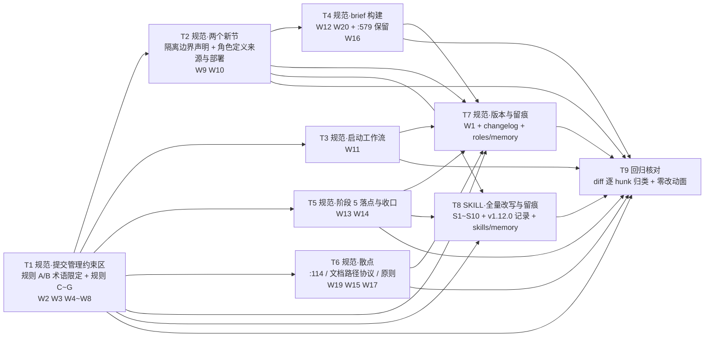

# pr-001-workflow-pb-workspace-isolation-protocol — 任务图（阶段 5 planner 产物）

**输入**：`prs/pr-001-workflow-pb-workspace-isolation-protocol.md`（本 PR 唯一范围依据；21 条验收）+ `architecture.md` **v1.2.2**（§5.1 定版 **W1~W20** / §5.2 **S1~S10** / §5.3 零改动清单 / §5.4 惯例文件同步 / §5.5 归类判据 / §8 条款措辞 / §6.1 ADR-1~ADR-4 / §7 Q-1~Q-5）+ `prd/F01~F14*.md`
**输出**：9 个任务的有向无环图（无环已核）＋ 每条的验收标准、前置依赖、优先级、验证方法
**文件范围（本 PR 只允许改这 6 个文件）**：`roles/workflow-pb/workflow-pb.md`（W1~W20）、`roles/workflow-pb/data/workflow-pb-changelog.md`（追加 v0.9.0 条目）、`roles/workflow-pb/memory.md`（追加一行索引）、`.claude/skills/workflow-pb/SKILL.md`（S1~S10）、`.claude/skills/workflow-pb/data/skill-optimization-v1.12.0.md`（**新建**）、`.claude/skills/workflow-pb/memory.md`（追加一行索引）。**不涉及**：`tools/install-pb-agents.sh`、仓库根 `.gitignore`、9 个执行角色文件、`roles/cdp-debug-skill/**`、`principles/**`、`oamp/**`、`docs/**`、`.pb-agents/**`、既有 `data/skill-optimization-v1.*.md` 历史文件（arch §5.3）。
**口径**：每条验收标准的形态都是**文本级、可在不运行代码的情况下判通过/不通过**（条款存在性 / 措辞逐字比对 / `grep` 判据 / diff hunk 可归类）；追溯来源逐条标注在括号内。`[model_inferred]` 共 **2 条**，见文末。
**操作口径（不改变任何验收判据）**：本文件是**迭代级产物**、不在本 PR 的变更面内（PR 文件「文件范围」只列上述 6 个文件），故落主工作区路径；其描述的 6 个文件在阶段 5 的 PR worktree（`feat/0019-pr-001-{slug}`）内施工。
**粒度**：9 个任务全部落在「1-2 天 + 可独立验收 + 验收判据可回答通过/不通过」范围内。规范侧按**同一文件的相邻插入区 + 同一可核对面**分任务（提交管理约束区 / 两个新节 / 启动工作流 / brief 构建 / 阶段 5 与收口 / 三个散点 / 留痕）；SKILL 侧**不拆分**——S3/S4（Step 0）与 S6（全文 32 处路径引用）落在同一批行上，拆分会造成同文件同区并发编辑冲突（详见文末「疑问/越界」5）。

---

## 依赖图

**无环**（拓扑序：T1 → {T2, T3, T5, T6} → T4 → T7 → T8 → T9；T4 与 T8 之间无边）。**无循环依赖，无需上报。**
**最长依赖链**（4 跳，两条并列）：`T1 → T2 → T4 → T7 → T9` 与 `T1 → T2 → T7 → T8 → T9`。
**关键路径任务**：**T1**（规范侧核心，5 条新规则 + 2 处术语限定、被 T2~T9 全链依赖）、**T7**（留痕汇总，汇合 6 条边）、**T8**（SKILL 全量改写，S1~S10 单任务承载）、**T9**（唯一产出回归证据的任务）。
**依赖边理由**：T2 紧随 T1（同一插入区、必须落在规则 G 之后）；T3/T5/T6 引用 T1 产出的规则名与落点（`§规则 C/D`、PR worktree 落点/命名）；T4 需要 T2 的 `{角色定义根}` 解析规则作为被引用对象；T7 的变更说明 / changelog 条目必须与最终落定内容一致（写"未改变的部分"与"生效范围"的前置是内容已定）；T8 的 SKILL 改写直接引用规范**新增**的章节名（`§规则 D`、`§角色定义来源与部署`、`§隔离边界声明`）与 PR worktree 落点；T9 核对全部落地结果。

---

## T1 · 规范·提交管理约束区：规则 A/B 术语限定 + 新增规则 C~G

**一句话描述**：在 `roles/workflow-pb/workflow-pb.md` 的 `## 提交管理约束` 区块内，把规则 A/B 的裸 `worktree` 限定为 `PR worktree`、判断方式行保持逐字不动，并在规则 B 之后、`### 约束生效范围` 之前新增规则 C~G 五条（各带紧跟一行的 `判断方式：`）。
**交付物**：`roles/workflow-pb/workflow-pb.md` `:127-138` 的术语限定 + `:138` 之后新增 5 个 `###` 小节（规则 C / D / E / F / G）。
**前置依赖**：无
**优先级**：P0

**验收标准**

1. **规则 A 术语限定**：标题 `### 规则 A：worktree 隔离`（`_baseline :127`）→ `### 规则 A：PR worktree 隔离`；正文（`:129`）"独立 worktree 分支" → "独立 **PR** worktree 分支"——（PR 验收 W2；arch §5.1-W2 / §2.3-#5、#6；F07 验收 5）。
2. **规则 B 术语限定**：正文（`:135`）"每个 worktree 变更" → "每个 **PR worktree** 变更"——（PR 验收 W3；arch §5.1-W3 / §2.3-#7；F07 验收 5）。
3. **两条判断方式行逐字不动**：规则 A / 规则 B 的 `判断方式：` 行（`_baseline :131` / `:137`）与改动前**逐字相同**；两条规则除上述术语点外的其余文字零改动——（PR 验收 W2/W3；arch §5.1-W2/W3 的"判据行不动"、§6 L1-4；F14 验收 3）。
4. **新增 `### 规则 C：会话工作区隔离`**，五项内容逐项可核对：① worktree 为**默认且唯一**被规范化的形态、`git clone` 仅作"无法共享同一 `.git`"的兜底**声明**且**无任何执行步骤**；② 每迭代一个工作区、阶段 1~6 保持检出 `iteration/{迭代ID}`（不中途切分支）；③ 显式声明"**仓库主工作区不作为任何迭代的会话工作区**"；④ 显式声明"**PR worktree 不得被当作会话工作区使用**"；⑤ 落点与命名（会话工作区 `<仓库主工作区>/.pb-agents/worktrees/{迭代ID}`、PR worktree `<会话工作区>/.pb-agents/worktrees/{迭代编号}-pr-{NNN}-{slug}`）+ **建立时点与执行位置**（`git worktree add .pb-agents/worktrees/{迭代ID} -b iteration/{迭代ID} main`，在**仓库主工作区**、**会话启动之前 / 阶段 1 之前**；4.5 的"创建迭代分支"动作声明为已完成）——（PR 验收 W4；arch §5.1-W4 / §1.5 / §3.2 命令 1 / §8.1 / §7 Q-1=A / §6 L1-5；F01 验收 1、2、5；F02 验收 1；F04 验收 2；F07 验收 2）。
5. **规则 C 的 `判断方式：` 行**：紧跟条款、同属一个 `###`、非子标题；给出三条 git 原语判据（`git rev-parse --show-toplevel` == 该会话启动目录；`--git-dir` ≠ `--git-common-dir`；`git branch --show-current` == `iteration/{迭代ID}`，三者同时成立即合规）——（arch §5.1-W4 / §8.0 / §8.1；F13 验收 2）。
6. **新增 `### 规则 D：启动契约`**：含三条判据（同上）＋"发现即停"（不进入任何阶段、不产生任何写入）＋硬停输出形态（**不复用** `⛔ 需要你的决策` 格式、必须含"可用于创建该迭代工作区的命令"）＋约束主体 = **主 agent 会话**（一次迭代校验一次）＋阶段 5 子 agent 以**被派发时所在的工作区**为准；紧跟一行 `判断方式：`——（PR 验收 W5；arch §5.1-W5 / §3.3 / §8.5；F03 验收 1~5；MI-01 / MI-02）。
7. **新增 `### 规则 E：分支命名`**：会话创建的**所有**分支名必须含该迭代编号；PR worktree 分支规范化为 `feat/{迭代编号}-pr-{NNN}-{slug}`；**base 与合并目标不变**（仍为迭代分支）；只约束新创建分支、不追溯既有分支；`判断方式：` 用 `git branch --list` 逐条核对是否含迭代编号（MI-04 口径：字符串包含即可）——（PR 验收 W6；arch §5.1-W6 / §8.5；F06 验收 1、3、4）。
8. **新增 `### 规则 F：跨工作区写入禁止`**：三类写操作**点名**（文件写入 / `git -C` / `--work-tree`）；写明"**本条款不可能被 git 强制执行**"（worktree 是目录分离、不是访问控制）；**闭集例外两项**（① 会话工作区的**创建**动作；② **收口三步及其前置游离动作**）；"恢复他人工作区**先备份后操作**"；`判断方式：` 以一次执行记录逐条比对"写入动作 → 目标路径"（区外路径须同时存在位于其**之前**的备份动作）——（PR 验收 W7；arch §5.1-W7 / §8.3 / §7 Q-3 / §4-L2-8；F09 验收 1、3、4、5）。
9. **新增 `### 规则 G：暂停 / 终止迭代的现场保留`**：工作区与分支**原样保留**、不被自动清理；**清理权仅归其归属会话或用户**；显式一句"与既有失败 / 阻塞 PR 现场保留条款**并列、不互相替代**"；**不含任何清理动作**；`判断方式：` = 对照 `git worktree list` 与 `git branch --list 'iteration/*'` 在他人提交 / 分支切换 / 清理动作前后的存在性——（PR 验收 W8；arch §5.1-W8 / §8.5；F10 验收 1~5；N5）。
10. **插入位置与生效范围**：五条新规则**全部位于规则 B 的判断方式行之后、既有 `### 约束生效范围` 句之前**；`### 约束生效范围` 及其"仅从下一个使用本工作流的迭代起生效，不追溯已完成迭代"**逐字未改**——（PR 验收「生效范围不变」；arch §5.1-W4 位置列 / §4-L2-4 / §8.6；F14 验收 6）。
11. **体例与零越界**：五条规则均为 `###` 级、条款正文 + **紧跟一行** `判断方式：`，**不新增 `#### 判断方式` 子标题、不新增独立小节或文档**；不引入 hook / 访问控制 / 路径守卫 / 守护进程 / 新配置键 / 新 env / 新目录约定 / 新文档类型——（PR 验收 F13；arch §8.0 / §9；F13 验收 1、2、3、4、5）。
12. **本任务不触碰**：`## 阶段定义`、`## PR 文件格式规范`、`## 验证目标`、`## 状态追踪协议`、`## 历史记录协议`、既有 v0.2.0~v0.8.0 变更说明——这些区域在本任务无 diff hunk——（arch §5.1 零改动清单；F14 验收 1、2）。

**验证方法**：读 `:123-160` 区域逐条核对；`grep -n '^### 规则' roles/workflow-pb/workflow-pb.md` ⇒ 恰 7 条、顺序 A/B/C/D/E/F/G；`grep -n '^判断方式：' roles/workflow-pb/workflow-pb.md` ⇒ 7 行、分别紧跟 A~G 七条（`_baseline` 的两行 `:131` / `:137` 与改前逐字相同；注：`_baseline :406` 的 `- **判断方式**：` 属 `## 验证目标` 节、不在本任务核对面）；`grep -n '^#### 判断方式' roles/workflow-pb/workflow-pb.md` ⇒ 0 命中；`git diff 9ede9ea -- roles/workflow-pb/workflow-pb.md` 该区域 hunk 逐条可归到 W2~W8。**不跑测试、不跑构建**（本 PR 为文本变更，无测试面）。

---

## T2 · 规范·新增 `### 隔离边界声明` 与 `### 角色定义来源与部署`

**一句话描述**：在 `## 提交管理约束` 内、规则 G 之后新增两个 `###` 小节——隔离边界声明（覆盖 / 不覆盖 + 逐项负面约束 + 非 git 共享资源表 + 已知代价）与角色定义来源与部署（真源规则 + `{角色定义根}` 解析 + 两场景 + 只读约束 + 判断方式）。
**交付物**：`roles/workflow-pb/workflow-pb.md` 新增 `### 隔离边界声明（隔离到什么层为止）` 与 `### 角色定义来源与部署`。
**前置依赖**：T1（同一插入区，必须落在规则 G 之后；且规则 C 的 `main` 检出约束与本节硬约束句互相呼应）
**优先级**：P0

**验收标准**

1. **边界声明·覆盖三项**：工作树 / 索引（`.git/worktrees/<id>/index`）/ HEAD（各工作区各自检出）逐项可核对——（PR 验收 W9；arch §5.1-W9 / §8.2；F12 验收 1）。
2. **边界声明·不覆盖三项 + 逐项负面约束**：仓库级 refs（含 stash 与分支命名空间）/ 对象库 / config·hooks·remotes 逐项列出，且**每项各附至少一句负面约束**（不得依赖 stash 跨会话传状态；不得把分支命名空间当跨会话通道；不得据 `git branch --merged` 直接判定归属；不得对共享对象库做破坏性操作；不得改共享 config / hooks / remotes）——（PR 验收 W9；arch §8.2；F12 验收 2、3）。
3. **git 硬约束句**：写明"**同一分支不能在两处同时检出**"是 git 硬约束（不是可选的保守做法），并由此写明会话工作区**永不** checkout `main`、`main` 上的合并只能发生在仓库主工作区——（arch §8.2 / §5.1-W14 / §7 Q-2；F12 验收 2；F02 验收 5）。
4. **非 git 共享资源四项 + 两条约束**：默认端口（真实服务 7788，可经环境变量覆盖）/ CPU 与负载 / 临时目录（`/tmp`）/ 进程内作业注册表；约束① **真实服务不得并发占用默认端口**（判断方式 = 并发两次运行监听端口必须不同，或规范要求并发场景显式指定非默认端口；**不要求修改默认端口值**；测试面自带随机端口不受约束）；约束② **受负载影响的偶发失败不得当回归依据**（判断方式 = 检查是否含"同一代码在安静环境下重跑"的结果）——（PR 验收 W9；arch §8.2 / MI-08；F11 验收 1、2、3、5）。
5. **已知代价与不夸大**：写明"冲突被有意**后移到收口合并期**处置"，且**不写成自动解决、不定义自动解决流程**；全文**不出现**"跨机器隔离""跨工作区写入会被阻止""refs 也被隔离"三类越界承诺——（PR 验收 W9；arch §8.2 的 F12 验收 5 自查；F12 验收 4、5；N6 / N10）。
6. **角色定义来源与部署**：真源规则 = **被 git 追踪的内容**，判据 `git ls-files --error-unmatch <角色定义根>/<role>/<role>.md`；`{角色定义根}` **单次解析、会话内复用**（结果写入每次 brief）；上下游两场景（本仓库 `roles/` 随检出即得、下游 `.pb-agents/roles/` 由 `tools/install-pb-agents.sh` 分发）**共用同一份规范与同一份 skill**；"**零动作**"的准确含义写清且**只覆盖真源随检出即得的场景**；下游分发**不算运行前提**；只读约束（真源与副本皆执行期只读；`data/`、`memory.md` 不随分发部署）；紧跟一行 `判断方式：`（`git ls-files --error-unmatch` 必须成功；判定失败且未回退到下游副本即违反）——（PR 验收 W10；arch §5.1-W10 / §8.4；F08 验收 1、2、5、6；MI-06）。
7. **位置口径**：两节均落在 `## 提交管理约束` 章节内、既有 `### 约束生效范围` 句**之前**；该句逐字未改——（PR 验收「生效范围不变」；arch §8.2 落点行 / §8.6 / §4-L2-4；F14 验收 6）**`[model_inferred]` #1**（位置读法推导，见文末）。
8. **可判定性与不平行定义**：两条非 git 约束各带判断方式（措辞与 arch §8.2 表内一致，允许措辞级等价）；边界声明与来源条款**均写在 `workflow-pb.md` 内**，未新增任何文件、未在 SKILL 侧重复定义（SKILL 只引用，见 T8 第 9 条）——（arch §8.0 / §8.2 MI-09 / §8.4；F13 验收 2、4；F12 验收 6）。

**验证方法**：读新增两节全文逐项核对（对照 arch §8.2 / §8.4 的措辞块）；`grep -n 'ls-files\|stash\|--merged\|7788\|/tmp\|安静环境' roles/workflow-pb/workflow-pb.md` 逐项落位；`git diff 9ede9ea -- roles/workflow-pb/workflow-pb.md` 的该区域 hunk 可归到 W9 / W10。**不跑测试、不跑构建**。

---

## T3 · 规范·启动工作流改写（会话工作区校验引用 + 4.5 动作重述）

**一句话描述**：在 `## 调度指南·启动工作流` 的步骤 1 之前补一句引用规则 C/D 的会话工作区校验，并把第 4.5 步的"创建迭代分支"动作改写为"声明已完成"（保留其位置、触发时机与 `status.md` 字段写入），同时消除 `:226` 的"主 agent 根目录"旧指代。
**交付物**：`roles/workflow-pb/workflow-pb.md` `:220-231`（含 `:226` 的 4.5 步）。
**前置依赖**：T1（引用对象 `§规则 C` / `§规则 D` 由 T1 新增）
**优先级**：P0

**验收标准**

1. **校验引用句**：步骤 1 之前补一句**会话工作区校验**（引用规则 C / 规则 D，判据 = 规则 D 的三条 git 原语），**不新增步骤号**（步骤编号体系仍为 1~5 + 4.5）——（PR 验收 W11；arch §5.1-W11 / §7 Q-5；F03 验收 1；F14 验收 2）。
2. **4.5 的"创建迭代分支"动作改写为声明已完成**：保留原位置与原触发时机，"创建迭代分支"被声明为**已由会话工作区创建步骤在会话启动之前完成**（措辞可等价，语义须唯一）——（PR 验收 W11；arch §5.1-W11 / §7 Q-1=A / §6 L1-5；F02 验收 1；F04 验收 3 的**唯一获准例外**）。
3. **4.5 仍保留 `status.md` 的 `**迭代分支**` 字段写入**：该字段的写入时点与内容不变（仍在本步、仍写 `iteration/{迭代ID}`）——（PR 验收 W11；arch §7 Q-1④ / §5.1-W11）。
4. **指代重载**：`:226` 的"此后阶段 2~5 期间**主 agent 根目录**保持在该分支上"改写为"**该会话所在的迭代工作区**（根目录）"；同句 `git checkout iteration/{迭代ID}` 切换工作区的动作随之重述（会话工作区在创建时即检出该分支）；全文不再存在按"仓库根 = 仓库主工作区"判读的残留条款——（PR 验收 W11；arch §2.1-#1 / §2.2-#9 / §5.1-W11；F04 验收 1）。
5. **其余零改动**：步骤 1~4、步骤 5 的字段清单、`### 启动工作流` 之外的 `## 调度指南` 小节无 diff hunk——（arch §5.1 零改动清单；F14 验收 1、2）。

**验证方法**：读 `:218-235` 逐条核对；`grep -n '主 agent 根目录' roles/workflow-pb/workflow-pb.md` ⇒ 0 命中；`grep -n '^[0-9]\+\.\|^4\.5\.' roles/workflow-pb/workflow-pb.md`（限 `:220-231` 区间）⇒ 步骤号仍为 1/2/3/4/4.5/5；diff 该区域 hunk 可归到 W11。**不跑测试、不跑构建**。

---

## T4 · 规范·brief 构建路径替换与模板行术语限定（含 `:579` 真源保留核对）

**一句话描述**：把 `## 调度指南·派发执行角色时的 brief 构建` 的 3 处角色文件路径由 `.pb-agents/roles/...` 改为 `{角色定义根}/...`、把 `:258` 的模板行限定为 `PR worktree 分支`，并核对 `:579` 的真源写法未被改动。
**交付物**：`roles/workflow-pb/workflow-pb.md` `:236` / `:244` / `:246` / `:258`（节区间 `:234-260`）；`:579` 只核对不改。
**前置依赖**：T2（`{角色定义根}` 的解析规则真源落在 W10 的新节内；本任务只做引用替换，不重复定义）
**优先级**：P0

**验收标准**

1. **三处路径替换**：`:236` / `:244` / `:246` 的 `.pb-agents/roles/...` → `{角色定义根}/...`（解析后写具体路径）；改动后规范内 `.pb-agents/roles` 的出现**仅剩**"下游业务项目分发副本"语境（即 T2 引入的 `### 角色定义来源与部署` 节），不再出现在 brief 构建节——（PR 验收 W12；arch §5.1-W12 / §2.4-#1~#3 / §8.4 / R-4；F08 验收 1）**`[model_inferred]` #2**（"仅剩下游语境"的判据形态，见文末）。
2. **`:258` 模板行术语限定**：`worktree 分支：{分支名}` → `PR worktree 分支：{分支名}`；与 SKILL `:303`（S7）**措辞一致**——（PR 验收「`:258`」/ W20；arch §5.1-W20 / §5.5 映射（`:258` → W20）/ ADR-1 同类口径；F07 验收 5）。
3. **该节其余逐字不变**：**除 §2.3 文末枚举的 7 处术语限定与该节内的路径替换外**，`§派发执行角色时的 brief 构建`（`:234-260`）其余措辞与字段列表逐字不变（含"brief **至少**包含以下字段""必须逐行以 `字段名：值` 的形式呈现（不得改写、合并或省略字段名）"与全部字段名）——（PR 验收 W12 范围声明；arch §5.1-W12 / §12 的 Gate r2 D2、D4 闭合；F14 验收 1）。
4. **`:579` 真源写法逐字保留**：`## 角色读取指南` 的「**工作流文件路径**：`roles/workflow-pb/workflow-pb.md`」保持原样（与 W12 收敛到同一侧）——（PR 验收 W16；arch §5.1-W16 / §1.2-H / §2.1-#2；F08 验收 5）。
5. **不引入解析规则**：本任务不写入 `{角色定义根}` 的解析步骤 / 判据（解析规则的唯一真源 = T2 的 `### 角色定义来源与部署`；避免平行定义）——（arch §8.4 的分工原则 / MI-09；F13 验收 4）。

**验证方法**：读 `:234-260` 与 `:579` 逐条比对；`grep -n '\.pb-agents/roles' roles/workflow-pb/workflow-pb.md` ⇒ 仅命中 `### 角色定义来源与部署` 节内的下游副本语境；`grep -n 'worktree 分支：' roles/workflow-pb/workflow-pb.md .claude/skills/workflow-pb/SKILL.md` ⇒ 两处均为 `PR worktree 分支：{分支名}`；diff 该区域 hunk 可归到 W12 / W20（`:579` 不得出现在 diff 中）。**不跑测试、不跑构建**。

---

## T5 · 规范·阶段 5 步骤 2 落点具体化 + 收口三步与前置游离

**一句话描述**：把阶段 5 步骤 2 的 `git worktree add <path> -b <pr分支名> …` 的占位符填成 §1.5 的唯一定名形态，并把"迭代分支合并进 main"三步改为 `git -C <仓库主工作区> …` 形式、在第 3 步之前加前置游离动作。
**交付物**：`roles/workflow-pb/workflow-pb.md` `:277`（阶段 5 步骤 2）与 `:333-344`（迭代分支合并进 main）。
**前置依赖**：T1（规则 C 定义 PR worktree 落点与命名；规则 F 的闭集例外第 ② 项指向本节的收口动作）
**优先级**：P0

**验收标准**

1. **阶段 5 步骤 2 的 `<path>` / `<分支名>` 具体化**：`git worktree add <path> -b <pr分支名> iteration/{迭代ID}` 中 `<path>` → `.pb-agents/worktrees/{迭代编号}-pr-{NNN}-{slug}`（会话工作区内的子目录）、`<pr分支名>` → `feat/{迭代编号}-pr-{NNN}-{slug}`（命令执行位置 = **该会话工作区**）——（PR 验收 W13；arch §5.1-W13 / §1.5 / §3.2 命令 5 / §7 Q-4；F06 验收 3；F07 验收 1、4）。
2. **阶段 5 该节其余逐字不变**：base `iteration/{迭代ID}`、"合并进迭代分支才解锁"判据（含"没有已解锁排队 PR 时槛位空置，不因此放宽"）、并发槛位算法（起始 / 爬升公式 / 硬上限）与该节其余文字零改动——（PR 验收 W13；arch §5.1-W13 / 零改动清单；F14 验收 2；N8）。
3. **收口三步改为 `git -C` 形式**：`git -C <仓库主工作区> checkout main` → `git -C <仓库主工作区> merge --no-ff iteration/{迭代ID}` → `git -C <仓库主工作区> branch -d iteration/{迭代ID}`——（PR 验收 W14；arch §5.1-W14 / §3.2 命令 6 / §4-L2-6；F05 验收 1）。
4. **前置游离动作**：第 3 步之前加 `git -C <会话工作区> checkout --detach`，并写明它是 git 硬约束（同一分支不能两处检出）的**必然前置**、**不是新增收口步骤**——（PR 验收 W14；arch §7 Q-2 / §8.2 硬约束句；F05 验收 1、2）。
5. **执行位置限定**：小节标题（`:333`）补"（在仓库主工作区执行）"、`:335` 补"在**仓库主工作区**执行"（措辞可等价；落在 W14 的 `:333-344` 范围内）——（arch §2.2-#1、#2 / §5.1-W14 位置列；F05 验收 1）。
6. **不变部分逐字保留**：动作顺序与触发时机不变（仍是阶段 6 判 pass 之后、仍是三个动作序列）；commit message 格式（`:340`）、"若步骤 2 报告冲突：停止推进，向用户上报……"（`:342`）、`:344` 的 `status.md` `**迭代分支**` 字段改写句**逐字不变**；**不引入任何自动化合并**机制——（PR 验收 W14；arch §5.1-W14 / 零改动清单；F05 验收 1、3、4；N4）。

**验证方法**：读 `:272-295` 与 `:333-345` 逐条比对；`grep -n 'git -C' roles/workflow-pb/workflow-pb.md` ⇒ 4 处命中（收口三步 + 前置游离）；`grep -n 'checkout --detach' roles/workflow-pb/workflow-pb.md` ⇒ 1 命中；diff 该区域 hunk 可归到 W13 / W14。**不跑测试、不跑构建**。

---

## T6 · 规范·散点改写：阶段定义 `:114`、文档路径协议、原则引用词

**一句话描述**：三处互不相邻的既有文本的最小改写——阶段定义表阶段 5 行的 `worktree` 术语限定、文档路径协议补判读主体、原则条目的引用词同步。
**交付物**：`roles/workflow-pb/workflow-pb.md` `:114`（阶段定义表）、`:348-`（文档路径协议）、`:611`（原则）。
**前置依赖**：T1（`:611` 的引用词须与规则 A 的新标题一致；`:114` 的限定词与规则 C 新增的会话层语义呼应）
**优先级**：P0

**验收标准**

1. **`:114` 阶段 5 行术语限定**：该行「逐 PR 在独立 worktree 分支……」→「逐 PR 在独立 **PR worktree** 分支……」；阶段定义表 6 个阶段的**职责描述 / 输入 / 输出 / 推进条件四列与其他单元格逐字不动**——（PR 验收「`:114`」；arch §5.1-W19 / §5.3 收窄读法 / ADR-1（§6.1）/ §2.3-#4；F07 验收 5；F14 验收 2）。
2. **文档路径协议补判读主体**：补一句"全部路径**相对该会话所在的迭代工作区根目录**判读"；目录树与文件清单**不变**——（PR 验收 W15；arch §5.1-W15 / §2.1；F04 验收 4）。
3. **原则引用词同步**：`:611` 的「提交管理约束（worktree 隔离、PR 文件前置）」→「（**PR worktree** 隔离、PR 文件前置）」，该条其余文字不变——（PR 验收 W17；arch §5.1-W17 / §2.3-#18；F07 验收 5）。
4. **术语限定面不扩不缩**：本任务只做上述 3 处；不新增其它 `worktree` 改写点（判定规则 = 裸用即入选、语境已含"PR"或位于阶段 5 小节内者不改，见 arch §2.3 文末；其余 26 处保持不动）——（arch §2.3 判定规则 / §4-L2-7 / §5.5；F14 验收 1）。
5. **本任务不触碰**：`## 何时更新本文件`、`## 验证目标`、`## 状态追踪协议`、`## 历史记录协议`、`### 可观测性`、`### 阶段回退`、`### 需要用户决策的情况`、`### 终止工作流`——无 diff hunk——（arch §5.1 零改动清单；F14 验收 1、2）。

**验证方法**：读 `:104-121`、`:348-370`、`:595-615` 逐条比对；`git diff 9ede9ea -- roles/workflow-pb/workflow-pb.md` 中该三处 hunk 可归到 W19 / W15 / W17，且阶段定义表四列的 hunk 仅含 `:114` 行的术语 token。**不跑测试、不跑构建**。

---

## T7 · 规范·版本与留痕（W1 + changelog + roles/memory）

**一句话描述**：把规范头部版本提到 0.9.0、新增 `## v0.9.0 变更说明（相对 v0.8.0）`，并在两个既有惯例文件上追加 v0.9.0 留痕（changelog 条目 + memory 索引行）。
**交付物**：`roles/workflow-pb/workflow-pb.md`（`:25` 版本行 + 头部新增变更说明段）、`roles/workflow-pb/data/workflow-pb-changelog.md`（新增条目）、`roles/workflow-pb/memory.md`（顶部一行索引）。
**前置依赖**：T1、T2、T3、T4、T5、T6（"变更说明 / changelog 条目须与最终落定内容一致"——写"未改变的部分"与"生效范围"的前置是内容已定）
**优先级**：P0

**验收标准**

1. **版本行**：`roles/workflow-pb/workflow-pb.md` 头部 `**版本**: 0.8.0`（`:25`）→ `0.9.0`——（PR 验收 W1；arch §5.1-W1）。
2. **`## v0.9.0 变更说明（相对 v0.8.0）`**：新增四段式（新增内容概述 / 目的 / 不改变的部分 / 生效范围），位置与既有 `## v0.7.0 变更说明`（`:45`）/ `## v0.8.0 变更说明`（`:55`）并列、沿用其体例；"生效范围"段与既有 `### 约束生效范围` 口径一致（仅从下一个使用本工作流的迭代起生效、不追溯、不要求 0019 自身迁移）——（PR 验收 W1；arch §5.1-W1 / §2.2-#11 / §8.6；F14 验收 6）。
3. **changelog 条目**：`roles/workflow-pb/data/workflow-pb-changelog.md` 在标题行之后、`## v0.8.0（2026-09-08）` 条目**之前**新增 `## v0.9.0（2026-09-12）`，四段式（触发 / 方案 / 未改变的部分 / 生效范围），体例与既有 v0.8.0 条目一致（可含"具体改动"列表，与既有体例同形）；**既有条目逐字不动**——（PR 验收 W1；arch §5.1-W1 / §5.4 / §2.2-#13 / §1.2-J）。
4. **`roles/workflow-pb/memory.md` 索引行**：在标题之后、既有 v0.8.0 索引行**之前**追加一行 v0.9.0 索引（格式 = `- **v0.9.0（2026-09-12）**：… 根因和决策过程见 data/workflow-pb-changelog.md。`）；**既有行逐字不动**——（PR 验收 W1；arch §5.4；F14 验收 1）。
5. **范围纪律**：本任务不改 SKILL 侧留痕（`data/skill-optimization-v1.12.0.md` 与 `.claude/skills/workflow-pb/memory.md` 属 T8）——（arch §5.4 的文件分组）。

**验证方法**：读三个文件的目标区域逐条比对；`grep -n '0\.9\.0' roles/workflow-pb/workflow-pb.md roles/workflow-pb/data/workflow-pb-changelog.md roles/workflow-pb/memory.md` 逐处落位；`git diff 9ede9ea -- roles/workflow-pb/data/workflow-pb-changelog.md roles/workflow-pb/memory.md` ⇒ 仅新增行（`+`），零删除 / 零修改行；规范头部 hunk 可归到 W1。**不跑测试、不跑构建**。

---

## T8 · SKILL·全量改写与留痕（S1~S10 + v1.12.0 记录 + skills/memory）

**一句话描述**：把 `.claude/skills/workflow-pb/SKILL.md` 的角色来源契约、启动校验、章节名、32 处路径引用与三处版本引用一次性同步到 v1.12.0，并按其既有惯例落一条优化记录与一行 memory 索引。
**交付物**：`.claude/skills/workflow-pb/SKILL.md`（`:4` / `:30-32` / `:42` / `:58` / `:96-97` / `:133` / `:170` / `:220-228` / `:303` / `:365` / `:383-384` 与全文路径引用）、`.claude/skills/workflow-pb/data/skill-optimization-v1.12.0.md`（新建）、`.claude/skills/workflow-pb/memory.md`（顶部一行索引）。
**前置依赖**：T1（引用 `§规则 D`）、T2（引用 `§角色定义来源与部署` / `§隔离边界声明`）、T5（S8 引用 PR worktree 落点）
**优先级**：P0

**验收标准**

1. **S1 `:42` CRITICAL 语义反转**：保留 CRITICAL 槽位，改写为**来源契约**——真源 = 随检出即得的内容（本仓库 = 被 git 追踪的 `roles/<role>/<role>.md`；下游 = 分发到 `.pb-agents/roles/` 的副本；解析规则见规范 §角色定义来源与部署）；含"**不得**在 agents 仓库内读取被忽略的 `.pb-agents/roles/` 副本"与"`tools/install-pb-agents.sh` 是面向下游的**可选分发手段**、不是运行前提"两句；措辞与 arch §8.4 给定的改写文本一致（允许措辞级等价）——（PR 验收 S1；arch §5.2-S1 / §8.4 / §6 L1-1 / §6.1 ADR 登记；F08 验收 3、4）。
2. **S2 新增一条 CRITICAL**：「会话必须在自己的迭代工作区内启动与运行；校验不通过 → 发现即停并输出创建命令」——（PR 验收 S2；arch §5.2-S2 / §3.3；F03 验收 3）。
3. **S3 Tools（`:96-97`）**：改为"启动时执行**启动校验**（判据引用规范 §规则 D）与**角色来源解析**"；**删除**"检测 `.pb-agents/roles/` 是否存在，不存在则提示安装并停止"——（PR 验收 S3；arch §5.2-S3；F03 验收 3；F08 验收 4）。
4. **S4 Step 0（`:133`）两步**：第 1 步 = **启动校验**（三判据 → 不通过则输出创建命令并发现即停）；另起一步 = **角色来源解析**（`{角色定义根}` 一次解析、会话内复用、结果写入每次 brief）；措辞与 arch §8.4 的两步块一致（允许措辞级等价）——（PR 验收 S4；arch §5.2-S4 / §8.4；F03 验收 3；F08 验收 1、2、4）。
5. **S5 `:220-228` 章节改名与内容**：`§ 角色文件路径与安装` → `§ 角色文件来源与部署`；内容 = 真源规则 + 两场景（本仓库零动作 / 下游可选分发）+ 只读约束；**删除**"未安装即停止"与"不得退回读 `roles/`"；安装脚本定位降级为"面向下游业务项目的**可选分发手段**"而**其实现零改动**——（PR 验收 S5；arch §5.2-S5 / §8.4 / §5.3；F08 验收 4、5、6）。
6. **S6 32 处路径引用机械替换**：SKILL 全文 `.pb-agents/roles/...` → `{角色定义根}/...`；改动后 `grep -n '\.pb-agents/roles' .claude/skills/workflow-pb/SKILL.md` **仅剩**"可选分发手段 / 下游业务项目副本"语境（预期 ≤2 处，arch R-4 判据）；且不存在"必须用 `.pb-agents/roles/`"与"不得读 `roles/`"并存的表述——（PR 验收 S6；arch §5.2-S6 / R-4 / §2.4 的 35 处清单；F08 验收 3）。
7. **S7 `:303` brief 模板**：`worktree 分支：{分支名}` → `PR worktree 分支：{分支名}`（与规范 `:258` 措辞一致）——（PR 验收 S7；arch §5.2-S7 / §5.5（`:303` → S7）；F07 验收 5）。
8. **S8 Step 5 步骤 2（`:170`）**：补 PR worktree 落点引用（落 `<会话工作区>/.pb-agents/worktrees/…`）；**不改**并发 / 解锁语义与"合并进迭代分支才解锁"判据——（PR 验收 S8；arch §5.2-S8 / §7 Q-4；F07 验收 4）。
9. **S9 新增隔离边界引用行**：「隔离边界（覆盖 / 不覆盖）与非 git 共享资源见规范 §隔离边界声明」——**只引用不重复定义**（SKILL 内不得出现覆盖 / 不覆盖清单或资源表的平行列举）——（PR 验收 S9；arch §5.2-S9 / MI-09；F12 验收 6）。
10. **S10 版本与章节名引用**：`:4`（description 的「（v0.8.0）」→「（v0.9.0）」）、`:30`（`**版本**: 1.11.0（对应规范 workflow-pb v0.8.0）` → `1.12.0（对应规范 workflow-pb v0.9.0）`）、`:58`（Purpose「按 workflow-pb v0.8.0 规范调度」→ v0.9.0）**三处全部同步**；判据 = 改动后 `grep -n 'v0\.8\.0' .claude/skills/workflow-pb/SKILL.md` **0 命中**；`:31`（`**完整规范**` 路径行）与 `:365`（Resources 的章节名引用）随 S6 / S5 同步为「§ 角色文件来源与部署」——（PR 验收 S10；arch §5.2-S10 / §6.1 ADR-2；F08 验收 5；F14 可追溯）。
11. **新建 `.claude/skills/workflow-pb/data/skill-optimization-v1.12.0.md`**：沿用 v1.6.0 / v1.11.0 的**五段式**（触发 / 根因 / 方案 / 具体改动 / 未改变的部分），并含与该记录的"一致性核对"形态——（PR 验收 S10；arch §5.4 / §1.2-J / §2.4 历史先例；F14 可追溯）。
12. **`.claude/skills/workflow-pb/memory.md` 索引行**：在 `> 每行对应 data/ 下的一条原始凭证` 之后、既有 v1.11.0 行**之前**追加一行指向 `data/skill-optimization-v1.12.0.md`（格式与既有行一致）；**既有行逐字不动**——（PR 验收 S10；arch §5.4；F14 验收 1）。
13. **零改动面**：其余 6 条 CRITICAL、`## Purpose`（除版本数字）、`## Success criteria`、`## Strategy`、`## Important facts`（9 条）、`## Workflow` 的 Step 1~4 / Gate 4→5 / Step 6、`## § 对外协议`（三组契约全文）、`## § 用户决策点与暂停格式`、`## § status.md 更新时机`、`## § history.md 更新时机`、`## Safety` 中与工作区无关的条目——一律**无 diff hunk**；`tools/install-pb-agents.sh` 与仓库根 `.gitignore` **不被修改**（SKILL 中的定位降级只是文本）——（arch §5.2 零改动清单 / §5.3 / §8.4；F14 验收 1、7；F08 边界）。
14. **`:32` 变更历史索引行保持原样**：不追加 v1.11.0 / v1.12.0 条目（S10 未要求同步；追加会产生无法归类的 hunk，直接违反 T9 第 1 条）——（arch §5.2 的 S1~S10 范围闭包 / §5.5 归类判据；F14 验收 1）。

**验证方法**：`grep -n 'v0\.8\.0' .claude/skills/workflow-pb/SKILL.md` ⇒ 0 命中；`grep -n '\.pb-agents/roles' .claude/skills/workflow-pb/SKILL.md` ⇒ ≤2 且均为"可选分发 / 下游副本"语境；`grep -n '检查安装\|停止推进\|不得退回读' .claude/skills/workflow-pb/SKILL.md` ⇒ 无安装前置类表述；`grep -n '1\.12\.0\|v0\.9\.0\|角色文件来源与部署\|隔离边界声明' .claude/skills/workflow-pb/SKILL.md` 逐处落位；`.claude/skills/workflow-pb/data/skill-optimization-v1.12.0.md` 存在且五段齐备；diff 的每个 hunk 可归到 S1~S10。**不跑测试、不跑构建**。

---

## T9 · 回归核对：diff 逐 hunk 归类与零改动面

**一句话描述**：以本迭代开始前的基线做只读 diff，逐 hunk 归类到 W/S 编号、逐条核对零改动清单，产出 F14 的回归证据。
**交付物**：核对结论（写入阶段 5 该 PR 的验收记录 / 交付说明；**不新增仓库文件、不改任何文件**）。
**前置依赖**：T1、T2、T3、T4、T5、T6、T7、T8
**优先级**：P0

**验收标准**

1. **逐 hunk 可归类**：`git diff 9ede9ea -- roles/workflow-pb/workflow-pb.md .claude/skills/workflow-pb/SKILL.md` 的**每个 hunk 都能归到** W1~W20 或 S1~S10 的某个编号（编号再追溯到 F01~F13），**无无法归类的 hunk**——（PR 验收「零改动面核对」；arch §5.5 归类判据 / §5.1 定版全清单；F14 验收 1）。
2. **术语限定 7/7 逐处命中承载条目**：规范 `:114`→**W19**、`:127`→**W2**、`:129`→**W2**、`:135`→**W3**、`:258`→**W20**、`:611`→**W17**，SKILL `:303`→**S7**；无遗漏，且无第八处多余的 `worktree` 术语改写（其余 26 处按 arch §2.3 文末判定规则判为可判、保持不动；`:277` 的 `<path>`/`<分支名>` 属非术语位移 = W13，不计入 7 处）——（arch §5.5 映射表 / §2.3 文末单一口径 / §4-L2-7；F07 验收 5；F14 验收 1）。
3. **规范零改动清单无 hunk**：`## PR 文件格式规范`（七字段）、`## 并发槛位算法`、`## 验证目标`、`## 状态追踪协议`、`## 历史记录协议`、`### 约束生效范围`、v0.2.0~v0.8.0 全部变更说明、`## 需用户决策的情况`、`### 终止工作流`、`### 阶段回退`、`### 可观测性`；`## 阶段定义` 按**收窄读法** = 除 `:114` 行的术语限定外的全部内容（6 阶段表结构与四列）——（PR 验收「零改动面核对」；arch §5.1 零改动清单 / §5.3 收窄读法；F14 验收 1、2）。
4. **SKILL 零改动面无 hunk**：其余 6 条 CRITICAL、`## Purpose`（除版本数字）、`## Success criteria`、`## Strategy`、`## Important facts`、Step 1~4 / Gate 4→5 / Step 6、`## § 对外协议` 三组契约、`## § 用户决策点与暂停格式`、`## § status.md / history.md 更新时机`、`## Safety` 其余条目——（PR 验收「零改动面核对」；arch §5.2 零改动清单；F14 验收 1、7）。
5. **diff 外文件不得出现**：`git diff --stat 9ede9ea` / `git status --short` 的改动文件清单**只含**本 PR 的 6 个文件；不含 `tools/install-pb-agents.sh`、仓库根 `.gitignore`、`roles/<role>/<role>.md`（9 个执行角色）、`roles/cdp-workflow` 类目录（`roles/cdp-debug-skill/**`）、`principles/**`、`oamp/**`、`docs/**`、`.pb-agents/**`、既有 `data/skill-optimization-v1.*.md` 历史文件——（PR 验收「零改动面核对」；arch §5.3；F14 验收 5；F08 边界）。
6. **生效范围核对**：`### 约束生效范围` 句逐字未改（在 diff 中只作为上下文行出现，不是 `+`/`-` 行）；规范中不出现"立即生效 / 追溯适用 / 要求 0019 自身迁移"表述——（PR 验收「生效范围不变」；arch §8.6 / §5.1 零改动清单；F14 验收 6）。
7. **F13 形态核对**：全部新增 / 改写条款均为"条款 + 紧跟一行 `判断方式：`"体例；未出现 `#### 判断方式` 子标题；未新增 hook / 访问控制 / 路径守卫 / 守护进程 / 新配置键 / 新 env / 新目录约定 / 新文档类型 / 新脚本 / 平行定义文档——（PR 验收 F13；arch §8.0 / §9；F13 验收 1~5）。
8. **编号区间口径**：核对报告一律引用 §5.1 的 **W1~W20**（W18 = 零改动行、W19 / W20 = 术语限定承载条目）与 §5.2 的 S1~S10；**不出现**"W1~W17 + `:114` 条目"这类被取代的旧区间表述（适用面 = 本任务图与核对报告；PR 文件本身不在本 PR 改动面内）——（PR 验收「变更面编号对齐」；arch §5.1 定版段 / §12；ADR-1）。
9. **核对动作只读**：本任务不产生任何文件写入（不新增核对报告文件、不改 6 个文件）——（arch §5.5 的载体口径 / §4-L2-10；PR 验收「零改动面核对」）。

**验证方法**：`git diff 9ede9ea -- roles/workflow-pb/workflow-pb.md .claude/skills/workflow-pb/SKILL.md`（逐 hunk 归类）；`git diff --stat 9ede9ea`；`git status --short`；`grep -n '^判断方式：' roles/workflow-pb/workflow-pb.md`（7 行、紧跟 A~G 七条规则）；`grep -n '^#### 判断方式' roles/workflow-pb/workflow-pb.md` 与 `grep -rn '立即生效\|追溯适用' roles/workflow-pb/workflow-pb.md`（均 0 命中）。**不跑测试、不跑构建**（本 PR 无代码面）。

---

## 追溯与自查

### PR 验收项 → 承载任务

| PR 文件验收项 | 承载任务 |
|---|---|
| 变更面编号对齐（W1~W20 / S1~S10 全清单、不出现旧编号区间） | T9（8）+ 各任务追溯列 |
| W1 版本与留痕（规范头部 + changelog + roles/memory） | T7（1~4） |
| W2 / W3 术语限定 + F07 验收 5 | T1（1~3） |
| W4 规则 C | T1（4、5） |
| W5 规则 D | T1（6） |
| W6 规则 E | T1（7） |
| W7 规则 F | T1（8） |
| W8 规则 G | T1（9） |
| W9 隔离边界声明（含 F11 非 git 资源） | T2（1~5） |
| W10 角色定义来源与部署 | T2（6） |
| W11 启动工作流（校验引用 + 4.5 + 指代） | T3（1~4） |
| W12 brief 构建路径替换（含范围声明） | T4（1、3） |
| W13 阶段 5 步骤 2 | T5（1、2） |
| W14 收口三步 + 前置游离（含 §2.2 执行位置） | T5（3~6） |
| W15 文档路径协议 | T6（2） |
| W16 角色读取指南 `:579` 逐字保留 | T4（4） |
| W17 原则引用词 | T6（3） |
| 术语限定面 7 处（唯一基准 = §2.3 文末枚举） | T1（1、2）/ T4（2）/ T6（1、3）/ T8（7）/ T9（2） |
| `:114`（承载体 = W19 / ADR-1） | T6（1） |
| `:258`（承载体 = W20；Gate r2 D1 闭合） | T4（2） |
| S1~S5、S10（来源契约 / 启动校验 / 章节改名 / 版本） | T8（1~5、10~12） |
| S6 32 处路径替换（R-4 判据） | T8（6） |
| S7 brief 模板 | T8（7） |
| S8 Step 5 落点引用 | T8（8） |
| S9 隔离边界引用行（只引用不重复定义） | T8（9） |
| 零改动面核对（F14 验收 1~5、7；arch §5.5） | T9（1~5、9） |
| F13 验收 1/2/3（体例 + 零工具 + 不引入守卫） | T1（5、11）/ T2（8）/ T9（7） |
| 生效范围不变（F14 验收 6） | T1（10）/ T2（7）/ T7（2）/ T9（6） |

### 文件范围 → 承载任务（逐文件可核对）

| 文件 | 改动面 | 承载任务 |
|---|---|---|
| `roles/workflow-pb/workflow-pb.md` | W2~W8 | T1 |
| 同上 | W9、W10 | T2 |
| 同上 | W11 | T3 |
| 同上 | W12、W16、W20 | T4 |
| 同上 | W13、W14 | T5 |
| 同上 | W15、W17、W19 | T6 |
| 同上 | W1（版本行 + 变更说明） | T7 |
| `roles/workflow-pb/data/workflow-pb-changelog.md` | 追加 v0.9.0 条目 | T7 |
| `roles/workflow-pb/memory.md` | 追加一行索引 | T7 |
| `.claude/skills/workflow-pb/SKILL.md` | S1~S10 | T8 |
| `.claude/skills/workflow-pb/data/skill-optimization-v1.12.0.md` | 新建 | T8 |
| `.claude/skills/workflow-pb/memory.md` | 追加一行索引 | T8 |
| （W18 = 零改动行；arch §5.3 全部零改动文件） | 零改动 | T9（3~5）核对 |

### `[model_inferred]` 验收标准（共 2 条，待主 agent 确认；不自我宣布生效）

1. **T2 第 7 条的位置口径**：`### 隔离边界声明` 与 `### 角色定义来源与部署` 的位置判据写为「`## 提交管理约束` 章节内、既有 `### 约束生效范围` 句**之前**」。推导依据 = PR 文件「生效范围不变」的"**新条款全部**追加在既有 `### 约束生效范围` 之前" + arch §8.6 / §4-L2-4 的"新规则追加在该句之前 ⇒ 自动被覆盖" + §8.2 落点行的"规范内，`## 提交管理约束` 之后"（"之后"取**该标题之后**的读法，与"在 `### 约束生效范围` 之前"相容）。**替代读法**：若 §8.2 的"之后"取"整节之后"义，则两节落在 `### 约束生效范围` 之后 ⇒ 与 PR 文件的"新条款全部在生效范围之前"**字面冲突**，且不被既有生效范围句覆盖（F14 验收 6 的意图落空）——需主 agent 定夺。**若改判，T2 第 7 条与 T9 第 3 条的核对面同步调整。**
2. **T4 第 1 条的"仅剩下游语境"判据形态**：把 W12 的三处替换的完成判据写为「改动后规范内 `.pb-agents/roles` 的出现仅剩『下游业务项目分发副本』语境」。推导依据 = arch §5.1-W12（三处替换）+ §8.4（下游 = `.pb-agents/roles/` 分发副本，故来源与部署节**必然**保留该字符串）+ R-4（"规范侧 `grep -n '\.pb-agents' workflow-pb.md` 同理"——R-4 未给出规范侧的确切口径，因为规则 C / 阶段 5 落点会新增 `.pb-agents/worktrees/` 命中）。**本判据只限制 `.pb-agents/roles`（带 `/roles`），不限制 `.pb-agents/worktrees`**；若主 agent 要求规范侧该 grep 0 命中，则与 §8.4 的下游表述互斥，需先改 §8.4。

### 自查结论

- **依赖图**：无环（拓扑序 T1 → {T2,T3,T5,T6} → T4 → T7 → T8 → T9）。**无循环依赖，无需上报。**
- **可追溯性**：每条验收标准均带 W / S / F 编号或 arch 节号，全部落在 `architecture.md` v1.2.2 §5.1（W1~W20）/ §5.2（S1~S10）/ §2.3 / §2.4 / §3.2 / §3.3 / §7 / §8 / §5.3 / §5.4 / §5.5 与 `prd/F01~F14` 的范围内；无凭空编写的验收标准（2 条推导项已列 `[model_inferred]`）。
- **覆盖度**：PR 文件「文件范围」的 6 个文件、21 条验收项、W1~W20（W18 为零改动行）与 S1~S10 全部有唯一承载任务（见上两张映射表）。
- **无架构补充**：任务图未引入 arch 之外的任何技术决策；未新增文件类型、未新增工具、未新增流程产物。
- **越界自查**：本任务图未修改任何上游产物；未绕过任何循环依赖（不存在环）。

---

## 疑问/越界（上报主 agent）

1. **`[model_inferred]` #1（位置口径）**：见上，请确认。这是本任务图唯一需要架构层裁决的点——两节落在 `### 约束生效范围` 之前还是之后，直接决定 T2 / T9 的核对面。
2. **`[model_inferred]` #2（`.pb-agents/roles` 剩余语境判据）**：见上，请确认 W12 的完成判据形态（限制 `.pb-agents/roles` ≠ 限制 `.pb-agents`）。
3. **arch §2.2-#1 / #2 的执行位置限定未出现在 PR 文件的 W14 摘要行**：architecture 明确把「### 迭代分支合并进 main」标题与 `:335` 判为**改写**（补"（在仓库主工作区执行）"），而 PR 文件的 W14 验收行只写三步与前置游离动作。已按 architecture 纳入 **T5 第 5 条**（落在 W14 的 `:333-344` 位置列内、不改变动作顺序，故不违反 F05 验收 1 / F14 验收 2）；若主 agent 认为该 hunk 不应发生，请同步 §2.2 与 PR 文件。
4. **R-2（嵌套 worktree 未实测）**不在本 PR 的验收标准与文件范围内（无承载文件），故**未派任务**。arch §10 R-2 要求"阶段 5 的第一个 PR 必须实测"——请主 agent 确认该实测义务的承载方式（疑为阶段 5 施工的执行要求，而非本 PR 的交付物）。
5. **SKILL 侧不拆任务的粒度说明**：S3/S4（Tools `:96-97` + Step 0 `:133`）与 S6（全文 32 处路径引用，含 `:96` / `:97` / `:133`）落在**同一批行**上，若拆成两个任务会产出同文件同区的并发编辑冲突与"先落地的一侧留下悬空引用"的窗口期（PR 文件「batch」备注第 ③ 点已就此论证"必须同 PR"）。故 SKILL 侧合并为单任务 T8。
6. **术语限定 7 处的判定归属**：7 处分散在 T1（`:127`/`:129`/`:135`）、T4（`:258`）、T6（`:114`/`:611`）、T8（SKILL `:303`），**全局 7/7 判定由 T9 第 2 条承担**（无单一任务拥有该全局判据）——请知悉。
7. **既有 `SKILL.md:32` 的变更历史索引行现状已漏 v1.11.0**：S10 未要求同步该行，按"不含顺手改进"（F14 验收 1）保持不动，并在 T8 第 14 条显式列为零改动项（防止追加产生无法归类的 hunk）。此现状作为观察项上报，不在本 PR 修。
