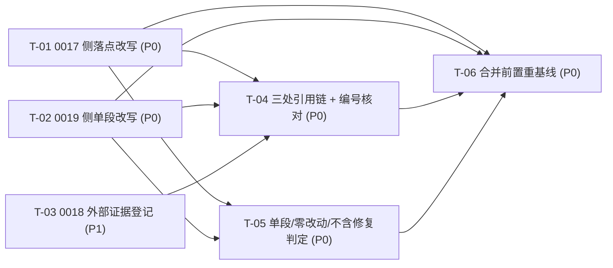

# pr-002-cross-iteration-d2-registration 任务图（阶段 5 planner 产物）

**迭代**：0019-worktree-isolation-protocol
**PR**：`docs/iterations/0019-worktree-isolation-protocol/prs/pr-002-cross-iteration-d2-registration.md`（`depends_on` 无、`batch: 1`）
**阶段**：阶段 5（PR 实现）
**任务总数**：6（P0 × 5、P1 × 1）
**文件范围（本 PR 只允许改这 2 个文件）**：`docs/iterations/0017-project-workspace/status.md`（**仅** §下一迭代候选 第 1 条）、`docs/iterations/0019-worktree-isolation-protocol/status.md`（**仅** §待确认项 的 D-2 段，ADR-4）。
**非目标**：① D-2 缺陷本身的修复（`/api/chats`、`/api/messages` 的 `params` 补 `project_id`）——F15 验收 1 / N2 明令不含，且不得新增「登记元数据完备性」条款；② `docs/iterations/0018-chat-agent-subagent-protocol/status.md`——**不在本 PR 文件范围**，按 ADR-3 只作「已完成的外部证据」登记，**不写入、不验证该分支文件本身**、不开跨工作区写入例外（规则 F 的例外是闭集两项）；③ `roles/**`、`.claude/**`、`oamp/**`、`tools/**`、`principles/**`、任何规范 / skill / 代码 / 脚本文件；④ `architecture.md`、`prd.md`、`prd/F*.md` 及两处 `status.md` 除上述段落外的任何内容（§5.3 零改动清单）。
**输入**：`architecture.md` **v1.2.2** §5.3（零改动清单；末行为 ADR-3 收窄后的两处表述）/ §5.4（惯例文件同步行：F15 两处由 pr-002 承担）/ §6.1 ADR-3 + ADR-4 / §7 Q-3（规则 F 闭集例外）/ §8.7（D-2 登记的统一三段式 + 编号口径行 + 落点）；`prd/F15-d2-registration-trace.md`（验收 1~4）；`demand.md` N2 / E12；本 PR 文件 8 条验收标准。
**可复用的既有裁定（零新增技术决策）**：ADR-3（0018 侧由既有提交 `89182b7` 承载 = 已完成的外部证据）；ADR-4（0019 侧单段改动 + 合并前重基线）；§8.7 统一格式与编号口径行——本任务图不新增任何 architecture 未覆盖的技术决策（见 §5）。
**口径约束**：① 每条验收标准均可追溯到 F15 验收 n / E12 / N2 / ADR-3 / ADR-4 / architecture 节号，逐条标注在括号内；② 判定手段一律为**只读**（`read` / `grep -n` / `git diff` / `git show`），唯一写入面 = 上述 2 个文件的 2 个段落；③ `0019/status.md` 由主 agent 主线持续维护 ⇒ 该文件的行号会漂移，**一切定位按内容锚点**（`- **D-2（跨迭代承接项，用户裁决 ①）**` 起的整段），不按 PR 文件里记录的旧行号；④ `[model_inferred]` 共 **5** 条，见 §4，全部需主 agent 确认后才能落地。

---

## 1. 任务一览

| ID | 一句话描述 | 前置依赖 | 优先级 | 落点 |
|---|---|---|---|---|
| T-01 | 0017 侧落点：§下一迭代候选 第 1 条改写为 §8.7 三段式 + 编号口径行，该节其余条目与全文其余部分逐字不动 | 无 | P0 | `docs/iterations/0017-project-workspace/status.md`（§下一迭代候选 第 1 条） |
| T-02 | 0019 侧落点：§待确认项 D-2 段改写为同一格式 + 编号口径行；该文件其余段落零改动（ADR-4 单段约束） | 无 | P0 | `docs/iterations/0019-worktree-isolation-protocol/status.md`（§待确认项 D-2 段） |
| T-03 | 0018 侧外部证据登记（ADR-3）：只读核对 `89182b7` 的 C-3 行并登记该事实，不写入、不验证该分支文件本身 | 无 | P1 | 无仓库内文件变更（证据任务） |
| T-04 | 三处引用链与段内编号口径一致性核对（F15 验收 2/3/4；E12） | T-01、T-02、T-03 | P0 | 无仓库内文件变更（证据任务，结论写入 PR 实现记录） |
| T-05 | 单段改动 / 零改动面 / 不含修复的 diff 判定（ADR-4 单段判据；F15 验收 1） | T-01、T-02 | P0 | 无仓库内文件变更（证据任务） |
| T-06 | 合并前置：以当时迭代分支重基线 + `0019/status.md` 冲突时的取舍（ADR-4；Gate r2 D9） | T-01、T-02、T-04、T-05 | P0 | 合并动作（无新增文件变更面） |

---

## 2. 依赖图

**无环**（拓扑序：`{T-01, T-02, T-03} → {T-04, T-05} → T-06`）。**无循环依赖，无需上报。**
**最长依赖链（3 跳 / 4 节点）**：`T-01（或 T-02）→ T-04 → T-06`；并列链 `T-01 → T-05 → T-06`。
**关键路径任务**：**T-01 与 T-02**（两个唯一的写入面，缺任一则 F15 验收 2 必不通过）→ **T-04 / T-05**（PR 级判定的收敛点）→ **T-06**（合并门槛，ADR-4）。
**并行说明**：T-01 / T-02 / T-03 **三者互不依赖、可同波并发**（T-01 与 T-02 落不同文件，T-03 只读）；T-01 与 T-02 的文本必须**同一格式**（arch §8.7 统一格式），故两处措辞的最终一致性由 T-04 收敛，**不是**执行期的相互等待。**不得**把 T-01 / T-02 拆给两个互不通气的实现者而各自另创措辞。

---

## 3. 任务详情

### T-01 · 0017 侧落点：§下一迭代候选 第 1 条 → §8.7 三段式 + 编号口径行

- **一句话描述**：把 0017 `status.md` §下一迭代候选 里那条「D-2（中·用户可见缺陷·第一优先）」的单段叙述，改写为 architecture §8.7 的统一三段式（缺陷描述 / 承接方与起始条件 / 引用链）并追加编号口径行；该节其余条目与全文其余部分一个字节不动。
- **前置依赖**：无
- **优先级**：P0
- **交付物**：`docs/iterations/0017-project-workspace/status.md` 的 §下一迭代候选 第 1 条（位于 `## 下一迭代候选（阶段 6 独立验证提出，按优先级）` 节内的有序列表首项）。

**验收标准**

1. 该条改写后含 **§8.7 三段式**的全部三行，措辞逐字采用架构模板〔arch §8.7「统一格式（每处一段，三行）」；prs/pr-002 验收 1〕：
   - ① 缺陷描述：`GET /api/chats` 与 `POST /api/messages` 的路由登记元数据 `params` 未包含必填参数 `project_id`；
   - ② 承接方与起始条件：**单独的小迭代**（`0019-worktree-isolation-protocol` 完成之后启动，本迭代不承接）；
   - ③ 引用链：`0017/status.md`（本项）→ `0018/status.md`（C-3 显式不纳入）→ `0019/status.md`（N2 显式排除并登记承接条件）。
2. 该条末尾含 **编号口径行**：跨迭代引用一律写成 `<迭代号>/D-<n>`（如 `0017/D-2`），且 `D-*` 不与 `0017/D-2` 复用同一编号；按 §8.7 允许的形态落在**同一段的第 4 行**〔arch §8.7「编号歧义规避规则（写入三处同段，作为同一段的第 4 行或同句）」；**[model_inferred] M4**〕。
3. **不出现未绑定指代**：改写后的该条内不出现"下一迭代"字样；起始条件必须写明"`0019-worktree-isolation-protocol` 完成之后启动"〔F15 验收 4；N2〕。
4. **跨迭代引用带迭代号、段内无两义**：该条内 `D-2` 的每一处出现都带迭代号（`0017/D-2` 形态），不出现裸 `D-2` 指向两个不同事项〔F15 验收 3；E12；arch §8.7〕。
5. **该节其余条目逐字不动**：§下一迭代候选 的第 2~4 条（`D-1` / `pr-004 提出的 N1~N6` / `信息级偏差`）文本逐字不变，条目数量与顺序不变〔prs/pr-002 验收 1「该节其余条目与全文其余部分逐字不动」；arch §5.3 零改动清单（0017 既有产物除 F15 登记段外零改动）〕。
6. **全文其余部分逐字不动**：该文件除 §下一迭代候选 第 1 条外零 hunk；§待确认项、§用户确认记录、§更新日志、§并发配置 等区块与基线逐字相等〔同上；arch §5.3〕。
7. **不含修复、不含新条款**：该次改写不引入 `project_id` 相关的代码 / 规范条款，不新增"登记元数据完备性"判定要求，不复制原条目里的根因分析（`architecture §6.1` 的逐字不动契约）与修复面描述（`llms.txt` 重生成 / `api-routes.test.js` 断言）——该取舍见 **[model_inferred] M1**〔F15 验收 1；N2；prs/pr-002 验收 5〕。
8. 只改这一个文件、只在这一次编辑内完成；**不改** `0019/status.md`（归 T-02）、**不改** `0018/**`（ADR-3）〔prs/pr-002 文件范围；ADR-3〕。

**验证方法**：`git diff --unified=0 -- docs/iterations/0017-project-workspace/status.md` 的人工复核 + `read` 该节全文 → 三行同构、编号口径行在场、第 2~4 条逐字未变；`grep -n '下一迭代' docs/iterations/0017-project-workspace/status.md` 在该条内 0 命中（该节的**标题行** `## 下一迭代候选（…）` 是既有标题，不在改动面，判定时排除）。

---

### T-02 · 0019 侧落点：§待确认项 D-2 段改写（ADR-4 单段改动）

- **一句话描述**：把 0019 `status.md` §待确认项 里那条 `- **D-2（跨迭代承接项，用户裁决 ①）**` 起的一整段，改写为与 T-01 **同一格式**（§8.7 三段式 + 编号口径行），且**该文件除这一段外零 hunk**。
- **前置依赖**：无
- **优先级**：P0
- **交付物**：`docs/iterations/0019-worktree-isolation-protocol/status.md` 的 §待确认项 中 D-2 段（改写前内容以 `- **D-2（跨迭代承接项，用户裁决 ①）**` 开头，为单行整段）。

**验收标准**

1. 该段改写后与 T-01 使用**同一格式**：三行三段式（缺陷描述 / 承接方与起始条件 / 引用链）逐字采用 §8.7 模板 + 一行编号口径〔arch §8.7；prs/pr-002 验收 2〕。
2. 承接方与起始条件写明：**单独的小迭代**（`0019-worktree-isolation-protocol` 完成之后启动，本迭代不承接）；**不出现"下一迭代"**这类未绑定指代〔F15 验收 4；N2；prs/pr-002 验收 4〕。
3. 引用链补全为 `0017/status.md` → `0018/status.md`（C-3 显式不纳入）→ `0019/status.md`（N2 显式排除并登记承接条件）；**0018 一侧写成"已完成的外部证据"语义**（C-3 显式不纳入），不得写成"由本迭代登记"〔ADR-3；arch §8.7；prs/pr-002 验收 3、验收 4〕。
4. **段标签按统一格式带迭代号**（`0017/D-2` 形态），该段内 `D-2` 的每次出现均带迭代号、无两义〔F15 验收 3；E12；arch §8.7「编号口径」；**[model_inferred] M3**〕。
5. **单段改动约束（ADR-4）**：本文件除 §待确认项 的 D-2 段外的 **hunk 数必须为 0**——特别地，下列位置**零改动**：阶段状态表（含阶段 1 行的 `P-1~P-16 + D-2`）、PR 实现子状态表与其下的两条注、并发配置区块、PR 验证表（r1/r2/r3 行）、§待确认项 的「无用户待确认项」条与 D-1 / D-3 / D-4 / D-5 / D-6 各段、用户确认记录（含 `**D-2 = ①**` 行）、更新日志〔ADR-4；prs/pr-002 验收 2、验收 6；Gate r2 D3 收窄〕。
6. **判据收窄（D3 闭合）**：本 PR **不要求** D-2 段之外的既有裸 `D-2` 出现位置带迭代号——它们位于 §阶段状态表 / 「无用户待确认项」条 / 用户确认记录 / 更新日志（PR 文件中记为 `:15`/`:32`/`:52`/`:60`，**以内容锚点为准，不按行号定位**），本任务**不得改动它们**〔prs/pr-002 验收 4「判据收窄…其余既有裸 D-2 出现位置不属于本 PR 的判据范围」；Gate r2 D3〕。
7. 该段改写不引入任何 `project_id` 相关的代码 / 规范条款，不新增登记元数据完备性要求〔F15 验收 1；N2〕。
8. 只改这一个文件、只在这一次编辑内完成；不改 `0017/status.md`（归 T-01）、不在 `0018/**` 做任何写入〔prs/pr-002 文件范围；ADR-3〕。

**验证方法**：`git diff -U0 -- docs/iterations/0019-worktree-isolation-protocol/status.md` → 全部 hunk 落在改写前 D-2 段所在行区间内（该段为单行，改写后变 4 行）；逐 hunk 对照验收 5 的零改动清单；`grep -c '^-' …` 与 `read` 全文件复核其余段落逐字未变。

---

### T-03 · 0018 侧外部证据登记（ADR-3：只登记、不写入）

- **一句话描述**：只读核对分支 `iteration/0018-chat-agent-subagent-protocol` 的提交 `89182b7` 的 `## 待确认项` C-3 行内容，并把「0018 一侧已完成」**登记为外部证据条目**；全程不写入该分支 / 该文件，不为它开任何跨工作区写入例外。
- **前置依赖**：无
- **优先级**：P1（无可改产物；ADR-3 的义务仅限"登记该事实"，D10 允许在该对象于本工作区不可达时降级为纳入 0018 恢复执行的核对清单）
- **交付物**：无仓库内文件变更；结论（命令 + 实测输出摘要）登记进阶段 5 的 PR 实现记录。

**验收标准**

1. 登记内容含**三项要素**：① 载体 = 分支 `iteration/0018-chat-agent-subagent-protocol` 的提交 `89182b7`（`docs(0018): 台账修正`）；② 位置 = 该分支 `docs/iterations/0018-chat-agent-subagent-protocol/status.md` 的 `## 待确认项` C-3 行；③ 内容 = 写明"由 **0019 完成后起的单独小迭代**承接"与"三处 status（0017 / 0018 / 0019）互相引用留痕"，并写明"0018 恢复时不承接该项"〔ADR-3；arch §6.1 ADR-3 / §5.4 / §8.7 落点；prs/pr-002 验收 3〕。
2. 核对手段为**只读**：`git show 89182b7:docs/iterations/0018-chat-agent-subagent-protocol/status.md`（或 `git show 89182b7 -- <该路径>`）——**规划期实测**：该对象在主工作区可达，其 `## 待确认项` 第 34 行为 C-3 行且含上述两处关键表述；该提交本身只改该文件 2 行（C-2 与 C-3 各 1 行替换）〔ADR-3；prs/pr-002 验收 3〕。
3. **零写入**：本 PR 的 `git diff --name-only <base>..HEAD` 中，`docs/iterations/0018-chat-agent-subagent-protocol/**` 的文件计数为 **0**；未创建该目录、未在该分支执行任何写命令、未引入跨工作区写入的第三项例外〔ADR-3；arch §7 Q-3（例外为闭集两项）；prs/pr-002 验收 3〕。
4. **不越界核对**：本任务**不**读取该分支文件的其它内容用于判定、**不**校验该分支文件的其它条款、**不**以"该文件不在本迭代工作区"为由改写验收口径〔ADR-3；prs/pr-002 验收 3「不读取 / 校验该分支文件的其它内容」；Gate r2 D10〕。
5. **降级路径（D10）**：若执行期该 commit 对象在所在工作区不可达，则登记为「待 0018 恢复执行或该分支合入时复核该行内容」，并同时把该行的**内容复核与"三处指向同一承接方"的复核**写入 0018 侧核对清单〔Gate r2 D10 处置建议；prs/pr-002 备注 ④〕。

**验证方法**：执行验收 2 的只读命令并留存输出摘要；`git diff --name-only <base>..HEAD | grep -c '0018-chat-agent-subagent-protocol'` = `0`。

---

### T-04 · 三处引用链与段内编号口径一致性核对（F15 验收 2/3/4；E12）

- **一句话描述**：在 T-01 / T-02 / T-03 各自落地后，把「三处互相引用、指向同一承接方与同一起始条件」「段内编号无两义」这两件事一次性核成结论。
- **前置依赖**：T-01、T-02、T-03
- **优先级**：P0
- **交付物**：无仓库内文件变更；核对结论（逐条 + 原文摘录）写入阶段 5 的 PR 实现记录。

**验收标准**

1. **两处文本互指**：`0017/status.md` 的该条与 `0019/status.md` 的该段的**引用链行**都列出 `0017/status.md` → `0018/status.md`（C-3 显式不纳入）→ `0019/status.md`（N2 显式排除并登记承接条件）〔F15 验收 2；E12；arch §8.7〕。
2. **三处指向同一承接方与同一起始条件**：0017 侧文本、0019 侧文本、0018 侧外部证据（`89182b7` 的 C-3 行）三者的承接方表述一致 = **单独的小迭代 / `0019-worktree-isolation-protocol` 完成之后起**；任一处指向不同承接方或缺少起始条件即不通过〔F15 验收 2、验收 4；E12；N2；ADR-3〕。
3. **无未绑定指代**：两处改写文本中不出现"下一迭代"这类未绑定指代〔F15 验收 4；N2〕。
4. **段内编号唯一**：两处改写段内 `D-2` 的每次出现均带迭代号（`0017/D-2` 形态），段内不出现指向两个不同事项的 `D-2`〔F15 验收 3；E12；arch §8.7 编号口径规则；Gate r2 D3 收窄〕。
5. **判据边界复核**：确认验收 4 的判定**只落在两处改写段内**；D-2 段之外的既有裸 `D-2`（阶段状态表 / 「无用户待确认项」条 / 用户确认记录 / 更新日志）保持原样且**不纳入**判定〔prs/pr-002 验收 4；Gate r2 D3〕。
6. **0018 侧不重复登记**：核对结论中，0018 一侧以 T-03 的外部证据条目为唯一依据，**不**出现"由本 PR 写入 0018"的任何表述〔ADR-3〕。
7. **不含修复的交叉确认**：核对中不得引入对 `/api/chats`、`/api/messages` 的代码 / 规范条款或"登记元数据完备性"要求的检查项——本 PR 只做登记，修复属承接迭代〔F15 验收 1；N2；F15 边界「不含 D-2 的修复内容」〕。

**验证方法**：对两处改写段与 `89182b7` 的 C-3 行逐条摘录原文 → 制表比对三处的承接方 / 起始条件 / 引用链三分项；核对结论进 PR 实现记录。

---

### T-05 · 单段改动 / 零改动面 / 不含修复的 diff 判定（ADR-4 单段判据）

- **一句话描述**：取本 PR 的 diff，机械判定「文件范围只 2 个」「0019 侧除 D-2 段外 hunk = 0」「0017 侧只动 §下一迭代候选 第 1 条」「无 0018 写入」「无修复内容」五项。
- **前置依赖**：T-01、T-02
- **优先级**：P0
- **交付物**：无仓库内文件变更；diff 判定结论写入阶段 5 的 PR 实现记录。

**验收标准**

1. **文件范围**：`git diff --name-only <base>..HEAD` 的结果集合**恰为** `docs/iterations/0017-project-workspace/status.md` 与 `docs/iterations/0019-worktree-isolation-protocol/status.md`（2 个文件，与 PR 文件范围逐字一致）〔prs/pr-002 文件范围；arch §5.3〕。
2. **0019 侧单段（ADR-4 判据）**：`git diff -U0 -- docs/iterations/0019-worktree-isolation-protocol/status.md` 的**全部 hunk** 均落在改写前 D-2 段所在行区间内；除该段之外的 hunk 数 = **0**〔ADR-4；prs/pr-002 验收 6「除 §待确认项 D-2 段之外的 hunk 数必须为 0」〕。
3. **0017 侧单条**：`git diff -U0 -- docs/iterations/0017-project-workspace/status.md` 的 hunk 只落在 §下一迭代候选 第 1 条（该命令行级定位需排除 hunk 上下文行对相邻条目的"显示"——判定标准是**被改动行**只属于该条）；该节第 2~4 条与全文其余部分**被改动行数 = 0**〔prs/pr-002 验收 1；arch §5.3〕。
4. **零 0018 写入**：diff 的文件集合中 `docs/iterations/0018-chat-agent-subagent-protocol/**` 计数 = **0**（ADR-3）〔ADR-3；arch §7 Q-3〕。
5. **不含修复**：diff 全文**不出现** `project_id` 相关的代码 / 规范条款改动，不新增"登记元数据完备性"条款；文件范围外的路径（`oamp/**`、`roles/**`、`.claude/**`、`tools/**`、`principles/**`、`architecture.md`、`prd.md`、`prd/**`、两迭代的其它产物）命中数 = **0**〔F15 验收 1；N2；arch §5.3 零改动清单〕。
6. **无未绑定指代**：diff 的新增行中不出现"下一迭代"字样〔F15 验收 4；N2〕。
7. 判定手段一律只读，判定结果以「命令 + 输出摘要 + 逐条结论」形式落 PR 实现记录〔ADR-4（判定方式即本 PR 的验收标准）〕。

**验证方法**：三条 diff 命令（`--name-only` / `-U0` 逐文件 / 全文检索）各执行一次并留存输出摘要；对验收 2 的 hunk 逐条标注其所属段落。

---

### T-06 · 合并前置：以当时迭代分支重基线 + `0019/status.md` 冲突取舍（ADR-4；Gate r2 D9）

- **一句话描述**：合并前把本 PR worktree 重基线到**当时的迭代分支 HEAD**；一旦 `0019/status.md` 冲突，以主线版该文件为基础、只重放本 PR 对 D-2 单段的改动。
- **前置依赖**：T-01、T-02、T-04、T-05
- **优先级**：P0
- **交付物**：合并动作与其核对证据（无新增文件变更面）。

**验收标准**

1. 合并前以**当时的迭代分支 HEAD**（非 PR 创建时的基点）重基线（rebase）；不得以旧基点直接合并〔ADR-4；prs/pr-002 验收 7「合并前以当时的迭代分支重基线」〕。
2. **冲突取舍（D9 闭合读法，两个指向不互斥）**：`0019/status.md` 冲突时，以**主线版该文件为基准**（除 D-2 段外的全部内容），本 PR 的登记文本**只作为该段（§待确认项 D-2 段）的替换/追加内容**重放；不得凭旧副本覆盖主线在该文件其它位置的更新，也不得把该单段之外的内容带入合并结果〔ADR-4；prs/pr-002 验收 7；Gate r2 D9〕。
3. **合并后核对（0019 侧）**：`git diff <主线合并前 HEAD> <合并后> -- docs/iterations/0019-worktree-isolation-protocol/status.md` **只含 D-2 段的变更**；该文件其余区块（阶段状态 / PR 实现子状态及两条注 / 并发配置 / PR 验证表 / 用户确认记录 / 更新日志）与主线合并前版**逐字相等**〔ADR-4；Gate r2 D9〕。
4. **合并后核对（0017 侧）**：`docs/iterations/0017-project-workspace/status.md` 若在该窗口内无主线更新，则合并结果与 T-01 改写版逐字相等；若有主线更新，按同一原则处置（冲突时以主线为除本 PR 改写条之外的基准，只重放该条的改写）——该外推见 **[model_inferred] M5**〔ADR-4 原则的类推；prs/pr-002 验收 7〕。
5. **合并后链不破**：合并结果上重跑 T-04 的三处引用链接与段内编号判定，仍全部通过（防止"重基线把登记段冲掉"）〔F15 验收 2/3/4；ADR-4〕。
6. 合并动作固定在**仓库主工作区**执行（Q-6 / P-6 既有裁决口径），不在会话工作区 checkout main〔arch §7 Q-3 的闭集例外②；0019 status 用户确认记录 P-6 = ①〕。

**验证方法**：rebase 输出 + 冲突处理记录（保留解决前后两份片段）；两条 `git diff` 核对命令的输出摘要；重跑 T-04 的核对表。

---

## 4. `[model_inferred]` 清单（5 条，全部待主 agent 确认）

> 均为「§8.7 统一格式与宿主文件体例 / ADR-4 适用范围」层面的**形态**推导，**不新增任何技术决策**，也不改变 §8.7 的判据自查三条；但**落地前需主 agent 确认**（planner 报告契约第 3 项）。

| # | 推断 | 默认取法 | 依据 / 风险 |
|---|---|---|---|
| **M1** | §8.7 模板与宿主文件体例的适配：0017 侧 §下一迭代候选 是**有序列表**（`1.`/`2.`/`3.`/`4.`），模板为 `-` 行；且原条目含模板之外的根因 / 修复面叙述 | ① 保留该节既有的有序标记（`1.`）与后续 2~4 条，**不新增、不重排条目**（否则触碰"该节其余条目逐字不动"）；② 模板三行按既有 markdown 续行缩进；③ **不保留**模板之外的叙述（根因 / 修复属架构级变更 / `llms.txt` 与测试断言同步）——三段式为"统一格式（每处一段，三行）"，多留即破格式 | arch §8.7 统一格式 + 「阶段 5 逐字采用或**仅做措辞级等价调整**」；prs/pr-002 验收 1。风险：若主 agent 认为原条目信息量（根因 / 修复面）需保留，该条会成为三段式之外的附加行 |
| **M2** | 0019 侧引用链行的 `0017/status.md` 括注 | §8.7 模板在该处写「（本项）」，那是 0017 侧视角；0019 侧**不得**照抄"本项"，改写为与本文件事实一致的形式（如 `0017/status.md`（缺陷登记）） | arch §8.7 模板 + 措辞级等价调整许可。风险：若要求两侧逐字同一，则该括注需主 agent 选定统一写法 |
| **M3** | 0019 侧该段的**标签**由 0019 自身台账号 `D-2` 改为统一格式的 `0017/D-2` 形态 | 采用模板的 `0017/D-2（跨迭代承接项）`——与 §8.7 编号口径行「0019 自身的台账项自 `D-3` 起编号」自洽（0019 的 D-2 槽位即本次跨迭代登记）；**逐字不动**的其它裸 `D-2`（用户确认记录 `D-2 = ①`、阶段状态表）仍指 0019 自身的该裁决项，不在判据范围 | arch §8.7 统一格式 + 编号口径行；prs/pr-002 验收 2、验收 4；Gate r2 D3 收窄。风险：若主 agent 认为 0019 侧须保留自身 `D-2` 标签（靠括注区分），M3 作废 |
| **M4** | 编号口径行在 0017 侧的文本 | **逐字照搬** §8.7 的编号口径行（含"（0019 自身的台账项自 `D-3` 起编号）"括注）——该行主体是通用规则，括注为示例 | arch §8.7「编号歧义规避规则（写入三处同段…）」+「逐字采用」优先。风险：在 0017 文件里出现 0019 的括注读起来略突兀；若主 agent 要求按迭代号替换，则改为措辞级等价调整 |
| **M5** | T-06 验收 4：`0017/status.md` 在合并窗口内发生主线更新时的冲突处置 | 按 ADR-4 的**原则类推**（段外以主线为基、只重放本 PR 的改写条） | ADR-4 原文只覆盖 `0019/status.md`（PR × 主线争用的实际情形在该文件）；0017 侧无并发写入方，属防御性外推。风险：若主 agent 认为该情形出现时应**停下报告**而非按原则处置，则验收 4 改为"停下报告" |

---

## 5. 越界与上报

- **循环依赖**：无（拓扑序见 §2）。
- **architecture 信息充分性**：本 PR 的写入面、格式（§8.7）、单段约束与重基线要求（ADR-4）、0018 侧处置（ADR-3）、零改动面（§5.3）**全部有明文**，无需上报架构缺口。
- **未新增技术决策**：本任务图只落 §8.7 既有格式与 ADR-3 / ADR-4 既有裁定；5 条 `[model_inferred]` 均为体例适配 / 适用范围外推，待主 agent 确认，不改变任何硬契约。
- **不作修复**：本 PR 的 diff 面明确排除 `/api/chats`、`/api/messages` 的 `params` 修复与「登记元数据完备性」条款（F15 验收 1 / N2），该缺陷由 0019 完成后起的单独小迭代承接（T-01 / T-02 的三段式②即承载该结论）。
