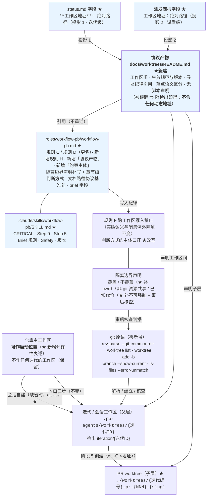
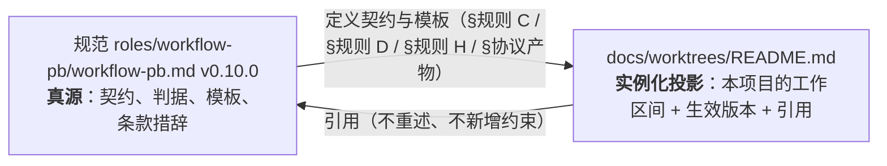
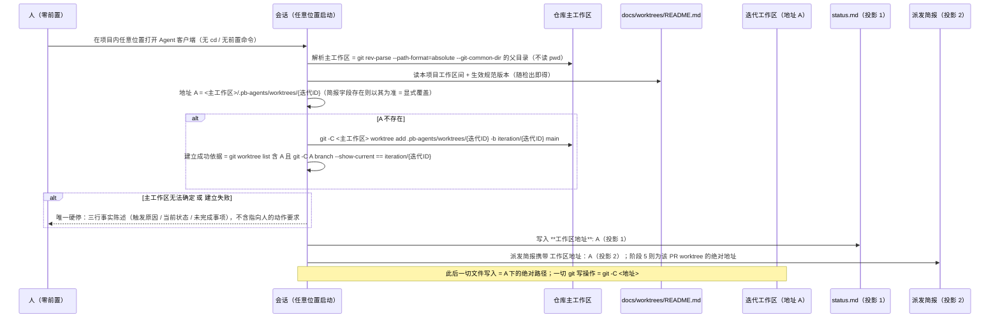

# architecture.md — 0020-session-workspace-addressing（迭代架构）

**版本**：1.0.0（阶段 3 产物初版）
**日期**：2026-09-12
**状态**：阶段 3 产物。**L1 决策清单见 §6.2，待主 agent 真实阻塞式转呈用户确认后方可推进阶段 4**；L2 决策（§6.1）已自主裁定并说明理由。
**输入**：`prd.md`（v0.2.0，21 卡 F01~F21，产品维度已锁，`model_inferred` 零残留）+ `prd/F01~F21*.md`（架构维度本次回填）+ `demand.md`（v1.0.0，W1~W23 / N1~N12 / E1~E17 / P-1~P-17）+ `clarifications/round-1~3.md`、`prd-round-1/2.md`
**架构基线（本迭代的"现有代码库"= 流程规范文本本体，阶段 3 逐行实测）**：
- `roles/workflow-pb/workflow-pb.md` **v0.9.0（736 行，本迭代的改动对象）**
- `.claude/skills/workflow-pb/SKILL.md` **v1.12.0（386 行，同）**
- `roles/<role>/<role>.md`（`roles/` 下 **12 个目录** = 10 个执行角色 + `_template` + `workflow-pb`；`git ls-files roles` = **62 个跟踪文件**，实测）、`principles/**`
- 仓库根 `.gitignore`（4 行：`.idea/` / `.pb-agents/` / `.DS_Store` / `.pb-agents/worktrees/`）
- 前序台账：`docs/iterations/0019-worktree-isolation-protocol/architecture.md`（v1.2.2）与 `clarifications/verify-stage6-20260912-200521.md`（PASS + 偏差 D-1 / D-5 / D-7）、`0017/history.md:204`
**本次约束**：零新工具 / 零 hook / 零守护进程 / 零依赖 / 零 `.gitignore` 变更 / 零安装脚本改动 / 零执行角色文件改动 / 零 `oamp/**` 改动——手段全部落在 **git 原生命令 + 文本条款**内（W2 / W8 / N3 / N4 / F21）。
**本阶段不做实现**：本文只产出「改哪个文件、哪一节、语义上改成什么、为什么」；规范 / SKILL / 脚本 / 角色文件一律**只读**（阶段 5 的 PR 才施工）。

---

## 0. 一句话架构

> **把「会话必须在自己的会话工作区里启动」（v0.9.0 的入口绑定）换成「会话在开工时解析并以绝对地址声明自己的工作区，此后一切写入与 git 写操作按该地址显式寻址」（本迭代的寻址绑定）：判据从 cwd 锚定改为地址锚定（`git -C <地址>`），硬停面收窄为一处（工作区无法确定或无法创建），契约从"散落在规则正文的 cwd 判据"变成"一份随检出即得的声明式协议产物 `docs/worktrees/README.md`（工作区间 + 生效规范）+ 规范侧的契约与模板"。手段全部是 git 原语与文本条款——`git -C` / `rev-parse --git-common-dir` / `worktree list` / `worktree add` / `branch --show-current` / `ls-files`（均已在本仓库既有条款中使用过）；本迭代新增的**实体只有一份被跟踪的 Markdown 文档**，新增的**条款体例零种**，删除的判据三条、删除的动作序列一条、解除的人的强制面四处。**

**一句话反证**：本次**没有引入任何新技术栈**——没有新工具、新依赖、新目录类别（`docs/worktrees/` 是用户裁决的文档落点，不是机制）、新字段类型（`status.md` 加一行文本字段）、新脚本、新 hook、新守卫；判据全部是 git 原生命令且**从 cwd 锚定改为地址锚定**；被删掉的东西（`pwd` 判据、`--show-toplevel` 判据、启动校验动作序列、硬停块里的创建命令行、`被派发时所在的工作区` 口径）**一个都不需要替代机制**，只需要换一句话说同一件事。

---

## 1. 架构基线（阶段 3 逐行实测）

### 1.1 现有架构的承载面（本次唯一触碰面）

| 文件 / 约定 | 现状职责（阶段 3 复核） | 本次改动性质 |
|---|---|---|
| `roles/workflow-pb/workflow-pb.md`（736 行 / v0.9.0） | 规范本体：6 阶段定义表、提交管理约束（规则 A~G + `### 隔离边界声明` + `### 角色定义来源与部署` + `### 约束生效范围`）、PR 文件七字段、调度指南（启动工作流 1~5 + 4.5、brief 构建、阶段 1~4 推进、阶段 5 依赖解锁式并发、progress-observer、阶段回退、用户决策、终止、收口三步）、文档路径协议、验证目标、状态追踪协议、历史记录协议、角色读取指南、原则 | **改动 20 条（`N-01`~`N-20`）+ 保留 1 条（`N-21`）**：新增 `## v0.10.0 变更说明`（含逐句取代清单 + 保留清单 + 备案段，N-01）；改写 `### 规则 C` 正文与判断方式（N-02 / N-03）、`### 规则 D`（更名 + 全文，N-04）、`### 规则 F` 判断方式（N-11）、`## 文档路径协议` 基准句（N-12）、`### 状态追踪协议`（+1 字段，N-13）、`### 派发执行角色时的 brief 构建`（+1 字段 +1 恢复派发句，N-14 / N-15）、`### 阶段 5` 步骤 2（N-16）、`### 启动工作流` 首段与 4.5（N-17 / N-18）、收口前置动作主体（N-20）、`:425` 术语口径（N-19）；新增 `### 规则 H`（N-05）、`### 协议产物`（N-06）、`### 约束主体`（N-07）；补写 `### 隔离边界声明`（N-08 / N-09 / N-10） |
| `.claude/skills/workflow-pb/SKILL.md`（386 行 / v1.12.0） | 宿主调度 skill：**10 条 CRITICAL**（实测 `:36` `:38` `:40` `:42` `:44` `:46` `:48` `:50` `:52` `:54`）、Step 0 两步、Step 1~4、Gate 4→5、Step 5 并发、Step 6、§对外协议三组契约、§角色文件来源与部署、§阶段执行卡片、§Brief 构建规则、§用户决策点与暂停格式、§status.md / §history.md 更新时机、Resources、Safety | **改动 9 条（`K-01`~`K-09`）+ 保留 1 条（`K-10`）**：`:44` CRITICAL 语义换向、`:98` Tools、`:125` 术语口径、`:136` Step 0 第 1 步、`:174` Step 5 步骤 2、`:216` 之后补 1 行、`:374-386` Safety（改写 2 条 + 新增 1 条）、`:4` / `:30` / `:60` 版本号三处；版本 1.12.0 → 1.13.0 |
| **`docs/worktrees/README.md`（新建）** | 现状**不存在**（`ls docs` 无该目录；实测 `docs/` 未被任何忽略规则命中、`docs/ds/README.md` 是"`docs/<主题>/` 协议规格包 + 目录自述 README"的既有先例） | **新建**：本项目的工作区间 + 生效规范 + 寻址纪律引用 + 落点语义区分行 + 无脚本声明（5 节，见 §4） |
| `roles/workflow-pb/data/workflow-pb-changelog.md`、`roles/workflow-pb/memory.md` | 规范侧既有变更留痕惯例（每版一条，v0.2.0~v0.9.0 齐备） | **追加** v0.10.0 条目与索引行（沿用体例，不新建文档类型） |
| `.claude/skills/workflow-pb/data/skill-optimization-v1.12.0.md`、`memory.md` | SKILL 侧既有优化记录（v1.1.0~v1.12.0） | **就地更正 2 处引用**（D-7）+ **新建** `skill-optimization-v1.13.0.md` + 追加索引行 |
| `tools/install-pb-agents.sh`（61 行）、仓库根 `.gitignore`（4 行）、`oamp/**`、`principles/**`、`roles/` 下 **11 个非 `workflow-pb` 目录**（10 个执行角色 + `_template`） | 分发脚本 / 忽略规则 / 产品代码 / 原则 / 角色能力定义 | **零改动**（F03 验收 3、F13 验收 5、N4） |

### 1.2 可直接复用的既有能力（决定了本方案为什么"少造东西"）

| # | 既有能力（位置，阶段 3 实测） | 本次如何复用 |
|---|---|---|
| A | **`git -C <地址>` 已是本规范的既有形态**：规范 `:441-447` 的收口三步全部是 `git -C <仓库主工作区> …`，且 `:447` 已有 `git -C <会话工作区> checkout --detach` | W2 的"git 写操作用 `git -C <地址>`"**不是新机制**，是把既有形态从收口一步推广为通则 |
| B | **`git rev-parse --git-common-dir` 的层级判据已被 0019 证成**：链接工作区的 `--git-dir`（`.git/worktrees/<id>`）≠ `--git-common-dir`（`.git`），主工作区两者相同；本迭代只取后者**取值与位置无关**这一面 | T-03 的"仓库主工作区求取"= 该原语的父目录，**零新命令** |
| C | **`git worktree list` / `git branch --show-current` 已在规则 C / D / G 判断方式中使用** | 工作区存在性核查 + 分支核查 + 建立成功依据（T-03 / T-05） |
| D | **`git worktree add -b … main` 的命令形态已在 0019 Q-1 = A 中裁定并落地**（规范 `:161` / `:333` / `:180` 三处同一命令） | T-03 的建立动作**沿用同一条命令**，只改执行者预设与时点（会话自建、存在时跳过） |
| E | **`docs/ds/README.md` 的"目录自述 README + 状态/版本/日期/演进自 头"先例**（实测 `git ls-files docs` 含该文件） | T-01 的产物头部形态**照抄先例**，不发明新文档体例 |
| F | **既有「条款正文 + 紧跟一行 `判断方式：`」体例**（规范 `:139/141`(A) `:145/147`(B) `:163`(C) `:184`(D) `:190`(E) `:200`(F) `:206`(G) `:242`(角色来源)） | 新增 4 节（规则 H / 协议产物 / 约束主体 / 章节级判断方式）**沿用同一体例**，不新增结构体例（T-16 的形态面） |
| G | **既有 `### 约束生效范围` 句**（`:244-246`：「仅从下一个使用本工作流的迭代起生效，不追溯已完成迭代」） | 新增条款全部追加在该句**之前** ⇒ F13 验收 6（不追溯、0018 文件零改动）**零改动即成立** |
| H | **0019 阶段 6 的实测结论**：nested PR worktree（落在会话工作区内）实测 **pass**（`0019/clarifications/verify-stage6-20260912-200521.md` 标准 8「附带：嵌套 PR worktree 隔离 + F07 父子层」），0019 架构 R-2 已闭合 | T-02 / F14 的 PR worktree 落点（子层）**无需再实测**，只需在产物里如实声明 |
| I | **本迭代自身的运行形态已经是新契约的活样本**：`0020/status.md` 登记「会话工作区 = `<WS>`」字段、§偏离记录 D-1 明写「一切读/写一律使用绝对路径；每次派发的简报都携带『工作目录纪律』固定段」；三轮 demand 与两轮 prd 每轮以 `git -C <WS> status --porcelain -uall` 自证 | T-04 的「投影 1（`status.md` 字段）」与「投影 2（简报字段）」**已有同形实现先例**，本次只是把它写成条款 |
| J | **0019 的阶段 3 体例**：`architecture.md` 的「§出现点清单 → §命令表 → §变更面清单 → §条款落点与措辞 → §回归核对组织」结构 | 本文沿用同一结构，便于阶段 4/5/6 按同一读法消费 |

### 1.3 既有缺口（正好是 21 张卡的来源）

1. **会话身份与工作区身份的绑定方式是"入口绑定"（cwd 判据）**：规范 `:151` `:161` `:167` `:169-171` `:327` 六处把"合规"定义成"cwd 落在某目录"。一手反证：本迭代自己按 v0.9.0 字面本应「发现即停」（`0020/status.md` §偏离记录 D-1）；0019 期间 dev 会话 `cwd = 仓库根` 时 14 次相对路径编辑落在主工作区（`0019/…/verify-stage6-…md` 偏差 D-5）；0017 期间 `cwd` 正确仍误写主工作树三笔（`0017/history.md:204`）→ F01 / F02 / F09 / F19。
2. **寻址的载体没有地址字段**：规范 `:347-360` 的 brief 字段清单与 SKILL `:283-296` **均无「工作区地址」**（F8）；而规范 `:461` 把相对路径基准定在"该会话所在的迭代工作区根目录"⇒ 会话不在该目录时**基准消失**，执行角色只能按 cwd 猜落点 → F08 / F06。
3. **契约本身没有可读载体**：工作区间与生效规范散落在规则 C / 规则 D / 阶段定义表 / 技能版本行四处，会话要"自己把判据拼起来" → F03 / F04 / F05。
4. **硬停面过宽且输出含动作要求**：规范 `:167`「任一不成立即发现即停」覆盖三种情形（cwd 不符 / 在主工作区启动 / 分支不对），`:173-181` 的硬停块含「创建命令（在仓库主工作区执行）」= 指向人的动作 → F09 / F12。
5. **阶段 5 子 agent 的口径实测未成立**：规范 `:167` 与 `:200` 写「以**被派发时所在的工作区**为准」，而实测 cwd 与写入落点不等价 → F14。
6. **残留风险未被声明**：v0.9.0 用"发现即停"把"会话不在工作区"前置消灭；换成寻址后风险从"无法开工"变成"静默写错"，而 `### 隔离边界声明`（`:208-228`）**未声明 cwd 与隔离的关系**、未声明"跨工作区写入不可能被 git 强制"（只在规则 F `:196` 说了一句，未升级为"已知代价 + 事后核查判据"）→ F12 / F17。
7. **「硬停」一词有两处不同性质的用法**：`:425`（依赖图有环）与 SKILL `:125` 同类表述，与启动类硬停同用一个词 ⇒ 收窄后的"唯一触发面"字面上不唯一 → F09（本迭代用术语限定闭合，见 §2.8）。
8. **对刚交付版本的取代声明缺失**：v0.9.0 的旧句（`:151` `:161` `:167` `:169-171` `:173-181` `:327`）仍原样在文件里，改动后必须逐句声明"哪些失效、哪些保留" → F11。
9. **0019 的两处遗留偏差未闭合**（`0019/…/verify-stage6-…md` §偏差记录）：D-1（`### 隔离边界声明` 无章节级 `判断方式：` 行）→ F17；D-7（`skill-optimization-v1.12.0.md` 的 `§8.4` 引用指向错误来源）→ F18。
10. **活指令冲突**：`0018/status.md:24` 的「操作前置（宿主限制，必须由用户执行）：本迭代的恢复会话需以 cwd = 上述会话工作区启动」仍是可被读到的指令，而它正被本迭代作废 → F16。

### 1.4 本次演进的组件图（★ = 本次新增/改动的**文本**；未标 ★ = 逐字不变的既有链路）



**读图要点**：`MW / SW / PW / GIT / F / BND` 全部是既有实体；**本次新增的实体只有 `ART` 一个（一份被跟踪的 Markdown 文档）**，其余 ★ 均为文本改动。三条链路被删掉：`MW → SW` 的"会话启动之前由人/主 agent 创建"（改为会话自建）、`SW → 会话 cwd` 的启动校验链、`GIT(--show-toplevel/pwd)` 的 cwd 判据链。

### 1.5 工作区拓扑与寻址拓扑（T-02 / T-03 的落定形态）

```
<仓库主工作区>/                                  ← main 检出；会话可在此启动（不得作工作区）
├── docs/worktrees/README.md                     ← ★ 协议产物（被跟踪；文档位，非工作区）
├── docs/iterations/{迭代ID}/                    ← 迭代产物（被跟踪）
├── roles/workflow-pb/workflow-pb.md             ← 规范真源（被跟踪）
└── .pb-agents/worktrees/                        ← 工作区池（被 .gitignore:2 / :4 忽略）
    └── {迭代ID}/                                ← 会话 / 迭代工作区（父层）
        ├── （仓库内容，含 docs/worktrees/README.md 与 roles/**）
        └── .pb-agents/worktrees/                ← PR worktree 落点（在工作区内 ⇒ 不越界）
            └── {迭代编号}-pr-{NNN}-{slug}/         ← PR worktree（子层，短生命周期）
```

| 对象 | 命名（唯一约定，**本迭代零变化**） | 依据 |
|---|---|---|
| 迭代工作区目录 / 会话工作区目录 | `{迭代ID}`（如 `0020-session-workspace-addressing`） | 0019 落点，F13 验收 2 ⑤ |
| 迭代分支 | `iteration/{迭代ID}` | F13 验收 2 ② / 规则 E 不变 |
| PR worktree 目录 / 分支 | `{迭代编号}-pr-{NNN}-{slug}` / `feat/{迭代编号}-pr-{NNN}-{slug}` | F13 验收 2 ③④ / 规则 E 不变 |
| **工作区地址（本迭代新增的声明对象）** | `<仓库主工作区>/.pb-agents/worktrees/{迭代ID}` 的**绝对路径** | W10 / F06；对象已是既有事实，**新增的只是"它被声明"** |

---

## 2. 全部出现点清单（逐文件通读 + 逐行检索；T-06 / T-08 的输入）

> 方法：阶段 3 **逐文件通读** `roles/workflow-pb/workflow-pb.md`（736 行）与 `.claude/skills/workflow-pb/SKILL.md`（386 行）全文，并按七类表述逐行检索；下表**逐条给出位置（文件 + 行号）与原文片段**。处置四档：**改写** / **取代**（旧句失效，清单见 §7）/ **保留**（逐字不动）/ **清单外**（出现但不在本次范围，只记录理由）。
> 扫描面 = 上述两文件 + `roles/<role>/<role>.md`（12 个目录 / 62 个跟踪文件，逐文件检索关键词）+ `principles/**` + `tools/**` + `.gitignore`。**实测结论：执行角色文件、`principles/**`、`tools/**` 对本迭代七类表述 0 命中**（唯一相关命中是 `roles/pr-planner/pr-planner.md` 的"代码库根目录"字段与 `roles/progress-observer/*` 的 worktree 核实表述，均属 0019 已判定的"清单外"，理由同 0019 §2）。

### 2.1 ① 启动判据三项（`--show-toplevel` / `--git-common-dir` / `--show-current`）与硬停形态块

| # | 位置 | 原文（片段，逐字） | 处置 |
|---|---|---|---|
| 1 | `workflow-pb.md:163` | 「判断方式：`git rev-parse --show-toplevel` 等于该会话的启动目录；`git rev-parse --git-dir` ≠ `git rev-parse --git-common-dir`（证明当前处于链接工作区而非仓库主工作区）；`git branch --show-current` 输出 `iteration/{迭代ID}`。三者同时成立即合规。」 | **取代**（作为启动门与 cwd 判据的用法）→ 改为地址锚定判据（§8.1-C） |
| 2 | `workflow-pb.md:167` | 「会话必须在**自己的会话工作区**内启动并运行（约束主体 = **主 agent 会话**，一次迭代校验一次…；阶段 5 的子 agent 以**被派发时所在的工作区**为准，即该 PR 的 worktree）。cwd = 该工作区根目录。三条判据**同时成立**即合规，任一不成立即**发现即停**——不进入任何阶段、不产生任何写入（含 `status.md` / `history.md` 的创建）：」 | **取代**（启动门 + cwd 判据 + 子 agent 口径）→ 改写为地址解析与声明（§8.1-D） |
| 3 | `workflow-pb.md:169` | 「1. `git rev-parse --show-toplevel` 与 `pwd` 相等（会话 cwd = 其工作区根目录）；」 | **取代**（判据 1 作为启动门；F09 验收 2 明列 `pwd` / `--show-toplevel` 判据句） |
| 4 | `workflow-pb.md:170` | 「2. `git rev-parse --git-dir` ≠ `git rev-parse --git-common-dir`（当前处于链接工作区 worktree，而非仓库主工作区——这一条同时排除"在仓库主工作区里启动"）；」 | **取代**（判据 2 作为启动门；其"排除主工作区启动"的用法与 F10 验收 1 直接冲突） |
| 5 | `workflow-pb.md:171` | 「3. `git branch --show-current` 输出 `iteration/{迭代ID}`（直接读 HEAD）。」 | **取代**（判据 3 作为启动门）→ 保留该原语，改为**工作区属性核查**（`git -C <地址> branch --show-current`，§8.1-C） |
| 6 | `workflow-pb.md:173` | 「硬停输出形态（必须含**可用于创建该迭代工作区的命令**；**不复用** `⛔ 需要你的决策` 暂停格式——那是「需要用户决策的情况」的专用形态，两者互不替代）：」 | **取代**（`必须含创建命令` 与 F09 验收 4「不含祈使句」冲突）→ 新形态见 §5.4，引导句同步改写 |
| 7 | `workflow-pb.md:176-181` | ```【启动校验未通过】/ 判定：cwd = <实际路径>（期望：<会话工作区路径>）/ 当前检出：… / 创建命令（在仓库主工作区执行）：git worktree add … / 状态：发现即停——未进入任何阶段、未产生任何写入。``` | **取代**（整块；F11 验收 1 ④） |
| 8 | `workflow-pb.md:184` | 「判断方式：依次执行 `git rev-parse --show-toplevel` / `--git-dir` / `--git-common-dir` / `git branch --show-current`，按上列三条判据逐条比对；任一条不成立而会话仍在推进…即违反。」 | **改写**（改为地址锚定的判断方式行，§8.1-D） |
| 9 | `workflow-pb.md:327` | 「**本工作流在本会话的会话工作区（见「提交管理约束·规则 C」）内运行。** 启动时先按「提交管理约束·规则 D」的三条 git 原语判据做**会话工作区校验**——`--show-toplevel` 等于该会话的启动目录、`--git-dir` ≠ `--git-common-dir`、`--show-current` 输出 `iteration/{迭代ID}`；任一不成立即**发现即停**（不进入任何阶段、不产生任何写入），并输出可用于创建该迭代工作区的命令。本校验**不新增步骤号**（步骤编号体系仍为 1~5 + 4.5）。」 | **取代**（启动工作流首段；F11 验收 1 ⑤）→ 改写为"产物路径以声明地址为根"（§8.1-I） |
| 10 | `workflow-pb.md:333` | 「4.5. …迭代分支的**创建**动作已由会话工作区创建步骤在**会话启动之前**完成（见「提交管理约束·规则 C」，命令 `git worktree add …`）——本步骤不再执行 `git branch` / `git checkout`，只负责该字段的写入。此后阶段 2~5 期间，**该会话所在的迭代工作区**（根目录）保持检出该分支。」 | **改写**（"与会话启动之前完成"的时点与执行者预设随 W1 会话自建而变；步骤号与触发时机、字段写入职责保留） |
| 11 | `workflow-pb.md:425` | 「**唯一的硬停例外**：阶段 4→5 入口 `pr-planner` 报告依赖图有环…必须停下修正，不能搭置。」 | **改写（术语口径）**：见 §2.8（收窄后"硬停"唯一，此类改称"流程结构错误中止"，语义与行为零变化） |
| 12 | `workflow-pb.md:447` | 「**第 3 步的前置动作…**：若 `iteration/{迭代ID}` 仍被该会话工作区检出，先执行 `git -C <会话工作区> checkout --detach`…」 | **改写（主体限定）**：「该会话工作区」→「该迭代的工作区」（F15 验收 2 的 E8 改写落点） |
| 13 | `SKILL.md:44` | 「**CRITICAL: 会话必须在自己的迭代工作区内启动与运行——启动校验不通过 → 发现即停并输出可用于创建该迭代工作区的命令，不进入任何阶段、不产生任何写入；判据见规范 §规则 D。**」 | **改写**（CRITICAL 槽位保留、语义换向；§8.2-K-01） |
| 14 | `SKILL.md:98` | 「- 启动时执行**启动校验**（判据引用规范 §规则 D）与**角色来源解析**（见「§ 角色文件来源与部署」）」 | **改写** → 「启动时解析并声明其迭代工作区地址…+ 角色来源解析」 |
| 15 | `SKILL.md:136` | 「1. **启动校验**（规范 §规则 D）：`git rev-parse --show-toplevel` == cwd；`--git-dir` ≠ `--git-common-dir`；`git branch --show-current` == `iteration/{迭代ID}`。不通过 → 输出创建命令并**发现即停**（不进入任何阶段、不产生任何写入）。」 | **改写**（Step 0 第 1 步；§8.2-K-02） |
| 16 | `SKILL.md:125` | 「…只有"pr-planner 报告依赖图有环"这一类结构性错误才硬停」 | **改写（术语口径）**：同 §2.8 |

> 三项判据的**原语本身全部保留可用**（它们是 git 原生事实）；被取代的是**"以 cwd 为基准、发现即停"的用法**。`--show-toplevel` 与 `pwd` 在本次**新增 / 改写条款中 0 出现**（F09 验收 2 的检索判据因此可裸判定）。

### 2.2 ② 「会话必须运行在自己的会话工作区里」/「在该工作区根目录内启动」类句子

| # | 位置 | 原文（片段，逐字） | 处置 |
|---|---|---|---|
| 1 | `workflow-pb.md:151` | 「会话（主 agent 会话）必须运行在自己的会话工作区里。」 | **取代**（F11 验收 1 ②）→ 改为「会话在开工时解析并以绝对地址声明其迭代工作区；工作区不存在时由会话建立」（§8.1-C） |
| 2 | `workflow-pb.md:161` | 「…随后会话在该工作区根目录内启动。」（同段前半：「会话工作区与迭代分支在**会话启动之前（阶段 1 之前）**用一条命令同时建立」） | **取代**（F11 验收 1 ③；时点与执行者的"启动之前/由人执行"预设随 W1 一并作废）→ 保留命令形态、落点、分支名 |
| 3 | `workflow-pb.md:167` | 「会话必须在**自己的会话工作区**内启动并运行」 | **取代**（同 2.1-#2） |
| 4 | `workflow-pb.md:327` | 「**本工作流在本会话的会话工作区（见「提交管理约束·规则 C」）内运行。**」 | **取代**（F11 验收 1 ⑤ 的句首半句） |
| 5 | `SKILL.md:44` | 「**CRITICAL: 会话必须在自己的迭代工作区内启动与运行**」 | **改写**（CRITICAL 槽位保留） |
| 6 | `workflow-pb.md:153` | 「**仓库主工作区不作为任何迭代的会话工作区。** 同一会话参与连续两个迭代时，必须为第二个迭代建立它自己的会话工作区…」 | **保留**（F10 验收 2 / F13 验收 2 ① 要求逐字存续；本迭代**不弱化**） |
| 7 | `workflow-pb.md:155` | 「会话 / 迭代工作区是**父层**，阶段 5 的 PR worktree 是它下面的**短生命周期层**…**PR worktree 不得被当作会话工作区使用**…」 | **保留**（F13 验收 2 ③） |

### 2.3 ③ 「文档路径协议以会话所在的迭代工作区根目录为基准」类句子

| # | 位置 | 原文（片段，逐字） | 处置 |
|---|---|---|---|
| 1 | `workflow-pb.md:457` | 「## 文档路径协议」 | **保留**（节标题） |
| 2 | `workflow-pb.md:461` | 「**全部路径相对该会话所在的迭代工作区根目录判读**（见「提交管理约束·规则 C」）。」 | **改写**（F08 验收 4 的基准句；W12）→ 「**全部路径相对该会话声明的工作区地址判读**（见「规则 D / 规则 H」）」 |
| 3 | `SKILL.md` 全文 | 无「文档路径协议」出现（0 命中；SKILL 只在 `:216` 写「产物文档的路径、字段、标注规则由规范文件统一定义，本 skill 不重复定义，只引用」） | **零改动**（该引用行已正确；本次只在其后补一行地址基准的引用，§8.2-K-07） |
| 4 | `workflow-pb.md:33/37`（CRITICAL） | 「本文件是提交管理约束的唯一来源」「修改本文件不得侵入任何执行角色文件」 | **保留**（元约束） |

### 2.4 ④ 简报字段清单（现有哪些字段、要在哪加「工作区地址」）

**规范侧 `### 派发执行角色时的 brief 构建`（`:341`；字段块 `:347-360`；阶段 5 额外必填 `:362-367`）**

| # | 位置 | 现有字段（逐字） | 处置 |
|---|---|---|---|
| 1 | `:348` | `角色名：<role>（如 demand/prd/architect，供对外呈现时可辨认角色对应关系）` | 保留 |
| 2 | `:349-352` | `角色定义（全文注入）：` + `---` + `{读出的 {角色定义根}/<role>/<role>.md 完整内容，原样注入}` + `---` | 保留 |
| 3 | `:353` | `工作流规范：{角色定义根}/workflow-pb/workflow-pb.md` | 保留 |
| 4 | `:354` | `当前迭代 ID：{迭代ID}` | 保留 |
| 5 | `:355` | `当前阶段：阶段 {N}（{阶段名}）` | 保留 |
| 6 | `:356`–`:359` | `任务：` / `输入：` / `输出：` / `完成定义：` | 保留 |
| 7 | `:364`–`:366`（阶段 5 额外必填） | `当前 PR：` / `PR worktree 分支：` / `注意：只处理该 PR 文件范围内的功能…` | 保留（F14 验收 1 的口径由新增地址字段承载，见下） |
| **8（新）** | 插在 `:353` 之后、`:354` 之前 | — | **新增一行：`工作区地址：<绝对路径>`** |

**新增行的取位理由（L2 决策，§6.1-L2-3）**：① 地址是「输入 / 输出」两行路径判读的**基准**，必须出现在它们之前；② 与 `工作流规范` 行同属"环境事实"类字段，相邻不破坏既有字段名的逐行呈现要求（`:343` 规定"必须逐行以 `字段名：值` 的形式呈现"）；③ 阶段 5 的 `PR worktree 分支` 行已是同级事实，地址行与它构成"地址 + 分支"一对，无需改动阶段 5 块。

**SKILL 侧同源（`§ Brief 构建规则`，`:277`；字段块 `:283-296`；阶段 5 块 `:302-307`）**：字段清单与规范**逐字同构**（`:284-295` 对应规范 `:348-359`，`:304-306` 对应规范 `:364-366`）⇒ **同 1 处新增**（`:289` 之后），保持两侧同构（F08 验收 5 / T-09）。

### 2.5 ⑤ 阶段 5 的「以被派发时所在的工作区为准」句

| # | 位置 | 原文（片段，逐字） | 处置 |
|---|---|---|---|
| 1 | `workflow-pb.md:167` | 「阶段 5 的子 agent 以**被派发时所在的工作区**为准，即该 PR 的 worktree」 | **取代**（F14 验收 2 的检索判据）→ 「以**简报给定的 PR worktree 绝对地址**为准」（§8.1-D） |
| 2 | `workflow-pb.md:200` | 「判断方式：…逐条比对"写入动作 → 目标路径"是否位于本会话工作区内（阶段 5 的子 agent **以其被派发时所在的工作区为准**）；…」 | **取代**（同上；规则 F 的实质语义与例外集**不变**）→ 「（阶段 5 的子 agent 以**其简报给定的 PR worktree 绝对地址**为准）」 |
| 3 | `workflow-pb.md:384` | 「…**在该会话工作区内执行**，落点即该工作区内的子目录…」 | **改写**：执行位置由"该会话工作区"改为「该 PR worktree 的**绝对地址**（`git -C <地址>`）」 |
| 4 | `SKILL.md` 全文 | 无「被派发时所在」出现（0 命中） | — |
| 5 | `SKILL.md:174` | 「PR worktree 落 `<会话工作区>/.pb-agents/worktrees/{迭代编号}-pr-{NNN}-{slug}`…（base 为当前迭代的迭代分支）」 | **改写**（加"以简报地址 + `git -C`"的寻址形态；落点与分支名不变） |

### 2.6 ⑥ 「主工作区不作为任何迭代的会话工作区」句

| # | 位置 | 原文（片段，逐字） | 处置 |
|---|---|---|---|
| 1 | `workflow-pb.md:153` | 「**仓库主工作区不作为任何迭代的会话工作区。**」 | **保留**（F10 验收 2：声明缺失或被弱化即不通过） |
| 2 | 同处**无**「可作启动位置」的允许性表述（全文 0 命中） | — | **新增**（F10 验收 1）：在 `### 规则 C` 改写段显式写入"会话可在项目内任意位置启动（含仓库主工作区）" |
| 3 | `workflow-pb.md:196-198` | 规则 F 的负面约束与**闭集例外两项**（① 创建动作 ② 收口三步及前置游离） | **保留**（F10 验收 3：对主工作区的写入仍受规则 F 约束；F03 验收 4：例外仍 2 项） |
| 4 | `workflow-pb.md:217` | 「**同一分支不能在两处同时检出**是 git 硬约束…因此会话工作区**永不** checkout `main`，`main` 上的合并动作只能在仓库主工作区发生」 | **保留**（F13 验收 7 护栏） |
| 5 | `roles/progress-observer/progress-observer.md`、`roles/pr-planner/pr-planner.md` 等执行角色文件 | 无「主工作区不作为工作区」类表述（0 命中） | **清单外**（零改动；0019 已裁定执行角色文件不在变更面） |

### 2.7 ⑦ SKILL 侧同源句（Step 0 / Brief 规则 / 阶段执行卡片）

| # | 位置 | 原文（片段，逐字） | 处置 |
|---|---|---|---|
| 1 | `SKILL.md:44` | CRITICAL「会话必须在自己的迭代工作区内启动与运行…判据见规范 §规则 D」 | **改写**（§8.2-K-01） |
| 2 | `SKILL.md:98` | Tools「启动时执行**启动校验**（判据引用规范 §规则 D）…」 | **改写**（§8.2-K-03） |
| 3 | `SKILL.md:125` | Important facts #6「…这一类结构性错误才硬停」 | **改写（术语口径）**（§2.8） |
| 4 | `SKILL.md:134-139`（Step 0） | `1. 启动校验…` / `2. 角色来源解析…` / `3. 前提声明…` / `4. 确认迭代 ID…` | **改写第 1 步**（§8.2-K-02）；第 2~4 步**保留** |
| 5 | `SKILL.md:234-273`（§阶段执行卡片） | 8 张卡片（角色名 / 角色文件路径 / 执行流程）；阶段 3 卡片含「出现 L1 决策 → 暂停等用户确认」 | **保留**（F13 验收 4：不做与寻址无关的改动；卡片不含地址事项，地址由 brief 字段承载） |
| 6 | `SKILL.md:277-307`（§Brief 构建规则） | 与规范逐字同构的字段块 + 阶段 5 块 + 「全文注入」理由段 | **新增 1 行**（`:289` 之后；§2.4） |
| 7 | `SKILL.md:214-221`（§文档协议） | 「产物文档的路径、字段、标注规则由规范文件统一定义，本 skill 不重复定义，只引用」 | **补 1 行引用**（地址基准见规范 §文档路径协议；§8.2-K-07） |
| 8 | `SKILL.md:374-386`（Safety） | 11 条（含「派发子 agent 前必须已解析角色定义根路径」） | **改写 2 条 + 新增 1 条**（启动校验条 → 地址声明与显式寻址；新增"不得声称越界会被阻止"） |
| 9 | `SKILL.md:3` / `:30` / `:58` | `description`（v0.9.0）/ `**版本**: 1.12.0（对应规范 workflow-pb v0.9.0）` / Purpose「按 workflow-pb v0.9.0 规范调度」 | **改写**（三处版本同步 → v0.10.0 / 1.13.0；ADR-2 同族判据：改后 `grep -n 'v0\.9\.0' SKILL.md` 仅应命中历史记录文件名） |
| 10 | `SKILL.md:5` | 「**完整规范**: `{角色定义根}/workflow-pb/workflow-pb.md`（角色来源见「§ 角色文件来源与部署」）」 | **保留**（路径正确；版本号不在该行） |

### 2.8 补充出现点：「硬停」一词的第二类用法（F09 验收 1 的唯一性风险，本迭代必须闭合）

| # | 位置 | 原文（片段，逐字） | 处置 |
|---|---|---|---|
| 1 | `workflow-pb.md:425` | 「**唯一的硬停例外**：阶段 4→5 入口 `pr-planner` 报告依赖图有环…必须停下修正，不能搭置。」 | **改写（术语口径）** |
| 2 | `SKILL.md:125` | 「…只有"pr-planner 报告依赖图有环"这一类结构性错误才硬停」 | **改写（术语口径）** |
| 3 | `workflow-pb.md:427-433`（`### 需要用户决策的情况`）、`SKILL.md:311-337`（§用户决策点与暂停格式） | 「暂停并通知用户」五类触发条件 + `⛔ 需要你的决策` 形态 | **保留**（性质不同：这是**用户决策点暂停**，不是硬停；0019 已确立"两者互不替代"） |

**闭合方式（L2 决策，§6.1-L2-9）**：在被取代清单里明确——本迭代的「硬停」**专指「本会话工作区无法确定或无法创建」的工作区就绪性硬停**；`:425` / `SKILL:125` 的那一类改称「**流程结构错误中止**」（触发条件、行为、位置逐字不变，仅改类别名，使其不再与"硬停"共用一词）。这样 F09 验收 1（硬停触发面唯一）与 F13 验收 7（护栏不被削弱）**同时字面成立**，且不需要删除任何既有护栏。**这正是 0019 用"裸 `worktree` → `PR worktree` 术语限定"解决同一类指代问题的手法**（同族，非新发明）。

---

## 3. 改写面清单（按文件分组：改哪节 → 改成什么语义 → 为什么 → 对应卡片；标注 保留 / 改写 / 取代）

> 编号制：规范侧 = `N-xx`，SKILL 侧 = `K-xx`，新建产物 = `P-01`，其它被跟踪文件 = `O-xx`。**编号空间与 0019 的 `W/S` 不共用**，避免跨迭代引用歧义（0019 §7 的编号空间教训）。每条均带 F 卡，满足 F13 验收 3（每个改动可归类）。

### 3.1 `roles/workflow-pb/workflow-pb.md`（v0.9.0 → v0.10.0）

| # | 位置（节 / 行） | 处置 | 改成什么语义 | 为什么 | 卡片 |
|---|---|---|---|---|---|
| **N-01** | 头部，紧随 `:65-73`（v0.9.0 段）之后、`:75`（`## v0.6.0 变更说明`）之前 | 新增 | 新增 `## v0.10.0 变更说明（相对 v0.9.0）`：五段（触发 / 方案 / **被取代清单（逐句）** + **保留清单** / 未改变的部分 / 生效范围）+ **备案段**（0019 E 项三分类承接、0018 活指令失效登记） | 既有变更留痕惯例（v0.7.0~v0.9.0 每版四段式）；取代清单与备案段的落点见 §7 / §8.3 | F11 / F15 / F16 |
| **N-02** | `### 规则 C` 正文（`:149-161`） | 改写 + 取代 2 句 | 删 `:151` 首句「会话必须运行在自己的会话工作区里」与 `:161` 后半「随后会话在该工作区根目录内启动」；新增：会话在开工时解析并声明其迭代工作区**绝对地址**（不读取 `pwd`）、工作区不存在时**由会话建立**、**可在项目内任意位置启动（含仓库主工作区）**、两词等同声明（T-16）；**保留** `:151` 的 worktree/clone 声明句、`:153` 全部、`:155` 全部、`:157-159` 落点与命名、`:161` 的命令形态 | F01 验收 3/5（会话自建、执行者中性）、F06、F10 验收 1、F13 验收 2 ⑤、T-16 | F01 / F06 / F07 / F10 |
| **N-03** | 同节判断方式行（`:163`） | 取代 | 改为**地址锚定**判据：`git -C <地址> branch --show-current` 输出 `iteration/{迭代ID}`；`git worktree list` 含该地址 ⇒ 该工作区存在且检出迭代分支（判据对象是**地址**，可从任意位置由第三者复核；**不再出现 `pwd` / `--show-toplevel`**） | F09 验收 2（删 cwd 启动门）、F06 验收 5（cwd 不入链） | F06 / F09 / F13 |
| **N-04** | `### 规则 D`（`:165-184`，标题 + 正文 + 硬停块 + 判断方式） | 改写（标题更名 + 全文重写） | 更名 `### 规则 D：工作区地址的解析与建立（原「启动契约」改写）`；正文 = 解析链（主工作区求取 → 地址 → 显式覆盖）/ 建立（缺省时，由会话执行，命令形态不变）/ 建立成功依据 / **唯一硬停面（工作区无法确定或无法创建）** + 硬停输出形态（三行事实陈述，见 §5.4）/ 判断方式（地址锚定 + 事后可复核）；**取代** `:167` 首句与 `:169-171` 三条判据作为启动门、`:173-181` 硬停块 | F09 验收 1/4/5/6、F01 验收 3、F06 验收 1~4、F12 验收 5（不承诺阻止）、F20 | F01 / F06 / F09 / F12 |
| **N-05** | 新增节，紧邻 `### 规则 G` 之后（`:207` 之前或之后） | 新增 | `### 规则 H：显式寻址纪律`（v0.10.0 新增）：一切文件写入以**声明地址下的绝对路径**进行；一切 git **写**操作用 `git -C <地址>`；不依赖 cwd、不依赖任何工具；**不得表述为"越界会被阻止"** + `判断方式：` 行（执行者自检 + 事后核查引用） | W2 / F02 验收 1~4 / F20 验收 1、4；体例沿用既有「规则 X + 判断方式」 | F02 / F20 |
| **N-06** | 新增节，紧邻 `### 规则 H` 之后（仍在 `### 约束生效范围` 之前） | 新增 | `### 协议产物：工作区间与生效规范（`docs/worktrees/README.md`）`（v0.10.0 新增）：产物落点与被跟踪（随检出即得）/ 必须覆盖的 5 类信息（模板）/ **非第二真源**（实例化投影，一切规范性陈述以引用形态出现）/ **落点语义区分句真源（T-15）** / 不含脚本·钩子·守卫 / `判断方式：` 行 | W3~W7 / F03 / F04 / F05 验收 1~2 / F21 验收 5；N11（真源一处） | F03 / F04 / F05 / F21 |
| **N-07** | 新增节，紧邻 `### 协议产物` 之后 | 新增 | `### 约束主体`（v0.10.0 新增）：**对人**段（无目录要求 / 无前置命令 / 无 cd / 无重开会话，四项逐条）+ **对会话**段（① 声明地址 ② 显式寻址 ③ 越界须先备份，三项逐条）+ `判断方式：` 行（两段分写、违反由事后核查判定） | F19 验收 1~5（两类主体分写、与相邻卡逐条不冲突） | F19 |
| **N-08** | `### 隔离边界声明`「不覆盖」清单（`:210-216`） | 补写 | 增一条：**cwd 不在隔离范围内**——隔离覆盖的是工作树 / 索引 / HEAD 三层，cwd 从来不是隔离的一部分，也不是归属判据；不覆盖它的后果是"会话在哪儿启动与其产物落在哪儿无关" | F12 验收 1（显式声明缺失即不通过） | F12 / F17 |
| **N-09** | 同节「已知代价」段（`:228`） | 补写 | 增写：跨工作区写入**不可能被 git 强制** ⇒ 越界**不会被阻止**、只能**事后核查**发现；给出核查判据（4 步，见 §5.5）；**"未被阻止"不等于"条款作废"**——越界写入仍是被判定为违规的行为 | F12 验收 2/3/4/6（与规则 F 的分工可读） | F12 |
| **N-10** | 同节末尾（「已知代价」段之后） | 新增 | **章节级** `判断方式：` 行，覆盖该节四类结论（覆盖 / 不覆盖 / 非 git 共享资源 / 已知代价 + 事后核查），使未参与讨论者可对一次运行判定本节结论是否成立 | 0019 偏差 D-1 的闭合（F17 验收 1~3）；E12（每条新增 / 改写条款自带判断方式） | F17 |
| **N-11** | `### 规则 F` 判断方式行（`:200`） | 取代（主体口径） | 「阶段 5 的子 agent 以其**被派发时所在的工作区**为准」→ 「以其**简报给定的 PR worktree 绝对地址**为准」；条款正文（`:192-198`）与闭集例外两项**逐字不动** | F14 验收 2、F02 验收 2、F13 验收 3（规则 F 实质语义不变） | F14 |
| **N-12** | `## 文档路径协议` 基准句（`:461`） | 取代 | 「全部路径相对该会话所在的迭代工作区根目录判读」→ 「**全部路径相对该会话声明的工作区地址判读**（见「规则 D / 规则 H」）」 | W12 / F08 验收 4；C-6 的闭合 | F08 |
| **N-13** | `### 状态追踪协议` 的 `status.md` 格式块（`:549-560`；字段行 `:555-558`） | 新增字段 | 在 `**迭代分支**: iteration/{迭代ID}` 行（`:557`）之后新增 `**工作区地址**: <绝对路径>`（投影 1，迭代级） | W11 / F07 验收 1；`0020/status.md` 已有同形字段（既有实证，1.2-I） | F07 |
| **N-14** | `### 派发执行角色时的 brief 构建` 字段块（`:353` 之后） | 新增字段 | 新增 `工作区地址：<绝对路径>`（投影 2）；与 `工作流规范` 相邻，取值口径：阶段 1~4 = 该迭代工作区；阶段 5 = 该 PR 的 PR worktree（T-04 / F14） | W11 / W12 / F08 验收 1~2、F14 验收 1、F20 验收 1 | F08 / F14 / F20 |
| **N-15** | 同节末（`:367` 之后） | 新增句 | 「**恢复派发**（迭代中断后再派发）时，简报的 `工作区地址` 字段即覆盖被恢复迭代既有文本中的任何"须在该目录内启动 / 不得在该目录外推进"类前置；**被恢复迭代的既有文本不改写**」 | F16 验收 3（覆盖形态）+ 验收 5（不构成追溯） | F16 |
| **N-16** | `### 阶段 5` 步骤 2（`:384`） | 改写 | 「**在该会话工作区内执行**」→ 「在该 PR worktree 的**绝对地址**下执行（`git -C <地址>`）」；落点 / 分支名 / base / 并发语义**逐字不动** | W18 / F14 验收 3；F13 验收 4（并发算法不变） | F14 |
| **N-17** | `### 启动工作流` 首段（`:325-327`） | 取代 | 删「本工作流在本会话的会话工作区（见规则 C）内运行」与启动校验句；改为「本工作流的**产物路径以该会话声明的工作区地址为根**（见「文档路径协议」/「规则 H」）；会话开工前解析并声明该地址（见「规则 D」）」；**不新增步骤号**（1~5 + 4.5 不变） | F09 验收 6（删启动校验）、F08 验收 4；0019 Q-5（不新增步骤号）保留 | F08 / F09 |
| **N-18** | 同节第 4.5 步（`:333`） | 改写 | 删「在**会话启动之前**完成」的时点与执行者预设；改为「迭代工作区与迭代分支由会话按其工作区地址建立（缺省时，见「规则 D」）；本步骤只负责写入 `status.md` 的 `**迭代分支**` 字段，此后阶段 2~5 期间**该迭代的工作区**保持检出该分支」；步骤号与触发时机保留 | F01 验收 3（会话自建）+ F13 验收 2 ②（阶段 1~6 检出迭代分支）字面同时成立 | F01 / F13 |
| **N-19** | `### 阶段回退`（`:418`）内的唯一例外句（`:425`）与 `### 需要用户决策的情况`（`:427-433`） | 改写（术语口径） | 见 §2.8：`:425` 的「唯一的硬停例外」→「唯一的**流程结构错误中止**（与工作区就绪性硬停并列的第二类，不互相替代）」；`### 需要用户决策的情况` 的五类触发条件与 `⛔ 需要你的决策` 形态**逐字保留** | F09 验收 1（硬停唯一）+ F13 验收 7（护栏不削弱）同时成立 | F09 / F13 |
| **N-20** | `### 迭代分支合并进 main` 第 3 步前置动作（`:447`） | 改写（主体限定） | 「若 `iteration/{迭代ID}` 仍被**该会话工作区**检出」→「仍被**该迭代的工作区**检出」；`git -C <会话工作区>` → `git -C <该迭代的工作区地址>` | F15 验收 2 的 E8 改写（主体 = 该迭代的工作区，不再是 cwd 依赖表述） | F15 |
| **N-21** | `### 隔离边界声明` 的「不覆盖」条内，`config / hooks / remotes` 一行（`:215`） | 保留 | 逐字不动（本迭代不引入 hook / 守卫，F21 验收 1） | 与 F21 同向 | F21 / F13 |

### 3.2 `.claude/skills/workflow-pb/SKILL.md`（v1.12.0 → v1.13.0）

| # | 位置（行） | 处置 | 改成什么语义 | 引用的规范节 | 卡片 |
|---|---|---|---|---|---|
| **K-01** | `:44`（CRITICAL） | 改写（槽位保留、语义换向） | 「会话开工时**解析并以绝对地址声明**其迭代工作区；一切写入与 git 写操作按该地址显式寻址（`git -C <地址>`）。工作区无法确定或无法创建 → **唯一硬停**（不进入任何阶段、不产生任何写入，输出三行事实陈述）。判据见规范 §规则 D / §规则 H。」 | §规则 D / §规则 H | F01 / F02 / F09 / F19 |
| **K-02** | `:136`（Step 0 第 1 步） | 改写 | `1. **工作区地址解析与声明**（规范 §规则 D）：解析仓库主工作区 → 地址 = `<仓库主工作区>/.pb-agents/worktrees/{迭代ID}`（简报字段优先，见 §规则 D）；工作区不存在则建立；成功即继续。无法确定或无法创建 → 唯一硬停。` | §规则 D | F01 / F06 / F09 |
| **K-03** | `:98`（Tools 第一项） | 改写 | 「启动时解析并声明其迭代工作区地址（见规范 §规则 D）与角色来源解析（见「§ 角色文件来源与部署」）」 | §规则 D | F09 |
| **K-04** | `:125`（Important facts #6） | 改写（术语口径） | 「…只有"pr-planner 报告依赖图有环"这一类**流程结构错误**才中止」 | `:425` | F09 / F13 |
| **K-05** | `:289` 之后（§Brief 构建规则 字段块） | 新增 1 行 | `工作区地址：<绝对路径>`（与规范 `:353` 后新增行逐字同构） | §派发执行角色时的 brief 构建 | F08 / F14 / F20 |
| **K-06** | `:174`（Step 5 步骤 2） | 改写 | 「PR worktree 落 `<会话工作区>/.pb-agents/worktrees/{迭代编号}-pr-{NNN}-{slug}`」→ 「落 **该 PR worktree 的绝对地址**（按简报「工作区地址」字段解析，`git -C <地址>` 创建）；子层与分支命名、base 不变」 | §阶段 5 | F14 |
| **K-07** | `:216` 之后（§文档协议） | 新增 1 行 | `- 产物路径的判读基准 = 该会话**声明的工作区地址**（见规范 §文档路径协议）；本 skill 不重复该基准的措辞。` | §文档路径协议 | F08 |
| **K-08** | `:374-386`（Safety） | 改写 2 条 + 新增 1 条 | ① 旧「派发子 agent 前…」条保留；② **改写**原启动校验类条目 → 「开工前必须已解析并声明工作区地址；无法确定或无法创建 → 唯一硬停（三行事实陈述，不含指向人的动作要求）」；③ **新增**「不得把寻址纪律表述为"越界会被阻止"——跨工作区写入不可被 git 强制，只能事后核查（见规范 §规则 F / §隔离边界声明）」 | §规则 D / §规则 H / §规则 F | F02 / F09 / F12 / F19 |
| **K-09** | `:4` / `:30` / `:60` + `data/` | 改写 + 新建 | 三处版本引用（实测 `grep -n 'v0\.9\.0' SKILL.md` → `:4` / `:30` / `:60`）→ `workflow-pb v0.10.0` / `**版本**: 1.13.0（对应规范 workflow-pb v0.10.0）`；新建 `data/skill-optimization-v1.13.0.md`；`memory.md` 追加索引行。**判据**：改后 `grep -n 'v0\.9\.0' SKILL.md` = **0 命中**（同 0019 ADR-2 的 `v0.8.0` 判据） | —（版本一致性） | F15 / F18 |
| **K-10** | `:234-273`（§阶段执行卡片）、`:311-337`（§用户决策点）、`:194-221`（§对外协议其余）、`:118-131`（Important facts 其余 8 条） | 保留 | 逐字不动（与寻址无关；卡片不含地址事项，地址由 brief 字段承载；L1 暂停语义恰是本迭代的运行前提） | — | F13 |

### 3.3 新建 `docs/worktrees/README.md`（P-01）

| # | 位置 | 处置 | 内容 | 卡片 |
|---|---|---|---|---|
| **P-01** | `<项目根>/docs/worktrees/README.md`（**新建**，被 git 跟踪；不改 `.gitignore`） | 新增 | 5 节：① 工作区间 ② 生效规范与版本 ③ 寻址纪律（引用） ④ 落点语义区分（一行承接） ⑤ 无脚本声明 + 非第二真源声明。**全文无命令块、无动态地址**（F04 验收 5、F07 验收 3） | F03 / F04 / F05 / F21 |

### 3.4 其它被跟踪文件（O 组）

| # | 文件 | 处置 | 内容 | 卡片 |
|---|---|---|---|---|
| **O-01** | `roles/workflow-pb/data/workflow-pb-changelog.md` | 追加 | `## v0.10.0（2026-09-12）` 条目（触发 / 方案 / 被取代清单 / 未改变的部分 / 生效范围 / 具体改动），体例沿用 v0.9.0 条目 | F11 / F15 |
| **O-02** | `roles/workflow-pb/memory.md` | 追加索引行 | 首行插入 v0.10.0 索引（既有惯例：新版本行置顶） | F15 |
| **O-03** | `.claude/skills/workflow-pb/data/skill-optimization-v1.12.0.md` | **就地更正 2 处** | `:13`「措辞见规范 §8.4」→「措辞见 `architecture.md §8.4`」；`:40` 的缩略 `§8.4` → 显式 `architecture.md §8.4`（同处其余引用不动） | F18 |
| **O-04** | `.claude/skills/workflow-pb/data/skill-optimization-v1.13.0.md`（新建）、`.claude/skills/workflow-pb/memory.md`（追加索引行） | 新建 + 追加 | v1.13.0 记录（变更点 / 未改变的部分 / 一致性核对 / **更正登记**（D-7 留痕，F18 验收 3） / 关联文件） | F15 / F18 |

> **D-7 实测如实报告**：`grep -n "8\.4" .claude/skills/workflow-pb/data/skill-optimization-v1.12.0.md` 实测命中 **2 行** —— `:13`（明确写作「规范 §8.4」，指向不存在的规范章节，必改）与 `:40`（写作 `…/architecture.md` §5.1-W10 / §5.2-S1~S10 / §8.4，该缩略 `§8.4` 语义已挂在 architecture.md 路径下、但形态未显式）。**本迭代按"两处均就地显式化为 `architecture.md §8.4`"处理**（范围仍限于这两处，F18 验收 4 成立）。

### 3.5 零改动清单（越界即 F13 验收 3 / 验收 5 不通过）

| 文件 / 范围 | 依据 |
|---|---|
| 仓库根 `.gitignore`（4 行） | F03 验收 3（不新增任何负例忽略规则） |
| `tools/install-pb-agents.sh` 与 `tools/**` | N4 / F03 验收 3 |
| `oamp/**`（产品代码） | N4 / F13 验收 5 |
| `roles/` 下 **11 个非 `workflow-pb` 目录**（10 个执行角色 + `_template`）的全部内容 | 规范 CRITICAL「修改本文件不得侵入任何执行角色文件」（本次唯一被改的角色目录是 `roles/workflow-pb/` 的规范本体与其 `data/`、`memory.md`，见 §3.4-O-01/O-02） |
| `principles/**` | 同上（随分发部署的只读面） |
| `docs/iterations/0017-*/**`、`0019-*/**` | N5（不追溯已完成迭代）；仅作只读引用 |
| `docs/iterations/0018-*/**` | W20 / N5（F16 验收 1） |
| `workflow-pb.md` 的 `## 阶段定义`（6 阶段表全表）、`## PR 文件格式规范`（七字段）、`## 验证目标`、`## 历史记录协议`、`## 角色读取指南`、`## 原则`、`## 何时更新本文件` | F13 验收 4（阶段序列 / 职责 / 推进条件 / 并发算法 / 七字段零变化） |
| `workflow-pb.md` 的 v0.2.0~v0.9.0 变更说明（`:45-113`）、`### 约束生效范围`（`:244-246`）、并发槛位算法（`:393-401`）、状态符号与槛位状态取值定义（`:583-596`） | 历史记录不改（改写即伪造历史）；F13 验收 4/6/7 |
| `SKILL.md` 其余 **9 条** CRITICAL（`:36` `:38` `:40` `:42` `:46` `:48` `:50` `:52` `:54`——仅 `:44` 改写）、§对外协议三组契约、§阶段执行卡片、§用户决策点与暂停格式、`:234-273` 卡片、Resources 其余行 | F13 验收 7（护栏逐条保持） |

### 3.6 回归核对组织形态（T-13，供阶段 5 / 阶段 6）

| 要素 | 形态 |
|---|---|
| **基线** | 本迭代分支的 base 提交 = `main` @ `dbc99b5`（= v0.9.0 状态；`0020/status.md` 已登记「迭代分支 base = main @ `dbc99b5`」） |
| **核对步骤** | ① `git -C <工作区> diff --name-only <base>..<HEAD>` → 取被改文件面，与 §3.1~§3.4 的清单逐条对照（含"是否出现 §3.5 零改动清单里的文件"）；② `git -C <工作区> diff -U0 <base>..<HEAD> -- <file>` → 逐 hunk 归类到 `N-xx` / `K-xx` / `P-01` / `O-xx`；③ 零改动清单逐项确认 0 hunk |
| **归类判据** | 出现无法归类的 hunk ⇒ F13 验收 3 不通过（与 0019 §5.5 同构，编号空间换为 `N/K/P/O`） |
| **检索式判据（可裸判定）** | `grep -n 'pwd\|--show-toplevel' roles/workflow-pb/workflow-pb.md .claude/skills/workflow-pb/SKILL.md` → **0 命中**（F09 验收 2）；`grep -rn '被派发时所在' …` → **0 命中**（F14 验收 2）；`grep -n 'v0\.9\.0' SKILL.md` → **0 命中**（改前实测三处：`:4` / `:30` / `:60`；F15 / F18 的版本同步判据，同 0019 ADR-2 手法）；`git ls-files --error-unmatch docs/worktrees/README.md` 成功（F03 验收 2）；`ls docs/worktrees` 无工作区目录 + `git worktree list` 无 `docs/worktrees/` 前缀项（F05 验收 3） |
| **载体** | 本文件 §3 的编号清单 + 阶段 5/6 的归类输出（**不写进规范**：F13 的核对是本迭代一次性组织形态，不是长期协议条款） |

---

## 4. 协议产物：需求 → 形态映射（T-01 / T-02 / T-10 / T-14 / T-15）

### 4.1 文件与头部（T-01）

**落点**：`<项目根>/docs/worktrees/README.md`（**新建**，被 git 跟踪）。**仅此一份产物**，不新增第二个文件（W5 已裁定的判据基准文件名；备选 `protocol.md` / `worktrees.md` 未采纳）。

**头部（照抄 `docs/ds/README.md` 先例，4 行）**：

```markdown
# 工作区间与生效规范（worktrees）

**状态**: 生效
**版本**: 1.0.0
**日期**: 2026-09-12
**演进自**: `docs/iterations/0020-session-workspace-addressing/architecture.md`
```

> **为什么照抄该头**：`docs/ds/README.md` 已是本仓库"`docs/<主题>/` 协议规格包 + 目录自述 README"的既有先例（`0019` 与本迭代的实测事实 F17），沿用其头形态 = **零新文档体例**（奥卡姆）；`**演进自**` 指针使产物可追溯到产生它的架构决策。

### 4.2 内容骨架（T-01 章节顺序 / T-02 工作区间呈现）

**5 节，顺序与 W6 的五类信息一一对应**（使 E3 的"覆盖 5 类信息"逐类可判）：

```markdown
## 1. 工作区间（本项目）

| 层 | 落点 | 命名 | 生命周期 | 跟踪 |
|---|---|---|---|---|
| 会话 / 迭代工作区（父层） | `<仓库主工作区>/.pb-agents/worktrees/` | `{迭代ID}` | 阶段 1~6 全程 | 被 `.gitignore` 忽略 |
| PR worktree（子层） | `<会话工作区>/.pb-agents/worktrees/` | `{迭代编号}-pr-{NNN}-{slug}` | 单个 PR 的生命周期 | 被 `.gitignore` 忽略 |

**工作区的范围**：属某个工作区的路径 = 该工作区目录下的全部路径（含其内的 `.pb-agents/worktrees/` 子层）；
跨工作区共享、不属任何工作区的资源 = 仓库级 refs / 对象库 / config / hooks / remotes，以及非 git 共享资源
（默认端口、CPU 与负载、`/tmp`、进程内作业注册表）——其声明与约束见规范 §隔离边界声明（本节不重述）。

## 2. 生效规范与版本

- 规范：`roles/workflow-pb/workflow-pb.md`（v0.10.0）
- 配套宿主 skill：`.claude/skills/workflow-pb/SKILL.md`（v1.13.0）

## 3. 寻址纪律（引用规范，不重述）

- 显式寻址（绝对路径 + `git -C <地址>`）与"不依赖工具"：见规范 §规则 H。
- 工作区地址的解析与建立、唯一硬停面：见规范 §规则 D。
- 地址声明的三层分工与"不一致以本节（源）为准"：见规范 §协议产物。
- 越界写入的判定是**事后核查**（不可能被 git 强制）：见规范 §规则 F 与 §隔离边界声明。

## 4. 落点语义澄清

`docs/worktrees/` = 协议文档位（被跟踪，不承载任何运行态工作区）；`.pb-agents/worktrees/` = 会话 / PR 工作区池（运行态，被忽略）；
`docs/iterations/{迭代ID}/` = 迭代产物（每迭代一份，不承载跨迭代的协议声明）。三者互不替代；任何会话 / PR worktree 不得建在 `docs/worktrees/` 下。（真源：规范 §协议产物）

## 5. 本产物的边界

本产物不含任何脚本、钩子或守卫，也不含可复制的命令块。
本产物不是规范的第二真源——上文的规范性陈述均以指向规范条款的引用形态出现（规范 = `roles/workflow-pb/workflow-pb.md` v0.10.0）。
```

**形态决策（L2，§6.1-L2-5）与判据对齐**：
- **表格只用 1 处**（§1 的工作区间表）——列固定为「层 / 落点 / 命名 / 生命周期 / 跟踪」；其余 4 节用短句 / 列表（`T-01` 的"是否用表格"落定为"仅在 §1 用表"）。
- **无命令块**（F04 验收 5 的判据是"出现可执行脚本、钩子定义、守卫逻辑或供复制的命令块即不通过"）⇒ §1~§5 **不出现任何 `git …` 命令**，全部以"见规范 §X"引用形态给出。
- **无动态地址**（F07 验收 3 / MI-05）：`<仓库主工作区>` / `<会话工作区>` / `{迭代ID}` 是**占位符**，不是任何一次运行的地址 ⇒ 两个不同会话的检出中该文件**逐字节相同**。
- **非第二真源**（F04 验收 6 / MI-08）：§2 与 §1 的"落点事实"是**本项目实例化声明**（不是新约束）；§3 全为引用；§4 是承接行；§5 自述边界——**产物中不存在规范里没有的约束**，逐条可回指（§1 ↔ 规范 `### 规则 C` 落点与命名；§2 ↔ 版本一致性；§3 ↔ 规则 H / 规则 D / 规则 F / 隔离边界声明 / 协议产物；§4 ↔ 规范 §协议产物 的区分句真源）。

### 4.3 与规范的关系：真源 / 实例化投影（C-12 的闭合方式）



- **真源一处**：契约与措辞只在规范出现（F05 验收 2 的"真源一处"、N11）。
- **投影的职责**：声明**本项目**的工作区间落点、生效规范版本、以及"不一致时以源为准"的指代（源本身即本产物——**源 = 静态声明，投影 1/2 = 动态地址**，两者不混）。
- **分工表述落点（T-09 的一部分）**：规范 §协议产物 节内写一次「本产物是实例化投影，不是第二真源」；产物 §5 自述一次。**两处表述的语义同源、不构成第二处定义**（F04 验收 6 的引用形态判据）。

### 4.4 与 `status.md` / 简报的三层分层（T-04 的分层关系）

| 层 | 落点 | 承载 | 性质 | 值会变吗 |
|---|---|---|---|---|
| **源** | `docs/worktrees/README.md` §1 / §2 | 工作区间规则 + 生效规范与版本 | 项目级 | **不变**（不含任何一次运行的地址；静态） |
| **投影 1** | `docs/iterations/{迭代ID}/status.md` 的 `**工作区地址**` 字段 | 本迭代的迭代工作区绝对地址 | 迭代级 | 每迭代一变，**写在被跟踪的迭代产物里**（不是本产物里） |
| **投影 2** | 派发简报的 `工作区地址：` 字段 | 本次派发所对应工作区的绝对地址（阶段 1~4 = 迭代工作区；阶段 5 = 该 PR worktree） | 派发级 | 每次派发一变 |

- **不一致时的裁决**：**以源为准**，并留痕（MI-04：载体不限，须可被第三者读到"以源为准"的处置；措辞形态见 §5.3）。
- **硬约束**：投影 1 / 投影 2 的动态地址**不得写进产物**（否则每次会话都产生一次仓库改动，与规则 A / 规则 B 相撞——C-13① 的因果**在规范 §协议产物 节内写明**，T-08 的一部分）。

### 4.5 落点语义区分句（T-15：规范侧真源 + 产物侧承接行）

**规范侧真源（落在 `### 协议产物` 节内，一段 + 判断方式行）**：

```markdown
**落点语义（三者互不替代）**：`docs/worktrees/` 是**协议产物的文档位置**（被跟踪，**不承载任何运行态工作区**）；
`.pb-agents/worktrees/` 是**会话 / PR 工作区池**（运行态，被 `.gitignore` 忽略）；`docs/iterations/{迭代ID}/` 是**迭代产物**
（每迭代一份，**不承载跨迭代的协议声明**）。任何会话 / PR worktree **不得**建在 `docs/worktrees/` 下。

判断方式：逐项核对三处语义（读规范本节 + 本产物 §4）——任一条缺失或写反（如把 `docs/worktrees/` 说成工作区落点）即违反；
并核对 `ls docs/worktrees` 无工作区目录、`git worktree list` 无 `docs/worktrees/` 前缀项，二者命中任一即违反。
```

**产物侧承接行（产物 §4，一行 + 一个真源指针）**：见 §4.2 的 §4 块——**一行三从句 + 一句禁令 + 一个 `（真源：规范 §协议产物）` 指针**，**不重复规范侧的三条完整定义**（F05 验收 2：出现两处独立完整定义即不通过）。

---

## 5. 数据流与寻址流（T-03 / T-04 / T-05 / T-06）

### 5.1 会话开工的寻址流（时序）



### 5.2 地址解析链（T-03：默认推导 + 显式覆盖 + 主工作区求取）

| 步 | 动作 | 命令 / 输入（**零新增工具**） | 不可变性依据 |
|---|---|---|---|
| 1 | 求取**仓库主工作区** | `git rev-parse --path-format=absolute --git-common-dir` → 取该值的**父目录** | 该值 = 同仓库共享 `.git` 的绝对路径，**在同一仓库的任意工作区 / 任意子目录求值相同** ⇒ F06 验收 1（两个不同 cwd 求值必须相同）成立 |
| 2 | 求取**迭代工作区地址** | `{步 1 结果}/.pb-agents/worktrees/{迭代ID}` | 输入项 = {迭代 ID} + {共享 .git 的绝对路径}（**不读取 `pwd`、不使用启动目录**） |
| 3 | **显式覆盖** | 简报的 `工作区地址：` 字段（投影 2）存在时**以其为准** | W10 / F06 验收 2；覆盖值仍进声明链（步 5）⇒ F06 验收 3 |
| 4 | **建立**（仅当地址不存在） | `git -C <仓库主工作区> worktree add .pb-agents/worktrees/{迭代ID} -b iteration/{迭代ID} main` | 复用 v0.9.0 既有命令形态（规范 `:161` / `:180` / `:333` 三处同一命令）；执行位置 = 仓库主工作区（`git -C`），**规则 F 闭集例外①「会话工作区的创建动作」原样覆盖**（措辞中性、不预设执行者，F01 验收 5 由此成立） |
| 5 | **建立成功依据 / 存在性核查** | `git worktree list` 输出含该地址的行，且 `git -C <地址> branch --show-current` 输出 `iteration/{迭代ID}` | 两个 git 原语；**可从任意位置由第三者复核**（地址锚定，非 cwd 锚定） |
| 6 | **失败面** | 步 1 无法确定（仓库外 / 非 git 目录）或步 4 失败（如"该分支已在别处检出"）→ **唯一硬停面**（§5.4） | W13 / F09 验收 1；`demand.md` §7 登记的 `[UNVERIFIED]`「同一分支已被别处检出时的失败形态」**不据此新增保证**（N8），它天然落进本硬停面 |

> **口径注记（必须与措辞一起落地）**：步 1 的命令是 **git 自身的仓库发现**，进程起点仍是会话的启动位置；本条款的判据是「**求值结果与启动位置无关**」（F06 验收 1 的核对方式），并显式写「**不读取 `pwd`**、不使用启动目录作为地址输入项」（F06 验收 5 的字面判据）。**「不依赖 cwd」的准确含义 = cwd 不是地址的输入项、也不影响结果**，不是"进程不得有 cwd"。此注记写进 §12 的自查项，供阶段 6 按同一口径复判。

### 5.3 三层声明的字段形态与差异登记（T-04）

| 层 | 字段 / 落点 | 具体形态 | 插入位置 |
|---|---|---|---|
| 投影 1 | `status.md` 头部字段 | `**工作区地址**: /abs/path/.pb-agents/worktrees/{迭代ID}` | 紧跟 `**迭代分支**: iteration/{迭代ID}` 行之后（规范 `:557` 之后；`0020/status.md` 已有同形字段，本迭代只是把它写进格式定义） |
| 投影 2 | 简报字段 | `工作区地址：/abs/path/…` | 紧跟 `工作流规范：` 行之后、`当前迭代 ID：` 行之前（规范 `:353` 之后；SKILL `:289` 之后） |
| 源 | 产物 §1 / §2 | 见 §4.2 | — |
| **差异登记** | **载体不限**（MI-04：会话输出 / `status.md` / `history.md` / progress 报告均可），措辞形态固定为一行三段 | `工作区地址差异登记：<投影值> 与源不一致；按源（docs/worktrees/README.md）处置 —— <以源为准后的结论>` | 就近写在处置发生处；**不新增固定登记义务、不新增文件** |

### 5.4 唯一硬停面与硬停输出形态（T-06）

**触发面（唯一）**：`本会话工作区无法确定或无法创建`（= §5.2 步 1 失败 或 步 4 失败）。**其他任何情形都不硬停**：启动位置、cwd、检出分支、检测项结果都不构成停的理由（F09 验收 1~3、F20 验收 2）。

**输出形态（三行事实陈述；无命令块、无指向人的动作要求）**：

```text
【本会话工作区无法确定或无法创建】
触发原因：<无法确定仓库主工作区 / 无法创建工作区：git 报告的错误原文>
当前状态：<已解析到的候选地址，或“未解析出候选地址”>；当前检出：<分支名 或 “无（游离 HEAD）”>
未完成事项：本会话工作区未就绪——未进入任何阶段，未产生任何写入。
```

- **「不含祈使句」的措辞实现（MI-02 口径）**：全块不出现「请」「你必须」「建议你」等指向人 / 用户的动作要求；不出现可复制的命令（**取代** v0.9.0 硬停块的「创建命令」行——那是旧形态的一部分，F11 验收 1 ④ 已将其整块列入被取代清单）。
- **停的时点**：发现即停（MI-03）——不进入任何阶段工作、不产生任何写入（含 `status.md` / `history.md` 的创建）。
- **不复用 `⛔ 需要你的决策`**（那是用户决策点暂停的专用形态，两者互不替代；0019 已确立，本迭代沿用）。
- **与 `:425`「流程结构错误中止」的关系**：两类并列、不互相替代（§2.8）。

### 5.5 做事时检测与事后核查（T-05）

| 面 | 承载形态 | 具体内容 | 卡片 |
|---|---|---|---|
| **检测挂现场（派发简报随带）** | 简报的 `工作区地址：` 字段 + 一行检测项句（新增，紧邻地址行） | `检测项：本次一切写入以「工作区地址」为根、以绝对路径进行；git 写操作使用 git -C <工作区地址>` | F20 验收 1、F08 |
| **检测挂现场（执行者自检）** | 执行者在**载体不限**处（会话输出 / `history.md` / progress 报告）写入"**地址 + 判定结论**"两项（MI-06） | 例：`自检：地址 = /abs/…/worktrees/0020-…；本次写入 5 处，全部位于该地址之下——判定：未越界` | F20 验收 3 |
| **事后核查判据（第三者可按 4 步执行）** | 落在规范 `### 隔离边界声明` 的「已知代价」块内（引用 §规则 F 的判断方式，不重述） | ① 取该会话 `status.md` 的 `**工作区地址**` 字段；② 取该次派发简报的 `工作区地址：` 字段；③ 取该会话执行记录（`history.md` / progress / 提交 diff）中每条写入动作的目标路径；④ 逐条判「路径是否位于声明的地址之下」——区外路径若**其之前**存在备份动作则不判违反，否则判违反 | F12 验收 2~3、F20 验收 4 |
| **不引入** | 无脚本 / 无 hook / 无守卫 / 无检测器 / 无启动前准入门；**检测不通过不停机**（唯一硬停面不含检测项） | — | F20 验收 2、F21 验收 1~2、F12 验收 5 |

---

## 6. 关键决策与理由

### 6.1 L2 决策（已自主裁定，逐条说明理由）

| # | 决策 | 理由 | 被否决的替代 |
|---|---|---|---|
| **L2-1** | 判据**整体从 cwd 锚定改为地址锚定**（`git -C <地址> …`），且新增 / 改写条款中 **`pwd` 与 `--show-toplevel` 0 出现** | cwd 锚定是"代理判据"而非隔离本身（一手反证：`0017/history.md:204`、0019 D-5、本迭代 D-1）；地址锚定使判据可由**任意位置的第三者**复核；`pwd` / `--show-toplevel` 的检索是 F09 验收 2 的字面判据，**0 出现**让判定不依赖解释 | 保留 `--show-toplevel` 作为"工作区存在性核查"（字面与 E5 判据相撞，需解释才成立）；改用环境变量 / 标记文件（引入新实体，N3） |
| **L2-2** | 主工作区求取 = `--git-common-dir` 的**父目录**（不引入新命令、不引入配置） | 该原语已被 0019 用于层级判据（0019 §1.2-C），本迭代只取"取值位置无关"这一面 ⇒ F06 验收 1 的不可变性由 git 语义保证 | 读取 `git worktree list` 的第一项（输出顺序非契约，脆弱）；从 `.git` 文件文本解析（自行解析比 git 自报更脆） |
| **L2-3** | 简报新增字段的**取位** = `工作流规范：` 之后、`当前迭代 ID：` 之前；字段名 = `工作区地址` | 见 §2.4 三条理由（基准须先于"输入 / 输出"出现；与同为环境事实的规范路径相邻；与阶段 5 的 `PR worktree 分支` 构成一对）；`status.md` 侧字段名同形（T-04 一致性） | 放在字段块末尾（晚于"输入 / 输出"两行，读者按顺序判读路径时基准尚未出现）；改名 `落盘根路径`（与"工作区地址"这一需求用语脱节） |
| **L2-4** | 检测与核查**不新增记录格式**：检测项 = 简报一行；自检 = 执行者在既有载体写"地址 + 判定结论"；核查判据 = 4 步读文本 | MI-04 / MI-06 已裁定载体不限、只要求"可被第三者读到"；新增记录格式 = 新实体（奥卡姆：不引入它，21 张卡无一做不成） | 新增 `progress.md` 固定自查节 / 新增独立核查报告类型（新增产物类别，违反 F21 / N3 精神） |
| **L2-5** | 产物形态 = 头 4 行（照抄 `docs/ds/README.md`）+ **5 节**，表格**仅 §1 一处** | 5 节与 W6 五类一一对应 ⇒ E3"覆盖 5 类"逐类可判；§1 用表（层级 / 落点 / 命名 / 生命周期 / 跟踪 五列天然是表）；其余用短句 + 引用（越像散文越容易重述条款、越容易踩 N11） | 单节长文（无法逐类判定）；全用表格（引用形态与"不重述"要求冲突）；拆成多文件（W5 只定了一份判据基准文件） |
| **L2-6** | 规范侧新增三节（`### 规则 H` / `### 协议产物` / `### 约束主体`）+ 补写 `### 隔离边界声明`，**全部沿用既有「条款 + 紧跟一行 `判断方式：`」体例**，追加在 `### 约束生效范围` 之前 | 0019 L2-4 先例（新增 5 条同体例规则 = L2）；体例有 8 处既有先例（§1.2-F）；追加在生效范围句之前 ⇒ F13 验收 6 零改动成立 | 新增 `## 寻址契约` 独立大章节（结构层变化，0019 L1-2 已裁定"不需要新增结构层"）；塞进 `## 调度指南`（契约与调度动作混层） |
| **L2-7** | 规则 D **更名**为 `### 规则 D：工作区地址的解析与建立（原「启动契约」改写）`，并**保留槽位与编号 D** | 内容主体已从"启动门"变为"地址解析与建立"；保留编号 D 使 0019 的引用链（规则 D 判据、硬停形态）与 SKILL 的 `§规则 D` 引用仍可定位；括注使 F11 验收 3（不得读成整条废止）可裸判定 | 保留旧标题「启动契约」（名实不符，读第 1 句就是"启动位置不受约束"）；预号重排（破坏既有引用链） |
| **L2-8** | SKILL 的角色来源 / 并发 / 卡片 / 对外协议等内容**零改动**；只改 7 处 + 加 1 行 | F13 验收 3（每个改动可归类）+ 验收 7（护栏保持）；与寻址无关的措辞统一属"顺手改进"（F13 边界明列禁止） | 顺手把 SKILL 全文的「会话工作区」统一为「迭代工作区」（F13 边界禁止的顺手改进；且破坏对 v0.9.0 的可追溯性） |
| **L2-9** | 「硬停」术语收窄为工作区就绪性硬停，`:425` / SKILL `:125` 的那一类改称「流程结构错误中止」（语义与行为零变化） | §2.8：这是让 F09 验收 1 与 F13 验收 7 **同时字面成立**的唯一办法；手法与 0019 的术语限定同族 | 删除 `:425` 的停（削弱既有护栏，F13 验收 7 不通过）；把 F09 验收 1 解释成"仅指启动类硬停"（依赖解释，非裸判定） |
| **L2-10** | 收口三步及其前置游离动作（`:441-447`）**保留**，只改 `:447` 的主体限定（「该会话工作区」→「该迭代的工作区」） | 与工作区地址无关（固定在仓库主工作区用 `git -C`）；F13 验收 2④ / 验收 7 要求存续；主体限定是 F15 验收 2（E8 改写）的落点 | 把收口改为地址形式（无卡片要求，YAGNI） |
| **L2-11** | **不新增规范级术语表**；术语取舍 = 被声明对象统一称「迭代工作区」，`会话工作区` 保留为既有交付物标识，并在规则 C 改写段给出**一次**等同声明 | F13 要求落点形态 / 标题 / 占位符 `{会话工作区}` 不变（批量改名 = 顺手改进）；M-8 的"两词混用"用一句等同声明即可消除 | 新增 `## 术语` 节（新结构层）；全文两词统一（越界 + 破坏可追溯） |
| **L2-12** | 回归核对**不写进规范**，落本文件 §3.6 + 阶段 5/6 归类输出 | 0019 L2-10 同款：本迭代一次性组织形态，不是长期协议条款（YAGNI） | 在规范「验证目标」新增常设核对节（无卡片要求） |

### 6.2 L1 决策清单（**逐条分级；① ② ③ 为 L1，待用户确认；④ 判为 L2**）

> **本阶段不得擅自实施 L1**：下列 ①②③ 只给推荐形态，**未落入任何"已实施"表述**；等主 agent 真实阻塞式转呈后由用户裁决。**确认请求可合并为一次**——①②③ 是同一决策的三个面（① 实态怎么改；② 载体落在哪；③ 怎么声明取代）。

| # | 候选（本迭代最可能触发的 L1） | 分级判定 | 依据 | 推荐形态（待确认） | 需要用户回答什么 |
|---|---|---|---|---|---|
| **L1-1** | ① 把「启动契约」从 cwd 判据改写为「声明 + 寻址」= **改变框架的会话入口契约**（并删除既有启动门） | **L1** | 与 0019 L1-1（改写角色来源 CRITICAL = 核心契约变更）同族；删除的是既有**强制机制**（发现即停的启动门）；影响所有宿主与所有会话的开工方式 | 见 §8.1-C / §8.1-D：删「必须在工作区内启动」与三条 cwd 判据作为启动门；改为解析 + 声明 + 会话自建；判据改为地址锚定（`git -C <地址>`） | ① 是否同意删除启动门并改写为声明 + 寻址（语义方向已由 U-1/U-3/U-5 与 P-1~P-3 / P-8 / P-13 / P-15 / P-16 裁决，**本项确认的是实施形态**）？② 规则 D 是否同意更名并保留 D 编号（L2-7）？③ 硬停块中的「创建命令」行是否同意删除、改为三行事实陈述（L1-1 子项，因为它同时改变"人要不要动手"的读法）？ |
| **L1-2** | ② 新增被跟踪的项目级协议产物 `docs/worktrees/README.md` 作为「工作区间 + 生效规范」的声明载体 = **新的文档类别与落点约定**，契约载体由"规范单一真源"扩为"规范（契约真源）+ 产物（实例化投影）"二层 | **L1** | 与 0019 L1-3（把 `.pb-agents/` 与安装脚本从"运行前提"降级为"可选分发手段" = 改变既有核心流程职责）同量级：本次是**新增一个被跟踪的项目级声明面**并改变"会话从哪读工作区间"的入口 | 见 §4：产物落点 / 文件名 / 5 类内容 / 组织形态；规范侧新增 `### 协议产物` 承载分工与模板 | 是否同意「规范新增 `### 协议产物` 节 + 产物按 §4.2 的 5 节骨架落 `docs/worktrees/README.md`」？（落点、文件名、必须覆盖的信息集已由 P-17④ / W5 / W6 裁决；**本项确认的是规范侧新增该节的形态与产物的组织形态**） |
| **L1-3** | ③ 规则 C / 规则 D 的**部分条款被取代**（supersede）= 对刚交付版本（v0.9.0）的**回退式修订** | **L1**（与 L1-1 同源的声明面） | 被取代的是 v0.9.0 用户已确认过的条款（0019 L1-1 / L1-5 的产物）；取代必须逐句显式声明（F11），且读者可能仍持旧句当判据 | 见 §7：**被取代 5 项（另 2 项补充）+ 保留 6 组**；取代声明落 v0.10.0 变更说明内的逐句清单 | 是否同意 §7 的被取代清单（5 项逐句，另 2 项补充）与保留清单（6 组，§7.2 P1~P6）？其中 **④ 硬停形态块整块被取代**（含「创建命令」行）与 **⑤ 启动工作流首段**是最"往回改"的两项 |
| **L1-4** | ④ 主工作区定位重述（可作启动点 / 不得作工作区 / 写入仍受禁令） | **L2** | 三条之中两条是**既有语义的逐字保留**（`:153` `:196-198`），新增的唯一内容是"显式允许在主工作区启动"这一**允许性表述**；不引入实体、不改模块职责、不改系统边界。先例：0019 L1-4（规则 A/B 的条款层改动）由主 agent 裁定维持 L2 | 见 §8.1-C 第 3 段 | 无需确认（如主 agent 认为应升 L1，可并入 L1-1 一次转呈） |

**结论**：本迭代触发 **3 条 L1**（L1-1 / L1-2 / L1-3，可合并为一次确认）、**1 条按定义判为 L2**（L1-4）。**L1 未实施**：本文全部落点描述均为"应改成什么"，规范 / SKILL / 产物**一个字节都未改**（§12 自证）。

---

## 7. supersede 清单（逐句 + 保留项；T-07 的内容面）

### 7.1 被取代清单（逐句；F11 验收 1 的五项，**与 v0.9.0 原文逐字对照**）

| # | v0.9.0 出处（章节 + 原句，逐字） | 取代方式 | 承载卡 |
|---|---|---|---|
| **①** | `### 规则 D` 判据 1 / 2 / 3（`:169` / `:170` / `:171`）——「`git rev-parse --show-toplevel` 与 `pwd` 相等」「`--git-dir` ≠ `--git-common-dir`（…这一条同时排除"在仓库主工作区里启动"）」「`git branch --show-current` 输出 `iteration/{迭代ID}`」 | **作为"启动门"的用法**被取代（三条判据的整体及"任一不成立即发现即停"）。判据 3 的**原语**以地址锚定形态保留为工作区属性核查（§8.1-C）；判据 1 的原语**不再出现** | F09 / F11 / F06 |
| **②** | `### 规则 C`「会话（主 agent 会话）**必须运行在自己的会话工作区里**。」（`:151` 首句） | **整句删除**，换为：会话在开工时解析并以绝对地址声明其迭代工作区（绑定方式从"人在哪个目录开会话"改为"会话声明地址 + 按地址寻址"） | F01 / F11 / F19 |
| **③** | `### 规则 C`「会话工作区与迭代分支在**会话启动之前（阶段 1 之前）**用一条命令同时建立…；**随后会话在该工作区根目录内启动**。」（`:161` 的时点 + 后半句） | **时点与"在该目录内启动"被取代**：建立动作改为"地址不存在时**由会话执行**"，命令形态 / 落点 / 分支名**保留** | F01 / F11 / F16 |
| **④** | `### 规则 D` **硬停输出形态块**（`:173` 引导句 + `:176-181` 块体，含「创建命令（在仓库主工作区执行）：git worktree add …」与「判定：cwd = …（期望：…）」） | **整块被取代**：新形态 = 三行事实陈述（触发原因 / 当前状态 / 未完成事项），不含命令、不含指向人的动作要求（§5.4）；触发面同时收窄（F09） | F09 / F11 / F12 |
| **⑤** | `## 启动工作流` 首段（`:327`）——「**本工作流在本会话的会话工作区（见「提交管理约束·规则 C」）内运行。** 启动时先按…做**会话工作区校验**——…任一不成立即**发现即停**…本校验**不新增步骤号**」 | **整段语义被取代**（"在本会话工作区内运行"+ 启动校验动作序列）；**保留**其"不新增步骤号"的结论（步骤体系仍 1~5 + 4.5） | F09 / F11 / F08 |
| **⑤′（补充）** | `### 规则 D` 句首「会话必须在**自己的会话工作区**内启动并运行…阶段 5 的子 agent 以**被派发时所在的工作区**为准」（`:167`）+ `### 规则 F` 判断方式行的同一口径（`:200`） | 取代：主体口径改为**简报给定的绝对地址**（阶段 5 = 该 PR worktree）；条文其余部分（约束主体 = 主 agent 会话、一次迭代校验一次）**保留语义、改写表述** | F14 / F11 |
| **⑤″（补充）** | `### 启动工作流` 第 4.5 步的时点句（`:333`「在**会话启动之前**完成」，见 ③）与 `### 迭代分支合并进 main` 第 3 步前置动作的主体（`:447`「该会话工作区」） | 改写（时点/主体限定），非整句删除 | F01 / F15 |

### 7.2 保留清单（**不属被取代范围**；F11 验收 2）

| # | 保留项 | v0.9.0 出处 | 为什么保留 |
|---|---|---|---|
| **P1** | **每迭代一个工作区**（含"同一会话参与连续两个迭代时必须为第二个迭代建立它自己的工作区"） | `:151`（「**每迭代一个**」）、`:153` 第 2 句 | F13 验收 2 ① / W17 / N1 |
| **P2** | **工作区落点与命名**（`<仓库主工作区>/.pb-agents/worktrees/{迭代ID}`；PR worktree `<会话工作区>/.pb-agents/worktrees/{迭代编号}-pr-{NNN}-{slug}`） | `:157-159` | F13 验收 2 ⑤ / F04 验收 1 |
| **P3** | **PR worktree 子层**（父层 / 短生命周期层、"不得被当作会话工作区使用"） | `:155` | F13 验收 2 ③ |
| **P4** | **仓库主工作区不作为任何迭代的会话工作区** | `:153` 第 1 句 | F10 验收 2 / F13 验收 2 |
| **P5** | **阶段 1~6 期间该迭代工作区保持检出 `iteration/{迭代ID}`**（原句「在阶段 1~6 期间保持在该分支上、不中途切到别的分支」） | `:151` | F13 验收 2 ② |
| **P6** | **规则 F 的实质语义与闭集例外两项**、规则 A / 规则 B / 规则 E / 规则 G、收口三步与前置游离动作、`### 约束生效范围`、阶段定义表、并发算法、PR 七字段、状态与历史记录格式 | `:192-206` / `:137-147` / `:186-190` / `:440-455` / `:244-246` / `:114-131` / `:379-401` / `:250-321` / `:545-685`（除 N-13 新增字段） | F13 验收 3/4/7 / N1 / N2 |

**取代的语义边界（F11 验收 3）**：被取代的是这些句子的**入口绑定（cwd 判据 + 启动门）与"由人在启动前把工作区准备好"的强制面**；它们承载的实质语义（工作区机制 / 每迭代一个 / 落点 / 父子层 / 分支层）由保留清单 P1~P5 存续。**规则 C 与规则 D 都不整体废止**——两条规则仍在，只是绑定方式与判据形态换了。

---

## 8. 条款落点与措辞（T-07 / T-08 / T-09 / T-11 / T-12 的落定；阶段 5 逐字采用或**仅做措辞级等价调整**）

### 8.0 体例（T-16 的形态部分）

**沿用既有「条款正文 + 紧跟一行 `判断方式：`」**（先例 8 处：`:139/141` `:145/147` `:163` `:184` `:190` `:200` `:206` `:242`）；**不新增子标题、不写入独立小节**。新增的 4 处（规则 H / 协议产物 / 约束主体 / 隔离边界声明章节级）一律同体例。
**术语等同声明（一次，写在规则 C 改写段）**：`会话工作区 = 该迭代的迭代工作区（本规范两词同指一个实体）；本规范不重命名既有标识`。

### 8.1 规范侧 v0.10.0 条款全文

> **标签图例（本文各处引用 `§8.1-X` 即指下列条目）**：**C** = 规则 C（改写）；**D** = 规则 D（更名改写）；**H** = 规则 H（新增）；**A** = 协议产物（新增）；**S** = 约束主体（新增）；**G** = 隔离边界声明 补写；**I** = 文档路径协议 基准句；**J** = status.md 格式新增字段；**K** = brief 字段块新增行 + 恢复派发句；**L** = 阶段 5 步骤 2；**M** = 启动工作流 首段与 4.5；**N** = 硬停术语口径。

**C. `### 规则 C：会话工作区隔离`**（改写；保留段逐字不动）

```markdown
### 规则 C：会话工作区隔离（v0.10.0 改写）

会话（主 agent 会话）可在**项目内任意位置启动**（含仓库主工作区）——启动位置不受约束，不构成合规判据。
会话在开工时**解析并以绝对地址声明**其迭代工作区，此后一切写入与 git 写操作按该地址显式寻址（见规则 H）。
**工作区不存在时由会话自行建立**，建立成功即继续推进（不等候、不请示）。会话工作区 = 该迭代的迭代工作区
（本规范两词同指一个实体），**每迭代一个**，检出 `iteration/{迭代ID}` 并在阶段 1~6 期间保持在该分支上、不中途切到别的分支。
`git worktree` 是本协议**默认且唯一**被规范化的会话工作区形态；`git clone` 仅在"无法共享同一 `.git`"时作为兜底形态**被声明**，
本协议不为它定义任何流程，也不保证该场景的隔离。

**仓库主工作区不作为任何迭代的会话工作区。** 同一会话参与连续两个迭代时，必须为第二个迭代建立它自己的会话工作区，
不得在上一迭代的工作区里直接开下一迭代。

会话 / 迭代工作区是**父层**，阶段 5 的 PR worktree 是它下面的**短生命周期层**（base 仍为当前迭代的迭代分支）；
**PR worktree 不得被当作会话工作区使用**——不得在其内执行阶段 1~4 的工作，也不得在 PR 生命周期结束后继续充当长驻工作区。

落点与命名（唯一约定）：
- 会话 / 迭代工作区：`<仓库主工作区>/.pb-agents/worktrees/{迭代ID}`
- PR worktree：`<会话工作区>/.pb-agents/worktrees/{迭代编号}-pr-{NNN}-{slug}`

判断方式：以**地址**为对象、可从任意位置复核——`git -C <该迭代工作区地址> branch --show-current` 输出 `iteration/{迭代ID}`，
且 `git worktree list` 的输出含该地址。两者同时成立即该工作区存在且形态合规；任一不成立而会话仍在推进即违反。
```

> **自查**：`pwd` / `--show-toplevel` **0 出现**（F09 验收 2）；`:151` 的 worktree/clone 声明句、`:153` 全部、`:155` 全部、落点与命名逐字保留（F13 验收 2 / F11 保留清单 P1~P5）。

**D. `### 规则 D：工作区地址的解析与建立（原「启动契约」改写）`**（改写）

```markdown
### 规则 D：工作区地址的解析与建立（原「启动契约」改写，v0.10.0）

会话开工前确定其迭代工作区的**绝对地址**（下称工作区地址），并在此后的一切动作中按该地址寻址。
解析链（不读取 `pwd`、不使用启动目录作为输入项）：
1. **仓库主工作区** = `git rev-parse --path-format=absolute --git-common-dir` 的输出（共享 `.git` 的绝对路径）的**父目录**；
   该取值在同一仓库的任意位置相同——以"两个不同位置求值结果相同"作为其不可变性的核对方式。
2. **工作区地址** = `<仓库主工作区>/.pb-agents/worktrees/{迭代ID}`（输入项 = 迭代 ID + 共享 `.git` 路径，**不依赖 cwd**）。
3. **显式覆盖**：派发简报携带的「工作区地址」字段优先于上一步的默认推导；覆盖值同样进入地址声明链（见「协议产物」）。
4. **建立（仅当该地址不存在）**：`git -C <仓库主工作区> worktree add .pb-agents/worktrees/{迭代ID} -b iteration/{迭代ID} main`。
   建立动作由**会话**执行；"谁建立"不作预设（规则 F 例外① 对执行者中性）。建立成功后**直接继续推进**。
5. **建立成功 / 存在性核查依据**：`git worktree list` 的输出含该地址，且 `git -C <该地址> branch --show-current` 输出
   `iteration/{迭代ID}`。

**唯一硬停面**：仅当「**本会话工作区无法确定或无法创建**」（第 1 步无法确定，或第 4 步失败）时硬停——**发现即停**
（不进入任何阶段工作、不产生任何写入，含 `status.md` / `history.md` 的创建），输出下列形态（**不含指向人 / 用户的动作要求**）：

```text
【本会话工作区无法确定或无法创建】
触发原因：<无法确定仓库主工作区 / 无法创建工作区：git 报告的错误原文>
当前状态：<已解析到的候选地址，或“未解析出候选地址”>；当前检出：<分支名 或 “无（游离 HEAD）”>
未完成事项：本会话工作区未就绪——未进入任何阶段，未产生任何写入。
```

硬停**不复用** `⛔ 需要你的决策` 暂停格式（那是用户决策点的专用形态，两者互不替代）。工作区就绪性硬停与
「流程结构错误中止」（见「阶段回退」）、用户决策点暂停是三类并列机制，不互相替代。

**约束主体**：主 agent 会话（一次迭代校验一次），不是每一次角色派发；阶段 5 的子 agent 以**其简报给定的 PR worktree 绝对地址**为准。

判断方式：任取一次会话的执行记录，核对①地址是否可被第三者按上列解析链复算得到；②该会话的写入目标路径是否均位于该地址之下
（`git -C` 形态）；③若该地址不存在而会话未建立即继续推进、或已建立而无第 5 步的两条依据，即违反。
```

**H. `### 规则 H：显式寻址纪律`**（新增）

```markdown
### 规则 H：显式寻址纪律（v0.10.0 新增）

会话的一切**文件写入**以工作区地址下的**绝对路径**进行，落在该会话声明的工作区地址之下；一切 **git 写操作**使用
`git -C <工作区地址>` 形态。寻址**不依赖 cwd、不依赖任何工具**（无包装脚本、无钩子、无守护进程、无环境变量前置）。
本纪律**不主张可以阻止跨工作区写入**——该写入不可能被 git 强制（见规则 F 与「隔离边界声明」），只能事后核查判定。

判断方式：取一次执行记录逐条核对写入目标是否为绝对路径且位于声明地址之下、git 写操作是否带 `-C <地址>`；
出现依赖 cwd 的裸 git 写命令、或出现"必然不会写错 / 越界会被拦住"类断言即违反。
```

**A. `### 协议产物：工作区间与生效规范（docs/worktrees/README.md）`**（新增）

```markdown
### 协议产物：工作区间与生效规范（`docs/worktrees/README.md`）（v0.10.0 新增）

**协议先行**：本项目的工作区间与生效规范由一份**声明式协议产物**承载——`<项目根>/docs/worktrees/README.md`，**被 git 跟踪**，
随 `git worktree add` 检出即得（新工作区零安装动作即可读到；不改 `.gitignore`、不扩展规则 F 的闭集例外）。
产物**必须覆盖**五类信息（模板顺序即此序）：① 本项目的工作区间定义（会话 / 迭代工作区落点、PR worktree 落点与层级、工作区的范围）；
② 本项目生效的规范与其版本（规范文件路径 + 版本号）；③ 寻址纪律引用（显式寻址、地址声明的三层落点、越界判定是事后核查）；
④ 落点语义澄清的**一行**区分句；⑤ 声明不含任何脚本 / 钩子 / 守卫。

**地址声明的三层分工**：**源** = 本产物（项目级**静态**声明：工作区间规则 + 生效规范版本）；**投影 1** = `status.md` 的
`**工作区地址**` 字段（迭代级）；**投影 2** = 派发简报的 `工作区地址` 字段（派发级，阶段 5 为该 PR worktree 的绝对地址）。
三层不一致时**以源为准**并登记差异（载体不限，须可被第三者读到"以源为准"的处置）。
**硬约束**：任一次运行的**动态地址只落后两者**，**不得写进本产物**——否则每次会话都会产生一次仓库改动，与规则 A / 规则 B 相撞。

**落点语义（三者互不替代）**：`docs/worktrees/` 是**协议产物的文档位置**（被跟踪，**不承载任何运行态工作区**）；
`.pb-agents/worktrees/` 是**会话 / PR 工作区池**（运行态，被 `.gitignore` 忽略）；`docs/iterations/{迭代ID}/` 是**迭代产物**
（每迭代一份，**不承载跨迭代的协议声明**）。任何会话 / PR worktree **不得**建在 `docs/worktrees/` 下。

**非第二真源**：本产物是规范的**实例化投影**——规范性陈述均以引用规范条款的形态出现，不自行创立规范中没有的约束。

判断方式：① 读该产物逐类核对五类信息是否覆盖、是否出现脚本 / 钩子 / 守卫 / 可复制命令块；② 在三处（产物 / `status.md` / 一次派发简报）
比对同一事实是否一致、产物内容是否**不随会话变化**（两个不同会话的检出中逐字节相同）；③ 把产物中每条规范性陈述回指规范条款，
出现无对应条款的约束即违反；④ `git ls-files --error-unmatch docs/worktrees/README.md` 成功、且 `git worktree list` 无
`docs/worktrees/` 前缀项、`ls docs/worktrees` 无工作区目录。
```

**S. `### 约束主体`**（新增）

```markdown
### 约束主体（v0.10.0 新增）

**对人（使用者）**：本规范不设任何前置——不要求进入某目录、不要求执行任何命令、不要求预先创建工作区、不要求重开会话。
人不承担任何"使会话合规"的动作。

**对会话（主 agent 会话与其派发的执行角色）**：会话承担三项纪律——① 声明其迭代工作区地址；② 一切写入与 git 写操作按该地址
显式寻址；③ 需恢复他人工作区内容时，先取备份、后操作。三项的违反**由事后核查判定**（见规则 F 与「隔离边界声明」），
不主张被阻止。

判断方式：逐句核对——「对人」段四项零要求逐项存在且与任何相反要求不并存；「对会话」段三项纪律逐项存在；
两段不混写在同一句内；且违反的判定方式指向事后核查而非阻止。
```

**G. `### 隔离边界声明` 补写（N-08 / N-09 / N-10）**

```markdown
（在「不覆盖（逐项 + 负面约束）」清单内追加一条）
- **cwd（会话的当前工作目录）**：**cwd 从来不是隔离的一部分**——隔离覆盖的是工作树 / 索引 / HEAD 三层；会话在哪个目录启动
  与其产物落在哪个工作区无关（归属由声明的地址承担，见规则 C / 规则 D）。

（在「已知代价」段追加）
**已知代价（越界写入）**：跨工作区写入**不可能被 git 强制**（worktree 是目录分离，不是访问控制）⇒ 越界**不会被阻止**，
只能在**事后核查**中发现。"未被阻止"**不等于**"条款作废"——越界写入仍是规则 F 判定为违规的行为。核查判据（第三者可按步执行）：
① 取该会话 `status.md` 的 `**工作区地址**` 字段；② 取该次派发简报的 `工作区地址` 字段；③ 取该会话执行记录中每条写入动作的
目标路径；④ 逐条判"是否位于声明地址之下"——区外路径若其**之前**存在备份动作则不判违反，否则判违反。

（章节末尾追加一行章节级判断方式）
判断方式：本节四类结论逐一对照一次运行——① 覆盖：该运行的写入是否只改变本工作区的工作树 / 索引 / HEAD；② 不覆盖：是否依赖
refs / stash / 分支命名空间 / 对象库 / config / hooks / remotes 传递会话级状态，或把 cwd 当作归属判据；③ 非 git 共享资源：
是否并发占用默认端口、是否以受负载影响的偶发失败当回归依据、是否把临时产物当最终事实载体、是否把"作业列表为空"读成"作业丢失"；
④ 已知代价与事后核查：冲突是否被后移到收口合并期处置、越界写入是否按上列四步判据判定（且未被表述为"会被阻止"）。
四项均可由未参与讨论者对照一次执行记录与一次派发简报判定；任一项无法判定或与本节结论不符即本节结论不成立。
```

**I. `## 文档路径协议` 基准句（N-12）**

```markdown
**全部路径相对该会话声明的工作区地址判读**（见「规则 D」/「规则 H」）；相对路径不得作为唯一寻址方式。
```

**J. `### 状态追踪协议` 的 status.md 格式块（N-13）**：在 `**迭代分支**: iteration/{迭代ID}` 行之后插入

```markdown
**工作区地址**: {该迭代的迭代工作区绝对地址，见「规则 D」}
```

**K. `### 派发执行角色时的 brief 构建` 字段块（N-14 / N-15）**：在 `工作流规范：…` 行之后插入

```markdown
工作区地址：<该次派发对应的绝对地址：阶段 1~4 为该迭代的迭代工作区；阶段 5 为该 PR 的 PR worktree>
检测项：本次一切写入以「工作区地址」为根、以绝对路径进行；git 写操作使用 git -C <工作区地址>
```

并在该节末尾追加：

```markdown
**恢复派发**（迭代中断后再派发）时，简报的「工作区地址」字段即覆盖被恢复迭代既有文本中的任何"须在该目录内启动 /
不得在该目录外推进"类前置；**被恢复迭代的既有文本不改写**。
```

**L. `### 阶段 5` 步骤 2（N-16）**：把「**在该会话工作区内执行**，落点即该工作区内的子目录」改为

```markdown
**在该 PR worktree 的绝对地址下执行**（`git -C <该地址>`；该地址按派发简报的「工作区地址」字段解析），落点即该工作区内的子目录
```

**M. `### 启动工作流` 首段与 4.5（N-17 / N-18）**：

```markdown
**本工作流的产物路径以该会话声明的工作区地址为根**（见「文档路径协议」/「规则 H」）。会话开工前按「规则 D」解析并声明该地址
（缺省时建立）；本流程**不校验启动位置**，也不新增步骤号（步骤编号体系仍为 1~5 + 4.5）。
```

```markdown
4.5. 阶段 1（需求收敛）通过推进条件后，在 status.md 头部写入 `**迭代分支**: iteration/{迭代ID}`。迭代工作区与迭代分支由会话
按其工作区地址建立（缺省时，见「规则 D」）——本步骤不执行 `git branch` / `git checkout`，只负责该字段与 `**工作区地址**` 字段的写入。
此后阶段 2~5 期间，**该迭代的工作区**（根目录）保持检出该分支。
```

**N. 硬停术语口径（N-19）**：`:425` 改为

```markdown
**唯一的流程结构错误中止**：阶段 4→5 入口 `pr-planner` 报告依赖图有环——这是 PR 规划的结构性错误，不是需求问题，调度层无法排出
执行顺序，必须停下修正，不能搭置。（与「规则 D」的工作区就绪性硬停、与「需要用户决策的情况」的暂停**三类并列、互不替代**。）
```

### 8.2 SKILL 侧改写措辞

- **K-01（`:44` CRITICAL，槽位保留、语义换向）**：
  `**CRITICAL: 会话开工时须解析并以绝对地址声明其迭代工作区（工作区不存在则由会话建立）；一切文件写入与 git 写操作按该地址显式寻址（git -C <地址>）。工作区无法确定或无法创建 → 唯一硬停（不进入任何阶段、不产生任何写入，输出三行事实陈述，不含指向人的动作要求）。判据见规范 §规则 D / §规则 H。**`
- **K-02（`:136` Step 0 第 1 步）**：`1. **工作区地址解析与声明**（规范 §规则 D）：解析仓库主工作区 → 地址 = <仓库主工作区>/.pb-agents/worktrees/{迭代ID}（简报「工作区地址」字段存在时以其为准）；不存在则建立，成功即继续；无法确定或无法创建 → 唯一硬停。`
- **K-03（`:98`）**：`- 启动时**解析并声明其迭代工作区地址**（见规范 §规则 D）与**角色来源解析**（见「§ 角色文件来源与部署」）`
- **K-04（`:125`）**：`…只有"pr-planner 报告依赖图有环"这一类**流程结构错误**才中止`
- **K-05（`:289` 之后新增一行）**：`工作区地址：<绝对路径>`（与规范侧逐字同构）
- **K-06（`:174`）**：`…PR worktree 落**该 PR worktree 的绝对地址**（按派发简报的「工作区地址」字段解析，以 git -C <地址> 创建），分支 feat/{迭代编号}-pr-{NNN}-{slug}，base 为当前迭代的迭代分支）…`
- **K-07（`:216` 之后新增一行）**：`- 产物路径的判读基准 = 该会话**声明的工作区地址**（见规范 §文档路径协议）；本 skill 不重复该基准的措辞。`
- **K-08（Safety）**：改写原启动校验条为 `开工前必须已解析并声明工作区地址（规范 §规则 D）；无法确定或无法创建 → 唯一硬停（三行事实陈述，不含指向人 / 用户的动作要求）`；新增 `不得把寻址纪律表述为"越界会被阻止"——跨工作区写入不可被 git 强制，只能事后核查（规范 §规则 F / §隔离边界声明）`
- **K-09**：`:3` description 的「（v0.9.0）」→「（v0.10.0）」；`:30` → `**版本**: 1.13.0（对应规范 workflow-pb v0.10.0）`；`:58` →「按 workflow-pb v0.10.0 规范调度」

### 8.3 v0.10.0 变更说明组织形态（T-07 / T-12）

**规范侧 `## v0.10.0 变更说明（相对 v0.9.0）`（落点：`:73` 之后、`:75` 之前）——五段 + 备案**：

| 段 | 内容 | 判据 |
|---|---|---|
| **触发** | 用户对 v0.9.0 启动契约（cwd 判据 + 硬停）的设计异议（引原话要点）+ 三条一手反证（`0017/history.md:204`、0019 D-5、0020 D-1） | 与既有变更说明体例一致 |
| **方案** | 五条：① 入口绑定 → 寻址绑定（判据从 cwd 锚定改为地址锚定）；② 契约载体化（`docs/worktrees/README.md`）；③ 硬停收窄为一处；④ 人的强制面归零 / 会话纪律显式化；⑤ 检测挂执行现场 | F11 / F01 / F09 / F19 / F20 |
| **被取代清单（逐句）+ 保留清单** | §7.1 的 5+2 行表 + §7.2 的 P1~P6 段（**句级**，逐句引 v0.9.0 原句） | F11 验收 1~3（E8） |
| **未改变的部分** | 阶段数量与职责 / 推进条件；并发槛位算法；PR 七字段；规则 A / B / E / G 与规则 F 的实质语义；状态与历史记录协议格式（除新增字段）；`tools/install-pb-agents.sh` 与 `.gitignore`；任何执行角色文件 | F13 验收 3/4/7 |
| **生效范围** | 沿用既有 `### 约束生效范围` 句（新条款追加在其之前 ⇒ 自动覆盖）；不追溯已完成迭代；0018 文件零改动 | F13 验收 6 |
| **备案（本迭代新增的第五段）** | ① **0019 E 项三分类承接**：保留 E1~E4 / E6 / E7 / E9~E13（措辞不变）、**改写** E5（→ 适用于本次每条新增 / 改写条款自带判断方式）与 E8（→ 主体 = **该迭代的工作区**）、**新增两条**（零前置可交付 = 0019 E1 对应的效果；简报可寻址 = 0019 E2 对应的效果）；② **0018 活指令失效登记**：`0018/status.md` 的「操作前置（宿主限制，必须由用户执行）」句**已失效**，恢复派发时由简报的「工作区地址」字段覆盖（见「派发执行角色时的 brief 构建」）；0018 的文件**不改写**，登记不构成追溯 | F15 验收 1~3（MI-07：新增两条**明确登记为两条**） / F16 验收 2~3 |

**其余落点（延续既有惯例，不新建文档类型）**：

| 文件 | 动作 |
|---|---|
| `roles/workflow-pb/data/workflow-pb-changelog.md` | 追加 `## v0.10.0（2026-09-12）`（触发 / 方案 / 被取代清单 / 未改变的部分 / 生效范围 / 具体改动，v0.9.0 条目同构） |
| `roles/workflow-pb/memory.md` | 首行插入 v0.10.0 索引 |
| `.claude/skills/workflow-pb/data/skill-optimization-v1.13.0.md`（新建） | 变更点 / 未改变的部分 / 一致性核对 / **更正登记**（D-7 两处就地更正留痕，F18 验收 3） / 关联文件 |
| `.claude/skills/workflow-pb/memory.md` | 首行插入 v1.13.0 索引 |

---

## 9. 与 0019 台账的对齐（E 三分类逐条 + 偏差 D-1 / D-7 落点）

### 9.1 0019 的 E1~E13 三分类（**逐条可核对**：引 0019 具体条款 / 判据原文）

> 落点 = 规范 v0.10.0 变更说明的**备案段**（不进规范条款正文，F15 验收 1~4 / MI-07）。
> **为何需要分类**：0019 的 E1~E13 是**已交付版本**的验收效果清单（0019 阶段 6 判定 PASS，逐条落地位置见 `0019/clarifications/verify-stage6-20260912-200521.md` 标准 2 证据①）。本迭代改写了 0019 的 5 处条款，**必须逐条证明效果没有静默失效**。

| 0019 E | 0019 条款 / 判据原文（出处） | 分类 | 改名 / 保留理由 | 本迭代落点 |
|---|---|---|---|---|
| **E1** 两会话工作区路径不同、互不改内容 | `规则 C` 全文 + 三条判据（`0019/…/workflow-pb.md:149-163`） | **保留**（措辞不变） | 效果描述里没有 cwd 依赖项（"工作区路径不同 / 互不改内容"），新模型下由"声明 + 显式寻址"承担同一效果 | 备案段「保留」行 |
| **E2** 切换分支互不阻塞、互不覆盖 | `:151` / `:163`（各工作区各自检出 ⇒ 工作目录 / 索引 / HEAD 三层分离） | **保留** | 同上：效果本身就是三层分离的直接推论，与绑定方式无关 | 同上 |
| **E3** 提交只出现在自己分支 | `:149-151`（工作区绑定 `iteration/{迭代ID}`） | **保留** | P5 保留项（阶段 1~6 检出迭代分支）字面存续 ⇒ 效果成立 | 同上 |
| **E4** 并发产出提交时间交叉、各自完整找回 | `:149-151` | **保留** | 同上 | 同上 |
| **E5** 新增 / 改写条款自带 `判断方式：` 行 | 规范 8 处 `判断方式：`（0019 实测 `:141` `:147` `:163` `:184` `:190` `:200` `:206` `:242`） | **改写** | 主体从"0019 的条款清单"改为"**本次新增 / 改写的每一条条款**"（F15 验收 2 / E12）；理由：条款集合变了，效果的判定面必须跟随 | 备案段「改写」行 + 本文 §8.1 新增 4 处均带 `判断方式：` |
| **E6** 暂停 / 终止现场保留 | `规则 G`（`:202-206`） | **保留**（条款逐字不动） | 与寻址无关；F13 验收 7 要求存续 | 备案段「保留」行 |
| **E7** 分支名均含迭代编号 | `规则 E`（`:186-190`） | **保留**（条款逐字不动） | 同上（分支命名与寻址正交） | 同上 |
| **E8** 收口时合并提交出现在仓库主工作区、**该迭代的工作区**前后始终检出迭代分支 | `规则 F` 判断方式（`:200`）+ 收口三步与前置游离（`:440-455`） | **改写（主体）** | 主体由"会话工作区 / 会话所在目录"改为"**该迭代的工作区**"（F15 验收 2 / E13）；理由：新模型下工作区不因会话 cwd 而存在，"会话工作区"这一表述回到 cwd 依赖 | 出处改写落 **N-20**（`:447` 主体限定）；备案段「改写」行 |
| **E9** 新工作区零安装动作可读完整角色定义 | `### 角色定义来源与部署`（`:230-242`） | **保留**（条款逐字不动） | 与寻址正交；本迭代**不改**该节（F13） | 备案段「保留」行 |
| **E10** 隔离边界声明（覆盖 / 不覆盖 + 负面约束） | `:208-217` | **保留**（内容逐字不动，**仅补写** cwd 一条 + 已知代价 + 章节级判断方式） | F17 验收 4 明确要求"本节原有四类结论逐条不变，只补一行判断方式"；N-08/N-09 的补写**新增**声明，不改既有结论 | 备案段「保留」行（并注明补写由 N-08~N-10 承载） |
| **E11** 非 git 共享资源声明 + 两条约束 | `:219-225` + 已知代价 `:228` | **保留** | 同上（逐字不动）；本迭代在 `:228` 段**追加**（不修改既有句子） | 同上 |
| **E12** 三处 status 对 D-2 互指、同一承接方、无编号歧义 | 0017 / 0018 / 0019 的 status 登记段 | **保留** | N5 不追溯已完成迭代；0019 的 D-2 承接安排不变，本迭代不改任何 status（0018 / 0019 的文件零改动） | 同上 |
| **E13** 会话执行记录写入路径均在本工作区内（跨区须先备份） | `规则 F`（`:192-200`） | **保留**（条款正文与例外集逐字不动，只改判断方式的主体口径 N-11） | F13 验收 3：规则 F 实质语义不变；主体口径改写是 F14 的要求，不改变效果 | 备案段「保留」行 |

**新增两条（F15 验收 3 / MI-07：在备案段明确登记为两条，与"保留 / 改写"并列）**：

| # | 新增效果 | 对应 0019 E | 本迭代承载卡 | 裸判定 |
|---|---|---|---|---|
| **新增 ①** | **零前置可交付**：会话在任意位置启动 + 工作区不存在时自建 + 产物落迭代工作区 + 仓库主工作区零改动 | 0019 **E1** 的同族效果（0019 无此条，因其要求"会话在工作区内启动"） | **F01 验收 4**（E1）+ F09 验收 5 | 一次启动记录 + 两处 `git status` 前后对照 |
| **新增 ②** | **简报可寻址**：简报携带工作区绝对地址，产物路径可据此解析 | 0019 **E2** 的同族效果（0019 无此条，因其相对基准是 cwd） | **F08 验收 1~2**（E2）+ F07 验收 1 | 任取一份派发简报逐项核对 |

### 9.2 偏差 D-1 / D-7 的纳入面与落点

| 偏差（0019 阶段 6 登记原文要点） | 本迭代纳入面 | 落点 | 卡片 |
|---|---|---|---|
| **D-1**：`### 隔离边界声明` 章节本身**无独立 `判断方式：` 行**；其两条约束（端口 / 负载）的判断方式内联于表格单元格，另两行（临时目录 / 进程内作业注册表）仅写约束语句 | **纳入（P-11① 已裁决）**：为章节补**一行章节级** `判断方式：`（覆盖四类内容 + 事后核查），**不改**本节既有结论句与子项判断方式 | **N-10**（规范 `### 隔离边界声明` 末尾）；措辞见 §8.1-G；备案段「保留」行的括注 | F17（E16） |
| **D-7**：`skill-optimization-v1.12.0.md` 两处写作「措辞见**规范 §8.4**」，而 `§8.4` 实为 `architecture.md` 的章节号 | **纳入（P-12① 已裁决）**：**就地**更正为 `architecture.md §8.4`（**不新增旁注、不改叙述结构、不另起更正段**），并在本次**新记录**中留痕（改了哪两处、改成什么）；**范围限于这两处**（不做其他历史文件引用核查、不批量统一引用体例） | **O-03**（`:13` / `:40` 就地更正）+ **O-04**（`skill-optimization-v1.13.0.md` 的「更正登记」段，F18 验收 3）；实测见 §3.4 末注 | F18（E17） |

---

## 10. 不引入新机制的声明（奥卡姆检验：每个改动"不引入它，哪张卡做不成"）

| 改动 | 不引入它，做不成的卡片 | 最小性说明 |
|---|---|---|
| **判据从 cwd 锚定改为地址锚定**（`git -C <地址>`） | F02 验收 2、F06 验收 1/5、F09 验收 2、F12 验收 1、F14 验收 3 | `git -C` 已是规范既有形态（`:441-447` 四步全用它）；无新命令、无新参数 |
| **工作区地址的默认推导 = `--git-common-dir` 的父目录** | F06 验收 1~3、F01 验收 3、F07 验收 1 | 一条既有 git 原语；不引入配置文件 / 环境变量 / 解析脚本 |
| **会话自建工作区**（缺省时 `worktree add -b`） | F01 验收 3~4、F19 验收 1 | 复用 v0.9.0 既有命令形态；只改执行者预设与时点；**不新增清理机制**（N9） |
| **`docs/worktrees/README.md`（唯一新增实体）** | F03 验收 1~2/5、F04 验收 1~6、F05 验收 1~2、F21 验收 5 | 一份被跟踪的 Markdown；不新增目录类别（`docs/<主题>/` 已有 `docs/ds/` 先例）、不加忽略项、不加脚本 |
| **规范侧新增 3 节 + 1 处补写（规则 H / 协议产物 / 约束主体 / 隔离边界声明）** | F02、F03~F05、F19、F12、F17 各自的"条款存在"验收 | 沿用既有「条款 + 紧跟一行 `判断方式：`」体例（8 处先例）；追加在 `### 约束生效范围` 之前 ⇒ 不追溯效果零改动成立 |
| **`status.md` 与简报各加一行地址字段** | F07 验收 1、F08 验收 1~3、F14 验收 1、F20 验收 1 | 一行文本字段；`0020/status.md` 已有同形字段（活先例）；不新增记录格式、不新增文件 |
| **唯一硬停面 + 三行事实陈述块** | F09 验收 1/4/5、F12 验收 5 | 是**减**（删 3 条判据 + 删启动校验 + 删命令块），不是加机制 |
| **术语口径（硬停 / 流程结构错误中止 / 会话工作区=迭代工作区）** | F09 验收 1（唯一性可裸判定）、F13 验收 7（护栏保留）、T-16 | 只改词，不改行为；同族先例 = 0019 的 `worktree` → `PR worktree` 术语限定 |
| **不引入** | 新工具 / 新依赖 / hook / 守卫脚本 / 强制检测器 / 启动前准入门 / 环境变量前置 / 新目录约定 / 新文档类型（除那一份产物）/ 新脚本文件 / 新 `.gitignore` 条目 / 新角色 / 清理动作 / 自动化合并 / `oamp/**` 改动 / 安装脚本改动 | —（逐条对 F21 验收 1~2、N3、F03 验收 3、F13 验收 5） |

**逐项反证**：以上每一个改动都有一张卡"不引入它做不成"；反过来，**没有一张卡要求引入任何新机制**——21 张卡的手段集合 = {读文本、检索、git 原语、写一份 Markdown、改既有条款}。

---

## 11. `prd` 补全记录（T-01~T-16 → 落定位置；F15 验收 5 的 E12 面）

| 编号 | 待填项 | 落定位置（本文档） | 卡片 |
|---|---|---|---|
| **T-01** | 协议产物及其内容骨架的组织形态（章节顺序、字段名、是否用表格） | §4.1（文件 + 头部 4 行）+ §4.2（**5 节**，与 W6 五类一一对应；**表格仅 §1 一处**，列 = 层 / 落点 / 命名 / 生命周期 / 跟踪） | F03 / F04 |
| **T-02** | 「工作区间定义」的呈现形态（落点 / 层级 / 范围的表达方式） | §4.2 的 §1 块（2 行表 = 父层 / 子层 + 一段「工作区的范围」：属某工作区 = 其目录下全部路径；跨工作区共享 = refs / 对象库 / config·hooks·remotes + 非 git 资源，引用规范 §隔离边界声明不重述） | F04 |
| **T-03** | 工作区地址的解析与建立的具体实现（命令序列、显式覆盖的输入形态、"主工作区"的求取方式） | §5.2（6 步表）+ §8.1-D 条款全文；显式覆盖 = 简报「工作区地址」字段优先；主工作区 = `--git-common-dir` 的父目录 | F01 / F06 |
| **T-04** | 三层声明的字段形态（`status.md` / 简报字段名） | §4.4（三层表）+ §5.3（字段形态与插入位置 + 差异登记一行三段措辞） | F07 / F08 / F14 / F16 |
| **T-05** | 做事时检测项与事后核查判据的承载形态 | §5.5（检测项 = 简报一行；自检 = "地址 + 判定结论"写入既有载体；核查 = 4 步读文本，落 `### 隔离边界声明` 已知代价块） | F12 / F20 |
| **T-06** | 硬停输出的具体形态（含"不含祈使句"的措辞实现） | §5.4（三行事实陈述块全文 + 三条措辞约束：无指向人的动作要求 / 无可复制命令 / 发现即停） | F09 |
| **T-07** | supersede 的文本组织方式（清单位置、句级引用方式、相邻关系） | §7（内容）+ §8.3（落点 = v0.10.0 变更说明的第三段；**句级引用** = 章节 + 原句逐字，**不用行号**；紧随「方案」段、在「未改变的部分」段之前） | F11 |
| **T-08** | 新增 / 改写条款在规范与 SKILL 中的落点与章节命名 | §3.1（N-01~N-21）+ §3.2（K-01~K-10）+ §8.1 / §8.2 全文；**新节命名** = `### 规则 H：显式寻址纪律`、`### 协议产物：工作区间与生效规范（docs/worktrees/README.md）`、`### 约束主体`；规则 D 更名并保留 D 编号 | F01 / F02 / F08 / F09 / F10 / F14 / F19 |
| **T-09** | 规范与 SKILL 的同步方式（何处为真源、何处只引用） | **真源 = 规范**（合同、判据、模板、措辞）；SKILL = 调度动作 + 章节引用，不重复措辞（沿用 0019 MI-09 分工）；§3.2 每条改动标注其引用的规范节；核对判据见 §3.6 末两行 | F01 / F08 / F09 / F14 / F19 |
| **T-10** | 产物中「生效规范与版本」指针的写法 | §4.2 的 §2 块（两行：规范路径 + 版本；配套宿主 skill 路径 + 版本）；路径为**仓库相对路径**（静态、不随会话变化） | F04 |
| **T-11** | 既有章节的补写形态（`### 隔离边界声明` 章节级判断方式行的措辞与位置） | §8.1-G 末段（**位置 = 章节末尾、"已知代价"段之后**；**形态 = 独立一段 `判断方式：`，与条款同段层级**；覆盖面 = 四类结论 + 事后核查；与子项判断方式行的关系 = 章节级判"本节结论成立与否"、子项判"该条约束违反与否"，并列不互替） | F17 |
| **T-12** | v0.10.0 / v1.13.0 变更说明的组织形态（含 0018 失效登记、0019 E 三分类、D-7 留痕的落点） | §8.3（规范侧五段 + **备案段**；changelog / memory / skill-optimization-v1.13.0 的落点表）；**0018 登记 → 备案段；0019 E 三分类 → 备案段；D-7 留痕 → `skill-optimization-v1.13.0.md` 的「更正登记」段** | F15 / F16 / F18 |
| **T-13** | 回归锁（变更面闭合）的核对组织与基线 | §3.6（基线 = `main` @ `dbc99b5`；三步核对；逐 hunk 归类到 `N/K/P/O`；4 条可裸判定的检索式） | F13 |
| **T-14** | 产物中「无脚本 / 钩子 / 守卫」声明与「非第二真源」处置的句形态 | §4.2 的 §5 块（两句：`本产物不含任何脚本、钩子或守卫，也不含可复制的命令块。` / `本产物不是规范的第二真源——上文的规范性陈述均以指向规范条款的引用形态出现（规范 = …v0.10.0）。`）；判据 = 产物全文 0 命令块（§4.2 形态决策） | F04 / F21 |
| **T-15** | 落点语义区分句的措辞与篇幅形态 | §4.5（规范侧真源 = 一段 + `判断方式：` 行；产物侧承接 = **一行**三从句 + 一句禁令 + 一个真源指针，**不重复三条完整定义**） | F05 |
| **T-16** | 术语取舍（"会话工作区" vs "迭代工作区"，M-8）与术语表 | §6.1-L2-11 + §8.0：**被声明对象统一称「迭代工作区」**；`会话工作区` **保留为既有交付物标识**（规则 C 标题、`<会话工作区>` 占位符、规则 F 例外①、状态追踪协议），**不重命名、不批量替换**；在规则 C 改写段给**一次**等同声明（"两词同指一个实体"）；**不新增规范级术语表** | 全局（无单卡） |

**补全结果**：**T-01~T-16 = 16/16 全部落定**；逐卡落点见各卡的「架构落地」段（产品维度未改一字）。
**未改 `prd.md` 的 T 表**：`prd.md` 的「架构待填」表是阶段 2 的原始登记（N6 原样带出），本阶段按角色契约只补卡片维度；如需在 `prd.md` 侧同步，属主 agent 的台账动作。

---

## 12. 内部一致性自查

| 检查项 | 结论 |
|---|---|
| **L1 决策已列出、未实施** | ✅ §6.2 逐条分级：**L1-1 / L1-2 / L1-3（待确认，可合并为一次）**；**L1-4 判为 L2**（依据 + 先例写明）。本文所有 L1 相关表述均为"应改成什么"，**未落入任何已实施表述**；规范 / SKILL / 产物 / 脚本 / `.gitignore` **零改动**（本阶段唯一写入 = `architecture.md` + 21 张卡的架构落地段） |
| **所有功能卡有技术路径** | ✅ §11 的 T-01~T-16 全填；21 张卡逐卡在「架构落地」段给出「本卡 T 项的落定形态 + 规范/SKILL 落点 + 承载条款」 |
| **无架构内部冲突（1）硬停唯一性 vs 既有中止条款** | ✅ 已闭合（§2.8 / L2-9 / N-19）：硬停**专指**工作区就绪性硬停；`:425` 与 `SKILL:125` 的那一类改称「流程结构错误中止」；五类用户决策点暂停逐字保留 ⇒ F09 验收 1 与 F13 验收 7 同时字面成立 |
| **无架构内部冲突（2）F06 验收 5「cwd 不出现在推导链」** | ✅ 已闭合并**显式标注口径**（§5.2 口径注记）：输入项 = {迭代 ID} + {共享 `.git` 的绝对路径}；`pwd` / `--show-toplevel` 在新增 / 改写条款中 **0 出现**；不可变性判据 = "两个不同位置求值结果相同"（= F06 验收 1 的核对方式）。**如实声明**：进程起点仍是会话的启动位置，本条款的准确含义是"cwd 不是输入项、不影响结果"（§12 保留此注记为阶段 6 的复判口径） |
| **无架构内部冲突（3）取代 vs 保留（对 0019 已确认裁决的回退）** | ✅ 已闭合：§7.1 逐句列出 5+2 项取代（含 `:161` 的时点、`:167` 的子 agent 口径），§7.2 逐条列出 6 组保留；**与 0019 已确认裁决的关系**：0019 的 Q-1 = A（建立时点在会话启动之前）与 L1-5 在本迭代被用户新裁决（W1 / P-3① 会话自建 + 人零前置）**有意取代**，并写入被取代清单第 ③ 项与备案段；0019 其余已确认项（L1-1 角色来源、L1-3 安装降级、Q-2~Q-5）**全部保留、零改动** |
| **无架构内部冲突（4）主工作区三句并存** | ✅ §2.6 / §8.1-C：「可作启动位置」（新增允许性表述）+「不作为任何迭代的工作区」（`:153` 逐字保留）+「写入仍受规则 F」（`:196-198` 逐字保留）三句同时在文本中可读到（F10 验收 4） |
| **无架构内部冲突（5）规则 F 与寻址纪律的分工** | ✅ 规则 F 正文与闭集例外两项**逐字不动**（只改判断方式的主体口径 N-11）；规则 H 新增的是"本会话自己的写入怎么寻址"，不含负面约束与备份义务 ⇒ F02 验收 4 与 F12 验收 6 相容，F14 验收 4（子 agent 写入仍受禁令）成立 |
| **无架构内部冲突（6）产物静态 vs 动态地址** | ✅ §4.4：源（产物）只含占位符与静态声明；两个投影各承载一次运行的地址；硬约束"动态地址不落产物"写进规范 §协议产物 条款（F07 验收 3 / C-13① 闭合） |
| **无架构内部冲突（7）非第二真源 vs 契约真源一处** | ✅ §4.3：规范持契约与模板（真源）；产物持本项目实例化声明 + 引用；两处表述同源不构成第二处定义（F04 验收 6 的引用形态判据 / N11 / C-12 闭合） |
| **无架构内部冲突（8）产物被跟踪 vs 不改 `.gitignore`** | ✅ 实测：`docs/` 未被任何忽略规则命中（`docs/ds/README.md` 已被跟踪）；产物落 `docs/worktrees/` ⇒ 随检出即得，**零 `.gitignore` 改动**（F03 验收 2、验收 3；R-1/R-3） |
| **无架构内部冲突（9）PR worktree 落点 vs `docs/worktrees/` 同名异义** | ✅ §4.5 区分句真源 + 产物承接行 + F05 验收 3 的两条裸判据（`ls docs/worktrees` 无工作区目录 / `git worktree list` 无 `docs/worktrees/` 前缀项）；PR worktree 仍落 `.pb-agents/worktrees/` 池（N12 禁止成立） |
| **无架构内部冲突（10）0018 不改文件 vs 登记失效** | ✅ N-15（简报覆盖前置，一般性条款）+ 备案段（登记 `0018/status.md` 该句失效）+ §3.5 零改动清单含 `0018/**` ⇒ F16 验收 1~5 同时成立；登记语句不含"0018 需回改"（验收 5） |
| **无架构内部冲突（11）F21 无脚本 vs 三行硬停块 / 产物** | ✅ 硬停块无命令（§5.4）；产物 0 命令块（§4.2）；改动文件清单不含任何脚本（§3.5）；判据全为读文本 + git 原语（§3.6） |
| **无架构内部冲突（12）F19 主体分写 vs F01/F09/F12/F13** | ✅ §8.1-S 新增节两个独立段落；与 F01 验收 1~2（人无前置）、F09 验收 2~3（无启动门）、F12 验收 1~5（已知代价、不承诺阻止）、F13 验收 7（护栏不变）逐条相容（F19 验收 5） |
| **无名新增组件（YAGNI）** | ✅ §10 逐条给出"不引入它，哪张卡做不成"；**新增实体 = 1（`docs/worktrees/README.md`）**，其余全部为文本改动或删减 |
| **产品维度未被改动** | ✅ 阶段 3 只写 `architecture.md` + 21 张卡的「架构落地」段；用户价值 / 验收标准 / 边界 / 来源（W/N/E/P 编号）**未改一字**；`demand.md` / `status.md` / `history.md` / `clarifications/**` 既有文件未触碰 |
| **体例一致（E12 面）** | ✅ 新增 4 处条款（规则 H / 协议产物 / 约束主体 / 章节级判断方式）与改写条款的判断方式行**同体例**（条款正文 + 紧跟一行 `判断方式：`，不新增子标题）；与 0019 的 8 处先例同形（T-11 验收 5） |
| **与 N 条款一致** | ✅ N1/N2（机制骨架与阶段序列零变化）→ §7.2 P1~P5 + §3.5；N3（无脚本 / hook / 检测器 / 准入门）→ §10 末行 + §5.5；N4（不改 `oamp/**`）→ §3.5；N5（不追溯，0018 例外且不改文件）→ §3.5 / N-15 / 备案段；N6（形态细节本阶段定形）→ §4~§8；N7（不承诺阻止）→ §8.1-H / §8.1-G / K-08；N8（不新增仓库外保证）→ §5.2 步 6；N9（不新增清理动作）→ §10 末行；N10（不处理 0019 其余偏差 D-2/3/4/6）→ §9.2 只纳入 D-1 / D-7；N11 / N12 → §4.3 / §4.5 |
| **阶段 3 完成定义** | T-01~T-16 全填 ✅；所有功能卡有技术路径 ✅；无架构内部冲突（12 项逐条自查）✅；**L1 已列出、未实施、等主 agent 转呈** ✅ |

---

## 13. 未越界声明

- 本阶段**唯一写入**：`docs/iterations/0020-session-workspace-addressing/architecture.md`（**新建**）+ `docs/iterations/0020-session-workspace-addressing/prd/F01~F21*.md` 的「架构落地」段（**21 处就地补全**，产品维度未改一字）。
- **未修改**：`demand.md` / `status.md` / `history.md` / `prd.md` / `clarifications/**` 下全部既有文件。
- **未触碰**：`roles/workflow-pb/workflow-pb.md`、`.claude/skills/workflow-pb/SKILL.md`、`roles/**`（全部执行角色文件）、`.claude/**`、`tools/**`、`oamp/**`、`principles/**`、仓库根 `.gitignore`（**全部只读参考**）；**未创建 `docs/worktrees/`**（该产物是阶段 5 的实现产物，本阶段只在架构层定义它）。
- **未运行**任何测试或构建；**未执行**任何 git 写命令（`add` / `commit` / `worktree` / `branch` / `checkout` / `merge` 一律未执行）；只读命令为 `git ls-files` / `ls` / `grep` / `wc` / `sed`。
- **未写主工作区任何文件**：一切读写均为 `<WS>` 下的绝对路径（`<WS>` = `/Users/chenchiyuan/projects/agents/.pb-agents/worktrees/0020-session-workspace-addressing`）。
- **未擅自实施 L1**：§6.2 三条 L1 只给推荐形态与待答问题，**未据此改动任何规范 / SKILL / 产物**。
