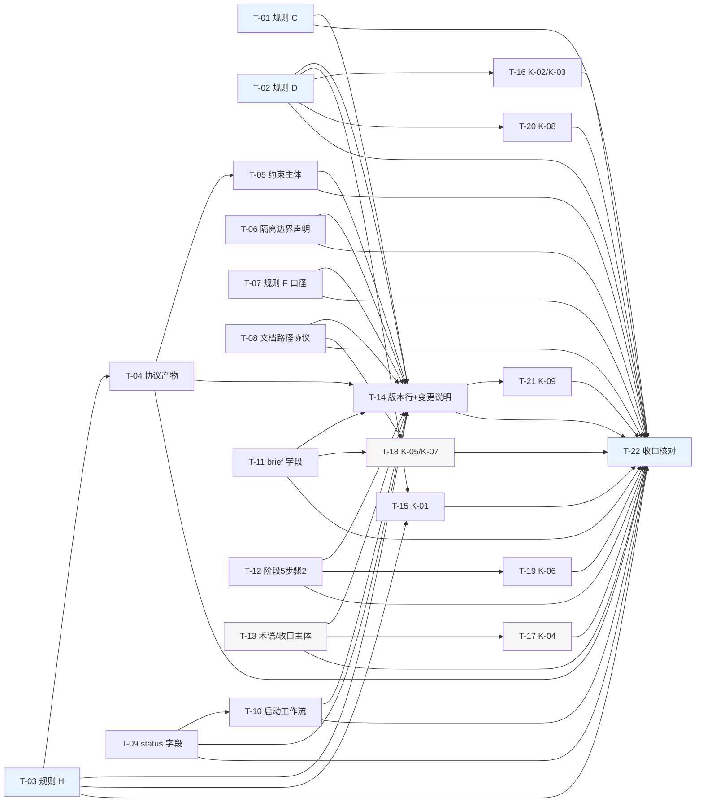

# pr-001-tasks.md — `pr-001-addressing-contract-and-host-skill` 任务图

**产出角色**：planner（任务图构建者）
**上游依据（只读）**：
- 本 PR 文件（**唯一范围依据**）：`docs/iterations/0020-session-workspace-addressing/prs/pr-001-addressing-contract-and-host-skill.md`
- `architecture.md` **v1.1.4**（验收标准的**内容真源**）：§3.1（`N-01`~`N-21`）/ §3.2（`K-01`~`K-10`）/ §3.5（零改动清单）/ §3.6（回归核对组织）/ §4.5 / §5.3 / §5.4 / §5.5 / §7.1 / §7.2 / §8.0~§8.3 / §9.1 / §9.2

**任务总数**：**22**（规范侧 14 + SKILL 侧 7 + 跨文件收口核对 1）

---

## 0. 判定体例（先读）

1. **条目内容不复述**：凡 `architecture.md` v1.1.4 已成段 / 成表的措辞与结构（段序 / 段数 / 编号区间 / 位置口径 / 行号清单），本文件一律只写「见 §X」，**不复述、不自行判定落点**。施工与验收均以 architecture 的对应节为唯一真源。
2. **「可裸判定」的定义**：不依赖判断者主观尺度——即文本存在性、与指定真源逐句 / 逐字对照、`grep` 命中数、`git diff` hunk 归类、逐项对照表。
3. **每条验收标准都带追溯来源**：形如 `（追溯：N-xx；Fxx 验收 y；architecture.md §X）`。**未在 architecture / 本 PR 文件中出现的判据不写**。
4. **检索式纪律**：本文件写出的每条检索式**均已实跑**（基线 = `roles/workflow-pb/workflow-pb.md` v0.9.0 与 `.claude/skills/workflow-pb/SKILL.md` v1.12.0，本 PR 分支切出点）。基线命中 >1 条的检索式，本文件**不依赖唯一命中**，仅作「归零 / 出现」判据或按**节范围收窄**后使用。实测值见 §1。
5. **优先级语义**：只表示建议执行次序，**不是可选项**。P0 = 主链与其余任务的引用前提；P1 = 其余条款落盘；P2 = 术语级与单行级改动（仍属本 PR 验收范围，缺一即对应验收条不通过）。
6. **同文件写序**：T-01~T-14 全部落在 `roles/workflow-pb/workflow-pb.md`，T-15~T-21 全部落在 `.claude/skills/workflow-pb/SKILL.md`。任务图只表达**内容依赖**，不表达写入互斥；实施时同一文件内按任务序号串行写入，避免 hunk 冲突。

---

## 1. 基线与检索式实测（本文件所有检索式的实跑值）

| 检索式（相对本 PR worktree 根） | 基线实测 | 落盘后期望 |
|---|---|---|
| `grep -n 'pwd\|--show-toplevel' roles/workflow-pb/workflow-pb.md` | 4 行（`:163` `:169` `:184` `:327`） | 0 命中 |
| `grep -n 'pwd\|--show-toplevel' .claude/skills/workflow-pb/SKILL.md` | 1 行（`:136`） | 0 命中 |
| `grep -rn '被派发时所在' roles/workflow-pb/workflow-pb.md` | 2 行（`:167` `:200`） | 0 命中 |
| `grep -n '创建命令' roles/workflow-pb/workflow-pb.md` | 1 行（`:179`） | 0 命中 |
| `grep -n 'v0\.9\.0' .claude/skills/workflow-pb/SKILL.md` | 3 行（`:4` `:30` `:60`） | 0 命中 |
| `grep -c '两词同指一个实体' roles/workflow-pb/workflow-pb.md` | 0 | 恰 1（§8.0 的「术语等同声明一次」） |
| `grep -c '相对该会话所在的迭代工作区根目录' roles/workflow-pb/workflow-pb.md` | 1 | 0 |
| `grep -c '流程结构错误中止' roles/workflow-pb/workflow-pb.md` | 0 | ≥1（`N-19` 处） |
| `grep -c '工作区地址' roles/workflow-pb/workflow-pb.md` / `…/SKILL.md` | 0 / 0 | ≥1 / ≥1（本 PR 落点） |
| `grep -c '^#### ' 两文件` | 0 / 0 | 0（体例：不新增子标题） |
| `grep -c '^### 规则 H' roles/workflow-pb/workflow-pb.md` | 0 | 1（节标题） |
| `grep -c '^### 隔离边界声明' roles/workflow-pb/workflow-pb.md` | 1 | 1 |

---

## 2. 任务列表

### T-01 `### 规则 C` 改写与判断方式地址锚定

- **描述**：按 `architecture.md` v1.1.4 §8.1-C 改写 `### 规则 C` 正文与判断方式行；删旧入口绑定句，补「任意位置启动 / 解析并以绝对地址声明 / 会话自建 / 两词等同声明」。**只改这一节**。
- **验收标准**：
  1. 正文四要素齐备且**逐句对照 §8.1-C**：任意位置启动（含仓库主工作区）/ 开工时解析并以绝对地址声明 / 地址不存在时由会话建立（不等候、不请示）/ 两词等同声明。（追溯：`N-02`；F01 验收 3、5；F06；F10 验收 1；architecture.md §8.1-C）
  2. 判断方式行为**地址锚定**形态（`git -C <地址> branch --show-current` + `git worktree list` 含该地址），逐字对照 §8.1-C 末行。（追溯：`N-03`；F06 验收 5；F09 验收 2；§8.1-C）
  3. `grep -c '两词同指一个实体' roles/workflow-pb/workflow-pb.md` = 恰 1（基线 0）。（追溯：§8.0 体例段；T-16 术语取舍）
  4. §7.2 保留面（`P1`~`P5` 中位于本节的既有句）在 `git diff -U0` 中**0 hunk**（保留句逐字清单见 §7.2）。（追溯：F11 验收 2；§7.2）
  5. 本节范围内 `pwd` / `--show-toplevel` **0 命中**（基线本节 `:163` 一行）。（追溯：F09 验收 2；§8.1-C 自查行）
  6. 体例：正文后**紧跟一行** `判断方式：`；本节**不新增** `####` 子标题（文件级 `^#### ` 基线 0）。（追溯：F21 验收 1~2；§8.0）
- **前置依赖**：无
- **优先级**：P0

### T-02 `### 规则 D` 更名与全文重写（含唯一硬停面与硬停输出形态）

- **描述**：按 §8.1-D 更名本节标题（**保留编号 D**）并重写全文：解析链 / 建立（缺省时）/ 建立成功依据 / 唯一硬停面 + 硬停输出形态 / 判断方式。硬停块形态另见 §5.4。
- **验收标准**：
  1. 标题逐字对照 §8.1-D 首行；编号 `D` 保留。（追溯：`N-04`；L1-1 ② 已确认）
  2. 正文五部分齐备且逐字对照 §8.1-D（解析链 / 建立 / 建立成功依据 / 唯一硬停面 + 输出形态 / 判断方式）。（追溯：`N-04`；F09 验收 1、4、5、6；F06 验收 1~4；F12 验收 5）
  3. 硬停块**三行事实陈述**逐字对照 §5.4；块内**无命令块**（`git worktree add` 0 命中）、**无指向人的动作要求**（`请` / `建议你` / `你必须` 0 命中）、**不复用** `⛔ 需要你的决策`（块内 `⛔` 0 命中）。（追溯：F09 验收 4；F12 验收 5；§5.4）
  4. 旧启动门三条判据与旧硬停块**不再存在**：以文本比对确认 §7.1 第 ① / ④ 项所指旧句已删（判据辅助 = 本节 `创建命令` 0 命中、`--show-toplevel` 0 命中）。（追溯：F09 验收 2；F11 验收 1 ①④；§7.1）
  5. 约束主体口径句逐字对照 §8.1-D（阶段 5 子 agent 以**其简报给定的 PR worktree 绝对地址**为准）。（追溯：`N-04`；F14 验收 2）
  6. 体例同 T-01 验收 6。（追溯：F21 验收 1~2；§8.0）
- **前置依赖**：无
- **优先级**：P0

### T-03 新增 `### 规则 H：显式寻址纪律`

- **描述**：按 §8.1-H 新增本节（三句正文 + 紧跟一行 `判断方式：`），位置按 §3.1「新增三节的位置口径（单一真源）」段执行。
- **验收标准**：
  1. 节标题 `grep -c '^### 规则 H' roles/workflow-pb/workflow-pb.md` = 1（基线 0）。（追溯：`N-05`；F02 验收 1~4）
  2. 位置：以 `grep -n '^### ' roles/workflow-pb/workflow-pb.md` 的节标题序列比对 §3.1「新增三节的位置口径（单一真源）」段（**次序与插入窗口以该段为唯一真源，本文件不复述**）。（追溯：`N-05`；§3.1 位置口径段）
  3. 正文逐字对照 §8.1-H，**含**「不主张可以阻止跨工作区写入」一句。（追溯：`N-05`；F02 验收 4；F12 验收 5）
  4. `判断方式：` 行逐字对照 §8.1-H 末行，两条判据可裸判（依赖 cwd 的裸 git 写命令 / 「越界会被拦住」类断言即违反）。（追溯：`N-05`；F20 验收 1、4）
  5. 本节不引入 hook / 守卫 / 检测器 / 工具依赖，不新增 `####`。（追溯：F21 验收 1~3；§8.0）
- **前置依赖**：无
- **优先级**：P0

### T-04 新增 `### 协议产物：工作区间与生效规范`

- **描述**：按 §8.1-A 新增本节（协议先行 / 必覆盖五类信息的模板 / 地址声明三层分工 / 落点语义区分句真源 / 非第二真源 / 紧跟一行 `判断方式：`）。
- **验收标准**：
  1. 节标题恰 1 命中；位置按 §3.1「新增三节的位置口径（单一真源）」段读序核对（**其相对次序以该段为唯一真源**）。（追溯：`N-06`；§3.1 位置口径段）
  2. 正文逐项逐字对照 §8.1-A：五类信息模板 / 三层分工（源·投影 1·投影 2，不一致以源为准）/ 动态地址不得写入产物 / 非第二真源。（追溯：`N-06`；F03 验收 5；F04 验收 1~6；F07 验收 3；F21 验收 5）
  3. 落点语义区分句**真源块**逐字对照 §4.5 的规范侧真源（产物侧只作一行承接，不在本节重复三条完整定义）。（追溯：`N-06`；F05 验收 1~2；§4.5）
  4. `判断方式：` 行逐字对照 §8.1-A 末行，四步判据可裸判（五类信息覆盖 + 无脚本 / 钩子 / 守卫 / 可复制命令块；三处比对一致且产物不随会话变化；每条规范性陈述可回指规范条款；`git ls-files --error-unmatch docs/worktrees/README.md` 成功、`git worktree list` 无 `docs/worktrees/` 前缀项）。（追溯：`N-06`；F03 验收 2；F05 验收 3）
     - **范围注记**：本任务**只判条款文本落盘**（该判据行可读）；其上列命令的**运行结果**（产物存在性）是 `pr-002` 的落地验收面，**本 PR 不判**。
  5. 体例同 T-01 验收 6。（追溯：F21 验收 1~2；§8.0）
- **前置依赖**：T-03
- **优先级**：P1

### T-05 新增 `### 约束主体`

- **描述**：按 §8.1-S 新增本节（「对人」四项零要求段 + 「对会话」三项纪律段 + 紧跟一行 `判断方式：`）。
- **验收标准**：
  1. 节标题恰 1 命中；位置按 §3.1「新增三节的位置口径（单一真源）」段读序核对。（追溯：`N-07`；§3.1 位置口径段）
  2. 正文逐字对照 §8.1-S：对人段四项（无目录要求 / 无前置命令 / 无 `cd` / 无重开会话）逐项存在；对会话段三项（声明地址 / 显式寻址 / 越界须先备份——此处「跨工作区写入禁止」的条款正文与例外集**逐字不动**）逐项存在。（追溯：`N-07`；`N-11`；F19 验收 1~5）
  3. **两段不混写在同一句内**（裸判：两段各自独立成段，且无跨段合句）。（追溯：F19 验收 2；§8.1-S）
  4. `判断方式：` 行逐字对照 §8.1-S 末行，指向**事后核查**而非阻止（行内不出现「会被阻止」类断言）。（追溯：F19 验收 4；F12 验收 5）
  5. 体例同 T-01 验收 6。（追溯：F21 验收 1~2；§8.0）
- **前置依赖**：T-04
- **优先级**：P1

### T-06 `### 隔离边界声明` 三段补写（且既有语只增不改）

- **描述**：按 §8.1-G 三段补写：①「不覆盖」清单追加 cwd 一条；②「已知代价」段追加越界写入（含 4 步核查判据，另见 §5.5）；③ 章节末尾追加**章节级** `判断方式：`。**既有结论与既有语逐字不动**。
- **验收标准**：
  1. 三段补写逐项逐字对照 §8.1-G。（追溯：`N-08` / `N-09` / `N-10`；F12 验收 1~4、6；F17 验收 1~3）
  2. **只增不改**：`git diff -U0 <base>..HEAD -- roles/workflow-pb/workflow-pb.md` 中本节范围内**无删除行 / 无修改行**（仅 `+` 行）；「既有四类结论与既有语逐字不动」的权威表述见 §9.1-E10 与 §8.1-G（本文件不复述清单）。（追溯：F17 验收 4；§9.1-E10；§8.1-G）
  3. `config / hooks / remotes` 一行（`N-21`）在 diff 中 **0 hunk**。（追溯：`N-21`；F21 验收 1；F13 验收 3）
  4. 章节级 `判断方式：` 覆盖四类结论——逐条对照 §8.1-G 末段四项；与子项判断方式行**并列不互替**。（追溯：`N-10`；F17 验收 1~3；§11-T-11）
  5. 本节既有子项判断方式行 0 hunk。（追溯：§9.2-D-1 的「不改本节既有结论句与子项判断方式」；§3.5）
- **前置依赖**：无
- **优先级**：P1

### T-07 `### 规则 F` 判断方式主体口径

- **描述**：按 §3.1-`N-11` 改写规则 F 判断方式行的主体口径（改为以**简报给定的 PR worktree 绝对地址**为准）。**规则 F 正文与闭集例外两项逐字不动**。
- **验收标准**：
  1. 改写形态逐字对照 §3.1-`N-11`（本文件不复述新旧句）。（追溯：`N-11`；F14 验收 2；F02 验收 2）
  2. 规则 F **判断方式行内** `被派发时所在` **0 命中**（基线：全文件 2 行，其一在本行）。（追溯：F14 验收 2）
  3. 规则 F 正文（含闭集例外两项）在 diff 中 **0 hunk**（清单见 §7.2-`P6`）。（追溯：F13 验收 3；F11 验收 2；§7.2-`P6`）
- **前置依赖**：无
- **优先级**：P1

### T-08 `## 文档路径协议` 基准句改写

- **描述**：按 §8.1-I 把基准句改为以「该会话**声明的工作区地址**」为判读基准。
- **验收标准**：
  1. 改写后的基准句逐字对照 §8.1-I（本文件不复述原文）。（追溯：`N-12`；F08 验收 4）
  2. `grep -n '相对该会话' roles/workflow-pb/workflow-pb.md` 的基线命中（1 行）在落盘后 **0 命中**。（追溯：F08 验收 4；本 PR 验收「文档路径协议基准句」判据 ①）
  3. 该节**其余句**（产物落点目录约定与目录树）在 diff 中 **0 hunk**。（追溯：本 PR 验收「文档路径协议基准句」判据 ②；§3.5）
- **前置依赖**：无
- **优先级**：P1

### T-09 `status.md` 格式块新增 `**工作区地址**` 字段

- **描述**：按 §8.1-J 在 `status.md` 格式块的对应字段行之后插入 `**工作区地址**` 字段（投影 1，迭代级）。**字段写入时点在 T-10，不在本任务**。
- **验收标准**：
  1. 字段行逐字对照 §8.1-J；插入位置逐字对照 §8.1-J 与 §5.3 的「投影 1」行。（追溯：`N-13`①；F07 验收 1；§5.3）
  2. 字段行位于 `## 状态追踪协议（status.md）` 的格式块**内**（**位置以 §8.1-J 为准，本文件不自行判定落点**）。（追溯：本 PR 验收「status.md 字段与写入时点」判据 ①）
  3. 状态符号与槛位状态取值定义在 diff 中 **0 hunk**（区间见 §3.5）。（追溯：F13 验收 4；§3.5）
  4. 该节其余字段行 0 hunk。（追溯：本 PR 验收「status.md 字段与写入时点」判据 ④）
- **前置依赖**：无
- **优先级**：P1

### T-10 `### 启动工作流` 首段 + 步骤 2 + 第 4.5 步

- **描述**：按 §8.1-M 改写首段（删启动校验、产物路径以声明地址为根）与第 4.5 步（只写 `**迭代分支**` 字段）；按 §8.1-M 的步骤 2 块补写 `**工作区地址**` 的写入时点。
- **验收标准**：
  1. 首段逐字对照 §8.1-M 首段块（产物路径以该会话声明的工作区地址为根 / 不校验启动位置 / 不新增步骤号）。（追溯：`N-17`；`N-13`②；F09 验收 6；F08 验收 4）
  2. 步骤 2 逐字对照 §8.1-M 步骤 2 块（写入 `**工作区地址**`，取值 = 开工时按「规则 D」解析并声明的地址，简报显式覆盖值优先）。（追溯：`N-13`②；F07 验收 1；F08 验收 1；F20 验收 3）
  3. 第 4.5 步逐字对照 §8.1-M 的 4.5 块，并**与 §3.1-`N-18` 的行文逐字一致**（D-4 闭合判据）：只写 `**迭代分支**` 字段、不执行 `git branch` / `git checkout`、**不写 `**工作区地址**`**。（追溯：`N-18`；§3.1-`N-18`；§12「D-4 已闭合」行）
  4. 步骤号体系与触发时机不变（1~5 + 4.5；判据 = diff 中不出现新增 / 删除步骤号行）。（追溯：`N-17`；F13 验收 4；§3.5）
  5. 本节范围内 `pwd` / `--show-toplevel` **0 命中**（基线本节 `:327` 一行）。（追溯：F09 验收 2、6）
- **前置依赖**：T-09（字段名逐字一致 + 写入时点分工的交叉核对）
- **优先级**：P1

### T-11 `### 派发执行角色时的 brief 构建`：字段块新增两行 + 恢复派发句

- **描述**：按 §8.1-K 在字段块 `工作流规范：` 行之后插入 `工作区地址：` 与 `检测项：` 两行，并在该节末尾追加恢复派发句。
- **验收标准**：
  1. 两行逐字对照 §8.1-K（位置口径以 §5.3 的「投影 2」行为准；本文件不自行判定落点）。（追溯：`N-14`；F08 验收 1~2；F14 验收 1；F20 验收 1；§5.3）
  2. 检测项行的内容与 §5.5「检测挂现场」行逐字一致（写入以「工作区地址」为根、绝对路径、git 写操作用 `git -C <工作区地址>`）。（追溯：`N-14`；F20 验收 1；§5.5）
  3. 恢复派发句逐字对照 §8.1-K 末块，含「覆盖既有前置」与「**被恢复迭代的既有文本不改写**」两项。（追溯：`N-15`；F16 验收 3、5）
  4. 该节**其余字段行**在 diff 中 0 hunk。（追溯：本 PR 验收「brief 字段块新增行 + 恢复派发句」判据 ③）
- **前置依赖**：无
- **优先级**：P1

### T-12 `### 阶段 5` 步骤 2 改写

- **描述**：按 §8.1-L 把步骤 2 的「在该会话工作区内执行」改为以 PR worktree 的**绝对地址** + `git -C <地址>` 表述。
- **验收标准**：
  1. 改写句逐字对照 §8.1-L（本文件不复述新旧句）。（追溯：`N-16`；F14 验收 3）
  2. 落点 / 分支名 / base / 解锁判据 / 并发槛位算法在 diff 中 0 hunk（算法区间见 §3.5）。（追溯：F13 验收 4；§3.5）
  3. 本步骤引用的地址来源与 §8.1-K 的简报字段名一致（`工作区地址`）。（追溯：`N-16`；§8.1-K）
- **前置依赖**：无
- **优先级**：P1

### T-13 术语口径（`N-19`）与收口主体限定（`N-20`）

- **描述**：按 §8.1-N 改写 `### 阶段回退` 内的唯一例外句术语（与工作区就绪性硬停、用户决策点暂停三类并列）；按 §3.1-`N-20` 限定 `### 迭代分支合并进 main` 前置动作的主体。
- **验收标准**：
  1. 术语句逐字对照 §8.1-N；`grep -c '流程结构错误中止' roles/workflow-pb/workflow-pb.md` ≥ 1（基线 0）。落点以 §3.1-`N-19` 与 §8.1-N 为准（**本文件不自行判定落点**）。（追溯：`N-19`；F09 验收 1；F13 验收 7；§2.8）
  2. `### 需要用户决策的情况` 五类触发条件与 `⛔ 需要你的决策` 形态在 diff 中 **0 hunk**。（追溯：`N-19`；F13 验收 7；§2.8）
  3. 收口前置动作改写形态逐字对照 §3.1-`N-20`（主体 = 该迭代的工作区、命令形态含该迭代的工作区地址）。（追溯：`N-20`；F15 验收 2 的 E8 改写）
  4. `### 迭代分支合并进 main` 的三步动作顺序、触发时机与 commit message 格式在 diff 中 0 hunk。（追溯：`N-20`；§7.2-`P6`）
- **前置依赖**：无
- **优先级**：P2

### T-14 头部版本行 + 新增 `## v0.10.0 变更说明（相对 v0.9.0）`

- **描述**：把规范头部版本行置为 v0.10.0；新增 v0.10.0 变更说明节，段构成按 §8.3 表 A 执行（含被取代清单 + 保留清单 + 备案段）。
- **验收标准**：
  1. 头部版本行读作 `**版本**: 0.10.0`。（追溯：本 PR 验收「版本与变更说明」判据 ①；F15）
  2. `## v0.10.0 变更说明（相对 v0.9.0）` 节存在，且**段构成与 §8.3 表 A 逐段一致**（段序 / 段数以表 A 为唯一权威，本文件不复述）。（追溯：`N-01`；F11；F15；§8.3 表 A）
  3. 段③ 与 §7.1（被取代逐句）、§7.2（保留 `P1`~`P6`）**逐条对照成立**（句级引用，不用行号）。（追溯：`N-01`；F11 验收 1~3；§7.1 / §7.2）
  4. 段⑥ 备案含三项登记（0018 活指令失效登记 / 0019 E 三分类中「新增两条」的登记 / D-7 留痕指引），内容同 §9.1 与 §9.2；**不出现「0018 需回改」**。（追溯：`N-01`；F15 验收 1~3；F16 验收 2~3；§9.1；§9.2）
  5. 段② 含 §8.3 表 A 段② 判据列出的三条一手反证。（追溯：`N-01`；§8.3 表 A）
  6. v0.2.0~v0.9.0 既有变更说明在 diff 中 0 hunk。（追溯：§3.5；F13 验收 6）
  7. 全文读不出「规则 C / 规则 D 整条废止」（§7.2 末段的语义边界）。（追溯：F11 验收 3；§7.2 末段）
- **前置依赖**：T-01、T-02、T-03、T-04、T-05、T-06、T-07、T-08、T-09、T-10、T-11、T-12、T-13
- **优先级**：P1

### T-15 `K-01`（`:44` CRITICAL）语义换向

- **描述**：按 §8.2-`K-01` 改写该条 CRITICAL 行（槽位保留、语义换向）。
- **验收标准**：
  1. 改写后逐字对照 §8.2-`K-01`（解析并声明 + 显式寻址 + 唯一硬停三行事实陈述）。（追溯：`K-01`；F01；F02；F09；F19）
  2. 槽位保留：`SKILL.md` 其余 9 条 CRITICAL 在 diff 中 0 hunk（清单见 §3.5）。（追溯：F13 验收 7；§3.5）
  3. 该行内 `--show-toplevel` / `pwd` **0 命中**（基线下该行位于全文件仅 1 行命中的 `:136` 之外，此处判据为**本行自身**0 命中）。（追溯：F09 验收 2）
  4. 该行引用的规范节名与规范侧实际节名一致（`§规则 D` / `§规则 H`）。（追溯：`K-01`；T-02 / T-03）
- **前置依赖**：T-02、T-03
- **优先级**：P1

### T-16 `K-02`（Step 0 第 1 步）与 `K-03`（Tools 第一项）改写

- **描述**：按 §8.2-`K-02` 改写 Step 0 第 1 步为「工作区地址解析与声明」；按 §8.2-`K-03` 改写 `## Tools and capability boundaries` 第一项。
- **验收标准**：
  1. 两处改写逐字对照 §8.2-`K-02` / §8.2-`K-03`。（追溯：`K-02`；`K-03`；F01；F06；F09）
  2. Step 0 第 2~4 步在 diff 中 0 hunk（保留面见 §2.7 行 4）。（追溯：`K-10`；§3.5）
  3. `## Tools and capability boundaries` 其余项 0 hunk；Step 0 与 Tools 范围内 `--show-toplevel` / `pwd` 0 命中（基线：全文件 1 行，在 Step 0 第 1 步内）。（追溯：F09 验收 2）
  4. 两处均以「解析并声明工作区地址」为主体并引用规范 §规则 D。（追溯：`K-02`；`K-03`）
- **前置依赖**：T-02
- **优先级**：P1

### T-17 `K-04`（`:125`）术语口径改写

- **描述**：按 §8.2-`K-04` 把该条 «Important facts» 的流程结构错误类表述改为「流程结构错误」。
- **验收标准**：
  1. 改写后逐字对照 §8.2-`K-04`。（追溯：`K-04`；F09；F13）
  2. `grep -c '流程结构错误' .claude/skills/workflow-pb/SKILL.md` ≥ 1（基线 0）。（追溯：`K-04`）
  3. 与 T-13 的规范侧术语**同名且不冲突**（两侧对同一机制的称法一致）。（追溯：`K-04`；`N-19`；§2.8）
  4. «Important facts» 其余 8 条 0 hunk。（追溯：`K-10`；§3.2；§3.5）
- **前置依赖**：T-13
- **优先级**：P2

### T-18 `K-05`（Brief 构建规则新增行）与 `K-07`（§文档协议新增行）

- **描述**：按 §8.2-`K-05` 在 Brief 构建规则字段块新增一行；按 §8.2-`K-07` 在 §文档协议新增一行引用。
- **验收标准**：
  1. `K-05` 新增行逐字对照 §8.2-`K-05`，且与规范侧 §8.1-K 的对应行**逐字同构**。（追溯：`K-05`；`N-14`；F08；F14；F20）
  2. `K-07` 新增行逐字对照 §8.2-`K-07`，为**单行引用**（不重复规范侧基准措辞）。（追溯：`K-07`；`N-12`；F08 验收 4）
  3. 两处所在节的其余内容 0 hunk（保留面见 §3.2-`K-10`）。（追溯：`K-10`；§3.5）
- **前置依赖**：T-11、T-08
- **优先级**：P2

### T-19 `K-06`（Step 5 步骤 2）改写

- **描述**：按 §8.2-`K-06` 把 PR worktree 落点表述改为「该 PR worktree 的绝对地址（按简报「工作区地址」字段解析，以 `git -C` 创建）」。
- **验收标准**：
  1. 改写句逐字对照 §8.2-`K-06`。（追溯：`K-06`；F14）
  2. 子层与分支命名、base 在 diff 中 0 hunk。（追溯：`K-06`；F13 验收 4）
  3. 与规范侧 §8.1-L 表述同一事实、无冲突（绝对地址 + `git -C <地址>`）。（追溯：`K-06`；`N-16`）
- **前置依赖**：T-12
- **优先级**：P1

### T-20 `K-08`（Safety）改写 2 条 + 新增 1 条

- **描述**：按 §8.2-`K-08` 改写原启动校验条、新增「不得表述为越界会被阻止」条；旧「派发子 agent 前…」条保留。
- **验收标准**：
  1. 改写条与新增条逐字对照 §8.2-`K-08`（本文件不复述）。（追溯：`K-08`；F02；F09；F12；F19）
  2. 新增条含「跨工作区写入不可被 git 强制、只能事后核查」语义，且引用的规范节名与 T-02 / T-06 落地后的节名一致。（追溯：`K-08`；§8.1-H；§8.1-G）
  3. 旧「派发子 agent 前…」条在 diff 中 0 hunk；Safety 其余条 0 hunk（清单见 §3.5）。（追溯：`K-08`；§3.5）
- **前置依赖**：T-02
- **优先级**：P1

### T-21 `K-09` 三处版本引用

- **描述**：按 §8.2-`K-09` 改写 `SKILL.md` 内三处版本引用（归本 PR）。**本任务不含** ②③ 面（新建 `data/skill-optimization-v1.13.0.md`、两侧 `memory.md` 索引行 → 归 `pr-003` / `O-04`）。
- **验收标准**：
  1. 三处改写逐字对照 §8.2-`K-09`；`**版本**` 行读作 §8.2-`K-09` 给出的形态。（追溯：`K-09`；F15）
  2. `grep -n 'v0\.9\.0' .claude/skills/workflow-pb/SKILL.md` **0 命中**（基线实测 3 行：`:4` / `:30` / `:60`）。（追溯：`K-09`；F15；F18；本 PR 验收「版本一致性可裸判定」）
  3. 版本号与 T-14 落地的规范版本行一致（`1.13.0` ↔ 规范 `0.10.0`）。（追溯：`K-09`；F15）
  4. 跨 PR 归属：逐 hunk 归类时 `K-09` 按 §8.2-`K-09` 末段的拆分说明处理，**不视为「无法归类的 hunk」**。（追溯：`K-09`；`O-04`；Gate r2 D-8 承接说明）
- **前置依赖**：T-14
- **优先级**：P1

### T-22 跨文件收口核对（改动面 / 检索式 / 体例 / 逐 hunk 归类）

- **描述**：在全部条款落盘后做一次收口核对，输出可复核的归类记录；核对步骤形态按 §3.6。本任务**只核对与记录**，发现缺口则回对应任务修复（不回改上游产物）。
- **验收标准**：
  1. 改动面：`git -C <本 PR worktree> diff --name-only <base>..HEAD` **恰含** `roles/workflow-pb/workflow-pb.md` 与 `.claude/skills/workflow-pb/SKILL.md` 两个文件；`<base>` = 本 PR 分支自 `iteration/0020-session-workspace-addressing` 切出时刻的 tip。（追溯：F13 验收 1；本 PR 验收「零改动面核对」）
  2. 逐 hunk 可归类到 `N-01`~`N-21` / `K-01`~`K-09`，**无无法归类的 hunk**（归类判据见 §3.6；`K-09` 按 §8.2-`K-09` 末段拆分）。（追溯：F13 验收 3；§3.6）
  3. §3.5 零改动清单逐项 0 hunk（逐项内容与清单以 §3.5 为唯一真源，本文件不复述）；含 `K-10` 保留面与 `SKILL.md` 其余 9 条 CRITICAL。（追溯：F13 验收 3、5、7；§3.5）
  4. 检索式判据：`grep -n 'pwd\|--show-toplevel'` 两文件 **0 命中**；`grep -rn '被派发时所在'` 两文件 **0 命中**；`grep -n 'v0\.9\.0' .claude/skills/workflow-pb/SKILL.md` **0 命中**。（基线实测值见 §1）（追溯：F09 验收 2；F14 验收 2；F15）
  5. 版本行：规范读作 `0.10.0`；`SKILL.md` 读作 `1.13.0（对应规范 workflow-pb v0.10.0）`。（追溯：F15；`K-09`）
  6. 形态约束：diff 中**无**含 `^#### ` 的新增行；本 PR 新增 / 改写的**每一条**条款后紧跟一行 `判断方式：`；diff 文件清单不含任何 `.sh` 或可执行脚本；不引入 hook / 守卫 / 强制检测器 / 启动前准入门 / 工具依赖。（追溯：F21 验收 1~4；F17 验收 4；F15 验收 2、5）
  7. `### 约束生效范围` 句逐字未改，且全部新条款追加在其之前。（追溯：F13 验收 6；`N-01` 段⑤；§8.3 表 A 段⑤）
  8. 核对记录使用的基线**不是**迭代级绝对基线 `main @ dbc99b5`（该基线只作 §3.6 的迭代级回归对照，不作本 PR 判据）。（追溯：本 PR 验收「零改动面核对」的基线口径）
- **前置依赖**：T-01 ~ T-21（全部）
- **优先级**：P0

---

## 3. 依赖图摘要

- **依赖总数**：46 条边；**无环**（拓扑序 = T-01/T-02/T-03 → T-04 → T-05；其余规范侧任务同层；→ T-14 → T-21；SKILL 侧 → …；→ T-22 收口）。
- **最长链（按边数，5 条边 / 6 个任务）**：`T-03 → T-04 → T-05 → T-14 → T-21 → T-22`（机检方式与输出见 §8）。
- **临界路径的瓶颈**：`T-14`（`N-01` 变更说明）需全部规范侧条款落盘后才能与「实际落地条款 / 保留面 / 备案」逐条一致；`T-22` 需全部任务。
- **可立即并行开工**：T-01 / T-02 / T-03 / T-06 / T-07 / T-08 / T-09 / T-11 / T-12 / T-13（彼此无内容依赖；但同文件写入按 §0 第 6 条串行）。
- **跨文件引用前提链**：T-02 / T-03（规范侧节与更名）→ T-15 / T-16 / T-20（SKILL 侧引用不悬空）；T-13 → T-17（术语同名）；T-12 → T-19（同一事实表述）。

---

## 4. 覆盖对照（本 PR 范围 → 任务，逐项可核对）

| 本 PR 声明的范围 / 验收项 | 任务 |
|---|---|
| `N-01`（版本与变更说明；F11 / F15 / F16） | T-14 |
| `N-02` / `N-03`（规则 C 与判断方式；F01 / F06 / F07 / F10） | T-01 |
| `N-04`（规则 D 更名 + 全文 + 硬停形态；F01 / F06 / F09 / F12 / F20） | T-02 |
| `N-05`（规则 H；F02 / F20） | T-03 |
| `N-06`（协议产物节；F03 / F04 / F05 / F21） | T-04 |
| `N-07`（约束主体节；F19） | T-05 |
| `N-08` / `N-09` / `N-10`（隔离边界声明三段补写；F12 / F17） | T-06 |
| `N-11`（规则 F 判断方式主体口径；F14） | T-07 |
| `N-12`（文档路径协议基准句；F08 验收 4） | T-08 |
| `N-13`①（`status.md` 字段；F07 / F08 / F20） | T-09 |
| `N-13`② / `N-17` / `N-18`（启动工作流首段 / 步骤 2 / 4.5；F01 / F08 / F09 / F13） | T-10 |
| `N-14` / `N-15`（brief 字段两行 + 恢复派发句；F08 / F14 / F16 / F20） | T-11 |
| `N-16`（阶段 5 步骤 2；F14 / F13） | T-12 |
| `N-19`（术语口径；F09 验收 1 / F13 验收 7） | T-13 |
| `N-20`（收口主体限定；F15 验收 2 的 E8 改写） | T-13 |
| `N-21`（保留项；F21 验收 1 / F13） | T-06（验收 3） |
| `K-01`（F01 / F02 / F09 / F19） | T-15 |
| `K-02` / `K-03`（F01 / F06 / F09） | T-16 |
| `K-04`（F09 / F13） | T-17 |
| `K-05`（F08 / F14 / F20） | T-18 |
| `K-06`（F14） | T-19 |
| `K-07`（F08） | T-18 |
| `K-08`（F02 / F09 / F12 / F19） | T-20 |
| `K-09`①（三处版本引用；F15） | T-21 |
| `K-09` ②③（新建 `skill-optimization-v1.13.0.md` + 两侧 `memory.md` 索引行） | **不在本 PR**（归 `pr-003` / `O-04`） |
| `K-10`（保留面，F13） | T-22（验收 3）逐项 0 hunk |
| 零改动面核对（F13 验收 1~7） | T-22 |
| 形态约束（F21 验收 1~4 / F17 验收 4 / F15 验收 2、5） | T-22 + 各任务验收中的体例条 |
| 检索式判据（F09 验收 2 / F14 验收 2 / F15） | T-22（验收 4、5） |

**文件范围 → 任务（逐文件可核对）**
- `roles/workflow-pb/workflow-pb.md`：T-01、T-02、T-03、T-04、T-05、T-06、T-07、T-08、T-09、T-10、T-11、T-12、T-13、T-14（14 个任务，覆盖 `N-01`~`N-21`）。
- `.claude/skills/workflow-pb/SKILL.md`：T-15、T-16、T-17、T-18、T-19、T-20、T-21（7 个任务，覆盖 `K-01`~`K-09`）。
- 跨两文件的收口核对：T-22。
- **本 PR 无第三文件面**：本 PR 的 `不涉及` 清单（逐项内容见 architecture.md v1.1.4 §3.5）在 T-22 验收 3 中逐项 0 hunk 核对。

---

## 5. `[model_inferred]` 清单

| # | 内容 | 依据 / 需主 agent 确认的点 |
|---|---|---|
| MI-01 | **T-01 验收 3 的检索式**「`grep -c '两词同指一个实体'` 恰 1 命中」由 `§8.0` 的「术语等同声明（**一次**，写在规则 C 改写段）」推出，architecture 未给出该检索式本身。 | 若施工时措辞微调导致该串不出现，判据应改为「术语等同声明在文件中恰 1 处」的语义判定。 |
| MI-02 | **T-14 的前置依赖边**（`N-01` 依赖全部规范侧条款任务）由 `§8.3` 表 A 段③/④/⑥ 的「与落地条款 / 保留面 / 备案逐条一致」判据推出；architecture 未给出任务级顺序。 | 若主 agent 认为变更说明可先写（内容全部由 §7 / §8.3 / §9 决定），可删该边以提前 T-14。 |
| MI-03 | **T-21 依赖 T-14**（`SKILL.md` 版本行指向规范版本号）由「版本一致性可裸判定」验收条推出（两侧版本号须互相一致）。 | 同上：若版本行由同一任务落盘，可删该边。 |
| MI-04 | **T-15 / T-16 / T-20 依赖规范侧任务**（引用不悬空）取自本 PR 文件 `depends_on` 说明中「SKILL 改写后的文本直接引用规范新增章节名（`§规则 H`）与更名后的 `§规则 D`，先落地的一侧必然留下悬空引用」的论证；architecture 未给出任务级边。 | 属跨文件同 PR 的内部排序，不改变 PR 划分。 |
| MI-05 | **T-04 验收 4 的范围注记**（产物存在性类命令的运行结果归 `pr-002`，本 PR 只判条款文本落盘）：由本 PR `depends_on` 说明①（产物的**存在性**由本 PR 声明、`docs/worktrees/README.md` 本体归 `pr-002`）推出。 | 若主 agent 认为该命令应在 pr-001 验收时实跑，需先合并 pr-002——那将构成未声明的外部条件，与本 PR 的「独立性读法」注记相抵，故本文件按「不判运行结果」处理。 |
| MI-06 | **T-22 验收 6 的两条判据**（diff 中无 `^#### ` 新增行；新增条款与其 `判断方式：` 行一一对应）是把 §8.0 体例要求转成裸判据的机械形式。 | 若施工采用等价措辞导致对应关系需人工读判，以逐条对照 §8.0 为准。 |
| MI-07 | **`####` 计数作为体例判据**：基线两文件均为 0（实测），故判据取「不出现新增 `^#### ` 行」。 | 无 |

---

## 6. 循环依赖上报

**无**。46 条依赖边经拓扑排序验证无环（最长链见 §3）。

---

## 7. 疑问 / 越界声明

1. **`N-01` 未单列「头部版本行」条目**：`architecture.md` §3.1-`N-01` 的语义列只写「新增变更说明节」，规范头部版本行（当前 `**版本**: 0.9.0`）由本 PR 的验收条「版本与变更说明（`N-01`）」判据 ① 承载（读作 `**版本**: 0.10.0`）。本文件按 **T-14 一并承载**处理，**不新增架构未覆盖的决策**；若主 agent 认为需独立编号，请在派发前说明。
2. **未自行判定任何落点**：三个新增节的插入次序与窗口、`status.md` / brief 字段的插入位置、变更说明的段构成、硬停输出形态，**全部以 architecture 对应节（§3.1 位置口径段 / §8.1-A·D·H·J·K·S / §8.3 表 A / §5.4）为唯一真源**；本文件只给「读序 / 逐字对照 / hunk 归类」的可裸判定形式。
3. **未修改任何上游产物**：本任务只新增 `prs/pr-001-tasks.md` 一个文件；`prs/pr-*.md`、`architecture.md`、`prd/*.md`、规范 / SKILL / 脚本 / 代码 / `.gitignore` 零改动；未执行 git 写命令；未跑测试。

---

## 8. 机检记录（依赖图自证）

对 §3 的 mermaid 边集做解析（`-->` 链按逐段拆边）后机检，结果如下：

| 检查 | 结果 |
|---|---|
| 节点 / 边计数 | 22 节点 / **46 边** |
| §2 各任务的「前置依赖」字段 ↔ 边集一致性 | **22/22 逐条一致**（0 处不一致） |
| 拓扑排序（Kahn） | 覆盖全部 22 节点 ⇒ **无环** |
| 入度 0（可立即开工） | T-01、T-02、T-03、T-06、T-07、T-08、T-09、T-11、T-12、T-13 |
| 最长路（按边数） | **5 条边 / 6 个任务**：`T-03 → T-04 → T-05 → T-14 → T-21 → T-22` |
