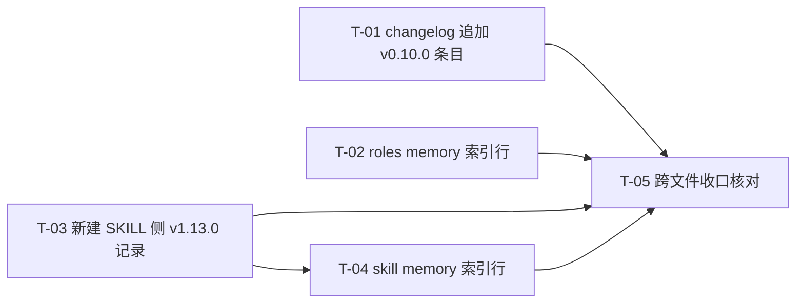

# pr-003 任务图（v0.10.0 / v1.13.0 双侧惯例留痕）

**产出角色**：planner（任务图构建者）
**来源 PR（唯一范围依据）**：`prs/pr-003-version-records-and-d7-trace.md`（`batch` = 1；`depends_on` = `pr-001` + `pr-004`，**两者均已合并**）
**架构依据**：`docs/iterations/0020-session-workspace-addressing/architecture.md` **v1.1.4** —— §3.4（`O-01` / `O-02` / `O-04`，及 `O-03` 只作只读对照）、§3.4 末注（D-7 实测如实报告）、§3.5（零改动清单）、§3.6（回归核对组织形态）、§7.1 / §7.2、§8.2-`K-09`、§8.3（表 A / 表 B / 「其余落点」表及其后的段序依据行）、§9.1、§9.2
**功能卡**：`prd/F11-explicit-supersede-declaration.md` / `F15-0019-e-items-carryover.md` / `F16-0018-live-instruction-invalidation.md` / `F18-d7-reference-correction.md`
**改动文件面**：**4**（changelog 追加 / `roles/workflow-pb/memory.md` 追加索引行 / SKILL 侧新记录新建 / SKILL 侧 `memory.md` 追加索引行）

**任务总数**：**5**（实现 4 + 跨文件收口核对 1）

---

## 0. 判定体例（先读）

1. **条目内容不复述**：凡 `architecture.md` v1.1.4 已成段 / 成表的措辞与结构（§8.3 表 A / 表 B 的**段名 / 段序 / 段数**、§3.x 与 §7.x 与 §9.x 的**编号区间与条目清单**、「其余落点」表的**位置口径**），本文件一律只写「见 §X」，**不复述、不自行判定落点**；施工与验收均以 architecture 的对应节为唯一真源。
2. **「可裸判定」的定义**：不依赖判断者主观尺度 —— 即文本存在性、与指定真源逐字 / 逐段 / 逐行对照、`grep` 命中数、`git diff` hunk 数与 numstat、`test -f` 存在性。
3. **每条验收标准都带追溯来源**：形如 `（追溯：§X；Fxx 验收 y；pr-003 验收第 z 条）`。**未在 architecture v1.1.4 或本 PR 文件中出现的判据不写**。
4. **检索式纪律**：本文件写出的每条检索式**均已实跑**（基线 = 本 PR worktree @ `6a99505`，即 `pr-001` 与 `pr-004` 均已合并后的状态；实测值见 §1）。凡要求**唯一命中**的检索式，均在 §1 给出实测命中数。
5. **优先级语义**：只表示建议执行次序，**不是可选项**。P0 = 承载本 PR 实质留痕面的主产物（缺一即对应验收条不通过）；P1 = 索引行；P2 = 跨文件收口核对。
6. **「既有内容逐字不动（diff 仅新增）」判据体例**：一律用 `git diff -U0 -- <file>`（hunk 数 + hunk 内仅 `+` 行）与 `git diff --numstat -- <file>`（第二列 = 删除行数，须为 **0**）双判据，不依赖"看起来没动"。

---

## 1. 基线与检索式实测（基线 = 本 PR worktree 根 @ `6a99505`）

| # | 检索式（相对本 PR worktree 根） | 基线实测 | 落盘后期望 |
|---|---|---|---|
| 1 | `grep -n '^## v0\.10\.0（2026-09-12）' roles/workflow-pb/data/workflow-pb-changelog.md` | 0（`grep -c 'v0\.10\.0'` = 0） | 恰 1 |
| 2 | `grep -n '^## v0\.9\.0（2026-09-12）' roles/workflow-pb/data/workflow-pb-changelog.md` | 1（`:3`） | 1（新增条目在其之上） |
| 3 | `grep -n '^- \*\*v0\.9\.0（2026-09-12）\*\*' roles/workflow-pb/memory.md` | 1（`:8`） | 1（锚点仍在，新行紧邻其前） |
| 4 | `grep -c 'v0\.10\.0' roles/workflow-pb/memory.md` | 0 | ≥ 1 |
| 5 | `sed -n '1p' roles/workflow-pb/memory.md` | `---`（frontmatter 首行） | 不变（文件头不被占用） |
| 6 | `grep -n '^- \[v1\.12\.0 优化记录\]' .claude/skills/workflow-pb/memory.md` | 1（`:5`） | 1（锚点仍在，新行紧邻其前） |
| 7 | `grep -c 'v1\.13\.0' .claude/skills/workflow-pb/memory.md` | 0 | ≥ 1 |
| 8 | `sed -n '1p;3p' .claude/skills/workflow-pb/memory.md` | `# workflow-pb skill 记录索引` / `> 每行对应 \`data/\` 下的一条原始凭证。` | 不变（文件头与前两行不被占用） |
| 9 | `grep -n '1\.13\.0' .claude/skills/workflow-pb/SKILL.md` | 1（`:30` = 版本行） | 1（版本对基准不变；本 PR 对该文件 0 hunk） |
| 10 | `test -f .claude/skills/workflow-pb/data/skill-optimization-v1.13.0.md` | 不存在 | 存在（T-03 产物） |
| 11 | `grep -n '8\.4' .claude/skills/workflow-pb/data/skill-optimization-v1.12.0.md` | 恰 2 行（`:13` / `:40`；两处均已为 `architecture.md §8.4` 形态 = `pr-004` 已落地） | 仍恰 2 行（本 PR 对该文件 0 hunk） |
| 12 | `grep -c 'architecture\.md[^0-9]*§8\.4' .claude/skills/workflow-pb/data/skill-optimization-v1.12.0.md` | 2 | 2（T-03「更正登记」段所述「改成什么」的核对基准） |
| 13 | `sed -n '1p' .claude/skills/workflow-pb/data/skill-optimization-v1.12.0.md` | `# SKILL.md v1.12.0 优化记录（对应规范 workflow-pb v0.9.0）` | 不变（同目录先例记录的自身首行体例 = T-03 首行的形态先例） |
| 14 | `grep -c '^### 规则' roles/workflow-pb/data/workflow-pb-changelog.md` | 0 | 0（T-01 验收 9 的形态判据） |
| 15 | `grep -n '判断方式' roles/workflow-pb/data/workflow-pb-changelog.md` | 2 行（`:23` / `:49`，均为既有条目内的**引述性**出现） | 新增 hunk 内 **0** 行以 `判断方式：` 起首（既有 2 行不动） |

> **基线说明**：`#1`、`#4`、`#7`、`#10` 是本 PR 的「落盘前 = 0 / 不存在」判据；`#2`、`#3`、`#6` 是**落点锚点**（唯一命中），落点结论以 §3.4-`O-02`、§8.3「其余落点」表的权威表述为准，本文件不自行判定落点。

---

## 2. 任务列表

### T-01 `roles/workflow-pb/data/workflow-pb-changelog.md` 追加 v0.10.0 条目

- **目标文件**：`roles/workflow-pb/data/workflow-pb-changelog.md`（**仅这一个文件**）
- **描述**：按 `architecture.md` v1.1.4 §8.3 表 B 追加 `## v0.10.0（2026-09-12）` 条目 —— **段构成与段序一律以表 B 为唯一真源**（本文件不复述段名/段数/段序）；条目各段的**内容面**分别取自 §7.1 / §7.2（被取代 + 保留）、§3.5（未改变的部分）、§3.1~§3.4（具体改动）、§9.1 / §9.2 与 F16（备案）。条目是**记录与索引**，**不承载规范条款**（规范真源唯一 = `pr-001` 的产物）。
- **验收标准**：
  1. **条目存在且唯一**：`grep -n '^## v0\.10\.0（2026-09-12）' roles/workflow-pb/data/workflow-pb-changelog.md` = 恰 1 行（基线 0，见 §1-#1）。（追溯：pr-003 验收第 1 条；§3.4-`O-01`）
  2. **段构成与段序**：逐段对照 §8.3 表 B 的「段 / 内容 / 判据」三列 —— 缺段、增段、或段序与表 B 不符即不通过；段名 / 段数 / 段序一律以表 B 为唯一真源。（追溯：§8.3 表 B 及其后的「段序依据（changelog 侧）」行；§3.4-`O-01`；pr-003 验收第 1 条①）
  3. **「被取代清单（逐句）+ 保留清单」段**（表 B 中「内容」列为该表述的那一段）：
     - ① 被取代逐句：**章节 + 原句、不用行号**，且逐条与 §7.1 表的「v0.9.0 出处（章节 + 原句，逐字）」列**逐字一致**（覆盖 §7.1 全表条目，清单见该表自身）。（追溯：F11 验收 1；§7.1；§8.3-T-07 的句级引用方式）
     - ② 保留清单逐项覆盖 §7.2 保留清单**全部条目**（清单见 §7.2 表自身），且不与被取代项混写导致归属不清。（追溯：F11 验收 2；§7.2）
     - ③ 含「取代的语义边界」表述且与 §7.2 末段同向 —— 不出现"规则 C / 规则 D 整体废止"或"工作区机制取消"类读法。（追溯：F11 验收 3；§7.2 末段）
  4. **「未改变的部分」段**（表 B 中该段）逐项覆盖 §3.5 零改动清单**全部条目**（清单见 §3.5 表自身）。（追溯：§8.3 表 B 该段「判据」列；F13 验收 3）
  5. **「具体改动」段**（表 B 中「内容」列为「**具体改动**」的那一段，其内容面 = 文件—节位的逐条对应）：
     - ① 逐条对应 §3.1 / §3.2 / §3.3 / §3.4 各表的条目（各表清单见其自身；含本 PR 的记录文件条目）；（追溯：§8.3 表 B 该段；§3.6 逐 hunk 归类）
     - ② **含两句版本迁移句** —— 「头部版本号 `0.9.0` → `0.10.0`」与「`.claude/skills/workflow-pb/SKILL.md` 同步（v1.12.0 → v1.13.0）」，句形态与 v0.9.0 条目内同两句**同构**（引文式定位：v0.9.0 条目内含 `头部版本号 \`0.8.0\` → \`0.9.0\`` 的句、含 `同步（v1.11.0 → v1.12.0）` 的句；两句可分别用 `grep -n '头部版本号 \`0.8.0\` → \`0.9.0\`' <file>` 与 `grep -n '同步（v1.11.0 → v1.12.0）' <file>` 唯一定位）。（追溯：pr-003「depends_on」证据①；§8.3 表 B 该段「判据」列「同构（其 `:21`）」）
  6. **「备案」段**（表 B 中段名为「**备案**」的那一段）与规范 `## v0.10.0 变更说明` 的备案段（§8.3 表 A 中同为「备案」的那一段）**内容同源**：
     - ① 三段登记逐项对照一致，且各项与 §9.1 / §9.2 / F16 对齐：**0018 活指令失效登记**（指名到句）/ **0019 E 项三分类承接**（逐条按 §9.1 表的分类结论，且「新增两条」按 §9.1 的「**明确登记为两条**」要求与「保留 / 改写」并列、可裸判定）/ **D-7 留痕指引**（指向 SKILL 侧新记录的「更正登记」段）；（追溯：§8.3 表 A 第「备案」段 + 表 B 第「备案」段；§9.1；§9.2；F15 验收 1~3；F16 验收 2）
     - ② 两处段序以 §8.3 表 A / 表 B 为唯一真源（本文件不复述）。（追溯：§8.3「**两处的唯一共同点 = 备案段内容同源**」行；pr-003 验收第 2 条）
  7. **F16 负面判据**：条目内 **0 处**「0018 需回改 / 本迭代将修改 0018 文件」类表述（`grep -c '0018 需回改' <file>` = 0，且人工通读该段 0 命中）。（追溯：F16 验收 5；§3.5 的 `docs/iterations/0018-*/**` 行）
  8. **既有内容逐字不动（diff 仅新增）**：`git diff -U0 -- roles/workflow-pb/data/workflow-pb-changelog.md` 恰 **1 个 hunk**，且该 hunk 内**全部为 `+` 行（无 `-` 行）**；`git diff --numstat -- <该文件>` 第二列 = **0**。等价的纯新增判据：既有 v0.2.0~v0.9.0 条目**逐字不动**。（追溯：pr-003「文件范围」；§3.6 核对步骤）
  9. **不越界写规范条款**：**在本次新增 hunk 范围内**，0 处以 `### 规则` 起首的条款标题、0 行以 `判断方式：` 起首的独立判据行（形态级 0 命中）。（注：既有 v0.9.0 条目正文内**引述性**出现 `判断方式：` 属既有内容 —— 基线实测 `^### 规则` 0 处、引述性 `判断方式` 2 处；本判据只作用于新增 hunk，不要求既有行归零。）（追溯：pr-003「备注」③ / N11；F13 验收 3）
- **前置依赖**：**无**（`pr-001` 已合并 ⇒ 规范侧版本迁移句与全部待登记标识均已成立；`pr-004` 已合并 ⇒ 备案段的 D-7 留痕指引所指事实成立。两者均以基线 `6a99505` 为证）
- **优先级**：**P0**

### T-02 `roles/workflow-pb/memory.md` 追加 v0.10.0 索引行

- **目标文件**：`roles/workflow-pb/memory.md`（**仅这一个文件**）
- **描述**：在**既有最新版本行之上（置顶）**插入 v0.10.0 索引行 —— 落点以 §3.4-`O-02` 与 §8.3「其余落点」表的权威表述为准（本文件不自行判定落点）；新行格式与既有最新版本行同构（该既有行 = 以 `- **v0.9.0（2026-09-12）**` 起首的那一行 = 格式与落点先例）；既有行逐字不动。
- **验收标准**：
  1. **新行存在**：`grep -c 'v0\.10\.0' roles/workflow-pb/memory.md` ≥ 1（基线 0，见 §1-#4），且新行以 `- **v0.10.0（2026-09-12）**：` 起首。（追溯：§3.4-`O-02`；pr-003 验收第 3 条）
  2. **落点正确（引文式判据）**：`grep -n '^- \*\*v0\.9\.0（2026-09-12）\*\*' roles/workflow-pb/memory.md` 仍 = 恰 1 行（基线 `:8`），且新行行号 = 该锚点行号 **− 1**（即新行**紧邻其之前**）。（追溯：§3.4-`O-02`；§8.3「其余落点」表；pr-003 验收第 3 条）
  3. **文件头不被占用**：`sed -n '1p' roles/workflow-pb/memory.md` 仍为 `---`（frontmatter 首行）、`sed -n '6p'` 仍为 `# workflow-pb memory`；新行**不在文件首行**（`sed -n '1p'` 不含 `v0.10.0`）。（追溯：§3.4-`O-02` 的「不是文件首行」；pr-003 验收第 3 条）
  4. **格式与既有行同构**：新行句首 = `- **v0.10.0（2026-09-12）**：`，句尾以 `根因和决策过程见 \`data/workflow-pb-changelog.md\`。` 收束（句首 / 句尾形态引 v0.9.0 行的自身形态）。（追溯：pr-003「文件范围」第 2 条；F15）
  5. **内容与 T-01 同一次变更**：新行摘要所述改动面不超出 T-01 条目的「具体改动」段（摘要一致、不引入 T-01 未登记的改动项）。（追溯：§8.3「其余落点」表；F15）
  6. **既有行逐字不动（diff 仅新增）**：`git diff -U0 -- roles/workflow-pb/memory.md` 恰 1 个 hunk 且全为 `+` 行；`git diff --numstat -- <该文件>` 第二列 = **0**。（追溯：pr-003 验收第 3 条；F13 验收 3）
- **前置依赖**：**无**（索引行指向的 `data/workflow-pb-changelog.md` 为既有文件；新行内容真源 = §3.1 / §3.2，不要求 T-01 先落盘；与 T-01 的一致性由验收 5 跨文件核对）
- **优先级**：**P1**

### T-03 新建 `.claude/skills/workflow-pb/data/skill-optimization-v1.13.0.md`

- **目标文件**：`.claude/skills/workflow-pb/data/skill-optimization-v1.13.0.md`（**新建**，**唯一**新增文件）
- **描述**：新建 SKILL 侧 v1.13.0 记录 —— **段名与段数一律以 §8.3「其余落点」表为该文件规定的段集合为准**（本文件不复述）；内容面 = `pr-001` 的 SKILL 侧改动（§3.2 各条目）+ 同目录先例记录的**自身体例**（粗体段名 + 段间空行 + 逐条可核对 + 首行版本对声明行；体例形态见先例文件自身，不在本文件复述）；其中「更正登记」段（§3.4-`O-04` 与 §9.2-`D-7` 行所指的那一段）承载 D-7 的**留痕面**：改了哪两处、改成什么（更正本体在 `pr-004`，已合并）。
- **验收标准**：
  1. **文件存在且为新增**：`test -f .claude/skills/workflow-pb/data/skill-optimization-v1.13.0.md` 成功（基线不存在，见 §1-#10）；`git status --porcelain` 中该路径为未跟踪 / 已暂存新增，且**新增文件恰此 1 个**。（追溯：§3.4-`O-04`；pr-003 验收第 4 条）
  2. **首行版本对声明与 `SKILL.md` 版本行一致**：`grep -n '1\.13\.0' .claude/skills/workflow-pb/SKILL.md` = 恰 1 行（版本行 = `**版本**: 1.13.0（对应规范 workflow-pb v0.10.0）`，见 §1-#9）；该记录**首行**同时含 `v1.13.0` 与 `workflow-pb v0.10.0`，句形态沿用同目录先例记录的**自身首行**体例（引文式：先例首行 = `# SKILL.md v1.12.0 优化记录（对应规范 workflow-pb v0.9.0）`）。（追溯：pr-003 验收第 4 条①；§3.2-`K-09`；§8.3「其余落点」表）
  3. **段集合与 §8.3「其余落点」表一致**：逐段对照该表为本文件规定的段集合 —— 缺段、增段即不通过（段名 / 段数一律以该表为唯一真源，本文件不复述）。（追溯：pr-003 验收第 4 条；§8.3「其余落点」表）
  4. **「更正登记」段可追溯且与落地文本一致**：
     - ① **两处引文式定位可达**：含「措辞见规范 §8.4」的那一行、与含缩略 `§8.4` 的那一行（以 `docs/iterations/0019-worktree-isolation-protocol/architecture.md` 开头的引用行）—— `grep -n '8\.4' .claude/skills/workflow-pb/data/skill-optimization-v1.12.0.md` = 恰 **2 行**（基线 `:13` / `:40`，见 §1-#11）；（追溯：pr-003 验收第 4 条②；§3.4-`O-03`；§3.4 末注）
     - ② **「改成什么」与实际落地文本一致**：登记所述目标形态 = `architecture.md §8.4` 两处，与 v1.12.0 记录**现文本**（`pr-004` 落地后）逐字一致 —— `grep -c 'architecture\.md[^0-9]*§8\.4' <该文件>` = **2**（基线 2，见 §1-#12）；（追溯：F18 验收 3；§9.2-`D-7` 行）
     - ③ 登记**只陈述更正事实**，不新增旁注、不改 v1.12.0 记录的叙述结构 —— 该文件在本 PR 的 diff 中 **0 hunk**（本 PR 对该文件零改动）。（追溯：F18 验收 2 / 4；§9.2-`D-7` 行）
  5. **记录体例**：段名为粗体行 + 段间空行 + 逐条可核对（对照同目录先例记录**自身**体例）；**不新建除本文件之外的任何文档类型**。（追溯：F13 验收 3；pr-003 验收第 5 条）
  6. **不越界写规范条款**：记录内不出现新判据 / 新约束（不以 `### 规则` 起首的条款标题、不新增独立 `判断方式：` 判据行）。（追溯：pr-003「备注」③ / N11；F13 验收 3）
- **前置依赖**：**无**（内容真源 = `pr-001` 已合并（基线 `6a99505`）；被登记的更正 = `pr-004` 已合并 ⇒ 登记所述为既成事实）
- **优先级**：**P0**

### T-04 `.claude/skills/workflow-pb/memory.md` 追加 v1.13.0 索引行

- **目标文件**：`.claude/skills/workflow-pb/memory.md`（**仅这一个文件**）
- **描述**：在**既有最新版本行之上（置顶）**插入 v1.13.0 索引行，指向 `data/skill-optimization-v1.13.0.md` —— 落点以 §8.3「其余落点」表的权威表述为准（本文件不自行判定落点）；既有最新版本行 = 以 `- [v1.12.0 优化记录]` 起首的那一行 = 格式与落点先例；既有行（含 v1.12.0 行）逐字不动。
- **验收标准**：
  1. **新行存在**：新行以 `- [v1.13.0 优化记录](data/skill-optimization-v1.13.0.md) — ` 起首（行首形态引 v1.12.0 行的自身形态），`grep -c 'v1\.13\.0' .claude/skills/workflow-pb/memory.md` ≥ 1（基线 0，见 §1-#7）。（追溯：pr-003「文件范围」第 4 条；§3.4-`O-04`）
  2. **落点正确（引文式判据）**：`grep -n '^- \[v1\.12\.0 优化记录\]' .claude/skills/workflow-pb/memory.md` 仍 = 恰 1 行（基线 `:5`），且新行行号 = 该锚点行号 **− 1**。（追溯：§8.3「其余落点」表；pr-003 验收第 3 条）
  3. **文件头与既有说明行不被占用**：`sed -n '1p'` 仍为 `# workflow-pb skill 记录索引`、`sed -n '3p'` 仍为 `> 每行对应 \`data/\` 下的一条原始凭证。`；新行不在文件首行。（追溯：§8.3「其余落点」表的「不是文件首行」；pr-003 验收第 3 条）
  4. **链接目标存在**：`test -f .claude/skills/workflow-pb/data/skill-optimization-v1.13.0.md` 成功（= T-03 产物）。（追溯：§3.4-`O-04`；pr-003 验收第 3 条）
  5. **摘要与 T-03 记录内容一致**：新行摘要所述变更点不超出 T-03 记录的登记面（不引入 T-03 未登记内容）。（追溯：§8.3「其余落点」表；F15）
  6. **既有行逐字不动（diff 仅新增）**：`git diff -U0 -- .claude/skills/workflow-pb/memory.md` 恰 1 个 hunk 且全为 `+` 行；`git diff --numstat -- <该文件>` 第二列 = **0**。（追溯：pr-003 验收第 3 条；F13 验收 3）
- **前置依赖**：**T-03**（验收 4 的链接目标 = T-03 产物；验收 5 的摘要一致性以 T-03 内容为参照）
- **优先级**：**P1**

### T-05 跨文件收口核对（改动面 / 零改动面 / `K-09` 跨 PR 归属）

- **目标文件**：无写入（核对任务；核对范围为**本 PR worktree**）
- **描述**：按 §3.6「回归核对组织形态」的三步执行本 PR 的收口核对，并输出 `K-09` 的跨 PR 归属拆分结论（供阶段 6 逐 hunk 归类用）。
- **验收标准**：
  1. **改动文件面 = 本 PR 文件范围的 4 个文件**：`git diff --name-only <base>..HEAD` 与 `git status --porcelain -uall` 的并集恰为 ① `roles/workflow-pb/data/workflow-pb-changelog.md` ② `roles/workflow-pb/memory.md` ③ `.claude/skills/workflow-pb/data/skill-optimization-v1.13.0.md` ④ `.claude/skills/workflow-pb/memory.md` —— 不含 `prs/*.md`、`architecture.md`、`prd/*.md`、任何规范 / 脚本 / 代码文件（工作区侧的 `prs/pr-003-tasks.md` 属**会话工作区**文档，不在本 PR 文件范围内，不计入本项）。（追溯：pr-003「文件范围」；§3.4-`O-01` / `O-02` / `O-04`）
  2. **零改动面逐条 0 hunk**：以下各文件的 `git diff -- <file>` 输出为空 —— `.claude/skills/workflow-pb/data/skill-optimization-v1.12.0.md`（改动归 `pr-004`）、`roles/workflow-pb/workflow-pb.md` 与 `.claude/skills/workflow-pb/SKILL.md`（属 `pr-001`）、`docs/worktrees/README.md`（属 `pr-002`）。（追溯：pr-003 验收第 5 条；§3.5；§3.4-`O-03`）
  3. **改动清单不含禁用面**：不含 `.sh`、`tools/**`、`.gitignore`、`oamp/**`、`principles/**`、任何执行角色文件、`docs/iterations/0018-*/**`（`docs/iterations/0018-*/**` 在改动清单中 **0 命中**）、`docs/iterations/0017-*/**` 与 `0019-*/**`。（追溯：F16 验收 1；F13 验收 5；§3.5）
  4. **不新建其他文档类型**：改动面中新增文件恰 **1** 个（`skill-optimization-v1.13.0.md`）。（追溯：F13 验收 3；pr-003 验收第 5 条）
  5. **`K-09` 跨 PR 归属拆分结论可裸判定**：逐 hunk 归类输出中，`K-09` 按其内含两条落点拆分归属 —— ① `SKILL.md` 内三处版本引用归 `pr-001`；② 本 PR 新建 `data/skill-optimization-v1.13.0.md` 与 ③ 两侧 `memory.md` 索引行归本 PR；结论须显式声明该拆分，**不列为「无法归类的 hunk」**。（追溯：§3.2-`K-09` 的「另」句；§8.2-`K-09`；pr-003 验收第 5 条）
  6. **三步齐全**：§3.6 的核对步骤（① 被改文件面与 §3.1~§3.4 清单逐条对照 ② 逐 hunk 归类进 `N` / `K` / `P` / `O` 编号空间 ③ 零改动清单逐项 0 hunk）全部执行并输出；出现**无法归类的 hunk** 即不通过。（追溯：§3.6）
- **前置依赖**：**T-01 / T-02 / T-03 / T-04**（核对对象 = 四者产物）
- **优先级**：**P2**

---

## 3. 依赖图摘要

- **任务总数**：5；**依赖边**：4（`T-03 → T-04`，以及 `T-01` / `T-02` / `T-03` / `T-04` → `T-05`）；**无环**（图为单一汇点 DAG，无回边）。
- **最长链 / 关键路径**：`T-03 → T-04 → T-05`（链长 3）；`T-01 → T-05` 与 `T-02 → T-05` 为并行分支（链长 2）。
- **跨 PR 前置**：本 PR 的 `depends_on`（`pr-001` + `pr-004`）**均已合并**（基线 `6a99505` 即两者 merge 之后的状态）⇒ 任务图内**无跨 PR 前置边**；对规范侧备案段（`pr-001` 产物）的对照属**只读核对**（T-01 验收 6），不构成任务前置。

---

## 4. 覆盖对照（本 PR 范围 → 任务，逐项可核对）

### 4.1 PR 验收 5 条 → 任务

| PR 验收 | 承载任务 | 承载验收标准 |
|---|---|---|
| 第 1 条（changelog 条目 / F11 验收 1~2 / F15 验收 1~4 / F16 验收 2） | **T-01** | 验收 1~5 |
| 第 2 条（备案段镜像 / F15 验收 3 / F16 验收 2、5） | **T-01**（+ **T-05** 验收 3） | T-01 验收 6 / 7 |
| 第 3 条（memory 索引行 / F15） | **T-02**、**T-04** | T-02 验收 1~4、T-04 验收 1~4 |
| 第 4 条（SKILL 新记录 / F15 / F18 验收 3） | **T-03** | 验收 1~4 |
| 第 5 条（记录体例与零改动面 + `K-09` 跨 PR 归属） | **T-05**（+ T-03 验收 5/6） | T-05 验收 1~6 |

### 4.2 功能点 → 任务

| 功能卡 | 本 PR 的覆盖形态 | 任务 |
|---|---|---|
| **F11**（supersede 逐句显式声明） | changelog 条目的**被取代清单 / 保留清单**（与规范侧同源） | T-01 验收 3 |
| **F15**（0019 E 项三分类承接留痕） | 备案段的三分类承接（含「新增两条」）+ 两侧 memory 索引行 + 新记录 | T-01 验收 6、T-02、T-03、T-04 |
| **F16**（0018 活指令失效登记的留痕面） | 备案段的 0018 失效登记（指名到句、不含"需回改"表述、0018 文件 0 命中） | T-01 验收 6 / 7、T-05 验收 3 |
| **F18**（D-7 承接的**留痕面**） | 新记录的「更正登记」段（改了哪两处、改成什么）+ 更正本体 0 hunk | T-03 验收 4、T-05 验收 2 |

### 4.3 粒度与合并说明

- **为何 T-01 不拆段**：条目各段共用**同一份**「被取代 / 保留 / 未改变 / 具体改动 / 备案」内容面，且 §8.3 表 B 要求段构成整体一致 —— 拆成 N 段即无法独立判定「段构成与表 B 一致」，只会制造假依赖。T-01 是单文件、单次原子追加，故合并为一个任务。
- **为何 T-02 / T-04 独立成任务**：两文件分属规范侧与 SKILL 侧的两条独立索引链（各自格式先例、各自落点锚点、各自 diff），互不构成内容前提 ⇒ 各自可独立验收，不合并。
- **为何 `T-03 → T-04` 是边、而 `T-01 → T-02` 不是**：T-04 的索引行**指向本 PR 新建的记录文件**（验收 4 要求链接目标存在，基线不存在 ⇒ 严格需要 T-03）；T-02 的索引行指向 `data/workflow-pb-changelog.md`（**既有文件**，本 PR 只是新增其中一个条目），其内容真源为 §3.1 / §3.2，落盘不严格依赖 T-01 ⇒ 不设边（两者的一致性由 T-02 验收 5 跨文件核对承担）。
- **为何 T-05 是独立任务而非并入 T-01**：§3.6 的核对对象是**四个文件构成的整体改动面**（含零改动面与 `K-09` 归属拆分），任一单文件任务都无法独立判定 —— 与 `pr-001-tasks.md` 的跨文件收口核对任务同构。
- **不做什么**：本任务图**不含架构决策、不含实现代码、不新增判据**；不改 `prs/pr-*.md`、`architecture.md`、`prd/*.md` 及任何规范 / 脚本 / 代码文件。

---

## 5. `[model_inferred]` 清单

| # | 内容 | 需主 agent 确认的理由 |
|---|---|---|
| 1 | **T-03 首行的具体句形态**：pr-003 验收第 4 条① 只要求「首行的版本对声明与 `SKILL.md` 的版本行一致」，architecture 未规定该行的句形态。本任务图按「同目录先例记录的自身首行体例」（`# SKILL.md v1.12.0 优化记录（对应规范 workflow-pb v0.9.0）`）推定新记录首行为同形（版本对换为 `v1.13.0` / `workflow-pb v0.10.0`），并把验收 2 写成**子串级**判据（首行含 `v1.13.0` 与 `workflow-pb v0.10.0` 即通过；`grep` 已实测该判据对先例首行形态命中） | 属"架构未规定细节"的处置口径：未新增架构决策，但决定了验收判定粒度（体例形态 vs 逐字句形），按 planner 边界纪律上报 |
| 2 | **「不写规范条款」的形态级判据**（T-01 验收 9 / T-03 验收 6）：pr-003「备注」③ 与 N11 只给出**语义禁令**（记录文件不承载新判据 / 新约束），未给裸判形态。本任务图以「0 处以 `### 规则` 起首的条款标题、0 处独立 `判断方式：` 判据行」作为形态判据 | 同上：禁令语义明确、判形态由本任务图选定，需主 agent 确认该形态判据是否足够（若认为不足，应改为逐句通读判据而非本形态判据） |

---

## 6. 循环依赖上报

**无**。依赖图见 §3：边集为 `{T-03 → T-04}` ∪ `{T-01, T-02, T-03, T-04 → T-05}`，汇点为 `T-05`，拓扑序存在（`T-01` / `T-02` / `T-03` → `T-04` → `T-05`），**无环**；亦无"任务图内边与 PR 层 `depends_on` 方向相抵"的情形（本 PR 的跨 PR 依赖均已合并，不进入任务图）。

---

## 7. 疑问 / 越界声明

1. **不自行判定落点（已遵守）**：`roles/workflow-pb/memory.md` 与 `.claude/skills/workflow-pb/memory.md` 的落点，本文件只写**引文式锚点**（§1-#3 / #6 的唯一命中行）与「以 §3.4-`O-02` / §8.3「其余落点」表的权威表述为准」；未复述位置口径、未自行判定行号结论。
2. **不复述结构类事实（已遵守）**：§8.3 表 A / 表 B 的段名 / 段序 / 段数、§3.x 与 §7.x 与 §9.x 的编号区间与条目清单，均以「见 §X」引用；§8.3 落点表中为本 PR 规定的内容面，以「该表为准」引用而非转抄。
3. **越界面声明**：本任务图不写入 `prs/pr-003-version-records-and-d7-trace.md`、`architecture.md`、`prd/*.md`、任何规范 / SKILL / 脚本 / 代码 / `.gitignore`；不执行 git 写命令；不跑测试。
4. **疑问（1 项，非阻塞）**：T-05 验收 1 的改动文件面**不含** `prs/pr-003-tasks.md`（本文件写在会话工作区，不属本 PR 文件范围）。若阶段 6 的口径要求把任务图文件计入改动清单，需由主 agent 给出归类归属 —— 本任务图按 PR「文件范围」的 4 文件口径执行，未自行扩面。
